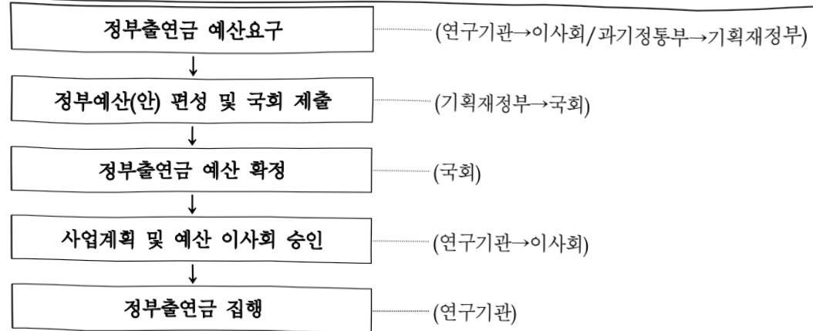

# 한국전자통신연구원연구운영비지원(R&D)

**해당 페이지**: PDF 1716 ~ 1731 쪽 해당

**부처**: 과학기술정보통신부
**분야**: 과학기술
**회계유형**: 일반회계
**2026 확정예산**: 169219.0 백만원
**전년대비 증감률**: 50.3%
**AI 도메인**: R&D 지원

---

<table border=1 style='margin: auto; word-wrap: break-word;'><tr><td style='text-align: center; word-wrap: break-word;'>사 업 명</td></tr><tr><td style='text-align: center; word-wrap: break-word;'>(234) 한국전자통신연구원 연구운영비 지원(R&amp;D) (2241-423)</td></tr></table>

□ 사업 코드 정보

<table border=1 style='margin: auto; word-wrap: break-word;'><tr><td style='text-align: center; word-wrap: break-word;'>구분</td><td style='text-align: center; word-wrap: break-word;'>회계</td><td style='text-align: center; word-wrap: break-word;'>소관</td><td style='text-align: center; word-wrap: break-word;'>실국(기관)</td><td style='text-align: center; word-wrap: break-word;'>계정</td><td style='text-align: center; word-wrap: break-word;'>분야</td><td style='text-align: center; word-wrap: break-word;'>부문</td></tr><tr><td style='text-align: center; word-wrap: break-word;'>코드</td><td rowspan="2">일반회계</td><td rowspan="2">과학기술정보통신부</td><td rowspan="2">연구개발정책실기초원천연구정책관</td><td rowspan="2">-</td><td style='text-align: center; word-wrap: break-word;'>150</td><td style='text-align: center; word-wrap: break-word;'>152</td></tr><tr><td style='text-align: center; word-wrap: break-word;'>명칭</td><td style='text-align: center; word-wrap: break-word;'>과학기술</td><td style='text-align: center; word-wrap: break-word;'>과학기술연구지원</td></tr></table>

<table border=1 style='margin: auto; word-wrap: break-word;'><tr><td style='text-align: center; word-wrap: break-word;'>구분</td><td style='text-align: center; word-wrap: break-word;'>프로그램</td><td style='text-align: center; word-wrap: break-word;'>단위사업</td><td style='text-align: center; word-wrap: break-word;'>세부사업</td></tr><tr><td style='text-align: center; word-wrap: break-word;'>코드</td><td style='text-align: center; word-wrap: break-word;'>2200</td><td style='text-align: center; word-wrap: break-word;'>2241</td><td style='text-align: center; word-wrap: break-word;'>423</td></tr><tr><td style='text-align: center; word-wrap: break-word;'>명칭</td><td style='text-align: center; word-wrap: break-word;'>출연연구기관지원</td><td style='text-align: center; word-wrap: break-word;'>국가과학기술연구회 소관출연연구기관지원</td><td style='text-align: center; word-wrap: break-word;'>한국전자통신연구원 연구운영비 지원(R&amp;D)</td></tr></table>

□ 사업 성격 (공통요구자료 Ⅱ-1 작성유의사항 4. 참조, 해당하는 사항에 “O” 표시)

<table border=1 style='margin: auto; word-wrap: break-word;'><tr><td rowspan="2">신규</td><td rowspan="2">계속</td><td rowspan="2">완료</td><td style='text-align: center; word-wrap: break-word;'>예비타당성</td><td style='text-align: center; word-wrap: break-word;'>총사업비</td><td style='text-align: center; word-wrap: break-word;'>총액계상</td><td style='text-align: center; word-wrap: break-word;'>사업소관 변경정보</td></tr><tr><td style='text-align: center; word-wrap: break-word;'>실시여부</td><td style='text-align: center; word-wrap: break-word;'>관리대상</td><td style='text-align: center; word-wrap: break-word;'>예산사업</td><td style='text-align: center; word-wrap: break-word;'>2025예산 시 소관</td></tr><tr><td style='text-align: center; word-wrap: break-word;'></td><td style='text-align: center; word-wrap: break-word;'>○</td><td style='text-align: center; word-wrap: break-word;'></td><td style='text-align: center; word-wrap: break-word;'></td><td style='text-align: center; word-wrap: break-word;'></td><td style='text-align: center; word-wrap: break-word;'></td><td style='text-align: center; word-wrap: break-word;'></td></tr></table>

□ 사업 지원 형태 및 지원을 (최소한 한 개는 반드시 선택하시오. 해당사항에 0 표시)

<table border=1 style='margin: auto; word-wrap: break-word;'><tr><td style='text-align: center; word-wrap: break-word;'>직접</td><td style='text-align: center; word-wrap: break-word;'>출자</td><td style='text-align: center; word-wrap: break-word;'>출연</td><td style='text-align: center; word-wrap: break-word;'>보조</td><td style='text-align: center; word-wrap: break-word;'>융자</td><td style='text-align: center; word-wrap: break-word;'>국고보조율(%)</td><td style='text-align: center; word-wrap: break-word;'>융자율(%)</td></tr><tr><td style='text-align: center; word-wrap: break-word;'></td><td style='text-align: center; word-wrap: break-word;'></td><td style='text-align: center; word-wrap: break-word;'>○</td><td style='text-align: center; word-wrap: break-word;'></td><td style='text-align: center; word-wrap: break-word;'></td><td style='text-align: center; word-wrap: break-word;'></td><td style='text-align: center; word-wrap: break-word;'></td></tr></table>

☐ 사업 소관부처 및 시행주체

<table border=1 style='margin: auto; word-wrap: break-word;'><tr><td style='text-align: center; word-wrap: break-word;'>사업명</td><td colspan="2">구분</td></tr><tr><td rowspan="2">한국전자통신연구원연구운영비지원(R&amp;D)(2241-423)</td><td style='text-align: center; word-wrap: break-word;'>소관부처</td><td style='text-align: center; word-wrap: break-word;'>연구개발정책실 기초원천연구정책관 연구기관혁신정책과</td></tr><tr><td style='text-align: center; word-wrap: break-word;'>사업시행주체</td><td style='text-align: center; word-wrap: break-word;'>한국전자통신연구원</td></tr></table>

---

### 가. 예산 총괄표

(단위: 백만원, %)

<table border=1 style='margin: auto; word-wrap: break-word;'><tr><td rowspan="2">사업명</td><td rowspan="2">2024년 결산</td><td colspan="2">2025년 예산</td><td colspan="2">2026년 예산</td><td rowspan="2">증감(B-A)</td><td rowspan="2">(B-A)/A</td></tr><tr><td style='text-align: center; word-wrap: break-word;'>본예산</td><td style='text-align: center; word-wrap: break-word;'>추경*(A)</td><td style='text-align: center; word-wrap: break-word;'>요구안</td><td style='text-align: center; word-wrap: break-word;'>본예산(B)</td></tr><tr><td style='text-align: center; word-wrap: break-word;'>한국전자통신연구원연구운영비 지원(R&amp;D)</td><td style='text-align: center; word-wrap: break-word;'>98,670</td><td style='text-align: center; word-wrap: break-word;'>112,587</td><td style='text-align: center; word-wrap: break-word;'>112,587</td><td style='text-align: center; word-wrap: break-word;'>159,323</td><td style='text-align: center; word-wrap: break-word;'>169,219</td><td style='text-align: center; word-wrap: break-word;'>56,632</td><td style='text-align: center; word-wrap: break-word;'>50.3</td></tr></table>

* 추경: 추경증감액을 포함한 최종 예산액을 기재

## □ 기능별(내역사업별) 예산 내역

(단위:백만원)

<table border=1 style='margin: auto; word-wrap: break-word;'><tr><td rowspan="2"></td><td colspan="5">2024</td><td colspan="5">2025</td><td rowspan="2">2026예산</td></tr><tr><td style='text-align: center; word-wrap: break-word;'>예산의(추경)</td><td style='text-align: center; word-wrap: break-word;'>예산현액</td><td style='text-align: center; word-wrap: break-word;'>집행액</td><td style='text-align: center; word-wrap: break-word;'>이월액</td><td style='text-align: center; word-wrap: break-word;'>불용액</td><td style='text-align: center; word-wrap: break-word;'>예산의(추경)</td><td style='text-align: center; word-wrap: break-word;'>예산현액</td><td style='text-align: center; word-wrap: break-word;'>집행액</td><td style='text-align: center; word-wrap: break-word;'>이월액</td><td style='text-align: center; word-wrap: break-word;'>불용액</td></tr><tr><td style='text-align: center; word-wrap: break-word;'>○ 기능별 분류(함께)</td><td style='text-align: center; word-wrap: break-word;'>98,770</td><td style='text-align: center; word-wrap: break-word;'>98,770</td><td style='text-align: center; word-wrap: break-word;'>98,670</td><td style='text-align: center; word-wrap: break-word;'>-</td><td style='text-align: center; word-wrap: break-word;'>100</td><td style='text-align: center; word-wrap: break-word;'>112,587</td><td style='text-align: center; word-wrap: break-word;'>112,587</td><td style='text-align: center; word-wrap: break-word;'>112,517</td><td style='text-align: center; word-wrap: break-word;'>-</td><td style='text-align: center; word-wrap: break-word;'>70</td><td style='text-align: center; word-wrap: break-word;'>169,219</td></tr><tr><td style='text-align: center; word-wrap: break-word;'>• 기관운영비</td><td style='text-align: center; word-wrap: break-word;'>59,586</td><td style='text-align: center; word-wrap: break-word;'>59,586</td><td style='text-align: center; word-wrap: break-word;'>59,486</td><td style='text-align: center; word-wrap: break-word;'>-</td><td style='text-align: center; word-wrap: break-word;'>100</td><td style='text-align: center; word-wrap: break-word;'>61,343</td><td style='text-align: center; word-wrap: break-word;'>61,343</td><td style='text-align: center; word-wrap: break-word;'>61,273</td><td style='text-align: center; word-wrap: break-word;'>-</td><td style='text-align: center; word-wrap: break-word;'>70</td><td style='text-align: center; word-wrap: break-word;'>73,425</td></tr><tr><td style='text-align: center; word-wrap: break-word;'>• 주요사업비</td><td style='text-align: center; word-wrap: break-word;'>39,184</td><td style='text-align: center; word-wrap: break-word;'>39,184</td><td style='text-align: center; word-wrap: break-word;'>39,184</td><td style='text-align: center; word-wrap: break-word;'>-</td><td style='text-align: center; word-wrap: break-word;'>-</td><td style='text-align: center; word-wrap: break-word;'>51,244</td><td style='text-align: center; word-wrap: break-word;'>51,244</td><td style='text-align: center; word-wrap: break-word;'>51,244</td><td style='text-align: center; word-wrap: break-word;'>-</td><td style='text-align: center; word-wrap: break-word;'>-</td><td style='text-align: center; word-wrap: break-word;'>95,794</td></tr></table>

---

### 나. 사업설명자료

## 1 ) 사업목적·내용

- (연구개발인건비) 기관 고유임무 수행에 필요한 인건비

- (연구개발경상경비) 기관 고유임무 수행에 필요한 경상경비

- (연구개발장비·시스템구축비) 주요사업 연구 수행을 위한 장비 구입비 지원

- (연구개발활동비 등) 기관 R&R 및 국가전략기술 등 정부정책과 연계한 미래 선점형 핵심 원천연구 및 기술 원천성 중심의 차별화된 주요사업 추진

(내역사업①: 핵심원천기술개발) 차세대 입체통신, AI·로보틱스, AI 반도체, 디스플레이 등 핵심 ICT 분야 전반에 걸쳐 기술 패러다임 전환을 주도할 수 있는 원천기술을 선제 확보함으로써 미래 디지털 사회를 선도할 기술 주권과 산업 경쟁력 강화

(내역사업②: 첨단융합기술개발) 도메인 특화형 ICT 융합·지능 기술을 개발을 통하여 도시 극한호우를 비롯하여 첨단 바이오, 산업 지능화 등 다양한 사회·공공 문제 해결을 지원

(내역사업③: 사업화촉진 및 지역 전략산업육성) ICT 연구개발 성과의 사업화 촉진 및 기업 혁신성장 지원, 사업화 전략 및 성과활용 촉진체계 운영, 기술창업 및 사업화기업의 기술 경쟁력 강화를 통화여 연구개발 결과물의 활용성 극대화 및 지역특화·전략산업 연계 ICT 융합 지능화 솔루션 기술 개발 및 지역기업 기술사업화 지원을 통하여 지역 발전의 기반이 되는 기술 성과확산 및 중소기업 기술력 강화

· (내역사업④: 차차세대 미래원천 연구) 신개념 창의기술 및 차차세대 신소재·신소자원천기술을 개발함으로써, 2030년까지 미래 인공지능·ICT 핵심 부품 및 원천기술의 선제적 확보를 통해 글로벌 기술 경쟁력을 선도하고 미래 산업 생태계의 기반을 마련

(내역사업⑤:ICT 기술전략 및 전략기술 표준화 사업) 국가 디지털 경쟁력 강화를 위한 전략기술 중심의 정책 수립, 표준화 추진, 기술전략 수립을 통합적으로 수행하여, 디지털 기술패권 시대에서의 선제적 대응 지원

---

(내역사업6_전략연구사업: 3GPP NIN Positioning 기반 저궤도 위성 항법·통신 통합 핵심기술 개발)

저궤도 위성 기반의 위성항법 통신 통합 탑재체 핵심 기술 개발을 통한 고정밀

항법서비스 및 위성통신 제공 및 3GPP NTN Positioning 국제 표준 선도

(내역사업⑦_전략연구사업: 3GPP IoT-NIN 표준 기반 Regenerative IoT 위성(탑재체) 발사 및 서비스)

6G 시대 글로벌 초연결 네트워크 실현을 위한 초소형 위성 기반 6G IoT-NTN 핵심 기술 개발 및 표준 IPR 확보

(내역사업⑧_전략연구사업: 사용자 맞춤형 형상 프리폼 미래 디스플레이 개발)

사물일체형 자유곡면/물입형 구면 프리폼 디스플레이 패널 기술 및 프리폼 디스플레이를 위한 Adaptive 미디어 기술 개발

(내역사업⑨_전략연구사업: 고집적 반도체 무열성 장비 및 소재 개발) 해외 기업

원천기술에 100% 종속된 반도체 첨단 패키징 접합 소재의 기술 한계를 극복하는

무열성(athermal) 신소재 및 신공정(장비) 원천기술 개발 및 상용화

(내역사업⑩_전략연구사업: 독자 피지컬AI-소형컴퓨터와 이를 적용한 소프트슈트 개발)

피지컬AI-소형컴퓨터 독자 개발과 이를 적용한 소프트슈트를 통해, 인간 중심의 피지컬 AI 실현형 융합 디바이스 확보

(내역사업①_전략연구사업:과학특화 멀티모달 과운데이션 모델 개발 및 적용)

다학제 연구분야에서 활용가능한 과학 공용 멀티모달 과운데이션 모델을 개발하여 연구분야별 AI 확산의 신속성·효율성을 높이고 AI 연구동료(AI Co-Scientist)로의 확장 가속화

(내역사업2_전답연구사업: 개인 AI 에이전트를 위한 AI-인글라스 기술 개발)

초연결·초실감·초공간·초개인화 역량을 갖춘 국방 특화 AI·인글라스 핵심 원천기술을

확보하고, 이를 기반으로 전장 상황 인지·판단·결심을 지원하는 AI·글라스 프레임워크를

구축하여 실전적 운용 실증을 달성

(내역사업 $ ^{13} $ 전략연구사업: 종양 실시간 정밀분석 분자 내시경 개발) 세포 수준의 실시간 진단과 AI 기반 정밀 분석 기술을 융합하여, 조기암 발견의 패러다임을 전환하고, 국민 건강 증진과 의료 공공성 강화를 선도하는 국가 주도 미래 의료 플랫폼 구축

·(내역사업14_전략연구사업: 차세대 엑스선 리소그래피 기술 개발) 차세대 리소그래피 기술 개발을 통해 10nm 이하급 엑스선 기반 반도체 공정 장비의 글로벌 기술을 선도

(내역사업15_전략연구사업:항로표지 기반 해양IoT 무선통신 체계 기술개발)

해양 빅데이터 수집 강화 및 해양 사물간 연계 확대를 위해 항로표지를 활용한 해양IoT

무선통신 체계 기술개발

---

## 2 ) 사업개요

## □ 사업근거 및 추진경위

① 법령상 근거 및 조항 적시 : 과학기술분야 정부출연연구기관 등의 설립·운영 및 육성에 관한 법률 제5조(운영 재원), 동법 제8조(연구기관의 설립) 및 별표

<table border=1 style='margin: auto; word-wrap: break-word;'><tr><td style='text-align: center; word-wrap: break-word;'>관련 조문</td><td style='text-align: center; word-wrap: break-word;'>별표</td></tr><tr><td rowspan="3">[과학기술분야 정부출연연구기관 등의 설립·운영 및 육성에 관한 법률]제5조(운영 재원) ① 연구기관 및 연구회는 정부의 출연금과 그 밖의 수익금으로 운영한다.② 정부는 연구기관 및 연구회의 설립·운영에 드는 경비에 충당하기 위하여 예산의 범위에서 연구기관 및 연구회에 출연금을 지급할 수 있다. 이 경우 정부는 연구기관 및 연구회의 지속적이고 안정적인 운영을 위하여 필요한 재원이 마련될 수 있도록 노력하여야 한다.제8조(연구기관의 설립) ① 이 법에 따라 설립되는 연구기관은 별표와 같다.</td><td style='text-align: center; word-wrap: break-word;'>· 육성기술분야 정부출연연구기관 등의 설립·운영 및 육성에 관한 법률 [명 42] &lt;육성 2024.1.10.&gt; 이 법에 따라 설립되는 연구기관(육성조사11창건)</td></tr><tr><td style='text-align: center; word-wrap: break-word;'>· 기관 개발</td></tr><tr><td style='text-align: center; word-wrap: break-word;'>1. 한국채팅기술연구원2. 한국기초채팅지원연구원3. 삭제 &lt;2024.1.26.&gt;4. 한국생명공학연구원5. 한국채팅기술정보연구원6. 한국환육의학연구원7. 한국생명기술연구원8. 한국환육의학연구원9. 한국환육기술연구원10. 한국환육기술연구원11. 한국표준채팅연구원</td></tr></table>

## ② 추진경위

- 과기출연기관법에 근거하여, 정부가 출연하고 과학기술분야의 연구를 주된 목적으로 설립된 한국전자통신연구원의 운영 재원 및 기본사업 운영을 위한 출연금 지급

-기관연혁

(1976.12.) 한국전자기술연구소 설립(상공부),

한국과학기술연구소 부설 한국전자통신연구소 설립(과기처)

·(1977.12.) 한국통신기술연구소로 개편(체신부)

·(1981.01.)한국전기통신연구소로 개편(과기처)

·(1985.03.)한국전자통신연구소(ETRI)로 개편

(1992.03.) 과기처에서 체신부로 소관부처 변경

(1997.01.) 한국전자통신연구원으로 명칭 변경

·(2004.10.)과학기술부로 소관부처 변경

·(2008.02.)지식경제부로 소관부처 변경

·(2013.03.) 미래창조과학부로 소관부처 변경

(2017.07.) 과학기술정보통신부로 소관부처 변경

---

## 주요내용

① 사업규모

- 총사업비 : 해당없음

- 사업기간 : 1976년 ~ 계속

- 최근 5년 간 투입된 사업비(예산액기준, 추경편성한 연도에는 추경포함)

<table border=1 style='margin: auto; word-wrap: break-word;'><tr><td style='text-align: center; word-wrap: break-word;'>연도</td><td style='text-align: center; word-wrap: break-word;'>2022</td><td style='text-align: center; word-wrap: break-word;'>2023</td><td style='text-align: center; word-wrap: break-word;'>2024</td><td style='text-align: center; word-wrap: break-word;'>2025</td><td style='text-align: center; word-wrap: break-word;'>2026</td></tr><tr><td style='text-align: center; word-wrap: break-word;'>사업비</td><td style='text-align: center; word-wrap: break-word;'>102,537</td><td style='text-align: center; word-wrap: break-word;'>109,994</td><td style='text-align: center; word-wrap: break-word;'>98,770</td><td style='text-align: center; word-wrap: break-word;'>112,587</td><td style='text-align: center; word-wrap: break-word;'>169,219</td></tr></table>

* '24년부터 시설 지원 사업은 한국전자통신연구원 시설 지원(R&D)으로 분리 작성

- 기타: 해당없음

② 사업추진체계

- 사업시행방법 : 출연

- 사업시행주체 : 한국전자통신연구원

- 사업 수혜자 : 산업계, 학계, 연구계, 공공부문 및 일반 국민

- 보조, 융자, 출연, 출자 등의 경우 보조·융자 등 지원 비율 및 법적근거

<table border=1 style='margin: auto; word-wrap: break-word;'><tr><td style='text-align: center; word-wrap: break-word;'>내역사업명</td><td style='text-align: center; word-wrap: break-word;'>구분</td><td style='text-align: center; word-wrap: break-word;'>피보조·피출연 등 기관명</td><td style='text-align: center; word-wrap: break-word;'>지원 금액 (2026예산)</td><td style='text-align: center; word-wrap: break-word;'>지원 비율(%)</td><td style='text-align: center; word-wrap: break-word;'>보조율 법적근거 (해당 조항)</td></tr><tr><td style='text-align: center; word-wrap: break-word;'>한국전자 통신연구원 연구운영비 지원(R&amp;D)</td><td style='text-align: center; word-wrap: break-word;'>출연</td><td style='text-align: center; word-wrap: break-word;'>한국전자 통신 연구원</td><td style='text-align: center; word-wrap: break-word;'>169,219</td><td style='text-align: center; word-wrap: break-word;'>100</td><td style='text-align: center; word-wrap: break-word;'>과학기술분야 정부출연연구기관 등의 설립·운영 및 육성에 관한 법률 제5조(운영 재원) 제1항, 제2항</td></tr></table>

---

## 3 ) 2026년도 예산 산출 근거

## ①연구개발인건비

:(2025)57,668백만원→(2026)69,603백만원,11,935백만원 증액

- (반영) 정부출연(연) 기관 고유 임무의 안정적 수행을 위해 기관 운영 필수재원인 인건비의 안정성 확보 추진

- (산출) 기관 안정적 운영 및 고유 임무 강화를 위한 안정인건비 9,896백만원

'25년 신규증원 인건비(1명, 6개월분) 20백만원

'26년 처우개선분 3.5% 2,019백만원

## ②연구개발경상경비

:(2025)3,675백만원→(2026)3,822백만원,147백만원 증액

- (반영) 정부출연(연) 기관 고유 임무의 안정적 수행을 위해 기관 운영 필수재원인 경상경비의 안정성 확보 추진

- (산출) 경상비 효율화 △64백만원

공공요금 인상분 97백만원

자회사분담금 증액분 50백만원

재산세 증가분 64백만원

## ③ 주요사업비 (연구개발장비·시스템구축비, 연구개발활동비)

:(2025)51,244백만원→(2026)95,794백만원,44,550백만원증액

- (반영) 기관 R&R 및 국가정책과 연계한 투자 포트폴리오 수립을 통한 전략적 성과 창출 기반 마련

- (산출) 계속과제 △4,102백만원(신규 단위사업 3,500백만원 지출효율화 △7,602백만원 지체효율화 △320, 재투자 320) 전략연구사업 48,652백만원

02025년도 예산 및 2026년도 예산 산출 세부내역 비교

<table border=1 style='margin: auto; word-wrap: break-word;'><tr><td colspan="2">2025년 본예산</td><td colspan="2">2026년 예산</td></tr><tr><td style='text-align: center; word-wrap: break-word;'>예산</td><td style='text-align: center; word-wrap: break-word;'>산출내역</td><td style='text-align: center; word-wrap: break-word;'>예산</td><td style='text-align: center; word-wrap: break-word;'>산출내역</td></tr><tr><td style='text-align: center; word-wrap: break-word;'>112,587</td><td style='text-align: center; word-wrap: break-word;'>○ 연구개발인건비(360-01): 57,668백만원가. 인건비(57,668백만원)• 인건비: 1개×57,668백만×100%×12/12개월○ 연구개발경상경비(360-02): 3,675백만원가. 경상경비(3,675백만원)• 경상경비: 1개×3,675백만×100%×12/12개월○ 연구개발장비·시스템구축비(360-04): 715백만원가. 장비비(715백만원)• 장비비: 12개×60백만×100%×12/12개월 = 715백만원○ 연구개발활동비 등(360-05): 50,529백만원가. 인간중심으로 자율지능과 공존하는 초지능 정보사회 기반 제공: 3개×3,209백만×100%×12/12개월 = 9,627백만원나. 성능한계를 극복하는 초성능 컴퓨팅 실현: 4개×1,803백만×100%×12/12개월 = 7,212백만원다. 안전하고 스마트한 초연결 인프라 구현: 2개×1,851백만×100%×12/12개월 = 3,701백만원라. 소통과 체험을 극대화 하는 초실감 서비스 구현: 3개×2,715백만×100%×12/12개월 = 8,144백만원마. 국가지능화 융합기술 개발로 혁신성장 동인 마련: 7개×2,043백만×100%×12/12개월 = 14,300백만원바. ICT 장의기술 확보 및 소재·부품·장비 기술자립: 2개×2,096백만×100%×12/12개월 = 4,192백만원사. 중소기업 동반성장 및 기술사업화 성과확산 사업: 1개×3,353백만×100%×12/12개월 = 3,353백만원</td><td style='text-align: center; word-wrap: break-word;'>169,219</td><td style='text-align: center; word-wrap: break-word;'>○ 연구개발인건비(360-01): 69,603백만원가. 인건비(69,603백만원)• 인건비: 1개×69,603백만×100%×12/12개월○ 연구개발경상경비(360-02): 3,822백만원가. 경상경비(3,822백만원)• 경상경비: 1개×3,822백만×100%×12/12개월○ 연구개발장비·시스템구축비(360-04): 715백만원가. 장비비(715백만원)• 장비비: 12개×60백만×100%×12/12개월 = 715백만원○ 연구개발활동비 등(360-05): 95,079백만원가. 핵심원전기술개발: 8개×2,655백만×100%×12/12개월 = 21,240백만원나. 첨단융합기술개발: 3개×1,653백만×100%×12/12개월 = 4,958백만원다. 사업화 촉진 및 지역 전략산업 육성: 4개×2,634백만×100%×12/12개월 = 10,536백만원라. 차차세대 미래원전 연구: 2개×2,373백만×100%×12/12개월 = 4,746백만원마. ICT 미래전략 및 전략기술 표준화 사업: 2개×2,314백만×100%×12/12개월 = 4,627백만원바. (전략연구사업, T형) 3GPP NTN Positioning 기반 저궤도 위성항법·통신 통합 핵심기술 개발: 1개×5,535백만×100%×12/12개월 = 5,535백만원사. (전략연구사업, P형) 3GPP IoT·NTN 표준 기반 Regenerative IoT 위성(탑재제) 발사 및 서비스</td></tr></table>

---

<table border=1 style='margin: auto; word-wrap: break-word;'><tr><td colspan="2">2025년 본예산</td><td colspan="2">2026년 예산</td></tr><tr><td style='text-align: center; word-wrap: break-word;'>예산</td><td style='text-align: center; word-wrap: break-word;'>산출내역</td><td style='text-align: center; word-wrap: break-word;'>예산</td><td style='text-align: center; word-wrap: break-word;'>산출내역</td></tr><tr><td style='text-align: center; word-wrap: break-word;'></td><td style='text-align: center; word-wrap: break-word;'></td><td style='text-align: center; word-wrap: break-word;'></td><td style='text-align: center; word-wrap: break-word;'>: 1개×3,642백만×100%×12/12개월 = 3,642백만원
야. (전략연구사업, P형) 사용자 맞춤형 영상 프리품 미래 디스플레이 개발
: 1개×4,151백만×100%×12/12개월 = 4,151백만원
자. (전략연구사업, P형) 고집적 반도체 무열성 장비 및 소재 개발
: 1개×6,919백만×100%×12/12개월 = 6,919백만원
차. (전략연구사업, P형) 독자 피지컬AI-소형컴퓨터와 이를 적용한
소프트슈트 개발
: 1개×6,919백만×100%×12/12개월 = 6,919백만원
카. (전략연구사업, P형) 과학특화 멀티모달 파운데이션 모델 개발 및 적용
: 1개×4,370백만×100%×12/12개월 = 4,370백만원
타. (전략연구사업, P형) 개인 AI 에이전트를 위한 AI-인글라스 기술개발
: 1개×6,919백만×100%×12/12개월 = 6,919백만원
파. (전략연구사업, P형) 종양 실시간 정밀분석 분자 내시경 개발
: 1개×3,642백만×100%×12/12개월 = 3,642백만원
하. (전략연구사업, T형) 차세대 역시선 리소그래피 기술개발
: 1개×3,642백만×100%×12/12개월 = 3,642백만원
거. (전략연구사업, P형) 향로표지기반 해양IoT 무선통신 기술체계 개발
: 1개×2,913백만×100%×12/12개월 = 2,913백만원
너. (장비비) 1개×320백만×100%×12/12개월 = 320백만원</td></tr></table>

## 4 ) 사업효과

## 사업영향, 산출물 성과지표 등

① 2022~2026년도 성과계획서 상 성과지표 및 최근 5년간 성과 달성도: 해당없음

※ 과학기술계 출연연 출연금 사업의 경우 성과관리 비대상사업으로 분류되어 '18년 성과계획서부터 제외

---

② 성과지표 이외의 연도별 사업추진 경과 및 실적

<table border=1 style='margin: auto; word-wrap: break-word;'><tr><td style='text-align: center; word-wrap: break-word;'>2022</td><td style='text-align: center; word-wrap: break-word;'>☐ 금액: 102,537백만원
☐ 산출근거
○ 기관운영비: 50,432백만원
- 인건비: 46,717백만원, 경상경비: 3,715백만원
○ 주요사업비: 49,845백만원
- 인간 중심으로 자율지능과 공존하는 초지능 정보사회 기반 제공: 7,488백만원
- 성능한계를 극복하는 초성능 컴퓨팅 실현: 1,542백만원
- 안전하고 스마트한 초연결 인프라 구현: 6,711백만원
- 소통과 체험을 극대화하는 초실감 서비스 구현: 5,863백만원
- 국가지능화 융합기술 개발로혁신성장 동인 마련: 12,975백만원
- ICT 장의기술 확보 및 소재·부품·장비 기술자립: 10,568백만원
- 중소기업 동반성장 및 기술사업화 성과확산사업: 2,984백만원
- 장비·시스템구축비: 1,714백만원
○ 시설비: 2,260백만원
- 노후시설보수사업: 2,260백만원</td></tr><tr><td style='text-align: center; word-wrap: break-word;'>2023</td><td style='text-align: center; word-wrap: break-word;'>☐ 금액: 109,994백만원
☐ 산출근거
○ 기관운영비: 53,734백만원
- 인건비: 49,944백만원, 경상경비: 3,790백만원
○ 주요사업비: 53,429백만원
- 인간 중심으로 자율지능과 공존하는 초지능 정보사회 기반 제공: 7,517백만원
- 성능한계를 극복하는 초성능 컴퓨팅 실현: 4,748백만원
- 안전하고 스마트한 초연결 인프라 구현: 6,522백만원
- 소통과 체험을 극대화하는 초실감 서비스 구현: 6,723백만원
- 국가지능화 융합기술 개발로혁신성장 동인 마련: 16,602백만원
- ICT 장의기술 확보 및 소재·부품·장비 기술자립: 6,502백만원
- 중소기업 동반성장 및 기술사업화 성과확산사업: 3,163백만원
- 장비·시스템구축비: 1,652백만원
○ 시설비: 2,831백만원
- 노후시설보수사업: 2,831백만원</td></tr><tr><td style='text-align: center; word-wrap: break-word;'>2024</td><td style='text-align: center; word-wrap: break-word;'>☐ 금액: 98,770백만원
☐ 산출근거
○ 기관운영비: 59,586백만원
- 인건비: 55,969백만원, 경상경비: 3,617백만원
○ 주요사업비: 39,184백만원
- 인간 중심으로 자율지능과 공존하는 초지능 정보사회 기반 제공: 6,616백만원
- 성능한계를 극복하는 초성능 컴퓨팅 실현: 2,772백만원
- 안전하고 스마트한 초연결 인프라 구현: 3,606백만원
- 소통과 체험을 극대화하는 초실감 서비스 구현: 5,388백만원
- 국가지능화 융합기술 개발로혁신성장 동인 마련: 11,158백만원
- ICT 장의기술 확보 및 소재·부품·장비 기술자립: 4,412백만원
- 중소기업 동반성장 및 기술사업화 성과확산사업: 3,163백만원
- 장비·시스템구축비: 2,069백만원</td></tr><tr><td style='text-align: center; word-wrap: break-word;'>2025</td><td style='text-align: center; word-wrap: break-word;'>☐ 금액: 112,587백만원
☐ 산출근거
○ 기관운영비: 61,343백만원
- 인건비: 57,668백만원, 경상경비: 3,675백만원
○ 주요사업비: 51,244백만원
- 인간 중심으로 자율지능과 공존하는 초지능 정보사회 기반 제공: 9,627백만원
- 성능한계를 극복하는 초성능 컴퓨팅 실현: 7,212백만원
- 안전하고 스마트한 초연결 인프라 구현: 3,701백만원
- 소통과 체험을 극대화하는 초실감 서비스 구현: 8,144백만원
- 국가지능화 융합기술 개발로혁신성장 동인 마련: 14,300백만원
- ICT 장의기술 확보 및 소재·부품·장비 기술자립: 4,192백만원
- 중소기업 동반성장 및 기술사업화 성과확산사업: 3,353백만원
- 장비·시스템구축비: 715백만원</td></tr></table>

---

③향후(2026년도 이후)기대효과

<table border=1 style='margin: auto; word-wrap: break-word;'><tr><td style='text-align: center; word-wrap: break-word;'>핵심원전기술개발</td><td style='text-align: center; word-wrap: break-word;'>○ 6G 초공간 입체통신 기술개발- 6G IoT-NTN 초공간 통신 기술, 6G NTN 모바일 코어 기술, 6G NTN 위성 간데이터 송신용 빙조향 침/모듈, 6G NTN 핵심 침 파운드리 기술 등 연결의 한계를 극복하는 입체통신 실현을 위한 6G 초공간 핵심기술 확보- 6G IoT-NTN 핵심기술 확보로 초연결 네트워크 실현을 위한 미래 통신기술을 선도하고, 지상 IoT 단말과의 연동을 통해 보다 많은 데이터 수집을 통한 예측 정확도 향상- 6G NTN용 핵심 통신 부품 국산화를 위한 화합물반도체 파운드리 공정 고도화 및 산학연 협력을 통한 통신 부품 기업의 기술 자립화 지원○ 체화형 자율성장 인공지능·로보틱스 기술개발- 2030년까지 인간대비 70% 정확도로 현실세계 학습, 지식성장 및 행동 가능한 체화형 자율성장 AI 기술 개발- 정형화된 데이터에만 의존하지 않고 실시간 변화에 반응하며 스스로 학습하기 때문에, 예측이 어려운 상황이나 돌발적인 문제에도 유연하게 대처하고, 재난 대응, 고객 응대, 로봇 제어 등 고변동 환경에서의 안정적인 시스템 운용이 가능- 스스로 학습·성장하며 판단·예측이 가능한 차세대 핵심기술로써, 기존 언어처리, 시각처리, 음성처리 기술의 한계를 극복하는 차세대 기반기술로 활용 가능- 사람과 유사한 감각 및 동작 수행이 가능한 로봇 기술로 고령자 돌봄, 재활, 일상 지원 등 다양한 분야에서 사람·로봇 간 상호작용 기반의 안전하고 포용적인 사회 구현에 기여 가능○ AI·빅데이터 기반 고신뢰 정책지능 기술개발- 국가 차원의 거시·미시 정책 의사결정을 지원할 수 있는 국가 정책지능 기반 조성- 국가 운용 효율화를 달성함으로써 국민의 삶의 안정과 정부 차원의 국민적 신뢰를 회복하고, 근거 기반의 정책추진을 위한 토대를 확립하는 데 기여- 데이터를맺품정부가 지향하는 공공행정 과학화의 중요적용사례 창출 및 국가적 임무와 글로벌 난제 해결의 고도화된 중요 정책 수립에 기여○ 대규모 생성형 AI 병렬컴퓨팅 기술개발- Trillion급 대규모 생성형 인공지능 모델의 연산 한계를 극복하는 이종 가속기 기반 대규모 AI 병렬컴퓨팅 기술 개발 및 인공지능반도체 N-LAB 지원- 초거대 생성형 인공지능 모델의 병렬 추론을 위해 다수의 이종 가속기간 데이터 이동을 최적화하고, 이종 실행환경을 통합하는 AI 병렬 컴퓨팅 원천 기술 확보- 각 산업 도메인 전문가의 IT 기술 장벽을 제거하여 기업의 혁신적 아이디어를 낮은 비용으로 쉽게 실현할 수 있는 기술 기반 마련 가능○ 광기반 양자컴퓨팅 기술개발- 연속변수 기반 양자광학 원천기술 확보를 통한 기술 선진국과의 기술 격차 극복, 기술종속성 탈피 및 글로벌 시장 경쟁력 확보- 인공지능에 특화된 양자 알고리즘으로 복잡한 계산의 고속 연산이 가능하고, 슈퍼컴퓨터 대비 1/600 수준의 전력소모로 구현- 연산능력 증대로 다양한 물질/바이러스에 대한 분석이 가능해져 질병 진단 및 신약 개발의 시간적, 경제적 비용 절감 가능○ 데이터 보안 및 장비 보안성 검증 기술개발- 현재 양자 기반 암호 기술 분야의 발전은 디지털 암호의 다양한 기반 기술이 확립되었던 70~80년대와 유사하여 원천 기술 확보를 위한 선행적 연구를 통해 향후 양자 암호 시대 선도 가능- 양자 기반 암호체계 기술 개발을 통해 기존 디지털 암호로 제공할 수 없던 데이터 보호 기술을 제공함으로써, 데이터 프라이버시를 완벽 보장하여 디지털 사회의 안전과 보안에 기여- 양자 현상 활용을 통해 현재 디지털 암호 기술로 해결이 어려운 사이버보안 기반 문제에 대한 해결책 제시 기대○ 실/가상 융합 공간미디어 및 상호작용 기술개발- 기존의 수동적인 평면 미디어에서 3차원 시공간 내 자유로운 시점이동 및 인터랙션이 가능한 완전 자유도 공간미디어로의 미디어 패러다임 변화 주도</td></tr></table>

## 핵심원천기술 개발

---

<table border=1 style='margin: auto; word-wrap: break-word;'><tr><td style='text-align: center; word-wrap: break-word;'>첨단융합기술개발</td><td style='text-align: center; word-wrap: break-word;'>- 저지연/고품질/고효율 음향 압축기술의 개발로 미래 완전자유도 공간미디어 서비스로 변화하는 미디어 페리다임 변화에 적극적인 대처 가능 - 콘텐츠 제작 및 영상 품질 한계에 의해 시장성장이 지체되고 있는 VR 산업을 파괴적으로 혁신할 수 있는 공간미디어 기술 개발을 통한 글로벌 시장 선점 기대 ○ 초실감 공간 소자 기술 연구 - 착용형 AR/VR 디스플레이 핵심 기술 선점을 통한 선도 국가로서의 기술 초격차 유지 - 유리공정 기반 초실감 AR/VR 디스플레이 기술은 경쟁국의 온실리콘 기술 대비 차별화된 접근 방식을 제시하여 생산방식에 혁신을 가져온 것으로 기대 - 공간표시 디스플레이를 기반으로 하는 새로운 UI/UX는 디지털 기기에 대한 접근성을 개선하여 세대간, 계층간 정보 격차를 해소하는 역할 및 실제와 가상공간이 융합된 새로운 사용자 경험 제공이 가능하여 정보 격차 해소를 통한 삶의 질 향상에 기여 ○ &#x27;26년 예상 주요 정량 성과 - 국내외 논문 41건, 국내 특허 출원 33건, 국제 특허 출원 14건</td></tr><tr><td style='text-align: center; word-wrap: break-word;'>첨단융합기술개발</td><td style='text-align: center; word-wrap: break-word;'>○ 산업융합 지능화 연구 - 도심항공모빌리티의 완전자율비행 및 CNSi(통신, 항법, 감시, 정보) 인프라(운항공역, 버티포트 등) 분야에서 상용화 서비스에 필요한 첨단 AI 연계 영상정보 기반 대체 측위 기술을 확보 - AAM의 성숙기에 맞춰 도심에서 운용이 가능한 AAM 자율 비행을 지원하는 기술을 산업에 적용함으로써 국내 업체의 미래 에어모빌리티의 시장 지배력 강화에 기여 - 기존의 시각 데이터에 촉각과 역감 데이터를 추가한 멀티모달 인지 기술은 자율 조작(Manipulation)에 중요한 피드백 정보로 활용되어 조작 정밀도를 크게 진보시킬 것으로 기대 ○ 자율조절 시력증강 및 시력확장 연구 - 전 세계적으로 기술개념 정립 단계인 다중 감각 융합기술의 IPR 선점이 가능하며, 세계 최초로 교육 이론에 기반한 학습 모델 정립을 통해 개발 기술의 활용을 촉진시킬 수 있는 기반 구축 - 복잡한 영상 장면에 대한 설명 가능한 해석을 제공하는 기반 기술로 차세대 인공지능 기반 시각 인식 기술로 확장될 수 있어 파급력이 높음 - 의료용 질병 진단, 산업용 검사, 식품 안전 관리, 작물 상태 모니터링, 구조물 이상 탐지 등 다양한 영역에서 기존 장비에 접목할 수 있어 시장 확대 가능 ○ 도시 극한호우 대응 플랫폼 - 지상, 지표, 지하 데이터를 종합적으로 활용하는 통합 도시침수 예측 및 분석 기술을 개발하여 기존의 단편적인 침수 대응 방법을 혁신 - 도시침수-복합재난 시나리오 생성 기술을 통해 도시침수로 인한 다양한 자연 및 사회재난에 대한 연계 시나리오 생성 기술 확보 - 예정보 매체 다변화 등 상황전과 서비스 기술 개발을 통해 모든 시민이 도시침수 정보를 제공받을 수 있으며, 재난 대응의 신속성과 효율성을 높여 인명 피해와 재산 손실을 최소화함으로써 사회적 비용 절감 가능 ○ &#x27;26년 예상 주요 정량 성과 - 국내외 논문 19건, 국내 특허 출원 11건, 국제 특허 출원 5건</td></tr><tr><td style='text-align: center; word-wrap: break-word;'>사업화촉진 및 지역 전략산업육성</td><td style='text-align: center; word-wrap: break-word;'>○ ETRI 사업화 촉진 - 시장지향형 기술사업화 메커니즘 구축에 따른 기술사업화 선준환구조 확립으로 출연(연), 기술거래기관, 가치평가기관, 기술금융기관, 중소·중견기업 등 가치사슬상의 모든 혁신주체에게 파급효과를 제공 - 연구개발로 창출된 연구성과의 폭넓은 활용을 위해 사업화 대상기술 발굴·관리체계를 강화하고, 사업화 대상 기술이 신속하고 효율적으로 산업계로 제공되도록 확산체계를 구축 - 중소·중견기업의 연구성과 활용이 사업화 성과로 이어지도록 연구성과 활용·상용화 지원의 연계체계 구축 및 능동적인 기술상용화 지원 강화 ○ 호남권 전략산업(광용함·에너지·AI 등) 기술 고도화 및 사업화 - 국내 에너지산업, 시스템산업, 광산업, 서비스산업, 디지털 가전산업 및 지역산업체와 연계 · 협력하여 에너지설비 분야 CPS AI 관제 출루선 및 디지털 트런 O&amp;M 플랫폼을 공동개발하고, 테스트베드 실험적용 및 상용화 촉진</td></tr></table>

---

<table border=1 style='margin: auto; word-wrap: break-word;'><tr><td style='text-align: center; word-wrap: break-word;'></td><td style='text-align: center; word-wrap: break-word;'>- 다양한 무인이동체 산업체와의 협업을 통한 무인이동체 지능화 플랫폼 기술의 조기 시장진출 추진- 지역 산업과의 협력을 통한 기술 확산 및 중소기업 성장 지원 방안 마련- 대경권 전략산업(로봇·모빌리티·AI·의료 등) 기술 고도화 및 사업화- 지역특화· 지역 수요 기반의 전략산업별 실용화 기술개발을 통해 신산업 핵심 기술 확보, 사업화를 위한 공동연구, 적기 상용화 등 산업 선순환 생태 조성- 다중 사이트 연계 객체 추적 및 재식별 기술 개발은 기존 객체 인식 시스템의 한계를 뛰어넘어, 더욱 정밀하고 일관된 추적 성능을 제공하게 되어 교통관제, 스마트파검, 보안 시스템 등 다양한 분야의 기술 경쟁력 확보- 스마트팜과 자율 농업 기술 도입으로 농업 관련 교육과 훈련 프로그램이 확산되며, 미래 농업 인재를 양성하는 기회 마련. 농업의 전문성과 첨단 기술력을 갖춘 인재의 농업 분야 유입에 기여- 수도권 전략산업(SoC설계·AI·콘텐츠 등) 기술 고도화 및 사업화- 수도권 지역 시스템반도체 또는 인공지능서비스 개발 기업을 대상으로 기술 이전하여 사업화와 동시에 수도권 지자체와 협력하여 민감정보 취급 및 활용 측면의 사회문제 해결형 출투선 실증을 추진- 온오프라인 커뮤니티, 교육 및 플랫폼 구축 등으로 민감데이터 프라이버시 보장 인공지능 서비스를 누구나 손쉽게 인터넷을 통하여 개발할 수 있도록 지원하여 성과 활용 및 확산- 국내 정신건강 전문가 집단의 자문을 기반으로 우울증 스크리닝 도구를 설계하여, 공공 의료 및 보건 산업과 상담 서비스 산업, IoT 산업에 적용되어 일상생활 속 정신건강의 지속적인 케어가 가능해짐에 따른 정신건강 상담 활성화 가능- &#x27;26년 예상 주요 정량 성과- 국내외 특허 출원 25건, 국내외 논문 17건, 지역수요기반 특성화 R&amp;D 사업 발굴 23건 등</td></tr><tr><td style='text-align: center; word-wrap: break-word;'>차차세대 미래원천 연구</td><td style='text-align: center; word-wrap: break-word;'>- 신개념 장의기술 연구- 뉴로모픽 컴퓨팅 반도체 원천기술은 기존의 폰노이만 컴퓨팅의 한계를 극복하기 위해 뇌신경망을 모사하여 초저전력·초고성능 병렬연산이 가능한 차세대 인공지능 반도체 기술로써 다양한 산업에 활용이 기대- 뉴로모픽 컴퓨팅 기술은 세계적으로도 아직 연구개발 초기 단계에 있는 초저전력을 달성할 수 있는 차세대 인공지능 반도체 기술이므로 초저전력이 요구되는 다양한 옛지 디바이스 들에 활용이 예상- 인공지능 기술이 일상화 되면서 스마트홈, 웨어러블 디바이스 등의 엣지 디바이스에 초저전력 뉴로모픽 컴퓨팅 반도체가 널리 사용됨으로써 사회적으로 인공지능 기술의 대중화에 기여함으로써 국민의 일상생활 수준 향상이 기대- 신소재·신소자 원천기술 연구- 최종 개발되는 듀플랙스 반도체 적층 구조는 삼성, TSMC 등에서 상용화를 시작하는 GAA-FET의 차세대 버전으로 기존 칩의 크기에서 더 많은 연산과 기능 구현을 위한 칩 제작이 가능한 것으로 현재의 반도체 집적도 한계를 돌파할 수 있는 혁신적인 기술- 채널 적층형 듀플랙스 FET은 칩의 집적도는 물론 성능 면에서 기존 FinFET보다 우수할 것으로 예상되어 GAA-FET 이후의 미래 반도체로 자리매김하는 효과가 예상- 초실감 상호작용 기반 고부가가치 미디어 콘텐츠 산업과 다양한 산업이 연계하여 신산업 생태계를 구축- 세계적으로도 아직 연구 초기 단계에 해당되어 미국, 일본 등과 경쟁 구도에 있으며 기술 선점을 통해 기존 반도체 소자 뿐만 아니라 차세대 첨단 반도체, 뉴로모픽 AI 반도체, 센서, 바이오 소자 및 반도체 장비 등 다양한 분야에 활용- &#x27;26년 예상 주요 정량 성과- 국내외 논문 10건, 국내 특허 출원 11건, 국제 특허 출원 6건</td></tr><tr><td style='text-align: center; word-wrap: break-word;'>ICT 기술전략 및 전략기술</td><td style='text-align: center; word-wrap: break-word;'>- ICT 기술전략 및 기술정책 연구- 선도적 기술개발로 세계적 영향력을 획득하고 차별화된 기획 환경 조성을 수행하며</td></tr></table>

---

<table border=1 style='margin: auto; word-wrap: break-word;'><tr><td style='text-align: center; word-wrap: break-word;'>표준화 사업</td><td style='text-align: center; word-wrap: break-word;'>미래 기술 어젠다를 선제적으로 제시하는 글로벌 기관으로 발돋움 - 미래를 대비하는 R&amp;D 기획 전단계의 제반 연구와 원내 의사결정 그룹과의 공유를 통해 ETRI R&amp;D의 선행적 기획 기반 확보 - 연구현장 전문성의 반영한 ICT 미래 방향 제시를 통해 ICT 산업 성장과 활성화에 기여 - 고탁기술표준화 연구 - 고도화된 표준화 거버넌스 체계는 향후 ETRI의 국제표준 전략 수립 및 대응 역량의 핵심 기반으로 활용되며, 전사 차원의 표준화 기획 및 실행력 제고에 기여 - 국제표준화 전략 수립, 표준특허 확보 모드맵, 전문조직 운영 등은 중점 전략기술을 중심으로 한 R&amp;D-표준화 연계를 가능하게 하며, ETRI R&amp;D 성과의 국제표준 선도로의 전환을 가속화 - SOL 3.0 기반의 표준화 정보 플랫폼과 정량적 통계자료는 향후 경영평가, 개인평가, 과제성과 분석 등 다양한 내외부 정책·관리 지표로 활용 - &#x27;26년 예상 주요 정량 성과 - 국내외 논문 12건, 국내 특허 출원 15건, 국제 표준화 기고서 10건</td></tr><tr><td style='text-align: center; word-wrap: break-word;'>3GPP NTN Positioning 기반 저폐도 위성 향법·통신 통합 핵심기술 개발</td><td style='text-align: center; word-wrap: break-word;'>○ (T형) 3GPP NTN Positioning 기반 저폐도 위성 향법·통신 통합 핵심기술 개발 - 저폐도 위성 PNT 서비스 검증 및 우주검증이력 확보를 통해 6G 초공간 신산업 육성 및 고부가가치 신규 일자리 창출 - 저폐도 위성 NTN Positioning 탑재체 핵심기술 확보 및 표준 선점 및 GNSS 없는 독자 항법 시스템이 가능하고 GNSS없이도 저폐도 통신이 가능한 시스템 구축 가능 - &#x27;26년 예상 주요 정량 성과 - 시각 정밀도 / 10ns 이하(10%), 항법해 정밀도(다중계층 PNT) / 10cm 이하(10%)등</td></tr><tr><td style='text-align: center; word-wrap: break-word;'>3GPP IoT-NTN 표준 기반 Regenerative IoT 위성(탑재체) 발사 및 서비스</td><td style='text-align: center; word-wrap: break-word;'>○ (P형) 3GPP IoT-NTN 표준 기반 Regenerative IoT 위성(탑재체) 발사 및 서비스 - 다양한 산업 환경(교통, 물류, 재난 등)에서 상시 연결성 제공하여 글로벌 위성 IoT 시장 선점 및 3조 원 규모 국내시장 창출 기반 확보 - 6G IoT-NTN 핵심 기술 확보를 통해 초연결 네트워크 실현 및 미래 통신기술의 국제 표준 선도 기반 확보 - &#x27;26년 예상 주요 정량 성과 - 6G IoT-NTN 초소형 실용위성 10kg 급(40%달성), Doppler 주파수 보상 범위 +/-24ppm (분석서) 등</td></tr><tr><td style='text-align: center; word-wrap: break-word;'>사용자 맞춤형 향상 프리폼 미래 디스플레이 개발</td><td style='text-align: center; word-wrap: break-word;'>○ (P형) 사용자 맞춤형 향상 프리폼 미래 디스플레이 개발 - 프리폼 디스플레이 적용률 50% 이상 확대를 통해, 연 매출 1.5조 원 이상 창출 및 미래 디스플레이 시장의 세계 점유율 10% 이상 확보 기대 - 국내 주도형 Full-chain 기술 생태계 구축 기반 마련 및 국제표준 선도 및 글로벌 플랫폼 진입 가능성 확보 - &#x27;26년 예상 주요 정량 성과 - 사물일체형 자유곡면 프리폼 신축 변형제어 3X, 물입형 구면 프리폼 전방시야 50% 이하 등</td></tr><tr><td style='text-align: center; word-wrap: break-word;'>고집적 반도체 무열성 장비 및 소재 개발</td><td style='text-align: center; word-wrap: break-word;'>○ (P형) 고집적 반도체 무열성 장비 및 소재 개발 - 고온 공정 불필요에 따라 에너지 효율 및 환경 진화성(탄소중립 실천) 확보 가능 - 출연연 보유 원천기술 기반 점단 폐기징 신장비 및 신소재 세계 최초 기술사업화 및 이를 통한 First Mover 지위 확보 - &#x27;26년 예상 주요 정량 성과 - 무열성 신소재 라이브러리 30종, 실리콘 벨리 OPEN LAB 해외기관 협력 건수 확보 등</td></tr><tr><td style='text-align: center; word-wrap: break-word;'>독자 피지컬AI-소형 컴퓨터와 이를 적용한 소프트슈트 개발</td><td style='text-align: center; word-wrap: break-word;'>○ (P형) 독자 피지컬AI-소형컴퓨터와 이를 적용한 소프트슈트 개발 - 보드업체(쥐하드커널)와 소프트슈트(쥐코스모로보틱스) 기업과 제품 공동 개발 및 &#x27;31년부터 저전력·고효율 국산 AI-SBC 및 일상생활/제조현장용 소프트슈트 양산 - 글로벌 로봇 액스포 및 전시/수출 연계 확산 기반 확보, 기술 국산화 및 수출 시너지 가능 - &#x27;26년 예상 주요 정량 성과 - 다중 AI-SBC를 통한 성능 동적 확장 (TOPS) 26개 등</td></tr><tr><td style='text-align: center; word-wrap: break-word;'>과학특화 멀티모달</td><td style='text-align: center; word-wrap: break-word;'>○ (P형) 과학특화 멀티모달 과운데이선 모델 개발 및 적용 - 공통 멀티모달 과운데이선 모델 기반의 AI 서비스 공동 활용을 통해 출연연 간</td></tr></table>

---

<table border=1 style='margin: auto; word-wrap: break-word;'><tr><td style='text-align: center; word-wrap: break-word;'>파운데이션 모델 개발 및 적용</td><td style='text-align: center; word-wrap: break-word;'>연구자원 중복을 방지하고 협력 시너지를 창출하며, 분야별 특화 AI 에이전트를 통해 실험 설계·논문 분석 등 연구 활동의 효율성을 제고 - LG AI 연구원, NC AI, 업스테이지 등 국내 K-AI 기업 및 과학분야 스타트업에 멀티모달 파운데이션 모델 기술을 이전하여 수익 창출 기반을 마련 ○ &#x27;26년 예상 주요 정량 성과 - 멀티모달 QA 정확률(60% 내외), 과학공용 멀티모달 파운데이션 모델 기반 확보 등</td></tr><tr><td style='text-align: center; word-wrap: break-word;'>개인 AI 에이전트를 위한 AI-인글라스 기술개발</td><td style='text-align: center; word-wrap: break-word;'>○ (P형) 개인 AI 에이전트를 위한 AI-인글라스 기술개발 - 미래 국방 특화 AI글라스 시장 창출 및 선점 - 레퍼런스 AI-글라스 원천기술 및 프레임워크 확보 - 차세대 성장동력인 AI글라스 기술주도권 확보 ○ &#x27;26년 예상 주요 정량 성과 - 전장 공간 정합 정확도(65%), 전술정보 자동 선별 정확도(65%) 등</td></tr><tr><td style='text-align: center; word-wrap: break-word;'>종양 실시간 정밀분석 분자 내시경 개발</td><td style='text-align: center; word-wrap: break-word;'>○ (P형) 종양 실시간 정밀분석 분자 내시경 개발 - 실시간 분자 진단 기술이 적용된 중앙정밀진단용 내시경 장비는 연간 1,000억 원 이상의 수요 대체 및 100명 이상의 전문 인력 고용 창출 기대 - 고속 라만 및 초분광 영상 기반의 실시간 하이브리드 분광 분자 진단 내시경 시스템 구현 ○ &#x27;26년 예상 주요 정량 성과 - 초분광 영상 내시경 초당 획득 영상수 (0.06fps), 실시간 진단 피드백 AgentAI 판단 정확도(60%) 등</td></tr><tr><td style='text-align: center; word-wrap: break-word;'>차세대 엑스선 리소그래피 기술개발</td><td style='text-align: center; word-wrap: break-word;'>○ (T형) 차세대 엑스선 리소그래피 기술개발 - EUV 리소그래피 장비 시장 2029년 178.1억 달러, 엑스선 리소그래피 장비 시장 2030년 53억 달러 전망 - 엑스선 기반 차세대 리소그래피 기술 개발을 통해 EUV 독점 기술 의존성을 탈피하고, 반도체 공정 장비 분야의 글로벌 기술 자립 실현 ○ &#x27;26년 예상 주요 정량 성과 - 엑스선 광원 방출 면적 (5mm x 5mm)(25%달성), 엑스선 반사경 크기 (300mm)(25%달성) 등</td></tr><tr><td style='text-align: center; word-wrap: break-word;'>항로표지 기반 해양IoT 무선통신 체계 기술개발</td><td style='text-align: center; word-wrap: break-word;'>○ (P형) 항로표지 기반 해양IoT 무선통신 체계 기술 개발 - 해상 디지털통신 기술분야 &#x27;추격형&#x27;에서 &#x27;선도형&#x27; 기술 그룹으로 전환할 수 있으며, 기후위기/환경변화에 대응할 수 있는 해양 및 환경 경쟁력 확보 - 해양자원의 최적 이용, 재해 예방, 온실가스 감축 등 기후변화 대응, 해양 환경보전 등 지속가능한 사회 실현 ○ &#x27;26년 예상 주요 정량 성과 - 해양 IoT 기지국 개발 데이터 전달 성공률 90% 이상 등</td></tr></table>

5) 타당성조사 및 예비타당성조사 시행여부 및 결과 요지 : 해당없음

6) 총사업비 대상사업 정보 : 해당없음

---

## 7 ) 사업 집행절차

° 예산(안) 편성지침 및 기준 통보 (기획재정부)

0 기관 예산요구서 제출(한국전자통신연구원→국가과학기술연구회)

이사회 심의·의결 제출(국가과학기술연구회→과학기술정보통신부)

0 부처 예산요구서 제출(과학기술정보통신부→국가과학기술자문회의, 기획재정부)

o 국가과학기술자문회의 R&D 사전조정 및 결과통보 (자문회의→기획재정부)

0 정부예산(안) 국회 제출 (기획재정부→국회)

0 정부예산 확정(국회) 및 사업계획 및 예산(안) 이사회 승인

ㅇ 사업 수행 (한국전자통신연구원)

※ 내역사업별 사업집행절차

- 기관운영비

<table border=1 style='margin: auto; word-wrap: break-word;'><tr><td style='text-align: center; word-wrap: break-word;'>부처</td><td rowspan="2">⇒ (59,486 輿 만원)</td><td style='text-align: center; word-wrap: break-word;'>피출연·피보조기관</td><td rowspan="2">⇒ (59,486 輿 만원)</td><td style='text-align: center; word-wrap: break-word;'>간접보조사업자·사업수행자</td></tr><tr><td style='text-align: center; word-wrap: break-word;'>과학기술정보통신부 (59,486 輿 만원)</td><td style='text-align: center; word-wrap: break-word;'>한국전자통신연구원 (59,486 輿 만원)</td><td style='text-align: center; word-wrap: break-word;'>한국전자통신연구원</td></tr></table>

-주요사업비

<table border=1 style='margin: auto; word-wrap: break-word;'><tr><td style='text-align: center; word-wrap: break-word;'>부처</td><td rowspan="2">⇒(39,184백만원)</td><td style='text-align: center; word-wrap: break-word;'>피출연·피보조기관</td><td rowspan="2">⇒(39,184백만원)</td><td style='text-align: center; word-wrap: break-word;'>간접보조사업자·사업수행자</td></tr><tr><td style='text-align: center; word-wrap: break-word;'>과학기술정보통신부(39,184백만원)</td><td style='text-align: center; word-wrap: break-word;'>한국전자통신연구원(39,184백만원)</td><td style='text-align: center; word-wrap: break-word;'>한국전자통신연구원</td></tr></table>

## 8 ) 각종 평가 : 해당없음

---

### 다. 최근 4년간 결산내역

## 1 ) 결산표

☐ 부처 결산내역

(단위: 백만원, %)

<table border=1 style='margin: auto; word-wrap: break-word;'><tr><td rowspan="2">연도</td><td colspan="3">예산액</td><td rowspan="2">예산현액(A)</td><td rowspan="2">집행액(B)</td><td rowspan="2">집행률(B/A)</td><td rowspan="2">다음연도이월액</td><td rowspan="2">불용액</td></tr><tr><td style='text-align: center; word-wrap: break-word;'>본예산</td><td style='text-align: center; word-wrap: break-word;'>추경중감액</td><td style='text-align: center; word-wrap: break-word;'>추경</td></tr><tr><td style='text-align: center; word-wrap: break-word;'>2022</td><td style='text-align: center; word-wrap: break-word;'>102,537</td><td style='text-align: center; word-wrap: break-word;'>-</td><td style='text-align: center; word-wrap: break-word;'>102,537</td><td style='text-align: center; word-wrap: break-word;'>102,537</td><td style='text-align: center; word-wrap: break-word;'>102,437</td><td style='text-align: center; word-wrap: break-word;'>99.9</td><td style='text-align: center; word-wrap: break-word;'>-</td><td style='text-align: center; word-wrap: break-word;'>100</td></tr><tr><td style='text-align: center; word-wrap: break-word;'>2023</td><td style='text-align: center; word-wrap: break-word;'>109,994</td><td style='text-align: center; word-wrap: break-word;'>-</td><td style='text-align: center; word-wrap: break-word;'>109,994</td><td style='text-align: center; word-wrap: break-word;'>109,994</td><td style='text-align: center; word-wrap: break-word;'>109,894</td><td style='text-align: center; word-wrap: break-word;'>99.9</td><td style='text-align: center; word-wrap: break-word;'>-</td><td style='text-align: center; word-wrap: break-word;'>100</td></tr><tr><td style='text-align: center; word-wrap: break-word;'>2024</td><td style='text-align: center; word-wrap: break-word;'>98,770</td><td style='text-align: center; word-wrap: break-word;'>-</td><td style='text-align: center; word-wrap: break-word;'>98,770</td><td style='text-align: center; word-wrap: break-word;'>98,770</td><td style='text-align: center; word-wrap: break-word;'>98,670</td><td style='text-align: center; word-wrap: break-word;'>99.9</td><td style='text-align: center; word-wrap: break-word;'>-</td><td style='text-align: center; word-wrap: break-word;'>100</td></tr><tr><td style='text-align: center; word-wrap: break-word;'>2025</td><td style='text-align: center; word-wrap: break-word;'>112,587</td><td style='text-align: center; word-wrap: break-word;'>-</td><td style='text-align: center; word-wrap: break-word;'>112,587</td><td style='text-align: center; word-wrap: break-word;'>112,587</td><td style='text-align: center; word-wrap: break-word;'>112,517</td><td style='text-align: center; word-wrap: break-word;'>99.9</td><td style='text-align: center; word-wrap: break-word;'>-</td><td style='text-align: center; word-wrap: break-word;'>70</td></tr></table>

* '24년부터 시설 지원 사업은 한국전자통신연구원 시설 지원(R&D)으로 분리 작성

## 2 ) 주요 결산사항

□ 2022~2025년 결산 주요사항

<table border=1 style='margin: auto; word-wrap: break-word;'><tr><td style='text-align: center; word-wrap: break-word;'>2022</td><td style='text-align: center; word-wrap: break-word;'>- 불용사유: 예산집행지침에 따른 인건비 잔액 미교부(100백만원)</td></tr><tr><td style='text-align: center; word-wrap: break-word;'>2023</td><td style='text-align: center; word-wrap: break-word;'>- 불용사유: 예산집행지침에 따른 인건비 잔액 미교부(100백만원)</td></tr><tr><td style='text-align: center; word-wrap: break-word;'>2024</td><td style='text-align: center; word-wrap: break-word;'>- 불용사유: 예산집행지침에 따른 인건비 잔액 미교부(100백만원)</td></tr><tr><td style='text-align: center; word-wrap: break-word;'>2025</td><td style='text-align: center; word-wrap: break-word;'>- 불용사유: 예산집행지침에 따른 인건비 잔액 미교부(70백만원)</td></tr></table>

□ 2025년 이·전용 등 세부내역 : 해당없음

---

### 원본 PDF 크롭 이미지

