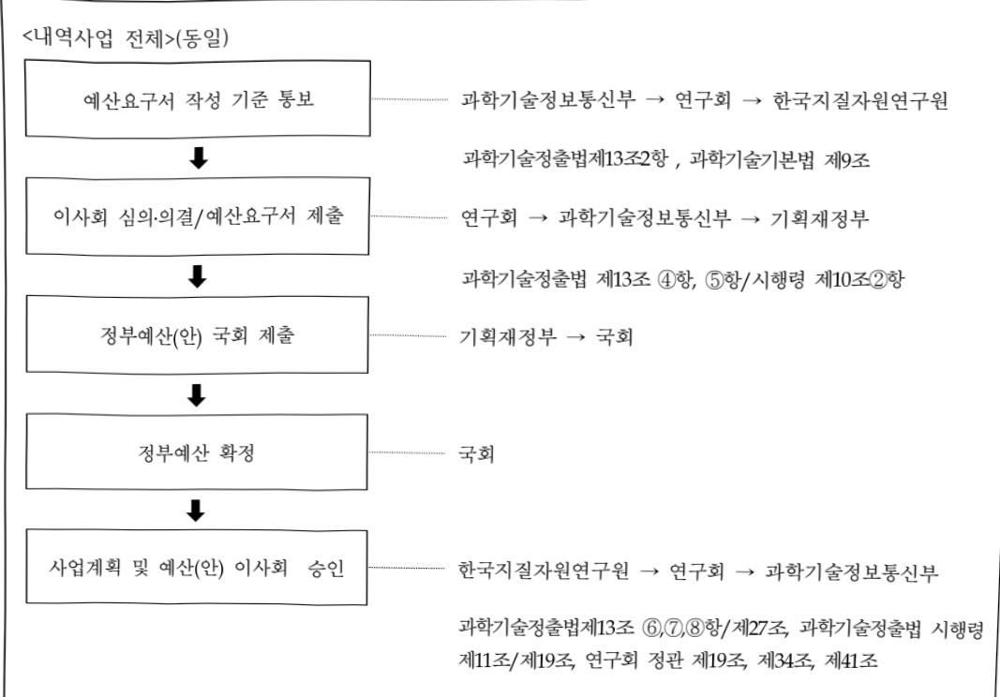

# 한국지질자원연구원연구운영비지원(R&D)

**해당 페이지**: PDF 1732 ~ 1739 쪽 해당

**부처**: 과학기술정보통신부
**분야**: 과학기술
**회계유형**: 에너지및자원 사업특별회계
**2026 확정예산**: 103475.0 백만원
**전년대비 증감률**: 7.7%
**AI 도메인**: R&D 지원

---

### 가. 예산 총괄표

(단위: 백만원, %)

<table border=1 style='margin: auto; word-wrap: break-word;'><tr><td rowspan="2">사업명</td><td rowspan="2">2024년 결산</td><td style='text-align: center; word-wrap: break-word;'>2025년 예산</td><td colspan="2">2026년 예산</td><td style='text-align: center; word-wrap: break-word;'>중감 (B-A)</td><td rowspan="2">(B-A)/A</td></tr><tr><td style='text-align: center; word-wrap: break-word;'>본예산</td><td style='text-align: center; word-wrap: break-word;'>추경(A)</td><td style='text-align: center; word-wrap: break-word;'>요구안</td><td style='text-align: center; word-wrap: break-word;'>본예산(B)</td></tr><tr><td style='text-align: center; word-wrap: break-word;'>한국지질지원연구원 연구운영비지원(R&amp;D)</td><td style='text-align: center; word-wrap: break-word;'>81,793</td><td style='text-align: center; word-wrap: break-word;'>96,119</td><td style='text-align: center; word-wrap: break-word;'>96,119</td><td style='text-align: center; word-wrap: break-word;'>103,475</td><td style='text-align: center; word-wrap: break-word;'>103,475</td><td style='text-align: center; word-wrap: break-word;'>7,356</td></tr></table>

□ 기능별(내역사업별) 예산 내역

(단위:백만원)

<table border=1 style='margin: auto; word-wrap: break-word;'><tr><td rowspan="2"></td><td colspan="5">2024</td><td colspan="5">2025</td><td style='text-align: center; word-wrap: break-word;'>2026</td></tr><tr><td style='text-align: center; word-wrap: break-word;'>예산액(추경)</td><td style='text-align: center; word-wrap: break-word;'>예산현액</td><td style='text-align: center; word-wrap: break-word;'>집행액</td><td style='text-align: center; word-wrap: break-word;'>이월액</td><td style='text-align: center; word-wrap: break-word;'>불용액</td><td style='text-align: center; word-wrap: break-word;'>예산액(추경)</td><td style='text-align: center; word-wrap: break-word;'>예산현액</td><td style='text-align: center; word-wrap: break-word;'>집행액</td><td style='text-align: center; word-wrap: break-word;'>이월액</td><td style='text-align: center; word-wrap: break-word;'>불용액</td><td style='text-align: center; word-wrap: break-word;'>예산</td></tr><tr><td style='text-align: center; word-wrap: break-word;'>○ 기능별 분류(합계)</td><td style='text-align: center; word-wrap: break-word;'>83,293</td><td style='text-align: center; word-wrap: break-word;'>83,293</td><td style='text-align: center; word-wrap: break-word;'>81,793</td><td style='text-align: center; word-wrap: break-word;'>-</td><td style='text-align: center; word-wrap: break-word;'>1,500</td><td style='text-align: center; word-wrap: break-word;'>96,119</td><td style='text-align: center; word-wrap: break-word;'>96,119</td><td style='text-align: center; word-wrap: break-word;'>94,769</td><td style='text-align: center; word-wrap: break-word;'>-</td><td style='text-align: center; word-wrap: break-word;'>1,350</td><td style='text-align: center; word-wrap: break-word;'>103,475</td></tr><tr><td style='text-align: center; word-wrap: break-word;'>· 기관운영비</td><td style='text-align: center; word-wrap: break-word;'>43,453</td><td style='text-align: center; word-wrap: break-word;'>43,453</td><td style='text-align: center; word-wrap: break-word;'>41,953</td><td style='text-align: center; word-wrap: break-word;'>-</td><td style='text-align: center; word-wrap: break-word;'>1,500</td><td style='text-align: center; word-wrap: break-word;'>44,779</td><td style='text-align: center; word-wrap: break-word;'>44,779</td><td style='text-align: center; word-wrap: break-word;'>43,429</td><td style='text-align: center; word-wrap: break-word;'>-</td><td style='text-align: center; word-wrap: break-word;'>1,350</td><td style='text-align: center; word-wrap: break-word;'>46,298</td></tr><tr><td style='text-align: center; word-wrap: break-word;'>· 주요사업비</td><td style='text-align: center; word-wrap: break-word;'>39,840</td><td style='text-align: center; word-wrap: break-word;'>39,840</td><td style='text-align: center; word-wrap: break-word;'>39,840</td><td style='text-align: center; word-wrap: break-word;'>-</td><td style='text-align: center; word-wrap: break-word;'>-</td><td style='text-align: center; word-wrap: break-word;'>51,340</td><td style='text-align: center; word-wrap: break-word;'>51,340</td><td style='text-align: center; word-wrap: break-word;'>51,340</td><td style='text-align: center; word-wrap: break-word;'>-</td><td style='text-align: center; word-wrap: break-word;'>-</td><td style='text-align: center; word-wrap: break-word;'>57,177</td></tr></table>

### 나. 사업설명자료

## 1 ) 사업목적·내용

- (한국지질자원연구원연구운영비지원(R&D))

- (기관운영비) 동 내역사업은 기관 R&R 상위역할과 주요 임무 수행을 위한 인력 유지 및

관리에 필요한 인건비, 안정적 기관운영을 위한 경상경비를 지원하는 것임

- (주요사업비) 동 내역사업은 국내외 육상 · 해저 지질조사, 지하자원의 탐사 · 개발 · 활용,

기후변화 대응 원천기술 개발 및 성과확산을 통해 지속가능한 국가발전에

기여함으로써 국가 전략분야 원천기술 개발, 신성장 동력 발굴, 공공문제

해결 등 국가적 R&D 수요를 충족하기 위한 연구비를 지원하는 것임

## 2 ) 사업개요

☐ 사업근거 및 추진경위

① 법령상 근거 : 과학기술분야 정부출연연구기관등의 설립·운영 및 육성에 관한

법률 제5조 (운영재원)

---

## ② 추진경위

- 1918년 - 1948년 지질조사소, 지질광산연구소

- 1948년 - 1976년 정부조직 내 국립기관

- 1976년 「특정연구기관육성법」에 의거 과학기술처 산하 기관

- 1999년 「정부출연연구기관등의 설립·운영 및 육성에 관한 법률」에 의거

국무총리실 산하 기관으로 변경

- 2004년 과학기술부 공공기술연구회 소관기관으로 변경

- 2008년 지식경제부 산업기술연구회 소관기관으로 변경

- 2013년 미래창조과학부 산업기술연구회 소관기관으로 변경

- 2014년 미래창조과학부 연구회 통합으로 소속변경 (국가과학기술연구회)

- 2017년 미래창조과학부에서 과학기술정보통신부로 명칭변경 (국가과학기술연구회)

## 주요내용

① 사업규모

- 총사업비 : 해당없음

- 사업기간 : 1976년 ~ 계속

- 최근 5년 간 투입된 사업비(예산액기준, 추경편성한 연도에는 추경포함)

<table border=1 style='margin: auto; word-wrap: break-word;'><tr><td style='text-align: center; word-wrap: break-word;'>연도</td><td style='text-align: center; word-wrap: break-word;'>2022</td><td style='text-align: center; word-wrap: break-word;'>2023</td><td style='text-align: center; word-wrap: break-word;'>2024</td><td style='text-align: center; word-wrap: break-word;'>2025</td><td style='text-align: center; word-wrap: break-word;'>2026</td></tr><tr><td style='text-align: center; word-wrap: break-word;'>사업비</td><td style='text-align: center; word-wrap: break-word;'>113,707</td><td style='text-align: center; word-wrap: break-word;'>113,020</td><td style='text-align: center; word-wrap: break-word;'>83,293</td><td style='text-align: center; word-wrap: break-word;'>96,119</td><td style='text-align: center; word-wrap: break-word;'>103,475</td></tr></table>

* '24년부터 시설비는 한국지질자원연구원 시설 지원(R&D)으로 분리 작성

② 사업추진체계

- 사업시행방법 : 출연

- 사업시행주체 : 한국지질자원연구원

-사업 수혜자 : 국민

- 보조, 융자, 출연, 출자 등의 경우 보조·융자 등 지원 비율 및 법적근거

<table border=1 style='margin: auto; word-wrap: break-word;'><tr><td style='text-align: center; word-wrap: break-word;'>내역사업명</td><td style='text-align: center; word-wrap: break-word;'>구분</td><td style='text-align: center; word-wrap: break-word;'>피보조·피출연 등 기관명</td><td style='text-align: center; word-wrap: break-word;'>지원 금액 (2026예산)</td><td style='text-align: center; word-wrap: break-word;'>지원 비율(%)</td><td style='text-align: center; word-wrap: break-word;'>보조율 법적근거 (해당 조항)</td></tr><tr><td style='text-align: center; word-wrap: break-word;'>한국지질자원 연구원 연구운영비 지원(R&amp;D)</td><td style='text-align: center; word-wrap: break-word;'>출연</td><td style='text-align: center; word-wrap: break-word;'>한국지질 자원연구원</td><td style='text-align: center; word-wrap: break-word;'>103,475</td><td style='text-align: center; word-wrap: break-word;'>100% (출연)</td><td style='text-align: center; word-wrap: break-word;'>과학기술분야 정부출연연구기관등의 설립·운영 및 육성에 관한 법률 제5조</td></tr></table>

---

## 3 ) 2026년도 예산 산출 근거

### □ '26년 예산 반영: ('25) 96,119→ ('26) 103,475 백만원 (+7,356 백만원, 7.7%)

## □ 주요내용 및 산출근거

### ① 인건비: (25) 41,211→ (26) 42,695 백만원 (+1,484 백만원, 3.6%)

- (내용) R&R 연계 핵심사업 및 국가정책 추진을 위한 '25년 신규인력(2명) 미반영 인건비(40백만원) 및 처우개선(3.5%)(1,444백만원)

## - (산출)

· '25년도 신규인력 미반영 인건비: 40백만원 (2명 × 40백만원 × 1/2년)

26년 처우개선(3.5%): 1,444백만원 (25년 인건비 41,211백만원 × 처우개선율 3.5%)

### ② 경상비: (25) 3,568→ (26) 3,603백만원 (35백만원, 1.0%)

- (내용) 공공요금(전기료) 인상분(75백만원), 자회사 분담금 증액(34백만원) 반영 및 경상비 효율화(△74백만원) 감액

## - (산출)

· 공공요금 인상문: 75백만원 (25년 전기요금 인상액 202백만원 × 경상비 출연금 비중 36.9%)

· 자회사 처우개선: 34백만원

· 경상비 효율화: △74백만원 감액

### ③ 주요사업비: (25) 51,340→ (26) 57,177백만원 (5,837백만원, 11.4%)

- (내용) 핵심임무 기반 예산 구조조정·재투자 및 전략연구사업 추진에 따른 57,177백만 반영

· 핵심임무 및 전략연구사업 추진을 위한 구조조정 (△6,598백만원) 및 대과제 체계 개편

· 필수 연구장비 확보를 위한 비목간 이관(대과제2 △350백만원 → 장비비 +350백만원)

· 사회·산업 강한 수요에 대응, 대형화(Scale-up) 및 제품화(End-Product) 성과 창출을 통해 국가 안보에 기여가능한 3개 전략연구사업 기획·추진 (+12,435백만원)

## - (산출)

· 지질안보 구축을 위한 지능형 지질정보 및 지질재해 기술개발: 18,633백만원 (△2,518백만원)

* (지출효율화) 핵심임무 연구 집중을 위한 비중 축소 (△2,518백만원)

· 미래 자원 확보 및 저탄소 전환 대응 에너지·자원 기술개발: 19,074백만원 (△4,005백만원)

* (지출효율화) 핵심임무 연구 집중을 위한 비중 축소 및 종료 (△3,655백만원)

* (비목간 이관) 장비구입비로 이관 (△350백만원)

· 기후변화 안보 확보를 위한 탄소저감 및 지질환경 기술개발: 5,859백만원 (△425백만원)

* (지출효율화) 핵심임무 연구 집중을 위한 비중 축소 (△425백만원)

· 장비·시스템구축비: 1,176백만원 (+350백만원)

* (비목간 이관) 대과제2에서 이관 (+350백만원)

· (전략연구사업) 희토류 가공 K-플랜트 핵심장비 개발 사업 (+4,424백만원)

(전략연구사업) 인공지능형 지하수 인터랙티브맵(AEGIS) 개발 사업 (+2,913백만원)

(전략연구사업) 복합 재난 안전망 혁신 개발 사업 (+5,098백만원)

---

## 4 ) 사업효과

사업영향, 산출물 성과지표 등

① 2022~2026년도 성과계획서 상 성과지표 및 최근 5년간 성과 달성도 : 해당없음

② 성과지표 이외의 연도별 사업추진 경과 및 실적

<table border=1 style='margin: auto; word-wrap: break-word;'><tr><td style='text-align: center; word-wrap: break-word;'>2022</td><td style='text-align: center; word-wrap: break-word;'>○기관운영비: 40,687백만원 - 인건비: 37,357백만원, 경상경비: 3,330백만원 ○주요사업비: 52,296백만원 ○시설비: 19,935백만원 - 시설보수 및 장비교체: 1,396백만원 - 탐사선운영: 1,896백만원 - 노후 분석연구동 환경개선사업: 4,680백만원 - 지질자원 연구데이터 센터 건설사업: 6,200백만원 - 신규 탐사선 계류장 확장 및 준설 공사: 5,763백만원</td></tr><tr><td style='text-align: center; word-wrap: break-word;'>2023</td><td style='text-align: center; word-wrap: break-word;'>○기관운영비: 42,458백만원 - 인건비: 38,917백만원, 경상경비: 3,541백만원 ○주요사업비: 54,688백만원 ○시설비: 15,874백만원 - 시설보수 및 장비교체: 2,196백만원 - 탐사선운영: 1,896백만원 - 지질자원 연구데이터 센터 건설사업: 7,900백만원 - 신규 탐사선 계류장 확장 및 준설 공사: 3,882백만원</td></tr><tr><td style='text-align: center; word-wrap: break-word;'>2024</td><td style='text-align: center; word-wrap: break-word;'>○기관운영비: 43,453백만원 - 인건비: 39,972백만원, 경상경비: 3,481백만원 ○주요사업비: 39,840백만원</td></tr><tr><td style='text-align: center; word-wrap: break-word;'>2025</td><td style='text-align: center; word-wrap: break-word;'>○기관운영비: 44,779백만원 - 인건비: 41,211백만원, 경상경비: 3,568백만원 ○주요사업비: 51,340백만원</td></tr></table>

---

③향후(2026년도 이후)기대효과:

## 0 지질안보 구축을 위한 지능형 지질정보 및 지질재해 기술개발

- 국토지질정보 지능화를 통한 신뢰성 제고와 수요자 중심 맞춤형 국토지질정보 제공

- 달 궤도선 탑재 감마선분광기 활용 및 달자원 조사·추출 기초 연구

- 닫 낙 극지환경에서의 자원추출기술 확보

- 고준위방사성폐기물(HLW) 심층처분에 대한 국민 수용성 확보와 부지 선정 근거 제공

-국토지질정보의 스마트 데이터화를 통한 스마트 지오데이터플랫폼 서비스 제공

- 판내부 지각변형정보 및 단층분절모델 평가기술 개발을 통한 국제 연구경쟁력 제고

- 지진조기경보 체계 지역 맞춤형 지진대응 체계 구축을 통한 지진재해 저감 효과 기대

-지진대응역량 강화를 위한 신속지진정보 제공으로 국민안심 실현

-산사태 및 지질환경 오염 정보 전달을 통한 지질환경재해 피해저감 및 국민생활 안전 기여

- 도시지질환경 4D DX 구축 기술 개발을 통한 도시홍수피해 저감 기대

## ㅇ 미래 자위 확보 및 저탄소 전환 대응 에너지·자원 기술개발

-배터리 원료광물 등 미래 4차 산업혁명 수요 전략광물자원 확보

- 국내 부존 바나듬 자원 개발을 통한 ESS 분야 핵심 산업 자원의 수입 대체 및 공급 방안 확보

- 고비용/고위험도 바이오-점토 의약품 개발/생산 플랫폼 구축 및 기술이전

반 핵심광물 탐사기술 개발 및 실증 연구를 통한 자원안보 실현 기여

- 사용 후 배터리 친환경 교효을 자원순환기술 개발으로 미국 IRA등 국제수요 대응 기대

- 대륙봉 지역 석유가스전 탐사 및 개발 사업 추진 시 기초 자료로 활용

- 대륙봉 경계획정을 위한 외교/해양 정책 수립 기초 자료로 활용

- 향후 한반도 육상지질모델과 더불어 영해를 포함한 국내영토관리 기초 자료로 활용

- 가스하이드레이트 탐사 및 생산기술을 통해 장기생산 유망구조 및 최적 생산기법

- 수소생산 발생 CO₂ 석유/가스전 주입을 통한 블루수소생산

- CO₂ 처분, 석유/가스 생산효율 극대화 기술 개발

- 신규 물리탐사선 탐해3호를 활용한 세계 최고수준 핵심광물 탐사 및 해저지질 조사 기술 확보

## ○ 기후변화 안보 확보를 위한 탄소저감 및 지질환경 기술개발

- 온실가스 감축을 위한 국내 대륙봉 대규모 지중저장소 선정에 필요한 과학적 근거 자료 제공

- 지하수 이용과 가뭄 취약 지역에 지하수 자원을 안정적으로 공급에 기여

- 탄소중립 핵심기술 혁신을 통한 2030 NDC 기여 및 2050 탄소중립 실현 기술 확보

## ○ (전략연구사업) 희토류 가공 K-플랜트 핵심장비 개발

- 탄소·친환경 회토류 선광제련 공정 및 플랜트 설비 국산화 개발

- 희토류 자원 선광(광석 1,000톤/년 처리규모), 분해·침출(정광 150톤/년 처리규모), 분리·정제(혼합희토류 60톤/년 처리규모)

## ○ (전략연구사업) 인공지능형 지하수 인터랙티브맵(AEGIS) 개발 사업

-인공지능 기반 지하수 개발유망지 선정 핵심기술 및 플랫폼 개발

- AI 기반 지하수 산출확률 지도 및 지하수자원 최적 공급·활용 의사결정 지원 플랫폼 구축

## ○(전략연구사업)복합재난안전망혁신개발사업

- 유휴 통신망 활용 고성능 재난 안전 모니터링 시스템 구축

- 고성능 분포형 광계측 HW+복합 재난 안전 감시 SW 개발

- 광역-고밀도 재난 안전 진단 솔루션 구축(사회 유휴 통신망의 가치 재발견)

---

5) 타당성조사 및 예비타당성조사 시행여부 및 결과 요지 : 해당없음

6) 총사업비 대상사업 정보 : 해당없음

## 7 ) 사업 집행절차

## 8 ) 각종 평가

1) 국회(예결위, 상임위, 예정처, 국정감사 포함) 지적 : 해당없음

2) 대외공개 평가 : 해당없음

3) 자체평가 : 해당없음

---

### 다.최근 4년간 결산내역

## 1 ) 결산표

☐ 부처 결산내역

(단위: 백만원, %)

<table border=1 style='margin: auto; word-wrap: break-word;'><tr><td rowspan="2">연도</td><td colspan="3">예산액</td><td rowspan="2">예산현액(A)</td><td rowspan="2">집행액(B)</td><td rowspan="2">집행률(B/A)</td><td rowspan="2">다음연도이월액</td><td rowspan="2">불용액</td></tr><tr><td style='text-align: center; word-wrap: break-word;'>본예산</td><td style='text-align: center; word-wrap: break-word;'>추경중감액</td><td style='text-align: center; word-wrap: break-word;'>추경</td></tr><tr><td style='text-align: center; word-wrap: break-word;'>2022</td><td style='text-align: center; word-wrap: break-word;'>113,707</td><td style='text-align: center; word-wrap: break-word;'>-</td><td style='text-align: center; word-wrap: break-word;'>113,707</td><td style='text-align: center; word-wrap: break-word;'>113,707</td><td style='text-align: center; word-wrap: break-word;'>112,918</td><td style='text-align: center; word-wrap: break-word;'>99.3</td><td style='text-align: center; word-wrap: break-word;'>-</td><td style='text-align: center; word-wrap: break-word;'>789</td></tr><tr><td style='text-align: center; word-wrap: break-word;'>2023</td><td style='text-align: center; word-wrap: break-word;'>113,020</td><td style='text-align: center; word-wrap: break-word;'>-</td><td style='text-align: center; word-wrap: break-word;'>113,020</td><td style='text-align: center; word-wrap: break-word;'>113,020</td><td style='text-align: center; word-wrap: break-word;'>111,681</td><td style='text-align: center; word-wrap: break-word;'>98.8</td><td style='text-align: center; word-wrap: break-word;'>-</td><td style='text-align: center; word-wrap: break-word;'>1,339</td></tr><tr><td style='text-align: center; word-wrap: break-word;'>2024</td><td style='text-align: center; word-wrap: break-word;'>83,293</td><td style='text-align: center; word-wrap: break-word;'>-</td><td style='text-align: center; word-wrap: break-word;'>83,293</td><td style='text-align: center; word-wrap: break-word;'>83,293</td><td style='text-align: center; word-wrap: break-word;'>81,793</td><td style='text-align: center; word-wrap: break-word;'>98.2</td><td style='text-align: center; word-wrap: break-word;'>-</td><td style='text-align: center; word-wrap: break-word;'>1,500</td></tr><tr><td style='text-align: center; word-wrap: break-word;'>2025</td><td style='text-align: center; word-wrap: break-word;'>96,119</td><td style='text-align: center; word-wrap: break-word;'>-</td><td style='text-align: center; word-wrap: break-word;'>96,119</td><td style='text-align: center; word-wrap: break-word;'>96,119</td><td style='text-align: center; word-wrap: break-word;'>94,769</td><td style='text-align: center; word-wrap: break-word;'>98.6</td><td style='text-align: center; word-wrap: break-word;'>-</td><td style='text-align: center; word-wrap: break-word;'>1,350</td></tr></table>

## 2 ) 주요 결산사항

□ 2022~2025년 결산 주요사항

<table border=1 style='margin: auto; word-wrap: break-word;'><tr><td style='text-align: center; word-wrap: break-word;'>2022</td><td style='text-align: center; word-wrap: break-word;'>■ 이월 사유 및 불용 사유(집행부진사유) - 인건비 불용액 789백만원(&#x27;21년 인건비 불용차액 이월금 10백만원 + &#x27;22년 인건비 불용액 779백만원)</td></tr><tr><td style='text-align: center; word-wrap: break-word;'>2023</td><td style='text-align: center; word-wrap: break-word;'>■ 이월 사유 및 불용 사유(집행부진사유) - 인건비 불용액 1,008백만원 발생(&#x27;23년 인건비 불용액 800백만원 + &#x27;22년 결산 인건비 불용차액 이월금 208백만원) - 경상비 불용액 76백만원(시설사업 완공소요 반납액 76백만원) - 시설사업비 불용액 255백만원(시설사업 종료에 따른 집행잔액 255백만원)</td></tr><tr><td style='text-align: center; word-wrap: break-word;'>2024</td><td style='text-align: center; word-wrap: break-word;'>■ 이월 사유 및 불용 사유(집행부진사유) - 인건비 불용액 1,500백만원(&#x27;23년 인건비 불용차액 이월금 677백만원 + &#x27;24년 인건비 불용액 823백만원)</td></tr><tr><td style='text-align: center; word-wrap: break-word;'>2025</td><td style='text-align: center; word-wrap: break-word;'>■ 이월 사유 및 불용 사유(집행부진사유) - 인건비 불용액 1,350백만원(&#x27;24년 인건비 불용차액 이월금 436백만원 + &#x27;25년 인건비 불용액 914백만원)</td></tr></table>

□2025년 이·전용 등 세부내역 : 해당없음

---

<table border=1 style='margin: auto; word-wrap: break-word;'><tr><td style='text-align: center; word-wrap: break-word;'>사 업 명</td></tr><tr><td style='text-align: center; word-wrap: break-word;'>(241) 한국철도기술연구원 연구운영비 지원(R&amp;D) (2241-430)</td></tr></table>

사업 코드 정보

<table border=1 style='margin: auto; word-wrap: break-word;'><tr><td style='text-align: center; word-wrap: break-word;'>구분</td><td style='text-align: center; word-wrap: break-word;'>회계</td><td style='text-align: center; word-wrap: break-word;'>소관</td><td style='text-align: center; word-wrap: break-word;'>실국(기관)</td><td style='text-align: center; word-wrap: break-word;'>계정</td><td style='text-align: center; word-wrap: break-word;'>분야</td><td style='text-align: center; word-wrap: break-word;'>부문</td></tr><tr><td style='text-align: center; word-wrap: break-word;'>코드</td><td rowspan="2">일반회계</td><td rowspan="2">과학기술정보통신부</td><td rowspan="2">연구개발정책실기초원천연구정책관</td><td rowspan="2">-</td><td style='text-align: center; word-wrap: break-word;'>150</td><td style='text-align: center; word-wrap: break-word;'>152</td></tr><tr><td style='text-align: center; word-wrap: break-word;'>명칭</td><td style='text-align: center; word-wrap: break-word;'>과학기술</td><td style='text-align: center; word-wrap: break-word;'>과학기술연구지원</td></tr></table>

<table border=1 style='margin: auto; word-wrap: break-word;'><tr><td style='text-align: center; word-wrap: break-word;'>구분</td><td style='text-align: center; word-wrap: break-word;'>프로그램</td><td style='text-align: center; word-wrap: break-word;'>단위사업</td><td style='text-align: center; word-wrap: break-word;'>세부사업</td></tr><tr><td style='text-align: center; word-wrap: break-word;'>코드</td><td style='text-align: center; word-wrap: break-word;'>2200</td><td style='text-align: center; word-wrap: break-word;'>2241</td><td style='text-align: center; word-wrap: break-word;'>430</td></tr><tr><td style='text-align: center; word-wrap: break-word;'>명칭</td><td style='text-align: center; word-wrap: break-word;'>출연연구기관지원</td><td style='text-align: center; word-wrap: break-word;'>국가과학기술연구회 소관출연연구기관지원</td><td style='text-align: center; word-wrap: break-word;'>한국철도기술연구원 연구운영비 지원(R&amp;D)</td></tr></table>

□ 사업 성격 (공통요구자료 Ⅱ-1 작성유의사항 4. 참조, 해당하는 사항에 “○” 표시)

<table border=1 style='margin: auto; word-wrap: break-word;'><tr><td rowspan="2">신규</td><td rowspan="2">계속</td><td rowspan="2">완료</td><td rowspan="2">예비타당성 실시여부</td><td rowspan="2">총사업비 관리대상</td><td rowspan="2">총액계상 예산사업</td><td style='text-align: center; word-wrap: break-word;'>사업소관 변경정보</td></tr><tr><td style='text-align: center; word-wrap: break-word;'>2025예산 시 소관</td></tr><tr><td style='text-align: center; word-wrap: break-word;'></td><td style='text-align: center; word-wrap: break-word;'>O</td><td style='text-align: center; word-wrap: break-word;'></td><td style='text-align: center; word-wrap: break-word;'></td><td style='text-align: center; word-wrap: break-word;'></td><td style='text-align: center; word-wrap: break-word;'></td><td style='text-align: center; word-wrap: break-word;'></td></tr></table>

사업지원형태 및 지원을(최소한 한 개는 반드시 선택하시오. 해당사항에 O 표시)

<table border=1 style='margin: auto; word-wrap: break-word;'><tr><td style='text-align: center; word-wrap: break-word;'>직접</td><td style='text-align: center; word-wrap: break-word;'>출자</td><td style='text-align: center; word-wrap: break-word;'>출연</td><td style='text-align: center; word-wrap: break-word;'>보조</td><td style='text-align: center; word-wrap: break-word;'>융자</td><td style='text-align: center; word-wrap: break-word;'>국고보조율(%)</td><td style='text-align: center; word-wrap: break-word;'>융자율(%)</td></tr><tr><td style='text-align: center; word-wrap: break-word;'></td><td style='text-align: center; word-wrap: break-word;'></td><td style='text-align: center; word-wrap: break-word;'>O</td><td style='text-align: center; word-wrap: break-word;'></td><td style='text-align: center; word-wrap: break-word;'></td><td style='text-align: center; word-wrap: break-word;'></td><td style='text-align: center; word-wrap: break-word;'></td></tr></table>

□ 사업 소관부처 및 시행주체

<table border=1 style='margin: auto; word-wrap: break-word;'><tr><td style='text-align: center; word-wrap: break-word;'>사업명</td><td colspan="2">구분</td></tr><tr><td rowspan="2">한국철도 기술연구원 연구운영비 지원(R&amp;D)</td><td style='text-align: center; word-wrap: break-word;'>소관부처</td><td style='text-align: center; word-wrap: break-word;'>연구개발정책실 기초원천연구정책관 연구기관혁신정책과</td></tr><tr><td style='text-align: center; word-wrap: break-word;'>사업시행주체</td><td style='text-align: center; word-wrap: break-word;'>한국철도기술연구원</td></tr></table>

---

### 원본 PDF 크롭 이미지

