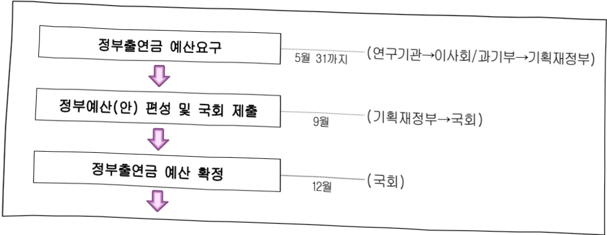
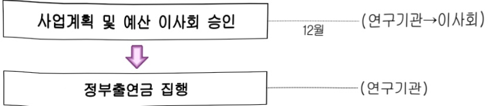

# 한국철도기술연구원연구운영비지원(R&D)

**해당 페이지**: PDF 1740 ~ 1749 쪽 해당

**부처**: 과학기술정보통신부
**분야**: 과학기술
**회계유형**: 일반회계
**2026 확정예산**: 64378.0 백만원
**전년대비 증감률**: 12.0%
**AI 도메인**: R&D 지원

---

### 가.예산 총괄표

(단위: 백만원, %)

<table border=1 style='margin: auto; word-wrap: break-word;'><tr><td rowspan="2">사업명</td><td rowspan="2">2024년 결산</td><td colspan="2">2025년 예산</td><td colspan="2">2026년 예산</td><td rowspan="2">증감(B-A)</td><td rowspan="2">(B-A)/A</td></tr><tr><td style='text-align: center; word-wrap: break-word;'>본예산</td><td style='text-align: center; word-wrap: break-word;'>추경*(A)</td><td style='text-align: center; word-wrap: break-word;'>요구안</td><td style='text-align: center; word-wrap: break-word;'>본예산(B)</td></tr><tr><td style='text-align: center; word-wrap: break-word;'>한국철도기술연구원연구운영비지원(R&amp;D)</td><td style='text-align: center; word-wrap: break-word;'>49,794</td><td style='text-align: center; word-wrap: break-word;'>57,455</td><td style='text-align: center; word-wrap: break-word;'>57,455</td><td style='text-align: center; word-wrap: break-word;'>64,378</td><td style='text-align: center; word-wrap: break-word;'>64,378</td><td style='text-align: center; word-wrap: break-word;'>6,923</td><td style='text-align: center; word-wrap: break-word;'>12.0</td></tr></table>

*추경: 추경증감액을 포함한 최종 예산액을 기재

## □ 기능별(내역사업별) 예산 내역

(단위:백만원)

<table border=1 style='margin: auto; word-wrap: break-word;'><tr><td rowspan="2"></td><td colspan="5">2024</td><td colspan="5">2025</td><td rowspan="2">2026 倉圧</td></tr><tr><td style='text-align: center; word-wrap: break-word;'>倉圧の (専門)</td><td style='text-align: center; word-wrap: break-word;'>倉圧の 専門</td><td style='text-align: center; word-wrap: break-word;'>倉圧の 専門</td><td style='text-align: center; word-wrap: break-word;'>倉圧の 専門</td><td style='text-align: center; word-wrap: break-word;'>倉圧の 専門</td><td style='text-align: center; word-wrap: break-word;'>倉圧の 専門</td><td style='text-align: center; word-wrap: break-word;'>倉圧の 専門</td><td style='text-align: center; word-wrap: break-word;'>倉圧の 専門</td><td style='text-align: center; word-wrap: break-word;'>倉圧の 専門</td><td style='text-align: center; word-wrap: break-word;'>倉圧の 専門</td></tr><tr><td style='text-align: center; word-wrap: break-word;'>○ 기능별 분류(専門)</td><td style='text-align: center; word-wrap: break-word;'>51,604</td><td style='text-align: center; word-wrap: break-word;'>51,604</td><td style='text-align: center; word-wrap: break-word;'>49,794</td><td style='text-align: center; word-wrap: break-word;'>-</td><td style='text-align: center; word-wrap: break-word;'>1,810</td><td style='text-align: center; word-wrap: break-word;'>57,455</td><td style='text-align: center; word-wrap: break-word;'>57,455</td><td style='text-align: center; word-wrap: break-word;'>55,155</td><td style='text-align: center; word-wrap: break-word;'>-</td><td style='text-align: center; word-wrap: break-word;'>2,300</td><td style='text-align: center; word-wrap: break-word;'>64,378</td></tr><tr><td style='text-align: center; word-wrap: break-word;'>○ 기관운영비</td><td style='text-align: center; word-wrap: break-word;'>28,077</td><td style='text-align: center; word-wrap: break-word;'>28,077</td><td style='text-align: center; word-wrap: break-word;'>26,267</td><td style='text-align: center; word-wrap: break-word;'>-</td><td style='text-align: center; word-wrap: break-word;'>1,810</td><td style='text-align: center; word-wrap: break-word;'>28,878</td><td style='text-align: center; word-wrap: break-word;'>28,878</td><td style='text-align: center; word-wrap: break-word;'>26,578</td><td style='text-align: center; word-wrap: break-word;'>-</td><td style='text-align: center; word-wrap: break-word;'>2,300</td><td style='text-align: center; word-wrap: break-word;'>29,880</td></tr><tr><td style='text-align: center; word-wrap: break-word;'>○ 주요사업비</td><td style='text-align: center; word-wrap: break-word;'>23,527</td><td style='text-align: center; word-wrap: break-word;'>23,527</td><td style='text-align: center; word-wrap: break-word;'>23,527</td><td style='text-align: center; word-wrap: break-word;'>-</td><td style='text-align: center; word-wrap: break-word;'>-</td><td style='text-align: center; word-wrap: break-word;'>28,577</td><td style='text-align: center; word-wrap: break-word;'>28,577</td><td style='text-align: center; word-wrap: break-word;'>28,577</td><td style='text-align: center; word-wrap: break-word;'>-</td><td style='text-align: center; word-wrap: break-word;'>-</td><td style='text-align: center; word-wrap: break-word;'>34,498</td></tr></table>

### 나. 사업설명자료

## 1 ) 사업목적·내용

- (초연결 사회 구현을 위한 초고속·대용량 철도교통 시스템 개발) 시속 1,000km/h

이상의 초고속 하이퍼튜브 핵심기술을 비롯하여 철도차량 성능향상·물류·국제철도 상호

운영성 강화 핵심기술의 개발을 통해, 초연결사회의 차세대 철도교통 시스템 구현

· 사람과 사물, 공간 사이를 실시간으로 연결하는 초연결사회의 실현을 위한 초

고속·대용량 철도교통 시스템 기술 선도

- (디지털 대전환을 통한 철도교통 효율화 및 이용편의 향상 기술 개발) 인공지능 및

디지털 전환 기반의 철도교통 시스템 구현을 통해, 운영 효율화 및 국민편의 향상

· 열차자율주행제어 핵심기술, 대용량 BRT 자율주행 시스템, 고속철도 운영 효율

화 플랫폼과 같은 디지털 철도교통 시스템의 개발을 통해 이용편의 제고

- (기후변화 대응을 위한 탄소중립 핵심기술 개발) 철도산업의 지속 가능한 발전을 위한

탄소중립 철도교통 시스템 기반 구축

---

· 친환경 수소철도·전력효율 향상 핵심기술 등 탄소배출 및 에너지사용량 절감을 통한 철도운영 측면의 사회적 비용 최소화

- (철도 신산업 창출을 위한 국내외 협력 플랫폼 구축) AI 기반의 지능형 감지·대응 기술과 초연결 통신체계 구축을 통해 철도 사고 제로화 철도구현

철도 시스템 전반의 이상 징후를 실시간으로 감시하고 자동으로 대응할 수 있는

선제적 안전관리 체계의 고도화

## 2 ) 사업개요

□ 사업근거 및 추진경위

① 법령상 근거 및 조항 적시 : 과학기술분야 정부출연연구기관 등의 설립 · 운영 및 육성에 관한 법률 제5조 제2항

②정부는 연구기관 및 연구회의 설립·운영에 드는 경비에 충당하기 위하여 예산의 범위에서 연구기관 및 연구회에 출연금을 지급할 수 있다. 이 경우 정부는 연구기관 및 연구회의 지속적이고 안정적인 운영을 위하여 필요한 재원이 마련될 수 있도록 노력하여야 한다.

② 추진경위

- '96. 03. 「국유철도의운영에관한특례법」에 의거 철도청 출연기관인

한국철도기술연구원 설립

- '99. 01. 「정부출연연구기관등의설립·운영및육성에관한법률」로 설립근거법 변경 (국무총리실 산하)

- '04. 10. 과학기술분야정부출연연구기관등의설립·운영및육성에 관한법률」로 설립근거법 변경 (과학기술부 산하)

- '06. 06. 한국형 고속열차, 대한민국 기술대전 금상 수상

- '07. 04. 한국형 틸팅열차, 출연(연) 국가 Top-Brand 우수과제 선정

- '08. 03. 설립근거법 개정에 따른 주무부처 변경(지식경제부 산하)

- '08. 05. 세계철도학술대회(WCRR) 2008 개최

- '09. 11. 전기철도 에너지 저장시스템, 신기술(NET) 인증

- '11. 04. 산업기술연구회 소관 연구기관 기관평가 1위

- '12. 10. 바이모달트램기술 '국토해양부 교통신기술 제10호' 지정

- '12. 11. 국가과학기술위원회 기술사업화 우수기관 선정

- '13. 03. 차세대고속철도 HEMU-430x 한국고속철도 최고속도 경신(421.4km/h, 세계 4위)

- '13. 04. 산업기술연구회 소관 연구기관 기관평가(경영 및 연구사업 종합평가) 우수기관 선정

- '14. 06. 연구회 통합으로 소속변경 (국가과학기술연구회)

- '16. 11. 2016 대한민국기술대상 수상(HEMU-430X 고속열차)

- '16. 12. 국제철도연맹(UIC) 2016 Innovation Awards 수상 (IoT기반 화물열차 실시간 모니터링 기술)

---

- '16. 12. 미래창조과학부 국가연구장비 공동활용센터 지정

- '17. 09. 과기정통부 국가연구개발 우수성과 선정 (IoT기반 무인자동 미니트램)

- '17. 12. 한림원 2025 미래를 이끌 기술과 주역 수상 (한국철도의 유라시아 철도 상호운영을 위한 유니버셜 플랫폼 기술 등 4건)

- '18. 12. 남북 및 대륙철도 연계를 위한 궤간가변대차기술 세계철도연맹(UIC) Best Award 수상

- '19. 06. 철도종합시험선로(충북 오송) 개통

- '20. 04. 철도시험인프라 민관협력을 통한 해외 진출 성공: 싱가포르 시험선사업 한국 수주(5,500억원)

- '20. 11. 축소형 하이퍼튜브 시속 1,019km/h 공력시험 성공(아진공 상태 세계 최고속도)

- '21.11 2021 국가연구개발 우수성과 100선 선정

(냉동기 없이도 장시간 운전할 수 있는 고온초전도 선형추진 기술 개발)

- '22.12 2022 국가연구개발 우수성과 100선 선정

(열차자율주행 기술, 융합부문 최우수성과 선정)

- '24.05 동력분산 철도차량 KTX-청룡(영업최고속도 320km/h) 상용화

- '24.12 세계 최초 수소기관차용 친환경 액화수소 하이브리드 추진시스템 핵심기술 개발

## □ 주요내용

① 사업규모

- 총사업비(해당되는 경우에만 기재) : 해당 없음

- 사업기간 : 1996년 ~ 계속

-최근 5년 간 투입된 사업비(예산액기준, 추경편성한 연도에는 추경포함)

<table border=1 style='margin: auto; word-wrap: break-word;'><tr><td style='text-align: center; word-wrap: break-word;'>$ \underline{\text{연도}} $</td><td style='text-align: center; word-wrap: break-word;'>2022</td><td style='text-align: center; word-wrap: break-word;'>2023</td><td style='text-align: center; word-wrap: break-word;'>2024</td><td style='text-align: center; word-wrap: break-word;'>2025</td><td style='text-align: center; word-wrap: break-word;'>2026</td></tr><tr><td style='text-align: center; word-wrap: break-word;'>$ \underline{\text{사업비}} $</td><td style='text-align: center; word-wrap: break-word;'>60,109</td><td style='text-align: center; word-wrap: break-word;'>63,179</td><td style='text-align: center; word-wrap: break-word;'>51,604</td><td style='text-align: center; word-wrap: break-word;'>57,455</td><td style='text-align: center; word-wrap: break-word;'>64,378</td></tr></table>

* '24년부터 시설비는 한국철도기술연구원 시설 지원(R&D)으로 분리 작성

- 기타 : 해당사항 없음

② 사업추진체계

- 사업시행방법 : 출연

- 사업시행주체 : 한국철도기술연구원

- 사업 수혜자 : 산업계, 학계, 연구계, 공공부문 등 국가 모든 분야

- 보조, 융자, 출연, 출자 등의 경우 보조·융자 등 지원 비율 및 법적근거

---

<table border=1 style='margin: auto; word-wrap: break-word;'><tr><td style='text-align: center; word-wrap: break-word;'>내역사업명</td><td style='text-align: center; word-wrap: break-word;'>구분</td><td style='text-align: center; word-wrap: break-word;'>피보조·피출연 등 기관명</td><td style='text-align: center; word-wrap: break-word;'>지원 금액 (2026예산)</td><td style='text-align: center; word-wrap: break-word;'>지원 비율(%)</td><td style='text-align: center; word-wrap: break-word;'>보조율 법적근거 (해당 조항)</td></tr><tr><td style='text-align: center; word-wrap: break-word;'>한국철도 기술연구원 연구운영비 지원(R&amp;D)</td><td style='text-align: center; word-wrap: break-word;'>출연</td><td style='text-align: center; word-wrap: break-word;'>한국철도 기술 연구원</td><td style='text-align: center; word-wrap: break-word;'>64,378</td><td style='text-align: center; word-wrap: break-word;'>100</td><td style='text-align: center; word-wrap: break-word;'>과학기술분야 정부출연연구기관 등의 설립·운영 및 육성에 관한 법률 제5조(운영재원) 제2항</td></tr></table>

## 3 ) '26년도 예산 산출 근거

①한국철도기술연구원 연구운영비 지원을 위한 정부출연금

:(25)57,455백만원→(26)64,378백만원,6,923백만원증액

- (투자방향) 기관 12대 국가전략기술 및 기관 고유 미션 수행을 위한 주요사업비 등

- (산출)연구개발 인건비 27,662백만원

연구개발 경상비 2,218백만원

연구개발장비 시스템구축비 25백만원

연구개발활동비 34,473백만원

o 2024년도 예산 및 2025년도 예산 산출 세부내역 비교

<table border=1 style='margin: auto; word-wrap: break-word;'><tr><td colspan="2">2025년 예산</td><td colspan="2">2026년 예산</td></tr><tr><td style='text-align: center; word-wrap: break-word;'>예산</td><td style='text-align: center; word-wrap: break-word;'>산출내역</td><td style='text-align: center; word-wrap: break-word;'>예산</td><td style='text-align: center; word-wrap: break-word;'>산출내역</td></tr><tr><td style='text-align: center; word-wrap: break-word;'>57,455</td><td style='text-align: center; word-wrap: break-word;'>○ 연구개발인건비(360-01): 26,707백만원가. 전년 인건비 수준(25,910백만원)나. 증원에 따른 인건비 조정(20백만원)다. 인건비 처우개선 3%(777백만원)○ 연구개발경상비(360-02): 2,171백만원가. 전년 경상비 수준 (2,167백만원)나. 공공요금 등 증액 반영(4백만원)○ 연구개발장비·시스템구축비(360-04): 25백만원가. 주요사업 장비비(25백만원)</td><td style='text-align: center; word-wrap: break-word;'>64,378</td><td style='text-align: center; word-wrap: break-word;'>○ 연구개발인건비(360-01): 27,662백만원가. 전년 인건비 수준(26,707백만원)나. 증원에 따른 인건비 조정(20백만원)다. 인건비 처우개선 3.5%(935백만원)○ 연구개발경상비(360-02): 2,218백만원가. 전년 경상비 수준 (2,171백만원)나. 경상비 효율화 반영(△29백만원)나. 공공요금 인상분 반영(38백만원)나. 자회사분담금 증액분 반영(38백만원)</td></tr><tr><td style='text-align: center; word-wrap: break-word;'>○ 연구개발활동비(360-05): 28,552천원가. 4차산업혁명을 선도하는 신교통 혁신원전기술개발(5,664백만원)나. 사회 현안을 해결하는 국민 체감형 기술개발 (5,280백만원)다. 고부가가치를 창출하는 철도 핵심기술 개발(9,208백만원)라. 철도 신산업 창출을 위한 국내외 협력 플랫폼 구축(6,800백만원)마. 대형연구시설장비 운영유지비(철도종합시험선로)(1,600백만원)</td><td style='text-align: center; word-wrap: break-word;'>64,378</td><td style='text-align: center; word-wrap: break-word;'>○ 연구개발장비·시스템구축비(360-04): 25백만원가. 주요사업 장비비(25백만원)나. 주요사업 연구를 위한 장비구입비(25백만원)나. 연구개발활동비(360-05): 34,473천원가. 초연결 사회 구현을 위한 초고속·대용량 철도교통 시스템 개발 등 기본사업비(24,483백만원)나. 고효율·대용량 차세대 고속철도차량 기술 개발 등 전략연구사업(9,990백만원)</td><td style='text-align: center; word-wrap: break-word;'></td></tr></table>

---

## 4 ) 사업효과

사업영향, 산출물 성과지표 등

① 2022~2026년도 성과계획서 상 성과지표 및 최근 5년간 성과 달성도 : 해당 없음

② 성과지표 이외의 연도별 사업추진 경과 및 실적

<table border=1 style='margin: auto; word-wrap: break-word;'><tr><td style='text-align: center; word-wrap: break-word;'>2022</td><td style='text-align: center; word-wrap: break-word;'>(4차 산업혁명을 선도하는 신교통 혁신원천기술 개발) 초연결사회 구현을 위한 신교통 원천기술 개발의 R&amp;R에 따른 아음속 캡슐트레인 핵심기술개발/ 열차자율주행제어 핵심기술 개발/ 대중교통 편의증진을 위한 ICT 스마트 모빌리티 기술개발 수행(사회 현안을 해결하는 국민 체감형 기술 개발) 국민의 안전과 생명을 지키기 위한 철도안전기술개발/ 철도차량 사고 예방을 위한 지능형 고속대차 핵심기술 개발/ 공공성 및 효율성 제고를 위한 교통물류 기술 / 출퇴근이 빠르고 폐전한 철도 급행화 및 진전경 기술 수행(고부가가치를 창출하는 철도 핵심기술 개발) 신성장동력 창출을 위한 철도 핵심기술 개발의 R&amp;R에 따른 첨단 철도 인프라 핵심기술 개발 / 철도 테일 상시 진단을 통한 수명 연장 기술 개발 / 철도시설물 지능형 유지관리 기술개발 / 차세대 차량시스템 핵심기술 개발 / 스마트 철도 전기신호 핵심기술 개발 / 진환경 수소철도 핵심기술 개발(철도 신산업 창출을 위한 국내외 협력 플랫폼 구축) 대륙철도 상호연결성 강화 기술 개발 / 국제 인증체계 구축의 R&amp;R에 따른 강소 중소기업 육성을 위한 기술 및 상용화 지원 / 지속발전 가능한 철도산업 생태계 기반 조성 지원 / 오송 철도시험선 기반 철도부품 개방형 RAM 기술개발</td></tr><tr><td style='text-align: center; word-wrap: break-word;'>2023</td><td style='text-align: center; word-wrap: break-word;'>(4차 산업혁명을 선도하는 신교통 핵신원천기술 개발) 초연결사회 구현을 위한 신교통 원천기술 개발의 R&amp;R에 따른 아음속 캡슐트레인 핵심기술개발/ 열차자율주행제어 핵심기술 개발/ 대중교통 편의증진을 위한 ICT 스마트 모빌리티 기술개발 수행(사회 현안을 해결하는 국민 체감형 기술 개발) 국민의 안전과 생명을 지키기 위한 철도안전기술개발/ 철도차량 사고 예방을 위한 지능형 고속대차 핵심기술 개발/ 공공성 및 효율성 제고를 위한 교통물류 기술 / 출퇴근이 빠르고 폐전한 철도 급행화 및 진전경 기술 수행(고부가가치를 창출하는 철도 핵심기술 개발) 신성장동력 창출을 위한 철도 핵심기술 개발/ R&amp;R에 따른 철단 철도 인프라 핵심기술 개발 / 차세대 차량시스템 핵심기술 개발 / 스마트 철도 전기신호 핵심기술 개발 / 철도 핵심기술 개발(철도 신산업 창출을 위한 국내외 협력 플랫폼 구축) 대륙철도 상호연결성 강화 기술 개발 / 국제 인증체계 구축의 R&amp;R에 따른 강소 중소기업 육성을 위한 기술 및 상용화 지원 / 오송 철도시험선 기반 철도부품 개방형 RAM 기술개발</td></tr><tr><td style='text-align: center; word-wrap: break-word;'>2024</td><td style='text-align: center; word-wrap: break-word;'>(4차 산업혁명을 선도하는 신교통 핵신원천기술 개발) 초연결사회 구현을 위한 신교통 원천기술 개발의 R&amp;R에 따른 아음속 캡슐트레인 핵심기술개발/ 열차자율주행제어 핵심기술 개발/ 대중교통 편의증진을 위한 ICT 스마트 모빌리티 기술개발 수행(사회 현안을 해결하는 국민 체감형 기술 개발) 국민의 안전과 생명을 지키기 위한 철도안전기술개발/ 공공성 및 효율성 제고를 위한 교통물류 기술 / 지속가능 철도교통을 위한 탄소 중립 핵심기술개발 / 고속철도 속도향상을 위한 디지털 철도운영 플랫폼 기술개발 수행(고부가가치를 창출하는 철도 핵심기술 개발) 철단 철도 인프라 핵심기술 개발 / 차세대 차량시스템 핵심기술 개발 / 스마트 철도 전기신호 핵심기술 개발 / 진환경 수소철도 핵심기술 개발 / 인공지능 기반 고속철도 탈선예방 핵심기술 개발 수행(철도 신산업 창출을 위한 국내외 협력 플랫폼 구축) 대륙철도 상호연결성 강화 기술 개발 / 철도분야 글로벌 선도기업 육성을 위한 기술개발 및 상용화 지원 / 오송 철도시험선 기반 철도부품 개방형 RAM 기술개발 / 철도디지털 전환을 위한 이음5G-R 핵심기술 개발 수행</td></tr><tr><td style='text-align: center; word-wrap: break-word;'>2025</td><td style='text-align: center; word-wrap: break-word;'>(4차 산업혁명을 선도하는 신교통 핵신원천기술 개발) 기관의 핵심역할에 따른 아음속 캡슐트레인 핵심기술 개발/ 열차자율주행제어 핵심기술 개발을 비롯하여, 대중교통 편의증진을 위한 ICT 스마트 모빌리티 기술과 AI 기반의 철도 디지털트런 풍랫 플랫폼 등과 같이 철도교통 부문의 AX 도입을 역점사업으로 추진(사회 현안을 해결하는 국민 체감형 기술 개발) 인공지능 및 빅데이터 기반의 철도안전 평가 및 사고예방기술/철도교통 정책적 의사결정 지원 및 물류 연계기술 / 고속철도 표정속도 향상을 위한 디지털 전환 기반 운영 플랫폼/ 도심지 철도인프라 침수대응 및 복원능력 향상기술 등의 사회문제 해결 및 수요 지향형 연구개발과제 수행(고부가가치를 창출하는 철도 핵심기술 개발) 진환경 수소철도 핵심기술 개발 / 소프트웨어정의 철도 핵심기술/철단 철도 인프라 핵심기술 개발/ 차세대 저비용·고효율 차량시스템 핵심기술 개발을 위한 기관고유사업 수행(철도 신산업 창출을 위한 국내외 협력 플랫폼 구축) 국제철도와의 상호운용성 강화를 위한 핵심기술을 비롯하여, 신산업 분야 발굴 및 글로벌 선도기업 육성 등 국내외 철도부문 상호협력 강화 및 연구개발 실용화를 위한 R&amp;D 수행</td></tr></table>

---

③향후(2026년도 이후)기대효과

<table border=1 style='margin: auto; word-wrap: break-word;'><tr><td style='text-align: center; word-wrap: break-word;'>연구과제</td><td style='text-align: center; word-wrap: break-word;'>기대효과</td></tr><tr><td style='text-align: center; word-wrap: break-word;'>초연결 사회 구현을 위한 초고속· 대용량 철도교통 시스템 개발</td><td style='text-align: center; word-wrap: break-word;'>○ 1000km/h 이상의 속도로 아진공 튜브 가이드웨이를 주행하는 신개념 육상교통인 아음속 캡슐트레인 주행체 및 추진제어 원천기술 개발 - 단거리 시험선 구축 및 추진 성능 검증: 가감속(1.8 m/s² 이상), 속도(60 km/h 이상) - 자기부상 주행체(무인) 개발 및 유도반발 자기부상 성능 검증: 부상력(kN)/주행체중량(kN) 1 이상○ 트램 자율주행 및 도시철도 주행장치의 손상저감 기술 등 철도차량 성능향상 핵심기술 개발 - 주행안전성 확보를 통한 사고율 50% 이상 저감 - 신개념 철도차량 유지보수 체계로 철도차량 LCC 절감(10% 이상) - 도시철도차량 주행장치(차륜, 축상스프링, 대차프레임)유지보수비 20% 저감 기술 확보○ 광역권 메가시티 대중교통 중심 모빌리티 분석플랫폼 및 철도교통 기반 공동물류 핵심기술 개발 - 철도 수요 증대로 운영기관 수익 증가: 수단분담률 1% 증가시 약 1,874억원/년 - 물류 거점 작업자 사고사망 만인율 0.29%이하 달성 기대○ 국제철도 상호운용성 핵심기술 개발 - 철도 위성신호장치 안전성 인증 (IEC62425 표준 기반 SIL4급) - 대륙철도 기관차와 호환성 검증 및 최종설계 반영 - 궤간가변 기관차 변환궤도 및 간이구조 궤간가변 기관차 주행 안정성 확보</td></tr><tr><td style='text-align: center; word-wrap: break-word;'>디지털 대전환을 통한 철도교통 효율화 및 이용편의 향상 기술 개발</td><td style='text-align: center; word-wrap: break-word;'>○ 인프라 제약 없이 노선간 열차 운행, 수요 응답형 가변 열차 편성, 무환승/무정차 철도 운영이 가능한 세계 선도형 열차자율주행 제어 혁신기술 개발 - 열차 가상편성 기술 개발 및 성능검증: 고정편성 대비 분기부 및 플랫폼 통과시간 25% 단축 - 자율주행용 환경인지 센싱 데이터 송수신 시스템 상세 설계, 센싱 데이터(샘플) 전송장치 제작(송수신시간 100ms 이내) - 저지연·고신뢰 열차 무선통신 기술 개발 (통신 지연시간 &lt; 10ms, 패컷 오류율 &lt; 10⁻⁵)○ 첨단모빌리티기술(virtual coupling) 확보, 교통 이용자의 이동성 강화, 교통인프라의 운영효율성 향상 등을 위하여 소프트웨어 정의 철도(SDR, Software Defined Railway)기술 개발 - 클라우드 컴퓨팅 플랫폼을 적용하여 클라우드 컴퓨팅 플랫폼의 도입을 통해 유지보수 및 에너지소비량 15% 저감, 시스템 운영중단 50% 감소 - 스마트 철도차량을 위한 차상 네트워크 설치 및 유지보수 비용 25%이상 감소○ 디지털 기반 고속철도 운영 플랫폼 핵심기술 개발 - 급행 고속열차 표정속도 180kph 수준 확보, 선로 배분 최적화 기술 적용에 따른 선로용량 10% 추가 확보 - 선로 배분 최적화 기술 적용에 따른 선로용량 10% 추가 확보 - 고속철도 이용객 5% 이상 증가, 통행시간 절감 효과 약 300억원/년(40년간 약 1.2조원)</td></tr><tr><td style='text-align: center; word-wrap: break-word;'>기후변화 대응을 위한 탄소중립 핵심기술 개발</td><td style='text-align: center; word-wrap: break-word;'>○ 철도차량 장책(온보드) 가능한 액화수소 공급시스템 소형·경량화 기술 개발 - 철도 기관차 153량(58억/대), 동차 80량(9억/대) 수입 대체 효과 - 노반/전차선 공사를 기존 870억/21억에서 722억/0원으로 절감(도시철도 기준) - 도시철도로 발생하는 CO₂ 발생량 약 1M톤/년 및 미세먼지 20% 이상 개선○ 이용객 진화적 철도교통서비스 제공을 위한 최고 수준의 유해요소 저감 기술개발 - 초미세먼지(PM2.5) 저감효율 30% 이상 - 전염교환 적용 비접촉식 바이러스 저감장치 시작품 제작(바이러스 저감 효율 90% 이상) - 천연유래 물질 기반 항바이러스 기능성 소재 개발 (바이러스 저감 효율 90% 이상) - 철도 폐목침목 오염물질 제거율 95% 및 재활용 소재 적용(이산화탄소 저감율 15%) - 폐콘크리트침목 재자원화 시스템 현장 실증 (침목 회수속도 10% 증대)○ 절인전력 탄소중립 달성 및 에너지 절감을 위한 친환경 연계 핵심기술 개발</td></tr></table>

---

<table border=1 style='margin: auto; word-wrap: break-word;'><tr><td style='text-align: center; word-wrap: break-word;'>연 구 과 제</td><td style='text-align: center; word-wrap: break-word;'>기 대 효 과</td></tr><tr><td style='text-align: center; word-wrap: break-word;'></td><td style='text-align: center; word-wrap: break-word;'>- 친환경에너지로 견인전력 대체 시  $ CO_{2}eq $ 1.18백만톤 배출 절감, 전력구매비용 약 3,710억 원 편익- 철도역사 에너지 효율성 개선을 통한 에너지 비용 10% 절감으로 역사 당 연간 평균 12백 만원(국내 전체 역사 적용시 100억원) 에너지 비용 절감○ 철도시설물 건설 및 유지관리 효율성 향상을 위한 원천 기술 개발- 레일 사용 수명 연장을 통한 유지관리 비용 절감: 레일 교체 통과론수를 6억톤에서 9억톤으로 상향시 연간 226억원 절감○ 중소, 중견기업 기술역량 및 경쟁력 강화지원을 통한 국내외 시장 확대- 철도 분야 부품 국산화 개발 36개 (2021~2026년 누적) - 기업 기술애로 해결 건수 300건 (2021~2026년 누적)</td></tr><tr><td style='text-align: center; word-wrap: break-word;'>철도 사고 제로화를 위한 철도안전 기술 개발</td><td style='text-align: center; word-wrap: break-word;'>○ 선제적 대응 및 지능형 안전기술 기반의 세계 최고수준의 철도 안전도 달성- 비정형 데이터를 활용한 철도 사고전조 추론(텍스트마이닝 등) 알고리즘 시험/검증(추론 정확도 신뢰 수준: 90% 이상)- 핵심위험 Digital Safety Chain 누적 약 400건 이상 확보- 철도차량 내 리튬이온배터리 열폭주 화재대응 기술: 1시간 이내 재발화 방지 및 열폭주 지연(50°C 도달 시간: 6,000초 수준)○ 디지털 기반 철도 재난 대응 핵심기술 개발- 철도 유지관리 업무의 디지털 전환으로 비용 절감 및 운영 고도화: 시설 점검비용 30%, 유지보수 업무 10% 이상 대체 가능- 집중호우 등에 의한 재난 시 정확한 상태 평가(AI기반 CCTV영상분석기술 정확도 90% 이상, 철도인프라 Digital Archivin g 기술-3D모델링 정확도 90% 이상, 철도노반 하부 유실상태 평가 GPR분석 정확도 80% 이상, 위성정보 기반 철도 노반/비탈면 변형 분석 정확도 80% 이상 등)에 기반한 열차 운행(통제/해제) 및 보수/보강에 대한 합리적 의사결정 지원○ 디지털 철도기술의 선점 및 경쟁력 확보를 위한 이음5G-R 핵심기술 및 표준 개발- 철도 어플리케이션의 사용자 경험 전송률(User Experienced Data rate) 100Mbps 달성(실제 LTE-R 대비 사용자 경험 전송률 약 10배 증가)- 통신 커버리지 500m 달성을 통한 통신망 구축비와 운영비 절감: LTE-R과 비슷한 수의 기지국으로 망 구축 가능</td></tr></table>

5) 타당성조사 및 예비타당성조사 시행여부 및 결과 요지 : 해당 없음

6) 총사업비 대상사업 정보 : 해당 없음

7) 사업 집행절차

---

○ 연구원(예산 요구(안) 제출)

○ 국가과학기술연구회 이사회(예산 요구(안) 심의 · 의결 · 제출)

○ 과학기술정보통신부(예산 요구(안) 심의 · 제출)

기획재정부(예산 요구(안) 심의 및 정부(안) 확정)

○ 국회 과방위(예산 요구(안) 심의 및 승인)

○ 국회 예결위(예산 요구(안) 심의 및 승인)

○ 국가과학기술연구회 이사회(사업계획 및 예산(안) 제출 및 승인)

○ 연구원(출연금 교부 신청)

○ 과학기술정보통신부(출연금 교부)

○ 연구원(사업 수행)

## 8 ) 각종 평가

1) 국회(예결위, 상임위, 예정처, 국정감사 포함) 지적 : 해당 없음

2) 대외공개 평가 : 해당 없음

3) 자체평가 : 해당 없음

### 다. 최근 4년간 결산내역

## 1 ) 결산표

☐ 부처 결산내역

(단위: 백만원, %)

<table border=1 style='margin: auto; word-wrap: break-word;'><tr><td rowspan="2">연도</td><td colspan="3">예산액</td><td rowspan="2">예산현액(A)</td><td rowspan="2">집행액(B)</td><td rowspan="2">집행률(B/A)</td><td rowspan="2">다음연도이월액</td><td rowspan="2">불용액</td></tr><tr><td style='text-align: center; word-wrap: break-word;'>본예산</td><td style='text-align: center; word-wrap: break-word;'>추경증감액</td><td style='text-align: center; word-wrap: break-word;'>추경</td></tr><tr><td style='text-align: center; word-wrap: break-word;'>2022</td><td style='text-align: center; word-wrap: break-word;'>60,109</td><td style='text-align: center; word-wrap: break-word;'>-</td><td style='text-align: center; word-wrap: break-word;'>60,109</td><td style='text-align: center; word-wrap: break-word;'>60,109</td><td style='text-align: center; word-wrap: break-word;'>57,609</td><td style='text-align: center; word-wrap: break-word;'>95.8</td><td style='text-align: center; word-wrap: break-word;'>-</td><td style='text-align: center; word-wrap: break-word;'>2,500</td></tr><tr><td style='text-align: center; word-wrap: break-word;'>2023</td><td style='text-align: center; word-wrap: break-word;'>63,179</td><td style='text-align: center; word-wrap: break-word;'>-</td><td style='text-align: center; word-wrap: break-word;'>63,179</td><td style='text-align: center; word-wrap: break-word;'>63,179</td><td style='text-align: center; word-wrap: break-word;'>60,379</td><td style='text-align: center; word-wrap: break-word;'>95.6</td><td style='text-align: center; word-wrap: break-word;'>-</td><td style='text-align: center; word-wrap: break-word;'>2,800</td></tr><tr><td style='text-align: center; word-wrap: break-word;'>2024</td><td style='text-align: center; word-wrap: break-word;'>51,604</td><td style='text-align: center; word-wrap: break-word;'>-</td><td style='text-align: center; word-wrap: break-word;'>51,604</td><td style='text-align: center; word-wrap: break-word;'>51,604</td><td style='text-align: center; word-wrap: break-word;'>49,794</td><td style='text-align: center; word-wrap: break-word;'>96.5</td><td style='text-align: center; word-wrap: break-word;'>-</td><td style='text-align: center; word-wrap: break-word;'>1,810</td></tr><tr><td style='text-align: center; word-wrap: break-word;'>2025</td><td style='text-align: center; word-wrap: break-word;'>57,455</td><td style='text-align: center; word-wrap: break-word;'>-</td><td style='text-align: center; word-wrap: break-word;'>57,455</td><td style='text-align: center; word-wrap: break-word;'>57,455</td><td style='text-align: center; word-wrap: break-word;'>55,155</td><td style='text-align: center; word-wrap: break-word;'>96.0</td><td style='text-align: center; word-wrap: break-word;'>-</td><td style='text-align: center; word-wrap: break-word;'>2,300</td></tr></table>

---

## 2 ) 주요 결산사항

□ 2022~2025년 결산 주요사항

<table border=1 style='margin: auto; word-wrap: break-word;'><tr><td style='text-align: center; word-wrap: break-word;'>2022</td><td style='text-align: center; word-wrap: break-word;'>- 예산집행지침에 따른 인건비 잔액 미교부(2,500백만원)</td></tr><tr><td style='text-align: center; word-wrap: break-word;'>2023</td><td style='text-align: center; word-wrap: break-word;'>- 예산집행지침에 따른 인건비 잔액 미교부(2,800백만원)</td></tr><tr><td style='text-align: center; word-wrap: break-word;'>2024</td><td style='text-align: center; word-wrap: break-word;'>- 예산집행지침에 따른 인건비 잔액 미교부(1,810백만원)</td></tr><tr><td style='text-align: center; word-wrap: break-word;'>2025</td><td style='text-align: center; word-wrap: break-word;'>- 예산집행지침에 따른 인건비 잔액 미교부(2,300백만원)</td></tr></table>

□ 2025년 이·전용 등 세부내역 : 해당 없음

---

<table border=1 style='margin: auto; word-wrap: break-word;'><tr><td style='text-align: center; word-wrap: break-word;'>사 업 명</td></tr><tr><td style='text-align: center; word-wrap: break-word;'>(231) 한국표준과학연구원 연구운영비 지원(R&amp;D) (2241-412)</td></tr></table>

사업 코드 정보

<table border=1 style='margin: auto; word-wrap: break-word;'><tr><td style='text-align: center; word-wrap: break-word;'>구분</td><td style='text-align: center; word-wrap: break-word;'>회계</td><td style='text-align: center; word-wrap: break-word;'>소관</td><td style='text-align: center; word-wrap: break-word;'>실국(기관)</td><td style='text-align: center; word-wrap: break-word;'>계정</td><td style='text-align: center; word-wrap: break-word;'>분야</td><td style='text-align: center; word-wrap: break-word;'>부문</td></tr><tr><td style='text-align: center; word-wrap: break-word;'>코드</td><td rowspan="2">일반회계</td><td rowspan="2">과학기술정보통신부</td><td rowspan="2">연구개발정책실기초원천연구정책관</td><td rowspan="2">-</td><td style='text-align: center; word-wrap: break-word;'>150</td><td style='text-align: center; word-wrap: break-word;'>152</td></tr><tr><td style='text-align: center; word-wrap: break-word;'>명칭</td><td style='text-align: center; word-wrap: break-word;'>과학기술</td><td style='text-align: center; word-wrap: break-word;'>과학기술연구지원</td></tr></table>

<table border=1 style='margin: auto; word-wrap: break-word;'><tr><td style='text-align: center; word-wrap: break-word;'>구분</td><td style='text-align: center; word-wrap: break-word;'>프로그램</td><td style='text-align: center; word-wrap: break-word;'>단위사업</td><td style='text-align: center; word-wrap: break-word;'>세부사업</td></tr><tr><td style='text-align: center; word-wrap: break-word;'>코드</td><td style='text-align: center; word-wrap: break-word;'>2200</td><td style='text-align: center; word-wrap: break-word;'>2241</td><td style='text-align: center; word-wrap: break-word;'>412</td></tr><tr><td style='text-align: center; word-wrap: break-word;'>명칭</td><td style='text-align: center; word-wrap: break-word;'>출연연구기관지원</td><td style='text-align: center; word-wrap: break-word;'>국가과학기술연구회 소관출연연구기관지원</td><td style='text-align: center; word-wrap: break-word;'>한국표준과학연구원 연구운영비 지원(R&amp;D)</td></tr></table>

□ 사업 성격 (공통요구자료 II-1 작성유의사항 4. 참조, 해당하는 사항에 “○” 표시)

<table border=1 style='margin: auto; word-wrap: break-word;'><tr><td rowspan="2">신규</td><td rowspan="2">계속</td><td rowspan="2">완료</td><td rowspan="2">예비타당성 실시여부</td><td rowspan="2">총사업비 관리대상</td><td rowspan="2">총액계상 예산사업</td><td style='text-align: center; word-wrap: break-word;'>사업소관 변경정보</td></tr><tr><td style='text-align: center; word-wrap: break-word;'>2025예산 시 소관</td></tr><tr><td style='text-align: center; word-wrap: break-word;'></td><td style='text-align: center; word-wrap: break-word;'>○</td><td style='text-align: center; word-wrap: break-word;'></td><td style='text-align: center; word-wrap: break-word;'></td><td style='text-align: center; word-wrap: break-word;'></td><td style='text-align: center; word-wrap: break-word;'></td><td style='text-align: center; word-wrap: break-word;'></td></tr></table>

사업 지원 형태 및 지원을 (최소한 한 개는 반드시 선택하시오. 해당사항에 O 표시)

<table border=1 style='margin: auto; word-wrap: break-word;'><tr><td style='text-align: center; word-wrap: break-word;'>직접</td><td style='text-align: center; word-wrap: break-word;'>출자</td><td style='text-align: center; word-wrap: break-word;'>출연</td><td style='text-align: center; word-wrap: break-word;'>보조</td><td style='text-align: center; word-wrap: break-word;'>융자</td><td style='text-align: center; word-wrap: break-word;'>국고보조율(%)</td><td style='text-align: center; word-wrap: break-word;'>융자율(%)</td></tr><tr><td style='text-align: center; word-wrap: break-word;'></td><td style='text-align: center; word-wrap: break-word;'></td><td style='text-align: center; word-wrap: break-word;'>○</td><td style='text-align: center; word-wrap: break-word;'></td><td style='text-align: center; word-wrap: break-word;'></td><td style='text-align: center; word-wrap: break-word;'></td><td style='text-align: center; word-wrap: break-word;'></td></tr></table>

☐ 사업 소관부처 및 시행주체

<table border=1 style='margin: auto; word-wrap: break-word;'><tr><td style='text-align: center; word-wrap: break-word;'>사업명</td><td colspan="2">구분</td></tr><tr><td rowspan="3">한국표준과학연구원연구운영비지원(R&amp;D)(2241-412)</td><td rowspan="2">소관부처</td><td style='text-align: center; word-wrap: break-word;'>연구개발정책실 기초원천연구정책관</td></tr><tr><td style='text-align: center; word-wrap: break-word;'>연구기관혁신정책과</td></tr><tr><td style='text-align: center; word-wrap: break-word;'>사업시행주체</td><td style='text-align: center; word-wrap: break-word;'>한국표준과학연구원</td></tr></table>

---

### 원본 PDF 크롭 이미지

