# 한국표준과학연구원 연구 운영비 지원(R&D)

**해당 페이지**: PDF 1750 ~ 1762 쪽 해당

**부처**: 과학기술정보통신부
**분야**: 과학기술
**회계유형**: 일반회계
**2026 확정예산**: 110909.0 백만원
**전년대비 증감률**: 14.1%
**AI 도메인**: R&D 지원

---

<table border=1 style='margin: auto; word-wrap: break-word;'><tr><td style='text-align: center; word-wrap: break-word;'>사 업 명</td></tr><tr><td style='text-align: center; word-wrap: break-word;'>(231) 한국표준과학연구원 연구운영비 지원(R&amp;D) (2241-412)</td></tr></table>

사업 코드 정보

<table border=1 style='margin: auto; word-wrap: break-word;'><tr><td style='text-align: center; word-wrap: break-word;'>구분</td><td style='text-align: center; word-wrap: break-word;'>회계</td><td style='text-align: center; word-wrap: break-word;'>소관</td><td style='text-align: center; word-wrap: break-word;'>실국(기관)</td><td style='text-align: center; word-wrap: break-word;'>계정</td><td style='text-align: center; word-wrap: break-word;'>분야</td><td style='text-align: center; word-wrap: break-word;'>부문</td></tr><tr><td style='text-align: center; word-wrap: break-word;'>코드</td><td rowspan="2">일반회계</td><td rowspan="2">과학기술정보통신부</td><td rowspan="2">연구개발정책실기초원천연구정책관</td><td rowspan="2">-</td><td style='text-align: center; word-wrap: break-word;'>150</td><td style='text-align: center; word-wrap: break-word;'>152</td></tr><tr><td style='text-align: center; word-wrap: break-word;'>명칭</td><td style='text-align: center; word-wrap: break-word;'>과학기술</td><td style='text-align: center; word-wrap: break-word;'>과학기술연구지원</td></tr></table>

<table border=1 style='margin: auto; word-wrap: break-word;'><tr><td style='text-align: center; word-wrap: break-word;'>구분</td><td style='text-align: center; word-wrap: break-word;'>프로그램</td><td style='text-align: center; word-wrap: break-word;'>단위사업</td><td style='text-align: center; word-wrap: break-word;'>세부사업</td></tr><tr><td style='text-align: center; word-wrap: break-word;'>코드</td><td style='text-align: center; word-wrap: break-word;'>2200</td><td style='text-align: center; word-wrap: break-word;'>2241</td><td style='text-align: center; word-wrap: break-word;'>412</td></tr><tr><td style='text-align: center; word-wrap: break-word;'>명칭</td><td style='text-align: center; word-wrap: break-word;'>출연연구기관지원</td><td style='text-align: center; word-wrap: break-word;'>국가과학기술연구회 소관출연연구기관지원</td><td style='text-align: center; word-wrap: break-word;'>한국표준과학연구원 연구운영비 지원(R&amp;D)</td></tr></table>

□ 사업 성격 (공통요구자료 II-1 작성유의사항 4. 참조, 해당하는 사항에 “○” 표시)

<table border=1 style='margin: auto; word-wrap: break-word;'><tr><td rowspan="2">신규</td><td rowspan="2">계속</td><td rowspan="2">완료</td><td rowspan="2">예비타당성 실시여부</td><td rowspan="2">총사업비 관리대상</td><td rowspan="2">총액계상 예산사업</td><td style='text-align: center; word-wrap: break-word;'>사업소관 변경정보</td></tr><tr><td style='text-align: center; word-wrap: break-word;'>2025예산 시 소관</td></tr><tr><td style='text-align: center; word-wrap: break-word;'></td><td style='text-align: center; word-wrap: break-word;'>○</td><td style='text-align: center; word-wrap: break-word;'></td><td style='text-align: center; word-wrap: break-word;'></td><td style='text-align: center; word-wrap: break-word;'></td><td style='text-align: center; word-wrap: break-word;'></td><td style='text-align: center; word-wrap: break-word;'></td></tr></table>

사업 지원 형태 및 지원을 (최소한 한 개는 반드시 선택하시오. 해당사항에 O 표시)

<table border=1 style='margin: auto; word-wrap: break-word;'><tr><td style='text-align: center; word-wrap: break-word;'>직접</td><td style='text-align: center; word-wrap: break-word;'>출자</td><td style='text-align: center; word-wrap: break-word;'>출연</td><td style='text-align: center; word-wrap: break-word;'>보조</td><td style='text-align: center; word-wrap: break-word;'>융자</td><td style='text-align: center; word-wrap: break-word;'>국고보조율(%)</td><td style='text-align: center; word-wrap: break-word;'>융자율(%)</td></tr><tr><td style='text-align: center; word-wrap: break-word;'></td><td style='text-align: center; word-wrap: break-word;'></td><td style='text-align: center; word-wrap: break-word;'>○</td><td style='text-align: center; word-wrap: break-word;'></td><td style='text-align: center; word-wrap: break-word;'></td><td style='text-align: center; word-wrap: break-word;'></td><td style='text-align: center; word-wrap: break-word;'></td></tr></table>

☐ 사업 소관부처 및 시행주체

<table border=1 style='margin: auto; word-wrap: break-word;'><tr><td style='text-align: center; word-wrap: break-word;'>사업명</td><td colspan="2">구분</td></tr><tr><td rowspan="3">한국표준과학연구원연구운영비지원(R&amp;D)(2241-412)</td><td rowspan="2">소관부처</td><td style='text-align: center; word-wrap: break-word;'>연구개발정책실 기초원천연구정책관</td></tr><tr><td style='text-align: center; word-wrap: break-word;'>연구기관혁신정책과</td></tr><tr><td style='text-align: center; word-wrap: break-word;'>사업시행주체</td><td style='text-align: center; word-wrap: break-word;'>한국표준과학연구원</td></tr></table>

---

### 가.예산 총괄표

(단위: 백만원, %)

<table border=1 style='margin: auto; word-wrap: break-word;'><tr><td style='text-align: center; word-wrap: break-word;'>2024년</td><td colspan="2">2025년 예산</td><td colspan="2">2026년 예산</td><td rowspan="2" colspan="2">중감 (B-A)</td></tr><tr><td style='text-align: center; word-wrap: break-word;'>결산</td><td style='text-align: center; word-wrap: break-word;'>본예산</td><td style='text-align: center; word-wrap: break-word;'>추경 $ ^{*} $(A)</td><td style='text-align: center; word-wrap: break-word;'>요구안</td><td style='text-align: center; word-wrap: break-word;'>본예산(B)</td><td style='text-align: center; word-wrap: break-word;'>(B-A)/A</td></tr><tr><td style='text-align: center; word-wrap: break-word;'>한국표준과학연구원</td><td style='text-align: center; word-wrap: break-word;'>83,981</td><td style='text-align: center; word-wrap: break-word;'>97,218</td><td style='text-align: center; word-wrap: break-word;'>97,218</td><td style='text-align: center; word-wrap: break-word;'>109,909</td><td style='text-align: center; word-wrap: break-word;'>110,909</td><td style='text-align: center; word-wrap: break-word;'>13,691</td></tr></table>

* 추경: 추경증감액을 포함한 최종 예산액을 기재

□ 기능별(내역사업별) 예산 내역

(단위:백만원)

<table border=1 style='margin: auto; word-wrap: break-word;'><tr><td rowspan="2"></td><td colspan="5">2024</td><td colspan="5">2025</td><td rowspan="2">2026 倉圧</td></tr><tr><td style='text-align: center; word-wrap: break-word;'>倉圧倉圧(専倉)</td><td style='text-align: center; word-wrap: break-word;'>倉圧倉圧倉圧</td><td style='text-align: center; word-wrap: break-word;'>倉圧倉圧倉圧</td><td style='text-align: center; word-wrap: break-word;'>倉圧倉圧倉圧</td><td style='text-align: center; word-wrap: break-word;'>倉圧倉圧倉圧</td><td style='text-align: center; word-wrap: break-word;'>倉圧倉圧倉圧</td><td style='text-align: center; word-wrap: break-word;'>倉圧倉圧倉圧</td><td style='text-align: center; word-wrap: break-word;'>倉圧倉圧倉圧</td><td style='text-align: center; word-wrap: break-word;'>倉圧倉圧倉圧</td><td style='text-align: center; word-wrap: break-word;'>倉圧倉圧倉圧</td></tr><tr><td style='text-align: center; word-wrap: break-word;'>○ 기능별 분류(합계)</td><td style='text-align: center; word-wrap: break-word;'>86,285</td><td style='text-align: center; word-wrap: break-word;'>86,285</td><td style='text-align: center; word-wrap: break-word;'>83,981</td><td style='text-align: center; word-wrap: break-word;'>-</td><td style='text-align: center; word-wrap: break-word;'>2,304</td><td style='text-align: center; word-wrap: break-word;'>97,218</td><td style='text-align: center; word-wrap: break-word;'>97,218</td><td style='text-align: center; word-wrap: break-word;'>94,119</td><td style='text-align: center; word-wrap: break-word;'>-</td><td style='text-align: center; word-wrap: break-word;'>3,099</td><td style='text-align: center; word-wrap: break-word;'>110,909</td></tr><tr><td style='text-align: center; word-wrap: break-word;'>· 기관운영비</td><td style='text-align: center; word-wrap: break-word;'>43,437</td><td style='text-align: center; word-wrap: break-word;'>43,437</td><td style='text-align: center; word-wrap: break-word;'>41,133</td><td style='text-align: center; word-wrap: break-word;'>-</td><td style='text-align: center; word-wrap: break-word;'>2,304</td><td style='text-align: center; word-wrap: break-word;'>44,960</td><td style='text-align: center; word-wrap: break-word;'>44,960</td><td style='text-align: center; word-wrap: break-word;'>41,861</td><td style='text-align: center; word-wrap: break-word;'>-</td><td style='text-align: center; word-wrap: break-word;'>3,099</td><td style='text-align: center; word-wrap: break-word;'>46,247</td></tr><tr><td style='text-align: center; word-wrap: break-word;'>· 주요사업비</td><td style='text-align: center; word-wrap: break-word;'>42,848</td><td style='text-align: center; word-wrap: break-word;'>42,848</td><td style='text-align: center; word-wrap: break-word;'>42,848</td><td style='text-align: center; word-wrap: break-word;'>-</td><td style='text-align: center; word-wrap: break-word;'>-</td><td style='text-align: center; word-wrap: break-word;'>52,258</td><td style='text-align: center; word-wrap: break-word;'>52,258</td><td style='text-align: center; word-wrap: break-word;'>52,258</td><td style='text-align: center; word-wrap: break-word;'>-</td><td style='text-align: center; word-wrap: break-word;'>-</td><td style='text-align: center; word-wrap: break-word;'>64,662</td></tr></table>

### 나. 사업설명자료

## 1 ) 사업목적·내용

□ (세부사업) 한국표준과학연구원 연구운영비 지원(R&D)

- 국가표준기본법에 의한 국가측정표준 대표기관으로서 국가표준제도의 확립 및 관련된 연구개발을 수행하고, 성과를 보급함으로써 국가 경제 발전 및 국민 삶의 질 향상에 기여

## ☐ 내역사업

- (국제 동등성 확보를 위한 국가측정표준 확립) 시간·질량 등 국제단위계 재정의 선도 연구 및 차세대 국가측정표준의 확립·보급을 통한 국내 측정결과의 국제적 보장 확보

- (국가·국민생활문제 해결 측정기술 개발) 화학·소재, 바이오·의료 분야 국가·사회적 측정 이슈의 능동적 해결을 위한 측정과학기술 개발

- (미래 전략산업 핵심 측정기술 개발) 양자핵심기술, 거대공공산업(우주, 첨단장비 등), 첨단전략산업(수소, 반도체, 첨단소재 등) 등 미래 전략산업 선도를 위한 핵심측정기술 개발

- (국가측정표준 서비스 극대화 연구) 국가측정표준 및 측정기술의 대국민 공공서비스

확대 및 기술지원 강화를 통해 산업체 측정신뢰성 보증을 통한 제품 품질 향상

- (첨단바이오의약품 품질관리 플랫폼 구축 전략연구사업) 첨단바이오의약품 개발기

---

업 경쟁력 강화를 위한 국가 의약품 품질관리 종합지원 플랫폼 개발 과제 추진

- (첨단반도체 초정밀 측정분석장비 전략연구사업) 반도체 초미세화 제조공정 한계 극복을 위한 차세대(2나노미터 이하) 첨단반도체 공정 측정 ·검사 초정밀 측정분석장비 개발

- (플래시 방사선 1초 암치료기 전략연구사업) 암치료 횟수(30회→1회) 및 치료시간(300초→1초)을 획기적으로 감소시키는 플래시 방사선 치료기 개발

- (양자소재 성능평가 플랫폼 구축 전략연구사업) 양자잡음이 없는 차세대 양자소재

개발을 위한 복합적 양자물성 측정·검증·평가시스템 개발

## 2 ) 사업개요

사업근거 및 추진경위

① 법령상 근거 : 헌법 제127조 제2항, 국가표준기본법 제13조, 제27조, 과학기술분야 정부출연연구기관 등의 설립·운영 및 육성에 관한 법률 제5조

• 헌법 제127조 제2항 “국가는 국가표준제도를 확립한다”

• 국가표준기본법 제13조 제1항

①「과학기술분야 정부출연연구기관 등의 설립·운영 및 육성에 관한 법률」에 따라 설립된 한국표준과학연구원을 국가측정표준 대표기관으로 한다.

• 국가표준기본법 제27조 제1항 제4호

① 정부는 다음 각 호의 사항을 효율적으로 관리하는 데 드는 비용에 충당하기 위하여 출연을 할 수 있으며, 그 밖에 필요한 지원을 할 수 있다.

4. 제13조제1항에 따른 국가측정표준 대표기관의 운영 및 지원

## ·과학기술분야 정부출연연구기관 등의 설립운영 및 육성에 관한 법률 제5조

①연구기관 및 연구회는 정부의 출연금과 그 밖의 수익금으로 운영한다.

② 정부는 연구기관 및 연구회의 설립·운영에 드는 경비에 충당하기 위하여 예산의 범위에서 연구기관 및 연구회에 출연금을 지급할 수 있다. 이 경우 정부는 연구기관 및 연구회의 지속적이고 안정적인 운영을 위하여 필요한 재원이 마련될 수 있도록 노력하여야 한다.

② 추진경위 - 사업 시작년도, 추진배경, 부처별 중점과제, 대통령 공약사항 등

- '75. 12. 국가표준기관으로 한국표준연구소 설립

- '79. 5. 국가교정검사 업무 수행

- '88. 10. 국제도량형위원회 자문위원회 회원기관 피선

- '91. 10. 한국표준과학연구원으로 기관명칭 변경

- '99. 2. 국가표준기본법에 국가측정표준대표기관으로 명문화

- '04. 10. 과학기술부 소속 공공기술연구회 소관기관으로 변경

- '13. 3. 미래창조과학부 소속 기초기술연구회 소관연구기관으로 변경

- '14. 6. 연구회 통합으로 소속변경 (국가과학기술연구회)

- '17. 8. 과학기술정보통신부 소속 국가과학기술연구회 소관연구기관으로 변경

- '19. 5. 국가측정표준 대표기관 역할 재정립(R&R), 상위역할 기반 R&D 추진

- '25. 10. 한국표준과학연구원 창립 50주년

---

## 주요내용

① 사업규모

- 종사업비 : 계속

- 사업기간 : '75년 ~ 계속

- 최근 5년 간 투입된 사업비(예산액기준, 추경편성한 연도에는 추경포함)

<table border=1 style='margin: auto; word-wrap: break-word;'><tr><td style='text-align: center; word-wrap: break-word;'>연도</td><td style='text-align: center; word-wrap: break-word;'>2022</td><td style='text-align: center; word-wrap: break-word;'>2023</td><td style='text-align: center; word-wrap: break-word;'>2024</td><td style='text-align: center; word-wrap: break-word;'>2025</td><td style='text-align: center; word-wrap: break-word;'>2026</td></tr><tr><td style='text-align: center; word-wrap: break-word;'>사업비</td><td style='text-align: center; word-wrap: break-word;'>102,098</td><td style='text-align: center; word-wrap: break-word;'>103,777</td><td style='text-align: center; word-wrap: break-word;'>86,285</td><td style='text-align: center; word-wrap: break-word;'>97,218</td><td style='text-align: center; word-wrap: break-word;'>110,909</td></tr></table>

- 기타: 해당사항 없음

② 사업추진체계

- 사업시행방법 : 출연, 직접수행

- 사업시행주체 : 한국표준과학연구원

- 사업 수혜자 : 산업계, 학계, 연구계, 공공부문 등 국가 모든 분야

- 보조, 융자, 출연, 출자 등의 경우 보조 · 융자 등 지원 비율 및 법적근거

<table border=1 style='margin: auto; word-wrap: break-word;'><tr><td style='text-align: center; word-wrap: break-word;'>내역사업명</td><td style='text-align: center; word-wrap: break-word;'>구분</td><td style='text-align: center; word-wrap: break-word;'>피보조·피출연 등 기관명</td><td style='text-align: center; word-wrap: break-word;'>지원 금액 (2026예산)</td><td style='text-align: center; word-wrap: break-word;'>지원 비율(%)</td><td style='text-align: center; word-wrap: break-word;'>보조율 법적근거 (해당 조항)</td></tr><tr><td style='text-align: center; word-wrap: break-word;'>한국표준과학 연구원 연구운영비 지원(R&amp;D)</td><td style='text-align: center; word-wrap: break-word;'>출연</td><td style='text-align: center; word-wrap: break-word;'>한국표준 과학연구원</td><td style='text-align: center; word-wrap: break-word;'>110,909</td><td style='text-align: center; word-wrap: break-word;'>100</td><td style='text-align: center; word-wrap: break-word;'>- 국가표준기본법 제27조(출연금의 지원 등) 제1항 - 과학기술분야 정부출연연구기관 등의 설립 · 운영 및 육성에 관한 법률 제5조(운영재원) 제1, 2항</td></tr></table>

## 3 ) 2026년도 예산 산출 근거

<table border=1 style='margin: auto; word-wrap: break-word;'><tr><td style='text-align: center; word-wrap: break-word;'>산출 내역</td></tr><tr><td style='text-align: center; word-wrap: break-word;'>(1) 인건비 : (2025) 38,567 → (2026) 39,917백만원(&#x27;25년 대비 1,350백만원 증, 3.5%) - (반영) 39,917백만원 - (산출) 25년 인건비(38,567백만원) × 3.5% = 1,350백만원</td></tr><tr><td style='text-align: center; word-wrap: break-word;'>(2) 경상비 : (2025) 6,393 → (2026) 6,330백만원(&#x27;25년 대비 63백만원 감, △1.0%) - (반영) 6,330백만원(&#x27;25년 대비 63백만원 감) - (산출) · 경상비 효율화(△102백만원) · &#x27;26년 공동자회사 처우개선(39백만원*) * &#x27;25년 공동자회사 인건비(2,035백만원) × 처우개선 3.5% × 경상비 출연금 비중 52.8%</td></tr><tr><td style='text-align: center; word-wrap: break-word;'>(3) 주요사업비 : (2025) 52,258 → (2026) 64,662백만원(&#x27;25년 대비 12,404백만원 증, 23.7%)</td></tr><tr><td style='text-align: center; word-wrap: break-word;'>○ (대과제1) 국제 동등성 확보를 위한 국가측정표준 확립 - (반영) 10,027백만원(&#x27;25년 대비 1,140백만원 감) - (산출) 수요견인형 물리 측정표준기술 개발 지출효율화 1,140백만원 감</td></tr><tr><td style='text-align: center; word-wrap: break-word;'>○ (대과제2) 국가·국민 생활문제 해결 측정기술 개발 - (반영) 11,882백만원(&#x27;25년 대비 1,655백만원 감) - (산출) 화학·소재 문제해결 및 미래유망 융합 측정기술 개발 855백만원, 첨단바이오·의료 측정기술 개발 500백만원, 차세대방사선 측정표준 확립 300백만원 지출효율화 감</td></tr></table>

---

o (대과제3) 미래 전략산업 핵심 측정기술 개발

- (반영) 8,867백만원('25년 대비 3,303백만원 감)

- (산출) 양자 기반 핵심 측정기술 개발 국회 증액 1,000백만원 증, 거대공공산업 측정기술개발 992백만원, 첨단전략산업 측정기술 개발 1,000백만원 지출효율화 감, 수소스테이션 신뢰성 평가기술 개발 2,311백만원 과제종료

° (대과제4) 국가측정표준 서비스 극대화 연구

- (반영) 5,281백만원('25년 대비 동)

- (산출) 전년수준

° 장비구입비

- (반영) 9,613백만원('25년 대비 동)

- (산출) 1억 이상 장비 20개 등 전년수준

○ (전략연구사업)대과제6 첨단바이오의약품 품질관리 플랫폼 구축 전략연구사업

- (반영) 5,784백만원('25년 대비 5,784백만원 증)

- (산출) 첨단바이오의약품 품질관리 플랫폼 구축 전략연구사업(5,784백만원, 신규

ㅇ(전략연구사업)대과제7 첨단반도체 초정밀 측정분석장비 전략연구사업

- (반영) 5,760백만원('25년 대비 5,760백만원 증)

- (산출) 첨단반도체 초정밀 측정분석장비 전략연구사업(5,760백만원, 신규)

○ (전략연구사업)대과제8 플래시 방사선 1초 암치료기 전략연구사업

- (반영) 3,642백만원('25년 대비 3,642백만원 증)

- (산출) 플래시 방사선 1초 암치료기 전략연구사업(3,642백만원, 신규)

°(전략연구사업)대과제9 양자소재 성능평가 플랫폼 구축 전략연구사업

- (반영) 3,806백만원('25년 대비 3,806백만원 증)

- (산출) 양자소재 성능평가 플랫폼 구축 전략연구사업(3,806백만원 신규)

## ※ 2024년도 및 2025년도 예산 산출 세부내역 비교

<table border=1 style='margin: auto; word-wrap: break-word;'><tr><td style='text-align: center; word-wrap: break-word;'>구분</td><td style='text-align: center; word-wrap: break-word;'>2025예산</td><td style='text-align: center; word-wrap: break-word;'>2026예산</td></tr><tr><td style='text-align: center; word-wrap: break-word;'>☐ 한국표준과학연구원 연구운영비 지원(R&amp;D)</td><td style='text-align: center; word-wrap: break-word;'>97,218백만원</td><td style='text-align: center; word-wrap: break-word;'>110,909백만원</td></tr><tr><td style='text-align: center; word-wrap: break-word;'>(1) 인건비</td><td style='text-align: center; word-wrap: break-word;'>38,567백만원 - &#x27;25년도 처우개선 3.0% 1,123백만원</td><td style='text-align: center; word-wrap: break-word;'>39,917백만원 - &#x27;26년도 처우개선 3.5% 1,350백만원</td></tr><tr><td style='text-align: center; word-wrap: break-word;'>(2) 경상비</td><td style='text-align: center; word-wrap: break-word;'>6,393백만원 - 공통감액 △300백만원 - 공동자회사 처우개선 32백만원 - 특수 연구환경 특이소요 668백만원</td><td style='text-align: center; word-wrap: break-word;'>6,330백만원 - 공통감액 △102백만원 - 공동자회사 처우개선 39백만원</td></tr><tr><td style='text-align: center; word-wrap: break-word;'>(3) 주요사업비</td><td style='text-align: center; word-wrap: break-word;'>52,258백만원 - 국제 동등성 확보를 위한 국가 측정표준 확립 11,167백만원 - 물리측정표준 세계선도 초격차기술 개발(3,507) - 수요견인형 물리 측정표준기술 개발(3,140)</td><td style='text-align: center; word-wrap: break-word;'>64,662백만원 - 국제 동등성 확보를 위한 국가 측정표준 확립 10,027백만원 (&#x27;25년 대비 1,140백만원 감) - 계속(전년 동) - 계속(전년 대비 1,140 감)</td></tr></table>

---

<table border=1 style='margin: auto; word-wrap: break-word;'><tr><td style='text-align: center; word-wrap: break-word;'>구분</td><td style='text-align: center; word-wrap: break-word;'>2025예산</td><td style='text-align: center; word-wrap: break-word;'>2026예산</td></tr><tr><td style='text-align: center; word-wrap: break-word;'></td><td style='text-align: center; word-wrap: break-word;'>- 액회천연가스 극저온 열유량 측정표준 핵심기술개발(1,020) - 국가측정표준 보급체계 디지털화 통합플랫폼 개발 및 실증(3,500) ■국가·국민생활문제 해결 측정기술 개발 13,537백만원 - 화학·소재 문제해결 및 미래유망 융합 측정기술 개발(4,120) - 화학·소재 측정표준 및 복합물성 측정기술 개발(1,392) - 첨단비이오·의료 측정기술 개발(1,826) - 차세대방사선 측정표준 확립(1,349) - 시설물 지능형 모니터링의 가용성 혁신을 위한 디지털 안전 측정 기술 개발(3,850) ■미래 전략산업 핵심 측정기술 개발 12,170백만원 - 양자 기반 핵심 측정기술 개발(2,292) - 지능형 전력망 표준체계 확립을 위한 국가 최상위 (Primary) 측정 시스템 핵심 기술 개발(942) - 거대공공산업 측정기술 개발(3,627) - 첨단전략산업 측정기술 개발(2,998) - 수소스태야선 산념성 평가기술 개발(2,311) ■국가측정표준 서비스 극대화 연구 5,281백만원 - 국가측정표준 서비스 및 산업체 기술지원(2,585) - 국가측정표준 정책협력 연구(2,696) ■장비구입비 9,613백만원 -</td><td style='text-align: center; word-wrap: break-word;'>- 계속(전년 동) - 계속(전년 동) - 국가·국민생활문제 해결 측정기술 개발 11,882백만원 (&#x27;25년 대비 1,655백만원 감) - 계속(전년 대비 855 감) - 계속(전년 동) - 계속(전년 대비 500 감) - 계속(전년 대비 300 감) - 계속(전년 동) - 미래 전략산업 핵심 측정기술 개발 8,867백만원 (&#x27;25년 대비 3,303백만원 감) - 계속(전년 대비 1,000 증) - 계속(전년 동) - 계속(전년 대비 992 감) - 계속(전년 대비 1,000 감) - 종료(전년 대비 2,311 감) ■국가측정표준 서비스 극대화 연구 5,281백만원 (&#x27;25년 대비 동) - 계속(전년 동) - 계속(전년 동) ■장비구입비 9,613백만원 (&#x27;25년 대비 동) - 첨단바이오의약품 품질관리 플랫폼 구축 전략연구사업(순증) 5,784백만원 ■첨단반도체 초정밀 측정분석장비 전략연구사업(순증) 5,760백만원 ■플래시 방사선 1초 암치료기 전략연구사업(순증) 3,642백만원 ■양자소재 성능평가 플랫폼 구축 전략연구사업(순증) 3,806백만원</td></tr></table>

---

## 4 ) 사업효과

☐ 사업영향, 산출물 성과지표 등

① 2022~2026년도 성과계획서 상 성과지표 및 최근 5년간 성과 달성도 : 해당사항 없음

<table border=1 style='margin: auto; word-wrap: break-word;'><tr><td style='text-align: center; word-wrap: break-word;'>성과지표</td><td style='text-align: center; word-wrap: break-word;'>구분</td><td style='text-align: center; word-wrap: break-word;'>2022</td><td style='text-align: center; word-wrap: break-word;'>2023</td><td style='text-align: center; word-wrap: break-word;'>2024</td><td style='text-align: center; word-wrap: break-word;'>2025</td><td style='text-align: center; word-wrap: break-word;'>2026</td><td style='text-align: center; word-wrap: break-word;'>2026 목표치산출근거</td><td style='text-align: center; word-wrap: break-word;'>측정산식(또는 측정방법)</td><td style='text-align: center; word-wrap: break-word;'>자료수집방법(또는 자료출처)</td></tr><tr><td rowspan="3">지표명(단위)</td><td style='text-align: center; word-wrap: break-word;'>목표</td><td style='text-align: center; word-wrap: break-word;'></td><td style='text-align: center; word-wrap: break-word;'></td><td style='text-align: center; word-wrap: break-word;'></td><td style='text-align: center; word-wrap: break-word;'></td><td style='text-align: center; word-wrap: break-word;'></td><td rowspan="3"></td><td rowspan="3"></td><td rowspan="3"></td></tr><tr><td style='text-align: center; word-wrap: break-word;'>실적</td><td style='text-align: center; word-wrap: break-word;'></td><td style='text-align: center; word-wrap: break-word;'></td><td style='text-align: center; word-wrap: break-word;'></td><td style='text-align: center; word-wrap: break-word;'>-</td><td style='text-align: center; word-wrap: break-word;'>-</td></tr><tr><td style='text-align: center; word-wrap: break-word;'>달성도</td><td style='text-align: center; word-wrap: break-word;'></td><td style='text-align: center; word-wrap: break-word;'></td><td style='text-align: center; word-wrap: break-word;'></td><td style='text-align: center; word-wrap: break-word;'>-</td><td style='text-align: center; word-wrap: break-word;'>-</td></tr></table>

※ 과기계 출연연 지원금 사업의 경우 '18년도부터 성과관리 비대상사업으로 분류되어 성과 계획서 미수립

② 성과지표 이외의 연도별 사업추진 경과 및 실적

<table border=1 style='margin: auto; word-wrap: break-word;'><tr><td style='text-align: center; word-wrap: break-word;'>2022</td><td style='text-align: center; word-wrap: break-word;'>○ 서울·경기 지역에서 포집한 미세먼지로 국내 도시 환경 특성 반영, 미세먼지 속 유해원소 포함한 7가지 화학성분 정확히 측정 가능○ 미세먼지의 유해성분 측정, 유해성 평가, 발생원 추적의 신뢰성 향상 등에 활용</td><td style='text-align: center; word-wrap: break-word;'> [도시 미세먼지 인증표준물질 개발</td></tr><tr><td style='text-align: center; word-wrap: break-word;'>2022</td><td style='text-align: center; word-wrap: break-word;'>○ 화학 접착제 없이 운동, 샤워 중에도 착용 가능해 심전도·체온 등 생체신호를 상시 모니터링 가능한 피부 부착식 실리콘 전자패치 기술 개발○ 심근경색, 협심증, 부정맥 등 심혈관질환 전조증상 인지에 기여할 수 있어 국내 웨어러블 의료기기 산업에 활용 가능</td><td style='text-align: center; word-wrap: break-word;'> [피부 부착식 의료용 전자패치 기술 개발]</td></tr><tr><td style='text-align: center; word-wrap: break-word;'>2022</td><td style='text-align: center; word-wrap: break-word;'>○ 교정 수수료와 기간 대폭 낮춘 이동형 라돈교정시스템 개발로 찾아가는 교정서비스 실현○ 경제적인 가격으로 대량교정이 가능해 학교, 병원 등에 사용되는 라돈측정기의 품질보증에 기여, 1급 발암물질 라돈에 대한 국민 불안감 해소</td><td style='text-align: center; word-wrap: break-word;'> [이동형 라돈교정시스템 개발]</td></tr></table>

---

<table border=1 style='margin: auto; word-wrap: break-word;'><tr><td style='text-align: center; word-wrap: break-word;'>2022</td><td style='text-align: center; word-wrap: break-word;'>○ 신생아 선천성 대사이상질환 검사 지표에 대한 건조혈반 형태 인증표준물질(CRM) 개발○ 신생아 선별검사, 올림핑 도평검사 등에 쓰이는 DBS의 측정 신뢰성을 향상하고 향후 선별검사 외에도 원격의료 등에 DBS 활용할 가능성 제시</td><td style='text-align: center; word-wrap: break-word;'>[신생아 검사에 쓰이는 건조혈반 인증표준물질 개발]</td></tr><tr><td style='text-align: center; word-wrap: break-word;'>2023</td><td style='text-align: center; word-wrap: break-word;'>○ 조제분유 속 발암추정물질인 아크릴아마이드를 극미량까지 정밀측정할 수 있는 인증표준물질(CRM) 개발○ 안전에 민감한 영유아식품 권장규격에 맞춰 측정 신뢰성 높이고 소비자 불안 해소 기대, 국내보다 엄격한 유럽 규제에도 대응 가능</td><td style='text-align: center; word-wrap: break-word;'> [분유 속 발암추정물질 측정용 인증표준물질 개발]</td></tr><tr><td style='text-align: center; word-wrap: break-word;'>2023</td><td style='text-align: center; word-wrap: break-word;'>○ 햇빛과 물을 이용한 그린 수소 생산에 최적화된 태양광 전극 보호막 제조기술 세계 최초로 제시○ 탄소 배출 없는 그린 수소 실용화에 기여, 이산화탄소 포집해 화학에너지원으로 전환하는 인공 광합성 기술에도 활용 가능</td><td style='text-align: center; word-wrap: break-word;'> [그린 수소 생산에 최적화된 태양광 전극 보호막 기술 개발]</td></tr><tr><td style='text-align: center; word-wrap: break-word;'>2024</td><td style='text-align: center; word-wrap: break-word;'>○ 양자 얽힘 현상을 이용해 적외선 영역의 변화를 고성능·저출력으로 측정할 수 있는 비검출광자 양자 센서 개발○ 기존 가시광 영역에 국한된 광검출기의 활용 범위를 적외선 대역으로 넓혀 3차원 구조물의 비과피 측정, 바이오 측정, 가스 조성 분석 등에 활용 가능</td><td style='text-align: center; word-wrap: break-word;'> [양자 얽힘 현상을 이용한 신개념 양자 센서 개발]</td></tr><tr><td style='text-align: center; word-wrap: break-word;'>2024</td><td style='text-align: center; word-wrap: break-word;'>○ 간 줄기세포를 활용해 나노물질이 인체에 미치는 독성을 정확하게 평가할 수 있는 인공장기 ‘오가노이드’ 배양법 최초 개발○ 나노물질·나노의약품 안전성 평가에서 동물 대체 시험법으로 도입 기대</td><td style='text-align: center; word-wrap: break-word;'> [나노물질 독성 정확히 평가할 오가노이드 배양법 최초 개발]</td></tr></table>

[분유 속 발암추정물질 측정용

인증표준물질 개발]

[그린 수소 생산에 최적화된 태양광

전극 보호막 기술 개발

[나노물질 독성 정확히 평가할

오가노이드 배양법 최초 개발

---

<table border=1 style='margin: auto; word-wrap: break-word;'><tr><td style='text-align: center; word-wrap: break-word;'>2024</td><td style='text-align: center; word-wrap: break-word;'>○ 고층 빌딩, 교량, 선로와 같은 진동체에 부착해 발생하는 진동을 가두고 45배 이상 증폭하는 초소형 메타물질 개발○ 버려지는 진동을 전기에너지로 변환하는 ‘에너지 하베스팅’의 생산 전력량을 높여 상용화 앞당길 전망</td><td style='text-align: center; word-wrap: break-word;'>[좁은 영역에 진동을 가두어 고증폭하는 메타물질 개발]</td></tr><tr><td style='text-align: center; word-wrap: break-word;'>2024</td><td style='text-align: center; word-wrap: break-word;'>○ 상온의 2차원 자석에서 양자 스핀 구조체인 ‘스커미온’을 생성하고, 전류를 가해 원하는 방향으로 제어하는 데 성공○ 스커미온의 양자 효과는 극대화하고, 소모되는 전력은 1,000분의 1로 낮춰 상온 양자 큐비트, AI 반도체 소자 개발 가능성 제시</td><td style='text-align: center; word-wrap: break-word;'>[세계 최초 2차원 상온에서 양자 스핀 구조체 생성·제어 성공]</td></tr><tr><td style='text-align: center; word-wrap: break-word;'>2025</td><td style='text-align: center; word-wrap: break-word;'>○ 웹 서버를 통해 원격으로 양자컴퓨팅에 접근하고, 사용자의 수요에 맞게 활용할 수 있는 ‘양자컴퓨팅 시스템 클라우드’ 개발○ 전용 설비가 갖춰진 실험실에서 소수 인원만 사용하던 양자컴퓨팅의 접근성을 크게 높여 상용화의 첫걸음이 될 전망</td><td style='text-align: center; word-wrap: break-word;'>[20큐비트급 초전도 기반 양자컴퓨팅 시스템 클라우드 개발]</td></tr><tr><td style='text-align: center; word-wrap: break-word;'>2025</td><td style='text-align: center; word-wrap: break-word;'>○ 4만분의 1초(25 마이크로초) 만에 0.34 나노미터 측정하는 초고속·초정밀 길이 측정 시스템 개발○ 국내 첨단 산업 현장의 길이 측정 정밀도 높이고, 우리나라가 차세대 길이표준을 제시하는 선도국으로 자리매김하는 계기 마련</td><td style='text-align: center; word-wrap: break-word;'>[양자 현재 수준의 정밀도 가진 길이 측정 시스템 개발]</td></tr><tr><td style='text-align: center; word-wrap: break-word;'>2025</td><td style='text-align: center; word-wrap: break-word;'>○ 분자가 가진 고유한 광화 신호 수억 배 이상 증폭해 체액 속 알츠하이머병 생체지표를 친조 분의 1그램 이하까지 검출 가능○ 고비용 영상 장비 없이도 신속·간편하게 알츠하이머병 진단 가능해 질병 조기 발견과 추적 관리에 활용 기대</td><td style='text-align: center; word-wrap: break-word;'>[초고감도 알츠하이머병 체의 진단 플랫폼 개발]</td></tr><tr><td style='text-align: center; word-wrap: break-word;'>2025</td><td style='text-align: center; word-wrap: break-word;'>○ 레이더 스텔스 성능 좌우하는 핵심 부품 ‘데이뮤의 설계부터 검증까지 순수 국내 기술로 구현, 기존 대비 설계 및 측정 속도 각각 50배·5배 이상 향상○ 국가 전략 물자로 분류돼 해외 도입이 어려운 스텔스 무기체계를 국내 기술로 구축할 수 있는 기반 마련</td><td style='text-align: center; word-wrap: break-word;'>[스핀스 7개월 확인 측정]</td></tr></table>

[좁은 영역에 진동을 가두어

고증폭하는 메타물질 개발

[세계 최초 2차원 상온에서

양자 스핀 구조체 생성·제어 성공

[20큐비트급 초전도 기반

양자컴퓨팅 시스템 클라우드 개발

[양자 한계 수준의 정밀도 가진

길이 측정 시스템 개발

[초고감도 알츠하이머병

체외 진단 플랫폼 개발

[스텔스 무기체계 핵심기술 국산화]

---

③향후(2026년도 이후)기대효과

## °국제 동등성 확보를 위한 국가측정표준 확립

- 세계 최고 수준 광시계 개발 (이터뷰 광시계 주파수 종률확도 1.4×10^{-18} 달성)

- 양자비교 불확도 ≤ 2x10-7

- 세계 최고 수준의 키블 저울 개발 : 목표 불확도 9×10-9

- 아데노바이러스 유전체 CRM 및 입자 RM 개발

- DQCM 성층권 수분농도 측정불확도 3μmol/mol 달성

- 전기광학 기반 6G(7~24 GHz 대역) 상용화 수준의 안테나 측정 장비 고도화

- 극저온 LNG 유량표준시스템 측정불확도 평가(5~25) m3/h, 불확도 0.2%)

- 델일 초음파 응력측정장치 개선 및 현장 적용(2개의 송수신장치를 1개로 운용)

## °국가·국민생활문제 해결 측정기술 개발

- 6종 가스의 절차서 개발 (CO, HCl, CHF3, COS, CF3COF, C4H2F6)

- 신규 표준가스 3종 제조(CH2F2, C4F6, C4F8)

- 화력발전소 미세먼지 CRM 109-02-007 인증서 및 보급: 원소 6종 이상

- 세포독성 정량적 분석기술 개발(실시간 이미징 기반 세포사 분석 검증)

- 표면개질 나노바이오소재 크기 표준 측정절차서 개발

- 나노바이오소재 물리화학적기능성 평가기술 개발

- 안전 IoT 센서의 측정 성능 시험/평가 가이드라인 개발, 환경/중·장기 성능 시험 테스트 센서

- 센서 이상 분석 가상센싱 기술 및 시설물 취약도리질리언스 정량화 기술 개발

## ㅇ 미래 전략산업 핵심 측정기술 개발

- 갈맞음 시간 50  $ \mu s $ 이상 측정 환경 구축 및 측정기술 개발

- 600 kV 초고압 AC 측정표준 확립

- 실시간 이미지 측정을 위한 100 nm 이하, 1 sec/fr 측정속도를 구비한 초고분해능 현미경 기술 개발

- 직경 300 mm 측정표준 확립 및 국제비교(KC)

- 능동·지능형 스마트 알고리즘을 이용한 3D 측정기술 개발

- 차세대 반도체 측정장비 핵심기술 개발을 위한 플라즈마 밀도센싱, 공정가스 측정 기술 개발

- 전자소재 원자수준 물성제어 및 원자분해능 측정기술 개발

- 2종 이상의 질병진단 나노바이오센서 플랫폼/시스템 구축

## ° 국가측정표준 서비스 극대화 연구

국가측정표준 보급 및 품질경영, 국가참조표준체계 운영 및 소재 연구데이터 표준체계 확산

- 연구성과 기술사업화, 글로벌 강소기업 육성(4개 기업) 및 패밀리기업 51개사 운영·지원

- 측정표준 관련 주요 국제기구(BIPM, APMP)참여 및 국제기구 리더급 전문가 수임 및 활동 지원 확대

- 국가 양자과학기술 정책 · 전략 수립 및 협력 네트워크 활성화

ㅇ 첨단바이오의약품 품질관리 플랫폼 구축 전략연구사업

---

-정량 및 특성분석용 표준물질 12종 개발

-불순물 측정용 표준물질 4종 개발

-특성분석 및 불순물 시험서비스용 표준측정절차서 7종 개발

-측정장비 6종 개발 (미생물 모니터링 장비, 멀티스케일 세포 모니터링 장비 등)

## ○ 첨단반도체 초정밀 측정분석장비 전략연구사업

- X-ray 3D 현미경 장비 개발 (측정 분해능 500 nm)

- 미세결합 검출 가능한 EUV 광측정 장비 개발 (측정 분해능 2 nm)

- 주사전자현미경 표준장비 개발 (패턴 특성인자 측정 불확도 0.2%)

- 원자휘현미경 표준장비 개발 (단차 측정 불확도 0.5 nm)

- AI 측정분석 신뢰성 정량화 절차서 개발 (AI 모델 투명성, 공정성, 안정성, 효율성 등)

## ㅇ 플래시 방사선 1초 암치료기 전략연구사업

- 의료용 플래시 방사선 치료기 개발 (6~9 MeV 전자범, 선량률 > 40 Gy/s)

- 연구용 플래시 방사선 조사기 개발 (전임상 연구 및 측정기기 성능 평가 등)

- 플래시 방사선 측정기기(선량계, 분광계 등) 개발 (측정 불확도 2%)

- 플래시 방사선 치료기용 치료계획/치료제어 소프트웨어 2건 개발 (±2% 이내 선량 정밀도)

## 0 양자소재 성능평가 플랫폼 구축 전략연구사업

- 극저온 실시간 이벤트 기반 투과전자현미경 개발 (10 K 이하, 100 e/A² 이하 가동)

- 초극저온 무냉매 주사터널링 현미경 개발 (0.05 K 이하, 365일 이상 연속측정)

- 극저온 광유도력 원자 현미경 개발 (10-10 Torr 이하, 4 K 이하, FM 방식 작동)

- 무오류 고순도, 단결정 첨단 양자소재 개발 (양자위상소재)

## 5 ) 타당성조사 및 예비타당성조사 시행여부 및 결과 요지 : 해당없음

6) 총사업비 대상사업 정보 : 해당없음

---

## 7 ) 사업 집행절차

연구원(사업계획 및 출연금 요구) → 국가과학기술연구회(사업계획 승인 및 출연금 요구(안) 이사회 심의) → 과학기술정보통신부(출연금 요구(안) 제출) → 기획재정부(사업별 출연금 심의 및 정부안 확정) → 국회(예산(안) 승인) → 과학기술정보통신부(출연금 교부)

○ 연구원(위원회 사업평가) → 연구원(사업계획 및 예산(안) 승인 요구) → 국가과학기술연구회(사업계획 및 예산(안) 승인) → 연구원(사업수행)

## 8 ) 각종 평가

1) 국회(예결위, 상임위, 예정처, 국정감사 포함) 지적 : 해당 없음

2) 대외공개 평가 : 해당 없음

3) 자체평가 : 해당 없음

### 다. 최근 4년간 결산내역

## 1 ) 결산표

☐ 부처 결산내역

(단위: 백만원, %)

<table border=1 style='margin: auto; word-wrap: break-word;'><tr><td rowspan="2">연도</td><td colspan="3">예산액</td><td rowspan="2">예산현액(A)</td><td rowspan="2">집행액(B)</td><td rowspan="2">집행률(B/A)</td><td rowspan="2">다음연도이월액</td><td rowspan="2">불용액</td></tr><tr><td style='text-align: center; word-wrap: break-word;'>본예산</td><td style='text-align: center; word-wrap: break-word;'>추경증감액</td><td style='text-align: center; word-wrap: break-word;'>추경</td></tr><tr><td style='text-align: center; word-wrap: break-word;'>2022</td><td style='text-align: center; word-wrap: break-word;'>102,098</td><td style='text-align: center; word-wrap: break-word;'>-</td><td style='text-align: center; word-wrap: break-word;'>102,098</td><td style='text-align: center; word-wrap: break-word;'>102,098</td><td style='text-align: center; word-wrap: break-word;'>99,725</td><td style='text-align: center; word-wrap: break-word;'>97.7</td><td style='text-align: center; word-wrap: break-word;'>-</td><td style='text-align: center; word-wrap: break-word;'>2,373</td></tr><tr><td style='text-align: center; word-wrap: break-word;'>2023</td><td style='text-align: center; word-wrap: break-word;'>103,777</td><td style='text-align: center; word-wrap: break-word;'>-</td><td style='text-align: center; word-wrap: break-word;'>103,777</td><td style='text-align: center; word-wrap: break-word;'>103,777</td><td style='text-align: center; word-wrap: break-word;'>101,235</td><td style='text-align: center; word-wrap: break-word;'>97.6</td><td style='text-align: center; word-wrap: break-word;'>-</td><td style='text-align: center; word-wrap: break-word;'>2,542</td></tr><tr><td style='text-align: center; word-wrap: break-word;'>2024</td><td style='text-align: center; word-wrap: break-word;'>86,285</td><td style='text-align: center; word-wrap: break-word;'>-</td><td style='text-align: center; word-wrap: break-word;'>86,285</td><td style='text-align: center; word-wrap: break-word;'>86,285</td><td style='text-align: center; word-wrap: break-word;'>83,981</td><td style='text-align: center; word-wrap: break-word;'>97.3</td><td style='text-align: center; word-wrap: break-word;'>-</td><td style='text-align: center; word-wrap: break-word;'>2,304</td></tr><tr><td style='text-align: center; word-wrap: break-word;'>2025</td><td style='text-align: center; word-wrap: break-word;'>97,218</td><td style='text-align: center; word-wrap: break-word;'>-</td><td style='text-align: center; word-wrap: break-word;'>97,218</td><td style='text-align: center; word-wrap: break-word;'>97,218</td><td style='text-align: center; word-wrap: break-word;'>94,119</td><td style='text-align: center; word-wrap: break-word;'>96.9</td><td style='text-align: center; word-wrap: break-word;'>-</td><td style='text-align: center; word-wrap: break-word;'>3,099</td></tr></table>

---

## 2 ) 주요 결산사항

□2022~2025년 결산 주요사항

<table border=1 style='margin: auto; word-wrap: break-word;'><tr><td style='text-align: center; word-wrap: break-word;'>2022</td><td style='text-align: center; word-wrap: break-word;'>- (불용) 인건비 불용 2,373백만원</td></tr><tr><td style='text-align: center; word-wrap: break-word;'>2023</td><td style='text-align: center; word-wrap: break-word;'>- (불용) 인건비 불용 2,518백만원, 주요사업비 불용 24백만원</td></tr><tr><td style='text-align: center; word-wrap: break-word;'>2024</td><td style='text-align: center; word-wrap: break-word;'>- (불용) 인건비 불용 2,304백만원</td></tr><tr><td style='text-align: center; word-wrap: break-word;'>2025</td><td style='text-align: center; word-wrap: break-word;'>- (불용) 인건비 불용 3,099백만원</td></tr></table>

□ 2025년 이·전용 등 세부내역 : 해당사항 없음

---

### 원본 PDF 크롭 이미지

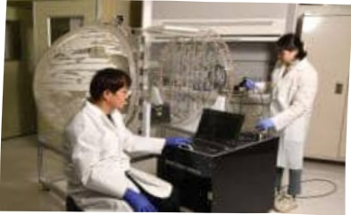

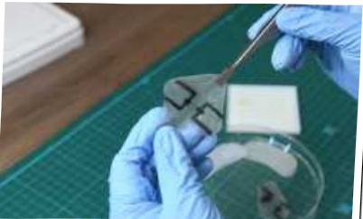

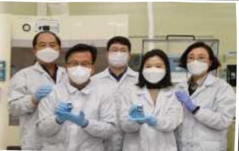

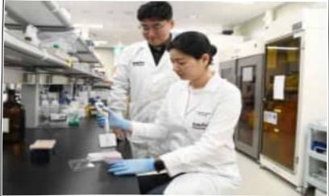

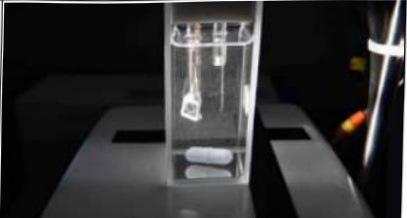

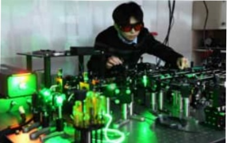

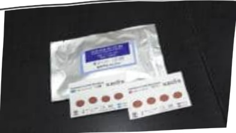

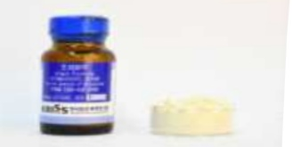

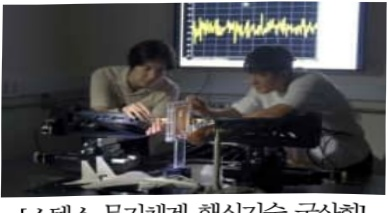

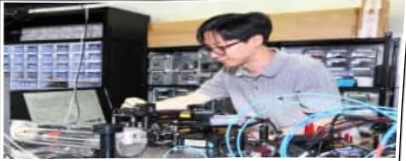

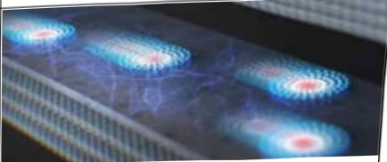

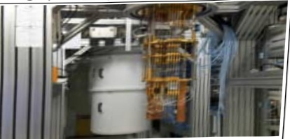

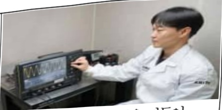

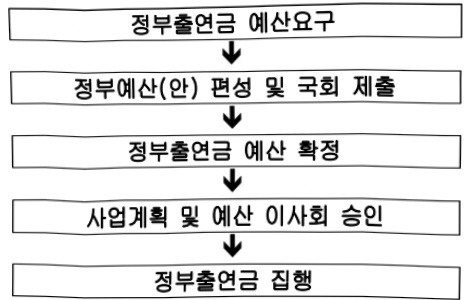

