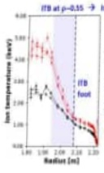
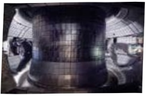
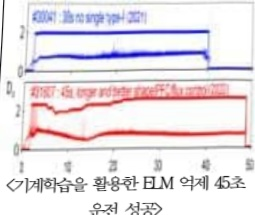
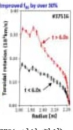
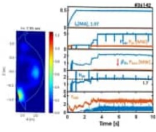
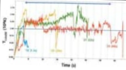
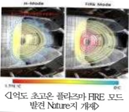
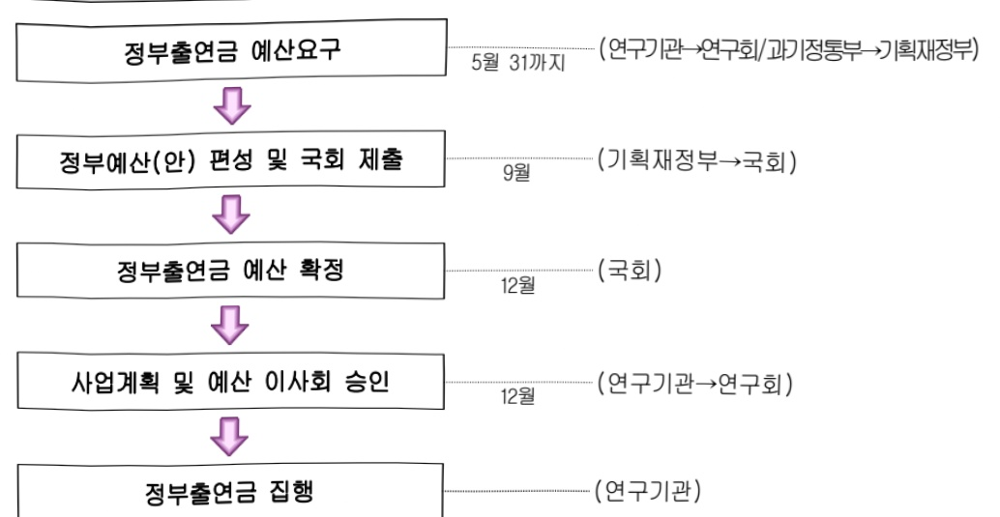

# 한국핵융합에너지연구원 연구 운영비지원(R&D)

**해당 페이지**: PDF 1763 ~ 1772 쪽 해당

**부처**: 과학기술정보통신부
**분야**: 과학기술
**회계유형**: 일반회계
**2026 확정예산**: 96122.0 백만원
**전년대비 증감률**: 0.5%
**AI 도메인**: 에너지, R&D 지원

---

<table border=1 style='margin: auto; word-wrap: break-word;'><tr><td style='text-align: center; word-wrap: break-word;'>사 업 명</td></tr><tr><td style='text-align: center; word-wrap: break-word;'>(225) 한국핵융합에너지연구원 연구 운영비지원(R&amp;D) (2241-402)</td></tr></table>

## ☐ 사업 코드 정보

<table border=1 style='margin: auto; word-wrap: break-word;'><tr><td style='text-align: center; word-wrap: break-word;'>구분</td><td style='text-align: center; word-wrap: break-word;'>회계</td><td style='text-align: center; word-wrap: break-word;'>소관</td><td style='text-align: center; word-wrap: break-word;'>실국(기관)</td><td style='text-align: center; word-wrap: break-word;'>계정</td><td style='text-align: center; word-wrap: break-word;'>분야</td><td style='text-align: center; word-wrap: break-word;'>부문</td></tr><tr><td style='text-align: center; word-wrap: break-word;'>코드</td><td rowspan="2">일반회계</td><td rowspan="2">과학기술정보통신부</td><td rowspan="2">연구개발정책실미래전략기술정책관</td><td rowspan="2">-</td><td style='text-align: center; word-wrap: break-word;'>150</td><td style='text-align: center; word-wrap: break-word;'>152</td></tr><tr><td style='text-align: center; word-wrap: break-word;'>명칭</td><td style='text-align: center; word-wrap: break-word;'>과학기술</td><td style='text-align: center; word-wrap: break-word;'>과학기술연구지원</td></tr></table>

<table border=1 style='margin: auto; word-wrap: break-word;'><tr><td style='text-align: center; word-wrap: break-word;'>구분</td><td style='text-align: center; word-wrap: break-word;'>프로그램</td><td style='text-align: center; word-wrap: break-word;'>단위사업</td><td style='text-align: center; word-wrap: break-word;'>세부사업</td></tr><tr><td style='text-align: center; word-wrap: break-word;'>코드</td><td style='text-align: center; word-wrap: break-word;'>2200</td><td style='text-align: center; word-wrap: break-word;'>2241</td><td style='text-align: center; word-wrap: break-word;'>402</td></tr><tr><td style='text-align: center; word-wrap: break-word;'>명칭</td><td style='text-align: center; word-wrap: break-word;'>출연연구기관지원</td><td style='text-align: center; word-wrap: break-word;'>국가과학기술연구회 소관출연연구기관지원</td><td style='text-align: center; word-wrap: break-word;'>한국핵융합에너지연구원 연구 운영비지원(R&amp;D)</td></tr></table>

□ 사업 성격 (공통요구자료 Ⅱ-1 작성유의사항 4. 참조, 해당하는 사항에 “○” 표시)

<table border=1 style='margin: auto; word-wrap: break-word;'><tr><td style='text-align: center; word-wrap: break-word;'>신규</td><td style='text-align: center; word-wrap: break-word;'>계속</td><td style='text-align: center; word-wrap: break-word;'>완료</td><td style='text-align: center; word-wrap: break-word;'>예비타당성 실시여부</td><td style='text-align: center; word-wrap: break-word;'>총사업비 관리대상</td><td style='text-align: center; word-wrap: break-word;'>총액계상 예산사업</td><td style='text-align: center; word-wrap: break-word;'>사업소관 변경정보 2025예산 시 소관</td></tr><tr><td style='text-align: center; word-wrap: break-word;'></td><td style='text-align: center; word-wrap: break-word;'>☐</td><td style='text-align: center; word-wrap: break-word;'></td><td style='text-align: center; word-wrap: break-word;'></td><td style='text-align: center; word-wrap: break-word;'></td><td style='text-align: center; word-wrap: break-word;'></td><td style='text-align: center; word-wrap: break-word;'></td></tr></table>

사업지원형태 및 지원을(최소한 한 개는 반드시 선택하시오. 해당사항에 O 표시)

<table border=1 style='margin: auto; word-wrap: break-word;'><tr><td style='text-align: center; word-wrap: break-word;'>직접</td><td style='text-align: center; word-wrap: break-word;'>출자</td><td style='text-align: center; word-wrap: break-word;'>출연</td><td style='text-align: center; word-wrap: break-word;'>보조</td><td style='text-align: center; word-wrap: break-word;'>융자</td><td style='text-align: center; word-wrap: break-word;'>국고보조율(%)</td><td style='text-align: center; word-wrap: break-word;'>융자율(%)</td></tr><tr><td style='text-align: center; word-wrap: break-word;'></td><td style='text-align: center; word-wrap: break-word;'></td><td style='text-align: center; word-wrap: break-word;'>○</td><td style='text-align: center; word-wrap: break-word;'></td><td style='text-align: center; word-wrap: break-word;'></td><td style='text-align: center; word-wrap: break-word;'></td><td style='text-align: center; word-wrap: break-word;'></td></tr></table>

## □ 사업 소관부처 및 시행주체

<table border=1 style='margin: auto; word-wrap: break-word;'><tr><td style='text-align: center; word-wrap: break-word;'>사업명</td><td colspan="2">구분</td></tr><tr><td rowspan="2">한국핵협회에너지연구원연구 운영비지원(2241-402)</td><td style='text-align: center; word-wrap: break-word;'>소관부처</td><td style='text-align: center; word-wrap: break-word;'>연구개발정책실미래전략기술정책관핵휴합에너지환경기술과</td></tr><tr><td style='text-align: center; word-wrap: break-word;'>사업시행주체</td><td style='text-align: center; word-wrap: break-word;'>한국핵휴합에너지연구원</td></tr></table>

---

### 가. 예산 총괄표

(단위: 백만원, %)

<table border=1 style='margin: auto; word-wrap: break-word;'><tr><td rowspan="2">사업명</td><td rowspan="2">2024년 결산</td><td colspan="2">2025년 예산</td><td colspan="2">2026년 예산</td><td rowspan="2">증감(B-A)</td><td rowspan="2">(B-A)/A</td></tr><tr><td style='text-align: center; word-wrap: break-word;'>본예산</td><td style='text-align: center; word-wrap: break-word;'>추경*(A)</td><td style='text-align: center; word-wrap: break-word;'>요구안</td><td style='text-align: center; word-wrap: break-word;'>본예산(B)</td></tr><tr><td style='text-align: center; word-wrap: break-word;'>한국혁융합 에너지연구원 연구 운영비 지원(R&amp;D)</td><td style='text-align: center; word-wrap: break-word;'>83,711</td><td style='text-align: center; word-wrap: break-word;'>95,657</td><td style='text-align: center; word-wrap: break-word;'>95,657</td><td style='text-align: center; word-wrap: break-word;'>96,122</td><td style='text-align: center; word-wrap: break-word;'>96,122</td><td style='text-align: center; word-wrap: break-word;'>465</td><td style='text-align: center; word-wrap: break-word;'>0.5</td></tr></table>

*추경: 추경증감액을 포함한 최종 예산액을 기재

## □ 기능별(내역사업별) 예산 내역

(단위: 백만원)

<table border=1 style='margin: auto; word-wrap: break-word;'><tr><td rowspan="2"></td><td colspan="5">2024</td><td colspan="5">2025</td><td rowspan="2">2026 倉圧</td></tr><tr><td style='text-align: center; word-wrap: break-word;'>倉圧の (専門)</td><td style='text-align: center; word-wrap: break-word;'>倉圧の 専門</td><td style='text-align: center; word-wrap: break-word;'>倉圧の 専門</td><td style='text-align: center; word-wrap: break-word;'>倉圧の 専門</td><td style='text-align: center; word-wrap: break-word;'>倉圧の 専門</td><td style='text-align: center; word-wrap: break-word;'>倉圧の (専門)</td><td style='text-align: center; word-wrap: break-word;'>倉圧の 専門</td><td style='text-align: center; word-wrap: break-word;'>倉圧の 専門</td><td style='text-align: center; word-wrap: break-word;'>倉圧の 専門</td><td style='text-align: center; word-wrap: break-word;'>倉圧の 専門</td></tr><tr><td style='text-align: center; word-wrap: break-word;'>○ 기능별 분류(専門)</td><td style='text-align: center; word-wrap: break-word;'>85,418</td><td style='text-align: center; word-wrap: break-word;'>85,418</td><td style='text-align: center; word-wrap: break-word;'>83,711</td><td style='text-align: center; word-wrap: break-word;'>-</td><td style='text-align: center; word-wrap: break-word;'>1,707</td><td style='text-align: center; word-wrap: break-word;'>95,657</td><td style='text-align: center; word-wrap: break-word;'>95,657</td><td style='text-align: center; word-wrap: break-word;'>93,871</td><td style='text-align: center; word-wrap: break-word;'>-</td><td style='text-align: center; word-wrap: break-word;'>1,786</td><td style='text-align: center; word-wrap: break-word;'>96,122</td></tr><tr><td style='text-align: center; word-wrap: break-word;'>○ 기관운영비</td><td style='text-align: center; word-wrap: break-word;'>32,438</td><td style='text-align: center; word-wrap: break-word;'>32,438</td><td style='text-align: center; word-wrap: break-word;'>30,731</td><td style='text-align: center; word-wrap: break-word;'>-</td><td style='text-align: center; word-wrap: break-word;'>1,707</td><td style='text-align: center; word-wrap: break-word;'>33,424</td><td style='text-align: center; word-wrap: break-word;'>33,424</td><td style='text-align: center; word-wrap: break-word;'>31,638</td><td style='text-align: center; word-wrap: break-word;'>-</td><td style='text-align: center; word-wrap: break-word;'>1,786</td><td style='text-align: center; word-wrap: break-word;'>34,623</td></tr><tr><td style='text-align: center; word-wrap: break-word;'>○ 주요사업비</td><td style='text-align: center; word-wrap: break-word;'>52,980</td><td style='text-align: center; word-wrap: break-word;'>52,980</td><td style='text-align: center; word-wrap: break-word;'>52,980</td><td style='text-align: center; word-wrap: break-word;'>-</td><td style='text-align: center; word-wrap: break-word;'>-</td><td style='text-align: center; word-wrap: break-word;'>62,233</td><td style='text-align: center; word-wrap: break-word;'>62,233</td><td style='text-align: center; word-wrap: break-word;'>62,233</td><td style='text-align: center; word-wrap: break-word;'>-</td><td style='text-align: center; word-wrap: break-word;'>-</td><td style='text-align: center; word-wrap: break-word;'>61,499</td></tr></table>

### 나. 사업설명자료

## 1 ) 사업목적·내용

- (한국핵융합에너지연구원 연구 운영비지원(R&D)) 핵융합에너지 연구개발을 수행하여 국가 경제의 발전과 국민의 삶의 질 향상

- (기관운영비) 기관 고유기능 수행 및 핵심역량 강화를 위한 연구·지원인력 인건비 및 경상경비

- (주요사업비)

① (KSTAR연구사업) KSTAR장치 및 설비의 안정적 운전·실험·유지보수·성능향상을 통한 국내외 핵융합 연구 선도장치로 운영하고, 초전도 토카막 장치 및 설비의 개발, 운영기술의 축적을 통해 핵융합로 개발을 위한 기술자립

② (핵융합실증로연구사업) 핵융합실증로 건설에 필요한 기반 기술·설계 기본개념 개발 및 고성능 클러스터 컴퓨터를 활용한 핵융합 시뮬레이션 기술개발

③(플라즈마기술연구사업)플라즈마 기술의 원천 연구 고도화를 통하여 플라즈마 기술 관련

---

국가전략산업의 기술한계 돌파 및 신시장 창출이 가능한 융복합기술 개발

④ (ITER핵심기술개발 및 운영·관리사업) ITER 핵심기술 추적·확보·개발, ITER 조달 품목의 품질관리, ITER 설계 및 형상 관리, TBM(테스트 블랙켓 모듈) 핵심기술 개발

⑤ (전략연구사업·초미세공정용반도체장비개발사업) 정부 반도체 주력산업 혁신 추진으로 첨단기술 초격차 확대를 위해 초미세(옹스트룸급, 2nm 이하) 세정공정용 표면처리 반도체 장비 개발을 통한 국산화, 부품 내재화 연구 수행

⑥ (장비·시스템구입비) 주요사업 수행을 위한 연구장비 예산 통합 관리

## 2 ) 사업개요

## 사업근거 및 추진경위

① 법령상 근거 및 조항 씩시

- 과학기술분야 정부출연연구기관등의 설립·운영 및 육성에 관한 법률 제5조

(운영재원) 및 제8조(연구기관의 설립)

제5조(운영재원) ① 연구기관 및 연구회는 정부의 출연금과 그 밖의 수익금으로 운영한다.

② 정부는 연구기관 및 연구회의 설립 · 운영에 드는 경비에 충당하기 위하여 예산의 범위에서 연구기관 및 연구회에 출연금을 지급할 수 있다.

제8조(연구기관의 설립) ① 이 법에 따라 설립되는 연구기관은 별표와 같다.

② 연구기관은 주된 사무소의 소재지에서 설립등기를 함으로써 성립한다.

③ 제2항에 따른 설립등기 사항은 다음 각 호와 같다.

1. 목적(연구 분야를 포함한다. 이하 같다)

2. 명칭

3. 주된 사무소

4. 연기기관의 장의 성명과 주소

5. 공고의 방법

④ 연기기관의 설립 준비절차에 관하여 필요한 사항은 대통령령으로 정한다.

## - 핵융합에너지개발진흥법 제8조(핵융합에너지 연구개발사업의 추진)

제8조(핵융합에너지 연구개발사업의 추진) ① 과학기술정보통신부장관은 기본계획에 따라 핵융합에너지 연구개발사업계획을 수립하고, 이를 효율적으로 추진하기 위하여 매년 연구과제를 선정하여 「기초연구진흥 및 기술개발지원에 관한 법률」 제14조 제1항 각 호의 기관이나 단체와 협약을 맺어 연구하게 할 수 있다. 이 경우 같은 법 제14조 제1항 제2호의 기관 중 대표권이 없는 기관에 대하여는 그 기관이 속한 법인의 대표자와 협약을 맺을 수 있다.

② 제1항에 따른 핵융합에너지 연구개발사업을 실시하는 데에 드는 비용은 다음 각 호의 재원으로 충당한다.

1. 정부의 출연금

2. 정부 외의 자의 출연금

3. 핵융합에너지 연구개발사업의 실시과정에서 발생한 잔액과 그 밖의 수입금

---

② 추진경위 - 사업 시작년도, 추진배경, 부처별 중점과제, 대통령 공약사항 등

- 1995. 12. 「국가핵융합연구개발기본계획」 확정 및 사업 착수

- 1996. 1. 기초(연) 핵융합연구개발사업단 출범

- 2003. 6. 국제핵융합실험로(ITER) 프로젝트 공식 가입

- 2005. 10. 기초(연) 부설 「국가핵융합연구소」 설립

- 2007. 9. KSTAR 완공식 개최 / ITER 한국사업단 출범

- 2008. 7. KSTAR 최초 플라즈마(First plasma)마일스톤 달성

- 2010. 11. 세계 최초 KSTAR 고성능 H-모드 달성

- 2012. 9. 세계 최초로 KSTAR를 통한 ITER제어시스템 실험성공

- 2012. 10. 군산 플라즈마기술연구센터 개소

- 2014. 6. 연구회 통합으로 소속변경(국가과학기술연구회)

- 2014. 12. ITER용 초전도 도체 조달 완료(참여국 중 최초)

- 2015. 10. 국가핵융합연구소 개소 10주년 기념행사 개최(10.1)

- 2016. 11. 플라즈마기술복합연구동(군산) 기공식 개최(11.29)

- 2017. 12. 핵융합 기술혁신 국민보고대회(ITER건설 10주년 기념)

- 2018. 12. [세계최초] KSTAR 핵융합 핵심조건 플라즈마 1억도 초고온 달성(1.5초)

- 2019. 12. [세계최장] KSTAR 핵융합 핵심조건 플라즈마 1억도 8초 유지 달성

- 2020. 4. 한국핵융합에너지연구원 설립 법안 통과(제337회 국회 임시회)

- 2020. 5. 독립 법인화 관련 과기출연기관법 일부개정(안) 공포

- 2020. 11. 한국핵융합에너지연구원 설립

- 2020. 11. [세계최장] KSTAR 핵융합 핵심조건 플라즈마 1억도 20초 유지 달성

- 2021. 9. [세계최장] KSTAR 핵융합 핵심조건 플라즈마 1억도 30초 유지 달성

- 2022. 09. KSTAR 새로운 초고온 운전모드 FIRE 발견 및 Nature 게재

- 2023~2024. 세계 최고 초고온 플라즈마 중심 이온 1억도(48초) 운전 기록 달성

---

## 주요내용

① 사업규모

- 총사업비 : 해당없음

- 사업기간 : 2006년 ~ 계속

- 최근 5년 간 투입된 사업비(예산액기준, 추경편성한 연도에는 추경포함)

<table border=1 style='margin: auto; word-wrap: break-word;'><tr><td style='text-align: center; word-wrap: break-word;'>$ \underline{\text{闻}} $</td><td style='text-align: center; word-wrap: break-word;'>2022</td><td style='text-align: center; word-wrap: break-word;'>2023</td><td style='text-align: center; word-wrap: break-word;'>2024</td><td style='text-align: center; word-wrap: break-word;'>2025</td><td style='text-align: center; word-wrap: break-word;'>2026</td></tr><tr><td style='text-align: center; word-wrap: break-word;'>$ \underline{\text{人}} $</td><td style='text-align: center; word-wrap: break-word;'>94,301</td><td style='text-align: center; word-wrap: break-word;'>97,198</td><td style='text-align: center; word-wrap: break-word;'>85,418</td><td style='text-align: center; word-wrap: break-word;'>95,657</td><td style='text-align: center; word-wrap: break-word;'>96,122</td></tr></table>

- 기타 : 해당없음

② 사업추진체계

- 사업시행방법 : 출자 등

- 사업시행주체 : 한국핵융합에너지연구원

- 사업 수혜자 : 산업계, 학계, 연구계, 공공부문 등 국가 모든 분야

- 보조, 융자, 출연, 출자 등의 경우 보조·융자 등 지원 비율 및 법적근거

<table border=1 style='margin: auto; word-wrap: break-word;'><tr><td style='text-align: center; word-wrap: break-word;'>내역사업명</td><td style='text-align: center; word-wrap: break-word;'>구분</td><td style='text-align: center; word-wrap: break-word;'>피보조·피출연 등 기관명</td><td style='text-align: center; word-wrap: break-word;'>지원 금액 (2026예산)</td><td style='text-align: center; word-wrap: break-word;'>지원 비율(%)</td><td style='text-align: center; word-wrap: break-word;'>보조율 법적근거 (해당 조항)</td></tr><tr><td style='text-align: center; word-wrap: break-word;'>한국핵융합 에너지연구원 연구 운영비 지원(R&amp;D)</td><td style='text-align: center; word-wrap: break-word;'>출연</td><td style='text-align: center; word-wrap: break-word;'>한국핵융합 에너지 연구원</td><td style='text-align: center; word-wrap: break-word;'>96,122</td><td style='text-align: center; word-wrap: break-word;'>100</td><td style='text-align: center; word-wrap: break-word;'>- 과학기술분야 정부출연연구기관 등의 설립·운영 및 육성에 관한 법률 제5조(운영재원) - 핵융합에너지개발진흥법 제8조(핵융합에너지연구개발사업의 추진)</td></tr></table>

## 3 ) 2026년도 예산 산출 근거

□ 기관운영비 : (25)33,424→ (26)34,623 백만원(전년도 본예산 대비 1,199 백만원, 3.6% 중액)

○ 인건비 : (‘25)30,694→(‘26)31,830백만원(전년대비 1,136백만원, 3.7% 증액)

- '25년도 미반영 인건비(3명) : 60백만원 증액

* (요구) 60백만원 → (조정) 60백만원

* (산출) 60백만원 = 3명 × 40백만원 × 6/12개월

- '26년도 통상처우개선분(3.5%) : 1,076백만원 증액

* (요구) 31,770백만원 → (조정) 31,770백만원

* (산출) 31,770백만원 = [30,694백만원(421명) × 3.5%(421명 × 1,076백만원) × 12/12개월] + ['25년 신규증원 인건비(3명, 6개월분, 60백만원)]

○ 경상경비 : (25)2,730 → (26)2,793 백만원 (전년대비 63백만원, 2.3% 증액)

- (출연연 공통) 경상비 효율화 감액 : △34백만원

---

- 공공요금·재산세 인상분, 자회사 처우개선분 등 : 97백만원 증액
* (요구) 2,793백만원 → (조정) 2,793백만원
* (산출) 2,793백만원 = 1개 × 2,793만원 × 12/12개월

### □ 주요사업비 : (25)62,233 → (26) 61,499 백만원(전년도 본예산 대비 △734 백만원, △1.2% 감액)

○ KSTAR연구사업(계속):('25)39,130→('26)34,547 백만원(전년대비 △4,583 백만원, △11.7% 감액)
* (요구) 34,547 백만원 → (조정) 34,547 백만원
* (산출) 34,547 백만원 = 3개 × 11,515.66 백만원 × 12/12개월
○ 핵융합실증로연구사업(계속):('25)10,478→('26)8,278 백만원(전년대비 △2,200 백만원, △21.0% 감액)
* (요구) 8,278 백만원 → (조정) 8,278 백만원
* (산출) 8,278 백만원 = 4개 × 2,069.5 백만원 × 12/12개월
○ 플라즈마기술연구사업(계속):('25)5,918→('26)5,818 백만원(전년대비 △100 백만원, △1.7% 감액)
* (요구) 5,818 백만원 → (조정) 5,818 백만원
* (산출) 5,818 백만원 = 3개 × 1,939.3 백만원 × 12/12개월
○ IER 핵심기술개발 및 운영·관리사업(계속):('25)4,787→('26)4,787 백만원(전년대비 △100 백만원, △20% 감액)
* (요구) 4,787 백만원 → (조정) 4,787 백만원
* (산출) 4,787 백만원 = 3개 × 1,595.66 백만원 × 12/12개월
○ 장비 · 시스템구축비(계속):('25)1,820→('26)1,791 백만원(전년대비 △29 백만원, △1.6% 감액)
* (요구) 1,791 백만원 → (조정) 1,791 백만원
* (산출) 1,791 백만원 = 42개 × 42.64 만원 × 12/12개월
○ (전략연구사업)초미세공정용반도체장비개발사업(신규):('25) - →('26)6,278 백만원(순증)
* (요구) 6,278 백만원 → (조정) 6,278 백만원
* (산출) 6,278 백만원 = 1개 × 6,278 만원 × 12/12개월

---

## 4 ) 사업효과

사업영향, 산출물 성과지표 등

①2022~2026년도 성과계획서 상 성과지표 및 최근 5년간 성과 달성도 : 해당없음

② 성과지표 이외의 연도별 사업추진 경과 및 실적

<table border=1 style='margin: auto; word-wrap: break-word;'><tr><td style='text-align: center; word-wrap: break-word;'>2022</td><td style='text-align: center; word-wrap: break-word;'></td><td style='text-align: center; word-wrap: break-word;'></td><td style='text-align: center; word-wrap: break-word;'>○ 기계학습을 활용한 ELM 억제 45 초 성공○ 1억도 초고온 플라즈마 FIRE(Fast Ion Regulated Enhancemen) 모드 발견 Nature지 개재</td></tr><tr><td style='text-align: center; word-wrap: break-word;'>2023</td><td style='text-align: center; word-wrap: break-word;'></td><td style='text-align: center; word-wrap: break-word;'></td><td style='text-align: center; word-wrap: break-word;'>○ 세계 최고 초고온 플라즈마 중심 이온 1억도(48초) 운전 기록 달성○ KSTAR텅스텐내벽장치 업그레이드</td></tr><tr><td style='text-align: center; word-wrap: break-word;'>2024</td><td style='text-align: center; word-wrap: break-word;'></td><td style='text-align: center; word-wrap: break-word;'></td><td style='text-align: center; word-wrap: break-word;'>○ 고밀도 이중장벽 운전모드를 바탕으로 자발전류비율 30% 이상 개선을 통하여 장시간 플라즈마 운전 기술 기반 강화•실종로 운영을 위해서는 자발전류비율이 60% 이상이어야 경제적인 연속운전이 가능함.○ 텅스텐 디버터환경 불순물 유입 억제로 방사에너지 손실 90%이상 감소로 플라즈마 성능 및 운전 안정성 향상 달성</td></tr><tr><td style='text-align: center; word-wrap: break-word;'>2025</td><td colspan="3">☐2025년도 정부출연금 95,657백만원○ 기관운영비 : 33,424백만원- 인건비 30,694백만원, 경상경비 2,730백만원○ 주요사업비 : 62,233백만원</td></tr></table>

## ③향후(2026년도 이후)기대효과

<table border=1 style='margin: auto; word-wrap: break-word;'><tr><td style='text-align: center; word-wrap: break-word;'>구분</td><td style='text-align: center; word-wrap: break-word;'>기대효과</td></tr><tr><td style='text-align: center; word-wrap: break-word;'>KSTAR 연구사업</td><td style='text-align: center; word-wrap: break-word;'>○ 고성능 플라즈마의 안정적 운전을 위한 제어기술 개선○ KSTAR 장치의 성능 유지보수 및 고도화를 통한 성능 유지○ 플라즈마 대향장치 성능향상 및 중성입자빔 가열장치의 성능 유지를 통해 플라즈마 이온온도 1억℃를 비롯한 고성능 운전 모드 장시간 운전을 위한 성능 안정성 확보○ 국제협력을 통한 핵융합실증로용 차세대 운전모드 개발 및 실증로 플라즈마 핵심기술 연구 주도○ KSTAR 300초 운전 목표 달성을 위하여 장치의 효과적인 성능향상과 유지보수 절차 확립○ KSTAR 장치를 활용한 민간업체의 핵융합 관련 기술 개발</td></tr></table>

---

<table border=1 style='margin: auto; word-wrap: break-word;'><tr><td style='text-align: center; word-wrap: break-word;'>구분</td><td style='text-align: center; word-wrap: break-word;'>기대효과</td></tr><tr><td style='text-align: center; word-wrap: break-word;'></td><td style='text-align: center; word-wrap: break-word;'>○인공지능 제어를 적용한 불안정성 억제 및 플라즈마 성능향상 개발을 통한 고효율 차세대 운전 기법 개발○안공지능 등 최신 제어 기법 및 ITER 실시간 운전 프레임윌 적용이 가능한 표준화된 차세대 제어 시스템 개발○KSTAR 내벽 전체 텅스텐화를 통한 차세대 실증로 내벽 환경 구현 및 운전 효율 극대화</td></tr><tr><td style='text-align: center; word-wrap: break-word;'>핵융합실증로 연구사업</td><td style='text-align: center; word-wrap: break-word;'>○핵융합 실증로 예비 개념 설계 및 개념설계 진행 및 핵융합로 요소 기술 개발 진행○핵융합 실증로 안전성 평가기술 개발 기반 제공○핵융합 실증플랜트 설계에 필요한 동력계통 및 안전성 평가기술 개발 기반 제공○핵융합 연구를 위한 슈퍼컴퓨팅 기술개발 및 공유, 자원 활용 서비스 제공○핵융합 슈퍼컴퓨팅 사례이선 기술을 통한 KSTAR 고성능 운전 사나리오 개발 지원 및 가속화○핵융합 실증로 개념설계를 위한 시뮬레이션 기반 기술 확보○핵융합로용 고온초전도 도체제작 기법 확립 및 SULTAN 시험시설 등 도체 시험시설에서 평가가 가능한 시제품 제작/평가 진행○국제 공동연구를 통한 실증로용 가열 및 핵심 제어기술 시스템 구축 및 개발○중성자 조사를 통한 삼중수소 증식 성능평가 및 중성자 조사에 따른 내벽부품 구조 건정성 영향 평가 데이터베이스 구축</td></tr><tr><td style='text-align: center; word-wrap: break-word;'>플라즈마기술 연구사업</td><td style='text-align: center; word-wrap: break-word;'>○플라즈마 융복합 원천기술개발의 기반 제공 통한 핵심기술개발 촉진 및 산업체로의 기술이전을 통한 국가산업 경쟁력 제고○플라즈마기술과 환경·에너지 분야의 융합기술 개발로 얻어지는 기술을 다양한 분야로 확대하고, 신산업 창출 및 환경관련 중소기업 등의 신산업 성장동력 확보에 활용하는 등 탄소중립을 위한 청록수소 생산 및 자원 재순환 기여○반도체 제조 플라즈마 공정 예측/제어 원천기술 고도화○플라즈마 공정가스 기초 반응물성 데이터 개발 및 플라즈마 장비 해석 선도기술 개발○플라즈마소재부품연구실(국가연구실 N-Lab 지정(&#x27;20.6월))에 따른 반도체·디스플레이 등 국가 첨단 주력산업 분야 소재·부품·장비 자립역량 강화를 위한 핵심기술 개발 및 해외 의존도 해소</td></tr><tr><td style='text-align: center; word-wrap: break-word;'>ITER 핵심기술개발 및 운영·관리사업</td><td style='text-align: center; word-wrap: break-word;'>○국내 핵융합에너지 상용화 기술 확보에 필요한 전문핵심인력 지속 양성/해외수주 확대 및 종합사업관리 시스템 고도화를 통한 국제적인 사업관리 체계 구축○ITER 비조달 핵심품목을 포함한 ITER 장치 핵심기술 확보 및 ITER 운영 관련 분야별 선행연구를 통한 ITER 공동개발사업 실험·연구 참여 기회 확대○ITER TBM 인허가 문서 작성 및 절차 파악을 통해 향후 핵융합로의 원자력 인허가 절차 개발에 유용하게 활용 기대○한-EU TBM 공동연구 및 개발 등을 통해 증식 블량케 핵심기술 전략적 확보 및 향후 한국형 핵융합실증로 설계와 건설에 활용 기대</td></tr><tr><td style='text-align: center; word-wrap: break-word;'>전략연구사업 (초미세공정용 반도체장비 개발사업)</td><td style='text-align: center; word-wrap: break-word;'>○정부 반도체 주력산업 혁신 추진으로 첨단기술 초격차 확대를 위해 초미세 (옹스트룸급, 2nm 이하) 세정공정용 표면처리 반도체 장비 개발을 통한 국산화, 부품 내재화 기여</td></tr></table>

---

5) 타당성조사 및 예비타당성조사 시행여부 및 결과 요지 : 해당없음

6) 총사업비 대상사업 정보 : 해당없음

7) 사업 집행절차

○ 연구원(예산 요구(안) 제출) / ○ 국가과학기술연구회(예산 요구(안) 심의 · 의결 · 제출)

○ 과학기술정보통신부(예산 요구(안) 심의 · 제출) / ○ 기획재정부(예산 요구(안) 심의 및 정부(안) 확정)

○ 국회 과기정통위(예산 요구(안) 심의 및 승인) / ○ 국회 예결위(예산 요구(안) 심의 및 승인)

○ 한국핵융합에너지연구원(사업계획 및 예산(안) 제출 및 승인) / ○ 한국핵융합에너지연구원(출연금 교부 신청)

○ 과학기술정보통신부(출연금 교부) / ○ 한국핵융합에너지연구원(사업 수행)

## 8 ) 각종 평가

1) 국회(예결위, 상임위, 예정처, 국정감사 포함) 지적 : 해당없음

2) 대외공개 평가

- 2023년도 국가과학기술연구회 소관 정부출연연구기관 기관평가 “보통”

3) 자체평가 : 해당없음

---

### 다. 최근 4년간 결산내역

## 1 ) 결산표

☐ 부처 결산내역

(단위: 백만원, %)

<table border=1 style='margin: auto; word-wrap: break-word;'><tr><td rowspan="2">연도</td><td colspan="3">예산액</td><td rowspan="2">예산현액(A)</td><td rowspan="2">집행액(B)</td><td rowspan="2">집행률(B/A)</td><td rowspan="2">다음연도이월액</td><td rowspan="2">불용액</td></tr><tr><td style='text-align: center; word-wrap: break-word;'>본예산</td><td style='text-align: center; word-wrap: break-word;'>추경증감액</td><td style='text-align: center; word-wrap: break-word;'>추경</td></tr><tr><td style='text-align: center; word-wrap: break-word;'>2022</td><td style='text-align: center; word-wrap: break-word;'>94,301</td><td style='text-align: center; word-wrap: break-word;'>-</td><td style='text-align: center; word-wrap: break-word;'>94,301</td><td style='text-align: center; word-wrap: break-word;'>94,301</td><td style='text-align: center; word-wrap: break-word;'>92,601</td><td style='text-align: center; word-wrap: break-word;'>98.2</td><td style='text-align: center; word-wrap: break-word;'>-</td><td style='text-align: center; word-wrap: break-word;'>1,700</td></tr><tr><td style='text-align: center; word-wrap: break-word;'>2023</td><td style='text-align: center; word-wrap: break-word;'>97,198</td><td style='text-align: center; word-wrap: break-word;'>-</td><td style='text-align: center; word-wrap: break-word;'>97,198</td><td style='text-align: center; word-wrap: break-word;'>97,198</td><td style='text-align: center; word-wrap: break-word;'>95,470</td><td style='text-align: center; word-wrap: break-word;'>98.2</td><td style='text-align: center; word-wrap: break-word;'>-</td><td style='text-align: center; word-wrap: break-word;'>1,728</td></tr><tr><td style='text-align: center; word-wrap: break-word;'>2024</td><td style='text-align: center; word-wrap: break-word;'>85,418</td><td style='text-align: center; word-wrap: break-word;'>-</td><td style='text-align: center; word-wrap: break-word;'>85,418</td><td style='text-align: center; word-wrap: break-word;'>85,418</td><td style='text-align: center; word-wrap: break-word;'>83,711</td><td style='text-align: center; word-wrap: break-word;'>98.0</td><td style='text-align: center; word-wrap: break-word;'>-</td><td style='text-align: center; word-wrap: break-word;'>1,707</td></tr><tr><td style='text-align: center; word-wrap: break-word;'>2025</td><td style='text-align: center; word-wrap: break-word;'>95,657</td><td style='text-align: center; word-wrap: break-word;'>-</td><td style='text-align: center; word-wrap: break-word;'>95,657</td><td style='text-align: center; word-wrap: break-word;'>95,657</td><td style='text-align: center; word-wrap: break-word;'>93,871</td><td style='text-align: center; word-wrap: break-word;'>98.1</td><td style='text-align: center; word-wrap: break-word;'>-</td><td style='text-align: center; word-wrap: break-word;'>1,786</td></tr></table>

## 2 ) 주요 결산사항

□ 2022~2025년 결산 주요사항

<table border=1 style='margin: auto; word-wrap: break-word;'><tr><td style='text-align: center; word-wrap: break-word;'>2022</td><td style='text-align: center; word-wrap: break-word;'>- 정부정책으로 인한 출연금 인건비 미교부(1,700백만원)</td></tr><tr><td style='text-align: center; word-wrap: break-word;'>2023</td><td style='text-align: center; word-wrap: break-word;'>- 정부정책으로 인한 출연금 인건비 미교부(1,728백만원)</td></tr><tr><td style='text-align: center; word-wrap: break-word;'>2024</td><td style='text-align: center; word-wrap: break-word;'>- 정부정책으로 인한 출연금 인건비 미교부(1,707백만원)</td></tr><tr><td style='text-align: center; word-wrap: break-word;'>2025</td><td style='text-align: center; word-wrap: break-word;'>- 정부정책으로 인한 출연금 인건비 미교부(1,786백만원)</td></tr></table>

□ 2025년 이·전용 등 세부내역 : 해당없음

---

### 원본 PDF 크롭 이미지

