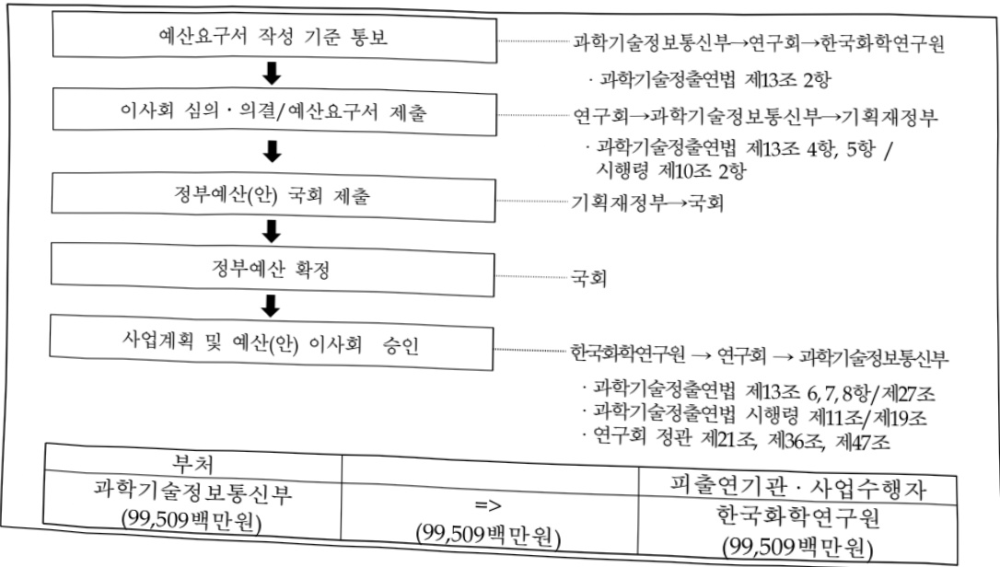

# 한국화학연구원연구운영비지원(R&D)

**해당 페이지**: PDF 1773 ~ 1781 쪽 해당

**부처**: 과학기술정보통신부
**분야**: 과학기술
**회계유형**: 일반회계
**2026 확정예산**: 99509.0 백만원
**전년대비 증감률**: 18.7%
**AI 도메인**: R&D 지원

---

<table border=1 style='margin: auto; word-wrap: break-word;'><tr><td style='text-align: center; word-wrap: break-word;'>사 업 명</td></tr><tr><td style='text-align: center; word-wrap: break-word;'>(238) 한국화학연구원 연구운영비 지원(R&amp;D) (2241-427)</td></tr></table>

☐ 사업 코드 정보

<table border=1 style='margin: auto; word-wrap: break-word;'><tr><td style='text-align: center; word-wrap: break-word;'>구분</td><td style='text-align: center; word-wrap: break-word;'>회계</td><td style='text-align: center; word-wrap: break-word;'>소관</td><td style='text-align: center; word-wrap: break-word;'>실국(기관)</td><td style='text-align: center; word-wrap: break-word;'>계정</td><td style='text-align: center; word-wrap: break-word;'>분야</td><td style='text-align: center; word-wrap: break-word;'>부문</td></tr><tr><td style='text-align: center; word-wrap: break-word;'>코드</td><td rowspan="2">일반회계</td><td rowspan="2">과학기술정보통신부</td><td rowspan="2">연구개발정책실기초원천연구정책관</td><td rowspan="2">-</td><td style='text-align: center; word-wrap: break-word;'>150</td><td style='text-align: center; word-wrap: break-word;'>152</td></tr><tr><td style='text-align: center; word-wrap: break-word;'>명칭</td><td style='text-align: center; word-wrap: break-word;'>과학기술</td><td style='text-align: center; word-wrap: break-word;'>과학기술연구지원</td></tr></table>

<table border=1 style='margin: auto; word-wrap: break-word;'><tr><td style='text-align: center; word-wrap: break-word;'>구분</td><td style='text-align: center; word-wrap: break-word;'>프로그램</td><td style='text-align: center; word-wrap: break-word;'>단위사업</td><td style='text-align: center; word-wrap: break-word;'>세부사업</td></tr><tr><td style='text-align: center; word-wrap: break-word;'>코드</td><td style='text-align: center; word-wrap: break-word;'>2200</td><td style='text-align: center; word-wrap: break-word;'>2241</td><td style='text-align: center; word-wrap: break-word;'>427</td></tr><tr><td style='text-align: center; word-wrap: break-word;'>명칭</td><td style='text-align: center; word-wrap: break-word;'>출연연구기관지원</td><td style='text-align: center; word-wrap: break-word;'>국가과학기술연구회 소관출연연구기관지원</td><td style='text-align: center; word-wrap: break-word;'>한국화학연구원 연구운영비 지원(R&amp;D)</td></tr></table>

☐ 사업 성격

<table border=1 style='margin: auto; word-wrap: break-word;'><tr><td rowspan="2">신규</td><td rowspan="2">계속</td><td rowspan="2">완료</td><td rowspan="2">예비타당성 실시여부</td><td rowspan="2">총사업비 관리대상</td><td rowspan="2">총액계상 예산사업</td><td style='text-align: center; word-wrap: break-word;'>사업소관 변경정보</td></tr><tr><td style='text-align: center; word-wrap: break-word;'>2025예산 시 소관</td></tr><tr><td style='text-align: center; word-wrap: break-word;'></td><td style='text-align: center; word-wrap: break-word;'>○</td><td style='text-align: center; word-wrap: break-word;'></td><td style='text-align: center; word-wrap: break-word;'></td><td style='text-align: center; word-wrap: break-word;'></td><td style='text-align: center; word-wrap: break-word;'></td><td style='text-align: center; word-wrap: break-word;'></td></tr></table>

□ 사업 지원 형태 및 지원율

<table border=1 style='margin: auto; word-wrap: break-word;'><tr><td style='text-align: center; word-wrap: break-word;'>직접</td><td style='text-align: center; word-wrap: break-word;'>출자</td><td style='text-align: center; word-wrap: break-word;'>출연</td><td style='text-align: center; word-wrap: break-word;'>보조</td><td style='text-align: center; word-wrap: break-word;'>융자</td><td style='text-align: center; word-wrap: break-word;'>국고보조율(%)</td><td style='text-align: center; word-wrap: break-word;'>융자율(%)</td></tr><tr><td style='text-align: center; word-wrap: break-word;'></td><td style='text-align: center; word-wrap: break-word;'></td><td style='text-align: center; word-wrap: break-word;'>○</td><td style='text-align: center; word-wrap: break-word;'></td><td style='text-align: center; word-wrap: break-word;'></td><td style='text-align: center; word-wrap: break-word;'></td><td style='text-align: center; word-wrap: break-word;'></td></tr></table>

□ 사업 소관부처 및 시행주체

<table border=1 style='margin: auto; word-wrap: break-word;'><tr><td style='text-align: center; word-wrap: break-word;'>사업명</td><td colspan="2">구분</td></tr><tr><td rowspan="3">한국화학연구원연구운영비지원(R&amp;D)(2241-301)</td><td rowspan="2">소관부처</td><td style='text-align: center; word-wrap: break-word;'>연구개발정책실 기초원천연구정책관</td></tr><tr><td style='text-align: center; word-wrap: break-word;'>연구기관혁신정책과</td></tr><tr><td style='text-align: center; word-wrap: break-word;'>사업시행주체</td><td style='text-align: center; word-wrap: break-word;'>한국화학연구원</td></tr></table>

---

### 가. 예산 총괄표

(단위: 백만원, %)

<table border=1 style='margin: auto; word-wrap: break-word;'><tr><td rowspan="2">사업명</td><td rowspan="2">2024년 결산</td><td colspan="2">2025년 예산</td><td colspan="2">2026년 예산</td><td rowspan="2">증감(B-A)</td><td rowspan="2">(B-A)/A</td></tr><tr><td style='text-align: center; word-wrap: break-word;'>본예산</td><td style='text-align: center; word-wrap: break-word;'>추경(A)</td><td style='text-align: center; word-wrap: break-word;'>요구안</td><td style='text-align: center; word-wrap: break-word;'>본예산(B)</td></tr><tr><td style='text-align: center; word-wrap: break-word;'>한국화학연구원 연구운영비 지원(R&amp;D)</td><td style='text-align: center; word-wrap: break-word;'>73,187</td><td style='text-align: center; word-wrap: break-word;'>83,863</td><td style='text-align: center; word-wrap: break-word;'>83,863</td><td style='text-align: center; word-wrap: break-word;'>99,509</td><td style='text-align: center; word-wrap: break-word;'>99,509</td><td style='text-align: center; word-wrap: break-word;'>15,646</td><td style='text-align: center; word-wrap: break-word;'>18.7</td></tr></table>

□ 기능별(내역사업별) 예산 내역

(단위:백만원)

<table border=1 style='margin: auto; word-wrap: break-word;'><tr><td rowspan="2"></td><td colspan="5">2024</td><td colspan="5">2025</td><td rowspan="2">2026예산</td></tr><tr><td style='text-align: center; word-wrap: break-word;'>예산액(추정)</td><td style='text-align: center; word-wrap: break-word;'>예산현액</td><td style='text-align: center; word-wrap: break-word;'>집행액</td><td style='text-align: center; word-wrap: break-word;'>이월액</td><td style='text-align: center; word-wrap: break-word;'>불용액</td><td style='text-align: center; word-wrap: break-word;'>예산액(추정)</td><td style='text-align: center; word-wrap: break-word;'>예산현액</td><td style='text-align: center; word-wrap: break-word;'>집행액</td><td style='text-align: center; word-wrap: break-word;'>이월액</td><td style='text-align: center; word-wrap: break-word;'>불용액</td></tr><tr><td style='text-align: center; word-wrap: break-word;'>○ 기능별 분류(합계)</td><td style='text-align: center; word-wrap: break-word;'>74,493</td><td style='text-align: center; word-wrap: break-word;'>74,493</td><td style='text-align: center; word-wrap: break-word;'>73,187</td><td style='text-align: center; word-wrap: break-word;'>-</td><td style='text-align: center; word-wrap: break-word;'>1,306</td><td style='text-align: center; word-wrap: break-word;'>83,863</td><td style='text-align: center; word-wrap: break-word;'>83,863</td><td style='text-align: center; word-wrap: break-word;'>82,220</td><td style='text-align: center; word-wrap: break-word;'>-</td><td style='text-align: center; word-wrap: break-word;'>1,643</td><td style='text-align: center; word-wrap: break-word;'>99,509</td></tr><tr><td style='text-align: center; word-wrap: break-word;'>· 기관운영비</td><td style='text-align: center; word-wrap: break-word;'>43,487</td><td style='text-align: center; word-wrap: break-word;'>43,487</td><td style='text-align: center; word-wrap: break-word;'>42,181</td><td style='text-align: center; word-wrap: break-word;'>-</td><td style='text-align: center; word-wrap: break-word;'>1,306</td><td style='text-align: center; word-wrap: break-word;'>44,857</td><td style='text-align: center; word-wrap: break-word;'>44,857</td><td style='text-align: center; word-wrap: break-word;'>43,214</td><td style='text-align: center; word-wrap: break-word;'>-</td><td style='text-align: center; word-wrap: break-word;'>1,643</td><td style='text-align: center; word-wrap: break-word;'>46,458</td></tr><tr><td style='text-align: center; word-wrap: break-word;'>· 주요사업비</td><td style='text-align: center; word-wrap: break-word;'>31,006</td><td style='text-align: center; word-wrap: break-word;'>31,006</td><td style='text-align: center; word-wrap: break-word;'>31,006</td><td style='text-align: center; word-wrap: break-word;'>-</td><td style='text-align: center; word-wrap: break-word;'>-</td><td style='text-align: center; word-wrap: break-word;'>39,006</td><td style='text-align: center; word-wrap: break-word;'>39,006</td><td style='text-align: center; word-wrap: break-word;'>39,006</td><td style='text-align: center; word-wrap: break-word;'>-</td><td style='text-align: center; word-wrap: break-word;'>-</td><td style='text-align: center; word-wrap: break-word;'>53,051</td></tr></table>

### 나. 사업설명자료

## 1 ) 사업목적·내용

- (한국화학연구원 연구운영비 지원(R&D)) 화학 및 관련 융·복합 기술 분야의 원천 기술 개발 및 성과확산, 공공인프라 구축 및 대외지원을 통해 화학산업의 경쟁력 강화와 국가 신성장산업 창출에 기여하기 위한 사업 수행

(친환경 화학공정 기술개발 사업) 온실가스 감축 및 에너지 절감형 화학원료 생산 등

친환경 화학공정 기술개발을 통해 산업경쟁력 강화와 삶의 질 향상

(미래 신물질 융합화학 기술개발 사업) 신약 파이프라인 확보와 시장 선도형 질병 진단·치료제 후보물질 등 개발을 통해 국민 삶의 질 향상

·(화학기술 공공인프라 활용 산업지원사업) 4차 산업혁명 및 혁신성장과 사회·산업수요 대응을 위한 화학 플랫폼 기술 개발

(미래성장동력 창출 및 기업지원사업) 미래성장동력 창출 및 국가 화학산업 정책·정보·전략 Think-tank로서의 역할 수행

(장비구입비) 기관 고유임무 수행 및 기업 지원에 필요한 고가 연구 장비 신규 도입 및 노후 연구 장비 교체를 통해 성과 창출 기반 확대

---

(차세대 모달리티 기반 난치질환 치료제 개발 사업) 난치성 질환(유방암 및 전립선암 등)의 치료율 향상을 위한 차세대 모달리티 기반 난치 질환 치료 후보물질 개발

(자율 실험 시스템 기반 첨단 소재 신속 Scale-up 개발 사업) AI 기술 및 로봇 기반 자율화 실험실을 연동한 플랫폼 웹서비스 제공을 통해 소재 개발 주기의 획기적 단축 및 소재 AI 글로벌 리더십 확립

(가속화 플랫폼 기반 항생제 내성균 대응 치료제 개발 사업) 항생제 내성 문제의 신속하고 효과적인 극복을 위한 기술 개발 플랫폼 구축 및 이를 활용한 항생제 후보물질 도출

## 2 ) 사업개요

## 사업근거 및 추진경위

① 법령상 근거 및 조항

- 과학기술분야 정무줄연연구기관 등의 설립·운영 및 육성에 관한 법률 제5조(운영재원) 및 제8조(연구기관의 설립)

제5조(운영재원) ① 연구기관 및 연구회는 정부의 출연금과 그 밖의 수익금으로 운영한다.

② 정부는 연구기관 및 연구회의 설립 · 운영에 드는 경비에 충당하기 위하여 예산의 범위에서 연구기관 및 연구회에 출연금을 지급할 수 있다.

제8조(연구기관의 설립) ① 이 법에 따라 설립되는 연구기관은 별표와 같다.

② 연구기관은 주된 사무소의 소재지에서 설립등기를 함으로써 성립한다.

③ 제2항에 따른 설립등기 사항은 다음 각 호와 같다.

1. 목적(연구 분야를 포함한다. 이하 같다)

2. 명칭

3. 주된 사무소

4. 연구기관의 장의 성명과 주소

5. 공고의 방법

④연구기관의 설립 준비절차에 관하여 필요한 사항은 대통령령으로 정한다.

## ② 추진경위

- 1976. 9 : 재단법인 한국화학연구소 설립

- 1982. 2 : 살균 및 표백제 ‘옥시크린’ 개발

- 1994. 2 : 정밀화학원료 ‘폴리부텐’ 개발

- 2001. 1 : 한국화학연구원으로 명칭 변경

- 2002. 1 : 부설 안전성평가연구소 설립

- 2009.12 : GTL(Gas-to-Liquid) 공정 기술 개발

- 2014.10 : 항바이러스 치료제 후보 물질 개발

- 2016. 3 : 울산 바이오화학실용화센터 개소

- 2017. 7 : 과학기술정보통신부 산하 국가과학기술연구회 소속으로 변경

- 2020. 1 : 소재·부품·장비산업 경쟁력강화를 위한 특별조치법 관련 주요사업비 일부

특별회계로 이관

---

## 주요내용

① 사업규모

- 총사업비 : 해당 없음

- 사업기간 : '76년 ~ 계속

- 최근 5년 간 투입된 사업비(예산액기준, 추경편성한 연도에는 추경포함)

<table border=1 style='margin: auto; word-wrap: break-word;'><tr><td style='text-align: center; word-wrap: break-word;'>연도</td><td style='text-align: center; word-wrap: break-word;'>2022</td><td style='text-align: center; word-wrap: break-word;'>2023</td><td style='text-align: center; word-wrap: break-word;'>2024</td><td style='text-align: center; word-wrap: break-word;'>2025</td><td style='text-align: center; word-wrap: break-word;'>2026</td></tr><tr><td style='text-align: center; word-wrap: break-word;'>사업비</td><td style='text-align: center; word-wrap: break-word;'>86,755</td><td style='text-align: center; word-wrap: break-word;'>96,267</td><td style='text-align: center; word-wrap: break-word;'>74,493</td><td style='text-align: center; word-wrap: break-word;'>83,863</td><td style='text-align: center; word-wrap: break-word;'>99,509</td></tr></table>

* '24년부터 시설비는 한국화학연구원 시설 지원(R&D)으로 분리 작성

- 기타 : 해당 없음

② 사업추진체계

- 사업시행방법 : 출연

- 사업시행주체 : 한국화학연구원

- 사업 수혜자 : 산·학·연·관 및 국민

- 보조, 융자, 출연, 출자 등의 경우 보조·융자 등 지원 비율 및 법적근거

<table border=1 style='margin: auto; word-wrap: break-word;'><tr><td style='text-align: center; word-wrap: break-word;'>내역사업명</td><td style='text-align: center; word-wrap: break-word;'>구분</td><td style='text-align: center; word-wrap: break-word;'>피보조·피출연 등 기관명</td><td style='text-align: center; word-wrap: break-word;'>지원 금액 (2026예산)</td><td style='text-align: center; word-wrap: break-word;'>지원 비율(%)</td><td style='text-align: center; word-wrap: break-word;'>보조율 법적근거 (해당 조항)</td></tr><tr><td style='text-align: center; word-wrap: break-word;'>한국화학연구원 연구운영비 지원(R&amp;D)</td><td style='text-align: center; word-wrap: break-word;'>출연</td><td style='text-align: center; word-wrap: break-word;'>한국화학 연구원</td><td style='text-align: center; word-wrap: break-word;'>99,509</td><td style='text-align: center; word-wrap: break-word;'>100</td><td style='text-align: center; word-wrap: break-word;'>- 과학기술분야 정부출연연구기관 등의 설립·운영 및 육성에 관한 법률 제5조 및 제8조</td></tr></table>

## 3 ) 2026년도 예산 산출 근거

① 인건비

:(25)40,264백만원→(26)41,694백만원,1,430백만원증액

- (반영) '25년 신규 인력(1명) 인건비 미반영분, 처우개선 인건비

- (산출) '25년 인건비(40,264백만원), '25년 신규 인력(1명) 인건비 미반영분(20백만원), 처우개선(3.5%)(1,410백만원)

② 경상비

:(25)4,593백만원→(26)4,764백만원,171백만원증액

- (반영) 공공요금(전기) 증액분, 자회사 처우개선, 재산세 인상분

- (산출) '25년 기반영 경상비(4,593백만원), 공공요금(전기) 증액(186백만원), '26년 자회사 처우 개선(42백만원), 재산세 증가분(29백만원), 경상비 효율화(△86백만원)

③ 주요사업비

:(25)39,006백만원→(26)53,051백만원,14,045백만원 증액

- (반영) R&R, 정부 정책 연계 및 전략연구사업 수행에 따른 주요사업비 요구

- (산출) '26년 계속사업 지출효율화(△4,885백만원), 신규 전략연구사업'(14,930백만원) 및 기관고유사업*(4,000백만원)* 차세대 모달리티 기반 난치질환 치료제 개발 사업(5,098백만원), 자율 실험 시스템 기반첨단 소재 신속 Scale-up 개발 사업(5,098백만원), 가속화 플랫폼 기반 항생제 내성균 대응 치료제 개발 사업(4,734백만원)** 산연 협력 기반 시장 수요 맞춤형 대형집단 R&D 지원사업(2,000백만원), 임무 중심 대형집단 연구개발 시스템 구축운영(2,000백만원)

---

°2025년도 예산 및 2026년도 예산 산출 세부내역 비교

<table border=1 style='margin: auto; word-wrap: break-word;'><tr><td style='text-align: center; word-wrap: break-word;'>구분</td><td style='text-align: center; word-wrap: break-word;'>&#x27;25년 예산 산출내역</td><td style='text-align: center; word-wrap: break-word;'>&#x27;26년 예산 산출내역</td></tr><tr><td style='text-align: center; word-wrap: break-word;'>☐ 한국화학연구원 연구운영비 지원(R&amp;D)</td><td style='text-align: center; word-wrap: break-word;'>83,863백만원</td><td style='text-align: center; word-wrap: break-word;'>99,509백만원</td></tr><tr><td style='text-align: center; word-wrap: break-word;'>(1) 인건비</td><td style='text-align: center; word-wrap: break-word;'>40,264백만원 기반영 인건비 (39,072백만원, 636명) 인건비 처우 개선분 (3.0%, 1,172백만원) &#x27;25년 신규 인력 인건비 (20백만원)</td><td style='text-align: center; word-wrap: break-word;'>41,694백만원 기반영 인건비 (40,264백만원, 636명) &#x27;25년 신규 인력 (1명) 인건비 미반영분 (20백만원) 통상적 처우개선 (3.5%, 1,410백만원)</td></tr><tr><td style='text-align: center; word-wrap: break-word;'>(2) 경상비</td><td style='text-align: center; word-wrap: break-word;'>4,593백만원 &#x27;22년 기반영 경상비 (4,415백만원) &#x27;24년 시설 완공 소요 미반영분 (205백만원) 공공요금 증액분 등 (49백만원) 비경직성 경상경비 공통 감액 (△76백만원)</td><td style='text-align: center; word-wrap: break-word;'>4,764백만원 &#x27;25년 기반영 경상비 (4,593백만원) 공공요금(전기) 증액 (186백만원) 자회사 처우개선 (42백만원) 재산세 인상분 증액 (29백만원) 경상비 효율화 (△86백만원)</td></tr><tr><td style='text-align: center; word-wrap: break-word;'>(3) 주요사업비</td><td style='text-align: center; word-wrap: break-word;'>39,006백만원 ☐ 계속사업비 반영 가: 진환경 화학공정 기술개발 사업 (13,374백만원) ☐ 1개 과제 x 6,623백만원 = 6,623백만원 ☐ 1개 과제 x 6,751백만원 = 6,751백만원 나: 미래 신물질 및 융합화학 기술개발 사업 (13,679백만원) ☐ 1개 과제 x 3,694백만원 = 3,694백만원 ☐ 1개 과제 x 2,898백만원 = 2,898백만원 ☐ 1개 과제 x 7,087백만원 = 7,087백만원 다: 화학기술 공공인프라 활용 산업지원사업 (5,240백만원) ☐ 1개 과제 x 2,566백만원 = 2,566백만원 ☐ 1개 과제 x 1,295백만원 = 1,295백만원 ☐ 1개 과제 x 1,379백만원 = 1,379백만원 라: 미래성장동력 장출 및 기업지원사업 (2,687백만원) ☐ 1개 과제 x 1,627백만원 = 1,627백만원 ☐ 1개 과제 x 1,060백만원 = 1,060백만원 마: 장비구입비 (4,026백만원) ☐ 34개 x 118백만원 = 4,026백만원</td><td style='text-align: center; word-wrap: break-word;'>53,051백만원 ☐ 계속사업비 반영 가: 진환경 화학공정 기술개발 사업 (10,930백만원) ☐ 1개 과제 x 5,370백만원 = 5,370백만원 ☐ 1개 과제 x 5,560백만원 = 5,560백만원 나: 미래 신물질 및 융합화학 기술개발 사업 (10,100백만원) ☐ 1개 과제 x 3,140백만원 = 3,140백만원 ☐ 1개 과제 x 2,010백만원 = 2,010백만원 ☐ 1개 과제 x 4,950백만원 = 4,950백만원 다: 화학기술 공공인프라 활용 산업지원사업 (5,240백만원) ☐ 1개 과제 x 1,000백만원 = 1,000백만원 ☐ 1개 과제 x 1,500백만원 = 1,500백만원 ☐ 1개 과제 x 3,610백만원 = 3,610백만원 라: 미래성장동력 장출 및 기업지원사업 (6,955백만원) ☐ 1개 과제(증액) x 3,890백만원 = 3,890백만원 ☐ 1개 과제(증액) x 3,065백만원 = 3,065백만원 마: 장비구입비 (4,026백만원) ☐ 46개 x 88백만원 = 4,026백만원 ☐ 신규 전략연구사업 사업비 반영 가: 차세대 모달리티 기반 난치질환 치료제 개발 사업 (5,098백만원) ☐ 1개 과제 x 5,098백만원 = 5,098백만원 나: 자율 실험 시스템 기반 첨단 소재 신속 Scale-up 개발 사업 (5,098백만원) ☐ 1개 과제 x 5,098백만원 = 5,098백만원 다: 가속화 플랫폼 기반 항상제 내성균 대응 치료제 개발 사업 (4,734백만원) ☐ 1개 과제 x 4,734백만원 = 4,734백만원</td></tr></table>

## 4 ) 사업효과

사업영향, 산출물 성과지표 등

① 2022~2026년도 성과계획서 상 성과지표 및 최근 5년간 성과 달성도 : 해당 없음

---

② 성과지표 이외의 연도별 사업추진 경과 및 실적

<table border=1 style='margin: auto; word-wrap: break-word;'><tr><td style='text-align: center; word-wrap: break-word;'>2022</td><td style='text-align: center; word-wrap: break-word;'>○기관운영비: 40,883백만원- 인건비: 36,318백만원, 경상경비: 4,565백만원○주요사업비: 39,106백만원- 기관고유사업 등: 36,080백만원- 장비구입비: 3,026백만원○시설비: 6,766백만원- 노후시설보수비: 1,716백만원- 화학 소재·물질 실증화 평가 센터(5연구동) 환경개선사업: 4,650백만원- 화학 소재·부품 상생 기술 협력 센터 구축 사업: 400백만원</td></tr><tr><td style='text-align: center; word-wrap: break-word;'>2023</td><td style='text-align: center; word-wrap: break-word;'>○기관운영비: 42,589백만원- 인건비: 38,119백만원, 경상경비: 4,470백만원○주요사업비: 40,312백만원- 기관고유사업 등: 36,286백만원- 장비구입비: 4,026백만원○시설비: 13,366백만원- 노후시설보수비: 1,716백만원- 화학 소재·물질 실증화 평가 센터(5연구동) 환경개선사업: 4,650백만원- 화학 소재·부품 상생 기술 협력 센터 구축 사업: 7,000백만원</td></tr><tr><td style='text-align: center; word-wrap: break-word;'>2024</td><td style='text-align: center; word-wrap: break-word;'>○기관운영비: 43,487백만원- 인건비: 39,072백만원, 경상경비: 4,415백만원○주요사업비: 31,006백만원- 기관고유사업 등: 26,980백만원- 장비구입비: 4,026백만원○시설비- ‘24년부터 시설비는 한국화학연구원 시설 지원(R&amp;D)으로 분리 작성</td></tr><tr><td style='text-align: center; word-wrap: break-word;'>2025</td><td style='text-align: center; word-wrap: break-word;'>○기관운영비: 44,857백만원- 인건비: 40,264백만원, 경상경비: 4,593백만원○주요사업비: 39,006백만원- 기관고유사업 등: 34,980백만원- 장비구입비: 4,026백만원</td></tr></table>

③향후(2026년도 이후)기대효과

° (친환경 화학공정 기술개발 사업) 깨끗한 대기와 기후변화 대응을 위한 친환경 화학기술 개발

- 최종(~2028년) : 저활용 자원(온실가스, 유기성 폐자원 등)의 재활용을 통한 고부가

화학원료 제조 및 경제적 수소 제조/저장 기술 개발, 온실가스 배출

저감을 위한 기초화학원료 생산 기술(저급 중질유 분해 촉매, 에너지

저감형 에틸렌 분리 신소재 기술 등) 개발

- 중장기(~2026년) : 폐자원 고부가화 촉매기술, 친환경 원료 제조 촉매기술, 그린탄소

융합 고분자 제조기술 개발, 기초화학원료 생산비용 및 온실가스

배출 저감이 가능한 촉매·분리 소재와 공정 개발

---

* '26년 목표: 1,040°C 이하, 메탄 열분해 수소 수율 95% 이상 및 수소 순도 99.9% 이상, 플라스틱 폐기물로부터 고부가 플라스틱 원료 제조 촉매 수율 80% 이상, 이산화탄소 유래 친환경 플라스틱 원료 생산 수율 80% 이상, 그린탄소 유래 화학촉매 수율 80% 이상 및 분리막 결합용량 85 mg/ml 이상, 저활용 유분 : 에틸렌 + 프로필렌 수율 = 27 wt%, 아스팔텐 전환율 50% 이상인 저금 중질유 가수 수첨분해용 촉매/첨가제 기술 개발, 고선택성 흡착 분리 신소재 적용시 분리 공정에 필요한 에너지 소비량 522 kcal/kg에틸렌 이하, 융합형 분리 공정 전산 모델 개발 및 LCA/TEA 분석

°(미래 신물질 및 융합화학 기술개발 사업) 건강한 삶과 의료혁신을 위한 신약바이오 기술 개발

- 최종(~2028년) : 혁신타깃 신약 임상진입 물질 6건 확보 및 환자맞춤형 질환치료제

신약1종, 후보/전임상/임상 6종 물질 발굴

- 중상기(~2026년) : 역신타짓 대상 후보/전임상/임상물질 3종 및 동반진단인자 3종 이상 확보 * '26년 목표: 조절물질 개발 및 RNA/Autophagy 조절 플랫폼 개발, 다중 오믹스 빅데이터 기반 신약 분석 파이프라인 연구 및 후보물질 발굴, 인공지능 기반 신약 플랫폼 기술 개발 및 신약 후보물질 개발, 3D 생체 모델 기반 고효율 약물 평가(유효성·약물성) 시스템 구축, 표적 단백질 분해제를 이용한 질병 유발 단백질 분해 플랫폼 개발, 그람음성균 신규 타깃을 저해하는 비임상 후보물질 도출, 피코나, B형간염, 메르스, 코로나 19 바이러스 비임상 후보물질 도출, 표면적이 큰 나노 구조체를 이용한 민감도 개선 기술 개발, 고효능 백신 전달 기술인 세포 투과 펩타이드 기술 최적화, 면역 제어 기술 기반 신규 플랫폼 구축

°(화학기술 공공인프라 활용 산업지원사업) 사회·산업 요구 대응을 위한 화학 플랫폼 기술 개발

- 최종(~2028년) : 유전체, 임상데이터와 연계한 글로벌 플랫폼 구축 및 활용(70건) (오픈

소스 및 연구데이터 통합)

* '26년 목표: 응용 분야(촉매 소재, 태양전지 소재, 열전 소재, 센서 소재 등 5개 분야 이상)

맞춤형 소재 데이터 플랫폼 구축을 통한 연구 데이터 수집 및 활용 기반 확보,

라이브리리의 활용 다변화를 통한 전주기 신약 개발 지원, 혼합 독성 예측 기술

개발과 복합 노출 평가 기술 개발을 통한 산업계 규제 대응 및 제품 안전성

개선 방안 지원, 파일롯 롤투롤 코팅/패터닝 공정, 마이크로 고장 분석/환경

열화 인프라 및 기반 기술을 활용한 화학 물질·소재 산업 종합솔루션 제공

°(미래성장동력 창출 및 기업지원사업)

- 중장기 미래성장동력 창출 및 화학산업 중소 중견기업 지원 체계화, 국가 화학산업 정책·정보·전략 구심체(Hub) 도약

(차세대 모달리티 기반 난치질환 치료제 개발 사업) 차세대 모달리티 기반 난치 질환 치료 후보물질 개발

- 최종 : 차세대 모달리티 원천 기술 개발('28년) 및 기술이전('30년) 후 '35년까지 치료제 개발 및 상용화 예정

* '28년(원천기술 확보 및 후보 물질 발굴) → '30년(치료제 전임상 완료 및 기술이전) → '35년(연구원 장업)

(자율 실험 시스템 기반 첨단 소재 신속 Scale-up 개발 사업) 자율실험실 기반 첨단 소재 고도화

(석유화학 및 전기화학 측매 소재 신속 Scale-up)

---

- 최종 : '30년까지 수요기업 실증·기술이전 후, '32년까지 기존 소재 Scale-up 지원을 위한 자율실험실 플랫폼 상용화 및 서비스 착수

* '26~'29년(기술 개발) → ~'30년(기술이전 및 시제품 개발) → ~'32년(플랫폼 상용화 및 서비스 전환 추진)

(기속화 플랫폼 기반 항생제 내성균 대응 치료제 개발 사업) 항생제 상용 후보물질 2종(요로감염, 패혈증 치료제) 및 국가 항생제 가속 개발 플랫폼 개발

- 최종 : (항생제 업사이클링 전임상 후보물질 개발) 항생제 업사이클링 기술 기반 상용 후보물질 확보('26~28년), 국내외 항생제 개발 기업에 기술이전('29년) 후 '30년부터 기술이전 기업과 공동으로 전임상 진입

(국가 항생제 가속 개발 플랫폼 개발) 항생제 개발 플랫폼 구축 및 검증('26~'28년), 수요기업과 항생제 동반 개발('29년) 후 '30년부터 플랫폼 서비스 제공

5) 타당성조사 및 예비타당성조사 시행여부 및 결과 요지 : 해당 없음

## 6 ) 총사업비 대상사업 정보 : 해당 없음

## 7 ) 사업 집행절차

## 8 ) 각종 평가

1) 국회(예결위, 상임위, 예정처, 국정감사 포함) 지적 : 해당 없음

2) 대외공개 평가 : 해당 없음

3) 자체평가 : 해당 없음

---

### 다. 최근 4년간 결산내역

## 1 ) 결산표

☐ 부처 결산내역

(단위: 백만원, %)

<table border=1 style='margin: auto; word-wrap: break-word;'><tr><td rowspan="2">연도</td><td colspan="3">예산액</td><td rowspan="2">예산현액(A)</td><td rowspan="2">집행액(B)</td><td rowspan="2">집행률(B/A)</td><td rowspan="2">다음연도이월액</td><td rowspan="2">불용액</td></tr><tr><td style='text-align: center; word-wrap: break-word;'>본예산</td><td style='text-align: center; word-wrap: break-word;'>추경증감액</td><td style='text-align: center; word-wrap: break-word;'>추경</td></tr><tr><td style='text-align: center; word-wrap: break-word;'>2022</td><td style='text-align: center; word-wrap: break-word;'>86,755</td><td style='text-align: center; word-wrap: break-word;'>-</td><td style='text-align: center; word-wrap: break-word;'>86,755</td><td style='text-align: center; word-wrap: break-word;'>86,755</td><td style='text-align: center; word-wrap: break-word;'>83,919</td><td style='text-align: center; word-wrap: break-word;'>96.7</td><td style='text-align: center; word-wrap: break-word;'>-</td><td style='text-align: center; word-wrap: break-word;'>2,836</td></tr><tr><td style='text-align: center; word-wrap: break-word;'>2023</td><td style='text-align: center; word-wrap: break-word;'>96,267</td><td style='text-align: center; word-wrap: break-word;'>-</td><td style='text-align: center; word-wrap: break-word;'>96,267</td><td style='text-align: center; word-wrap: break-word;'>96,267</td><td style='text-align: center; word-wrap: break-word;'>94,274</td><td style='text-align: center; word-wrap: break-word;'>97.9</td><td style='text-align: center; word-wrap: break-word;'>-</td><td style='text-align: center; word-wrap: break-word;'>1,993</td></tr><tr><td style='text-align: center; word-wrap: break-word;'>2024</td><td style='text-align: center; word-wrap: break-word;'>74,493</td><td style='text-align: center; word-wrap: break-word;'>-</td><td style='text-align: center; word-wrap: break-word;'>74,493</td><td style='text-align: center; word-wrap: break-word;'>74,493</td><td style='text-align: center; word-wrap: break-word;'>73,187</td><td style='text-align: center; word-wrap: break-word;'>98.2</td><td style='text-align: center; word-wrap: break-word;'>-</td><td style='text-align: center; word-wrap: break-word;'>1,306</td></tr><tr><td style='text-align: center; word-wrap: break-word;'>2025</td><td style='text-align: center; word-wrap: break-word;'>83,863</td><td style='text-align: center; word-wrap: break-word;'>-</td><td style='text-align: center; word-wrap: break-word;'>83,863</td><td style='text-align: center; word-wrap: break-word;'>83,863</td><td style='text-align: center; word-wrap: break-word;'>82,220</td><td style='text-align: center; word-wrap: break-word;'>98.0</td><td style='text-align: center; word-wrap: break-word;'>-</td><td style='text-align: center; word-wrap: break-word;'>1,643</td></tr></table>

* '24년부터 시설비는 한국화학연구원 시설 지원(R&D)으로 분리 작성

## 2 ) 주요 결산사항

□ 2022~2025년 결산 주요사항

<table border=1 style='margin: auto; word-wrap: break-word;'><tr><td style='text-align: center; word-wrap: break-word;'>2022</td><td style='text-align: center; word-wrap: break-word;'>- ‘협의 이’·전용 등’의 상세내역 기술 : 해당 없음- 이·전용 등 사유 : 해당 없음- 추경 편성 사유 : 해당 없음- 이월 사유 및 불용 사유(집행부진사유) : 정부정책으로 인한 출연금 인건비 미교부(2,502백만원), 전년도 종료 시설사업 잔액(이월액) 불용으로 인한 시설비 미교부(334백만원)</td></tr><tr><td style='text-align: center; word-wrap: break-word;'>2023</td><td style='text-align: center; word-wrap: break-word;'>- ‘협의 이’·전용 등’의 상세내역 기술 : 해당 없음- 이·전용 등 사유 : 해당 없음- 추경 편성 사유 : 해당 없음- 이월 사유 및 불용 사유(집행부진사유) : 정부정책으로 인한 출연금 인건비 미교부(1,975백만원), 시설사업 완공 시기 변경에 따른 기 승인 완공 소요 출연금분 미교부(18백만원)</td></tr><tr><td style='text-align: center; word-wrap: break-word;'>2024</td><td style='text-align: center; word-wrap: break-word;'>- ‘협의 이’·전용 등’의 상세내역 기술 : 해당 없음- 이·전용 등 사유 : 해당 없음- 추경 편성 사유 : 해당 없음- 이월 사유 및 불용 사유(집행부진사유) : 정부정책으로 인한 출연금 인건비 미교부(1,306백만원)</td></tr><tr><td style='text-align: center; word-wrap: break-word;'>2025</td><td style='text-align: center; word-wrap: break-word;'>- ‘협의 이’·전용 등’의 상세내역 기술 : 해당 없음- 이·전용 등 사유 : 해당 없음- 추경 편성 사유 : 해당 없음- 이월 사유 및 불용 사유(집행부진사유) : 정부정책으로 인한 출연금 인건비 미교부(1,643백만원)</td></tr></table>

□ 2025년 이·전용 등 세부내역 : 해당 없음

---

### 원본 PDF 크롭 이미지

