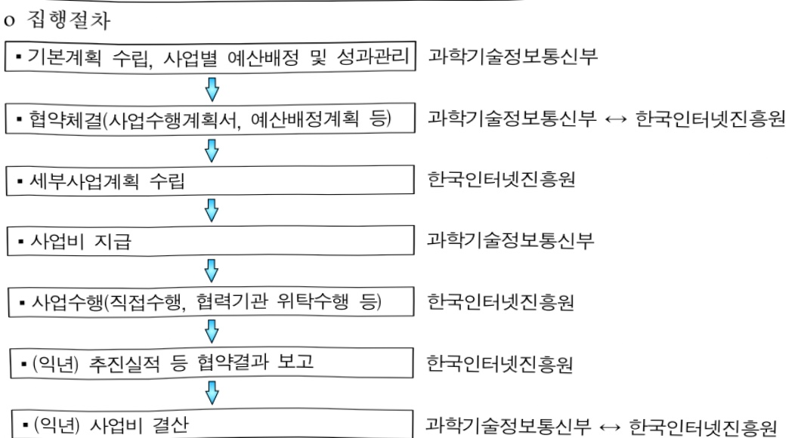

# 해킹바이러스대응체계고도화(정보화,출연)

**해당 페이지**: PDF 1788 ~ 1795 쪽 해당

**부처**: 과학기술정보통신부
**분야**: 통신
**회계유형**: 일반회계
**2026 확정예산**: 63252.0 백만원
**전년대비 증감률**: -14.0%
**AI 도메인**: 보안/사이버, 디지털전환(AX)

---

<table border=1 style='margin: auto; word-wrap: break-word;'><tr><td style='text-align: center; word-wrap: break-word;'>사 업 명</td></tr><tr><td style='text-align: center; word-wrap: break-word;'>(262) 해킹바이러스 대응체계 고도화 (2332-302)</td></tr></table>

사업 코드 정보

<table border=1 style='margin: auto; word-wrap: break-word;'><tr><td style='text-align: center; word-wrap: break-word;'>구분</td><td style='text-align: center; word-wrap: break-word;'>회계</td><td style='text-align: center; word-wrap: break-word;'>소관</td><td style='text-align: center; word-wrap: break-word;'>실국(기관)</td><td style='text-align: center; word-wrap: break-word;'>계정</td><td style='text-align: center; word-wrap: break-word;'>분야</td><td style='text-align: center; word-wrap: break-word;'>부문</td></tr><tr><td style='text-align: center; word-wrap: break-word;'>코드</td><td rowspan="2">일반회계</td><td style='text-align: center; word-wrap: break-word;'>과학기술</td><td style='text-align: center; word-wrap: break-word;'>정보보호</td><td rowspan="2"></td><td style='text-align: center; word-wrap: break-word;'>130</td><td style='text-align: center; word-wrap: break-word;'>133</td></tr><tr><td style='text-align: center; word-wrap: break-word;'>명칭</td><td style='text-align: center; word-wrap: break-word;'>정보통신부</td><td style='text-align: center; word-wrap: break-word;'>네트워크정책실</td><td style='text-align: center; word-wrap: break-word;'>통신</td><td style='text-align: center; word-wrap: break-word;'>정보통신</td></tr></table>

<table border=1 style='margin: auto; word-wrap: break-word;'><tr><td style='text-align: center; word-wrap: break-word;'>구분</td><td style='text-align: center; word-wrap: break-word;'>프로그램</td><td style='text-align: center; word-wrap: break-word;'>단위사업</td><td style='text-align: center; word-wrap: break-word;'>세부사업</td></tr><tr><td style='text-align: center; word-wrap: break-word;'>코드</td><td style='text-align: center; word-wrap: break-word;'>2300</td><td style='text-align: center; word-wrap: break-word;'>2332</td><td style='text-align: center; word-wrap: break-word;'>302</td></tr><tr><td style='text-align: center; word-wrap: break-word;'>명칭</td><td style='text-align: center; word-wrap: break-word;'>정보보호및활용</td><td style='text-align: center; word-wrap: break-word;'>정보보안대응체계구축</td><td style='text-align: center; word-wrap: break-word;'>해킹바이러스 대응체계 고도화</td></tr></table>

☐ 사업 성격 (공통요구자료 II-1 작성유의사항 4. 참조, 해당하는 사항에 “○” 표시)

<table border=1 style='margin: auto; word-wrap: break-word;'><tr><td rowspan="2">신규</td><td rowspan="2">계속</td><td rowspan="2">완료</td><td rowspan="2">예비타당성 실시여부</td><td rowspan="2">총사업비 관리대상</td><td rowspan="2">총액계상 예산사업</td><td style='text-align: center; word-wrap: break-word;'>사업소관 변경정보</td></tr><tr><td style='text-align: center; word-wrap: break-word;'>2025예산 시 소관</td></tr><tr><td style='text-align: center; word-wrap: break-word;'></td><td style='text-align: center; word-wrap: break-word;'>O</td><td style='text-align: center; word-wrap: break-word;'></td><td style='text-align: center; word-wrap: break-word;'></td><td style='text-align: center; word-wrap: break-word;'></td><td style='text-align: center; word-wrap: break-word;'></td><td style='text-align: center; word-wrap: break-word;'></td></tr></table>

□ 사업 지원 형태 및 지원을 (최소한 한 개는 반드시 선택하시오. 해당사항에 O 표시)

<table border=1 style='margin: auto; word-wrap: break-word;'><tr><td style='text-align: center; word-wrap: break-word;'>직접</td><td style='text-align: center; word-wrap: break-word;'>출자</td><td style='text-align: center; word-wrap: break-word;'>출연</td><td style='text-align: center; word-wrap: break-word;'>보조</td><td style='text-align: center; word-wrap: break-word;'>융자</td><td style='text-align: center; word-wrap: break-word;'>국고보조율(%)</td><td style='text-align: center; word-wrap: break-word;'>융자율(%)</td></tr><tr><td style='text-align: center; word-wrap: break-word;'></td><td style='text-align: center; word-wrap: break-word;'></td><td style='text-align: center; word-wrap: break-word;'>0</td><td style='text-align: center; word-wrap: break-word;'></td><td style='text-align: center; word-wrap: break-word;'></td><td style='text-align: center; word-wrap: break-word;'></td><td style='text-align: center; word-wrap: break-word;'></td></tr></table>

## ☐ 사업 소관부처 및 시행주체

<table border=1 style='margin: auto; word-wrap: break-word;'><tr><td style='text-align: center; word-wrap: break-word;'>사업명</td><td colspan="2">구분</td></tr><tr><td rowspan="2">해킹바이러스 대응체계 고도화</td><td style='text-align: center; word-wrap: break-word;'>소관부처</td><td style='text-align: center; word-wrap: break-word;'>정보보호네트워크정책실 정보보호네트워크정책관 사이버침해조사팀</td></tr><tr><td style='text-align: center; word-wrap: break-word;'>사업시행주체</td><td style='text-align: center; word-wrap: break-word;'>한국인터넷진흥원</td></tr></table>

---

### 가. 예산 총괄표

(단위: 백만원, %)

<table border=1 style='margin: auto; word-wrap: break-word;'><tr><td rowspan="2">사업명</td><td rowspan="2">2024년 결산</td><td colspan="2">2025년 예산</td><td colspan="2">2026년 예산</td><td rowspan="2" colspan="2">증감 (B-A)</td></tr><tr><td style='text-align: center; word-wrap: break-word;'>본예산</td><td style='text-align: center; word-wrap: break-word;'>추경*(A)</td><td style='text-align: center; word-wrap: break-word;'>요구안</td><td style='text-align: center; word-wrap: break-word;'>본예산(B)</td><td style='text-align: center; word-wrap: break-word;'>(B-A)/A</td></tr><tr><td style='text-align: center; word-wrap: break-word;'>해킹바이러스 대응체계 고도화</td><td style='text-align: center; word-wrap: break-word;'>62,125</td><td style='text-align: center; word-wrap: break-word;'>57,885</td><td style='text-align: center; word-wrap: break-word;'>73,585</td><td style='text-align: center; word-wrap: break-word;'>66,097</td><td style='text-align: center; word-wrap: break-word;'>63,252</td><td style='text-align: center; word-wrap: break-word;'>△10,333</td><td style='text-align: center; word-wrap: break-word;'>△14</td></tr></table>

* 추경: 추경증감액을 포함한 최종 예산액을 기재

## □ 기능별(내역사업별) 예산 내역

(단위:백만원)

<table border=1 style='margin: auto; word-wrap: break-word;'><tr><td rowspan="2"></td><td colspan="5">2024</td><td colspan="5">2025</td><td rowspan="2">2026예산</td></tr><tr><td style='text-align: center; word-wrap: break-word;'>예산액(추정)</td><td style='text-align: center; word-wrap: break-word;'>예산현액</td><td style='text-align: center; word-wrap: break-word;'>집행액</td><td style='text-align: center; word-wrap: break-word;'>이월액</td><td style='text-align: center; word-wrap: break-word;'>불용액</td><td style='text-align: center; word-wrap: break-word;'>예산액(추정)</td><td style='text-align: center; word-wrap: break-word;'>예산현액</td><td style='text-align: center; word-wrap: break-word;'>집행액</td><td style='text-align: center; word-wrap: break-word;'>이월액</td><td style='text-align: center; word-wrap: break-word;'>불용액</td></tr><tr><td style='text-align: center; word-wrap: break-word;'>○ 기능별 분류(합계)</td><td style='text-align: center; word-wrap: break-word;'>62,125</td><td style='text-align: center; word-wrap: break-word;'>62,125</td><td style='text-align: center; word-wrap: break-word;'>62,125</td><td style='text-align: center; word-wrap: break-word;'>-</td><td style='text-align: center; word-wrap: break-word;'>-</td><td style='text-align: center; word-wrap: break-word;'>73,585</td><td style='text-align: center; word-wrap: break-word;'>73,585</td><td style='text-align: center; word-wrap: break-word;'>73,585</td><td style='text-align: center; word-wrap: break-word;'>-</td><td style='text-align: center; word-wrap: break-word;'>-</td><td style='text-align: center; word-wrap: break-word;'>63,252</td></tr><tr><td rowspan="5">· 사이버공격탐지·대응체계 운영·사이버위험공유·협력체계 운영·사이버공격예방체계 운영·보안 취약점 클리닝서비스 운영·사이버침해 사고조사 분석체계 강화</td><td style='text-align: center; word-wrap: break-word;'>35,132</td><td style='text-align: center; word-wrap: break-word;'>35,132</td><td style='text-align: center; word-wrap: break-word;'>35,132</td><td style='text-align: center; word-wrap: break-word;'>-</td><td style='text-align: center; word-wrap: break-word;'>-</td><td style='text-align: center; word-wrap: break-word;'>49,099</td><td style='text-align: center; word-wrap: break-word;'>49,099</td><td style='text-align: center; word-wrap: break-word;'>49,099</td><td style='text-align: center; word-wrap: break-word;'>-</td><td style='text-align: center; word-wrap: break-word;'>-</td><td style='text-align: center; word-wrap: break-word;'>33,039</td></tr><tr><td style='text-align: center; word-wrap: break-word;'>9,669</td><td style='text-align: center; word-wrap: break-word;'>9,669</td><td style='text-align: center; word-wrap: break-word;'>9,669</td><td style='text-align: center; word-wrap: break-word;'>-</td><td style='text-align: center; word-wrap: break-word;'>-</td><td style='text-align: center; word-wrap: break-word;'>6,561</td><td style='text-align: center; word-wrap: break-word;'>6,561</td><td style='text-align: center; word-wrap: break-word;'>6,561</td><td style='text-align: center; word-wrap: break-word;'>-</td><td style='text-align: center; word-wrap: break-word;'>-</td><td style='text-align: center; word-wrap: break-word;'>2,861</td></tr><tr><td style='text-align: center; word-wrap: break-word;'>17,324</td><td style='text-align: center; word-wrap: break-word;'>17,324</td><td style='text-align: center; word-wrap: break-word;'>17,324</td><td style='text-align: center; word-wrap: break-word;'>-</td><td style='text-align: center; word-wrap: break-word;'>-</td><td style='text-align: center; word-wrap: break-word;'>15,925</td><td style='text-align: center; word-wrap: break-word;'>15,925</td><td style='text-align: center; word-wrap: break-word;'>15,925</td><td style='text-align: center; word-wrap: break-word;'>-</td><td style='text-align: center; word-wrap: break-word;'>-</td><td style='text-align: center; word-wrap: break-word;'>17,052</td></tr><tr><td style='text-align: center; word-wrap: break-word;'>-</td><td style='text-align: center; word-wrap: break-word;'>-</td><td style='text-align: center; word-wrap: break-word;'>-</td><td style='text-align: center; word-wrap: break-word;'>-</td><td style='text-align: center; word-wrap: break-word;'>-</td><td style='text-align: center; word-wrap: break-word;'>2,000</td><td style='text-align: center; word-wrap: break-word;'>2,000</td><td style='text-align: center; word-wrap: break-word;'>2,000</td><td style='text-align: center; word-wrap: break-word;'>-</td><td style='text-align: center; word-wrap: break-word;'>-</td><td style='text-align: center; word-wrap: break-word;'>2,000</td></tr><tr><td style='text-align: center; word-wrap: break-word;'>-</td><td style='text-align: center; word-wrap: break-word;'>-</td><td style='text-align: center; word-wrap: break-word;'>-</td><td style='text-align: center; word-wrap: break-word;'>-</td><td style='text-align: center; word-wrap: break-word;'>-</td><td style='text-align: center; word-wrap: break-word;'>-</td><td style='text-align: center; word-wrap: break-word;'>-</td><td style='text-align: center; word-wrap: break-word;'>-</td><td style='text-align: center; word-wrap: break-word;'>-</td><td style='text-align: center; word-wrap: break-word;'>-</td><td style='text-align: center; word-wrap: break-word;'>8,300</td></tr></table>

### 나. 사업설명자료

## 1 ) 사업목적·내용

○ 사이버 위협(악성코드, 보안취약점 등)을 능동적으로 탐지·조치하고, 적극적인 침해사고 대응·복구 및 신종 보안위협 대응 강화를 통해 디지털 체계를 안전하게 보호

- (사이버공격 탐지·대응체계 운영) 24시간 365일 인터넷 이용환경 이상징후 상시

모니터링·탐지를 통한 사이버위협 탐지·분석 및 신속한 사고 대응·복구 지원

- (사이버위협 공유·협력체계 운영) 다양화·지능화되는 사이버위협에 선제적으로

대응하기 위한 사이버 위협정보 공유 및 국내외 공동대응 협력체계 확대

- (사이버공격 예방체계 운영) 사이버공격을 유발하는 보안 취약점을 사전 발굴·제거

하여 기업의 안전한 디지털전환 지원 및 국민들의 안전한 디지털 이용환경 조성

---

- (보안 취약점 클리닝 서비스 운영) 침해사고로 이어질 수 있는 취약 SW에 대한 신속 삭제 및 보안패치 배포·자동 적용하는 보안 취약점 클리닝 서비스 운영

- (사이버침해 사고조사 분석체계 강화) 대형화·고도화되는 침해사고 대비 대용량

디지털 증거 데이터를 신속하게 처리·분석할 수 있는 디지털 포렌식실 구축

## 2 ) 사업개요

## 사업근거 및 추진경위

① 법령상 근거 및 조항 적시 : 정보통신망 이용촉진 및 정보보호 등에 관한 법률 제48조의2(침해사고의 대응 등), 제48조의3(침해사고의 신고 등), 제48조의4(침해사고의 원인분석 등), 제48조의5(정보통신망연결기기등 관련 침해사고의 대응 등), 제52조(한국인터넷진흥원)

② 추진경위 : 민간분야 사이버 침해사고 예방·대응체계 고도화를 위한 대책

- 국내·외 주요 사이트 대상 대규모『7.7 디도스 공격』발생('09.7월)

※ 범정부 국가사이버위기 종합대책('09.9월)

- 국내 주요 사이트 대상 대규모『3.4 디도스 공격』발생('11.3월)

※ 범정부 국가 사이버안보 마스터플랜('11.8월)

- 방송·금융사 대상『3.20 사이버테러』발생('13.3월)

- 정부기관·정당, 언론사 등 대상『6.25 사이버테러』 발생('13.6월)

- 카드사 정보유출 사고 발생('14.1월)

※ 개인정보보호정상화 대책('14.7월)

-국가 사이버안보 태세 강화 종합대책 발표('15.4월)

-「K-ICT 시큐리티 발전전략」 발표('15.4월)

- 사생활 유출 등 국민불안 해소를 위한「IP카메라 종합대책」 발표('17.12월)

-「사이버 생활안전 실현을 위한 랜섬웨어 대응력 강화 대책, 마련·발표(정보통신전략위, '17.12월)

- 민간부문 정보보호 종합계획 2019 발표('19.1월)

-「한국판 뉴딜 중합계획 발표」(20.7월)

-「K-사이버방역 추진전략」(관계부처합동, '21.2월)

-「랜섬웨어 대응 강화방안」(관계부처합동, '21.8월)

-「최근 사이버 위협 동향 및 대응 방안」(과기정통부, '22.4월)

-「대한민국 디지털 전략」(관계부처합동, '22.9월)

---

- 이재명 정부 공약(1-3-15) 사이버 위협으로부터 안전한 나라를 만들겠습니다.

- 국정과제 23. 국민의 안전과 보편적 삶의 질 제고를 위한 'AI 기본사회' 실현

## 주요내용

① 사업규모 : 해당 없음

② 사업추진체계

- 사업시행방법 : 출연

- 사업시행주체 : 한국인터넷진흥원

- 사업 수혜자 : 정보통신서비스 제공자 및 이용자(일반국민)

- 보조, 융자, 출연, 출자 등의 경우 보조·융자 등 지원 비율 및 법적근거

<table border=1 style='margin: auto; word-wrap: break-word;'><tr><td style='text-align: center; word-wrap: break-word;'>내역사업명</td><td style='text-align: center; word-wrap: break-word;'>구분</td><td style='text-align: center; word-wrap: break-word;'>피보조·피출연 등 기관명</td><td style='text-align: center; word-wrap: break-word;'>지원 금액 (2026예산)</td><td style='text-align: center; word-wrap: break-word;'>지원 비율(%)</td><td style='text-align: center; word-wrap: break-word;'>보조율 법적근거 (해당 조항)</td></tr><tr><td style='text-align: center; word-wrap: break-word;'>사이버공격 탐지대응체계 운영</td><td rowspan="5">출연</td><td rowspan="5">한국인터넷 진흥원</td><td style='text-align: center; word-wrap: break-word;'>33,039</td><td style='text-align: center; word-wrap: break-word;'>100%</td><td rowspan="5">정보통신망 이용촉진 및 정보보호 등에 관한 법률 제48조의2(침해사고의 대응 등), 제48조의3(침해사고의 신고 등), 제48조의4(침해사고의 원인분석 등), 제48조의5(정보통신망연결기기등 관련 침해사고의 대응 등), 제52조(한국인터넷진흥원)</td></tr><tr><td style='text-align: center; word-wrap: break-word;'>사이버위험 공유협력체계 운영</td><td style='text-align: center; word-wrap: break-word;'>2,861</td><td style='text-align: center; word-wrap: break-word;'>100%</td></tr><tr><td style='text-align: center; word-wrap: break-word;'>사이버공격 예방체계 운영</td><td style='text-align: center; word-wrap: break-word;'>17,052</td><td style='text-align: center; word-wrap: break-word;'>100%</td></tr><tr><td style='text-align: center; word-wrap: break-word;'>보안 취약점 클리닝 서비스 운영</td><td style='text-align: center; word-wrap: break-word;'>2,000</td><td style='text-align: center; word-wrap: break-word;'>100%</td></tr><tr><td style='text-align: center; word-wrap: break-word;'>사이버침해 사고조사 분석체계 강화</td><td style='text-align: center; word-wrap: break-word;'>8,300</td><td style='text-align: center; word-wrap: break-word;'>100%</td></tr></table>

---

## 3 ) 2026년도 예산 산출 근거

<table border=1 style='margin: auto; word-wrap: break-word;'><tr><td style='text-align: center; word-wrap: break-word;'>내역사업 ① 사이버공격 탐지·대응체계 운영 33,039백만원</td></tr><tr><td style='text-align: center; word-wrap: break-word;'>가. 악성코드 탐지체계 운영(웹사이트 악성코드 탐지, 스미싱 대응, 사이버대피소 운영 등) 20,978백만원</td></tr><tr><td style='text-align: center; word-wrap: break-word;'>나. 사이버 침해사고 분석체계 운영(중소·영세기업 침해사고 조치·기술지원 등) 5,590백만원</td></tr><tr><td style='text-align: center; word-wrap: break-word;'>다. 인터넷침해대응센터 운영(24시간 365일 인터넷 이상징후 모니터링, 시스템 유지보수 등) 6,471백만원</td></tr><tr><td style='text-align: center; word-wrap: break-word;'>내역사업 ② 사이버위협 공유·협력체계 운영 2,861백만원</td></tr><tr><td style='text-align: center; word-wrap: break-word;'>가. 사이버 위협정보 분석·공유체계 운영(C·TAS 시스템 운영 등) 1,400백만원</td></tr><tr><td style='text-align: center; word-wrap: break-word;'>나. 사이버 침해사고 대응협력체계 운영(국내외 침해대응 기관·기업 협력 등) 1,461백만원</td></tr><tr><td style='text-align: center; word-wrap: break-word;'>내역사업 ③ 사이버공격 예방체계 운영 17,052백만원</td></tr><tr><td style='text-align: center; word-wrap: break-word;'>가. 보안위협 사전조치체계 운영(취약점 신고포상제, 핵더젤린지, AI 레드팀 운영 등) 8,507백만원</td></tr><tr><td style='text-align: center; word-wrap: break-word;'>나. 기업 보호체계 운영(사이버 위기대응 모의훈련, 해킹진단도구, 모의해킹 점검 등) 8,545백만원</td></tr><tr><td style='text-align: center; word-wrap: break-word;'>내역사업 ④ 보안 취약점 클리닝 서비스 운영 2,000백만원</td></tr><tr><td style='text-align: center; word-wrap: break-word;'>가. 보안 취약점 클리닝 서비스(C-Clean) 운영 2,000백만원</td></tr><tr><td style='text-align: center; word-wrap: break-word;'>내역사업 ⑤ 사이버침해 사고조사 분석체계 강화 8,300백만원</td></tr><tr><td style='text-align: center; word-wrap: break-word;'>가. 디지털 데이터 복구 및 분석(디지털 포렌식실 구축) 8,300백만원</td></tr></table>

## 4 ) 사업효과

사업영향, 산출물 성과지표 등

① 2022~2026년도 성과계획서 상 성과지표 및 최근 5년간 성과 달성도

<table border=1 style='margin: auto; word-wrap: break-word;'><tr><td style='text-align: center; word-wrap: break-word;'>성과지표</td><td style='text-align: center; word-wrap: break-word;'>구분</td><td style='text-align: center; word-wrap: break-word;'>2022</td><td style='text-align: center; word-wrap: break-word;'>2023</td><td style='text-align: center; word-wrap: break-word;'>2024</td><td style='text-align: center; word-wrap: break-word;'>2025</td><td style='text-align: center; word-wrap: break-word;'>2026</td><td style='text-align: center; word-wrap: break-word;'>2026 목표치산출근거</td><td style='text-align: center; word-wrap: break-word;'>측정산식(또는 측정방법)</td><td style='text-align: center; word-wrap: break-word;'>자료수집방법(또는 자료출처)</td></tr><tr><td style='text-align: center; word-wrap: break-word;'>침해사고</td><td style='text-align: center; word-wrap: break-word;'>목표</td><td style='text-align: center; word-wrap: break-word;'>5,649</td><td style='text-align: center; word-wrap: break-word;'>8,656</td><td style='text-align: center; word-wrap: break-word;'>13,203</td><td style='text-align: center; word-wrap: break-word;'>17,304</td><td style='text-align: center; word-wrap: break-word;'>23,644</td><td rowspan="3">전년 대비매년 5%이상 증가</td><td style='text-align: center; word-wrap: break-word;'>A+B</td><td rowspan="3">한국인터넷진흥원</td></tr><tr><td rowspan="2">보호조치 성과(단위: 건)</td><td style='text-align: center; word-wrap: break-word;'>실적</td><td style='text-align: center; word-wrap: break-word;'>8,244</td><td style='text-align: center; word-wrap: break-word;'>12,574</td><td style='text-align: center; word-wrap: break-word;'>16,480</td><td style='text-align: center; word-wrap: break-word;'>22,518</td><td style='text-align: center; word-wrap: break-word;'>-</td><td rowspan="2">A: 해킹 피해기업 보호조치 건수×60%B: 디드스 사이버대피소 이용 건수×40%</td></tr><tr><td style='text-align: center; word-wrap: break-word;'>달성도</td><td style='text-align: center; word-wrap: break-word;'>146</td><td style='text-align: center; word-wrap: break-word;'>145</td><td style='text-align: center; word-wrap: break-word;'>125</td><td style='text-align: center; word-wrap: break-word;'>130</td><td style='text-align: center; word-wrap: break-word;'>-</td></tr><tr><td rowspan="3">피해확산방지 성과(단위: 건)</td><td style='text-align: center; word-wrap: break-word;'>목표</td><td style='text-align: center; word-wrap: break-word;'>32,577,665</td><td style='text-align: center; word-wrap: break-word;'>50,648,165</td><td style='text-align: center; word-wrap: break-word;'>80,837,140</td><td style='text-align: center; word-wrap: break-word;'>130,550,85</td><td style='text-align: center; word-wrap: break-word;'>185,440,338</td><td rowspan="3">전년 대비매년 5%이상 증가</td><td style='text-align: center; word-wrap: break-word;'>A+B+C</td><td rowspan="3">한국인터넷진흥원</td></tr><tr><td style='text-align: center; word-wrap: break-word;'>실적</td><td style='text-align: center; word-wrap: break-word;'>48,236,348</td><td style='text-align: center; word-wrap: break-word;'>76,987,752</td><td style='text-align: center; word-wrap: break-word;'>124,338,652</td><td style='text-align: center; word-wrap: break-word;'>176,609,888</td><td style='text-align: center; word-wrap: break-word;'>-</td><td rowspan="2">A: 사이버위험 예방정보 공유건수×50%B: 악성사이트 차단대응 건수×30%C: 악성코드분석건수×20%</td></tr><tr><td style='text-align: center; word-wrap: break-word;'>달성도</td><td style='text-align: center; word-wrap: break-word;'>148</td><td style='text-align: center; word-wrap: break-word;'>152</td><td style='text-align: center; word-wrap: break-word;'>154</td><td style='text-align: center; word-wrap: break-word;'>135</td><td style='text-align: center; word-wrap: break-word;'>-</td></tr></table>

② 성과지표 이외의 연도별 사업추진 경과 및 실적

<table border=1 style='margin: auto; word-wrap: break-word;'><tr><td style='text-align: center; word-wrap: break-word;'>2022</td><td style='text-align: center; word-wrap: break-word;'>o 사이버 위협정보 공유 참여사 확대(CISO, ISMS 인증 의무대상, 협단체 등)o 다중이용서비스(홈페이지, 모바일앱) 및 관련 기업 보안취약점 점검 및 조치지원o 중소·영세기업 주요서버 대상 원격 보안점검 서비스(내서버 돌보미) 제공</td></tr><tr><td style='text-align: center; word-wrap: break-word;'>2023</td><td style='text-align: center; word-wrap: break-word;'>o 사이버보안 AI 데이터셋 우수활용 사례집 제작 및 성과 공유회 개최o APCERT(아태침해사고대응팀협의회) 의장국 당선 및 침해사고대응 교육 개최o 민간기업 대상 상시 사이버 모의훈련 플랫폼 운영</td></tr></table>

---

<table border=1 style='margin: auto; word-wrap: break-word;'><tr><td style='text-align: center; word-wrap: break-word;'>2024</td><td style='text-align: center; word-wrap: break-word;'>o 중요기술 보유기업 대상 모의침투 점검 및 보안취약점 조치 지원o 기업이 스스로 시스템의 해킹여부를 점검 할 수 있는 해킹진단도구 배포o 침해사고 이행점검 체계 마련 및 침해사고 재발방지 후속조치 지원</td></tr><tr><td style='text-align: center; word-wrap: break-word;'>2025</td><td style='text-align: center; word-wrap: break-word;'>o 통신사 등 중대 침해사고 원인분석 및 조치방안 발표(민관합동조사단 구성·운영)o 스미싱 문자 발송 원천 차단 서비스 시범 운영o 보안 취약점 클리닝 서비스(C-Clean) 시범 운영</td></tr></table>

## ③향후(2026년도 이후)기대효과

- 365일 24시간 인터넷침해대응센터 운영을 통해 실시간 이상트래픽을 모니터링함으로써

민간분야에서 발생한 침해사고의 신속한 탐지 및 대응 가능

- 사이버공격 탐지대응체계 강화를 통해 사이버 위협을 선제적으로 탐지·조치함으로써

침해사고 확산 방지 및 피해 최소화

- 민간기업 및 유관기관과 협력을 통해 지능화된 스미싱, 피싱사이트 등 사이버사기

대응방안을 마련하여 국민 피해 예방 및 최소화

- 중소·영세기업 대상 사이버공격 예방 및 대응 지원 확대로 침해사고 피해 예방

- 사이버 모의훈련 확대 및 모의해킹 점검으로 기업의 침해대응 역량 제고 기여

- AI 모델 및 서비스에 대한 취약점 분석 지원으로 AI 기술 활용의 안전성 제고

- 침해사고로 연결될 수 있는 취약SW에 대한 신속 조치 가능

- 디지털 포렌식실 구축으로 대용량 디지털 증거 데이터에 대한 신속 처리·분석 가능

5) 타당성조사 및 예비타당성조사 시행여부 및 결과 요지 : 해당 없음

6) 총사업비 대상사업 정보 : 해당 없음

---

## 7 ) 사업 집행절차

0 집행절차

과학기술정보통신부↔한국인터넷진흥원

## -사이버공격 탐지·대응체계 운영

<table border=1 style='margin: auto; word-wrap: break-word;'><tr><td style='text-align: center; word-wrap: break-word;'>부처</td><td style='text-align: center; word-wrap: break-word;'></td><td style='text-align: center; word-wrap: break-word;'>피출연·피보조기관</td><td style='text-align: center; word-wrap: break-word;'></td><td style='text-align: center; word-wrap: break-word;'>간접보조사업자·사업수행자</td></tr><tr><td style='text-align: center; word-wrap: break-word;'>과기정통부(33,039백만원)</td><td style='text-align: center; word-wrap: break-word;'>=&gt;(33,039백만원)</td><td style='text-align: center; word-wrap: break-word;'>한국인터넷진흥원(33,039백만원)</td><td style='text-align: center; word-wrap: break-word;'>-</td><td style='text-align: center; word-wrap: break-word;'>-</td></tr></table>

## -사이버위협 공유·협력체계 운영

<table border=1 style='margin: auto; word-wrap: break-word;'><tr><td style='text-align: center; word-wrap: break-word;'>부처</td><td style='text-align: center; word-wrap: break-word;'></td><td style='text-align: center; word-wrap: break-word;'>피출연·피보조기관</td><td style='text-align: center; word-wrap: break-word;'></td><td style='text-align: center; word-wrap: break-word;'>간접보조사업자·사업수행자</td></tr><tr><td style='text-align: center; word-wrap: break-word;'>과기정통부(2,861백만원)</td><td style='text-align: center; word-wrap: break-word;'>=&gt;(2,861백만원)</td><td style='text-align: center; word-wrap: break-word;'>한국인터넷진흥원(2,861백만원)</td><td style='text-align: center; word-wrap: break-word;'>-</td><td style='text-align: center; word-wrap: break-word;'>-</td></tr></table>

## -사이버공격 예방체계 운영

<table border=1 style='margin: auto; word-wrap: break-word;'><tr><td style='text-align: center; word-wrap: break-word;'>부처</td><td style='text-align: center; word-wrap: break-word;'></td><td style='text-align: center; word-wrap: break-word;'>피출연·피보조기관</td><td style='text-align: center; word-wrap: break-word;'></td><td style='text-align: center; word-wrap: break-word;'>간접보조사업자·사업수행자</td></tr><tr><td style='text-align: center; word-wrap: break-word;'>과기정통부(17,052백만원)</td><td style='text-align: center; word-wrap: break-word;'>=&gt;(17,052백만원)</td><td style='text-align: center; word-wrap: break-word;'>한국인터넷진흥원(17,052백만원)</td><td style='text-align: center; word-wrap: break-word;'>-</td><td style='text-align: center; word-wrap: break-word;'>-</td></tr></table>

## - 보안 취약점 클리닝 서비스 운영

<table border=1 style='margin: auto; word-wrap: break-word;'><tr><td style='text-align: center; word-wrap: break-word;'>부처</td><td style='text-align: center; word-wrap: break-word;'></td><td style='text-align: center; word-wrap: break-word;'>피출연·피보조기관</td><td style='text-align: center; word-wrap: break-word;'></td><td style='text-align: center; word-wrap: break-word;'>간접보조사업자·사업수행자</td></tr><tr><td style='text-align: center; word-wrap: break-word;'>과기정통부(2,000백만원)</td><td style='text-align: center; word-wrap: break-word;'>=&gt;(2,000백만원)</td><td style='text-align: center; word-wrap: break-word;'>한국인터넷진흥원(2,000백만원)</td><td style='text-align: center; word-wrap: break-word;'>-</td><td style='text-align: center; word-wrap: break-word;'>-</td></tr></table>

## -사이버침해 사고조사 분석체계 강화

<table border=1 style='margin: auto; word-wrap: break-word;'><tr><td style='text-align: center; word-wrap: break-word;'>부처</td><td style='text-align: center; word-wrap: break-word;'></td><td style='text-align: center; word-wrap: break-word;'>피출연·피보조기관</td><td style='text-align: center; word-wrap: break-word;'></td><td style='text-align: center; word-wrap: break-word;'>간접보조사업자·사업수행자</td></tr><tr><td style='text-align: center; word-wrap: break-word;'>과기정통부(8,300백만원)</td><td style='text-align: center; word-wrap: break-word;'>=&gt;(8,300백만원)</td><td style='text-align: center; word-wrap: break-word;'>한국인터넷진흥원(8,300백만원)</td><td style='text-align: center; word-wrap: break-word;'>-</td><td style='text-align: center; word-wrap: break-word;'>-</td></tr></table>

---

## 8 ) 각종 평가

- 행정안전부 재난안전사업 평가('25.5월) : 보통

<table border=1 style='margin: auto; word-wrap: break-word;'><tr><td style='text-align: center; word-wrap: break-word;'>- 행정안전부 재난안전사업 평가(&#x27;25.5월) : 보통</td></tr><tr><td style='text-align: center; word-wrap: break-word;'>- 행정안전부 재난안전사업 평가(&#x27;24.4월) : 보통</td></tr><tr><td style='text-align: center; word-wrap: break-word;'>- 행정안전부 재난안전사업 평가(&#x27;23.4월) : 우수</td></tr><tr><td style='text-align: center; word-wrap: break-word;'>- 행정안전부 재난안전사업 평가(&#x27;22.4월) : 보통</td></tr></table>

- 행정안전부 재난안전사업 평가('24.4월) : 보통

- 행정안전부 재난안전사업 평가('23.4월) : 우수

- 행정안전부 재난안전사업 평가('22.4월) : 보통

### 다. 최근 4년간 결산내역

## 1 ) 결산표

☐ 부처 결산내역

(단위: 백만원, %)

<table border=1 style='margin: auto; word-wrap: break-word;'><tr><td rowspan="2">闰五</td><td colspan="3">예산액</td><td rowspan="2">예산현액(A)</td><td rowspan="2">집행액(B)</td><td rowspan="2">집행률(B/A)</td><td rowspan="2">다음연도이월액</td><td rowspan="2">불용액</td></tr><tr><td style='text-align: center; word-wrap: break-word;'>본예산</td><td style='text-align: center; word-wrap: break-word;'>추경증감액</td><td style='text-align: center; word-wrap: break-word;'>추경</td></tr><tr><td style='text-align: center; word-wrap: break-word;'>2022</td><td style='text-align: center; word-wrap: break-word;'>63,389</td><td style='text-align: center; word-wrap: break-word;'>△3,200</td><td style='text-align: center; word-wrap: break-word;'>60,189</td><td style='text-align: center; word-wrap: break-word;'>60,189</td><td style='text-align: center; word-wrap: break-word;'>60,189</td><td style='text-align: center; word-wrap: break-word;'>100</td><td style='text-align: center; word-wrap: break-word;'>-</td><td style='text-align: center; word-wrap: break-word;'>-</td></tr><tr><td style='text-align: center; word-wrap: break-word;'>2023</td><td style='text-align: center; word-wrap: break-word;'>64,137</td><td style='text-align: center; word-wrap: break-word;'>-</td><td style='text-align: center; word-wrap: break-word;'>64,137</td><td style='text-align: center; word-wrap: break-word;'>64,137</td><td style='text-align: center; word-wrap: break-word;'>64,137</td><td style='text-align: center; word-wrap: break-word;'>100</td><td style='text-align: center; word-wrap: break-word;'>-</td><td style='text-align: center; word-wrap: break-word;'>-</td></tr><tr><td style='text-align: center; word-wrap: break-word;'>2024</td><td style='text-align: center; word-wrap: break-word;'>62,125</td><td style='text-align: center; word-wrap: break-word;'>-</td><td style='text-align: center; word-wrap: break-word;'>62,125</td><td style='text-align: center; word-wrap: break-word;'>62,125</td><td style='text-align: center; word-wrap: break-word;'>62,125</td><td style='text-align: center; word-wrap: break-word;'>100</td><td style='text-align: center; word-wrap: break-word;'>-</td><td style='text-align: center; word-wrap: break-word;'>-</td></tr><tr><td style='text-align: center; word-wrap: break-word;'>2025</td><td style='text-align: center; word-wrap: break-word;'>57,885</td><td style='text-align: center; word-wrap: break-word;'>15,700</td><td style='text-align: center; word-wrap: break-word;'>73,585</td><td style='text-align: center; word-wrap: break-word;'>73,585</td><td style='text-align: center; word-wrap: break-word;'>73,585</td><td style='text-align: center; word-wrap: break-word;'>100</td><td style='text-align: center; word-wrap: break-word;'>-</td><td style='text-align: center; word-wrap: break-word;'>-</td></tr></table>

## 2 ) 주요 결산사항

□ 2022~2025년 결산 주요사항

<table border=1 style='margin: auto; word-wrap: break-word;'><tr><td style='text-align: center; word-wrap: break-word;'>2022</td><td style='text-align: center; word-wrap: break-word;'>- 추경 편성 사유 · 점검방식 전환(현장→원격), 통합발주 등 사업 효율화를 통한 예산 절감 반영</td></tr><tr><td style='text-align: center; word-wrap: break-word;'>2023</td><td style='text-align: center; word-wrap: break-word;'>- 해당없음</td></tr><tr><td style='text-align: center; word-wrap: break-word;'>2024</td><td style='text-align: center; word-wrap: break-word;'>- 해당없음</td></tr><tr><td style='text-align: center; word-wrap: break-word;'>2025</td><td style='text-align: center; word-wrap: break-word;'>- 추경 편성 사유 · 통신사 등 국민생활 밀접 서비스 기업에서의 연이은 침해사고 발생 및 대규모 정보유출로 피해확산 방지 및 국민피해 예방을 위한 침해대응체계 강화 요구 반영</td></tr></table>

□ 2025년 이·전용 등 세부내역 : 해당 없음

---

### 원본 PDF 크롭 이미지

