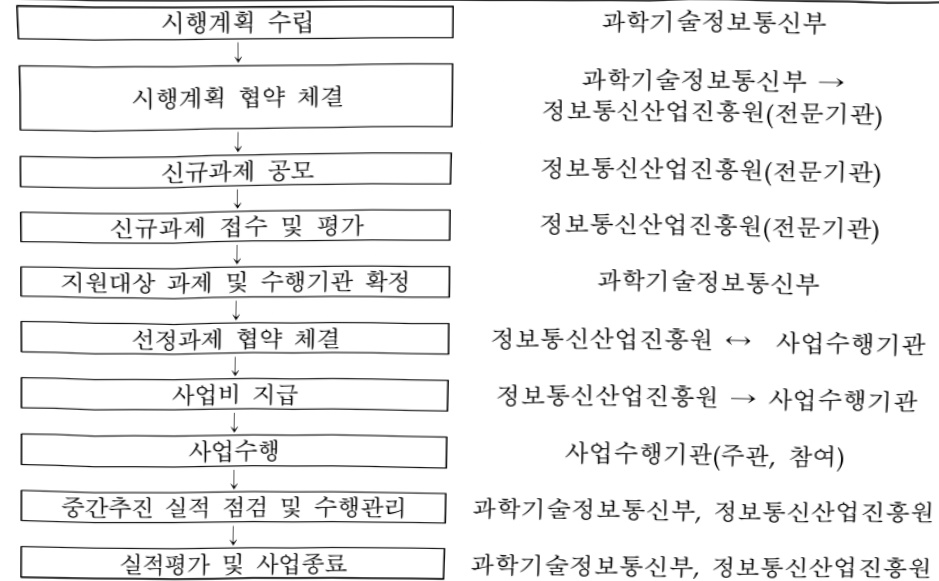

# 협업지능 피지컬AI 기반 SW플랫폼 연구개발 생태계…

**해당 페이지**: PDF 1796 ~ 1801 쪽 해당

**부처**: 과학기술정보통신부
**분야**: 과학기술
**회계유형**: 지역균형발전 특별회계
**2026 확정예산**: 76666.0 백만원
**전년대비 증감률**: None%
**AI 도메인**: 피지컬AI/디바이스

---

### 가. 예산 총괄표

(단위: 백만원, %)

<table border=1 style='margin: auto; word-wrap: break-word;'><tr><td rowspan="2">사업명</td><td rowspan="2">2024년 결산</td><td colspan="2">2025년 예산</td><td colspan="2">2026년 예산</td><td rowspan="2">증감(B-A)</td><td rowspan="2">(B-A)/A</td></tr><tr><td style='text-align: center; word-wrap: break-word;'>본예산</td><td style='text-align: center; word-wrap: break-word;'>추경(A)</td><td style='text-align: center; word-wrap: break-word;'>요구안</td><td style='text-align: center; word-wrap: break-word;'>본예산(B)</td></tr><tr><td style='text-align: center; word-wrap: break-word;'>협업지능 피지컬AI 기반 SW플랫폼 연구개발 생태계 조성(R&amp;D)</td><td style='text-align: center; word-wrap: break-word;'>-</td><td style='text-align: center; word-wrap: break-word;'>-</td><td style='text-align: center; word-wrap: break-word;'>-</td><td style='text-align: center; word-wrap: break-word;'>40,000</td><td style='text-align: center; word-wrap: break-word;'>76,666</td><td style='text-align: center; word-wrap: break-word;'>순증</td><td style='text-align: center; word-wrap: break-word;'>순증</td></tr></table>

## □ 기능별(내역사업별) 예산 내역

(단위:백만원)

<table border=1 style='margin: auto; word-wrap: break-word;'><tr><td rowspan="2"></td><td colspan="5">2024</td><td colspan="5">2025</td><td rowspan="2">2026예산</td></tr><tr><td style='text-align: center; word-wrap: break-word;'>예산액(추정)</td><td style='text-align: center; word-wrap: break-word;'>예산현액</td><td style='text-align: center; word-wrap: break-word;'>집행액</td><td style='text-align: center; word-wrap: break-word;'>이월액</td><td style='text-align: center; word-wrap: break-word;'>불용액</td><td style='text-align: center; word-wrap: break-word;'>예산액(추정)</td><td style='text-align: center; word-wrap: break-word;'>예산현액</td><td style='text-align: center; word-wrap: break-word;'>집행액</td><td style='text-align: center; word-wrap: break-word;'>이월액</td><td style='text-align: center; word-wrap: break-word;'>불용액</td></tr><tr><td style='text-align: center; word-wrap: break-word;'>○ 기능별 분류(함께)</td><td style='text-align: center; word-wrap: break-word;'>-</td><td style='text-align: center; word-wrap: break-word;'>-</td><td style='text-align: center; word-wrap: break-word;'>-</td><td style='text-align: center; word-wrap: break-word;'>-</td><td style='text-align: center; word-wrap: break-word;'>-</td><td style='text-align: center; word-wrap: break-word;'>-</td><td style='text-align: center; word-wrap: break-word;'>-</td><td style='text-align: center; word-wrap: break-word;'>-</td><td style='text-align: center; word-wrap: break-word;'>-</td><td style='text-align: center; word-wrap: break-word;'>-</td><td style='text-align: center; word-wrap: break-word;'>76,666</td></tr><tr><td style='text-align: center; word-wrap: break-word;'>• 협업지능 피지컬AI 기반 SW를맺풀 연구 개발생태조성(R&amp;D)</td><td style='text-align: center; word-wrap: break-word;'>-</td><td style='text-align: center; word-wrap: break-word;'>-</td><td style='text-align: center; word-wrap: break-word;'>-</td><td style='text-align: center; word-wrap: break-word;'>-</td><td style='text-align: center; word-wrap: break-word;'>-</td><td style='text-align: center; word-wrap: break-word;'>-</td><td style='text-align: center; word-wrap: break-word;'>-</td><td style='text-align: center; word-wrap: break-word;'>-</td><td style='text-align: center; word-wrap: break-word;'>-</td><td style='text-align: center; word-wrap: break-word;'>-</td><td style='text-align: center; word-wrap: break-word;'>76,666</td></tr></table>

### 나. 사업설명자료

## 1 ) 사업목적·내용

- 국내 강점 산업에 특화된 협업지능 피지컬AI 기반 SW플랫폼(AI모델, 시뮬레이션, 제어, 표준화 등) 개발로 글로벌 기술표준 선점 및 AI메타팩토리* 기반기술 확보

*현대차 싱가포르 무인공장(HMGICs) 모델 기반 국산·경량화 SDF 기술을 구현, 국내 제조 기업의 피지컬AI 기술 검증·확산을 지원하는 파일런 팩토리

## 2 ) 사업개요

☐ 사업근거 및 추진경위

① 법령상 근거 조항 적시

- 인공지능 발전과 신뢰 기반 조성 등에 관한 기본법 제16조(인공지능기술 도입·활용 지원) ① 국가 및 지방자치단체는 기업 및 공공기관의 인공지능기술 도입 촉진 및 활용 확산을 위하여

---

필요한 경우에는 다음 각 호의 지원을 할 수 있다. 1. 인공지능기술, 인공지능제품 또는 인공지능서비스의 개발 지원 및 연구·개발 성과의 확산 2 인공지능기술을 도입·활용하고자 하는 기업 및 공공기관에 대한 컨설팅 지원 4. 중소기업등의 인공지능기술 도입 및 활용에 사용되는 자금의 지원

- 지방자치분권 및 지역균형발전에 관한 특별법 제14조(지역 산업 육성 및 일자리 창출 등 지역경제 활성화 촉진)④ 국가와 지방자치단체는 지역 산업의 육성과 지역경제의 활성화를 위하여 지역의 일자리 창출과 투자 유치활동 지원, 정보통신 진흥 및 지역 특성에 맞는 중소기업의 창업 여건 개선 등에 관한 시책을 추진하여야 한다.

- 지방자치분권 및 지역균형발전에 관한 특별법 제16조(지역과학기술 및 정보통신의 진흥) 국가와 지방자치단체는 지역균형발전에 필요한 과학기술 및 정보통신의 진흥을 위하여 지역의 과학기술연구·교육기관 육성, 지역의 연구개발인력 및 정보통신인력의 확충, 지역균형발전을 위한 연구개발 촉진, 연구개발정보 유통체계 및 시설·장비 등 혁신기반 조성, 과학기술혁신 성과의 확산 및 산업화 촉진 등에 관한 시책을 추진하여야 한다.

- 정보통신산업 진흥법 제27조(사업) 3. 정보통신산업 육성·발전 및 지원시설 등 기반조성

사업, 7. 정보통신기술의 융합·활용에 관한 사업, 8. 정보통신산업 관련 국제교류·협력 및 해외진출의 지원

- 정보통신산업 진흥법 제28조(재원) ① 정부는 예산 또는 기금의 범위에서 산업진흥원의 설립, 시설, 운영 및 사업 추진 등에 필요한 경비의 전부 또는 일부를 출연할 수 있다.

- 소프트웨어진흥법 제9조 (지역별 소프트웨어산업진흥) ①과학기술정보통신부장관은 지역별

특성에 기반한 소프트웨어산업 진흥을 지원하고 지역 산업과의 융합을 촉진하여야 한다.

- 국가연구개발혁신법 제5조(정부의 책무) 3. 연구개발기관 간의 협력, 기술·학문·산업

간의 융합 및 창의적·도전적 연구개발 촉진 4. 연구자와 연구개발기관을 위한 최상의

연구환경 조성 등 연구개발 역량을 높이기 위한 지원

② 추진경위

- '24.09 : 「국가 AI전략 정책방향」 (관계부처 합동)

- '24.10 : AX 신규사업 발굴·기획

- '24.11 : 「AI 혁신 생태계 조기구축 방안」 (관계부처 합동)

- (국정과제 22-5) 피지컬 AI 적용 가속화

- '25.08 : R&D 예타면제 국무회의 의결

---

## 주요내용

- 총사업비 : 해당없음

- 사업기간 : 2026~2030

- 최근 5년 간 투입된 사업비(예산액기준, 추경편성한 연도에는 추경포함)

<table border=1 style='margin: auto; word-wrap: break-word;'><tr><td style='text-align: center; word-wrap: break-word;'>$ \underline{\text{연도}} $</td><td style='text-align: center; word-wrap: break-word;'>2022</td><td style='text-align: center; word-wrap: break-word;'>2023</td><td style='text-align: center; word-wrap: break-word;'>2024</td><td style='text-align: center; word-wrap: break-word;'>2025</td><td style='text-align: center; word-wrap: break-word;'>2026(안)</td></tr><tr><td style='text-align: center; word-wrap: break-word;'>사업비</td><td style='text-align: center; word-wrap: break-word;'>-</td><td style='text-align: center; word-wrap: break-word;'>-</td><td style='text-align: center; word-wrap: break-word;'>-</td><td style='text-align: center; word-wrap: break-word;'>-</td><td style='text-align: center; word-wrap: break-word;'>76,666</td></tr></table>

-기타:해당없음

② 사업추진체계

- 사업시행방법 : 출연

- 사업시행주체 : 정보통신산업진흥원

- 사업 수혜자 : 피지컬AI 공급·수요기업 등 관련 산학연

- 보조, 융자, 출연, 출자 등의 경우 보조·융자 등 지원 비율 및 법적근거

<table border=1 style='margin: auto; word-wrap: break-word;'><tr><td style='text-align: center; word-wrap: break-word;'>내역사업명</td><td style='text-align: center; word-wrap: break-word;'>구분</td><td style='text-align: center; word-wrap: break-word;'>피보조·피출연 등 기관명</td><td style='text-align: center; word-wrap: break-word;'>지원 금액 (2026예산)</td><td style='text-align: center; word-wrap: break-word;'>지원 비율(%)</td><td style='text-align: center; word-wrap: break-word;'>보조율 법적근거 (해당 조항)</td></tr><tr><td style='text-align: center; word-wrap: break-word;'>협업지능 피지컬AI기반 SW플랫폼 연구개발 생태계조성 (R&amp;D)</td><td style='text-align: center; word-wrap: break-word;'>출연</td><td style='text-align: center; word-wrap: break-word;'>정보통신 산업진흥원</td><td style='text-align: center; word-wrap: break-word;'>76,666</td><td style='text-align: center; word-wrap: break-word;'>100</td><td style='text-align: center; word-wrap: break-word;'>정보통신산업 진흥법 제28조</td></tr></table>

## 3 ) 2026년도 예산 산출 근거

☐ 협업지능 피지컬AI 기반 SW플랫폼 연구개발 생태계 조성(R&D) : (2025 본예산) - → (2026 예산안) 76,666

백만원, 순증

①협업지능 피지컬AI 기반 SW플랫폼 연구개발 생태계 조성(R&D)

: (2025 본예산) - → (2026) 76,666백만원, 순증

- (요구) 피지컬AI 핵심기술 조기 확보를 위한 피지컬AI 기반 SW플랫폼·솔루션 핵심기술 개발 및 테스트환경 구축 등을 위한 예산 요구

- (산출) 혁신도전형 협업지능 피지컬AI 연구개발 : 10개x5,400백만원x9/12개월=40,500백만원 기술확산형 협업지능 피지컬AI 연구개발 지원 : 12개x825백만원x9/12개월=7,425백만원 피지컬AI 기술실증 테스트베드 플랫폼化 : 3개x10,000백만원x9/12개월=22,500백만원 글로벌 연구 협업생태계 수립 등 사업단 운영 : 1식x6,788백만원x9/12개월=5,091백만원 연구개발 기획평가관리비 : 1,533백만원x9/12개월=1,150백만원

---

## 4 ) 사업효과

## 사업영향, 산출물 성과지표 등

① 2022~2026년도 성과계획서 상 성과지표 및 최근 5년간 성과 달성도

<table border=1 style='margin: auto; word-wrap: break-word;'><tr><td style='text-align: center; word-wrap: break-word;'>성과지표</td><td style='text-align: center; word-wrap: break-word;'>구분</td><td style='text-align: center; word-wrap: break-word;'>2022</td><td style='text-align: center; word-wrap: break-word;'>2023</td><td style='text-align: center; word-wrap: break-word;'>2024</td><td style='text-align: center; word-wrap: break-word;'>2025</td><td style='text-align: center; word-wrap: break-word;'>2026</td><td style='text-align: center; word-wrap: break-word;'>2026 목표치산출근거</td><td style='text-align: center; word-wrap: break-word;'>측정산식(또는 측정방법)</td><td style='text-align: center; word-wrap: break-word;'>자료수집방법(또는 자료출처)</td></tr><tr><td rowspan="3">특허출원(단위:건)</td><td style='text-align: center; word-wrap: break-word;'>목표</td><td style='text-align: center; word-wrap: break-word;'>-</td><td style='text-align: center; word-wrap: break-word;'>-</td><td style='text-align: center; word-wrap: break-word;'>-</td><td style='text-align: center; word-wrap: break-word;'>-</td><td style='text-align: center; word-wrap: break-word;'>72</td><td rowspan="3">유사사업 기준기술개발 과제예산* 10억원당특허 출원 1.5건 목표로 설정</td><td rowspan="3">국내외 특허출원 건 수/사업비 10억원</td><td rowspan="3">당해연도 결과보고서</td></tr><tr><td style='text-align: center; word-wrap: break-word;'>실적</td><td style='text-align: center; word-wrap: break-word;'>-</td><td style='text-align: center; word-wrap: break-word;'>-</td><td style='text-align: center; word-wrap: break-word;'>-</td><td style='text-align: center; word-wrap: break-word;'>-</td><td style='text-align: center; word-wrap: break-word;'>-</td></tr><tr><td style='text-align: center; word-wrap: break-word;'>달성도</td><td style='text-align: center; word-wrap: break-word;'>-</td><td style='text-align: center; word-wrap: break-word;'>-</td><td style='text-align: center; word-wrap: break-word;'>-</td><td style='text-align: center; word-wrap: break-word;'>-</td><td style='text-align: center; word-wrap: break-word;'>-</td></tr><tr><td rowspan="3">SCI급 논문(단위:건)</td><td style='text-align: center; word-wrap: break-word;'>목표</td><td style='text-align: center; word-wrap: break-word;'>-</td><td style='text-align: center; word-wrap: break-word;'>-</td><td style='text-align: center; word-wrap: break-word;'>-</td><td style='text-align: center; word-wrap: break-word;'>-</td><td style='text-align: center; word-wrap: break-word;'>87</td><td rowspan="3">기술개발 과제예산* 10억원당SCI(E)급논문수(1.82)기준(22년으로 목표 설정</td><td rowspan="3">매년 전수조사</td><td rowspan="3">당해연도 결과보고서</td></tr><tr><td style='text-align: center; word-wrap: break-word;'>실적</td><td style='text-align: center; word-wrap: break-word;'>-</td><td style='text-align: center; word-wrap: break-word;'>-</td><td style='text-align: center; word-wrap: break-word;'>-</td><td style='text-align: center; word-wrap: break-word;'>-</td><td style='text-align: center; word-wrap: break-word;'>-</td></tr><tr><td style='text-align: center; word-wrap: break-word;'>달성도</td><td style='text-align: center; word-wrap: break-word;'>-</td><td style='text-align: center; word-wrap: break-word;'>-</td><td style='text-align: center; word-wrap: break-word;'>-</td><td style='text-align: center; word-wrap: break-word;'>-</td><td style='text-align: center; word-wrap: break-word;'>-</td></tr></table>

* 전체 연구개발 예산(766.7억원) 중 테스트베드 환경 구축 등 인프라 및 사업단 운영 등의 예산을 제외한 피지컬AI 핵심기술 연구개발을 위한 과제 예산(479억원)

② 성과지표 이외의 연도별 사업추진 경과 및 실적 : 해당없음

③향후(2026년도 이후)기대효과

- 피지컬AI 기술개발 및 기술확산 연구개발, 피지컬AI 기술실증 테스트베드 구축 등을 통한 국내 산업 특화 협업지능 피지컬AI 글로벌 기술표준 선점

* 무인공장 운용-피지컬AI SDF 특화 기반모델 등 / ** 이기종 물류로봇, 정밀조립 로봇 등

5)타당성조사 및 예비타당성조사 시행여부 및 결과 요지

□ 국가재정법 제38조 제2항에 따라 예타면제 국무회의 의결 후 적정성 검토 추진 중

6) 총사업비 대상사업 여부 및 내역 : 해당없음

□ 총사업비 정보 : 해당없음

□ 총사업비 변경내역(변경일자 및 규모, 변경사유) : 해당없음

---

## 7 ) 사업 집행절차

- 협업지능 피지컬AI 기반 SW플랫폼 연구개발 생태계 조성

<table border=1 style='margin: auto; word-wrap: break-word;'><tr><td style='text-align: center; word-wrap: break-word;'>부처</td><td style='text-align: center; word-wrap: break-word;'></td><td style='text-align: center; word-wrap: break-word;'>피출연·피보조기관</td><td style='text-align: center; word-wrap: break-word;'></td><td style='text-align: center; word-wrap: break-word;'>간접보조사업자·사업수행자</td></tr><tr><td style='text-align: center; word-wrap: break-word;'>과학기술정보통신부(76,666)</td><td style='text-align: center; word-wrap: break-word;'>=&gt;(76,666)</td><td style='text-align: center; word-wrap: break-word;'>정보통신산업진흥원(1,150)</td><td style='text-align: center; word-wrap: break-word;'>=&gt;(75,516)</td><td style='text-align: center; word-wrap: break-word;'>피지컬AI 전소시엄</td></tr></table>

8) 각종 평가 : 해당없음

### 다.최근 4년간 결산내역

1) 결산표 : 해당없음

2) 주요 결산사항

□ 2022~2025년 결산 주요사항 : 해당없음

□ 2025년 이·전용 등 세부내역 : 해당없음

---

<table border=1 style='margin: auto; word-wrap: break-word;'><tr><td style='text-align: center; word-wrap: break-word;'>사 업 명</td></tr><tr><td style='text-align: center; word-wrap: break-word;'>관세행정 정보관리(정보화)(1441-500)</td></tr></table>

□ 사업 코드 정보

<table border=1 style='margin: auto; word-wrap: break-word;'><tr><td style='text-align: center; word-wrap: break-word;'>구분</td><td style='text-align: center; word-wrap: break-word;'>회계</td><td style='text-align: center; word-wrap: break-word;'>소관</td><td style='text-align: center; word-wrap: break-word;'>실국(기관)</td><td style='text-align: center; word-wrap: break-word;'>계정</td><td style='text-align: center; word-wrap: break-word;'>분야</td><td style='text-align: center; word-wrap: break-word;'>부문</td></tr><tr><td style='text-align: center; word-wrap: break-word;'>코드</td><td rowspan="2">일반</td><td rowspan="2">관세청</td><td rowspan="2">정보데이터정책관</td><td rowspan="2"></td><td style='text-align: center; word-wrap: break-word;'>010</td><td style='text-align: center; word-wrap: break-word;'>041</td></tr><tr><td style='text-align: center; word-wrap: break-word;'>명칭</td><td style='text-align: center; word-wrap: break-word;'>일반공공행정</td><td style='text-align: center; word-wrap: break-word;'>재정금융</td></tr></table>

<table border=1 style='margin: auto; word-wrap: break-word;'><tr><td style='text-align: center; word-wrap: break-word;'>구분</td><td style='text-align: center; word-wrap: break-word;'>프로그램</td><td style='text-align: center; word-wrap: break-word;'>단위사업</td><td style='text-align: center; word-wrap: break-word;'>세부사업</td></tr><tr><td style='text-align: center; word-wrap: break-word;'>코드</td><td style='text-align: center; word-wrap: break-word;'>1440</td><td style='text-align: center; word-wrap: break-word;'>1441</td><td style='text-align: center; word-wrap: break-word;'>500</td></tr><tr><td style='text-align: center; word-wrap: break-word;'>명칭</td><td style='text-align: center; word-wrap: break-word;'>관세행정지능정보화</td><td style='text-align: center; word-wrap: break-word;'>정보관리 및 정보시스템 수출</td><td style='text-align: center; word-wrap: break-word;'>관세행정 정보관리(정보화)</td></tr></table>

□ 사업 성격

<table border=1 style='margin: auto; word-wrap: break-word;'><tr><td rowspan="2">신규</td><td rowspan="2">계속</td><td rowspan="2">완료</td><td rowspan="2">예비타당성실시여부</td><td rowspan="2">총사업비관리대상</td><td rowspan="2">총액계상예산사업</td><td style='text-align: center; word-wrap: break-word;'>사업소관 변경정보</td></tr><tr><td style='text-align: center; word-wrap: break-word;'>2025예산 시 소관</td></tr><tr><td style='text-align: center; word-wrap: break-word;'></td><td style='text-align: center; word-wrap: break-word;'>O</td><td style='text-align: center; word-wrap: break-word;'></td><td style='text-align: center; word-wrap: break-word;'></td><td style='text-align: center; word-wrap: break-word;'></td><td style='text-align: center; word-wrap: break-word;'></td><td style='text-align: center; word-wrap: break-word;'></td></tr></table>

□ 사업 지원 형태 및 지원율

<table border=1 style='margin: auto; word-wrap: break-word;'><tr><td style='text-align: center; word-wrap: break-word;'>직접</td><td style='text-align: center; word-wrap: break-word;'>출자</td><td style='text-align: center; word-wrap: break-word;'>출연</td><td style='text-align: center; word-wrap: break-word;'>보조</td><td style='text-align: center; word-wrap: break-word;'>융자</td><td style='text-align: center; word-wrap: break-word;'>국고보조율(%)</td><td style='text-align: center; word-wrap: break-word;'>융자율(%)</td></tr><tr><td style='text-align: center; word-wrap: break-word;'>0</td><td style='text-align: center; word-wrap: break-word;'></td><td style='text-align: center; word-wrap: break-word;'>0</td><td style='text-align: center; word-wrap: break-word;'></td><td style='text-align: center; word-wrap: break-word;'></td><td style='text-align: center; word-wrap: break-word;'></td><td style='text-align: center; word-wrap: break-word;'></td></tr></table>

## 사업 담당자

<table border=1 style='margin: auto; word-wrap: break-word;'><tr><td style='text-align: center; word-wrap: break-word;'>사업명</td><td colspan="2">구분</td></tr><tr><td rowspan="2">관세행정정보관리(정보화)</td><td style='text-align: center; word-wrap: break-word;'>소관부처</td><td style='text-align: center; word-wrap: break-word;'>정보기획담당관</td></tr><tr><td style='text-align: center; word-wrap: break-word;'>사업시행주체</td><td style='text-align: center; word-wrap: break-word;'>관세청, 한국관세정보원</td></tr></table>

---

### 원본 PDF 크롭 이미지

