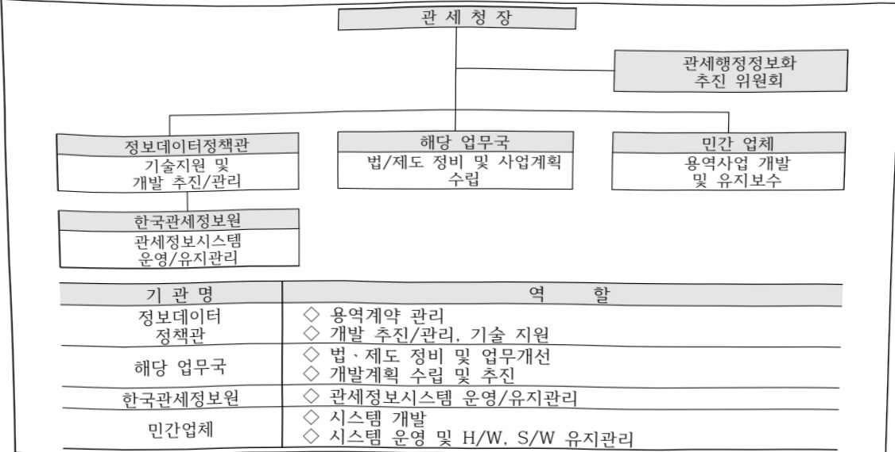

# 관세행정정보관리(정보화)

**해당 페이지**: PDF 1802 ~ 1814 쪽 해당

**부처**: 관세청
**분야**: 일반공공행정
**회계유형**: 일반
**2026 확정예산**: 63129.0 백만원
**전년대비 증감률**: -0.8%
**AI 도메인**: 통신/네트워크

---

### 가. 예산 총괄표

(단위: 백만원, %)

<table border=1 style='margin: auto; word-wrap: break-word;'><tr><td rowspan="2">사업명</td><td rowspan="2">2024년 결산</td><td colspan="2">2025년 예산</td><td colspan="2">2026년</td><td rowspan="2">중감 (B-A)</td><td rowspan="2">(B-A)/A</td></tr><tr><td style='text-align: center; word-wrap: break-word;'>본예산(A)</td><td style='text-align: center; word-wrap: break-word;'>추경</td><td style='text-align: center; word-wrap: break-word;'>정부안</td><td style='text-align: center; word-wrap: break-word;'>본예산(B)</td></tr><tr><td style='text-align: center; word-wrap: break-word;'>관세행정 정보관리 (정보화)</td><td style='text-align: center; word-wrap: break-word;'>77,943</td><td style='text-align: center; word-wrap: break-word;'>63,638</td><td style='text-align: center; word-wrap: break-word;'>63,638</td><td style='text-align: center; word-wrap: break-word;'>63,129</td><td style='text-align: center; word-wrap: break-word;'>63,129</td><td style='text-align: center; word-wrap: break-word;'>△509</td><td style='text-align: center; word-wrap: break-word;'>△0.8</td></tr></table>

□ 기능별(내역사업별), 목별 예산 내역

(단위:백만원)

<table border=1 style='margin: auto; word-wrap: break-word;'><tr><td rowspan="3"></td><td colspan="5">2024</td><td colspan="7">2025(25.11월말)</td><td rowspan="3">2026예산</td></tr><tr><td rowspan="2">예산액(추정)</td><td rowspan="2">예산현액</td><td rowspan="2">집행액[실집행액]</td><td rowspan="2">이월액</td><td rowspan="2">불용액</td><td rowspan="2">본예산</td><td rowspan="2">예산현액</td><td rowspan="2">집행액[실집행액]</td><td colspan="2">전년도이월액제외</td><td rowspan="2">이월예상액</td><td rowspan="2">불용예상액</td></tr><tr><td style='text-align: center; word-wrap: break-word;'>예산현액</td><td style='text-align: center; word-wrap: break-word;'>집행액[실집행액]</td></tr><tr><td style='text-align: center; word-wrap: break-word;'>○ 기능별 분류(합계)</td><td style='text-align: center; word-wrap: break-word;'>79,148</td><td style='text-align: center; word-wrap: break-word;'>80,334</td><td style='text-align: center; word-wrap: break-word;'>77,943</td><td style='text-align: center; word-wrap: break-word;'>241</td><td style='text-align: center; word-wrap: break-word;'>2,150</td><td style='text-align: center; word-wrap: break-word;'>63,638</td><td style='text-align: center; word-wrap: break-word;'>63,879</td><td style='text-align: center; word-wrap: break-word;'>54,144(51,614)</td><td style='text-align: center; word-wrap: break-word;'>63,638</td><td style='text-align: center; word-wrap: break-word;'>53,903(51,373)</td><td style='text-align: center; word-wrap: break-word;'>-</td><td style='text-align: center; word-wrap: break-word;'>-</td><td style='text-align: center; word-wrap: break-word;'>63,129</td></tr><tr><td style='text-align: center; word-wrap: break-word;'>·국가관세망노후장비 교체</td><td style='text-align: center; word-wrap: break-word;'>27,279</td><td style='text-align: center; word-wrap: break-word;'>28,465</td><td style='text-align: center; word-wrap: break-word;'>27,682</td><td style='text-align: center; word-wrap: break-word;'>-</td><td style='text-align: center; word-wrap: break-word;'>783</td><td style='text-align: center; word-wrap: break-word;'>21,373</td><td style='text-align: center; word-wrap: break-word;'>21,373</td><td style='text-align: center; word-wrap: break-word;'>18,016</td><td style='text-align: center; word-wrap: break-word;'>21,373</td><td style='text-align: center; word-wrap: break-word;'>18,016</td><td style='text-align: center; word-wrap: break-word;'>-</td><td style='text-align: center; word-wrap: break-word;'>-</td><td style='text-align: center; word-wrap: break-word;'>19,315</td></tr><tr><td style='text-align: center; word-wrap: break-word;'>·시스템 구축</td><td style='text-align: center; word-wrap: break-word;'>5,949</td><td style='text-align: center; word-wrap: break-word;'>5,949</td><td style='text-align: center; word-wrap: break-word;'>4,881</td><td style='text-align: center; word-wrap: break-word;'>241</td><td style='text-align: center; word-wrap: break-word;'>827</td><td style='text-align: center; word-wrap: break-word;'>9,224</td><td style='text-align: center; word-wrap: break-word;'>9,465</td><td style='text-align: center; word-wrap: break-word;'>8,455</td><td style='text-align: center; word-wrap: break-word;'>9,224</td><td style='text-align: center; word-wrap: break-word;'>8,214</td><td style='text-align: center; word-wrap: break-word;'>-</td><td style='text-align: center; word-wrap: break-word;'>-</td><td style='text-align: center; word-wrap: break-word;'>12,088</td></tr><tr><td style='text-align: center; word-wrap: break-word;'>·국가관세망운영</td><td style='text-align: center; word-wrap: break-word;'>11,260</td><td style='text-align: center; word-wrap: break-word;'>11,260</td><td style='text-align: center; word-wrap: break-word;'>11,187</td><td style='text-align: center; word-wrap: break-word;'>-</td><td style='text-align: center; word-wrap: break-word;'>73</td><td style='text-align: center; word-wrap: break-word;'>-</td><td style='text-align: center; word-wrap: break-word;'>-</td><td style='text-align: center; word-wrap: break-word;'>-</td><td style='text-align: center; word-wrap: break-word;'>-</td><td style='text-align: center; word-wrap: break-word;'>-</td><td style='text-align: center; word-wrap: break-word;'>-</td><td style='text-align: center; word-wrap: break-word;'>-</td><td style='text-align: center; word-wrap: break-word;'>-</td></tr><tr><td style='text-align: center; word-wrap: break-word;'>·관세정보시스템운영(출연)</td><td style='text-align: center; word-wrap: break-word;'>-</td><td style='text-align: center; word-wrap: break-word;'>-</td><td style='text-align: center; word-wrap: break-word;'>-</td><td style='text-align: center; word-wrap: break-word;'>-</td><td style='text-align: center; word-wrap: break-word;'>-</td><td style='text-align: center; word-wrap: break-word;'>936</td><td style='text-align: center; word-wrap: break-word;'>936</td><td style='text-align: center; word-wrap: break-word;'>936</td><td style='text-align: center; word-wrap: break-word;'>936</td><td style='text-align: center; word-wrap: break-word;'>936</td><td style='text-align: center; word-wrap: break-word;'>-</td><td style='text-align: center; word-wrap: break-word;'>-</td><td style='text-align: center; word-wrap: break-word;'>-</td></tr><tr><td style='text-align: center; word-wrap: break-word;'>·관세정보시스템유지관리(출연)</td><td style='text-align: center; word-wrap: break-word;'>8,794</td><td style='text-align: center; word-wrap: break-word;'>8,794</td><td style='text-align: center; word-wrap: break-word;'>8,680</td><td style='text-align: center; word-wrap: break-word;'>-</td><td style='text-align: center; word-wrap: break-word;'>114</td><td style='text-align: center; word-wrap: break-word;'>8,045</td><td style='text-align: center; word-wrap: break-word;'>8,045</td><td style='text-align: center; word-wrap: break-word;'>8,045</td><td style='text-align: center; word-wrap: break-word;'>8,045</td><td style='text-align: center; word-wrap: break-word;'>8,045</td><td style='text-align: center; word-wrap: break-word;'>-</td><td style='text-align: center; word-wrap: break-word;'>-</td><td style='text-align: center; word-wrap: break-word;'>7,926</td></tr><tr><td style='text-align: center; word-wrap: break-word;'>·행정정보시스템유지관리</td><td style='text-align: center; word-wrap: break-word;'>10,574</td><td style='text-align: center; word-wrap: break-word;'>10,574</td><td style='text-align: center; word-wrap: break-word;'>10,408</td><td style='text-align: center; word-wrap: break-word;'>-</td><td style='text-align: center; word-wrap: break-word;'>166</td><td style='text-align: center; word-wrap: break-word;'>9,427</td><td style='text-align: center; word-wrap: break-word;'>9,427</td><td style='text-align: center; word-wrap: break-word;'>7,277</td><td style='text-align: center; word-wrap: break-word;'>9,427</td><td style='text-align: center; word-wrap: break-word;'>7,277</td><td style='text-align: center; word-wrap: break-word;'>-</td><td style='text-align: center; word-wrap: break-word;'>-</td><td style='text-align: center; word-wrap: break-word;'>9,212</td></tr><tr><td style='text-align: center; word-wrap: break-word;'>·전산장비 도입</td><td style='text-align: center; word-wrap: break-word;'>5,992</td><td style='text-align: center; word-wrap: break-word;'>5,992</td><td style='text-align: center; word-wrap: break-word;'>5,908</td><td style='text-align: center; word-wrap: break-word;'>-</td><td style='text-align: center; word-wrap: break-word;'>84</td><td style='text-align: center; word-wrap: break-word;'>5,436</td><td style='text-align: center; word-wrap: break-word;'>5,436</td><td style='text-align: center; word-wrap: break-word;'>3,465</td><td style='text-align: center; word-wrap: break-word;'>5,436</td><td style='text-align: center; word-wrap: break-word;'>3,465</td><td style='text-align: center; word-wrap: break-word;'>-</td><td style='text-align: center; word-wrap: break-word;'>-</td><td style='text-align: center; word-wrap: break-word;'>5,761</td></tr><tr><td style='text-align: center; word-wrap: break-word;'>·세관 정보화 지원</td><td style='text-align: center; word-wrap: break-word;'>9,300</td><td style='text-align: center; word-wrap: break-word;'>9,300</td><td style='text-align: center; word-wrap: break-word;'>9,197</td><td style='text-align: center; word-wrap: break-word;'>-</td><td style='text-align: center; word-wrap: break-word;'>103</td><td style='text-align: center; word-wrap: break-word;'>9,197</td><td style='text-align: center; word-wrap: break-word;'>9,197</td><td style='text-align: center; word-wrap: break-word;'>7,950</td><td style='text-align: center; word-wrap: break-word;'>9,197</td><td style='text-align: center; word-wrap: break-word;'>7,950</td><td style='text-align: center; word-wrap: break-word;'>-</td><td style='text-align: center; word-wrap: break-word;'>-</td><td style='text-align: center; word-wrap: break-word;'>8,827</td></tr><tr><td style='text-align: center; word-wrap: break-word;'>○ 비목별 분류(합계)</td><td style='text-align: center; word-wrap: break-word;'>79,148</td><td style='text-align: center; word-wrap: break-word;'>80,334</td><td style='text-align: center; word-wrap: break-word;'>77,943</td><td style='text-align: center; word-wrap: break-word;'>241</td><td style='text-align: center; word-wrap: break-word;'>2,150</td><td style='text-align: center; word-wrap: break-word;'>63,638</td><td style='text-align: center; word-wrap: break-word;'>63,879</td><td style='text-align: center; word-wrap: break-word;'>54,144(51,614)</td><td style='text-align: center; word-wrap: break-word;'>63,638</td><td style='text-align: center; word-wrap: break-word;'>53,903(51,373)</td><td style='text-align: center; word-wrap: break-word;'>-</td><td style='text-align: center; word-wrap: break-word;'>-</td><td style='text-align: center; word-wrap: break-word;'>63,129</td></tr><tr><td style='text-align: center; word-wrap: break-word;'>·일반 수용비(210-01)</td><td style='text-align: center; word-wrap: break-word;'>2,366</td><td style='text-align: center; word-wrap: break-word;'>2,366</td><td style='text-align: center; word-wrap: break-word;'>2,348</td><td style='text-align: center; word-wrap: break-word;'>-</td><td style='text-align: center; word-wrap: break-word;'>18</td><td style='text-align: center; word-wrap: break-word;'>2,366</td><td style='text-align: center; word-wrap: break-word;'>2,366</td><td style='text-align: center; word-wrap: break-word;'>1,454</td><td style='text-align: center; word-wrap: break-word;'>2,366</td><td style='text-align: center; word-wrap: break-word;'>1,454</td><td style='text-align: center; word-wrap: break-word;'>-</td><td style='text-align: center; word-wrap: break-word;'>-</td><td style='text-align: center; word-wrap: break-word;'>2,030</td></tr><tr><td style='text-align: center; word-wrap: break-word;'>·공공요금·제세(210-02)</td><td style='text-align: center; word-wrap: break-word;'>6,260</td><td style='text-align: center; word-wrap: break-word;'>6,260</td><td style='text-align: center; word-wrap: break-word;'>6,218</td><td style='text-align: center; word-wrap: break-word;'>-</td><td style='text-align: center; word-wrap: break-word;'>42</td><td style='text-align: center; word-wrap: break-word;'>6,260</td><td style='text-align: center; word-wrap: break-word;'>6,260</td><td style='text-align: center; word-wrap: break-word;'>5,973</td><td style='text-align: center; word-wrap: break-word;'>6,260</td><td style='text-align: center; word-wrap: break-word;'>5,973</td><td style='text-align: center; word-wrap: break-word;'>-</td><td style='text-align: center; word-wrap: break-word;'>-</td><td style='text-align: center; word-wrap: break-word;'>6,260</td></tr><tr><td style='text-align: center; word-wrap: break-word;'>·임차료(210-07)</td><td style='text-align: center; word-wrap: break-word;'>26,800</td><td style='text-align: center; word-wrap: break-word;'>26,800</td><td style='text-align: center; word-wrap: break-word;'>25,319</td><td style='text-align: center; word-wrap: break-word;'>-</td><td style='text-align: center; word-wrap: break-word;'>1,481</td><td style='text-align: center; word-wrap: break-word;'>25,486</td><td style='text-align: center; word-wrap: break-word;'>25,486</td><td style='text-align: center; word-wrap: break-word;'>20,347</td><td style='text-align: center; word-wrap: break-word;'>25,486</td><td style='text-align: center; word-wrap: break-word;'>20,347</td><td style='text-align: center; word-wrap: break-word;'>-</td><td style='text-align: center; word-wrap: break-word;'>-</td><td style='text-align: center; word-wrap: break-word;'>25,075</td></tr><tr><td style='text-align: center; word-wrap: break-word;'>·시설장비유지비(210-09)</td><td style='text-align: center; word-wrap: break-word;'>50</td><td style='text-align: center; word-wrap: break-word;'>50</td><td style='text-align: center; word-wrap: break-word;'>49</td><td style='text-align: center; word-wrap: break-word;'>-</td><td style='text-align: center; word-wrap: break-word;'>1</td><td style='text-align: center; word-wrap: break-word;'>50</td><td style='text-align: center; word-wrap: break-word;'>50</td><td style='text-align: center; word-wrap: break-word;'>37</td><td style='text-align: center; word-wrap: break-word;'>50</td><td style='text-align: center; word-wrap: break-word;'>37</td><td style='text-align: center; word-wrap: break-word;'>-</td><td style='text-align: center; word-wrap: break-word;'>-</td><td style='text-align: center; word-wrap: break-word;'>50</td></tr><tr><td style='text-align: center; word-wrap: break-word;'>·관리용역비(210-15)</td><td style='text-align: center; word-wrap: break-word;'>30,628</td><td style='text-align: center; word-wrap: break-word;'>30,628</td><td style='text-align: center; word-wrap: break-word;'>30,275</td><td style='text-align: center; word-wrap: break-word;'>-</td><td style='text-align: center; word-wrap: break-word;'>353</td><td style='text-align: center; word-wrap: break-word;'>9,427</td><td style='text-align: center; word-wrap: break-word;'>9,427</td><td style='text-align: center; word-wrap: break-word;'>7,277</td><td style='text-align: center; word-wrap: break-word;'>9,427</td><td style='text-align: center; word-wrap: break-word;'>7,277</td><td style='text-align: center; word-wrap: break-word;'>-</td><td style='text-align: center; word-wrap: break-word;'>-</td><td style='text-align: center; word-wrap: break-word;'>10,130</td></tr><tr><td style='text-align: center; word-wrap: break-word;'>·국내여비(220-01)</td><td style='text-align: center; word-wrap: break-word;'>89</td><td style='text-align: center; word-wrap: break-word;'>89</td><td style='text-align: center; word-wrap: break-word;'>89</td><td style='text-align: center; word-wrap: break-word;'>-</td><td style='text-align: center; word-wrap: break-word;'>-</td><td style='text-align: center; word-wrap: break-word;'>89</td><td style='text-align: center; word-wrap: break-word;'>89</td><td style='text-align: center; word-wrap: break-word;'>89</td><td style='text-align: center; word-wrap: break-word;'>89</td><td style='text-align: center; word-wrap: break-word;'>89</td><td style='text-align: center; word-wrap: break-word;'>-</td><td style='text-align: center; word-wrap: break-word;'>-</td><td style='text-align: center; word-wrap: break-word;'>89</td></tr><tr><td style='text-align: center; word-wrap: break-word;'>·국외여비(220-02)</td><td style='text-align: center; word-wrap: break-word;'>27</td><td style='text-align: center; word-wrap: break-word;'>27</td><td style='text-align: center; word-wrap: break-word;'>26</td><td style='text-align: center; word-wrap: break-word;'>-</td><td style='text-align: center; word-wrap: break-word;'>1</td><td style='text-align: center; word-wrap: break-word;'>27</td><td style='text-align: center; word-wrap: break-word;'>27</td><td style='text-align: center; word-wrap: break-word;'>26</td><td style='text-align: center; word-wrap: break-word;'>27</td><td style='text-align: center; word-wrap: break-word;'>26</td><td style='text-align: center; word-wrap: break-word;'>-</td><td style='text-align: center; word-wrap: break-word;'>-</td><td style='text-align: center; word-wrap: break-word;'>27</td></tr><tr><td style='text-align: center; word-wrap: break-word;'>·사업추진비</td><td style='text-align: center; word-wrap: break-word;'>41</td><td style='text-align: center; word-wrap: break-word;'>41</td><td style='text-align: center; word-wrap: break-word;'>41</td><td style='text-align: center; word-wrap: break-word;'>-</td><td style='text-align: center; word-wrap: break-word;'>-</td><td style='text-align: center; word-wrap: break-word;'>41</td><td style='text-align: center; word-wrap: break-word;'>41</td><td style='text-align: center; word-wrap: break-word;'>41</td><td style='text-align: center; word-wrap: break-word;'>41</td><td style='text-align: center; word-wrap: break-word;'>41</td><td style='text-align: center; word-wrap: break-word;'>-</td><td style='text-align: center; word-wrap: break-word;'>-</td><td style='text-align: center; word-wrap: break-word;'>41</td></tr></table>

---

<table border=1 style='margin: auto; word-wrap: break-word;'><tr><td rowspan="3"></td><td colspan="4">2024</td><td colspan="7">2025(25.11월말)</td><td style='text-align: center; word-wrap: break-word;'>2026예산</td><td style='text-align: center; word-wrap: break-word;'></td></tr><tr><td rowspan="2">예산액(추정)</td><td rowspan="2">예산현액</td><td rowspan="2">집행액[실집행액]</td><td rowspan="2">이월액</td><td rowspan="2">불용액</td><td rowspan="2">본예산</td><td rowspan="2">예산현액</td><td rowspan="2">집행액[실집행액]</td><td colspan="2">전년도 이월액제외</td><td rowspan="2">이월예상액</td><td rowspan="2">불용예상액</td><td style='text-align: center; word-wrap: break-word;'></td></tr><tr><td style='text-align: center; word-wrap: break-word;'>예산현액</td><td style='text-align: center; word-wrap: break-word;'>집행액[실집행액]</td><td style='text-align: center; word-wrap: break-word;'></td></tr><tr><td style='text-align: center; word-wrap: break-word;'>(240-01)</td><td style='text-align: center; word-wrap: break-word;'>10,643</td><td style='text-align: center; word-wrap: break-word;'>11,829</td><td style='text-align: center; word-wrap: break-word;'>11,380</td><td style='text-align: center; word-wrap: break-word;'>241</td><td style='text-align: center; word-wrap: break-word;'>208</td><td style='text-align: center; word-wrap: break-word;'>8,884</td><td style='text-align: center; word-wrap: break-word;'>9,125</td><td style='text-align: center; word-wrap: break-word;'>8,665</td><td style='text-align: center; word-wrap: break-word;'>8,884</td><td style='text-align: center; word-wrap: break-word;'>8,424</td><td style='text-align: center; word-wrap: break-word;'>-</td><td style='text-align: center; word-wrap: break-word;'>-</td><td style='text-align: center; word-wrap: break-word;'>8,649</td></tr><tr><td style='text-align: center; word-wrap: break-word;'>(260-01)</td><td style='text-align: center; word-wrap: break-word;'>26</td><td style='text-align: center; word-wrap: break-word;'>26</td><td style='text-align: center; word-wrap: break-word;'>26</td><td style='text-align: center; word-wrap: break-word;'>-</td><td style='text-align: center; word-wrap: break-word;'>-</td><td style='text-align: center; word-wrap: break-word;'>23</td><td style='text-align: center; word-wrap: break-word;'>23</td><td style='text-align: center; word-wrap: break-word;'>14</td><td style='text-align: center; word-wrap: break-word;'>23</td><td style='text-align: center; word-wrap: break-word;'>14</td><td style='text-align: center; word-wrap: break-word;'>-</td><td style='text-align: center; word-wrap: break-word;'>-</td><td style='text-align: center; word-wrap: break-word;'>23</td></tr><tr><td style='text-align: center; word-wrap: break-word;'>·포상금(310-03)</td><td style='text-align: center; word-wrap: break-word;'>-</td><td style='text-align: center; word-wrap: break-word;'>-</td><td style='text-align: center; word-wrap: break-word;'>-</td><td style='text-align: center; word-wrap: break-word;'>-</td><td style='text-align: center; word-wrap: break-word;'>-</td><td style='text-align: center; word-wrap: break-word;'>8,981</td><td style='text-align: center; word-wrap: break-word;'>8,981</td><td style='text-align: center; word-wrap: break-word;'>8,981</td><td style='text-align: center; word-wrap: break-word;'>8,981</td><td style='text-align: center; word-wrap: break-word;'>8,981</td><td style='text-align: center; word-wrap: break-word;'>-</td><td style='text-align: center; word-wrap: break-word;'>-</td><td style='text-align: center; word-wrap: break-word;'>8,785</td></tr><tr><td style='text-align: center; word-wrap: break-word;'>·사업출연금(350-02)</td><td style='text-align: center; word-wrap: break-word;'>441</td><td style='text-align: center; word-wrap: break-word;'>441</td><td style='text-align: center; word-wrap: break-word;'>401</td><td style='text-align: center; word-wrap: break-word;'>-</td><td style='text-align: center; word-wrap: break-word;'>40</td><td style='text-align: center; word-wrap: break-word;'>341</td><td style='text-align: center; word-wrap: break-word;'>341</td><td style='text-align: center; word-wrap: break-word;'>316</td><td style='text-align: center; word-wrap: break-word;'>341</td><td style='text-align: center; word-wrap: break-word;'>316</td><td style='text-align: center; word-wrap: break-word;'>-</td><td style='text-align: center; word-wrap: break-word;'>-</td><td style='text-align: center; word-wrap: break-word;'>307</td></tr><tr><td style='text-align: center; word-wrap: break-word;'>·공사비(420-03)</td><td style='text-align: center; word-wrap: break-word;'>1,777</td><td style='text-align: center; word-wrap: break-word;'>1,777</td><td style='text-align: center; word-wrap: break-word;'>1,771</td><td style='text-align: center; word-wrap: break-word;'>-</td><td style='text-align: center; word-wrap: break-word;'>6</td><td style='text-align: center; word-wrap: break-word;'>1,663</td><td style='text-align: center; word-wrap: break-word;'>1,663</td><td style='text-align: center; word-wrap: break-word;'>924</td><td style='text-align: center; word-wrap: break-word;'>1,663</td><td style='text-align: center; word-wrap: break-word;'>924</td><td style='text-align: center; word-wrap: break-word;'>-</td><td style='text-align: center; word-wrap: break-word;'>-</td><td style='text-align: center; word-wrap: break-word;'>1,663</td></tr><tr><td style='text-align: center; word-wrap: break-word;'>·자산취득비(430-01)</td><td style='text-align: center; word-wrap: break-word;'>79,148</td><td style='text-align: center; word-wrap: break-word;'>80,334</td><td style='text-align: center; word-wrap: break-word;'>77,943</td><td style='text-align: center; word-wrap: break-word;'>241</td><td style='text-align: center; word-wrap: break-word;'>2,150</td><td style='text-align: center; word-wrap: break-word;'>63,638</td><td style='text-align: center; word-wrap: break-word;'>63,879</td><td style='text-align: center; word-wrap: break-word;'>54,144(51,614)</td><td style='text-align: center; word-wrap: break-word;'>63,638</td><td style='text-align: center; word-wrap: break-word;'>53,903(51,373)</td><td style='text-align: center; word-wrap: break-word;'>-</td><td style='text-align: center; word-wrap: break-word;'>-</td><td style='text-align: center; word-wrap: break-word;'>63,129</td></tr><tr><td style='text-align: center; word-wrap: break-word;'>○가능비목별분류액(2024-01)</td><td style='text-align: center; word-wrap: break-word;'>27,279</td><td style='text-align: center; word-wrap: break-word;'>28,465</td><td style='text-align: center; word-wrap: break-word;'>27,682</td><td style='text-align: center; word-wrap: break-word;'>-</td><td style='text-align: center; word-wrap: break-word;'>783</td><td style='text-align: center; word-wrap: break-word;'>21,373</td><td style='text-align: center; word-wrap: break-word;'>21,373</td><td style='text-align: center; word-wrap: break-word;'>18,016</td><td style='text-align: center; word-wrap: break-word;'>21,373</td><td style='text-align: center; word-wrap: break-word;'>18,016</td><td style='text-align: center; word-wrap: break-word;'>-</td><td style='text-align: center; word-wrap: break-word;'>-</td><td style='text-align: center; word-wrap: break-word;'>19,315</td></tr><tr><td style='text-align: center; word-wrap: break-word;'>·국가관세망노후장비 교체</td><td style='text-align: center; word-wrap: break-word;'>18,321</td><td style='text-align: center; word-wrap: break-word;'>18,321</td><td style='text-align: center; word-wrap: break-word;'>17,539</td><td style='text-align: center; word-wrap: break-word;'>-</td><td style='text-align: center; word-wrap: break-word;'>782</td><td style='text-align: center; word-wrap: break-word;'>17,534</td><td style='text-align: center; word-wrap: break-word;'>17,534</td><td style='text-align: center; word-wrap: break-word;'>14,177</td><td style='text-align: center; word-wrap: break-word;'>17,534</td><td style='text-align: center; word-wrap: break-word;'>14,177</td><td style='text-align: center; word-wrap: break-word;'>-</td><td style='text-align: center; word-wrap: break-word;'>-</td><td style='text-align: center; word-wrap: break-word;'>17,538</td></tr><tr><td style='text-align: center; word-wrap: break-word;'>·입차료(210-07)</td><td style='text-align: center; word-wrap: break-word;'>8,958</td><td style='text-align: center; word-wrap: break-word;'>10,144</td><td style='text-align: center; word-wrap: break-word;'>10,143</td><td style='text-align: center; word-wrap: break-word;'>-</td><td style='text-align: center; word-wrap: break-word;'>1</td><td style='text-align: center; word-wrap: break-word;'>3,839</td><td style='text-align: center; word-wrap: break-word;'>3,839</td><td style='text-align: center; word-wrap: break-word;'>3,839</td><td style='text-align: center; word-wrap: break-word;'>3,839</td><td style='text-align: center; word-wrap: break-word;'>3,839</td><td style='text-align: center; word-wrap: break-word;'>-</td><td style='text-align: center; word-wrap: break-word;'>-</td><td style='text-align: center; word-wrap: break-word;'>-</td></tr><tr><td style='text-align: center; word-wrap: break-word;'>·일반연구비(260-01)</td><td style='text-align: center; word-wrap: break-word;'>-</td><td style='text-align: center; word-wrap: break-word;'>-</td><td style='text-align: center; word-wrap: break-word;'>-</td><td style='text-align: center; word-wrap: break-word;'>-</td><td style='text-align: center; word-wrap: break-word;'>-</td><td style='text-align: center; word-wrap: break-word;'>-</td><td style='text-align: center; word-wrap: break-word;'>-</td><td style='text-align: center; word-wrap: break-word;'>-</td><td style='text-align: center; word-wrap: break-word;'>-</td><td style='text-align: center; word-wrap: break-word;'>-</td><td style='text-align: center; word-wrap: break-word;'>-</td><td style='text-align: center; word-wrap: break-word;'>-</td><td style='text-align: center; word-wrap: break-word;'>859</td></tr><tr><td style='text-align: center; word-wrap: break-word;'>·사업출연금(350-02)</td><td style='text-align: center; word-wrap: break-word;'>-</td><td style='text-align: center; word-wrap: break-word;'>-</td><td style='text-align: center; word-wrap: break-word;'>-</td><td style='text-align: center; word-wrap: break-word;'>-</td><td style='text-align: center; word-wrap: break-word;'>-</td><td style='text-align: center; word-wrap: break-word;'>-</td><td style='text-align: center; word-wrap: break-word;'>-</td><td style='text-align: center; word-wrap: break-word;'>-</td><td style='text-align: center; word-wrap: break-word;'>-</td><td style='text-align: center; word-wrap: break-word;'>-</td><td style='text-align: center; word-wrap: break-word;'>-</td><td style='text-align: center; word-wrap: break-word;'>-</td><td style='text-align: center; word-wrap: break-word;'>918</td></tr><tr><td style='text-align: center; word-wrap: break-word;'>·관리용역비(210-15)</td><td style='text-align: center; word-wrap: break-word;'>-</td><td style='text-align: center; word-wrap: break-word;'>-</td><td style='text-align: center; word-wrap: break-word;'>-</td><td style='text-align: center; word-wrap: break-word;'>-</td><td style='text-align: center; word-wrap: break-word;'>-</td><td style='text-align: center; word-wrap: break-word;'>-</td><td style='text-align: center; word-wrap: break-word;'>-</td><td style='text-align: center; word-wrap: break-word;'>-</td><td style='text-align: center; word-wrap: break-word;'>-</td><td style='text-align: center; word-wrap: break-word;'>-</td><td style='text-align: center; word-wrap: break-word;'>-</td><td style='text-align: center; word-wrap: break-word;'>-</td><td style='text-align: center; word-wrap: break-word;'>12,088</td></tr><tr><td style='text-align: center; word-wrap: break-word;'>·시스템 구축</td><td style='text-align: center; word-wrap: break-word;'>5,949</td><td style='text-align: center; word-wrap: break-word;'>5,949</td><td style='text-align: center; word-wrap: break-word;'>4,881</td><td style='text-align: center; word-wrap: break-word;'>241</td><td style='text-align: center; word-wrap: break-word;'>827</td><td style='text-align: center; word-wrap: break-word;'>9,224</td><td style='text-align: center; word-wrap: break-word;'>9,465</td><td style='text-align: center; word-wrap: break-word;'>8,455</td><td style='text-align: center; word-wrap: break-word;'>9,224</td><td style='text-align: center; word-wrap: break-word;'>8,214</td><td style='text-align: center; word-wrap: break-word;'>-</td><td style='text-align: center; word-wrap: break-word;'>-</td><td style='text-align: center; word-wrap: break-word;'>3,439</td></tr><tr><td style='text-align: center; word-wrap: break-word;'>·입차료(210-07)</td><td style='text-align: center; word-wrap: break-word;'>4,150</td><td style='text-align: center; word-wrap: break-word;'>4,150</td><td style='text-align: center; word-wrap: break-word;'>3,532</td><td style='text-align: center; word-wrap: break-word;'>-</td><td style='text-align: center; word-wrap: break-word;'>618</td><td style='text-align: center; word-wrap: break-word;'>4,179</td><td style='text-align: center; word-wrap: break-word;'>4,179</td><td style='text-align: center; word-wrap: break-word;'>3,629</td><td style='text-align: center; word-wrap: break-word;'>4,179</td><td style='text-align: center; word-wrap: break-word;'>3,388</td><td style='text-align: center; word-wrap: break-word;'>-</td><td style='text-align: center; word-wrap: break-word;'>-</td><td style='text-align: center; word-wrap: break-word;'>8,649</td></tr><tr><td style='text-align: center; word-wrap: break-word;'>·일반연구비(260-01)</td><td style='text-align: center; word-wrap: break-word;'>1,685</td><td style='text-align: center; word-wrap: break-word;'>1,685</td><td style='text-align: center; word-wrap: break-word;'>1,238</td><td style='text-align: center; word-wrap: break-word;'>241</td><td style='text-align: center; word-wrap: break-word;'>206</td><td style='text-align: center; word-wrap: break-word;'>5,045</td><td style='text-align: center; word-wrap: break-word;'>5,286</td><td style='text-align: center; word-wrap: break-word;'>4,826</td><td style='text-align: center; word-wrap: break-word;'>5,045</td><td style='text-align: center; word-wrap: break-word;'>4,826</td><td style='text-align: center; word-wrap: break-word;'>-</td><td style='text-align: center; word-wrap: break-word;'>-</td><td style='text-align: center; word-wrap: break-word;'>-</td></tr><tr><td style='text-align: center; word-wrap: break-word;'>·자산취득비(430-01)</td><td style='text-align: center; word-wrap: break-word;'>114</td><td style='text-align: center; word-wrap: break-word;'>114</td><td style='text-align: center; word-wrap: break-word;'>111</td><td style='text-align: center; word-wrap: break-word;'>-</td><td style='text-align: center; word-wrap: break-word;'>3</td><td style='text-align: center; word-wrap: break-word;'>-</td><td style='text-align: center; word-wrap: break-word;'>-</td><td style='text-align: center; word-wrap: break-word;'>-</td><td style='text-align: center; word-wrap: break-word;'>-</td><td style='text-align: center; word-wrap: break-word;'>-</td><td style='text-align: center; word-wrap: break-word;'>-</td><td style='text-align: center; word-wrap: break-word;'>-</td><td style='text-align: center; word-wrap: break-word;'>-</td></tr><tr><td style='text-align: center; word-wrap: break-word;'>·국가관세망운영</td><td style='text-align: center; word-wrap: break-word;'>11,260</td><td style='text-align: center; word-wrap: break-word;'>11,260</td><td style='text-align: center; word-wrap: break-word;'>11,187</td><td style='text-align: center; word-wrap: break-word;'>-</td><td style='text-align: center; word-wrap: break-word;'>73</td><td style='text-align: center; word-wrap: break-word;'>-</td><td style='text-align: center; word-wrap: break-word;'>-</td><td style='text-align: center; word-wrap: break-word;'>-</td><td style='text-align: center; word-wrap: break-word;'>-</td><td style='text-align: center; word-wrap: break-word;'>-</td><td style='text-align: center; word-wrap: break-word;'>-</td><td style='text-align: center; word-wrap: break-word;'>-</td><td style='text-align: center; word-wrap: break-word;'>-</td></tr><tr><td style='text-align: center; word-wrap: break-word;'>·관리용역비(210-15)</td><td style='text-align: center; word-wrap: break-word;'>11,260</td><td style='text-align: center; word-wrap: break-word;'>11,260</td><td style='text-align: center; word-wrap: break-word;'>11,187</td><td style='text-align: center; word-wrap: break-word;'>-</td><td style='text-align: center; word-wrap: break-word;'>73</td><td style='text-align: center; word-wrap: break-word;'>-</td><td style='text-align: center; word-wrap: break-word;'>-</td><td style='text-align: center; word-wrap: break-word;'>-</td><td style='text-align: center; word-wrap: break-word;'>-</td><td style='text-align: center; word-wrap: break-word;'>-</td><td style='text-align: center; word-wrap: break-word;'>-</td><td style='text-align: center; word-wrap: break-word;'>-</td><td style='text-align: center; word-wrap: break-word;'>-</td></tr><tr><td style='text-align: center; word-wrap: break-word;'>·관세정보시스템운영(출연)</td><td style='text-align: center; word-wrap: break-word;'>-</td><td style='text-align: center; word-wrap: break-word;'>-</td><td style='text-align: center; word-wrap: break-word;'>-</td><td style='text-align: center; word-wrap: break-word;'>-</td><td style='text-align: center; word-wrap: break-word;'>-</td><td style='text-align: center; word-wrap: break-word;'>936</td><td style='text-align: center; word-wrap: break-word;'>936</td><td style='text-align: center; word-wrap: break-word;'>936</td><td style='text-align: center; word-wrap: break-word;'>936</td><td style='text-align: center; word-wrap: break-word;'>936</td><td style='text-align: center; word-wrap: break-word;'>-</td><td style='text-align: center; word-wrap: break-word;'>-</td><td style='text-align: center; word-wrap: break-word;'>-</td></tr><tr><td style='text-align: center; word-wrap: break-word;'>·사업출연금(350-02)</td><td style='text-align: center; word-wrap: break-word;'>-</td><td style='text-align: center; word-wrap: break-word;'>-</td><td style='text-align: center; word-wrap: break-word;'>-</td><td style='text-align: center; word-wrap: break-word;'>-</td><td style='text-align: center; word-wrap: break-word;'>-</td><td style='text-align: center; word-wrap: break-word;'>936</td><td style='text-align: center; word-wrap: break-word;'>936</td><td style='text-align: center; word-wrap: break-word;'>936</td><td style='text-align: center; word-wrap: break-word;'>936</td><td style='text-align: center; word-wrap: break-word;'>936</td><td style='text-align: center; word-wrap: break-word;'>-</td><td style='text-align: center; word-wrap: break-word;'>-</td><td style='text-align: center; word-wrap: break-word;'>-</td></tr><tr><td style='text-align: center; word-wrap: break-word;'>·관세정보시스템유지관리(출연)</td><td style='text-align: center; word-wrap: break-word;'>8,794</td><td style='text-align: center; word-wrap: break-word;'>8,794</td><td style='text-align: center; word-wrap: break-word;'>8,680</td><td style='text-align: center; word-wrap: break-word;'>-</td><td style='text-align: center; word-wrap: break-word;'>114</td><td style='text-align: center; word-wrap: break-word;'>8,045</td><td style='text-align: center; word-wrap: break-word;'>8,045</td><td style='text-align: center; word-wrap: break-word;'>8,045</td><td style='text-align: center; word-wrap: break-word;'>8,045</td><td style='text-align: center; word-wrap: break-word;'>8,045</td><td style='text-align: center; word-wrap: break-word;'>-</td><td style='text-align: center; word-wrap: break-word;'>-</td><td style='text-align: center; word-wrap: break-word;'>7,926</td></tr><tr><td style='text-align: center; word-wrap: break-word;'>·사업출연금(350-02)</td><td style='text-align: center; word-wrap: break-word;'>8,794</td><td style='text-align: center; word-wrap: break-word;'>8,794</td><td style='text-align: center; word-wrap: break-word;'>8,680</td><td style='text-align: center; word-wrap: break-word;'>-</td><td style='text-align: center; word-wrap: break-word;'>114</td><td style='text-align: center; word-wrap: break-word;'>8,045</td><td style='text-align: center; word-wrap: break-word;'>8,045</td><td style='text-align: center; word-wrap: break-word;'>8,045</td><td style='text-align: center; word-wrap: break-word;'>8,045</td><td style='text-align: center; word-wrap: break-word;'>8,045</td><td style='text-align: center; word-wrap: break-word;'>-</td><td style='text-align: center; word-wrap: break-word;'>-</td><td style='text-align: center; word-wrap: break-word;'>7,926</td></tr><tr><td style='text-align: center; word-wrap: break-word;'>·행정정보시스템유지관리</td><td style='text-align: center; word-wrap: break-word;'>10,574</td><td style='text-align: center; word-wrap: break-word;'>10,574</td><td style='text-align: center; word-wrap: break-word;'>10,408</td><td style='text-align: center; word-wrap: break-word;'>-</td><td style='text-align: center; word-wrap: break-word;'>166</td><td style='text-align: center; word-wrap: break-word;'>9,427</td><td style='text-align: center; word-wrap: break-word;'>9,427</td><td style='text-align: center; word-wrap: break-word;'>7,277</td><td style='text-align: center; word-wrap: break-word;'>9,427</td><td style='text-align: center; word-wrap: break-word;'>7,277</td><td style='text-align: center; word-wrap: break-word;'>-</td><td style='text-align: center; word-wrap: break-word;'>-</td><td style='text-align: center; word-wrap: break-word;'>9,212</td></tr><tr><td style='text-align: center; word-wrap: break-word;'>·관리용역비(210-15)</td><td style='text-align: center; word-wrap: break-word;'>10,574</td><td style='text-align: center; word-wrap: break-word;'>10,574</td><td style='text-align: center; word-wrap: break-word;'>10,408</td><td style='text-align: center; word-wrap: break-word;'>-</td><td style='text-align: center; word-wrap: break-word;'>166</td><td style='text-align: center; word-wrap: break-word;'>9,427</td><td style='text-align: center; word-wrap: break-word;'>9,427</td><td style='text-align: center; word-wrap: break-word;'>7,277</td><td style='text-align: center; word-wrap: break-word;'>9,427</td><td style='text-align: center; word-wrap: break-word;'>7,277</td><td style='text-align: center; word-wrap: break-word;'>-</td><td style='text-align: center; word-wrap: break-word;'>-</td><td style='text-align: center; word-wrap: break-word;'>9,212</td></tr><tr><td style='text-align: center; word-wrap: break-word;'>·전산장비 도입</td><td style='text-align: center; word-wrap: break-word;'>5,992</td><td style='text-align: center; word-wrap: break-word;'>5,992</td><td style='text-align: center; word-wrap: break-word;'>5,908</td><td style='text-align: center; word-wrap: break-word;'>-</td><td style='text-align: center; word-wrap: break-word;'>84</td><td style='text-align: center; word-wrap: break-word;'>5,436</td><td style='text-align: center; word-wrap: break-word;'>5,436</td><td style='text-align: center; word-wrap: break-word;'>3,465</td><td style='text-align: center; word-wrap: break-word;'>5,436</td><td style='text-align: center; word-wrap: break-word;'>3,465</td><td style='text-align: center; word-wrap: break-word;'>-</td><td style='text-align: center; word-wrap: break-word;'>-</td><td style='text-align: center; word-wrap: break-word;'>5,761</td></tr><tr><td style='text-align: center; word-wrap: break-word;'>·입차료(210-07)</td><td style='text-align: center; word-wrap: break-word;'>4,329</td><td style='text-align: center; word-wrap: break-word;'>4,329</td><td style='text-align: center; word-wrap: break-word;'>4,249</td><td style='text-align: center; word-wrap: break-word;'>-</td><td style='text-align: center; word-wrap: break-word;'>80</td><td style='text-align: center; word-wrap: break-word;'>3,773</td><td style='text-align: center; word-wrap: break-word;'>3,773</td><td style='text-align: center; word-wrap: break-word;'>2,541</td><td style='text-align: center; word-wrap: break-word;'>3,773</td><td style='text-align: center; word-wrap: break-word;'>2,541</td><td style='text-align: center; word-wrap: break-word;'>-</td><td style='text-align: center; word-wrap: break-word;'>-</td><td style='text-align: center; word-wrap: break-word;'>4,098</td></tr></table>

---

<table border=1 style='margin: auto; word-wrap: break-word;'><tr><td rowspan="3"></td><td colspan="5">2024</td><td colspan="7">2025(25.11월말)</td><td rowspan="3">2026예산</td></tr><tr><td rowspan="2">예산액(추경)</td><td rowspan="2">예산현액</td><td rowspan="2">집행액[실집행액]</td><td rowspan="2">이월액</td><td rowspan="2">불용액</td><td rowspan="2">본예산</td><td rowspan="2">예산현액</td><td rowspan="2">집행액[실집행액]</td><td colspan="2">전년도이월액제외</td><td rowspan="2">이월예상액</td><td rowspan="2">불용예상액</td></tr><tr><td style='text-align: center; word-wrap: break-word;'>예산현액</td><td style='text-align: center; word-wrap: break-word;'>집행액[실집행액]</td></tr><tr><td style='text-align: center; word-wrap: break-word;'>-자산취득비(430-01)</td><td style='text-align: center; word-wrap: break-word;'>1,663</td><td style='text-align: center; word-wrap: break-word;'>1,663</td><td style='text-align: center; word-wrap: break-word;'>1,659</td><td style='text-align: center; word-wrap: break-word;'>-</td><td style='text-align: center; word-wrap: break-word;'>4</td><td style='text-align: center; word-wrap: break-word;'>1,663</td><td style='text-align: center; word-wrap: break-word;'>1,663</td><td style='text-align: center; word-wrap: break-word;'>924</td><td style='text-align: center; word-wrap: break-word;'>1,663</td><td style='text-align: center; word-wrap: break-word;'>924</td><td style='text-align: center; word-wrap: break-word;'>-</td><td style='text-align: center; word-wrap: break-word;'>-</td><td style='text-align: center; word-wrap: break-word;'>1,663</td></tr><tr><td style='text-align: center; word-wrap: break-word;'>·세관정보화지원</td><td style='text-align: center; word-wrap: break-word;'>9,300</td><td style='text-align: center; word-wrap: break-word;'>9,300</td><td style='text-align: center; word-wrap: break-word;'>9,197</td><td style='text-align: center; word-wrap: break-word;'>-</td><td style='text-align: center; word-wrap: break-word;'>103</td><td style='text-align: center; word-wrap: break-word;'>9,197</td><td style='text-align: center; word-wrap: break-word;'>9,197</td><td style='text-align: center; word-wrap: break-word;'>7,950</td><td style='text-align: center; word-wrap: break-word;'>9,197</td><td style='text-align: center; word-wrap: break-word;'>7,950</td><td style='text-align: center; word-wrap: break-word;'>-</td><td style='text-align: center; word-wrap: break-word;'>-</td><td style='text-align: center; word-wrap: break-word;'>8,827</td></tr><tr><td style='text-align: center; word-wrap: break-word;'>-일반수용비(210-01)</td><td style='text-align: center; word-wrap: break-word;'>2,366</td><td style='text-align: center; word-wrap: break-word;'>2,366</td><td style='text-align: center; word-wrap: break-word;'>2,348</td><td style='text-align: center; word-wrap: break-word;'>-</td><td style='text-align: center; word-wrap: break-word;'>18</td><td style='text-align: center; word-wrap: break-word;'>2,366</td><td style='text-align: center; word-wrap: break-word;'>2,366</td><td style='text-align: center; word-wrap: break-word;'>1,454</td><td style='text-align: center; word-wrap: break-word;'>2,366</td><td style='text-align: center; word-wrap: break-word;'>1,454</td><td style='text-align: center; word-wrap: break-word;'>-</td><td style='text-align: center; word-wrap: break-word;'>-</td><td style='text-align: center; word-wrap: break-word;'>2,030</td></tr><tr><td style='text-align: center; word-wrap: break-word;'>-공공요금및제세(210-02)</td><td style='text-align: center; word-wrap: break-word;'>6,260</td><td style='text-align: center; word-wrap: break-word;'>6,260</td><td style='text-align: center; word-wrap: break-word;'>6,218</td><td style='text-align: center; word-wrap: break-word;'>-</td><td style='text-align: center; word-wrap: break-word;'>42</td><td style='text-align: center; word-wrap: break-word;'>6,260</td><td style='text-align: center; word-wrap: break-word;'>6,260</td><td style='text-align: center; word-wrap: break-word;'>5,973</td><td style='text-align: center; word-wrap: break-word;'>6,260</td><td style='text-align: center; word-wrap: break-word;'>5,973</td><td style='text-align: center; word-wrap: break-word;'>-</td><td style='text-align: center; word-wrap: break-word;'>-</td><td style='text-align: center; word-wrap: break-word;'>6,260</td></tr><tr><td style='text-align: center; word-wrap: break-word;'>-시설장비유지비(210-09)</td><td style='text-align: center; word-wrap: break-word;'>50</td><td style='text-align: center; word-wrap: break-word;'>50</td><td style='text-align: center; word-wrap: break-word;'>49</td><td style='text-align: center; word-wrap: break-word;'>-</td><td style='text-align: center; word-wrap: break-word;'>1</td><td style='text-align: center; word-wrap: break-word;'>50</td><td style='text-align: center; word-wrap: break-word;'>50</td><td style='text-align: center; word-wrap: break-word;'>37</td><td style='text-align: center; word-wrap: break-word;'>50</td><td style='text-align: center; word-wrap: break-word;'>37</td><td style='text-align: center; word-wrap: break-word;'>-</td><td style='text-align: center; word-wrap: break-word;'>-</td><td style='text-align: center; word-wrap: break-word;'>50</td></tr><tr><td style='text-align: center; word-wrap: break-word;'>-국내여비(220-01)</td><td style='text-align: center; word-wrap: break-word;'>89</td><td style='text-align: center; word-wrap: break-word;'>89</td><td style='text-align: center; word-wrap: break-word;'>89</td><td style='text-align: center; word-wrap: break-word;'>-</td><td style='text-align: center; word-wrap: break-word;'>-</td><td style='text-align: center; word-wrap: break-word;'>89</td><td style='text-align: center; word-wrap: break-word;'>89</td><td style='text-align: center; word-wrap: break-word;'>89</td><td style='text-align: center; word-wrap: break-word;'>89</td><td style='text-align: center; word-wrap: break-word;'>89</td><td style='text-align: center; word-wrap: break-word;'>-</td><td style='text-align: center; word-wrap: break-word;'>-</td><td style='text-align: center; word-wrap: break-word;'>89</td></tr><tr><td style='text-align: center; word-wrap: break-word;'>-국외여비(220-02)</td><td style='text-align: center; word-wrap: break-word;'>27</td><td style='text-align: center; word-wrap: break-word;'>27</td><td style='text-align: center; word-wrap: break-word;'>26</td><td style='text-align: center; word-wrap: break-word;'>-</td><td style='text-align: center; word-wrap: break-word;'>1</td><td style='text-align: center; word-wrap: break-word;'>27</td><td style='text-align: center; word-wrap: break-word;'>27</td><td style='text-align: center; word-wrap: break-word;'>26</td><td style='text-align: center; word-wrap: break-word;'>27</td><td style='text-align: center; word-wrap: break-word;'>26</td><td style='text-align: center; word-wrap: break-word;'>-</td><td style='text-align: center; word-wrap: break-word;'>-</td><td style='text-align: center; word-wrap: break-word;'>27</td></tr><tr><td style='text-align: center; word-wrap: break-word;'>-사업추진비(240-01)</td><td style='text-align: center; word-wrap: break-word;'>41</td><td style='text-align: center; word-wrap: break-word;'>41</td><td style='text-align: center; word-wrap: break-word;'>41</td><td style='text-align: center; word-wrap: break-word;'>-</td><td style='text-align: center; word-wrap: break-word;'>-</td><td style='text-align: center; word-wrap: break-word;'>41</td><td style='text-align: center; word-wrap: break-word;'>41</td><td style='text-align: center; word-wrap: break-word;'>41</td><td style='text-align: center; word-wrap: break-word;'>41</td><td style='text-align: center; word-wrap: break-word;'>41</td><td style='text-align: center; word-wrap: break-word;'>-</td><td style='text-align: center; word-wrap: break-word;'>-</td><td style='text-align: center; word-wrap: break-word;'>41</td></tr><tr><td style='text-align: center; word-wrap: break-word;'>-포상금(310-03)</td><td style='text-align: center; word-wrap: break-word;'>26</td><td style='text-align: center; word-wrap: break-word;'>26</td><td style='text-align: center; word-wrap: break-word;'>26</td><td style='text-align: center; word-wrap: break-word;'>-</td><td style='text-align: center; word-wrap: break-word;'>-</td><td style='text-align: center; word-wrap: break-word;'>23</td><td style='text-align: center; word-wrap: break-word;'>23</td><td style='text-align: center; word-wrap: break-word;'>14</td><td style='text-align: center; word-wrap: break-word;'>23</td><td style='text-align: center; word-wrap: break-word;'>14</td><td style='text-align: center; word-wrap: break-word;'>-</td><td style='text-align: center; word-wrap: break-word;'>-</td><td style='text-align: center; word-wrap: break-word;'>23</td></tr><tr><td style='text-align: center; word-wrap: break-word;'>-공사비(420-03)</td><td style='text-align: center; word-wrap: break-word;'>441</td><td style='text-align: center; word-wrap: break-word;'>441</td><td style='text-align: center; word-wrap: break-word;'>401</td><td style='text-align: center; word-wrap: break-word;'>-</td><td style='text-align: center; word-wrap: break-word;'>40</td><td style='text-align: center; word-wrap: break-word;'>341</td><td style='text-align: center; word-wrap: break-word;'>341</td><td style='text-align: center; word-wrap: break-word;'>316</td><td style='text-align: center; word-wrap: break-word;'>341</td><td style='text-align: center; word-wrap: break-word;'>316</td><td style='text-align: center; word-wrap: break-word;'>-</td><td style='text-align: center; word-wrap: break-word;'>-</td><td style='text-align: center; word-wrap: break-word;'>307</td></tr></table>

---

### 나. 사업설명자료

## 1 ) 사업목적·내용

- (국가관세망 노후장비 교체) 기존의 국가관세망 통합시스템 노후화로 안정적 운영의 한계, 장비 노후화로 신규장비로 교체

- (시스템 구축) 기존 정보시스템 기능과 성능개선, 지능형정보기술 등을 활용하여 정보 시스템을 구축, 신속·정확한 통관서비스 제고 및 국민에게 다양한 맞춤형 서비스 제공

- (관세정보시스템 운영) 관세정보시스템 운영에 필요한 상용SW 등 도입 비용(출연)

- (관세정보시스템 유지관리) 관세정보시스템 유지관리 업무를 민간에 위탁(출연)

- (행정정보시스템 유지관리) 기관홈페이지, 정보분석, 세관직원용 내부정보시스템 등 유지관리 업무를 민간에 위탁

- (전산장비 도입) 정보시스템 도입·구축에 따른 전산장비, 다기능 사무기기, 노후 통신장비 교체 등 정보 인프라 도입 운영

- (세관 정보화 지원) 통신망 사용에 따른 공공요금, 관세청 및 산하세관에 네트워크 공사, 전산소모품 등 최적의 정보화 환경 지원

## 2 ) 사업개요

## □ 사업근거 및 추진경위

① 법령상 근거 및 조항 적시 : 전자정부법, 지능정보화기본법, 소프트웨어진흥법

- 전자정부법

- 지능정보화기본법

- 소프트웨어 진흥법

② 추진경위 - 사업 시작년도, 추진배경, 부처별 중점과제, 대통령 공약사항 등

- 국가 행정기관 축소 · 정비계획('98. 행정자치부) 및 재정사업의 외부자원 활용방침('98,기획예산처) ⇒ 동 계획 및 방침에 따라 전산직 공무원 인력 감축(24명)하고 관세행정정보시스템의 운영 및 유지보수 업무를 민간업체에게 위탁

- 21C 정보경영체계 구현 :『관세행정 정보화 3개년 계획 수립('00.8.)』

- e-Customs 구현 :『관세행정 정보화 중장기 종합계획수립('03.6.)』

- u-Customs 구현 :『유비쿼터스환경 대응 정보화전략계획수립('06.9.)』

- 21C Customs 구현 :『21C 세관 구현 BPR/ISP 수립('09.12)』

---

- 4세대 국가관세망 구축을 위한 마스터플랜 수립('11.2)

- 4차 산업혁명에 대비한 중장기 정보화전략계획 수립('18.12)

- 클라우드 기반 관세행정 정보화전략계획 수립('21.11)

- 전자상거래 신통관체계 마스터플랜 수립('21.9)

- 국제우편 통관 및 화물관리체계 개선 BPR/ISP('22.12)

- 보세판매장 화물관리시스템 개편 정보화전략계획 수립('24.9)

## □주요내용

① 사업규모

- 총사업비 : 해당없음

- 사업기간 : 계속

- 최근 5년 간 투입된 사업비

<table border=1 style='margin: auto; word-wrap: break-word;'><tr><td style='text-align: center; word-wrap: break-word;'>연도</td><td style='text-align: center; word-wrap: break-word;'>2022</td><td style='text-align: center; word-wrap: break-word;'>2023</td><td style='text-align: center; word-wrap: break-word;'>2024</td><td style='text-align: center; word-wrap: break-word;'>2025</td><td style='text-align: center; word-wrap: break-word;'>2026</td></tr><tr><td style='text-align: center; word-wrap: break-word;'>사업비</td><td style='text-align: center; word-wrap: break-word;'>54,939</td><td style='text-align: center; word-wrap: break-word;'>61,190</td><td style='text-align: center; word-wrap: break-word;'>79,148</td><td style='text-align: center; word-wrap: break-word;'>63,638</td><td style='text-align: center; word-wrap: break-word;'>63,129</td></tr></table>

## ② 사업추진체계

- 사업시행방법 : 직접수행, 출연

- 사업시행주체 : 관세청, 한국관세정보원

-사업 수혜자 : 수출입 관련 기업, 국민

- 보조, 융자, 출연, 출자 등의 경우 보조·융자 등 지원 비율 및 법적근거

<table border=1 style='margin: auto; word-wrap: break-word;'><tr><td style='text-align: center; word-wrap: break-word;'>내역사업명</td><td style='text-align: center; word-wrap: break-word;'>구분</td><td style='text-align: center; word-wrap: break-word;'>피보조·피출연 등 기관명</td><td style='text-align: center; word-wrap: break-word;'>지원 금액 (2026예산)</td><td style='text-align: center; word-wrap: break-word;'>지원 비율(%)</td><td style='text-align: center; word-wrap: break-word;'>보조율 법적근거 (해당 조항)</td></tr><tr><td style='text-align: center; word-wrap: break-word;'>국가관세망 노후장비 교체 (신규장비 유지관리)</td><td style='text-align: center; word-wrap: break-word;'>출연</td><td style='text-align: center; word-wrap: break-word;'>한국관세 정보원</td><td style='text-align: center; word-wrap: break-word;'>859</td><td style='text-align: center; word-wrap: break-word;'>100%</td><td style='text-align: center; word-wrap: break-word;'>관세법 제327조의2 (한국관세정보원의 설립) 제8항</td></tr><tr><td style='text-align: center; word-wrap: break-word;'>관세정보 시스템 유지관리</td><td style='text-align: center; word-wrap: break-word;'>출연</td><td style='text-align: center; word-wrap: break-word;'>한국관세 정보원</td><td style='text-align: center; word-wrap: break-word;'>7,926</td><td style='text-align: center; word-wrap: break-word;'>100%</td><td style='text-align: center; word-wrap: break-word;'>관세법 제327조의2 (한국관세정보원의 설립) 제8항</td></tr></table>

---

3) '26년도 예산 산출 근거

<table border=1 style='margin: auto; word-wrap: break-word;'><tr><td style='text-align: center; word-wrap: break-word;'>① 노후장비 교체 : (&#x27;25) 21,373 → (&#x27;26) 19,315 백만원(△2,058 백만원)</td></tr><tr><td style='text-align: center; word-wrap: break-word;'>① 노후장비 교체 (&#x27;25) 21,373 → (&#x27;26) 17,538 백만원(△3,835 백만원)</td></tr><tr><td style='text-align: center; word-wrap: break-word;'>- (내용) 노후장비 교체사업*이 개통 완료(25.5월)되어 기 도입 장비 임차료만 편성</td></tr><tr><td style='text-align: center; word-wrap: break-word;'>* 4세대 관세정보시스템 구축(&#x27;15년) 후 내용연수(7년)가 도과하여 장애발생 시 부품수급 및 기술지원이 불가능 → 전산장비 전면교체</td></tr><tr><td style='text-align: center; word-wrap: break-word;'>- (산출) 기 도입장비 임차료 17,538 백만원(3년차)</td></tr><tr><td style='text-align: center; word-wrap: break-word;'>② 관세정보시스템 신규 장비 유지관리(출연) : (&#x27;25) 0 → (&#x27;26) 859 백만원, (순증)</td></tr><tr><td style='text-align: center; word-wrap: break-word;'>- (내용) 노후장비 교체사업으로 신규 도입한 관세정보시스템 장비의 무상에서 유상 전환되는 유지관리 비용</td></tr><tr><td style='text-align: center; word-wrap: break-word;'>- (산출) 상용SW 588백만원, HW 35백만원, 개발SW : 236백만원</td></tr><tr><td style='text-align: center; word-wrap: break-word;'>③ 행정정보시스템 신규 장비 유지관리 : (&#x27;25) 0 → (&#x27;26) 918백만원, (순증)</td></tr><tr><td style='text-align: center; word-wrap: break-word;'>- (내용) 노후장비 교체사업, 보안/네트워크/다기능 교체사업 등으로 신규 도입한 행정정보시스템 장비의 무상에서 유상 전환되는 유지관리 비용</td></tr><tr><td style='text-align: center; word-wrap: break-word;'>- (산출) 상용SW 356백만원, HW 508백만원, 개발SW 54백만원</td></tr><tr><td style='text-align: center; word-wrap: break-word;'>② 시스템 구축 : (&#x27;25) 9,224 → (&#x27;26) 12,088 백만원, (+2,864 백만원)</td></tr><tr><td style='text-align: center; word-wrap: break-word;'>① 전자상거래 불법마약 밀수단속 플랫폼 구축: (&#x27;25) 7,209 → (&#x27;26) 8,293 백만원(+1,084 백만원)</td></tr><tr><td style='text-align: center; word-wrap: break-word;'>- (내용) 전자상거래에 특화된 전용 통관처리·관리를 위한 통관·물류체계 구축</td></tr><tr><td style='text-align: center; word-wrap: break-word;'>* (관세법 개정) 코로나19를 계기로 가속화된 개인무역 중심 패러다임 변화에 대응할 수 있도록 전자상거래에 특화된 시스템을 구축하여 전자상거래 통합위험관리, 국민건강과 안전보호 및 신속통관 구현(관세법 제254조·전자상거래물품의 특별통관 등·개정·시행, &#x27;23.7.1)</td></tr><tr><td style='text-align: center; word-wrap: break-word;'>- (산출) 26년 소요예산 : 8,293 백만원</td></tr><tr><td style='text-align: center; word-wrap: break-word;'>· 장비임차료 2,152 백만원, 개발비·PMO·감리 등 6,141 백만원</td></tr><tr><td style='text-align: center; word-wrap: break-word;'>* (사업기간) &#x27;24년~26년(임차료는 &#x27;30년까지 지급)</td></tr><tr><td style='text-align: center; word-wrap: break-word;'>② 보세판매장 화물관리시스템 개편 : (&#x27;25) 0 → (&#x27;26) 1,414 백만원, (순증)</td></tr><tr><td style='text-align: center; word-wrap: break-word;'>- (내용) 변화된 면세산업 환경에 맞는 시스템 운용을 위해 보세판매장관리시스템 기능개선, 재고데이터 품질관리 및 통계 기능 강화(&#x27;24년도 ISP 수행 완료)</td></tr><tr><td style='text-align: center; word-wrap: break-word;'>- (산출) 총 1,414 백만원</td></tr></table>

---

## ③ 관세행정 AI 플랫폼 구축 ISP 수립 : (25) 0 → (26) 836백만원, (순증)

- (내용) 효율적·체계적인 AI 기술 적용 확대 추진을 위해 업무 프로세스 정립, 데이터 전환·관리 체계 및 플랫폼 구축 설계를 위한 ISP 수립

* 관세행정에 AI 기술 도입·활용을 위해 연구용역('23) 및 컨설팅('24)을 통해 수립한 마스터 플랜(3개분야 20개 과제)의 단계적 이행

* 최근 민간의 AI 기술발전 및 공공분야 도입 확산으로 관세행정 대내외적으로 행정 효율화 및 대민서비스 품질향상을 위한 AI 적용

- (산출) ISP 컨설팅비 836백만원

## ④ 범정부 공급망 조기경보 지원 관세행정 시스템 고도화 : (25) 0 → (26) 293백만원, (순증)

- (내용) 현재 구축 중인 ‘범정부 공급망 조기경보시스템’의 안정적 운영을 위해 관세청이 보유한 수출입 통관자료 등을 정제, 가공하여 실시간 제공이 필수적이나 ‘25년 시스템 구축 예산 미확보로 보고서 형태로 제공 중

* 공급망 기본법('24.6월)에 따라 기재부 등 관계부처에 관세청 과세정보(수출입 통관자료) 주 1회 제공 중

- (산출) 개발비 258백만원, 장비임차료 35백만원

⑤ 시스템 장비도입: (25) 2,015 → (26) 1,252 백만원, (△763 백만원)

- (내용) '22년~'25년에 기 도입한 시스템 장비(HW, SW) 및 '26년 도입할 장비 임차료

<table border=1 style='margin: auto; word-wrap: break-word;'><tr><td style='text-align: center; word-wrap: break-word;'>3</td><td style='text-align: center; word-wrap: break-word;'>관세정보시스템 운영(출연) : (&#x27;25) 936 → (&#x27;26) 0백만원, (순감)</td></tr><tr><td style='text-align: center; word-wrap: break-word;'>①</td><td style='text-align: center; word-wrap: break-word;'>관세정보시스템 기술구조 진단: (&#x27;25) 224 → (&#x27;26) 0백만원(순감)</td></tr><tr><td style='text-align: center; word-wrap: break-word;'>-</td><td style='text-align: center; word-wrap: break-word;'>(내용) 노후 전산장비 전면 교체 후 관세정보시스템 인프라 구조진단으로 운영안정성 도모 및 개선방안 수립(고유목적 사업) 등 사업 완료</td></tr><tr><td style='text-align: center; word-wrap: break-word;'>②</td><td style='text-align: center; word-wrap: break-word;'>상용 SW 도입 등: (&#x27;25) 712 → (&#x27;26) 0백만원 (순감)</td></tr><tr><td style='text-align: center; word-wrap: break-word;'>-</td><td style='text-align: center; word-wrap: break-word;'>(내용) 한국관세정보원 신설에 따라, 관세정보시스템 운영에 필요한 기관 홈페이지 개발, 그룹웨어, 상용SW 구입 등 사업 완료</td></tr><tr><td style='text-align: center; word-wrap: break-word;'>4</td><td style='text-align: center; word-wrap: break-word;'>관세정보시스템 유지관리(출연) : (&#x27;25) 8,045 → (&#x27;26) 7,926백만원, (△119백만원)</td></tr><tr><td style='text-align: center; word-wrap: break-word;'>①</td><td style='text-align: center; word-wrap: break-word;'>관세정보시스템 유지관리(출연): (&#x27;25) 8,045 → (&#x27;26) 7,926백만원, (△119백만원)</td></tr><tr><td style='text-align: center; word-wrap: break-word;'>-</td><td style='text-align: center; word-wrap: break-word;'>(내용) 관세정보시스템 유지관리 시스템 개발 전문업체 용역 수행 비용</td></tr></table>

---

<table border=1 style='margin: auto; word-wrap: break-word;'><tr><td style='text-align: center; word-wrap: break-word;'>- (산출) 개발SW 6,256백만, 상용SW 1,412백만, 장비HW 258백만</td></tr><tr><td style='text-align: center; word-wrap: break-word;'>5 행정정보시스템 유지관리 : (&#x27;25) 9,427 → (&#x27;26) 9,212백만원, (△215백만원) ① 행정정보시스템 유지관리: (&#x27;25) 9,427 → (&#x27;26) 9,212백만원, (△215백만원) - (내용) 기관 홈페이지, 정분석·내부정보·여행자정보시스템, 빅데이터플랫폼, PC/네트워크 보안장비 6개 사업에 대한 유지관리 비용 - (산출) 개발SW 5,673백만, 상용SW 2,138백만, 장비HW 1,401백만</td></tr><tr><td style='text-align: center; word-wrap: break-word;'>6 전산장비 도입 : (&#x27;25) 5,436 → (&#x27;26) 5,761백만원, (+325백만원) ① 통신, 보안장비 등 교체: (&#x27;25) 1,669 → (&#x27;26) 1,784백만원, (+115백만원) - (내용) &#x27;21~25년 도입한 통신·보안장비, 신규장비 임차료 - (산출) 총 1,784백만원(기존장비 임차료: 1,740백만원, 신규장비 임차료 44백만원) ② PC, 프린터 등 교체 : (&#x27;25) 3,767 → (&#x27;26) 3,977백만원, (+210백만원) - (내용) &#x27;21~25년 도입한 다기능 사무기기 및 신규 장비 임차료, 백신, 한글 등 다기능 사무기기 등 단순 장비 구매 - (산출) 기존장비 임차료: 2,228백만원, 신규장비 임차료: 86백만원, 단순SW 구매: 1,663백만원</td></tr><tr><td style='text-align: center; word-wrap: break-word;'>7 세관 정보화지원 : (&#x27;25) 9,197 → (&#x27;26) 8,827백만원, (△370백만원) ① 기업정보 이용료 : (&#x27;25) 1,182 → (&#x27;26) 1,082백만원, (△100백만원) - (내용) 관세행정 업무를 위해 필요한 다양한 기업정보 DB를 구매하여 자체시스템(심사 정보시스템, 빅데이터플랫폼 등) DB에 탑재하여 정보분석에 활용 - (산출) 기업정보이용료 1,082백만원 ② 정보통신망 이용료 : (&#x27;25) 6,260 → (&#x27;26) 6,260백만원(전년동) - (내용) 전국 세관 정보화업무 지원을 위한 통신회선, 회선사용료(내부망/외부 인터넷망, 주회선/백업회선, 문자, 본인인증, 민간클라우드 디지털서비스 이용료 등) - (산출) 회선사용료(공공요금및제세) 6,260백만원 ③ 세관 전산운영 : (&#x27;25) 1,755 → (&#x27;26) 1,485백만원(△270백만원) - (내용) 전국 세관 토너 등 소모품 구입, 정보통신 공사 등 지원을 위해 고정적으로 지출되는 경비</td></tr></table>

---

## 4 ) 사업효과

□ 사업영향, 산출물 성과지표 등

1 '22~'26년도 성과계획서 상 성과지표 및 최근 5년간 성과 달성도

<table border=1 style='margin: auto; word-wrap: break-word;'><tr><td style='text-align: center; word-wrap: break-word;'>성과지표</td><td style='text-align: center; word-wrap: break-word;'>구분</td><td style='text-align: center; word-wrap: break-word;'>&#x27;22</td><td style='text-align: center; word-wrap: break-word;'>&#x27;23</td><td style='text-align: center; word-wrap: break-word;'>&#x27;24</td><td style='text-align: center; word-wrap: break-word;'>&#x27;25</td><td style='text-align: center; word-wrap: break-word;'>&#x27;26</td><td style='text-align: center; word-wrap: break-word;'>&#x27;25목표치산출근거</td><td style='text-align: center; word-wrap: break-word;'>측정산식(또는 측정방법)</td><td style='text-align: center; word-wrap: break-word;'>자료수집방법(또는 자료출처)</td></tr><tr><td rowspan="3">정보화종합만족도(단위:점)</td><td style='text-align: center; word-wrap: break-word;'>목표</td><td style='text-align: center; word-wrap: break-word;'>86.5</td><td style='text-align: center; word-wrap: break-word;'>86.5</td><td style='text-align: center; word-wrap: break-word;'>86.5</td><td style='text-align: center; word-wrap: break-word;'>86.5</td><td style='text-align: center; word-wrap: break-word;'>86.5</td><td rowspan="3">외부사용자만족도(90%)+ 내부사용자만족도(10%)</td><td rowspan="3">상·하반기전자통관시스템사용자 만족도조사결과보고서</td><td rowspan="3">만족도조사결과보고서</td></tr><tr><td style='text-align: center; word-wrap: break-word;'>실적</td><td style='text-align: center; word-wrap: break-word;'>86.6</td><td style='text-align: center; word-wrap: break-word;'>86.0</td><td style='text-align: center; word-wrap: break-word;'>86.6</td><td style='text-align: center; word-wrap: break-word;'>-</td><td style='text-align: center; word-wrap: break-word;'>-</td></tr><tr><td style='text-align: center; word-wrap: break-word;'>달성도</td><td style='text-align: center; word-wrap: break-word;'>100.1</td><td style='text-align: center; word-wrap: break-word;'>99.4</td><td style='text-align: center; word-wrap: break-word;'>100.1</td><td style='text-align: center; word-wrap: break-word;'>-</td><td style='text-align: center; word-wrap: break-word;'>-</td></tr></table>

② 성과지표 이외의 연도별 사업추진 경과 및 실적

<table border=1 style='margin: auto; word-wrap: break-word;'><tr><td rowspan="2">2022</td><td style='text-align: center; word-wrap: break-word;'>- &#x27;22년 데이터 품질평가 최우수 기관 인증</td></tr><tr><td style='text-align: center; word-wrap: break-word;'>- 통관분야 세계 최초로 ISO20000 인증 후 17년 연속 인증 유지</td></tr><tr><td rowspan="2">2023</td><td style='text-align: center; word-wrap: break-word;'>- &#x27;23년 행정안전부 주관 공공데이터 품질인증 최우수상 수상</td></tr><tr><td style='text-align: center; word-wrap: break-word;'>- 통관분야 세계 최초로 ISO20000 인증 후 18년 연속 인증 유지</td></tr><tr><td rowspan="2">2024</td><td style='text-align: center; word-wrap: break-word;'>- &#x27;23년 공공데이터 품질인증 3년연속 최우수 기관</td></tr><tr><td style='text-align: center; word-wrap: break-word;'>- 통관분야 세계 최초로 ISO20000 인증 후 19년 연속 인증 유지</td></tr></table>

③ 향후(2026년도 이후) 기대효과

-4차 산업혁명 IT 신기술 등을 접목한 수출입화물관리로 물류비용 절감

- 전자상거래 전용 통관플랫폼을 구축하여 해외직구 이용자에게 편의를 제공, 불법

물품 등 반입 차단 체계 구축

- 관세행정 전반에 AI 신기술을 융합한 관세정보시스템 업무혁신 추진

- 첨단 IT기반 최적의 정보환경 조성으로 국제표준 선도

- 글로벌 파트너쉽 기반 전자통관시스템 해외 수출 확대

5) 타당성조사 및 예비타당성조사 시행여부 및 결과 요지 : 해당없음

6) 총사업비 대상사업 여부 및 내역 : 해당없음

---

## 7 ) 사업 집행절차

8) 중기재정계획 상 연도별 투자계획 및 추진경과

(단위: 백만원)

<table border=1 style='margin: auto; word-wrap: break-word;'><tr><td style='text-align: center; word-wrap: break-word;'>$ ^{*} $중기 재정계획</td><td style='text-align: center; word-wrap: break-word;'>&#x27;24</td><td style='text-align: center; word-wrap: break-word;'>&#x27;25</td><td style='text-align: center; word-wrap: break-word;'>&#x27;26</td><td style='text-align: center; word-wrap: break-word;'>&#x27;27</td><td style='text-align: center; word-wrap: break-word;'>&#x27;28</td><td style='text-align: center; word-wrap: break-word;'>&#x27;29</td></tr><tr><td style='text-align: center; word-wrap: break-word;'>&#x27;24~&#x27;28</td><td style='text-align: center; word-wrap: break-word;'>77,943</td><td style='text-align: center; word-wrap: break-word;'>63,638</td><td style='text-align: center; word-wrap: break-word;'>85,264</td><td style='text-align: center; word-wrap: break-word;'>86,254</td><td style='text-align: center; word-wrap: break-word;'>83,050</td><td style='text-align: center; word-wrap: break-word;'></td></tr><tr><td style='text-align: center; word-wrap: break-word;'>&#x27;25~&#x27;29</td><td style='text-align: center; word-wrap: break-word;'></td><td style='text-align: center; word-wrap: break-word;'>63,638</td><td style='text-align: center; word-wrap: break-word;'>86,361</td><td style='text-align: center; word-wrap: break-word;'>88,234</td><td style='text-align: center; word-wrap: break-word;'>83,681</td><td style='text-align: center; word-wrap: break-word;'>68,504</td></tr></table>

## 9 ) 최근 3년간 동 사업에 대한 주요 외부지적사항 및 평가, 문제점 및 대책

<table border=1 style='margin: auto; word-wrap: break-word;'><tr><td style='text-align: center; word-wrap: break-word;'>1) 국회(예결위, 상임위, 예정처, 국정감사 포함) 지적</td></tr><tr><td style='text-align: center; word-wrap: break-word;'>① (제기) 중앙부처 퇴직공무원 소속단체와 수의계약 처리규정 공정성 제고 필요 - 홍영표의원실, 국가계약법 개정안 대표 발의 시(&#x27;23.6 언론보도&#x27;) (검토결과 및 조치내용) - 관세정보시스템 운영 관리사업에서 유지관리 사업 분리 후 경쟁입찰 - 관세정보시스템 운영 전담기관 한국관세정보원 설립(관세법 시행 &#x27;24.7.1.) ② (지적) &#x27;22년 카카오 데이터센터 화재 시 전산망 마비 등 유사 사태에 대응할 수 있는 재해복구시스템 구축 필요(&#x27;24국정감사&#x27;) (조치) &#x27;26년도 재해복구시스템 구축을 위해서 시스템 구축 방안 협의 · 예산 요구(&#x27;24년 11월부터 행정안전부 · 국가정보자원관리원과 수차례 협의, 국가정보자원관리원이 기획 재정부에 예산 요구)</td></tr></table>

---

10) 향후 추진방향 및 추진계획 : 해당없음

11) 해당사업에 대한 각종 사업평가의 결과 : 해당없음

12) 부처 건의사항 : 해당없음

### 다.최근 4년간 결산내역

1) 결산표

☐ 부처 결산내역

(단위: 백만원, %)

<table border=1 style='margin: auto; word-wrap: break-word;'><tr><td rowspan="2">연도</td><td colspan="3">예산액</td><td rowspan="2">전년도 이월액</td><td rowspan="2">이·전용 등</td><td rowspan="2">예비비</td><td rowspan="2">예산 현액(B)</td><td rowspan="2">집행액 (C)</td><td rowspan="2">집행률 (C/A)</td><td rowspan="2">집행률 (C/B)</td><td rowspan="2">다음연도 이월액</td><td rowspan="2">불용액</td></tr><tr><td colspan="3">본예산 중감액</td></tr><tr><td style='text-align: center; word-wrap: break-word;'>2022</td><td style='text-align: center; word-wrap: break-word;'>55,039</td><td style='text-align: center; word-wrap: break-word;'>△100</td><td style='text-align: center; word-wrap: break-word;'>54,939</td><td style='text-align: center; word-wrap: break-word;'>133</td><td style='text-align: center; word-wrap: break-word;'>-</td><td style='text-align: center; word-wrap: break-word;'>-</td><td style='text-align: center; word-wrap: break-word;'>55,072</td><td style='text-align: center; word-wrap: break-word;'>53,426</td><td style='text-align: center; word-wrap: break-word;'>97.2</td><td style='text-align: center; word-wrap: break-word;'>97.0</td><td style='text-align: center; word-wrap: break-word;'>659</td><td style='text-align: center; word-wrap: break-word;'>987</td></tr><tr><td style='text-align: center; word-wrap: break-word;'>2023</td><td style='text-align: center; word-wrap: break-word;'>61,190</td><td style='text-align: center; word-wrap: break-word;'>-</td><td style='text-align: center; word-wrap: break-word;'>61,190</td><td style='text-align: center; word-wrap: break-word;'>659</td><td style='text-align: center; word-wrap: break-word;'>-</td><td style='text-align: center; word-wrap: break-word;'>-</td><td style='text-align: center; word-wrap: break-word;'>61,849</td><td style='text-align: center; word-wrap: break-word;'>58,914</td><td style='text-align: center; word-wrap: break-word;'>96.3</td><td style='text-align: center; word-wrap: break-word;'>95.3</td><td style='text-align: center; word-wrap: break-word;'>1,186</td><td style='text-align: center; word-wrap: break-word;'>1,749</td></tr><tr><td style='text-align: center; word-wrap: break-word;'>2024</td><td style='text-align: center; word-wrap: break-word;'>79,148</td><td style='text-align: center; word-wrap: break-word;'>-</td><td style='text-align: center; word-wrap: break-word;'>79,148</td><td style='text-align: center; word-wrap: break-word;'>1,186</td><td style='text-align: center; word-wrap: break-word;'>-</td><td style='text-align: center; word-wrap: break-word;'>-</td><td style='text-align: center; word-wrap: break-word;'>80,334</td><td style='text-align: center; word-wrap: break-word;'>77,943</td><td style='text-align: center; word-wrap: break-word;'>98.5</td><td style='text-align: center; word-wrap: break-word;'>97.0</td><td style='text-align: center; word-wrap: break-word;'>241</td><td style='text-align: center; word-wrap: break-word;'>2,150</td></tr><tr><td style='text-align: center; word-wrap: break-word;'>2025</td><td style='text-align: center; word-wrap: break-word;'>63,638</td><td style='text-align: center; word-wrap: break-word;'>-</td><td style='text-align: center; word-wrap: break-word;'>63,638</td><td style='text-align: center; word-wrap: break-word;'>241</td><td style='text-align: center; word-wrap: break-word;'>21</td><td style='text-align: center; word-wrap: break-word;'>-</td><td style='text-align: center; word-wrap: break-word;'>63,879</td><td style='text-align: center; word-wrap: break-word;'>54,144</td><td style='text-align: center; word-wrap: break-word;'>85.1</td><td style='text-align: center; word-wrap: break-word;'>84.8</td><td style='text-align: center; word-wrap: break-word;'>-</td><td style='text-align: center; word-wrap: break-word;'>-</td></tr></table>

□출연·보조사업 등 실집행내역

(단위:백만원,%)

<table border=1 style='margin: auto; word-wrap: break-word;'><tr><td rowspan="3">구분</td><td colspan="3">부처</td><td colspan="7">사업시행주체(피출연·피보조 기관 등)</td></tr><tr><td colspan="2">예산액</td><td rowspan="2">집행액</td><td rowspan="2">교부액</td><td rowspan="2">전년도이월액</td><td rowspan="2">교부현액</td><td rowspan="2">집행액(B)</td><td rowspan="2">이월액</td><td rowspan="2">불용액</td><td rowspan="2">실집행률(B/A)</td></tr><tr><td style='text-align: center; word-wrap: break-word;'>본예산</td><td style='text-align: center; word-wrap: break-word;'>추경(A)</td></tr><tr><td style='text-align: center; word-wrap: break-word;'>2022</td><td style='text-align: center; word-wrap: break-word;'>-</td><td style='text-align: center; word-wrap: break-word;'>-</td><td style='text-align: center; word-wrap: break-word;'>-</td><td style='text-align: center; word-wrap: break-word;'>-</td><td style='text-align: center; word-wrap: break-word;'>-</td><td style='text-align: center; word-wrap: break-word;'>-</td><td style='text-align: center; word-wrap: break-word;'>-</td><td style='text-align: center; word-wrap: break-word;'>-</td><td style='text-align: center; word-wrap: break-word;'>-</td><td style='text-align: center; word-wrap: break-word;'>-</td></tr><tr><td style='text-align: center; word-wrap: break-word;'>2023</td><td style='text-align: center; word-wrap: break-word;'>-</td><td style='text-align: center; word-wrap: break-word;'>-</td><td style='text-align: center; word-wrap: break-word;'>-</td><td style='text-align: center; word-wrap: break-word;'>-</td><td style='text-align: center; word-wrap: break-word;'>-</td><td style='text-align: center; word-wrap: break-word;'>-</td><td style='text-align: center; word-wrap: break-word;'>-</td><td style='text-align: center; word-wrap: break-word;'>-</td><td style='text-align: center; word-wrap: break-word;'>-</td><td style='text-align: center; word-wrap: break-word;'>-</td></tr><tr><td style='text-align: center; word-wrap: break-word;'>2024</td><td style='text-align: center; word-wrap: break-word;'>-</td><td style='text-align: center; word-wrap: break-word;'>-</td><td style='text-align: center; word-wrap: break-word;'>-</td><td style='text-align: center; word-wrap: break-word;'>-</td><td style='text-align: center; word-wrap: break-word;'>-</td><td style='text-align: center; word-wrap: break-word;'>-</td><td style='text-align: center; word-wrap: break-word;'>-</td><td style='text-align: center; word-wrap: break-word;'>-</td><td style='text-align: center; word-wrap: break-word;'>-</td><td style='text-align: center; word-wrap: break-word;'>-</td></tr><tr><td style='text-align: center; word-wrap: break-word;'>2025</td><td style='text-align: center; word-wrap: break-word;'>8,981</td><td style='text-align: center; word-wrap: break-word;'>8,981</td><td style='text-align: center; word-wrap: break-word;'>6,451</td><td style='text-align: center; word-wrap: break-word;'>8,981</td><td style='text-align: center; word-wrap: break-word;'>-</td><td style='text-align: center; word-wrap: break-word;'>8,981</td><td style='text-align: center; word-wrap: break-word;'>6,451</td><td style='text-align: center; word-wrap: break-word;'>-</td><td style='text-align: center; word-wrap: break-word;'>-</td><td style='text-align: center; word-wrap: break-word;'>71.8</td></tr></table>

---

## 2 ) 주요 결산사항

□ 2022년~2025년 결산 내역

<table border=1 style='margin: auto; word-wrap: break-word;'><tr><td style='text-align: center; word-wrap: break-word;'>2022</td><td style='text-align: center; word-wrap: break-word;'>- 불용 : 987백만원(집행잔액 및 낙찰차액), 이월 : 659백만원(계약 체결 지연) - 추경 : △100백만원(추가경정예산 및 기금운용계획 변경으로 인해 감액조정)</td></tr><tr><td style='text-align: center; word-wrap: break-word;'>2023</td><td style='text-align: center; word-wrap: break-word;'>- 불용 : 1,749백만원(집행잔액 및 낙찰차액), 이월 : 1,186백만원(계약 체결 지연)</td></tr><tr><td style='text-align: center; word-wrap: break-word;'>2024</td><td style='text-align: center; word-wrap: break-word;'>- 불용 : 2,150백만원(집행잔액 및 낙찰차액), 이월 : 241백만원(계약 체결 지연)</td></tr><tr><td style='text-align: center; word-wrap: break-word;'>2025</td><td style='text-align: center; word-wrap: break-word;'>- 해당없음</td></tr></table>

□2025년 이·전용 등 세부내역

(단위:백만원)

<table border=1 style='margin: auto; word-wrap: break-word;'><tr><td rowspan="2">구분 (날짜)</td><td colspan="2">~에서</td><td rowspan="2">금액</td><td colspan="2">~으로</td><td rowspan="2">이·전용 등 사유</td></tr><tr><td style='text-align: center; word-wrap: break-word;'>세부사업 명 (사업코드)</td><td style='text-align: center; word-wrap: break-word;'>목-세목 코드</td><td style='text-align: center; word-wrap: break-word;'>세부사업 명 (사업코드)</td><td style='text-align: center; word-wrap: break-word;'>목-세목 코드</td></tr><tr><td style='text-align: center; word-wrap: break-word;'>전용 (25.10.22.)</td><td style='text-align: center; word-wrap: break-word;'>관세행정 정보관리(정보화) (1441-500)</td><td style='text-align: center; word-wrap: break-word;'>210-01</td><td style='text-align: center; word-wrap: break-word;'>21</td><td style='text-align: center; word-wrap: break-word;'>관세행정 정보관리(정보화) (1441-500)</td><td style='text-align: center; word-wrap: break-word;'>260-01</td><td style='text-align: center; word-wrap: break-word;'>국정자원 화재 관련 재해 복구 시스템 구축 전략 수립 용역 재원 마련(일반연구비)</td></tr></table>

□ 2025년 예비비 배정 세부내역 : 해당없음

---

<table border=1 style='margin: auto; word-wrap: break-word;'><tr><td style='text-align: center; word-wrap: break-word;'>사 업 명</td></tr><tr><td style='text-align: center; word-wrap: break-word;'>(17) 4단계 두뇌한국21 사업 (2303-300)</td></tr></table>

□ 사업 코드 정보

<table border=1 style='margin: auto; word-wrap: break-word;'><tr><td style='text-align: center; word-wrap: break-word;'>구분</td><td style='text-align: center; word-wrap: break-word;'>회계</td><td style='text-align: center; word-wrap: break-word;'>소관</td><td style='text-align: center; word-wrap: break-word;'>실국(기관)</td><td style='text-align: center; word-wrap: break-word;'>계정</td><td style='text-align: center; word-wrap: break-word;'>분야</td><td style='text-align: center; word-wrap: break-word;'>부문</td></tr><tr><td style='text-align: center; word-wrap: break-word;'>코드</td><td style='text-align: center; word-wrap: break-word;'>고등평생교육</td><td rowspan="2">교육부</td><td rowspan="2">인재정책실</td><td rowspan="2">인재정책실</td><td style='text-align: center; word-wrap: break-word;'>050</td><td style='text-align: center; word-wrap: break-word;'>052</td></tr><tr><td style='text-align: center; word-wrap: break-word;'>명칭</td><td style='text-align: center; word-wrap: break-word;'>지원특별회계</td><td style='text-align: center; word-wrap: break-word;'>교육</td><td style='text-align: center; word-wrap: break-word;'>고등교육</td></tr></table>

<table border=1 style='margin: auto; word-wrap: break-word;'><tr><td style='text-align: center; word-wrap: break-word;'>구분</td><td style='text-align: center; word-wrap: break-word;'>프로그램</td><td style='text-align: center; word-wrap: break-word;'>단위사업</td><td style='text-align: center; word-wrap: break-word;'>세부사업</td></tr><tr><td style='text-align: center; word-wrap: break-word;'>코드</td><td style='text-align: center; word-wrap: break-word;'>2300</td><td style='text-align: center; word-wrap: break-word;'>2303</td><td style='text-align: center; word-wrap: break-word;'>300</td></tr><tr><td style='text-align: center; word-wrap: break-word;'>명칭</td><td style='text-align: center; word-wrap: break-word;'>대학교육역량강화</td><td style='text-align: center; word-wrap: break-word;'>4단계 두뇌한국21 사업</td><td style='text-align: center; word-wrap: break-word;'>4단계 두뇌한국21 사업</td></tr></table>

☐ 사업 성격

<table border=1 style='margin: auto; word-wrap: break-word;'><tr><td rowspan="2">신규</td><td rowspan="2">계속</td><td rowspan="2">완료</td><td rowspan="2">예비타당성 실시여부</td><td rowspan="2">총사업비 관리대상</td><td rowspan="2">총액계상 예산사업</td><td style='text-align: center; word-wrap: break-word;'>사업소관 변경정보</td></tr><tr><td style='text-align: center; word-wrap: break-word;'>2025예산 시 소관</td></tr><tr><td style='text-align: center; word-wrap: break-word;'></td><td style='text-align: center; word-wrap: break-word;'>○</td><td style='text-align: center; word-wrap: break-word;'></td><td style='text-align: center; word-wrap: break-word;'></td><td style='text-align: center; word-wrap: break-word;'></td><td style='text-align: center; word-wrap: break-word;'></td><td style='text-align: center; word-wrap: break-word;'></td></tr></table>

□ 사업 지원 형태 및 지원을

<table border=1 style='margin: auto; word-wrap: break-word;'><tr><td style='text-align: center; word-wrap: break-word;'>직접</td><td style='text-align: center; word-wrap: break-word;'>출자</td><td style='text-align: center; word-wrap: break-word;'>출연</td><td style='text-align: center; word-wrap: break-word;'>보조</td><td style='text-align: center; word-wrap: break-word;'>융자</td><td style='text-align: center; word-wrap: break-word;'>국고보조율(%)</td><td style='text-align: center; word-wrap: break-word;'>융자율(%)</td></tr><tr><td style='text-align: center; word-wrap: break-word;'></td><td style='text-align: center; word-wrap: break-word;'></td><td style='text-align: center; word-wrap: break-word;'>○</td><td style='text-align: center; word-wrap: break-word;'></td><td style='text-align: center; word-wrap: break-word;'></td><td style='text-align: center; word-wrap: break-word;'></td><td style='text-align: center; word-wrap: break-word;'></td></tr></table>

## □ 사업 소관부처 및 시행주체

<table border=1 style='margin: auto; word-wrap: break-word;'><tr><td style='text-align: center; word-wrap: break-word;'>사업명</td><td colspan="2">구분</td></tr><tr><td rowspan="2">4단계 두뇌한국21사업</td><td style='text-align: center; word-wrap: break-word;'>소관부처</td><td style='text-align: center; word-wrap: break-word;'>고등평생정책실대학정책관대학학사운영과</td></tr><tr><td style='text-align: center; word-wrap: break-word;'>사업시행주체</td><td style='text-align: center; word-wrap: break-word;'>한국연구재단BK사업팀</td></tr></table>

---

### 원본 PDF 크롭 이미지

