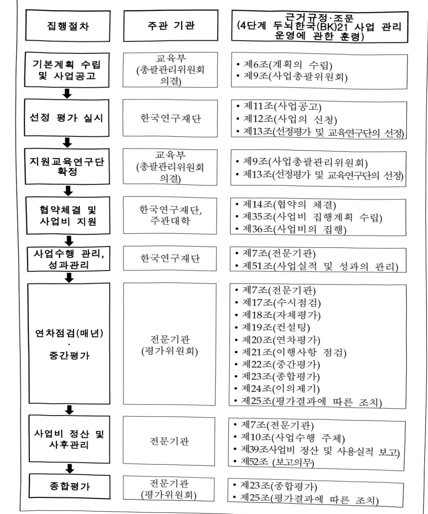

# 4단계 두뇌한국21 사업

**해당 페이지**: PDF 1815 ~ 1823 쪽 해당

**부처**: 교육부
**분야**: 교육
**회계유형**: 고등평생교육 지원특별회계
**2026 확정예산**: 541546.0 백만원
**전년대비 증감률**: 3.4%
**AI 도메인**: 교육/인재

---

<table border=1 style='margin: auto; word-wrap: break-word;'><tr><td style='text-align: center; word-wrap: break-word;'>사 업 명</td></tr><tr><td style='text-align: center; word-wrap: break-word;'>(17) 4단계 두뇌한국21 사업 (2303-300)</td></tr></table>

□ 사업 코드 정보

<table border=1 style='margin: auto; word-wrap: break-word;'><tr><td style='text-align: center; word-wrap: break-word;'>구분</td><td style='text-align: center; word-wrap: break-word;'>회계</td><td style='text-align: center; word-wrap: break-word;'>소관</td><td style='text-align: center; word-wrap: break-word;'>실국(기관)</td><td style='text-align: center; word-wrap: break-word;'>계정</td><td style='text-align: center; word-wrap: break-word;'>분야</td><td style='text-align: center; word-wrap: break-word;'>부문</td></tr><tr><td style='text-align: center; word-wrap: break-word;'>코드</td><td style='text-align: center; word-wrap: break-word;'>고등평생교육</td><td rowspan="2">교육부</td><td rowspan="2">인재정책실</td><td rowspan="2">인재정책실</td><td style='text-align: center; word-wrap: break-word;'>050</td><td style='text-align: center; word-wrap: break-word;'>052</td></tr><tr><td style='text-align: center; word-wrap: break-word;'>명칭</td><td style='text-align: center; word-wrap: break-word;'>지원특별회계</td><td style='text-align: center; word-wrap: break-word;'>교육</td><td style='text-align: center; word-wrap: break-word;'>고등교육</td></tr></table>

<table border=1 style='margin: auto; word-wrap: break-word;'><tr><td style='text-align: center; word-wrap: break-word;'>구분</td><td style='text-align: center; word-wrap: break-word;'>프로그램</td><td style='text-align: center; word-wrap: break-word;'>단위사업</td><td style='text-align: center; word-wrap: break-word;'>세부사업</td></tr><tr><td style='text-align: center; word-wrap: break-word;'>코드</td><td style='text-align: center; word-wrap: break-word;'>2300</td><td style='text-align: center; word-wrap: break-word;'>2303</td><td style='text-align: center; word-wrap: break-word;'>300</td></tr><tr><td style='text-align: center; word-wrap: break-word;'>명칭</td><td style='text-align: center; word-wrap: break-word;'>대학교육역량강화</td><td style='text-align: center; word-wrap: break-word;'>4단계 두뇌한국21 사업</td><td style='text-align: center; word-wrap: break-word;'>4단계 두뇌한국21 사업</td></tr></table>

☐ 사업 성격

<table border=1 style='margin: auto; word-wrap: break-word;'><tr><td rowspan="2">신규</td><td rowspan="2">계속</td><td rowspan="2">완료</td><td rowspan="2">예비타당성 실시여부</td><td rowspan="2">총사업비 관리대상</td><td rowspan="2">총액계상 예산사업</td><td style='text-align: center; word-wrap: break-word;'>사업소관 변경정보</td></tr><tr><td style='text-align: center; word-wrap: break-word;'>2025예산 시 소관</td></tr><tr><td style='text-align: center; word-wrap: break-word;'></td><td style='text-align: center; word-wrap: break-word;'>○</td><td style='text-align: center; word-wrap: break-word;'></td><td style='text-align: center; word-wrap: break-word;'></td><td style='text-align: center; word-wrap: break-word;'></td><td style='text-align: center; word-wrap: break-word;'></td><td style='text-align: center; word-wrap: break-word;'></td></tr></table>

□ 사업 지원 형태 및 지원을

<table border=1 style='margin: auto; word-wrap: break-word;'><tr><td style='text-align: center; word-wrap: break-word;'>직접</td><td style='text-align: center; word-wrap: break-word;'>출자</td><td style='text-align: center; word-wrap: break-word;'>출연</td><td style='text-align: center; word-wrap: break-word;'>보조</td><td style='text-align: center; word-wrap: break-word;'>융자</td><td style='text-align: center; word-wrap: break-word;'>국고보조율(%)</td><td style='text-align: center; word-wrap: break-word;'>융자율(%)</td></tr><tr><td style='text-align: center; word-wrap: break-word;'></td><td style='text-align: center; word-wrap: break-word;'></td><td style='text-align: center; word-wrap: break-word;'>○</td><td style='text-align: center; word-wrap: break-word;'></td><td style='text-align: center; word-wrap: break-word;'></td><td style='text-align: center; word-wrap: break-word;'></td><td style='text-align: center; word-wrap: break-word;'></td></tr></table>

## □ 사업 소관부처 및 시행주체

<table border=1 style='margin: auto; word-wrap: break-word;'><tr><td style='text-align: center; word-wrap: break-word;'>사업명</td><td colspan="2">구분</td></tr><tr><td rowspan="2">4단계 두뇌한국21사업</td><td style='text-align: center; word-wrap: break-word;'>소관부처</td><td style='text-align: center; word-wrap: break-word;'>고등평생정책실대학정책관대학학사운영과</td></tr><tr><td style='text-align: center; word-wrap: break-word;'>사업시행주체</td><td style='text-align: center; word-wrap: break-word;'>한국연구재단BK사업팀</td></tr></table>

---

### 가.예산 총괄표

(단위: 백만원, %)

<table border=1 style='margin: auto; word-wrap: break-word;'><tr><td rowspan="2">사업명</td><td rowspan="2">2024년 결산</td><td colspan="2">2025년 예산</td><td colspan="2">2026년 예산</td><td rowspan="2">중감 (B-A)</td><td rowspan="2">(B-A)/A</td></tr><tr><td style='text-align: center; word-wrap: break-word;'>본예산</td><td style='text-align: center; word-wrap: break-word;'>추경(A)</td><td style='text-align: center; word-wrap: break-word;'>요구안</td><td style='text-align: center; word-wrap: break-word;'>본예산(B)</td></tr><tr><td style='text-align: center; word-wrap: break-word;'>4단계 두뇌한국21 사업</td><td style='text-align: center; word-wrap: break-word;'>524,684</td><td style='text-align: center; word-wrap: break-word;'>522,478</td><td style='text-align: center; word-wrap: break-word;'>523,764</td><td style='text-align: center; word-wrap: break-word;'>541,546</td><td style='text-align: center; word-wrap: break-word;'>541,546</td><td style='text-align: center; word-wrap: break-word;'>17,782</td><td style='text-align: center; word-wrap: break-word;'>3.4</td></tr></table>

□ 기능별(내역사업별) 예산 내역

(단위:백만원)

<table border=1 style='margin: auto; word-wrap: break-word;'><tr><td rowspan="2"></td><td colspan="5">2024</td><td colspan="5">2025</td><td rowspan="2">2026예산</td></tr><tr><td style='text-align: center; word-wrap: break-word;'>예산액(추정)</td><td style='text-align: center; word-wrap: break-word;'>예산현액</td><td style='text-align: center; word-wrap: break-word;'>집행액</td><td style='text-align: center; word-wrap: break-word;'>이월액</td><td style='text-align: center; word-wrap: break-word;'>불용액</td><td style='text-align: center; word-wrap: break-word;'>예산액(추정)</td><td style='text-align: center; word-wrap: break-word;'>예산현액</td><td style='text-align: center; word-wrap: break-word;'>집행액</td><td style='text-align: center; word-wrap: break-word;'>이월액</td><td style='text-align: center; word-wrap: break-word;'>불용액</td></tr><tr><td style='text-align: center; word-wrap: break-word;'>○ 기능별 분류(합계)</td><td style='text-align: center; word-wrap: break-word;'>524,684</td><td style='text-align: center; word-wrap: break-word;'>524,684</td><td style='text-align: center; word-wrap: break-word;'>524,684</td><td style='text-align: center; word-wrap: break-word;'>-</td><td style='text-align: center; word-wrap: break-word;'>-</td><td style='text-align: center; word-wrap: break-word;'>522,478(523,764)</td><td style='text-align: center; word-wrap: break-word;'>523,764</td><td style='text-align: center; word-wrap: break-word;'>393,145</td><td style='text-align: center; word-wrap: break-word;'>-</td><td style='text-align: center; word-wrap: break-word;'>-</td><td style='text-align: center; word-wrap: break-word;'>541,546</td></tr><tr><td style='text-align: center; word-wrap: break-word;'>• 4단계 두뇌한국21</td><td style='text-align: center; word-wrap: break-word;'>524,684</td><td style='text-align: center; word-wrap: break-word;'>524,684</td><td style='text-align: center; word-wrap: break-word;'>524,684</td><td style='text-align: center; word-wrap: break-word;'>-</td><td style='text-align: center; word-wrap: break-word;'>-</td><td style='text-align: center; word-wrap: break-word;'>522,478(523,764)</td><td style='text-align: center; word-wrap: break-word;'>523,764</td><td style='text-align: center; word-wrap: break-word;'>393,145</td><td style='text-align: center; word-wrap: break-word;'>-</td><td style='text-align: center; word-wrap: break-word;'>-</td><td style='text-align: center; word-wrap: break-word;'>533,066</td></tr><tr><td style='text-align: center; word-wrap: break-word;'>• 이공 우수인재성장경로 지원</td><td style='text-align: center; word-wrap: break-word;'>-</td><td style='text-align: center; word-wrap: break-word;'>-</td><td style='text-align: center; word-wrap: break-word;'>-</td><td style='text-align: center; word-wrap: break-word;'>-</td><td style='text-align: center; word-wrap: break-word;'>-</td><td style='text-align: center; word-wrap: break-word;'>-</td><td style='text-align: center; word-wrap: break-word;'>-</td><td style='text-align: center; word-wrap: break-word;'>-</td><td style='text-align: center; word-wrap: break-word;'>-</td><td style='text-align: center; word-wrap: break-word;'>-</td><td style='text-align: center; word-wrap: break-word;'>8,480</td></tr></table>

### 나.사업설명자료

## 1 ) 사업목적·내용

°4단계 두뇌한국21

- 기초·핵심 학문분야 및 혁신성장 선도 분야의 연구역량 제고, 학문후속세대 양성

- 연구중심대학으로서의 대학원 교육 내실화 및 연구 환경 개선을 위한 대학원 체제 혁신 지원

° 이공 우수인재 성장경로 지원

- 유망 이공계 학생을 조기 선발하여 학부-대학원-박사후까지 전 주기 성장경로를 국가가 책임지는 전략적 엘리트 육성

- 두뇌한국21·장려금 등 기존 제도와 연계하여 장학금 등을 지급하고 박사후 과정생

(연구생)에 대한 인센티브 제공

---

## 2 ) 사업개요

□ 사업근거 및 추진경위

① 법령상 근거 및 조항 적시

「학술진흥법」제7조(학문후속세대의 육성)

제7조(학문후속세대의 육성) 교육과학기술부장관은 대학생, 대학원생, 관련 기술 및 지식을 가진 사람 또는 산업체 근무자 등이 연구자의 학술활동에 적극 참여하고 활용될 수 있도록 노력하며, 우수 연구자로 성장할 수 있도록 지원하고 필요한 조치를 하여야 한다.

국가과학기술 경쟁력 강화를 위한 이공제지원특별법 제11조(연구중심대학의 육성·지원)

제11조(연구중심대학의 육성·지원) 정부는 창의적인 연구개발과 이공계 인력의 육성을 효율적으로 추진하기 위하여 연구활동에 중점을 두는 대학(이하 “연구중심대학”이라 한다)에 필요한 지원을 할 수 있다.

## ② 추진경위

※ 1단계 BK21사업('99~'05)→2단계 BK21사업('06~'12)→BK21 플러스 사업('13.9.~'20.8.)

→4단계 두뇌한국21 사업('20.9.~'27.8.)

- BK21 후속사업 개편 기본방향(안) 발표(정책연구진, '18.11.27.)

- BK21 후속사업 기획을 위한 교육·연구 현장 의견수렴('19.2.~11.)

※ 사업단·팀장, 주요보직자, 학문후속세대(대학원생, 신진연구인력 등), 고등교육(재정)

전문가 등 대상 20회 이상 의견수렴 실시

- BK21 후속사업 기획자문위원회 구성 및 개최('19.6.~'20.1.)

-BK21사업 20주년 기념 심포지엄 개최('19.6.28.)

※ 4단계 BK21사업 세부기획 연구결과(안) 발표(정책연구진)

- 4단계 두뇌한국21 사업 기본계획(안) 발표('19.12.3.)

- 4단계 두뇌한국21 사업 기본계획 확정 및 사업공고('20.2.6.)

- 4단계 두뇌한국21 사업 예비 선정 결과 발표('20.8.6.)

- 4단계 두뇌한국21 사업 지원 교육연구단(팀) 최종 선정('20.10.) 및 협약 체결('20.11.)

## □ 주요내용

① 사업규모

- 총사업비(해당되는 경우에만 기재) : 해당없음

- 사업기간 : '20.9월 ~ '27.8월(7년간)

- 최근 5년 간 투입된 사업비(예산액기준, 추경편성한 연도에는 추경포함)

---

<table border=1 style='margin: auto; word-wrap: break-word;'><tr><td style='text-align: center; word-wrap: break-word;'>$ \underline{\text{所}} $</td><td style='text-align: center; word-wrap: break-word;'>2022</td><td style='text-align: center; word-wrap: break-word;'>2023</td><td style='text-align: center; word-wrap: break-word;'>2024</td><td style='text-align: center; word-wrap: break-word;'>2025</td><td style='text-align: center; word-wrap: break-word;'>2026</td></tr><tr><td style='text-align: center; word-wrap: break-word;'>$ \underline{\text{사업비}} $</td><td style='text-align: center; word-wrap: break-word;'>408,080</td><td style='text-align: center; word-wrap: break-word;'>526,090</td><td style='text-align: center; word-wrap: break-word;'>524,684</td><td style='text-align: center; word-wrap: break-word;'>523,764</td><td style='text-align: center; word-wrap: break-word;'>541,546</td></tr></table>

(단위 : 백만원)

- 기타: 해당없음

② 사업추진체계

- 사업시행방법 : 출연

- 사업시행주체 : 한국연구재단

- 사업 수혜자 : 대학원 학과(부) 기반 사업단(팀), 소속 대학원생 및 신진연구인력

- 보조, 융자, 출연, 출자 등의 경우 보조·융자 등 지원 비율 및 법적근거

<table border=1 style='margin: auto; word-wrap: break-word;'><tr><td style='text-align: center; word-wrap: break-word;'>내역사업명</td><td style='text-align: center; word-wrap: break-word;'>구분</td><td style='text-align: center; word-wrap: break-word;'>피출연 기관명</td><td style='text-align: center; word-wrap: break-word;'>지원 금액 (2026예산)</td><td style='text-align: center; word-wrap: break-word;'>지원 비율(%)</td><td style='text-align: center; word-wrap: break-word;'>보조율 법적근거 (해당 조항)</td></tr><tr><td style='text-align: center; word-wrap: break-word;'>4단계 두뇌한국21</td><td rowspan="2">출연</td><td rowspan="2">한국연구재단</td><td style='text-align: center; word-wrap: break-word;'>533,066</td><td style='text-align: center; word-wrap: break-word;'>100</td><td rowspan="2">「학술진흥법」제5조</td></tr><tr><td style='text-align: center; word-wrap: break-word;'>이공 우수인재 성장경로 지원</td><td style='text-align: center; word-wrap: break-word;'>8,480</td><td style='text-align: center; word-wrap: break-word;'>100</td></tr></table>

## 3 ) 2026년도 예산 산출 근거

□ 4단계 두뇌한국21 사업 : (2025 추경) 523,764백만원 → (2026 예산) 541,546백만원, +17,782백만원 (2025 본예산 522,478백만원 → 제1회 추경 522,478백만원 → 제2회 추경 523,764백만원)

① 4단계 두뇌한국21 사업 : (2025 추경) 523,764백만원 → (2026 예산) 533,066백만원, +9,302백만원 (2025 본예산 522,478백만원 → 제1회 추경 522,478백만원 → 제2회 추경 523,764백만원)

- (요구) 인공지능 분야 추가선정 교육연구단 지원금 및 대학원 연구생태계 조성 지원

- (산출) ① 교육연구단 지원 444,385백만원, ② 대학원 혁신지원 83,936백만원, ③ 후속사업 설계 컨설팅 300백만원, ④ 사업관리비 등 4,445백만원

② 이공 우수인재 성장경로 지원 사업 : (2025 추경) 신설 → (2026 예산) 8,480백만원, +8,480백만원 - (요구) 우수 공학인재의 학부-대학원-박사후 전 주기 지원 프로그램 신규 운영

- (산출) ① 학부생 지원 8,000백만원, ② 멘토링 인센티브 480백만원

2025년도 추가경정예산 및 2026년도 예산 산출 세부내역 비교

<table border=1 style='margin: auto; word-wrap: break-word;'><tr><td colspan="2">2025년 제2회 추가경쟁예산</td><td colspan="2">2026년 예산</td></tr><tr><td style='text-align: center; word-wrap: break-word;'>예산</td><td style='text-align: center; word-wrap: break-word;'>산출내역</td><td style='text-align: center; word-wrap: break-word;'>예산</td><td style='text-align: center; word-wrap: break-word;'>산출내역</td></tr></table>

---

<table border=1 style='margin: auto; word-wrap: break-word;'><tr><td colspan="2">2025년 제2회 추가경정예산</td><td colspan="2">2026년 예산</td></tr><tr><td style='text-align: center; word-wrap: break-word;'>예산</td><td style='text-align: center; word-wrap: break-word;'>산출내역</td><td style='text-align: center; word-wrap: break-word;'>예산</td><td style='text-align: center; word-wrap: break-word;'>산출내역</td></tr><tr><td style='text-align: center; word-wrap: break-word;'>4단계 두뇌한국 21 사업 523,764</td><td style='text-align: center; word-wrap: break-word;'>&lt; 4단계 두뇌한국21 사업 523,764백만원 &gt; 가. 교육연구단(팀) 지원액 435,898백만원 - (미래인재양성) 279,834백만원 · 석사 약 9,682명 × 100만원 × 12개월 = 116,183백만원 · 박사 약 6,658명 × 160만원 × 12개월 = 127,834백만원 · 박사수료 약 2,296명 × 130만원 × 12개월 = 35,818백만원 - (혁신인재양성) 150,578백만원 · 석사 약 5,551명 × 100만원 × 12개월 = 66,611백만원 · 박사 약 3,495명 × 160만원 × 12개월 = 67,104백만원 · 박사수료 약 1,081명 × 130만원 × 12개월 = 16,863백만원 - (첨단분야 교육연구단 추가선정) 5,486만원 · (우주항공) 3개 교육연구단 × 1,400백만원 = 4,200백만원 · (인공지능) 3개 교육연구단 × 429백만원 = 1,286백만원 나. Top-Tier 연구장려금 4,200백만원 - (우수대학원생 해외 공동연구 기회 제공) 4,200백만원 · 300명 × (항공료 2백만원 + 체재비 2백만원 × 6개월) = 4,200백만원 다. 대학원 혁신지원비 80,696백만원 · 24개 대학원 본부 × 3,362백만원 = 80,696백만원 라. 후속사업 설계 컨설팅 300백만원 · 3종 × 100백만원 = 300백만원 마. 사업 관리비 2,670백만원 · 1식 × 2,670백만원 = 2,670백만원</td><td style='text-align: center; word-wrap: break-word;'>4단계 두뇌한국 21 사업 533,066</td><td style='text-align: center; word-wrap: break-word;'>&lt; 4단계 두뇌한국21 사업 533,066백만원 &gt; +9,302백만원 가. 교육연구단(팀) 지원액 444,385백만원 - (미래인재양성) 279,834백만원 · 석사 약 9,682명 × 100만원 × 12개월 = 116,183백만원 · 박사 약 6,658명 × 160만원 × 12개월 = 127,834백만원 · 박사수료 약 2,296명 × 130만원 × 12개월 = 35,818백만원 - (혁신인재양성) 157,351백만원 · 석사 약 5,656명 × 100만원 × 12개월 = 67,871백만원 · 박사 약 3,701명 × 160만원 × 12개월 = 71,058백만원 · 박사수료 약 1,181명 × 130만원 × 12개월 = 18,422백만원 - (연구생태계 조성) 7,200백만원 · (AI+X 융합형) 3개 교육연구단 × 1,400백만원 = 4,200백만원 · (거점·중소대 연합형) 3개 대학 × 1,000백만원 = 3,000백만원 나. 대학원 혁신지원비 83,936백만원 - (대학원 혁신 지원) 80,696백만원 · 27개 대학원 본부 × 2,989백만원 = 80,696백만원 · 27개 대학 × 10명 × 100만원 × 12개월 = 3,240백만원 다. 후속사업 설계 컨설팅 (300백만원) · 3종 × 100백만원 = 300백만원 라. 사업 관리비 4,445백만원 - (평가관리비) 3,667백만원 · 1식 × 3,667백만원 = 3,667백만원 - (시스템 개선비) 778백만원 · 1식 × 778백만원 = 778백만원</td></tr><tr><td style='text-align: center; word-wrap: break-word;'>이공 우수인재 성장경로 지원 사업 -</td><td style='text-align: center; word-wrap: break-word;'>신 설</td><td style='text-align: center; word-wrap: break-word;'>이공 우수인재 성장경로 지원 사업 8,480</td><td style='text-align: center; word-wrap: break-word;'>&lt; 이공 우수인재 성장경로 지원 8,480백만원 &gt; +8,480백만원 가. 학부생 지원 · 10개 대학 × 40명 × 100만원 × 12개월 = 4,800백만원 · 10개 대학 × 40명 × 400만원 × 2회 = 3,200백만원 나. 면토링 인센티브 · 10개 대학 × 10명 × 480만원 = 480백만원</td></tr></table>

## 4 ) 사업효과

□ 사업영향,산출물 성과지표 등

①2022~2026년도 성과계획서 상 성과지표 및 최근 5년간 성과 달성도

<table border=1 style='margin: auto; word-wrap: break-word;'><tr><td style='text-align: center; word-wrap: break-word;'>성과지표</td><td style='text-align: center; word-wrap: break-word;'>구분</td><td style='text-align: center; word-wrap: break-word;'>2022</td><td style='text-align: center; word-wrap: break-word;'>2023</td><td style='text-align: center; word-wrap: break-word;'>2024</td><td style='text-align: center; word-wrap: break-word;'>2025</td><td style='text-align: center; word-wrap: break-word;'>2026</td><td style='text-align: center; word-wrap: break-word;'>2026 목표치산출근거</td><td style='text-align: center; word-wrap: break-word;'>측정산식(또는 측정방법)</td><td style='text-align: center; word-wrap: break-word;'>자료수집방법(또는 자료출처)</td></tr><tr><td rowspan="3">BK21플러스사업 지원대학원생취업를(단위: %)</td><td style='text-align: center; word-wrap: break-word;'>목표</td><td style='text-align: center; word-wrap: break-word;'>75.4</td><td style='text-align: center; word-wrap: break-word;'>-</td><td style='text-align: center; word-wrap: break-word;'>-</td><td style='text-align: center; word-wrap: break-word;'>-</td><td style='text-align: center; word-wrap: break-word;'>-</td><td rowspan="3">BK21 플러스 사업(13년) 이후 경제여건 영향으로 취업률이 매년 하락하는 추세 감안, 3년간 실적 평균인 75.4%를 목표치로 설정</td><td rowspan="3">취업자/(졸업자·진학자·군입대자)</td><td rowspan="3">한국연구재단시스템</td></tr><tr><td style='text-align: center; word-wrap: break-word;'>실적</td><td style='text-align: center; word-wrap: break-word;'>71.4</td><td style='text-align: center; word-wrap: break-word;'>-</td><td style='text-align: center; word-wrap: break-word;'>-</td><td style='text-align: center; word-wrap: break-word;'>-</td><td style='text-align: center; word-wrap: break-word;'>-</td></tr><tr><td style='text-align: center; word-wrap: break-word;'>달성도</td><td style='text-align: center; word-wrap: break-word;'>94.7</td><td style='text-align: center; word-wrap: break-word;'>-</td><td style='text-align: center; word-wrap: break-word;'>-</td><td style='text-align: center; word-wrap: break-word;'>-</td><td style='text-align: center; word-wrap: break-word;'>-</td></tr><tr><td rowspan="3">이공계 대학원전임교수 강의비율(단위: %)</td><td style='text-align: center; word-wrap: break-word;'>목표</td><td style='text-align: center; word-wrap: break-word;'>90.4</td><td style='text-align: center; word-wrap: break-word;'>-</td><td style='text-align: center; word-wrap: break-word;'>-</td><td style='text-align: center; word-wrap: break-word;'>-</td><td style='text-align: center; word-wrap: break-word;'>-</td><td rowspan="3">&#x27;20년 목표 대비 0.5%p 향상된 90.4%로 목표치 설정</td><td rowspan="3">전임교수 강의 시수 / 이공계 대학원 전체 강의 시수</td><td rowspan="3">한국연구재단시스템</td></tr><tr><td style='text-align: center; word-wrap: break-word;'>실적</td><td style='text-align: center; word-wrap: break-word;'>92.0</td><td style='text-align: center; word-wrap: break-word;'>-</td><td style='text-align: center; word-wrap: break-word;'>-</td><td style='text-align: center; word-wrap: break-word;'>-</td><td style='text-align: center; word-wrap: break-word;'>-</td></tr><tr><td style='text-align: center; word-wrap: break-word;'>달성도</td><td style='text-align: center; word-wrap: break-word;'>101.8</td><td style='text-align: center; word-wrap: break-word;'>-</td><td style='text-align: center; word-wrap: break-word;'>-</td><td style='text-align: center; word-wrap: break-word;'>-</td><td style='text-align: center; word-wrap: break-word;'>-</td></tr></table>

---

<table border=1 style='margin: auto; word-wrap: break-word;'><tr><td rowspan="3">4단계 BK21 사업 참여대학원생 취업의 전공일치율 (단위: %)</td><td style='text-align: center; word-wrap: break-word;'>목표</td><td style='text-align: center; word-wrap: break-word;'>89.2</td><td style='text-align: center; word-wrap: break-word;'>89.2</td><td style='text-align: center; word-wrap: break-word;'>89.2</td><td style='text-align: center; word-wrap: break-word;'>91.5</td><td style='text-align: center; word-wrap: break-word;'>89.5</td><td rowspan="3">통계청 주관 2년마 다 실시하는 사회조사의 대학원 이상 졸업자의 취업 전공일치도 최근 실적을 고려, 전년도 실적 등을 고려하여 목표치 설정</td><td rowspan="3">(취업자 중 전공일치자/참여대학원생 졸업자 중 취업자)*100</td><td rowspan="3">한국연구재단 시스템</td></tr><tr><td style='text-align: center; word-wrap: break-word;'>실적</td><td style='text-align: center; word-wrap: break-word;'>89.5</td><td style='text-align: center; word-wrap: break-word;'>91.5</td><td style='text-align: center; word-wrap: break-word;'>97.6</td><td style='text-align: center; word-wrap: break-word;'>-</td><td style='text-align: center; word-wrap: break-word;'>-</td></tr><tr><td style='text-align: center; word-wrap: break-word;'>달성도</td><td style='text-align: center; word-wrap: break-word;'>100.3</td><td style='text-align: center; word-wrap: break-word;'>102.6</td><td style='text-align: center; word-wrap: break-word;'>109.1</td><td style='text-align: center; word-wrap: break-word;'>-</td><td style='text-align: center; word-wrap: break-word;'>-</td></tr></table>

② 성과지표 이외의 연도별 사업추진 경과 및 실적

<table border=1 style='margin: auto; word-wrap: break-word;'><tr><td style='text-align: center; word-wrap: break-word;'>2022</td><td style='text-align: center; word-wrap: break-word;'>○ (4단계 두뇌한국21 사업) • 미래인재양성, 혁신인재양성: 68개 대학 577개 교육연구단(팀) 지원(&#x27;22.3월) • 대학원 혁신지원: 20개 대학원에 대한 지원 및 연차평가 실시(&#x27;22.5,10월) • 대학원 혁신 협의회 운영 및 성과 공유 포럼 개최(&#x27;22.12월) ○ (글로벌박사 양성 사업) • 글로벌박사 양성사업 시행계획 공고(&#x27;22.3) • (글로벌박사) 198명 계속지원</td></tr><tr><td style='text-align: center; word-wrap: break-word;'>2023</td><td style='text-align: center; word-wrap: break-word;'>○ (4단계 두뇌한국21 사업) • 미래인재양성, 혁신인재양성: 68개 대학 575개 교육연구단(팀) 지원(&#x27;23.3월) • 대학원 혁신지원: 24개 대학원에 대한 지원 및 연차평가 실시(&#x27;23.5월) • 미래인재양성사업 성과평가 실시(&#x27;23.3월~&#x27;23.8월) • 대학원 혁신 협의회 운영 및 성과 공유 포럼 개최(&#x27;23.12월) ○ (글로벌박사 양성 사업) • 글로벌박사 양성사업 시행계획 공고(&#x27;23.3) • (글로벌박사) 계속과제 80명 내외 지원</td></tr><tr><td style='text-align: center; word-wrap: break-word;'>2024</td><td style='text-align: center; word-wrap: break-word;'>○ (4단계 두뇌한국21 사업) • 미래인재양성, 혁신인재양성: 69개 대학 586개 교육연구단(팀) 지원(&#x27;24.3월) • 대학원 혁신지원: 24개 대학원에 대한 지원 및 연차평가 실시(&#x27;24.5월) • 혁신인재양성사업 성과평가 실시(&#x27;24.3월~&#x27;24.8월) • 대학원 혁신 협의회 운영 및 성과 공유 포럼 개최(&#x27;24.12월)</td></tr><tr><td style='text-align: center; word-wrap: break-word;'>2025</td><td style='text-align: center; word-wrap: break-word;'>○ (4단계 두뇌한국21 사업) • 미래인재양성, 혁신인재양성: 63개 대학 587개 교육연구단(팀) 지원(&#x27;25.3월) • 대학원 혁신지원: 27개 대학원 지원(&#x27;25.3월) • 혁신인재양성 우주분야 4개 교육연구단(팀) 추가선정(&#x27;25.3월) • 대학원 혁신 협의회 운영(&#x27;24.7월) • 혁신인재양성 인공지능 분야 3개 교육연구단(팀) 추가선정(&#x27;25.10월)</td></tr></table>

③향후(2026년도 이후)기대효과

- 우수인력에 대한 직접적인 재정지원을 통해 학업 및 연구에 몰입할 수 있는 여건을

조성함으로써 연구 성과 제고 및 국내 대학원의 학술연구역량 강화

---

- 핵심 선도사업 및 혁신성장동력분야, 사회문제 해결 등을 위한 융복합 인재 양성

- 프로그램 이수자 중심으로 국내 정착형 과학기술 핵심인재풀 형성 및 국내 고급 연구인력 선순환 구조 구축

5) 타당성조사 및 예비타당성조사 시행여부 및 결과 요지 : 해당없음

6) 총사업비 대상사업 정보 : 해당없음

---

7) 사업 집행절차

---

## 8 ) 각종 평가

<table border=1 style='margin: auto; word-wrap: break-word;'><tr><td style='text-align: center; word-wrap: break-word;'>1) 국회(예결위, 상임위, 예정처, 국정감사 포함) 지적 - (지적) 우수 대학원생 해외 공동연구 연수사업은 회계연도내에 예산 집행할 수 있도록 노력 필요(예결위, 23예산) - (조치) 세부계획 수립 후 회계연도내 예산 집행 및 회계연도 이후에도 연수진행 상황 등 지속 모니터링</td></tr><tr><td style='text-align: center; word-wrap: break-word;'>2) 대외공개 평가 : 해당없음</td></tr><tr><td style='text-align: center; word-wrap: break-word;'>3) 자체평가 : 해당없음</td></tr></table>

### 다. 최근 4년간 결산내역

## 1 ) 결산표

☐ 부처 결산내역

(단위: 백만원, %)

<table border=1 style='margin: auto; word-wrap: break-word;'><tr><td rowspan="2">연도</td><td colspan="3">예산액</td><td rowspan="2">예산현액(A)</td><td rowspan="2">집행액(B)</td><td rowspan="2">집행률(B/A)</td><td rowspan="2">다음연도이월액</td><td rowspan="2">불용액</td></tr><tr><td style='text-align: center; word-wrap: break-word;'>본예산</td><td style='text-align: center; word-wrap: break-word;'>추경중감액</td><td style='text-align: center; word-wrap: break-word;'>추경</td></tr><tr><td style='text-align: center; word-wrap: break-word;'>2022</td><td style='text-align: center; word-wrap: break-word;'>413,950</td><td style='text-align: center; word-wrap: break-word;'></td><td style='text-align: center; word-wrap: break-word;'>413,950</td><td style='text-align: center; word-wrap: break-word;'>413,950</td><td style='text-align: center; word-wrap: break-word;'>413,950</td><td style='text-align: center; word-wrap: break-word;'>100</td><td style='text-align: center; word-wrap: break-word;'>-</td><td style='text-align: center; word-wrap: break-word;'>-</td></tr><tr><td style='text-align: center; word-wrap: break-word;'>2023</td><td style='text-align: center; word-wrap: break-word;'>528,690</td><td style='text-align: center; word-wrap: break-word;'></td><td style='text-align: center; word-wrap: break-word;'>528,690</td><td style='text-align: center; word-wrap: break-word;'>528,690</td><td style='text-align: center; word-wrap: break-word;'>528,690</td><td style='text-align: center; word-wrap: break-word;'>100</td><td style='text-align: center; word-wrap: break-word;'>-</td><td style='text-align: center; word-wrap: break-word;'>-</td></tr><tr><td style='text-align: center; word-wrap: break-word;'>2024</td><td style='text-align: center; word-wrap: break-word;'>524,684</td><td style='text-align: center; word-wrap: break-word;'></td><td style='text-align: center; word-wrap: break-word;'>524,684</td><td style='text-align: center; word-wrap: break-word;'>524,684</td><td style='text-align: center; word-wrap: break-word;'>524,684</td><td style='text-align: center; word-wrap: break-word;'>100</td><td style='text-align: center; word-wrap: break-word;'>-</td><td style='text-align: center; word-wrap: break-word;'>-</td></tr><tr><td style='text-align: center; word-wrap: break-word;'>2025</td><td style='text-align: center; word-wrap: break-word;'>522,478</td><td style='text-align: center; word-wrap: break-word;'>1,286</td><td style='text-align: center; word-wrap: break-word;'>523,764</td><td style='text-align: center; word-wrap: break-word;'>523,764</td><td style='text-align: center; word-wrap: break-word;'>523,764</td><td style='text-align: center; word-wrap: break-word;'>100</td><td style='text-align: center; word-wrap: break-word;'>-</td><td style='text-align: center; word-wrap: break-word;'>-</td></tr></table>

## 2 ) 주요 결산사항

□ 2022~2025년 결산 주요 지적사항 및 시정요구사항 : 해당없음

□ 2025년 이·전용 등 세부내역 : 해당없음

---

### 원본 PDF 크롭 이미지

