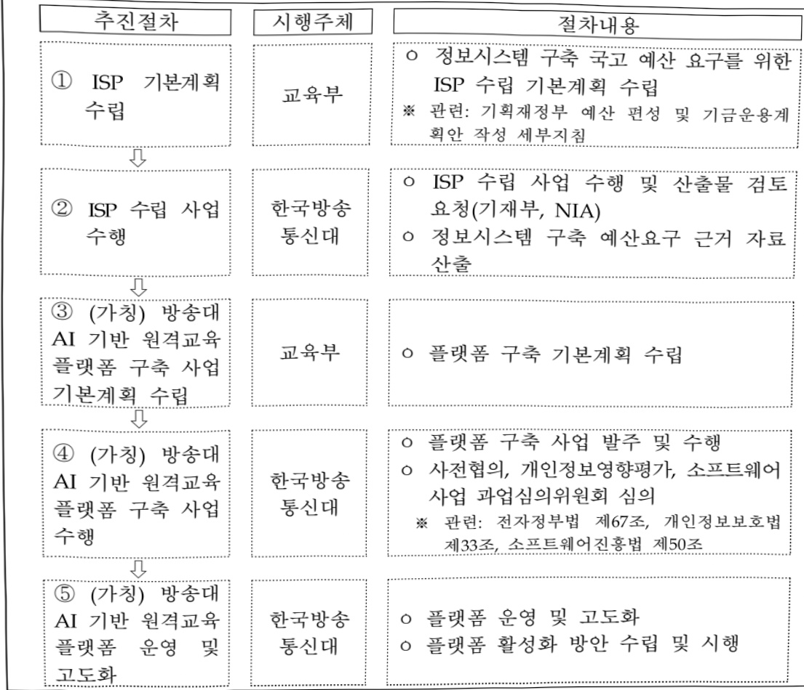

# AI 디지털 유니버시티 혁신교육 플랫폼 구축(정보화)

**해당 페이지**: PDF 1824 ~ 1828 쪽 해당

**부처**: 교육부
**분야**: 교육
**회계유형**: 일반회계
**2026 확정예산**: 200.0 백만원
**전년대비 증감률**: None%
**AI 도메인**: 교육/인재

---

### 가.예산 총괄표

(단위: 백만원, %)

<table border=1 style='margin: auto; word-wrap: break-word;'><tr><td rowspan="2">사업명</td><td rowspan="2">2024년 결산</td><td colspan="2">2025년 예산</td><td colspan="2">2026년 예산</td><td rowspan="2">중감(B-A)</td><td rowspan="2">(B-A)/A</td></tr><tr><td style='text-align: center; word-wrap: break-word;'>본예산</td><td style='text-align: center; word-wrap: break-word;'>추경(A)</td><td style='text-align: center; word-wrap: break-word;'>요구안</td><td style='text-align: center; word-wrap: break-word;'>본예산(B)</td></tr><tr><td style='text-align: center; word-wrap: break-word;'>AI 디지털 유니버시티 혁신교육 플랫폼 구축(정보화)</td><td style='text-align: center; word-wrap: break-word;'>-</td><td style='text-align: center; word-wrap: break-word;'>-</td><td style='text-align: center; word-wrap: break-word;'>-</td><td style='text-align: center; word-wrap: break-word;'>305</td><td style='text-align: center; word-wrap: break-word;'>200</td><td style='text-align: center; word-wrap: break-word;'>200</td><td style='text-align: center; word-wrap: break-word;'>순증</td></tr></table>

□ 기능별(내역사업별) 예산 내역

(단위:백만원)

<table border=1 style='margin: auto; word-wrap: break-word;'><tr><td rowspan="2"></td><td colspan="5">2024</td><td colspan="5">2025</td><td rowspan="2">2026예산</td></tr><tr><td style='text-align: center; word-wrap: break-word;'>예산액(추경)</td><td style='text-align: center; word-wrap: break-word;'>예산현액</td><td style='text-align: center; word-wrap: break-word;'>집행액</td><td style='text-align: center; word-wrap: break-word;'>이월액</td><td style='text-align: center; word-wrap: break-word;'>불용액</td><td style='text-align: center; word-wrap: break-word;'>예산액(추경)</td><td style='text-align: center; word-wrap: break-word;'>예산현액</td><td style='text-align: center; word-wrap: break-word;'>집행액</td><td style='text-align: center; word-wrap: break-word;'>이월액</td><td style='text-align: center; word-wrap: break-word;'>불용액</td></tr><tr><td style='text-align: center; word-wrap: break-word;'>○ 기능별 분류(합계)</td><td style='text-align: center; word-wrap: break-word;'>-</td><td style='text-align: center; word-wrap: break-word;'>-</td><td style='text-align: center; word-wrap: break-word;'>-</td><td style='text-align: center; word-wrap: break-word;'>-</td><td style='text-align: center; word-wrap: break-word;'>-</td><td style='text-align: center; word-wrap: break-word;'>-</td><td style='text-align: center; word-wrap: break-word;'>-</td><td style='text-align: center; word-wrap: break-word;'>-</td><td style='text-align: center; word-wrap: break-word;'>-</td><td style='text-align: center; word-wrap: break-word;'>-</td><td style='text-align: center; word-wrap: break-word;'>200</td></tr><tr><td style='text-align: center; word-wrap: break-word;'>• AI 디지털유니버시티 혁신교육 플랫폼 구축(정보화)</td><td style='text-align: center; word-wrap: break-word;'>-</td><td style='text-align: center; word-wrap: break-word;'>-</td><td style='text-align: center; word-wrap: break-word;'>-</td><td style='text-align: center; word-wrap: break-word;'>-</td><td style='text-align: center; word-wrap: break-word;'>-</td><td style='text-align: center; word-wrap: break-word;'>-</td><td style='text-align: center; word-wrap: break-word;'>-</td><td style='text-align: center; word-wrap: break-word;'>-</td><td style='text-align: center; word-wrap: break-word;'>-</td><td style='text-align: center; word-wrap: break-word;'>-</td><td style='text-align: center; word-wrap: break-word;'>200</td></tr></table>

### 나. 사업설명자료

## 1 ) 사업목적·내용

- 한국방송통신대학교에 AI 기반 원격교육 플랫폼을 구축하여 고등·평생교육의 질

제고 및 전국민 역량 강화 지원

## 2 ) 사업개요

□ 사업근거 및 추진경위

① 법령상 근거 및 조항 적시

교육기본법 제10조(평생교육) ① 전 국민을 대상으로 하는 모든 형태의 평생교육은 장려되어야 한다. ② 평생교육의 이수(履修)는 법령으로 정하는 바에 따라 그에 상응하는 학교교육의 이수로 인정될 수 있다. ③ 평생교육시설의 종류와 설립·경영 등 평생교육에 관한 기본적인 사항은 따로 법률로 정한다.

교육기본법 제23조(학습권) ① 국가와 지방자치단체는 정보화교육 및 정보통신매체를 이용한 교육을 지원하고 교육정보산업을 육성하는 등 교육의 정보화에 필요한 시책을 수립 · 실시하여야 한다. ②

---

제1항에 따른 정보화교육에는 정보통신매체를 이용하는 데 필요한 타인의 명예·생명·신체 및 재산상의 위해를 방지하기 위한 법적·윤리적 기준에 관한 교육이 포함되어야 한다.

고등교육법 제2조 (학교의 종류) 고등교육을 실시하기 위하여 다음 각 호의 학교를 둔다. 1. 대학 2. 산업대학 3. 교육대학 4. 전문대학 5. 방송대학 · 통신대학 · 방송통신대학 및 사이버대학(이하 “원격대학”이라 한다) 6. 기술대학 7. 각종학교

고등교육법 제52조 원격대학은 국민에게 정보·통신 매체를 통한 원격교육(遠隔教育)으로 고등교육을 받을 기회를 제공하여 국가와 사회에 필요한 인재를 양성함과 동시에 열린 학습사회를 구현함으로써 평생교육의 발전에 이바지함을 목적으로 한다.

○ 한국방송통신대학교 설립 및 운영에 관한 법률 제3조(방송통신대학교의 책무 등) ① 방송통신대학교의 장은 국민의 학습권 보장과 국가의 평생교육 진흥에 이바지하기 위하여 방송통신대학교의 중·장기발전계획을 수립하고 이를 성실하게 이행하여야 한다. ② 국가 및 지방자치단체는 방송통신대학교가 제1항에 따른 책무를 이행하는 데 필요한 지원을 할 수 있다.

○ 원격교육법 제15조(대학등의 원격교육 인프라) ① 대학등의 장은 원격교육의 질을 향상시키기 위하여 대통령령으로 정하는 바에 따라 교구·장비 및 시설 등 원격교육 인프라의 구축·운영에 필요한 조치를 하여야 한다. ② 국가 및 지방자치단체는 대학등의 원격교육을 위하여 다음 각 호의 사항을 지원할 수 있다. 1. 원격교육콘텐츠 및 관련 기술 개발 2. 원격교육콘텐츠 개발에 필요한 시설 구축 3. 그 밖에 대통령령으로 정하는 사항 ③ 국가 및 지방자치단체는 예산의 범위에서 제2항에 따른 대학등의 원격교육 지원에 필요한 경비를 출연할 수 있다.

## ② 추진경위

- 한국방송통신대학교, 디지털 대전환 시대에 대응하여 성인자 학습자의 맞춤 학습 지원을 위해 ‘방송대 AI 기반 고등·평생교육 생태계 구축 계획(안)’ 검토 : '24~'25년

## □ 주요내용

① 사업규모

- 총사업비(해당되는 경우에만 기재) : 154억원(예상 구축비, 운영비 별도)

- 사업기간 : '26년~계속

- 최근 5년 간 투입된 사업비(예산액기준, 추경편성한 연도에는 추경포함)

<table border=1 style='margin: auto; word-wrap: break-word;'><tr><td style='text-align: center; word-wrap: break-word;'>$ \underline{\text{연도}} $</td><td style='text-align: center; word-wrap: break-word;'>2022</td><td style='text-align: center; word-wrap: break-word;'>2023</td><td style='text-align: center; word-wrap: break-word;'>2024</td><td style='text-align: center; word-wrap: break-word;'>2025</td><td style='text-align: center; word-wrap: break-word;'>2026</td></tr><tr><td style='text-align: center; word-wrap: break-word;'>$ \underline{\text{사업비}} $</td><td style='text-align: center; word-wrap: break-word;'>-</td><td style='text-align: center; word-wrap: break-word;'>-</td><td style='text-align: center; word-wrap: break-word;'>-</td><td style='text-align: center; word-wrap: break-word;'>-</td><td style='text-align: center; word-wrap: break-word;'>200</td></tr></table>

② 사업추진체계

- 사업시행방법 : 직접수행

- 사업시행주체 : 한국방송통신대학교

- 사업 수혜자 : 한국방송통신대학교 재학생 및 타 대학 학생 등

- 보조, 융자, 출연, 출자 등의 경우 보조·융자 등 지원 비율 및 법적근거 : 해당 없음

---

## 3 ) 2026년도 예산 산출 근거

□ AI 디지털유니버시티 혁신교육 플랫폼 구축 : (2025 본예산) - → (2026) 200백만원, 순증

- (요구) AI 기반 원격교육 플랫폼 구축을 위한 ISP 수립 예산 필요

- (산출)ISP 200백만원

□2025년도 예산 및 2026년도 예산 산출 세부내역 비교

<table border=1 style='margin: auto; word-wrap: break-word;'><tr><td colspan="2">2025년 본예산</td><td colspan="2">2026년 예산</td></tr><tr><td style='text-align: center; word-wrap: break-word;'>예산</td><td style='text-align: center; word-wrap: break-word;'>산출내역</td><td style='text-align: center; word-wrap: break-word;'>예산</td><td style='text-align: center; word-wrap: break-word;'>산출내역</td></tr><tr><td colspan="2">○ 일반연구비(260-01) : 해당없음</td><td style='text-align: center; word-wrap: break-word;'>195,662</td><td style='text-align: center; word-wrap: break-word;'>○ 일반연구비(260-01) : 200백만원
- AI 기반 원격교육 플랫폼 구축을 위한 ISP 수립 예산 200백만원</td></tr></table>

## 4 ) 사업효과

☐ 사업영향, 산출물 성과지표 등

①2022~2026년도 성과계획서 상 성과지표 및 최근 5년간 성과 달성도

<table border=1 style='margin: auto; word-wrap: break-word;'><tr><td style='text-align: center; word-wrap: break-word;'>성과지표</td><td style='text-align: center; word-wrap: break-word;'>구분</td><td style='text-align: center; word-wrap: break-word;'>2022</td><td style='text-align: center; word-wrap: break-word;'>2023</td><td style='text-align: center; word-wrap: break-word;'>2024</td><td style='text-align: center; word-wrap: break-word;'>2025</td><td style='text-align: center; word-wrap: break-word;'>2026</td><td style='text-align: center; word-wrap: break-word;'>2026 목표치산출근거</td><td style='text-align: center; word-wrap: break-word;'>측정산식(또는 측정방법)</td><td style='text-align: center; word-wrap: break-word;'>자료수집방법(또는 자료출처)</td></tr><tr><td rowspan="3">국립대학 학생1인당 교육비(단위:천원)</td><td style='text-align: center; word-wrap: break-word;'>목표</td><td style='text-align: center; word-wrap: break-word;'>신규</td><td style='text-align: center; word-wrap: break-word;'>신규</td><td style='text-align: center; word-wrap: break-word;'>21,529</td><td style='text-align: center; word-wrap: break-word;'>23,784</td><td style='text-align: center; word-wrap: break-word;'>25,449</td><td rowspan="3">&#x27;19 ~ &#x27;24년 증가율평균(7.7%)을 고려하여, 전년 대비 7% 증액한 목표 설정</td><td rowspan="3">국립대학 1인당 교육비(천원) = A / B * A (국립대학 학생 1인당 층 교육비(대학회계, 발전기금회계, 산학협력단회계, 도서구입비, 기계기구매입비) ** B (재학생 수)</td><td rowspan="3">정보공시 자료 활용</td></tr><tr><td style='text-align: center; word-wrap: break-word;'>실적</td><td style='text-align: center; word-wrap: break-word;'>18,315</td><td style='text-align: center; word-wrap: break-word;'>20,215</td><td style='text-align: center; word-wrap: break-word;'>22,228</td><td style='text-align: center; word-wrap: break-word;'>-</td><td style='text-align: center; word-wrap: break-word;'>-</td></tr><tr><td style='text-align: center; word-wrap: break-word;'>달성도</td><td style='text-align: center; word-wrap: break-word;'>-</td><td style='text-align: center; word-wrap: break-word;'>-</td><td style='text-align: center; word-wrap: break-word;'>103.2</td><td style='text-align: center; word-wrap: break-word;'>-</td><td style='text-align: center; word-wrap: break-word;'>-</td></tr></table>

② 성과지표 이외의 연도별 사업추진 경과 및 실적 : 해당 없음

③ 향후(2026년도 이후) 기대효과 : 한국방송통신대학 내 AI 기반 원격교육 플랫폼 구축으로 성인학습자의 맞춤 학습 지원 및 AI·디지털 역량 제고

5) 타당성조사 및 예비타당성조사 시행여부 및 결과 요지 : 해당 없음

6) 총사업비 대상사업 정보 : 해당 없음

---

7) 사업 집행절차

8) 각종 평가 : 해당 없음

다. 최근 4년간 결산내역 : 해당 없음

---

<table border=1 style='margin: auto; word-wrap: break-word;'><tr><td style='text-align: center; word-wrap: break-word;'>사 업 명</td></tr><tr><td style='text-align: center; word-wrap: break-word;'>(53) 가상실험실습 학습콘텐츠 공유 플랫폼 구축(정보화) (4134-500)</td></tr></table>

## □ 사업 코드 정보

<table border=1 style='margin: auto; word-wrap: break-word;'><tr><td style='text-align: center; word-wrap: break-word;'>구분</td><td style='text-align: center; word-wrap: break-word;'>회계</td><td style='text-align: center; word-wrap: break-word;'>소관</td><td style='text-align: center; word-wrap: break-word;'>실국(기관)</td><td style='text-align: center; word-wrap: break-word;'>계정</td><td style='text-align: center; word-wrap: break-word;'>분야</td><td style='text-align: center; word-wrap: break-word;'>부문</td></tr><tr><td style='text-align: center; word-wrap: break-word;'>코드</td><td style='text-align: center; word-wrap: break-word;'>고등·평생교육</td><td rowspan="2">교육부</td><td rowspan="2">평생교육지원관</td><td rowspan="2"></td><td style='text-align: center; word-wrap: break-word;'>050</td><td style='text-align: center; word-wrap: break-word;'>053</td></tr><tr><td style='text-align: center; word-wrap: break-word;'>명칭</td><td style='text-align: center; word-wrap: break-word;'>지원특별회계</td><td style='text-align: center; word-wrap: break-word;'>교육</td><td style='text-align: center; word-wrap: break-word;'>평생·직업교육</td></tr></table>

<table border=1 style='margin: auto; word-wrap: break-word;'><tr><td style='text-align: center; word-wrap: break-word;'>구분</td><td style='text-align: center; word-wrap: break-word;'>프로그램</td><td style='text-align: center; word-wrap: break-word;'>단위사업</td><td style='text-align: center; word-wrap: break-word;'>세부사업</td></tr><tr><td style='text-align: center; word-wrap: break-word;'>코드</td><td style='text-align: center; word-wrap: break-word;'>4100</td><td style='text-align: center; word-wrap: break-word;'>4134</td><td style='text-align: center; word-wrap: break-word;'>500</td></tr><tr><td style='text-align: center; word-wrap: break-word;'>명칭</td><td style='text-align: center; word-wrap: break-word;'>평생직업교육 체제 구축</td><td style='text-align: center; word-wrap: break-word;'>평생학습 활성화지원</td><td style='text-align: center; word-wrap: break-word;'>가상실험실습 학습콘텐츠 공유 플랫폼 구축(정보화)</td></tr></table>

□ 사업 성격

<table border=1 style='margin: auto; word-wrap: break-word;'><tr><td rowspan="2">신규</td><td rowspan="2">계속</td><td rowspan="2">완료</td><td style='text-align: center; word-wrap: break-word;'>예비타당성</td><td style='text-align: center; word-wrap: break-word;'>총사업비</td><td style='text-align: center; word-wrap: break-word;'>총액계상</td><td style='text-align: center; word-wrap: break-word;'>사업소관 변경정보</td></tr><tr><td style='text-align: center; word-wrap: break-word;'>실시여부</td><td style='text-align: center; word-wrap: break-word;'>관리대상</td><td style='text-align: center; word-wrap: break-word;'>예산사업</td><td style='text-align: center; word-wrap: break-word;'>2024예산 시 소관</td></tr><tr><td style='text-align: center; word-wrap: break-word;'></td><td style='text-align: center; word-wrap: break-word;'>○</td><td style='text-align: center; word-wrap: break-word;'></td><td style='text-align: center; word-wrap: break-word;'></td><td style='text-align: center; word-wrap: break-word;'></td><td style='text-align: center; word-wrap: break-word;'></td><td style='text-align: center; word-wrap: break-word;'></td></tr></table>

□ 사업 지원 형태 및 지원을

<table border=1 style='margin: auto; word-wrap: break-word;'><tr><td style='text-align: center; word-wrap: break-word;'>직접</td><td style='text-align: center; word-wrap: break-word;'>출자</td><td style='text-align: center; word-wrap: break-word;'>출연</td><td style='text-align: center; word-wrap: break-word;'>보조</td><td style='text-align: center; word-wrap: break-word;'>융자</td><td style='text-align: center; word-wrap: break-word;'>국고보조율(%)</td><td style='text-align: center; word-wrap: break-word;'>융자율(%)</td></tr><tr><td style='text-align: center; word-wrap: break-word;'>○</td><td style='text-align: center; word-wrap: break-word;'></td><td style='text-align: center; word-wrap: break-word;'></td><td style='text-align: center; word-wrap: break-word;'></td><td style='text-align: center; word-wrap: break-word;'></td><td style='text-align: center; word-wrap: break-word;'></td><td style='text-align: center; word-wrap: break-word;'></td></tr></table>

## □ 사업 소관부처 및 시행주체

<table border=1 style='margin: auto; word-wrap: break-word;'><tr><td style='text-align: center; word-wrap: break-word;'>사업명</td><td colspan="2">구분</td></tr><tr><td rowspan="3">가상실험실습 학습콘텐츠 공유 플랫폼 구축(정보화)</td><td rowspan="2">소관부처</td><td style='text-align: center; word-wrap: break-word;'>평생교육지원관</td></tr><tr><td style='text-align: center; word-wrap: break-word;'>평생학습정책과</td></tr><tr><td style='text-align: center; word-wrap: break-word;'>사업시행주체</td><td style='text-align: center; word-wrap: break-word;'>한국방송통신대학교OpenVLab구축사업단</td></tr></table>

---

### 원본 PDF 크롭 이미지

