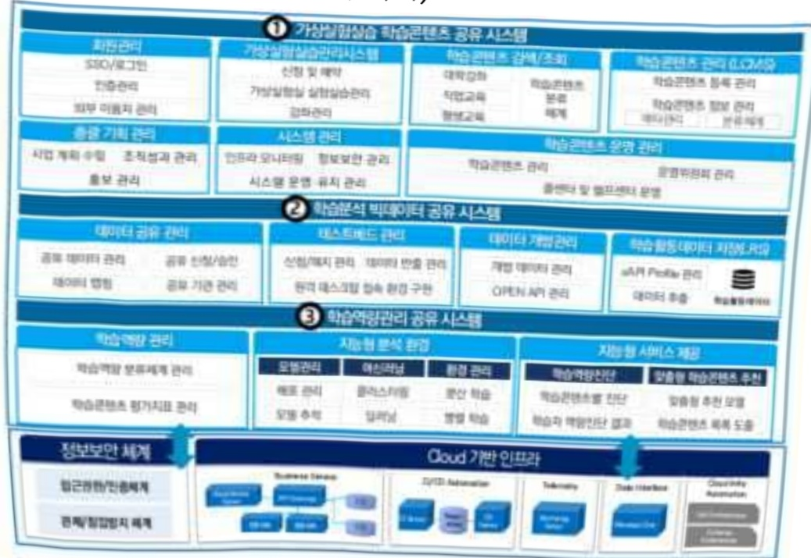
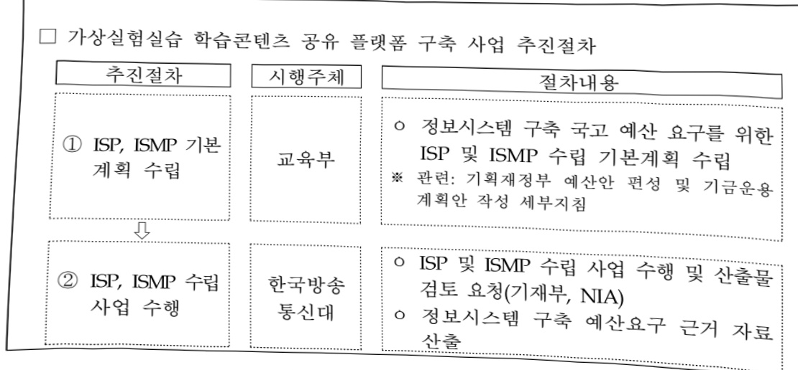
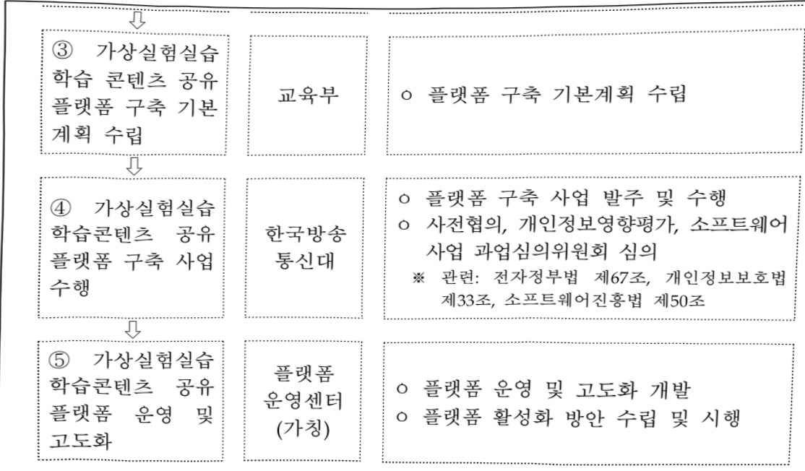

# 가상실험실습 학습콘텐츠 공유 플랫폼 구축(정보화)

**해당 페이지**: PDF 1829 ~ 1839 쪽 해당

**부처**: 교육부
**분야**: 교육
**회계유형**: 고등･평생교육 지원특별회계
**2026 확정예산**: 2064.0 백만원
**전년대비 증감률**: 23.4%
**AI 도메인**: 데이터, 교육/인재, 문화/콘텐츠, 디지털전환(AX)

---

<table border=1 style='margin: auto; word-wrap: break-word;'><tr><td style='text-align: center; word-wrap: break-word;'>사 업 명</td></tr><tr><td style='text-align: center; word-wrap: break-word;'>(53) 가상실험실습 학습콘텐츠 공유 플랫폼 구축(정보화) (4134-500)</td></tr></table>

## □ 사업 코드 정보

<table border=1 style='margin: auto; word-wrap: break-word;'><tr><td style='text-align: center; word-wrap: break-word;'>구분</td><td style='text-align: center; word-wrap: break-word;'>회계</td><td style='text-align: center; word-wrap: break-word;'>소관</td><td style='text-align: center; word-wrap: break-word;'>실국(기관)</td><td style='text-align: center; word-wrap: break-word;'>계정</td><td style='text-align: center; word-wrap: break-word;'>분야</td><td style='text-align: center; word-wrap: break-word;'>부문</td></tr><tr><td style='text-align: center; word-wrap: break-word;'>코드</td><td style='text-align: center; word-wrap: break-word;'>고등·평생교육</td><td rowspan="2">교육부</td><td rowspan="2">평생교육지원관</td><td rowspan="2"></td><td style='text-align: center; word-wrap: break-word;'>050</td><td style='text-align: center; word-wrap: break-word;'>053</td></tr><tr><td style='text-align: center; word-wrap: break-word;'>명칭</td><td style='text-align: center; word-wrap: break-word;'>지원특별회계</td><td style='text-align: center; word-wrap: break-word;'>교육</td><td style='text-align: center; word-wrap: break-word;'>평생·직업교육</td></tr></table>

<table border=1 style='margin: auto; word-wrap: break-word;'><tr><td style='text-align: center; word-wrap: break-word;'>구분</td><td style='text-align: center; word-wrap: break-word;'>프로그램</td><td style='text-align: center; word-wrap: break-word;'>단위사업</td><td style='text-align: center; word-wrap: break-word;'>세부사업</td></tr><tr><td style='text-align: center; word-wrap: break-word;'>코드</td><td style='text-align: center; word-wrap: break-word;'>4100</td><td style='text-align: center; word-wrap: break-word;'>4134</td><td style='text-align: center; word-wrap: break-word;'>500</td></tr><tr><td style='text-align: center; word-wrap: break-word;'>명칭</td><td style='text-align: center; word-wrap: break-word;'>평생직업교육 체제 구축</td><td style='text-align: center; word-wrap: break-word;'>평생학습 활성화지원</td><td style='text-align: center; word-wrap: break-word;'>가상실험실습 학습콘텐츠 공유 플랫폼 구축(정보화)</td></tr></table>

□ 사업 성격

<table border=1 style='margin: auto; word-wrap: break-word;'><tr><td rowspan="2">신규</td><td rowspan="2">계속</td><td rowspan="2">완료</td><td style='text-align: center; word-wrap: break-word;'>예비타당성</td><td style='text-align: center; word-wrap: break-word;'>총사업비</td><td style='text-align: center; word-wrap: break-word;'>총액계상</td><td style='text-align: center; word-wrap: break-word;'>사업소관 변경정보</td></tr><tr><td style='text-align: center; word-wrap: break-word;'>실시여부</td><td style='text-align: center; word-wrap: break-word;'>관리대상</td><td style='text-align: center; word-wrap: break-word;'>예산사업</td><td style='text-align: center; word-wrap: break-word;'>2024예산 시 소관</td></tr><tr><td style='text-align: center; word-wrap: break-word;'></td><td style='text-align: center; word-wrap: break-word;'>○</td><td style='text-align: center; word-wrap: break-word;'></td><td style='text-align: center; word-wrap: break-word;'></td><td style='text-align: center; word-wrap: break-word;'></td><td style='text-align: center; word-wrap: break-word;'></td><td style='text-align: center; word-wrap: break-word;'></td></tr></table>

□ 사업 지원 형태 및 지원을

<table border=1 style='margin: auto; word-wrap: break-word;'><tr><td style='text-align: center; word-wrap: break-word;'>직접</td><td style='text-align: center; word-wrap: break-word;'>출자</td><td style='text-align: center; word-wrap: break-word;'>출연</td><td style='text-align: center; word-wrap: break-word;'>보조</td><td style='text-align: center; word-wrap: break-word;'>융자</td><td style='text-align: center; word-wrap: break-word;'>국고보조율(%)</td><td style='text-align: center; word-wrap: break-word;'>융자율(%)</td></tr><tr><td style='text-align: center; word-wrap: break-word;'>○</td><td style='text-align: center; word-wrap: break-word;'></td><td style='text-align: center; word-wrap: break-word;'></td><td style='text-align: center; word-wrap: break-word;'></td><td style='text-align: center; word-wrap: break-word;'></td><td style='text-align: center; word-wrap: break-word;'></td><td style='text-align: center; word-wrap: break-word;'></td></tr></table>

## □ 사업 소관부처 및 시행주체

<table border=1 style='margin: auto; word-wrap: break-word;'><tr><td style='text-align: center; word-wrap: break-word;'>사업명</td><td colspan="2">구분</td></tr><tr><td rowspan="3">가상실험실습 학습콘텐츠 공유 플랫폼 구축(정보화)</td><td rowspan="2">소관부처</td><td style='text-align: center; word-wrap: break-word;'>평생교육지원관</td></tr><tr><td style='text-align: center; word-wrap: break-word;'>평생학습정책과</td></tr><tr><td style='text-align: center; word-wrap: break-word;'>사업시행주체</td><td style='text-align: center; word-wrap: break-word;'>한국방송통신대학교OpenVLab구축사업단</td></tr></table>

---

### 가.예산 총괄표

(단위: 백만원, %)

<table border=1 style='margin: auto; word-wrap: break-word;'><tr><td rowspan="2">사업명</td><td rowspan="2">2024년 결산</td><td colspan="2">2025년 예산</td><td colspan="2">2026년 예산</td><td rowspan="2">중감(B-A)</td><td rowspan="2">(B-A)/A</td></tr><tr><td style='text-align: center; word-wrap: break-word;'>본예산</td><td style='text-align: center; word-wrap: break-word;'>추경(A)</td><td style='text-align: center; word-wrap: break-word;'>요구안</td><td style='text-align: center; word-wrap: break-word;'>본예산(B)</td></tr><tr><td style='text-align: center; word-wrap: break-word;'>가상실험실습 학습콘텐츠 공유 플랫폼 구축(정보화)</td><td style='text-align: center; word-wrap: break-word;'>327</td><td style='text-align: center; word-wrap: break-word;'>1,673</td><td style='text-align: center; word-wrap: break-word;'>1,673</td><td style='text-align: center; word-wrap: break-word;'>2,064</td><td style='text-align: center; word-wrap: break-word;'>2,064</td><td style='text-align: center; word-wrap: break-word;'>391</td><td style='text-align: center; word-wrap: break-word;'>23.4</td></tr></table>

□ 기능별(내역사업별) 예산 내역

(단위:백만원)

<table border=1 style='margin: auto; word-wrap: break-word;'><tr><td rowspan="2"></td><td colspan="5">2024</td><td colspan="5">2025</td><td rowspan="2">2026예산</td></tr><tr><td style='text-align: center; word-wrap: break-word;'>예산액(추정)</td><td style='text-align: center; word-wrap: break-word;'>예산현액</td><td style='text-align: center; word-wrap: break-word;'>집행액</td><td style='text-align: center; word-wrap: break-word;'>이월액</td><td style='text-align: center; word-wrap: break-word;'>불용액</td><td style='text-align: center; word-wrap: break-word;'>예산액(추정)</td><td style='text-align: center; word-wrap: break-word;'>예산현액</td><td style='text-align: center; word-wrap: break-word;'>집행액</td><td style='text-align: center; word-wrap: break-word;'>이월액</td><td style='text-align: center; word-wrap: break-word;'>불용액</td></tr><tr><td style='text-align: center; word-wrap: break-word;'>○ 기능별 분류(합계)</td><td style='text-align: center; word-wrap: break-word;'>351</td><td style='text-align: center; word-wrap: break-word;'>351</td><td style='text-align: center; word-wrap: break-word;'>327</td><td style='text-align: center; word-wrap: break-word;'>0</td><td style='text-align: center; word-wrap: break-word;'>24</td><td style='text-align: center; word-wrap: break-word;'>1,673</td><td style='text-align: center; word-wrap: break-word;'>1,673</td><td style='text-align: center; word-wrap: break-word;'>1,673</td><td style='text-align: center; word-wrap: break-word;'>152</td><td style='text-align: center; word-wrap: break-word;'>6</td><td style='text-align: center; word-wrap: break-word;'>2,064</td></tr><tr><td rowspan="3">· 가상실험실습학습콘텐츠 공유플랫폼 구축(정보화)· 가상실험실습 학습콘텐츠 공유 플랫폼 구축· 가상실험실습 학습 콘텐츠 제작 및 공유</td><td style='text-align: center; word-wrap: break-word;'>351</td><td style='text-align: center; word-wrap: break-word;'>351</td><td style='text-align: center; word-wrap: break-word;'>327</td><td style='text-align: center; word-wrap: break-word;'>0</td><td style='text-align: center; word-wrap: break-word;'>24</td><td style='text-align: center; word-wrap: break-word;'>1,673</td><td style='text-align: center; word-wrap: break-word;'>1,673</td><td style='text-align: center; word-wrap: break-word;'>1,673</td><td style='text-align: center; word-wrap: break-word;'>152</td><td style='text-align: center; word-wrap: break-word;'>6</td><td style='text-align: center; word-wrap: break-word;'>2,064</td></tr><tr><td style='text-align: center; word-wrap: break-word;'>351</td><td style='text-align: center; word-wrap: break-word;'>351</td><td style='text-align: center; word-wrap: break-word;'>327</td><td style='text-align: center; word-wrap: break-word;'>0</td><td style='text-align: center; word-wrap: break-word;'>24</td><td style='text-align: center; word-wrap: break-word;'>1,673</td><td style='text-align: center; word-wrap: break-word;'>1,673</td><td style='text-align: center; word-wrap: break-word;'>1,673</td><td style='text-align: center; word-wrap: break-word;'>152</td><td style='text-align: center; word-wrap: break-word;'>6</td><td style='text-align: center; word-wrap: break-word;'>1,064</td></tr><tr><td style='text-align: center; word-wrap: break-word;'>-</td><td style='text-align: center; word-wrap: break-word;'>-</td><td style='text-align: center; word-wrap: break-word;'>-</td><td style='text-align: center; word-wrap: break-word;'>-</td><td style='text-align: center; word-wrap: break-word;'>-</td><td style='text-align: center; word-wrap: break-word;'>-</td><td style='text-align: center; word-wrap: break-word;'>-</td><td style='text-align: center; word-wrap: break-word;'>-</td><td style='text-align: center; word-wrap: break-word;'>-</td><td style='text-align: center; word-wrap: break-word;'>-</td><td style='text-align: center; word-wrap: break-word;'>1,000</td></tr></table>

### 나.사업설명자료

## 1 ) 사업목적·내용

- (개요) 대학 및 기관 등에서 개별 서비스 중인 가상실험실습 학습콘텐츠를 한 곳에 모아 학습자와 교수자 간 학습서비스를 제공하는 공공 활용 플랫폼의 구축을 통해, 예산의 중복 투자를 방지하고 맞춤형 인재양성 및 전 국민 학습권·학습복지 향상 도모

※ (플랫폼명) OpenVLab (‘24년도) ISP·ISMP 수립 (‘25년도) 플랫폼1차구축(‘25.6.~26.2.)

※ (가상실험실습 학습콘텐츠) 가상현실(VR), 증강현실(AR) 등 가상 환경에서의 몰입형·주도적 학습환경을 통해 기존 동영상 기반 실습수업의 한계를 극복하고 고위험, 고비용, 특수환경 실험·실습 수업을 보완

---

## - (가상실험실습 학습콘텐츠 공유 플랫폼 구축)

※ 공유 플랫폼을 구성하는 3개 단위 시스템을 단계별로 구축

## ① 가상실험실습 학습콘텐츠 공유 시스템 구축('25~,26년)

- 일반대·사이버대, 직업교육기관(직업능력개발·직업전문학교), 지자체 평생학습기관을 위한 가상실험실습 학습콘텐츠의 공유

- 가상실험실습 학습콘텐츠의 공유를 통한 실험실습 교과의 기존 온라인 학습의

한계 및 시공간 제약 극복, 사고 예방, 학습만족도 제고

- VR, AR, XR*, 3D 등 기술 기반의 가상실험실습 학습콘텐츠를 탑재하여 공유

* XR(확장현실): VR(가상현실), AR(증강현실), MR(혼합현실)을 활용하여 사용자에게 경험과 몰입감을 제공하고 확장된 현실을 창조하는 초실감형 기술

②학습분석 빅데이터 공유 시스템 구축('27년 예정)

- 에듀테크 기반 인공지능 학습분석을 위해 민·관·학·연(사이버대, 지자체 평생

학습기관, 교육관련 연구기관 등) 간 학습분석 빅데이터를 공유

-학습분석 모델의 훈련·검증·튜닝을 위한 학습분석 빅데이터 공유 및 학습분석

테스트베드 운영

- 빅데이터 기술을 통한 학습분석 빅데이터 수집 및 축적, 활용 표준체계 등 수립

③학습역량 관리 공유 시스템 구축('28년 예정)

---

-학습자의 학습 결과 진단 및 보완, 목표 실현을 위한 안내 및 유사 사례 제시 등 맞춤형 학습역량 관리를 통한 산업구조·사회변화 맞춤형 인재 양성

- AI 기술 활용을 통한 빅데이터 분석 및 학습자 맞춤형 역량관리 서비스 제공

## - (학습콘텐츠 제작 및 공유)

- VR, AR 등 실감형 기술 기반의 가상실험실습 학습콘텐츠 제작 및 제공하여 고비용·고위험·고수요 실험실습 교과목 학습 지원

- 디지털 역량 강화를 위한 일반교양 차원의 기본 AI 교육 학습콘텐츠를 개발하고 기관(방송대 플랫폼, K-MOOC 등) 간 공유·확산을 통해 AI 활용능력 및 리터러시 제고

- 각 기관에서 기존에 운영중인 가상실험실습 학습콘텐츠를 가상실험실습 학습

콘텐츠 공유 플랫폼에 탑재하기 위한 수정(데이터 수집 기능 추가 등)

- 학습콘텐츠 제작 표준 및 데이터 수집 표준 등 체계를 마련하여 개별기관에 가이드하고, 국가 주도의 체계적인 콘텐츠 제작 추진

※ 학습콘텐츠 제작 표준 수립을 위한 공청회 개최('25.9. 에듀테크 코리아 페어 참가)

- 고등·평생·직업교육 기관 및 학습자 수요조사를 통한 공통·고수요 가상실험실습

학습콘텐츠를 제작하여 플랫폼에서 제공

## - (공유 플랫폼 운영 활성화 추진)

- (대외협력 구축) 기관 간 콘텐츠 공동 활용을 위한 협력체계를 활성화하고

MOU 체결 등을 통한 참여기관의 콘텐츠 공유 및 활용 확대 추진

※ (국내) 한국대학교육협의회, 한국전문대학교육협의회, 세종공동캠퍼스운영법인 등 MOU 체결 수도권국립대학 공동교육혁신센터(경인교대 서울과기대 서울교대 한국체대 한경대) 업무협의 체결

※ (국외) 인도네시아 개방대학교 MOA 체결, 상하이 개방대학교 MOA체결('25.9.예정)

- (학습콘텐츠 제작) 대학 자체 별도 예산을 통한 교내 학습콘텐츠 제작 추진

※ 보건환경안전학과 '용존산소 측정', '비타민 음료의 함량 측정' 등 학습콘텐츠 제작 예정

- (체험관 건립·운영) 가상현실 기반 학습콘텐츠 체험 기회 확대 및 인식 제고, 의견 수렴 등을 위한 지역사회공유형 방송대 가상실험실습 체험관 건립·운영('25.4.)

- (운영체계 수립) 가상실험실습 학습콘텐츠 공유 플랫폼을 운영하기 위한 전담

운영센터 설립 추진

## 2 ) 사업개요

## □ 사업근거 및 추진경위

① 법령상 근거 및 조항 적시

---

0 헌법 제31조 ① 모든 국민은 능력에 따라 균등하게 교육을 받을 권리를 가진다. ② 모든 국민은 그 보호하는 자녀에게 적어도 초등교육과 법률이 정하는 교육을 받게 할 의무를 진다. ③ 의무교육은 무상으로 한다. ④ 교육의 자주성 · 전문성 · 정치적 중립성 및 대학의 자율성은 법률이 정하는 바에 의하여 보장된다. ⑤ 국가는 평생교육을 진흥하여야 한다. ⑥ 학교교육 및 평생교육을 포함한 교육제도와 그 운영, 교육재정 및 교원의 지위에 관한 기본적인 사항은 법률로 정한다.

O 교육기본법 제3조(학습권) 모든 국민은 평생에 걸쳐 학습하고, 능력과 적성에 따라 교육 받을 권리를 가진다.

O 교육기본법 제10조(평생교육) ① 전 국민을 대상으로 하는 모든 형태의 평생교육은 장려되어야 한다. ② 평생교육의 이수(履修)는 법령으로 정하는 바에 따라 그에 상응하는 학교교육의 이수로 인정될 수 있다. ③ 평생교육시설의 종류와 설립·경영 등 평생교육에 관한 기본적인 사항은 따로 법률로 정한다.

O 교육기본법 제23조(학습권) ① 국가와 지방자치단체는 정보화교육 및 정보통신매체를 이용한 교육을 지원하고 교육정보산업을 육성하는 등 교육의 정보화에 필요한 시책을 수립 · 실시하여야 한다. ② 제1항에 따른 정보화교육에는 정보통신매체를 이용하는 데 필요한 타인의 명예 · 생명 · 신체 및 재산상의 위해를 방지하기 위한 법적 · 윤리적 기준에 관한 교육이 포함되어야 한다.

고등교육법 제2조 (학교의 종류) 고등교육을 실시하기 위하여 다음 각 호의 학교를 둔다. 1. 대학 2. 산업대학 3. 교육대학 4. 전문대학 5. 방송대학 · 통신대학 · 방송통신대학 및 사이버대학 (이하 “원격대학”이라 한다) 6. 기술대학 7. 각종학교

고등교육법 제52조 원격대학은 국민에게 정보·통신 매체를 통한 원격교육(遠隔教育)으로 고등교육을 받을 기회를 제공하여 국가와 사회에 필요한 인재를 양성함과 동시에 열린 학습사회를 구현함으로써 평생교육의 발전에 이바지함을 목적으로 한다.

○ 한국방송통신대학교 설립 및 운영에 관한 법률 제3조(방송통신대학교의 책무 등) ① 방송통신대학교의 장은 국민의 학습권 보장과 국가의 평생교육 진흥에 이바지하기 위하여 방송통신대학교의 중·장기발전계획을 수립하고 이를 성실하게 이행하여야 한다. ② 국가 및 지방자치단체는 방송통신대학교가 제1항에 따른 책무를 이행하는 데 필요한 지원을 할 수 있다.

○ 원격교육법 제15조(대학등의 원격교육 인프라) ① 대학등의 장은 원격교육의 질을 향상시키기 위하여 대통령령으로 정하는 바에 따라 교구·장비 및 시설 등 원격교육 인프라의 구축·운영에 필요한 조치를 하여야 한다. ② 국가 및 지방자치단체는 대학등의 원격교육을 위하여 다음 각 호의 사항을 지원할 수 있다. 1. 원격교육콘텐츠 및 관련 기술 개발 2. 원격교육콘텐츠 개발에 필요한 시설 구축 3. 그 밖에 대통령령으로 정하는 사항 ③ 국가 및 지방자치단체는 예산의 범위에서 제2항에 따른 대학등의 원격교육 지원에 필요한 경비를 출연할 수 있다.

## ② 추진경위

- 본 사업은 정부의 정책기조에 부합하며, 디지털 기반 교육 혁신을 통한 전 국민의 학습권 확대와 평생교육 장려 등 국가 책무의 실현을 위하여 추진

- ISP(정보화전략계획) 및 ISMP(정보시스템마스터플랜) 수립을 통하여 신규 정보시스템 구축을 위한 근거 마련(국고 351백만원, '24.1.~4.)

---

## -추진배경

°(비대면 실험실습 학습의 한계 극복 필요) 기존 동영상 강의 기반 실험실습 분야 학습의 경우

학습 효과가 제한적이고 학습 만족도도 저조함

°(고비용 예산의 중복투자 발생) 가상실험실습 학습콘텐츠는 제작·개발 비용이 높아 각 기관에서 중복 개발될 경우 국가적 자원 낭비 발생

(교육 수혜 제한) 고비용 등의 문제로 일부 기관에서만 가상실험실습 학습콘텐츠가 제공될 경우 교육 혜택을 받는 대상이 제한적

°(학습분석 빅데이터 공유 체계 부재) 고등교육 분야 학습분석을 위한 학습분석 빅데이터의 연구자 및 기관 간 공유·유통체계 부재

°(전국민 학습권·학습복지 보장 필요) 오프라인 학습환경 참여가 어려운 도서·산간 지역 학습자 등 환경 제약으로 인한 학습기회 제한의 해결책 필요

## - 관련주요정책

°(관련 주요정책) 교육부 등 부처 주요정책

- (인공지능·디지털(AID) 30+) 30대 이상 성인들의 AI·디지털 역량 제고를 지원하는 디지털 평생학습 생태계 구축, 추진과제3. 수요자 맞춤형 디지털 평생학습지원 - 2. 수요자 중심의 원스톱 플랫폼 구축 * 인공지능·디지털(AID) 30+ 프로젝트('24.10. 교육부 및 관계부처)

(2025년 사이버대학 디지털 교육환경 고도화 지원사업 기본계획)(교육부, 2025.3.) 개발된 교육과정이 개별 대학의 성과를 넘어 전체 고등교육기관의 우수사례로 확산될 수 있도록 '가상 실험·실습 학습콘텐츠 공유 플랫폼' 탑재를 통해 교육과정의 공동 활용 및 확산을 추진

- (교육개혁으로 사회 난제 해결*) 첨단분야 인재 양성 및 산학협력 활성화, 대학을 지역의 평생·

직업교육의 거점으로 기능 강화

* 2024년 주요정책 추진계획, 교육부('24.1.)

- (에듀테크 진흥방안*) 에듀테크 법·제도적 기반 마련 및 거버넌스 구축 등 에듀테크 진흥을 위한 기반 마련 추진

* 에듀테크 진흥방안, 교육부('23.9.)

- (재정부 경제성장전략) 맞춤형 교육과정을 운영하여 국민 누구나 일반교양 차원의 기본 AI 교육을 통해 AI를 자연스럽고 편리하게 활용할 수 있도록 역량 강화 추진

* 새정부 경제성장전략, 관계부처 합동('25.8.)

---

□ 주요내용

① 사업규모

- 총사업비 : 해당없음

- 사업기간 : 2024 ~ 계속

- 최근 5년 간 투입된 사업비(예산액기준, 추경편성한 연도에는 추경포함)

<table border=1 style='margin: auto; word-wrap: break-word;'><tr><td style='text-align: center; word-wrap: break-word;'>연도</td><td style='text-align: center; word-wrap: break-word;'>2022</td><td style='text-align: center; word-wrap: break-word;'>2023</td><td style='text-align: center; word-wrap: break-word;'>2024</td><td style='text-align: center; word-wrap: break-word;'>2025</td><td style='text-align: center; word-wrap: break-word;'>2026</td></tr><tr><td style='text-align: center; word-wrap: break-word;'>사업비</td><td style='text-align: center; word-wrap: break-word;'>-</td><td style='text-align: center; word-wrap: break-word;'>-</td><td style='text-align: center; word-wrap: break-word;'>351</td><td style='text-align: center; word-wrap: break-word;'>1,673</td><td style='text-align: center; word-wrap: break-word;'>2,064</td></tr></table>

② 사업추진체계

- 사업시행방법 : 직접수행

- 사업시행주체 : 한국방송통신대학교

- 사업 수혜자 : 전 국민(고등·평생·직업교육 학습자), 일반대학·사이버대학, 직업교육기관, 지자체, 교육·연구기관

3) 2026년도 예산 산출 근거

① 가상실험실습 학습콘텐츠 공유 플랫폼 구축

: (2025 본예산) 1,673백만원 → (2026 예산) 1,064백만원, 609백만원 감액

- (요구) 1차년도(25) 신규 구축 시스템의 기능 고도화 및 플랫폼 운영 비용 필요

*당초 1차년도('25) 총구축비용 예산(ISP, ISMP 수립 기준)의 일부만 '25년도에 편성되어, 미반영 부분을 '26년도에 구현

- (산출) SW 개발 및 감리 764백만원

클라우드 인프라 운영 300백만원

ㅇ 2025년도 예산 및 2026년도 예산 산출 세부내역 비교

<table border=1 style='margin: auto; word-wrap: break-word;'><tr><td colspan="2">2025년 문예산</td><td colspan="2">2026년 예산</td></tr><tr><td style='text-align: center; word-wrap: break-word;'>예산</td><td style='text-align: center; word-wrap: break-word;'>산출내역</td><td style='text-align: center; word-wrap: break-word;'>예산</td><td style='text-align: center; word-wrap: break-word;'>산출내역</td></tr><tr><td style='text-align: center; word-wrap: break-word;'>1,564</td><td style='text-align: center; word-wrap: break-word;'>○ 일반연구비(260-01): 862,000천원가. 가상실험실습 관리시스템 구축(1차) (347,000천원) • SW개발사업 사업비: 347,000원×1식=347,000천원나. 가상실험실습 학습콘텐츠 공유포털 구축 (347,000천원) • SW개발사업 사업비: 347,000원×1식=347,000천원다. 감리비 (128,000천원) • 정보화사업 감리비: 128,000원×1식=128,000천원라. 개인정보영향평가 (40,000천원) • 정보화사업 개인정보영향평가: 40,000원×1식=40,000천원○ 공공요금및제세(210-02): 202,000천원가. 클라우드 기반 통합 인프라 구축(1차) HW임대 (202,000천원) • 통합 인프라 HW 임대: 202,000원×1식=202,000천원○ 자산취득비(430-01): 609,000천원가. 클라우드 기반 통합 인프라 구축(1차) SW구매 (609,000천원) • 통합 인프라 SW 구매: 609,000원×1식=609,000천원</td><td style='text-align: center; word-wrap: break-word;'>1,064</td><td style='text-align: center; word-wrap: break-word;'>○ 일반연구비(260-01): 764,000천원가. 가상실험실습 학습콘텐츠 공유 시스템 추가 기능개발(674,000천원) • SW개발사업 사업비: 674,000천원×1식=674,000천원나. 감리비(90,000천원) • SW개발사업 감리비: 90,000천원×1식=90,000천원○ 공공요금및제세(210-02): 300,000천원가. 클라우드 인프라 임차 및 운영 (300,000천원) • 클라우드 인프라 임차 및 운영: 25,000천원×12개월=300,000천원</td></tr></table>

---

## ② 가상실험실습 학습콘텐츠 제작 및 공유

:(2025 본예산) 0백만원 → (2026 예산) 1,000백만원, 1,000백만원 증액

- (요구) 공유 플랫폼 활용 활성화를 위해 공동활용 가능한 고품질의 학습콘텐츠를 플랫폼 탑재하여 서비스하기 위한 비용 필요

- (산출) 신규 학습콘텐츠 제작 900백만원 (실험실습 400, AI교양 500)

기존 학습콘텐츠 수정 100백만원

°2025년도 예산 및 2026년도 예산 산출 세부내역 비교

<table border=1 style='margin: auto; word-wrap: break-word;'><tr><td colspan="2">2025년 본예산</td><td colspan="2">2026년 예산</td></tr><tr><td style='text-align: center; word-wrap: break-word;'>예산</td><td style='text-align: center; word-wrap: break-word;'>산줄내역</td><td style='text-align: center; word-wrap: break-word;'>예산</td><td style='text-align: center; word-wrap: break-word;'>산줄내역</td></tr><tr><td style='text-align: center; word-wrap: break-word;'>-</td><td style='text-align: center; word-wrap: break-word;'>-</td><td style='text-align: center; word-wrap: break-word;'>500</td><td style='text-align: center; word-wrap: break-word;'>○ 일반연구비(260-01) : 1,000,000천원 가. 신규 학습콘텐츠 제작(900,000천원) • 학습콘텐츠 제작 용역비 : 100,000천원×9식=900,000천원 나. 기존 학습콘텐츠 수정(100,000천원) • 학습콘텐츠 수정 용역비 : 20,000천원×5식=100,000천원</td></tr></table>

## 4 ) 사업효과

☐ 사업영향, 산출물 성과지표 등

①2022~2026년도 성과계획서 상 성과지표 및 최근 5년간 성과 달성도

<table border=1 style='margin: auto; word-wrap: break-word;'><tr><td style='text-align: center; word-wrap: break-word;'>성과지표</td><td style='text-align: center; word-wrap: break-word;'>구분</td><td style='text-align: center; word-wrap: break-word;'>2022</td><td style='text-align: center; word-wrap: break-word;'>2023</td><td style='text-align: center; word-wrap: break-word;'>2024</td><td style='text-align: center; word-wrap: break-word;'>2025</td><td style='text-align: center; word-wrap: break-word;'>2026</td><td style='text-align: center; word-wrap: break-word;'>2026 목표치산출근거</td><td style='text-align: center; word-wrap: break-word;'>측정산식(또는 측정방법)</td><td style='text-align: center; word-wrap: break-word;'>자료수집방법(또는 자료출처)</td></tr><tr><td rowspan="3">학습콘텐츠제공수(단위:개)</td><td style='text-align: center; word-wrap: break-word;'>목표</td><td style='text-align: center; word-wrap: break-word;'>-</td><td style='text-align: center; word-wrap: break-word;'>-</td><td style='text-align: center; word-wrap: break-word;'>(ISP수립)</td><td style='text-align: center; word-wrap: break-word;'>10</td><td style='text-align: center; word-wrap: break-word;'>20</td><td rowspan="3">신규 제작콘텐츠 및 기존 콘텐츠이관 계획</td><td rowspan="3">플랫폼에 등록된 학습콘텐츠 과정총 개수</td><td rowspan="3">공유 플랫폼콘텐츠 관리현황 조사</td></tr><tr><td style='text-align: center; word-wrap: break-word;'>실적</td><td style='text-align: center; word-wrap: break-word;'>-</td><td style='text-align: center; word-wrap: break-word;'>-</td><td style='text-align: center; word-wrap: break-word;'>-</td><td style='text-align: center; word-wrap: break-word;'></td><td style='text-align: center; word-wrap: break-word;'></td></tr><tr><td style='text-align: center; word-wrap: break-word;'>달성도</td><td style='text-align: center; word-wrap: break-word;'>-</td><td style='text-align: center; word-wrap: break-word;'>-</td><td style='text-align: center; word-wrap: break-word;'>-</td><td style='text-align: center; word-wrap: break-word;'></td><td style='text-align: center; word-wrap: break-word;'></td></tr></table>

② 성과지표 이외의 연도별 사업추진 경과 및 실적

<table border=1 style='margin: auto; word-wrap: break-word;'><tr><td style='text-align: center; word-wrap: break-word;'>2022</td><td style='text-align: center; word-wrap: break-word;'>해당없음</td></tr><tr><td style='text-align: center; word-wrap: break-word;'>2023</td><td style='text-align: center; word-wrap: break-word;'>해당없음</td></tr><tr><td style='text-align: center; word-wrap: break-word;'>2024</td><td style='text-align: center; word-wrap: break-word;'>신규 정보시스템 구축을 위한 ISP 및 ISMP 수립(24.4.)</td></tr><tr><td style='text-align: center; word-wrap: break-word;'>2025</td><td style='text-align: center; word-wrap: break-word;'>가상실험실습 학습콘텐츠 공유 플랫폼 구축(1차) 완료(26.2.예정)</td></tr></table>

---

③ 향후(2026년도 이후) 기대효과

- (예산 중복 투자 방지) 민·관·학·연 간 가상실험실습 학습콘텐츠 및 학습분석 빅데이터 공유를 통해 예산 중복 투자 방지 및 국가 교육 자원 집중

- (학습 활용 확대) 이공계 실험·실습 수업 뿐만이 아닌 언어학습, 모의투자, 원예실습 등 다양한 분야로의 확대적용을 통한 학습효과 극대화 가능

- (학습공간 제약 극복) 실험·실습 시설이 없는 기관 학습자나 오프라인 학습 참여가 어려운 도서·산간 지역 학습자가 활용 가능

- (실험실습실 사고 예방) 재난훈련, 화학실험 등 고위험 실험·실습의 선행학습에 활용함으로써 오프라인 실험·실습 수업 사고 예방 가능

- (전 국민 학습복지 실현) 고등·평생·직업교육기관 학습자 및 대국민 지원을 통한 산업·사회 맞춤형 인재양성 및 학습권·학습복지 향상에 기여

- (빅데이터 기반 에듀테크 산업 발전) 학습분석에 필수적인 학습분석 빅데이터 공유를 통해 고등교육 학습분석 분야 연구 증진 및 산업발전 제고

- (공교육 에듀테크 생태계 발전) 최신 에듀테크 기술의 교육 현장 활용을 통해 관련 기술 및 산업 발전을 위한 생태계 활성화에 기여

5) 타당성조사 및 예비타당성조사 시행여부 및 결과 요지 : 해당없음

6) 총사업비 대상사업 정보 : 해당없음

## 7 ) 사업 집행절차

---

## 8 ) 각종 평가

1) 국정감사('23 국정감사, 김철민 의원)

- (지적) 방송대는 가상실험실습 학습콘텐츠 제작 및 플랫폼을 운영할 만큼의 기술과 인력을 가지고 있는지, 플랫폼 구축 후 대학과 연구기관의 참여를 유도할 수 있는 유인책이 있는지, 국가 공인 실험·실습 공유플랫폼을 지향하고 있는 것으로 보이는데, 이 부분에 대해서 교육부와 충분한 협의가 됐는지에 대해 질의

- (답변) 다양한 학습콘텐츠 제작, 공유 경험을 통해 온라인 기반 학습환경 제공 역량 및 전문인력을 보유하고 있으며, ISP를 통한 가상실험실습 학습콘텐츠의 공유 및 활성화 방안 마련 예정임. 사업 준비단계에서부터 교육부와 협조하여 사업추진에 최선을 다하고 있으며 국민 고등교육기회 확대를 위해 책임을 다할 것임을 답변함

- (조치) ISP, ISMP 수립('24.1. ~ '24.4.)을 통하여 유관기관 참여 유도 방안 및 플랫폼 활성화 방안을 마련하고, 사업 추진을 위한 세부 방안에 대하여 교육부와 협의

2) 국회 교육위 예결소위('23 예결위, 강민정 의원실)

- (지적) 전반적인 세수 감소로 지방교육재정교부금이 감소하고, 세출예산 구조조정으로 종료되는 사업이 다수 발생하는 상황에서 에듀테크에만 과도하게 투자하는 것은 적절하지 아니하고 기존에 진행하던 에듀테크 사업인 K-에듀 플랫폼을 갈아엎은 상황에서 비슷한 사업인 본 사업 3억 5,100만원 감액 필요

- (검토의견 제출) 기존 고등·직업·평생교육의 교육여건 한계 극복 및 발전을 위한

---

<table border=1 style='margin: auto; word-wrap: break-word;'><tr><td style='text-align: center; word-wrap: break-word;'>사업으로 수용곤란 의견 제출</td></tr><tr><td style='text-align: center; word-wrap: break-word;'>○ (교육여건 한계 극복) VR, AR 등 가상환경의 학습콘텐츠를 통해, 실제 오프라인에서 수행이 곤란한 실험실습의 학습 가능</td></tr><tr><td style='text-align: center; word-wrap: break-word;'>○ (교육비용 절감) 개별 대학별로 제작되는 고비용의 가상실험실습 학습콘텐츠의 공유를 통해 예산 중복 투자 방지 가능</td></tr><tr><td style='text-align: center; word-wrap: break-word;'>○ (플랫폼 구축 필요성) VR, AR 등 가상실험실습 학습콘텐츠를 효과적으로 제공·공유하기 위하여, 기존 시스템과는 차별화된 신기술 기반의 새로운 플랫폼 구축이 필요</td></tr></table>

### 다.최근 4년간 결산내역

## 1 ) 결산표

☐ 부처 결산내역

(단위: 백만원, %)

<table border=1 style='margin: auto; word-wrap: break-word;'><tr><td rowspan="2">연도</td><td colspan="3">예산액</td><td rowspan="2">예산현액(A)</td><td rowspan="2">집행액(B)</td><td rowspan="2">집행률(B/A)</td><td rowspan="2">다음연도이월액</td><td rowspan="2">불용액</td></tr><tr><td style='text-align: center; word-wrap: break-word;'>본예산</td><td style='text-align: center; word-wrap: break-word;'>추경중감액</td><td style='text-align: center; word-wrap: break-word;'>추경</td></tr><tr><td style='text-align: center; word-wrap: break-word;'>2022</td><td style='text-align: center; word-wrap: break-word;'>-</td><td style='text-align: center; word-wrap: break-word;'>-</td><td style='text-align: center; word-wrap: break-word;'>-</td><td style='text-align: center; word-wrap: break-word;'>-</td><td style='text-align: center; word-wrap: break-word;'>-</td><td style='text-align: center; word-wrap: break-word;'>-</td><td style='text-align: center; word-wrap: break-word;'>-</td><td style='text-align: center; word-wrap: break-word;'>-</td></tr><tr><td style='text-align: center; word-wrap: break-word;'>2023</td><td style='text-align: center; word-wrap: break-word;'>-</td><td style='text-align: center; word-wrap: break-word;'>-</td><td style='text-align: center; word-wrap: break-word;'>-</td><td style='text-align: center; word-wrap: break-word;'>-</td><td style='text-align: center; word-wrap: break-word;'>-</td><td style='text-align: center; word-wrap: break-word;'>-</td><td style='text-align: center; word-wrap: break-word;'>-</td><td style='text-align: center; word-wrap: break-word;'>-</td></tr><tr><td style='text-align: center; word-wrap: break-word;'>2024</td><td style='text-align: center; word-wrap: break-word;'>351</td><td style='text-align: center; word-wrap: break-word;'>-</td><td style='text-align: center; word-wrap: break-word;'>351</td><td style='text-align: center; word-wrap: break-word;'>351</td><td style='text-align: center; word-wrap: break-word;'>327</td><td style='text-align: center; word-wrap: break-word;'>93</td><td style='text-align: center; word-wrap: break-word;'>-</td><td style='text-align: center; word-wrap: break-word;'>24</td></tr><tr><td style='text-align: center; word-wrap: break-word;'>2025</td><td style='text-align: center; word-wrap: break-word;'>1,673</td><td style='text-align: center; word-wrap: break-word;'>-</td><td style='text-align: center; word-wrap: break-word;'>1,673</td><td style='text-align: center; word-wrap: break-word;'>1,673</td><td style='text-align: center; word-wrap: break-word;'>1673</td><td style='text-align: center; word-wrap: break-word;'>100</td><td style='text-align: center; word-wrap: break-word;'>0</td><td style='text-align: center; word-wrap: break-word;'>0</td></tr></table>

## 2 ) 주요 결산사항

2022~2025년 결산 주요 지적사항 및 시정요구사항

<table border=1 style='margin: auto; word-wrap: break-word;'><tr><td style='text-align: center; word-wrap: break-word;'>2022</td><td style='text-align: center; word-wrap: break-word;'>- 해당없음</td></tr><tr><td style='text-align: center; word-wrap: break-word;'>2023</td><td style='text-align: center; word-wrap: break-word;'>- 해당없음</td></tr><tr><td style='text-align: center; word-wrap: break-word;'>2024</td><td style='text-align: center; word-wrap: break-word;'>- 이·전용, 예비비 배정, 추경 편성 : 해당없음
- 불용 사유 : 계약 낙찰차액 발생(예산액: 351,000천원, 낙찰액: 326,430천원)</td></tr><tr><td style='text-align: center; word-wrap: break-word;'>2025</td><td style='text-align: center; word-wrap: break-word;'>- 이·전용, 예비비 배정, 추경 편성 : 해당없음
- 불용 사유 : 계약 낙찰차액 발생(예산액: 351,000천원, 낙찰액: 326,430천원)</td></tr></table>

□ 2025년 이·전용 등 세부내역 : 해당없음

---

### 원본 PDF 크롭 이미지

