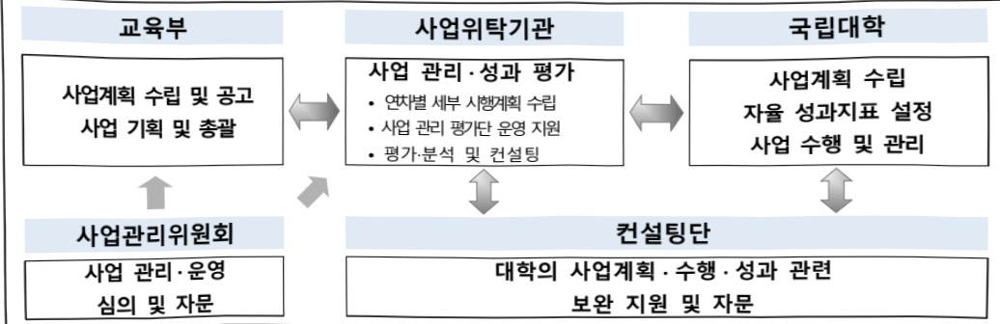

# 국립대학육성사업

**해당 페이지**: PDF 1840 ~ 1847 쪽 해당

**부처**: 교육부
**분야**: 교육
**회계유형**: 고등·평생교육 지원특별회계
**2026 확정예산**: 873550.0 백만원
**전년대비 증감률**: 105.9%
**AI 도메인**: 교육/인재

---

<table border=1 style='margin: auto; word-wrap: break-word;'><tr><td style='text-align: center; word-wrap: break-word;'>사 업 명</td></tr><tr><td style='text-align: center; word-wrap: break-word;'>(41) 국립대학육성사업 (2704-301)</td></tr></table>

□ 사업 코드 정보

<table border=1 style='margin: auto; word-wrap: break-word;'><tr><td style='text-align: center; word-wrap: break-word;'>구분</td><td style='text-align: center; word-wrap: break-word;'>회계</td><td style='text-align: center; word-wrap: break-word;'>소관</td><td style='text-align: center; word-wrap: break-word;'>실국(기관)</td><td style='text-align: center; word-wrap: break-word;'>계정</td><td style='text-align: center; word-wrap: break-word;'>분야</td><td style='text-align: center; word-wrap: break-word;'>부문</td></tr><tr><td style='text-align: center; word-wrap: break-word;'>코드</td><td rowspan="2">고등·평생교육지원특별회계</td><td rowspan="2">교육부</td><td rowspan="2">고등평생정책실대학지원관</td><td rowspan="2"></td><td style='text-align: center; word-wrap: break-word;'>050</td><td style='text-align: center; word-wrap: break-word;'>052</td></tr><tr><td style='text-align: center; word-wrap: break-word;'>명칭</td><td style='text-align: center; word-wrap: break-word;'>교육</td><td style='text-align: center; word-wrap: break-word;'>고등교육</td></tr></table>

<table border=1 style='margin: auto; word-wrap: break-word;'><tr><td style='text-align: center; word-wrap: break-word;'>구분</td><td style='text-align: center; word-wrap: break-word;'>프로그램</td><td style='text-align: center; word-wrap: break-word;'>단위사업</td><td style='text-align: center; word-wrap: break-word;'>세부사업</td></tr><tr><td style='text-align: center; word-wrap: break-word;'>코드</td><td style='text-align: center; word-wrap: break-word;'>2700</td><td style='text-align: center; word-wrap: break-word;'>2704</td><td style='text-align: center; word-wrap: break-word;'>301</td></tr><tr><td style='text-align: center; word-wrap: break-word;'>명칭</td><td style='text-align: center; word-wrap: break-word;'>국립대학 운영지원</td><td style='text-align: center; word-wrap: break-word;'>국립대학 교육기반조성</td><td style='text-align: center; word-wrap: break-word;'>국립대학육성사업</td></tr></table>

□ 사업 성격

<table border=1 style='margin: auto; word-wrap: break-word;'><tr><td rowspan="2">신규</td><td rowspan="2">계속</td><td rowspan="2">완료</td><td rowspan="2">예비타당성 실시여부</td><td rowspan="2">총사업비 관리대상</td><td rowspan="2">총액계상 예산사업</td><td style='text-align: center; word-wrap: break-word;'>사업소관 변경정보</td></tr><tr><td style='text-align: center; word-wrap: break-word;'>2025예산 시 소관</td></tr><tr><td style='text-align: center; word-wrap: break-word;'></td><td style='text-align: center; word-wrap: break-word;'>○</td><td style='text-align: center; word-wrap: break-word;'></td><td style='text-align: center; word-wrap: break-word;'></td><td style='text-align: center; word-wrap: break-word;'></td><td style='text-align: center; word-wrap: break-word;'></td><td style='text-align: center; word-wrap: break-word;'></td></tr></table>

□ 사업 지원 형태 및 지원을

<table border=1 style='margin: auto; word-wrap: break-word;'><tr><td style='text-align: center; word-wrap: break-word;'>직접</td><td style='text-align: center; word-wrap: break-word;'>출자</td><td style='text-align: center; word-wrap: break-word;'>출연</td><td style='text-align: center; word-wrap: break-word;'>보조</td><td style='text-align: center; word-wrap: break-word;'>융자</td><td style='text-align: center; word-wrap: break-word;'>국고보조율(%)</td><td style='text-align: center; word-wrap: break-word;'>융자율(%)</td></tr><tr><td style='text-align: center; word-wrap: break-word;'></td><td style='text-align: center; word-wrap: break-word;'></td><td style='text-align: center; word-wrap: break-word;'>○</td><td style='text-align: center; word-wrap: break-word;'></td><td style='text-align: center; word-wrap: break-word;'></td><td style='text-align: center; word-wrap: break-word;'>100</td><td style='text-align: center; word-wrap: break-word;'></td></tr></table>

## □ 사업 소관부처 및 시행주체

<table border=1 style='margin: auto; word-wrap: break-word;'><tr><td style='text-align: center; word-wrap: break-word;'>사업명</td><td colspan="2">구분</td></tr><tr><td rowspan="4">국립대학 육성사업</td><td rowspan="3">소관부처</td><td style='text-align: center; word-wrap: break-word;'>대학지원관</td></tr><tr><td style='text-align: center; word-wrap: break-word;'>국립대학지원과</td></tr><tr><td style='text-align: center; word-wrap: break-word;'>지역대학지원과</td></tr><tr><td style='text-align: center; word-wrap: break-word;'>사업시행주체</td><td style='text-align: center; word-wrap: break-word;'>한국연구재단대학지원팀</td></tr><tr><td rowspan="3">AI 거점대학</td><td rowspan="2">소관부처</td><td style='text-align: center; word-wrap: break-word;'>인공지능인재지원국</td></tr><tr><td style='text-align: center; word-wrap: break-word;'>인공지능인재정과</td></tr><tr><td style='text-align: center; word-wrap: break-word;'>사업시행주체</td><td style='text-align: center; word-wrap: break-word;'>한국연구재단대학지원팀</td></tr></table>

---

### 가. 예산 총괄표

(단위: 백만원, %)

<table border=1 style='margin: auto; word-wrap: break-word;'><tr><td rowspan="2">사업명</td><td rowspan="2">2024년 결산</td><td colspan="2">2025년 예산</td><td colspan="2">2026년 예산</td><td rowspan="2">증감(B-A)</td><td rowspan="2">(B-A)/A</td></tr><tr><td style='text-align: center; word-wrap: break-word;'>본예산</td><td style='text-align: center; word-wrap: break-word;'>추경(A)</td><td style='text-align: center; word-wrap: break-word;'>요구안</td><td style='text-align: center; word-wrap: break-word;'>본예산(B)</td></tr><tr><td style='text-align: center; word-wrap: break-word;'>국립대학육성사업</td><td style='text-align: center; word-wrap: break-word;'>572,200</td><td style='text-align: center; word-wrap: break-word;'>424,300</td><td style='text-align: center; word-wrap: break-word;'>424,300</td><td style='text-align: center; word-wrap: break-word;'>873,550</td><td style='text-align: center; word-wrap: break-word;'>873,550</td><td style='text-align: center; word-wrap: break-word;'>449,250</td><td style='text-align: center; word-wrap: break-word;'>105.9</td></tr></table>

□ 기능별(내역사업별) 예산 내역

(단위:백만원)

<table border=1 style='margin: auto; word-wrap: break-word;'><tr><td rowspan="2"></td><td colspan="5">2024</td><td colspan="5">2025</td><td rowspan="2">2026예산</td></tr><tr><td style='text-align: center; word-wrap: break-word;'>예산액(추정)</td><td style='text-align: center; word-wrap: break-word;'>예산현액</td><td style='text-align: center; word-wrap: break-word;'>집행액[실질행액]</td><td style='text-align: center; word-wrap: break-word;'>이월액</td><td style='text-align: center; word-wrap: break-word;'>불용액</td><td style='text-align: center; word-wrap: break-word;'>분예산</td><td style='text-align: center; word-wrap: break-word;'>예산현액</td><td style='text-align: center; word-wrap: break-word;'>집행액[실질행액]</td><td style='text-align: center; word-wrap: break-word;'>이월액</td><td style='text-align: center; word-wrap: break-word;'>불용액</td></tr><tr><td style='text-align: center; word-wrap: break-word;'>○ 기능별 분류(합계)</td><td style='text-align: center; word-wrap: break-word;'>572,200</td><td style='text-align: center; word-wrap: break-word;'>572,200</td><td style='text-align: center; word-wrap: break-word;'>572,200</td><td style='text-align: center; word-wrap: break-word;'>-</td><td style='text-align: center; word-wrap: break-word;'>-</td><td style='text-align: center; word-wrap: break-word;'>424,300</td><td style='text-align: center; word-wrap: break-word;'>424,300</td><td style='text-align: center; word-wrap: break-word;'>424,300</td><td style='text-align: center; word-wrap: break-word;'>-</td><td style='text-align: center; word-wrap: break-word;'>-</td><td style='text-align: center; word-wrap: break-word;'>873,550</td></tr><tr><td rowspan="2">· 국립대학육성사업 · AI 거점대학</td><td style='text-align: center; word-wrap: break-word;'>572,200</td><td style='text-align: center; word-wrap: break-word;'>572,200</td><td style='text-align: center; word-wrap: break-word;'>572,200</td><td style='text-align: center; word-wrap: break-word;'>-</td><td style='text-align: center; word-wrap: break-word;'>-</td><td style='text-align: center; word-wrap: break-word;'>424,300</td><td style='text-align: center; word-wrap: break-word;'>424,300</td><td style='text-align: center; word-wrap: break-word;'>424,300</td><td style='text-align: center; word-wrap: break-word;'>-</td><td style='text-align: center; word-wrap: break-word;'>-</td><td style='text-align: center; word-wrap: break-word;'>843,050</td></tr><tr><td style='text-align: center; word-wrap: break-word;'>-</td><td style='text-align: center; word-wrap: break-word;'>-</td><td style='text-align: center; word-wrap: break-word;'>-</td><td style='text-align: center; word-wrap: break-word;'>-</td><td style='text-align: center; word-wrap: break-word;'>-</td><td style='text-align: center; word-wrap: break-word;'>-</td><td style='text-align: center; word-wrap: break-word;'>-</td><td style='text-align: center; word-wrap: break-word;'>-</td><td style='text-align: center; word-wrap: break-word;'>-</td><td style='text-align: center; word-wrap: break-word;'>-</td><td style='text-align: center; word-wrap: break-word;'>30,500</td></tr></table>

### 나. 사업설명자료

## 1 ) 사업목적·내용

- (거점국립대육성) 거점국립대를 5큰 3틀 성장엔진과 연계한 지산학연 협력기반 연구

대학으로 육성하여 국가군형성장을 뒷받침하는 핵심 육합 인재양성

- (일반국립대육성) 국가중심국립대와 교대는 지역에 더욱 밀착하는 특성화 대학으로 성장

하도록 지속 지원하여 국가군형발전에 기여하도록 유도

- (AI 거점대학) AI 단과대학·전공 등을 운영하여 AI/AI+X 분야 학사 및 석·박사급 인재를 체계적으로 양성하고 지역의 AI 교육·연구 거점 역할을 수행할 수 있도록 지원

## 2 ) 사업개요

□ 사업근거 및 추진경위

① 법령상 근거 및 조항 적시

---

## 고등교육법 제7조 및 제8조

제7조(교육재정) ① 국가와 지방자치단체는 학교가 그 목적을 달성하는 데에 필요한 재원(財源)을 지원하거나 보조할 수 있다.

제8조(실험실습비 등의 지급) 국가는 학술 또는 학문 연구와 교육 연구를 진흥시키기 위하여 실험실습비·연구조성비·장학금 지급 등 필요한 조치를 마련하여야 한다.

- 국립대학회계법 제4조(국가 및 지방자치단체의 지원)

제4조(국가 및 지방자치단체의 지원) ① 국가는 국립대학의 교육 및 연구의 질 향상과 노후시설 및 실험 · 실습 기자재 교체 등 교육환경 개선을 위하여 필요한 재정을 안정적으로 지원하여야 한다.

-학술진흥법 제5조(학술지원사업의 추진 등)

제5조(학술지원사업의 추진 등) ② 교육부장관은 제1항에 따른 사업을 효과적으로 추진하기 위하여 다음 각 호의 기관 또는 단체에 그 사업의 전부 또는 일부를 위탁하고 그에 필요한 비용을 출연금으로 지급할 수 있다.

## -한국연구재단법 제11조

제11조(출연금) ① 정부는 재단의 설립, 시설, 운영 및 사업에 필요한 경비에 충당하기 위하여 예산의 범위에서 재단에 출연금(出掛金)을 지급할 수 있다.

- 지방대학 및 지역군형인재 육성에 관한 법률 제17조(특성화 지방대학의 지정)

제17조(특성화 지방대학의 지정) ① 교육부장관은 「지방자치분권 및 지역균형발전에 관한 특별법」 제14조에 따른 지역특화산업 및 초광역권산업에 필요한 전문인력을 양성하기 위하여 위원회의 심의를 거쳐 대통령령으로 정하는 기준에 적합한 지방대학을 특성화 지방대학으로 지정할 수 있다.

② 교육부장관은 제1항에 따라 지정된 특성화 지방대학이 특성화 분야를 육성하는 데 필요한 행정적·재정적 지원을 할 수 있다.

② 추진경위 - 사업 시작년도, 추진배경, 부처별 중점과제, 대통령 공약사항 등

## <국립대학 육성사업>

- '국립대학 운영 성과목표제' 추진 등을 포함한 2단계 국립대학 선진화 방안 확정 발표('12.1월)

- '13년 국립대학 운영 성과목표제 시행 계획('13.3월)

- '13년 성과계획에 대한 이행실적 평가 후 재정지원(20개교, 96억원)

---

- '14년 '국립대학 혁신지원사업'으로 개편(12개교, 98억원)

- '18년 '국립대학 육성사업'으로 확대 개편(39개교, 800억원)

- 국정과제 [85-4 지역 거점대학(원)육성 및 안정적 재정지원]

- '23년 기존 대학혁신지원사업의 국립대학 지원분을 이관하여 국립대학 육성사업으로 통합(37개교, 4,580억원)

## < AI 거점대학 >

- 국정과제 99 AI 디지털시대 미래인재 양성

· (AI 인재 양성 지원) 대학(원) 대상 AI 융복합(AI+X) 교육과정 확산 및 산업·기업 수요에 기반한 AI 교육·연구 지원을 통해 AI 인재 양성 지원

※ AI 거점대학 운영, BK21 AI 분야 교육연구단 확대 및 AI 융합형 대학원 도입 추진, AI 부트캠프 운영, 산업 수요 기반 계약학과·정원 확대

## □ 주요내용

① 사업규모

- 총사업비(해당되는 경우에만 기재) : 해당 없음

- 사업기간 : (국립대학육성사업) '18년 ~ 계속

(AI 거점대학) '26년 신규

-최근 5년 간 투입된 사업비(예산액기준, 추경편성한 연도에는 추경포함)

<table border=1 style='margin: auto; word-wrap: break-word;'><tr><td style='text-align: center; word-wrap: break-word;'>$ \underline{\text{所}} $</td><td style='text-align: center; word-wrap: break-word;'>2022</td><td style='text-align: center; word-wrap: break-word;'>2023</td><td style='text-align: center; word-wrap: break-word;'>2024</td><td style='text-align: center; word-wrap: break-word;'>2025</td><td style='text-align: center; word-wrap: break-word;'>2026</td></tr><tr><td style='text-align: center; word-wrap: break-word;'>$ \underline{\text{人}} $</td><td style='text-align: center; word-wrap: break-word;'>150,000</td><td style='text-align: center; word-wrap: break-word;'>458,000</td><td style='text-align: center; word-wrap: break-word;'>572,200</td><td style='text-align: center; word-wrap: break-word;'>424,300</td><td style='text-align: center; word-wrap: break-word;'>873,550</td></tr></table>

- 기타: 해당 없음

② 사업추진체계

- 사업시행방법 : 출연

- 사업시행주체 : 한국연구재단

- 사업 수혜자 : 국립대학 37교, 학생, 학부모 등

- 보조, 융자, 출연, 출자 등의 경우 보조·융자 등 지원 비율 및 법적근거

<table border=1 style='margin: auto; word-wrap: break-word;'><tr><td style='text-align: center; word-wrap: break-word;'>내역사업명</td><td style='text-align: center; word-wrap: break-word;'>구분</td><td style='text-align: center; word-wrap: break-word;'>피보조·피출연 등 기관명</td><td style='text-align: center; word-wrap: break-word;'>지원 금액 (2026예산)</td><td style='text-align: center; word-wrap: break-word;'>지원 비율(%)</td><td style='text-align: center; word-wrap: break-word;'>보조율 법적근거 (해당 조항)</td></tr><tr><td style='text-align: center; word-wrap: break-word;'>국립대학 육성사업</td><td style='text-align: center; word-wrap: break-word;'>출연</td><td style='text-align: center; word-wrap: break-word;'>한국연구재단</td><td style='text-align: center; word-wrap: break-word;'>873,550</td><td style='text-align: center; word-wrap: break-word;'>100.0</td><td style='text-align: center; word-wrap: break-word;'>고등교육법 제7조, 대학회계법 제4조, 지방균형인재 육성에 관한 법률 제17조, 한국연구재단법 제11조</td></tr></table>

---

①국립대학육성사업

:(25)423,100백만원→(26)840,100백만원,417,000백만원 증액

- (요구) 지역균형발전 및 국가 전략분야 인재양성에 대한 국립대학의 역할 강화를 고려, 국립대학이 중장기

혁신계획을 수립·추진하도록 하여 국립대학별 고유의 발전모델을 통한 자율 혁신을 지원

- (산출) 840,100백만원 ≧ 37교 × 22,705백만원(사업관리비 2,905백만원 별도)

(세부산출) 거점국립대 지원 262,200백만원 ≈ 9교 × 29,133백만원

일반국립대 지원 223,900백만원 ≅ 28교 x 7,996백만원

거점국립대 연구중심대학 인센티브 120,000백만원

글로컬 거점국립대 지원 234,000백만원 ≈ 9교 × 26,000백만원

② AI 거점대학

:(25)→(26)30,000백만원(순증)

- (산출) 3교 × 10,000백만원 = 30,000백만원(사업관리비 500백만원 별도)

③ 사업관리비

:(25)1,200백만원→(26)3,450백만원,2,250백만원증액

2025년도 예산 및 2026년도 예산 산출 세부내역 비교

<table border=1 style='margin: auto; word-wrap: break-word;'><tr><td colspan="2">2025년 본예산</td><td colspan="2">2026년 예산</td></tr><tr><td style='text-align: center; word-wrap: break-word;'>예산</td><td style='text-align: center; word-wrap: break-word;'>산출내역</td><td style='text-align: center; word-wrap: break-word;'>예산</td><td style='text-align: center; word-wrap: break-word;'>산출내역</td></tr><tr><td style='text-align: center; word-wrap: break-word;'>424,300</td><td style='text-align: center; word-wrap: break-word;'>○ 사업출연금(350-02): 424,300백만원
• 국립대학 지원금: 37개교×11,705백만원=423,100백만원
• 사업관리비: 1,200백만원</td><td style='text-align: center; word-wrap: break-word;'>873,550</td><td style='text-align: center; word-wrap: break-word;'>○ 사업출연금(350-02): 873,550백만원
가. 국립대학육성사업 840,100백만원
• 37개교×21,648백만원 = 262,200백만원
나. AI 거점대학(30,000백만원)
• 3개교 × 10,000백만원 = 30,000백만원
다. 사업관리비(3,450백만원)</td></tr></table>

## 4 ) 사업효과

□ 사업영향, 산출물 성과지표 등

① 2022~2026년도 성과계획서 상 성과지표 및 최근 5년간 성과 달성도

<table border=1 style='margin: auto; word-wrap: break-word;'><tr><td style='text-align: center; word-wrap: break-word;'>성과지표</td><td style='text-align: center; word-wrap: break-word;'>구분</td><td style='text-align: center; word-wrap: break-word;'>2022</td><td style='text-align: center; word-wrap: break-word;'>2023</td><td style='text-align: center; word-wrap: break-word;'>2024</td><td style='text-align: center; word-wrap: break-word;'>2025</td><td style='text-align: center; word-wrap: break-word;'>2026</td><td style='text-align: center; word-wrap: break-word;'>2026 목표치산출근거</td><td style='text-align: center; word-wrap: break-word;'>측정산식(또는 측정방법)</td><td style='text-align: center; word-wrap: break-word;'>자료수집방법(또는 자료출처)</td></tr><tr><td rowspan="3">학생 1인당교육비 증가율(단위: %)</td><td style='text-align: center; word-wrap: break-word;'>목표</td><td style='text-align: center; word-wrap: break-word;'>3</td><td style='text-align: center; word-wrap: break-word;'>9.1</td><td style='text-align: center; word-wrap: break-word;'>-</td><td style='text-align: center; word-wrap: break-word;'>-</td><td style='text-align: center; word-wrap: break-word;'>-</td><td rowspan="3">-</td><td rowspan="3">국립대학1인당 교육비 증가율(%) = (A / B) × 100※ A (해당연도 국립대학 학생 1인당 교육비 - 전년도 국립대학 학생 1인당 교육비) ※ B(전년도 국립대학 학생 1인당 교육비)</td><td rowspan="3">대학정보공시</td></tr><tr><td style='text-align: center; word-wrap: break-word;'>실적</td><td style='text-align: center; word-wrap: break-word;'>9.1</td><td style='text-align: center; word-wrap: break-word;'>-</td><td style='text-align: center; word-wrap: break-word;'>-</td><td style='text-align: center; word-wrap: break-word;'>-</td><td style='text-align: center; word-wrap: break-word;'>-</td></tr><tr><td style='text-align: center; word-wrap: break-word;'>달성도</td><td style='text-align: center; word-wrap: break-word;'>306</td><td style='text-align: center; word-wrap: break-word;'>-</td><td style='text-align: center; word-wrap: break-word;'>-</td><td style='text-align: center; word-wrap: break-word;'>-</td><td style='text-align: center; word-wrap: break-word;'>-</td></tr></table>

---

<table border=1 style='margin: auto; word-wrap: break-word;'><tr><td rowspan="3">학생 1인당 교육비 (단위: 천원)</td><td style='text-align: center; word-wrap: break-word;'>목표</td><td style='text-align: center; word-wrap: break-word;'>신규</td><td style='text-align: center; word-wrap: break-word;'>신규</td><td style='text-align: center; word-wrap: break-word;'>21,529</td><td style='text-align: center; word-wrap: break-word;'>23,784</td><td style='text-align: center; word-wrap: break-word;'>25,449</td><td rowspan="3">&#x27;19 ~ &#x27;24년 증가율 평균(7.7%)을 고려하여, 전년 대비 7% 증액한 목표 설정</td><td rowspan="3">ㅇ 측정산식 : 국립대학 1인당 교육비(천원) = A / B * A(국립대학 학생 1인당 총 교육비(대학회계, 발전기금회계, 산학협력단회계, 도서구입비, 기계기구매입비) ** B(재학생 수)</td><td rowspan="3">정보공시 자료 활용</td></tr><tr><td style='text-align: center; word-wrap: break-word;'>실적</td><td style='text-align: center; word-wrap: break-word;'>18,315</td><td style='text-align: center; word-wrap: break-word;'>20,215</td><td style='text-align: center; word-wrap: break-word;'>22,228</td><td style='text-align: center; word-wrap: break-word;'>-</td><td style='text-align: center; word-wrap: break-word;'>-</td></tr><tr><td style='text-align: center; word-wrap: break-word;'>달성도</td><td style='text-align: center; word-wrap: break-word;'>-</td><td style='text-align: center; word-wrap: break-word;'>-</td><td style='text-align: center; word-wrap: break-word;'>103.2</td><td style='text-align: center; word-wrap: break-word;'>-</td><td style='text-align: center; word-wrap: break-word;'>-</td></tr></table>

② 성과지표 이외의 연도별 사업추진 경과 및 실적

<table border=1 style='margin: auto; word-wrap: break-word;'><tr><td style='text-align: center; word-wrap: break-word;'>2022</td><td style='text-align: center; word-wrap: break-word;'>· 국립대학 육성사업을 통해 국립대학 38개교에 예산을 지원하여 대학 운영의 효율성과 책무성 강화(149,100백만원)</td></tr><tr><td style='text-align: center; word-wrap: break-word;'>2023</td><td style='text-align: center; word-wrap: break-word;'>· 국립대학 육성사업을 통해 국립대학 37개교에 예산을 지원하여 대학 운영의 효율성과 책무성 강화(456,800백만원)</td></tr><tr><td style='text-align: center; word-wrap: break-word;'>2024</td><td style='text-align: center; word-wrap: break-word;'>· 국립대학 육성사업을 통해 국립대학 37개교에 예산을 지원하여 대학 운영의 효율성과 책무성 강화(572,200백만원)</td></tr><tr><td style='text-align: center; word-wrap: break-word;'>2025</td><td style='text-align: center; word-wrap: break-word;'>· 국립대학 육성사업을 통해 국립대학 37개교에 예산을 지원하여 대학 운영의 효율성과 책무성 강화(424,300백만원)</td></tr></table>

## ③ 향후(2026년도 이후) 기대효과

## < 국립대학육성사업 >

°(거점국립대육성) 거점국립대를 지역의 기술주도 성장을 위한 교육·연구 허브로 혁신하여 수도권 중심 대학 서열화 완화 및 국가균형성장 달성

- (특성화 연구대학) 대학별로 5극 3특 성장엔진 전략산업과 밀착된 특성화 분야의

학부-대학원-연구소를 패키지로 육성, 적기에 핵심인재 양성 및 연구성과 창출

- (학부교육 혁신) 거점국립대 학생이라면 누구나 AI·글로벌 기본역량을 든든하게 갖추고

기업이 선호하는 생생한 현장 경험을 갖출 수 있도록 교육

°(일반국립대육성) 국중대와 교대는 지역에 밀착한 특성화 대학으로 성장하도록 지속 지원하고 지역

사회 수요에 부합하는 인재 양성으로 국가균형발전에 기여

## < AI 거점대학 >

(교육체계 및 교육과정) AI 단과대학·전공 등 교육체계 개편 및 교육과정 개선·

운영을 통해 학사·석·박사급 전문인재 및 융합인재를 체계적으로 양성

---

° (교육·연구 기반) AI 교원 및 인프라 등 집중 지원을 통해 교육·연구여건 개선

° (성장 지원 및 지역 AI 거점) 우수 인재의 대학원 진학 및 창업을 지원하고,

산학연 협력을 통해 AX 연구 등 활성화

## 5 ) 타당성조사 및 예비타당성조사 시행여부 및 결과 요지 : 해당 없음

## 6 ) 총사업비 대상사업 정보 : 해당 없음

## 7 ) 사업 집행절차

## 8 ) 각종 평가

1) '26 예산 부대의견 ('25.12.)

°교육부는 거점국립대 집중 육성 사업을 추진함에 있어 연구중심대학 인센티브 AI거점대학 등 선정기준과 방식을 수립하여 2026년 예산 집행 전에 국회 해당 상임위원회에 보고한다.

(2) 예결위 '23.결산 지적사항 ('24.8.)

°(지적) 교육부는 향후 일반재정지원의 지원 규모가 확대되고 있는 만큼 철저한 성과 관리가 필요하고, 재정소요 부담이 클 것으로 전망되므로 지속가능한 대학정책을 마련할 것

(조치) 향후에도 성과에 따른 지원 차등을 확대하여 철저히 성과 관리하고(25년 사업 기본계획에 반영), 학생들에게 국가장학금을 지속적·안정적으로 지원하기 위해 예산당국과 지속 협의 추진

---

### 다. 최근 4년간 결산내역

## 1 ) 결산표

☐ 부처 결산내역

(단위: 백만원, %)

<table border=1 style='margin: auto; word-wrap: break-word;'><tr><td rowspan="2">연도</td><td colspan="3">예산액</td><td rowspan="2">예산현액(A)</td><td rowspan="2">집행액(B)</td><td rowspan="2">집행률(B/A)</td><td rowspan="2">다음연도이월액</td><td rowspan="2">불용액</td></tr><tr><td style='text-align: center; word-wrap: break-word;'>본예산</td><td style='text-align: center; word-wrap: break-word;'>추경증감액</td><td style='text-align: center; word-wrap: break-word;'>추경</td></tr><tr><td style='text-align: center; word-wrap: break-word;'>2022</td><td style='text-align: center; word-wrap: break-word;'>150,000</td><td style='text-align: center; word-wrap: break-word;'>-</td><td style='text-align: center; word-wrap: break-word;'>150,000</td><td style='text-align: center; word-wrap: break-word;'>150,000</td><td style='text-align: center; word-wrap: break-word;'>150,000</td><td style='text-align: center; word-wrap: break-word;'>100.0</td><td style='text-align: center; word-wrap: break-word;'>-</td><td style='text-align: center; word-wrap: break-word;'>-</td></tr><tr><td style='text-align: center; word-wrap: break-word;'>2023</td><td style='text-align: center; word-wrap: break-word;'>458,000</td><td style='text-align: center; word-wrap: break-word;'>-</td><td style='text-align: center; word-wrap: break-word;'>458,000</td><td style='text-align: center; word-wrap: break-word;'>458,000</td><td style='text-align: center; word-wrap: break-word;'>458,000</td><td style='text-align: center; word-wrap: break-word;'>100.0</td><td style='text-align: center; word-wrap: break-word;'>-</td><td style='text-align: center; word-wrap: break-word;'>-</td></tr><tr><td style='text-align: center; word-wrap: break-word;'>2024</td><td style='text-align: center; word-wrap: break-word;'>572,200</td><td style='text-align: center; word-wrap: break-word;'>-</td><td style='text-align: center; word-wrap: break-word;'>572,200</td><td style='text-align: center; word-wrap: break-word;'>572,200</td><td style='text-align: center; word-wrap: break-word;'>572,200</td><td style='text-align: center; word-wrap: break-word;'>100.0</td><td style='text-align: center; word-wrap: break-word;'>-</td><td style='text-align: center; word-wrap: break-word;'>-</td></tr><tr><td style='text-align: center; word-wrap: break-word;'>2025</td><td style='text-align: center; word-wrap: break-word;'>424,300</td><td style='text-align: center; word-wrap: break-word;'>-</td><td style='text-align: center; word-wrap: break-word;'>424,300</td><td style='text-align: center; word-wrap: break-word;'>424,300</td><td style='text-align: center; word-wrap: break-word;'>424,300</td><td style='text-align: center; word-wrap: break-word;'>100.0</td><td style='text-align: center; word-wrap: break-word;'>-</td><td style='text-align: center; word-wrap: break-word;'>-</td></tr></table>

## 2 ) 주요 결산사항

2022~2025년 결산 주요 지적사항 및 시정요구사항 : 해당 없음

2025년 이·전용 등 세부내역 : 해당 없음

---

### 원본 PDF 크롭 이미지

