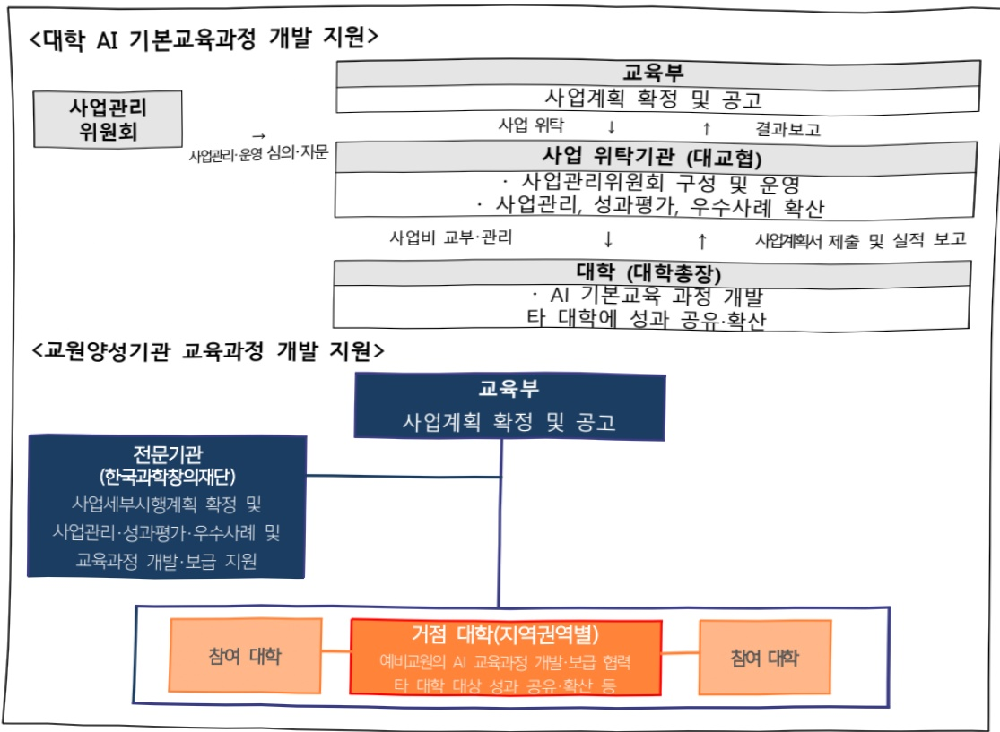

# 대학생 AI 기본 교육 지원

**해당 페이지**: PDF 1848 ~ 1853 쪽 해당

**부처**: 교육부
**분야**: 교육
**회계유형**: 고등평생교육 지원특별회계
**2026 확정예산**: 8840.0 백만원
**전년대비 증감률**: None%
**AI 도메인**: 교육/인재, 디지털전환(AX)

---

<table border=1 style='margin: auto; word-wrap: break-word;'><tr><td style='text-align: center; word-wrap: break-word;'>사 업 명</td></tr><tr><td style='text-align: center; word-wrap: break-word;'>(3) 대학생 AI 기본 교육 지원 (2232-323)</td></tr></table>

□ 사업 코드 정보

<table border=1 style='margin: auto; word-wrap: break-word;'><tr><td style='text-align: center; word-wrap: break-word;'>구분</td><td style='text-align: center; word-wrap: break-word;'>회계</td><td style='text-align: center; word-wrap: break-word;'>소관</td><td style='text-align: center; word-wrap: break-word;'>실국(기관)</td><td style='text-align: center; word-wrap: break-word;'>계정</td><td style='text-align: center; word-wrap: break-word;'>분야</td><td style='text-align: center; word-wrap: break-word;'>부문</td></tr><tr><td style='text-align: center; word-wrap: break-word;'>코드</td><td rowspan="2">고등평생교육지원특별회계</td><td rowspan="2">교육부</td><td rowspan="2">안공지능안체지원국</td><td rowspan="2"></td><td style='text-align: center; word-wrap: break-word;'>050</td><td style='text-align: center; word-wrap: break-word;'>052</td></tr><tr><td style='text-align: center; word-wrap: break-word;'>명칭</td><td style='text-align: center; word-wrap: break-word;'>교육</td><td style='text-align: center; word-wrap: break-word;'>고등교육</td></tr></table>

<table border=1 style='margin: auto; word-wrap: break-word;'><tr><td style='text-align: center; word-wrap: break-word;'>구분</td><td style='text-align: center; word-wrap: break-word;'>프로그램</td><td style='text-align: center; word-wrap: break-word;'>단위사업</td><td style='text-align: center; word-wrap: break-word;'>세부사업</td></tr><tr><td style='text-align: center; word-wrap: break-word;'>코드</td><td style='text-align: center; word-wrap: break-word;'>2200</td><td style='text-align: center; word-wrap: break-word;'>2232</td><td style='text-align: center; word-wrap: break-word;'>323</td></tr><tr><td style='text-align: center; word-wrap: break-word;'>명칭</td><td style='text-align: center; word-wrap: break-word;'>대학교육 역량강화</td><td style='text-align: center; word-wrap: break-word;'>대학미래역량 강화</td><td style='text-align: center; word-wrap: break-word;'>대학생 AI 기본 교육 지원</td></tr></table>

□ 사업 성격

<table border=1 style='margin: auto; word-wrap: break-word;'><tr><td rowspan="2">신규</td><td rowspan="2">계속</td><td rowspan="2">완료</td><td rowspan="2">예비타당성 실시여부</td><td rowspan="2">총사업비 관리대상</td><td rowspan="2">총액계상 예산사업</td><td style='text-align: center; word-wrap: break-word;'>사업소관 변경정보</td></tr><tr><td style='text-align: center; word-wrap: break-word;'>2025예산 시 소관</td></tr><tr><td style='text-align: center; word-wrap: break-word;'>○</td><td style='text-align: center; word-wrap: break-word;'></td><td style='text-align: center; word-wrap: break-word;'></td><td style='text-align: center; word-wrap: break-word;'></td><td style='text-align: center; word-wrap: break-word;'></td><td style='text-align: center; word-wrap: break-word;'></td><td style='text-align: center; word-wrap: break-word;'></td></tr></table>

□ 사업 지원 형태 및 지원을

<table border=1 style='margin: auto; word-wrap: break-word;'><tr><td style='text-align: center; word-wrap: break-word;'>직접</td><td style='text-align: center; word-wrap: break-word;'>출자</td><td style='text-align: center; word-wrap: break-word;'>출연</td><td style='text-align: center; word-wrap: break-word;'>보조</td><td style='text-align: center; word-wrap: break-word;'>융자</td><td style='text-align: center; word-wrap: break-word;'>국고보조율(%)</td><td style='text-align: center; word-wrap: break-word;'>융자율(%)</td></tr><tr><td style='text-align: center; word-wrap: break-word;'></td><td style='text-align: center; word-wrap: break-word;'></td><td style='text-align: center; word-wrap: break-word;'>○</td><td style='text-align: center; word-wrap: break-word;'>○</td><td style='text-align: center; word-wrap: break-word;'></td><td style='text-align: center; word-wrap: break-word;'>100</td><td style='text-align: center; word-wrap: break-word;'></td></tr></table>

□ 사업 소관부처 및 시행주체

<table border=1 style='margin: auto; word-wrap: break-word;'><tr><td style='text-align: center; word-wrap: break-word;'>사업명</td><td colspan="2">구분</td></tr><tr><td rowspan="3">대학 AI 기본교육 과정 개발 지원</td><td rowspan="2">소관부처</td><td style='text-align: center; word-wrap: break-word;'>인공지능인재지원국</td></tr><tr><td style='text-align: center; word-wrap: break-word;'>인공지능협인재양성과</td></tr><tr><td style='text-align: center; word-wrap: break-word;'>사업시행주체</td><td style='text-align: center; word-wrap: break-word;'>한국대학교육협의회 학사지원팀</td></tr><tr><td rowspan="3">교원 양성기관 교육과정 개발 지원</td><td rowspan="2">소관부처</td><td style='text-align: center; word-wrap: break-word;'>교원학부모지원관</td></tr><tr><td style='text-align: center; word-wrap: break-word;'>교원양성연수과</td></tr><tr><td style='text-align: center; word-wrap: break-word;'>사업시행주체</td><td style='text-align: center; word-wrap: break-word;'>한국과학창의재단 선임연구원</td></tr></table>

---

### 가. 예산 총괄표

(단위: 백만원, %)

<table border=1 style='margin: auto; word-wrap: break-word;'><tr><td rowspan="2">사업명</td><td rowspan="2">2024년 결산</td><td colspan="2">2025년 예산</td><td colspan="2">2026년 예산</td><td rowspan="2">증감 (B-A)</td><td rowspan="2">(B-A)/A</td></tr><tr><td style='text-align: center; word-wrap: break-word;'>본예산</td><td style='text-align: center; word-wrap: break-word;'>추경(A)</td><td style='text-align: center; word-wrap: break-word;'>요구안</td><td style='text-align: center; word-wrap: break-word;'>본예산(B)</td></tr><tr><td style='text-align: center; word-wrap: break-word;'>대학생 AI 기본 교육 지원</td><td style='text-align: center; word-wrap: break-word;'>-</td><td style='text-align: center; word-wrap: break-word;'>-</td><td style='text-align: center; word-wrap: break-word;'>-</td><td style='text-align: center; word-wrap: break-word;'>11,840</td><td style='text-align: center; word-wrap: break-word;'>8,840</td><td style='text-align: center; word-wrap: break-word;'>8,840</td><td style='text-align: center; word-wrap: break-word;'>순증</td></tr></table>

□ 기능별(내역사업별) 예산 내역

(단위: 백만원)

<table border=1 style='margin: auto; word-wrap: break-word;'><tr><td rowspan="2"></td><td colspan="5">2024</td><td colspan="5">2025</td><td rowspan="2">2026예산</td></tr><tr><td style='text-align: center; word-wrap: break-word;'>예산액(추정)</td><td style='text-align: center; word-wrap: break-word;'>예산현액</td><td style='text-align: center; word-wrap: break-word;'>집행액</td><td style='text-align: center; word-wrap: break-word;'>이월액</td><td style='text-align: center; word-wrap: break-word;'>불용액</td><td style='text-align: center; word-wrap: break-word;'>예산액(추정)</td><td style='text-align: center; word-wrap: break-word;'>예산현액</td><td style='text-align: center; word-wrap: break-word;'>집행액</td><td style='text-align: center; word-wrap: break-word;'>이월액</td><td style='text-align: center; word-wrap: break-word;'>불용액</td></tr><tr><td style='text-align: center; word-wrap: break-word;'>○ 기능별 분류(합계)</td><td style='text-align: center; word-wrap: break-word;'>-</td><td style='text-align: center; word-wrap: break-word;'>-</td><td style='text-align: center; word-wrap: break-word;'>-</td><td style='text-align: center; word-wrap: break-word;'>-</td><td style='text-align: center; word-wrap: break-word;'>-</td><td style='text-align: center; word-wrap: break-word;'>-</td><td style='text-align: center; word-wrap: break-word;'>-</td><td style='text-align: center; word-wrap: break-word;'>-</td><td style='text-align: center; word-wrap: break-word;'>-</td><td style='text-align: center; word-wrap: break-word;'>-</td><td style='text-align: center; word-wrap: break-word;'>8,840</td></tr><tr><td rowspan="2">· 대학 AI 기본교육과정 개발 지원· 교원양성기관 교육과정 개발 지원</td><td style='text-align: center; word-wrap: break-word;'>-</td><td style='text-align: center; word-wrap: break-word;'>-</td><td style='text-align: center; word-wrap: break-word;'>-</td><td style='text-align: center; word-wrap: break-word;'>-</td><td style='text-align: center; word-wrap: break-word;'>-</td><td style='text-align: center; word-wrap: break-word;'>-</td><td style='text-align: center; word-wrap: break-word;'>-</td><td style='text-align: center; word-wrap: break-word;'>-</td><td style='text-align: center; word-wrap: break-word;'>-</td><td style='text-align: center; word-wrap: break-word;'>-</td><td style='text-align: center; word-wrap: break-word;'>6,360</td></tr><tr><td style='text-align: center; word-wrap: break-word;'>-</td><td style='text-align: center; word-wrap: break-word;'>-</td><td style='text-align: center; word-wrap: break-word;'>-</td><td style='text-align: center; word-wrap: break-word;'>-</td><td style='text-align: center; word-wrap: break-word;'>-</td><td style='text-align: center; word-wrap: break-word;'>-</td><td style='text-align: center; word-wrap: break-word;'>-</td><td style='text-align: center; word-wrap: break-word;'>-</td><td style='text-align: center; word-wrap: break-word;'>-</td><td style='text-align: center; word-wrap: break-word;'>-</td><td style='text-align: center; word-wrap: break-word;'>2,480</td></tr></table>

### 나. 사업설명자료

1) 사업목적·내용

(대학 AI 기본 교육과정 개발 지원) 대학생들이 윤리적 AI 활용, AI 정보의 비판적 평가 역량, AI를 이용한 실질적 문제해결력을 갖추 수 있도록 기본 교육 지원

o (교원양성기관 교육과정 개발 지원) 초·중등 AI 교육의 핵심인 교원이 관련 역량을 함양할 수 있도록 교원양성기관 내 AI 교육과정 개발·지원

2) 사업개요

☐ 사업근거 및 추진경위

① 법령상 근거

○ 「고등교육법」 제7조, 제8조, 제10조

제7조(교육재정) ① 국가와 지방자치단체는 학교가 그 목적을 달성하는 데에 필요한 재원(財源)을 지원하거나 보조할 수 있다.

제8조(실험실습비 등의 지급) 국가는 학술 또는 학문 연구와 교육 연구를 진흥시키기 위하여 실험실습비·연구조성비·장학금 지급 등 필요한 조치를 마련하여야 한다.

제10조(학교협의체) ① 대학·산업대학·교육대학·전문대학 및 원격대학 등은 고등교육의 발전을 위하여 각 학교의 대표자로 구성하는 협의체를 운영할 수 있다.

---

°「한국대학교육협의회법」 제3조 및 제9조

제3조(기능) 협의회는 다음 각 호의 기능을 가진다.

1. 대학의 교육제도와 그 운영에 관한 연구개발

4. 대학의 교육과정 및 교수방법의 연구개발과 보급

제9조(경비보조 등) ① 국가는 예산의 범위에서 협의회의 운영에 필요한 경비를 보조할 수 있다.

°「교원자격검정령」 제20조

## 제20조(교직과정의 설치 등)

⑤ 교원양성기관의 장은 사회적·시대적 변화에 적절한 교육과정을 운영하고, 교육실습 지원학교와의 교류협력을 활성화하여야 한다.

## ○ 「과학·수학·정보 교육 진흥법」 제5조, 제9조

제5조(국가와 지방자치단체의 임무) ① 국가와 지방자치단체는 과학·수학·정보 교육을 진흥하기 위하여 이 법이나 그 밖의 관계 법령에서 정하는 바에 따라 다음 각 호의 사항에 관한 시책을 마련하여야 한다.

2. 과학 · 수학 · 정보 교원의 양성 · 확보 · 처우 및 전문성 강화

10. 그 밖에 과학 · 수학 · 정보 교육 진흥에 필요한 사항

② 국가는 과학·수학·정보 교육 진흥에 관한 시책의 추진이 부진하거나 예산 조치가 부족하다고 인정되는 지방자치단체에 대하여 예산의 증액 등 필요한 조치를 권고할 수 있다.

제9조(재정지원 등) ① 국가와 지방자치단체는 과학·수학·정보 교육기관 및 교육 연구기관에 대하여 예산의 범위에서 과학·수학·정보 교육에 필요한 재정 지원을 할 수 있다.

② 국가와 지방자치단체는 학생 및 교원의 과학 · 수학 · 정보 교육에 관한 탐구활동과 연구 활동을 지원하기 위하여 관련 법인 또는 단체에 대하여 예산의 범위에서 필요한 경비를 보조할 수 있다.

---

## ② 추진경위

°(신규사업) 국정과제 99. AI 디지털시대 미래인재 양성에 근거하여 신설

## <국정과제 99> AI 디지털시대 미래인재 양성

· 대학(원) 대상 AI 융복합(AI+X) 교육과정 확산 및 산업·기업 수요에 기반한 AI 교육·연구 지원을 통해 AI 인재 양성 지원

□ 주요내용

① 사업규모

- 사업기간 : 2026년~2030년

-최근 5년 간 투입된 사업비(단위: 백만원)

<table border=1 style='margin: auto; word-wrap: break-word;'><tr><td style='text-align: center; word-wrap: break-word;'>闰五</td><td style='text-align: center; word-wrap: break-word;'>2022</td><td style='text-align: center; word-wrap: break-word;'>2023</td><td style='text-align: center; word-wrap: break-word;'>2024</td><td style='text-align: center; word-wrap: break-word;'>2025</td><td style='text-align: center; word-wrap: break-word;'>2026</td></tr><tr><td style='text-align: center; word-wrap: break-word;'>사업비</td><td style='text-align: center; word-wrap: break-word;'>-</td><td style='text-align: center; word-wrap: break-word;'>-</td><td style='text-align: center; word-wrap: break-word;'>-</td><td style='text-align: center; word-wrap: break-word;'>-</td><td style='text-align: center; word-wrap: break-word;'>8,840</td></tr></table>

② 사업추진체계

- 사업시행방법 : 민간경상보조, 사업출연금

- 사업시행주체 : 한국대학교육협의회, 한국과학창의재단

- 사업 수혜자 : 일반 4년제 대학 및 대학생, 교육대학 및 정보컴퓨터 중등교원양성

과정 운영 대학 및 대학생

- 보조, 융자, 출연, 출자 등의 경우 보조·융자 등 지원 비율 및 법적근거

<table border=1 style='margin: auto; word-wrap: break-word;'><tr><td style='text-align: center; word-wrap: break-word;'>내역사업명</td><td style='text-align: center; word-wrap: break-word;'>구분</td><td style='text-align: center; word-wrap: break-word;'>피보조·피출연 등 기관명</td><td style='text-align: center; word-wrap: break-word;'>지원 금액 (2026예산)</td><td style='text-align: center; word-wrap: break-word;'>지원 비율(%)</td><td style='text-align: center; word-wrap: break-word;'>보조율 법적근거 (해당 조항)</td></tr><tr><td style='text-align: center; word-wrap: break-word;'>대학 AI 기본교육과정 개발 지원</td><td style='text-align: center; word-wrap: break-word;'>보조</td><td style='text-align: center; word-wrap: break-word;'>한국대학교육협의회</td><td style='text-align: center; word-wrap: break-word;'>6,360</td><td style='text-align: center; word-wrap: break-word;'>100</td><td style='text-align: center; word-wrap: break-word;'>「보조금 관리에 관한 법률」 제9조</td></tr><tr><td style='text-align: center; word-wrap: break-word;'>교원양성기관 교육과정 개발 지원</td><td style='text-align: center; word-wrap: break-word;'>출연</td><td style='text-align: center; word-wrap: break-word;'>한국과학 창의재단</td><td style='text-align: center; word-wrap: break-word;'>2,480</td><td style='text-align: center; word-wrap: break-word;'>100</td><td style='text-align: center; word-wrap: break-word;'>「과학기술기본법」 제30조, 제32조</td></tr></table>

## 3 ) 2026년도 예산 산출 근거

☐ 대학 AI 기본교육과정 개발 지원

- (지원 필요성) 사회 전반에서 AI 활용이 크게 증가하여, 전공에 관계없이 기본적인 AI 역량을 갖추고, 윤리적·비판적 사고를 바탕으로 정보를 수용할 필요

- AI 윤리 및 다양한 전공과 연계한 AI 융합 교육, 교수 역량 강화 등 지원

- (요구) 대학이 비전공자 맞춤형 AI 교과 과정을 개발하여 AI 윤리의식·AI 활용 능력 등을 제고하고, 정규 교과 과정 등에서 활용할 수 있도록 지원

- (산출) 6,360백만원=(300백만원×20개교)+사업관리비(360백만원)

0 교원양성기관 교육과정 개발 지원

---

- (지원 필요성) AI 국가경쟁력 강화를 위해 초·중등 단계부터 AI의 기본 원리 및 활용 교육 필요성이 확대됨에 따라,

- AI 관련 내용을 교육할 예비교원이 AI 개념·원리, 활용 방법에 대해 교육할 수 있는 역량을 함양할 수 있도록 교원양성 교육과정 개선 지원이 필요

- (요구) 예비교원 대상 AI 교육과정 등을 개발하고, 교원양성기관이 예비교원의 AI 원리 이해 및 활용 능력을 제고할 수 있도록 교육과정 보급 및 운영 기반 마련 지원

- (산출) 2,480백만원=AI 교육과정 등 개발·보급 및 기반 마련(200백만원 × 8종 + 200백만원 × 4개 컨소시엄) + 사업관리비(80백만원)

## 4 ) 사업효과

□ 사업영향, 산출물 성과지표 등

① 2022~2026년도 성과계획서 상 성과지표 및 최근 5년간 성과 달성도 : 해당없음

② 성과지표 이외의 연도별 사업추진 경과 및 실적 : 해당없음

③향후(2026년도 이후)기대효과

° 대학 AI 기본교육과정 개발 지원

- 전공에 관계없이 AI를 이해하고 도구로 활용할 수 있는 능력을 함양하고 전공

지식과 AI 기술을 융합하여 새로운 방식으로 문제 해결이 가능한 인재 양성

-학문 분야별 AI를 활용한 부가가치 창출, AI와 결합한 교육과정 모델 발굴,

다양한 AI 융합 연구 활성화를 통해 대학 경쟁력 제고

- AI 윤리 교육을 통해 책임 있는 기술 활용과 개발 문화를 정착하고 AI 활용 능력

격차를 줄임으로써 정보 소외계층 축소

○ 교원양성기관 교육과정 개발 지원

- 초·중등 AI 교육을 선도하기 위해 AI 원리·활용 등 기본 소양 및 교육역량을

함양한 예비교원을 양성

- AI 관련 예비교원 양성의 기반을 마련하고, 교육분야의 AI 활용을 확대하기 위해 교원양성기관의 AI 교육 역량 강화

5) 타당성조사 및 예비타당성조사 시행여부 및 결과 요지 : 해당없음

6) 총사업비 대상사업 정보 : 해당없음

---

## 7 ) 사업 집행절차

8) 각종 평가 : 해당없음

다. 최근 4년간 결산내역 : 해당없음

---

### 원본 PDF 크롭 이미지

