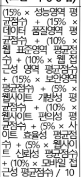
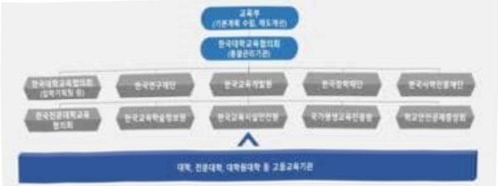
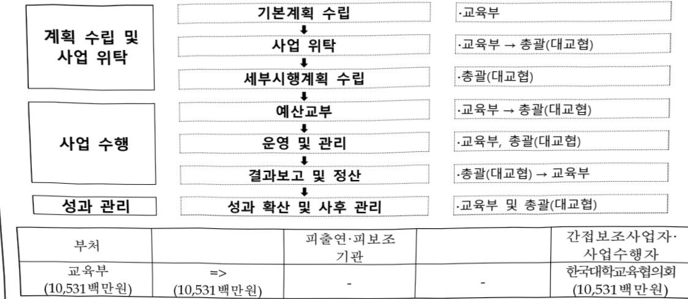
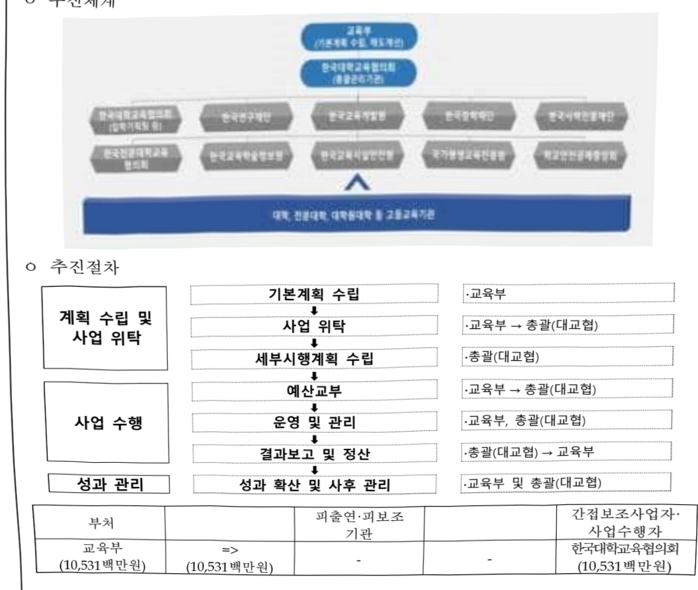

# 대학정보공시 제도 운영(정보화)

**해당 페이지**: PDF 1854 ~ 1862 쪽 해당

**부처**: 교육부
**분야**: 교육
**회계유형**: 고등･평생교육 지원특별회계
**2026 확정예산**: 10531.0 백만원
**전년대비 증감률**: 274.0%
**AI 도메인**: 교육/인재

---

### 가.예산 총괄표

(단위: 백만원, %)

<table border=1 style='margin: auto; word-wrap: break-word;'><tr><td rowspan="2">2024년 사업명</td><td rowspan="2">2025년 예산</td><td rowspan="2">2026년 예산</td><td rowspan="2" colspan="3">증감</td></tr><tr></tr><tr><td style='text-align: center; word-wrap: break-word;'>결산</td><td style='text-align: center; word-wrap: break-word;'>본예산</td><td style='text-align: center; word-wrap: break-word;'>추경(A)</td><td style='text-align: center; word-wrap: break-word;'>요구안</td><td style='text-align: center; word-wrap: break-word;'>본예산(B)</td><td style='text-align: center; word-wrap: break-word;'>(B-A)</td></tr><tr><td style='text-align: center; word-wrap: break-word;'>대학정보공시</td><td rowspan="2">2,936</td><td rowspan="2">2,816</td><td rowspan="2">10,531</td><td rowspan="2">10,531</td><td rowspan="2">7,715</td></tr><tr><td style='text-align: center; word-wrap: break-word;'>제도 운영(정보화)</td></tr></table>

□ 기능별(내역사업별) 예산 내역

(단위:백만원)

<table border=1 style='margin: auto; word-wrap: break-word;'><tr><td rowspan="2"></td><td colspan="5">2024</td><td colspan="5">2025</td><td rowspan="2">2026예산</td></tr><tr><td style='text-align: center; word-wrap: break-word;'>예산액(추정)</td><td style='text-align: center; word-wrap: break-word;'>예산현액</td><td style='text-align: center; word-wrap: break-word;'>집행액</td><td style='text-align: center; word-wrap: break-word;'>이월액</td><td style='text-align: center; word-wrap: break-word;'>불용액</td><td style='text-align: center; word-wrap: break-word;'>예산액(추정)</td><td style='text-align: center; word-wrap: break-word;'>예산현액</td><td style='text-align: center; word-wrap: break-word;'>집행액</td><td style='text-align: center; word-wrap: break-word;'>이월액</td><td style='text-align: center; word-wrap: break-word;'>불용액</td></tr><tr><td style='text-align: center; word-wrap: break-word;'>○ 기능별 분류(합계)</td><td style='text-align: center; word-wrap: break-word;'>2,936</td><td style='text-align: center; word-wrap: break-word;'>2,936</td><td style='text-align: center; word-wrap: break-word;'>2,936</td><td style='text-align: center; word-wrap: break-word;'>-</td><td style='text-align: center; word-wrap: break-word;'>14</td><td style='text-align: center; word-wrap: break-word;'>2,816</td><td style='text-align: center; word-wrap: break-word;'>2,816</td><td style='text-align: center; word-wrap: break-word;'>2,816</td><td style='text-align: center; word-wrap: break-word;'>0</td><td style='text-align: center; word-wrap: break-word;'>0</td><td style='text-align: center; word-wrap: break-word;'>10,531</td></tr><tr><td style='text-align: center; word-wrap: break-word;'>• 공시정보 조사 및 제도 운영</td><td style='text-align: center; word-wrap: break-word;'>1,557</td><td style='text-align: center; word-wrap: break-word;'>1,557</td><td style='text-align: center; word-wrap: break-word;'>1,557</td><td style='text-align: center; word-wrap: break-word;'>-</td><td style='text-align: center; word-wrap: break-word;'>1</td><td style='text-align: center; word-wrap: break-word;'>1,649</td><td style='text-align: center; word-wrap: break-word;'>1,649</td><td style='text-align: center; word-wrap: break-word;'>1,649</td><td style='text-align: center; word-wrap: break-word;'>0</td><td style='text-align: center; word-wrap: break-word;'>0</td><td style='text-align: center; word-wrap: break-word;'>1,344</td></tr><tr><td style='text-align: center; word-wrap: break-word;'>• 통합시스템 운영</td><td style='text-align: center; word-wrap: break-word;'>1,379</td><td style='text-align: center; word-wrap: break-word;'>1,379</td><td style='text-align: center; word-wrap: break-word;'>1,379</td><td style='text-align: center; word-wrap: break-word;'>-</td><td style='text-align: center; word-wrap: break-word;'>13</td><td style='text-align: center; word-wrap: break-word;'>1,167</td><td style='text-align: center; word-wrap: break-word;'>1,167</td><td style='text-align: center; word-wrap: break-word;'>1,167</td><td style='text-align: center; word-wrap: break-word;'>0</td><td style='text-align: center; word-wrap: break-word;'>0</td><td style='text-align: center; word-wrap: break-word;'>9,187</td></tr></table>

### 나. 사업설명자료

## 1 ) 사업목적·내용

(사업 목적) 「교육관련기관의 정보공개에 관한 특례법」 및 동법 시행령에 따라 대학의 주요 정보 공시를 통해 국민의 알권리를 보장하고, 고등교육에 대한 참여 확대와 교육행정의 투명성 및 책무성 제고

o (추진 내용)

- (공시정보조사 및 제도운영) 공시정보의 신뢰성 담보를 위한 현장점검 및 모니터링단 운영, 대학별 입력담당자 대상 대면연수 개최, 데이터 연계 기관 대상 예산지원, 학과 분류 위원회 운영 등을 지속 추진

- (동합시스템 운영) 대학정보공시 통합정보시스템 고도화 및 클라우드 전환을 위한

차세대 통합시스템 구축 및 기존 시스템 유지보수 등을 추진

## 2 ) 사업개요

## □ 사업근거 및 추진경위

① 법령상 근거 및 조항 적시

- 「교육관련기관의 정보공개에 관한 특례법」(07.5.25. 제정)

---

-「교육관련기관의 정보공개에 관한 특례법 시행령」('08.11.17. 제정)

## ② 추진경위

-「교육관련기관의 정보공개에 관한 특례법」(07.5.) 및 동법 시행령('08.11.) 시행

-대학알리미 대국민 서비스 개시(대학알리미 오픈)(08.12.1.)

- 대학특성화알리미 서비스 개시('10.2.3.)

- 대학알리미 영문('11.10.5.) 및 중문('12.3.7.) 홈페이지 서비스 개시

- 대학 학부과(전공) 표준분류시스템 구축('13.10.)

- 대학알리미 및 대학특성화알리미 통합페이지 개편('15.8.)

- 대학정보공시 통합시스템 고도화('18~19년)

- 대학정보공시 모바일 웹 개발 및 구축(20년)

-대학정보공시 업무 효율화 증대를 위한 프로그램 개발('21~23년)

- 대학정보공시 차세대 통합시스템 구축을 위한 BPR&ISP 수립('24.4.~'24.8.)

## □ 주요내용

① 사업규모

- 총사업비(해당되는 경우에만 기재) : 해당없음

- 사업기간 : '08년 ~ 계속

- 최근 5년 간 투입된 사업비(예산액기준, 추경편성한 연도에는 추경포함)

<table border=1 style='margin: auto; word-wrap: break-word;'><tr><td style='text-align: center; word-wrap: break-word;'>$ \underline{\text{연도}} $</td><td style='text-align: center; word-wrap: break-word;'>2022</td><td style='text-align: center; word-wrap: break-word;'>2023</td><td style='text-align: center; word-wrap: break-word;'>2024</td><td style='text-align: center; word-wrap: break-word;'>2025</td><td style='text-align: center; word-wrap: break-word;'>2026</td></tr><tr><td style='text-align: center; word-wrap: break-word;'>$ \underline{\text{사업비}} $</td><td style='text-align: center; word-wrap: break-word;'>2,881</td><td style='text-align: center; word-wrap: break-word;'>3,049</td><td style='text-align: center; word-wrap: break-word;'>2,936</td><td style='text-align: center; word-wrap: break-word;'>2,816</td><td style='text-align: center; word-wrap: break-word;'>10,531</td></tr></table>

- 기타: 고등교육기관(408개교), 총괄관리기관(1개), 항목별관리기관(10개) 등

② 사업추진체계

-사업시행방법:민간위탁

- 사업시행주체 : 교육부(한국대학교육협의회)

---

- 사업 수혜자 : 대국민(학생 · 학부모, 대학, 연구자, 기업, 정부기관 등)

- 보조, 융자, 출연, 출자 등의 경우 보조·융자 등 지원 비율 및 법적근거

<table border=1 style='margin: auto; word-wrap: break-word;'><tr><td style='text-align: center; word-wrap: break-word;'>내역사업명</td><td style='text-align: center; word-wrap: break-word;'>구분</td><td style='text-align: center; word-wrap: break-word;'>피보조·피출연 등 기관명</td><td style='text-align: center; word-wrap: break-word;'>지원 금액 (2026예산)</td><td style='text-align: center; word-wrap: break-word;'>지원 비율(%)</td><td style='text-align: center; word-wrap: break-word;'>보조율 법적근거 (해당 조항)</td></tr><tr><td style='text-align: center; word-wrap: break-word;'>공시정보조사 및 제도운영</td><td rowspan="2">민간위탁</td><td rowspan="2">한국대학교 육협의회</td><td style='text-align: center; word-wrap: break-word;'>1,344</td><td style='text-align: center; word-wrap: break-word;'>100</td><td rowspan="2">교육관련기관의 정보공개에 관한 특례법 제6조·제7조</td></tr><tr><td style='text-align: center; word-wrap: break-word;'>통합시스템 운영</td><td style='text-align: center; word-wrap: break-word;'>9,187</td><td style='text-align: center; word-wrap: break-word;'>100</td></tr></table>

## 3 )2026년도 예산 산출 근거

①공시정보 조사 및 제도 운영

:(2025 본예산) 1,649백만원 → (2026 예산) 1,344백만원, 305백만원 감액

- (요구) 대학정보공시 제도 운영 내실화 및 대학알리미 공시 데이터 품질관리 강화, 표준분류 심의 등 위한 비용 등을 감안, '25년 대비 -18.5% 감액 요구

- (산출) 정보공시 검증·연계 및 연수 1,223백만원

현장점검 및 외부모니터링 35백만원

표준분류 심의위원회 운영 56백만원

자료집 발간 및 만족도 조사 등 연구 30백만원

o 2025년도 예산 및 2026년도 예산 산출 세부내역 비교

<table border=1 style='margin: auto; word-wrap: break-word;'><tr><td colspan="2">2025년 본예산</td><td colspan="2">2026년 예산</td></tr><tr><td style='text-align: center; word-wrap: break-word;'>예산</td><td style='text-align: center; word-wrap: break-word;'>산출내역</td><td style='text-align: center; word-wrap: break-word;'>예산</td><td style='text-align: center; word-wrap: break-word;'>산출내역</td></tr><tr><td style='text-align: center; word-wrap: break-word;'>1,649</td><td style='text-align: center; word-wrap: break-word;'>○ 정보공시 검증, 연계 및 연수 : 1,211백만원가. 조사항목 발굴, 공시데이터 검증·연계 등 운영(1,191백만원)  · 공시제도 운영 : 99.3백만원×12개월=1,191백만원나. 공시데이터 정확도 항상을 위한 담당자 교육 연수(20백만원)  · 교육 연수 프로그램 운영 : 1백만원×20회=20백만원○ 현장점검 및 외부모니터링 : 71백만원가. 대학정보공시 현장점검(51백만원)  · 현장점검단 운영 : 1.27백만원×40교=51백만원나. 외부모니터링단 운영(20백만원)  · 외부모니터링단 위촉 및 운영 : 0.2백만원×25명×4회=20백만원○ 홍보, 자료집 발간 및 만족도 조사 등 연구 : 154백만원가. 수요자 맞춤형 홍보(34백만원)  · 홍보 게시물, 유튜브 영상 제작 등 : 4.25백만원×8회=34백만원나. 지침서 등 자료집 발간(40백만원)  · 공시, 표준분류 지침서 제작 : 20백만원×2회=40백만원다. 제도 개선 등을 위한 정책 연구(80백만원)  · 수요자 만족도 조사, 웹사이트 품질 평가, 표준분류 연구 등 : 20백만원×4회=80백만원○ 항목별 관리기관 운영 : 150백만원가. 항목별 관리기관 운영 지원(150백만원)  · 공시 지원 업무 운영 지원 : 15백만원×10개기관=150백만원○ 표준분류 심의위원회 운영 : 63백만원가. 표준분류 심의위원회 운영(63백만원)</td><td style='text-align: center; word-wrap: break-word;'>1,344</td><td style='text-align: center; word-wrap: break-word;'>○ 정보공시 검증, 연계 및 연수 : 1,223백만원가. 조사항목 발굴, 공시데이터 검증·연계 등 운영(1,218만원)  · 공시제도 운영 : 101.5백만원×12개월=1,218백만원  * 차세대 통합시스템 구축을 위한 인력 보강(2인), 물가상승률 반영 및 대교협 국정감사 후속조치(고용 안정화를 위한 무기직 전환 6명)에 따른 인건비 상승나. 공시데이터 정확도 향상을 위한 담당자 교육 연수(5백만원)  · 교육 연수 프로그램 운영 : 1백만원×5회=5백만원○ 현장점검 및 외부모니터링 : 35백만원가. 대학정보공시 현장점검(25백만원)  · 현장점검단 운영 : 0.625백만원×40교=25백만원나. 외부모니터링단 운영(10백만원)  · 외부모니터링단 위촉 및 운영 : 0.2백만원×20명×2.5회=10백만원○ 홍보, 자료집 발간 및 만족도 조사 등 연구 : 30백만원가. 지침서 등 자료집 발간(5백만원)  · 공시, 표준분류 지침 E-book 제작 : 2.5백만원×2회=5백만원나. 제도 개선 등을 위한 정책 연구(25백만원)  · 수요자 만족도 조사, 웹사이트 품질 평가: 1.25백만원×2회=25백만원○ 표준분류 심의위원회 운영 : 56백만원가. 표준분류 심의위원회 운영(56백만원)  · 학과 분류 심의 수당 지급 : 0.2백만원×70명×4회=56백만원</td></tr></table>

---

<table border=1 style='margin: auto; word-wrap: break-word;'><tr><td colspan="2">2025년 본예산</td><td colspan="2">2026년 예산</td></tr><tr><td style='text-align: center; word-wrap: break-word;'>예산</td><td style='text-align: center; word-wrap: break-word;'>산출내역</td><td style='text-align: center; word-wrap: break-word;'>예산</td><td style='text-align: center; word-wrap: break-word;'>산출내역</td></tr><tr><td style='text-align: center; word-wrap: break-word;'></td><td style='text-align: center; word-wrap: break-word;'>· 학과 분류 심의 수당 지급 : 0.2백만원×70명×4.5회=63백만원</td><td style='text-align: center; word-wrap: break-word;'></td><td style='text-align: center; word-wrap: break-word;'></td></tr></table>

## ② 통합시스템 운영

: (2025 본예산) 1,167백만원 → (2026 예산) 9,187백만원, 8,020백만원 증액

(요구) 교육수요자 친화형 서비스 제공을 위한 대학정보공시 차세대 통합시스템 구축과 기존 대학 정보공시의 안정적인 서비스 제공을 위한 유지보수 운영 등을 감안, '25년 대비 687.2% 증액 요구

- (산출) 대학정보공시 유지보수 665백만원

전산장비 IDC 운영 및 보안관제 132백만원

연계 회선 임대 61백만원

공시항목(장표) 개발 216백만원

대학정보공시 차세대 통합시스템 구축 8,113백만원(순증)

2025년도 예산 및 2026년도 예산 산출 세부내역 비교

<table border=1 style='margin: auto; word-wrap: break-word;'><tr><td colspan="2">2025년 본예산</td><td colspan="2">2026년 예산</td></tr><tr><td style='text-align: center; word-wrap: break-word;'>예산</td><td style='text-align: center; word-wrap: break-word;'>산출내역</td><td style='text-align: center; word-wrap: break-word;'>예산</td><td style='text-align: center; word-wrap: break-word;'>산출내역</td></tr><tr><td style='text-align: center; word-wrap: break-word;'>1,167</td><td style='text-align: center; word-wrap: break-word;'>○ 대학정보공시 유지보수: 665백만원
가. 대학정보공시 통합시스템 유지보수(665백만원)
  · 유지보수 운영: 2,509백만원(HW 유지보수)×7%+1,537백만원(상용 SW 유지보수)×12%+3,061백만원(개발 SW 유지보수)×10%=665백만원
○ 전산장비 IDC 운영 및 보안관제: 132백만원
가. 전산장비 IDC 운영 및 보안관제(132백만원)
  · IDC 위탁 운영: 11백만원×12개월 = 132백만원
○ 연계 회선 임대: 61백만원
가. 데이터 회선 임대: 109백만원×1식=109백만원
○ 공시항목(장표) 개발: 216백만원
가. 통합시스템 장표 개발(216백만원)
  · 통합입력시스템 장표 개발: 107백만원×1식=107백만원
○ 대학정보공시 차세대 통합시스템 구축: 8,113백만원
가. 대학정보공시 2.0 구현(3,782백만원)
  · 대학알리미 2.0 구현: 3,053백만원×1식(개발비)+79백만원×1식(인건비)=3,132백만원
· 공시 데이터 분석 환경 마련: 66백만원×1식=66백만원
· AI 기반 대학정보공시 서비스 구현: 584백만원×1식=584백만원
나. 대학정보공시 업무관리 시스템 구축(2,647백만원)
  · 업무관리 시스템 구축: 1,736백만원×1식(업무관리시스템)+153백만원(자체검증시스템)=1,889백만원
· 데이터 관리 환경 개선: 334백만원×1식(SW도입)+424백만원(인건비)=758백만원
다. 대학정보공시 인프라 클라우드 전환(830백만원)
  · 클라우드 서비스 이용료: 147백만원×1식=147백만원
· SW 구매, 이관, 업그레이드: 360백만원×1식=360백만원
· 데이터 이관 비용: 323백만원×1식=323백만원</td><td style='text-align: center; word-wrap: break-word;'></td><td style='text-align: center; word-wrap: break-word;'></td></tr></table>

---

<table border=1 style='margin: auto; word-wrap: break-word;'><tr><td colspan="2">2025년 분예산</td><td colspan="2">2026년 예산</td></tr><tr><td style='text-align: center; word-wrap: break-word;'>예산</td><td style='text-align: center; word-wrap: break-word;'>산출내역</td><td style='text-align: center; word-wrap: break-word;'>예산</td><td style='text-align: center; word-wrap: break-word;'>산출내역</td></tr><tr><td style='text-align: center; word-wrap: break-word;'></td><td style='text-align: center; word-wrap: break-word;'></td><td style='text-align: center; word-wrap: break-word;'>라. 제반 비용(854백만원)
· 감리비 : 420백만원×1식=420백만원
· PMO : 434백만원×1식=434백만원</td><td style='text-align: center; word-wrap: break-word;'></td></tr></table>

## 4 ) 사업효과

□ 사업영향, 산출물 성과지표 등

① 2022~2026년도 성과계획서 상 성과지표 및 최근 5년간 성과 달성도

<table border=1 style='margin: auto; word-wrap: break-word;'><tr><td style='text-align: center; word-wrap: break-word;'>성과지표</td><td style='text-align: center; word-wrap: break-word;'>구분</td><td style='text-align: center; word-wrap: break-word;'>2022</td><td style='text-align: center; word-wrap: break-word;'>2023</td><td style='text-align: center; word-wrap: break-word;'>2024</td><td style='text-align: center; word-wrap: break-word;'>2025</td><td style='text-align: center; word-wrap: break-word;'>2026</td><td style='text-align: center; word-wrap: break-word;'>2026 목표치산출근거</td><td style='text-align: center; word-wrap: break-word;'>측정산식(또는 측정방법)</td><td style='text-align: center; word-wrap: break-word;'>자료수집방법(또는 자료출처)</td></tr><tr><td rowspan="3">대학알리미서비스 품질측정(단위: 점)</td><td style='text-align: center; word-wrap: break-word;'>목표</td><td style='text-align: center; word-wrap: break-word;'>81.4</td><td style='text-align: center; word-wrap: break-word;'>81.7</td><td style='text-align: center; word-wrap: break-word;'>82.0</td><td style='text-align: center; word-wrap: break-word;'>82.2</td><td style='text-align: center; word-wrap: break-word;'>83.0</td><td rowspan="3">최근 3개년서비스품질측정목표평균보다 1점 상향</td><td rowspan="3"></td><td rowspan="3">조사결과의 객관성 확보를 위해외부 전문기관에 의례하여 웹사이트 품질측정</td></tr><tr><td style='text-align: center; word-wrap: break-word;'>실적</td><td style='text-align: center; word-wrap: break-word;'>85.4</td><td style='text-align: center; word-wrap: break-word;'>86.3</td><td style='text-align: center; word-wrap: break-word;'>86.6</td><td style='text-align: center; word-wrap: break-word;'>87.2</td><td style='text-align: center; word-wrap: break-word;'>-</td></tr><tr><td style='text-align: center; word-wrap: break-word;'>달성도</td><td style='text-align: center; word-wrap: break-word;'>104.9</td><td style='text-align: center; word-wrap: break-word;'>105.6</td><td style='text-align: center; word-wrap: break-word;'>105.6</td><td style='text-align: center; word-wrap: break-word;'>106.0</td><td style='text-align: center; word-wrap: break-word;'>-</td></tr></table>

② 성과지표 이외의 연도별 사업추진 경과 및 실적

<table border=1 style='margin: auto; word-wrap: break-word;'><tr><td style='text-align: center; word-wrap: break-word;'>2022</td><td style='text-align: center; word-wrap: break-word;'>· 고등교육기관의 학생, 교원, 재정 등 104개 세부항목을 정기(4회, 4·6·8·10월) 및 수시 공시· 대학정보공시 현장점검(총 79개교, 5,7,9,11월, 총 4차 점검)· 대학정보공시 외부모니터링단 구성·운영(상·하반기)· 일반인(학생, 학부모, 교사 등)으로 50명 구성 및 운영· 대학정보공시 메타버스 플랫폼 오픈(&#x27;22.1월.) 및 대학알리미 캐릭터 &#x27;아림이&#x27; 제작· MZ세대 대상으로 한 메타버스(제폐토) 플랫폼 내 대학알리미 월드 오픈· 대학알리미 사용자 확대 및 인지도 제고를 위한 대표 캐릭터 제작· 대학정보공시 온·오프라인 연수 및 비대면 회의 진행· 대학정보공시 지침 및 시스템, 표준분류 지침 및 시스템 온·오프라인 연수 개최(총 5회)· &#x27;22년 자체진단대상교 대상 자체진단보고서 설명회 진행(총 1회)· 항목별 관리기관 협의회 및 운영협력대학 협의회 비대면 회의 개최(총 5회)</td></tr><tr><td style='text-align: center; word-wrap: break-word;'>2023</td><td style='text-align: center; word-wrap: break-word;'>· 고등교육기관의 학생, 교원, 재정 등 104개 세부항목을 정기(4회, 4·6·8·10월) 및 수시 공시· 대학정보공시 현장점검(총 91개교, 5,7,9,11월, 총 4차 점검)· 대학정보공시 외부모니터링단 구성·운영(상·하반기)· 일반인(학생, 학부모, 교사 등)으로 구성· 대학정보공시 온라인 연수 및 회의 진행· 대학정보공시 지침 및 시스템, 표준분류 지침 및 시스템 온라인 연수 개최(총 3회)· &#x27;23년 자체진단대상교 대상 자체진단보고서 설명회 진행(총 1회)· 항목별 관리기관 협의회 및 운영협력대학 협의회 회의 개최(총 6회)· 대학 교육편제단위 조사 산출물 구조화(코드화) 방안 연구 실시</td></tr></table>

---

<table border=1 style='margin: auto; word-wrap: break-word;'><tr><td style='text-align: center; word-wrap: break-word;'>2024</td><td style='text-align: center; word-wrap: break-word;'>· 고등교육기관의 학생, 교원, 재정 등 103개 세부항목을 정기(4회, 4·6·8·10월) 및 수시 공시· 대학정보공시 홍보 강화- SNS(인스타그램, 유튜브 등)을 활용한 대학알리미 홍보- 대입 박람회 등 홍보관 운영 및 리플렛 배포· 대학정보공시 현장점검(총 40개교, 9, 11월, 총 2차 점검)· 대학정보공시 컨설팅 실시(나주대학교)· 대학정보공시 외부모니터링단 구성·운영(상·하반기)  - 일반인(학생, 학부모, 교사 등)으로 구성- 대학의 허위 광고 모니터링 실시 등· 대학정보공시 지침 연수 및 회의 진행- 대학정보공시 지침 및 시스템, 표준분류 지침 및 시스템 온·오프라인 연수 개최(총 6회)  - 항목별 관리기관 협의회 및 운영협력대학 협의회 회의 개최(총 5회)· 대학정보공시 업무 재설계 및 정보화 전략 계획(BPR/ISP) 수립· 대학 교육편제단위 표준분류체계 코드 고도화 및 연계 방안 연구 실시</td></tr><tr><td style='text-align: center; word-wrap: break-word;'>2025</td><td style='text-align: center; word-wrap: break-word;'>· 고등교육기관의 학생, 교원, 재정 등 103개 세부항목을 정기(4회, 4·6·8·10월) 및 수시 공시· 대학정보공시 교육 및 지침 연수 운영- 업무 담당자 맞춤형 대학정보공시 교육 연수 개최(총 6회)  - 표준분류 지침 및 시스템 온·오프라인 연수 개최(총 3회)· 고등교육기관 및 유관기관 간의 협력적 거버넌스 구축- 항목별 관리기관 협의회 및 운영협력대학 협의회 회의 개최(총 6회)· 제1회 대학알리미 데이터 공모전 실시- 대학 공시정보를 활용하여 데이터 분석, 대학알리미 소개 등 대국민 참여 확대· 각종 채널을 통한 다각적인 대학정보공시 홍보 강화- 카드뉴스, 유튜브 솟츠 등 SNS 중심의 대학알리미 홍보 실시- 대입 박람회 등 홍보관 운영 및 리플렛 배포· 대학정보공시 현장점검(총 39개교, 9, 11월, 총 2차 점검)· 대학정보공시 자체진단 실시(총 140개교)  - 대학이 스스로 정보공시 역량을 진단하고 운영 및 개선하도록 지원· 대학정보공시 외부모니터링단 구성·운영(상·하반기)  - 일반인(학생, 학부모, 교사 등)으로 25명 구성- 대학의 허위 광고 모니터링 실시 등· 대학 교육편제단위 표준분류체계 타당도 제고 및 재분류 방안 연구</td></tr></table>

③향후(2026년도 이후)기대효과

- 대학정보공시 차세대 통합시스템 고도화를 바탕으로 학생·학부모·대학관계자·

연구자 등 다양한 수요를 충족하는 맞춤형 공시정보를 제공하여 대학 스스로의

경쟁력을 강화하고 대국민의 알 권리를 극대화

* AI를 활용하여, 수요자의 정보 검색 패턴을 학습하고 능동적으로 공시정보를 제공

5) 타당성조사 및 예비타당성조사 시행여부 및 결과 요지 : 해당없음

6) 총사업비 대상사업 정보 : 해당없음

---

## 7 ) 사업 집행절차

## 0 추진체계

## 0 추진절차

8) 각종 평가 : 해당없음

---

### 다. 최근 4년간 결산내역

## 1 ) 결산표

☐ 부처 결산내역

(단위: 백만원, %)

<table border=1 style='margin: auto; word-wrap: break-word;'><tr><td rowspan="2">연도</td><td colspan="3">예산액</td><td style='text-align: center; word-wrap: break-word;'>예산현액</td><td style='text-align: center; word-wrap: break-word;'>집행액</td><td style='text-align: center; word-wrap: break-word;'>집행를</td><td style='text-align: center; word-wrap: break-word;'>다음연도</td><td rowspan="2">불용액</td></tr><tr><td style='text-align: center; word-wrap: break-word;'>본예산</td><td style='text-align: center; word-wrap: break-word;'>추경증감액</td><td style='text-align: center; word-wrap: break-word;'>추경</td><td style='text-align: center; word-wrap: break-word;'>(A)</td><td style='text-align: center; word-wrap: break-word;'>(B)</td><td style='text-align: center; word-wrap: break-word;'>(B/A)</td><td style='text-align: center; word-wrap: break-word;'>이월액</td></tr><tr><td style='text-align: center; word-wrap: break-word;'>2022</td><td style='text-align: center; word-wrap: break-word;'>2,881</td><td style='text-align: center; word-wrap: break-word;'>-</td><td style='text-align: center; word-wrap: break-word;'>2,881</td><td style='text-align: center; word-wrap: break-word;'>2,881</td><td style='text-align: center; word-wrap: break-word;'>2,881</td><td style='text-align: center; word-wrap: break-word;'>100.0</td><td style='text-align: center; word-wrap: break-word;'>-</td><td style='text-align: center; word-wrap: break-word;'>-</td></tr><tr><td style='text-align: center; word-wrap: break-word;'>2023</td><td style='text-align: center; word-wrap: break-word;'>3,049</td><td style='text-align: center; word-wrap: break-word;'>-</td><td style='text-align: center; word-wrap: break-word;'>3,049</td><td style='text-align: center; word-wrap: break-word;'>3,049</td><td style='text-align: center; word-wrap: break-word;'>3,049</td><td style='text-align: center; word-wrap: break-word;'>100.0</td><td style='text-align: center; word-wrap: break-word;'>-</td><td style='text-align: center; word-wrap: break-word;'>-</td></tr><tr><td style='text-align: center; word-wrap: break-word;'>2024</td><td style='text-align: center; word-wrap: break-word;'>2,936</td><td style='text-align: center; word-wrap: break-word;'>-</td><td style='text-align: center; word-wrap: break-word;'>2,936</td><td style='text-align: center; word-wrap: break-word;'>2,936</td><td style='text-align: center; word-wrap: break-word;'>2,936</td><td style='text-align: center; word-wrap: break-word;'>100.0</td><td style='text-align: center; word-wrap: break-word;'>-</td><td style='text-align: center; word-wrap: break-word;'>-</td></tr><tr><td style='text-align: center; word-wrap: break-word;'>2025</td><td style='text-align: center; word-wrap: break-word;'>2,816</td><td style='text-align: center; word-wrap: break-word;'>-</td><td style='text-align: center; word-wrap: break-word;'>2,816</td><td style='text-align: center; word-wrap: break-word;'>2,816</td><td style='text-align: center; word-wrap: break-word;'>2,816</td><td style='text-align: center; word-wrap: break-word;'>100.0</td><td style='text-align: center; word-wrap: break-word;'>-</td><td style='text-align: center; word-wrap: break-word;'>-</td></tr></table>

## 2 ) 주요 결산사항

2022~2025년 결산 주요 지적사항 및 시정요구사항 : 해당없음

2025년 이·전용 등 세부내역 : 해당없음

---

<table border=1 style='margin: auto; word-wrap: break-word;'><tr><td style='text-align: center; word-wrap: break-word;'>사 업 명</td></tr><tr><td style='text-align: center; word-wrap: break-word;'>(4) 산학연협력 고도화 지원 (2256-300)</td></tr></table>

□ 사업 코드 정보

<table border=1 style='margin: auto; word-wrap: break-word;'><tr><td style='text-align: center; word-wrap: break-word;'>구분</td><td style='text-align: center; word-wrap: break-word;'>회계</td><td style='text-align: center; word-wrap: break-word;'>소관</td><td style='text-align: center; word-wrap: break-word;'>실국(기관)</td><td style='text-align: center; word-wrap: break-word;'>계정</td><td style='text-align: center; word-wrap: break-word;'>분야</td><td style='text-align: center; word-wrap: break-word;'>부문</td></tr><tr><td style='text-align: center; word-wrap: break-word;'>코드</td><td rowspan="2">고등·평생교육지원특별회계</td><td rowspan="2">교육부</td><td rowspan="2">인공지능인재지원국</td><td rowspan="2"></td><td style='text-align: center; word-wrap: break-word;'>050</td><td style='text-align: center; word-wrap: break-word;'>052</td></tr><tr><td style='text-align: center; word-wrap: break-word;'>명칭</td><td style='text-align: center; word-wrap: break-word;'>교육</td><td style='text-align: center; word-wrap: break-word;'>고등교육</td></tr></table>

<table border=1 style='margin: auto; word-wrap: break-word;'><tr><td style='text-align: center; word-wrap: break-word;'>구분</td><td style='text-align: center; word-wrap: break-word;'>프로그램</td><td style='text-align: center; word-wrap: break-word;'>단위사업</td><td style='text-align: center; word-wrap: break-word;'>세부사업</td></tr><tr><td style='text-align: center; word-wrap: break-word;'>코드</td><td style='text-align: center; word-wrap: break-word;'>2200</td><td style='text-align: center; word-wrap: break-word;'>2256</td><td style='text-align: center; word-wrap: break-word;'>300</td></tr><tr><td style='text-align: center; word-wrap: break-word;'>명칭</td><td style='text-align: center; word-wrap: break-word;'>대학교육 역량강화</td><td style='text-align: center; word-wrap: break-word;'>대학 내 산학연협력 활성화</td><td style='text-align: center; word-wrap: break-word;'>산학연협력 고도화 지원</td></tr></table>

□ 사업 성격

<table border=1 style='margin: auto; word-wrap: break-word;'><tr><td rowspan="2">신규</td><td rowspan="2">계속</td><td rowspan="2">완료</td><td rowspan="2">예비타당성 실시여부</td><td rowspan="2">총사업비 관리대상</td><td rowspan="2">총액계상 예산사업</td><td style='text-align: center; word-wrap: break-word;'>사업소관 변경정보</td></tr><tr><td style='text-align: center; word-wrap: break-word;'>2025예산 시 소관</td></tr><tr><td style='text-align: center; word-wrap: break-word;'></td><td style='text-align: center; word-wrap: break-word;'>O</td><td style='text-align: center; word-wrap: break-word;'></td><td style='text-align: center; word-wrap: break-word;'></td><td style='text-align: center; word-wrap: break-word;'></td><td style='text-align: center; word-wrap: break-word;'></td><td style='text-align: center; word-wrap: break-word;'></td></tr></table>

□ 사업 지원 형태 및 지원을

<table border=1 style='margin: auto; word-wrap: break-word;'><tr><td style='text-align: center; word-wrap: break-word;'>직접</td><td style='text-align: center; word-wrap: break-word;'>출자</td><td style='text-align: center; word-wrap: break-word;'>출연</td><td style='text-align: center; word-wrap: break-word;'>보조</td><td style='text-align: center; word-wrap: break-word;'>융자</td><td style='text-align: center; word-wrap: break-word;'>국고보조율(%)</td><td style='text-align: center; word-wrap: break-word;'>융자율(%)</td></tr><tr><td style='text-align: center; word-wrap: break-word;'></td><td style='text-align: center; word-wrap: break-word;'></td><td style='text-align: center; word-wrap: break-word;'>0</td><td style='text-align: center; word-wrap: break-word;'></td><td style='text-align: center; word-wrap: break-word;'></td><td style='text-align: center; word-wrap: break-word;'></td><td style='text-align: center; word-wrap: break-word;'></td></tr></table>

## □ 사업 소관부처 및 시행주체

<table border=1 style='margin: auto; word-wrap: break-word;'><tr><td style='text-align: center; word-wrap: break-word;'>사업명</td><td colspan="2">구분</td></tr><tr><td rowspan="2">침단산업인재양성부트캠프</td><td style='text-align: center; word-wrap: break-word;'>소관부처</td><td style='text-align: center; word-wrap: break-word;'>인공지능융합인재양성과</td></tr><tr><td style='text-align: center; word-wrap: break-word;'>사업시행주체</td><td style='text-align: center; word-wrap: break-word;'>한국산업기술진흥원산학협력전략실</td></tr><tr><td rowspan="2">침단산업특성화대학재정지원</td><td style='text-align: center; word-wrap: break-word;'>소관부처</td><td style='text-align: center; word-wrap: break-word;'>인공지능융합인재양성과</td></tr><tr><td style='text-align: center; word-wrap: break-word;'>사업시행주체</td><td style='text-align: center; word-wrap: break-word;'>한국산업기술진흥원산학협력전략실</td></tr><tr><td rowspan="2">침단분야인턴십지원</td><td style='text-align: center; word-wrap: break-word;'>소관부처</td><td style='text-align: center; word-wrap: break-word;'>인공지능융합인재양성과</td></tr><tr><td style='text-align: center; word-wrap: break-word;'>사업시행주체</td><td style='text-align: center; word-wrap: break-word;'>한국산업기술진흥원산학협력전략실</td></tr><tr><td rowspan="2">침단분야글로벌교육과정운영</td><td style='text-align: center; word-wrap: break-word;'>소관부처</td><td style='text-align: center; word-wrap: break-word;'>인공지능융합인재양성과</td></tr><tr><td style='text-align: center; word-wrap: break-word;'>사업시행주체</td><td style='text-align: center; word-wrap: break-word;'>한국산업기술진흥원산학협력전략실</td></tr></table>

---

### 원본 PDF 크롭 이미지

