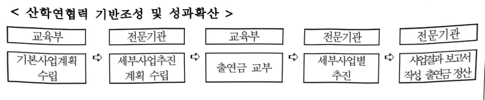

# 산학연협력 고도화 지원

**해당 페이지**: PDF 1863 ~ 1874 쪽 해당

**부처**: 교육부
**분야**: 교육
**회계유형**: 고등·평생교육 지원특별회계
**2026 확정예산**: 262461.0 백만원
**전년대비 증감률**: 41.9%
**AI 도메인**: 교육/인재

---

<table border=1 style='margin: auto; word-wrap: break-word;'><tr><td rowspan="2">반도체공동연구소연합교육과정</td><td style='text-align: center; word-wrap: break-word;'>소관부처</td><td style='text-align: center; word-wrap: break-word;'>인공지능융합인재양성과</td></tr><tr><td style='text-align: center; word-wrap: break-word;'>사업시행주체</td><td style='text-align: center; word-wrap: break-word;'>서울대학교반도체공동연구소</td></tr><tr><td rowspan="2">산학연협력기반조성 및 성과 확산</td><td style='text-align: center; word-wrap: break-word;'>소관부처</td><td style='text-align: center; word-wrap: break-word;'>대학지원관산학협력지원과</td></tr><tr><td style='text-align: center; word-wrap: break-word;'>사업시행주체</td><td style='text-align: center; word-wrap: break-word;'>한국연구재단산학협력전략실</td></tr></table>

### 가. 예산 총괄표

(단위: 백만원, %)

<table border=1 style='margin: auto; word-wrap: break-word;'><tr><td rowspan="2">사업명</td><td rowspan="2">2024년 결산</td><td colspan="2">2025년 예산</td><td colspan="2">2026년 예산</td><td rowspan="2">중감 (B-A)</td><td rowspan="2">(B-A)/A</td></tr><tr><td style='text-align: center; word-wrap: break-word;'>본예산</td><td style='text-align: center; word-wrap: break-word;'>추경(A)</td><td style='text-align: center; word-wrap: break-word;'>요구안</td><td style='text-align: center; word-wrap: break-word;'>본예산(B)</td></tr><tr><td style='text-align: center; word-wrap: break-word;'>산학연협력 고도화 지원</td><td style='text-align: center; word-wrap: break-word;'>440,375</td><td style='text-align: center; word-wrap: break-word;'>182,700</td><td style='text-align: center; word-wrap: break-word;'>184,950</td><td style='text-align: center; word-wrap: break-word;'>262,461</td><td style='text-align: center; word-wrap: break-word;'>262,461</td><td style='text-align: center; word-wrap: break-word;'>77,511</td><td style='text-align: center; word-wrap: break-word;'>41.9</td></tr></table>

## □ 기능별(내역사업별) 예산 내역

(단위:백만원)

<table border=1 style='margin: auto; word-wrap: break-word;'><tr><td rowspan="2"></td><td colspan="5">2024</td><td colspan="5">2025</td><td rowspan="2">2026예산</td></tr><tr><td style='text-align: center; word-wrap: break-word;'>예산액(추경)</td><td style='text-align: center; word-wrap: break-word;'>예산현액</td><td style='text-align: center; word-wrap: break-word;'>집행액</td><td style='text-align: center; word-wrap: break-word;'>이월액</td><td style='text-align: center; word-wrap: break-word;'>불용액</td><td style='text-align: center; word-wrap: break-word;'>예산액(추경)</td><td style='text-align: center; word-wrap: break-word;'>예산현액</td><td style='text-align: center; word-wrap: break-word;'>집행액</td><td style='text-align: center; word-wrap: break-word;'>이월액</td><td style='text-align: center; word-wrap: break-word;'>불용액</td></tr><tr><td style='text-align: center; word-wrap: break-word;'>○ 기능별 분류(합계)</td><td style='text-align: center; word-wrap: break-word;'>443,765</td><td style='text-align: center; word-wrap: break-word;'>443,765</td><td style='text-align: center; word-wrap: break-word;'>440,375</td><td style='text-align: center; word-wrap: break-word;'></td><td style='text-align: center; word-wrap: break-word;'>3,390</td><td style='text-align: center; word-wrap: break-word;'>182,700(184,950)</td><td style='text-align: center; word-wrap: break-word;'>184,950</td><td style='text-align: center; word-wrap: break-word;'>182,850</td><td style='text-align: center; word-wrap: break-word;'></td><td style='text-align: center; word-wrap: break-word;'>2,100</td><td style='text-align: center; word-wrap: break-word;'>262,461</td></tr><tr><td style='text-align: center; word-wrap: break-word;'>· 첨단산업 인재양성부트캠프</td><td style='text-align: center; word-wrap: break-word;'>63,000</td><td style='text-align: center; word-wrap: break-word;'>63,000</td><td style='text-align: center; word-wrap: break-word;'>63,000</td><td style='text-align: center; word-wrap: break-word;'></td><td style='text-align: center; word-wrap: break-word;'>-</td><td style='text-align: center; word-wrap: break-word;'>66,000</td><td style='text-align: center; word-wrap: break-word;'>68,250</td><td style='text-align: center; word-wrap: break-word;'>68,250</td><td style='text-align: center; word-wrap: break-word;'></td><td style='text-align: center; word-wrap: break-word;'>-</td><td style='text-align: center; word-wrap: break-word;'>134,175</td></tr><tr><td style='text-align: center; word-wrap: break-word;'>· 첨단산업 특성화대학 재정지원</td><td style='text-align: center; word-wrap: break-word;'>117,500</td><td style='text-align: center; word-wrap: break-word;'>117,500</td><td style='text-align: center; word-wrap: break-word;'>114,110</td><td style='text-align: center; word-wrap: break-word;'></td><td style='text-align: center; word-wrap: break-word;'>3,390</td><td style='text-align: center; word-wrap: break-word;'>116,700</td><td style='text-align: center; word-wrap: break-word;'>116,700</td><td style='text-align: center; word-wrap: break-word;'>114,600</td><td style='text-align: center; word-wrap: break-word;'></td><td style='text-align: center; word-wrap: break-word;'>2,100</td><td style='text-align: center; word-wrap: break-word;'>120,900</td></tr><tr><td style='text-align: center; word-wrap: break-word;'>· 첨단분야 인턴십지원</td><td style='text-align: center; word-wrap: break-word;'>-</td><td style='text-align: center; word-wrap: break-word;'>-</td><td style='text-align: center; word-wrap: break-word;'>-</td><td style='text-align: center; word-wrap: break-word;'>-</td><td style='text-align: center; word-wrap: break-word;'>-</td><td style='text-align: center; word-wrap: break-word;'>-</td><td style='text-align: center; word-wrap: break-word;'>-</td><td style='text-align: center; word-wrap: break-word;'>-</td><td style='text-align: center; word-wrap: break-word;'>-</td><td style='text-align: center; word-wrap: break-word;'>-</td><td style='text-align: center; word-wrap: break-word;'>4,130</td></tr><tr><td style='text-align: center; word-wrap: break-word;'>· 첨단분야 글로벌교육과정 운영</td><td style='text-align: center; word-wrap: break-word;'>-</td><td style='text-align: center; word-wrap: break-word;'>-</td><td style='text-align: center; word-wrap: break-word;'>-</td><td style='text-align: center; word-wrap: break-word;'>-</td><td style='text-align: center; word-wrap: break-word;'>-</td><td style='text-align: center; word-wrap: break-word;'>-</td><td style='text-align: center; word-wrap: break-word;'>-</td><td style='text-align: center; word-wrap: break-word;'>-</td><td style='text-align: center; word-wrap: break-word;'>-</td><td style='text-align: center; word-wrap: break-word;'>-</td><td style='text-align: center; word-wrap: break-word;'>756</td></tr><tr><td style='text-align: center; word-wrap: break-word;'>· 반도체공동연구소연합교육과정</td><td style='text-align: center; word-wrap: break-word;'>-</td><td style='text-align: center; word-wrap: break-word;'>-</td><td style='text-align: center; word-wrap: break-word;'>-</td><td style='text-align: center; word-wrap: break-word;'>-</td><td style='text-align: center; word-wrap: break-word;'>-</td><td style='text-align: center; word-wrap: break-word;'>-</td><td style='text-align: center; word-wrap: break-word;'>-</td><td style='text-align: center; word-wrap: break-word;'>-</td><td style='text-align: center; word-wrap: break-word;'>-</td><td style='text-align: center; word-wrap: break-word;'>-</td><td style='text-align: center; word-wrap: break-word;'>1,900</td></tr><tr><td style='text-align: center; word-wrap: break-word;'>· 산학연협력 기반조성 및 성과확산</td><td style='text-align: center; word-wrap: break-word;'>-</td><td style='text-align: center; word-wrap: break-word;'>-</td><td style='text-align: center; word-wrap: break-word;'>-</td><td style='text-align: center; word-wrap: break-word;'>-</td><td style='text-align: center; word-wrap: break-word;'>-</td><td style='text-align: center; word-wrap: break-word;'>-</td><td style='text-align: center; word-wrap: break-word;'>-</td><td style='text-align: center; word-wrap: break-word;'>-</td><td style='text-align: center; word-wrap: break-word;'>-</td><td style='text-align: center; word-wrap: break-word;'>-</td><td style='text-align: center; word-wrap: break-word;'>600</td></tr><tr><td style='text-align: center; word-wrap: break-word;'>· 첨단분야 혁신융합대학</td><td style='text-align: center; word-wrap: break-word;'>201,001</td><td style='text-align: center; word-wrap: break-word;'>201,001</td><td style='text-align: center; word-wrap: break-word;'>201,001</td><td style='text-align: center; word-wrap: break-word;'></td><td style='text-align: center; word-wrap: break-word;'>-</td><td style='text-align: center; word-wrap: break-word;'>-</td><td style='text-align: center; word-wrap: break-word;'>-</td><td style='text-align: center; word-wrap: break-word;'>-</td><td style='text-align: center; word-wrap: break-word;'>-</td><td style='text-align: center; word-wrap: break-word;'>-</td><td style='text-align: center; word-wrap: break-word;'>-</td></tr><tr><td style='text-align: center; word-wrap: break-word;'>· 대학창의자산실용화지원(BRIDGE3.0)</td><td style='text-align: center; word-wrap: break-word;'>21,000</td><td style='text-align: center; word-wrap: break-word;'>21,000</td><td style='text-align: center; word-wrap: break-word;'>21,000</td><td style='text-align: center; word-wrap: break-word;'></td><td style='text-align: center; word-wrap: break-word;'>-</td><td style='text-align: center; word-wrap: break-word;'>-</td><td style='text-align: center; word-wrap: break-word;'>-</td><td style='text-align: center; word-wrap: break-word;'>-</td><td style='text-align: center; word-wrap: break-word;'>-</td><td style='text-align: center; word-wrap: break-word;'>-</td><td style='text-align: center; word-wrap: break-word;'>-</td></tr><tr><td style='text-align: center; word-wrap: break-word;'>· 대학 산학협력단지조성 지원</td><td style='text-align: center; word-wrap: break-word;'>14,000</td><td style='text-align: center; word-wrap: break-word;'>14,000</td><td style='text-align: center; word-wrap: break-word;'>14,000</td><td style='text-align: center; word-wrap: break-word;'></td><td style='text-align: center; word-wrap: break-word;'>-</td><td style='text-align: center; word-wrap: break-word;'>-</td><td style='text-align: center; word-wrap: break-word;'>-</td><td style='text-align: center; word-wrap: break-word;'>-</td><td style='text-align: center; word-wrap: break-word;'>-</td><td style='text-align: center; word-wrap: break-word;'>-</td><td style='text-align: center; word-wrap: break-word;'>-</td></tr></table>

---

<table border=1 style='margin: auto; word-wrap: break-word;'><tr><td rowspan="2"></td><td colspan="5">2024</td><td colspan="5">2025</td><td rowspan="2">2026 예산</td></tr><tr><td style='text-align: center; word-wrap: break-word;'>예산액 (추정)</td><td style='text-align: center; word-wrap: break-word;'>예산 현액</td><td style='text-align: center; word-wrap: break-word;'>집행액</td><td style='text-align: center; word-wrap: break-word;'>이월액</td><td style='text-align: center; word-wrap: break-word;'>불용액</td><td style='text-align: center; word-wrap: break-word;'>예산액 (추정)</td><td style='text-align: center; word-wrap: break-word;'>예산 현액</td><td style='text-align: center; word-wrap: break-word;'>집행액</td><td style='text-align: center; word-wrap: break-word;'>이월액</td><td style='text-align: center; word-wrap: break-word;'>불용액</td></tr><tr><td style='text-align: center; word-wrap: break-word;'>· 신학협력 인프라 구축
· 조기취업형 개념화과
선도대학 육성</td><td style='text-align: center; word-wrap: break-word;'>1,464
25,800</td><td style='text-align: center; word-wrap: break-word;'>1,464
25,800</td><td style='text-align: center; word-wrap: break-word;'>1,464
25,800</td><td style='text-align: center; word-wrap: break-word;'></td><td style='text-align: center; word-wrap: break-word;'></td><td style='text-align: center; word-wrap: break-word;'></td><td style='text-align: center; word-wrap: break-word;'></td><td style='text-align: center; word-wrap: break-word;'></td><td style='text-align: center; word-wrap: break-word;'></td><td style='text-align: center; word-wrap: break-word;'></td><td style='text-align: center; word-wrap: break-word;'>-</td></tr></table>

### 나. 사업설명자료

## 1 ) 사업목적·내용

## ○ 첨단산업 인재양성 부트캠프

- 침단산업 분야 취업을 희망하는 대학생을 대상으로 대학·기업이 공동으로 단기 집중교육 프로그램을 개발·운영하고 인증 등 취업연계 지원

## ○ 첨단산업 특성화대학 재정지원

- 반도체 등 첨단산업 경쟁력 확보 및 초격차 유지를 위해 첨단분야 전공운영, 교육 인프라 확보, 특화 교육과정 개발·운영 등을 지원하여 학사급 인력 공급 및 석·박사급 인재양성 기반 구축

## ○ 첨단분야 인턴십 지원

- 첨단산업 인재양성 부트캠프 및 특성화대학 참여 학생을 대상으로 기업 인턴십 기회를 제공하여 학생들의 진로 탐색 및 취업연계를 지원하고 기업들의 수요에 맞춘 실무 인재 양성

## ○ 첨단분야 글로벌 교육과정 운영

- 첨단산업 인재양성 부트캠프 및 특성화대학 참여 학생을 대상으로 국내·해외 대학이 공동으로 첨단분야 글로벌 교육과정을 기획·운영하여 첨단분야 기술 이해도 및 글로벌 역량 제고

## ○ 반도체공동연구소 연합교육과정

- 권역별 반도체공동연구소 운영대학들의 대학별 특화 공정 교육체계와 연계해 반도체 전체 공정 과정을 실습·교육할 수 있도록 연합 교육과정 개발·운영

## ○ 산학연협력 기반조성 및 성과확산

---

- 산학연협력 활성화를 위한 대학 산학협력활동 실태조사 및 분석, 산학협력 우수사례 공유 및 확산기반 조성, 계약학과·계약정원 운영, 산학협력마일리지 제도 운영 등

## 2 ) 사업개요

## □ 사업근거 및 추진경위

① 법령상 근거 및 조항 적시

-「산업교육진흥 및 산학연협력촉진에 관한 법률」 제11조의2, 제39조, 제39조의2

제11조의2(산업기술인력의 양성) ① 교육부장관은 산업기술인력의 양성을 위하여 다음 각 호의 시책을 수립·추진할 수 있다.

1. 기업의 수요에 부합하는 기술인력의 양성체제 구축

2.산학연협력 활성화를 통한 우수인력의 양성

3.산학연협력을 촉진하는 교육 개편, 청년창업가 및 융합인재 양성 지원

4.산업기술 관련 미래 유망분야의 기술인력 양성

5. 지역 발전을 선도할 수 있는 기술인력의 양성

6. 기술인력의 재교육

7. 중소기업 기술인력의 공급 원활화

8. 여성기술인력의 양성 및 산업기술계의 진출 촉진

9. 그 밖에 산업기술인력의 양성을 위하여 대통령령으로 정하는 사항

② 국가와 지방자치단체는 제1항 각 호의 시책을 추진하기 위하여 연구기관, 대학, 그 밖에 대통령령으로 정하는 기관 · 단체 등이 사업을 수행할 때 드는 비용의 전부 또는 일부를 출연하거나 보조할 수 있다.

제39조(산학연협력 촉진을 위한 지원 등) ① 국가와 지방자치단체는 산학연협력을 촉진하기 위하여 산학협력단 등이나 그 밖에 산학연협력사업을 하거나 산학연협력을 촉진·지원하는 단체 및 그 사업 등에 재정 지원을 할 수 있다.

② 국가와 지방자치단체가 산업교육기관과 산학연협력을 추진할 때에 그 산업교육기관으로 하여금 일정한 경비를 부담하도록 하는 경우에는 그 산학연협력의 성격과 목적을 고려하여 필요한 최소한도에 그치도록 하여야 한다.

제39조의2(산학연협력 통계의 작성) ① 국가와 지방자치단체는 산학연협력을 촉진하기 위한 시책의 효율적인 수립·시행을 위하여 산학연협력 관련 통계를 작성하여 관리할 수 있다.

② 국가와 지방자치단체는 제1항에 따른 통계 작성을 위하여 산업교육기관, 연구기관, 산업체 등으로 하여금 기초 자료의 작성·유지·관리 등을 요청할 수 있다.

③ 제1항에 따른 통계 작성대상의 범위 및 조사대상 등은 대통령령으로 정한다.

-「고등교육법」제7조

제7조(교육재정) ① 국가와 지방자치단체는 학교가 그 목적을 달성하거나, 재난 등 급격한 교육환경 변화의 상황에서 교육의 질을 관리하는 데 필요한 재원(財源)을 지원하거나 보조할 수 있다.

② 학교는 교육부령으로 정하는 바에 따라 예산과 결산을 공개하여야 한다.

## -「국가첨단전략산업법 제35조, 제37조

제35조(전문인력양성) ① 정부는 전략산업등의 원활한 인력 수급을 위하여 산업계·대학·연구기관 등과 연계하여 다음 각 호의 사업을 추진할 수 있다.

---

1.산업체 수요와 연계된 계약학과 및 이공계학과,「초·중등교육법」제2조제3호에 따른 고등학교 중 대통령령

으로 정하는 고등학교 등 교육기관을 통한 인력양성사업

2.제1호에 따른 교육기관 외의 전문인력양성기관을 통한 인력양성사업

3. 전문이력의 양성에 필요한 연구시설·장비 및 전문교원 확충

4. '수도권성비계획법' 제2조제1호에 따른 수도권 외의 지역에 대한 거점구축형 인력양성사업

5.그 밖에 대통령령으로 정하는 인력양성사업

② 정부는 제1항에 따른 전문인력양성사업과 연계하여 전략산업등의 전문인력 확대 및 선순환 생태계 구축을 위하여 다음 각 호에 대한 행정적·재정적 지원을 할 수 있다. <개정 2022. 12. 31.>

1. 전략기술 관련 정부 기술개발사업 또는 인력양성프로그램에 참여하였거나 제36조부터 제38조까지의 인력양성기관에서 교육과정을 거친 기술인력에 대한 취업지원

2.제1호의 기술인력 또는 제14조제2항에 따라 지정된 전문인력등에 대한 기술개발사업 우선 지원

3. 제36조부터 제38조까지의 인력양성기관에서 전략기술 관련 교육·실습을 하는 경우 전문인력등의 활용방안마련

4. 전략산업등 관련 대학의 학생 정원 조정

제36조(계약에 의한 직업교육훈련과정 등의 설치 지원) ① 정부는 전략산업등과 관련 기업의 수요에 맞는 분야별 맞춤형 인력양성을 위하여「산업교육진흥 및 산학연협력촉진에 관한 법률」 제2조제2호에 따른 산업교육기관(이하 "산업교육기관"이라 한다)에 같은 법 제8조제1항에 따른 계약에 의한 학과 및 학부(이하 "계약학과등"이라 한다)의 설치·운영을 지원할 수 있다.

② 정부는「산업발전법」제12조제2항에 따라 계약학과등의 설치에 대한 수요를 매년 조사할 수 있으며, 그 결과를 토대로 제1항에 따른 지원을 할 수 있다.

③ 정부는 전략산업등 관련 계약학과등을 설치하거나 운영하고 있는 산업교육기관의 장에게 산업체 부담금의 일

보 미 하새 등록금이 일부를 대통령령으로 정하는 바에 따라 지원할 수 있다.

④ 제3항에 따른 지원을 받는 산업교육기관의 장은 계약학과등을 설치·운영하거나 폐지하는 경우「산업교육진

1교·기관의 장은 계약학과등을 설치·운영하거나 폐지하는 경우「산업교육진흥 및 산학연협력촉진에 관한 법률」제8조제3항에 따라 교육부장관에게 신고하여야 하며, 산업통상자원부장관은 필요한 경우 교육부장관에게 관련 자료 등을 요청할 수 있다.

② 추진경위 - 사업 시작년도, 추진배경, 부처별 중점과제, 대통령 공약사항 등

## <첨단산업 인재양성 부트캠프 및 특성화 대학 등>

- '22.7. '반도체 관련 인재 양성방안' 발표

- '22.8. 국가첨단전략산업법 및 동법 시행령 시행

- '23.~ 첨단산업 인재양성 부트캠프 및 특성화대학 재정지원사업 운영

## <산학연협력 기반조성 및 성과 확산 >

- '06.~ 대학 산학협력활동 실태조사 및 조사보고서 발간

- '08.~ '산학협력 EXPO' 개최

※ 교육부('06~) 산학협력 Techno-fair와 산업부('05~) Capstone 경진대회를 '산학협력 EXPO'로 통합·확대 개최

- '10.~ 실태조사 항목 중 일부를 대학정보공시로 연계

- '21. 산학협력마일리지 제도 활성화 방안 마련 (사회관계장관회의, '21.10.)

## <참고 : 관련 국정과제 >

(55)「지역교육 혁신을 통한 지역인재 양성」

- (내막생 쥐장업·진로 지원) 산학연협력을 통해 대학 교육·실습·취창업 지원을 연계하고, 대학생의 진로 설계 역량 및 취·창업 준비 지원 강화

·(99)「AI디지털시대미래인재양성」

(AI 인재 양성 지원) 대학(원) 대상 AI 융복합(AI+X) 교육과정 확산 및 산업·기업 수요에 기반한 AI 교육·연구 지원을

---

통해 AI 인재 양성 지원

※ AI 거점대학 운영, BK21 분야 교육연구단 확대 및 AI 융합형 대학원 도입 추진, AI부트캠프 운영, 산업 수요기반 계약학과·정원 확대

□ 주요내용

① 사업규모

- 총사업비 : 해당 없음

-사업기간:

· (첨단산업 인재양성 부트캠프) '23 ~ 계속

· (첨단산업 특성화대학 재정지원) '23 ~ 계속

· (첨단분야 인턴십 지원) '26 ~ 계속

· (첨단분야 글로벌 교육과정 운영) '26 ~ 계속

·(반도체공동연구소 연합교육과정 운영) '26 ~ 계속

·(산학연협력 기반조성 및 성과확산) '26 ~ 계속

-최근 5년간 투입된 사업비(예산액기준, 추경편성한 연도에는 추경포함)

<table border=1 style='margin: auto; word-wrap: break-word;'><tr><td style='text-align: center; word-wrap: break-word;'>연도</td><td style='text-align: center; word-wrap: break-word;'>2022</td><td style='text-align: center; word-wrap: break-word;'>2023</td><td style='text-align: center; word-wrap: break-word;'>2024</td><td style='text-align: center; word-wrap: break-word;'>2025</td><td style='text-align: center; word-wrap: break-word;'>2026</td></tr><tr><td style='text-align: center; word-wrap: break-word;'>사업비</td><td style='text-align: center; word-wrap: break-word;'>435,929</td><td style='text-align: center; word-wrap: break-word;'>557,247</td><td style='text-align: center; word-wrap: break-word;'>443,765</td><td style='text-align: center; word-wrap: break-word;'>184,950</td><td style='text-align: center; word-wrap: break-word;'>262,461</td></tr></table>

② 사업추진체계

- 사업시행방법 : 출연

-사업시행주체:한국산업기술진흥원,서울대학교,한국연구재단

-사업 수혜자 : 대학생, 기업, 대학(산학협력단) 등

- 보조, 융자, 출연, 출자 등의 경우 보조·융자 등 지원 비율 및 법적근거

<table border=1 style='margin: auto; word-wrap: break-word;'><tr><td style='text-align: center; word-wrap: break-word;'>내역사업명</td><td style='text-align: center; word-wrap: break-word;'>구분</td><td style='text-align: center; word-wrap: break-word;'>피보조·피출연 등 기관명</td><td style='text-align: center; word-wrap: break-word;'>지원 금액 (2026예산)</td><td style='text-align: center; word-wrap: break-word;'>지원 비율(%)</td><td style='text-align: center; word-wrap: break-word;'>보조율 법적근거 (해당 조항)</td></tr><tr><td style='text-align: center; word-wrap: break-word;'>첨단산업 인재양성 부트캠프</td><td style='text-align: center; word-wrap: break-word;'>출연</td><td style='text-align: center; word-wrap: break-word;'>한국산업기술진흥원</td><td style='text-align: center; word-wrap: break-word;'>134,175</td><td style='text-align: center; word-wrap: break-word;'>100</td><td style='text-align: center; word-wrap: break-word;'>산업교육진흥 및 산학연협력촉진에 관한 법률 제11조의2, 제39조, 고등교육법 제7조, 국가첨단전략산업법 제35조</td></tr><tr><td style='text-align: center; word-wrap: break-word;'>첨단산업 특성화대학 재정지원</td><td style='text-align: center; word-wrap: break-word;'>출연</td><td style='text-align: center; word-wrap: break-word;'>한국산업기술진흥원</td><td style='text-align: center; word-wrap: break-word;'>120,900</td><td style='text-align: center; word-wrap: break-word;'>100</td><td style='text-align: center; word-wrap: break-word;'>산업교육진흥 및 산학연협력촉진에 관한 법률 제11조의2, 제39조, 고등교육법 제7조, 국가첨단전략산업법 제35조, 제37조</td></tr><tr><td style='text-align: center; word-wrap: break-word;'>첨단분야 인턴십 지원</td><td style='text-align: center; word-wrap: break-word;'>출연</td><td style='text-align: center; word-wrap: break-word;'>한국산업기술진흥원</td><td style='text-align: center; word-wrap: break-word;'>4,130</td><td style='text-align: center; word-wrap: break-word;'>100</td><td style='text-align: center; word-wrap: break-word;'>산업교육진흥 및 산학연협력촉진에 관한 법률 제11조의2, 제39조, 고등교육법 제7조, 국가첨단전략산업법 제35조, 제37조</td></tr><tr><td style='text-align: center; word-wrap: break-word;'>첨단분야 글로벌</td><td style='text-align: center; word-wrap: break-word;'>출연</td><td style='text-align: center; word-wrap: break-word;'>한국산업기술진흥원</td><td style='text-align: center; word-wrap: break-word;'>756</td><td style='text-align: center; word-wrap: break-word;'>100</td><td style='text-align: center; word-wrap: break-word;'>산업교육진흥 및 산학연협력촉진에 관한 법률 제11조의2, 제39조, 고등교육법 제7조,</td></tr></table>

---

<table border=1 style='margin: auto; word-wrap: break-word;'><tr><td style='text-align: center; word-wrap: break-word;'>교육과정 운영</td><td style='text-align: center; word-wrap: break-word;'></td><td style='text-align: center; word-wrap: break-word;'></td><td style='text-align: center; word-wrap: break-word;'></td><td style='text-align: center; word-wrap: break-word;'></td><td style='text-align: center; word-wrap: break-word;'>국가첨단전략산업법 제35조, 제37조</td></tr><tr><td style='text-align: center; word-wrap: break-word;'>반도체공연구소 연합교육과정</td><td style='text-align: center; word-wrap: break-word;'>졸업</td><td style='text-align: center; word-wrap: break-word;'>서울대학교</td><td style='text-align: center; word-wrap: break-word;'>1,900</td><td style='text-align: center; word-wrap: break-word;'>100</td><td style='text-align: center; word-wrap: break-word;'>산업교육진흥 및 산학연협력촉진에 관한 법률 제11조의2, 제39조</td></tr><tr><td style='text-align: center; word-wrap: break-word;'>산학연협력 기반조성 및 성과확산</td><td style='text-align: center; word-wrap: break-word;'>졸업</td><td style='text-align: center; word-wrap: break-word;'>한국연구재단</td><td style='text-align: center; word-wrap: break-word;'>600</td><td style='text-align: center; word-wrap: break-word;'>100</td><td style='text-align: center; word-wrap: break-word;'>산업교육진흥 및 산학연협력촉진에 관한 법률 시행령 제52조,학술진흥법 제5조, 보조금 관리에 관한 법률 제9조</td></tr></table>

## 3 ) 2026년도 예산 산출 근거

☐ 산학연협력 고도화 지원 : (2025 추경) 184,950백만원 → (2026 예산) 262,461백만원, 77,511백만원 증액 (2025 본예산 182,700백만원 → 제1회 추경 182,700백만원 → 제2회 추경 184,950백만원)

① 첨단산업 인재양성 부트캠프 : (2025 추경) 68,250백만원 → (2026 예산) 134,175백만원, 65,925백만원 중액
(2025 본예산 66,000백만원 → 제1회 추경 66,000백만원 → 제2회 추경 68,250백만원)
- (요구) 국정과제(55-4, 99-2) 및 첨단분야 인재양성 전략('23.2.1.)에 따라, 기업 등 대학 밖 자원을 활용한 첨단산업 인재의 신속한 양성 필요
- (산출) (1) 대학 125,400백만원, (2) AI융합 5,000백만원, (3) 협약기관 2,050백만원, (4) 사업관리비 1,725백만원
(1) 대학 : 88개 x 1,425백만원 = 125,400백만원
(2) AI융합 : 10개 x 500백만원 = 5,000백만원
(3) 협약기관 : 1개 x 100백만원 + 5개 x 150백만원 + 1개 x 200백만원 + 2개 x 300백만원 + 1개 x 400백만원 = 2,050백만원
(4) 사업관리비 : 1식 x 1,725백만원 = 1,725백만원

(2) 금고단압 측정과제(55-4), 반도체 관련 인재 양성방안('22.7.19.), 첨단분야 인재양성 전략('23.2.1.) 등에 따른 학사급 인재 확대 및 석·박사급 인재양성 토대 마련 등 첨단산업 분야 특화 인재양성을 위한 학부교육 기반 구축 - (산출) (1) 반도체(설계) 81,500백만원, (2) 이차전지 14,500백만원, (3) 바이오 14,500백만원, (4) 로봇 8,700백만원 (5) 사업관리비 1,700백만원

(1) 반도체 : 단독(수도권)2개 x 3,050백만원 + 단독(비수도권)3개 x 4,750백만원

    + 연합(수도-비수도)1개 x 4,750백만원 + 연합(비수도)2개 x 5,800백만원

    + 단독(수도권)3개 x 3,050백만원 + 단독(비수도권)1개 x 3,050백만원

    + 연합(수도-비수도)4개 x 4,750백만원 + 연합(비수도)2개 x 5,800백만원

    + 반도체설계 2개 x 1,000백만원 = 81,500백만원

(2) 이차전지 : 5개 x 2,900백만원 = 14,500백만원

(3) 바이오 : 5개 x 2,900백만원 = 14,500백만원

(4) 로봇 : 3개 x 2,900백만원 = 8,700백만원

(5) 사업관리비 : 1,700백만원

- (요구) 국정과제(55-4, 99-2) 및 첨단분야 인재양성 전략('23.2.1.) 등에 따라 기업 인턴십 기회를 제공하여 학생들의 진로 탐색 및 취업연계 지원 및 기업들의 수요에 맞춘 실무 인재 양성

- (산출) (1) 인턴십 4,090백만원, (2) 사업관리비 40백만원

(1) 인턴십 : 500명 x 8,180백만원 = 4,090백만원

(2) 사업관리비 40백만원

---

④ 첨단분야 글로벌 교육과정 운영 : (2025 본예산) 0백만원 → (2026 예산) 756백만원, 신규
- (요구) 국정과제(55-4, 99-2) 및 첨단분야 인재양성 전략('23.2.1.) 등에 따라 첨단분야 글로벌 교육과정을 기획·운영하여 첨단분야 기술 이해도, 글로벌 역량 제고
- (산출) (1) 사업비 720백만원, (2) 사업관리비 36백만원
(1) 글로벌 교육과정 운영 : 120명 x 6백만원 = 720백만원
(2) 사업관리비 36백만원
⑤ 반도체공동연구소 연합교육과정 운영 : (2025 본예산) 0백만원 → (2026 예산) 1,900백만원, 신규
- (요구) 학생들이 반도체 공정 전 과정을 학습할 수 있도록 권역별 반도체 공동연구소 연합교육과정 개발운영비 요구
- (산출) 서울대 반도체 공동연구소(중앙 HUB) 연합교육과정 운영비 = 1개소 x 1,900백만원

⑥ 산학연협력 기반조성 및 성과확산 : (2025 본예산) 0백만원 → (2026 예산) 600백만원, 신규

- (요구) 국정과제(55-1, 55-4) 등 산학연협력 활성화를 위한 국가차원 총괄 사업 지원체계 마련 필요

- (산출) (1)산학협력활동실태조사 200백만원, (2)제도운영 150백만원, (3)성과확산 250백만원

(1) 조사 추진 및 조사보고서 발간 1식 × 20백만원 = 20백만원

조사 시스템 기능개선 및 운영 1식 × 180백만원 = 180백만원

(2) 제도 운영(산학협력마일리지, 계약학과·계약정원, 기술지주회사) 3식 × 50백만원 = 150백만원

(3) 산학연협력 EXPO 개최 및 시상 1식 × 250백만원 = 250백만원

2025년도 추가경정예산 및 2026년도 예산 산출 세부내역 비교

<table border=1 style='margin: auto; word-wrap: break-word;'><tr><td colspan="2">2025년 제2회 추가경쟁예산</td><td colspan="2">2026년 예산</td></tr><tr><td style='text-align: center; word-wrap: break-word;'>예산</td><td style='text-align: center; word-wrap: break-word;'>산출내역</td><td style='text-align: center; word-wrap: break-word;'>예산</td><td style='text-align: center; word-wrap: break-word;'>산출내역</td></tr><tr><td rowspan="4">청단산업인재양성부트캠프68,950만원</td><td colspan="3">청단산업인재양성부트캠프134,175만원 &gt; 65,925 증액</td></tr><tr><td colspan="3">청단산업인재양성부트캠프134,175만원 &gt; 65,925 증액</td></tr><tr><td colspan="3">청단산업인재양성부트캠프134,175만원 &gt; 65,925 증액</td></tr><tr><td style='text-align: center; word-wrap: break-word;'>청단산업인재양성부</td><td style='text-align: center; word-wrap: break-word;'></td><td style='text-align: center; word-wrap: break-word;'></td></tr></table>

ㅇ 2025년도 예산 및 2026년도 예산 산출 세부내역 비교

<table border=1 style='margin: auto; word-wrap: break-word;'><tr><td rowspan="2">예산</td><td colspan="2">2025년 본예산</td><td colspan="2">2026년 예산</td></tr><tr><td colspan="2">산출내역</td><td style='text-align: center; word-wrap: break-word;'>예산</td><td style='text-align: center; word-wrap: break-word;'>산출내역</td></tr><tr><td rowspan="13">184,950</td><td colspan="2">○ 침단산업 인재양성 부트캠프(350-02): 68,950백만원</td><td colspan="2">○ 침단산업 인재양성 부트캠프(350-02): 134,175백만원</td></tr><tr><td colspan="2">가. 대학: 44개 x 1,500백만원 = 66,000백만원</td><td colspan="2">가. 대학: 88개 x 1,425백만원 = 125,400백만원</td></tr><tr><td colspan="2">나. AI분야: 3개 x 750백만원 = 2,250백만원</td><td colspan="2">나. AI분야: 10개 x 500백만원 = 5,000백만원</td></tr><tr><td colspan="2">○ 침단산업 특성화대학 재정지원(350-02): 116,700백만원</td><td colspan="2">○ 침단산업 특성화대학 재정지원(350-02): 120,900백만원</td></tr><tr><td colspan="2">가. 23선정 8개 x 4,788 = 38,300</td><td colspan="2">가. 반도체: 81,500백만원</td></tr><tr><td colspan="2">나. 24선정 10개 x 5,240 = 52,400</td><td colspan="2">나. 24선정 10개 x 5,240 = 52,400</td></tr><tr><td colspan="2">다. 24선정 3개 x 3,000 = 9,000</td><td colspan="2">다. 24선정 3개 x 3,000 = 9,000</td></tr><tr><td colspan="2">라. 25선정 2개 x 3,000 = 6,000</td><td colspan="2">라. 25선정 2개 x 3,000 = 6,000</td></tr><tr><td colspan="2">마. 25선정 3개 x 3,000 = 9,000</td><td colspan="2">마. 25선정 3개 x 3,000 = 9,000</td></tr><tr><td colspan="2">바. 25선정 2개 x 1,000 = 2,000</td><td colspan="2">바. 25선정 2개 x 1,000 = 2,000</td></tr><tr><td colspan="2"></td><td colspan="2">나. 이차전지 14,500백만원</td></tr><tr><td colspan="2"></td><td colspan="2">나. 이차전지 14,500백만원</td></tr><tr><td colspan="2"></td><td colspan="2">나. 이차전지 14,500백만원</td></tr></table>

---

<table border=1 style='margin: auto; word-wrap: break-word;'><tr><td colspan="2">2025년 분예산</td><td colspan="2">2026년 예산</td></tr><tr><td style='text-align: center; word-wrap: break-word;'>예산</td><td style='text-align: center; word-wrap: break-word;'>산줄내역</td><td style='text-align: center; word-wrap: break-word;'>예산</td><td style='text-align: center; word-wrap: break-word;'>산줄내역</td></tr><tr><td style='text-align: center; word-wrap: break-word;'></td><td style='text-align: center; word-wrap: break-word;'>○ 첨단분야 인턴십 지원(350-02): 0백만원○ 첨단분야 글로벌 교육과정 운영(350-02): 0백만원○ 반도체공동연구소 연합교육과정 운영(350-02): 0백만원○ 산학연협력 기반조성 및 성과확산(350-02): 0백만원</td><td style='text-align: center; word-wrap: break-word;'>○ 첨단분야 인턴십 지원(350-02): 4,130백만원, 신규가. 인턴십 4,090백만원나. 사업관리비 40백만원○ 첨단분야 글로벌 교육과정 운영(350-02): 756백만원, 신규가. 사업비: 720백만원나. 사업관리비 36백만원○ 반도체공동연구소 연합교육과정(350-02): 1,900백만원, 신규가. 산학연협력 기반조성 및 성과확산(350-02): 600백만원, 신규가. 산학협력활동실태조사 200백만원나. 제도운영 150백만원다. 성과확산 250백만원</td><td style='text-align: center; word-wrap: break-word;'></td></tr></table>

## 4 ) 사업효과

☐ 사업영향, 산출물 성과지표 등

①2022~2026년도 성과계획서 상 성과지표 및 최근 5년간 성과 달성도

<table border=1 style='margin: auto; word-wrap: break-word;'><tr><td style='text-align: center; word-wrap: break-word;'>성과지표</td><td style='text-align: center; word-wrap: break-word;'>구분</td><td style='text-align: center; word-wrap: break-word;'>2022</td><td style='text-align: center; word-wrap: break-word;'>2023</td><td style='text-align: center; word-wrap: break-word;'>2024</td><td style='text-align: center; word-wrap: break-word;'>2025</td><td style='text-align: center; word-wrap: break-word;'>2026</td><td style='text-align: center; word-wrap: break-word;'>2026 목표치산출근거</td><td style='text-align: center; word-wrap: break-word;'>측정산식(또는 측정방법)</td><td style='text-align: center; word-wrap: break-word;'>자료수집방법(또는 자료출처)</td></tr><tr><td rowspan="3">실험실특화형창업 선도대학기술창업을(단위: %)</td><td style='text-align: center; word-wrap: break-word;'>목표</td><td style='text-align: center; word-wrap: break-word;'>35</td><td style='text-align: center; word-wrap: break-word;'>38</td><td style='text-align: center; word-wrap: break-word;'>39</td><td style='text-align: center; word-wrap: break-word;'>40</td><td style='text-align: center; word-wrap: break-word;'>42</td><td rowspan="3">최근 3년간 평균창업율이 37.7% 및 점진적으로 증가하는 대학 책정읍을 고려하여 상향 목표치를 설정하되, 외부변화(창업기술을 지원하는 R&amp;D에 산의 변동 등)을 고려하여 3개년 평균의 약 5% 상향하여 최종 2%p 상승한 40%로 목표치를 개진함.</td><td rowspan="3">(창업기업 설립 수 / 당해년도 지원 창업기술) × 100 ※ 신규 창업기업 설립 수 / 당해연도 지원 혁신창업실험실(창업유망기술)</td><td rowspan="3">전수조사(2025년 지원 대학 창업기술)</td></tr><tr><td style='text-align: center; word-wrap: break-word;'>실적</td><td style='text-align: center; word-wrap: break-word;'>37.3</td><td style='text-align: center; word-wrap: break-word;'>38.7</td><td style='text-align: center; word-wrap: break-word;'>-</td><td style='text-align: center; word-wrap: break-word;'>-</td><td style='text-align: center; word-wrap: break-word;'>-</td></tr><tr><td style='text-align: center; word-wrap: break-word;'>달성도</td><td style='text-align: center; word-wrap: break-word;'></td><td style='text-align: center; word-wrap: break-word;'></td><td style='text-align: center; word-wrap: break-word;'></td><td style='text-align: center; word-wrap: break-word;'>-</td><td style='text-align: center; word-wrap: break-word;'>-</td></tr></table>

② 성과지표 이외의 연도별 사업추진 경과 및 실적

<table border=1 style='margin: auto; word-wrap: break-word;'><tr><td style='text-align: center; word-wrap: break-word;'>2022</td><td style='text-align: center; word-wrap: break-word;'>-</td></tr><tr><td style='text-align: center; word-wrap: break-word;'>2023</td><td style='text-align: center; word-wrap: break-word;'>° 특성화대학 신규 선정(반도체 8개) 신규 선정(&#x27;23.6.)° 첨단산업 인재양성 부트캠프 대학 10개교 신규 선정(&#x27;23.6.)</td></tr><tr><td style='text-align: center; word-wrap: break-word;'>2024</td><td style='text-align: center; word-wrap: break-word;'>° 특성화대학 신규 선정(반도체 10개, 이차전지 3개)(&#x27;24.7., &#x27;24.10.)° 첨단산업 인재양성 부트캠프 대학 32개교 추가 선정(&#x27;24.7.), 총 42개교 지원</td></tr><tr><td style='text-align: center; word-wrap: break-word;'>2025</td><td style='text-align: center; word-wrap: break-word;'>° 특성화대학 신규 선정(이차전지 2개, 바이오 3개)(&#x27;25.6.)° 첨단산업 인재양성 부트캠프 대학 4개교 선정(&#x27;25.6.), 총 44개교 지원</td></tr></table>

---

③ 향후(2026년도 이후) 기대효과 : 개조식으로 작성, 건 별로 계량적 수치 제시

5) 타당성조사 및 예비타당성조사 시행여부 및 결과 요지 : 해당없음

6) 총사업비 대상사업 정보 : 해당없음

## 7 ) 사업 집행절차

## < 첨단산업 인재양성 부트캠프 >

<table border=1 style='margin: auto; word-wrap: break-word;'><tr><td style='text-align: center; word-wrap: break-word;'>부처</td><td style='text-align: center; word-wrap: break-word;'></td><td style='text-align: center; word-wrap: break-word;'>피출연·피보조기관</td><td style='text-align: center; word-wrap: break-word;'></td><td style='text-align: center; word-wrap: break-word;'>간접보조사업자·사업수행자</td></tr><tr><td rowspan="2">교육부(134,175백만원)</td><td rowspan="2">=&gt;(134,175백만원)</td><td rowspan="2">한국산업기술진흥원(1,725백만원)</td><td style='text-align: center; word-wrap: break-word;'>=&gt;(2,050백만원)</td><td style='text-align: center; word-wrap: break-word;'>한국인공지능·소프트웨어산업협회외 9개 기관</td></tr><tr><td style='text-align: center; word-wrap: break-word;'>=&gt;(130,400백만원)</td><td style='text-align: center; word-wrap: break-word;'>88개 대학</td></tr></table>

## < 첨단산업 특성화대학 재정지원>

<table border=1 style='margin: auto; word-wrap: break-word;'><tr><td style='text-align: center; word-wrap: break-word;'>부처</td><td style='text-align: center; word-wrap: break-word;'></td><td style='text-align: center; word-wrap: break-word;'>피출연·피보조기관</td><td style='text-align: center; word-wrap: break-word;'></td><td style='text-align: center; word-wrap: break-word;'>간접보조사업자·사업수행자</td></tr><tr><td style='text-align: center; word-wrap: break-word;'>교육부(120,900백만원)</td><td style='text-align: center; word-wrap: break-word;'>=&gt;(120,900백만원)</td><td style='text-align: center; word-wrap: break-word;'>한국산업기술진흥원(1,700백만원)</td><td style='text-align: center; word-wrap: break-word;'>=&gt;(119,200백만원)</td><td style='text-align: center; word-wrap: break-word;'>33개 사업단</td></tr></table>

## < 첨단분야 인턴십 지원 >

<table border=1 style='margin: auto; word-wrap: break-word;'><tr><td style='text-align: center; word-wrap: break-word;'>부처</td><td style='text-align: center; word-wrap: break-word;'></td><td style='text-align: center; word-wrap: break-word;'>피출연·피보조기관</td><td style='text-align: center; word-wrap: break-word;'></td><td style='text-align: center; word-wrap: break-word;'>간접보조사업자·사업수행자</td></tr><tr><td style='text-align: center; word-wrap: break-word;'>교육부(4,130백만원)</td><td style='text-align: center; word-wrap: break-word;'>=&gt;(4,130백만원)</td><td style='text-align: center; word-wrap: break-word;'>한국산업기술진흥원(40백만원)</td><td style='text-align: center; word-wrap: break-word;'>=&gt;(4,090백만원)</td><td style='text-align: center; word-wrap: break-word;'>첨단분야 인턴십 참여기업</td></tr></table>

## <반도체공동연구소 연합교육과정 >

<table border=1 style='margin: auto; word-wrap: break-word;'><tr><td style='text-align: center; word-wrap: break-word;'>부처</td><td style='text-align: center; word-wrap: break-word;'></td><td style='text-align: center; word-wrap: break-word;'>피출연 기관</td></tr><tr><td style='text-align: center; word-wrap: break-word;'>교육부(1,900백만원)</td><td style='text-align: center; word-wrap: break-word;'>=&gt;(1,900백만원)</td><td style='text-align: center; word-wrap: break-word;'>서울대반도체공동연구소(1,900백만원)</td></tr></table>

## < 첨단분야 글로벌 교육과정 운영 >

<table border=1 style='margin: auto; word-wrap: break-word;'><tr><td style='text-align: center; word-wrap: break-word;'>부처</td><td style='text-align: center; word-wrap: break-word;'></td><td style='text-align: center; word-wrap: break-word;'>피출연·피보조기관</td><td style='text-align: center; word-wrap: break-word;'></td><td style='text-align: center; word-wrap: break-word;'>간접보조사업자·사업수행자</td></tr><tr><td style='text-align: center; word-wrap: break-word;'>교육부(756백만원)</td><td style='text-align: center; word-wrap: break-word;'>=&gt;(756백만원)</td><td style='text-align: center; word-wrap: break-word;'>한국산업기술진흥원(36백만원)</td><td style='text-align: center; word-wrap: break-word;'>=&gt;(720백만원)</td><td style='text-align: center; word-wrap: break-word;'>첨단분야 글로벌교육과정 운영 대학</td></tr></table>

---

## <산학연협력 기반조성 및 성과확산 >

## 8 ) 각종 평가

1) 국회(예결위, 상임위, 예정처, 국정감사 포함) 지적

## < 첨단산업 인재양성 부트캠프 >

①교육부 기존 사업과는 다른 방식의 새로운 사업이며 계획이 구체화되어 있지 않음(22 예정처)

② 우수 장비 및 인력을 갖춘 기업의 참여가 필수적이지만, 우수 기업은 주로 수도권에 집중되어 있어 지방의 경우 기업과 협력하여 교육과정을 개발하는 과정에서 어려움이 있을 것으로 보임(22 예정처)

③ 타 부처의 신기술 직업훈련사업 등과 중복 우려가 있으므로 대상과 내용을 차별화하여 추진 필요('22 예정처, 예결위)

④ 대학·학생·기업·민간교육기관 수요 조사 등에 기반한 사업계획 마련 필요('22 예결위)

⑤ 첨단산업 인재양성 부트캠프 사업의 수료율과 취업률 제고 방안을 마련할 것('23 교육위)

## < 첨단산업 특성화대학 지원 >

① 반도체 특성화대학은 소요예산이 큰 신규 내역사업임에도 사업계획 구체화가 미흡하므로 사업계획 구체화 필요('22 예정처)

② 대학을 대상으로 하는 타 반도체 인재양성 지원사업과 중복투자 우려되므로 사업 간 효율화 방안 마련 필요('22 예정처, 예결위)

③ 대학 사전 수요조사 부족('22 예결위)

④ 반도체인력 현황 및 전망에 대한 기관별 기준이 상이하여 추가분석 필요('22 예결위)

⑤ 교육부는 기 선정된 계속 대학(2023년)의 집행이 개선될 수 있도록 사업관리를 할 것('23 교육위)

2) 대외공개 평가 : 해당 없음

3) 자체평가 : 해당 없음

### 다. 최근 4년간 결산내역

## 1 ) 결산표

☐ 부처 결산내역

---

(단위: 백만원, %)

<table border=1 style='margin: auto; word-wrap: break-word;'><tr><td rowspan="2">연도</td><td colspan="3">예산액</td><td rowspan="2">예산현액(A)</td><td rowspan="2">집행액(B)</td><td rowspan="2">집행률(B/A)</td><td rowspan="2">다음연도이월액</td><td rowspan="2">불용액</td></tr><tr><td style='text-align: center; word-wrap: break-word;'>본예산</td><td style='text-align: center; word-wrap: break-word;'>추경중감액</td><td style='text-align: center; word-wrap: break-word;'>추경</td></tr><tr><td style='text-align: center; word-wrap: break-word;'>2022</td><td style='text-align: center; word-wrap: break-word;'>435,929</td><td style='text-align: center; word-wrap: break-word;'></td><td style='text-align: center; word-wrap: break-word;'>435,929</td><td style='text-align: center; word-wrap: break-word;'>469,043</td><td style='text-align: center; word-wrap: break-word;'>469,043</td><td style='text-align: center; word-wrap: break-word;'>107.6</td><td style='text-align: center; word-wrap: break-word;'></td><td style='text-align: center; word-wrap: break-word;'></td></tr><tr><td style='text-align: center; word-wrap: break-word;'>2023</td><td style='text-align: center; word-wrap: break-word;'>557,247</td><td style='text-align: center; word-wrap: break-word;'></td><td style='text-align: center; word-wrap: break-word;'>557,247</td><td style='text-align: center; word-wrap: break-word;'>557,247</td><td style='text-align: center; word-wrap: break-word;'>557,247</td><td style='text-align: center; word-wrap: break-word;'>100.0</td><td style='text-align: center; word-wrap: break-word;'></td><td style='text-align: center; word-wrap: break-word;'></td></tr><tr><td style='text-align: center; word-wrap: break-word;'>2024</td><td style='text-align: center; word-wrap: break-word;'>443,765</td><td style='text-align: center; word-wrap: break-word;'></td><td style='text-align: center; word-wrap: break-word;'>443,765</td><td style='text-align: center; word-wrap: break-word;'>443,765</td><td style='text-align: center; word-wrap: break-word;'>440,375</td><td style='text-align: center; word-wrap: break-word;'>99.2</td><td style='text-align: center; word-wrap: break-word;'></td><td style='text-align: center; word-wrap: break-word;'>3,390</td></tr><tr><td style='text-align: center; word-wrap: break-word;'>2025</td><td style='text-align: center; word-wrap: break-word;'>182,700</td><td style='text-align: center; word-wrap: break-word;'>2,250</td><td style='text-align: center; word-wrap: break-word;'>184,950</td><td style='text-align: center; word-wrap: break-word;'>184,950</td><td style='text-align: center; word-wrap: break-word;'>182,850</td><td style='text-align: center; word-wrap: break-word;'>98.9</td><td style='text-align: center; word-wrap: break-word;'></td><td style='text-align: center; word-wrap: break-word;'>2,100</td></tr></table>

## 2 ) 주요 결산사항

□ 2022~2025년 결산 주요 지적사항 및 시정요구사항

<table border=1 style='margin: auto; word-wrap: break-word;'><tr><td style='text-align: center; word-wrap: break-word;'>2022</td><td style='text-align: center; word-wrap: break-word;'>- 해당없음</td></tr><tr><td style='text-align: center; word-wrap: break-word;'>2023</td><td style='text-align: center; word-wrap: break-word;'>- 해당없음</td></tr><tr><td style='text-align: center; word-wrap: break-word;'>2024</td><td style='text-align: center; word-wrap: break-word;'>- 이월 사유 및 불용 사유(집행부진사유): (불용) &#x27;24년도 첨단산업 특성화대학 재정지원사업 신규 선정 최초 공고 시 1개 분야(1개교) 미지원 및 재공고에 따라 집행 가능성 등을 고려하여 1차년도 사업비 3,390백만원 감액</td></tr><tr><td style='text-align: center; word-wrap: break-word;'>2025</td><td style='text-align: center; word-wrap: break-word;'>- 추경 편성 사유: AI 부트캠프 3개교 신규 선정 - 이월 사유 및 불용 사유(집행부진사유): (불용) &#x27;24년도 첨단산업 특성화대학 재정지원사업 재공고에서 최초 공고 시 선정 예정 분야와 다른 분야의 대학이 선정됨에 따라 2,100백만원 불용 ※(최초공고 미지원 분야 2차년도 지원 예산 5,600백만원 →(재공고 선정대학 2차년도 지원 예산) 3,500백만원</td></tr></table>

□2025년 이·전용 등 세부내역 : 해당없음

---

<table border=1 style='margin: auto; word-wrap: break-word;'><tr><td style='text-align: center; word-wrap: break-word;'>사 업 명</td></tr><tr><td style='text-align: center; word-wrap: break-word;'>(6) 소프트웨어인재양성기반구축 (1031-313)</td></tr></table>

## □ 사업 코드 정보

<table border=1 style='margin: auto; word-wrap: break-word;'><tr><td style='text-align: center; word-wrap: break-word;'>구분</td><td style='text-align: center; word-wrap: break-word;'>회계</td><td style='text-align: center; word-wrap: break-word;'>소관</td><td style='text-align: center; word-wrap: break-word;'>실국(기관)</td><td style='text-align: center; word-wrap: break-word;'>계정</td><td style='text-align: center; word-wrap: break-word;'>분야</td><td style='text-align: center; word-wrap: break-word;'>부문</td></tr><tr><td style='text-align: center; word-wrap: break-word;'>코드</td><td rowspan="2">일반회계</td><td rowspan="2">교육부</td><td rowspan="2">인공지능인재 지원국</td><td rowspan="2"></td><td style='text-align: center; word-wrap: break-word;'>050</td><td style='text-align: center; word-wrap: break-word;'>051</td></tr><tr><td style='text-align: center; word-wrap: break-word;'>명칭</td><td style='text-align: center; word-wrap: break-word;'>교육</td><td style='text-align: center; word-wrap: break-word;'>유아 및 초중등교육</td></tr></table>

<table border=1 style='margin: auto; word-wrap: break-word;'><tr><td style='text-align: center; word-wrap: break-word;'>구분</td><td style='text-align: center; word-wrap: break-word;'>프로그램</td><td style='text-align: center; word-wrap: break-word;'>단위사업</td><td style='text-align: center; word-wrap: break-word;'>세부사업</td></tr><tr><td style='text-align: center; word-wrap: break-word;'>코드</td><td style='text-align: center; word-wrap: break-word;'>1000</td><td style='text-align: center; word-wrap: break-word;'>1031</td><td style='text-align: center; word-wrap: break-word;'>313</td></tr><tr><td style='text-align: center; word-wrap: break-word;'>명칭</td><td style='text-align: center; word-wrap: break-word;'>학교교육과정 운영지원</td><td style='text-align: center; word-wrap: break-word;'>학교교육과정 운영지원</td><td style='text-align: center; word-wrap: break-word;'>소프트웨어인재양성기반구축</td></tr></table>

□ 사업 성격

<table border=1 style='margin: auto; word-wrap: break-word;'><tr><td rowspan="2">신규</td><td rowspan="2">계속</td><td rowspan="2">완료</td><td rowspan="2">예비타당성 실시여부</td><td rowspan="2">총사업비 관리대상</td><td rowspan="2">총액계상 예산사업</td><td style='text-align: center; word-wrap: break-word;'>사업소관 변경정보</td></tr><tr><td style='text-align: center; word-wrap: break-word;'>2025예산 시 소관</td></tr><tr><td style='text-align: center; word-wrap: break-word;'></td><td style='text-align: center; word-wrap: break-word;'>○</td><td style='text-align: center; word-wrap: break-word;'></td><td style='text-align: center; word-wrap: break-word;'></td><td style='text-align: center; word-wrap: break-word;'></td><td style='text-align: center; word-wrap: break-word;'></td><td style='text-align: center; word-wrap: break-word;'></td></tr></table>

□ 사업 지원 형태 및 지원을

<table border=1 style='margin: auto; word-wrap: break-word;'><tr><td style='text-align: center; word-wrap: break-word;'>직접</td><td style='text-align: center; word-wrap: break-word;'>출자</td><td style='text-align: center; word-wrap: break-word;'>출연</td><td style='text-align: center; word-wrap: break-word;'>보조</td><td style='text-align: center; word-wrap: break-word;'>융자</td><td style='text-align: center; word-wrap: break-word;'>국고보조율(%)</td><td style='text-align: center; word-wrap: break-word;'>융자율(%)</td></tr><tr><td style='text-align: center; word-wrap: break-word;'></td><td style='text-align: center; word-wrap: break-word;'></td><td style='text-align: center; word-wrap: break-word;'>○</td><td style='text-align: center; word-wrap: break-word;'></td><td style='text-align: center; word-wrap: break-word;'></td><td style='text-align: center; word-wrap: break-word;'></td><td style='text-align: center; word-wrap: break-word;'></td></tr></table>

## □ 사업 소관부처 및 시행주체

<table border=1 style='margin: auto; word-wrap: break-word;'><tr><td style='text-align: center; word-wrap: break-word;'>사업명</td><td colspan="2">구분</td></tr><tr><td rowspan="3">소프트웨어 인재양성 기반구축</td><td rowspan="2">소관부처</td><td style='text-align: center; word-wrap: break-word;'>인공지능인재 지원국</td></tr><tr><td style='text-align: center; word-wrap: break-word;'>인공지능교육 진흥과</td></tr><tr><td style='text-align: center; word-wrap: break-word;'>사업시행주체</td><td style='text-align: center; word-wrap: break-word;'>한국과학창의재단 AI융합교육실</td></tr></table>

---

### 원본 PDF 크롭 이미지

