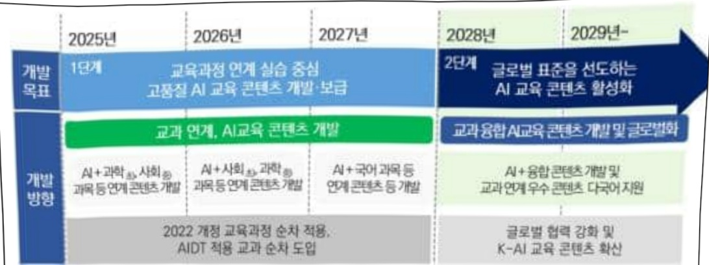
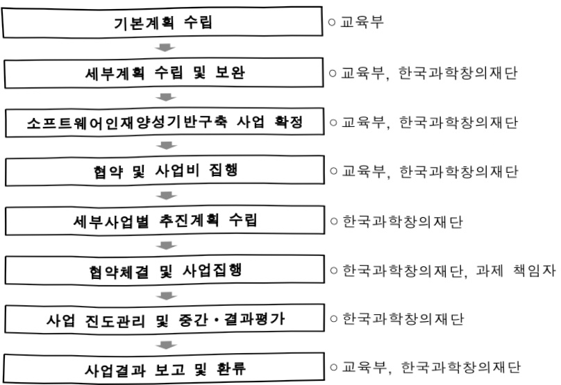

# 소프트웨어인재양성기반구축

**해당 페이지**: PDF 1875 ~ 1882 쪽 해당

**부처**: 교육부
**분야**: 교육
**회계유형**: 일반회계
**2026 확정예산**: 1962.0 백만원
**전년대비 증감률**: None%
**AI 도메인**: 교육/인재

---

<table border=1 style='margin: auto; word-wrap: break-word;'><tr><td style='text-align: center; word-wrap: break-word;'>사 업 명</td></tr><tr><td style='text-align: center; word-wrap: break-word;'>(6) 소프트웨어인재양성기반구축 (1031-313)</td></tr></table>

## □ 사업 코드 정보

<table border=1 style='margin: auto; word-wrap: break-word;'><tr><td style='text-align: center; word-wrap: break-word;'>구분</td><td style='text-align: center; word-wrap: break-word;'>회계</td><td style='text-align: center; word-wrap: break-word;'>소관</td><td style='text-align: center; word-wrap: break-word;'>실국(기관)</td><td style='text-align: center; word-wrap: break-word;'>계정</td><td style='text-align: center; word-wrap: break-word;'>분야</td><td style='text-align: center; word-wrap: break-word;'>부문</td></tr><tr><td style='text-align: center; word-wrap: break-word;'>코드</td><td rowspan="2">일반회계</td><td rowspan="2">교육부</td><td rowspan="2">인공지능인재 지원국</td><td rowspan="2"></td><td style='text-align: center; word-wrap: break-word;'>050</td><td style='text-align: center; word-wrap: break-word;'>051</td></tr><tr><td style='text-align: center; word-wrap: break-word;'>명칭</td><td style='text-align: center; word-wrap: break-word;'>교육</td><td style='text-align: center; word-wrap: break-word;'>유아 및 초중등교육</td></tr></table>

<table border=1 style='margin: auto; word-wrap: break-word;'><tr><td style='text-align: center; word-wrap: break-word;'>구분</td><td style='text-align: center; word-wrap: break-word;'>프로그램</td><td style='text-align: center; word-wrap: break-word;'>단위사업</td><td style='text-align: center; word-wrap: break-word;'>세부사업</td></tr><tr><td style='text-align: center; word-wrap: break-word;'>코드</td><td style='text-align: center; word-wrap: break-word;'>1000</td><td style='text-align: center; word-wrap: break-word;'>1031</td><td style='text-align: center; word-wrap: break-word;'>313</td></tr><tr><td style='text-align: center; word-wrap: break-word;'>명칭</td><td style='text-align: center; word-wrap: break-word;'>학교교육과정 운영지원</td><td style='text-align: center; word-wrap: break-word;'>학교교육과정 운영지원</td><td style='text-align: center; word-wrap: break-word;'>소프트웨어인재양성기반구축</td></tr></table>

□ 사업 성격

<table border=1 style='margin: auto; word-wrap: break-word;'><tr><td rowspan="2">신규</td><td rowspan="2">계속</td><td rowspan="2">완료</td><td rowspan="2">예비타당성 실시여부</td><td rowspan="2">총사업비 관리대상</td><td rowspan="2">총액계상 예산사업</td><td style='text-align: center; word-wrap: break-word;'>사업소관 변경정보</td></tr><tr><td style='text-align: center; word-wrap: break-word;'>2025예산 시 소관</td></tr><tr><td style='text-align: center; word-wrap: break-word;'></td><td style='text-align: center; word-wrap: break-word;'>○</td><td style='text-align: center; word-wrap: break-word;'></td><td style='text-align: center; word-wrap: break-word;'></td><td style='text-align: center; word-wrap: break-word;'></td><td style='text-align: center; word-wrap: break-word;'></td><td style='text-align: center; word-wrap: break-word;'></td></tr></table>

□ 사업 지원 형태 및 지원을

<table border=1 style='margin: auto; word-wrap: break-word;'><tr><td style='text-align: center; word-wrap: break-word;'>직접</td><td style='text-align: center; word-wrap: break-word;'>출자</td><td style='text-align: center; word-wrap: break-word;'>출연</td><td style='text-align: center; word-wrap: break-word;'>보조</td><td style='text-align: center; word-wrap: break-word;'>융자</td><td style='text-align: center; word-wrap: break-word;'>국고보조율(%)</td><td style='text-align: center; word-wrap: break-word;'>융자율(%)</td></tr><tr><td style='text-align: center; word-wrap: break-word;'></td><td style='text-align: center; word-wrap: break-word;'></td><td style='text-align: center; word-wrap: break-word;'>○</td><td style='text-align: center; word-wrap: break-word;'></td><td style='text-align: center; word-wrap: break-word;'></td><td style='text-align: center; word-wrap: break-word;'></td><td style='text-align: center; word-wrap: break-word;'></td></tr></table>

## □ 사업 소관부처 및 시행주체

<table border=1 style='margin: auto; word-wrap: break-word;'><tr><td style='text-align: center; word-wrap: break-word;'>사업명</td><td colspan="2">구분</td></tr><tr><td rowspan="3">소프트웨어 인재양성 기반구축</td><td rowspan="2">소관부처</td><td style='text-align: center; word-wrap: break-word;'>인공지능인재 지원국</td></tr><tr><td style='text-align: center; word-wrap: break-word;'>인공지능교육 진흥과</td></tr><tr><td style='text-align: center; word-wrap: break-word;'>사업시행주체</td><td style='text-align: center; word-wrap: break-word;'>한국과학창의재단 AI융합교육실</td></tr></table>

---

### 가. 예산 총괄표

(단위: 백만원, %)

<table border=1 style='margin: auto; word-wrap: break-word;'><tr><td rowspan="2">사업명</td><td rowspan="2">2024년 결산</td><td colspan="2">2025년 예산</td><td colspan="2">2026년 예산</td><td rowspan="2">증감(B-A)</td><td rowspan="2">(B-A)/A</td></tr><tr><td style='text-align: center; word-wrap: break-word;'>본예산</td><td style='text-align: center; word-wrap: break-word;'>추경(A)</td><td style='text-align: center; word-wrap: break-word;'>요구안</td><td style='text-align: center; word-wrap: break-word;'>본예산(B)</td></tr><tr><td style='text-align: center; word-wrap: break-word;'>소프트웨어인재양성기반구축</td><td style='text-align: center; word-wrap: break-word;'>1,962</td><td style='text-align: center; word-wrap: break-word;'>1,962</td><td style='text-align: center; word-wrap: break-word;'>1,962</td><td style='text-align: center; word-wrap: break-word;'>1,962</td><td style='text-align: center; word-wrap: break-word;'>1,962</td><td style='text-align: center; word-wrap: break-word;'>-</td><td style='text-align: center; word-wrap: break-word;'>-</td></tr></table>

□ 기능별(내역사업별) 예산 내역

(단위:백만원)

<table border=1 style='margin: auto; word-wrap: break-word;'><tr><td rowspan="2"></td><td colspan="5">2024</td><td colspan="5">2025</td><td rowspan="2">2026 叁</td></tr><tr><td style='text-align: center; word-wrap: break-word;'>叁</td><td style='text-align: center; word-wrap: break-word;'>叁</td><td style='text-align: center; word-wrap: break-word;'>叁</td><td style='text-align: center; word-wrap: break-word;'>叁</td><td style='text-align: center; word-wrap: break-word;'>叁</td><td style='text-align: center; word-wrap: break-word;'>叁</td><td style='text-align: center; word-wrap: break-word;'>叁</td><td style='text-align: center; word-wrap: break-word;'>叁</td><td style='text-align: center; word-wrap: break-word;'>叁</td><td style='text-align: center; word-wrap: break-word;'>叁</td></tr><tr><td style='text-align: center; word-wrap: break-word;'>○ 기능별 분류(합계)</td><td style='text-align: center; word-wrap: break-word;'>1,962</td><td style='text-align: center; word-wrap: break-word;'>1,962</td><td style='text-align: center; word-wrap: break-word;'>1,962</td><td style='text-align: center; word-wrap: break-word;'>-</td><td style='text-align: center; word-wrap: break-word;'>-</td><td style='text-align: center; word-wrap: break-word;'>1,962</td><td style='text-align: center; word-wrap: break-word;'>1,962</td><td style='text-align: center; word-wrap: break-word;'>1,962</td><td style='text-align: center; word-wrap: break-word;'>-</td><td style='text-align: center; word-wrap: break-word;'>-</td><td style='text-align: center; word-wrap: break-word;'>1,962</td></tr><tr><td style='text-align: center; word-wrap: break-word;'>· 초·중등 SW융합 교육 강화</td><td style='text-align: center; word-wrap: break-word;'>1,962</td><td style='text-align: center; word-wrap: break-word;'>1,962</td><td style='text-align: center; word-wrap: break-word;'>1,962</td><td style='text-align: center; word-wrap: break-word;'>-</td><td style='text-align: center; word-wrap: break-word;'>-</td><td style='text-align: center; word-wrap: break-word;'>1,962</td><td style='text-align: center; word-wrap: break-word;'>1,962</td><td style='text-align: center; word-wrap: break-word;'>1,962</td><td style='text-align: center; word-wrap: break-word;'>-</td><td style='text-align: center; word-wrap: break-word;'>-</td><td style='text-align: center; word-wrap: break-word;'>1,962</td></tr></table>

### 나. 사업설명자료

## 1 ) 사업목적·내용

- (초·중등 SW융합교육 강화) 동 사업은 미래 소프트웨어(SW) 인재양성에 대한 국가

사회적 요구와 초·중등 정보교육에 대한 국가 책무성 증대에 따라 초·중등학교

SW·AI 교육을 강화하여 체계적인 디지털 인공지능 교육 기반 마련하는 것임

## 2 ) 사업개요

① 법령상 근거 및 조항 적시

- 범정부 정책 추진

SW중심사회를 위한 인재양성 추진 계획('15.7.21. 교육부·미래부 국무회의 보고)

SW교육 활성화 기본계획('16.12.12. 사회관계장관회의)

0 지능정보사회에 대응한 중장기 교육정책의 방향과 전략('16.12.22)

°2017년 경제정책방향('16.12.29. 경제관계장관회의)

° 세3자 과학기술인재 융성·지원 기본계획 '17년 시행계획('17.3.14) 등

° 인공지능 국가 전략 (19.12)

과학·수학·정보·융합교육 종합 계획 (2020~2024) ('20.5.27.)

° 전국민 AI·SW교육 확산 방안 ('20.8.7.)

관계부처 합동 인공지능시대 교육정책 방향과 핵심과제 발표('20.11)

---

☐ 교육부 [2022 개정 교육과정] 고시(22.12.)

☐ 과학·수학·정보·융합교육 종합 계획 (2025~2029) ('24.12.)

- 과학·수학·정보교육진흥법」(18년) 시행에 따라, 국가의 정보(SW)교육 책무강화

제5조(국가와 지방자치단체의 임무) ① 국가와 지방자치단체는 과학·수학·정보교육을 진흥하기 위하여 이 법이나 그 밖의 관계 법령에서 정하는 바에 따라 다음 각 호의 사항에 관한 시책을 마련하여야 한다.

1. 과학·수학·정보 교육에 관한 종합계획의 수립

2. 과학·수학·정보 교원의 양성·확보·처우 및 전문성 강화

3. 과학·수학·정보 교육을 위한 교재·교육자료(소프트웨어를 포함한다. 이하 같다)의 개발·보급 및 실험·실습 시설의 확충

4. 과학·수학·정보의 교육과정과 교육프로그램 개발

제9조(재정지원 등) ① 국가와 지방자치단체는 과학·수학·정보교육기관 및 교육 연구기관에 대하여 예산의 범위 내에서 과학·수학·정보 교육에 필요한 재정 지원을 할 수 있다.

② 국가와 지방자치단체는 학생 및 교원의 과학·수학·정보 교육에 관한 탐구활동과 연구활동을

지원하기 위하여 관련 법인 또는 단체에 대하여 예산의 범위에서 필요한 경비를 보조할 수 있다.

-디지털 대전환에 대응한 SW·AI 및 디지털 교육기반 조성을 위해 새 정부 국정과제에 포함

### 81.100 만 디지털인재 양성

0 (초·중등 SW·AI 교육 필수화) 정보교육 시수 확대 등 체계적 디지털 기반교육을 위한 교육과정 전면 개정, 에듀테크 활용 활성화 및 신기술적용 교육콘텐츠 개발

ㅇ (디지털 교육격차 해소) 초등단계부터 격차가 발생하지 않도록 디지털튜터배치 지원, (가칭)디지털 문제해결센터 운영 등 생애주기별 디지털 역량 강화

## ② 추진경위

- 교육부「초·중능학교 SW교육 강화 방안」 발표(교육부, '14.7월)

- 교육부 [2015 문·이과 통합형 교육과정 총론 주요사항] 발표('14.9월)

- 교육부 [2015 개정 교육과정] 고시를 통해 초·중학교 SW교육 필수화 발표('15.9.23.)

- 교육부 · 미래부, 「SW교육 활성화 기본계획」 사회관계장관회의 보고('16.12.12.)

- 과학·수학·정보교육 진흥법 개정('17.10월) 및 시행('18.4월)

- 범부처「인공지능 국가 전략」 발표('19.12월)

- 교육부 과학·수학·정보·융합교육 종합 계획 (2020~2024) 벌표('20.5월)

- 범부처 「전국민 SW·AI교육 확산 방안」 발표('20.8월)

- 범부처 「인공지능시대 교육정책 방향과 핵심과제」 발표('20.11월)

- 2022 개정 교육과정 총론 주요사항 밭표('21.11월)

- 교육부「디지털 인재양성 종합방안」 발표('22.8월)

---

- 교육부 [2022 개정 교육과정] 고시('22.12.)

- 교육부「디지털 기반 교육혁신 방안」 발표('23.2.)

- 교육부 「과학·수학·정보·융합교육 종합 계획 (2025~2029)」 발표('24.12월)

## □ 주요내용

① 사업규모

- 총사업비(해당되는 경우에만 기재) : 해당없음

- 사업기간 : '18년~(계속)

- 최근 5년 간 투입된 사업비(예산액기준, 추경편성한 연도에는 추경포함)

(단위 : 백만원)

<table border=1 style='margin: auto; word-wrap: break-word;'><tr><td style='text-align: center; word-wrap: break-word;'>연도</td><td style='text-align: center; word-wrap: break-word;'>2022</td><td style='text-align: center; word-wrap: break-word;'>2023</td><td style='text-align: center; word-wrap: break-word;'>2024</td><td style='text-align: center; word-wrap: break-word;'>2025</td><td style='text-align: center; word-wrap: break-word;'>2026</td></tr><tr><td style='text-align: center; word-wrap: break-word;'>사업비</td><td style='text-align: center; word-wrap: break-word;'>2,042</td><td style='text-align: center; word-wrap: break-word;'>2,552</td><td style='text-align: center; word-wrap: break-word;'>1,962</td><td style='text-align: center; word-wrap: break-word;'>1,962</td><td style='text-align: center; word-wrap: break-word;'>1,962</td></tr></table>

② 사업추진체계

- 사업시행방법 : 출연

- 사업시행주체 : 한국과학창의재단

- 사업 수혜자 : 초·중등학교 학생·교사

- 보조, 융자, 출연, 출자 등의 경우 보조·융자 등 지원 비율 및 법적근거

<table border=1 style='margin: auto; word-wrap: break-word;'><tr><td style='text-align: center; word-wrap: break-word;'>대역사업명</td><td style='text-align: center; word-wrap: break-word;'>구분</td><td style='text-align: center; word-wrap: break-word;'>출연 기관명</td><td style='text-align: center; word-wrap: break-word;'>지원 금액 (2026예산)</td><td style='text-align: center; word-wrap: break-word;'>지원 비율(%)</td><td style='text-align: center; word-wrap: break-word;'>보조율 법적근거 (해당 조항)</td></tr><tr><td style='text-align: center; word-wrap: break-word;'>초·중등 SW음합교육 강화</td><td style='text-align: center; word-wrap: break-word;'>출연</td><td style='text-align: center; word-wrap: break-word;'>한국과학 창의재단</td><td style='text-align: center; word-wrap: break-word;'>1,962</td><td style='text-align: center; word-wrap: break-word;'>100</td><td style='text-align: center; word-wrap: break-word;'>과학기술기본법 제30조, 제30조의2</td></tr></table>

## 3 ) 2026년도 예산 산출 근거

o 초·중등 SW융합교육 강화 : (25) 1,962백만원 → (26) 1,962백만원

1) AI교육 표준 수립 및 디지털 소양 진단 기반 마련

- (요구) AI교육 기반 구축 정책연구를 추진하고, 안전한 AI 사용 가이드라인 개발을 위해 전년

(25) 수준의 예산 요구

- (산출) AI교육 표준 수립 연구 및 안전한 AI사용 가이드 라인 개발 : 2종 × 50백만원 = 100백만원

## 2 ) AI교육 플랫폼 구축·고도화

- (요구) 2022 개정 교육과정과 연계한 정보·AI 디지털 콘텐츠 개발로 교육과정 개정에 따른 교육 결손 해소 및 플랫폼 운영 활성화를 위해 전년('25) 수준의 예산 요구

- (산출) AI교육 콘텐츠 개발·운영 1식 × 1,862백만원 = 1,862백만원

---

## 2025 년도 및 2026년도 예산 산출 세부내역 비교

<table border=1 style='margin: auto; word-wrap: break-word;'><tr><td colspan="2">&#x27;25년 예산</td><td colspan="2">&#x27;26년 예산</td></tr><tr><td style='text-align: center; word-wrap: break-word;'>예산</td><td style='text-align: center; word-wrap: break-word;'>산출내역</td><td style='text-align: center; word-wrap: break-word;'>예산</td><td style='text-align: center; word-wrap: break-word;'>산출내역</td></tr><tr><td style='text-align: center; word-wrap: break-word;'>1,962,000</td><td style='text-align: center; word-wrap: break-word;'>○ 사업출연금(350-02): 1,962,000천원
- 초·중등 SW융합교육 강화: 1,962,000천원
가. 디지털 인공지능 교육 내실화(100,000천원)
· 2종×50,000천원=100,000천원
나. AI교육 플랫폼 구축 및 고도화(1,862,000천원)
· 1식 × 1,862,000천원 = 1,862,000천원</td><td style='text-align: center; word-wrap: break-word;'>1,962,000</td><td style='text-align: center; word-wrap: break-word;'>○ 사업출연금(350-02): 1,962,000천원
- 초·중등 SW융합교육 강화: 1,962,000천원
가. AI교육 기반 구축 정책연구 및 디지털 소양 함양 기반 마련(100,000천원)
· 2종×50,000천원=100,000천원
나. AI교육 플랫폼 구축 및 고도화(1,862,000천원)
· 1식 × 1,862,000천원 = 1,862,000천원</td></tr></table>

## 4 ) 사업효과

□ 사업영향, 산출물 성과지표 등

① 2022~2026년도 성과계획서 상 성과지표 및 최근 5년간 성과 달성도

---

<table border=1 style='margin: auto; word-wrap: break-word;'><tr><td style='text-align: center; word-wrap: break-word;'>성과지표</td><td style='text-align: center; word-wrap: break-word;'>구분</td><td style='text-align: center; word-wrap: break-word;'>2022</td><td style='text-align: center; word-wrap: break-word;'>2023</td><td style='text-align: center; word-wrap: break-word;'>2024</td><td style='text-align: center; word-wrap: break-word;'>2025</td><td style='text-align: center; word-wrap: break-word;'>2026</td><td style='text-align: center; word-wrap: break-word;'>2026 목표치산출근거</td><td style='text-align: center; word-wrap: break-word;'>측정산식(또는 측정방법)</td><td style='text-align: center; word-wrap: break-word;'>자료수집방법(또는 자료출처)</td></tr><tr><td rowspan="3">미래인재 양성지원 만족도(점)</td><td style='text-align: center; word-wrap: break-word;'>목표</td><td style='text-align: center; word-wrap: break-word;'>신규</td><td style='text-align: center; word-wrap: break-word;'>신규</td><td style='text-align: center; word-wrap: break-word;'>신규</td><td style='text-align: center; word-wrap: break-word;'>신규</td><td style='text-align: center; word-wrap: break-word;'>4.00</td><td rowspan="3">신규지표임을 고려하여 4.00점을 목표치로 설정하고 향후 점진적으로 상향설정하는 것을 검토</td><td rowspan="3">(AI교육 디지털 콘텐츠 학생만족도×0.5)+(AI교육 디지털 콘텐츠 교사만족도×0.5)※ 라커트 5점 척도</td><td rowspan="3">만족도 조사</td></tr><tr><td style='text-align: center; word-wrap: break-word;'>실적</td><td style='text-align: center; word-wrap: break-word;'>신규</td><td style='text-align: center; word-wrap: break-word;'>신규</td><td style='text-align: center; word-wrap: break-word;'>신규</td><td style='text-align: center; word-wrap: break-word;'>-</td><td style='text-align: center; word-wrap: break-word;'>-</td></tr><tr><td style='text-align: center; word-wrap: break-word;'>달성도</td><td style='text-align: center; word-wrap: break-word;'>-</td><td style='text-align: center; word-wrap: break-word;'>-</td><td style='text-align: center; word-wrap: break-word;'>-</td><td style='text-align: center; word-wrap: break-word;'>-</td><td style='text-align: center; word-wrap: break-word;'>-</td></tr><tr><td rowspan="3">정의·융합형정보교육 학생·교원만족도(점)</td><td style='text-align: center; word-wrap: break-word;'>목표</td><td style='text-align: center; word-wrap: break-word;'>신규</td><td style='text-align: center; word-wrap: break-word;'>3.5</td><td style='text-align: center; word-wrap: break-word;'>종료</td><td style='text-align: center; word-wrap: break-word;'>-</td><td style='text-align: center; word-wrap: break-word;'>-</td><td style='text-align: center; word-wrap: break-word;'>창의융합형정보교육실 활용 학생·교원 만족도 설문조사</td><td style='text-align: center; word-wrap: break-word;'>학생 및 교원 대상 만족도(5점)평균값</td><td style='text-align: center; word-wrap: break-word;'>창의융합형정보교육실 운영교설문조사</td></tr><tr><td style='text-align: center; word-wrap: break-word;'>실적</td><td style='text-align: center; word-wrap: break-word;'>-</td><td style='text-align: center; word-wrap: break-word;'>4.4</td><td style='text-align: center; word-wrap: break-word;'>-</td><td style='text-align: center; word-wrap: break-word;'>-</td><td style='text-align: center; word-wrap: break-word;'>-</td><td style='text-align: center; word-wrap: break-word;'></td><td style='text-align: center; word-wrap: break-word;'></td><td style='text-align: center; word-wrap: break-word;'></td></tr><tr><td style='text-align: center; word-wrap: break-word;'>달성도</td><td style='text-align: center; word-wrap: break-word;'>-</td><td style='text-align: center; word-wrap: break-word;'>125.7</td><td style='text-align: center; word-wrap: break-word;'>-</td><td style='text-align: center; word-wrap: break-word;'>-</td><td style='text-align: center; word-wrap: break-word;'>-</td><td style='text-align: center; word-wrap: break-word;'></td><td style='text-align: center; word-wrap: break-word;'></td><td style='text-align: center; word-wrap: break-word;'></td></tr><tr><td rowspan="3">AI교육 콘텐츠 서비스 수혜자 수(명)</td><td style='text-align: center; word-wrap: break-word;'>목표</td><td style='text-align: center; word-wrap: break-word;'>-</td><td style='text-align: center; word-wrap: break-word;'>신규</td><td style='text-align: center; word-wrap: break-word;'>40,000</td><td style='text-align: center; word-wrap: break-word;'>50,000</td><td style='text-align: center; word-wrap: break-word;'>60,000</td><td rowspan="3">‘AI교육 플랫폼 5개년 추진 계획에 따라 수립된 ’25년 수혜자 대비 20% 향상</td><td rowspan="3">AI교육 콘텐츠 서비스 수혜자 수취함</td><td rowspan="3">AI교육 콘텐츠 서비스 수혜자 수취함</td></tr><tr><td style='text-align: center; word-wrap: break-word;'>실적</td><td style='text-align: center; word-wrap: break-word;'>-</td><td style='text-align: center; word-wrap: break-word;'>-</td><td style='text-align: center; word-wrap: break-word;'>55,025</td><td style='text-align: center; word-wrap: break-word;'>-</td><td style='text-align: center; word-wrap: break-word;'>-</td></tr><tr><td style='text-align: center; word-wrap: break-word;'>달성도</td><td style='text-align: center; word-wrap: break-word;'>-</td><td style='text-align: center; word-wrap: break-word;'>-</td><td style='text-align: center; word-wrap: break-word;'>137.6</td><td style='text-align: center; word-wrap: break-word;'>-</td><td style='text-align: center; word-wrap: break-word;'>-</td></tr></table>

② 성과지표 이외의 연도별 사업추진 경과 및 실적

<table border=1 style='margin: auto; word-wrap: break-word;'><tr><td style='text-align: center; word-wrap: break-word;'>2022</td><td style='text-align: center; word-wrap: break-word;'>○ 초·중등 SW융합교육 강화 (3차년도) - 2022 개정 정보과 교과목* 각론 최종안 개발 2차연구 추진 * 중학교 정보, 고등학교 정보, 인공지능 기초, 데이터 과학, 소프트웨어와 생활, 정보과학 - &#x27;22 창의 융합형 정보교육실 모델학교 운영(국립 부설교, 총 16개교) - 수학·과학 등 교과 연계 AI융합 콘텐츠 개발 및 기개발 콘텐츠 활용 시범 운영</td></tr><tr><td style='text-align: center; word-wrap: break-word;'>2023</td><td style='text-align: center; word-wrap: break-word;'>○ 초·중등 SW융합교육 강화 (4차년도 추진 중) - 2022 개정 교육과정에 따른 정보과 시수 확보 방안을 고려한 정보과 교육과정 편성·운영 가이드 연구 및 제2차 정보교육 종합계획(&#x27;25~&#x27;29년)* 관련 기초연구 추진 * 제1차 정보교육 종합계획(&#x27;20~&#x27;24년) 후속으로 제2차 계획 수립 준비 - &#x27;23 창의 융합형 정보교육실 모델학교 운영(국립 부설교, 총 19개교) - 실생활 및 산업 등에 적용되고 있는 AI기술을 주제별로 구성하고, 초중등 AI교육을 위한 디지털 콘텐츠 개발</td></tr><tr><td style='text-align: center; word-wrap: break-word;'>2024</td><td style='text-align: center; word-wrap: break-word;'>○ 초·중등 SW융합교육 강화 (5차년도 추진 중) - 급변하는 사회에 모든 학생이 주도적으로 디지털 기초 소양을 함양할 수 있도록 내용체계 재구축 및 정보교육 방법, 인프라, 생태계 조성 전략 등을 포괄하는 제2차 정보교육 종합계획(&#x27;25~&#x27;29년) 수립 연구 추진 - 2022 개정 정보과 교육과정과 연계하여, 학교수업에서 학습 보조자료로 AI기술을 학습 및 실습할 수 있는 디지털 콘텐츠 개발</td></tr><tr><td style='text-align: center; word-wrap: break-word;'>2025</td><td style='text-align: center; word-wrap: break-word;'>○ 초·중등 SW융합교육 강화 (6차년도 추진 중) - 제2차 정보교육 종합계획(&#x27;25~&#x27;29) 수립 완료 - 초중등 인공지능 교육 강화 및 디지털 교육격차 해소를 위한 정책 실행 - 과학·사회 등 타교과와 연계한 융합형 AI 교육 콘텐츠 개발 - AI 교육 표준 연구 및 디지털 기초소양 관련 정책연구 추진</td></tr></table>

---

③ 향후(2026년도 이후) 기대효과 :

0 인공지능(AI)의 기초·기반 교육이 되는 초·중등 SW 융합 교육 강화를 통해 지식정보사회의 디지털 핵심 역량을 갖춘 미래 인재 양성

° 초·중등 AI 교육콘텐츠를 활용한 현장 AI 체험 수업 강화 등 학교 AI 교육 기반 마련을 통한 SW·AI 융합 인재 양성

5) 타당성조사 및 예비타당성조사 시행여부 및 결과 요지 : 해당없음

5) 타당성조사 및 예비타당성조사 시행여부 및 결과 요지 : 해당없음

6) 총사업비 대상사업 정보 : 해당없음

7) 사업 집행절차

8) 각종 평가 : 해당없음

---

### 다. 최근 4년간 결산내역

## 1 ) 결산표

☐ 부처 결산내역

(단위: 백만원, %)

<table border=1 style='margin: auto; word-wrap: break-word;'><tr><td rowspan="2">연도</td><td colspan="3">예산액</td><td style='text-align: center; word-wrap: break-word;'>예산원액</td><td style='text-align: center; word-wrap: break-word;'>집행액</td><td style='text-align: center; word-wrap: break-word;'>집행률</td><td rowspan="2">다음연도 이월액</td><td rowspan="2">불용액</td></tr><tr><td style='text-align: center; word-wrap: break-word;'>본예산</td><td style='text-align: center; word-wrap: break-word;'>추경 중감액</td><td style='text-align: center; word-wrap: break-word;'>추경</td><td style='text-align: center; word-wrap: break-word;'>(A)</td><td style='text-align: center; word-wrap: break-word;'>(B)</td><td style='text-align: center; word-wrap: break-word;'>(B/A)</td></tr><tr><td style='text-align: center; word-wrap: break-word;'>2022</td><td style='text-align: center; word-wrap: break-word;'>2,042</td><td style='text-align: center; word-wrap: break-word;'></td><td style='text-align: center; word-wrap: break-word;'>2,042</td><td style='text-align: center; word-wrap: break-word;'>2,042</td><td style='text-align: center; word-wrap: break-word;'>2,042</td><td style='text-align: center; word-wrap: break-word;'>100</td><td style='text-align: center; word-wrap: break-word;'></td><td style='text-align: center; word-wrap: break-word;'></td></tr><tr><td style='text-align: center; word-wrap: break-word;'>2023</td><td style='text-align: center; word-wrap: break-word;'>2,552</td><td style='text-align: center; word-wrap: break-word;'></td><td style='text-align: center; word-wrap: break-word;'>2,552</td><td style='text-align: center; word-wrap: break-word;'>2,552</td><td style='text-align: center; word-wrap: break-word;'>2,540</td><td style='text-align: center; word-wrap: break-word;'>99.5</td><td style='text-align: center; word-wrap: break-word;'></td><td style='text-align: center; word-wrap: break-word;'></td></tr><tr><td style='text-align: center; word-wrap: break-word;'>2024</td><td style='text-align: center; word-wrap: break-word;'>1,962</td><td style='text-align: center; word-wrap: break-word;'></td><td style='text-align: center; word-wrap: break-word;'>1,962</td><td style='text-align: center; word-wrap: break-word;'>1,962</td><td style='text-align: center; word-wrap: break-word;'>1,962</td><td style='text-align: center; word-wrap: break-word;'>100</td><td style='text-align: center; word-wrap: break-word;'></td><td style='text-align: center; word-wrap: break-word;'></td></tr><tr><td style='text-align: center; word-wrap: break-word;'>2025</td><td style='text-align: center; word-wrap: break-word;'>1,962</td><td style='text-align: center; word-wrap: break-word;'></td><td style='text-align: center; word-wrap: break-word;'>1,962</td><td style='text-align: center; word-wrap: break-word;'>1,962</td><td style='text-align: center; word-wrap: break-word;'>1,962</td><td style='text-align: center; word-wrap: break-word;'>100</td><td style='text-align: center; word-wrap: break-word;'></td><td style='text-align: center; word-wrap: break-word;'></td></tr></table>

## 2 ) 주요 결산사항

2022~2025년 결산 주요 지적사항 및 시정요구사항

<table border=1 style='margin: auto; word-wrap: break-word;'><tr><td style='text-align: center; word-wrap: break-word;'>2022</td><td style='text-align: center; word-wrap: break-word;'>100% 집행 완료 및 이월액·불용액 없음</td></tr><tr><td style='text-align: center; word-wrap: break-word;'>2023</td><td style='text-align: center; word-wrap: break-word;'>100% 집행 완료 및 이월액·불용액 없음</td></tr><tr><td style='text-align: center; word-wrap: break-word;'>2024</td><td style='text-align: center; word-wrap: break-word;'>100% 집행 완료 및 이월액·불용액 없음</td></tr><tr><td style='text-align: center; word-wrap: break-word;'>2025</td><td style='text-align: center; word-wrap: break-word;'>해당없음</td></tr></table>

□ 2025년 이·전용 등 세부내역 : 해당없음

---

### 원본 PDF 크롭 이미지

