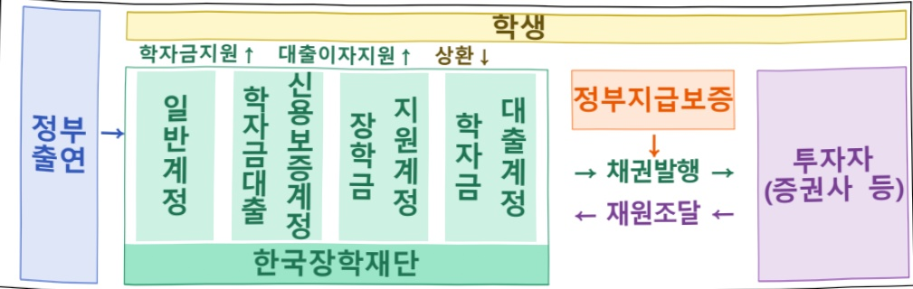

# 한국장학재단 출연

**해당 페이지**: PDF 1898 ~ 1906 쪽 해당

**부처**: 교육부
**분야**: 교육
**회계유형**: 고등·평생교육 지원특별회계
**2026 확정예산**: 421041.0 백만원
**전년대비 증감률**: 3.2%
**AI 도메인**: 교육/인재

---

<table border=1 style='margin: auto; word-wrap: break-word;'><tr><td style='text-align: center; word-wrap: break-word;'>사 업 명</td></tr><tr><td style='text-align: center; word-wrap: break-word;'>(35) 한국장학재단 출연 (2638-300)</td></tr></table>

□ 사업 코드 정보

<table border=1 style='margin: auto; word-wrap: break-word;'><tr><td style='text-align: center; word-wrap: break-word;'>구분</td><td style='text-align: center; word-wrap: break-word;'>회계</td><td style='text-align: center; word-wrap: break-word;'>소관</td><td style='text-align: center; word-wrap: break-word;'>실국(기관)</td><td style='text-align: center; word-wrap: break-word;'>계정</td><td style='text-align: center; word-wrap: break-word;'>분야</td><td style='text-align: center; word-wrap: break-word;'>부문</td></tr><tr><td style='text-align: center; word-wrap: break-word;'>코드</td><td style='text-align: center; word-wrap: break-word;'>고등·평생교육</td><td rowspan="2">교육부</td><td rowspan="2">고등평생정책실평생교육지원관</td><td rowspan="2"></td><td style='text-align: center; word-wrap: break-word;'>050</td><td style='text-align: center; word-wrap: break-word;'>052</td></tr><tr><td style='text-align: center; word-wrap: break-word;'>명칭</td><td style='text-align: center; word-wrap: break-word;'>지원특별회계</td><td style='text-align: center; word-wrap: break-word;'>교육</td><td style='text-align: center; word-wrap: break-word;'>고등교육</td></tr></table>

<table border=1 style='margin: auto; word-wrap: break-word;'><tr><td style='text-align: center; word-wrap: break-word;'>구분</td><td style='text-align: center; word-wrap: break-word;'>프로그램</td><td style='text-align: center; word-wrap: break-word;'>단위사업</td><td style='text-align: center; word-wrap: break-word;'>세부사업</td></tr><tr><td style='text-align: center; word-wrap: break-word;'>코드</td><td style='text-align: center; word-wrap: break-word;'>2600</td><td style='text-align: center; word-wrap: break-word;'>2638</td><td style='text-align: center; word-wrap: break-word;'>300</td></tr><tr><td style='text-align: center; word-wrap: break-word;'>명칭</td><td style='text-align: center; word-wrap: break-word;'>맞춤형 국가장학제도 기반조성</td><td style='text-align: center; word-wrap: break-word;'>한국장학재단 출연</td><td style='text-align: center; word-wrap: break-word;'>한국장학재단 출연</td></tr></table>

□ 사업 성격

<table border=1 style='margin: auto; word-wrap: break-word;'><tr><td rowspan="2">신규</td><td rowspan="2">계속</td><td rowspan="2">완료</td><td rowspan="2">예비타당성 실시여부</td><td rowspan="2">총사업비 관리대상</td><td rowspan="2">총액계상 예산사업</td><td style='text-align: center; word-wrap: break-word;'>사업소관 변경정보</td></tr><tr><td style='text-align: center; word-wrap: break-word;'>2025예산 시 소관</td></tr><tr><td style='text-align: center; word-wrap: break-word;'></td><td style='text-align: center; word-wrap: break-word;'>○</td><td style='text-align: center; word-wrap: break-word;'></td><td style='text-align: center; word-wrap: break-word;'></td><td style='text-align: center; word-wrap: break-word;'></td><td style='text-align: center; word-wrap: break-word;'></td><td style='text-align: center; word-wrap: break-word;'></td></tr></table>

□ 사업 지원 형태 및 지원을

<table border=1 style='margin: auto; word-wrap: break-word;'><tr><td style='text-align: center; word-wrap: break-word;'>직접</td><td style='text-align: center; word-wrap: break-word;'>출자</td><td style='text-align: center; word-wrap: break-word;'>출연</td><td style='text-align: center; word-wrap: break-word;'>보조</td><td style='text-align: center; word-wrap: break-word;'>융자</td><td style='text-align: center; word-wrap: break-word;'>국고보조율(%)</td><td style='text-align: center; word-wrap: break-word;'>융자율(%)</td></tr><tr><td style='text-align: center; word-wrap: break-word;'></td><td style='text-align: center; word-wrap: break-word;'></td><td style='text-align: center; word-wrap: break-word;'>○</td><td style='text-align: center; word-wrap: break-word;'></td><td style='text-align: center; word-wrap: break-word;'></td><td style='text-align: center; word-wrap: break-word;'></td><td style='text-align: center; word-wrap: break-word;'></td></tr></table>

□ 사업 소관부처 및 시행주체

<table border=1 style='margin: auto; word-wrap: break-word;'><tr><td style='text-align: center; word-wrap: break-word;'>사업명</td><td colspan="2">구분</td></tr><tr><td rowspan="3">한국장학재단 출연</td><td rowspan="2">소관부처</td><td style='text-align: center; word-wrap: break-word;'>평생교육지원관</td></tr><tr><td style='text-align: center; word-wrap: break-word;'>청년장학지원과</td></tr><tr><td style='text-align: center; word-wrap: break-word;'>사업시행주체</td><td style='text-align: center; word-wrap: break-word;'>한국장학재단 예산팀</td></tr></table>

---

### 가.예산 총괄표

(단위: 백만원, %)

<table border=1 style='margin: auto; word-wrap: break-word;'><tr><td rowspan="2">사업명</td><td rowspan="2">2024년 결산</td><td colspan="2">2025년 예산</td><td colspan="2">2026년 예산</td><td rowspan="2">증감 (B-A)</td><td rowspan="2">(B-A)/A</td></tr><tr><td style='text-align: center; word-wrap: break-word;'>본예산</td><td style='text-align: center; word-wrap: break-word;'>추경(A)</td><td style='text-align: center; word-wrap: break-word;'>요구안</td><td style='text-align: center; word-wrap: break-word;'>본예산(B)</td></tr><tr><td style='text-align: center; word-wrap: break-word;'>한국장학재단 출연</td><td style='text-align: center; word-wrap: break-word;'>367,382</td><td style='text-align: center; word-wrap: break-word;'>407,913</td><td style='text-align: center; word-wrap: break-word;'>407,913</td><td style='text-align: center; word-wrap: break-word;'>421,051</td><td style='text-align: center; word-wrap: break-word;'>421,041</td><td style='text-align: center; word-wrap: break-word;'>13,128</td><td style='text-align: center; word-wrap: break-word;'>3.2</td></tr></table>

□ 기능별(내역사업별) 예산 내역

(단위:백만원)

<table border=1 style='margin: auto; word-wrap: break-word;'><tr><td rowspan="2"></td><td colspan="5">2024</td><td colspan="5">2025</td><td rowspan="2">2026예산</td></tr><tr><td style='text-align: center; word-wrap: break-word;'>예산액(추경)</td><td style='text-align: center; word-wrap: break-word;'>예산현액</td><td style='text-align: center; word-wrap: break-word;'>집행액</td><td style='text-align: center; word-wrap: break-word;'>이월액</td><td style='text-align: center; word-wrap: break-word;'>불용액</td><td style='text-align: center; word-wrap: break-word;'>예산액(추경)</td><td style='text-align: center; word-wrap: break-word;'>예산현액</td><td style='text-align: center; word-wrap: break-word;'>집행액</td><td style='text-align: center; word-wrap: break-word;'>이월액</td><td style='text-align: center; word-wrap: break-word;'>불용액</td></tr><tr><td style='text-align: center; word-wrap: break-word;'>○ 기능별 분류(합계)</td><td style='text-align: center; word-wrap: break-word;'>367,382</td><td style='text-align: center; word-wrap: break-word;'>367,382</td><td style='text-align: center; word-wrap: break-word;'>367,382</td><td style='text-align: center; word-wrap: break-word;'>-</td><td style='text-align: center; word-wrap: break-word;'>-</td><td style='text-align: center; word-wrap: break-word;'>407,913</td><td style='text-align: center; word-wrap: break-word;'>407,913</td><td style='text-align: center; word-wrap: break-word;'>407,913</td><td style='text-align: center; word-wrap: break-word;'>-</td><td style='text-align: center; word-wrap: break-word;'>-</td><td style='text-align: center; word-wrap: break-word;'>421,041</td></tr><tr><td style='text-align: center; word-wrap: break-word;'>• 취업 후 상환 학자금대출 채권이자</td><td style='text-align: center; word-wrap: break-word;'>209,883</td><td style='text-align: center; word-wrap: break-word;'>201,812</td><td style='text-align: center; word-wrap: break-word;'>201,812</td><td style='text-align: center; word-wrap: break-word;'>-</td><td style='text-align: center; word-wrap: break-word;'>-</td><td style='text-align: center; word-wrap: break-word;'>224,733</td><td style='text-align: center; word-wrap: break-word;'>223,361</td><td style='text-align: center; word-wrap: break-word;'>223,361</td><td style='text-align: center; word-wrap: break-word;'>-</td><td style='text-align: center; word-wrap: break-word;'>-</td><td style='text-align: center; word-wrap: break-word;'>227,267</td></tr><tr><td style='text-align: center; word-wrap: break-word;'>• 일반상환 학자금대출 채권 이차보전</td><td style='text-align: center; word-wrap: break-word;'>26,684</td><td style='text-align: center; word-wrap: break-word;'>32,835</td><td style='text-align: center; word-wrap: break-word;'>32,835</td><td style='text-align: center; word-wrap: break-word;'>-</td><td style='text-align: center; word-wrap: break-word;'>-</td><td style='text-align: center; word-wrap: break-word;'>46,500</td><td style='text-align: center; word-wrap: break-word;'>45,801</td><td style='text-align: center; word-wrap: break-word;'>45,801</td><td style='text-align: center; word-wrap: break-word;'>-</td><td style='text-align: center; word-wrap: break-word;'>-</td><td style='text-align: center; word-wrap: break-word;'>51,451</td></tr><tr><td style='text-align: center; word-wrap: break-word;'>• 일반상환 학자금대출 추가지원</td><td style='text-align: center; word-wrap: break-word;'>9,919</td><td style='text-align: center; word-wrap: break-word;'>11,839</td><td style='text-align: center; word-wrap: break-word;'>11,839</td><td style='text-align: center; word-wrap: break-word;'>-</td><td style='text-align: center; word-wrap: break-word;'>-</td><td style='text-align: center; word-wrap: break-word;'>11,254</td><td style='text-align: center; word-wrap: break-word;'>12,033</td><td style='text-align: center; word-wrap: break-word;'>12,033</td><td style='text-align: center; word-wrap: break-word;'>-</td><td style='text-align: center; word-wrap: break-word;'>-</td><td style='text-align: center; word-wrap: break-word;'>11,777</td></tr><tr><td style='text-align: center; word-wrap: break-word;'>• 학자금대출 손실보전금</td><td style='text-align: center; word-wrap: break-word;'>27,489</td><td style='text-align: center; word-wrap: break-word;'>27,489</td><td style='text-align: center; word-wrap: break-word;'>27,489</td><td style='text-align: center; word-wrap: break-word;'>-</td><td style='text-align: center; word-wrap: break-word;'>-</td><td style='text-align: center; word-wrap: break-word;'>27,315</td><td style='text-align: center; word-wrap: break-word;'>27,315</td><td style='text-align: center; word-wrap: break-word;'>27,315</td><td style='text-align: center; word-wrap: break-word;'>-</td><td style='text-align: center; word-wrap: break-word;'>-</td><td style='text-align: center; word-wrap: break-word;'>28,532</td></tr><tr><td style='text-align: center; word-wrap: break-word;'>• 고유사업비</td><td style='text-align: center; word-wrap: break-word;'>42,118</td><td style='text-align: center; word-wrap: break-word;'>42,118</td><td style='text-align: center; word-wrap: break-word;'>42,118</td><td style='text-align: center; word-wrap: break-word;'>-</td><td style='text-align: center; word-wrap: break-word;'>-</td><td style='text-align: center; word-wrap: break-word;'>41,854</td><td style='text-align: center; word-wrap: break-word;'>43,146</td><td style='text-align: center; word-wrap: break-word;'>43,146</td><td style='text-align: center; word-wrap: break-word;'>-</td><td style='text-align: center; word-wrap: break-word;'>-</td><td style='text-align: center; word-wrap: break-word;'>43,993</td></tr><tr><td style='text-align: center; word-wrap: break-word;'>• 재단운영비</td><td style='text-align: center; word-wrap: break-word;'>51,289</td><td style='text-align: center; word-wrap: break-word;'>51,289</td><td style='text-align: center; word-wrap: break-word;'>51,289</td><td style='text-align: center; word-wrap: break-word;'>-</td><td style='text-align: center; word-wrap: break-word;'>-</td><td style='text-align: center; word-wrap: break-word;'>56,257</td><td style='text-align: center; word-wrap: break-word;'>56,257</td><td style='text-align: center; word-wrap: break-word;'>56,257</td><td style='text-align: center; word-wrap: break-word;'>-</td><td style='text-align: center; word-wrap: break-word;'>-</td><td style='text-align: center; word-wrap: break-word;'>58,021</td></tr></table>

### 나.사업설명자료

## 1 ) 사업목적·내용

- (한국장학재단 출연) 한국장학재단을 통해 학자금 대출제도를 효과적으로 운영하여 경제적

여건과 관계없이 누구나 공부할 수 있는 여건 마련하고 재단 고유사업 및 운영비 지원

- (취업 후 상환 학자금 대출 채권이자) 대학(원)생 ICL공급을 위한 대출재원 조달을 위해 발행한 채권에 대한 이자비용 지원

- (일반상환학자금 대출 채권 이차보전) 조달채권과 대출의 금리차, 전환대출 이자지원

- (일반상환학자금 대출 추가지원) 일반상환학자금 대출자 이자면제, 특별상환유예 지원

- (학자금대출 손실보전금) 회수 불가능한 원금채권 손실 확정(상각)금에 대한 손실 보전

---

(고유사업비) 상담센터 운영, 학자금지원구간 산정체계 운영, 학자금 IT 구축·운영 등

맞춤형 국가장학제도 운영을 위한 기관 고유사업 및 운영비 지원

- (재단운영비) 한국장학재단 인건비 및 경상비 지원

## 2 ) 사업개요

☐ 사업근거 및 추진경위

① 법령상 근거 및 조항 적시

「한국장학재단 설립 등에 관한 법률」제17조(출연금) ① 정부는 재단의 시설, 운영 및 사업에 필요한 경비에 충당하기 위하여 매년 예산을 편성하여 재단에 출연금을 교부할 수 있다.

② 제1항에 따른 출연금의 교부·사용 및 관리에 필요한 사항은 대통령령으로 정한다.

② 추진경위

- '09. 5월 : 한국장학재단 설립('09.5.7.) 및 일반상환학자금대출 시행('09.7.~)

- '09. 11월 : 「취업 후 학자금 상환제도(ICL) 실행계획」 발표

- '10. 1월 : 「취업 후 학자금 상환 특별법」 제정 및 ICL 시행

- '12.~'21 : 군 복무자 이자면제, 일반상환학자금대출 특별상환유예, 저금리 전환대출 등

- '21. 6월 : 「취업 후 학자금 상환 특별법」 개정

※ '22년 대학원생 ICL 도입, 기초·차상위·다자녀 가구 이자면제 등 근거 마련

- '22. 5월 : 국정과제 '90-5 대학생·청년의 교육부담 완화' 선정

- '23. 12월 : 「취업 후 학자금 상환 특별법」 개정

※ 중위소득 이하자 등 취업 후 상환 학자금 대출 이자면제 등 근거 마련(24.7 시행)

## □ 주요내용

① 사업규모

- 총사업비(해당되는 경우에만 기재) : 해당없음

- 사업기간 : '09년~계속

-최근 5년 간 투입된 사업비(예산액기준, 추경편성한 연도에는 추경포함)

<table border=1 style='margin: auto; word-wrap: break-word;'><tr><td style='text-align: center; word-wrap: break-word;'>연도</td><td style='text-align: center; word-wrap: break-word;'>2022</td><td style='text-align: center; word-wrap: break-word;'>2023</td><td style='text-align: center; word-wrap: break-word;'>2024</td><td style='text-align: center; word-wrap: break-word;'>2025</td><td style='text-align: center; word-wrap: break-word;'>2026</td></tr><tr><td style='text-align: center; word-wrap: break-word;'>사업비</td><td style='text-align: center; word-wrap: break-word;'>201,437</td><td style='text-align: center; word-wrap: break-word;'>321,741</td><td style='text-align: center; word-wrap: break-word;'>367,382</td><td style='text-align: center; word-wrap: break-word;'>407,913</td><td style='text-align: center; word-wrap: break-word;'>421,041</td></tr></table>

② 사업추진체계

- 사업시행방법 : 출연

- 사업시행주체 : 한국장학재단

-사업 수혜자 : 대학(원)생

- 보조, 융자, 출연, 출자 등의 경우 보조·융자 등 지원 비율 및 법적근거

---

<table border=1 style='margin: auto; word-wrap: break-word;'><tr><td style='text-align: center; word-wrap: break-word;'>내역사업명</td><td style='text-align: center; word-wrap: break-word;'>구분</td><td style='text-align: center; word-wrap: break-word;'>피보조·피출연 등 기관명</td><td style='text-align: center; word-wrap: break-word;'>지원 금액 (2026예산)</td><td style='text-align: center; word-wrap: break-word;'>지원 비율(%)</td><td style='text-align: center; word-wrap: break-word;'>보조율 법적근거 (해당 조항)</td></tr><tr><td style='text-align: center; word-wrap: break-word;'>한국장학재단 출연</td><td style='text-align: center; word-wrap: break-word;'>출연</td><td style='text-align: center; word-wrap: break-word;'>한국장학 재단</td><td style='text-align: center; word-wrap: break-word;'>421,041</td><td style='text-align: center; word-wrap: break-word;'>100%</td><td style='text-align: center; word-wrap: break-word;'>「한국장학재단 설립 등에 관한 법률」제17조(출연금)</td></tr></table>

## 3 )2026년도 예산 산출 근거

□ 한국장학재단 출연 : (2025 본예산) 407,913백만원 → (2026 예산) 421,041백만원, +13,128

①취업 후 상환 학자금대출 채권 이자지원

:(2025 본예산) 224,733백만원 → (2026 예산) 227,267백만원(+2,534백만원)

- (요구) 취업후상환학자금 재원 조달을 위해 발행한 채권에 대한 이자비용 지원

- (산출) 연도별 채권평잔×조달금리=이자비용

<table border=1 style='margin: auto; word-wrap: break-word;'><tr><td colspan="4">2025년 본예산</td><td colspan="4">2026년 예산</td></tr><tr><td style='text-align: center; word-wrap: break-word;'>예산</td><td colspan="3">산출내역</td><td style='text-align: center; word-wrap: break-word;'>예산</td><td colspan="3">산출내역</td></tr><tr><td colspan="4">- 기존분(11~24년) 체권 이자: 156,870 백만원=5,271,493 백만원×2.97%</td><td colspan="4">- 기존분(11~25년) 체권 이자: 191,374 백만원 - &#x27;11~24년 체권 이자: 143,552 백만원=4,980,397 백만원×2.88%</td></tr><tr><td rowspan="15">224,733</td><td style='text-align: center; word-wrap: break-word;'>연도</td><td style='text-align: center; word-wrap: break-word;'>제권평찬(A)</td><td style='text-align: center; word-wrap: break-word;'>조달금리(B)</td><td style='text-align: center; word-wrap: break-word;'>이자비용(A×B)</td><td style='text-align: center; word-wrap: break-word;'>연도</td><td style='text-align: center; word-wrap: break-word;'>제권평찬(A)</td><td style='text-align: center; word-wrap: break-word;'>조달금리(B)</td></tr><tr><td style='text-align: center; word-wrap: break-word;'>&#x27;11년</td><td style='text-align: center; word-wrap: break-word;'>120,000</td><td style='text-align: center; word-wrap: break-word;'>4.47%</td><td style='text-align: center; word-wrap: break-word;'>5,374</td><td style='text-align: center; word-wrap: break-word;'>&#x27;11년</td><td style='text-align: center; word-wrap: break-word;'>43,397</td><td style='text-align: center; word-wrap: break-word;'>4.44%</td></tr><tr><td style='text-align: center; word-wrap: break-word;'>&#x27;12년</td><td style='text-align: center; word-wrap: break-word;'>160,000</td><td style='text-align: center; word-wrap: break-word;'>3.26%</td><td style='text-align: center; word-wrap: break-word;'>5,226</td><td style='text-align: center; word-wrap: break-word;'>&#x27;12년</td><td style='text-align: center; word-wrap: break-word;'>160,000</td><td style='text-align: center; word-wrap: break-word;'>3.11%</td></tr><tr><td style='text-align: center; word-wrap: break-word;'>&#x27;14년</td><td style='text-align: center; word-wrap: break-word;'>720,000</td><td style='text-align: center; word-wrap: break-word;'>3.31%</td><td style='text-align: center; word-wrap: break-word;'>23,842</td><td style='text-align: center; word-wrap: break-word;'>&#x27;14년</td><td style='text-align: center; word-wrap: break-word;'>564,274</td><td style='text-align: center; word-wrap: break-word;'>3.16%</td></tr><tr><td style='text-align: center; word-wrap: break-word;'>&#x27;15년</td><td style='text-align: center; word-wrap: break-word;'>971,575</td><td style='text-align: center; word-wrap: break-word;'>2.85%</td><td style='text-align: center; word-wrap: break-word;'>27,700</td><td style='text-align: center; word-wrap: break-word;'>&#x27;15년</td><td style='text-align: center; word-wrap: break-word;'>945,000</td><td style='text-align: center; word-wrap: break-word;'>2.78%</td></tr><tr><td style='text-align: center; word-wrap: break-word;'>&#x27;16년</td><td style='text-align: center; word-wrap: break-word;'>560,000</td><td style='text-align: center; word-wrap: break-word;'>1.98%</td><td style='text-align: center; word-wrap: break-word;'>11,098</td><td style='text-align: center; word-wrap: break-word;'>&#x27;16년</td><td style='text-align: center; word-wrap: break-word;'>546,356</td><td style='text-align: center; word-wrap: break-word;'>1.98%</td></tr><tr><td style='text-align: center; word-wrap: break-word;'>&#x27;17년</td><td style='text-align: center; word-wrap: break-word;'>190,000</td><td style='text-align: center; word-wrap: break-word;'>2.32%</td><td style='text-align: center; word-wrap: break-word;'>4,418</td><td style='text-align: center; word-wrap: break-word;'>&#x27;17년</td><td style='text-align: center; word-wrap: break-word;'>190,000</td><td style='text-align: center; word-wrap: break-word;'>2.32%</td></tr><tr><td style='text-align: center; word-wrap: break-word;'>&#x27;18년</td><td style='text-align: center; word-wrap: break-word;'>150,000</td><td style='text-align: center; word-wrap: break-word;'>2.76%</td><td style='text-align: center; word-wrap: break-word;'>4,150</td><td style='text-align: center; word-wrap: break-word;'>&#x27;18년</td><td style='text-align: center; word-wrap: break-word;'>150,000</td><td style='text-align: center; word-wrap: break-word;'>2.76%</td></tr><tr><td style='text-align: center; word-wrap: break-word;'>&#x27;19년</td><td style='text-align: center; word-wrap: break-word;'>260,000</td><td style='text-align: center; word-wrap: break-word;'>1.47%</td><td style='text-align: center; word-wrap: break-word;'>3,832</td><td style='text-align: center; word-wrap: break-word;'>&#x27;19년</td><td style='text-align: center; word-wrap: break-word;'>260,000</td><td style='text-align: center; word-wrap: break-word;'>1.47%</td></tr><tr><td style='text-align: center; word-wrap: break-word;'>&#x27;20년</td><td style='text-align: center; word-wrap: break-word;'>300,822</td><td style='text-align: center; word-wrap: break-word;'>1.49%</td><td style='text-align: center; word-wrap: break-word;'>4,492</td><td style='text-align: center; word-wrap: break-word;'>&#x27;20년</td><td style='text-align: center; word-wrap: break-word;'>150,000</td><td style='text-align: center; word-wrap: break-word;'>1.68%</td></tr><tr><td style='text-align: center; word-wrap: break-word;'>&#x27;21년</td><td style='text-align: center; word-wrap: break-word;'>310,000</td><td style='text-align: center; word-wrap: break-word;'>2.19%</td><td style='text-align: center; word-wrap: break-word;'>6,799</td><td style='text-align: center; word-wrap: break-word;'>&#x27;21년</td><td style='text-align: center; word-wrap: break-word;'>267,315</td><td style='text-align: center; word-wrap: break-word;'>2.20%</td></tr><tr><td style='text-align: center; word-wrap: break-word;'>&#x27;22년</td><td style='text-align: center; word-wrap: break-word;'>739,918</td><td style='text-align: center; word-wrap: break-word;'>4.17%</td><td style='text-align: center; word-wrap: break-word;'>30,865</td><td style='text-align: center; word-wrap: break-word;'>&#x27;22년</td><td style='text-align: center; word-wrap: break-word;'>370,000</td><td style='text-align: center; word-wrap: break-word;'>4.05%</td></tr><tr><td style='text-align: center; word-wrap: break-word;'>&#x27;23년</td><td style='text-align: center; word-wrap: break-word;'>789,178</td><td style='text-align: center; word-wrap: break-word;'>3.68%</td><td style='text-align: center; word-wrap: break-word;'>29,043</td><td style='text-align: center; word-wrap: break-word;'>&#x27;23년</td><td style='text-align: center; word-wrap: break-word;'>566,822</td><td style='text-align: center; word-wrap: break-word;'>3.76%</td></tr><tr><td style='text-align: center; word-wrap: break-word;'>함께</td><td style='text-align: center; word-wrap: break-word;'>5,271,493</td><td style='text-align: center; word-wrap: break-word;'>2.97%</td><td style='text-align: center; word-wrap: break-word;'>192,144</td><td style='text-align: center; word-wrap: break-word;'>&#x27;24년</td><td style='text-align: center; word-wrap: break-word;'>767,233</td><td style='text-align: center; word-wrap: break-word;'>3.22%</td></tr><tr><td style='text-align: center; word-wrap: break-word;'></td><td style='text-align: center; word-wrap: break-word;'></td><td style='text-align: center; word-wrap: break-word;'></td><td style='text-align: center; word-wrap: break-word;'></td><td style='text-align: center; word-wrap: break-word;'>함께</td><td style='text-align: center; word-wrap: break-word;'>4,980,397</td><td style='text-align: center; word-wrap: break-word;'>2.88%</td></tr><tr><td colspan="4">- &#x27;24년 체권 이자: 35,304 백만원=972,580 백만원×3.63%</td><td colspan="4">- &#x27;25년 체권 이자: 47,822 백만원=1,564,885 백만원×3.05%</td></tr><tr><td colspan="4">- 신규분(25년) 체권 이자: 32,589 백만원 = 1,564,885 백만원 × 3.57% × 7/12</td><td colspan="4">- 신규분(26년) 체권 이자: 32,970 백만원 = 1,766,273 백만원 × 3.20% × 7/12</td></tr><tr><td colspan="4">※ 취업 후 상환학자금대출 이자면제 37,870 백만원 포함</td><td colspan="4">- AI/SW 분야 학업장려대출(신설): 2,923 백만원 = 156,600 백만원 × 3.20% × 7/12</td></tr><tr><td colspan="4">(군이자 529, 기초·자상위 5,547, 다자녀 17,731, 중위소득 이하 9,844, 상환유예자 4,838 백만 원)</td><td colspan="4">※ 취업 후 상환학자금대출 이자면제 47,781 백만원 포함</td></tr></table>

②일반상환학자금 대출 채권 이차보전

: (2025 본예산) 46,500백만원 → (2026 예산) 51,451백만원 (+4,951백만원)

- (요구) 조달채권과 대출의 금리차, 전환대출 이자지원

- (산출) 연도별 재단채 잔액 × 금리차(조달금리-대출금리)

<table border=1 style='margin: auto; word-wrap: break-word;'><tr><td colspan="6">2025년 본예산</td><td colspan="6">2026년 예산</td></tr><tr><td style='text-align: center; word-wrap: break-word;'>예산</td><td colspan="5">산출내역</td><td style='text-align: center; word-wrap: break-word;'>예산</td><td colspan="5">산출내역</td></tr><tr><td rowspan="11">46,500</td><td colspan="5">○ 기준분(13~24년) 체권 이차보전 : 35,425백만원
- &#x27;13~23년 체권 이차보전 : 22,368백만원=1,095,178백만원×2.04%p</td><td colspan="6">○ 기준분(13~25년) 체권 이차보전 : 42,129백만원
- &#x27;13~24년 체권 이차보전 : 30,481백만원=1,620,548백만원×1.88%p</td></tr><tr><td style='text-align: center; word-wrap: break-word;'>연도</td><td style='text-align: center; word-wrap: break-word;'>대출금리(a)</td><td style='text-align: center; word-wrap: break-word;'>조달금리(b)</td><td style='text-align: center; word-wrap: break-word;'>금리자(a-ba)</td><td style='text-align: center; word-wrap: break-word;'>재권평전(B)</td><td style='text-align: center; word-wrap: break-word;'>이자비용(A-B)</td><td style='text-align: center; word-wrap: break-word;'>연도</td><td style='text-align: center; word-wrap: break-word;'>대출금리(a)</td><td style='text-align: center; word-wrap: break-word;'>조달금리(b)</td><td style='text-align: center; word-wrap: break-word;'>금리자(a-ba)</td><td style='text-align: center; word-wrap: break-word;'>재권평전(B)</td></tr><tr><td style='text-align: center; word-wrap: break-word;'>&#x27;13년</td><td style='text-align: center; word-wrap: break-word;'>2.90%</td><td style='text-align: center; word-wrap: break-word;'>3.17%</td><td style='text-align: center; word-wrap: break-word;'>0.27%p</td><td style='text-align: center; word-wrap: break-word;'>50,000</td><td style='text-align: center; word-wrap: break-word;'>135</td><td style='text-align: center; word-wrap: break-word;'>&#x27;13년</td><td style='text-align: center; word-wrap: break-word;'>2.90%</td><td style='text-align: center; word-wrap: break-word;'>3.17%</td><td style='text-align: center; word-wrap: break-word;'>0.27%p</td><td style='text-align: center; word-wrap: break-word;'>50,000</td></tr><tr><td style='text-align: center; word-wrap: break-word;'>&#x27;18년</td><td style='text-align: center; word-wrap: break-word;'>2.20%</td><td style='text-align: center; word-wrap: break-word;'>2.48%</td><td style='text-align: center; word-wrap: break-word;'>0.28%p</td><td style='text-align: center; word-wrap: break-word;'>130,000</td><td style='text-align: center; word-wrap: break-word;'>363</td><td style='text-align: center; word-wrap: break-word;'>&#x27;18년</td><td style='text-align: center; word-wrap: break-word;'>2.20%</td><td style='text-align: center; word-wrap: break-word;'>2.48%</td><td style='text-align: center; word-wrap: break-word;'>0.28%p</td><td style='text-align: center; word-wrap: break-word;'>130,000</td></tr><tr><td style='text-align: center; word-wrap: break-word;'>&#x27;22년</td><td style='text-align: center; word-wrap: break-word;'>1.70%</td><td style='text-align: center; word-wrap: break-word;'>5.13%</td><td style='text-align: center; word-wrap: break-word;'>2.77%p</td><td style='text-align: center; word-wrap: break-word;'>143,397</td><td style='text-align: center; word-wrap: break-word;'>3,970</td><td style='text-align: center; word-wrap: break-word;'>&#x27;22년</td><td style='text-align: center; word-wrap: break-word;'>1.70%</td><td style='text-align: center; word-wrap: break-word;'>5.13%</td><td style='text-align: center; word-wrap: break-word;'>2.77%p</td><td style='text-align: center; word-wrap: break-word;'>80,000</td></tr><tr><td style='text-align: center; word-wrap: break-word;'>&#x27;23년</td><td style='text-align: center; word-wrap: break-word;'>1.70%</td><td style='text-align: center; word-wrap: break-word;'>4.01%</td><td style='text-align: center; word-wrap: break-word;'>2.32%p</td><td style='text-align: center; word-wrap: break-word;'>771,781</td><td style='text-align: center; word-wrap: break-word;'>17,900</td><td style='text-align: center; word-wrap: break-word;'>&#x27;23년</td><td style='text-align: center; word-wrap: break-word;'>1.70%</td><td style='text-align: center; word-wrap: break-word;'>4.01%</td><td style='text-align: center; word-wrap: break-word;'>2.31%p</td><td style='text-align: center; word-wrap: break-word;'>670,548</td></tr><tr><td colspan="5">합계</td><td style='text-align: center; word-wrap: break-word;'>&#x27;24년</td><td style='text-align: center; word-wrap: break-word;'>&#x27;24년</td><td style='text-align: center; word-wrap: break-word;'>1.70%</td><td style='text-align: center; word-wrap: break-word;'>3.40%</td><td style='text-align: center; word-wrap: break-word;'>1.70%p</td><td style='text-align: center; word-wrap: break-word;'>690,000</td></tr><tr><td colspan="5">- &#x27;24년 체권 이차보전 : 13,057백만원
= 675,083백만원 × 1.93%p(3.63%-1.7%)</td><td rowspan="4">51,451</td><td colspan="5">합계</td></tr><tr><td colspan="5">○ 신규분(25년) 체권 이차보전 : 9,621백만원
= 881,972백만원 × 1.87%p(3.57%-1.7%) × 7/12</td><td colspan="5">- &#x27;25년 체권 이차보전 : 11,648백만원
= 881,972백만원 × 1.32%p(3.02%-1.7%)</td></tr><tr><td colspan="5">○ 전환대출 이자지원 : 1,454백만원
- 2차 전환대출 95백만원 = 3,265백만원 × 2.9%p(5.8%-2.9%)</td><td colspan="5">○ 신규분(26년) 체권 이차보전 : 8,402백만원
= 960,281백만원 × 1.50%p(3.20%-1.7%) × 7/12</td></tr><tr><td colspan="5">- 3차 전환대출 1,359백만원 = 100,672백만원 × 1.35%p(4.25%-2.9%)</td><td colspan="5">○ 전환대출 이자지원 : 920백만원
- 2차 전환대출 85백만원 = 2,920백만원 × 2.9%p(5.8%-2.9%)</td></tr></table>

---

③일반상환학자금 대출 추가지원

:(2025 본예산) 11,254백만원 → (2026 예산) 11,777백만원(+523백만원)

- (요구) 일반상환학자금 대출자 이자면제, 특별상환유예 지원

- (산출) 이자면제(대상인원×1인당 평균 대출 잔액×대출금리) + 특별상환유예(지원인원×지원단가)

<table border=1 style='margin: auto; word-wrap: break-word;'><tr><td colspan="2">2025년 본예산</td><td colspan="2">2026년 예산</td></tr><tr><td style='text-align: center; word-wrap: break-word;'>예산</td><td style='text-align: center; word-wrap: break-word;'>산출내역</td><td style='text-align: center; word-wrap: break-word;'>예산</td><td style='text-align: center; word-wrap: break-word;'>산출내역</td></tr><tr><td style='text-align: center; word-wrap: break-word;'>11,254</td><td style='text-align: center; word-wrap: break-word;'>- 일반상환 학자금대출 군이자면제 : 761백만원 = 10,827명 × 4.04백만원 × 1.74% - 일반상환 학자금대출 특별상환유예 : 10,493백만원 = 7,830명 × 1.34백만원</td><td style='text-align: center; word-wrap: break-word;'>11,777</td><td style='text-align: center; word-wrap: break-word;'>- 일반상환 학자금대출 군이자면제 : 1,030백만원 = 15,000명 × 4.04백만원 × 1.70% - 일반상환 학자금대출 특별상환유예 : 10,747백만원 = 6,686명 × 1.61백만원</td></tr></table>

④학자금대출 손실보전금

:(2025 본예산) 27,315백만원 → (2026 예산) 28,532백만원(+1,217백만원)

- (요구) 회수 불가능한 원금채권 손실 확정(상각)금에 대한 손실 보전

- (산출) 전전년도 손실확정액

<table border=1 style='margin: auto; word-wrap: break-word;'><tr><td colspan="2">2025년 본예산</td><td colspan="2">2026년 예산</td></tr><tr><td style='text-align: center; word-wrap: break-word;'>예산</td><td style='text-align: center; word-wrap: break-word;'>산출내역</td><td style='text-align: center; word-wrap: break-word;'>예산</td><td style='text-align: center; word-wrap: break-word;'>산출내역</td></tr><tr><td colspan="2">- 23년 상각 실적 등: 27,315백만원</td><td colspan="2">- 24년 상각 실적 등: 28,532백만원</td></tr><tr><td style='text-align: center; word-wrap: break-word;'>27,315</td><td style='text-align: center; word-wrap: break-word;'>- 일반상환학자금 대출 : 16,283백만원</td><td style='text-align: center; word-wrap: break-word;'>28,532</td><td style='text-align: center; word-wrap: break-word;'>- 일반상환학자금 대출 : 14,913백만원</td></tr><tr><td colspan="2">- 취업후상환학자금 대출 : 11,032백만원</td><td colspan="2">- 취업후상환학자금 대출 : 13,619백만원</td></tr></table>

⑤ 고유사업비

:(2025 본예산) 41,854백만원 → (2026 예산) 43,993백만원(+2,139백만원)

- (요구) 상담센터 운영, 학자금지원구간 산정체계 운영, 학자금 IT 구축·운영 등 맞춤형 국가장학제도 운영을 위한 기관 고유사업 및 운영비 지원

- (산출) 고유사업별 산출내역

<table border=1 style='margin: auto; word-wrap: break-word;'><tr><td colspan="2">2025년 본예산</td><td colspan="2">2026년 예산</td></tr><tr><td style='text-align: center; word-wrap: break-word;'>예산</td><td style='text-align: center; word-wrap: break-word;'>산출내역</td><td style='text-align: center; word-wrap: break-word;'>예산</td><td style='text-align: center; word-wrap: break-word;'>산출내역</td></tr><tr><td style='text-align: center; word-wrap: break-word;'>41,584</td><td style='text-align: center; word-wrap: break-word;'>○ 사회리더대학생멘토링: 1,872백만원
· 사업비 1,548백만원 = 2,457명×0.630백만원
· 운영비 324백만원
○ 대학생 재능봉사: 1,534백만원
· 사업비 1,346백만원 = 3,451명×0.39백만원
· 운영비 188백만원
○ 민간기부인프라 구축: 314백만원
· 홍보캠페인: 224백만원
· 운영비: 90백만원
○ 조사연구: 460백만원
· 조사비: 450백만원 = 10,000명×45,000원
· 운영비: 10백만원
○ 맞춤형률센터 운영: 18,425백만원
① 일반상담 률센터: 13,491백만원
· 사업비(13,079백만원)
· (인건비) 300명×39,128백만원*
· (ASP) 300명×4,469백만원**
* 직·간접 인건비, 제비용, 일반관리비, 업체이윤 포함
** 임대료, 장비, 소프트웨어 사용료 등, 률센터 이종화 포함
- 운영비(412백만원)
② 상환상담률센터: 4,934백만원
- 사업비(4,796백만원)
· (인건비) 110명×39,128백만원*
· (ASP) 110명×4,469백만원**
* 직·간접 인건비, 제비용, 일반관리비, 업체이윤 포함
** 임대료, 장비, 소프트웨어 사용료 등
- 운영비(138백만원)
○ 맞춤형 학자금 지원 모니터링: 1,557백만원
· 청년장업센터 및 지역센터(9개) 운영(1,557백만원)
○ 학자금지원구간 산정체계 운영: 305백만원
· 우편통보 159백만원 = 15만명 × 2회 × 530원
· 문자안내 비용 등 146백만원 = 450만건×2학기×6원×2.7회
○ 학자금 지원 IT 구축 및 운영: 17,387백만원
· 정보화 사업운영 및 시스템구축: 15,940백만원
· 정보보안체계 구축· 운영: 1,447백만원</td><td style='text-align: center; word-wrap: break-word;'>43,834</td><td style='text-align: center; word-wrap: break-word;'>○ 사회리더대학생멘토링: 1,872백만원
· 사업비 1,548백만원 = 2,457명×0.630백만원
· 운영비 324백만원
○ 대학생 재능봉사: 1,534백만원
· 사업비 1,346백만원 = 3,451명×0.39백만원
· 운영비 188백만원
○ 민간기부인프라 구축: 314백만원
· 홍보캠페인: 224백만원
· 운영비: 90백만원
○ 조사연구: 560백만원
· 조사비: 550백만원 = 10,000명×55,000원
· 운영비: 10백만원
○ 맞춤형률센터 운영: 18,810백만원
① 일반상담 률센터: 13,774백만원
· 사업비(13,362백만원)
· (인건비) 300명×40,07백만원*
· (ASP) 300명×4,469백만원**
* 직·간접 인건비, 제비용, 일반관리비, 업체이윤 포함
** 임대료, 장비, 소프트웨어 사용료 등, 률센터 이종화 포함
- 운영비(412백만원)
② 상환상담률센터: 5,036백만원
· 사업비(4,898백만원)
· (인건비) 110명×40,07백만원*
· (ASP) 110명×4,469백만원**
* 직·간접 인건비, 제비용, 일반관리비, 업체이윤 포함
** 임대료, 장비, 소프트웨어 사용료 등
- 운영비(138백만원)
○ 맞춤형 학자금 지원 모니터링: 1,657백만원
· 청년장업센터 및 지역센터(9개) 운영(1,657백만원)
○ 학자금지원구간 산정체계 운영: 105백만원
· 우편통보 70백만원 = 6.6만명 × 2회 × 530원
· 문자안내 비용 등 35백만원 = 108만건×2학기×6원×2.7회
○ 학자금 지원 IT 구축 및 운영: 19,141백만원
· 정보화 사업운영 및 시스템구축: 17,694백만원
· 정보보안체계 구축· 운영: 1,447백만원</td></tr></table>

⑥재단운영비

---

:(2025 본예산) 56,257백만원 →(2026 예산) 58,021백만원(+1,764백만원)

- (요구) 한국장학재단 인건비 및 경상비 지원

- (산출) 인건비 + 경상경비

<table border=1 style='margin: auto; word-wrap: break-word;'><tr><td colspan="2">2025년 본예산</td><td colspan="2">2026년 예산</td></tr><tr><td style='text-align: center; word-wrap: break-word;'>예산</td><td style='text-align: center; word-wrap: break-word;'>산출내역</td><td style='text-align: center; word-wrap: break-word;'>예산</td><td style='text-align: center; word-wrap: break-word;'>산출내역</td></tr><tr><td style='text-align: center; word-wrap: break-word;'>56,257</td><td style='text-align: center; word-wrap: break-word;'>ㅇ 인건비 : 43,927백만
ㅇ 기준분 43,417백만원
ㅇ &#x27;25년 증원분 510백만원=13명×39.2백만원</td><td style='text-align: center; word-wrap: break-word;'>58,021</td><td style='text-align: center; word-wrap: break-word;'>ㅇ 인건비 : 45,251백만 원
ㅇ 기준분 44,721백만원
ㅇ &#x27;26년 증원분 530백만원 = 12명 × 42.58백만원 × 1.035</td></tr><tr><td colspan="2">ㅇ 경상경비 : 12,330백만 원</td><td colspan="2">ㅇ 경상경비 : 12,770백만 원</td></tr></table>

## 4 ) 사업효과

□ 사업영향,산출물 성과지표 등

①2022~2026년도 성과계획서 상 성과지표 및 최근 5년간 성과 달성도

※ 프로그램 2600 “맞춤형 국가장학제도 기반조성” 성과지표로 작성

<table border=1 style='margin: auto; word-wrap: break-word;'><tr><td style='text-align: center; word-wrap: break-word;'>성과지표</td><td style='text-align: center; word-wrap: break-word;'>구분</td><td style='text-align: center; word-wrap: break-word;'>2022</td><td style='text-align: center; word-wrap: break-word;'>2023</td><td style='text-align: center; word-wrap: break-word;'>2024</td><td style='text-align: center; word-wrap: break-word;'>2025</td><td style='text-align: center; word-wrap: break-word;'>2026</td><td style='text-align: center; word-wrap: break-word;'>2026 목표치산출근거</td><td style='text-align: center; word-wrap: break-word;'>측정산식(또는 측정방법)</td><td style='text-align: center; word-wrap: break-word;'>자료수집방법(또는 자료출처)</td></tr><tr><td rowspan="3">대학생 1인당학비부담경감액(단위: 만원)</td><td style='text-align: center; word-wrap: break-word;'>목표</td><td style='text-align: center; word-wrap: break-word;'>220</td><td style='text-align: center; word-wrap: break-word;'>227</td><td style='text-align: center; word-wrap: break-word;'>230</td><td style='text-align: center; word-wrap: break-word;'>240</td><td style='text-align: center; word-wrap: break-word;'>245</td><td rowspan="3">국가장학금‘25년 추경 감액, 학자금대출제도 개선사항 등을 고려하여 목표치 설정</td><td rowspan="3">(정부재원 장학금 + 학자금 대출이자 경감액 + 입학금 폐지금액) / (대학생재학금 수)</td><td rowspan="3">예산서, 한국정학재단 통계 대학알리미 통계</td></tr><tr><td style='text-align: center; word-wrap: break-word;'>실적</td><td style='text-align: center; word-wrap: break-word;'>240</td><td style='text-align: center; word-wrap: break-word;'>228</td><td style='text-align: center; word-wrap: break-word;'>257</td><td style='text-align: center; word-wrap: break-word;'>-</td><td style='text-align: center; word-wrap: break-word;'>-</td></tr><tr><td style='text-align: center; word-wrap: break-word;'>달성도</td><td style='text-align: center; word-wrap: break-word;'>109.1</td><td style='text-align: center; word-wrap: break-word;'>100.4</td><td style='text-align: center; word-wrap: break-word;'>111.7</td><td style='text-align: center; word-wrap: break-word;'>-</td><td style='text-align: center; word-wrap: break-word;'>-</td></tr><tr><td rowspan="3">평균 등록금(4년제 사립) 대비 저소득층(3구간 이하) 국가장학금 평균 지원액 비율(단위: %)</td><td style='text-align: center; word-wrap: break-word;'>목표</td><td style='text-align: center; word-wrap: break-word;'>63</td><td style='text-align: center; word-wrap: break-word;'>64.7</td><td style='text-align: center; word-wrap: break-word;'>-</td><td style='text-align: center; word-wrap: break-word;'>-</td><td style='text-align: center; word-wrap: break-word;'>-</td><td rowspan="3">-</td><td rowspan="3">저소득층 대상 평균 국가장학금 지원액 / 4년제 사립 평균등록금</td><td rowspan="3">한국장학재단 통계, 대학 알리미 통계</td></tr><tr><td style='text-align: center; word-wrap: break-word;'>실적</td><td style='text-align: center; word-wrap: break-word;'>68.1</td><td style='text-align: center; word-wrap: break-word;'>65.2</td><td style='text-align: center; word-wrap: break-word;'>-</td><td style='text-align: center; word-wrap: break-word;'>-</td><td style='text-align: center; word-wrap: break-word;'>-</td></tr><tr><td style='text-align: center; word-wrap: break-word;'>달성도</td><td style='text-align: center; word-wrap: break-word;'>108.1</td><td style='text-align: center; word-wrap: break-word;'>100.8</td><td style='text-align: center; word-wrap: break-word;'>-</td><td style='text-align: center; word-wrap: break-word;'>-</td><td style='text-align: center; word-wrap: break-word;'>-</td></tr></table>

② 성과지표 이외의 연도별 사업추진 경과 및 실적

<table border=1 style='margin: auto; word-wrap: break-word;'><tr><td rowspan="2">2022</td><td style='text-align: center; word-wrap: break-word;'>○ 일반상환학자금 : 226,513건, 8,846억원 대출 공급</td></tr><tr><td style='text-align: center; word-wrap: break-word;'>○ 취업후상환학자금: 359,662건, 8,264억원 대출 공급</td></tr><tr><td rowspan="2">2023</td><td style='text-align: center; word-wrap: break-word;'>○ 일반상환학자금 : 286,293건, 11,060억원 대출 공급</td></tr><tr><td style='text-align: center; word-wrap: break-word;'>○ 취업후상환학자금 : 318,489건, 7,918억원 대출 공급</td></tr><tr><td rowspan="2">2024</td><td style='text-align: center; word-wrap: break-word;'>○ 일반상환학자금 : 311,304건, 12,428억원 대출 공급</td></tr><tr><td style='text-align: center; word-wrap: break-word;'>○ 취업후상환학자금 : 309,647건, 8,762억원 대출 공급</td></tr><tr><td rowspan="2">2025</td><td style='text-align: center; word-wrap: break-word;'>○ 일반상환학자금 : 319,396건, 12,823억원 대출 공급</td></tr><tr><td style='text-align: center; word-wrap: break-word;'>○ 취업후상환학자금 : 314,056건, 9,169억원 대출 공급</td></tr></table>

③향후(2026년도 이후)기대효과

0 저금리 학자금 지원을 통해 경제적 여건과 관계없는 고등교육 기회 보장

○ 취업 후 상환 등록금 대출 소득 요건 완화 등 제도개선을 통해 학비 부담 완화

---

5) 타당성조사 및 예비타당성조사 시행여부 및 결과 요지 : 해당없음

6) 총사업비 대상사업 정보 : 해당없음

## 7 ) 사업 집행절차

## 8 ) 각종 평가

1) 국회(예결위, 상임위, 예정처, 국정감사 포함) 지적

① 다양한 변수를 면밀히 검토하여 학자금 대출 관련 사업의 적정 수준 예산 편성할 것('22 결산, 교육위)

② 학자금 대출 사업 예산 확대 필요('22 결산, 교육위)

③ 재단채 조달비용 절감 방안 마련 필요('23 결산, 교육위)

2) 대외공개 평가 : 해당 없음

3) 자체평가 : 해당 없음

---

### 다. 최근 4년간 결산내역

## 1 ) 결산표

☐ 부처 결산내역

(단위: 백만원, %)

<table border=1 style='margin: auto; word-wrap: break-word;'><tr><td rowspan="2">闰五</td><td colspan="3">예산액</td><td rowspan="2">예산현액(A)</td><td rowspan="2">집행액(B)</td><td rowspan="2">집행를(B/A)</td><td rowspan="2">다음연도이월액</td><td rowspan="2">불용액</td></tr><tr><td style='text-align: center; word-wrap: break-word;'>본예산</td><td style='text-align: center; word-wrap: break-word;'>추경중감액</td><td style='text-align: center; word-wrap: break-word;'>추경</td></tr><tr><td style='text-align: center; word-wrap: break-word;'>2022</td><td style='text-align: center; word-wrap: break-word;'>201,437</td><td style='text-align: center; word-wrap: break-word;'>-</td><td style='text-align: center; word-wrap: break-word;'>201,437</td><td style='text-align: center; word-wrap: break-word;'>231,337</td><td style='text-align: center; word-wrap: break-word;'>231,337</td><td style='text-align: center; word-wrap: break-word;'>100.0</td><td style='text-align: center; word-wrap: break-word;'>-</td><td style='text-align: center; word-wrap: break-word;'>-</td></tr><tr><td style='text-align: center; word-wrap: break-word;'>2023</td><td style='text-align: center; word-wrap: break-word;'>321,741</td><td style='text-align: center; word-wrap: break-word;'>-</td><td style='text-align: center; word-wrap: break-word;'>321,741</td><td style='text-align: center; word-wrap: break-word;'>335,541</td><td style='text-align: center; word-wrap: break-word;'>335,541</td><td style='text-align: center; word-wrap: break-word;'>100.0</td><td style='text-align: center; word-wrap: break-word;'>-</td><td style='text-align: center; word-wrap: break-word;'>-</td></tr><tr><td style='text-align: center; word-wrap: break-word;'>2024</td><td style='text-align: center; word-wrap: break-word;'>367,382</td><td style='text-align: center; word-wrap: break-word;'>-</td><td style='text-align: center; word-wrap: break-word;'>367,382</td><td style='text-align: center; word-wrap: break-word;'>367,382</td><td style='text-align: center; word-wrap: break-word;'>367,382</td><td style='text-align: center; word-wrap: break-word;'>100.0</td><td style='text-align: center; word-wrap: break-word;'>-</td><td style='text-align: center; word-wrap: break-word;'>-</td></tr><tr><td style='text-align: center; word-wrap: break-word;'>2025</td><td style='text-align: center; word-wrap: break-word;'>407,913</td><td style='text-align: center; word-wrap: break-word;'>-</td><td style='text-align: center; word-wrap: break-word;'>407,913</td><td style='text-align: center; word-wrap: break-word;'>407,913</td><td style='text-align: center; word-wrap: break-word;'>407,913</td><td style='text-align: center; word-wrap: break-word;'>100.0</td><td style='text-align: center; word-wrap: break-word;'>-</td><td style='text-align: center; word-wrap: break-word;'>-</td></tr></table>

## 2 ) 주요 결산사항

□ 2022~2025년 결산 주요 지적사항 및 시정요구사항

<table border=1 style='margin: auto; word-wrap: break-word;'><tr><td style='text-align: center; word-wrap: break-word;'>2022</td><td style='text-align: center; word-wrap: break-word;'>- ‘이·전용 등’의 상세내역 기술: 맞춤형 국가장학금 지원(2645-300)→한국장학재단 출연(2638-300)으로 29,900백만원 전용- 이·전용 등 사유: ‘22년 기준금리 상승으로 예산상 재단채 조달금리(1.91%) 대비 실제 조달금리(5.12%*)가 급등하여 예산 부족으로 인해 대납이자 및 이차보전 사업으로 전용* 전용 시점 기준</td></tr><tr><td style='text-align: center; word-wrap: break-word;'>2023</td><td style='text-align: center; word-wrap: break-word;'>- ‘이·전용 등’의 상세내역 기술: 맞춤형 국가장학금 지원(2645-300)→한국장학재단 출연(2638-300)으로 13,800백만원 전용- 이·전용 등 사유: ‘23년 학자금대출 공급 증가(약 8백억) 및 상환 감소(약 2.1천억)에 따른 재단채 발행 증가로 ICL 채권 대납이자 및 이차보전 관련 예산 추가 필요</td></tr><tr><td style='text-align: center; word-wrap: break-word;'>2024</td><td style='text-align: center; word-wrap: break-word;'>- 해당사항 없음</td></tr><tr><td style='text-align: center; word-wrap: break-word;'>2025</td><td style='text-align: center; word-wrap: break-word;'>- 해당사항 없음</td></tr></table>

---

□2025년 이·전용 등 세부내역

(단위: 백만원)

<table border=1 style='margin: auto; word-wrap: break-word;'><tr><td rowspan="2">구분(날짜)</td><td colspan="2">~에서</td><td rowspan="2">금액</td><td colspan="2">~으로</td><td rowspan="2">이·전용 등 사유</td></tr><tr><td style='text-align: center; word-wrap: break-word;'>세부사업 명(사업코드)</td><td style='text-align: center; word-wrap: break-word;'>목세목코드</td><td style='text-align: center; word-wrap: break-word;'>세부사업 명(사업코드)</td><td style='text-align: center; word-wrap: break-word;'>목세목코드</td></tr><tr><td style='text-align: center; word-wrap: break-word;'>내역변경(2025.7.2)</td><td style='text-align: center; word-wrap: break-word;'>한국장학재단출연(2638-300)·일반상환학자금대출 이차보전</td><td style='text-align: center; word-wrap: break-word;'>350-02</td><td style='text-align: center; word-wrap: break-word;'>699</td><td style='text-align: center; word-wrap: break-word;'>한국장학재단출연(2638-300)·일반상환학자금대출 군이자면제·일반상환학자금대출 특별상환유예</td><td style='text-align: center; word-wrap: break-word;'>350-02</td><td style='text-align: center; word-wrap: break-word;'>일반상환학자금대출 보유 군 복무자 증가 및 경기둔화상황에 따른 특별상환유예 신청 증가</td></tr><tr><td style='text-align: center; word-wrap: break-word;'>내역변경(2025.11.20)</td><td style='text-align: center; word-wrap: break-word;'>한국장학재단출연(2638-300)·취업후상환학자금대출 대납이자</td><td style='text-align: center; word-wrap: break-word;'>350-02</td><td style='text-align: center; word-wrap: break-word;'>1,372</td><td style='text-align: center; word-wrap: break-word;'>한국장학재단출연(2638-300)·일반상환학자금대출 군이자면제·고유사업비</td><td style='text-align: center; word-wrap: break-word;'>350-02</td><td style='text-align: center; word-wrap: break-word;'>일반상환학자금대출 보유 군 복무자 증가 및 고유사업비 일부 조정</td></tr><tr><td style='text-align: center; word-wrap: break-word;'>내역변경(2025.12.31)</td><td style='text-align: center; word-wrap: break-word;'>한국장학재단출연(2638-300)·일반상환학자금대출 이차보전</td><td style='text-align: center; word-wrap: break-word;'>350-02</td><td style='text-align: center; word-wrap: break-word;'>30</td><td style='text-align: center; word-wrap: break-word;'>한국장학재단출연(2638-300)·일반상환학자금대출 특별상환유예</td><td style='text-align: center; word-wrap: break-word;'>350-02</td><td style='text-align: center; word-wrap: break-word;'>경기둔화상황에 따른 특별상환유예 신청 증가</td></tr></table>

---

### 원본 PDF 크롭 이미지

