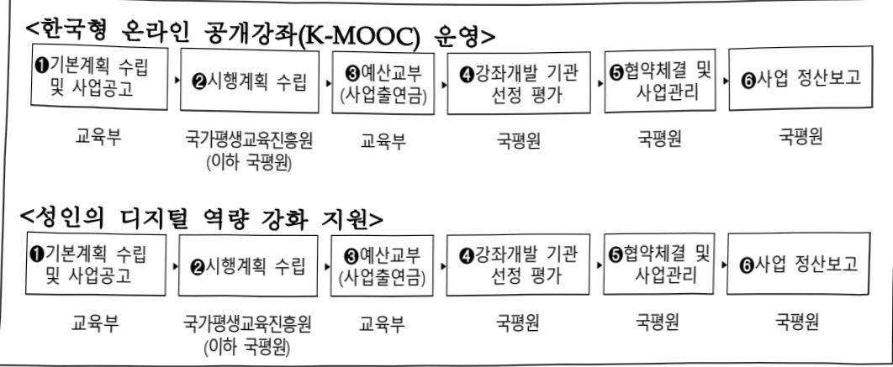

# 한국형 온라인 공개강좌 콘텐츠개발 및 활용 활성화

**해당 페이지**: PDF 1907 ~ 1914 쪽 해당

**부처**: 교육부
**분야**: 교육
**회계유형**: 고등·평생교육 지원특별회계
**2026 확정예산**: 19810.0 백만원
**전년대비 증감률**: 16.7%
**AI 도메인**: 교육/인재

---

### 가.예산 총괄표

(단위: 백만원, %)

<table border=1 style='margin: auto; word-wrap: break-word;'><tr><td rowspan="2">사업명</td><td rowspan="2">2024년 결산</td><td colspan="2">2025년 예산</td><td colspan="2">2026년 예산</td><td rowspan="2">증감(B-A)</td><td rowspan="2">(B-A)/A</td></tr><tr><td style='text-align: center; word-wrap: break-word;'>본예산</td><td style='text-align: center; word-wrap: break-word;'>추경(A)</td><td style='text-align: center; word-wrap: break-word;'>요구안</td><td style='text-align: center; word-wrap: break-word;'>본예산(B)</td></tr><tr><td style='text-align: center; word-wrap: break-word;'>한국형 온라인 공개강좌 콘텐츠 개발 및 활용 활성화</td><td style='text-align: center; word-wrap: break-word;'>19,401</td><td style='text-align: center; word-wrap: break-word;'>16,968</td><td style='text-align: center; word-wrap: break-word;'>16,968</td><td style='text-align: center; word-wrap: break-word;'>18,310</td><td style='text-align: center; word-wrap: break-word;'>19,810</td><td style='text-align: center; word-wrap: break-word;'>2,842</td><td style='text-align: center; word-wrap: break-word;'>16.7</td></tr></table>

□ 기능별(내역사업별) 예산 내역

(단위:백만원)

<table border=1 style='margin: auto; word-wrap: break-word;'><tr><td rowspan="2"></td><td colspan="5">2024</td><td colspan="5">2025</td><td rowspan="2">2026예산</td></tr><tr><td style='text-align: center; word-wrap: break-word;'>예산액(추정)</td><td style='text-align: center; word-wrap: break-word;'>예산현액</td><td style='text-align: center; word-wrap: break-word;'>집행액</td><td style='text-align: center; word-wrap: break-word;'>이월액</td><td style='text-align: center; word-wrap: break-word;'>불용액</td><td style='text-align: center; word-wrap: break-word;'>예산액(추정)</td><td style='text-align: center; word-wrap: break-word;'>예산현액</td><td style='text-align: center; word-wrap: break-word;'>집행액</td><td style='text-align: center; word-wrap: break-word;'>이월액</td><td style='text-align: center; word-wrap: break-word;'>불용액</td></tr><tr><td style='text-align: center; word-wrap: break-word;'>○ 기능별 분류(합계)</td><td style='text-align: center; word-wrap: break-word;'>19,401</td><td style='text-align: center; word-wrap: break-word;'>19,401</td><td style='text-align: center; word-wrap: break-word;'>19,401</td><td style='text-align: center; word-wrap: break-word;'>-</td><td style='text-align: center; word-wrap: break-word;'>-</td><td style='text-align: center; word-wrap: break-word;'>16,968</td><td style='text-align: center; word-wrap: break-word;'>16,968</td><td style='text-align: center; word-wrap: break-word;'>16,968</td><td style='text-align: center; word-wrap: break-word;'>-</td><td style='text-align: center; word-wrap: break-word;'>-</td><td style='text-align: center; word-wrap: break-word;'>19,810</td></tr><tr><td style='text-align: center; word-wrap: break-word;'>• 한국형 온라인공개강좌(K-MOOC)운영</td><td style='text-align: center; word-wrap: break-word;'>15,609</td><td style='text-align: center; word-wrap: break-word;'>15,609</td><td style='text-align: center; word-wrap: break-word;'>15,609</td><td style='text-align: center; word-wrap: break-word;'>-</td><td style='text-align: center; word-wrap: break-word;'>-</td><td style='text-align: center; word-wrap: break-word;'>12,818</td><td style='text-align: center; word-wrap: break-word;'>12,818</td><td style='text-align: center; word-wrap: break-word;'>12,818</td><td style='text-align: center; word-wrap: break-word;'>-</td><td style='text-align: center; word-wrap: break-word;'>-</td><td style='text-align: center; word-wrap: break-word;'>15,660</td></tr><tr><td style='text-align: center; word-wrap: break-word;'>• 매치업 운영</td><td style='text-align: center; word-wrap: break-word;'>3,792</td><td style='text-align: center; word-wrap: break-word;'>3,792</td><td style='text-align: center; word-wrap: break-word;'>3,792</td><td style='text-align: center; word-wrap: break-word;'>-</td><td style='text-align: center; word-wrap: break-word;'>-</td><td style='text-align: center; word-wrap: break-word;'>-</td><td style='text-align: center; word-wrap: break-word;'>-</td><td style='text-align: center; word-wrap: break-word;'>-</td><td style='text-align: center; word-wrap: break-word;'>-</td><td style='text-align: center; word-wrap: break-word;'>-</td><td style='text-align: center; word-wrap: break-word;'>-</td></tr><tr><td style='text-align: center; word-wrap: break-word;'>• 성인의 디지털역량 강화 지원</td><td style='text-align: center; word-wrap: break-word;'>-</td><td style='text-align: center; word-wrap: break-word;'>-</td><td style='text-align: center; word-wrap: break-word;'>-</td><td style='text-align: center; word-wrap: break-word;'>-</td><td style='text-align: center; word-wrap: break-word;'>-</td><td style='text-align: center; word-wrap: break-word;'>4,150</td><td style='text-align: center; word-wrap: break-word;'>4,150</td><td style='text-align: center; word-wrap: break-word;'>4,150</td><td style='text-align: center; word-wrap: break-word;'>-</td><td style='text-align: center; word-wrap: break-word;'>-</td><td style='text-align: center; word-wrap: break-word;'>4,150</td></tr></table>

### 나. 사업설명자료

## 1 ) 사업목적·내용

- (한국형 온라인 공개강좌(K-MOOC) 운영) 대학 등의 우수강좌를 온라인으로 온 국민에게 제공하여 평생교육 수요 확대에 부응 및 대학의 교수·학습 혁신촉진

- (성인의 디지털 역량 강화 지원) 성인의 디지털 분야 재교육·향상교육을 통한 역량 함양을 위해 온라인 기반 교육과정 개발 및 운영

## 2 ) 사업개요

## ☐ 사업근거 및 추진경위

① 법령상 근거 및 조항 적시 : 평생교육법 제19조제4항제3호 및 제7항

<table border=1 style='margin: auto; word-wrap: break-word;'><tr><td style='text-align: center; word-wrap: break-word;'>평생교육법 제19조(국가평생교육진흥원) ④ 진흥원은 다음 각 호의 업무를 수행한다.</td></tr></table>

---

(중략) 3. 평생교육프로그램 개발(온라인 기반의 평생교육프로그램의 개발을 포함한다)의 지원

⑦ 국가는 예산의 범위 내에서 진흥원의 설립 · 운영에 필요한 경비를 출연할 수 있다.

② 추진경위

- 「한국형 온라인 공개강좌(K-MOOC) 추진방안」 국무회의 보고('15.2월)

- K-MOOC 시범운영을 위한 기본계획 수립('15.2월, 부총리 결재)

- K-MOOC 시범서비스 개통('15.10월, www.kmooc.kr)

- 무크 선도대학(매년 10교) 및 분야지정 방식으로 강좌 개발('15~'17년)

- (가칭)한국형 나노디그리 기본계획 수립('17.10.23, 부총리 결재)

※ 명칭 공모결과, 「산업맞춤 단기직무능력인증과정 매치업(Match業) 확정('18.2월)

- K-MOOC 강좌 선정방식(개별 및 묶음강좌)으로 변경, 청강 모드 도입('18년)

- 강좌 이수결과를 학점은행제 학점으로 인정받을 수 있도록 학점인정법령 개정

(K-MOOC '18.11' 19.12)

- K-MOOC를 통해 전국민 교양 함양을 위한 방송강좌 신설, 반도체 등 신기술·신산업 분야 강좌 확대(21.4월)

- 매치업 수준별 교육과정 도입(심화과정 시범운영)(22년)

- 차세대 K-MOOC 플랫폼 개통('23.8월)

- K-MOOC 및 매치업 상시학습체계 도입('24.3월)

## □ 주요내용

① 사업규모

- 총사업비 : 해당없음

- 사업기간 : (K-MOOC 운영) 2015 ~ 계속, (매치업) 2018 ~ 계속, (AID) 2025 ~ 계속

- 최근 5년 간 투입된 사업비(예산액기준, 추경편성한 연도에는 추경포함)

<table border=1 style='margin: auto; word-wrap: break-word;'><tr><td style='text-align: center; word-wrap: break-word;'>연도</td><td style='text-align: center; word-wrap: break-word;'>2022</td><td style='text-align: center; word-wrap: break-word;'>2023</td><td style='text-align: center; word-wrap: break-word;'>2024</td><td style='text-align: center; word-wrap: break-word;'>2025</td><td style='text-align: center; word-wrap: break-word;'>2026</td></tr><tr><td style='text-align: center; word-wrap: break-word;'>사업비</td><td style='text-align: center; word-wrap: break-word;'>28,301</td><td style='text-align: center; word-wrap: break-word;'>28,301</td><td style='text-align: center; word-wrap: break-word;'>19,401</td><td style='text-align: center; word-wrap: break-word;'>16,968</td><td style='text-align: center; word-wrap: break-word;'>19,810</td></tr></table>

-기타:해당없음

② 사업추진체계

- 사업시행방법 : 출연

- 사업시행주체 : 국가평생교육진흥원

- 사업 수혜자 : 전 국민

- 보조, 융자, 출연, 출자 등의 경우 보조 · 융자 등 지원 비율 및 법적근거

---

<table border=1 style='margin: auto; word-wrap: break-word;'><tr><td style='text-align: center; word-wrap: break-word;'>내역사업명</td><td style='text-align: center; word-wrap: break-word;'>구분</td><td style='text-align: center; word-wrap: break-word;'>피보조·피출연 등 기관명</td><td style='text-align: center; word-wrap: break-word;'>지원 금액 (2026예산)</td><td style='text-align: center; word-wrap: break-word;'>지원 비율(%)</td><td style='text-align: center; word-wrap: break-word;'>보조율 법적근거 (해당 조항)</td></tr><tr><td style='text-align: center; word-wrap: break-word;'>한국형 온라인 공개강좌(K-MOOC) 운영</td><td rowspan="2">출연</td><td rowspan="2">국가평생 교육진흥원</td><td style='text-align: center; word-wrap: break-word;'>15,660</td><td style='text-align: center; word-wrap: break-word;'>100</td><td rowspan="2">평생교육법 제19조(국가평생교육진흥원) ④ 진흥원은 다음 각호의 업무를 수행한다. 3. 평생교육프로그램 개발(온라인 기반의 평생교육프로그램의 개발을 포함한다)의 지원 ⑦ 국가는 예산의 범위 내에서 진흥원의 설립·운영에 필요한 경비를 출연할 수 있다.</td></tr><tr><td style='text-align: center; word-wrap: break-word;'>성인의 디지털 역량 강화 지원</td><td style='text-align: center; word-wrap: break-word;'>4,150</td><td style='text-align: center; word-wrap: break-word;'>100</td></tr></table>

## 3 ) 2026년도 예산 산출 근거

### (1) 한국형 온라인 공개강좌(K-MOOC) 운영 : (2025) 12,818 → (2026) 15,660백만원, +22.2%

### 가. 강좌개발 및 운영 : 13,680백만원 (전년대비 +2,744백만원)

## ① 기본강좌 개발 : 3,000백만원 (전년대비 △600백만원)

- (요구) 대학 중심으로 운영하는 한국형 온라인 공개강좌(K-MOOC) 신규 강좌 개발을 위해 제4단계 무크 선도대학('26~28') 10개교 선정·운영, 개별 강좌 16개 선정 운영

- (산출) 3,000백만원

· 무크 선도대학 강좌 개발 : 2,200백만원(10개교 × 4개 강좌 × 55백만원)

· 개별 강좌 개발 : 800백만원(16개 강좌 × 50백만원)

## ② 심화강좌 개발: 960백만원 (전년동)

- (요구) 대표기업과 교육기관이 같이 운영하는 신산업·신기술 분야 단기직무교육 인증과정인 매치업(Match業)

사업 신규 컨소시엄 선정, 교육과정 개발 지원

- (산출) 960백만원

· 매치업 강좌 개발 : 960백만원 (3개 분야 × 4개 강좌 × 80백만원)

## ③ 기존강좌 운영 : 6,680백만원 (전년대비 +344백만원)

- (요구) 기 개발한 기본강좌(K-MOOC) 및 심화강좌(매치업) 컨소시엄 운영 지원

- (산출) 6,680백만원

· 기본강좌(K-MOOC) 운영 : 3,512백만원( (온라인 강좌 211개×12백만원) + (온오프라인 연계형 강좌 13개×50백만원) + (인센티브 30개×3백만원) + (강좌 개선비 60개×4백만원))

· 심화강좌(매치업) 운영 : 3,168백만원(( 12개 분야 × 온라인 강좌 4개 × 12백만원) + (12개 분야 × 온오프라인 강좌 4개 × 54백만원) )

## ④ 국내외 석학강의 제작 : 3,000백만원 (전년대비 + 3,000백만원)

- (요구) 방송사 등과 협력하여 노벨상 수상자 등 국내외 석학강좌 등 제공하여 국민의 소양 함양과 지식의 대중화 도모

- (산출) 3,000백만원

· 국내외 석학강의 제작 : 3,000백만원 (1종×3,000백만원)

## ⑤ 글로벌 확산: 40백만원(전년동)

- (요구) 해외 수요 등에 따라 번역 자막 등 제공하여 강좌 제공 지원, 국제 협력 강화 등

- (산출) 40백만원

· 글로벌 확산 : 40백만원(1식 × 40백만원)

### 나. 시스템 운영 및 유지보수 : 1,200백만원 (전년대비 +98백만원)

---

- (요구) K-MOOC 플랫폼 유지 관리를 위한 플랫폼 운영비, SW 유지관리비, 인프라 유지관리비 지원, 매치업 플랫폼 '26년 운영비·통폐합비 지원

- (산출) 1,200백만원(1식 × 1,200백만원)

### 다. 사업관리비 : 780백만원 (전년동)

- (요구) '24년 K-MOOC 2,805개 강좌, 매치업 72개 강좌 운영 지원, 157만 회원가입자 수 지원 등

- (산출) 780백만원(1식 × 780백만원)

## (2) 성인 디지털 역량 강화 지원 (2025) 4,150백만원 → (2026) 4,150백만원, 전년동

가. AID 30+ 집중교육과정 : 3,240백만원 (전년대비 +690백만원)

- (요구) 「AID 30+ 프로젝트('24.10.)」에 따라 30세 이상 성인 재직자가 각자의 직업 분야에서 활용할 수 있는 AI-디지털 역량 강화 지원을 위해 대학이 온·오프라인 캠프 운영

- (산출) 3,240백만원

· 기존 캠프 운영 : 2,240백만원(20개 대학×112백만원)

· 신규 캠프 선정 : 1,000백만원(5개 대학x200백만원)

### 나. AID 도약강좌 : 810백만원 (△690백만원, △45%)

- (요구)「AID 30+ 프로젝트('24.10.)」에 따라, 30세 이상 성인이 체계적으로 AI·디지털 역량을 습득할 수 있도록 대학·전문대학 등 3개 내외 온라인 묶음강좌 지원

- (산출)810백만원

·기존 강좌 운영:360백만원(10개 대학×3개 강좌×12백만원)

·신규 강좌 개발 : 450백만원(3개 대학×3개 강좌×50백만원)

### 다.사업관리비:100백만원(전년동)

- (요구) AID 30+ 집중교육과정, AID 도약강좌 운영을 위한 사업관리비 지원

※ 기존강좌 연차평가, 품질검수 등 컨설팅, 만족도 및 성과분석 연구, AID 선도대학 네트워크 운영 등

- (산출) 100백만원(1식×100백만원)

o 2025년도 추가경정예산 및 2026년도 예산 산출 세부내역 비교

<table border=1 style='margin: auto; word-wrap: break-word;'><tr><td colspan="2">2025년 제2회 주가경쟁예산</td><td colspan="2">2026년 예산</td><td style='text-align: center; word-wrap: break-word;'></td><td style='text-align: center; word-wrap: break-word;'></td></tr><tr><td style='text-align: center; word-wrap: break-word;'>예산</td><td style='text-align: center; word-wrap: break-word;'>산출내역</td><td style='text-align: center; word-wrap: break-word;'>예산</td><td style='text-align: center; word-wrap: break-word;'>산출내역</td><td style='text-align: center; word-wrap: break-word;'></td><td style='text-align: center; word-wrap: break-word;'></td></tr><tr><td style='text-align: center; word-wrap: break-word;'>한국형 온라인 공개강좌(K-MOOC) 지원 12,818</td><td style='text-align: center; word-wrap: break-word;'>&lt;한국형 온라인 공개강좌(K-MOOC) 지원 12,818백만원 &gt;가. (강좌 개발 및 운영) 10,936백만원• (기본강좌 개발) 15개교 × 4개 강좌 × 60백만원 = 3,600백만원• (심화강좌 개발) 3개 분야 × 4개 강좌 × 80백만원 = 960백만원• (기존강좌 운영) 6,336백만원• (기본강좌) (316강좌 × 12백만원)+(8강좌 × 50백만원)+(40강좌 × 4백만원) = 4,352백만원- (심화강좌) (32개 강좌 × 12백만원) + (32개 강좌 × 50백만원) = 1,984백만원• (국내외 석학 강의 제작) -• (글로벌 확산) 1식 × 40백만원 = 40백만원</td><td style='text-align: center; word-wrap: break-word;'>한국형 온라인 공개강좌(K-MOOC) 지원 15,660</td><td style='text-align: center; word-wrap: break-word;'>&lt;한국형 온라인 공개강좌(K-MOOC) 지원 15,660백만원&gt; + 22.2%가. (강좌 개발 및 운영) 13,680백만원• (기본강좌 개발) (10개교 × 4개 강좌 × 55백만원) + (16개 강좌 × 50백만원) = 3,000백만원• (심화강좌 개발) 3개 분야 × 4개 강좌 × 80백만원 = 960백만원• (기본강좌 운영) 6,680백만원- (기본강좌) (211개 강좌 × 12백만원)+(13강좌 × 50백만원) + (30강좌 × 3백만원) + (60강좌 × 4백만원) = 3,512백만원- (심화강좌) (48개 강좌 × 12백만원) + (48개 강좌 × 54백만원) = 3,168백만원• (국내외 석학강의 제작) 1종 × 3,000백만원 = 3,000백만원• (글로벌 확산) 1식 × 40백만원 = 40백만원</td><td style='text-align: center; word-wrap: break-word;'>나. (시스템 운영 및 유지보수) 1식 × 851백만원 = 851백만원• (K-MOOC 플랫폼 운영 및 유지보수) 1식 × 251백만원 = 251백만원다. (사업관리비) 1식 × 780백만원 = 780백만원</td><td style='text-align: center; word-wrap: break-word;'>나. (시스템 운영 및 유지보수) 1식 × 1,200백만원 = 1,200백만원다. (사업관리비) 1식 × 780백만원 = 780백만원</td></tr><tr><td style='text-align: center; word-wrap: break-word;'>성인의 디지털 역량 강화</td><td style='text-align: center; word-wrap: break-word;'>&lt;성인의 디지털 역량 강화 지원 4,150백만원&gt;</td><td style='text-align: center; word-wrap: break-word;'>성인의 디지털 역량 강화 강화</td><td style='text-align: center; word-wrap: break-word;'>&lt;성인의 디지털 역량 강화 지원 4,150백만원&gt; - 전년동</td><td style='text-align: center; word-wrap: break-word;'></td><td style='text-align: center; word-wrap: break-word;'></td></tr></table>

---

<table border=1 style='margin: auto; word-wrap: break-word;'><tr><td colspan="2">2025년 제2회 추가경정예산</td><td colspan="2">2026년 예산</td></tr><tr><td style='text-align: center; word-wrap: break-word;'>예산</td><td style='text-align: center; word-wrap: break-word;'>산출내역</td><td style='text-align: center; word-wrap: break-word;'>예산</td><td style='text-align: center; word-wrap: break-word;'>산출내역</td></tr><tr><td style='text-align: center; word-wrap: break-word;'>지원 4,150</td><td style='text-align: center; word-wrap: break-word;'>가. (AID 30+ 집중 교육과정) 17개교 × 150백만원 = 2,550백만원 나. (AID 도약강좌) 10개교 × 3개 강좌 × 50백만원 = 1,500백만원 다. (사업관리비) 1식 × 100백만원 = 100백만원</td><td style='text-align: center; word-wrap: break-word;'>지원 4,150</td><td style='text-align: center; word-wrap: break-word;'>가. (AID 30+ 집중 교육과정) (20개교 × 112백만원) + (5개교 × 200백만원) = 3,240백만원 나. (AID 도약강좌) (10개교 × 3개 강좌 × 12백만원) + (3개교 × 3개 강좌 × 50백만원) = 810백만원 다. (사업관리비) 1식 × 100백만원 = 100백만원</td></tr></table>

## 4 ) 사업효과

□ 사업영향, 산출물 성과지표 등

① 2022~2026년도 성과계획서 상 성과지표 및 최근 5년간 성과 달성도

<table border=1 style='margin: auto; word-wrap: break-word;'><tr><td style='text-align: center; word-wrap: break-word;'>성과지표</td><td style='text-align: center; word-wrap: break-word;'>구분</td><td style='text-align: center; word-wrap: break-word;'>2022</td><td style='text-align: center; word-wrap: break-word;'>2023</td><td style='text-align: center; word-wrap: break-word;'>2024</td><td style='text-align: center; word-wrap: break-word;'>2025</td><td style='text-align: center; word-wrap: break-word;'>2026</td><td style='text-align: center; word-wrap: break-word;'>2026 목표치산출근거</td><td style='text-align: center; word-wrap: break-word;'>측정산식(또는 측정방법)</td><td style='text-align: center; word-wrap: break-word;'>자료수집방법(또는 자료출처)</td></tr><tr><td rowspan="3">K-MOOC 수강신청 누적 건수(만건)</td><td style='text-align: center; word-wrap: break-word;'>목표</td><td style='text-align: center; word-wrap: break-word;'>276</td><td style='text-align: center; word-wrap: break-word;'></td><td style='text-align: center; word-wrap: break-word;'></td><td style='text-align: center; word-wrap: break-word;'></td><td style='text-align: center; word-wrap: break-word;'></td><td rowspan="3"></td><td rowspan="3">전년도 실적+당해연도 수강신청 건수</td><td rowspan="3">K-MOOC 플랫폼 추출</td></tr><tr><td style='text-align: center; word-wrap: break-word;'>실적</td><td style='text-align: center; word-wrap: break-word;'>281</td><td style='text-align: center; word-wrap: break-word;'></td><td style='text-align: center; word-wrap: break-word;'></td><td style='text-align: center; word-wrap: break-word;'></td><td style='text-align: center; word-wrap: break-word;'></td></tr><tr><td style='text-align: center; word-wrap: break-word;'>달성도</td><td style='text-align: center; word-wrap: break-word;'>102</td><td style='text-align: center; word-wrap: break-word;'></td><td style='text-align: center; word-wrap: break-word;'></td><td style='text-align: center; word-wrap: break-word;'></td><td style='text-align: center; word-wrap: break-word;'></td></tr><tr><td rowspan="3">K-MOOC 수강신청 건수(만건)</td><td style='text-align: center; word-wrap: break-word;'>목표</td><td style='text-align: center; word-wrap: break-word;'>신규</td><td style='text-align: center; word-wrap: break-word;'>49</td><td style='text-align: center; word-wrap: break-word;'>51</td><td style='text-align: center; word-wrap: break-word;'>53</td><td style='text-align: center; word-wrap: break-word;'>55</td><td rowspan="3">전년 대비 4% 향상된 목표치</td><td rowspan="3">당해연도 수강신청 건수</td><td rowspan="3">K-MOOC 플랫폼 추출</td></tr><tr><td style='text-align: center; word-wrap: break-word;'>실적</td><td style='text-align: center; word-wrap: break-word;'></td><td style='text-align: center; word-wrap: break-word;'>53</td><td style='text-align: center; word-wrap: break-word;'>58</td><td style='text-align: center; word-wrap: break-word;'>-</td><td style='text-align: center; word-wrap: break-word;'>-</td></tr><tr><td style='text-align: center; word-wrap: break-word;'>달성도</td><td style='text-align: center; word-wrap: break-word;'></td><td style='text-align: center; word-wrap: break-word;'>108.2</td><td style='text-align: center; word-wrap: break-word;'>113.7</td><td style='text-align: center; word-wrap: break-word;'>-</td><td style='text-align: center; word-wrap: break-word;'>-</td></tr></table>

② 성과지표 이외의 연도별 사업추진 경과 및 실적

<table border=1 style='margin: auto; word-wrap: break-word;'><tr><td style='text-align: center; word-wrap: break-word;'>2022</td><td style='text-align: center; word-wrap: break-word;'>○ 한국형 온라인 공개강좌(K-MOOC) 운영 - 교양강좌, 묶음, 개별강좌 선정(&#x27;22.4월) - K-MOOC 학점은행제 과정 9개 선정(신규 3개, 재평가 6개) ○ 매치업 운영 - 신규 4개분야(메타버스, 스마트팜, D.N.A, 5G) 선정(&#x27;22.5월)</td></tr><tr><td style='text-align: center; word-wrap: break-word;'>2023</td><td style='text-align: center; word-wrap: break-word;'>○ 한국형 온라인 공개강좌(K-MOOC) 운영 - 교양강좌, 묶음, 개별강좌 선정(&#x27;23.4월), 전략기획강좌 선정(&#x27;23.12월) - K-MOOC 학점은행제 과정 22개 선정(신규 10개, 재평가 12개) ○ 매치업 운영 - 신규 3개분야(바이오헬스, 항공·드론, 미래자동차), 심화 3개분야(빅테이터, 가상·증강현실, 드론) 선정(&#x27;23.5월)</td></tr><tr><td style='text-align: center; word-wrap: break-word;'>2024</td><td style='text-align: center; word-wrap: break-word;'>○ 한국형 온라인 공개강좌(K-MOOC) 운영 - 교양강좌(국내외 석학강좌, 디지털 교양 강좌, 시니어 지식기부 강좌), 디지털(기초, 심화), 수요맞춤형, 묵음강좌 선정(&#x27;24.4월) - 2024년 K-MOOC 학점은행제 과정 10개 선정(신규 5개, 재평가 5개) ○ 매치업 운영 - 신규 3개 분야(3D프린팅, 인공지능, 로봇) 선정(&#x27;24.5월)</td></tr><tr><td style='text-align: center; word-wrap: break-word;'>2025</td><td style='text-align: center; word-wrap: break-word;'>○ 한국형 온라인 공개강좌(K-MOOC) 운영</td></tr></table>

---

<table border=1 style='margin: auto; word-wrap: break-word;'><tr><td style='text-align: center; word-wrap: break-word;'></td><td style='text-align: center; word-wrap: break-word;'>- 수요맞춤형, 개별강좌 선정(&#x27;25.5월&#x27;)- 2025년 K-MOOC 학점은행제 과정 13개 선정(신규 8개, 재평가 5개)○ 매치업 운영- 신규 3개 분야(지능형 클라우드, 사이버보안, 공간컴퓨팅) 선정(&#x27;25.5월&#x27;)○ 재직자 AI·디지털(AID) 집중과정(신규) - AID 30+ 집중캠프(20개, &#x27;25.6월), AID 묵음강좌 선정(10개, &#x27;25.5월)</td></tr></table>

## ③향후(2026년도 이후)기대효과

- 다양한 분야의 K-MOOC 강좌 확대 및 맞춤형 학습 서비스 제공을 통한 전 국민의 열린 평생학습 기회제공

○ AI 등 4차 산업혁명 분야 강좌 지속 확대를 통한 국민의 디지털 기초소양 함양

※ 신기술·신산업 분야 강좌 수 : (22) 154개 → (23) 189개 → (24) 224개

○ 첨단산업 5대 핵심분야의 학습자의 수요를 반영한 신산업 분야 신규 선정하여 매지업

운영 분야 지속 확대

## 5 ) 타당성조사 및 예비타당성조사 시행여부 및 결과 요지 : 해당없음

## 6 ) 총사업비 대상사업 정보 : 해당없음

## 7 ) 사업 집행절차

## 8 ) 각종 평가

---

1) 국회(예결위, 상임위, 예정처, 국정감사 포함) 지적

° 한국형 온라인 공개강좌(K-MOOC) 운영

-(22회계 결산시정요구, '23.8) 교육부는 다양한 콘텐츠 개발에 필요한 예산 편성 및 집행으로 국민적 수요와 평생학습 시대를 반영한 다채로운 콘텐츠를 제작하도록 할 것

- (24회계 결산시정요구, '25.7) K-MOOC 사업 활성화를 위한 콘텐츠 접근성 완화 등 사업 구조 개선 필요

ㅇ 매치업(Match業) 운영

-(23회계 결산시정요구, '24.11.) 교육부는 매치업 운영 사업 이수율이 제고될 수 있도록 교육과정 설계가 효과적으로 이루어졌는지 면밀히 관리하고, 기업체에서 실제로 활용되고 있는지 검증할 수 있는 방안을 마련할 것

2) 대외공개 평가 : 해당없음

3) 자체평가 : 해당없음

### 다.최근 4년간 결산내역

## 1 ) 결산표

☐ 부처 결산내역

(단위: 백만원, %)

<table border=1 style='margin: auto; word-wrap: break-word;'><tr><td rowspan="2">연도</td><td colspan="3">예산액</td><td rowspan="2">예산현액(A)</td><td rowspan="2">집행액(B)</td><td rowspan="2">집행률(B/A)</td><td rowspan="2">다음연도이월액</td><td rowspan="2">불용액</td></tr><tr><td style='text-align: center; word-wrap: break-word;'>본예산</td><td style='text-align: center; word-wrap: break-word;'>추경중감액</td><td style='text-align: center; word-wrap: break-word;'>추경</td></tr><tr><td style='text-align: center; word-wrap: break-word;'>2022</td><td style='text-align: center; word-wrap: break-word;'>28,301</td><td style='text-align: center; word-wrap: break-word;'>-</td><td style='text-align: center; word-wrap: break-word;'>28,301</td><td style='text-align: center; word-wrap: break-word;'>28,301</td><td style='text-align: center; word-wrap: break-word;'>28,301</td><td style='text-align: center; word-wrap: break-word;'>100.0</td><td style='text-align: center; word-wrap: break-word;'>-</td><td style='text-align: center; word-wrap: break-word;'>-</td></tr><tr><td style='text-align: center; word-wrap: break-word;'>2023</td><td style='text-align: center; word-wrap: break-word;'>28,301</td><td style='text-align: center; word-wrap: break-word;'>-</td><td style='text-align: center; word-wrap: break-word;'>28,301</td><td style='text-align: center; word-wrap: break-word;'>28,301</td><td style='text-align: center; word-wrap: break-word;'>28,301</td><td style='text-align: center; word-wrap: break-word;'>100.0</td><td style='text-align: center; word-wrap: break-word;'>-</td><td style='text-align: center; word-wrap: break-word;'>-</td></tr><tr><td style='text-align: center; word-wrap: break-word;'>2024</td><td style='text-align: center; word-wrap: break-word;'>19,401</td><td style='text-align: center; word-wrap: break-word;'>-</td><td style='text-align: center; word-wrap: break-word;'>19,401</td><td style='text-align: center; word-wrap: break-word;'>19,401</td><td style='text-align: center; word-wrap: break-word;'>19,401</td><td style='text-align: center; word-wrap: break-word;'>100.0</td><td style='text-align: center; word-wrap: break-word;'>-</td><td style='text-align: center; word-wrap: break-word;'>-</td></tr><tr><td style='text-align: center; word-wrap: break-word;'>2025</td><td style='text-align: center; word-wrap: break-word;'>16,968</td><td style='text-align: center; word-wrap: break-word;'>-</td><td style='text-align: center; word-wrap: break-word;'>16,968</td><td style='text-align: center; word-wrap: break-word;'>16,968</td><td style='text-align: center; word-wrap: break-word;'>16,968</td><td style='text-align: center; word-wrap: break-word;'>100.0</td><td style='text-align: center; word-wrap: break-word;'>-</td><td style='text-align: center; word-wrap: break-word;'>-</td></tr></table>

## 2 ) 주요 결산사항

2022~2025년 결산 주요 지적사항 및 시정요구사항 : 해당없음

□ 2025년 이·전용 등 세부내역 : 해당없음

---

<table border=1 style='margin: auto; word-wrap: break-word;'><tr><td style='text-align: center; word-wrap: break-word;'>사 업 명</td></tr><tr><td style='text-align: center; word-wrap: break-word;'>(7) 통계DB통합 및 포털서비스(정보화) (2031-302)</td></tr></table>

□사업코드정보

<table border=1 style='margin: auto; word-wrap: break-word;'><tr><td style='text-align: center; word-wrap: break-word;'>구분</td><td style='text-align: center; word-wrap: break-word;'>회계</td><td style='text-align: center; word-wrap: break-word;'>소관</td><td style='text-align: center; word-wrap: break-word;'>실국(기관)</td><td style='text-align: center; word-wrap: break-word;'>계정</td><td style='text-align: center; word-wrap: break-word;'>분야</td><td style='text-align: center; word-wrap: break-word;'>부문</td></tr><tr><td style='text-align: center; word-wrap: break-word;'>코드</td><td rowspan="2">일반회계</td><td rowspan="2">국가데이터처</td><td rowspan="2">통계서비스국</td><td rowspan="2"></td><td style='text-align: center; word-wrap: break-word;'>010</td><td style='text-align: center; word-wrap: break-word;'>016</td></tr><tr><td style='text-align: center; word-wrap: break-word;'>명칭</td><td style='text-align: center; word-wrap: break-word;'>일반공공행정</td><td style='text-align: center; word-wrap: break-word;'>일반행정</td></tr></table>

<table border=1 style='margin: auto; word-wrap: break-word;'><tr><td style='text-align: center; word-wrap: break-word;'>구분</td><td style='text-align: center; word-wrap: break-word;'>프로그램</td><td style='text-align: center; word-wrap: break-word;'>단위사업</td><td style='text-align: center; word-wrap: break-word;'>세부사업</td></tr><tr><td style='text-align: center; word-wrap: break-word;'>코드</td><td style='text-align: center; word-wrap: break-word;'>2000</td><td style='text-align: center; word-wrap: break-word;'>2031</td><td style='text-align: center; word-wrap: break-word;'>302</td></tr><tr><td style='text-align: center; word-wrap: break-word;'>명칭</td><td style='text-align: center; word-wrap: break-word;'>통계정보확충 및 서비스체계 개선</td><td style='text-align: center; word-wrap: break-word;'>통계서비스</td><td style='text-align: center; word-wrap: break-word;'>통계DB통합 및 포털서비스</td></tr></table>

☐ 사업 성격

<table border=1 style='margin: auto; word-wrap: break-word;'><tr><td rowspan="2">신규</td><td rowspan="2">계속</td><td rowspan="2">완료</td><td rowspan="2">예비타당성 실시여부</td><td rowspan="2">총사업비 관리대상</td><td rowspan="2">총액계상 예산사업</td><td style='text-align: center; word-wrap: break-word;'>사업소관 변경정보</td></tr><tr><td style='text-align: center; word-wrap: break-word;'>2025예산 시 소관</td></tr><tr><td style='text-align: center; word-wrap: break-word;'></td><td style='text-align: center; word-wrap: break-word;'>○</td><td style='text-align: center; word-wrap: break-word;'></td><td style='text-align: center; word-wrap: break-word;'></td><td style='text-align: center; word-wrap: break-word;'></td><td style='text-align: center; word-wrap: break-word;'></td><td style='text-align: center; word-wrap: break-word;'></td></tr></table>

□ 사업 지원 형태 및 지원을 (최소한 한 개는 반드시 선택하시오. 해당사항에 ○ 표시)

<table border=1 style='margin: auto; word-wrap: break-word;'><tr><td style='text-align: center; word-wrap: break-word;'>직접</td><td style='text-align: center; word-wrap: break-word;'>출자</td><td style='text-align: center; word-wrap: break-word;'>출연</td><td style='text-align: center; word-wrap: break-word;'>보조</td><td style='text-align: center; word-wrap: break-word;'>융자</td><td style='text-align: center; word-wrap: break-word;'>국고보조율(%)</td><td style='text-align: center; word-wrap: break-word;'>융자율(%)</td></tr><tr><td style='text-align: center; word-wrap: break-word;'>○</td><td style='text-align: center; word-wrap: break-word;'></td><td style='text-align: center; word-wrap: break-word;'></td><td style='text-align: center; word-wrap: break-word;'></td><td style='text-align: center; word-wrap: break-word;'></td><td style='text-align: center; word-wrap: break-word;'></td><td style='text-align: center; word-wrap: break-word;'></td></tr></table>

□ 사업 담당자

<table border=1 style='margin: auto; word-wrap: break-word;'><tr><td style='text-align: center; word-wrap: break-word;'>사업명</td><td colspan="2">구분</td></tr><tr><td rowspan="2">통계DB통합 및 포털서비스 (정보화)</td><td style='text-align: center; word-wrap: break-word;'>소관부처</td><td style='text-align: center; word-wrap: break-word;'>통계서비스국 통계서비스기획과</td></tr><tr><td style='text-align: center; word-wrap: break-word;'>사업시행주체</td><td style='text-align: center; word-wrap: break-word;'>국가데이터처</td></tr></table>

### 가. 예산 총괄표

(단위: 백만원, %)

<table border=1 style='margin: auto; word-wrap: break-word;'><tr><td rowspan="2">사업명</td><td rowspan="2">2024년 결산</td><td colspan="2">2025년 예산</td><td colspan="2">2026년</td><td rowspan="2">증감 (B-A)</td><td rowspan="2">(B-A)/A</td></tr><tr><td style='text-align: center; word-wrap: break-word;'>본예산(A)</td><td style='text-align: center; word-wrap: break-word;'>추경</td><td style='text-align: center; word-wrap: break-word;'>요구</td><td style='text-align: center; word-wrap: break-word;'>본예산(B)</td></tr><tr><td style='text-align: center; word-wrap: break-word;'>통계DB통합 및 포털서비스(정보화)</td><td style='text-align: center; word-wrap: break-word;'>5,620</td><td style='text-align: center; word-wrap: break-word;'>4,362</td><td style='text-align: center; word-wrap: break-word;'>4,362</td><td style='text-align: center; word-wrap: break-word;'>5,035</td><td style='text-align: center; word-wrap: break-word;'>4,670</td><td style='text-align: center; word-wrap: break-word;'>308</td><td style='text-align: center; word-wrap: break-word;'>7.1</td></tr></table>

---

### 원본 PDF 크롭 이미지

