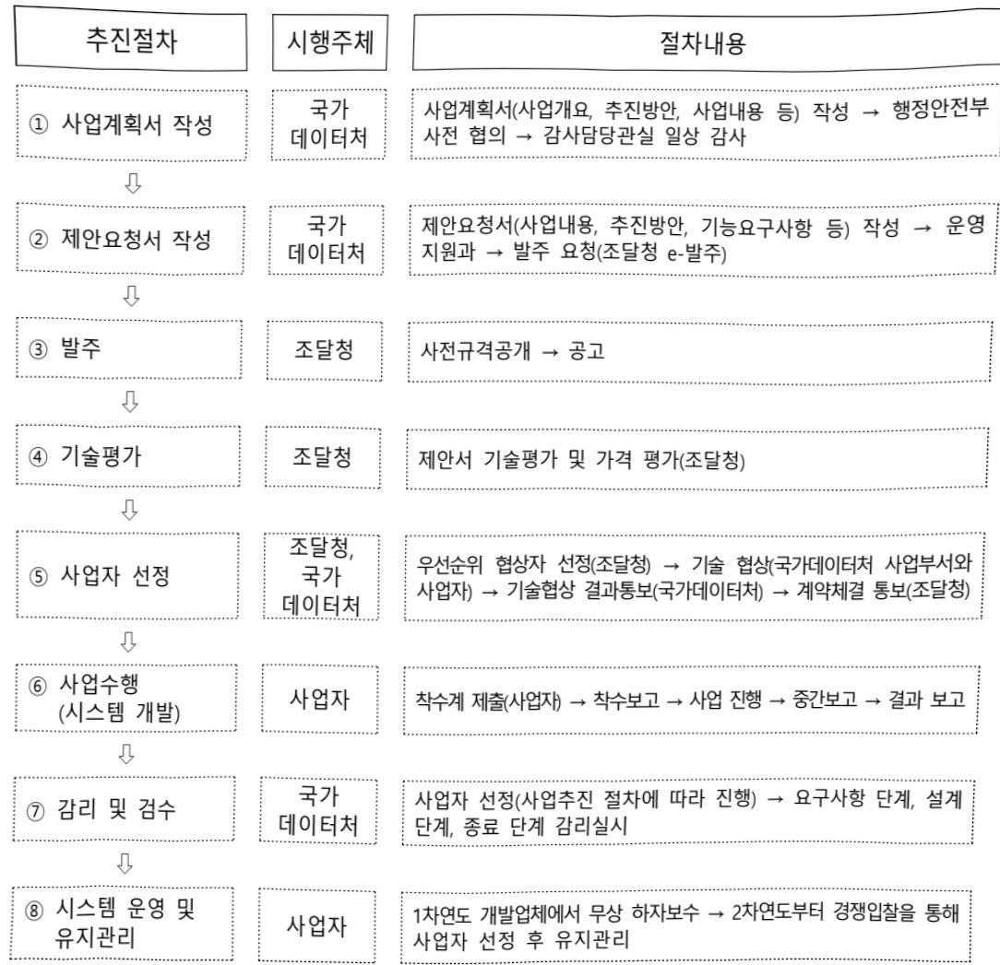

# 통계DB통합및포털서비스(정보화)

**해당 페이지**: PDF 1915 ~ 1932 쪽 해당

**부처**: 국가데이터처
**분야**: 일반공공행정
**회계유형**: 일반회계
**2026 확정예산**: 4670.0 백만원
**전년대비 증감률**: 7.1%
**AI 도메인**: 데이터

---

<table border=1 style='margin: auto; word-wrap: break-word;'><tr><td style='text-align: center; word-wrap: break-word;'>사 업 명</td></tr><tr><td style='text-align: center; word-wrap: break-word;'>(7) 통계DB통합 및 포털서비스(정보화) (2031-302)</td></tr></table>

□사업코드정보

<table border=1 style='margin: auto; word-wrap: break-word;'><tr><td style='text-align: center; word-wrap: break-word;'>구분</td><td style='text-align: center; word-wrap: break-word;'>회계</td><td style='text-align: center; word-wrap: break-word;'>소관</td><td style='text-align: center; word-wrap: break-word;'>실국(기관)</td><td style='text-align: center; word-wrap: break-word;'>계정</td><td style='text-align: center; word-wrap: break-word;'>분야</td><td style='text-align: center; word-wrap: break-word;'>부문</td></tr><tr><td style='text-align: center; word-wrap: break-word;'>코드</td><td rowspan="2">일반회계</td><td rowspan="2">국가데이터처</td><td rowspan="2">통계서비스국</td><td rowspan="2"></td><td style='text-align: center; word-wrap: break-word;'>010</td><td style='text-align: center; word-wrap: break-word;'>016</td></tr><tr><td style='text-align: center; word-wrap: break-word;'>명칭</td><td style='text-align: center; word-wrap: break-word;'>일반공공행정</td><td style='text-align: center; word-wrap: break-word;'>일반행정</td></tr></table>

<table border=1 style='margin: auto; word-wrap: break-word;'><tr><td style='text-align: center; word-wrap: break-word;'>구분</td><td style='text-align: center; word-wrap: break-word;'>프로그램</td><td style='text-align: center; word-wrap: break-word;'>단위사업</td><td style='text-align: center; word-wrap: break-word;'>세부사업</td></tr><tr><td style='text-align: center; word-wrap: break-word;'>코드</td><td style='text-align: center; word-wrap: break-word;'>2000</td><td style='text-align: center; word-wrap: break-word;'>2031</td><td style='text-align: center; word-wrap: break-word;'>302</td></tr><tr><td style='text-align: center; word-wrap: break-word;'>명칭</td><td style='text-align: center; word-wrap: break-word;'>통계정보확충 및 서비스체계 개선</td><td style='text-align: center; word-wrap: break-word;'>통계서비스</td><td style='text-align: center; word-wrap: break-word;'>통계DB통합 및 포털서비스</td></tr></table>

☐ 사업 성격

<table border=1 style='margin: auto; word-wrap: break-word;'><tr><td rowspan="2">신규</td><td rowspan="2">계속</td><td rowspan="2">완료</td><td rowspan="2">예비타당성 실시여부</td><td rowspan="2">총사업비 관리대상</td><td rowspan="2">총액계상 예산사업</td><td style='text-align: center; word-wrap: break-word;'>사업소관 변경정보</td></tr><tr><td style='text-align: center; word-wrap: break-word;'>2025예산 시 소관</td></tr><tr><td style='text-align: center; word-wrap: break-word;'></td><td style='text-align: center; word-wrap: break-word;'>○</td><td style='text-align: center; word-wrap: break-word;'></td><td style='text-align: center; word-wrap: break-word;'></td><td style='text-align: center; word-wrap: break-word;'></td><td style='text-align: center; word-wrap: break-word;'></td><td style='text-align: center; word-wrap: break-word;'></td></tr></table>

□ 사업 지원 형태 및 지원을 (최소한 한 개는 반드시 선택하시오. 해당사항에 ○ 표시)

<table border=1 style='margin: auto; word-wrap: break-word;'><tr><td style='text-align: center; word-wrap: break-word;'>직접</td><td style='text-align: center; word-wrap: break-word;'>출자</td><td style='text-align: center; word-wrap: break-word;'>출연</td><td style='text-align: center; word-wrap: break-word;'>보조</td><td style='text-align: center; word-wrap: break-word;'>융자</td><td style='text-align: center; word-wrap: break-word;'>국고보조율(%)</td><td style='text-align: center; word-wrap: break-word;'>융자율(%)</td></tr><tr><td style='text-align: center; word-wrap: break-word;'>○</td><td style='text-align: center; word-wrap: break-word;'></td><td style='text-align: center; word-wrap: break-word;'></td><td style='text-align: center; word-wrap: break-word;'></td><td style='text-align: center; word-wrap: break-word;'></td><td style='text-align: center; word-wrap: break-word;'></td><td style='text-align: center; word-wrap: break-word;'></td></tr></table>

□ 사업 담당자

<table border=1 style='margin: auto; word-wrap: break-word;'><tr><td style='text-align: center; word-wrap: break-word;'>사업명</td><td colspan="2">구분</td></tr><tr><td rowspan="2">통계DB통합 및 포털서비스 (정보화)</td><td style='text-align: center; word-wrap: break-word;'>소관부처</td><td style='text-align: center; word-wrap: break-word;'>통계서비스국 통계서비스기획과</td></tr><tr><td style='text-align: center; word-wrap: break-word;'>사업시행주체</td><td style='text-align: center; word-wrap: break-word;'>국가데이터처</td></tr></table>

### 가. 예산 총괄표

(단위: 백만원, %)

<table border=1 style='margin: auto; word-wrap: break-word;'><tr><td rowspan="2">사업명</td><td rowspan="2">2024년 결산</td><td colspan="2">2025년 예산</td><td colspan="2">2026년</td><td rowspan="2">증감 (B-A)</td><td rowspan="2">(B-A)/A</td></tr><tr><td style='text-align: center; word-wrap: break-word;'>본예산(A)</td><td style='text-align: center; word-wrap: break-word;'>추경</td><td style='text-align: center; word-wrap: break-word;'>요구</td><td style='text-align: center; word-wrap: break-word;'>본예산(B)</td></tr><tr><td style='text-align: center; word-wrap: break-word;'>통계DB통합 및 포털서비스(정보화)</td><td style='text-align: center; word-wrap: break-word;'>5,620</td><td style='text-align: center; word-wrap: break-word;'>4,362</td><td style='text-align: center; word-wrap: break-word;'>4,362</td><td style='text-align: center; word-wrap: break-word;'>5,035</td><td style='text-align: center; word-wrap: break-word;'>4,670</td><td style='text-align: center; word-wrap: break-word;'>308</td><td style='text-align: center; word-wrap: break-word;'>7.1</td></tr></table>

---

□ 기능별(내역사업별), 목별 예산 내역

(단위:백만원

<table border=1 style='margin: auto; word-wrap: break-word;'><tr><td rowspan="2"></td><td colspan="5">2024</td><td colspan="8">2025(2025.12.11)</td></tr><tr><td style='text-align: center; word-wrap: break-word;'>예산액(추정)</td><td style='text-align: center; word-wrap: break-word;'>예산현액</td><td style='text-align: center; word-wrap: break-word;'>집행액[실집행액]</td><td style='text-align: center; word-wrap: break-word;'>이윌액</td><td style='text-align: center; word-wrap: break-word;'>불용액</td><td style='text-align: center; word-wrap: break-word;'>분예산</td><td style='text-align: center; word-wrap: break-word;'>예산현액</td><td style='text-align: center; word-wrap: break-word;'>집행액[실집행액]</td><td colspan="2">전년도 이윌액제외</td><td style='text-align: center; word-wrap: break-word;'>이윌액상액</td><td style='text-align: center; word-wrap: break-word;'>불용액상액</td><td style='text-align: center; word-wrap: break-word;'>2026예산</td></tr><tr><td style='text-align: center; word-wrap: break-word;'>○ 기능별 분류(합계)</td><td style='text-align: center; word-wrap: break-word;'>5,719</td><td style='text-align: center; word-wrap: break-word;'>5,719</td><td style='text-align: center; word-wrap: break-word;'>5,620</td><td style='text-align: center; word-wrap: break-word;'>-</td><td style='text-align: center; word-wrap: break-word;'>99</td><td style='text-align: center; word-wrap: break-word;'>4,362</td><td style='text-align: center; word-wrap: break-word;'>4,336</td><td style='text-align: center; word-wrap: break-word;'>4,325</td><td style='text-align: center; word-wrap: break-word;'>4,336</td><td style='text-align: center; word-wrap: break-word;'>4,325</td><td style='text-align: center; word-wrap: break-word;'>-</td><td style='text-align: center; word-wrap: break-word;'>-</td><td style='text-align: center; word-wrap: break-word;'>4,67</td></tr><tr><td style='text-align: center; word-wrap: break-word;'>· 통계정보포털시스템운영</td><td style='text-align: center; word-wrap: break-word;'>3,932</td><td style='text-align: center; word-wrap: break-word;'>3,932</td><td style='text-align: center; word-wrap: break-word;'>3,879</td><td style='text-align: center; word-wrap: break-word;'>-</td><td style='text-align: center; word-wrap: break-word;'>52</td><td style='text-align: center; word-wrap: break-word;'>3,480</td><td style='text-align: center; word-wrap: break-word;'>3,454</td><td style='text-align: center; word-wrap: break-word;'>3,451</td><td style='text-align: center; word-wrap: break-word;'>3,454</td><td style='text-align: center; word-wrap: break-word;'>3,451</td><td style='text-align: center; word-wrap: break-word;'>-</td><td style='text-align: center; word-wrap: break-word;'>-</td><td style='text-align: center; word-wrap: break-word;'>3,48</td></tr><tr><td style='text-align: center; word-wrap: break-word;'>· 통계정보포털시스템개선</td><td style='text-align: center; word-wrap: break-word;'>1,787</td><td style='text-align: center; word-wrap: break-word;'>1,787</td><td style='text-align: center; word-wrap: break-word;'>1,741</td><td style='text-align: center; word-wrap: break-word;'>-</td><td style='text-align: center; word-wrap: break-word;'>46</td><td style='text-align: center; word-wrap: break-word;'>882</td><td style='text-align: center; word-wrap: break-word;'>882</td><td style='text-align: center; word-wrap: break-word;'>874</td><td style='text-align: center; word-wrap: break-word;'>882</td><td style='text-align: center; word-wrap: break-word;'>874</td><td style='text-align: center; word-wrap: break-word;'>-</td><td style='text-align: center; word-wrap: break-word;'>-</td><td style='text-align: center; word-wrap: break-word;'>64</td></tr><tr><td style='text-align: center; word-wrap: break-word;'>· 통계 매 타 데 이 터 구축</td><td style='text-align: center; word-wrap: break-word;'>-</td><td style='text-align: center; word-wrap: break-word;'>-</td><td style='text-align: center; word-wrap: break-word;'>-</td><td style='text-align: center; word-wrap: break-word;'>-</td><td style='text-align: center; word-wrap: break-word;'>-</td><td style='text-align: center; word-wrap: break-word;'>-</td><td style='text-align: center; word-wrap: break-word;'>-</td><td style='text-align: center; word-wrap: break-word;'>-</td><td style='text-align: center; word-wrap: break-word;'>-</td><td style='text-align: center; word-wrap: break-word;'>-</td><td style='text-align: center; word-wrap: break-word;'>-</td><td style='text-align: center; word-wrap: break-word;'>-</td><td style='text-align: center; word-wrap: break-word;'>54</td></tr><tr><td style='text-align: center; word-wrap: break-word;'>○ 비목별 분류(합계)</td><td style='text-align: center; word-wrap: break-word;'>5,719</td><td style='text-align: center; word-wrap: break-word;'>5,719</td><td style='text-align: center; word-wrap: break-word;'>5,620</td><td style='text-align: center; word-wrap: break-word;'>-</td><td style='text-align: center; word-wrap: break-word;'>99</td><td style='text-align: center; word-wrap: break-word;'>4,362</td><td style='text-align: center; word-wrap: break-word;'>4,336</td><td style='text-align: center; word-wrap: break-word;'>4,325</td><td style='text-align: center; word-wrap: break-word;'>4,336</td><td style='text-align: center; word-wrap: break-word;'>4,325</td><td style='text-align: center; word-wrap: break-word;'>-</td><td style='text-align: center; word-wrap: break-word;'>-</td><td style='text-align: center; word-wrap: break-word;'>4,67</td></tr><tr><td style='text-align: center; word-wrap: break-word;'>· 일반수용비(210-01)</td><td style='text-align: center; word-wrap: break-word;'>72</td><td style='text-align: center; word-wrap: break-word;'>72</td><td style='text-align: center; word-wrap: break-word;'>72</td><td style='text-align: center; word-wrap: break-word;'>-</td><td style='text-align: center; word-wrap: break-word;'>0</td><td style='text-align: center; word-wrap: break-word;'>72</td><td style='text-align: center; word-wrap: break-word;'>72</td><td style='text-align: center; word-wrap: break-word;'>72</td><td style='text-align: center; word-wrap: break-word;'>72</td><td style='text-align: center; word-wrap: break-word;'>72</td><td style='text-align: center; word-wrap: break-word;'>-</td><td style='text-align: center; word-wrap: break-word;'>-</td><td style='text-align: center; word-wrap: break-word;'>7</td></tr><tr><td style='text-align: center; word-wrap: break-word;'>· 공공요금 및 제세(210-02)</td><td style='text-align: center; word-wrap: break-word;'>104</td><td style='text-align: center; word-wrap: break-word;'>629</td><td style='text-align: center; word-wrap: break-word;'>628</td><td style='text-align: center; word-wrap: break-word;'>-</td><td style='text-align: center; word-wrap: break-word;'>1</td><td style='text-align: center; word-wrap: break-word;'>297</td><td style='text-align: center; word-wrap: break-word;'>297</td><td style='text-align: center; word-wrap: break-word;'>297</td><td style='text-align: center; word-wrap: break-word;'>297</td><td style='text-align: center; word-wrap: break-word;'>297</td><td style='text-align: center; word-wrap: break-word;'>-</td><td style='text-align: center; word-wrap: break-word;'>-</td><td style='text-align: center; word-wrap: break-word;'>25</td></tr><tr><td style='text-align: center; word-wrap: break-word;'>· 일반용억비(210-14)</td><td style='text-align: center; word-wrap: break-word;'>128</td><td style='text-align: center; word-wrap: break-word;'>128</td><td style='text-align: center; word-wrap: break-word;'>127</td><td style='text-align: center; word-wrap: break-word;'>-</td><td style='text-align: center; word-wrap: break-word;'>1</td><td style='text-align: center; word-wrap: break-word;'>128</td><td style='text-align: center; word-wrap: break-word;'>128</td><td style='text-align: center; word-wrap: break-word;'>127</td><td style='text-align: center; word-wrap: break-word;'>128</td><td style='text-align: center; word-wrap: break-word;'>127</td><td style='text-align: center; word-wrap: break-word;'>-</td><td style='text-align: center; word-wrap: break-word;'>-</td><td style='text-align: center; word-wrap: break-word;'>12</td></tr><tr><td style='text-align: center; word-wrap: break-word;'>· 관리용억비(210-15)</td><td style='text-align: center; word-wrap: break-word;'>3,462</td><td style='text-align: center; word-wrap: break-word;'>3,462</td><td style='text-align: center; word-wrap: break-word;'>3,422</td><td style='text-align: center; word-wrap: break-word;'>-</td><td style='text-align: center; word-wrap: break-word;'>40</td><td style='text-align: center; word-wrap: break-word;'>2,882</td><td style='text-align: center; word-wrap: break-word;'>2,856</td><td style='text-align: center; word-wrap: break-word;'>2,855</td><td style='text-align: center; word-wrap: break-word;'>2,856</td><td style='text-align: center; word-wrap: break-word;'>2,855</td><td style='text-align: center; word-wrap: break-word;'>-</td><td style='text-align: center; word-wrap: break-word;'>-</td><td style='text-align: center; word-wrap: break-word;'>2,98</td></tr><tr><td style='text-align: center; word-wrap: break-word;'>· 국내여비(220-01)</td><td style='text-align: center; word-wrap: break-word;'>9</td><td style='text-align: center; word-wrap: break-word;'>9</td><td style='text-align: center; word-wrap: break-word;'>9</td><td style='text-align: center; word-wrap: break-word;'>-</td><td style='text-align: center; word-wrap: break-word;'>0</td><td style='text-align: center; word-wrap: break-word;'>9</td><td style='text-align: center; word-wrap: break-word;'>9</td><td style='text-align: center; word-wrap: break-word;'>9</td><td style='text-align: center; word-wrap: break-word;'>9</td><td style='text-align: center; word-wrap: break-word;'>9</td><td style='text-align: center; word-wrap: break-word;'>-</td><td style='text-align: center; word-wrap: break-word;'>-</td><td style='text-align: center; word-wrap: break-word;'></td></tr><tr><td style='text-align: center; word-wrap: break-word;'>· 사업추진비(240-01)</td><td style='text-align: center; word-wrap: break-word;'>9</td><td style='text-align: center; word-wrap: break-word;'>9</td><td style='text-align: center; word-wrap: break-word;'>9</td><td style='text-align: center; word-wrap: break-word;'>-</td><td style='text-align: center; word-wrap: break-word;'>0</td><td style='text-align: center; word-wrap: break-word;'>9</td><td style='text-align: center; word-wrap: break-word;'>9</td><td style='text-align: center; word-wrap: break-word;'>9</td><td style='text-align: center; word-wrap: break-word;'>9</td><td style='text-align: center; word-wrap: break-word;'>9</td><td style='text-align: center; word-wrap: break-word;'>-</td><td style='text-align: center; word-wrap: break-word;'>-</td><td style='text-align: center; word-wrap: break-word;'></td></tr><tr><td style='text-align: center; word-wrap: break-word;'>· 일반연구비(260-01)</td><td style='text-align: center; word-wrap: break-word;'>1,571</td><td style='text-align: center; word-wrap: break-word;'>1,046</td><td style='text-align: center; word-wrap: break-word;'>1,000</td><td style='text-align: center; word-wrap: break-word;'>-</td><td style='text-align: center; word-wrap: break-word;'>46</td><td style='text-align: center; word-wrap: break-word;'>865</td><td style='text-align: center; word-wrap: break-word;'>865</td><td style='text-align: center; word-wrap: break-word;'>857</td><td style='text-align: center; word-wrap: break-word;'>865</td><td style='text-align: center; word-wrap: break-word;'>857</td><td style='text-align: center; word-wrap: break-word;'>-</td><td style='text-align: center; word-wrap: break-word;'>-</td><td style='text-align: center; word-wrap: break-word;'>1,17</td></tr><tr><td style='text-align: center; word-wrap: break-word;'>· 자산취득비(430-01)</td><td style='text-align: center; word-wrap: break-word;'>364</td><td style='text-align: center; word-wrap: break-word;'>364</td><td style='text-align: center; word-wrap: break-word;'>353</td><td style='text-align: center; word-wrap: break-word;'>-</td><td style='text-align: center; word-wrap: break-word;'>11</td><td style='text-align: center; word-wrap: break-word;'>100</td><td style='text-align: center; word-wrap: break-word;'>100</td><td style='text-align: center; word-wrap: break-word;'>99</td><td style='text-align: center; word-wrap: break-word;'>100</td><td style='text-align: center; word-wrap: break-word;'>99</td><td style='text-align: center; word-wrap: break-word;'>-</td><td style='text-align: center; word-wrap: break-word;'>-</td><td style='text-align: center; word-wrap: break-word;'></td></tr><tr><td style='text-align: center; word-wrap: break-word;'>○ 기능비목별 분류(합계)</td><td style='text-align: center; word-wrap: break-word;'>5,719</td><td style='text-align: center; word-wrap: break-word;'>5,719</td><td style='text-align: center; word-wrap: break-word;'>5,620</td><td style='text-align: center; word-wrap: break-word;'>-</td><td style='text-align: center; word-wrap: break-word;'>99</td><td style='text-align: center; word-wrap: break-word;'>4,362</td><td style='text-align: center; word-wrap: break-word;'>4,336</td><td style='text-align: center; word-wrap: break-word;'>4,325</td><td style='text-align: center; word-wrap: break-word;'>4,336</td><td style='text-align: center; word-wrap: break-word;'>4,325</td><td style='text-align: center; word-wrap: break-word;'>-</td><td style='text-align: center; word-wrap: break-word;'>-</td><td style='text-align: center; word-wrap: break-word;'>4,67</td></tr><tr><td style='text-align: center; word-wrap: break-word;'>· 통계정보포털시스템운영</td><td style='text-align: center; word-wrap: break-word;'>3,932</td><td style='text-align: center; word-wrap: break-word;'>3,932</td><td style='text-align: center; word-wrap: break-word;'>3,879</td><td style='text-align: center; word-wrap: break-word;'>-</td><td style='text-align: center; word-wrap: break-word;'>52</td><td style='text-align: center; word-wrap: break-word;'>3,480</td><td style='text-align: center; word-wrap: break-word;'>3,454</td><td style='text-align: center; word-wrap: break-word;'>3,451</td><td style='text-align: center; word-wrap: break-word;'>3,454</td><td style='text-align: center; word-wrap: break-word;'>3,451</td><td style='text-align: center; word-wrap: break-word;'>-</td><td style='text-align: center; word-wrap: break-word;'>-</td><td style='text-align: center; word-wrap: break-word;'>3,48</td></tr><tr><td style='text-align: center; word-wrap: break-word;'>· 일반수용비(210-01)</td><td style='text-align: center; word-wrap: break-word;'>72</td><td style='text-align: center; word-wrap: break-word;'>72</td><td style='text-align: center; word-wrap: break-word;'>72</td><td style='text-align: center; word-wrap: break-word;'>-</td><td style='text-align: center; word-wrap: break-word;'>0</td><td style='text-align: center; word-wrap: break-word;'>72</td><td style='text-align: center; word-wrap: break-word;'>72</td><td style='text-align: center; word-wrap: break-word;'>72</td><td style='text-align: center; word-wrap: break-word;'>72</td><td style='text-align: center; word-wrap: break-word;'>72</td><td style='text-align: center; word-wrap: break-word;'>-</td><td style='text-align: center; word-wrap: break-word;'>-</td><td style='text-align: center; word-wrap: break-word;'>7</td></tr><tr><td style='text-align: center; word-wrap: break-word;'>· 공공요금 및 제세(210-02)</td><td style='text-align: center; word-wrap: break-word;'>-</td><td style='text-align: center; word-wrap: break-word;'>-</td><td style='text-align: center; word-wrap: break-word;'>-</td><td style='text-align: center; word-wrap: break-word;'>-</td><td style='text-align: center; word-wrap: break-word;'>-</td><td style='text-align: center; word-wrap: break-word;'>297</td><td style='text-align: center; word-wrap: break-word;'>297</td><td style='text-align: center; word-wrap: break-word;'>297</td><td style='text-align: center; word-wrap: break-word;'>297</td><td style='text-align: center; word-wrap: break-word;'>297</td><td style='text-align: center; word-wrap: break-word;'>-</td><td style='text-align: center; word-wrap: break-word;'>-</td><td style='text-align: center; word-wrap: break-word;'>25</td></tr><tr><td style='text-align: center; word-wrap: break-word;'>· 일반용억비(210-14)</td><td style='text-align: center; word-wrap: break-word;'>111</td><td style='text-align: center; word-wrap: break-word;'>111</td><td style='text-align: center; word-wrap: break-word;'>110</td><td style='text-align: center; word-wrap: break-word;'>-</td><td style='text-align: center; word-wrap: break-word;'>1</td><td style='text-align: center; word-wrap: break-word;'>111</td><td style='text-align: center; word-wrap: break-word;'>111</td><td style='text-align: center; word-wrap: break-word;'>110</td><td style='text-align: center; word-wrap: break-word;'>111</td><td style='text-align: center; word-wrap: break-word;'>110</td><td style='text-align: center; word-wrap: break-word;'>-</td><td style='text-align: center; word-wrap: break-word;'>-</td><td style='text-align: center; word-wrap: break-word;'>11</td></tr><tr><td style='text-align: center; word-wrap: break-word;'>· 관리용억비(210-15)</td><td style='text-align: center; word-wrap: break-word;'>3,462</td><td style='text-align: center; word-wrap: break-word;'>3,462</td><td style='text-align: center; word-wrap: break-word;'>3,422</td><td style='text-align: center; word-wrap: break-word;'>-</td><td style='text-align: center; word-wrap: break-word;'>40</td><td style='text-align: center; word-wrap: break-word;'>2,882</td><td style='text-align: center; word-wrap: break-word;'>2,856</td><td style='text-align: center; word-wrap: break-word;'>2,855</td><td style='text-align: center; word-wrap: break-word;'>2,856</td><td style='text-align: center; word-wrap: break-word;'>2,855</td><td style='text-align: center; word-wrap: break-word;'>-</td><td style='text-align: center; word-wrap: break-word;'>-</td><td style='text-align: center; word-wrap: break-word;'>2,98</td></tr><tr><td style='text-align: center; word-wrap: break-word;'>· 국내여비(220-01)</td><td style='text-align: center; word-wrap: break-word;'>9</td><td style='text-align: center; word-wrap: break-word;'>9</td><td style='text-align: center; word-wrap: break-word;'>9</td><td style='text-align: center; word-wrap: break-word;'>-</td><td style='text-align: center; word-wrap: break-word;'>0</td><td style='text-align: center; word-wrap: break-word;'>9</td><td style='text-align: center; word-wrap: break-word;'>9</td><td style='text-align: center; word-wrap: break-word;'>9</td><td style='text-align: center; word-wrap: break-word;'>9</td><td style='text-align: center; word-wrap: break-word;'>9</td><td style='text-align: center; word-wrap: break-word;'>-</td><td style='text-align: center; word-wrap: break-word;'>-</td><td style='text-align: center; word-wrap: break-word;'></td></tr><tr><td style='text-align: center; word-wrap: break-word;'>· 사업추진비(240-01)</td><td style='text-align: center; word-wrap: break-word;'>9</td><td style='text-align: center; word-wrap: break-word;'>9</td><td style='text-align: center; word-wrap: break-word;'>9</td><td style='text-align: center; word-wrap: break-word;'>-</td><td style='text-align: center; word-wrap: break-word;'>0</td><td style='text-align: center; word-wrap: break-word;'>9</td><td style='text-align: center; word-wrap: break-word;'>9</td><td style='text-align: center; word-wrap: break-word;'>9</td><td style='text-align: center; word-wrap: break-word;'>9</td><td style='text-align: center; word-wrap: break-word;'>9</td><td style='text-align: center; word-wrap: break-word;'>-</td><td style='text-align: center; word-wrap: break-word;'>-</td><td style='text-align: center; word-wrap: break-word;'></td></tr><tr><td style='text-align: center; word-wrap: break-word;'>· 자산취득비(430-01)</td><td style='text-align: center; word-wrap: break-word;'>269</td><td style='text-align: center; word-wrap: break-word;'>269</td><td style='text-align: center; word-wrap: break-word;'>258</td><td style='text-align: center; word-wrap: break-word;'>-</td><td style='text-align: center; word-wrap: break-word;'>11</td><td style='text-align: center; word-wrap: break-word;'>100</td><td style='text-align: center; word-wrap: break-word;'>100</td><td style='text-align: center; word-wrap: break-word;'>99</td><td style='text-align: center; word-wrap: break-word;'>100</td><td style='text-align: center; word-wrap: break-word;'>99</td><td style='text-align: center; word-wrap: break-word;'>-</td><td style='text-align: center; word-wrap: break-word;'>-</td><td style='text-align: center; word-wrap: break-word;'></td></tr><tr><td style='text-align: center; word-wrap: break-word;'>· 통계정보포털시스템개선</td><td style='text-align: center; word-wrap: break-word;'>1,787</td><td style='text-align: center; word-wrap: break-word;'>1,787</td><td style='text-align: center; word-wrap: break-word;'>1,741</td><td style='text-align: center; word-wrap: break-word;'>-</td><td style='text-align: center; word-wrap: break-word;'>46</td><td style='text-align: center; word-wrap: break-word;'>882</td><td style='text-align: center; word-wrap: break-word;'>882</td><td style='text-align: center; word-wrap: break-word;'>874</td><td style='text-align: center; word-wrap: break-word;'>882</td><td style='text-align: center; word-wrap: break-word;'>874</td><td style='text-align: center; word-wrap: break-word;'>-</td><td style='text-align: center; word-wrap: break-word;'>-</td><td style='text-align: center; word-wrap: break-word;'>64</td></tr><tr><td style='text-align: center; word-wrap: break-word;'>· 공공요금 및 제세(210-02)</td><td style='text-align: center; word-wrap: break-word;'>104</td><td style='text-align: center; word-wrap: break-word;'>629</td><td style='text-align: center; word-wrap: break-word;'>628</td><td style='text-align: center; word-wrap: break-word;'>-</td><td style='text-align: center; word-wrap: break-word;'>1</td><td style='text-align: center; word-wrap: break-word;'>-</td><td style='text-align: center; word-wrap: break-word;'>-</td><td style='text-align: center; word-wrap: break-word;'>-</td><td style='text-align: center; word-wrap: break-word;'>-</td><td style='text-align: center; word-wrap: break-word;'>-</td><td style='text-align: center; word-wrap: break-word;'>-</td><td style='text-align: center; word-wrap: break-word;'></td><td style='text-align: center; word-wrap: break-word;'></td></tr><tr><td style='text-align: center; word-wrap: break-word;'>· 일반용억비(210-14)</td><td style='text-align: center; word-wrap: break-word;'>17</td><td style='text-align: center; word-wrap: break-word;'>17</td><td style='text-align: center; word-wrap: break-word;'>17</td><td style='text-align: center; word-wrap: break-word;'>-</td><td style='text-align: center; word-wrap: break-word;'>0</td><td style='text-align: center; word-wrap: break-word;'>17</td><td style='text-align: center; word-wrap: break-word;'>17</td><td style='text-align: center; word-wrap: break-word;'>17</td><td style='text-align: center; word-wrap: break-word;'>17</td><td style='text-align: center; word-wrap: break-word;'>17</td><td style='text-align: center; word-wrap: break-word;'>-</td><td style='text-align: center; word-wrap: break-word;'>-</td><td style='text-align: center; word-wrap: break-word;'>1</td></tr><tr><td style='text-align: center; word-wrap: break-word;'>· 일반연구비(260-01)</td><td style='text-align: center; word-wrap: break-word;'>1,571</td><td style='text-align: center; word-wrap: break-word;'>1,046</td><td style='text-align: center; word-wrap: break-word;'>1,000</td><td style='text-align: center; word-wrap: break-word;'>-</td><td style='text-align: center; word-wrap: break-word;'>46</td><td style='text-align: center; word-wrap: break-word;'>865</td><td style='text-align: center; word-wrap: break-word;'>865</td><td style='text-align: center; word-wrap: break-word;'>857</td><td style='text-align: center; word-wrap: break-word;'>865</td><td style='text-align: center; word-wrap: break-word;'>857</td><td style='text-align: center; word-wrap: break-word;'>-</td><td style='text-align: center; word-wrap: break-word;'>-</td><td style='text-align: center; word-wrap: break-word;'>62</td></tr><tr><td style='text-align: center; word-wrap: break-word;'>· 자산취득비(430-01)</td><td style='text-align: center; word-wrap: break-word;'>95</td><td style='text-align: center; word-wrap: break-word;'>95</td><td style='text-align: center; word-wrap: break-word;'>95</td><td style='text-align: center; word-wrap: break-word;'>-</td><td style='text-align: center; word-wrap: break-word;'>0</td><td style='text-align: center; word-wrap: break-word;'>-</td><td style='text-align: center; word-wrap: break-word;'>-</td><td style='text-align: center; word-wrap: break-word;'>-</td><td style='text-align: center; word-wrap: break-word;'>-</td><td style='text-align: center; word-wrap: break-word;'>-</td><td style='text-align: center; word-wrap: break-word;'>-</td><td style='text-align: center; word-wrap: break-word;'>-</td><td style='text-align: center; word-wrap: break-word;'></td></tr></table>

---

<table border=1 style='margin: auto; word-wrap: break-word;'><tr><td rowspan="3"></td><td colspan="5">2024</td><td colspan="7">2025(2025.12월말)</td><td rowspan="3">2026예산</td></tr><tr><td rowspan="2">예산액(추정)</td><td rowspan="2">예산현액</td><td rowspan="2">집행액[실집행액]</td><td rowspan="2">이월액</td><td rowspan="2">불용액</td><td rowspan="2">본예산</td><td rowspan="2">예산현액</td><td rowspan="2">집행액[실집행액]</td><td colspan="2">전년도 이월액제외</td><td rowspan="2">이월예상액</td><td rowspan="2">불용예상액</td></tr><tr><td style='text-align: center; word-wrap: break-word;'>예산현액</td><td style='text-align: center; word-wrap: break-word;'>집행액[실집행액]</td></tr><tr><td rowspan="2">· 통계 메 타 데 이 티 구축  - 일반연구비(260-01)</td><td style='text-align: center; word-wrap: break-word;'>-</td><td style='text-align: center; word-wrap: break-word;'>-</td><td style='text-align: center; word-wrap: break-word;'>-</td><td style='text-align: center; word-wrap: break-word;'>-</td><td style='text-align: center; word-wrap: break-word;'>-</td><td style='text-align: center; word-wrap: break-word;'>-</td><td style='text-align: center; word-wrap: break-word;'>-</td><td style='text-align: center; word-wrap: break-word;'>-</td><td style='text-align: center; word-wrap: break-word;'>-</td><td style='text-align: center; word-wrap: break-word;'>-</td><td style='text-align: center; word-wrap: break-word;'>-</td><td style='text-align: center; word-wrap: break-word;'>-</td><td style='text-align: center; word-wrap: break-word;'>549</td></tr><tr><td style='text-align: center; word-wrap: break-word;'>-</td><td style='text-align: center; word-wrap: break-word;'>-</td><td style='text-align: center; word-wrap: break-word;'>-</td><td style='text-align: center; word-wrap: break-word;'>-</td><td style='text-align: center; word-wrap: break-word;'>-</td><td style='text-align: center; word-wrap: break-word;'>-</td><td style='text-align: center; word-wrap: break-word;'>-</td><td style='text-align: center; word-wrap: break-word;'>-</td><td style='text-align: center; word-wrap: break-word;'>-</td><td style='text-align: center; word-wrap: break-word;'>-</td><td style='text-align: center; word-wrap: break-word;'>-</td><td style='text-align: center; word-wrap: break-word;'>-</td><td style='text-align: center; word-wrap: break-word;'>549</td></tr></table>

### 나. 사업설명자료

## 1 ) 사업목적·내용

(통계DB통합 및 포털서비스) 국가통계포털, 지표누리 등의 통계정보서비스의 원활한 제공을 위한 유지관리와 이용자 편의 제고를 위한 시스템 개선을 수행하며, 국민이 쉽게 통계데이터를 활용할 수 있도록 AI가 읽을 수 있는 형태로 통계메타데이터를 구축하여 공개

* 통계의 내용·구조를 설명하는 데이터로 통계를 이해하고 분석하는데 필수적인 데이터의 ‘설명서’

- (통계정보포털시스템 운영) 국가통계포털, 지표누리 등의 통계정보포털시스템 유지관리·운영을 통해 이용자 중심의 원스톱 통계정보 서비스를 제공

- (통계정보포털시스템 개선) 국가통계포털, 지표누리 시스템 편의기능 개선 및 콘텐츠 확충과 동시에 AI 등 최신 ICT 기술을 접목한 통계서비스 구축을 통해 이용자 활용 편의성 증진

- (통계메타데이터 구축) AI가 통계데이터를 활용할 수 있도록 통계메타데이터를 구축 및 공개함으로써 공공데이터 기반의 AI 혁신 생태계 토대 마련

## 2 ) 사업개요

## □ 사업근거 및 추진경위

① 법령상 근거 조항 적시

0 동계법 제13조(경비,자문 및 기술의 지원), 제27조(통계의 공표), 제28조(통계의 보급), 제37조(위임 및 위탁)

제13조(경비,자문 및 기술의 지원) ①국가데이터처장은 통계의 발전을 위하여 매년 예산의 범위에서 통계작성기관이나 통계의 교육·개발·진흥·품질진단 또는 홍보에 관한 사업을 하는 기관등에 대하여 그 운영 및 사업에 필요한 경비의 일부를 지원할 수 있으며, 통계의 작성 및 보급에 필요하다고 인정하는 경우에는 자문이나 기술지원을 할 수 있다……(이하 생략)

제27조(통계의 공표) ① 통계작성기관의 장은 통계를 작성한 때에는 그 결과를 공표 예정 일시를 별도로 정하여 고지한 경우를 제외하고는 자체 없이 공표하여야 한다....(이하 생략)

---

제28조(통계의 보급) ① 통계작성기관의 장은 통계를 공표하는 때에는 국민들이 신속하고 편리하게 이용할 수 있도록 통계데이터베이스의 구축 등 필요한 조치를 하여야 한다... (이하 생략)

제37조(위임 및 위탁) ② 국가데이터처장은 다음 각 호의 사무를 대통령령으로 정하는 바에 따라 소속 기관 또는 통계의 개발·진흥·품질진단 또는 통계정보시스템의 구축 및 운영에 관한 사업을 하는 기관등에 위임 또는 위탁할 수 있다.(이하 생략)

## ㅇ 통계법시행령 제43조(통계데이터베이스의 구축·운영), 제52조(국가데이터처장의 사무위탁)

제43조(통계데이터베이스의 구축·운영) ② 국가데이터처장은 통계데이터베이스 구축·관리에 필요한 기술 등을 통계작성기관에 지원할 수 있다...(이하 생략)

제52조(국가데이터처장의 사무 위탁) ① 국가데이터처장은 법 제37조제2항에 따라 같은 항 제1호 · 제1호의2 · 제3호 · 제5호 및 제6호의 사무를 다음 각 호의 요건을 모두 갖춘 기관등 중에서 국가데이터처장이 지정하는 기관 등에 위탁할 수 있다....(이하 생략)

ㅇ 통계법시행규칙 제22조의3(통계데이터베이스의 구축·연계 및 통합)

제22조의3(통계데이터베이스의 구축·연계 및 통합) ① 국가데이터처장은 법 제28조제2항에 따라 통계데이터베이스의 구축·연계 및 통합이 원활하게 이루어 질 수 있도록 국가데이터처에서 구축한 통계데이터베이스시스템 또는 그 연계양식을 통계작성기관에 제공할 수 있다...(이하 생략)

° 국정모니터링시스템운영에 관한 규정(대통령훈령 217호) 제4조

<table border=1 style='margin: auto; word-wrap: break-word;'><tr><td style='text-align: center; word-wrap: break-word;'>제4조(국정모니터링시스템 운영의 주관기관) ① 국정모니터링시스템의 운영을 주관하는 기관(이하 “주관기관”이라 한다)은 국가데이터처로 한다. ② 주관기관은 다음 각 호의 업무를 수행한다.</td></tr><tr><td style='text-align: center; word-wrap: break-word;'>1. 국정모니터링시스템의 총괄 운영 및 보완 · 개선</td></tr><tr><td style='text-align: center; word-wrap: break-word;'>2. 나라지표의 추가 · 삭제 및 나라지표 분류체계의 관리</td></tr><tr><td style='text-align: center; word-wrap: break-word;'>3. 나라지표의 관리실태의 점검 및 그에 따른 시정조치의 요구</td></tr><tr><td style='text-align: center; word-wrap: break-word;'>4. 국정모니터링시스템의 운영과 관련된 정부기관에 대한 교육 및 협의</td></tr></table>

ㅇ 통계법 제29조의2(통계자료의 보유 및 관리) 및 제37조(위임 및 위탁)

제29조의2(통계자료의 보유 및 관리) ① 통계작성기관의 장은 통계의 보급 및 이용의 활성화를 위하여 통계자료를 보유·관리하여야 한다...(이하 생략)

제37조(위임 및 위탁) ③ 통계작성기관의 장은 다음 각 호의 어느 하나에 해당하는 사무를 대통령령으로 정하는 바에 따라 국가데이터처장에게 위탁할 수 있다.

1. 제29조의2에 따른 통계자료의 보유 및 관리

2. 제30조 및 제31조에 따른 통계자료의 제공

---

② 추진경위

## <통계정보포털서비스>

○ 사업시작연도 : 2005년

○ 추진배경 : 통계이용자들이 분산되어 작성된 승인통계를 빠르고 편리하게 한곳

에서 찾을 수 있도록 집중화된 방식의 통계서비스 필요

○ 중점과제 : 국가통계통합DB 구축 및 국가통계포털 개선 사업 추진 통계정보시스템 통합, AI 등

최신 ICT 기술 적용한 통계서비스 제공

## ○ 주요 사항

- 국가통계통합DB 및 국가통계포털(KOSIS)

· 국가통계인프라 강화를 위한 추진조직 구성 및 운영(2005. 4월)

· 국가통계통합DB 구축 정보화 전략계획 수립(2005)

· 국가통계통합DB 구축 사업 : 정확하고 시의성 있는 통계자료의 서비스를 위하여 수록된 자료의 지속적인 모니터링 및 입력지원, 사전 자료점검 및 사후 보완

·(KOSIS 서비스 현황)

(단위 : 개)

<table border=1 style='margin: auto; word-wrap: break-word;'><tr><td style='text-align: center; word-wrap: break-word;'>구분</td><td style='text-align: center; word-wrap: break-word;'>2018년</td><td style='text-align: center; word-wrap: break-word;'>2019년</td><td style='text-align: center; word-wrap: break-word;'>2020년</td><td style='text-align: center; word-wrap: break-word;'>2021년</td><td style='text-align: center; word-wrap: break-word;'>2022년</td><td style='text-align: center; word-wrap: break-word;'>2023년</td><td style='text-align: center; word-wrap: break-word;'>2024년</td></tr><tr><td style='text-align: center; word-wrap: break-word;'>기관</td><td style='text-align: center; word-wrap: break-word;'>384</td><td style='text-align: center; word-wrap: break-word;'>388</td><td style='text-align: center; word-wrap: break-word;'>396</td><td style='text-align: center; word-wrap: break-word;'>399</td><td style='text-align: center; word-wrap: break-word;'>402</td><td style='text-align: center; word-wrap: break-word;'>408</td><td style='text-align: center; word-wrap: break-word;'>498</td></tr><tr><td style='text-align: center; word-wrap: break-word;'>수록종수</td><td style='text-align: center; word-wrap: break-word;'>1,156</td><td style='text-align: center; word-wrap: break-word;'>1,226</td><td style='text-align: center; word-wrap: break-word;'>1,307</td><td style='text-align: center; word-wrap: break-word;'>1,341</td><td style='text-align: center; word-wrap: break-word;'>1,385</td><td style='text-align: center; word-wrap: break-word;'>1,429</td><td style='text-align: center; word-wrap: break-word;'>1,472</td></tr><tr><td style='text-align: center; word-wrap: break-word;'>통계표</td><td style='text-align: center; word-wrap: break-word;'>154,003</td><td style='text-align: center; word-wrap: break-word;'>161,120</td><td style='text-align: center; word-wrap: break-word;'>176,054</td><td style='text-align: center; word-wrap: break-word;'>191,869</td><td style='text-align: center; word-wrap: break-word;'>208,784</td><td style='text-align: center; word-wrap: break-word;'>227,158</td><td style='text-align: center; word-wrap: break-word;'>247,532</td></tr></table>

· (06~09년)국가통계포털 시스템 개발(06년), 서비스 개시(07년) 및 시스템 개선

· (‘10~’15년) 통계DB 업무활용시스템, G20통계상황관 개발('10년), 국제기구 자료 제공시스템 개발('11년), KOSIS 공유서비스 개발('13년)

· (‘16~’19년) Active-X 제거를 위한 통계DB관리시스템 재개발('16~’20), 나의 물가 체험하기('16년), 인구로 보는 대한민국('17년), 해석남녀('18년), 통계로 시간 여행('18년) 개발, 북한통계포털 개편('19년)

(20년) 인공지능을 활용한 챗봇서비스 설계 및 구축, 5G 시대에 대비하는 모바일 서비스 전면 개편

(21년) 인공지능을 활용한 챗봇서비스(2단계), KOSIS-EDU(1단계) 구축, 통계표 조회서비스 개편

(22년) 챗봇서비스 3단계, KOSIS-EDU 2단계 구축 및 시각화 콘텐츠 등 개선

‘(23년)’세계 속의 한국’ 통계놀이터3단계 등 통계시각화콘텐츠 3종 개편, KOSIS 공유서비스(OpenAPI) 기능 개선

(24년) KOSIS G클라우드 전환, '경제상황판', '국민생활돈보기' 등 통계시각화콘텐츠 2종 개편·개발, 행정망용 통계DB 조회 UI/UX 개선, 표준지표DB 초기모델(안) 기획·개발

---

(25년) 'e-지방지표' 등 통계시각화콘텐츠 2종 개편, 로그분석 기반 이용자 편의기능 개발, 통계품질 점검을 위한 이용자 편의성 메뉴 개발, AI 통계챗봇 대국민 서비스 실시

-지표누리 통합시스템

(추진배경) 국정운영 현황, 사회 변화상 등을 반영한 객관적인 통계 지표의 발굴 및 구축 필요성 제기

(05년) 대통령 지시사항으로 국정모니터링 시스템(e-나라지표) 구축

(06년) 국정모니터링 시스템(e-나라지표) 서비스 실시

(12~14년) 국가주요지표 및 국민 삶의 질 지표 홈페이지 서비스 실시

(20~21년) 국가지표체계 통합서비스 시스템 구축

(22년) 국가지표 통합서비스 대국민 서비스(12월), 지표별 통계표 부가기능 개발,

검색엔진 업그레이드 및 기능 고도화

(23년) 업무시스템 임시저장 DB구축 및 기능 구현, 인증솔루션 도입, 포털서비스 편의 기능 개발

(24년) 사용자 중심 홈페이지 디자인 개선, 통계표 틀고정 기능 개발, SDG 영문 서비스 페이지 구축, SMS 전송 방식(카카오톡) 개선

(25년) 지표체계별 대표지표 시각화 기능 강화, 지표해석 내 표 추가 기능 개발,

지표관리 수정 상세 로그 기능 및 지표관리 예약전송 기능 구현

-통계메타데이터 구축

(추진배경) AI의 빠른 발전으로 AI 활용은 증가하고 있으나, AI가 부정확한 통계를 산출·배포하는 문제가 대두되어 AI 친화적 통계메타데이터 구축 필요성 제기

(25년) 표준 통계메타데이터 선행연구 및 일부통계 대상 통계메타 시범 구축

## □ 주요내용

① 사업규모

- 총사업비(해당되는 경우에만 기재) : 해당없음

- 사업기간 : 계속

-최근 5년 간 투입된 사업비(예산액기준, 추경편성한 연도에는 추경포함)

<table border=1 style='margin: auto; word-wrap: break-word;'><tr><td style='text-align: center; word-wrap: break-word;'>$ \underline{\text{所}} $</td><td style='text-align: center; word-wrap: break-word;'>2022</td><td style='text-align: center; word-wrap: break-word;'>2023</td><td style='text-align: center; word-wrap: break-word;'>2024</td><td style='text-align: center; word-wrap: break-word;'>2025</td><td style='text-align: center; word-wrap: break-word;'>2026</td></tr><tr><td style='text-align: center; word-wrap: break-word;'>$ \underline{\text{人}} $</td><td style='text-align: center; word-wrap: break-word;'>4,355</td><td style='text-align: center; word-wrap: break-word;'>5,522</td><td style='text-align: center; word-wrap: break-word;'>5,719</td><td style='text-align: center; word-wrap: break-word;'>4,362</td><td style='text-align: center; word-wrap: break-word;'>4,670</td></tr></table>

- 기타: 해당없음

② 사업추진체계

- 사업시행방법 : 직접수행

- 사업시행주체 : 국가데이터처(통계서비스기획과)

- 사업 수혜자 : 통계이용자(정부, 지방자치단체, 연구기관, 국민 등)

- 보조, 융자, 출연, 출자 등의 경우 보조·융자 등 지원 비율 및 법적근거

---

<table border=1 style='margin: auto; word-wrap: break-word;'><tr><td colspan="2">요구내용: (2025) 4,362→ (2026) 4,670백만원(+308백만원,+7.1%)</td></tr><tr><td colspan="2">요구방향 및 지원필요성</td></tr><tr><td colspan="2">ㅇ 대국민 통계정보서비스인 국가통계포털KOSIS, 지표누리 시스템의 원활하고 안정적인 서비스를 위한 신속·정확한 DB 구축 및 유지관리 비용 필요</td></tr><tr><td colspan="2">ㅇ 국민의 다양한 수요에 부응한 국가통계포털KOSIS, 지표누리 시스템의 기능 향상, 콘텐츠 확충 등을 통해 이용자 맞춤형 서비스를 제공하기 위한 개선 예산 필요</td></tr><tr><td colspan="2">ㅇ 최근 인공지능·데이터 시대에 능동적으로 대처하여, 급박한 외부 환경 변화에 신속·유연한 서비스 제공이 가능하도록 최신 기술 적용 필요한 통계서비스 환경 마련 필요</td></tr><tr><td colspan="2">&lt;본 사업이 중점을 두는 디지털플랫폼정부 기본원칙&gt;</td></tr><tr><td style='text-align: center; word-wrap: break-word;'>국민중심</td><td style='text-align: center; word-wrap: break-word;'>① 공공서비스는 국민이 원하는 방식으로 통합적, 선제적, 맞춤형으로 제공한다.</td></tr><tr><td colspan="2">(1) 통계정보포털시스템 운영 통합하여 이용자가 한 곳에서 원하는 자료를 찾을 수 있도록 서비스</td></tr><tr><td colspan="2">(2) 통계정보포털시스템 개선 요구에 선제적으로 대응하고, 이용자 특성에 따른 맞춤형 서비스를 제공</td></tr><tr><td style='text-align: center; word-wrap: break-word;'>국민중심</td><td style='text-align: center; word-wrap: break-word;'>③ 모든 국민이 언제 어디서나 편리하게 디지털 서비스를 이용할 수 있도록 보장한다.</td></tr><tr><td colspan="2">(1) 통계정보포털시스템 운영 (2) 통계정보포털시스템 개선 개선하고 통계시각화 콘텐츠 개선을 통해 국민의 데이터 리터러시를 제고</td></tr><tr><td style='text-align: center; word-wrap: break-word;'>인공지능·데이터기반</td><td style='text-align: center; word-wrap: break-word;'>⑥ 공공데이터는 사람과 인공지능 모두 읽을 수 있는 방식으로 전면 개방한다.⑦ 정부는 인공지능·데이터 기반으로 정책결정을 과학화한다.</td></tr><tr><td colspan="2">(1) 통계정보포털시스템 운영 운영하여 데이터 기반 정책 결정 지원</td></tr></table>

---

## 세부 요구내용

(1) 통계정보포털시스템 운영 : (25) 3,480 → (26) 3,480백만원(전년동)

☐ 내역사업 개요

(필요성) 대국민 통계정보서비스인 국가통계포털KOSIS, 지표누리 시스템의 원활하고

안정적인 서비스를 위한 DB 구축, 유지관리 필요

- '24년 민간 클라우드를 이용하여 개발한 AI통계 챗봇서비스를 지속 제공하기 위한 예산 필요

(1-1) KOSIS 통합 DB 운영 및 시스템 유지관리 : (25) 2,790 → (26) 2,790 백만원 (전년동)

- (KOSIS 통합 DB 운영) 국가통계포털(KOSIS) 서비스를 위해 통계작성기관의 통계DB 자료관리(메타자료 포함) 등 국가통계통합DB를 운영

<최근 5년간 국가통계통합DB 수록 내역>

(단위:개)

<table border=1 style='margin: auto; word-wrap: break-word;'><tr><td style='text-align: center; word-wrap: break-word;'>구분</td><td style='text-align: center; word-wrap: break-word;'>2019년</td><td style='text-align: center; word-wrap: break-word;'>2020년</td><td style='text-align: center; word-wrap: break-word;'>2021년</td><td style='text-align: center; word-wrap: break-word;'>2022년</td><td style='text-align: center; word-wrap: break-word;'>2023년</td><td style='text-align: center; word-wrap: break-word;'>2024년</td></tr><tr><td style='text-align: center; word-wrap: break-word;'>통계작성기관</td><td style='text-align: center; word-wrap: break-word;'>388</td><td style='text-align: center; word-wrap: break-word;'>396</td><td style='text-align: center; word-wrap: break-word;'>399</td><td style='text-align: center; word-wrap: break-word;'>402</td><td style='text-align: center; word-wrap: break-word;'>408</td><td style='text-align: center; word-wrap: break-word;'>409</td></tr><tr><td style='text-align: center; word-wrap: break-word;'>통계(종)</td><td style='text-align: center; word-wrap: break-word;'>1,226</td><td style='text-align: center; word-wrap: break-word;'>1,307</td><td style='text-align: center; word-wrap: break-word;'>1,341</td><td style='text-align: center; word-wrap: break-word;'>1,385</td><td style='text-align: center; word-wrap: break-word;'>1,429</td><td style='text-align: center; word-wrap: break-word;'>1,472</td></tr><tr><td style='text-align: center; word-wrap: break-word;'>수록통계표</td><td style='text-align: center; word-wrap: break-word;'>161,120</td><td style='text-align: center; word-wrap: break-word;'>176,054</td><td style='text-align: center; word-wrap: break-word;'>191,869</td><td style='text-align: center; word-wrap: break-word;'>208,784</td><td style='text-align: center; word-wrap: break-word;'>227,158</td><td style='text-align: center; word-wrap: break-word;'>247,532</td></tr><tr><td style='text-align: center; word-wrap: break-word;'>증감</td><td style='text-align: center; word-wrap: break-word;'>7,117</td><td style='text-align: center; word-wrap: break-word;'>14,934</td><td style='text-align: center; word-wrap: break-word;'>15,815</td><td style='text-align: center; word-wrap: break-word;'>16,915</td><td style='text-align: center; word-wrap: break-word;'>18,374</td><td style='text-align: center; word-wrap: break-word;'>20,374</td></tr></table>

- (시스템 유지관리) 매년 증가하는 통계정보와 새로운 콘텐츠의 안정적 운영 및 지속적 기능 개선으로 이용건수가 증가하고 있으며 다양한 이용자 수요에 대응 필요

<국가통계포털(KOSIS) 이용건수 >

(단위:만,%)

<table border=1 style='margin: auto; word-wrap: break-word;'><tr><td style='text-align: center; word-wrap: break-word;'>구분</td><td style='text-align: center; word-wrap: break-word;'>2022년</td><td style='text-align: center; word-wrap: break-word;'>2023년</td><td style='text-align: center; word-wrap: break-word;'>2024년</td><td style='text-align: center; word-wrap: break-word;'>전년대비 증가율(%)</td></tr><tr><td style='text-align: center; word-wrap: break-word;'>방문자수</td><td style='text-align: center; word-wrap: break-word;'>1,931</td><td style='text-align: center; word-wrap: break-word;'>1,985</td><td style='text-align: center; word-wrap: break-word;'>1,965</td><td style='text-align: center; word-wrap: break-word;'>$ \Delta 1.0 $</td></tr><tr><td style='text-align: center; word-wrap: break-word;'>이용건수</td><td style='text-align: center; word-wrap: break-word;'>4,403</td><td style='text-align: center; word-wrap: break-word;'>4,608</td><td style='text-align: center; word-wrap: break-word;'>4,774</td><td style='text-align: center; word-wrap: break-word;'>3.6</td></tr></table>

- KOSIS 통합 DB 운영 : ('25) 1,516 → ('26) 1,516 백만원 (전년동)

· 매년 증가하는 국가승인통계의 시의성 있고, 정확한 국가통계포털(KOSIS)에서 대국민 서비스를 위한 통합DB 운영 필요

· KOSIS 통계DB 자료 점검, DB정비, 현행화 지원 : 1,516백만원

76년 관리종수 : 1,472개*

= '24년말 관리통계종 1,472개 + '25년~'26년 신규통계종(예상) 98개

* 최근 5개년('20~'24년) 평균 신규 통계종수(49종), 2개년(25년,26년) 신규 증가분 미반영

---

<table border=1 style='margin: auto; word-wrap: break-word;'><tr><td colspan="3">④ 통계당 기준 단가: 1.030백만원(= &#x27;24년 예산 1,516백만원 ÷ 1,472종&#x27;²⁴년말) ⑬ &#x27;26년 산출금액 1,516백만원 = &#x27;26년 관리통계종 1,472개²⁰× 기준단가 1.030백만원⁴ - 시스템 유지관리: (&#x27;25) 1,274 → (&#x27;26) 1,274백만원 (전년동) · 개발SW 유지관리(1,130백만원)+상용SW 유지관리(144백만원) = 1,274백만원 · &#x27;24년 국가통계포털(KOSIS) 시스템의 G-클라우드 전환 후 버전 업데이트 및 신규 도입 되는 상용SW*에 대한 유지관리비 필요 * DB암호화, 웹로그 분석 및 통합검색엔진 등</td></tr><tr><td colspan="3">(1-2) AI 통계챗봇 서비스 운영: (&#x27;25) 297→(&#x27;26) 297백만원(전년동)○ (필요성) &#x27;24년 개발한 AI 통계챗봇 서비스의 지속적인 제공과 보다 전문적인 통계정보 생성에 필요한 지식데이터를 확대하기 위해 디지털서비스를 활용한 통계챗봇 서비스 운영 필요 - 디지털서비스는 정보자원을 소유하지 않고 이용하는 개념이므로 클라우드 서비스 운영을 위한 예산 확보 필수 - &#x27;24년 구축한 AI 학습데이터를 최신화하고 보도자료와 간행물까지 범위를 확장함으로써 전문화, 차별화된 통계정보 생성 필요</td></tr><tr><td colspan="3">(단위: 백만원)</td></tr><tr><td style='text-align: center; word-wrap: break-word;'>클라우드 컴퓨팅 서비스</td><td style='text-align: center; word-wrap: break-word;'>114</td><td style='text-align: center; word-wrap: break-word;'>내용</td></tr><tr><td style='text-align: center; word-wrap: break-word;'>1) 서버</td><td style='text-align: center; word-wrap: break-word;'>37</td><td style='text-align: center; word-wrap: break-word;'>- 클라우드 서버 환경 이용* NKS(컨테이너 관리) 1대, 위카노드(부하 관리) 5식 bastion(서버 중계관리) 1식 DBMS(DB 관리) MySQL 1식</td></tr><tr><td style='text-align: center; word-wrap: break-word;'>2) 스토리지</td><td style='text-align: center; word-wrap: break-word;'>7</td><td style='text-align: center; word-wrap: break-word;'>- 클라우드 스토리지 환경 이용* Block 1식(850GB), NAS 1식(500GB), 백업 1식(3,500GB 이상)</td></tr><tr><td style='text-align: center; word-wrap: break-word;'>3) 네트워크</td><td style='text-align: center; word-wrap: break-word;'>25</td><td style='text-align: center; word-wrap: break-word;'>- 네트워크 서비스 환경 이용* 공인IP 2개, 네트워크 이용 980GB, Load Balancer(트래픽 분산) 2개, Zone분리, 외부접속 각 1개 - 보안서비스 이용* IPS, DDoS, WAF: 각 1개, 백신: 4개</td></tr><tr><td style='text-align: center; word-wrap: break-word;'>4) AI모델 사용료</td><td style='text-align: center; word-wrap: break-word;'>45</td><td style='text-align: center; word-wrap: break-word;'>- 튜닝(학습)/엔진(LK-D2) 이용 토큰 수: 30,000,000 토큰 - 클레이그라운드/엔진(LK-D2) 이용 토큰 수: 20,000,000 토큰 - AI 챗봇 1식</td></tr><tr><td style='text-align: center; word-wrap: break-word;'>클라우드 지원서비스</td><td style='text-align: center; word-wrap: break-word;'>183</td><td style='text-align: center; word-wrap: break-word;'>내용</td></tr><tr><td style='text-align: center; word-wrap: break-word;'>1) 서비스 운영</td><td style='text-align: center; word-wrap: break-word;'>69</td><td style='text-align: center; word-wrap: break-word;'>- 클라우드 인프라 시스템의 안정적 운영을 위한 기술지원, 모니터링, 장애처리, 백업 및 복구 등* 응용SW개발자: 3MM</td></tr><tr><td style='text-align: center; word-wrap: break-word;'>2) 데이터셋 전처리</td><td style='text-align: center; word-wrap: break-word;'>49</td><td style='text-align: center; word-wrap: break-word;'>- 통계전문지식DB 대상 식별 가공방법론 수립 및 라벨링 업무 등* 응용SW개발자: 0.5MM / 데이터분석가: 1.5MM</td></tr><tr><td style='text-align: center; word-wrap: break-word;'>3) 데이터셋 구축</td><td style='text-align: center; word-wrap: break-word;'>66</td><td style='text-align: center; word-wrap: break-word;'>- 벡터DB로의 적재 등 AI 생성을 위한 외부지식DB 구축* IT컨설턴트: 1MM / 응용SW개발자: 1.5MM</td></tr><tr><td colspan="3">* 2025년 소프트웨어 기술자 평균임금 적용</td></tr><tr><td colspan="3">(1-3) 지표누리 품질관리: (&#x27;25) 101→(&#x27;26) 101백만원 (전년동)○ (필요성) 국가정책의 수립·점검 등에 필요한 정책지표 서비스인 지표누리의 시의성과</td></tr></table>

---

성확성 제고를 위한 높실관리 필요

- 지표별 데이터 등 관련 자료를 적시에 업데이트하고 정의, 해설 등 내용의 충실한 보완으로 시의성 및 지표 서비스의 신뢰성 확보

- 지표체계* 간 데이터 정합성 점검 등 품질관리를 통해 정확성 제고

*①e-나라지표, ②국민 삶의 질 지표, ③한국의 사회지표, ④지속가능발전목표(SDG), ⑤저출생 통계지표

(산출내역) 지표누리 품질관리 : 101백만원

※ '25년 학술연구용역인건비 기준단가 적용

(1-4) 지표누리 통합시스템 유지관리 : ('25) 202 → ('26) 202백만원 (전년동)

○ (필요성) 사용자 편의성 증진을 위해 UI/UX 개선 및 지표 추가에 따른 시스템의 안정적

운영과 지표 관리를 위한 전문교육 등 세미나 운영

○ (산출내역) 지표관리 통합시스템 유지관리 : 202백만원

## (1-5) 경상운영비 :('25) 90 →('26) 90백만원 (전년동)

(요구내용) 자문 등 서비스 개선 의견수렴, 모니터닌 운영, 통계작성기관 업무협의, 통계

정보서비스 이벤트 등 경상운영비

(산출내역)

- 일반수용비 72백만원, 국내여비 9백만원, 사업추진비 9백만원

### (2) 통계정보포털시스템 개선 : ('25) 882→ ('26) 641백만원(감 241백만원, △27.3%)

(필요성) 국민의 다양한 수요에 부응한 국가통계포털KOSIS, 지표누리 시스템의 편의기능 개선 및 콘텐츠 확충 등을 통해 이용자 맞춤형 통계서비스 제공을 위한 예산 필요

°(예산 요약)

<table border=1 style='margin: auto; word-wrap: break-word;'><tr><td style='text-align: center; word-wrap: break-word;'>순번</td><td style='text-align: center; word-wrap: break-word;'>내내역사업</td><td style='text-align: center; word-wrap: break-word;'>2025</td><td style='text-align: center; word-wrap: break-word;'>2026</td><td style='text-align: center; word-wrap: break-word;'>증감</td><td style='text-align: center; word-wrap: break-word;'>비고</td></tr><tr><td style='text-align: center; word-wrap: break-word;'>2-1</td><td style='text-align: center; word-wrap: break-word;'>KOSIS 및 지표누리 시스템 개선</td><td style='text-align: center; word-wrap: break-word;'>804</td><td style='text-align: center; word-wrap: break-word;'>563</td><td style='text-align: center; word-wrap: break-word;'>△241</td><td style='text-align: center; word-wrap: break-word;'></td></tr><tr><td style='text-align: center; word-wrap: break-word;'>2-2</td><td style='text-align: center; word-wrap: break-word;'>KOSIS 및 지표누리 시스템 개선 김리</td><td style='text-align: center; word-wrap: break-word;'>61</td><td style='text-align: center; word-wrap: break-word;'>61</td><td style='text-align: center; word-wrap: break-word;'>0</td><td style='text-align: center; word-wrap: break-word;'></td></tr><tr><td style='text-align: center; word-wrap: break-word;'>2-3</td><td style='text-align: center; word-wrap: break-word;'>통계웹툰 및 키드뉴스 제작</td><td style='text-align: center; word-wrap: break-word;'>17</td><td style='text-align: center; word-wrap: break-word;'>17</td><td style='text-align: center; word-wrap: break-word;'>0</td><td style='text-align: center; word-wrap: break-word;'></td></tr><tr><td colspan="2">합 계</td><td style='text-align: center; word-wrap: break-word;'>882</td><td style='text-align: center; word-wrap: break-word;'>641</td><td style='text-align: center; word-wrap: break-word;'>△241</td><td style='text-align: center; word-wrap: break-word;'></td></tr></table>

## (2-1) KOSIS 및 지표누리 시스템 개선 :('25) 804→('26) 563백만원 (감 241백만원)

(필요성) 모든 국민이 국가통계와 지표서비스를 쉽고 편리하게 활용할 수 있도록 국가통계포털(KOSIS)과 지표누리 시스템 기능 개선

---

°(산출내역)

<table border=1 style='margin: auto; word-wrap: break-word;'><tr><td style='text-align: center; word-wrap: break-word;'>내역</td><td colspan="7">산출근거(요약)</td></tr><tr><td rowspan="6">① 국가통계포털(KOSIS) 시스템 개선 (266백만원)</td><td rowspan="2">총기능 점수</td><td rowspan="2">기능점수 당 단가</td><td rowspan="2">규모</td><td colspan="4">보정 계수</td></tr><tr><td style='text-align: center; word-wrap: break-word;'>연계복잡성</td><td style='text-align: center; word-wrap: break-word;'>성능</td><td style='text-align: center; word-wrap: break-word;'>운영환경</td><td style='text-align: center; word-wrap: break-word;'>보안성</td></tr><tr><td style='text-align: center; word-wrap: break-word;'>303.9</td><td style='text-align: center; word-wrap: break-word;'>605,784</td><td style='text-align: center; word-wrap: break-word;'>1.28</td><td style='text-align: center; word-wrap: break-word;'>0.94</td><td style='text-align: center; word-wrap: break-word;'>1.00</td><td style='text-align: center; word-wrap: break-word;'>1.00</td><td style='text-align: center; word-wrap: break-word;'>234,796,807</td></tr><tr><td colspan="6">이윤(3%)</td><td style='text-align: center; word-wrap: break-word;'>7,043,904</td></tr><tr><td colspan="6">소프트웨어 개발비(개발원가+이윤)</td><td style='text-align: center; word-wrap: break-word;'>241,840,711</td></tr><tr><td colspan="6">총계(부가세 포함) (십만원 미만 절사)</td><td style='text-align: center; word-wrap: break-word;'>266,000,000</td></tr><tr><td rowspan="5">② KOSIS 통계시각화 콘텐츠 개발개편(2종) (210백만원)</td><td style='text-align: center; word-wrap: break-word;'>총기능 점수</td><td style='text-align: center; word-wrap: break-word;'>기능점수 당 단가</td><td style='text-align: center; word-wrap: break-word;'>규모</td><td colspan="4">보정 계수</td></tr><tr><td style='text-align: center; word-wrap: break-word;'>239.9</td><td style='text-align: center; word-wrap: break-word;'>605,784</td><td style='text-align: center; word-wrap: break-word;'>1.28</td><td style='text-align: center; word-wrap: break-word;'>0.94</td><td style='text-align: center; word-wrap: break-word;'>1.00</td><td style='text-align: center; word-wrap: break-word;'>1.00</td><td style='text-align: center; word-wrap: break-word;'>185,349,635</td></tr><tr><td colspan="6">이윤(3%)</td><td style='text-align: center; word-wrap: break-word;'>5,560,489</td></tr><tr><td colspan="6">소프트웨어 개발비(개발원가+이윤)</td><td style='text-align: center; word-wrap: break-word;'>190,910,124</td></tr><tr><td colspan="6">총계(부가세 포함) (십만원 미만 절사)</td><td style='text-align: center; word-wrap: break-word;'>210,000,000</td></tr><tr><td rowspan="5">③ 지표누리 시스템 개선 (87백만원)</td><td style='text-align: center; word-wrap: break-word;'>총기능 점수</td><td style='text-align: center; word-wrap: break-word;'>기능 점수 당 단가</td><td style='text-align: center; word-wrap: break-word;'>규모</td><td colspan="4">보정 계수</td></tr><tr><td style='text-align: center; word-wrap: break-word;'>99.4</td><td style='text-align: center; word-wrap: break-word;'>605,784</td><td style='text-align: center; word-wrap: break-word;'>1.28</td><td style='text-align: center; word-wrap: break-word;'>0.94</td><td style='text-align: center; word-wrap: break-word;'>1.00</td><td style='text-align: center; word-wrap: break-word;'>1.00</td><td style='text-align: center; word-wrap: break-word;'>76,797,639</td></tr><tr><td colspan="6">이윤(3%)</td><td style='text-align: center; word-wrap: break-word;'>2,303,929</td></tr><tr><td colspan="6">소프트웨어 개발비(개발원가+이윤)</td><td style='text-align: center; word-wrap: break-word;'>79,101,569</td></tr><tr><td colspan="6">총계(부가세 포함) (백만원 미만 절사)</td><td style='text-align: center; word-wrap: break-word;'>87,000,000</td></tr></table>

## (2-2) KOSIS 및 지표누리 시스템 개선 감리 : (25) 61 → (26) 61백만원 (전년동)

(필요성) 국가통계포털 및 지표누리 기능개선 사업의 완성도를 높이고 감리를 통해 시스템의 안정성과 신뢰성을 확보

°(산출내역) 정보시스템 감리기준(행정안전부 고시 제2024-53호)에 따른 2단계 감리비 산정

* 2025년 SW기술자 평균임금 적용

## (2-3) 통계웹툰 및 카드뉴스 제작 :('25) 17 → ('26) 17백만원 (전년동)

(필요성) 국가통계포털의 통계정보를 국민에게 더 쉽고 재미있게 전달하여 통계에 대한 이해도를 높이고, 참여 유도를 위해 통계웹툰 및 카드뉴스 제작 필요

°(산출내역)통계웹툰 및 카드뉴스 제작 : 17백만원

- 통계웹툰 제작: 편당 0.85백만원 × 연10회= 8.5백만원

- 카드뉴스 제작: 편당 0.85백만원 × 연10회= 8.5백만원

---

(3) 통계메타데이터 구축 : (2025) 0→ (26) 549백만원(증 549백만원, 순증)

☐ 내역사업 개요

(필요성) 국민이 쉽게 통계데이터를 활용할 수 있도록 AI가 읽을 수 있는 형태로 통계메타데이터 구축 및 공개를 위한 예산 필요

°(예산 요약)

<table border=1 style='margin: auto; word-wrap: break-word;'><tr><td style='text-align: center; word-wrap: break-word;'>순번</td><td style='text-align: center; word-wrap: break-word;'>내내역사업</td><td style='text-align: center; word-wrap: break-word;'>2025</td><td style='text-align: center; word-wrap: break-word;'>20226</td><td style='text-align: center; word-wrap: break-word;'>증감</td><td style='text-align: center; word-wrap: break-word;'>비고</td></tr><tr><td style='text-align: center; word-wrap: break-word;'>3-1</td><td style='text-align: center; word-wrap: break-word;'>KOSIS 표준데이터 및 메타데이터 구축 ISP</td><td style='text-align: center; word-wrap: break-word;'>0</td><td style='text-align: center; word-wrap: break-word;'>549</td><td style='text-align: center; word-wrap: break-word;'>549</td><td style='text-align: center; word-wrap: break-word;'></td></tr><tr><td colspan="2">합계</td><td style='text-align: center; word-wrap: break-word;'>0</td><td style='text-align: center; word-wrap: break-word;'>549</td><td style='text-align: center; word-wrap: break-word;'>549</td><td style='text-align: center; word-wrap: break-word;'></td></tr></table>

(3-1) KOSIS 표준데이터 및 메타데이터 구축 ISP :('25) 0→('26) 549백만원

°(필요성) 통계데이터를 기계가 자동으로 탐색·추론·활용할 수 있도록 구조화 및 표준화된

형태의 통계데이터 및 통계메타데이터 구축 필요

- 통계데이터를 활용하기 위한 설명자료를 KOSIS에서 제공하고 있으나 구조화표준화되어 있지 않아 AI활용이 불가하여 지능화 통계 검색 및 데이터 연계분석을 위한 데이터 기반 구축사업 필요

o (산출내역) KOSIS 표준데이터 및 메타데이터 구축 ISP : 549백만원

<table border=1 style='margin: auto; word-wrap: break-word;'><tr><td rowspan="2">컨설팅업무량 계산 (A) (가중치x난이도)</td><td style='text-align: center; word-wrap: break-word;'>가중치</td><td style='text-align: center; word-wrap: break-word;'>52.3</td><td rowspan="2">43.932</td></tr><tr><td style='text-align: center; word-wrap: break-word;'>난이도</td><td style='text-align: center; word-wrap: break-word;'>0.84</td></tr><tr><td colspan="3"></td><td style='text-align: center; word-wrap: break-word;'>【금액(원)】</td></tr><tr><td colspan="3">2025년 ISP 단가 (B)</td><td style='text-align: center; word-wrap: break-word;'>11,290,936</td></tr><tr><td colspan="3">업무량(A) x 단가(B)</td><td style='text-align: center; word-wrap: break-word;'>496,033,400</td></tr><tr><td colspan="3">직접경비 (C)</td><td style='text-align: center; word-wrap: break-word;'>3,000,000</td></tr><tr><td colspan="3">합계 (업무량(A) x ISP 단가(B) + 직접경비(C)) / 부가세 별도</td><td style='text-align: center; word-wrap: break-word;'>499,033,400</td></tr><tr><td colspan="3">합계 / 부가세 포함</td><td style='text-align: center; word-wrap: break-word;'>548,936,740</td></tr></table>

*S/W 대가산정 가이드(2025년) 적용

## 4 ) 사업효과

□ 사업영향, 산출물 성과지표 등

① 2022~2026년도 성과계획서 상 성과지표 및 최근 5년간 성과 달성도

---

<table border=1 style='margin: auto; word-wrap: break-word;'><tr><td style='text-align: center; word-wrap: break-word;'>성과지표</td><td style='text-align: center; word-wrap: break-word;'>구분</td><td style='text-align: center; word-wrap: break-word;'>2022</td><td style='text-align: center; word-wrap: break-word;'>2023</td><td style='text-align: center; word-wrap: break-word;'>2024</td><td style='text-align: center; word-wrap: break-word;'>2025</td><td style='text-align: center; word-wrap: break-word;'>2026</td><td style='text-align: center; word-wrap: break-word;'>2026 목표치산출근거</td><td style='text-align: center; word-wrap: break-word;'>측정산식(또는 측정방법)</td><td style='text-align: center; word-wrap: break-word;'>자료수집방법(또는 자료출처)</td></tr><tr><td rowspan="3">통계정보서비스(KOSIS, SGIS, MDIS) 이용률</td><td style='text-align: center; word-wrap: break-word;'>목표</td><td style='text-align: center; word-wrap: break-word;'>신규</td><td style='text-align: center; word-wrap: break-word;'>신규</td><td style='text-align: center; word-wrap: break-word;'>신규</td><td style='text-align: center; word-wrap: break-word;'>1.53</td><td style='text-align: center; word-wrap: break-word;'>1.58</td><td rowspan="3">최근2-3개년경기율의 1/2을 반영하여 이용건수 목표치 설정하여 연도별 인구 대비 이용률 산출</td><td rowspan="3">연간 KOSIS, SGIS, MDIS 이용건수 / 전년도 10~79세 인구</td><td rowspan="3">시스템 로그 등</td></tr><tr><td style='text-align: center; word-wrap: break-word;'>실적</td><td style='text-align: center; word-wrap: break-word;'>1.24</td><td style='text-align: center; word-wrap: break-word;'>1.34</td><td style='text-align: center; word-wrap: break-word;'>1.45</td><td style='text-align: center; word-wrap: break-word;'>-</td><td style='text-align: center; word-wrap: break-word;'></td></tr><tr><td style='text-align: center; word-wrap: break-word;'>달성도</td><td style='text-align: center; word-wrap: break-word;'>-</td><td style='text-align: center; word-wrap: break-word;'>-</td><td style='text-align: center; word-wrap: break-word;'>-</td><td style='text-align: center; word-wrap: break-word;'>-</td><td style='text-align: center; word-wrap: break-word;'></td></tr></table>

※ 과거 성과지표

<table border=1 style='margin: auto; word-wrap: break-word;'><tr><td style='text-align: center; word-wrap: break-word;'>성과지표</td><td style='text-align: center; word-wrap: break-word;'>구분</td><td style='text-align: center; word-wrap: break-word;'>&#x27;21</td><td style='text-align: center; word-wrap: break-word;'>&#x27;22</td><td style='text-align: center; word-wrap: break-word;'>&#x27;23</td><td style='text-align: center; word-wrap: break-word;'>&#x27;24</td><td style='text-align: center; word-wrap: break-word;'>&#x27;25</td><td style='text-align: center; word-wrap: break-word;'>&#x27;25목표치산출근거</td><td style='text-align: center; word-wrap: break-word;'>측정산식(또는 측정방법)</td><td style='text-align: center; word-wrap: break-word;'>자료수집방법(또는 자료출처)</td></tr><tr><td rowspan="3">KOSIS통계자료이용건수(만건)(공통)</td><td style='text-align: center; word-wrap: break-word;'>목표</td><td style='text-align: center; word-wrap: break-word;'>4,062</td><td style='text-align: center; word-wrap: break-word;'>4,300</td><td style='text-align: center; word-wrap: break-word;'>4,500</td><td style='text-align: center; word-wrap: break-word;'>4,750</td><td style='text-align: center; word-wrap: break-word;'>-</td><td rowspan="3">&#x27;25년 신규지표&#x27;로 변경*통계정보서비스(KOSIS SGS MDS)이용률</td><td rowspan="3">∑(KOSIS 이용건수)</td><td rowspan="3">관련 결재문서</td></tr><tr><td style='text-align: center; word-wrap: break-word;'>실적</td><td style='text-align: center; word-wrap: break-word;'>4,167</td><td style='text-align: center; word-wrap: break-word;'>4,402</td><td style='text-align: center; word-wrap: break-word;'>4,608</td><td style='text-align: center; word-wrap: break-word;'>4,774</td><td style='text-align: center; word-wrap: break-word;'>-</td></tr><tr><td style='text-align: center; word-wrap: break-word;'>달성도</td><td style='text-align: center; word-wrap: break-word;'>102.6</td><td style='text-align: center; word-wrap: break-word;'>102.4</td><td style='text-align: center; word-wrap: break-word;'>102.4</td><td style='text-align: center; word-wrap: break-word;'>100.5</td><td style='text-align: center; word-wrap: break-word;'>-</td></tr></table>

② 성과지표 이외의 연도별 사업추진 경과 및 실적

<table border=1 style='margin: auto; word-wrap: break-word;'><tr><td style='text-align: center; word-wrap: break-word;'>2022</td><td style='text-align: center; word-wrap: break-word;'>○ 통계정보포털서비스- 국민들이 원하는 최신의 정확하고 다양한 통계자료를 적시에 제공* 이용건수 : (&#x27;21) 4,167만건 → (&#x27;22) 4,402만건 전년 대비 5.6% 증가* 수록종수 : (&#x27;21) 1,341종 → (&#x27;22) 1,385종 전년 대비 44종(3.3%) 증가* 연평균 현행화율 : (&#x27;21) 93.1% → (&#x27;22) 95.3% 전년 대비 2.2%p 상승- 공공데이터포털 내 챗봇 학습데이터를 제공하여 데이터 개방 및 활용도 제고* 챗봇에 학습된 개체명 사전, FAQ 데이터 등 질의응답 서비스 구축 시 활용가능한 데이터셋 제공- 국민 누구나 보다 쉽게 이용, 효과적으로 활용할 수 있도록 KOSIS 개선* 초등교사용 프로젝트형 통계학습 서비스(KOSIS 통계놀이터) 개발 및 서비스* 「100대 지표」, 「인구로 보는 대한민국」 개편* 「세상을 그리는 통계」 제작* 행안부 ‘국민비서 구삐’ 챗봇과 연계로 대국민 접근성 제고- 통계작성기관의 안정적 통계DB 관리 및 활용할 수 있도록 개선된 통계DB 시스템 보급 및 운영 지원 및 이용자에 대한 교육을 확대- 이용자 관점의 국가지표 통합서비스 실시* 기존 3종 지표체계를 5종으로 확대·개편- 통계정보시스템 통합 및 현대화 방안 연구* 국가데이터처 내 다수 개별 정보시스템 분산·중복관리로 인한 비효율을 개선하고자 전사적 관점의 시스템 연계·통합 방안 마련을 위한 선행 연구</td></tr><tr><td style='text-align: center; word-wrap: break-word;'>2023</td><td style='text-align: center; word-wrap: break-word;'>○ 통계정보포털서비스 운영- 국민들이 원하는 최신의 정확하고 다양한 통계자료를 적시에 제공* 이용건수 : (&#x27;22) 4,402만건 → (&#x27;23) 4,608만건 전년 대비 4.7% 증가* 수록종수 : (&#x27;22) 1,385종 → (&#x27;23) 1,429종 전년 대비 44종(3.2%) 증가* 연평균 현행화율 : (&#x27;22) 95.3% → (&#x27;23) 96.1% 전년 대비 0.8%p 상승- 통계작성기관의 안정적 통계DB 관리 및 활용할 수 있도록 개선된 통계DB 시스템 보급 및 운영 지원</td></tr></table>

---

<table border=1 style='margin: auto; word-wrap: break-word;'><tr><td style='text-align: center; word-wrap: break-word;'></td><td style='text-align: center; word-wrap: break-word;'>- KOSIS 통계DB 서비스 전·중·후 단계별 품질점검을 통한 오류 죄소화 및 정확한 통계자료 제공○ 통계정보포털서비스 개선- 국민 누구나 보다 쉽게 이용, 효과적으로 활용할 수 있도록 KOSIS 개선* KOSIS 통계놀이터 초등교과 연계 콘텐츠 확대 및 통계클래스룸 기능 추가*「100대 지표」,「인구로 보는 대한민국」서비스*「세계속의 한국」,「통계로 보는 자화상」개편- 데이터 기반의 정책 수립 추진를 지원하기 위해 온나라시스템에 KOSIS 통계연계 서비스 실시- 이용자 및 업무담당자를 위한 지표서비스 개선* 그래프, 통계표 등 시각화 편의기능 추가 및 최신 트렌드 반영한 홈페이지 디자인 개편* 업무관리시스템 개선 및 인증솔루션 도입 등 지표 품질 제고○ 통합정보시스템 구축- 통계정보플랫폼 및 원포털 구축을 위한 ISP 수립* 인공지능과 데이터 기반의 맞춤형 통계정보서비스 제공 기반 마련을 위한 차세대 시스템「통계정보플랫폼 및 원포털」구축 전략 마련(&#x27;23.4~.10.)</td></tr><tr><td style='text-align: center; word-wrap: break-word;'>2024</td><td style='text-align: center; word-wrap: break-word;'>○ 통계정보포털서비스 운영- 국민들이 원하는 최신의 정확하고 다양한 통계자료를 적시에 제공* 이용건수 : (&#x27;23) 4,608만건 → (&#x27;24) 4,774만건 전년 대비 3.6% 증가* 수록종수 : (&#x27;23) 1,429종 → (&#x27;24) 1,472종 전년 대비 43종(3.0%) 증가- 통계작성기관의 안정적 통계DB 관리 및 활용할 수 있도록 개선된 통계DB 시스템 보급 및 운영 지원- KOSIS 통계DB 서비스 전·중·후 단계별 품질점검을 통한 오류 최소화 및 정확한 통계자료 제공- KOSIS 자료관리를 위한 매뉴얼 작성·배부(지방자치단체(시군구) 226개 기관)○ 통계정보포털서비스 개선- 체감 가능한 통계시각화콘텐츠 개발을 통해 누구나 더 편리하게 통계를 이용할 수 있도록 국민 중심으로 KOSIS 서비스 개선*「세계속의 한국」,「통계로 보는 자화상」서비스*「경제상황판」,「국민생활돈보기 개편·개발- 행정망용 통계DB 서비스 UI/UX 개선, 표준지표DB 초기모델(안) 기획·개발- 해외 이용자의 KOSIS 접근성 제고 및 이용 활성화를 위해 영문 서비스 대상 통계 추가 확대 서비스 실시* (&#x27;23년) 200종 2,780개 통계표 → (&#x27;24.7월) 225종 2,872개 통계표- 지표체계 서비스 홈페이지(지표누리) 사용자 환경(UI/UX) 개선○ 통계정보플랫폼 및 원포털 구축- 통계정보플랫폼 및 원포털 구축 예비타당성 조사 진행(&#x27;23.12.~)* 인공지능과 데이터 기반의 맞춤형 통계정보서비스 제공 기반 마련을 위한 차세대 시스템「통계정보플랫폼 및 원포털」구축</td></tr><tr><td style='text-align: center; word-wrap: break-word;'>2025</td><td style='text-align: center; word-wrap: break-word;'>○ 통계정보포털서비스 운영- 국민들이 원하는 최신의 정확하고 다양한 통계자료를 적시에 제공* 이용건수 : (&#x27;24.1~7월) 2,370만건 → (&#x27;25.1~7월) 2,616만건* 수록종수 : (&#x27;24.7월) 1,465종 → (&#x27;25.7월) 1,499종- 통계작성기관의 안정적 통계DB 관리 및 활용할 수 있도록 개선된 통계DB 시스템 보급 및 운영 지원- KOSIS 통계DB 서비스 전·중·후 단계별 품질점검을 통한 오류 최소화 및 정확한 통계자료 제공</td></tr></table>

---

<table border=1 style='margin: auto; word-wrap: break-word;'><tr><td style='text-align: center; word-wrap: break-word;'>- 여러지표(e-나라지표, 국가발전지표, 한국의 사회지표, 국민의 삶의질 지표, 저출생통계지표, 지속가능발전목표(SDG) 지표)를 주제별로 모아 이용자가 한곳에서 쉽게 활용할 수 있는 지표통합서비스 운영 * 이용건수 : (&#x27;24.1~7월) 636만건 → (&#x27;25.1~7월) 1,125만건</td></tr><tr><td style='text-align: center; word-wrap: break-word;'>○ 통계정보포털서비스 개선</td></tr><tr><td style='text-align: center; word-wrap: break-word;'>- 국민 누구나 체감할 수 있는 통계시각화콘텐츠 개발·개편을 통해 통계를 편리하게 이용하고 효과적으로 활용할 수 있도록 KOSIS 서비스 개선</td></tr><tr><td style='text-align: center; word-wrap: break-word;'>* 「경제상황판」, 「국민생활돌보기」 서비스</td></tr><tr><td style='text-align: center; word-wrap: break-word;'>* 「e-지방지표」, 「데이터 시각화 체험하기」 개편·개발</td></tr><tr><td style='text-align: center; word-wrap: break-word;'>- 이용자 관점에서 요구되는 통계항목 중심의 ‘통계항목표준DB 시범모델 확대’</td></tr><tr><td style='text-align: center; word-wrap: break-word;'>- 국민에게 보다 편리한 서비스를 제공하기 위해 편의 기능 구현</td></tr><tr><td style='text-align: center; word-wrap: break-word;'>* 통계표 이용로그 기반으로 ‘연관 통계표 추천’ 기능 개발</td></tr><tr><td style='text-align: center; word-wrap: break-word;'>* 사용자가 조회·필터링한 통계표를 공유할 수 있는 ‘나의 통계표 공유하기’ 기능 개발</td></tr><tr><td style='text-align: center; word-wrap: break-word;'>- 지표누리시스템 이용활성화를 위한 시각화 기능 강화 및 개선</td></tr><tr><td style='text-align: center; word-wrap: break-word;'>* 다양한 차트를 활용한 최신, 인기지표 콘텐츠 개발 및 기능강화</td></tr><tr><td style='text-align: center; word-wrap: break-word;'>* 업무관리시스템 지표관리 상세로그 구축 및 예약전송 기능 개발</td></tr></table>

## ③향후(2026년도 이후)기대효과

- 이용자가 KOSIS를 통해 최신의 정확한 통계정보를 찾고 이용할 수 있도록 수록자료의 지속적인 품질관리와 국가통계포털 개선으로 이용자 편의성 향상 및 이용자수 증가 기대

* KOSIS 이용건수 : ('22) 4,402만건 → ('23) 4,608만건 → ('24) 4,774만건 → ('25) 4,880만건 목표

- KOSIS 수록자료 확대 및 시의성 있는 통계정보 제공으로 통계 이용 활성화

* 수록종수 : ('22) 1,385종 → ('23) 1,429종 → ('24) 1,472종 → ('25.7) 1,499종

* 연평균 현행화율 : ('22) 95.3% → ('23) 96.1% → ('24) 96.3% → ('25.7) 96.0%

- AI 등 최신 기술을 통계서비스에 적용한 AI 통계챗봇 서비스 구축 및 운영을 통해 국민의 통계데이터 활용 편리성과 해석능력 제고 기대

- AI가 통계데이터를 별도 조치 없이 활용함으로써 다양한 통계를 활용한 분석·예측 및 각 기관간 데이터 공유와 협업 촉진

## 5 ) 타당성조사 및 예비타당성조사 시행여부 및 결과 요지

□ 통계정보플랫폼 및 원포털 구축 예비타당성 조사('23.12.~25.5.) : 타당성 미확보

## 6 ) 총사업비 대상사업 여부 및 내역 : 해당사항 없음

---

## 7 ) 사업 집행절차

---

## 8 ) 각종 평가

1) 국회(예결위, 상임위, 예정처, 국정감사 포함) 지적

- 2021년 예결위 검토의견 : 국가통계포털 시스템 개선 사업의 집행철저 필요

· 조치 : '21년 말에 수립한 세부사업 계획에 따라, '22년 국가통계포털 개선사업을 철저히 집행·관리하겠음

- 2021년 예정처 검토의견 : 이용자 편의 제고와 통계교육의 효과적 지원을 위해 통계교육 지원 시스템들의 효과적 구축 및 운영 필요

· 조치 : 이용자가 접근하기 쉽고 효율적으로 이용할 수 있도록 창구를 일원화하는 등 서비스 측면의 개선이 필요하다는 점에 공감하며, 통계정보 플랫폼 및 원포털 구축 ISP에서 통합 서비스방안 마련 예정('23)

- 2020년 기재위 검토의견 : '차세대 정보화전략계획 수립 사업'이 기존 정보화시스템 고도화 사업과 일부 중첩될 우려가 있으므로 체계적인 검토 및 연계방안 마련과 데이터 관리와 관련된 국가데이터처 역할 검토 필요

· 조치 : 제기내용을 고려하여 '22년 연구용역 수행하고, 이를 기초로 '23년 ISP 추진중

- 2021년 기재위 검토의견 : 정보화 사업 용역 수행시 감리비 관련 규정 준수 필요

· 조치 : 사업별 분리하여 감리 수행 中('21~)

2) 감사원 또는 국무총리실 지적 : 해당없음

3) 자체평가 : 해당없음

4) 기타 시민단체, 언론 및 민원 : 해당없음

5) 문제점 지적에 대한 후속조치 : 지적사항 하단에 기술

## 9 ) 해당사업에 대한 부처 자체평가의 결과

1) 2023년도 부처 재정사업 자율평가 결과: 우수(90.07 점)

- 분기별 집행계획 달성 및 불용 최소화를 위해 노력함.

- 이전 자체평가, 고객만족도 조사 등에서 제시된 사항에 대한 개선 조치를 적극적으로 반영함

2) 2024년도 부처 재정사업 자율평가 결과: 우수(94.96 점)

- 포괄적이고 핵심적인 지표를 선정하고, 합리적인 목표치를 설정, 달성함.

- 국민에게 정확하고 신속한 맞춤형 서비스를 제공하고 위한 공적사업으로 재정투자필요

3) 2025년도 부처 재정사업 자율평가 결과: 보통 (94.81점)

- 사업목적이 명확하고, 배정된 예산 내에서 적절하게 집행

- 자체평가, 국회, 이용자 등 외부 개선의견을 적극적으로 반영하여 사업을 추진

---

### 다. 최근 4년간 결산내역

## 1 ) 결산표

☐ 부처 결산내역

(단위: 백만원, %)

<table border=1 style='margin: auto; word-wrap: break-word;'><tr><td rowspan="2">연도</td><td colspan="3">예산액</td><td rowspan="2">전년도 이월액</td><td rowspan="2">이·전용 등</td><td rowspan="2">예비비</td><td rowspan="2">예산 현액(B)</td><td rowspan="2">집행액(C)</td><td rowspan="2">집행률(C/A)</td><td rowspan="2">집행률(C/B)</td><td rowspan="2">다음연도 이월액</td><td rowspan="2">불용액</td></tr><tr><td style='text-align: center; word-wrap: break-word;'>본예산 중감액</td><td style='text-align: center; word-wrap: break-word;'>추경</td><td style='text-align: center; word-wrap: break-word;'>추경(A)</td></tr><tr><td style='text-align: center; word-wrap: break-word;'>2022</td><td style='text-align: center; word-wrap: break-word;'>4,355</td><td style='text-align: center; word-wrap: break-word;'>-</td><td style='text-align: center; word-wrap: break-word;'>4,355</td><td style='text-align: center; word-wrap: break-word;'>-</td><td style='text-align: center; word-wrap: break-word;'>-</td><td style='text-align: center; word-wrap: break-word;'>-</td><td style='text-align: center; word-wrap: break-word;'>4,355</td><td style='text-align: center; word-wrap: break-word;'>4,302</td><td style='text-align: center; word-wrap: break-word;'>98.8</td><td style='text-align: center; word-wrap: break-word;'>98.8</td><td style='text-align: center; word-wrap: break-word;'>-</td><td style='text-align: center; word-wrap: break-word;'>53</td></tr><tr><td style='text-align: center; word-wrap: break-word;'>2023</td><td style='text-align: center; word-wrap: break-word;'>5,522</td><td style='text-align: center; word-wrap: break-word;'>-</td><td style='text-align: center; word-wrap: break-word;'>5,522</td><td style='text-align: center; word-wrap: break-word;'>-</td><td style='text-align: center; word-wrap: break-word;'>-</td><td style='text-align: center; word-wrap: break-word;'>-</td><td style='text-align: center; word-wrap: break-word;'>5,522</td><td style='text-align: center; word-wrap: break-word;'>5,456</td><td style='text-align: center; word-wrap: break-word;'>98.8</td><td style='text-align: center; word-wrap: break-word;'>98.8</td><td style='text-align: center; word-wrap: break-word;'>-</td><td style='text-align: center; word-wrap: break-word;'>66</td></tr><tr><td style='text-align: center; word-wrap: break-word;'>2024</td><td style='text-align: center; word-wrap: break-word;'>5,719</td><td style='text-align: center; word-wrap: break-word;'>-</td><td style='text-align: center; word-wrap: break-word;'>5,719</td><td style='text-align: center; word-wrap: break-word;'>-</td><td style='text-align: center; word-wrap: break-word;'>-</td><td style='text-align: center; word-wrap: break-word;'>-</td><td style='text-align: center; word-wrap: break-word;'>5,719</td><td style='text-align: center; word-wrap: break-word;'>5,620</td><td style='text-align: center; word-wrap: break-word;'>98.3</td><td style='text-align: center; word-wrap: break-word;'>98.3</td><td style='text-align: center; word-wrap: break-word;'>-</td><td style='text-align: center; word-wrap: break-word;'>99</td></tr><tr><td style='text-align: center; word-wrap: break-word;'>2025</td><td style='text-align: center; word-wrap: break-word;'>4,362</td><td style='text-align: center; word-wrap: break-word;'>-</td><td style='text-align: center; word-wrap: break-word;'>4,362</td><td style='text-align: center; word-wrap: break-word;'>-</td><td style='text-align: center; word-wrap: break-word;'>△26</td><td style='text-align: center; word-wrap: break-word;'>-</td><td style='text-align: center; word-wrap: break-word;'>4,336</td><td style='text-align: center; word-wrap: break-word;'>4,325</td><td style='text-align: center; word-wrap: break-word;'>99.1</td><td style='text-align: center; word-wrap: break-word;'>99.7</td><td style='text-align: center; word-wrap: break-word;'>-</td><td style='text-align: center; word-wrap: break-word;'>11</td></tr></table>

□출연·보조사업 등 실집행내역 : 해당사항 없음

## 2 ) 주요 결산사항

□ 2022~2025년 결산 주요 지적사항 및 시정요구사항

<table border=1 style='margin: auto; word-wrap: break-word;'><tr><td style='text-align: center; word-wrap: break-word;'>2022</td><td style='text-align: center; word-wrap: break-word;'>- 불용 53백만원 : 낙찰차액 등 집행 잔액</td></tr><tr><td style='text-align: center; word-wrap: break-word;'>2023</td><td style='text-align: center; word-wrap: break-word;'>- 불용 66백만원 : 낙찰차액 등 집행 잔액</td></tr><tr><td style='text-align: center; word-wrap: break-word;'>2024</td><td style='text-align: center; word-wrap: break-word;'>- 불용 99백만원 : 낙찰차액 등 집행 잔액
- 일반연구비(260-01)에서 공공요금 및 제세(210-02)로 전용 : 디지털서비스 전문계약제도 활용한 초거대 AI 통계챗봇 서비스 구축 추진을 위하여 전용</td></tr><tr><td style='text-align: center; word-wrap: break-word;'>2025</td><td style='text-align: center; word-wrap: break-word;'>- 불용 11백만원 : 낙찰차액 등 집행 잔액</td></tr></table>

□ 2025년 이·전용 등 세부내역

- 지방청 pc 운영체제 윈도우 11 업그레이트 추진을 위한 내역변경 : 관리용역비(210-15) 26백만원

□ 2025년 예비비 배정 세부내역 : 해당사항 없음

---

### 원본 PDF 크롭 이미지

