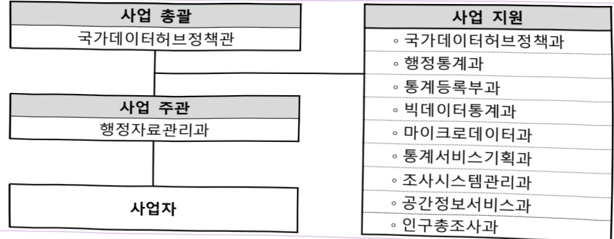
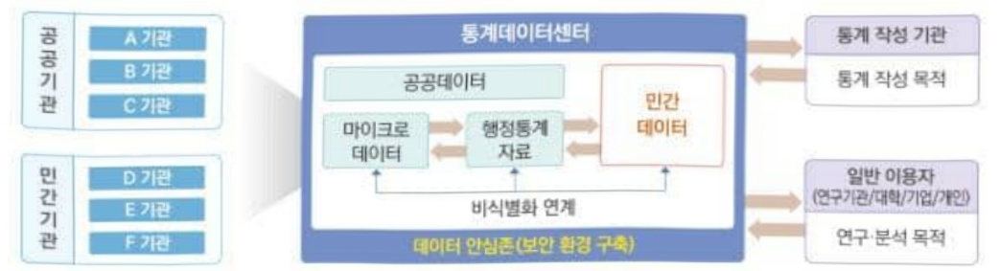
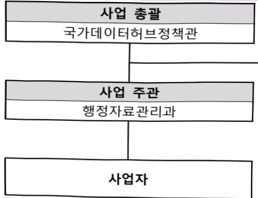
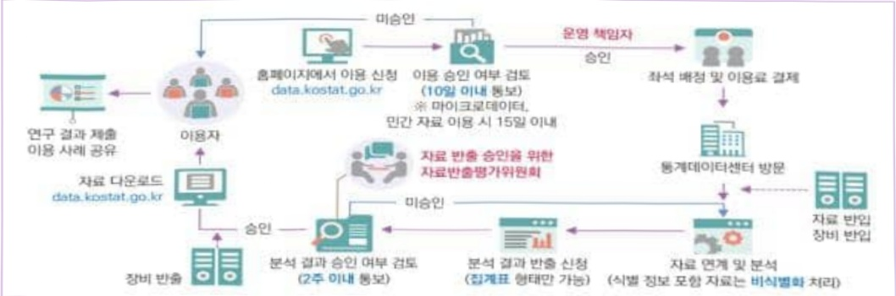
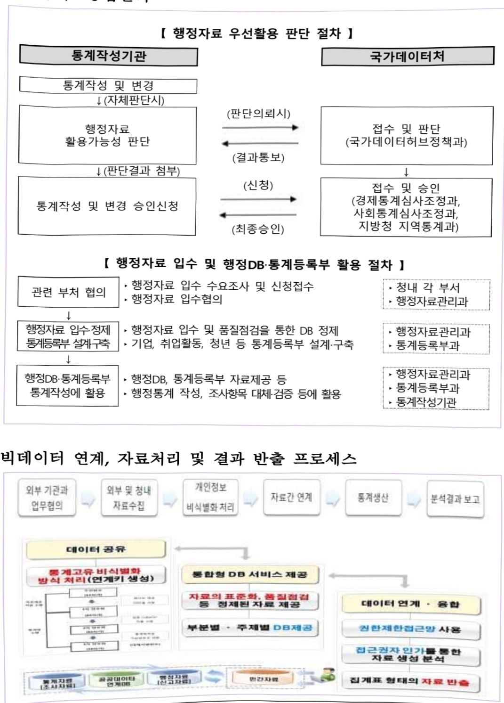
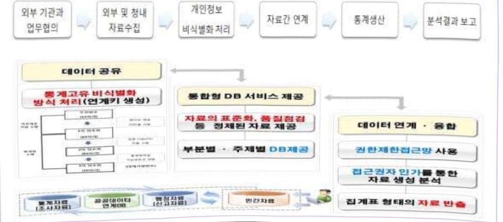

# 통계데이터 분석 및 활용 지원(정보화)

**해당 페이지**: PDF 1942 ~ 1961 쪽 해당

**부처**: 국가데이터처
**분야**: 일반·지방행정
**회계유형**: 일반회계
**2026 확정예산**: 11247.0 백만원
**전년대비 증감률**: 9.0%
**AI 도메인**: LLM/언어모델, 데이터, 보안/사이버

---

### 가.예산 총괄표

(단위: 백만원, %)

<table border=1 style='margin: auto; word-wrap: break-word;'><tr><td rowspan="2">사업명</td><td rowspan="2">2024년 결산</td><td colspan="2">2025년 예산</td><td colspan="2">2026년</td><td rowspan="2">중감(B-A)</td><td rowspan="2">(B-A)/A</td></tr><tr><td style='text-align: center; word-wrap: break-word;'>본예산(A)</td><td style='text-align: center; word-wrap: break-word;'>추경</td><td style='text-align: center; word-wrap: break-word;'>요구</td><td style='text-align: center; word-wrap: break-word;'>본예산(B)</td></tr><tr><td style='text-align: center; word-wrap: break-word;'>통계데이터 분석 및 활용지원(정보화)</td><td style='text-align: center; word-wrap: break-word;'>7,398</td><td style='text-align: center; word-wrap: break-word;'>10,316</td><td style='text-align: center; word-wrap: break-word;'>10,316</td><td style='text-align: center; word-wrap: break-word;'>11,247</td><td style='text-align: center; word-wrap: break-word;'>11,247</td><td style='text-align: center; word-wrap: break-word;'>931</td><td style='text-align: center; word-wrap: break-word;'>9.0</td></tr></table>

□ 기능별(내역사업별), 목별 예산 내역

(단위:백만원)

<table border=1 style='margin: auto; word-wrap: break-word;'><tr><td rowspan="3"></td><td colspan="5">2024</td><td colspan="7">2025(2025.12.11)</td><td rowspan="3">2026</td></tr><tr><td rowspan="2">예산액(추정)</td><td rowspan="2">예산현액</td><td rowspan="2">집행액[실집행액]</td><td rowspan="2">이월액</td><td rowspan="2">불용액</td><td rowspan="2">본예산</td><td rowspan="2">예산현액</td><td rowspan="2">집행액[실집행액]</td><td colspan="2">전년도 이월액제외</td><td rowspan="2">이월예산액</td><td rowspan="2">불용예산액</td></tr><tr><td style='text-align: center; word-wrap: break-word;'>예산현액</td><td style='text-align: center; word-wrap: break-word;'>집행액[실집행액]</td></tr><tr><td style='text-align: center; word-wrap: break-word;'>○기능별분류(합계)</td><td style='text-align: center; word-wrap: break-word;'>7,740</td><td style='text-align: center; word-wrap: break-word;'>7,740</td><td style='text-align: center; word-wrap: break-word;'>7,398</td><td style='text-align: center; word-wrap: break-word;'></td><td style='text-align: center; word-wrap: break-word;'>342</td><td style='text-align: center; word-wrap: break-word;'>10,316</td><td style='text-align: center; word-wrap: break-word;'>10,316</td><td style='text-align: center; word-wrap: break-word;'>9,879</td><td style='text-align: center; word-wrap: break-word;'>10,316</td><td style='text-align: center; word-wrap: break-word;'>9,879</td><td style='text-align: center; word-wrap: break-word;'></td><td style='text-align: center; word-wrap: break-word;'>437</td><td style='text-align: center; word-wrap: break-word;'>11,247</td></tr><tr><td style='text-align: center; word-wrap: break-word;'>·통계데이터센터운영</td><td style='text-align: center; word-wrap: break-word;'>3,750</td><td style='text-align: center; word-wrap: break-word;'>3,750</td><td style='text-align: center; word-wrap: break-word;'>3,632</td><td style='text-align: center; word-wrap: break-word;'></td><td style='text-align: center; word-wrap: break-word;'>118</td><td style='text-align: center; word-wrap: break-word;'>5,779</td><td style='text-align: center; word-wrap: break-word;'>5,779</td><td style='text-align: center; word-wrap: break-word;'>5,466</td><td style='text-align: center; word-wrap: break-word;'>5,779</td><td style='text-align: center; word-wrap: break-word;'>5,466</td><td style='text-align: center; word-wrap: break-word;'></td><td style='text-align: center; word-wrap: break-word;'>313</td><td style='text-align: center; word-wrap: break-word;'>5,654</td></tr><tr><td style='text-align: center; word-wrap: break-word;'>·데이터융복합</td><td style='text-align: center; word-wrap: break-word;'>2,797</td><td style='text-align: center; word-wrap: break-word;'>2,797</td><td style='text-align: center; word-wrap: break-word;'>2,702</td><td style='text-align: center; word-wrap: break-word;'></td><td style='text-align: center; word-wrap: break-word;'>95</td><td style='text-align: center; word-wrap: break-word;'>2,905</td><td style='text-align: center; word-wrap: break-word;'>2,905</td><td style='text-align: center; word-wrap: break-word;'>2,868</td><td style='text-align: center; word-wrap: break-word;'>2,905</td><td style='text-align: center; word-wrap: break-word;'>2,868</td><td style='text-align: center; word-wrap: break-word;'></td><td style='text-align: center; word-wrap: break-word;'>37</td><td style='text-align: center; word-wrap: break-word;'>3,133</td></tr><tr><td style='text-align: center; word-wrap: break-word;'>관리체계운영</td><td style='text-align: center; word-wrap: break-word;'>547</td><td style='text-align: center; word-wrap: break-word;'>547</td><td style='text-align: center; word-wrap: break-word;'>444</td><td style='text-align: center; word-wrap: break-word;'></td><td style='text-align: center; word-wrap: break-word;'>103</td><td style='text-align: center; word-wrap: break-word;'>599</td><td style='text-align: center; word-wrap: break-word;'>599</td><td style='text-align: center; word-wrap: break-word;'>572</td><td style='text-align: center; word-wrap: break-word;'>599</td><td style='text-align: center; word-wrap: break-word;'>572</td><td style='text-align: center; word-wrap: break-word;'></td><td style='text-align: center; word-wrap: break-word;'>27</td><td style='text-align: center; word-wrap: break-word;'>513</td></tr><tr><td style='text-align: center; word-wrap: break-word;'>·행정자료통합관리</td><td style='text-align: center; word-wrap: break-word;'>646</td><td style='text-align: center; word-wrap: break-word;'>646</td><td style='text-align: center; word-wrap: break-word;'>620</td><td style='text-align: center; word-wrap: break-word;'></td><td style='text-align: center; word-wrap: break-word;'>26</td><td style='text-align: center; word-wrap: break-word;'>580</td><td style='text-align: center; word-wrap: break-word;'>580</td><td style='text-align: center; word-wrap: break-word;'>569</td><td style='text-align: center; word-wrap: break-word;'>580</td><td style='text-align: center; word-wrap: break-word;'>569</td><td style='text-align: center; word-wrap: break-word;'></td><td style='text-align: center; word-wrap: break-word;'>11</td><td style='text-align: center; word-wrap: break-word;'>610</td></tr><tr><td style='text-align: center; word-wrap: break-word;'>·빅데이터시스템운영</td><td style='text-align: center; word-wrap: break-word;'>-</td><td style='text-align: center; word-wrap: break-word;'>-</td><td style='text-align: center; word-wrap: break-word;'>-</td><td style='text-align: center; word-wrap: break-word;'></td><td style='text-align: center; word-wrap: break-word;'>-</td><td style='text-align: center; word-wrap: break-word;'>453</td><td style='text-align: center; word-wrap: break-word;'>453</td><td style='text-align: center; word-wrap: break-word;'>404</td><td style='text-align: center; word-wrap: break-word;'>453</td><td style='text-align: center; word-wrap: break-word;'>404</td><td style='text-align: center; word-wrap: break-word;'></td><td style='text-align: center; word-wrap: break-word;'>49</td><td style='text-align: center; word-wrap: break-word;'>-</td></tr><tr><td style='text-align: center; word-wrap: break-word;'>·개인정보영향평가</td><td style='text-align: center; word-wrap: break-word;'>-</td><td style='text-align: center; word-wrap: break-word;'>-</td><td style='text-align: center; word-wrap: break-word;'>-</td><td style='text-align: center; word-wrap: break-word;'></td><td style='text-align: center; word-wrap: break-word;'>-</td><td style='text-align: center; word-wrap: break-word;'>-</td><td style='text-align: center; word-wrap: break-word;'>-</td><td style='text-align: center; word-wrap: break-word;'>-</td><td style='text-align: center; word-wrap: break-word;'>-</td><td style='text-align: center; word-wrap: break-word;'>-</td><td style='text-align: center; word-wrap: break-word;'></td><td style='text-align: center; word-wrap: break-word;'>-</td><td style='text-align: center; word-wrap: break-word;'>907</td></tr><tr><td style='text-align: center; word-wrap: break-word;'>·AI기반 정보보호</td><td style='text-align: center; word-wrap: break-word;'>-</td><td style='text-align: center; word-wrap: break-word;'>-</td><td style='text-align: center; word-wrap: break-word;'>-</td><td style='text-align: center; word-wrap: break-word;'></td><td style='text-align: center; word-wrap: break-word;'>-</td><td style='text-align: center; word-wrap: break-word;'>-</td><td style='text-align: center; word-wrap: break-word;'>-</td><td style='text-align: center; word-wrap: break-word;'>-</td><td style='text-align: center; word-wrap: break-word;'>-</td><td style='text-align: center; word-wrap: break-word;'>-</td><td style='text-align: center; word-wrap: break-word;'></td><td style='text-align: center; word-wrap: break-word;'>-</td><td style='text-align: center; word-wrap: break-word;'>430</td></tr><tr><td style='text-align: center; word-wrap: break-word;'>·국가데이터 거버넌스 추진</td><td style='text-align: center; word-wrap: break-word;'></td><td style='text-align: center; word-wrap: break-word;'></td><td style='text-align: center; word-wrap: break-word;'></td><td style='text-align: center; word-wrap: break-word;'></td><td style='text-align: center; word-wrap: break-word;'></td><td style='text-align: center; word-wrap: break-word;'></td><td style='text-align: center; word-wrap: break-word;'></td><td style='text-align: center; word-wrap: break-word;'></td><td style='text-align: center; word-wrap: break-word;'></td><td style='text-align: center; word-wrap: break-word;'></td><td style='text-align: center; word-wrap: break-word;'></td><td style='text-align: center; word-wrap: break-word;'></td><td style='text-align: center; word-wrap: break-word;'>437</td></tr><tr><td style='text-align: center; word-wrap: break-word;'>○비목별분류(합계)</td><td style='text-align: center; word-wrap: break-word;'>7,740</td><td style='text-align: center; word-wrap: break-word;'>7,740</td><td style='text-align: center; word-wrap: break-word;'>7,398</td><td style='text-align: center; word-wrap: break-word;'></td><td style='text-align: center; word-wrap: break-word;'>342</td><td style='text-align: center; word-wrap: break-word;'>10,316</td><td style='text-align: center; word-wrap: break-word;'>10,316</td><td style='text-align: center; word-wrap: break-word;'>9,879</td><td style='text-align: center; word-wrap: break-word;'>10,316</td><td style='text-align: center; word-wrap: break-word;'>9,879</td><td style='text-align: center; word-wrap: break-word;'></td><td style='text-align: center; word-wrap: break-word;'>437</td><td style='text-align: center; word-wrap: break-word;'>11,247</td></tr><tr><td style='text-align: center; word-wrap: break-word;'>·상용임금(110-3)</td><td style='text-align: center; word-wrap: break-word;'>82</td><td style='text-align: center; word-wrap: break-word;'>82</td><td style='text-align: center; word-wrap: break-word;'>80</td><td style='text-align: center; word-wrap: break-word;'></td><td style='text-align: center; word-wrap: break-word;'>2</td><td style='text-align: center; word-wrap: break-word;'>-</td><td style='text-align: center; word-wrap: break-word;'>-</td><td style='text-align: center; word-wrap: break-word;'>-</td><td style='text-align: center; word-wrap: break-word;'>-</td><td style='text-align: center; word-wrap: break-word;'>-</td><td style='text-align: center; word-wrap: break-word;'></td><td style='text-align: center; word-wrap: break-word;'></td><td style='text-align: center; word-wrap: break-word;'>-</td></tr><tr><td style='text-align: center; word-wrap: break-word;'>·일용임금(110-04)</td><td style='text-align: center; word-wrap: break-word;'>886</td><td style='text-align: center; word-wrap: break-word;'>886</td><td style='text-align: center; word-wrap: break-word;'>743</td><td style='text-align: center; word-wrap: break-word;'></td><td style='text-align: center; word-wrap: break-word;'>143</td><td style='text-align: center; word-wrap: break-word;'>1,059</td><td style='text-align: center; word-wrap: break-word;'>1,059</td><td style='text-align: center; word-wrap: break-word;'>996</td><td style='text-align: center; word-wrap: break-word;'>1,059</td><td style='text-align: center; word-wrap: break-word;'>996</td><td style='text-align: center; word-wrap: break-word;'></td><td style='text-align: center; word-wrap: break-word;'>63</td><td style='text-align: center; word-wrap: break-word;'>1,006</td></tr><tr><td style='text-align: center; word-wrap: break-word;'>·일반수용비(210-01)</td><td style='text-align: center; word-wrap: break-word;'>1,583</td><td style='text-align: center; word-wrap: break-word;'>1,487</td><td style='text-align: center; word-wrap: break-word;'>1,447</td><td style='text-align: center; word-wrap: break-word;'></td><td style='text-align: center; word-wrap: break-word;'>40</td><td style='text-align: center; word-wrap: break-word;'>1,597</td><td style='text-align: center; word-wrap: break-word;'>1,613</td><td style='text-align: center; word-wrap: break-word;'>1,610</td><td style='text-align: center; word-wrap: break-word;'>1,613</td><td style='text-align: center; word-wrap: break-word;'>1,610</td><td style='text-align: center; word-wrap: break-word;'></td><td style='text-align: center; word-wrap: break-word;'>3</td><td style='text-align: center; word-wrap: break-word;'>1,667</td></tr><tr><td style='text-align: center; word-wrap: break-word;'>·공공요금및제세(210-02)</td><td style='text-align: center; word-wrap: break-word;'>60</td><td style='text-align: center; word-wrap: break-word;'>50</td><td style='text-align: center; word-wrap: break-word;'>38</td><td style='text-align: center; word-wrap: break-word;'></td><td style='text-align: center; word-wrap: break-word;'>12</td><td style='text-align: center; word-wrap: break-word;'>60</td><td style='text-align: center; word-wrap: break-word;'>60</td><td style='text-align: center; word-wrap: break-word;'>48</td><td style='text-align: center; word-wrap: break-word;'>60</td><td style='text-align: center; word-wrap: break-word;'>48</td><td style='text-align: center; word-wrap: break-word;'></td><td style='text-align: center; word-wrap: break-word;'>12</td><td style='text-align: center; word-wrap: break-word;'>60</td></tr><tr><td style='text-align: center; word-wrap: break-word;'>·특근매식비(210-05)</td><td style='text-align: center; word-wrap: break-word;'>2</td><td style='text-align: center; word-wrap: break-word;'>2</td><td style='text-align: center; word-wrap: break-word;'>2</td><td style='text-align: center; word-wrap: break-word;'></td><td style='text-align: center; word-wrap: break-word;'>-</td><td style='text-align: center; word-wrap: break-word;'>2</td><td style='text-align: center; word-wrap: break-word;'>2</td><td style='text-align: center; word-wrap: break-word;'>2</td><td style='text-align: center; word-wrap: break-word;'>2</td><td style='text-align: center; word-wrap: break-word;'>2</td><td style='text-align: center; word-wrap: break-word;'></td><td style='text-align: center; word-wrap: break-word;'>-</td><td style='text-align: center; word-wrap: break-word;'>2</td></tr><tr><td style='text-align: center; word-wrap: break-word;'>·임차료(210-07)</td><td style='text-align: center; word-wrap: break-word;'>580</td><td style='text-align: center; word-wrap: break-word;'>567</td><td style='text-align: center; word-wrap: break-word;'>484</td><td style='text-align: center; word-wrap: break-word;'></td><td style='text-align: center; word-wrap: break-word;'>83</td><td style='text-align: center; word-wrap: break-word;'>862</td><td style='text-align: center; word-wrap: break-word;'>793</td><td style='text-align: center; word-wrap: break-word;'>567</td><td style='text-align: center; word-wrap: break-word;'>793</td><td style='text-align: center; word-wrap: break-word;'>567</td><td style='text-align: center; word-wrap: break-word;'></td><td style='text-align: center; word-wrap: break-word;'>226</td><td style='text-align: center; word-wrap: break-word;'>1,179</td></tr><tr><td style='text-align: center; word-wrap: break-word;'>·시설장비유지비(210-09)</td><td style='text-align: center; word-wrap: break-word;'>-</td><td style='text-align: center; word-wrap: break-word;'>23</td><td style='text-align: center; word-wrap: break-word;'>21</td><td style='text-align: center; word-wrap: break-word;'></td><td style='text-align: center; word-wrap: break-word;'>2</td><td style='text-align: center; word-wrap: break-word;'>70</td><td style='text-align: center; word-wrap: break-word;'>100</td><td style='text-align: center; word-wrap: break-word;'>100</td><td style='text-align: center; word-wrap: break-word;'>100</td><td style='text-align: center; word-wrap: break-word;'>100</td><td style='text-align: center; word-wrap: break-word;'></td><td style='text-align: center; word-wrap: break-word;'>-</td><td style='text-align: center; word-wrap: break-word;'>20</td></tr><tr><td style='text-align: center; word-wrap: break-word;'>·복리후생비(210-12)</td><td style='text-align: center; word-wrap: break-word;'>2</td><td style='text-align: center; word-wrap: break-word;'>2</td><td style='text-align: center; word-wrap: break-word;'>1</td><td style='text-align: center; word-wrap: break-word;'></td><td style='text-align: center; word-wrap: break-word;'>-</td><td style='text-align: center; word-wrap: break-word;'>-</td><td style='text-align: center; word-wrap: break-word;'>-</td><td style='text-align: center; word-wrap: break-word;'>-</td><td style='text-align: center; word-wrap: break-word;'>-</td><td style='text-align: center; word-wrap: break-word;'>-</td><td style='text-align: center; word-wrap: break-word;'></td><td style='text-align: center; word-wrap: break-word;'></td><td style='text-align: center; word-wrap: break-word;'>-</td></tr><tr><td style='text-align: center; word-wrap: break-word;'>·일반용역비(210-14)</td><td style='text-align: center; word-wrap: break-word;'>-</td><td style='text-align: center; word-wrap: break-word;'>96</td><td style='text-align: center; word-wrap: break-word;'>95</td><td style='text-align: center; word-wrap: break-word;'></td><td style='text-align: center; word-wrap: break-word;'>1</td><td style='text-align: center; word-wrap: break-word;'>-</td><td style='text-align: center; word-wrap: break-word;'>23</td><td style='text-align: center; word-wrap: break-word;'>23</td><td style='text-align: center; word-wrap: break-word;'>23</td><td style='text-align: center; word-wrap: break-word;'>23</td><td style='text-align: center; word-wrap: break-word;'></td><td style='text-align: center; word-wrap: break-word;'>-</td><td style='text-align: center; word-wrap: break-word;'>-</td></tr></table>

---

<table border=1 style='margin: auto; word-wrap: break-word;'><tr><td rowspan="2"></td><td colspan="4">2024</td><td colspan="7">2025(2025.12월말)</td><td style='text-align: center; word-wrap: break-word;'>2026예산</td></tr><tr><td style='text-align: center; word-wrap: break-word;'>예산액(추정)</td><td style='text-align: center; word-wrap: break-word;'>예산현액</td><td style='text-align: center; word-wrap: break-word;'>집행액[실집행액]</td><td style='text-align: center; word-wrap: break-word;'>이월액</td><td style='text-align: center; word-wrap: break-word;'>불용액</td><td style='text-align: center; word-wrap: break-word;'>본예산</td><td style='text-align: center; word-wrap: break-word;'>예산현액</td><td style='text-align: center; word-wrap: break-word;'>집행액[실집행액]</td><td style='text-align: center; word-wrap: break-word;'>예산현액</td><td style='text-align: center; word-wrap: break-word;'>집행액[실집행액]</td><td style='text-align: center; word-wrap: break-word;'>이월예상액</td><td style='text-align: center; word-wrap: break-word;'>불용예상액</td></tr><tr><td style='text-align: center; word-wrap: break-word;'>-관리용역비(210-15)</td><td style='text-align: center; word-wrap: break-word;'>3,698</td><td style='text-align: center; word-wrap: break-word;'>3,698</td><td style='text-align: center; word-wrap: break-word;'>3,667</td><td style='text-align: center; word-wrap: break-word;'></td><td style='text-align: center; word-wrap: break-word;'>31</td><td style='text-align: center; word-wrap: break-word;'>4,393</td><td style='text-align: center; word-wrap: break-word;'>4,393</td><td style='text-align: center; word-wrap: break-word;'>4,343</td><td style='text-align: center; word-wrap: break-word;'>4,393</td><td style='text-align: center; word-wrap: break-word;'>4,343</td><td style='text-align: center; word-wrap: break-word;'></td><td style='text-align: center; word-wrap: break-word;'>50</td></tr><tr><td style='text-align: center; word-wrap: break-word;'>-국내여비(220-01)</td><td style='text-align: center; word-wrap: break-word;'>19</td><td style='text-align: center; word-wrap: break-word;'>19</td><td style='text-align: center; word-wrap: break-word;'>17</td><td style='text-align: center; word-wrap: break-word;'></td><td style='text-align: center; word-wrap: break-word;'>2</td><td style='text-align: center; word-wrap: break-word;'>34</td><td style='text-align: center; word-wrap: break-word;'>34</td><td style='text-align: center; word-wrap: break-word;'>32</td><td style='text-align: center; word-wrap: break-word;'>34</td><td style='text-align: center; word-wrap: break-word;'>32</td><td style='text-align: center; word-wrap: break-word;'></td><td style='text-align: center; word-wrap: break-word;'>2</td></tr><tr><td style='text-align: center; word-wrap: break-word;'>-사업추진비(240-01)</td><td style='text-align: center; word-wrap: break-word;'>22</td><td style='text-align: center; word-wrap: break-word;'>22</td><td style='text-align: center; word-wrap: break-word;'>22</td><td style='text-align: center; word-wrap: break-word;'></td><td style='text-align: center; word-wrap: break-word;'>-</td><td style='text-align: center; word-wrap: break-word;'>22</td><td style='text-align: center; word-wrap: break-word;'>22</td><td style='text-align: center; word-wrap: break-word;'>22</td><td style='text-align: center; word-wrap: break-word;'>22</td><td style='text-align: center; word-wrap: break-word;'>22</td><td style='text-align: center; word-wrap: break-word;'></td><td style='text-align: center; word-wrap: break-word;'>-</td></tr><tr><td style='text-align: center; word-wrap: break-word;'>-일반연구비(260-01)</td><td style='text-align: center; word-wrap: break-word;'>378</td><td style='text-align: center; word-wrap: break-word;'>378</td><td style='text-align: center; word-wrap: break-word;'>363</td><td style='text-align: center; word-wrap: break-word;'></td><td style='text-align: center; word-wrap: break-word;'>15</td><td style='text-align: center; word-wrap: break-word;'>1,972</td><td style='text-align: center; word-wrap: break-word;'>1,972</td><td style='text-align: center; word-wrap: break-word;'>1,909</td><td style='text-align: center; word-wrap: break-word;'>1,972</td><td style='text-align: center; word-wrap: break-word;'>1,909</td><td style='text-align: center; word-wrap: break-word;'></td><td style='text-align: center; word-wrap: break-word;'>63</td></tr><tr><td style='text-align: center; word-wrap: break-word;'>-포상금(310-03)</td><td style='text-align: center; word-wrap: break-word;'>20</td><td style='text-align: center; word-wrap: break-word;'>20</td><td style='text-align: center; word-wrap: break-word;'>20</td><td style='text-align: center; word-wrap: break-word;'></td><td style='text-align: center; word-wrap: break-word;'>-</td><td style='text-align: center; word-wrap: break-word;'>20</td><td style='text-align: center; word-wrap: break-word;'>20</td><td style='text-align: center; word-wrap: break-word;'>20</td><td style='text-align: center; word-wrap: break-word;'>20</td><td style='text-align: center; word-wrap: break-word;'>20</td><td style='text-align: center; word-wrap: break-word;'></td><td style='text-align: center; word-wrap: break-word;'>-</td></tr><tr><td style='text-align: center; word-wrap: break-word;'>-고용부담금(320-09)</td><td style='text-align: center; word-wrap: break-word;'>153</td><td style='text-align: center; word-wrap: break-word;'>153</td><td style='text-align: center; word-wrap: break-word;'>148</td><td style='text-align: center; word-wrap: break-word;'></td><td style='text-align: center; word-wrap: break-word;'>5</td><td style='text-align: center; word-wrap: break-word;'>156</td><td style='text-align: center; word-wrap: break-word;'>156</td><td style='text-align: center; word-wrap: break-word;'>139</td><td style='text-align: center; word-wrap: break-word;'>156</td><td style='text-align: center; word-wrap: break-word;'>139</td><td style='text-align: center; word-wrap: break-word;'></td><td style='text-align: center; word-wrap: break-word;'>17</td></tr><tr><td style='text-align: center; word-wrap: break-word;'>-자산취득비(430-01)</td><td style='text-align: center; word-wrap: break-word;'>255</td><td style='text-align: center; word-wrap: break-word;'>255</td><td style='text-align: center; word-wrap: break-word;'>250</td><td style='text-align: center; word-wrap: break-word;'></td><td style='text-align: center; word-wrap: break-word;'>5</td><td style='text-align: center; word-wrap: break-word;'>69</td><td style='text-align: center; word-wrap: break-word;'>69</td><td style='text-align: center; word-wrap: break-word;'>68</td><td style='text-align: center; word-wrap: break-word;'>69</td><td style='text-align: center; word-wrap: break-word;'>68</td><td style='text-align: center; word-wrap: break-word;'></td><td style='text-align: center; word-wrap: break-word;'>1</td></tr><tr><td style='text-align: center; word-wrap: break-word;'>○ 가능비목별 분류함제</td><td style='text-align: center; word-wrap: break-word;'>7,740</td><td style='text-align: center; word-wrap: break-word;'>7,740</td><td style='text-align: center; word-wrap: break-word;'>7,398</td><td style='text-align: center; word-wrap: break-word;'></td><td style='text-align: center; word-wrap: break-word;'>342</td><td style='text-align: center; word-wrap: break-word;'>10,316</td><td style='text-align: center; word-wrap: break-word;'>10,316</td><td style='text-align: center; word-wrap: break-word;'>9,879</td><td style='text-align: center; word-wrap: break-word;'>10,316</td><td style='text-align: center; word-wrap: break-word;'>9,879</td><td style='text-align: center; word-wrap: break-word;'></td><td style='text-align: center; word-wrap: break-word;'>437</td></tr><tr><td style='text-align: center; word-wrap: break-word;'>·통계테이터센터운영</td><td style='text-align: center; word-wrap: break-word;'>3,750</td><td style='text-align: center; word-wrap: break-word;'>3,750</td><td style='text-align: center; word-wrap: break-word;'>3,632</td><td style='text-align: center; word-wrap: break-word;'></td><td style='text-align: center; word-wrap: break-word;'>118</td><td style='text-align: center; word-wrap: break-word;'>5,779</td><td style='text-align: center; word-wrap: break-word;'>5,779</td><td style='text-align: center; word-wrap: break-word;'>5,466</td><td style='text-align: center; word-wrap: break-word;'>5,779</td><td style='text-align: center; word-wrap: break-word;'>5,466</td><td style='text-align: center; word-wrap: break-word;'></td><td style='text-align: center; word-wrap: break-word;'>313</td></tr><tr><td style='text-align: center; word-wrap: break-word;'>-상용임금(110-03)</td><td style='text-align: center; word-wrap: break-word;'>82</td><td style='text-align: center; word-wrap: break-word;'>82</td><td style='text-align: center; word-wrap: break-word;'>80</td><td style='text-align: center; word-wrap: break-word;'></td><td style='text-align: center; word-wrap: break-word;'>2</td><td style='text-align: center; word-wrap: break-word;'>-</td><td style='text-align: center; word-wrap: break-word;'>-</td><td style='text-align: center; word-wrap: break-word;'>-</td><td style='text-align: center; word-wrap: break-word;'>-</td><td style='text-align: center; word-wrap: break-word;'>-</td><td style='text-align: center; word-wrap: break-word;'></td><td style='text-align: center; word-wrap: break-word;'>-</td></tr><tr><td style='text-align: center; word-wrap: break-word;'>-일용임금(110-04)</td><td style='text-align: center; word-wrap: break-word;'>547</td><td style='text-align: center; word-wrap: break-word;'>547</td><td style='text-align: center; word-wrap: break-word;'>505</td><td style='text-align: center; word-wrap: break-word;'></td><td style='text-align: center; word-wrap: break-word;'>42</td><td style='text-align: center; word-wrap: break-word;'>720</td><td style='text-align: center; word-wrap: break-word;'>720</td><td style='text-align: center; word-wrap: break-word;'>678</td><td style='text-align: center; word-wrap: break-word;'>720</td><td style='text-align: center; word-wrap: break-word;'>678</td><td style='text-align: center; word-wrap: break-word;'></td><td style='text-align: center; word-wrap: break-word;'>42</td></tr><tr><td style='text-align: center; word-wrap: break-word;'>-일반수용비(210-01)</td><td style='text-align: center; word-wrap: break-word;'>1,478</td><td style='text-align: center; word-wrap: break-word;'>1,382</td><td style='text-align: center; word-wrap: break-word;'>1360</td><td style='text-align: center; word-wrap: break-word;'></td><td style='text-align: center; word-wrap: break-word;'>23</td><td style='text-align: center; word-wrap: break-word;'>1,492</td><td style='text-align: center; word-wrap: break-word;'>1,511</td><td style='text-align: center; word-wrap: break-word;'>1511</td><td style='text-align: center; word-wrap: break-word;'>1,511</td><td style='text-align: center; word-wrap: break-word;'>1511</td><td style='text-align: center; word-wrap: break-word;'></td><td style='text-align: center; word-wrap: break-word;'>-</td></tr><tr><td style='text-align: center; word-wrap: break-word;'>-공공요금및제세(210-02)</td><td style='text-align: center; word-wrap: break-word;'>60</td><td style='text-align: center; word-wrap: break-word;'>50</td><td style='text-align: center; word-wrap: break-word;'>38</td><td style='text-align: center; word-wrap: break-word;'></td><td style='text-align: center; word-wrap: break-word;'>12</td><td style='text-align: center; word-wrap: break-word;'>60</td><td style='text-align: center; word-wrap: break-word;'>60</td><td style='text-align: center; word-wrap: break-word;'>48</td><td style='text-align: center; word-wrap: break-word;'>60</td><td style='text-align: center; word-wrap: break-word;'>48</td><td style='text-align: center; word-wrap: break-word;'></td><td style='text-align: center; word-wrap: break-word;'>12</td></tr><tr><td style='text-align: center; word-wrap: break-word;'>-입차료(210-07)</td><td style='text-align: center; word-wrap: break-word;'>334</td><td style='text-align: center; word-wrap: break-word;'>321</td><td style='text-align: center; word-wrap: break-word;'>310</td><td style='text-align: center; word-wrap: break-word;'></td><td style='text-align: center; word-wrap: break-word;'>11</td><td style='text-align: center; word-wrap: break-word;'>623</td><td style='text-align: center; word-wrap: break-word;'>554</td><td style='text-align: center; word-wrap: break-word;'>339</td><td style='text-align: center; word-wrap: break-word;'>554</td><td style='text-align: center; word-wrap: break-word;'>339</td><td style='text-align: center; word-wrap: break-word;'></td><td style='text-align: center; word-wrap: break-word;'>215</td></tr><tr><td style='text-align: center; word-wrap: break-word;'>-사살장비유지비(210-09)</td><td style='text-align: center; word-wrap: break-word;'>-</td><td style='text-align: center; word-wrap: break-word;'>23</td><td style='text-align: center; word-wrap: break-word;'>21</td><td style='text-align: center; word-wrap: break-word;'></td><td style='text-align: center; word-wrap: break-word;'>2</td><td style='text-align: center; word-wrap: break-word;'>70</td><td style='text-align: center; word-wrap: break-word;'>100</td><td style='text-align: center; word-wrap: break-word;'>100</td><td style='text-align: center; word-wrap: break-word;'>100</td><td style='text-align: center; word-wrap: break-word;'>100</td><td style='text-align: center; word-wrap: break-word;'></td><td style='text-align: center; word-wrap: break-word;'>-</td></tr><tr><td style='text-align: center; word-wrap: break-word;'>-복리후생비(210-12)</td><td style='text-align: center; word-wrap: break-word;'>2</td><td style='text-align: center; word-wrap: break-word;'>2</td><td style='text-align: center; word-wrap: break-word;'>1</td><td style='text-align: center; word-wrap: break-word;'></td><td style='text-align: center; word-wrap: break-word;'>-</td><td style='text-align: center; word-wrap: break-word;'>-</td><td style='text-align: center; word-wrap: break-word;'>-</td><td style='text-align: center; word-wrap: break-word;'>-</td><td style='text-align: center; word-wrap: break-word;'></td><td style='text-align: center; word-wrap: break-word;'></td><td style='text-align: center; word-wrap: break-word;'></td><td style='text-align: center; word-wrap: break-word;'>-</td></tr><tr><td style='text-align: center; word-wrap: break-word;'>-일반용역비(210-14)</td><td style='text-align: center; word-wrap: break-word;'>-</td><td style='text-align: center; word-wrap: break-word;'>96</td><td style='text-align: center; word-wrap: break-word;'>95</td><td style='text-align: center; word-wrap: break-word;'></td><td style='text-align: center; word-wrap: break-word;'>1</td><td style='text-align: center; word-wrap: break-word;'>-</td><td style='text-align: center; word-wrap: break-word;'>20</td><td style='text-align: center; word-wrap: break-word;'>20</td><td style='text-align: center; word-wrap: break-word;'>20</td><td style='text-align: center; word-wrap: break-word;'>20</td><td style='text-align: center; word-wrap: break-word;'></td><td style='text-align: center; word-wrap: break-word;'>-</td></tr><tr><td style='text-align: center; word-wrap: break-word;'>-관리용역비(210-15)</td><td style='text-align: center; word-wrap: break-word;'>950</td><td style='text-align: center; word-wrap: break-word;'>950</td><td style='text-align: center; word-wrap: break-word;'>943</td><td style='text-align: center; word-wrap: break-word;'></td><td style='text-align: center; word-wrap: break-word;'>7</td><td style='text-align: center; word-wrap: break-word;'>1,304</td><td style='text-align: center; word-wrap: break-word;'>1,304</td><td style='text-align: center; word-wrap: break-word;'>1284</td><td style='text-align: center; word-wrap: break-word;'>1,304</td><td style='text-align: center; word-wrap: break-word;'>1284</td><td style='text-align: center; word-wrap: break-word;'></td><td style='text-align: center; word-wrap: break-word;'>20</td></tr><tr><td style='text-align: center; word-wrap: break-word;'>-국내여비(220-01)</td><td style='text-align: center; word-wrap: break-word;'>3</td><td style='text-align: center; word-wrap: break-word;'>3</td><td style='text-align: center; word-wrap: break-word;'>3</td><td style='text-align: center; word-wrap: break-word;'></td><td style='text-align: center; word-wrap: break-word;'>-</td><td style='text-align: center; word-wrap: break-word;'>18</td><td style='text-align: center; word-wrap: break-word;'>18</td><td style='text-align: center; word-wrap: break-word;'>18</td><td style='text-align: center; word-wrap: break-word;'>18</td><td style='text-align: center; word-wrap: break-word;'>18</td><td style='text-align: center; word-wrap: break-word;'></td><td style='text-align: center; word-wrap: break-word;'>-</td></tr><tr><td style='text-align: center; word-wrap: break-word;'>-사업추진비(240-01)</td><td style='text-align: center; word-wrap: break-word;'>15</td><td style='text-align: center; word-wrap: break-word;'>15</td><td style='text-align: center; word-wrap: break-word;'>15</td><td style='text-align: center; word-wrap: break-word;'></td><td style='text-align: center; word-wrap: break-word;'>-</td><td style='text-align: center; word-wrap: break-word;'>15</td><td style='text-align: center; word-wrap: break-word;'>15</td><td style='text-align: center; word-wrap: break-word;'>15</td><td style='text-align: center; word-wrap: break-word;'>15</td><td style='text-align: center; word-wrap: break-word;'>15</td><td style='text-align: center; word-wrap: break-word;'></td><td style='text-align: center; word-wrap: break-word;'>-</td></tr><tr><td style='text-align: center; word-wrap: break-word;'>-일반연구비(260-01)</td><td style='text-align: center; word-wrap: break-word;'>100</td><td style='text-align: center; word-wrap: break-word;'>100</td><td style='text-align: center; word-wrap: break-word;'>85</td><td style='text-align: center; word-wrap: break-word;'></td><td style='text-align: center; word-wrap: break-word;'>15</td><td style='text-align: center; word-wrap: break-word;'>1,286</td><td style='text-align: center; word-wrap: break-word;'>1,286</td><td style='text-align: center; word-wrap: break-word;'>1,272</td><td style='text-align: center; word-wrap: break-word;'>1,286</td><td style='text-align: center; word-wrap: break-word;'>1,272</td><td style='text-align: center; word-wrap: break-word;'></td><td style='text-align: center; word-wrap: break-word;'>14</td></tr><tr><td style='text-align: center; word-wrap: break-word;'>-포상금(310-03)</td><td style='text-align: center; word-wrap: break-word;'>20</td><td style='text-align: center; word-wrap: break-word;'>20</td><td style='text-align: center; word-wrap: break-word;'>20</td><td style='text-align: center; word-wrap: break-word;'></td><td style='text-align: center; word-wrap: break-word;'>-</td><td style='text-align: center; word-wrap: break-word;'>20</td><td style='text-align: center; word-wrap: break-word;'>20</td><td style='text-align: center; word-wrap: break-word;'>20</td><td style='text-align: center; word-wrap: break-word;'>20</td><td style='text-align: center; word-wrap: break-word;'>20</td><td style='text-align: center; word-wrap: break-word;'></td><td style='text-align: center; word-wrap: break-word;'>-</td></tr><tr><td style='text-align: center; word-wrap: break-word;'>-고용부담금(320-09)</td><td style='text-align: center; word-wrap: break-word;'>115</td><td style='text-align: center; word-wrap: break-word;'>115</td><td style='text-align: center; word-wrap: break-word;'>115</td><td style='text-align: center; word-wrap: break-word;'></td><td style='text-align: center; word-wrap: break-word;'>1</td><td style='text-align: center; word-wrap: break-word;'>118</td><td style='text-align: center; word-wrap: break-word;'>118</td><td style='text-align: center; word-wrap: break-word;'>108</td><td style='text-align: center; word-wrap: break-word;'>118</td><td style='text-align: center; word-wrap: break-word;'>108</td><td style='text-align: center; word-wrap: break-word;'></td><td style='text-align: center; word-wrap: break-word;'>10</td></tr><tr><td style='text-align: center; word-wrap: break-word;'>-자산취득비(430-01)</td><td style='text-align: center; word-wrap: break-word;'>44</td><td style='text-align: center; word-wrap: break-word;'>44</td><td style='text-align: center; word-wrap: break-word;'>43</td><td style='text-align: center; word-wrap: break-word;'></td><td style='text-align: center; word-wrap: break-word;'>1</td><td style='text-align: center; word-wrap: break-word;'>53</td><td style='text-align: center; word-wrap: break-word;'>53</td><td style='text-align: center; word-wrap: break-word;'>53</td><td style='text-align: center; word-wrap: break-word;'>53</td><td style='text-align: center; word-wrap: break-word;'>53</td><td style='text-align: center; word-wrap: break-word;'></td><td style='text-align: center; word-wrap: break-word;'>-</td></tr><tr><td style='text-align: center; word-wrap: break-word;'>·데이터용복합 관리체계 구축 및 운영</td><td style='text-align: center; word-wrap: break-word;'>2,797</td><td style='text-align: center; word-wrap: break-word;'>2,797</td><td style='text-align: center; word-wrap: break-word;'>2,702</td><td style='text-align: center; word-wrap: break-word;'></td><td style='text-align: center; word-wrap: break-word;'>95</td><td style='text-align: center; word-wrap: break-word;'>2,905</td><td style='text-align: center; word-wrap: break-word;'>2,905</td><td style='text-align: center; word-wrap: break-word;'>2,868</td><td style='text-align: center; word-wrap: break-word;'>2,905</td><td style='text-align: center; word-wrap: break-word;'>2,868</td><td style='text-align: center; word-wrap: break-word;'></td><td style='text-align: center; word-wrap: break-word;'>37</td></tr><tr><td style='text-align: center; word-wrap: break-word;'>-임차료(210-07)</td><td style='text-align: center; word-wrap: break-word;'>243</td><td style='text-align: center; word-wrap: break-word;'>243</td><td style='text-align: center; word-wrap: break-word;'>171</td><td style='text-align: center; word-wrap: break-word;'></td><td style='text-align: center; word-wrap: break-word;'>72</td><td style='text-align: center; word-wrap: break-word;'>236</td><td style='text-align: center; word-wrap: break-word;'>236</td><td style='text-align: center; word-wrap: break-word;'>226</td><td style='text-align: center; word-wrap: break-word;'>236</td><td style='text-align: center; word-wrap: break-word;'>226</td><td style='text-align: center; word-wrap: break-word;'></td><td style='text-align: center; word-wrap: break-word;'>10</td></tr><tr><td style='text-align: center; word-wrap: break-word;'>-관리용역비(210-15)</td><td style='text-align: center; word-wrap: break-word;'>2,343</td><td style='text-align: center; word-wrap: break-word;'>2,343</td><td style='text-align: center; word-wrap: break-word;'>2,323</td><td style='text-align: center; word-wrap: break-word;'></td><td style='text-align: center; word-wrap: break-word;'>20</td><td style='text-align: center; word-wrap: break-word;'>2,653</td><td style='text-align: center; word-wrap: break-word;'>2,653</td><td style='text-align: center; word-wrap: break-word;'>2627</td><td style='text-align: center; word-wrap: break-word;'>2,653</td><td style='text-align: center; word-wrap: break-word;'>2627</td><td style='text-align: center; word-wrap: break-word;'></td><td style='text-align: center; word-wrap: break-word;'>26</td></tr><tr><td style='text-align: center; word-wrap: break-word;'>-자산취득비(430-01)</td><td style='text-align: center; word-wrap: break-word;'>211</td><td style='text-align: center; word-wrap: break-word;'>211</td><td style='text-align: center; word-wrap: break-word;'>207</td><td style='text-align: center; word-wrap: break-word;'></td><td style='text-align: center; word-wrap: break-word;'>4</td><td style='text-align: center; word-wrap: break-word;'>16</td><td style='text-align: center; word-wrap: break-word;'>16</td><td style='text-align: center; word-wrap: break-word;'>15</td><td style='text-align: center; word-wrap: break-word;'>16</td><td style='text-align: center; word-wrap: break-word;'>15</td><td style='text-align: center; word-wrap: break-word;'></td><td style='text-align: center; word-wrap: break-word;'>1</td></tr><tr><td style='text-align: center; word-wrap: break-word;'>·행정자료통합관리</td><td style='text-align: center; word-wrap: break-word;'>547</td><td style='text-align: center; word-wrap: break-word;'>547</td><td style='text-align: center; word-wrap: break-word;'>444</td><td style='text-align: center; word-wrap: break-word;'></td><td style='text-align: center; word-wrap: break-word;'>103</td><td style='text-align: center; word-wrap: break-word;'>599</td><td style='text-align: center; word-wrap: break-word;'>599</td><td style='text-align: center; word-wrap: break-word;'>572</td><td style='text-align: center; word-wrap: break-word;'>599</td><td style='text-align: center; word-wrap: break-word;'>572</td><td style='text-align: center; word-wrap: break-word;'></td><td style='text-align: center; word-wrap: break-word;'>27</td></tr></table>

---

<table border=1 style='margin: auto; word-wrap: break-word;'><tr><td rowspan="3"></td><td colspan="4">2024</td><td colspan="7">2025(2025.12월말)</td><td style='text-align: center; word-wrap: break-word;'>2026예산</td></tr><tr><td rowspan="2">예산의(추정)</td><td rowspan="2">예산현액</td><td rowspan="2">집행의[실집행액]</td><td rowspan="2">이월액</td><td rowspan="2">불용액</td><td rowspan="2">본예산</td><td rowspan="2">예산현액</td><td rowspan="2">집행의[실집행액]</td><td colspan="2">전년도이월액제외</td><td rowspan="2">이월예상액</td><td rowspan="2">불용예상액</td></tr><tr><td style='text-align: center; word-wrap: break-word;'>예산현액</td><td style='text-align: center; word-wrap: break-word;'>집행의[실집행액]</td></tr><tr><td style='text-align: center; word-wrap: break-word;'>-일용입금(110-04)</td><td style='text-align: center; word-wrap: break-word;'>257</td><td style='text-align: center; word-wrap: break-word;'>257</td><td style='text-align: center; word-wrap: break-word;'>171</td><td style='text-align: center; word-wrap: break-word;'></td><td style='text-align: center; word-wrap: break-word;'>86</td><td style='text-align: center; word-wrap: break-word;'>257</td><td style='text-align: center; word-wrap: break-word;'>257</td><td style='text-align: center; word-wrap: break-word;'>240</td><td style='text-align: center; word-wrap: break-word;'>257</td><td style='text-align: center; word-wrap: break-word;'>240</td><td style='text-align: center; word-wrap: break-word;'></td><td style='text-align: center; word-wrap: break-word;'>17</td></tr><tr><td style='text-align: center; word-wrap: break-word;'>-일반수용비(210-01)</td><td style='text-align: center; word-wrap: break-word;'>59</td><td style='text-align: center; word-wrap: break-word;'>59</td><td style='text-align: center; word-wrap: break-word;'>48</td><td style='text-align: center; word-wrap: break-word;'></td><td style='text-align: center; word-wrap: break-word;'>11</td><td style='text-align: center; word-wrap: break-word;'>59</td><td style='text-align: center; word-wrap: break-word;'>59</td><td style='text-align: center; word-wrap: break-word;'>59</td><td style='text-align: center; word-wrap: break-word;'>59</td><td style='text-align: center; word-wrap: break-word;'>59</td><td style='text-align: center; word-wrap: break-word;'></td><td style='text-align: center; word-wrap: break-word;'>59</td></tr><tr><td style='text-align: center; word-wrap: break-word;'>-특근매식비(210-05)</td><td style='text-align: center; word-wrap: break-word;'>2</td><td style='text-align: center; word-wrap: break-word;'>2</td><td style='text-align: center; word-wrap: break-word;'>2</td><td style='text-align: center; word-wrap: break-word;'></td><td style='text-align: center; word-wrap: break-word;'>-</td><td style='text-align: center; word-wrap: break-word;'>2</td><td style='text-align: center; word-wrap: break-word;'>2</td><td style='text-align: center; word-wrap: break-word;'>2</td><td style='text-align: center; word-wrap: break-word;'>2</td><td style='text-align: center; word-wrap: break-word;'>2</td><td style='text-align: center; word-wrap: break-word;'></td><td style='text-align: center; word-wrap: break-word;'>2</td></tr><tr><td style='text-align: center; word-wrap: break-word;'>-입차료(210-07)</td><td style='text-align: center; word-wrap: break-word;'>3</td><td style='text-align: center; word-wrap: break-word;'>3</td><td style='text-align: center; word-wrap: break-word;'>3</td><td style='text-align: center; word-wrap: break-word;'></td><td style='text-align: center; word-wrap: break-word;'>-</td><td style='text-align: center; word-wrap: break-word;'>3</td><td style='text-align: center; word-wrap: break-word;'>3</td><td style='text-align: center; word-wrap: break-word;'>2</td><td style='text-align: center; word-wrap: break-word;'>3</td><td style='text-align: center; word-wrap: break-word;'>2</td><td style='text-align: center; word-wrap: break-word;'></td><td style='text-align: center; word-wrap: break-word;'>3</td></tr><tr><td style='text-align: center; word-wrap: break-word;'>-관리용역비(210-15)</td><td style='text-align: center; word-wrap: break-word;'>181</td><td style='text-align: center; word-wrap: break-word;'>181</td><td style='text-align: center; word-wrap: break-word;'>179</td><td style='text-align: center; word-wrap: break-word;'></td><td style='text-align: center; word-wrap: break-word;'>2</td><td style='text-align: center; word-wrap: break-word;'>233</td><td style='text-align: center; word-wrap: break-word;'>233</td><td style='text-align: center; word-wrap: break-word;'>231</td><td style='text-align: center; word-wrap: break-word;'>233</td><td style='text-align: center; word-wrap: break-word;'>231</td><td style='text-align: center; word-wrap: break-word;'></td><td style='text-align: center; word-wrap: break-word;'>2</td></tr><tr><td style='text-align: center; word-wrap: break-word;'>-국내여비(220-01)</td><td style='text-align: center; word-wrap: break-word;'>11</td><td style='text-align: center; word-wrap: break-word;'>11</td><td style='text-align: center; word-wrap: break-word;'>9</td><td style='text-align: center; word-wrap: break-word;'></td><td style='text-align: center; word-wrap: break-word;'>2</td><td style='text-align: center; word-wrap: break-word;'>11</td><td style='text-align: center; word-wrap: break-word;'>11</td><td style='text-align: center; word-wrap: break-word;'>9</td><td style='text-align: center; word-wrap: break-word;'>11</td><td style='text-align: center; word-wrap: break-word;'>9</td><td style='text-align: center; word-wrap: break-word;'></td><td style='text-align: center; word-wrap: break-word;'>11</td></tr><tr><td style='text-align: center; word-wrap: break-word;'>-사업추진비(240-01)</td><td style='text-align: center; word-wrap: break-word;'>5</td><td style='text-align: center; word-wrap: break-word;'>5</td><td style='text-align: center; word-wrap: break-word;'>5</td><td style='text-align: center; word-wrap: break-word;'></td><td style='text-align: center; word-wrap: break-word;'>-</td><td style='text-align: center; word-wrap: break-word;'>5</td><td style='text-align: center; word-wrap: break-word;'>5</td><td style='text-align: center; word-wrap: break-word;'>5</td><td style='text-align: center; word-wrap: break-word;'>5</td><td style='text-align: center; word-wrap: break-word;'>5</td><td style='text-align: center; word-wrap: break-word;'></td><td style='text-align: center; word-wrap: break-word;'>5</td></tr><tr><td style='text-align: center; word-wrap: break-word;'>-고용부담금(320-09)</td><td style='text-align: center; word-wrap: break-word;'>29</td><td style='text-align: center; word-wrap: break-word;'>29</td><td style='text-align: center; word-wrap: break-word;'>26</td><td style='text-align: center; word-wrap: break-word;'></td><td style='text-align: center; word-wrap: break-word;'>3</td><td style='text-align: center; word-wrap: break-word;'>29</td><td style='text-align: center; word-wrap: break-word;'>29</td><td style='text-align: center; word-wrap: break-word;'>24</td><td style='text-align: center; word-wrap: break-word;'>29</td><td style='text-align: center; word-wrap: break-word;'>24</td><td style='text-align: center; word-wrap: break-word;'></td><td style='text-align: center; word-wrap: break-word;'>5</td></tr><tr><td style='text-align: center; word-wrap: break-word;'>·비데이터시스템 운영</td><td style='text-align: center; word-wrap: break-word;'>646</td><td style='text-align: center; word-wrap: break-word;'>646</td><td style='text-align: center; word-wrap: break-word;'>620</td><td style='text-align: center; word-wrap: break-word;'></td><td style='text-align: center; word-wrap: break-word;'>26</td><td style='text-align: center; word-wrap: break-word;'>580</td><td style='text-align: center; word-wrap: break-word;'>580</td><td style='text-align: center; word-wrap: break-word;'>569</td><td style='text-align: center; word-wrap: break-word;'>580</td><td style='text-align: center; word-wrap: break-word;'>569</td><td style='text-align: center; word-wrap: break-word;'></td><td style='text-align: center; word-wrap: break-word;'>11</td></tr><tr><td style='text-align: center; word-wrap: break-word;'>-일용입금(110-04)</td><td style='text-align: center; word-wrap: break-word;'>82</td><td style='text-align: center; word-wrap: break-word;'>82</td><td style='text-align: center; word-wrap: break-word;'>67</td><td style='text-align: center; word-wrap: break-word;'></td><td style='text-align: center; word-wrap: break-word;'>15</td><td style='text-align: center; word-wrap: break-word;'>82</td><td style='text-align: center; word-wrap: break-word;'>82</td><td style='text-align: center; word-wrap: break-word;'>78</td><td style='text-align: center; word-wrap: break-word;'>82</td><td style='text-align: center; word-wrap: break-word;'>78</td><td style='text-align: center; word-wrap: break-word;'></td><td style='text-align: center; word-wrap: break-word;'>4</td></tr><tr><td style='text-align: center; word-wrap: break-word;'>-일반수용비(210-01)</td><td style='text-align: center; word-wrap: break-word;'>46</td><td style='text-align: center; word-wrap: break-word;'>46</td><td style='text-align: center; word-wrap: break-word;'>39</td><td style='text-align: center; word-wrap: break-word;'></td><td style='text-align: center; word-wrap: break-word;'>7</td><td style='text-align: center; word-wrap: break-word;'>46</td><td style='text-align: center; word-wrap: break-word;'>43</td><td style='text-align: center; word-wrap: break-word;'>40</td><td style='text-align: center; word-wrap: break-word;'>43</td><td style='text-align: center; word-wrap: break-word;'>40</td><td style='text-align: center; word-wrap: break-word;'></td><td style='text-align: center; word-wrap: break-word;'>3</td></tr><tr><td style='text-align: center; word-wrap: break-word;'>-일반용역비(210-14)</td><td style='text-align: center; word-wrap: break-word;'>-</td><td style='text-align: center; word-wrap: break-word;'>-</td><td style='text-align: center; word-wrap: break-word;'>-</td><td style='text-align: center; word-wrap: break-word;'></td><td style='text-align: center; word-wrap: break-word;'>-</td><td style='text-align: center; word-wrap: break-word;'>-</td><td style='text-align: center; word-wrap: break-word;'>3</td><td style='text-align: center; word-wrap: break-word;'>3</td><td style='text-align: center; word-wrap: break-word;'>3</td><td style='text-align: center; word-wrap: break-word;'>3</td><td style='text-align: center; word-wrap: break-word;'></td><td style='text-align: center; word-wrap: break-word;'>-</td></tr><tr><td style='text-align: center; word-wrap: break-word;'>-관리용역비(210-15)</td><td style='text-align: center; word-wrap: break-word;'>224</td><td style='text-align: center; word-wrap: break-word;'>224</td><td style='text-align: center; word-wrap: break-word;'>221</td><td style='text-align: center; word-wrap: break-word;'></td><td style='text-align: center; word-wrap: break-word;'>3</td><td style='text-align: center; word-wrap: break-word;'>203</td><td style='text-align: center; word-wrap: break-word;'>203</td><td style='text-align: center; word-wrap: break-word;'>201</td><td style='text-align: center; word-wrap: break-word;'>203</td><td style='text-align: center; word-wrap: break-word;'>201</td><td style='text-align: center; word-wrap: break-word;'></td><td style='text-align: center; word-wrap: break-word;'>2</td></tr><tr><td style='text-align: center; word-wrap: break-word;'>-국내여비(220-01)</td><td style='text-align: center; word-wrap: break-word;'>5</td><td style='text-align: center; word-wrap: break-word;'>5</td><td style='text-align: center; word-wrap: break-word;'>5</td><td style='text-align: center; word-wrap: break-word;'></td><td style='text-align: center; word-wrap: break-word;'>-</td><td style='text-align: center; word-wrap: break-word;'>5</td><td style='text-align: center; word-wrap: break-word;'>5</td><td style='text-align: center; word-wrap: break-word;'>5</td><td style='text-align: center; word-wrap: break-word;'>5</td><td style='text-align: center; word-wrap: break-word;'>5</td><td style='text-align: center; word-wrap: break-word;'></td><td style='text-align: center; word-wrap: break-word;'>5</td></tr><tr><td style='text-align: center; word-wrap: break-word;'>-사업추진비(240-01)</td><td style='text-align: center; word-wrap: break-word;'>2</td><td style='text-align: center; word-wrap: break-word;'>2</td><td style='text-align: center; word-wrap: break-word;'>2</td><td style='text-align: center; word-wrap: break-word;'></td><td style='text-align: center; word-wrap: break-word;'>-</td><td style='text-align: center; word-wrap: break-word;'>2</td><td style='text-align: center; word-wrap: break-word;'>2</td><td style='text-align: center; word-wrap: break-word;'>2</td><td style='text-align: center; word-wrap: break-word;'>2</td><td style='text-align: center; word-wrap: break-word;'>2</td><td style='text-align: center; word-wrap: break-word;'></td><td style='text-align: center; word-wrap: break-word;'>2</td></tr><tr><td style='text-align: center; word-wrap: break-word;'>-일반연구비(260-01)</td><td style='text-align: center; word-wrap: break-word;'>278</td><td style='text-align: center; word-wrap: break-word;'>278</td><td style='text-align: center; word-wrap: break-word;'>278</td><td style='text-align: center; word-wrap: break-word;'></td><td style='text-align: center; word-wrap: break-word;'>-</td><td style='text-align: center; word-wrap: break-word;'>233</td><td style='text-align: center; word-wrap: break-word;'>233</td><td style='text-align: center; word-wrap: break-word;'>233</td><td style='text-align: center; word-wrap: break-word;'>233</td><td style='text-align: center; word-wrap: break-word;'>233</td><td style='text-align: center; word-wrap: break-word;'></td><td style='text-align: center; word-wrap: break-word;'>233</td></tr><tr><td style='text-align: center; word-wrap: break-word;'>-고용부담금(320-09)</td><td style='text-align: center; word-wrap: break-word;'>9</td><td style='text-align: center; word-wrap: break-word;'>9</td><td style='text-align: center; word-wrap: break-word;'>7</td><td style='text-align: center; word-wrap: break-word;'></td><td style='text-align: center; word-wrap: break-word;'>2</td><td style='text-align: center; word-wrap: break-word;'>9</td><td style='text-align: center; word-wrap: break-word;'>9</td><td style='text-align: center; word-wrap: break-word;'>7</td><td style='text-align: center; word-wrap: break-word;'>9</td><td style='text-align: center; word-wrap: break-word;'>7</td><td style='text-align: center; word-wrap: break-word;'></td><td style='text-align: center; word-wrap: break-word;'>9</td></tr><tr><td style='text-align: center; word-wrap: break-word;'>·개인정보영향평가</td><td style='text-align: center; word-wrap: break-word;'>-</td><td style='text-align: center; word-wrap: break-word;'>-</td><td style='text-align: center; word-wrap: break-word;'>-</td><td style='text-align: center; word-wrap: break-word;'></td><td style='text-align: center; word-wrap: break-word;'>-</td><td style='text-align: center; word-wrap: break-word;'>453</td><td style='text-align: center; word-wrap: break-word;'>453</td><td style='text-align: center; word-wrap: break-word;'>404</td><td style='text-align: center; word-wrap: break-word;'>453</td><td style='text-align: center; word-wrap: break-word;'>404</td><td style='text-align: center; word-wrap: break-word;'></td><td style='text-align: center; word-wrap: break-word;'>49</td></tr><tr><td style='text-align: center; word-wrap: break-word;'>-일반연구비(260-01)</td><td style='text-align: center; word-wrap: break-word;'>-</td><td style='text-align: center; word-wrap: break-word;'>-</td><td style='text-align: center; word-wrap: break-word;'>-</td><td style='text-align: center; word-wrap: break-word;'></td><td style='text-align: center; word-wrap: break-word;'>-</td><td style='text-align: center; word-wrap: break-word;'>453</td><td style='text-align: center; word-wrap: break-word;'>453</td><td style='text-align: center; word-wrap: break-word;'>404</td><td style='text-align: center; word-wrap: break-word;'>453</td><td style='text-align: center; word-wrap: break-word;'>404</td><td style='text-align: center; word-wrap: break-word;'></td><td style='text-align: center; word-wrap: break-word;'>49</td></tr><tr><td style='text-align: center; word-wrap: break-word;'>·AI기반 정보보호 신기술 프로그램 구축</td><td style='text-align: center; word-wrap: break-word;'>-</td><td style='text-align: center; word-wrap: break-word;'>-</td><td style='text-align: center; word-wrap: break-word;'>-</td><td style='text-align: center; word-wrap: break-word;'></td><td style='text-align: center; word-wrap: break-word;'></td><td style='text-align: center; word-wrap: break-word;'></td><td style='text-align: center; word-wrap: break-word;'></td><td style='text-align: center; word-wrap: break-word;'></td><td style='text-align: center; word-wrap: break-word;'></td><td style='text-align: center; word-wrap: break-word;'></td><td style='text-align: center; word-wrap: break-word;'></td><td style='text-align: center; word-wrap: break-word;'>907</td></tr><tr><td style='text-align: center; word-wrap: break-word;'>- 입차료(210-07)</td><td style='text-align: center; word-wrap: break-word;'>-</td><td style='text-align: center; word-wrap: break-word;'>-</td><td style='text-align: center; word-wrap: break-word;'>-</td><td style='text-align: center; word-wrap: break-word;'></td><td style='text-align: center; word-wrap: break-word;'></td><td style='text-align: center; word-wrap: break-word;'></td><td style='text-align: center; word-wrap: break-word;'></td><td style='text-align: center; word-wrap: break-word;'></td><td style='text-align: center; word-wrap: break-word;'></td><td style='text-align: center; word-wrap: break-word;'></td><td style='text-align: center; word-wrap: break-word;'></td><td style='text-align: center; word-wrap: break-word;'>400</td></tr><tr><td style='text-align: center; word-wrap: break-word;'>- 일반연구비(260-01)</td><td style='text-align: center; word-wrap: break-word;'>-</td><td style='text-align: center; word-wrap: break-word;'>-</td><td style='text-align: center; word-wrap: break-word;'>-</td><td style='text-align: center; word-wrap: break-word;'></td><td style='text-align: center; word-wrap: break-word;'></td><td style='text-align: center; word-wrap: break-word;'></td><td style='text-align: center; word-wrap: break-word;'></td><td style='text-align: center; word-wrap: break-word;'></td><td style='text-align: center; word-wrap: break-word;'></td><td style='text-align: center; word-wrap: break-word;'></td><td style='text-align: center; word-wrap: break-word;'></td><td style='text-align: center; word-wrap: break-word;'>507</td></tr><tr><td style='text-align: center; word-wrap: break-word;'>·국가데이터 거버넌스 추진</td><td style='text-align: center; word-wrap: break-word;'>-</td><td style='text-align: center; word-wrap: break-word;'>-</td><td style='text-align: center; word-wrap: break-word;'>-</td><td style='text-align: center; word-wrap: break-word;'></td><td style='text-align: center; word-wrap: break-word;'></td><td style='text-align: center; word-wrap: break-word;'></td><td style='text-align: center; word-wrap: break-word;'></td><td style='text-align: center; word-wrap: break-word;'></td><td style='text-align: center; word-wrap: break-word;'></td><td style='text-align: center; word-wrap: break-word;'></td><td style='text-align: center; word-wrap: break-word;'></td><td style='text-align: center; word-wrap: break-word;'>430</td></tr><tr><td style='text-align: center; word-wrap: break-word;'>- 일반연구비(260-01)</td><td style='text-align: center; word-wrap: break-word;'>-</td><td style='text-align: center; word-wrap: break-word;'>-</td><td style='text-align: center; word-wrap: break-word;'>-</td><td style='text-align: center; word-wrap: break-word;'></td><td style='text-align: center; word-wrap: break-word;'></td><td style='text-align: center; word-wrap: break-word;'></td><td style='text-align: center; word-wrap: break-word;'></td><td style='text-align: center; word-wrap: break-word;'></td><td style='text-align: center; word-wrap: break-word;'></td><td style='text-align: center; word-wrap: break-word;'></td><td style='text-align: center; word-wrap: break-word;'></td><td style='text-align: center; word-wrap: break-word;'>430</td></tr></table>

---

### 나. 사업설명자료

## 1 ) 사업목적·내용

- (통계데이터 분석 및 활용 지원) 동 사업은 '데이터 기반 정책 및 'AI시대 경제·사회 대전환'을 지원하고, 국민이 통계데이터를 보다 손쉽고 안전하게, 보다 많이 연계·활용할 수 있도록 통계데이터 활용 활성화를 추진

- (통계데이터센터 운영) 동 내역사업은 이용자가 공공·민간데이터를 안전하게 이용하고,

다양한 데이터의 연계·분석이 가능하도록 서비스 지원 및 가명정보 결합 수행

- (데이터 융복합 관리체계 구축 및 운영) 동 내역사업은 효율적인 국가통계 작성을 위해 행정 자료를 활용할 수 있도록 지원하는 시스템으로 각종 행정자료를 연계·결합하여 통계모집단 구축·관리, 행정통계 생산 지원, 조사통계 검증 및 대체, 생활인구 작성 지원 등을 수행하여, 통계 생산의 정확성·효율성을 제고하고 통계데이터 활용성을 향상

- (행정자료 통합관리) 동 내역사업은 행정자료 우선활용 제도(통계법) 이행 지원을 위한 시스템 개선 · 운영, 행정자료 입수·정비, 행정DB·통계등록부 구축 및 활용을 통한 행정자료 기반의 통계생산 지원

- (빅데이터 시스템 운영) 동 내역사업은 공공·민간 빅데이터를 활용해 전통적 방식의 통계생산을 보완 및 대체하여, 시의성·다양성을 갖춘 나우캐스트 속보성 지표, 민관데이터 가명결합 생활 인구 산출 등 각종 통계지표 서비스로 정부부처(지자체) 정책 수립을 지원

- (AI 기반 정보보호 신기술 프로그램 구축) 동 내역사업은 개인정보 유출의 위험성을 줄이고 분석 결과 유용성을 보장하기 위해 재현자료 생성 및 제공 시스템을 개발하고, 인공지능(AI) 기법인 LLM 기반 기술 등을 적용하여 집계 결과에 대한 비식별화를 통해 기술발전 지원 기반 마련

- (국가데이터 거버넌스 주진) 동 사업내역은 국가데이터처 승격에 따른 중장기 발전전략 및 방향성에 대한 연구용역을 추진하는 것으로, 국가데이터처의 미래발전 로드맵 및 중장기 전략, 국가 차원의 범정부 데이터 거버넌스 설계

## 2 ) 사업개요

## ☐ 사업근거 및 추진경위

①지원근거

ㅇ 통계법 제4조 제2항(국가 등의 책무)

ㅇ 통계법 제5조의3(통계등록부의 구축 및 운영)

o 동계법 제7조의2(동계정보시스템의 구축 및 운영), 제28조(통계의 보급)

ㅇ 통계법 제18조(통계작성의 승인) * 행정자료 우선활용 제도

ㅇ 통계법 제24조(행정자료의 제공) * 행정자료 입수, 정보보호 조치 등

ㅇ 통계법 제33조(비밀의 보호) * 데이터보호 신기술 연구·개발·적용

ㅇ 통계법 제29조의3(통계등록부 자료의 제공)

---

0 통계법 제30조(통계자료의 제공) 및 제31조(통계등록부 자료 또는 통계자료의 이용)

0 통계법 제31조의2(통계데이터센터의 구축·운영)

ㅇ 통계법시행령 제49조의2(통계데이터센터의 구축 · 운영)

° 국가통계 자료제공 규정(훈령 제583호), 국가데이터처 통계자료제공심의회 규정(훈령 제584호)

0 통계데이터센터 운영 및 이용 등에 관한 규정(훈령 제573호)

0 통계등록부 제공 및 이용에 관한 규정(국가데이터처 예규 제271호)

° AI 3대 강국 도약을 위한 AI고속도로 구축(20번), 국민이 안심할 수 있는 개인 정보 보호체계 확립(25) 등 국정과제 수행 지원

0 개인정보 보호법 제33조, 부칙 제10조(개인정보 영향평가에 관한 경과조치)

## ② 추진경위

## o 환경변화 및 전략

- 통계조사 환경의 악화로 현장조사 방식에서 행정자료를 활용하는 통계작성 방식

으로 전환이 지속적으로 요구됨

* 통계법 전부개정으로 행정자료 제공 조항 신설('07.4월), 국세기본법 개정으로 과세자료 요구 규정 마련('09.2월), 통계등록부 법적 근거 마련('24.1월) 등

- 행정자료 입수 및 행정DB 구축 확대, 통계등록부 확충 등을 통한 행정자료 기반의 저비용·고효율 통계생산 지원을 강화하고 활용 활성화

- 통계데이터 허브기능 강화: AI, 데이터보호 신기술을 기반으로 통계데이터와 각종 데이터의 안전한 연계·분석을 지원하는 데이터 활용 인프라를 조성하여 '데이터기반 정책 및 'AI시대 경제·사회 대전환'을 지원

## 0 정보화 전략 추진

- (17.1~6월) 제공자료 확대, 서비스채널 다양화 등 통계데이터센터 확대·운영을 위한 정보전략계획(ISP) 수립

-(18.1~6)통계데이터센터 온라인서비스 및 자료연계시스템 구축을 위한 ISP 수립

- (20.2~7월) 데이터 융복합 관리체계 구축을 위한 ISP 수립

- (21.6~23.12) 데이터 융복합 관리체계 구축 사업 추진

## ㅇ 통계데이터센터 운영을 통한 데이터 활용

-(16.10월) 안전한 공공·민간데이터 연계를 위하여 망분리된 보안공간인 통계 데이터센터 시범 운영

- (20.4~12) 분석결과 비식별화 점검 시스템, 재현DB 생성 및 이용자 교육체계 구축

-(20.11월) 개인정보보호법 상 가명정보 결합수행을 위한 결합전문기관 지정(개인정보위)

-(21.5) 개보위, 보건복지부, 건강보험공단 등과 협업을 통하여 암질병 분석을 위한 가명정보 결합 시범사례 첫 성과 창출(적극행정 모범사례)

-(23.7월) 금융분야 포함한 가명정보 결합을 위한 신용정보법 상 데이터전문기관 지정(금융위)

- (23.11) 결합전문기관 재지정(개인정보위)

- (24.3월) 개인정보 이노베이션 존 국내 최초 지정(개인정보위)

- (24.12월) 마이크로데이터이용센터의 통계데이터센터 전환

---

0 통계등록부 구축 및 활용 확산을 통한 데이터 기반 정책 평가·수립 지원 추진

- (16년) 인구·가구·주택 통계등록부 최초 구축 및 서비스 제공

- (17년) 기업통계등록부 최초 구축(연간) 및 서비스 제공

- (19년) 분기 기업통계등록부 신규 구축 및 서비스 제공

- (21년) 아동가구통계등록부 최초 구축 및 서비스 제공

-(22년) 취업활동통계등록부, 청년통계등록부 최초 구축 및 서비스 제공

- (23년) 월간 기업통계등록부 신규 구축 및 서비스 제공

- (23.7월) 통계법 개정을 통한 통계등록부 제도 기반 확충

- (24.5) 통계등록부 제공 및 이용에 관한 규정 제정

## °빅데이터를 활용한 통계 생산·서비스

- (16.8월) 국가데이터처 자료와 민간 빅데이터 연계 신혼부부 통계 최초 분석

- (19.8월) 2018년 일자리행정통계(임금근로자 부채) 공표

-(19.12월) 빅데이터 활용 경제지표의 모바일 기반 대국민 서비스 개시

- (20.7월) 소비자물가지수 보완·대체를 위한 온·오프라인 가격 비교·분석

-(20.9월)통신데이터 기반 유동인구(코로나19 발생 후 인구이동 변화비교) 분석

20.10월) 2018년 일자리행정통계 개인사업자(기업) 부채('18년) 공표

-(20.10월) 온라인 뉴스 경제키워드의 모바일 기반 대국민 서비스 개시

-(21.9월) 실험적 통계1호(실험2021-001호: 통신모바일 인구이동량 통계) 개발

- (22.4월) 나우캐스트 포털을 개발하여 경제·사회 속보성 지표를 신규 서비스

-(24.1월) 민관데이터 가명결합 기반 7개 인구감소지역 생활인구 시범산정 결과 공표

- (24.7월) 생활인구 통계 89개 인구감소지역 전체로 확대하여 공표

## □ 주요내용

① 사업규모

- 총사업비(해당되는 경우에만 기재) : 해당사항 없음

- 사업기간 : '17년 ~ 계속

-최근 5년 간 투입된 사업비(예산액기준, 추경편성한 연도에는 추경포함)

<table border=1 style='margin: auto; word-wrap: break-word;'><tr><td style='text-align: center; word-wrap: break-word;'>$ \underline{\text{연도}} $</td><td style='text-align: center; word-wrap: break-word;'>2022</td><td style='text-align: center; word-wrap: break-word;'>2023</td><td style='text-align: center; word-wrap: break-word;'>2024</td><td style='text-align: center; word-wrap: break-word;'>2025</td><td style='text-align: center; word-wrap: break-word;'>2026</td></tr><tr><td style='text-align: center; word-wrap: break-word;'>$ \underline{\text{사업비}} $</td><td style='text-align: center; word-wrap: break-word;'>10,977</td><td style='text-align: center; word-wrap: break-word;'>11,920</td><td style='text-align: center; word-wrap: break-word;'>7,740</td><td style='text-align: center; word-wrap: break-word;'>10,316</td><td style='text-align: center; word-wrap: break-word;'>11,247</td></tr></table>

② 사업추진체계

- 사업시행방법 : 직접수행

- 사업시행주체 : 국가데이터처

- 사업 수혜자 : 통계자료이용자(정부, 지방자치단체, MOU 기관, 일반이용자 등)

통계작성기관(행정자료를 이용한 통계작성)

통계응답자(면접조사 등에 대한 국민의 응답부담 경감)

- 보조, 융자, 출연, 출자 등의 경우 보조·융자 등 지원 비율 및 법적근거 : 해당사항 없음

---

## 3 ) 2026년도 예산 산출 근거

### (1) 통계데이터센터 운영 : ('25) 5,779 → ('26예산) 5,654만원 (△125백만원, △2.2%)

(필요성) 이용자가 외부와 차단된 안전한 공간에서 통계데이터(민간데이터 포함)를 분석할 수 있게 구축된 데이터 이용 플랫폼으로서, 다양한 데이터의 연계·분석 서비스 지원

- AI·데이터 기반 혁신경제 지원을 위해 공공데이터와 연계·분석할 수 있도록 민간데이터를 확충하고 결합전문기관 개인정보 이노베이션 존 및 데이터 전문기관으로 지정받아 가명정보 결합·활용까지 기능을 확대

○ (예산 요약) (25) 5,779 → (26예산) 5,654만원 (△125백만원, △2.2%)

### (1-1) 서비스시스템 운영 및 유지관리: (25) 1,759 → (26예산) 1,676백만원 (△83백만원, △4.7%)

## 서비스시스템 유지관리: (25) 1,286 → (26) 1,286백만원 (전년동)

°(필요성) 통계데이터센터 서비스 시스템을 안정적으로 유지하고, 자료연계를 위한 표준화된 서비스용DB 구축

(요구내용) 통계데이터센터 서비스 시스템 및 분석솔루션의 안정적 유지관리, 장애예방 및 성능 관리 등을 위한 유지보수 비용

- (서비스시스템 운영) 다양한 데이터의 연계·분석이 가능하도록 서비스를 지원하고, 통계데이터 활용대회, 통계분석역량강화 지원 운영을 위한 387백만원

- (서비스시스템 유지관리) 통계데이터센터 서비스 및 통계 분석 및 활용 지원 시스템의 안정적인

운영과 기능개선을 위한 364백만원

- (서비스용 DB구축 및 품질관리) 제공 데이터 품질관리 강화와 데이터 표준화 관리를 통해 정확하고 신뢰할 수 있는 고품질 데이터 제공을 위한 413백만원

- (상용SW 유지관리) 상용소프트웨어(DB 보안, SAS, ArcGIS, R Studio Pro 등) 유지관리를 위한 50백만원

- (가상화시스템(VMware) 운영) 가상화솔루션(VMWare Horizon) 및 가상화 단말기 유지관리를 위한 72백만원

### ② 통계패키지 구매: (25) 473 → (26예산) 390백만원 (△83백만원, △17.5%)

o (필요성) 통계데이터센터 분석 지원을 위한 통계패키지 구매, 자료연계 및 분석용 통계SW*

사용권 갱신, 신규 솔루션 구매 경비

* R서버, python서버, STATA, SPSS, 데이터 시각화 SW 등

## o (요구내용) 이용자계정을 위한 가상화SW(VMware) 라이선스 구매

- Rstudio Server Pro 70user(170) - 가상화SW(VMware) 200user(80)

- 가상화SW(고사양) 50user(40) - 파이썬 서버 100user(100)

- (감액사유) '25년 데이터센터 개소(+3개소) 완료(총 16개)에 따른 국가정보자원관리원 서버 도입량 감소(11대→6대)로 이용자 계정 할당 하향 조정

---

<table border=1 style='margin: auto; word-wrap: break-word;'><tr><td style='text-align: center; word-wrap: break-word;'>구분</td><td style='text-align: center; word-wrap: break-word;'>&#x27;25년</td><td style='text-align: center; word-wrap: break-word;'>&#x27;26년</td><td style='text-align: center; word-wrap: break-word;'>증감</td></tr><tr><td style='text-align: center; word-wrap: break-word;'>(1) 임차료</td><td style='text-align: center; word-wrap: break-word;'>☐ 예산액: 473
☐ Rstudio Server Pro 70user(150)
☐ 가상화SW(VMware) 410user(133)
☐ 가상화SW(고사양) 50user(40)
☐ 파이썬 서버 150user (150)</td><td style='text-align: center; word-wrap: break-word;'>☐ 예산액: 390
☐ Rstudio Server Pro 70user(170)*
☐ 가상화SW(VMware) 200user(80)**
☐ 가상화SW(고사양) 50user(40)
☐ 파이썬 서버 100user(100)**</td><td style='text-align: center; word-wrap: break-word;'>△83</td></tr></table>

* user당 단가 인상분 반영

**이용자계정 국자원 서버도입량 감소(11대→6대)로 user수 하향 조정

(1-2) 서비스시스템 고도화: ('25) 1,286 → ('26예산) 1,219백만원 (△67백만원, △5.2%)

이분화로 운영 관리되는 마이크로데이터서비스와 통계데이터센터시스템을 하나로 통합하는 '통계데이터센터 시스템 가능 고도화 사업 추가 가능 구축 1,219백만원

<table border=1 style='margin: auto; word-wrap: break-word;'><tr><td style='text-align: center; word-wrap: break-word;'>(국회 지적사항) 국민들의 데이터 이용 편의를 위해 이원화된 데이터센터 데이터 통합 및 서비스 일원화 필요 ※ 예결위 2020회계연도 결산</td></tr></table>

① 시스템 고도화: (25) 1,171 → (26예산) 1,104백만원(△67백만원, △5.7%)

ㅇ(산출내역)1,104백만원

② 시스템 개선개발 감리:('25) 115→('26예산) 115백만원(전년동)

o (산출내역) 115백만원

(1-3)센터 운영 및 환경개선: (25) 2,734 → (26) 2,759 백만원(증 25 백만원, 0.9%)

① 이용자 분석역량 강화 사업: (25) 186 → (26예산) 186백만원 (전년동)

(필요성) 통계데이터센터 서비스 확대 및 이용활성화를 위해 차별화된 이용자 분석역량강화 서비스 및 이용활성화를 위한 맞춤형 홍보 추진

(요구내용) 교육컨텐츠 확충 및 온/오프라인 교육 운영, 통계데이터 활용대회 운영, 지역센터 연계 체험교육 및 홍보를 통한 지역센터 활성화 필요

o (산출내역)

(단위:백만원)

<table border=1 style='margin: auto; word-wrap: break-word;'><tr><td style='text-align: center; word-wrap: break-word;'>구분</td><td style='text-align: center; word-wrap: break-word;'>&#x27;26년</td><td style='text-align: center; word-wrap: break-word;'>산출식</td><td style='text-align: center; word-wrap: break-word;'>비고</td></tr><tr><td style='text-align: center; word-wrap: break-word;'>일반수용비</td><td style='text-align: center; word-wrap: break-word;'>141</td><td style='text-align: center; word-wrap: break-word;'>10회x14.1백만원</td><td style='text-align: center; word-wrap: break-word;'>직접수행 경비</td></tr><tr><td style='text-align: center; word-wrap: break-word;'>임차료</td><td style='text-align: center; word-wrap: break-word;'>25</td><td style='text-align: center; word-wrap: break-word;'>10회x2.5백만원</td><td style='text-align: center; word-wrap: break-word;'>직접수행 경비</td></tr><tr><td style='text-align: center; word-wrap: break-word;'>포상금</td><td style='text-align: center; word-wrap: break-word;'>20</td><td style='text-align: center; word-wrap: break-word;'>2회x10백만원</td><td style='text-align: center; word-wrap: break-word;'>활용대회 포상</td></tr><tr><td style='text-align: center; word-wrap: break-word;'>합계</td><td style='text-align: center; word-wrap: break-word;'>186</td><td style='text-align: center; word-wrap: break-word;'></td><td style='text-align: center; word-wrap: break-word;'></td></tr></table>

② 민간데이터 확충: (25) 1,180 → (26예산) 1,250백만원 (증 70백만원, 5.9%)

o (필요성) 통계데이터센터 이용자가 공공 통계데이터와 민간데이터를 상호 보완적으로 연계·활용할 수 있도록 민간데이터를 입수·서비스하고, 빅데이터를 이용한 통계 중 속보성 지표 추가 작성, 실험적 통계 신규 개발 등을 위함

---

o (요구내용)

- 이용자 요구가 점증하는 기존의 SDC센터 서비스용 '민간데이터'의 시계열 유지 필요

- 나우캐스트 15개 지표, 뉴스기반 통계검색 기존 시계열 유지 및 경제·사회 분야 신규지표 지속적 개발

- 민간데이터 제값 주기 정책 기조를 반영하여 민간데이터 시장 육성에 기여

* 공공부문 민간데이터 구매제도 개선의 일환(대한민국 디지털 전략회의, '22.9.)

* 국정감사('19년, '20년, 조정식 의원) 주요 요구사항: 국민의 데이터 수요 증가에 따른 지속적인 데이터 확충 필요

- 통계데이터와 민간자료의 연계·결합을 통한 소상공인 대상 지역별 부문별 정부정책 수립 지원

- 다양한 메뉴의 세분화된 품목별 소비자 물가지수 모니터링 가능, 수작업으로 수행중인 물가

조사 데이터의 체계적으로 보완

* 지역별, 품목별 자료를 통한 물가 정책에 활용, 소상공인의 창업을 위한 메뉴구성, 가격 결정 등 운영전략에 활용

③ 시설운영 및 개선: (25) 1,368 → (26) 1,323 백만원 (△45 백만원, △3.3%)

(필요성) 이용자 분석컨설팅과 더불어 맞춤형 분석서비스 등을 제공하기 위한, 통계데이터센터 시설유지 및 운영비(관리비, 임차료, 분석전문가 인건비 등) 필요

°(요구내용)지역센터 시설개선·유지관리 및 관리·분석 컨설팅 인력 채용 등

- (감액사유) 지역통계데이터센터 시설 개선 '25년 7개소 -> '26년 2개소에 따른 감액

[통계데이터센터 현황]

<table border=1 style='margin: auto; word-wrap: break-word;'><tr><td style='text-align: center; word-wrap: break-word;'>▶ (&#x27;18년) 3개소(대전/서울중구/부산)</td><td style='text-align: center; word-wrap: break-word;'>▶ (&#x27;20년) 4개소(+광주)</td></tr><tr><td style='text-align: center; word-wrap: break-word;'>▶ (&#x27;21년) 6개소(+대구/서울상암)</td><td style='text-align: center; word-wrap: break-word;'>▶ (&#x27;22년) 9개소(+KDI/서울강남/서울국회)</td></tr><tr><td style='text-align: center; word-wrap: break-word;'>▶ (&#x27;23년) 12개소(+제주/전북/국립암센터)</td><td style='text-align: center; word-wrap: break-word;'>▶ (&#x27;24년) 13개소(+서울대)</td></tr><tr><td style='text-align: center; word-wrap: break-word;'>▶ (&#x27;25년) 16개소(+NRC/서강대/강원)</td><td style='text-align: center; word-wrap: break-word;'></td></tr></table>

(2) 데이터 융복합 관리체계 구축 및 운영: (25) 2,905 → (26예산) 3,133백만원 (+228백만원, +7.8%)

° 국가데이터처가 효율적인 국가통계 작성을 위해 행정자료를 활용할 수 있도록 지원하는 시스템으로 행정DB, 통계등록부 등 DB구축, 시스템 운영 및 운영에 필요한 솔루션 구입비 등 필요

<데이터 융복합 관리체계를 통한 DB 구축 및 활용 현황>

<table border=1 style='margin: auto; word-wrap: break-word;'><tr><td style='text-align: center; word-wrap: break-word;'>자료 입수</td><td style='text-align: center; word-wrap: break-word;'>사업자등록/법인세(국세청), 주민등록(행정안전부), 국민연금(국민연금공단), 외국인등록(법무부) 등 118개 기관으로부터 319종의 자료를 입수</td></tr><tr><td colspan="2">▼</td></tr><tr><td style='text-align: center; word-wrap: break-word;'>DB 구축</td><td style='text-align: center; word-wrap: break-word;'>행정DB(192종), 등록센서스(11종), 통계등록부(7종) 및 주요DB(9종), 생활인구 산정DB(8종) 등 통계 작성에 필요한 DB를 표준화된 프로세스(주소/산업분류 표준화, 결측 및 중복제거, 자료연계, 품질점검 등)에 따라 구축</td></tr><tr><td colspan="2">▼</td></tr><tr><td rowspan="2">DB 활용</td><td style='text-align: center; word-wrap: break-word;'>①행정통계 생산(17종), ②조사통계 항목 검증/보완(12종) 및 항목 대체(21종), ③국가통계 작성용 모집단 제공 ④실험적 통계(생활인구) 생산 등 국가통계 작성에 활용</td></tr><tr><td style='text-align: center; word-wrap: break-word;'>국가데이터처 국가통계 66종 중 50종의 생산에 활용(&#x27;24년말 기준)</td></tr></table>

---

(2-1) 데이터 융복합 DB 구축 및 운영: ('25) 1,477 → ('26예산) 1,477백만원(전년동)

°(요구내용) 행정DB, 통계등록부, 생활인구 DB 구축을 위한 1,477백만원 편성

(행정DB) 행정통계 및 지역통계 생산, 조사통계 항목 검증 및 대체 등 각종 통계생산 지원을 위하여 행정DB 구축을 위한 598백만원

② (통계등록부) 변화하는 사회구조 진단을 위한 통계수요에 대응하고, 새롭게 부각되는 이슈 해결 및 정책 연구를 뒷받침할 수 있는 통계등록부 구축 위한 569백만원

③ (생활인구 산정 DB) 인구감소, 지방소멸 대응을 위한 인구감소지역 지원 특별법 제정('22.6)으로 데이터에 기반한 인구감소지역의 제도적 지원 및 국정과제를 뒷받침할 '생활인구 산정DB' 구축을 위한 310백만원

°(산출내역)1,477백만원

(2-2) 데이터 응복합 관리체계 유지관리: ('25) 1,176 → ('26예산) 1,404백만원(+228백만원, +19.4%)

(요구내용) 기 구축된 '데이터 융복합 관리체계'에 대한 기능 개선, 장애 예방 및 성능 관리 등 안정적인 시스템 관리를 위한 유지관리 예산으로 1,404백만원 편성

- (증액 사유) 기능점수 단가 상승* 및 상용 S/W 추가 도입**으로 유지보수비 증액 필요

* 기능점수당 단가 상승 : ('24년)553,114원 → ('25년)605,784원

** 상용S/W 신규 도입 : '24년 DB 모니터링틀 MaxGauge(150백만원) 1차 도입

°(산출내용) 1,404백만원

(2−3) 데이터 융복합 관리체계 솔루션: ('25) 252 → ('26예산) 252백만원(전년동)

°(요구내용) 데이터 융복합 관리체계 운영을 위한 라이선스 및 솔루션 비용 252백만원 편성

(임차료) 데이터 분석을 위한 SAS 및 원격분석을 위한 VMWare 라이선스 임차 비용 236백만원 편성

② (자산취득비) DB 모니터링 Tool 추가 도입*을 위한 자산 취득 비용 16백만원 편성

* 안정적인 국가 통계 작성을 위하여, DBMS 모니터링을 통한 성능 관리 필요

- '24년 DB 모니터링 툴(MaxGauge) 25식(150백만원)을 밟 도입하여 일부 성능을 관리하고 있으며, '27년까지 전체 DB 모니터링을 위한 14식(85백만원) 추가 도입이 필요

(산출내용) 252백만원 = (임차료, 236백만원) + (자산취득비, 16백만원)

(3) 행정자료통합관리 : ('25) 599 → ('26예산) 513백만원 (△86백만원, △14.4%)

0 행정자료 입수, 행정DB 정제, 통계등록부 협의체 운영, 행정자료우선활용시스템 운영 등을 위한 예산 지속적 지원 필요

- 행정자료 입수, 정비, 행정DB·통계등록부 구축 및 대내외 서비스 제공 확대 필요

- 행정자료우선활용 제도(통계법) 운영 및 시스템 활용을 통해 행정자료 활용을 촉진

- 행정자료의 공유 및 활용 기반 강화로 국가통계작성의 신뢰성과 효율성을 제고

---

<table border=1 style='margin: auto; word-wrap: break-word;'><tr><td style='text-align: center; word-wrap: break-word;'>(3-1) 행정자료우선활용시스템 유지관리: (25) 233 → (26예산) 233백만원(전년동)○ (요구내용) 행정자료의 공유 및 활용 여건 강화, 국가통계작성의 신뢰성과 효율성 제고를 위한 예산 필요- 통계작성기관(430여개기관)의 1,360종 승인통계(적용대상)가 우선활용제도(통계법) 이행을 지원하기 위하여 시스템 운영 및 유지관리 등이 필요- 법령·행정규칙 서식 현행화 및 국가승인통계 대상 조사표 및 항목DB 현행화 필요○ (산출내역)</td></tr><tr><td style='text-align: center; word-wrap: break-word;'>(3-2) 기타 운영지원 : (&#x27;25) 366 → (&#x27;26예산) 280백만원(△86백만원, △23.5%)○ (요구내용) 행정자료 입수 및 활용 확대, 행정DB(190여종) 표준화 등 정제 및 심층 품질점검, 통계 등록부(7중)DB 분석 및 품질점검, 홍보 등에 필수적인 인건비, 운영비 등을 위하여 280백만원 편성- 통계등록부 확충(신규 통계등록부 구축 등)을 위한 정책 수요 파악, 타 기관 데이터 연계 파트너쉽 강화 등을 위한 전문가 협의체 운영※ 상임위원 협의체와 비상상임위원 대상 분과협의체로 구분 운영- 행정DB 구축·정제, 행정자료 품질점검, 통계등록부 DB분석 업무 일부 시스템화로 기간제 채용 규모 축소에 따른 일용임금, 고용부담금 감액</td></tr><tr><td style='text-align: center; word-wrap: break-word;'>(4) 빅데이터시스템 운영 : (&#x27;25) 580 → (&#x27;26예산) 610백만원(+30백만원, +5.2%)○ 코로나19, 경제위기 등 사회·경제적 이슈 상황을 분석하고 관련 정보를 정책 수립에 신속하게 제공하기 위해 빅데이터 활용 통계작성 시스템의 기능 고도화 필요- 나우캐스트 속보성 지표, 생활인구 작성, 지역활동 특성 등 분석 업무 점증* 데이터용복합 관리체계와 별개로, 특정 사회적 이슈 상황을 분석하기 위해 관련 데이터를 수집하고 AI를 활용하는 시스템으로, 데이터 형식과 수집·관리 방법이 상이함</td></tr><tr><td style='text-align: center; word-wrap: break-word;'>(4-1) 빅데이터시스템 개선개발: (&#x27;25) 233 → (&#x27;26예산) 233백만원(전년동)① 시스템 개선개발: (&#x27;25) 193 → (&#x27;26예산) 193백만원(전년동)○ (요구내용) 빅데이터통계시스템 개선을 통한 완성도 향상 및 최신 기술 변화 요구에 대한 기능 개선 필요- (나우캐스트) 모바일 기기를 통한 포털 사용성 최적화 및 인공지능을 활용한 속보성 지표 서비스 활용한 분석 지원 기능 개발- (생활인구실험적 통계) 실험적 통계에 대한 대외 서비스 채널 추가 및 시각화 등 기능 구축- (온라인가격정보 DB 시스템 개선 등) 뉴스기반 통계검색 등 주제별 서비스 확대 및 온라인 가격 정보 품목 분류 및 정제를 위한 시스템 개선 및 개발- (클라우드 이전) 속보성 경제지표(민생·카드) 및 가계부채통합DB 노후장비 교체&#x27;에 따른 클라우드 환경 이전으로 AP 재개발 및 데이터 이관 추진○ (산출내역) 193백만원</td></tr></table>

---

## ② 시스템 개선개발 감리: (25) 40 → (26예산) 40백만원(전년동)

°(요구내용)「전자정부법」제57조(행정기관 등의 정보시스템 감리) 및 동법 시행령 제71조(정보시스템 감리의 대상)에 따른 정보시스템의 효율성 향상 및 안정성 확보를 위해 제3자의 관점에서 종합적으로 점검하고 문제점을 개선하기 위한 감리사업 추진

°(산출내역) 40백만원

### (4-2) 빅데이터시스템 유지관리: (25) 203 → (26) 230백만원(+27백만원, 13.3%)

(요구내용) 혈구축한 빅데이터 활용 통계작성 시스템(나우캐스트 포털, 뉴스기반 통계검색, 온라인가격정보 DB 등)의 안정적 운영을 위한 유지관리, 생활인구 특성항목 개발 및 지도 시각화, 신규지표 추가 등 운영 범위 확대

<※ 빅데이터통계 포털 이용건수>

(단위:건)

<table border=1 style='margin: auto; word-wrap: break-word;'><tr><td style='text-align: center; word-wrap: break-word;'>구분</td><td style='text-align: center; word-wrap: break-word;'>2021년</td><td style='text-align: center; word-wrap: break-word;'>2022년</td><td style='text-align: center; word-wrap: break-word;'>2023년</td><td style='text-align: center; word-wrap: break-word;'>2024년</td></tr><tr><td style='text-align: center; word-wrap: break-word;'>이용건수</td><td style='text-align: center; word-wrap: break-word;'>148,356</td><td style='text-align: center; word-wrap: break-word;'>281,945</td><td style='text-align: center; word-wrap: break-word;'>371,842</td><td style='text-align: center; word-wrap: break-word;'>428,567</td></tr></table>

## o (산출내역)

- 시스템 유지관리 : 230백만원(2,187백만원×10.5%)

(4-3) 빅데이터 협력체계 구축운영: (25) 144→ (26) 147 백만원 (+3 백만원, 2.1%)

① 빅데이터협력체계: ('25) 144 → ('26예산) 147백만원(+3백만원, 2.1%)

o (요구내용) 빅데이터 활용 협력체계 구축 및 운영을 위하여 147백만원 편성

- 빅데이터 자료 수집·정제·분석 지원을 위한 전산요원, 빅데이터 거버넌스 확대를 위한 전략 포럼,

관련 분야 전문가 자문, 빅데이터통계 홍보물 발간 등 운영비용

- 2026년도 예산 최저임금 인상에 따른 연동소요 반영

°(산출내역) 운영비 147백만원

## (5) 개인정보영향평가 (25) 453 → (26) 0백만원 (453) 백만원, 100% 사업완료

(5-1) 개인정보 영향평가 : (2025) 453 → (2026) 0백만원(△453백만원, △100%)

(셀보정) 개인성보를 운용하고 있는 시스템의 내·외부 데이터 및 데이터 흐름 분석 등을 통한 개인정보 침해요인을 점검하고, 위험요인에 대한 개선사항 도출을 위하여 개인정보 영향평가 수행이 필요

- 「개인정보 보호법」일부 개정('23.3.14.)에 따라, 법 시행일부터 2년 이내에 영향평가를 실시하고 그 결과를 보호위원회에 제출하여야 할 의무 발생

---

## (6) AI 기반 정보보호 신기술 프로그램 구축: (25) 0 → (26예산) 907백만원 (+907백만원, 100%)

o 동계데이터센터에 AI를 도입하여, AI가 데이터 연계 가능성 진단부터 분석·반출까지 지원하는 등 지능화·효율화 추진하고 고품질의 통계 마이크로데이터를 안전하게 AI학습용으로 개방

## (6-1) AI 학습용데이터 구축(재현자료) (25) 0 → (26예산) 261백만원 (+261백만원, 100%)

(필요성) AI 시대에 데이터 수요 급증에 따라 학습용 자료 및 비식별화된 통계자료를 제공하기 위한 재현자료 생성 및 제공 시스템 개발 필요

- 재현된 자료마다 생성 방식, 변수 구조, 민감도 수준이 달라 맞춤형 설계 및 품질 검증이 필수적이며, 이를 안정적으로 운영하기 위해서는 체계적인 프로그램 구축이 필요함

(요구사항) 생성형 AI 기법을 다양하게 적용하여 고치원·복합 구조의 통계자료에 적합한 재현자료를 자동 생성·검증·제공을 위한 통합 프로그램 구축

- (AI 신뢰 확보) 정보보호와 데이터 유출 위험을 최소화하면서, 재현자료를 활용해 민간과 연구기관들이 안전하게 AI 학습을 진행할 수 있는 기반을 마련하여 사회적 신뢰 증진

- (AI 학습 자료) 재현자료를 AI 학습용 데이터로 활용함으로써 민간 기업이나 연구기관들이 비용을 절감하고, 경제적 효율성을 증대

ㅇ(산출내용)261백만원

## (6-2) 반출시 비식별 처리 AI 자동화 (25) 0 → (26예산) 246백만원(+246백만원, 100%)

o (필요성) 활발한 데이터 개방에 따른 통계분석 결과 반출이 증가하면서 집계자료에 대한 효율적이고 자동화된 비식별화 필요

* 전년 1분기 대비 반출 증가율 : '23/'24년 58.9% -> '24/'25년 114.6%

- (AI 활용 비식별화) 매크로 결과에 대한 비식별화는 인공지능(AI) 기법인 LLM 기반 기술 등을 적용,

반출심사시간단축제공필요

* 통계데이터센터 외부 연구진 : "반출 시 비식별 프로그램을 AI로 한다면, 반출시간이 단축되는데이에 대한 검토 희망"

(요구사항) 매크로 결과에 대한 비식별화는 인공지능(AI) 기법인 LLM 기반 기술 등을 적용, 반출심사 시간 단축 제공 필요

* 검색 증강 생성(Retrieval-Augmented Generation, RAG) : 대규모 언어 모델(LLM) 을 외부 리소스에 연결하여 생성형 AI 애플리케이션으로부터 더 나은 답변을 얻는 방법

### (6-3) AI 데이터 분석 지원 플랫폼 구축.(25) 0→(26예산) 400백만원

o (요구내용) 독립적인 생성형 AI 분석 지원 프로그램을 도입하여 AI 활용 데이터 분석 시범운영을 하기 위해

400백만원 필요

$\Rightarrow$ 새정부 공약『AI 등 신산업 집중육성 04] 손쉽고 안전한 데이터 활용』 국가데이터처 추진과제

o (세부내용) 통계데이터센터 분석실은 폐쇄망으로 구성되어 있어, 기존 외부 생성형 AI(ChatGPT 등)는

---

활용 물가하며 독립적 생성형 AI 문적 시험 프로그램 노입

- (AI 분석환경 도입) 데이터 분석에 특화된 자동화(AutoML) 및 자연어 처리(NLP)를 통한 이용자 중심의 분석 자동화 추진

- (시범 운영) AI 분석 지원 프로그램 운영을 위한 데이터 학습, AI를 활용한 데이터와 실제 분석한 데이터 간 검증 등을 위해 데이터 분석 시범 운영

(산출내용) 400백만원

(7) 국가데이터 거버넌스 추진 (25) 0 → (26예산) 430백만원 (+430백만원, 100%)

(7-1) 국가데이터 거버넌스 추진 (25) 0 → (26예산) 430백만원 (+430백만원, 100%)

(필요성) 범정부 데이터 종발·조성 및 데이터 간 연계·활용 확대를 위해 국가데이터처가 국가데이터처로 승격됨('25.10.1.)에 따라, 기존 국가통계 생산·관리 중심에서 공공·민간데이터를 아우르는 국가 차원의 데이터 총괄·조정으로 기관 역할 변화가 요구됨

조직개편 취지에 맞게 국가데이터처가 지향해야 할 범정부 데이터 거버넌스, 기관 로드맵 및 중장기 전략 등을 조속히 마련할 필요

°(주요내용)기관로드맵 및 중장기발전을위한연구용역

- (연구주제) 국가데이터처의 미래발전 로드맵 및 중장기 전략, 국가 차원의 범정부 데이터 거버넌스 설계, 국가데이터처의 AI 및 데이터 산업 활성화 추진방안, 데이터 연계·활용 확대를 위한 데이터 표준화 및 법제도 개선방안, 국가데이터 생산분석 서비스를 위한 데이터 등록제, 국가데이터 수요에 대응하는 데이터 보유 및 활용 실태조사 등

- (산출내역) 주제별 연구용역 1건당 7천만원 기준, 단 실태조사의 경우 조사경비를 감안하여 8천만원 기준

## 4 ) 사업효과

☐ 사업영향, 산출물 성과지표 등

① 2022~2026년도 성과계획서 상 성과지표 및 최근 5년간 성과 달성도

<table border=1 style='margin: auto; word-wrap: break-word;'><tr><td style='text-align: center; word-wrap: break-word;'>성과지표</td><td style='text-align: center; word-wrap: break-word;'>구분</td><td style='text-align: center; word-wrap: break-word;'>2022</td><td style='text-align: center; word-wrap: break-word;'>2023</td><td style='text-align: center; word-wrap: break-word;'>2024</td><td style='text-align: center; word-wrap: break-word;'>2025</td><td style='text-align: center; word-wrap: break-word;'>2026</td><td style='text-align: center; word-wrap: break-word;'>2026 목표치산출근거</td><td style='text-align: center; word-wrap: break-word;'>측정산식(또는 측정방법)</td><td style='text-align: center; word-wrap: break-word;'>자료수집방법(또는 자료출처)</td></tr><tr><td rowspan="3">통계정보서비스(KOSIS, SGIS,MDIS) 이용률</td><td style='text-align: center; word-wrap: break-word;'>목표</td><td style='text-align: center; word-wrap: break-word;'>신규</td><td style='text-align: center; word-wrap: break-word;'>신규</td><td style='text-align: center; word-wrap: break-word;'>신규</td><td style='text-align: center; word-wrap: break-word;'>1.53</td><td style='text-align: center; word-wrap: break-word;'>1.58</td><td rowspan="3">최근 2~3개년 증가율의 1/2을 반영하여 이용건수 목표치 설정하여 연도별 인구 대비 이용률 산출</td><td rowspan="3">연간 KOSIS,SGIS,MDIS이용건수/전년도10~79세 인구</td><td rowspan="3">시스템 로그 등</td></tr><tr><td style='text-align: center; word-wrap: break-word;'>실적</td><td style='text-align: center; word-wrap: break-word;'>1.24</td><td style='text-align: center; word-wrap: break-word;'>1.34</td><td style='text-align: center; word-wrap: break-word;'>1.45</td><td style='text-align: center; word-wrap: break-word;'>-</td><td style='text-align: center; word-wrap: break-word;'>-</td></tr><tr><td style='text-align: center; word-wrap: break-word;'>달성도</td><td style='text-align: center; word-wrap: break-word;'></td><td style='text-align: center; word-wrap: break-word;'></td><td style='text-align: center; word-wrap: break-word;'></td><td style='text-align: center; word-wrap: break-word;'>-</td><td style='text-align: center; word-wrap: break-word;'>-</td></tr></table>

※ 과거 성과지표

<table border=1 style='margin: auto; word-wrap: break-word;'><tr><td style='text-align: center; word-wrap: break-word;'>성과지표</td><td style='text-align: center; word-wrap: break-word;'>구분</td><td style='text-align: center; word-wrap: break-word;'>&#x27;22</td><td style='text-align: center; word-wrap: break-word;'>&#x27;23</td><td style='text-align: center; word-wrap: break-word;'>&#x27;24</td><td style='text-align: center; word-wrap: break-word;'>&#x27;25</td><td style='text-align: center; word-wrap: break-word;'>목표치산출근거</td><td style='text-align: center; word-wrap: break-word;'>측정산시(또는 측정방법)</td><td style='text-align: center; word-wrap: break-word;'>자료수집방법(또는 자료출처)</td></tr><tr><td rowspan="3">KOSIS통계자료이용건수(만건)(공통)</td><td style='text-align: center; word-wrap: break-word;'>목표</td><td style='text-align: center; word-wrap: break-word;'>4,300</td><td style='text-align: center; word-wrap: break-word;'>4,500</td><td style='text-align: center; word-wrap: break-word;'>4,750</td><td style='text-align: center; word-wrap: break-word;'>4,880</td><td rowspan="3">&#x27;23년산재료변경*통계정보서비스(KOSIS,SGIS,MIS) 이용물</td><td rowspan="3">∑(KOSIS 이용건수)</td><td rowspan="3">관련 결제문서</td></tr><tr><td style='text-align: center; word-wrap: break-word;'>실적</td><td style='text-align: center; word-wrap: break-word;'>4,402</td><td style='text-align: center; word-wrap: break-word;'>4,608</td><td style='text-align: center; word-wrap: break-word;'>4,774</td><td style='text-align: center; word-wrap: break-word;'>-</td></tr><tr><td style='text-align: center; word-wrap: break-word;'>달성도</td><td style='text-align: center; word-wrap: break-word;'>102.4</td><td style='text-align: center; word-wrap: break-word;'>102.4</td><td style='text-align: center; word-wrap: break-word;'>100.5</td><td style='text-align: center; word-wrap: break-word;'>-</td></tr></table>

---

② 성과지표 이외의 연도별 사업추진 경과 및 실적

<table border=1 style='margin: auto; word-wrap: break-word;'><tr><td style='text-align: center; word-wrap: break-word;'>2022</td><td style='text-align: center; word-wrap: break-word;'>• 통계데이터센터 RDC 센터 통합 개소(세종KDI, 서울강남, 서울국회) • 나우캐스트 포털 대국민 서비스 실시(&#x27;22.4.) • 데이터 융복합 관리체계 구축(2차년도) • 취업활동통계등록부, 청년통계등록부 신규 구축 및 제공 • 건강보험진료비, 직업훈련자료 등 19종 행정자료 신규 입수 및 DB구축</td></tr><tr><td style='text-align: center; word-wrap: break-word;'>2023</td><td style='text-align: center; word-wrap: break-word;'>• 통계데이터센터 RDC 센터 통합 개소(제주, 전북, 국립암센터) • 데이터 융복합 관리체계 구축(3차년도) • 통계데이터센터 데이터전문기관 지정 운영(금융위, &#x27;23.7월) • 상이국가유공자, 대규모기업집단 지정현황 등 7종 행정자료 신규 입수(&#x27;23.7월기준) • 나우캐스트 포털 신규지표 서비스 실시(&#x27;23.11.)</td></tr><tr><td style='text-align: center; word-wrap: break-word;'>2024</td><td style='text-align: center; word-wrap: break-word;'>• 통계데이터센터 RDC 센터 통합 개소(서울대센터) • 통계데이터센터 내「국가통계특화형 개인정보 이노베이션 존」지정 운영(&#x27;24.3월) • 통계등록부 제공 및 이용에 관한 규정 제정(&#x27;24.5월) • 민관데이터 가명결합 기반 7개 인구감소지역 생활인구 시범산정 결과 공표(&#x27;24.1월) • 생활인구 통계 89개 인구감소지역 전체로 확대하여 공표(&#x27;24.7월부터 분기별)</td></tr><tr><td style='text-align: center; word-wrap: break-word;'>2025</td><td style='text-align: center; word-wrap: break-word;'>• 통계데이터센터 RDC 센터 통합 완료 및 서강대, NRC 개소(&#x27;25.1.) • 통계자료 처리시스템 9종「개인정보 영향평가」 완료(&#x27;25.8.) • 통계작성기관 MD 제공 활성화를 위한「비식별화 프로그램」보급(&#x27;25.9.)</td></tr></table>

## ③향후(2026년도 이후)기대효과

- 학술연구, 정책개발, 창업 등 각 분야에 정확한 데이터 제공으로 데이터 기반 의사결정 지원

- 통계자료 더 이용제도 활용건수. (23)26→(24)29→(25)33→(26)36

○ 공공과 민간 데이터의 연계 지원을 통한 데이터의 잠재적 가치 및 활용 가능성 확대

- 통계데이터센터 이용자수 : (22)3,680건→(23)4,865→(24)7,080→(25)8,608에상

-기업통계등록부 활용 건수 :('22)186건→('23)252→('24)304→('25)347예상

- 빅데이터 활용 통계 조회수 : ('22)207,842건→('23)302,010→('24)288,605→('25)334,961*

* 시스템 개편으로 서비스 중단된 '뉴스기반 통계검색' 실적을 제외한 이용건수로 목표설정 변경

0 데이터 클러스터 구축 및 지역센터 확충으로 데이터 접근성 및 활용성 강화

- 통계데이터센터: ('22) 9개소→('23)12개소→('24)13개소→('25)16개소

5) 타당성조사 및 예비타당성조사 시행여부 및 결과 요지: 해당사항 없음

6) 총사업비 대상사업 여부 및 내역: 해당사항 없음

---

## 7 ) 사업 집행절차

## ㅇ통계데이터센터 운영

## O 통계데이터센터 이용절차

## ○데이터융복합 관리체계 구축 및 운영

<table border=1 style='margin: auto; word-wrap: break-word;'><tr><td style='text-align: center; word-wrap: break-word;'>사업 지원</td></tr><tr><td style='text-align: center; word-wrap: break-word;'>° 국가데이터허브정책과</td></tr><tr><td style='text-align: center; word-wrap: break-word;'>° 행정통계과</td></tr><tr><td style='text-align: center; word-wrap: break-word;'>° 통계등록부과</td></tr><tr><td style='text-align: center; word-wrap: break-word;'>° 빅데이터통계과</td></tr><tr><td style='text-align: center; word-wrap: break-word;'>° 마이크로데이터과</td></tr><tr><td style='text-align: center; word-wrap: break-word;'>° 통계서비스기획과</td></tr><tr><td style='text-align: center; word-wrap: break-word;'>° 조사시스템관리과</td></tr><tr><td style='text-align: center; word-wrap: break-word;'>° 공간정보서비스과</td></tr><tr><td style='text-align: center; word-wrap: break-word;'>° 인구총조사과</td></tr></table>

---

## ○ 행정자료통합관리

## 【행정자료 우선활용 판단 절차】

통계작성 및 변경

↓(자체판단시)

행정자료

활용가능성 판단

(판단의뢰시)

↓(판단결과 첨부)

(결과통보)

접수 및 판단

(국가데이터허브정책과)

통계작성 및 변경 승인신청

(신청)

(최종승인)

접수 및 승인

(경제통계심사조정과,

사회통계심사조정과,

지방청 지역통계과)

## 【행정자료 입수 및 행정DB·통계등록부 활용 절차】

## O 빅데이터 연계, 자료처리 및 결과 반출 프로세스

---

## 8 ) 각종 평가

1)국회(예결위,상임위,예정처,국정감사 포함)지적

<table border=1 style='margin: auto; word-wrap: break-word;'><tr><td style='text-align: center; word-wrap: break-word;'>국정감사 (&#x27;19.10)</td><td style='text-align: center; word-wrap: break-word;'>○ (지적) 민간데이터 확보 및 통계데이터센터 활용 강화 방안 마련 필요○ (조치) &#x27;21년 민간데이터 입수 추진(545백만원) - 통계데이터센터 활용 강화 마련을 위해 데이터 허브추진전략 이행을 위한 데이터 활용지원 세부추진계획 수립</td></tr><tr><td style='text-align: center; word-wrap: break-word;'>예결위 결산 시정요구 (&#x27;21.12)</td><td style='text-align: center; word-wrap: break-word;'>○ (지적) 이원화된 데이터센터 데이터 통합 및 서비스 일원화 필요○ (조치) 국가데이터처가 운영하고 있는 마이크로데이터이용센터(RDC)와 통계데이터센터(SDC)에 대해 이용자 최우선으로 하는 일원화 통합작업을 진행중 (~&#x27;26.12.) - 1단계: 양쪽의 자료를 이용할 수 있도록 링크를 통한 자료 연계(~&#x27;21년) - 2단계: RDC의 보안환경을 SDC와 동일한 수준으로 물리적인 공간 통합(~&#x27;22년) - 3단계: 조직개편, 예산 통폐합, 관련 규정 정비, 이용체계 및 수수료, 운영방식, 통합시스템 개발 등 완전한 통합(&#x27;23년~)</td></tr></table>

<table border=1 style='margin: auto; word-wrap: break-word;'><tr><td style='text-align: center; word-wrap: break-word;'>기재위 결산 시정요구 (&#x27;22회계연도)</td><td style='text-align: center; word-wrap: break-word;'>○ (지적) 마이크로데이터이용센터.통계데이터센터 이용활성화 방안 마련 필요○ (조치) 마이크로데이터이용센터.통계데이터센터(SDC) 활용도를 높이기 위해, 데이터 확충, 절차 간소화, 수요조사를 통한 센터 확충, SDC 고객만족도 조사, 홍보 강화 등 추진- 기업통계등록부 재현자료를 SDC에서 온라인 시범 서비스 중(&#x27;23년)- &#x27;22.10월 수요조사를 실시하여 &#x27;23년에 퇴직연금통계(10개항목), 사회조사(18개 항목), 농림어업조사(22개 항목), 경제총조사(1개 항목) 등 제공 자료 확대</td></tr><tr><td style='text-align: center; word-wrap: break-word;'>기재위 결산 시정요구 (&#x27;23회계연도)</td><td style='text-align: center; word-wrap: break-word;'>○ (지적) 통계데이터센터의 개소별 특성을 고려한 이용실적 제고 방안 마련○ (조치) &#x27;24년도 통계데이터센터 이용 활성화를 위한 노력 결과, &#x27;24년 이용자수는 6,656명으로 전년대비 47.0% 증가함(&#x27;24.12월말 기준)- 특히, 지적받은 상암·국회·대구·광주센터의 경우도 전년대비 실적이 모두 증가하는 등 통계데이터센터는 활성화되고 있음- 각 지방청별 지역센터 책임운영 강화를 위해 &#x27;통계데이터 지역센터 활성화 협의체&#x27;를 구성(&#x27;24.12월)하였고, 지방청별로 &#x27;통계데이터센터 운영 및 활성화 계획&#x27;을 수립하여 시행(&#x27;25년 3월 완료)</td></tr></table>

2) 감사원 감사 또는 국무총리실 지적 : 해당사항 없음

3) 자체평가·감사 : 해당사항 없음

4) 기타 시민단체, 언론 및 민원 : 해당사항 없음

5) 문제점 지적에 대한 후속조치 : 해당사항 없음

## ㅇ 해당사업에 대한 부처 자체평가의 결과

<table border=1 style='margin: auto; word-wrap: break-word;'><tr><td style='text-align: center; word-wrap: break-word;'>재정사업 자율평가 (25.03)</td><td style='text-align: center; word-wrap: break-word;'>○ &#x27;25년 3월 평가 / (최종 등급 및 점수) 보통 95.33점 - 사업의 적정성: 9.9점 - 집행의효율성: 28.02점 - 성과달성도: 37.52점 - 성과우수성: 9.71점 - 환류및개선노력: 9.78점 - 가점: 0.4점</td></tr></table>

---

### 다. 최근 4년간 결산내역

## 1 ) 결산표

☐ 부처 결산내역

(단위: 백만원, %)

<table border=1 style='margin: auto; word-wrap: break-word;'><tr><td rowspan="2">연도</td><td colspan="3">예산액</td><td rowspan="2">전년도 이월액</td><td rowspan="2">이·전용 등</td><td rowspan="2">예비비</td><td rowspan="2">예산 현액(B)</td><td rowspan="2">집행액(C)</td><td rowspan="2">집행률(C/A)</td><td rowspan="2">집행률(C/B)</td><td rowspan="2">다음연도 이월액</td><td rowspan="2">불용액</td></tr><tr><td style='text-align: center; word-wrap: break-word;'>본예산 중감액</td><td style='text-align: center; word-wrap: break-word;'>추경</td><td style='text-align: center; word-wrap: break-word;'>추경(A)</td></tr><tr><td style='text-align: center; word-wrap: break-word;'>2022</td><td style='text-align: center; word-wrap: break-word;'>10,977</td><td style='text-align: center; word-wrap: break-word;'></td><td style='text-align: center; word-wrap: break-word;'>10,977</td><td style='text-align: center; word-wrap: break-word;'></td><td style='text-align: center; word-wrap: break-word;'></td><td style='text-align: center; word-wrap: break-word;'></td><td style='text-align: center; word-wrap: break-word;'>10,977</td><td style='text-align: center; word-wrap: break-word;'>10,343</td><td style='text-align: center; word-wrap: break-word;'>94.2</td><td style='text-align: center; word-wrap: break-word;'>94.2</td><td style='text-align: center; word-wrap: break-word;'></td><td style='text-align: center; word-wrap: break-word;'>634</td></tr><tr><td style='text-align: center; word-wrap: break-word;'>2023</td><td style='text-align: center; word-wrap: break-word;'>11,920</td><td style='text-align: center; word-wrap: break-word;'></td><td style='text-align: center; word-wrap: break-word;'>11,920</td><td style='text-align: center; word-wrap: break-word;'></td><td style='text-align: center; word-wrap: break-word;'></td><td style='text-align: center; word-wrap: break-word;'></td><td style='text-align: center; word-wrap: break-word;'>11,920</td><td style='text-align: center; word-wrap: break-word;'>11,558</td><td style='text-align: center; word-wrap: break-word;'>97.0</td><td style='text-align: center; word-wrap: break-word;'>97.0</td><td style='text-align: center; word-wrap: break-word;'></td><td style='text-align: center; word-wrap: break-word;'>362</td></tr><tr><td style='text-align: center; word-wrap: break-word;'>2024</td><td style='text-align: center; word-wrap: break-word;'>7,740</td><td style='text-align: center; word-wrap: break-word;'></td><td style='text-align: center; word-wrap: break-word;'>7,740</td><td style='text-align: center; word-wrap: break-word;'></td><td style='text-align: center; word-wrap: break-word;'></td><td style='text-align: center; word-wrap: break-word;'></td><td style='text-align: center; word-wrap: break-word;'>7,740</td><td style='text-align: center; word-wrap: break-word;'>7,247</td><td style='text-align: center; word-wrap: break-word;'>93.6</td><td style='text-align: center; word-wrap: break-word;'>93.6</td><td style='text-align: center; word-wrap: break-word;'></td><td style='text-align: center; word-wrap: break-word;'>493</td></tr><tr><td style='text-align: center; word-wrap: break-word;'>2025</td><td style='text-align: center; word-wrap: break-word;'>10,316</td><td style='text-align: center; word-wrap: break-word;'></td><td style='text-align: center; word-wrap: break-word;'>10,316</td><td style='text-align: center; word-wrap: break-word;'></td><td style='text-align: center; word-wrap: break-word;'></td><td style='text-align: center; word-wrap: break-word;'></td><td style='text-align: center; word-wrap: break-word;'>10,316</td><td style='text-align: center; word-wrap: break-word;'>9,879</td><td style='text-align: center; word-wrap: break-word;'>95.8</td><td style='text-align: center; word-wrap: break-word;'>95.8</td><td style='text-align: center; word-wrap: break-word;'></td><td style='text-align: center; word-wrap: break-word;'>437</td></tr></table>

□출연·보조사업 등 실집행내역: 해당사항 없음

## 2 ) 주요 결산사항

2022~2025년 결산 주요 지적사항 및 시정요구사항

<table border=1 style='margin: auto; word-wrap: break-word;'><tr><td style='text-align: center; word-wrap: break-word;'>2022</td><td style='text-align: center; word-wrap: break-word;'>- (불용) 낙찰차액 및 기타 집행잔액</td></tr><tr><td style='text-align: center; word-wrap: break-word;'>2023</td><td style='text-align: center; word-wrap: break-word;'>- (불용) 낙찰차액 및 기타 집행잔액</td></tr><tr><td style='text-align: center; word-wrap: break-word;'>2024</td><td style='text-align: center; word-wrap: break-word;'>- (불용) 낙찰차액 및 기타 집행잔액</td></tr><tr><td style='text-align: center; word-wrap: break-word;'>2025</td><td style='text-align: center; word-wrap: break-word;'>- (불용) 낙찰차액 및 기타 집행잔액</td></tr></table>

□ 2025년 이·전용 등 세부내역

(단위:백만원)

<table border=1 style='margin: auto; word-wrap: break-word;'><tr><td rowspan="2">구분(날짜)</td><td colspan="2">~에서</td><td rowspan="2">금액</td><td colspan="2">~으로</td><td rowspan="2">이·전용 등 사유</td></tr><tr><td style='text-align: center; word-wrap: break-word;'>세부사업 명(사업코드)</td><td style='text-align: center; word-wrap: break-word;'>목-세목 코드</td><td style='text-align: center; word-wrap: break-word;'>세부사업 명(사업코드)</td><td style='text-align: center; word-wrap: break-word;'>목-세목 코드</td></tr><tr><td style='text-align: center; word-wrap: break-word;'>세목조정(‘25.2.28’)</td><td style='text-align: center; word-wrap: break-word;'>통계데이터분석 및 활용지원(2032-308)</td><td style='text-align: center; word-wrap: break-word;'>일반수용비(210-01)</td><td style='text-align: center; word-wrap: break-word;'>3</td><td style='text-align: center; word-wrap: break-word;'>통계데이터분석 및 활용지원(2032-308)</td><td style='text-align: center; word-wrap: break-word;'>일반용역비(210-14)</td><td style='text-align: center; word-wrap: break-word;'>생활인구의 통계활용성 제고를 위한 콘텐츠 제작 의뢰 비용 집행</td></tr><tr><td style='text-align: center; word-wrap: break-word;'>세목조정(‘25.10.24’)</td><td style='text-align: center; word-wrap: break-word;'>통계데이터분석 및 활용지원(2032-308)</td><td style='text-align: center; word-wrap: break-word;'>임차료(210-07)</td><td style='text-align: center; word-wrap: break-word;'>20</td><td style='text-align: center; word-wrap: break-word;'>통계데이터분석 및 활용지원(2032-308)</td><td style='text-align: center; word-wrap: break-word;'>일반용역비(210-14)</td><td style='text-align: center; word-wrap: break-word;'>통계데이터센터 온라인 교육 영상 개편 사업</td></tr><tr><td style='text-align: center; word-wrap: break-word;'>세목조정(‘25.12.11’)</td><td style='text-align: center; word-wrap: break-word;'>통계데이터분석 및 활용지원(2032-308)</td><td style='text-align: center; word-wrap: break-word;'>임차료(210-07)</td><td style='text-align: center; word-wrap: break-word;'>20</td><td style='text-align: center; word-wrap: break-word;'>통계데이터분석 및 활용지원(2032-308)</td><td style='text-align: center; word-wrap: break-word;'>일반수용비(210-01)</td><td style='text-align: center; word-wrap: break-word;'>국가데이터처 조직개편을 반영 SDC 이용안내 책자 등 제작</td></tr><tr><td style='text-align: center; word-wrap: break-word;'>세목조정(‘25.12.11’)</td><td style='text-align: center; word-wrap: break-word;'>통계데이터분석 및 활용지원(2032-308)</td><td style='text-align: center; word-wrap: break-word;'>임차료(210-07)</td><td style='text-align: center; word-wrap: break-word;'>30</td><td style='text-align: center; word-wrap: break-word;'>통계데이터분석 및 활용지원(2032-308)</td><td style='text-align: center; word-wrap: break-word;'>시설장비 유지비(210-09)</td><td style='text-align: center; word-wrap: break-word;'>국가데이터처 조직개편을 반영 SDC 시설 개선</td></tr></table>

---

<table border=1 style='margin: auto; word-wrap: break-word;'><tr><td style='text-align: center; word-wrap: break-word;'>사 업 명</td></tr><tr><td style='text-align: center; word-wrap: break-word;'>(4) 통계센터 및 교육시설 운영 (1032-305)</td></tr></table>

□ 사업 코드 정보

<table border=1 style='margin: auto; word-wrap: break-word;'><tr><td style='text-align: center; word-wrap: break-word;'>구분</td><td style='text-align: center; word-wrap: break-word;'>회계</td><td style='text-align: center; word-wrap: break-word;'>소관</td><td style='text-align: center; word-wrap: break-word;'>실국(기관)</td><td style='text-align: center; word-wrap: break-word;'>계정</td><td style='text-align: center; word-wrap: break-word;'>분야</td><td style='text-align: center; word-wrap: break-word;'>부문</td></tr><tr><td style='text-align: center; word-wrap: break-word;'>코드</td><td rowspan="2">일반회계</td><td rowspan="2">국가데이터처</td><td rowspan="2">통계인재개발원</td><td rowspan="2"></td><td style='text-align: center; word-wrap: break-word;'>010</td><td style='text-align: center; word-wrap: break-word;'>016</td></tr><tr><td style='text-align: center; word-wrap: break-word;'>명칭</td><td style='text-align: center; word-wrap: break-word;'>일반지방행정</td><td style='text-align: center; word-wrap: break-word;'>일반행정</td></tr></table>

<table border=1 style='margin: auto; word-wrap: break-word;'><tr><td style='text-align: center; word-wrap: break-word;'>구분</td><td style='text-align: center; word-wrap: break-word;'>프로그램</td><td style='text-align: center; word-wrap: break-word;'>단위사업</td><td style='text-align: center; word-wrap: break-word;'>세부사업</td></tr><tr><td style='text-align: center; word-wrap: break-word;'>코드</td><td style='text-align: center; word-wrap: break-word;'>1000</td><td style='text-align: center; word-wrap: break-word;'>1032</td><td style='text-align: center; word-wrap: break-word;'>305</td></tr><tr><td style='text-align: center; word-wrap: break-word;'>명칭</td><td style='text-align: center; word-wrap: break-word;'>통계제도정비 및 통계전문교육</td><td style='text-align: center; word-wrap: break-word;'>통계전문교육</td><td style='text-align: center; word-wrap: break-word;'>통계센터 및 교육시설 운영</td></tr></table>

□ 사업 성격 (공통요구자료 Ⅱ-1 작성유의사항 4. 참조, 해당하는 사항에 “○” 표시)

<table border=1 style='margin: auto; word-wrap: break-word;'><tr><td rowspan="2">신규</td><td rowspan="2">계속</td><td rowspan="2">완료</td><td rowspan="2">예비타당성 실시여부</td><td rowspan="2">총사업비 관리대상</td><td rowspan="2">총액계상 예산사업</td><td style='text-align: center; word-wrap: break-word;'>사업소관 변경정보</td></tr><tr><td style='text-align: center; word-wrap: break-word;'>2025예산 시 소관</td></tr><tr><td style='text-align: center; word-wrap: break-word;'></td><td style='text-align: center; word-wrap: break-word;'>○</td><td style='text-align: center; word-wrap: break-word;'></td><td style='text-align: center; word-wrap: break-word;'></td><td style='text-align: center; word-wrap: break-word;'></td><td style='text-align: center; word-wrap: break-word;'></td><td style='text-align: center; word-wrap: break-word;'></td></tr></table>

□ 사업 지원 형태 및 지원을 (최소한 한 개는 반드시 선택하시오. 해당사항에 0 표시)

<table border=1 style='margin: auto; word-wrap: break-word;'><tr><td style='text-align: center; word-wrap: break-word;'>직접</td><td style='text-align: center; word-wrap: break-word;'>출자</td><td style='text-align: center; word-wrap: break-word;'>출연</td><td style='text-align: center; word-wrap: break-word;'>보조</td><td style='text-align: center; word-wrap: break-word;'>융자</td><td style='text-align: center; word-wrap: break-word;'>국고보조율(%)</td><td style='text-align: center; word-wrap: break-word;'>융자율(%)</td></tr><tr><td style='text-align: center; word-wrap: break-word;'>○</td><td style='text-align: center; word-wrap: break-word;'></td><td style='text-align: center; word-wrap: break-word;'></td><td style='text-align: center; word-wrap: break-word;'></td><td style='text-align: center; word-wrap: break-word;'></td><td style='text-align: center; word-wrap: break-word;'></td><td style='text-align: center; word-wrap: break-word;'></td></tr></table>

□ 사업 담당자

<table border=1 style='margin: auto; word-wrap: break-word;'><tr><td style='text-align: center; word-wrap: break-word;'>사업명</td><td colspan="2">구분</td></tr><tr><td rowspan="2">통계센터 및 교육 시설 운영</td><td style='text-align: center; word-wrap: break-word;'>소관부처</td><td style='text-align: center; word-wrap: break-word;'>통계인재개발원 교육기획과</td></tr><tr><td style='text-align: center; word-wrap: break-word;'>사업시행주체</td><td style='text-align: center; word-wrap: break-word;'>국가테이터처</td></tr></table>

### 가. 예산 총괄표

(단위: 백만원, %)

<table border=1 style='margin: auto; word-wrap: break-word;'><tr><td rowspan="2">사업명</td><td rowspan="2">2024년 결산</td><td colspan="2">2025년 예산</td><td colspan="2">2026년</td><td rowspan="2">증감 (B-A)</td><td rowspan="2">(B-A)/A</td></tr><tr><td style='text-align: center; word-wrap: break-word;'>본예산(A)</td><td style='text-align: center; word-wrap: break-word;'>추경</td><td style='text-align: center; word-wrap: break-word;'>요구</td><td style='text-align: center; word-wrap: break-word;'>본예산(B)</td></tr><tr><td style='text-align: center; word-wrap: break-word;'>통계센터 및 교육시설 운영</td><td style='text-align: center; word-wrap: break-word;'>7,116</td><td style='text-align: center; word-wrap: break-word;'>6,362</td><td style='text-align: center; word-wrap: break-word;'>6,362</td><td style='text-align: center; word-wrap: break-word;'>7,084</td><td style='text-align: center; word-wrap: break-word;'>6,942</td><td style='text-align: center; word-wrap: break-word;'>580</td><td style='text-align: center; word-wrap: break-word;'>9.1</td></tr></table>

---

### 원본 PDF 크롭 이미지

