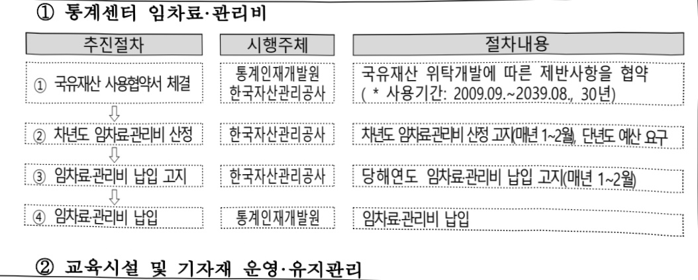

# 통계센터 및 교육시설 운영

**해당 페이지**: PDF 1962 ~ 1969 쪽 해당

**부처**: 국가데이터처
**분야**: 일반·지방행정
**회계유형**: 일반회계
**2026 확정예산**: 6942.0 백만원
**전년대비 증감률**: 9.1%
**AI 도메인**: 데이터

---

## □ 기능별(내역사업별), 목별 예산 내역

(단위:백만원)

<table border=1 style='margin: auto; word-wrap: break-word;'><tr><td rowspan="3"></td><td colspan="5">2024</td><td colspan="7">2025(25.12월말)</td><td rowspan="3">2026예산</td></tr><tr><td rowspan="2">예산의(추경)</td><td rowspan="2">예산현액</td><td rowspan="2">집행의[실집행액]</td><td rowspan="2">이월액</td><td rowspan="2">불용액</td><td rowspan="2">본예산</td><td rowspan="2">예산현액</td><td rowspan="2">집행의[실집행액]</td><td colspan="2">전년도이월액제의</td><td rowspan="2">이월예상액</td><td rowspan="2">불용예상액</td></tr><tr><td style='text-align: center; word-wrap: break-word;'>예산현액</td><td style='text-align: center; word-wrap: break-word;'>집행의[실집행액]</td></tr><tr><td style='text-align: center; word-wrap: break-word;'>○ 기능별 분류(합계)</td><td style='text-align: center; word-wrap: break-word;'>7,718</td><td style='text-align: center; word-wrap: break-word;'>7,718</td><td style='text-align: center; word-wrap: break-word;'>7,116</td><td style='text-align: center; word-wrap: break-word;'>-</td><td style='text-align: center; word-wrap: break-word;'>602</td><td style='text-align: center; word-wrap: break-word;'>6,362</td><td style='text-align: center; word-wrap: break-word;'>6,362</td><td style='text-align: center; word-wrap: break-word;'>6,352</td><td style='text-align: center; word-wrap: break-word;'>6,362</td><td style='text-align: center; word-wrap: break-word;'>6,352</td><td style='text-align: center; word-wrap: break-word;'></td><td style='text-align: center; word-wrap: break-word;'>10</td><td style='text-align: center; word-wrap: break-word;'>6,942</td></tr><tr><td style='text-align: center; word-wrap: break-word;'>· 통계센터</td><td style='text-align: center; word-wrap: break-word;'>5,467</td><td style='text-align: center; word-wrap: break-word;'>5,467</td><td style='text-align: center; word-wrap: break-word;'>5,175</td><td style='text-align: center; word-wrap: break-word;'>-</td><td style='text-align: center; word-wrap: break-word;'>292</td><td style='text-align: center; word-wrap: break-word;'>5,537</td><td style='text-align: center; word-wrap: break-word;'>5,537</td><td style='text-align: center; word-wrap: break-word;'>5,531</td><td style='text-align: center; word-wrap: break-word;'>5,537</td><td style='text-align: center; word-wrap: break-word;'>5,531</td><td style='text-align: center; word-wrap: break-word;'></td><td style='text-align: center; word-wrap: break-word;'>6</td><td style='text-align: center; word-wrap: break-word;'>5,840</td></tr><tr><td style='text-align: center; word-wrap: break-word;'>· AI·디지털 학습관</td><td style='text-align: center; word-wrap: break-word;'>-</td><td style='text-align: center; word-wrap: break-word;'>-</td><td style='text-align: center; word-wrap: break-word;'>-</td><td style='text-align: center; word-wrap: break-word;'>-</td><td style='text-align: center; word-wrap: break-word;'>-</td><td style='text-align: center; word-wrap: break-word;'>706</td><td style='text-align: center; word-wrap: break-word;'>706</td><td style='text-align: center; word-wrap: break-word;'>706</td><td style='text-align: center; word-wrap: break-word;'>706</td><td style='text-align: center; word-wrap: break-word;'>706</td><td style='text-align: center; word-wrap: break-word;'></td><td style='text-align: center; word-wrap: break-word;'>-</td><td style='text-align: center; word-wrap: break-word;'>983</td></tr><tr><td style='text-align: center; word-wrap: break-word;'>· 제주분원</td><td style='text-align: center; word-wrap: break-word;'>2,251</td><td style='text-align: center; word-wrap: break-word;'>2,251</td><td style='text-align: center; word-wrap: break-word;'>1,941</td><td style='text-align: center; word-wrap: break-word;'>-</td><td style='text-align: center; word-wrap: break-word;'>310</td><td style='text-align: center; word-wrap: break-word;'>119</td><td style='text-align: center; word-wrap: break-word;'>119</td><td style='text-align: center; word-wrap: break-word;'>116</td><td style='text-align: center; word-wrap: break-word;'>119</td><td style='text-align: center; word-wrap: break-word;'>116</td><td style='text-align: center; word-wrap: break-word;'></td><td style='text-align: center; word-wrap: break-word;'>3</td><td style='text-align: center; word-wrap: break-word;'>119</td></tr><tr><td style='text-align: center; word-wrap: break-word;'>○ 비목별 분류(합계)</td><td style='text-align: center; word-wrap: break-word;'>7,718</td><td style='text-align: center; word-wrap: break-word;'>7,718</td><td style='text-align: center; word-wrap: break-word;'>7,116</td><td style='text-align: center; word-wrap: break-word;'>-</td><td style='text-align: center; word-wrap: break-word;'>602</td><td style='text-align: center; word-wrap: break-word;'>6,362</td><td style='text-align: center; word-wrap: break-word;'>6,362</td><td style='text-align: center; word-wrap: break-word;'>6,352</td><td style='text-align: center; word-wrap: break-word;'>6,362</td><td style='text-align: center; word-wrap: break-word;'>6,352</td><td style='text-align: center; word-wrap: break-word;'></td><td style='text-align: center; word-wrap: break-word;'>10</td><td style='text-align: center; word-wrap: break-word;'>6,942</td></tr><tr><td style='text-align: center; word-wrap: break-word;'>· 일반수용비(210-01)</td><td style='text-align: center; word-wrap: break-word;'>3,227</td><td style='text-align: center; word-wrap: break-word;'>3,227</td><td style='text-align: center; word-wrap: break-word;'>3,223</td><td style='text-align: center; word-wrap: break-word;'>-</td><td style='text-align: center; word-wrap: break-word;'>4</td><td style='text-align: center; word-wrap: break-word;'>3,321</td><td style='text-align: center; word-wrap: break-word;'>3,321</td><td style='text-align: center; word-wrap: break-word;'>3,321</td><td style='text-align: center; word-wrap: break-word;'>3,321</td><td style='text-align: center; word-wrap: break-word;'>3,321</td><td style='text-align: center; word-wrap: break-word;'></td><td style='text-align: center; word-wrap: break-word;'>-</td><td style='text-align: center; word-wrap: break-word;'>3,660</td></tr><tr><td style='text-align: center; word-wrap: break-word;'>· 공공요금및제세(210-02)</td><td style='text-align: center; word-wrap: break-word;'>13</td><td style='text-align: center; word-wrap: break-word;'>13</td><td style='text-align: center; word-wrap: break-word;'>7</td><td style='text-align: center; word-wrap: break-word;'>-</td><td style='text-align: center; word-wrap: break-word;'>6</td><td style='text-align: center; word-wrap: break-word;'>23</td><td style='text-align: center; word-wrap: break-word;'>23</td><td style='text-align: center; word-wrap: break-word;'>20</td><td style='text-align: center; word-wrap: break-word;'>23</td><td style='text-align: center; word-wrap: break-word;'>20</td><td style='text-align: center; word-wrap: break-word;'></td><td style='text-align: center; word-wrap: break-word;'>3</td><td style='text-align: center; word-wrap: break-word;'>23</td></tr><tr><td style='text-align: center; word-wrap: break-word;'>· 특근매식비(210-05)</td><td style='text-align: center; word-wrap: break-word;'>1</td><td style='text-align: center; word-wrap: break-word;'>1</td><td style='text-align: center; word-wrap: break-word;'>-</td><td style='text-align: center; word-wrap: break-word;'>-</td><td style='text-align: center; word-wrap: break-word;'>1</td><td style='text-align: center; word-wrap: break-word;'>1</td><td style='text-align: center; word-wrap: break-word;'>1</td><td style='text-align: center; word-wrap: break-word;'>1</td><td style='text-align: center; word-wrap: break-word;'>1</td><td style='text-align: center; word-wrap: break-word;'>1</td><td style='text-align: center; word-wrap: break-word;'></td><td style='text-align: center; word-wrap: break-word;'>-</td><td style='text-align: center; word-wrap: break-word;'>1</td></tr><tr><td style='text-align: center; word-wrap: break-word;'>· 임차료(210-07)</td><td style='text-align: center; word-wrap: break-word;'>2,023</td><td style='text-align: center; word-wrap: break-word;'>2,023</td><td style='text-align: center; word-wrap: break-word;'>1,744</td><td style='text-align: center; word-wrap: break-word;'>-</td><td style='text-align: center; word-wrap: break-word;'>279</td><td style='text-align: center; word-wrap: break-word;'>1,999</td><td style='text-align: center; word-wrap: break-word;'>2,000</td><td style='text-align: center; word-wrap: break-word;'>2,000</td><td style='text-align: center; word-wrap: break-word;'>2,000</td><td style='text-align: center; word-wrap: break-word;'>2,000</td><td style='text-align: center; word-wrap: break-word;'></td><td style='text-align: center; word-wrap: break-word;'>-</td><td style='text-align: center; word-wrap: break-word;'>1,964</td></tr><tr><td style='text-align: center; word-wrap: break-word;'>· 유튜비(210-08)</td><td style='text-align: center; word-wrap: break-word;'>10</td><td style='text-align: center; word-wrap: break-word;'>10</td><td style='text-align: center; word-wrap: break-word;'>1</td><td style='text-align: center; word-wrap: break-word;'>-</td><td style='text-align: center; word-wrap: break-word;'>9</td><td style='text-align: center; word-wrap: break-word;'>-</td><td style='text-align: center; word-wrap: break-word;'>-</td><td style='text-align: center; word-wrap: break-word;'>-</td><td style='text-align: center; word-wrap: break-word;'>-</td><td style='text-align: center; word-wrap: break-word;'>-</td><td style='text-align: center; word-wrap: break-word;'></td><td style='text-align: center; word-wrap: break-word;'>-</td><td style='text-align: center; word-wrap: break-word;'>-</td></tr><tr><td style='text-align: center; word-wrap: break-word;'>· 시설장비유지비(210-09)</td><td style='text-align: center; word-wrap: break-word;'>76</td><td style='text-align: center; word-wrap: break-word;'>76</td><td style='text-align: center; word-wrap: break-word;'>76</td><td style='text-align: center; word-wrap: break-word;'>-</td><td style='text-align: center; word-wrap: break-word;'>-</td><td style='text-align: center; word-wrap: break-word;'>76</td><td style='text-align: center; word-wrap: break-word;'>76</td><td style='text-align: center; word-wrap: break-word;'>76</td><td style='text-align: center; word-wrap: break-word;'>76</td><td style='text-align: center; word-wrap: break-word;'>76</td><td style='text-align: center; word-wrap: break-word;'></td><td style='text-align: center; word-wrap: break-word;'>-</td><td style='text-align: center; word-wrap: break-word;'>121</td></tr><tr><td style='text-align: center; word-wrap: break-word;'>· 관리용역비(210-15)</td><td style='text-align: center; word-wrap: break-word;'>114</td><td style='text-align: center; word-wrap: break-word;'>114</td><td style='text-align: center; word-wrap: break-word;'>106</td><td style='text-align: center; word-wrap: break-word;'>-</td><td style='text-align: center; word-wrap: break-word;'>8</td><td style='text-align: center; word-wrap: break-word;'>490</td><td style='text-align: center; word-wrap: break-word;'>490</td><td style='text-align: center; word-wrap: break-word;'>484</td><td style='text-align: center; word-wrap: break-word;'>490</td><td style='text-align: center; word-wrap: break-word;'>484</td><td style='text-align: center; word-wrap: break-word;'></td><td style='text-align: center; word-wrap: break-word;'>6</td><td style='text-align: center; word-wrap: break-word;'>896</td></tr><tr><td style='text-align: center; word-wrap: break-word;'>· 국내여비(220-01)</td><td style='text-align: center; word-wrap: break-word;'>4</td><td style='text-align: center; word-wrap: break-word;'>4</td><td style='text-align: center; word-wrap: break-word;'>4</td><td style='text-align: center; word-wrap: break-word;'>-</td><td style='text-align: center; word-wrap: break-word;'>-</td><td style='text-align: center; word-wrap: break-word;'>4</td><td style='text-align: center; word-wrap: break-word;'>4</td><td style='text-align: center; word-wrap: break-word;'>4</td><td style='text-align: center; word-wrap: break-word;'>4</td><td style='text-align: center; word-wrap: break-word;'>4</td><td style='text-align: center; word-wrap: break-word;'></td><td style='text-align: center; word-wrap: break-word;'>-</td><td style='text-align: center; word-wrap: break-word;'>4</td></tr><tr><td style='text-align: center; word-wrap: break-word;'>· 사업추진비(240-01)</td><td style='text-align: center; word-wrap: break-word;'>5</td><td style='text-align: center; word-wrap: break-word;'>5</td><td style='text-align: center; word-wrap: break-word;'>5</td><td style='text-align: center; word-wrap: break-word;'>-</td><td style='text-align: center; word-wrap: break-word;'>-</td><td style='text-align: center; word-wrap: break-word;'>5</td><td style='text-align: center; word-wrap: break-word;'>5</td><td style='text-align: center; word-wrap: break-word;'>5</td><td style='text-align: center; word-wrap: break-word;'>5</td><td style='text-align: center; word-wrap: break-word;'>5</td><td style='text-align: center; word-wrap: break-word;'></td><td style='text-align: center; word-wrap: break-word;'>-</td><td style='text-align: center; word-wrap: break-word;'>5</td></tr><tr><td style='text-align: center; word-wrap: break-word;'>· 실시설계비(420-02)</td><td style='text-align: center; word-wrap: break-word;'>70</td><td style='text-align: center; word-wrap: break-word;'>70</td><td style='text-align: center; word-wrap: break-word;'>69</td><td style='text-align: center; word-wrap: break-word;'>-</td><td style='text-align: center; word-wrap: break-word;'>1</td><td style='text-align: center; word-wrap: break-word;'>-</td><td style='text-align: center; word-wrap: break-word;'>-</td><td style='text-align: center; word-wrap: break-word;'>-</td><td style='text-align: center; word-wrap: break-word;'>-</td><td style='text-align: center; word-wrap: break-word;'>-</td><td style='text-align: center; word-wrap: break-word;'></td><td style='text-align: center; word-wrap: break-word;'>-</td><td style='text-align: center; word-wrap: break-word;'>-</td></tr><tr><td style='text-align: center; word-wrap: break-word;'>· 공식비(420-03)</td><td style='text-align: center; word-wrap: break-word;'>2,076</td><td style='text-align: center; word-wrap: break-word;'>2,076</td><td style='text-align: center; word-wrap: break-word;'>1,783</td><td style='text-align: center; word-wrap: break-word;'>-</td><td style='text-align: center; word-wrap: break-word;'>293</td><td style='text-align: center; word-wrap: break-word;'>-</td><td style='text-align: center; word-wrap: break-word;'>-</td><td style='text-align: center; word-wrap: break-word;'>-</td><td style='text-align: center; word-wrap: break-word;'>-</td><td style='text-align: center; word-wrap: break-word;'>-</td><td style='text-align: center; word-wrap: break-word;'></td><td style='text-align: center; word-wrap: break-word;'>-</td><td style='text-align: center; word-wrap: break-word;'>-</td></tr><tr><td style='text-align: center; word-wrap: break-word;'>· 김리비(420-04)</td><td style='text-align: center; word-wrap: break-word;'>24</td><td style='text-align: center; word-wrap: break-word;'>24</td><td style='text-align: center; word-wrap: break-word;'>24</td><td style='text-align: center; word-wrap: break-word;'>-</td><td style='text-align: center; word-wrap: break-word;'>-</td><td style='text-align: center; word-wrap: break-word;'>-</td><td style='text-align: center; word-wrap: break-word;'>-</td><td style='text-align: center; word-wrap: break-word;'>-</td><td style='text-align: center; word-wrap: break-word;'>-</td><td style='text-align: center; word-wrap: break-word;'>-</td><td style='text-align: center; word-wrap: break-word;'></td><td style='text-align: center; word-wrap: break-word;'>-</td><td style='text-align: center; word-wrap: break-word;'>-</td></tr><tr><td style='text-align: center; word-wrap: break-word;'>· 시설부대비(420-05)</td><td style='text-align: center; word-wrap: break-word;'>8</td><td style='text-align: center; word-wrap: break-word;'>8</td><td style='text-align: center; word-wrap: break-word;'>8</td><td style='text-align: center; word-wrap: break-word;'>-</td><td style='text-align: center; word-wrap: break-word;'>-</td><td style='text-align: center; word-wrap: break-word;'>-</td><td style='text-align: center; word-wrap: break-word;'>-</td><td style='text-align: center; word-wrap: break-word;'>-</td><td style='text-align: center; word-wrap: break-word;'>-</td><td style='text-align: center; word-wrap: break-word;'>-</td><td style='text-align: center; word-wrap: break-word;'></td><td style='text-align: center; word-wrap: break-word;'>-</td><td style='text-align: center; word-wrap: break-word;'>-</td></tr><tr><td style='text-align: center; word-wrap: break-word;'>· 자산취득비(430-01)</td><td style='text-align: center; word-wrap: break-word;'>67</td><td style='text-align: center; word-wrap: break-word;'>67</td><td style='text-align: center; word-wrap: break-word;'>67</td><td style='text-align: center; word-wrap: break-word;'>-</td><td style='text-align: center; word-wrap: break-word;'>-</td><td style='text-align: center; word-wrap: break-word;'>443</td><td style='text-align: center; word-wrap: break-word;'>443</td><td style='text-align: center; word-wrap: break-word;'>442</td><td style='text-align: center; word-wrap: break-word;'>443</td><td style='text-align: center; word-wrap: break-word;'>442</td><td style='text-align: center; word-wrap: break-word;'></td><td style='text-align: center; word-wrap: break-word;'>-</td><td style='text-align: center; word-wrap: break-word;'>268</td></tr><tr><td style='text-align: center; word-wrap: break-word;'>○ 기능비목별 분류(합계)</td><td style='text-align: center; word-wrap: break-word;'>7,718</td><td style='text-align: center; word-wrap: break-word;'>7,718</td><td style='text-align: center; word-wrap: break-word;'>7,116</td><td style='text-align: center; word-wrap: break-word;'>-</td><td style='text-align: center; word-wrap: break-word;'>602</td><td style='text-align: center; word-wrap: break-word;'>6,362</td><td style='text-align: center; word-wrap: break-word;'>6,362</td><td style='text-align: center; word-wrap: break-word;'>6,352</td><td style='text-align: center; word-wrap: break-word;'>6,362</td><td style='text-align: center; word-wrap: break-word;'>6,352</td><td style='text-align: center; word-wrap: break-word;'></td><td style='text-align: center; word-wrap: break-word;'>10</td><td style='text-align: center; word-wrap: break-word;'>6,942</td></tr><tr><td style='text-align: center; word-wrap: break-word;'>· 통계센터</td><td style='text-align: center; word-wrap: break-word;'>5,467</td><td style='text-align: center; word-wrap: break-word;'>5,467</td><td style='text-align: center; word-wrap: break-word;'>5,175</td><td style='text-align: center; word-wrap: break-word;'>-</td><td style='text-align: center; word-wrap: break-word;'>292</td><td style='text-align: center; word-wrap: break-word;'>5,537</td><td style='text-align: center; word-wrap: break-word;'>5,537</td><td style='text-align: center; word-wrap: break-word;'>5,531</td><td style='text-align: center; word-wrap: break-word;'>5,537</td><td style='text-align: center; word-wrap: break-word;'>5,531</td><td style='text-align: center; word-wrap: break-word;'></td><td style='text-align: center; word-wrap: break-word;'>6</td><td style='text-align: center; word-wrap: break-word;'>5,840</td></tr><tr><td style='text-align: center; word-wrap: break-word;'>· 일반수용비(210-01)</td><td style='text-align: center; word-wrap: break-word;'>3,209</td><td style='text-align: center; word-wrap: break-word;'>3,209</td><td style='text-align: center; word-wrap: break-word;'>3,205</td><td style='text-align: center; word-wrap: break-word;'>-</td><td style='text-align: center; word-wrap: break-word;'>4</td><td style='text-align: center; word-wrap: break-word;'>3,303</td><td style='text-align: center; word-wrap: break-word;'>3,303</td><td style='text-align: center; word-wrap: break-word;'>3,303</td><td style='text-align: center; word-wrap: break-word;'>3,303</td><td style='text-align: center; word-wrap: break-word;'>3,303</td><td style='text-align: center; word-wrap: break-word;'></td><td style='text-align: center; word-wrap: break-word;'>-</td><td style='text-align: center; word-wrap: break-word;'>3,641</td></tr></table>

---

<table border=1 style='margin: auto; word-wrap: break-word;'><tr><td rowspan="3"></td><td colspan="4">2024</td><td colspan="7">2025(25.12일말)</td><td style='text-align: center; word-wrap: break-word;'>2026예산</td></tr><tr><td rowspan="2">예산액(추정)</td><td rowspan="2">예산현액</td><td rowspan="2">집행액[실집행액]</td><td rowspan="2">이율액</td><td rowspan="2">불용액</td><td rowspan="2">본예산</td><td rowspan="2">예산현액</td><td rowspan="2">집행액[실집행액]</td><td colspan="2">전년도이율액제외</td><td rowspan="2">이율액예상액</td><td rowspan="2">불용예상액</td></tr><tr><td style='text-align: center; word-wrap: break-word;'>예산현액</td><td style='text-align: center; word-wrap: break-word;'>집행액[실집행액]</td></tr><tr><td style='text-align: center; word-wrap: break-word;'>-특근매식비(210-05)</td><td style='text-align: center; word-wrap: break-word;'>1</td><td style='text-align: center; word-wrap: break-word;'>1</td><td style='text-align: center; word-wrap: break-word;'>0</td><td style='text-align: center; word-wrap: break-word;'>-</td><td style='text-align: center; word-wrap: break-word;'>1</td><td style='text-align: center; word-wrap: break-word;'>1</td><td style='text-align: center; word-wrap: break-word;'>1</td><td style='text-align: center; word-wrap: break-word;'>1</td><td style='text-align: center; word-wrap: break-word;'>1</td><td style='text-align: center; word-wrap: break-word;'>1</td><td style='text-align: center; word-wrap: break-word;'>-</td><td style='text-align: center; word-wrap: break-word;'>1</td></tr><tr><td style='text-align: center; word-wrap: break-word;'>-입차료(210-07)</td><td style='text-align: center; word-wrap: break-word;'>2,023</td><td style='text-align: center; word-wrap: break-word;'>2,023</td><td style='text-align: center; word-wrap: break-word;'>1,744</td><td style='text-align: center; word-wrap: break-word;'>-</td><td style='text-align: center; word-wrap: break-word;'>279</td><td style='text-align: center; word-wrap: break-word;'>1,999</td><td style='text-align: center; word-wrap: break-word;'>2,000</td><td style='text-align: center; word-wrap: break-word;'>2,000</td><td style='text-align: center; word-wrap: break-word;'>2,000</td><td style='text-align: center; word-wrap: break-word;'>2,000</td><td style='text-align: center; word-wrap: break-word;'>-</td><td style='text-align: center; word-wrap: break-word;'>1,964</td></tr><tr><td style='text-align: center; word-wrap: break-word;'>-시설장비유지비(210-09)</td><td style='text-align: center; word-wrap: break-word;'>53</td><td style='text-align: center; word-wrap: break-word;'>53</td><td style='text-align: center; word-wrap: break-word;'>53</td><td style='text-align: center; word-wrap: break-word;'>-</td><td style='text-align: center; word-wrap: break-word;'>-</td><td style='text-align: center; word-wrap: break-word;'>53</td><td style='text-align: center; word-wrap: break-word;'>53</td><td style='text-align: center; word-wrap: break-word;'>53</td><td style='text-align: center; word-wrap: break-word;'>53</td><td style='text-align: center; word-wrap: break-word;'>53</td><td style='text-align: center; word-wrap: break-word;'>-</td><td style='text-align: center; word-wrap: break-word;'>53</td></tr><tr><td style='text-align: center; word-wrap: break-word;'>-관리용역비(210-15)</td><td style='text-align: center; word-wrap: break-word;'>113</td><td style='text-align: center; word-wrap: break-word;'>113</td><td style='text-align: center; word-wrap: break-word;'>105</td><td style='text-align: center; word-wrap: break-word;'>-</td><td style='text-align: center; word-wrap: break-word;'>8</td><td style='text-align: center; word-wrap: break-word;'>113</td><td style='text-align: center; word-wrap: break-word;'>113</td><td style='text-align: center; word-wrap: break-word;'>107</td><td style='text-align: center; word-wrap: break-word;'>113</td><td style='text-align: center; word-wrap: break-word;'>107</td><td style='text-align: center; word-wrap: break-word;'>-</td><td style='text-align: center; word-wrap: break-word;'>113</td></tr><tr><td style='text-align: center; word-wrap: break-word;'>-사업추진비(240-01)</td><td style='text-align: center; word-wrap: break-word;'>5</td><td style='text-align: center; word-wrap: break-word;'>5</td><td style='text-align: center; word-wrap: break-word;'>5</td><td style='text-align: center; word-wrap: break-word;'>-</td><td style='text-align: center; word-wrap: break-word;'>-</td><td style='text-align: center; word-wrap: break-word;'>5</td><td style='text-align: center; word-wrap: break-word;'>5</td><td style='text-align: center; word-wrap: break-word;'>5</td><td style='text-align: center; word-wrap: break-word;'>5</td><td style='text-align: center; word-wrap: break-word;'>5</td><td style='text-align: center; word-wrap: break-word;'>-</td><td style='text-align: center; word-wrap: break-word;'>5</td></tr><tr><td style='text-align: center; word-wrap: break-word;'>-자산취득비(430-01)</td><td style='text-align: center; word-wrap: break-word;'>63</td><td style='text-align: center; word-wrap: break-word;'>63</td><td style='text-align: center; word-wrap: break-word;'>63</td><td style='text-align: center; word-wrap: break-word;'>-</td><td style='text-align: center; word-wrap: break-word;'>-</td><td style='text-align: center; word-wrap: break-word;'>63</td><td style='text-align: center; word-wrap: break-word;'>63</td><td style='text-align: center; word-wrap: break-word;'>63</td><td style='text-align: center; word-wrap: break-word;'>63</td><td style='text-align: center; word-wrap: break-word;'>63</td><td style='text-align: center; word-wrap: break-word;'>-</td><td style='text-align: center; word-wrap: break-word;'>63</td></tr><tr><td style='text-align: center; word-wrap: break-word;'>·AI·디지털 학습관</td><td style='text-align: center; word-wrap: break-word;'>-</td><td style='text-align: center; word-wrap: break-word;'>-</td><td style='text-align: center; word-wrap: break-word;'>-</td><td style='text-align: center; word-wrap: break-word;'>-</td><td style='text-align: center; word-wrap: break-word;'>-</td><td style='text-align: center; word-wrap: break-word;'>706</td><td style='text-align: center; word-wrap: break-word;'>706</td><td style='text-align: center; word-wrap: break-word;'>706</td><td style='text-align: center; word-wrap: break-word;'>706</td><td style='text-align: center; word-wrap: break-word;'>706</td><td style='text-align: center; word-wrap: break-word;'>-</td><td style='text-align: center; word-wrap: break-word;'>983</td></tr><tr><td style='text-align: center; word-wrap: break-word;'>시설장비유지비(210-03)</td><td style='text-align: center; word-wrap: break-word;'>-</td><td style='text-align: center; word-wrap: break-word;'>-</td><td style='text-align: center; word-wrap: break-word;'>-</td><td style='text-align: center; word-wrap: break-word;'>-</td><td style='text-align: center; word-wrap: break-word;'>-</td><td style='text-align: center; word-wrap: break-word;'>-</td><td style='text-align: center; word-wrap: break-word;'>-</td><td style='text-align: center; word-wrap: break-word;'>-</td><td style='text-align: center; word-wrap: break-word;'>-</td><td style='text-align: center; word-wrap: break-word;'>-</td><td style='text-align: center; word-wrap: break-word;'>-</td><td style='text-align: center; word-wrap: break-word;'>45</td></tr><tr><td style='text-align: center; word-wrap: break-word;'>-관리용역비(210-15)</td><td style='text-align: center; word-wrap: break-word;'>-</td><td style='text-align: center; word-wrap: break-word;'>-</td><td style='text-align: center; word-wrap: break-word;'>-</td><td style='text-align: center; word-wrap: break-word;'>-</td><td style='text-align: center; word-wrap: break-word;'>-</td><td style='text-align: center; word-wrap: break-word;'>376</td><td style='text-align: center; word-wrap: break-word;'>376</td><td style='text-align: center; word-wrap: break-word;'>376</td><td style='text-align: center; word-wrap: break-word;'>376</td><td style='text-align: center; word-wrap: break-word;'>376</td><td style='text-align: center; word-wrap: break-word;'>-</td><td style='text-align: center; word-wrap: break-word;'>783</td></tr><tr><td style='text-align: center; word-wrap: break-word;'>-자산취득비(430-01)</td><td style='text-align: center; word-wrap: break-word;'>-</td><td style='text-align: center; word-wrap: break-word;'>-</td><td style='text-align: center; word-wrap: break-word;'>-</td><td style='text-align: center; word-wrap: break-word;'>-</td><td style='text-align: center; word-wrap: break-word;'>-</td><td style='text-align: center; word-wrap: break-word;'>330</td><td style='text-align: center; word-wrap: break-word;'>330</td><td style='text-align: center; word-wrap: break-word;'>330</td><td style='text-align: center; word-wrap: break-word;'>330</td><td style='text-align: center; word-wrap: break-word;'>330</td><td style='text-align: center; word-wrap: break-word;'>-</td><td style='text-align: center; word-wrap: break-word;'>155</td></tr><tr><td style='text-align: center; word-wrap: break-word;'>·제주분원</td><td style='text-align: center; word-wrap: break-word;'>2,251</td><td style='text-align: center; word-wrap: break-word;'>2,251</td><td style='text-align: center; word-wrap: break-word;'>1,941</td><td style='text-align: center; word-wrap: break-word;'>-</td><td style='text-align: center; word-wrap: break-word;'>310</td><td style='text-align: center; word-wrap: break-word;'>119</td><td style='text-align: center; word-wrap: break-word;'>119</td><td style='text-align: center; word-wrap: break-word;'>116</td><td style='text-align: center; word-wrap: break-word;'>119</td><td style='text-align: center; word-wrap: break-word;'>116</td><td style='text-align: center; word-wrap: break-word;'>-</td><td style='text-align: center; word-wrap: break-word;'>119</td></tr><tr><td style='text-align: center; word-wrap: break-word;'>-일반수용비(210-01)</td><td style='text-align: center; word-wrap: break-word;'>18</td><td style='text-align: center; word-wrap: break-word;'>18</td><td style='text-align: center; word-wrap: break-word;'>18</td><td style='text-align: center; word-wrap: break-word;'>-</td><td style='text-align: center; word-wrap: break-word;'>-</td><td style='text-align: center; word-wrap: break-word;'>18</td><td style='text-align: center; word-wrap: break-word;'>18</td><td style='text-align: center; word-wrap: break-word;'>18</td><td style='text-align: center; word-wrap: break-word;'>18</td><td style='text-align: center; word-wrap: break-word;'>18</td><td style='text-align: center; word-wrap: break-word;'>-</td><td style='text-align: center; word-wrap: break-word;'>18</td></tr><tr><td style='text-align: center; word-wrap: break-word;'>-공공요금맞춰제비(210-02)</td><td style='text-align: center; word-wrap: break-word;'>13</td><td style='text-align: center; word-wrap: break-word;'>13</td><td style='text-align: center; word-wrap: break-word;'>7</td><td style='text-align: center; word-wrap: break-word;'>-</td><td style='text-align: center; word-wrap: break-word;'>6</td><td style='text-align: center; word-wrap: break-word;'>23</td><td style='text-align: center; word-wrap: break-word;'>23</td><td style='text-align: center; word-wrap: break-word;'>20</td><td style='text-align: center; word-wrap: break-word;'>23</td><td style='text-align: center; word-wrap: break-word;'>20</td><td style='text-align: center; word-wrap: break-word;'>-</td><td style='text-align: center; word-wrap: break-word;'>23</td></tr><tr><td style='text-align: center; word-wrap: break-word;'>-유튜비(210-08)</td><td style='text-align: center; word-wrap: break-word;'>10</td><td style='text-align: center; word-wrap: break-word;'>10</td><td style='text-align: center; word-wrap: break-word;'>1</td><td style='text-align: center; word-wrap: break-word;'>-</td><td style='text-align: center; word-wrap: break-word;'>9</td><td style='text-align: center; word-wrap: break-word;'>-</td><td style='text-align: center; word-wrap: break-word;'>-</td><td style='text-align: center; word-wrap: break-word;'>-</td><td style='text-align: center; word-wrap: break-word;'>-</td><td style='text-align: center; word-wrap: break-word;'>-</td><td style='text-align: center; word-wrap: break-word;'>-</td><td style='text-align: center; word-wrap: break-word;'>-</td></tr><tr><td style='text-align: center; word-wrap: break-word;'>-시설장비유지비(210-09)</td><td style='text-align: center; word-wrap: break-word;'>23</td><td style='text-align: center; word-wrap: break-word;'>23</td><td style='text-align: center; word-wrap: break-word;'>23</td><td style='text-align: center; word-wrap: break-word;'>-</td><td style='text-align: center; word-wrap: break-word;'>-</td><td style='text-align: center; word-wrap: break-word;'>23</td><td style='text-align: center; word-wrap: break-word;'>23</td><td style='text-align: center; word-wrap: break-word;'>23</td><td style='text-align: center; word-wrap: break-word;'>23</td><td style='text-align: center; word-wrap: break-word;'>23</td><td style='text-align: center; word-wrap: break-word;'>-</td><td style='text-align: center; word-wrap: break-word;'>23</td></tr><tr><td style='text-align: center; word-wrap: break-word;'>-관리용역비(210-15)</td><td style='text-align: center; word-wrap: break-word;'>1</td><td style='text-align: center; word-wrap: break-word;'>1</td><td style='text-align: center; word-wrap: break-word;'>0</td><td style='text-align: center; word-wrap: break-word;'>-</td><td style='text-align: center; word-wrap: break-word;'>1</td><td style='text-align: center; word-wrap: break-word;'>1</td><td style='text-align: center; word-wrap: break-word;'>1</td><td style='text-align: center; word-wrap: break-word;'>1</td><td style='text-align: center; word-wrap: break-word;'>1</td><td style='text-align: center; word-wrap: break-word;'>1</td><td style='text-align: center; word-wrap: break-word;'>-</td><td style='text-align: center; word-wrap: break-word;'>1</td></tr><tr><td style='text-align: center; word-wrap: break-word;'>-국내여비(220-01)</td><td style='text-align: center; word-wrap: break-word;'>4</td><td style='text-align: center; word-wrap: break-word;'>4</td><td style='text-align: center; word-wrap: break-word;'>4</td><td style='text-align: center; word-wrap: break-word;'>-</td><td style='text-align: center; word-wrap: break-word;'>-</td><td style='text-align: center; word-wrap: break-word;'>4</td><td style='text-align: center; word-wrap: break-word;'>4</td><td style='text-align: center; word-wrap: break-word;'>4</td><td style='text-align: center; word-wrap: break-word;'>4</td><td style='text-align: center; word-wrap: break-word;'>4</td><td style='text-align: center; word-wrap: break-word;'>-</td><td style='text-align: center; word-wrap: break-word;'>4</td></tr><tr><td style='text-align: center; word-wrap: break-word;'>-실시설계비(420-02)</td><td style='text-align: center; word-wrap: break-word;'>70</td><td style='text-align: center; word-wrap: break-word;'>70</td><td style='text-align: center; word-wrap: break-word;'>69</td><td style='text-align: center; word-wrap: break-word;'>-</td><td style='text-align: center; word-wrap: break-word;'>1</td><td style='text-align: center; word-wrap: break-word;'>-</td><td style='text-align: center; word-wrap: break-word;'>-</td><td style='text-align: center; word-wrap: break-word;'>-</td><td style='text-align: center; word-wrap: break-word;'>-</td><td style='text-align: center; word-wrap: break-word;'>-</td><td style='text-align: center; word-wrap: break-word;'>-</td><td style='text-align: center; word-wrap: break-word;'></td></tr><tr><td style='text-align: center; word-wrap: break-word;'>-공사비(420-03)</td><td style='text-align: center; word-wrap: break-word;'>2,076</td><td style='text-align: center; word-wrap: break-word;'>2,076</td><td style='text-align: center; word-wrap: break-word;'>1,783</td><td style='text-align: center; word-wrap: break-word;'>-</td><td style='text-align: center; word-wrap: break-word;'>293</td><td style='text-align: center; word-wrap: break-word;'>-</td><td style='text-align: center; word-wrap: break-word;'>-</td><td style='text-align: center; word-wrap: break-word;'>-</td><td style='text-align: center; word-wrap: break-word;'>-</td><td style='text-align: center; word-wrap: break-word;'>-</td><td style='text-align: center; word-wrap: break-word;'>-</td><td style='text-align: center; word-wrap: break-word;'></td></tr><tr><td style='text-align: center; word-wrap: break-word;'>-김리비(420-04)</td><td style='text-align: center; word-wrap: break-word;'>24</td><td style='text-align: center; word-wrap: break-word;'>24</td><td style='text-align: center; word-wrap: break-word;'>24</td><td style='text-align: center; word-wrap: break-word;'>-</td><td style='text-align: center; word-wrap: break-word;'>-</td><td style='text-align: center; word-wrap: break-word;'>-</td><td style='text-align: center; word-wrap: break-word;'>-</td><td style='text-align: center; word-wrap: break-word;'>-</td><td style='text-align: center; word-wrap: break-word;'>-</td><td style='text-align: center; word-wrap: break-word;'>-</td><td style='text-align: center; word-wrap: break-word;'>-</td><td style='text-align: center; word-wrap: break-word;'></td></tr><tr><td style='text-align: center; word-wrap: break-word;'>-시설부대비(420-05)</td><td style='text-align: center; word-wrap: break-word;'>8</td><td style='text-align: center; word-wrap: break-word;'>8</td><td style='text-align: center; word-wrap: break-word;'>8</td><td style='text-align: center; word-wrap: break-word;'>-</td><td style='text-align: center; word-wrap: break-word;'>-</td><td style='text-align: center; word-wrap: break-word;'>-</td><td style='text-align: center; word-wrap: break-word;'>-</td><td style='text-align: center; word-wrap: break-word;'>-</td><td style='text-align: center; word-wrap: break-word;'>-</td><td style='text-align: center; word-wrap: break-word;'>-</td><td style='text-align: center; word-wrap: break-word;'>-</td><td style='text-align: center; word-wrap: break-word;'></td></tr><tr><td style='text-align: center; word-wrap: break-word;'>-자산취득비(430-01)</td><td style='text-align: center; word-wrap: break-word;'>4</td><td style='text-align: center; word-wrap: break-word;'>4</td><td style='text-align: center; word-wrap: break-word;'>4</td><td style='text-align: center; word-wrap: break-word;'>-</td><td style='text-align: center; word-wrap: break-word;'>-</td><td style='text-align: center; word-wrap: break-word;'>50</td><td style='text-align: center; word-wrap: break-word;'>50</td><td style='text-align: center; word-wrap: break-word;'>50</td><td style='text-align: center; word-wrap: break-word;'>50</td><td style='text-align: center; word-wrap: break-word;'>50</td><td style='text-align: center; word-wrap: break-word;'>-</td><td style='text-align: center; word-wrap: break-word;'>50</td></tr></table>

---

### 나. 사업설명자료

## 1 ) 사업목적·내용

- 국가데이터인재개발원등 국가데이터처 소속 3개 기관(통계인재개발원, 국가데이터연구원, 충청지방데이터청)이 입주하고 있는 통계센터의 임차료, 청사관리비 등 시설장비 유지를 위한 운영경비 필요

- 통계인재개발원에서 청사관련 예산 확보 및 집행 등 총괄행정을 담당

- 동 사업비에는 3개 기관의 임차료, 관리비, 건물·시설 유지보수비 등 제반 경비가 포함됨

## 2 ) 사업개요

## □ 사업근거 및 추진경위

① 법령상 근거 및 조항 적시

° 국유재산법 제29조(관리위탁)

- 중앙관서의 장은 행정재산을 효율적으로 관리하기 위하여 필요하면 국가기관 외의 자에게 그 재산의 관리를 위탁(이하 '관리위탁'이라 한다)할 수 있다.

- 제1항에 따라 관리위탁을 받은 자는 미리 해당 중앙관서의 장의 승인을 받아 위탁

받은 재산의 일부를 사용·수익하거나 다른 사람에게 사용·수익하게 할 수 있다.

- 관리위탁을 받을 수 있는 자의 자격, 관리위탁 기간, 관리위탁을 받은 재산의 사용료, 관리현황에 대한 보고, 그 밖에 관리위탁에 필요한 사항은 대통령령으로 정한다.

② 추진경위

○ 사업 시작년도: 2009년

○ 추진배경

- 특허청이 국제지식재산연수원 발족 등 규모가 확장됨에 따라 통계인재개발원이 사용하고 있던 사용면적(건물)을 반환 요청

- 또한, 증가하는 통계교육수요에 부응하고 선진일류 교육기관으로 도약하기 위한

인프라 구축을 위해 자체독립청사 신축 추진

- 경제부총리 주재하의 '경제정책조정회의'에서 「국유지 관리제도 혁신방안」으로 국가데이터인재개발원청사 신축을 국유지 시범 개발사업으로 추진

2006. 11. 16일 「월평동 국유부동산 개발사업」 기공식

2009. 8월말 준공, 국가데이터처 소속 3개기관 입주「통계인재개발원, 국가데이터연구원, 충청지방침」

※ 직제개편(대통령령 제18641호, 2004. 12. 31.)으로 행정자치부 소속 통계연수부에서 국가데이터처 소속으로 환원(2005년)

---

※ 직재개편(기획재정부령 제1104호, 2025. 2. 25.)으로 통계교육원에서 통계인재 개발원으로 기관명칭 변경

## □ 주요내용

① 사업규모

- 총사업비 : 해당사항 없음

-사업기간:매년

- 최근 5년 간 투입된 사업비(예산액기준, 추경편성한 연도에는 추경포함)

<table border=1 style='margin: auto; word-wrap: break-word;'><tr><td style='text-align: center; word-wrap: break-word;'>$ \underline{\text{角}} $</td><td style='text-align: center; word-wrap: break-word;'>2022</td><td style='text-align: center; word-wrap: break-word;'>2023</td><td style='text-align: center; word-wrap: break-word;'>2024</td><td style='text-align: center; word-wrap: break-word;'>2025</td><td style='text-align: center; word-wrap: break-word;'>2026</td></tr><tr><td style='text-align: center; word-wrap: break-word;'>$ \underline{\text{사업비}} $</td><td style='text-align: center; word-wrap: break-word;'>5,326</td><td style='text-align: center; word-wrap: break-word;'>5,475</td><td style='text-align: center; word-wrap: break-word;'>7,718</td><td style='text-align: center; word-wrap: break-word;'>6,362</td><td style='text-align: center; word-wrap: break-word;'>6,942</td></tr></table>

- 통계센터: 지하 1층, 지상15층, 연면적 31,898m²

- 국가데이터인재개발원AI·디지털학습관: 지하 1층, 지상 3층, 연면적 4,397.25m²

② 사업추진체계

- 사업시행방법 : 직접수행

- 사업시행주체 : 통계인재개발원

- 사업 수혜자 : 국가데이터연구원, 충청지방데이터청 직원 및 국가데이터인재개발원 교육생 등

- 보조, 융자, 출연, 출자 등의 경우 보조·융자 등 지원 비율 및 법적근거 : 해당 사항 없음

## 3 ) 2026년도 예산 산출 근거

ㅇ 통계센터 및 교육시설 운영

[2025] 6,362→[2026] 6,942백만원, [증 580백만원, 9.1%)

1 통계센터 : (2025) 5,537 → (2026) 5,840백만원 (증 303백만원, 5.5%)

(요구) 통계센터 운영을 위한 임차료·관리비, 시설 장비 유지관리비, 노후 설비 교체비 등 필요특히, 통계센터 안전과 원활한 교육과정 운영을 위해 신축(2009년) 이후 내용 연수가 경과한 노후 설비에 대한 연차적인 교체 필요

2 AI·디지털 학습관(다목적교육관) : (2025) 706 → (2026) 983백만원 (증 277백만원, 39.2%)

- (요구) AI-디지털 학습관(다목적교육관) 연간 위탁관리* 및 강의실 등에 필요한 자산취득 필요

* 국가데이터인재개발원인력 부족 및 안전 관리의 어려움 등으로 통계센터와 연계해 캠코 위탁 관리 추진으로 예산(12개월분) 필요

3 제주분원 : (2025) 119 → (2026) 119백만원 (전년동일)

- (요구) 제주분원 운영 경비, 교육과정 운영을 위한 교육 운영 기자재 등 필요

---

## [금년 대비 달라지는 요구내용]

<table border=1 style='margin: auto; word-wrap: break-word;'><tr><td style='text-align: center; word-wrap: break-word;'>구분</td><td style='text-align: center; word-wrap: break-word;'>2025</td><td style='text-align: center; word-wrap: break-word;'>2026</td></tr><tr><td style='text-align: center; word-wrap: break-word;'>[통계센터 및 교육시설 운영]</td><td style='text-align: center; word-wrap: break-word;'>6,362</td><td style='text-align: center; word-wrap: break-word;'>6,942</td></tr><tr><td style='text-align: center; word-wrap: break-word;'>①통계센터</td><td style='text-align: center; word-wrap: break-word;'>·통계센터 임차료 및 관리비 (5,537백만원)</td><td style='text-align: center; word-wrap: break-word;'>·통계센터 임차료 및 관리비 인상 (5,840백만원, 증 303백만원)</td></tr><tr><td style='text-align: center; word-wrap: break-word;'>②AI·디지털학습관</td><td style='text-align: center; word-wrap: break-word;'>·위탁관리비(376백만원, 6개월) ·자산취득비(330백만원)</td><td style='text-align: center; word-wrap: break-word;'>·시설장비유지비(45백만원, 순증) ·위탁관리비(783백만원, 증 407백만원) ·자산취득비(155백만원, 감 175백만원)</td></tr><tr><td style='text-align: center; word-wrap: break-word;'>③제주분원</td><td style='text-align: center; word-wrap: break-word;'>·비품구입, 공공요금 및 제세 등 운영비 (69백만원) ·자산물품 구입(50백만원)</td><td style='text-align: center; word-wrap: break-word;'>·비품구입, 공공요금 및 제세 등 운영비 (69백만원, 전년동) ·자산물품 구입(50백만원, 전년동)</td></tr></table>

## 4 ) 사업효과

□ 사업영향, 산출물 성과지표 등

① 2022~2026년도 성과계획서 상 성과지표 및 최근 5년간 성과 달성도

<table border=1 style='margin: auto; word-wrap: break-word;'><tr><td style='text-align: center; word-wrap: break-word;'>성과지표</td><td style='text-align: center; word-wrap: break-word;'>구분</td><td style='text-align: center; word-wrap: break-word;'>&#x27;22</td><td style='text-align: center; word-wrap: break-word;'>&#x27;23</td><td style='text-align: center; word-wrap: break-word;'>&#x27;24</td><td style='text-align: center; word-wrap: break-word;'>&#x27;25</td><td style='text-align: center; word-wrap: break-word;'>&#x27;26</td><td style='text-align: center; word-wrap: break-word;'>&#x27;26목표치산출근거</td><td style='text-align: center; word-wrap: break-word;'>측정산식(또는 측정방법)</td><td style='text-align: center; word-wrap: break-word;'>자료수집방법(또는 자료출처)</td></tr><tr><td rowspan="3">국가통계 정책 인프라 강화 만족도(점)</td><td style='text-align: center; word-wrap: break-word;'>목표</td><td style='text-align: center; word-wrap: break-word;'>신규</td><td style='text-align: center; word-wrap: break-word;'>신규</td><td style='text-align: center; word-wrap: break-word;'>신규</td><td style='text-align: center; word-wrap: break-word;'>4.28</td><td style='text-align: center; word-wrap: break-word;'>4.29</td><td rowspan="3">최근 3년 평균 실적치는 4.26이나 상승과 하강이 범택됨에 따라 최근 3년 평균보다 0.02점 상향한 4.28로 설정(전년실적치보다 +0.01점 상향)</td><td rowspan="3">5개분야 중 효과성 분야(2개, 30%), 및 만족도 분야(3개, 70%) 국가통계 외부 고객 만족도 점수 가중 평균</td><td rowspan="3">관련 결재 문서</td></tr><tr><td style='text-align: center; word-wrap: break-word;'>실적</td><td style='text-align: center; word-wrap: break-word;'>4.27</td><td style='text-align: center; word-wrap: break-word;'>4.23</td><td style='text-align: center; word-wrap: break-word;'>4.27</td><td style='text-align: center; word-wrap: break-word;'>-</td><td style='text-align: center; word-wrap: break-word;'>-</td></tr><tr><td style='text-align: center; word-wrap: break-word;'>달성도</td><td style='text-align: center; word-wrap: break-word;'>-</td><td style='text-align: center; word-wrap: break-word;'>-</td><td style='text-align: center; word-wrap: break-word;'>-</td><td style='text-align: center; word-wrap: break-word;'>-</td><td style='text-align: center; word-wrap: break-word;'>-</td></tr></table>

② 성과지표 이외의 연도별 사업추진 경과 및 실적

---

<table border=1 style='margin: auto; word-wrap: break-word;'><tr><td style='text-align: center; word-wrap: break-word;'>2022</td><td style='text-align: center; word-wrap: break-word;'>○ 계절조정실무 등 232개 과정을 운영하여 159,614명 이수 - 집합교육(100개 과정, 3,852명), 이러닝교육(132개 과정, 155,762명)</td></tr><tr><td style='text-align: center; word-wrap: break-word;'>2023</td><td style='text-align: center; word-wrap: break-word;'>○ 국가통계의 이해 등 266개 과정을 운영하여 168,096명 이수 - 집합교육(105개 과정, 3,892명), 이러닝교육(161개 과정, 164,204명)</td></tr><tr><td style='text-align: center; word-wrap: break-word;'>2024</td><td style='text-align: center; word-wrap: break-word;'>○ 계절조정실무 등 228개 과정을 운영하여 151,131명 이수 - 집합교육(99개 과정, 4,156명), 이러닝교육(129개 과정, 146,975명)</td></tr><tr><td style='text-align: center; word-wrap: break-word;'>2025</td><td style='text-align: center; word-wrap: break-word;'>○ 계절조정실무 등 231개 과정을 운영하여 143,951명 이수 - 집합교육(97개 과정, 4,095명), 이러닝교육(134개 과정, 139,856명)</td></tr></table>

③향후(2026년도 이후)기대효과

○ AI를 활용한 통계생산과 참여 · 토론형 하이브리드 교육과정 운영으로 AI 대전환 시대에 선제적 대응 및 AI를 이해하고 활용할 수 있는 인재 양성에 기여

ㅇ 통계센터의 효율적 유지 관리로 통계인력의 전문성을 높이고, 통계교육 효과를

증대시킴으로써 국가통계 선진화 및 통계품질 향상에 기여

0 능률적이고 효율적인 통계교육 실시를 위한 적절한 교육환경 유지

o 국내 · 외 통계교육기관의 교육활동을 활성화하고 외부 통계작성기관의 시설 사용을

적극 허용하여 국가자산의 효율성 제고 및 극대화

## 5 )타당성조사 및 예비타당성조사 시행여부 및 결과 요지:해당사항 없음

## 6 ) 총사업비 대상사업 여부 및 내역 : 해당사항 없음

## 7 ) 사업 집행절차

## ①통계센터 임차료·관리비

①국유재산 사용협약서 체결

② 차년도 임차료관리비 산정

③ 임차료관리비 납입 고지

통계인재개발원

한국자산관리공사

④ 임차료관리비 납입

한국자산관리공사

국유재산 위탁개발에 따른 제반사항을 협약

(*사용기간: 2009.09.~2039.08., 30년)

한국자산관리공사

통계인재개발원

차년도 임차료관리비 신정 고지(매년 1~2월, 단년도 예산 요구

당해연도 임차료관리비 납입 고지(매년 1~2월)

임차료관리비 납입

---

<table border=1 style='margin: auto; word-wrap: break-word;'><tr><td style='text-align: center; word-wrap: break-word;'>추진절차</td><td style='text-align: center; word-wrap: break-word;'>시행주체</td><td style='text-align: center; word-wrap: break-word;'>절차내용</td></tr><tr><td style='text-align: center; word-wrap: break-word;'>① 교육시설 운영계획 수립</td><td style='text-align: center; word-wrap: break-word;'>통계인재개발원</td><td style='text-align: center; word-wrap: break-word;'>교육시설 및 기자재 운영계획 수립</td></tr><tr><td style='text-align: center; word-wrap: break-word;'>② 전수점검 실시</td><td style='text-align: center; word-wrap: break-word;'>통계인재개발원</td><td style='text-align: center; word-wrap: break-word;'>반기1회 전수점검을 통한 교체수리 소요 확인</td></tr><tr><td style='text-align: center; word-wrap: break-word;'>③ 전수점검 결과 조치</td><td style='text-align: center; word-wrap: break-word;'>통계인재개발원</td><td style='text-align: center; word-wrap: break-word;'>장단기로 구분하여 연도별 예산운영계획에 반영</td></tr></table>

### 8) 각종 평가: 해당사항 없음 다. 최근 4년간 결산내역

## 1 ) 결산표

☐ 부처 결산내역

(단위: 백만원, %)

<table border=1 style='margin: auto; word-wrap: break-word;'><tr><td rowspan="2">연도</td><td colspan="3">예산액</td><td rowspan="2">전년도 이월액</td><td rowspan="2">이·전용 등</td><td rowspan="2">예비비</td><td rowspan="2">예산 현액(B)</td><td rowspan="2">집행액(C)</td><td rowspan="2">집행률(C/A)</td><td rowspan="2">집행률(C/B)</td><td rowspan="2">다음연도 이월액</td><td rowspan="2">불용액</td></tr><tr><td colspan="2">본예산 중감액</td><td style='text-align: center; word-wrap: break-word;'>추경(A)</td></tr><tr><td style='text-align: center; word-wrap: break-word;'>2022</td><td style='text-align: center; word-wrap: break-word;'>5,326</td><td style='text-align: center; word-wrap: break-word;'>-</td><td style='text-align: center; word-wrap: break-word;'>5,326</td><td style='text-align: center; word-wrap: break-word;'>-</td><td style='text-align: center; word-wrap: break-word;'>-</td><td style='text-align: center; word-wrap: break-word;'>-</td><td style='text-align: center; word-wrap: break-word;'>5,326</td><td style='text-align: center; word-wrap: break-word;'>5,322</td><td style='text-align: center; word-wrap: break-word;'>99.9</td><td style='text-align: center; word-wrap: break-word;'>99.9</td><td style='text-align: center; word-wrap: break-word;'>-</td><td style='text-align: center; word-wrap: break-word;'>4</td></tr><tr><td style='text-align: center; word-wrap: break-word;'>2023</td><td style='text-align: center; word-wrap: break-word;'>5,475</td><td style='text-align: center; word-wrap: break-word;'>-</td><td style='text-align: center; word-wrap: break-word;'>5,475</td><td style='text-align: center; word-wrap: break-word;'>-</td><td style='text-align: center; word-wrap: break-word;'>-</td><td style='text-align: center; word-wrap: break-word;'>-</td><td style='text-align: center; word-wrap: break-word;'>5,475</td><td style='text-align: center; word-wrap: break-word;'>5,418</td><td style='text-align: center; word-wrap: break-word;'>99.0</td><td style='text-align: center; word-wrap: break-word;'>99.0</td><td style='text-align: center; word-wrap: break-word;'>-</td><td style='text-align: center; word-wrap: break-word;'>57</td></tr><tr><td style='text-align: center; word-wrap: break-word;'>2024</td><td style='text-align: center; word-wrap: break-word;'>7,718</td><td style='text-align: center; word-wrap: break-word;'>-</td><td style='text-align: center; word-wrap: break-word;'>7,718</td><td style='text-align: center; word-wrap: break-word;'>-</td><td style='text-align: center; word-wrap: break-word;'>-</td><td style='text-align: center; word-wrap: break-word;'>-</td><td style='text-align: center; word-wrap: break-word;'>7,718</td><td style='text-align: center; word-wrap: break-word;'>7,116</td><td style='text-align: center; word-wrap: break-word;'>92.2</td><td style='text-align: center; word-wrap: break-word;'>92.2</td><td style='text-align: center; word-wrap: break-word;'>-</td><td style='text-align: center; word-wrap: break-word;'>602</td></tr><tr><td style='text-align: center; word-wrap: break-word;'>2025</td><td style='text-align: center; word-wrap: break-word;'>6,362</td><td style='text-align: center; word-wrap: break-word;'>-</td><td style='text-align: center; word-wrap: break-word;'>6,362</td><td style='text-align: center; word-wrap: break-word;'>-</td><td style='text-align: center; word-wrap: break-word;'>-</td><td style='text-align: center; word-wrap: break-word;'>-</td><td style='text-align: center; word-wrap: break-word;'>6,362</td><td style='text-align: center; word-wrap: break-word;'>6,352</td><td style='text-align: center; word-wrap: break-word;'>99.9</td><td style='text-align: center; word-wrap: break-word;'>99.9</td><td style='text-align: center; word-wrap: break-word;'>-</td><td style='text-align: center; word-wrap: break-word;'>10</td></tr></table>

## 2 ) 주요 결산사항

□ 2022~2025년 결산 주요 지적사항 및 시정요구사항

<table border=1 style='margin: auto; word-wrap: break-word;'><tr><td style='text-align: center; word-wrap: break-word;'>2022</td><td style='text-align: center; word-wrap: break-word;'>- 불용 : 4백만원(집행잔액)</td></tr><tr><td style='text-align: center; word-wrap: break-word;'>2023</td><td style='text-align: center; word-wrap: break-word;'>- 불용 : 57백만원(집행잔액)</td></tr><tr><td style='text-align: center; word-wrap: break-word;'>2024</td><td style='text-align: center; word-wrap: break-word;'>- 불용 : 602백만원(집행잔액 및 낙찰차액)</td></tr><tr><td style='text-align: center; word-wrap: break-word;'>2025</td><td style='text-align: center; word-wrap: break-word;'>- 불용 : 10백만원(집행잔액)</td></tr></table>

□ 2025년 이·전용 등 세부내역: 해당사항 없음

2025년 예비비 배정 세부내역: 해당사항 없음

---

<table border=1 style='margin: auto; word-wrap: break-word;'><tr><td style='text-align: center; word-wrap: break-word;'>사 업 명</td></tr><tr><td style='text-align: center; word-wrap: break-word;'>(39) 통계연구개발지원 (4031-311)</td></tr></table>

□ 사업 코드 정보

<table border=1 style='margin: auto; word-wrap: break-word;'><tr><td style='text-align: center; word-wrap: break-word;'>구분</td><td style='text-align: center; word-wrap: break-word;'>회계</td><td style='text-align: center; word-wrap: break-word;'>소관</td><td style='text-align: center; word-wrap: break-word;'>실국(기관)</td><td style='text-align: center; word-wrap: break-word;'>계정</td><td style='text-align: center; word-wrap: break-word;'>분야</td><td style='text-align: center; word-wrap: break-word;'>부문</td></tr><tr><td style='text-align: center; word-wrap: break-word;'>코드</td><td rowspan="2">일반회계</td><td rowspan="2">국가데이터처</td><td rowspan="2">국가데이터연구원</td><td rowspan="2"></td><td style='text-align: center; word-wrap: break-word;'>010</td><td style='text-align: center; word-wrap: break-word;'>016</td></tr><tr><td style='text-align: center; word-wrap: break-word;'>명칭</td><td style='text-align: center; word-wrap: break-word;'>일반지방행정</td><td style='text-align: center; word-wrap: break-word;'>일반행정</td></tr></table>

<table border=1 style='margin: auto; word-wrap: break-word;'><tr><td style='text-align: center; word-wrap: break-word;'>구분</td><td style='text-align: center; word-wrap: break-word;'>프로그램</td><td style='text-align: center; word-wrap: break-word;'>단위사업</td><td style='text-align: center; word-wrap: break-word;'>세부사업</td></tr><tr><td style='text-align: center; word-wrap: break-word;'>코드</td><td style='text-align: center; word-wrap: break-word;'>4000</td><td style='text-align: center; word-wrap: break-word;'>4031</td><td style='text-align: center; word-wrap: break-word;'>311</td></tr><tr><td style='text-align: center; word-wrap: break-word;'>명칭</td><td style='text-align: center; word-wrap: break-word;'>책임운영기관</td><td style='text-align: center; word-wrap: break-word;'>국가통계연구원</td><td style='text-align: center; word-wrap: break-word;'>통계연구개발지원</td></tr></table>

□ 사업 성격 (공통요구자료 Ⅱ-1 작성유의사항 4. 참조, 해당하는 사항에 “○” 표시)

<table border=1 style='margin: auto; word-wrap: break-word;'><tr><td rowspan="2">신규</td><td rowspan="2">계속</td><td rowspan="2">완료</td><td rowspan="2">예비타당성 실시여부</td><td rowspan="2">총사업비 관리대상</td><td rowspan="2">총액계상 예산사업</td><td style='text-align: center; word-wrap: break-word;'>사업소관 변경정보</td></tr><tr><td style='text-align: center; word-wrap: break-word;'>2025예산 시 소관</td></tr><tr><td style='text-align: center; word-wrap: break-word;'></td><td style='text-align: center; word-wrap: break-word;'>○</td><td style='text-align: center; word-wrap: break-word;'></td><td style='text-align: center; word-wrap: break-word;'></td><td style='text-align: center; word-wrap: break-word;'></td><td style='text-align: center; word-wrap: break-word;'></td><td style='text-align: center; word-wrap: break-word;'></td></tr></table>

□ 사업 지원 형태 및 지원을 (최소한 한 개는 반드시 선택하시오. 해당사항에 0 표시)

<table border=1 style='margin: auto; word-wrap: break-word;'><tr><td style='text-align: center; word-wrap: break-word;'>직접</td><td style='text-align: center; word-wrap: break-word;'>출자</td><td style='text-align: center; word-wrap: break-word;'>출연</td><td style='text-align: center; word-wrap: break-word;'>보조</td><td style='text-align: center; word-wrap: break-word;'>융자</td><td style='text-align: center; word-wrap: break-word;'>국고보조율(%)</td><td style='text-align: center; word-wrap: break-word;'>융자율(%)</td></tr><tr><td style='text-align: center; word-wrap: break-word;'>○</td><td style='text-align: center; word-wrap: break-word;'></td><td style='text-align: center; word-wrap: break-word;'></td><td style='text-align: center; word-wrap: break-word;'></td><td style='text-align: center; word-wrap: break-word;'></td><td style='text-align: center; word-wrap: break-word;'></td><td style='text-align: center; word-wrap: break-word;'></td></tr></table>

## 사업 담당자

<table border=1 style='margin: auto; word-wrap: break-word;'><tr><td style='text-align: center; word-wrap: break-word;'>사업명</td><td colspan="2">구분</td></tr><tr><td rowspan="2">통계연구 개발지원</td><td style='text-align: center; word-wrap: break-word;'>소관부처</td><td style='text-align: center; word-wrap: break-word;'>국가데이터연구원 연구기획실</td></tr><tr><td style='text-align: center; word-wrap: break-word;'>사업시행주체</td><td style='text-align: center; word-wrap: break-word;'>국가데이터처</td></tr></table>

---

### 원본 PDF 크롭 이미지

