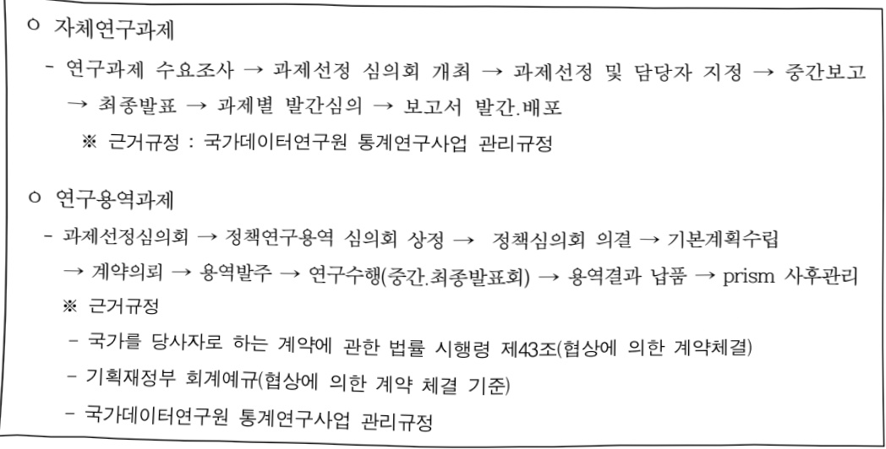

# 통계연구개발지원

**해당 페이지**: PDF 1970 ~ 1976 쪽 해당

**부처**: 국가데이터처
**분야**: 일반·지방행정
**회계유형**: 일반회계
**2026 확정예산**: 1564.0 백만원
**전년대비 증감률**: 13.7%
**AI 도메인**: 데이터

---

<table border=1 style='margin: auto; word-wrap: break-word;'><tr><td style='text-align: center; word-wrap: break-word;'>사 업 명</td></tr><tr><td style='text-align: center; word-wrap: break-word;'>(39) 통계연구개발지원 (4031-311)</td></tr></table>

□ 사업 코드 정보

<table border=1 style='margin: auto; word-wrap: break-word;'><tr><td style='text-align: center; word-wrap: break-word;'>구분</td><td style='text-align: center; word-wrap: break-word;'>회계</td><td style='text-align: center; word-wrap: break-word;'>소관</td><td style='text-align: center; word-wrap: break-word;'>실국(기관)</td><td style='text-align: center; word-wrap: break-word;'>계정</td><td style='text-align: center; word-wrap: break-word;'>분야</td><td style='text-align: center; word-wrap: break-word;'>부문</td></tr><tr><td style='text-align: center; word-wrap: break-word;'>코드</td><td rowspan="2">일반회계</td><td rowspan="2">국가데이터처</td><td rowspan="2">국가데이터연구원</td><td rowspan="2"></td><td style='text-align: center; word-wrap: break-word;'>010</td><td style='text-align: center; word-wrap: break-word;'>016</td></tr><tr><td style='text-align: center; word-wrap: break-word;'>명칭</td><td style='text-align: center; word-wrap: break-word;'>일반지방행정</td><td style='text-align: center; word-wrap: break-word;'>일반행정</td></tr></table>

<table border=1 style='margin: auto; word-wrap: break-word;'><tr><td style='text-align: center; word-wrap: break-word;'>구분</td><td style='text-align: center; word-wrap: break-word;'>프로그램</td><td style='text-align: center; word-wrap: break-word;'>단위사업</td><td style='text-align: center; word-wrap: break-word;'>세부사업</td></tr><tr><td style='text-align: center; word-wrap: break-word;'>코드</td><td style='text-align: center; word-wrap: break-word;'>4000</td><td style='text-align: center; word-wrap: break-word;'>4031</td><td style='text-align: center; word-wrap: break-word;'>311</td></tr><tr><td style='text-align: center; word-wrap: break-word;'>명칭</td><td style='text-align: center; word-wrap: break-word;'>책임운영기관</td><td style='text-align: center; word-wrap: break-word;'>국가통계연구원</td><td style='text-align: center; word-wrap: break-word;'>통계연구개발지원</td></tr></table>

□ 사업 성격 (공통요구자료 Ⅱ-1 작성유의사항 4. 참조, 해당하는 사항에 “○” 표시)

<table border=1 style='margin: auto; word-wrap: break-word;'><tr><td rowspan="2">신규</td><td rowspan="2">계속</td><td rowspan="2">완료</td><td rowspan="2">예비타당성 실시여부</td><td rowspan="2">총사업비 관리대상</td><td rowspan="2">총액계상 예산사업</td><td style='text-align: center; word-wrap: break-word;'>사업소관 변경정보</td></tr><tr><td style='text-align: center; word-wrap: break-word;'>2025예산 시 소관</td></tr><tr><td style='text-align: center; word-wrap: break-word;'></td><td style='text-align: center; word-wrap: break-word;'>○</td><td style='text-align: center; word-wrap: break-word;'></td><td style='text-align: center; word-wrap: break-word;'></td><td style='text-align: center; word-wrap: break-word;'></td><td style='text-align: center; word-wrap: break-word;'></td><td style='text-align: center; word-wrap: break-word;'></td></tr></table>

□ 사업 지원 형태 및 지원을 (최소한 한 개는 반드시 선택하시오. 해당사항에 0 표시)

<table border=1 style='margin: auto; word-wrap: break-word;'><tr><td style='text-align: center; word-wrap: break-word;'>직접</td><td style='text-align: center; word-wrap: break-word;'>출자</td><td style='text-align: center; word-wrap: break-word;'>출연</td><td style='text-align: center; word-wrap: break-word;'>보조</td><td style='text-align: center; word-wrap: break-word;'>융자</td><td style='text-align: center; word-wrap: break-word;'>국고보조율(%)</td><td style='text-align: center; word-wrap: break-word;'>융자율(%)</td></tr><tr><td style='text-align: center; word-wrap: break-word;'>○</td><td style='text-align: center; word-wrap: break-word;'></td><td style='text-align: center; word-wrap: break-word;'></td><td style='text-align: center; word-wrap: break-word;'></td><td style='text-align: center; word-wrap: break-word;'></td><td style='text-align: center; word-wrap: break-word;'></td><td style='text-align: center; word-wrap: break-word;'></td></tr></table>

## 사업 담당자

<table border=1 style='margin: auto; word-wrap: break-word;'><tr><td style='text-align: center; word-wrap: break-word;'>사업명</td><td colspan="2">구분</td></tr><tr><td rowspan="2">통계연구 개발지원</td><td style='text-align: center; word-wrap: break-word;'>소관부처</td><td style='text-align: center; word-wrap: break-word;'>국가데이터연구원 연구기획실</td></tr><tr><td style='text-align: center; word-wrap: break-word;'>사업시행주체</td><td style='text-align: center; word-wrap: break-word;'>국가데이터처</td></tr></table>

---

### 가. 예산 총괄표

(단위: 백만원, %)

<table border=1 style='margin: auto; word-wrap: break-word;'><tr><td rowspan="2">사업명</td><td rowspan="2">2024년 결산</td><td colspan="2">2025년 예산</td><td colspan="2">2026년</td><td rowspan="2">중감 (B-A)</td><td rowspan="2">(B-A)/A</td></tr><tr><td style='text-align: center; word-wrap: break-word;'>본예산(A)</td><td style='text-align: center; word-wrap: break-word;'>추경</td><td style='text-align: center; word-wrap: break-word;'>요구</td><td style='text-align: center; word-wrap: break-word;'>본예산(B)</td></tr><tr><td style='text-align: center; word-wrap: break-word;'>통계연구개발지원</td><td style='text-align: center; word-wrap: break-word;'>1,407</td><td style='text-align: center; word-wrap: break-word;'>1,376</td><td style='text-align: center; word-wrap: break-word;'>1,376</td><td style='text-align: center; word-wrap: break-word;'>1,564</td><td style='text-align: center; word-wrap: break-word;'>1,564</td><td style='text-align: center; word-wrap: break-word;'>188</td><td style='text-align: center; word-wrap: break-word;'>13.7</td></tr></table>

□ 기능별(내역사업별), 목별 예산 내역

(단위:백만원)

<table border=1 style='margin: auto; word-wrap: break-word;'><tr><td rowspan="3"></td><td colspan="4">2024</td><td colspan="7">2025(2025.12월 말)</td><td style='text-align: center; word-wrap: break-word;'>2026예산</td></tr><tr><td rowspan="2">예산의(추정)</td><td rowspan="2">예산현액</td><td rowspan="2">집행액[실집행액]</td><td rowspan="2">이럴때</td><td rowspan="2">불용액</td><td rowspan="2">분예산</td><td rowspan="2">예산현액</td><td rowspan="2">집행액[실집행액]</td><td colspan="2">전년도이월액제외</td><td rowspan="2">이월액액</td><td rowspan="2">불용액액</td></tr><tr><td style='text-align: center; word-wrap: break-word;'>예산현액</td><td style='text-align: center; word-wrap: break-word;'>집행액[실집행액]</td></tr><tr><td style='text-align: center; word-wrap: break-word;'>○ 기능별 분류(합계)</td><td style='text-align: center; word-wrap: break-word;'>1,490</td><td style='text-align: center; word-wrap: break-word;'>1,490</td><td style='text-align: center; word-wrap: break-word;'>1,407</td><td style='text-align: center; word-wrap: break-word;'>-</td><td style='text-align: center; word-wrap: break-word;'>83</td><td style='text-align: center; word-wrap: break-word;'>1,376</td><td style='text-align: center; word-wrap: break-word;'>1,376</td><td style='text-align: center; word-wrap: break-word;'>1,320</td><td style='text-align: center; word-wrap: break-word;'>1,376</td><td style='text-align: center; word-wrap: break-word;'>1,320</td><td style='text-align: center; word-wrap: break-word;'>-</td><td style='text-align: center; word-wrap: break-word;'>1,564</td></tr><tr><td style='text-align: center; word-wrap: break-word;'>· 연구기획운영</td><td style='text-align: center; word-wrap: break-word;'>444</td><td style='text-align: center; word-wrap: break-word;'>444</td><td style='text-align: center; word-wrap: break-word;'>432</td><td style='text-align: center; word-wrap: break-word;'>-</td><td style='text-align: center; word-wrap: break-word;'>12</td><td style='text-align: center; word-wrap: break-word;'>437</td><td style='text-align: center; word-wrap: break-word;'>455</td><td style='text-align: center; word-wrap: break-word;'>452</td><td style='text-align: center; word-wrap: break-word;'>455</td><td style='text-align: center; word-wrap: break-word;'>452</td><td style='text-align: center; word-wrap: break-word;'>-</td><td style='text-align: center; word-wrap: break-word;'>425</td></tr><tr><td style='text-align: center; word-wrap: break-word;'>· 자체수요과제</td><td style='text-align: center; word-wrap: break-word;'>702</td><td style='text-align: center; word-wrap: break-word;'>702</td><td style='text-align: center; word-wrap: break-word;'>647</td><td style='text-align: center; word-wrap: break-word;'>-</td><td style='text-align: center; word-wrap: break-word;'>55</td><td style='text-align: center; word-wrap: break-word;'>707</td><td style='text-align: center; word-wrap: break-word;'>689</td><td style='text-align: center; word-wrap: break-word;'>656</td><td style='text-align: center; word-wrap: break-word;'>689</td><td style='text-align: center; word-wrap: break-word;'>656</td><td style='text-align: center; word-wrap: break-word;'>-</td><td style='text-align: center; word-wrap: break-word;'>777</td></tr><tr><td style='text-align: center; word-wrap: break-word;'>· 연구사업수행</td><td style='text-align: center; word-wrap: break-word;'>344</td><td style='text-align: center; word-wrap: break-word;'>344</td><td style='text-align: center; word-wrap: break-word;'>328</td><td style='text-align: center; word-wrap: break-word;'>-</td><td style='text-align: center; word-wrap: break-word;'>16</td><td style='text-align: center; word-wrap: break-word;'>232</td><td style='text-align: center; word-wrap: break-word;'>232</td><td style='text-align: center; word-wrap: break-word;'>212</td><td style='text-align: center; word-wrap: break-word;'>232</td><td style='text-align: center; word-wrap: break-word;'>212</td><td style='text-align: center; word-wrap: break-word;'>-</td><td style='text-align: center; word-wrap: break-word;'>362</td></tr><tr><td style='text-align: center; word-wrap: break-word;'>○ 비목별 분류(합계)</td><td style='text-align: center; word-wrap: break-word;'>1,490</td><td style='text-align: center; word-wrap: break-word;'>1,490</td><td style='text-align: center; word-wrap: break-word;'>1,407</td><td style='text-align: center; word-wrap: break-word;'>-</td><td style='text-align: center; word-wrap: break-word;'>83</td><td style='text-align: center; word-wrap: break-word;'>1,376</td><td style='text-align: center; word-wrap: break-word;'>1,376</td><td style='text-align: center; word-wrap: break-word;'>1,320</td><td style='text-align: center; word-wrap: break-word;'>1,376</td><td style='text-align: center; word-wrap: break-word;'>1,320</td><td style='text-align: center; word-wrap: break-word;'>-</td><td style='text-align: center; word-wrap: break-word;'>1,564</td></tr><tr><td style='text-align: center; word-wrap: break-word;'>· 일용임금(110-04)</td><td style='text-align: center; word-wrap: break-word;'>202</td><td style='text-align: center; word-wrap: break-word;'>202</td><td style='text-align: center; word-wrap: break-word;'>194</td><td style='text-align: center; word-wrap: break-word;'>-</td><td style='text-align: center; word-wrap: break-word;'>8</td><td style='text-align: center; word-wrap: break-word;'>205</td><td style='text-align: center; word-wrap: break-word;'>205</td><td style='text-align: center; word-wrap: break-word;'>201</td><td style='text-align: center; word-wrap: break-word;'>205</td><td style='text-align: center; word-wrap: break-word;'>201</td><td style='text-align: center; word-wrap: break-word;'>-</td><td style='text-align: center; word-wrap: break-word;'>21</td></tr><tr><td style='text-align: center; word-wrap: break-word;'>· 일반수용비(210-01)</td><td style='text-align: center; word-wrap: break-word;'>400</td><td style='text-align: center; word-wrap: break-word;'>400</td><td style='text-align: center; word-wrap: break-word;'>379</td><td style='text-align: center; word-wrap: break-word;'>-</td><td style='text-align: center; word-wrap: break-word;'>21</td><td style='text-align: center; word-wrap: break-word;'>364</td><td style='text-align: center; word-wrap: break-word;'>356</td><td style='text-align: center; word-wrap: break-word;'>344</td><td style='text-align: center; word-wrap: break-word;'>356</td><td style='text-align: center; word-wrap: break-word;'>344</td><td style='text-align: center; word-wrap: break-word;'>-</td><td style='text-align: center; word-wrap: break-word;'>37</td></tr><tr><td style='text-align: center; word-wrap: break-word;'>· 공공요금및제세(210-02)</td><td style='text-align: center; word-wrap: break-word;'>9</td><td style='text-align: center; word-wrap: break-word;'>9</td><td style='text-align: center; word-wrap: break-word;'>7</td><td style='text-align: center; word-wrap: break-word;'>-</td><td style='text-align: center; word-wrap: break-word;'>2</td><td style='text-align: center; word-wrap: break-word;'>9</td><td style='text-align: center; word-wrap: break-word;'>9</td><td style='text-align: center; word-wrap: break-word;'>7</td><td style='text-align: center; word-wrap: break-word;'>9</td><td style='text-align: center; word-wrap: break-word;'>7</td><td style='text-align: center; word-wrap: break-word;'>-</td><td style='text-align: center; word-wrap: break-word;'></td></tr><tr><td style='text-align: center; word-wrap: break-word;'>· 임차료(210-07)</td><td style='text-align: center; word-wrap: break-word;'>6</td><td style='text-align: center; word-wrap: break-word;'>6</td><td style='text-align: center; word-wrap: break-word;'>4</td><td style='text-align: center; word-wrap: break-word;'>-</td><td style='text-align: center; word-wrap: break-word;'>2</td><td style='text-align: center; word-wrap: break-word;'>6</td><td style='text-align: center; word-wrap: break-word;'>6</td><td style='text-align: center; word-wrap: break-word;'>5</td><td style='text-align: center; word-wrap: break-word;'>6</td><td style='text-align: center; word-wrap: break-word;'>5</td><td style='text-align: center; word-wrap: break-word;'>-</td><td style='text-align: center; word-wrap: break-word;'></td></tr><tr><td style='text-align: center; word-wrap: break-word;'>· 시설장비유지비(210-09)</td><td style='text-align: center; word-wrap: break-word;'>5</td><td style='text-align: center; word-wrap: break-word;'>5</td><td style='text-align: center; word-wrap: break-word;'>5</td><td style='text-align: center; word-wrap: break-word;'>-</td><td style='text-align: center; word-wrap: break-word;'>1</td><td style='text-align: center; word-wrap: break-word;'>5</td><td style='text-align: center; word-wrap: break-word;'>28</td><td style='text-align: center; word-wrap: break-word;'>28</td><td style='text-align: center; word-wrap: break-word;'>28</td><td style='text-align: center; word-wrap: break-word;'>28</td><td style='text-align: center; word-wrap: break-word;'>-</td><td style='text-align: center; word-wrap: break-word;'></td></tr><tr><td style='text-align: center; word-wrap: break-word;'>· 일반용역비(210-14)</td><td style='text-align: center; word-wrap: break-word;'>133</td><td style='text-align: center; word-wrap: break-word;'>133</td><td style='text-align: center; word-wrap: break-word;'>132</td><td style='text-align: center; word-wrap: break-word;'>-</td><td style='text-align: center; word-wrap: break-word;'>1</td><td style='text-align: center; word-wrap: break-word;'>133</td><td style='text-align: center; word-wrap: break-word;'>122</td><td style='text-align: center; word-wrap: break-word;'>122</td><td style='text-align: center; word-wrap: break-word;'>122</td><td style='text-align: center; word-wrap: break-word;'>122</td><td style='text-align: center; word-wrap: break-word;'>-</td><td style='text-align: center; word-wrap: break-word;'>11</td></tr><tr><td style='text-align: center; word-wrap: break-word;'>· 관리용역비(210-15)</td><td style='text-align: center; word-wrap: break-word;'>26</td><td style='text-align: center; word-wrap: break-word;'>26</td><td style='text-align: center; word-wrap: break-word;'>22</td><td style='text-align: center; word-wrap: break-word;'>-</td><td style='text-align: center; word-wrap: break-word;'>4</td><td style='text-align: center; word-wrap: break-word;'>26</td><td style='text-align: center; word-wrap: break-word;'>22</td><td style='text-align: center; word-wrap: break-word;'>22</td><td style='text-align: center; word-wrap: break-word;'>22</td><td style='text-align: center; word-wrap: break-word;'>22</td><td style='text-align: center; word-wrap: break-word;'>-</td><td style='text-align: center; word-wrap: break-word;'>23</td></tr><tr><td style='text-align: center; word-wrap: break-word;'>· 국내여비(220-01)</td><td style='text-align: center; word-wrap: break-word;'>30</td><td style='text-align: center; word-wrap: break-word;'>30</td><td style='text-align: center; word-wrap: break-word;'>27</td><td style='text-align: center; word-wrap: break-word;'>-</td><td style='text-align: center; word-wrap: break-word;'>3</td><td style='text-align: center; word-wrap: break-word;'>30</td><td style='text-align: center; word-wrap: break-word;'>30</td><td style='text-align: center; word-wrap: break-word;'>28</td><td style='text-align: center; word-wrap: break-word;'>30</td><td style='text-align: center; word-wrap: break-word;'>28</td><td style='text-align: center; word-wrap: break-word;'>-</td><td style='text-align: center; word-wrap: break-word;'>3</td></tr><tr><td style='text-align: center; word-wrap: break-word;'>· 국외여비(220-02)</td><td style='text-align: center; word-wrap: break-word;'>50</td><td style='text-align: center; word-wrap: break-word;'>50</td><td style='text-align: center; word-wrap: break-word;'>46</td><td style='text-align: center; word-wrap: break-word;'>-</td><td style='text-align: center; word-wrap: break-word;'>4</td><td style='text-align: center; word-wrap: break-word;'>50</td><td style='text-align: center; word-wrap: break-word;'>50</td><td style='text-align: center; word-wrap: break-word;'>50</td><td style='text-align: center; word-wrap: break-word;'>50</td><td style='text-align: center; word-wrap: break-word;'>50</td><td style='text-align: center; word-wrap: break-word;'>-</td><td style='text-align: center; word-wrap: break-word;'>5</td></tr><tr><td style='text-align: center; word-wrap: break-word;'>· 사업추진비(240-01)</td><td style='text-align: center; word-wrap: break-word;'>12</td><td style='text-align: center; word-wrap: break-word;'>12</td><td style='text-align: center; word-wrap: break-word;'>12</td><td style='text-align: center; word-wrap: break-word;'>-</td><td style='text-align: center; word-wrap: break-word;'>0</td><td style='text-align: center; word-wrap: break-word;'>12</td><td style='text-align: center; word-wrap: break-word;'>12</td><td style='text-align: center; word-wrap: break-word;'>12</td><td style='text-align: center; word-wrap: break-word;'>12</td><td style='text-align: center; word-wrap: break-word;'>12</td><td style='text-align: center; word-wrap: break-word;'>-</td><td style='text-align: center; word-wrap: break-word;'>1</td></tr><tr><td style='text-align: center; word-wrap: break-word;'>· 일반연구비(260-01)</td><td style='text-align: center; word-wrap: break-word;'>536</td><td style='text-align: center; word-wrap: break-word;'>536</td><td style='text-align: center; word-wrap: break-word;'>499</td><td style='text-align: center; word-wrap: break-word;'>-</td><td style='text-align: center; word-wrap: break-word;'>37</td><td style='text-align: center; word-wrap: break-word;'>424</td><td style='text-align: center; word-wrap: break-word;'>424</td><td style='text-align: center; word-wrap: break-word;'>390</td><td style='text-align: center; word-wrap: break-word;'>424</td><td style='text-align: center; word-wrap: break-word;'>390</td><td style='text-align: center; word-wrap: break-word;'>-</td><td style='text-align: center; word-wrap: break-word;'>33</td></tr><tr><td style='text-align: center; word-wrap: break-word;'>· 포상금(310-03)</td><td style='text-align: center; word-wrap: break-word;'>11</td><td style='text-align: center; word-wrap: break-word;'>11</td><td style='text-align: center; word-wrap: break-word;'>11</td><td style='text-align: center; word-wrap: break-word;'>-</td><td style='text-align: center; word-wrap: break-word;'>0</td><td style='text-align: center; word-wrap: break-word;'>11</td><td style='text-align: center; word-wrap: break-word;'>11</td><td style='text-align: center; word-wrap: break-word;'>11</td><td style='text-align: center; word-wrap: break-word;'>11</td><td style='text-align: center; word-wrap: break-word;'>11</td><td style='text-align: center; word-wrap: break-word;'>-</td><td style='text-align: center; word-wrap: break-word;'>1</td></tr><tr><td style='text-align: center; word-wrap: break-word;'>· 고용부담금(320-09)</td><td style='text-align: center; word-wrap: break-word;'>23</td><td style='text-align: center; word-wrap: break-word;'>23</td><td style='text-align: center; word-wrap: break-word;'>22</td><td style='text-align: center; word-wrap: break-word;'>-</td><td style='text-align: center; word-wrap: break-word;'>1</td><td style='text-align: center; word-wrap: break-word;'>23</td><td style='text-align: center; word-wrap: break-word;'>23</td><td style='text-align: center; word-wrap: break-word;'>22</td><td style='text-align: center; word-wrap: break-word;'>23</td><td style='text-align: center; word-wrap: break-word;'>22</td><td style='text-align: center; word-wrap: break-word;'>-</td><td style='text-align: center; word-wrap: break-word;'>24</td></tr><tr><td style='text-align: center; word-wrap: break-word;'>· 자산취득비(430-01)</td><td style='text-align: center; word-wrap: break-word;'>47</td><td style='text-align: center; word-wrap: break-word;'>47</td><td style='text-align: center; word-wrap: break-word;'>47</td><td style='text-align: center; word-wrap: break-word;'>-</td><td style='text-align: center; word-wrap: break-word;'>0</td><td style='text-align: center; word-wrap: break-word;'>78</td><td style='text-align: center; word-wrap: break-word;'>78</td><td style='text-align: center; word-wrap: break-word;'>78</td><td style='text-align: center; word-wrap: break-word;'>78</td><td style='text-align: center; word-wrap: break-word;'>78</td><td style='text-align: center; word-wrap: break-word;'>-</td><td style='text-align: center; word-wrap: break-word;'>140</td></tr></table>

---

<table border=1 style='margin: auto; word-wrap: break-word;'><tr><td rowspan="3"></td><td colspan="5">2024</td><td colspan="7">2025(2025.12월말)</td><td rowspan="3">2026예산</td></tr><tr><td rowspan="2">예산액(추정)</td><td rowspan="2">예산현액</td><td rowspan="2">집행액[실정행액]</td><td rowspan="2">이런대</td><td rowspan="2">불용액</td><td rowspan="2">본예산</td><td rowspan="2">예산현액</td><td rowspan="2">집행액[실정행액]</td><td colspan="2">전년도 이월액제외</td><td rowspan="2">이월액액</td><td rowspan="2">불용액액</td></tr><tr><td style='text-align: center; word-wrap: break-word;'>예산현액</td><td style='text-align: center; word-wrap: break-word;'>집행액[실정행액]</td></tr><tr><td style='text-align: center; word-wrap: break-word;'>○ 기능·비목별 분류(합계)</td><td style='text-align: center; word-wrap: break-word;'>1,490</td><td style='text-align: center; word-wrap: break-word;'>1,490</td><td style='text-align: center; word-wrap: break-word;'>1,407</td><td style='text-align: center; word-wrap: break-word;'>-</td><td style='text-align: center; word-wrap: break-word;'>83</td><td style='text-align: center; word-wrap: break-word;'>1,376</td><td style='text-align: center; word-wrap: break-word;'>1,376</td><td style='text-align: center; word-wrap: break-word;'>1,320</td><td style='text-align: center; word-wrap: break-word;'>1,376</td><td style='text-align: center; word-wrap: break-word;'>1,320</td><td style='text-align: center; word-wrap: break-word;'>-</td><td style='text-align: center; word-wrap: break-word;'></td><td style='text-align: center; word-wrap: break-word;'>1,56</td></tr><tr><td style='text-align: center; word-wrap: break-word;'>· 연구기획운영</td><td style='text-align: center; word-wrap: break-word;'>444</td><td style='text-align: center; word-wrap: break-word;'>444</td><td style='text-align: center; word-wrap: break-word;'>432</td><td style='text-align: center; word-wrap: break-word;'>-</td><td style='text-align: center; word-wrap: break-word;'>12</td><td style='text-align: center; word-wrap: break-word;'>437</td><td style='text-align: center; word-wrap: break-word;'>455</td><td style='text-align: center; word-wrap: break-word;'>452</td><td style='text-align: center; word-wrap: break-word;'>455</td><td style='text-align: center; word-wrap: break-word;'>452</td><td style='text-align: center; word-wrap: break-word;'>-</td><td style='text-align: center; word-wrap: break-word;'></td><td style='text-align: center; word-wrap: break-word;'>42</td></tr><tr><td style='text-align: center; word-wrap: break-word;'>· 일용임금(110-04)</td><td style='text-align: center; word-wrap: break-word;'>44</td><td style='text-align: center; word-wrap: break-word;'>44</td><td style='text-align: center; word-wrap: break-word;'>44</td><td style='text-align: center; word-wrap: break-word;'>-</td><td style='text-align: center; word-wrap: break-word;'>0</td><td style='text-align: center; word-wrap: break-word;'>44</td><td style='text-align: center; word-wrap: break-word;'>44</td><td style='text-align: center; word-wrap: break-word;'>44</td><td style='text-align: center; word-wrap: break-word;'>44</td><td style='text-align: center; word-wrap: break-word;'>44</td><td style='text-align: center; word-wrap: break-word;'>-</td><td style='text-align: center; word-wrap: break-word;'></td><td style='text-align: center; word-wrap: break-word;'>4</td></tr><tr><td style='text-align: center; word-wrap: break-word;'>· 일반수용비(210-01)</td><td style='text-align: center; word-wrap: break-word;'>173</td><td style='text-align: center; word-wrap: break-word;'>173</td><td style='text-align: center; word-wrap: break-word;'>173</td><td style='text-align: center; word-wrap: break-word;'>-</td><td style='text-align: center; word-wrap: break-word;'>0</td><td style='text-align: center; word-wrap: break-word;'>166</td><td style='text-align: center; word-wrap: break-word;'>166</td><td style='text-align: center; word-wrap: break-word;'>166</td><td style='text-align: center; word-wrap: break-word;'>166</td><td style='text-align: center; word-wrap: break-word;'>166</td><td style='text-align: center; word-wrap: break-word;'>-</td><td style='text-align: center; word-wrap: break-word;'></td><td style='text-align: center; word-wrap: break-word;'>15</td></tr><tr><td style='text-align: center; word-wrap: break-word;'>· 공공요금및제세(210-02)</td><td style='text-align: center; word-wrap: break-word;'>5</td><td style='text-align: center; word-wrap: break-word;'>5</td><td style='text-align: center; word-wrap: break-word;'>3</td><td style='text-align: center; word-wrap: break-word;'>-</td><td style='text-align: center; word-wrap: break-word;'>2</td><td style='text-align: center; word-wrap: break-word;'>5</td><td style='text-align: center; word-wrap: break-word;'>5</td><td style='text-align: center; word-wrap: break-word;'>3</td><td style='text-align: center; word-wrap: break-word;'>5</td><td style='text-align: center; word-wrap: break-word;'>3</td><td style='text-align: center; word-wrap: break-word;'>-</td><td style='text-align: center; word-wrap: break-word;'></td><td style='text-align: center; word-wrap: break-word;'></td></tr><tr><td style='text-align: center; word-wrap: break-word;'>· 임차료(210-07)</td><td style='text-align: center; word-wrap: break-word;'>6</td><td style='text-align: center; word-wrap: break-word;'>6</td><td style='text-align: center; word-wrap: break-word;'>4</td><td style='text-align: center; word-wrap: break-word;'>-</td><td style='text-align: center; word-wrap: break-word;'>2</td><td style='text-align: center; word-wrap: break-word;'>6</td><td style='text-align: center; word-wrap: break-word;'>6</td><td style='text-align: center; word-wrap: break-word;'>5</td><td style='text-align: center; word-wrap: break-word;'>6</td><td style='text-align: center; word-wrap: break-word;'>5</td><td style='text-align: center; word-wrap: break-word;'>-</td><td style='text-align: center; word-wrap: break-word;'></td><td style='text-align: center; word-wrap: break-word;'></td></tr><tr><td style='text-align: center; word-wrap: break-word;'>· 시설장비유지비(210-09)</td><td style='text-align: center; word-wrap: break-word;'>5</td><td style='text-align: center; word-wrap: break-word;'>5</td><td style='text-align: center; word-wrap: break-word;'>5</td><td style='text-align: center; word-wrap: break-word;'>-</td><td style='text-align: center; word-wrap: break-word;'>0</td><td style='text-align: center; word-wrap: break-word;'>5</td><td style='text-align: center; word-wrap: break-word;'>28</td><td style='text-align: center; word-wrap: break-word;'>28</td><td style='text-align: center; word-wrap: break-word;'>28</td><td style='text-align: center; word-wrap: break-word;'>28</td><td style='text-align: center; word-wrap: break-word;'>-</td><td style='text-align: center; word-wrap: break-word;'></td><td style='text-align: center; word-wrap: break-word;'></td></tr><tr><td style='text-align: center; word-wrap: break-word;'>· 일반용역비(210-14)</td><td style='text-align: center; word-wrap: break-word;'>68</td><td style='text-align: center; word-wrap: break-word;'>68</td><td style='text-align: center; word-wrap: break-word;'>67</td><td style='text-align: center; word-wrap: break-word;'>-</td><td style='text-align: center; word-wrap: break-word;'>1</td><td style='text-align: center; word-wrap: break-word;'>68</td><td style='text-align: center; word-wrap: break-word;'>67</td><td style='text-align: center; word-wrap: break-word;'>67</td><td style='text-align: center; word-wrap: break-word;'>67</td><td style='text-align: center; word-wrap: break-word;'>67</td><td style='text-align: center; word-wrap: break-word;'>-</td><td style='text-align: center; word-wrap: break-word;'></td><td style='text-align: center; word-wrap: break-word;'></td></tr><tr><td style='text-align: center; word-wrap: break-word;'>· 관리용역비(210-15)</td><td style='text-align: center; word-wrap: break-word;'>26</td><td style='text-align: center; word-wrap: break-word;'>26</td><td style='text-align: center; word-wrap: break-word;'>22</td><td style='text-align: center; word-wrap: break-word;'>-</td><td style='text-align: center; word-wrap: break-word;'>4</td><td style='text-align: center; word-wrap: break-word;'>26</td><td style='text-align: center; word-wrap: break-word;'>22</td><td style='text-align: center; word-wrap: break-word;'>22</td><td style='text-align: center; word-wrap: break-word;'>22</td><td style='text-align: center; word-wrap: break-word;'>22</td><td style='text-align: center; word-wrap: break-word;'>-</td><td style='text-align: center; word-wrap: break-word;'></td><td style='text-align: center; word-wrap: break-word;'></td></tr><tr><td style='text-align: center; word-wrap: break-word;'>· 국외여비(220-02)</td><td style='text-align: center; word-wrap: break-word;'>50</td><td style='text-align: center; word-wrap: break-word;'>50</td><td style='text-align: center; word-wrap: break-word;'>46</td><td style='text-align: center; word-wrap: break-word;'>-</td><td style='text-align: center; word-wrap: break-word;'>4</td><td style='text-align: center; word-wrap: break-word;'>50</td><td style='text-align: center; word-wrap: break-word;'>50</td><td style='text-align: center; word-wrap: break-word;'>50</td><td style='text-align: center; word-wrap: break-word;'>50</td><td style='text-align: center; word-wrap: break-word;'>50</td><td style='text-align: center; word-wrap: break-word;'>-</td><td style='text-align: center; word-wrap: break-word;'></td><td style='text-align: center; word-wrap: break-word;'></td></tr><tr><td style='text-align: center; word-wrap: break-word;'>· 사업추진비(240-01)</td><td style='text-align: center; word-wrap: break-word;'>4</td><td style='text-align: center; word-wrap: break-word;'>4</td><td style='text-align: center; word-wrap: break-word;'>4</td><td style='text-align: center; word-wrap: break-word;'>-</td><td style='text-align: center; word-wrap: break-word;'>0</td><td style='text-align: center; word-wrap: break-word;'>4</td><td style='text-align: center; word-wrap: break-word;'>4</td><td style='text-align: center; word-wrap: break-word;'>4</td><td style='text-align: center; word-wrap: break-word;'>4</td><td style='text-align: center; word-wrap: break-word;'>4</td><td style='text-align: center; word-wrap: break-word;'>-</td><td style='text-align: center; word-wrap: break-word;'></td><td style='text-align: center; word-wrap: break-word;'></td></tr><tr><td style='text-align: center; word-wrap: break-word;'>· 고용부담금(320-09)</td><td style='text-align: center; word-wrap: break-word;'>5</td><td style='text-align: center; word-wrap: break-word;'>5</td><td style='text-align: center; word-wrap: break-word;'>5</td><td style='text-align: center; word-wrap: break-word;'>-</td><td style='text-align: center; word-wrap: break-word;'>0</td><td style='text-align: center; word-wrap: break-word;'>5</td><td style='text-align: center; word-wrap: break-word;'>5</td><td style='text-align: center; word-wrap: break-word;'>5</td><td style='text-align: center; word-wrap: break-word;'>5</td><td style='text-align: center; word-wrap: break-word;'>5</td><td style='text-align: center; word-wrap: break-word;'>-</td><td style='text-align: center; word-wrap: break-word;'></td><td style='text-align: center; word-wrap: break-word;'></td></tr><tr><td style='text-align: center; word-wrap: break-word;'>· 포상금(310-03)</td><td style='text-align: center; word-wrap: break-word;'>11</td><td style='text-align: center; word-wrap: break-word;'>11</td><td style='text-align: center; word-wrap: break-word;'>11</td><td style='text-align: center; word-wrap: break-word;'>-</td><td style='text-align: center; word-wrap: break-word;'>0</td><td style='text-align: center; word-wrap: break-word;'>11</td><td style='text-align: center; word-wrap: break-word;'>11</td><td style='text-align: center; word-wrap: break-word;'>11</td><td style='text-align: center; word-wrap: break-word;'>11</td><td style='text-align: center; word-wrap: break-word;'>11</td><td style='text-align: center; word-wrap: break-word;'>-</td><td style='text-align: center; word-wrap: break-word;'></td><td style='text-align: center; word-wrap: break-word;'></td></tr><tr><td style='text-align: center; word-wrap: break-word;'>· 자산취득비(430-01)</td><td style='text-align: center; word-wrap: break-word;'>47</td><td style='text-align: center; word-wrap: break-word;'>47</td><td style='text-align: center; word-wrap: break-word;'>47</td><td style='text-align: center; word-wrap: break-word;'>-</td><td style='text-align: center; word-wrap: break-word;'>0</td><td style='text-align: center; word-wrap: break-word;'>47</td><td style='text-align: center; word-wrap: break-word;'>47</td><td style='text-align: center; word-wrap: break-word;'>47</td><td style='text-align: center; word-wrap: break-word;'>47</td><td style='text-align: center; word-wrap: break-word;'>47</td><td style='text-align: center; word-wrap: break-word;'>-</td><td style='text-align: center; word-wrap: break-word;'></td><td style='text-align: center; word-wrap: break-word;'></td></tr><tr><td style='text-align: center; word-wrap: break-word;'>· 자체수요과제</td><td style='text-align: center; word-wrap: break-word;'>702</td><td style='text-align: center; word-wrap: break-word;'>702</td><td style='text-align: center; word-wrap: break-word;'>647</td><td style='text-align: center; word-wrap: break-word;'>-</td><td style='text-align: center; word-wrap: break-word;'>55</td><td style='text-align: center; word-wrap: break-word;'>707</td><td style='text-align: center; word-wrap: break-word;'>689</td><td style='text-align: center; word-wrap: break-word;'>656</td><td style='text-align: center; word-wrap: break-word;'>689</td><td style='text-align: center; word-wrap: break-word;'>656</td><td style='text-align: center; word-wrap: break-word;'>-</td><td style='text-align: center; word-wrap: break-word;'></td><td style='text-align: center; word-wrap: break-word;'></td></tr><tr><td style='text-align: center; word-wrap: break-word;'>· 일용임금(110-04)</td><td style='text-align: center; word-wrap: break-word;'>158</td><td style='text-align: center; word-wrap: break-word;'>158</td><td style='text-align: center; word-wrap: break-word;'>150</td><td style='text-align: center; word-wrap: break-word;'>-</td><td style='text-align: center; word-wrap: break-word;'>8</td><td style='text-align: center; word-wrap: break-word;'>161</td><td style='text-align: center; word-wrap: break-word;'>161</td><td style='text-align: center; word-wrap: break-word;'>158</td><td style='text-align: center; word-wrap: break-word;'>161</td><td style='text-align: center; word-wrap: break-word;'>158</td><td style='text-align: center; word-wrap: break-word;'>-</td><td style='text-align: center; word-wrap: break-word;'></td><td style='text-align: center; word-wrap: break-word;'></td></tr><tr><td style='text-align: center; word-wrap: break-word;'>· 일반수용비(210-01)</td><td style='text-align: center; word-wrap: break-word;'>202</td><td style='text-align: center; word-wrap: break-word;'>202</td><td style='text-align: center; word-wrap: break-word;'>180</td><td style='text-align: center; word-wrap: break-word;'>-</td><td style='text-align: center; word-wrap: break-word;'>22</td><td style='text-align: center; word-wrap: break-word;'>173</td><td style='text-align: center; word-wrap: break-word;'>165</td><td style='text-align: center; word-wrap: break-word;'>153</td><td style='text-align: center; word-wrap: break-word;'>165</td><td style='text-align: center; word-wrap: break-word;'>161</td><td style='text-align: center; word-wrap: break-word;'>-</td><td style='text-align: center; word-wrap: break-word;'></td><td style='text-align: center; word-wrap: break-word;'></td></tr><tr><td style='text-align: center; word-wrap: break-word;'>· 공공요금및제세(210-02)</td><td style='text-align: center; word-wrap: break-word;'>2</td><td style='text-align: center; word-wrap: break-word;'>2</td><td style='text-align: center; word-wrap: break-word;'>2</td><td style='text-align: center; word-wrap: break-word;'>-</td><td style='text-align: center; word-wrap: break-word;'>0</td><td style='text-align: center; word-wrap: break-word;'>2</td><td style='text-align: center; word-wrap: break-word;'>2</td><td style='text-align: center; word-wrap: break-word;'>2</td><td style='text-align: center; word-wrap: break-word;'>2</td><td style='text-align: center; word-wrap: break-word;'>2</td><td style='text-align: center; word-wrap: break-word;'>-</td><td style='text-align: center; word-wrap: break-word;'></td><td style='text-align: center; word-wrap: break-word;'></td></tr><tr><td style='text-align: center; word-wrap: break-word;'>· 일반용역비(210-14)</td><td style='text-align: center; word-wrap: break-word;'>65</td><td style='text-align: center; word-wrap: break-word;'>65</td><td style='text-align: center; word-wrap: break-word;'>65</td><td style='text-align: center; word-wrap: break-word;'>-</td><td style='text-align: center; word-wrap: break-word;'>0</td><td style='text-align: center; word-wrap: break-word;'>65</td><td style='text-align: center; word-wrap: break-word;'>55</td><td style='text-align: center; word-wrap: break-word;'>55</td><td style='text-align: center; word-wrap: break-word;'>55</td><td style='text-align: center; word-wrap: break-word;'>55</td><td style='text-align: center; word-wrap: break-word;'>-</td><td style='text-align: center; word-wrap: break-word;'></td><td style='text-align: center; word-wrap: break-word;'></td></tr><tr><td style='text-align: center; word-wrap: break-word;'>· 관리용역비(210-15)</td><td style='text-align: center; word-wrap: break-word;'>-</td><td style='text-align: center; word-wrap: break-word;'>-</td><td style='text-align: center; word-wrap: break-word;'>-</td><td style='text-align: center; word-wrap: break-word;'>-</td><td style='text-align: center; word-wrap: break-word;'>-</td><td style='text-align: center; word-wrap: break-word;'>-</td><td style='text-align: center; word-wrap: break-word;'>-</td><td style='text-align: center; word-wrap: break-word;'>-</td><td style='text-align: center; word-wrap: break-word;'>-</td><td style='text-align: center; word-wrap: break-word;'>-</td><td style='text-align: center; word-wrap: break-word;'>-</td><td style='text-align: center; word-wrap: break-word;'></td><td style='text-align: center; word-wrap: break-word;'></td></tr><tr><td style='text-align: center; word-wrap: break-word;'>· 국내여비(220-01)</td><td style='text-align: center; word-wrap: break-word;'>30</td><td style='text-align: center; word-wrap: break-word;'>30</td><td style='text-align: center; word-wrap: break-word;'>27</td><td style='text-align: center; word-wrap: break-word;'>-</td><td style='text-align: center; word-wrap: break-word;'>3</td><td style='text-align: center; word-wrap: break-word;'>30</td><td style='text-align: center; word-wrap: break-word;'>30</td><td style='text-align: center; word-wrap: break-word;'>27</td><td style='text-align: center; word-wrap: break-word;'>30</td><td style='text-align: center; word-wrap: break-word;'>27</td><td style='text-align: center; word-wrap: break-word;'>-</td><td style='text-align: center; word-wrap: break-word;'></td><td style='text-align: center; word-wrap: break-word;'></td></tr><tr><td style='text-align: center; word-wrap: break-word;'>· 사업추진비(240-01)</td><td style='text-align: center; word-wrap: break-word;'>8</td><td style='text-align: center; word-wrap: break-word;'>8</td><td style='text-align: center; word-wrap: break-word;'>8</td><td style='text-align: center; word-wrap: break-word;'>-</td><td style='text-align: center; word-wrap: break-word;'>0</td><td style='text-align: center; word-wrap: break-word;'>8</td><td style='text-align: center; word-wrap: break-word;'>8</td><td style='text-align: center; word-wrap: break-word;'>8</td><td style='text-align: center; word-wrap: break-word;'>8</td><td style='text-align: center; word-wrap: break-word;'>8</td><td style='text-align: center; word-wrap: break-word;'>-</td><td style='text-align: center; word-wrap: break-word;'></td><td style='text-align: center; word-wrap: break-word;'></td></tr><tr><td style='text-align: center; word-wrap: break-word;'>· 일반연구비(260-01)</td><td style='text-align: center; word-wrap: break-word;'>219</td><td style='text-align: center; word-wrap: break-word;'>219</td><td style='text-align: center; word-wrap: break-word;'>198</td><td style='text-align: center; word-wrap: break-word;'>-</td><td style='text-align: center; word-wrap: break-word;'>21</td><td style='text-align: center; word-wrap: break-word;'>219</td><td style='text-align: center; word-wrap: break-word;'>219</td><td style='text-align: center; word-wrap: break-word;'>205</td><td style='text-align: center; word-wrap: break-word;'>219</td><td style='text-align: center; word-wrap: break-word;'>205</td><td style='text-align: center; word-wrap: break-word;'>-</td><td style='text-align: center; word-wrap: break-word;'></td><td style='text-align: center; word-wrap: break-word;'></td></tr><tr><td style='text-align: center; word-wrap: break-word;'>· 고용부담금(320-09)</td><td style='text-align: center; word-wrap: break-word;'>18</td><td style='text-align: center; word-wrap: break-word;'>18</td><td style='text-align: center; word-wrap: break-word;'>17</td><td style='text-align: center; word-wrap: break-word;'>-</td><td style='text-align: center; word-wrap: break-word;'>1</td><td style='text-align: center; word-wrap: break-word;'>18</td><td style='text-align: center; word-wrap: break-word;'>18</td><td style='text-align: center; word-wrap: break-word;'>17</td><td style='text-align: center; word-wrap: break-word;'>18</td><td style='text-align: center; word-wrap: break-word;'>17</td><td style='text-align: center; word-wrap: break-word;'>-</td><td style='text-align: center; word-wrap: break-word;'></td><td style='text-align: center; word-wrap: break-word;'></td></tr><tr><td style='text-align: center; word-wrap: break-word;'>· 자산취득비(430-01)</td><td style='text-align: center; word-wrap: break-word;'>0</td><td style='text-align: center; word-wrap: break-word;'>0</td><td style='text-align: center; word-wrap: break-word;'>0</td><td style='text-align: center; word-wrap: break-word;'>-</td><td style='text-align: center; word-wrap: break-word;'>0</td><td style='text-align: center; word-wrap: break-word;'>31</td><td style='text-align: center; word-wrap: break-word;'>31</td><td style='text-align: center; word-wrap: break-word;'>31</td><td style='text-align: center; word-wrap: break-word;'>31</td><td style='text-align: center; word-wrap: break-word;'>31</td><td style='text-align: center; word-wrap: break-word;'>-</td><td style='text-align: center; word-wrap: break-word;'></td><td style='text-align: center; word-wrap: break-word;'></td></tr><tr><td style='text-align: center; word-wrap: break-word;'>· 연구사업수행</td><td style='text-align: center; word-wrap: break-word;'>344</td><td style='text-align: center; word-wrap: break-word;'>344</td><td style='text-align: center; word-wrap: break-word;'>328</td><td style='text-align: center; word-wrap: break-word;'>-</td><td style='text-align: center; word-wrap: break-word;'>16</td><td style='text-align: center; word-wrap: break-word;'>232</td><td style='text-align: center; word-wrap: break-word;'>232</td><td style='text-align: center; word-wrap: break-word;'>212</td><td style='text-align: center; word-wrap: break-word;'>232</td><td style='text-align: center; word-wrap: break-word;'>212</td><td style='text-align: center; word-wrap: break-word;'>-</td><td style='text-align: center; word-wrap: break-word;'></td><td style='text-align: center; word-wrap: break-word;'></td></tr><tr><td style='text-align: center; word-wrap: break-word;'>· 일반수용비(210-01)</td><td style='text-align: center; word-wrap: break-word;'>25</td><td style='text-align: center; word-wrap: break-word;'>25</td><td style='text-align: center; word-wrap: break-word;'>25</td><td style='text-align: center; word-wrap: break-word;'>-</td><td style='text-align: center; word-wrap: break-word;'>0</td><td style='text-align: center; word-wrap: break-word;'>25</td><td style='text-align: center; word-wrap: break-word;'>25</td><td style='text-align: center; word-wrap: break-word;'>25</td><td style='text-align: center; word-wrap: break-word;'>25</td><td style='text-align: center; word-wrap: break-word;'>25</td><td style='text-align: center; word-wrap: break-word;'>-</td><td style='text-align: center; word-wrap: break-word;'></td><td style='text-align: center; word-wrap: break-word;'></td></tr><tr><td style='text-align: center; word-wrap: break-word;'>· 공공요금및제세(210-02)</td><td style='text-align: center; word-wrap: break-word;'>2</td><td style='text-align: center; word-wrap: break-word;'>2</td><td style='text-align: center; word-wrap: break-word;'>2</td><td style='text-align: center; word-wrap: break-word;'>-</td><td style='text-align: center; word-wrap: break-word;'>0</td><td style='text-align: center; word-wrap: break-word;'>2</td><td style='text-align: center; word-wrap: break-word;'>2</td><td style='text-align: center; word-wrap: break-word;'>2</td><td style='text-align: center; word-wrap: break-word;'>2</td><td style='text-align: center; word-wrap: break-word;'>2</td><td style='text-align: center; word-wrap: break-word;'>-</td><td style='text-align: center; word-wrap: break-word;'></td><td style='text-align: center; word-wrap: break-word;'></td></tr><tr><td style='text-align: center; word-wrap: break-word;'>· 일반연구비(260-01)</td><td style='text-align: center; word-wrap: break-word;'>317</td><td style='text-align: center; word-wrap: break-word;'>317</td><td style='text-align: center; word-wrap: break-word;'>301</td><td style='text-align: center; word-wrap: break-word;'>-</td><td style='text-align: center; word-wrap: break-word;'>16</td><td style='text-align: center; word-wrap: break-word;'>205</td><td style='text-align: center; word-wrap: break-word;'>205</td><td style='text-align: center; word-wrap: break-word;'>185</td><td style='text-align: center; word-wrap: break-word;'>205</td><td style='text-align: center; word-wrap: break-word;'>185</td><td style='text-align: center; word-wrap: break-word;'>-</td><td style='text-align: center; word-wrap: break-word;'></td><td style='text-align: center; word-wrap: break-word;'></td></tr></table>

---

### 나. 사업설명자료

## 1 ) 사업목적·내용

-선진통계조사기법개발,통계적추론방법연구개발강화로열악한통계조사환경에능

동적으로 대응하고, 증거기반 정책을 뒷받침하는 경제·사회·인구 등 다양한 통계분석

연구를 통해 정책 수요에 적극 대응

## 2 ) 사업개요

## □ 사업근거 및 추진경위

① 법령상 근거 및 조항

국가데이터처와 그 소속기관 직제 시행규칙(기획재정부령) 제4장의 2

② 추진경위

· 사업 시작년도 : 2007년

·추진배경

- 최근 조사환경 악화로 인한 통계조사의 어려움, 다양한 분야에 대한 통계작성 필요성

증가, 고품질 통계작성 요구 등 통계수요가 지속적으로 증가

- 통계연구를 통한 통계작성기법 향상, 신규 통계의 개발 및 기존통계를 개선하여 국가통계 발전을 도모하고자 '07년부터 통계연구개발 지원 사업을 추진

## □ 주요내용

① 사업규모

- 총사업비(해당되는 경우에만 기재) : 해당없음

- 사업기간 : 매년

- 최근 5년 간 투입된 사업비(예산액기준, 추경편성한 연도에는 추경포함)

<table border=1 style='margin: auto; word-wrap: break-word;'><tr><td style='text-align: center; word-wrap: break-word;'>연도</td><td style='text-align: center; word-wrap: break-word;'>2022</td><td style='text-align: center; word-wrap: break-word;'>2023</td><td style='text-align: center; word-wrap: break-word;'>2024</td><td style='text-align: center; word-wrap: break-word;'>2025</td><td style='text-align: center; word-wrap: break-word;'>2026</td></tr><tr><td style='text-align: center; word-wrap: break-word;'>사업비</td><td style='text-align: center; word-wrap: break-word;'>1,416</td><td style='text-align: center; word-wrap: break-word;'>1,425</td><td style='text-align: center; word-wrap: break-word;'>1,490</td><td style='text-align: center; word-wrap: break-word;'>1,376</td><td style='text-align: center; word-wrap: break-word;'>1,564</td></tr></table>

- 기타: 해당없음

② 사업추진체계

- 사업시행방법 : 직접수행

- 사업시행주체 : 국가데이터연구원

- 사업 수혜자 : 해당없음

- 보조, 융자, 출연, 출자 등의 경우 보조·융자 등 지원 비율 및 법적근거 : 해당없음

---

## 3 )2026년도 예산 산출 근거

<table border=1 style='margin: auto; word-wrap: break-word;'><tr><td style='text-align: center; word-wrap: break-word;'>☐ (2025) 1,376백만원 → (2025)</td><td style='text-align: center; word-wrap: break-word;'>칠, +188백만원</td></tr><tr><td colspan="2">(1) 연구기획운영: (2025) 437 → (2026) 425백만원(△12백만원) - (요구) 연구과제 평가·관리와 학술지·심포지엄·논문공모전 등 연구성과 소통확산 - (산출) 인건비 49백만원, 연구과제 관리 및 기타운영 376백만원 (보고서 발간 등 △12백만원)</td></tr><tr><td colspan="2">(2) 자체수요과제: (2025) 707 → (2026) 777백만원(+70백만원) - (요구) 통계개발개선, 통계방법론 연구 등 자체수요 과제연구를 위한 일반운영비 - (산출) 인건비 186백만원, 자문 및 발간 194백만원, 포럼 50백만원, 기타운영비 40백만원, AI통계분류시스템 운영비 214백만원, AI알고리즘 분석장비 93백만원</td></tr><tr><td colspan="2">(3) 연구사업수행: (2025) 232 → (2026) 362백만원(+130백만원) - (요구) 경제·사회·환경 등 다양한 연구수요에 대응하기 위한 분야별 전문가 참여를 통한 미래 대비 연구사업 수행 - (산출) 자문 및 발간 25백만원, 연구사업 335백만원, 기타운영비 2백만원</td></tr></table>

## 4 ) 사업효과

□ 사업영향, 산출물 성과지표 등

① 2022~2026년도 성과계획서 상 성과지표 및 최근 5년간 성과 달성도

<table border=1 style='margin: auto; word-wrap: break-word;'><tr><td style='text-align: center; word-wrap: break-word;'>성과지표</td><td style='text-align: center; word-wrap: break-word;'>구분</td><td style='text-align: center; word-wrap: break-word;'>&#x27;22</td><td style='text-align: center; word-wrap: break-word;'>&#x27;23</td><td style='text-align: center; word-wrap: break-word;'>&#x27;24</td><td style='text-align: center; word-wrap: break-word;'>&#x27;25</td><td style='text-align: center; word-wrap: break-word;'>&#x27;26</td><td style='text-align: center; word-wrap: break-word;'>&#x27;26목표치산출근거</td><td style='text-align: center; word-wrap: break-word;'>측정산식(또는 측정방법)</td><td style='text-align: center; word-wrap: break-word;'>자료수집방법(또는 자료출처)</td></tr><tr><td rowspan="3">수요과제연구수행만족도(단위:점)</td><td style='text-align: center; word-wrap: break-word;'>목표</td><td style='text-align: center; word-wrap: break-word;'>신규</td><td style='text-align: center; word-wrap: break-word;'>신규</td><td style='text-align: center; word-wrap: break-word;'>신규</td><td style='text-align: center; word-wrap: break-word;'>88.5</td><td style='text-align: center; word-wrap: break-word;'>91.2</td><td rowspan="3">° &#x27;25년 목표치(88.5)를 달성했을 경우를 가정하여 달성 목표치 대비 3% 상향, 91.2점으로 설정 * 시계열이 짧아 최근 3년 추세치 및 최근 3년 평균 값은 도출 불가능, 목표치 대비 3% 상향으로 설정</td><td rowspan="3">° A ∑(수요부서 소통) + (적합성) + (노력도) + (완성도) + (실무 활용성)) -11점 척도: 0(매우 불만족)~10(매우 만족), 각 항목별 20점 만점 -수요부서 소통: 연구추진 시 수요부서와의 소통이 어떠했는지 -적합성 연구과제 결과가 목표했던 연구방향과 비교해서 어떠한지 -노력도: 연구 결과를 위해 연구자가 노력한 정도가 어떠한지 -완성도: 연구과제 결과 보고서의 완성도가 내용적으로나 형식적으로 어떠한지 -실무 활용성: 연구과제 결과보고서를 실무 활용함에 있어 만족도가 어떠한지 * B 조사대상 과제 수</td><td rowspan="3">&#x27;26년에 수행한 수요과제의 수요처 전체에 대해 공문 또는 메모보고를 통해 직접조사</td></tr><tr><td style='text-align: center; word-wrap: break-word;'>실적</td><td style='text-align: center; word-wrap: break-word;'>-</td><td style='text-align: center; word-wrap: break-word;'>-</td><td style='text-align: center; word-wrap: break-word;'>-</td><td style='text-align: center; word-wrap: break-word;'>-</td><td style='text-align: center; word-wrap: break-word;'>-</td></tr><tr><td style='text-align: center; word-wrap: break-word;'>달성도</td><td style='text-align: center; word-wrap: break-word;'>-</td><td style='text-align: center; word-wrap: break-word;'>-</td><td style='text-align: center; word-wrap: break-word;'>-</td><td style='text-align: center; word-wrap: break-word;'>-</td><td style='text-align: center; word-wrap: break-word;'>-</td></tr></table>

---

② 성과지표 이외의 연도별 사업추진 경과 및 실적 : 해당없음

③ 향후(2026년도 이후) 기대효과

- 강화된 연구역량을 통해 연구과제의 수행비용을 절감하여 재정의 효율성 제고

- 실용성 있는 연구수행 및 연구결과의 대내외 확산을 통해 이용자 만족도 향상

5) 타당성조사 및 예비타당성조사 시행여부 및 결과 요지 : 해당사항 없음

6) 총사업비 대상사업 여부 및 내역 : 해당사항 없음

## 7 ) 사업 집행절차

## 8 ) 각종 평가 : 해당사항 없음

---

### 다. 최근 4년간 결산내역

## 1 ) 결산표

☐ 부처 결산내역

(단위:백만원,%)

<table border=1 style='margin: auto; word-wrap: break-word;'><tr><td rowspan="2">연도</td><td colspan="3">예산액</td><td rowspan="2">전년도 이월액</td><td rowspan="2">이·전용 등</td><td rowspan="2">예비비</td><td rowspan="2">예산 현액(B)</td><td rowspan="2">집행액(C)</td><td rowspan="2">집행률(C/A)</td><td rowspan="2">집행률(C/B)</td><td rowspan="2">다음연도 이월액</td><td rowspan="2">불용액</td></tr><tr><td style='text-align: center; word-wrap: break-word;'>본예산 중감액</td><td style='text-align: center; word-wrap: break-word;'>추경 중감액</td><td style='text-align: center; word-wrap: break-word;'>추경(A)</td></tr><tr><td style='text-align: center; word-wrap: break-word;'>2022</td><td style='text-align: center; word-wrap: break-word;'>1,416</td><td style='text-align: center; word-wrap: break-word;'></td><td style='text-align: center; word-wrap: break-word;'>1,416</td><td style='text-align: center; word-wrap: break-word;'>-</td><td style='text-align: center; word-wrap: break-word;'>-</td><td style='text-align: center; word-wrap: break-word;'>-</td><td style='text-align: center; word-wrap: break-word;'>1,416</td><td style='text-align: center; word-wrap: break-word;'>1,377</td><td style='text-align: center; word-wrap: break-word;'>97.3</td><td style='text-align: center; word-wrap: break-word;'>97.3</td><td style='text-align: center; word-wrap: break-word;'>-</td><td style='text-align: center; word-wrap: break-word;'>39</td></tr><tr><td style='text-align: center; word-wrap: break-word;'>2023</td><td style='text-align: center; word-wrap: break-word;'>1,425</td><td style='text-align: center; word-wrap: break-word;'></td><td style='text-align: center; word-wrap: break-word;'>1,425</td><td style='text-align: center; word-wrap: break-word;'>-</td><td style='text-align: center; word-wrap: break-word;'>-</td><td style='text-align: center; word-wrap: break-word;'>-</td><td style='text-align: center; word-wrap: break-word;'>1,425</td><td style='text-align: center; word-wrap: break-word;'>1,373</td><td style='text-align: center; word-wrap: break-word;'>96.3</td><td style='text-align: center; word-wrap: break-word;'>96.3</td><td style='text-align: center; word-wrap: break-word;'>-</td><td style='text-align: center; word-wrap: break-word;'>52</td></tr><tr><td style='text-align: center; word-wrap: break-word;'>2024</td><td style='text-align: center; word-wrap: break-word;'>1,490</td><td style='text-align: center; word-wrap: break-word;'></td><td style='text-align: center; word-wrap: break-word;'>1,490</td><td style='text-align: center; word-wrap: break-word;'>-</td><td style='text-align: center; word-wrap: break-word;'>-</td><td style='text-align: center; word-wrap: break-word;'>-</td><td style='text-align: center; word-wrap: break-word;'>1,490</td><td style='text-align: center; word-wrap: break-word;'>1,407</td><td style='text-align: center; word-wrap: break-word;'>94.4</td><td style='text-align: center; word-wrap: break-word;'>94.4</td><td style='text-align: center; word-wrap: break-word;'>-</td><td style='text-align: center; word-wrap: break-word;'>83</td></tr><tr><td style='text-align: center; word-wrap: break-word;'>2025</td><td style='text-align: center; word-wrap: break-word;'>1,376</td><td style='text-align: center; word-wrap: break-word;'></td><td style='text-align: center; word-wrap: break-word;'>1,376</td><td style='text-align: center; word-wrap: break-word;'>-</td><td style='text-align: center; word-wrap: break-word;'>-</td><td style='text-align: center; word-wrap: break-word;'>-</td><td style='text-align: center; word-wrap: break-word;'>1,376</td><td style='text-align: center; word-wrap: break-word;'>1,320</td><td style='text-align: center; word-wrap: break-word;'>95.9</td><td style='text-align: center; word-wrap: break-word;'>95.9</td><td style='text-align: center; word-wrap: break-word;'>-</td><td style='text-align: center; word-wrap: break-word;'>56</td></tr></table>

□출연·보조사업 등 실집행내역: 해당사항 없음

## 2 ) 주요 결산사항

□ 2022년~2025년 결산사항

<table border=1 style='margin: auto; word-wrap: break-word;'><tr><td style='text-align: center; word-wrap: break-word;'>2022</td><td style='text-align: center; word-wrap: break-word;'>○ 불용 39백만원 : 낙찰차액 등 집행 잔액</td></tr><tr><td style='text-align: center; word-wrap: break-word;'>2023</td><td style='text-align: center; word-wrap: break-word;'>○ 불용 52백만원 : 낙찰차액 등 집행 잔액</td></tr><tr><td style='text-align: center; word-wrap: break-word;'>2024</td><td style='text-align: center; word-wrap: break-word;'>○ 불용 83백만원 : 낙찰차액 등 집행 잔액</td></tr><tr><td style='text-align: center; word-wrap: break-word;'>2025</td><td style='text-align: center; word-wrap: break-word;'>○ 불용 56백만원 : 낙찰차액 등 집행 잔액</td></tr></table>

□ 2025년 이·전용 등 세부내역 : 해당사항 없음

□ 2025년 예비비 배정 세부내역 : 해당사항 없음

---

### 원본 PDF 크롭 이미지

