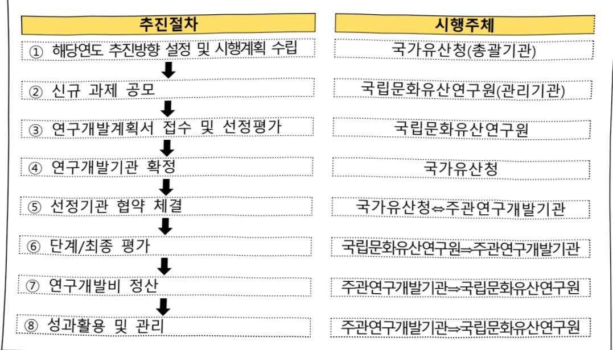

# 국가유산 지능형 첨단보존 기술개발(R&D)

**해당 페이지**: PDF 1977 ~ 1981 쪽 해당

**부처**: 국가유산청
**분야**: 문화 및 관광
**회계유형**: 일반회계
**2026 확정예산**: 4420.0 백만원
**전년대비 증감률**: None%
**AI 도메인**: 건설/스마트시티, 디지털전환(AX)

---

### 가.예산안 총괄표

(단위: 백만원, %)

<table border=1 style='margin: auto; word-wrap: break-word;'><tr><td rowspan="2">사업명</td><td rowspan="2">2024년 결산</td><td colspan="2">2025년 예산</td><td colspan="2">2026년</td><td rowspan="2">중감(B-A)</td><td rowspan="2">(B-A)/A</td></tr><tr><td style='text-align: center; word-wrap: break-word;'>본예산</td><td style='text-align: center; word-wrap: break-word;'>추경*(A)</td><td style='text-align: center; word-wrap: break-word;'>요구안</td><td style='text-align: center; word-wrap: break-word;'>본예산(B)</td></tr><tr><td style='text-align: center; word-wrap: break-word;'>국가유산 지능형 첨단보존 기술개발(R&amp;D)</td><td style='text-align: center; word-wrap: break-word;'>-</td><td style='text-align: center; word-wrap: break-word;'>-</td><td style='text-align: center; word-wrap: break-word;'>-</td><td style='text-align: center; word-wrap: break-word;'>7,396</td><td style='text-align: center; word-wrap: break-word;'>4,420</td><td style='text-align: center; word-wrap: break-word;'>4,420</td><td style='text-align: center; word-wrap: break-word;'>순증</td></tr></table>

□ 기능별(내역사업별), 목별 예산안 내역

(단위:백만원)

<table border=1 style='margin: auto; word-wrap: break-word;'><tr><td rowspan="2"></td><td colspan="5">2024</td><td colspan="5">2025</td><td rowspan="2">2026예산안</td></tr><tr><td style='text-align: center; word-wrap: break-word;'>예산액(추경)</td><td style='text-align: center; word-wrap: break-word;'>예산현액</td><td style='text-align: center; word-wrap: break-word;'>집행액</td><td style='text-align: center; word-wrap: break-word;'>이월액</td><td style='text-align: center; word-wrap: break-word;'>불용액</td><td style='text-align: center; word-wrap: break-word;'>예산액(추경)</td><td style='text-align: center; word-wrap: break-word;'>예산현액</td><td style='text-align: center; word-wrap: break-word;'>집행액</td><td style='text-align: center; word-wrap: break-word;'>이월예상액</td><td style='text-align: center; word-wrap: break-word;'>불용예상액</td></tr><tr><td style='text-align: center; word-wrap: break-word;'>○ 기능별 분류(합계)</td><td style='text-align: center; word-wrap: break-word;'></td><td style='text-align: center; word-wrap: break-word;'></td><td style='text-align: center; word-wrap: break-word;'></td><td style='text-align: center; word-wrap: break-word;'></td><td style='text-align: center; word-wrap: break-word;'></td><td style='text-align: center; word-wrap: break-word;'></td><td style='text-align: center; word-wrap: break-word;'></td><td style='text-align: center; word-wrap: break-word;'></td><td style='text-align: center; word-wrap: break-word;'></td><td style='text-align: center; word-wrap: break-word;'></td><td style='text-align: center; word-wrap: break-word;'>4,420</td></tr><tr><td style='text-align: center; word-wrap: break-word;'>· 국가유산 스마트고도화 기술개발 · 국가유산 디지털보존영역 확대 및표준화 · 연구개발 사업관리</td><td style='text-align: center; word-wrap: break-word;'></td><td style='text-align: center; word-wrap: break-word;'></td><td style='text-align: center; word-wrap: break-word;'></td><td style='text-align: center; word-wrap: break-word;'></td><td style='text-align: center; word-wrap: break-word;'></td><td style='text-align: center; word-wrap: break-word;'></td><td style='text-align: center; word-wrap: break-word;'></td><td style='text-align: center; word-wrap: break-word;'></td><td style='text-align: center; word-wrap: break-word;'></td><td style='text-align: center; word-wrap: break-word;'></td><td style='text-align: center; word-wrap: break-word;'>2,929</td></tr></table>

### 나. 사업설명자료

## 1 ) 사업목적·내용

- (국가유산 스마트 고도화 기술개발) 자동 진단·복원, 실시간 모니터링, 무인자율 탐사, 표준화를 통해 지능형 보존관리 체계를 구축하고 국가유산 보호의 디지털 전환 촉진

- (국가유산 디지털 보존영역 확대 및 표준화) AI 기반 분석·예측, 블록체인 인증, 디지털트윈 융합, 지능형 복원 우선순위 최적화로 체계적인 보존·관리 시스템 확립과 데이터 중심 지능형 관리체계 구축하여 국가유산 보호의 과학적 기반 강화

- (연구개발사업관리) 연구개발사업의 기획 관리 평가 등을 위한 사업관리

---

## 2 ) 사업개요

□ 사업근거 및 추진경위

① 법령상 근거 및 조항

문화유산의 보존 및 활용에 관한 법률 제6조(문화유산기본계획의 수립) 제6조의(문화유산의 연구개발)

문화유산의 보존·관리 및 활용 등을 위한 연구개발 추진

보존·관리 및 활용 등의 연구개발을 위한 출연금 지원

·「제2차 국가유산 보존·관리 및 활용 연구개발 기본계획」(26~30)

·「제3차 국가유산 수리 등에 관한 기본계획」(24~28),

·「국가유산 디지털 대전환 2030」(21.6.16.) 등

② 추진경위

- 「제1차 문화유산 보존·관리 및 활용 연구개발 기본계획('21~'25)」 수립

- 국가과학기술자문회의 제10회 심의회의 원안 의결('20.5.)

국가유산 스마트 보존·활용 기술 개발(R&D) 사업 추진('21~25, 15개 과제)

·「제2차 국가유산 보존·관리 및 활용 연구개발 기본계획 연구」 용역 실시('24)

·「제2차 국가유산 보존·관리 및 활용 연구개발 기본계획('26~30)」 수립('25)

·「국가유산 지능형 첨단보존 기술개발 기획 연구」용역 실시('25)

## □ 주요내용

① 사업규모

- 사업기간 : 2026 ~ 2030년

- 최근 5년 간 투입된 사업비(예산액기준, 추경편성한 연도에는 추경포함)

<table border=1 style='margin: auto; word-wrap: break-word;'><tr><td style='text-align: center; word-wrap: break-word;'>2022</td><td style='text-align: center; word-wrap: break-word;'>2023</td><td style='text-align: center; word-wrap: break-word;'>2024</td><td style='text-align: center; word-wrap: break-word;'>2025</td><td style='text-align: center; word-wrap: break-word;'>2026</td></tr><tr><td style='text-align: center; word-wrap: break-word;'>\</td><td style='text-align: center; word-wrap: break-word;'>-</td><td style='text-align: center; word-wrap: break-word;'>-</td><td style='text-align: center; word-wrap: break-word;'>-</td><td style='text-align: center; word-wrap: break-word;'>4,420</td></tr></table>

② 사업추진체계

- 사업시행방법 : 직접수행, 출연

- 사업시행주체 : 미정(산·학·연 공모 선정)

- 사업 수혜자 : 국가유산청, 지자체, 일반국민

- 보조, 융자, 출연, 출자 등의 경우 보조·융자 등 지원 비율 및 법적근거

<table border=1 style='margin: auto; word-wrap: break-word;'><tr><td style='text-align: center; word-wrap: break-word;'>내역사업명</td><td style='text-align: center; word-wrap: break-word;'>구분</td><td style='text-align: center; word-wrap: break-word;'>피보조·피출연 등 기관명</td><td style='text-align: center; word-wrap: break-word;'>지원 금액 (2026예산)</td><td style='text-align: center; word-wrap: break-word;'>지원 비율(%)</td><td style='text-align: center; word-wrap: break-word;'>보조율 법적근거 (해당 조항)</td></tr><tr><td style='text-align: center; word-wrap: break-word;'>국가유산 스마트 고도화 기술개발</td><td style='text-align: center; word-wrap: break-word;'>출연</td><td style='text-align: center; word-wrap: break-word;'>대학, 출연연, 산업체</td><td style='text-align: center; word-wrap: break-word;'>2,929</td><td style='text-align: center; word-wrap: break-word;'>100</td><td style='text-align: center; word-wrap: break-word;'>국가연구개발혁신법 제13조(연구개발비의 지급 및 사용 등)</td></tr><tr><td style='text-align: center; word-wrap: break-word;'>국가유산 다지털 보존영역 확대 및 표준화</td><td style='text-align: center; word-wrap: break-word;'>출연</td><td style='text-align: center; word-wrap: break-word;'>대학, 출연연, 산업체</td><td style='text-align: center; word-wrap: break-word;'>1,321</td><td style='text-align: center; word-wrap: break-word;'>100</td><td style='text-align: center; word-wrap: break-word;'>국가연구개발혁신법 제13조(연구개발비의 지급 및 사용 등)</td></tr></table>

---

## 3 ) 2026년도 예산안 산출 근거

<table border=1 style='margin: auto; word-wrap: break-word;'><tr><td style='text-align: center; word-wrap: break-word;'>① 국가유산 스마트 고도화 기술개발: (&#x27;25) 0 → (&#x27;26) 2,929백만원, 증2,929백만원(순증) - (산출) 781.1백만원 × 5개 과제 × 9/12개월</td></tr><tr><td style='text-align: center; word-wrap: break-word;'>② 국가유산 디지털 보존영역 확대 및 표준화: (&#x27;25) 0 → (&#x27;26) 1,321백만원, 증1,321백만원(순증) - (산출) 587.1백만원 × 3개 과제 × 9/12개월</td></tr><tr><td style='text-align: center; word-wrap: break-word;'>③ 연구개발사업관리: (&#x27;25) 0 → (&#x27;26) 170백만원, 증170백만원(순증) - (산출) 기획위원회 및 연구개발과제평가단 운영: 149백만원 관리 및 평가 관련 물품 구입, 임차 등: 21백만원</td></tr></table>

## 4 ) 사업효과

□ 사업영향, 산출물 성과지표 등

①2022~2026년도 성과계획서 상 성과지표 및 최근 5년간 성과 달성도

<table border=1 style='margin: auto; word-wrap: break-word;'><tr><td style='text-align: center; word-wrap: break-word;'>성과지표</td><td style='text-align: center; word-wrap: break-word;'>구분</td><td style='text-align: center; word-wrap: break-word;'>2022</td><td style='text-align: center; word-wrap: break-word;'>2023</td><td style='text-align: center; word-wrap: break-word;'>2024</td><td style='text-align: center; word-wrap: break-word;'>2025</td><td style='text-align: center; word-wrap: break-word;'>2026</td><td style='text-align: center; word-wrap: break-word;'>2026 목표치산출근거</td><td style='text-align: center; word-wrap: break-word;'>측정산식(또는 측정방법)</td><td style='text-align: center; word-wrap: break-word;'>자료수집방법(또는 자료출처)</td></tr><tr><td rowspan="3">국가유산보존·활용관리정책전문가평가(점)</td><td style='text-align: center; word-wrap: break-word;'>목표</td><td style='text-align: center; word-wrap: break-word;'>신규</td><td style='text-align: center; word-wrap: break-word;'>신규</td><td style='text-align: center; word-wrap: break-word;'>신규</td><td style='text-align: center; word-wrap: break-word;'>84.7</td><td style='text-align: center; word-wrap: break-word;'>84.9</td><td rowspan="3">최근 3년간 실적치+25년 목표치의 평균값 83.0보다 높고 &#x27;25년 목표치인 84.7점보다 0.2점&#x27;이 더 높은 84.9점을 목표치로 설정</td><td rowspan="3">분야별 전문가(정책국유재산, 안전관리, 세계유산, 활용, 교육, 민간관계자) 총 180명의 평가 점수 100점 만점의 평균 평점</td><td rowspan="3">전문조사기관 의뢰전문가 평가서</td></tr><tr><td style='text-align: center; word-wrap: break-word;'>실적</td><td style='text-align: center; word-wrap: break-word;'>신규</td><td style='text-align: center; word-wrap: break-word;'>신규</td><td style='text-align: center; word-wrap: break-word;'>신규</td><td style='text-align: center; word-wrap: break-word;'>-</td><td style='text-align: center; word-wrap: break-word;'></td></tr><tr><td style='text-align: center; word-wrap: break-word;'>달성도</td><td style='text-align: center; word-wrap: break-word;'></td><td style='text-align: center; word-wrap: break-word;'></td><td style='text-align: center; word-wrap: break-word;'></td><td style='text-align: center; word-wrap: break-word;'></td><td style='text-align: center; word-wrap: break-word;'></td></tr></table>

② 성과지표 이외의 연도별 사업추진 경과 및 실적 : 해당없음

③ 향후(2026년도 이후) 기대효과

- 국가유산기술 개발 및 국가유산 산업 육성의 국가 지원 체계 구축 및 활성화

- 국가유산 핵심 기술 분야 역량 확보 등 국가유산기술의 획기적 도약 기회 제공

- 국가유산 산업 생태계 기반 조성 및 응용 기술 산업화 토대 마련

5) 타당성조사 및 예비타당성조사 시행여부 및 결과 요지 : 해당없음

6) 총사업비 대상사업 여부 및 내역 : 해당없음

---

## 7 ) 사업 집행절차

8) 각종 평가 : 해당없음

다. 최근 4년간 결산내역 : '26년 신규사업으로 해당없음

---

<table border=1 style='margin: auto; word-wrap: break-word;'><tr><td style='text-align: center; word-wrap: break-word;'>사 업 명</td></tr><tr><td style='text-align: center; word-wrap: break-word;'>(6) 국민소통시스템 구축 및 운영(정보화)(1132-321)</td></tr></table>

사업 코드 정보

<table border=1 style='margin: auto; word-wrap: break-word;'><tr><td style='text-align: center; word-wrap: break-word;'>구분</td><td style='text-align: center; word-wrap: break-word;'>회계</td><td style='text-align: center; word-wrap: break-word;'>소관</td><td style='text-align: center; word-wrap: break-word;'>실국(기관)</td><td style='text-align: center; word-wrap: break-word;'>계정</td><td style='text-align: center; word-wrap: break-word;'>분야</td><td style='text-align: center; word-wrap: break-word;'>부문</td></tr><tr><td style='text-align: center; word-wrap: break-word;'>코드</td><td rowspan="2">일반회계</td><td rowspan="2">국민권의위원회</td><td rowspan="2">권익개선정책국</td><td rowspan="2"></td><td style='text-align: center; word-wrap: break-word;'>010</td><td style='text-align: center; word-wrap: break-word;'>016</td></tr><tr><td style='text-align: center; word-wrap: break-word;'>명칭</td><td style='text-align: center; word-wrap: break-word;'>일반·지방행정</td><td style='text-align: center; word-wrap: break-word;'>일반행정</td></tr></table>

<table border=1 style='margin: auto; word-wrap: break-word;'><tr><td style='text-align: center; word-wrap: break-word;'>구분</td><td style='text-align: center; word-wrap: break-word;'>프로그램</td><td style='text-align: center; word-wrap: break-word;'>단위사업</td><td style='text-align: center; word-wrap: break-word;'>세부사업</td></tr><tr><td style='text-align: center; word-wrap: break-word;'>코드</td><td style='text-align: center; word-wrap: break-word;'>1100</td><td style='text-align: center; word-wrap: break-word;'>1132</td><td style='text-align: center; word-wrap: break-word;'>321</td></tr><tr><td style='text-align: center; word-wrap: break-word;'>명칭</td><td style='text-align: center; word-wrap: break-word;'>국민권익증진</td><td style='text-align: center; word-wrap: break-word;'>청렴권익행정정보화</td><td style='text-align: center; word-wrap: break-word;'>국민소통시스템 구축 및 운영(정보화)</td></tr></table>

☐ 사업 성격

<table border=1 style='margin: auto; word-wrap: break-word;'><tr><td rowspan="2">신규</td><td rowspan="2">계속</td><td rowspan="2">완료</td><td rowspan="2">예비타당성 실시여부</td><td rowspan="2">총사업비 관리대상</td><td rowspan="2">총액계상 예산사업</td><td style='text-align: center; word-wrap: break-word;'>사업소관 변경정보</td></tr><tr><td style='text-align: center; word-wrap: break-word;'>2025예산 시 소관</td></tr><tr><td style='text-align: center; word-wrap: break-word;'></td><td style='text-align: center; word-wrap: break-word;'>○</td><td style='text-align: center; word-wrap: break-word;'></td><td style='text-align: center; word-wrap: break-word;'></td><td style='text-align: center; word-wrap: break-word;'></td><td style='text-align: center; word-wrap: break-word;'></td><td style='text-align: center; word-wrap: break-word;'></td></tr></table>

□ 사업 지원 형태 및 지원을 (최소한 한 개는 반드시 선택하시오. 해당사항에 0 표시)

<table border=1 style='margin: auto; word-wrap: break-word;'><tr><td style='text-align: center; word-wrap: break-word;'>직접</td><td style='text-align: center; word-wrap: break-word;'>출자</td><td style='text-align: center; word-wrap: break-word;'>출연</td><td style='text-align: center; word-wrap: break-word;'>보조</td><td style='text-align: center; word-wrap: break-word;'>융자</td><td style='text-align: center; word-wrap: break-word;'>국고보조율(%)</td><td style='text-align: center; word-wrap: break-word;'>융자율(%)</td></tr><tr><td style='text-align: center; word-wrap: break-word;'>○</td><td style='text-align: center; word-wrap: break-word;'></td><td style='text-align: center; word-wrap: break-word;'></td><td style='text-align: center; word-wrap: break-word;'></td><td style='text-align: center; word-wrap: break-word;'></td><td style='text-align: center; word-wrap: break-word;'></td><td style='text-align: center; word-wrap: break-word;'></td></tr></table>

## 사업 소관부처 및 시행주체

<table border=1 style='margin: auto; word-wrap: break-word;'><tr><td style='text-align: center; word-wrap: break-word;'>사업명</td><td colspan="2">구분</td></tr><tr><td rowspan="3">국민소통시스템 운영</td><td rowspan="2">소관부처</td><td style='text-align: center; word-wrap: break-word;'>권익개선정책국</td></tr><tr><td style='text-align: center; word-wrap: break-word;'>국민신문고과</td></tr><tr><td style='text-align: center; word-wrap: break-word;'>사업시행주체</td><td style='text-align: center; word-wrap: break-word;'>-</td></tr><tr><td rowspan="3">민원정보분석시스템 운영</td><td rowspan="2">소관부처</td><td style='text-align: center; word-wrap: break-word;'>권익개선정책국</td></tr><tr><td style='text-align: center; word-wrap: break-word;'>민원정보분석과</td></tr><tr><td style='text-align: center; word-wrap: break-word;'>사업시행주체</td><td style='text-align: center; word-wrap: break-word;'>-</td></tr><tr><td rowspan="3">AI기반 국민권익 플랫폼 구축</td><td rowspan="2">소관부처</td><td style='text-align: center; word-wrap: break-word;'>권익개선정책국</td></tr><tr><td style='text-align: center; word-wrap: break-word;'>국민신문고과, 민원정보분석과</td></tr><tr><td style='text-align: center; word-wrap: break-word;'>사업시행주체</td><td style='text-align: center; word-wrap: break-word;'>-</td></tr></table>

---

### 원본 PDF 크롭 이미지

