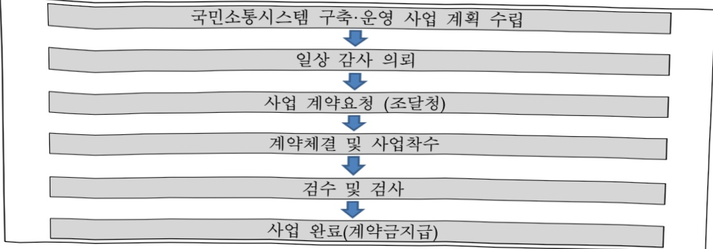

# 국민소통시스템 구축 및 운영(정보화)

**해당 페이지**: PDF 1982 ~ 1989 쪽 해당

**부처**: 국민권익위원회
**분야**: 일반·지방행정
**회계유형**: 일반회계
**2026 확정예산**: 3895.0 백만원
**전년대비 증감률**: 16.4%
**AI 도메인**: 행정/전자정부

---

<table border=1 style='margin: auto; word-wrap: break-word;'><tr><td style='text-align: center; word-wrap: break-word;'>사 업 명</td></tr><tr><td style='text-align: center; word-wrap: break-word;'>(6) 국민소통시스템 구축 및 운영(정보화)(1132-321)</td></tr></table>

사업 코드 정보

<table border=1 style='margin: auto; word-wrap: break-word;'><tr><td style='text-align: center; word-wrap: break-word;'>구분</td><td style='text-align: center; word-wrap: break-word;'>회계</td><td style='text-align: center; word-wrap: break-word;'>소관</td><td style='text-align: center; word-wrap: break-word;'>실국(기관)</td><td style='text-align: center; word-wrap: break-word;'>계정</td><td style='text-align: center; word-wrap: break-word;'>분야</td><td style='text-align: center; word-wrap: break-word;'>부문</td></tr><tr><td style='text-align: center; word-wrap: break-word;'>코드</td><td rowspan="2">일반회계</td><td rowspan="2">국민권의위원회</td><td rowspan="2">권익개선정책국</td><td rowspan="2"></td><td style='text-align: center; word-wrap: break-word;'>010</td><td style='text-align: center; word-wrap: break-word;'>016</td></tr><tr><td style='text-align: center; word-wrap: break-word;'>명칭</td><td style='text-align: center; word-wrap: break-word;'>일반·지방행정</td><td style='text-align: center; word-wrap: break-word;'>일반행정</td></tr></table>

<table border=1 style='margin: auto; word-wrap: break-word;'><tr><td style='text-align: center; word-wrap: break-word;'>구분</td><td style='text-align: center; word-wrap: break-word;'>프로그램</td><td style='text-align: center; word-wrap: break-word;'>단위사업</td><td style='text-align: center; word-wrap: break-word;'>세부사업</td></tr><tr><td style='text-align: center; word-wrap: break-word;'>코드</td><td style='text-align: center; word-wrap: break-word;'>1100</td><td style='text-align: center; word-wrap: break-word;'>1132</td><td style='text-align: center; word-wrap: break-word;'>321</td></tr><tr><td style='text-align: center; word-wrap: break-word;'>명칭</td><td style='text-align: center; word-wrap: break-word;'>국민권익증진</td><td style='text-align: center; word-wrap: break-word;'>청렴권익행정정보화</td><td style='text-align: center; word-wrap: break-word;'>국민소통시스템 구축 및 운영(정보화)</td></tr></table>

☐ 사업 성격

<table border=1 style='margin: auto; word-wrap: break-word;'><tr><td rowspan="2">신규</td><td rowspan="2">계속</td><td rowspan="2">완료</td><td rowspan="2">예비타당성 실시여부</td><td rowspan="2">총사업비 관리대상</td><td rowspan="2">총액계상 예산사업</td><td style='text-align: center; word-wrap: break-word;'>사업소관 변경정보</td></tr><tr><td style='text-align: center; word-wrap: break-word;'>2025예산 시 소관</td></tr><tr><td style='text-align: center; word-wrap: break-word;'></td><td style='text-align: center; word-wrap: break-word;'>○</td><td style='text-align: center; word-wrap: break-word;'></td><td style='text-align: center; word-wrap: break-word;'></td><td style='text-align: center; word-wrap: break-word;'></td><td style='text-align: center; word-wrap: break-word;'></td><td style='text-align: center; word-wrap: break-word;'></td></tr></table>

□ 사업 지원 형태 및 지원을 (최소한 한 개는 반드시 선택하시오. 해당사항에 0 표시)

<table border=1 style='margin: auto; word-wrap: break-word;'><tr><td style='text-align: center; word-wrap: break-word;'>직접</td><td style='text-align: center; word-wrap: break-word;'>출자</td><td style='text-align: center; word-wrap: break-word;'>출연</td><td style='text-align: center; word-wrap: break-word;'>보조</td><td style='text-align: center; word-wrap: break-word;'>융자</td><td style='text-align: center; word-wrap: break-word;'>국고보조율(%)</td><td style='text-align: center; word-wrap: break-word;'>융자율(%)</td></tr><tr><td style='text-align: center; word-wrap: break-word;'>○</td><td style='text-align: center; word-wrap: break-word;'></td><td style='text-align: center; word-wrap: break-word;'></td><td style='text-align: center; word-wrap: break-word;'></td><td style='text-align: center; word-wrap: break-word;'></td><td style='text-align: center; word-wrap: break-word;'></td><td style='text-align: center; word-wrap: break-word;'></td></tr></table>

## 사업 소관부처 및 시행주체

<table border=1 style='margin: auto; word-wrap: break-word;'><tr><td style='text-align: center; word-wrap: break-word;'>사업명</td><td colspan="2">구분</td></tr><tr><td rowspan="3">국민소통시스템 운영</td><td rowspan="2">소관부처</td><td style='text-align: center; word-wrap: break-word;'>권익개선정책국</td></tr><tr><td style='text-align: center; word-wrap: break-word;'>국민신문고과</td></tr><tr><td style='text-align: center; word-wrap: break-word;'>사업시행주체</td><td style='text-align: center; word-wrap: break-word;'>-</td></tr><tr><td rowspan="3">민원정보분석시스템 운영</td><td rowspan="2">소관부처</td><td style='text-align: center; word-wrap: break-word;'>권익개선정책국</td></tr><tr><td style='text-align: center; word-wrap: break-word;'>민원정보분석과</td></tr><tr><td style='text-align: center; word-wrap: break-word;'>사업시행주체</td><td style='text-align: center; word-wrap: break-word;'>-</td></tr><tr><td rowspan="3">AI기반 국민권익 플랫폼 구축</td><td rowspan="2">소관부처</td><td style='text-align: center; word-wrap: break-word;'>권익개선정책국</td></tr><tr><td style='text-align: center; word-wrap: break-word;'>국민신문고과, 민원정보분석과</td></tr><tr><td style='text-align: center; word-wrap: break-word;'>사업시행주체</td><td style='text-align: center; word-wrap: break-word;'>-</td></tr></table>

---

### 가. 예산 총괄표

(단위: 백만원, %)

<table border=1 style='margin: auto; word-wrap: break-word;'><tr><td rowspan="2">사업명</td><td rowspan="2">2024년 결산</td><td colspan="2">2025년 예산</td><td colspan="2">2026년 예산</td><td rowspan="2">증감(B-A)</td><td rowspan="2">(B-A)/A</td></tr><tr><td style='text-align: center; word-wrap: break-word;'>본예산</td><td style='text-align: center; word-wrap: break-word;'>추경*(A)</td><td style='text-align: center; word-wrap: break-word;'>요구안</td><td style='text-align: center; word-wrap: break-word;'>본예산(B)</td></tr><tr><td style='text-align: center; word-wrap: break-word;'>국민소통시스템 구축 및 운영(정보화)</td><td style='text-align: center; word-wrap: break-word;'>4,653</td><td style='text-align: center; word-wrap: break-word;'>3,346</td><td style='text-align: center; word-wrap: break-word;'>3,346</td><td style='text-align: center; word-wrap: break-word;'>3,895</td><td style='text-align: center; word-wrap: break-word;'>3,895</td><td style='text-align: center; word-wrap: break-word;'>549</td><td style='text-align: center; word-wrap: break-word;'>16.4</td></tr></table>

□ 기능별(내역사업별) 예산 내역

(단위:백만원)

<table border=1 style='margin: auto; word-wrap: break-word;'><tr><td rowspan="2"></td><td colspan="5">2024</td><td colspan="5">2025</td><td rowspan="2">2026예산</td></tr><tr><td style='text-align: center; word-wrap: break-word;'>예산액(추경)</td><td style='text-align: center; word-wrap: break-word;'>예산현액</td><td style='text-align: center; word-wrap: break-word;'>집행액</td><td style='text-align: center; word-wrap: break-word;'>이월액</td><td style='text-align: center; word-wrap: break-word;'>불용액</td><td style='text-align: center; word-wrap: break-word;'>예산액(추경)</td><td style='text-align: center; word-wrap: break-word;'>예산현액</td><td style='text-align: center; word-wrap: break-word;'>집행액</td><td style='text-align: center; word-wrap: break-word;'>이월액</td><td style='text-align: center; word-wrap: break-word;'>불용액</td></tr><tr><td style='text-align: center; word-wrap: break-word;'>○ 기능별 분류(합계)</td><td style='text-align: center; word-wrap: break-word;'>3,419</td><td style='text-align: center; word-wrap: break-word;'>4,656</td><td style='text-align: center; word-wrap: break-word;'>4,653</td><td style='text-align: center; word-wrap: break-word;'>-</td><td style='text-align: center; word-wrap: break-word;'>3</td><td style='text-align: center; word-wrap: break-word;'>3,346</td><td style='text-align: center; word-wrap: break-word;'>3,467</td><td style='text-align: center; word-wrap: break-word;'>3,466</td><td style='text-align: center; word-wrap: break-word;'>-</td><td style='text-align: center; word-wrap: break-word;'>1</td><td style='text-align: center; word-wrap: break-word;'>3,895</td></tr><tr><td style='text-align: center; word-wrap: break-word;'>• 국민소통시스템 운영</td><td style='text-align: center; word-wrap: break-word;'>2,883</td><td style='text-align: center; word-wrap: break-word;'>4,120</td><td style='text-align: center; word-wrap: break-word;'>4,117</td><td style='text-align: center; word-wrap: break-word;'>-</td><td style='text-align: center; word-wrap: break-word;'>3</td><td style='text-align: center; word-wrap: break-word;'>2,857</td><td style='text-align: center; word-wrap: break-word;'>2,961</td><td style='text-align: center; word-wrap: break-word;'>2,960</td><td style='text-align: center; word-wrap: break-word;'>-</td><td style='text-align: center; word-wrap: break-word;'>1</td><td style='text-align: center; word-wrap: break-word;'>2,957</td></tr><tr><td style='text-align: center; word-wrap: break-word;'>• 민원정보분석 시스템 운영</td><td style='text-align: center; word-wrap: break-word;'>536</td><td style='text-align: center; word-wrap: break-word;'>536</td><td style='text-align: center; word-wrap: break-word;'>536</td><td style='text-align: center; word-wrap: break-word;'>-</td><td style='text-align: center; word-wrap: break-word;'>-</td><td style='text-align: center; word-wrap: break-word;'>489</td><td style='text-align: center; word-wrap: break-word;'>506</td><td style='text-align: center; word-wrap: break-word;'>506</td><td style='text-align: center; word-wrap: break-word;'>-</td><td style='text-align: center; word-wrap: break-word;'>-</td><td style='text-align: center; word-wrap: break-word;'>489</td></tr><tr><td style='text-align: center; word-wrap: break-word;'>• AI기반 국민권의 플랫폼 구축</td><td style='text-align: center; word-wrap: break-word;'>-</td><td style='text-align: center; word-wrap: break-word;'>-</td><td style='text-align: center; word-wrap: break-word;'>-</td><td style='text-align: center; word-wrap: break-word;'>-</td><td style='text-align: center; word-wrap: break-word;'>-</td><td style='text-align: center; word-wrap: break-word;'>-</td><td style='text-align: center; word-wrap: break-word;'>-</td><td style='text-align: center; word-wrap: break-word;'>-</td><td style='text-align: center; word-wrap: break-word;'>-</td><td style='text-align: center; word-wrap: break-word;'>-</td><td style='text-align: center; word-wrap: break-word;'>449</td></tr></table>

### 나. 사업설명자료

## 1 ) 사업목적·내용

- 1,312개 기관이 공동 활용하는 국민신문고 등 범정부 국민권익 플랫폼 관련 서비스 개선 및 안정적 운영 지원

- (국민소통시스템 운영) 모든 행정기관(중앙·지방정부·교육청)과 주요 공공기관의 민원, 제안, 토론 및 각종 신고 등 소통창구를 통합·연계한 범정부 온라인 국민참여 포털 ‘국민신문고’, ‘국민생각함’ 운영 및 기능개선

- (민원정보분석시스템 운영) 수집된 민원정보 등 국민의 소리를 종합적으로 분석하여 민원 발생에 선제적으로 대응하고 정책 수립 등에 활용하도록 하는 ‘민원정보분석 시스템’ 운영 및 데이터 이용가치 제고를 위한 데이터 개방·직접분석 활용체계 확대

---

## 2 ) 사업개요

## ☐ 사업근거 및 추진경위

① 법령상 근거 및 조항 적시

- 「부패방지 및 국민권익위원회 설치와 운영에 관한 법률」 제12조(기능) 및 동법 시행령 제12조(온라인 국민참여포털의 통합 운영 등)

시행령 제12조(온라인 국민참여포털의 통합 운영 등) ① 위원회는 법 제12조제16호에 따른 온라인 국민참여포털(이하 “참여포털”이라 한다)의 운영을 총괄한다.

② 위원회는 참여포털의 통합 운영을 위하여 다음 각 호의 업무를 수행한다.

1. 참여포털 홈페이지 및 시스템의 운영·관리

2. 참여포털에 접수된 민원, 국민제안 및 정책참여 등의 분류 및 재분류

3. 참여포털에 접수된 민원, 국민제안 및 정책참여 등의 분석 · 평가 및 처리결과의 사후관리

4. 참여포털의 운영과 관련한 교육·홍보

5. 참여포털의 통합 운영을 위한 기준 마련

6. 그 밖에 참여포털의 통합 운영에 필요한 사항

-「온라인 국민참여포털의 운영에 관한 규정」

-「국민 제안 규정」 및 「행정절차법」 제22조(의견청취)

- 국정과제 국민이 하나되는 정치 - 16. 국민권익을 실현하는 반부패 개혁

## ② 추진경위

## [국민소통시스템 운영]

- '온라인 국민참여 확대'를 '전자정부 로드맵 과제'로 선정('03.8.)

- 온라인 국민참여 포털 시범시스템 구축사업('05.7.)

- 온라인 국민참여 포털시스템 확대 1, 2, 3단계 구축사업('06.6.~'08.2.)

- 온라인 국민참여 포털시스템 「국민신문고」 기능개선 및 통합 확대('08.6.~)

- 국민참여 플랫폼 「국민생각함」 개통('16.3.)

- 국민신문고 시스템 전면 개편('18.7.~'19.12.)

- 민원정책알림 서비스 구축('21.7.~12.)

- 국정과제 국민이 하나되는 정치 - 16. 국민권익을 실현하는 반부패 개혁

## [민원정보분석시스템 운영]

- 민원정보분석시스템 구축('10.~'12.11.) 및 이용기관 확대('13.1.~)

- 민원빅데이터 현황판 구축('18.7.~12.), '한눈에 보는 민원 빅데이터' 대국민서비스 개시('19.1.)

bigdata.epeople.go.kr, 각급 기관은 내부망에서 민원종합현황판 서비스 제공

---

- 민원정보분석 시스템 전면 개편('18.8.~'19.12.)

- “민원빅데이터 원격분석플랫폼 구축” 디지털 정부혁신 추진과제('19.10.) 및 한국

- 뉴딜 종합계획 디지털 뉴딜 과제 선정('20.7.)

- 민원빅데이터 원격분석플랫폼 구축 BPR/ISP 추진('21.2.~6.)

- 민원빅데이터 분석을 통한 지능형 재난안전 모니터링 서비스 구축('22.6.~12.)

- 국정과제 국민이 하나되는 정치 - 16. 국민권익을 실현하는 반부패 개혁

주요내용

① 사업규모

- 총사업비 : 해당없음

- 사업기간 : 단년도 계속

- 최근 5년간 투입된 사업비(예산액기준, 추경편성한 연도에는 추경포함)

<table border=1 style='margin: auto; word-wrap: break-word;'><tr><td style='text-align: center; word-wrap: break-word;'>$ H_{2}O $</td><td style='text-align: center; word-wrap: break-word;'>2022</td><td style='text-align: center; word-wrap: break-word;'>2023</td><td style='text-align: center; word-wrap: break-word;'>2024</td><td style='text-align: center; word-wrap: break-word;'>2025</td><td style='text-align: center; word-wrap: break-word;'>2026</td></tr><tr><td style='text-align: center; word-wrap: break-word;'>$ H_{2}O $</td><td style='text-align: center; word-wrap: break-word;'>3,112</td><td style='text-align: center; word-wrap: break-word;'>5,780</td><td style='text-align: center; word-wrap: break-word;'>3,419</td><td style='text-align: center; word-wrap: break-word;'>3,346</td><td style='text-align: center; word-wrap: break-word;'>3,895</td></tr></table>

- 기타: 해당없음

② 사업추진체계

- 사업시행방법 : 직접수행

- 사업시행주체 : 국민권익위원회

- 사업 수혜자 : 일반국민, 공무원 등

- 보조, 융자, 출연, 출자 등의 경우 보조·융자 등 지원 비율 및 법적근거 : 해당없음

3) 2026년도 예산 산출 근거

(1) 국민소통시스템 운영 : (2025) 2,857 → (2026) 2,957 백만원

- (편성) 국민신문고 유지관리 및 안정적 운영을 위한 필수 사업비

- (산출) 2,857백만원

• 국민신문고시스템 유지관리 : 2,583백만원(전년 동)

- (변동요인) 국민신문고 민원, 제안 등 시스템 유지관리 필수비용으로, 전년 동

• 국민소통시스템 기타운영 : 374백만원(+100백만원)

- (변동요인) 국민신문고 민원, 제안 등 업무 추진을 위한 필수비용으로 민원접수 및 본인확인용 공공요금 추가(+100)

(2) 민원정보분석시스템 운영 : ('25) 489 → ('26) 489백만원

---

<table border=1 style='margin: auto; word-wrap: break-word;'><tr><td style='text-align: center; word-wrap: break-word;'>• 민원정보분석시스템 운영 : 489백만원(전년 동)</td></tr><tr><td style='text-align: center; word-wrap: break-word;'>- (편성) 시스템 유지관리 및 안정적 운영을 위한 사업비로, 전년 동</td></tr><tr><td style='text-align: center; word-wrap: break-word;'>- (산출) 489백만원</td></tr><tr><td style='text-align: center; word-wrap: break-word;'>(3) AI기반 국민권익 플랫폼 구축 : (&#x27;25) 0 → (&#x27;26) 449백만원</td></tr><tr><td style='text-align: center; word-wrap: break-word;'>• AI기반 국민권익 플랫폼 구축 : 449백만원(순증)</td></tr><tr><td style='text-align: center; word-wrap: break-word;'>- (편성) AI기반 국민권익 플랫폼 구축 및 서비스 확산을 위한 BPR/ISP 추진 사업비</td></tr><tr><td style='text-align: center; word-wrap: break-word;'>- (산출) 449백만원(증액)</td></tr></table>

## 4 ) 사업효과

☐ 사업영향, 산출물 성과지표 등

① 2022~2026년도 성과계획서상 성과지표 및 최근 5년간 성과 달성도 : 해당없음

② 성과지표 이외의 연도별 사업추진 경과 및 실적

<table border=1 style='margin: auto; word-wrap: break-word;'><tr><td style='text-align: center; word-wrap: break-word;'>2022</td><td style='text-align: center; word-wrap: break-word;'>· 국민신문고 이용기관 확대(1,074개 → 1,116개) · 국민신문고 간편인증서비스 모바일까지 확대(&#x27;22.2.) · 지자체 시민고충처리시스템 구축 BPR/ISP(&#x27;22.4.~&#x27;22.9.) · 수집된 민원정보에 대한 통계·분석정보 개방 확대(13종→16종) · 민원처리 진행상황알림 앱기반 메시지서비스 제공(&#x27;22.9.) · 민원빅데이터 분석을 통한 지능형 재난 안전 모니터링 서비스 구축(&#x27;22.6.~12.)</td></tr><tr><td style='text-align: center; word-wrap: break-word;'>2023</td><td style='text-align: center; word-wrap: break-word;'>· 국민신문고 이용기관 확대(1,116개 → 1,157개) · 적극행정 서비스 고도화(&#x27;23.6.~12.) · 민원답변서 전자고지 서비스 제공(&#x27;23.8.) · 국민생각함 국민패널 확대(2만명)</td></tr><tr><td style='text-align: center; word-wrap: break-word;'>2024</td><td style='text-align: center; word-wrap: break-word;'>· 국민제안 시스템 개통(&#x27;24.3.) · 국민신문고 이용기관 확대(1,157개 → 1,212개)</td></tr><tr><td style='text-align: center; word-wrap: break-word;'>2025</td><td style='text-align: center; word-wrap: break-word;'>· 민생회복 소비쿠폰 이의신청 서비스 개통(&#x27;25.7.) · 국민신문고 이용기관 확대(1,212개 → 1,312개)</td></tr></table>

③향후(2026년도 이후)기대효과

- 행정·공공기관이 공동 활용하는 국민신문고·국민생각함 및 민원정보분석시스템의 안정적 운영 및 개선

- 국민신문고 이용기관을 지속적으로 확대하여 민원서비스 만족도 제고

## 5 ) 타당성조사 및 예비타당성조사 시행여부 및 결과 요지 : 해당없음

---

6) 총사업비 대상사업 정보 : 해당없음

7) 사업 집행절차

## 8 ) 각종 평가

1) 국회(예결위, 상임위, 예정처, 국정감사 포함) 지적

- 자체 전용이 원칙적으로 불가능한 정보화 예산을 정보화 이외의 사업으로 전용하는 등 집행지침에 반하여 자체 전용하는 사례가 재발하지 않도록 주의 (‘23년 결산 상임위 예비심사’)

2) 대외공개 평가 : 해당없음

3) 자체평가

- '23년 재정사업 자율평가 : 보통

- '24년 재정사업 자율평가 : 미흡

- '25년 재정사업 자율평가 : 우수

### 다. 최근 4년간 결산내역

## 1 ) 결산표

☐ 부처 결산내역

(단위: 백만원, %)

<table border=1 style='margin: auto; word-wrap: break-word;'><tr><td rowspan="2">연도</td><td colspan="3">예산액</td><td rowspan="2">예산현액(A)</td><td rowspan="2">집행액(B)</td><td rowspan="2">집행률(B/A)</td><td rowspan="2">다음연도이월액</td><td rowspan="2">불용액</td></tr><tr><td style='text-align: center; word-wrap: break-word;'>본예산</td><td style='text-align: center; word-wrap: break-word;'>추경증감액</td><td style='text-align: center; word-wrap: break-word;'>추경</td></tr><tr><td style='text-align: center; word-wrap: break-word;'>2022</td><td style='text-align: center; word-wrap: break-word;'>3,112</td><td style='text-align: center; word-wrap: break-word;'>-</td><td style='text-align: center; word-wrap: break-word;'>3,112</td><td style='text-align: center; word-wrap: break-word;'>3,112</td><td style='text-align: center; word-wrap: break-word;'>3,026</td><td style='text-align: center; word-wrap: break-word;'>97.2</td><td style='text-align: center; word-wrap: break-word;'>-</td><td style='text-align: center; word-wrap: break-word;'>86</td></tr><tr><td style='text-align: center; word-wrap: break-word;'>2023</td><td style='text-align: center; word-wrap: break-word;'>5,780</td><td style='text-align: center; word-wrap: break-word;'>-</td><td style='text-align: center; word-wrap: break-word;'>5,780</td><td style='text-align: center; word-wrap: break-word;'>5,777</td><td style='text-align: center; word-wrap: break-word;'>4,429</td><td style='text-align: center; word-wrap: break-word;'>76.7</td><td style='text-align: center; word-wrap: break-word;'>1,196</td><td style='text-align: center; word-wrap: break-word;'>152</td></tr><tr><td style='text-align: center; word-wrap: break-word;'>2024</td><td style='text-align: center; word-wrap: break-word;'>3,419</td><td style='text-align: center; word-wrap: break-word;'>-</td><td style='text-align: center; word-wrap: break-word;'>3,419</td><td style='text-align: center; word-wrap: break-word;'>4,656</td><td style='text-align: center; word-wrap: break-word;'>4,653</td><td style='text-align: center; word-wrap: break-word;'>136.1</td><td style='text-align: center; word-wrap: break-word;'>-</td><td style='text-align: center; word-wrap: break-word;'>3</td></tr><tr><td style='text-align: center; word-wrap: break-word;'>2025</td><td style='text-align: center; word-wrap: break-word;'>3,346</td><td style='text-align: center; word-wrap: break-word;'>-</td><td style='text-align: center; word-wrap: break-word;'>3,346</td><td style='text-align: center; word-wrap: break-word;'>3,467</td><td style='text-align: center; word-wrap: break-word;'>3,466</td><td style='text-align: center; word-wrap: break-word;'>103.6</td><td style='text-align: center; word-wrap: break-word;'>-</td><td style='text-align: center; word-wrap: break-word;'>1</td></tr></table>

---

## 2 ) 주요 결산사항

□ 2022~2025년 결산 주요사항

<table border=1 style='margin: auto; word-wrap: break-word;'><tr><td style='text-align: center; word-wrap: break-word;'>2022</td><td style='text-align: center; word-wrap: break-word;'>- (불용 사유) 민원감소 및 민원처리 안내 SMS를 앱메시지로 전환하여 공공요금 감소(72백만원), 정보화사업 낙찰차액 및 집행잔액(14백만원)</td></tr><tr><td style='text-align: center; word-wrap: break-word;'>2023</td><td style='text-align: center; word-wrap: break-word;'>- (조정 사유) 국민생각함 패널 간담회 및 국민신문고 신규 이용기관 교육장 임차료 부족으로 세목 조정(1백만원), 국민생각함 활용자 우수자 시상식 부상품 구매 (7백만원) 세목 조정, 정부 박람회 전시관 운영 및 민원데이터 분석 경진대회 개최 (47백만원) 세목 조정 - (전용 사유) 공공재정환수제도운영 국내여비 부족분 자체전용(△3백만원) - (불용 사유) 정보화사업 낙찰차액 및 집행잔액(152백만원) - (이월 사유) 정보화사업 계약기간(&#x27;23.8.～&#x27;24.3.)으로 집행 이월(1,196백만원)</td></tr><tr><td style='text-align: center; word-wrap: break-word;'>2024</td><td style='text-align: center; word-wrap: break-word;'>- (조정 사유) 국민소통시스템 운영 및 HelpDesk 위탁운영 조달수수료 부족(8.3백만원), 국민 제안 통합플랫폼 고도화 시스템 개발 조달수수료 부족(7.6백만원)으로 세목 조정 - (전용 사유) 민원처리 안내문자 발송 등 공공요금 부족으로 자체전용(41.4백만원) - (불용 사유) 집행잔액(3백만원)</td></tr><tr><td style='text-align: center; word-wrap: break-word;'>2025</td><td style='text-align: center; word-wrap: break-word;'>- (조정 사유) 국민소통시스템 운영 및 HelpDesk 위탁운영 조달수수료 부족(9.3백만원), 민원 정보분석시스템 위탁운영 조달수수료 부족(4.3백만원) 및 민원처리 안내문자 발송 등 공공 요금 부족(4백만원) 세목 조정 - (협의전용 사유) 국가정보자원관리원 화재(&#x27;25.9.26.)로 인한 국민신문고 이용 문의 대응을 위한 헬프데스크 상담인력 2명 추가(57백만원), 민원정보분석시스템 상용 소프트웨어 기술 지원 및 재설치 인건비(17백만원) - (자체전용 사유) 민원처리 안내문자 발송 등 공공요금 부족으로 자체전용(47백만원) - (불용 사유) 집행잔액(1백만원)</td></tr></table>

---

□ 2025년 이·전용 등 세부내역

(단위: 백만원)

<table border=1 style='margin: auto; word-wrap: break-word;'><tr><td rowspan="2">구분(날짜)</td><td colspan="2">~에서</td><td rowspan="2">금액</td><td colspan="2">~으로</td><td rowspan="2">이·전용 등 사유</td></tr><tr><td style='text-align: center; word-wrap: break-word;'>세부사업 명(사업코드)</td><td style='text-align: center; word-wrap: break-word;'>목-세목 코드</td><td style='text-align: center; word-wrap: break-word;'>세부사업 명(사업코드)</td><td style='text-align: center; word-wrap: break-word;'>목-세목 코드</td></tr><tr><td style='text-align: center; word-wrap: break-word;'>세목조정(2025.2.13)</td><td style='text-align: center; word-wrap: break-word;'>국민소통시스템 구축 및 운영(정보화)(1132-321)</td><td style='text-align: center; word-wrap: break-word;'>210-02</td><td style='text-align: center; word-wrap: break-word;'>13.6</td><td style='text-align: center; word-wrap: break-word;'>국민소통시스템 구축 및 운영(정보화)(1132-321)</td><td style='text-align: center; word-wrap: break-word;'>210-15</td><td style='text-align: center; word-wrap: break-word;'>‘국민소통시스템 운영 및 helpdesk 위탁운영’ 및 ‘민원정보분석시스템 운영’ 조달수수료 부족분</td></tr><tr><td style='text-align: center; word-wrap: break-word;'>세목조정(2025.12.16)</td><td style='text-align: center; word-wrap: break-word;'>국민소통시스템 구축 및 운영(정보화)(1132-321)</td><td style='text-align: center; word-wrap: break-word;'>210-01</td><td style='text-align: center; word-wrap: break-word;'>4</td><td style='text-align: center; word-wrap: break-word;'>국민소통시스템 구축 및 운영(정보화)(1132-321)</td><td style='text-align: center; word-wrap: break-word;'>210-02</td><td style='text-align: center; word-wrap: break-word;'>민원처리 안내문자 발송 등 공공요금 부족분</td></tr><tr><td style='text-align: center; word-wrap: break-word;'>협의전용(2025.10.10)</td><td style='text-align: center; word-wrap: break-word;'>신고자보호보상및공익신고 제도운영(1136-364)</td><td style='text-align: center; word-wrap: break-word;'>310-03</td><td style='text-align: center; word-wrap: break-word;'>57</td><td style='text-align: center; word-wrap: break-word;'>국민소통시스템 구축 및 운영(정보화)(1132-321)</td><td style='text-align: center; word-wrap: break-word;'>210-15</td><td style='text-align: center; word-wrap: break-word;'>국가정보자원관리원 화재로 국민신문고 시스템 서비스 중단 등에 따른 상담인력 충원 비용</td></tr><tr><td style='text-align: center; word-wrap: break-word;'>협의전용(2025.10.29)</td><td style='text-align: center; word-wrap: break-word;'>신고자보호보상및공익신고 제도운영(1136-364)</td><td style='text-align: center; word-wrap: break-word;'>310-03</td><td style='text-align: center; word-wrap: break-word;'>17</td><td style='text-align: center; word-wrap: break-word;'>국민소통시스템 구축 및 운영(정보화)(1132-321)</td><td style='text-align: center; word-wrap: break-word;'>210-15</td><td style='text-align: center; word-wrap: break-word;'>국가정보자원관리원 화재로 민원정보분석시스템 상용소프트웨어(DB동기화 소프트웨어(OGG)) 기술지원 및 재설치 비용</td></tr><tr><td style='text-align: center; word-wrap: break-word;'>자체전용(2025.12.11)</td><td style='text-align: center; word-wrap: break-word;'>통합콜센터시스템운영(정보화)(1132-322)</td><td style='text-align: center; word-wrap: break-word;'>210-02</td><td style='text-align: center; word-wrap: break-word;'>47</td><td style='text-align: center; word-wrap: break-word;'>국민소통시스템 구축 및 운영(정보화)(1132-321)</td><td style='text-align: center; word-wrap: break-word;'>210-02</td><td style='text-align: center; word-wrap: break-word;'>민원처리 안내문자 발송 등 공공요금 부족분</td></tr></table>

---

### 원본 PDF 크롭 이미지

