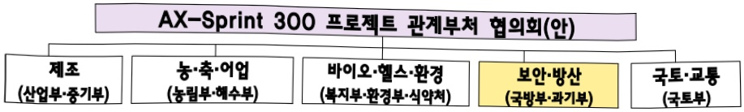
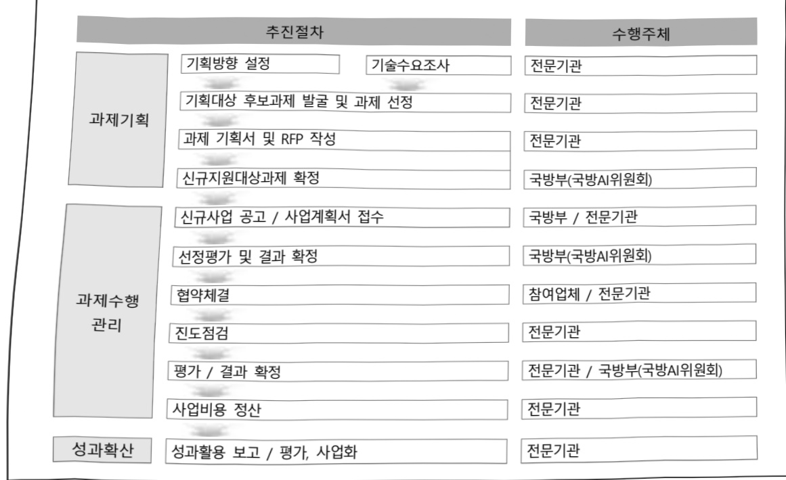

# AI응용제품 신속 상용화 지원사업(국방)

**해당 페이지**: PDF 1990 ~ 1995 쪽 해당

**부처**: 국방부
**분야**: 국방
**회계유형**: 일반
**2026 확정예산**: 35000.0 백만원
**전년대비 증감률**: None%
**AI 도메인**: LLM/언어모델, 국방/안보, 농업/식품, 디지털전환(AX)

---

<table border=1 style='margin: auto; word-wrap: break-word;'><tr><td style='text-align: center; word-wrap: break-word;'>사 업 명</td></tr><tr><td style='text-align: center; word-wrap: break-word;'>(74) AI응용제품 신속 상용화 지원사업 (국방) (2341-500)</td></tr></table>

□ 사업 코드 정보

<table border=1 style='margin: auto; word-wrap: break-word;'><tr><td style='text-align: center; word-wrap: break-word;'>구분</td><td style='text-align: center; word-wrap: break-word;'>회계</td><td style='text-align: center; word-wrap: break-word;'>소관</td><td style='text-align: center; word-wrap: break-word;'>실국(기관)</td><td style='text-align: center; word-wrap: break-word;'>계정</td><td style='text-align: center; word-wrap: break-word;'>분야</td><td style='text-align: center; word-wrap: break-word;'>부문</td></tr><tr><td style='text-align: center; word-wrap: break-word;'>코드</td><td rowspan="2">일반</td><td rowspan="2">국방부</td><td rowspan="2">첨단전력기획관</td><td rowspan="2">-</td><td style='text-align: center; word-wrap: break-word;'>040</td><td style='text-align: center; word-wrap: break-word;'>042</td></tr><tr><td style='text-align: center; word-wrap: break-word;'>명칭</td><td style='text-align: center; word-wrap: break-word;'>국방</td><td style='text-align: center; word-wrap: break-word;'>전력유지</td></tr></table>

<table border=1 style='margin: auto; word-wrap: break-word;'><tr><td style='text-align: center; word-wrap: break-word;'>구분</td><td style='text-align: center; word-wrap: break-word;'>프로그램</td><td style='text-align: center; word-wrap: break-word;'>단위사업</td><td style='text-align: center; word-wrap: break-word;'>세부사업</td></tr><tr><td style='text-align: center; word-wrap: break-word;'>코드</td><td style='text-align: center; word-wrap: break-word;'>2300</td><td style='text-align: center; word-wrap: break-word;'>2341</td><td style='text-align: center; word-wrap: break-word;'>500</td></tr><tr><td style='text-align: center; word-wrap: break-word;'>명칭</td><td style='text-align: center; word-wrap: break-word;'>군수지원 및 협력</td><td style='text-align: center; word-wrap: break-word;'>군수정책지원</td><td style='text-align: center; word-wrap: break-word;'>AI응용제품 신속 상용화 지원사업(국방)</td></tr></table>

□ 사업 성격 (공통요구자료 Ⅱ-1 작성유의사항 4. 참조, 해당하는 사항에 “○” 표시)

<table border=1 style='margin: auto; word-wrap: break-word;'><tr><td rowspan="2">신규</td><td rowspan="2">계속</td><td rowspan="2">완료</td><td rowspan="2">예비타당성 실시여부</td><td rowspan="2">총사업비 관리대상</td><td rowspan="2">총액계상 예산사업</td><td style='text-align: center; word-wrap: break-word;'>사업소관 변경정보</td></tr><tr><td style='text-align: center; word-wrap: break-word;'>2025예산 시 소관</td></tr><tr><td style='text-align: center; word-wrap: break-word;'>○</td><td style='text-align: center; word-wrap: break-word;'></td><td style='text-align: center; word-wrap: break-word;'></td><td style='text-align: center; word-wrap: break-word;'></td><td style='text-align: center; word-wrap: break-word;'></td><td style='text-align: center; word-wrap: break-word;'></td><td style='text-align: center; word-wrap: break-word;'></td></tr></table>

□ 사업 지원 형태 및 지원을 (최소한 한 개는 반드시 선택하시오. 해당사항에 O 표시)

<table border=1 style='margin: auto; word-wrap: break-word;'><tr><td style='text-align: center; word-wrap: break-word;'>직접</td><td style='text-align: center; word-wrap: break-word;'>출자</td><td style='text-align: center; word-wrap: break-word;'>출연</td><td style='text-align: center; word-wrap: break-word;'>보조</td><td style='text-align: center; word-wrap: break-word;'>융자</td><td style='text-align: center; word-wrap: break-word;'>국고보조율(%)</td><td style='text-align: center; word-wrap: break-word;'>융자율(%)</td></tr><tr><td style='text-align: center; word-wrap: break-word;'></td><td style='text-align: center; word-wrap: break-word;'></td><td style='text-align: center; word-wrap: break-word;'>○</td><td style='text-align: center; word-wrap: break-word;'>○</td><td style='text-align: center; word-wrap: break-word;'></td><td style='text-align: center; word-wrap: break-word;'></td><td style='text-align: center; word-wrap: break-word;'></td></tr></table>

## □ 사업 담당자

<table border=1 style='margin: auto; word-wrap: break-word;'><tr><td style='text-align: center; word-wrap: break-word;'>사업명</td><td colspan="5">구분</td></tr><tr><td rowspan="4">AI응용제품신속 상용화지원사업(국방)</td><td rowspan="3">소관부처</td><td style='text-align: center; word-wrap: break-word;'>실·국·과(팀)</td><td style='text-align: center; word-wrap: break-word;'>과 장</td><td style='text-align: center; word-wrap: break-word;'>사무관</td><td style='text-align: center; word-wrap: break-word;'>주무관</td></tr><tr><td style='text-align: center; word-wrap: break-word;'>첨단전력기획관실</td><td style='text-align: center; word-wrap: break-word;'>채연호</td><td style='text-align: center; word-wrap: break-word;'>(중령) 고성용</td><td style='text-align: center; word-wrap: break-word;'>김민재</td></tr><tr><td style='text-align: center; word-wrap: break-word;'>국방인공지능정책팀</td><td style='text-align: center; word-wrap: break-word;'>02-748-5940</td><td style='text-align: center; word-wrap: break-word;'>02-748-5947</td><td style='text-align: center; word-wrap: break-word;'>02-748-6047</td></tr><tr><td style='text-align: center; word-wrap: break-word;'>사업시행주체</td><td style='text-align: center; word-wrap: break-word;'>정보통신기획평가원</td><td style='text-align: center; word-wrap: break-word;'>국방사업팀</td><td style='text-align: center; word-wrap: break-word;'>팀장 이세연</td><td style='text-align: center; word-wrap: break-word;'>042-612-8151</td></tr></table>

---

### 가.예산 총괄표

(단위: 백만원, %)

<table border=1 style='margin: auto; word-wrap: break-word;'><tr><td rowspan="2">사업명</td><td rowspan="2">2024년 결산</td><td colspan="2">2025년 예산</td><td colspan="2">2026년</td><td rowspan="2">증감(B-A)</td><td rowspan="2">(B-A)/A</td></tr><tr><td style='text-align: center; word-wrap: break-word;'>본예산(A)</td><td style='text-align: center; word-wrap: break-word;'>추경</td><td style='text-align: center; word-wrap: break-word;'>요구안</td><td style='text-align: center; word-wrap: break-word;'>조정안(B)</td></tr><tr><td style='text-align: center; word-wrap: break-word;'>AI응용제품 신속 상용화 지원사업(국방)</td><td style='text-align: center; word-wrap: break-word;'>0</td><td style='text-align: center; word-wrap: break-word;'>0</td><td style='text-align: center; word-wrap: break-word;'>0</td><td style='text-align: center; word-wrap: break-word;'>0</td><td style='text-align: center; word-wrap: break-word;'>35,000</td><td style='text-align: center; word-wrap: break-word;'>35,000</td><td style='text-align: center; word-wrap: break-word;'>순증</td></tr></table>

## □ 기능별(내역사업별), 목별 예산 내역 500-000-000-000

(단위:백만원)

<table border=1 style='margin: auto; word-wrap: break-word;'><tr><td rowspan="3"></td><td colspan="5">2024</td><td colspan="7">2025(2025.7월말)</td><td rowspan="3">2026예산안</td></tr><tr><td rowspan="2">예산액(추경)</td><td rowspan="2">예산현액</td><td rowspan="2">집행액[실집행액]</td><td rowspan="2">이월액</td><td rowspan="2">불용액</td><td rowspan="2">본예산</td><td rowspan="2">예산현액</td><td rowspan="2">집행액[실집행액]</td><td colspan="2">전년도 이월액제외</td><td rowspan="2">이월예상액</td><td rowspan="2">불용예상액</td></tr><tr><td style='text-align: center; word-wrap: break-word;'>예산현액</td><td style='text-align: center; word-wrap: break-word;'>집행액[실집행액]</td></tr><tr><td style='text-align: center; word-wrap: break-word;'>○ 기능별 분류(합계)</td><td style='text-align: center; word-wrap: break-word;'>-</td><td style='text-align: center; word-wrap: break-word;'>-</td><td style='text-align: center; word-wrap: break-word;'>-</td><td style='text-align: center; word-wrap: break-word;'>-</td><td style='text-align: center; word-wrap: break-word;'>-</td><td style='text-align: center; word-wrap: break-word;'>-</td><td style='text-align: center; word-wrap: break-word;'>-</td><td style='text-align: center; word-wrap: break-word;'>-</td><td style='text-align: center; word-wrap: break-word;'>-</td><td style='text-align: center; word-wrap: break-word;'>-</td><td style='text-align: center; word-wrap: break-word;'>-</td><td style='text-align: center; word-wrap: break-word;'>-</td><td style='text-align: center; word-wrap: break-word;'>35,000</td></tr><tr><td style='text-align: center; word-wrap: break-word;'>· AI·용·제·품 신속상·용·화 지원사업</td><td style='text-align: center; word-wrap: break-word;'>-</td><td style='text-align: center; word-wrap: break-word;'>-</td><td style='text-align: center; word-wrap: break-word;'>-</td><td style='text-align: center; word-wrap: break-word;'>-</td><td style='text-align: center; word-wrap: break-word;'>-</td><td style='text-align: center; word-wrap: break-word;'>-</td><td style='text-align: center; word-wrap: break-word;'>-</td><td style='text-align: center; word-wrap: break-word;'>-</td><td style='text-align: center; word-wrap: break-word;'>-</td><td style='text-align: center; word-wrap: break-word;'>-</td><td style='text-align: center; word-wrap: break-word;'>-</td><td style='text-align: center; word-wrap: break-word;'>-</td><td style='text-align: center; word-wrap: break-word;'>35,000</td></tr><tr><td style='text-align: center; word-wrap: break-word;'>○ 비목별 분류(합계)</td><td style='text-align: center; word-wrap: break-word;'>-</td><td style='text-align: center; word-wrap: break-word;'>-</td><td style='text-align: center; word-wrap: break-word;'>-</td><td style='text-align: center; word-wrap: break-word;'>-</td><td style='text-align: center; word-wrap: break-word;'>-</td><td style='text-align: center; word-wrap: break-word;'>-</td><td style='text-align: center; word-wrap: break-word;'>-</td><td style='text-align: center; word-wrap: break-word;'>-</td><td style='text-align: center; word-wrap: break-word;'>-</td><td style='text-align: center; word-wrap: break-word;'>-</td><td style='text-align: center; word-wrap: break-word;'>-</td><td style='text-align: center; word-wrap: break-word;'>-</td><td style='text-align: center; word-wrap: break-word;'>35,000</td></tr><tr><td style='text-align: center; word-wrap: break-word;'>· 일반출연금·사업출연금(350-02)</td><td style='text-align: center; word-wrap: break-word;'>-</td><td style='text-align: center; word-wrap: break-word;'>-</td><td style='text-align: center; word-wrap: break-word;'>-</td><td style='text-align: center; word-wrap: break-word;'>-</td><td style='text-align: center; word-wrap: break-word;'>-</td><td style='text-align: center; word-wrap: break-word;'>-</td><td style='text-align: center; word-wrap: break-word;'>-</td><td style='text-align: center; word-wrap: break-word;'>-</td><td style='text-align: center; word-wrap: break-word;'>-</td><td style='text-align: center; word-wrap: break-word;'>-</td><td style='text-align: center; word-wrap: break-word;'>-</td><td style='text-align: center; word-wrap: break-word;'>-</td><td style='text-align: center; word-wrap: break-word;'>35,000</td></tr><tr><td style='text-align: center; word-wrap: break-word;'>○ 기능·비목별 분류(합계)</td><td style='text-align: center; word-wrap: break-word;'>-</td><td style='text-align: center; word-wrap: break-word;'>-</td><td style='text-align: center; word-wrap: break-word;'>-</td><td style='text-align: center; word-wrap: break-word;'>-</td><td style='text-align: center; word-wrap: break-word;'>-</td><td style='text-align: center; word-wrap: break-word;'>-</td><td style='text-align: center; word-wrap: break-word;'>-</td><td style='text-align: center; word-wrap: break-word;'>-</td><td style='text-align: center; word-wrap: break-word;'>-</td><td style='text-align: center; word-wrap: break-word;'>-</td><td style='text-align: center; word-wrap: break-word;'>-</td><td style='text-align: center; word-wrap: break-word;'>-</td><td style='text-align: center; word-wrap: break-word;'>35,000</td></tr><tr><td style='text-align: center; word-wrap: break-word;'>· 일반출연금·사업출연금(350-02)</td><td style='text-align: center; word-wrap: break-word;'>-</td><td style='text-align: center; word-wrap: break-word;'>-</td><td style='text-align: center; word-wrap: break-word;'>-</td><td style='text-align: center; word-wrap: break-word;'>-</td><td style='text-align: center; word-wrap: break-word;'>-</td><td style='text-align: center; word-wrap: break-word;'>-</td><td style='text-align: center; word-wrap: break-word;'>-</td><td style='text-align: center; word-wrap: break-word;'>-</td><td style='text-align: center; word-wrap: break-word;'>-</td><td style='text-align: center; word-wrap: break-word;'>-</td><td style='text-align: center; word-wrap: break-word;'>-</td><td style='text-align: center; word-wrap: break-word;'>-</td><td style='text-align: center; word-wrap: break-word;'>35,000</td></tr></table>

### 나.사업설명자료

## 1 ) 사업목적·내용

- (추진배경) 인공지능 관련 글로벌 경쟁이 심화되는 가운데, AGI*(Artificial General Intelligence) 등 원천기술 개발만큼 인공지능전환(AX)과 적용이 매우 중요해진 상황

* AGI : 인간처럼 다양한 지적 작업을 이해하고 학습·수행 가능한 가상의 인공지능

---

AI 융합산업 중 단기내 성과창출이 가능한 유망분야를 선정하여, 이를 집중지원하는 ‘AX-Sprint(전력질주)’ 프로젝트 추진(산업부 주도, 정부부처 합동)

- (사업목적) 정부의 사업추진 기조와 일치하는 국방분야 사업 목적

(정부) ① AI 관련 제품·서비스 신시장을 빠르게 창출, ② 기존 제조·서비스 기업들의 AX를 가속화, ③ 새로운 AI 전문기업 육성, ④ AI 관련 국민 체감도와 인식 제고

(국방부) 감시정찰, 정보분석, 군수지원 등 국방에 필요한 AI 기술을 개발하고 산출물을 군에서 사용 후 타 산업분야로 확산, 국내 AI생태계에 기여하는 사업

- (사업내용) 1~2년 내 성과도출이 가능한 제품·서비스 상용화 지원

(Type1) 1년 內 즉시 개발가능하며, 시장에 빠르게 침투 가능한 품목

(Type2) 국민 활용도가 높고, 파급력이 큰 핵심 품목(2년 지원)

- (참여) 산업·복지·농림·해수·환경·국토·중기·과기·국방부, 식약처 등 10개 부처

## 2 ) 사업개요

□ 사업근거 및 추진경위

① 법령상 근거 및 조항 적시

-「산업디지털전환촉진법」제20조

제20조(기술·서비스 개발 등의 촉진) 산업통상자원부장관은 산업 디지털 전환에 관한 기술·장비·소프트웨어와 산업 디지털 전환을 통한 제품·서비스(이하 “기술등”이라 한다)의 개발을 촉진하기 위하여 다음 각 호의 사업을 추진할 수 있다. / 2. 기술등의 개발 및 사업화

5. 그 밖에 기술등의 개발을 위하여 필요한 사업

-「산업기술혁신촉진법」제15조

제15조(개발기술사업화 촉진사업) ② 산업통상자원부장관은 개발된 기술의 사업화를 촉진하기 위하여 대통령령으로 정하는 바에 따라 다음 각 호의 사업(이하 “개발기술사업화촉진사업”이라 한다)을 실시할 수 있다.

1. 신기술의 사업화 및 보육

3. 사업화에 의하여 생산되는 제품의 판매 촉진

② 추진경위 : 새정부 국정과제(2-8 신성장동력 발굴·육성으로 첨단 산업국가 도약)

에 제품-AI 융합지원 내용 반영('25.7월), 관계부처 간 사업구조 및 세부내용 합의

□주요내용

① 사업규모

- 총사업비(해당되는 경우에만 기재) : 국고기준 400억원('26년 350억원, '27년 50억원)

---

- 사업기간 : 2년

- 최근 5년 간 투입된 사업비(예산액기준, 추경편성한 연도에는 추경포함)

<table border=1 style='margin: auto; word-wrap: break-word;'><tr><td style='text-align: center; word-wrap: break-word;'>연도</td><td style='text-align: center; word-wrap: break-word;'>2022</td><td style='text-align: center; word-wrap: break-word;'>2023</td><td style='text-align: center; word-wrap: break-word;'>2024</td><td style='text-align: center; word-wrap: break-word;'>2025</td><td style='text-align: center; word-wrap: break-word;'>2026</td></tr><tr><td style='text-align: center; word-wrap: break-word;'>사업비</td><td style='text-align: center; word-wrap: break-word;'>-</td><td style='text-align: center; word-wrap: break-word;'>-</td><td style='text-align: center; word-wrap: break-word;'>-</td><td style='text-align: center; word-wrap: break-word;'>-</td><td style='text-align: center; word-wrap: break-word;'>35,000</td></tr></table>

② 사업추진체계

- 사업시행방법 : 정보통신기획평가원(국방사업팀) 출연

- 사업시행주체 : 정보통신기획평가원(국방사업팀)

- 사업 수혜자 : 국방부, 각 군, 연구기관, 민간 국방 · AI기업 등

- 보조, 융자, 출연, 출자 등의 경우 보조 · 융자 등 지원 비율 및 법적근거

<table border=1 style='margin: auto; word-wrap: break-word;'><tr><td style='text-align: center; word-wrap: break-word;'>내역사업명</td><td style='text-align: center; word-wrap: break-word;'>구분</td><td style='text-align: center; word-wrap: break-word;'>피보조·피출연 등 기관명</td><td style='text-align: center; word-wrap: break-word;'>지원 금액 (2026본예산)</td><td style='text-align: center; word-wrap: break-word;'>지원 비율(%)</td><td style='text-align: center; word-wrap: break-word;'>보조율 법적근거 (해당 조항)</td></tr><tr><td style='text-align: center; word-wrap: break-word;'>AI응용제품 신속 상용화 지원사업 (국방)</td><td style='text-align: center; word-wrap: break-word;'>출연</td><td style='text-align: center; word-wrap: break-word;'>정보통신 기획 평가원</td><td style='text-align: center; word-wrap: break-word;'>35,000</td><td style='text-align: center; word-wrap: break-word;'>100%</td><td style='text-align: center; word-wrap: break-word;'>「정보통신 진흥 및 융합 활성화 등에 관한 특별법」 제22조 (전문기관의 지정 등) 제3항</td></tr></table>

## 3 ) 2026년도 예산 산출 근거

- (근거문서) AI 응용제품 신속 상용화 지원 사업 추진계획(국무회의 의결)

- (사업비) '26년 예산 : 350억원, '27년 예산 : 50억원

## 4 ) 사업효과

□ 사업영향, 산출물 성과지표 등

① 2022~2026년도 성과계획서 상 성과지표 및 최근 5년간 성과 달성도 : 해당없음

② 성과지표 이외의 연도별 사업추진 경과 및 실적 : 해당없음

③ 향후(2026년도 이후) 기대효과

- 감시정찰, 정보분석, 군수지원 등 국방에 필요한 AI기술을 개발하고 산출물을 군에서 사용 후 타 산업분야로 확산하여 국내 AI생태계에 기여

- 민수전환(Spin-off)을 통해 국방 및 관련 산업분야 AX 기여

- 국방 분야에 AI 기술 도입을 촉진

## 5 ) 타당성조사 및 예비타당성조사 시행여부 및 결과 요지 : 해당없음

---

## 6 ) 총사업비 대상사업 여부 및 내역 : 해당없음

## 7 ) 사업 집행절차

---

8) 중기재정계획 상 연도별 투자계획 및 추진경과 : 해당없음

9) 최근 3년간 동 사업에 대한 주요 외부지적사항 및 평가, 문제점 및 대책 : 해당없음

## 10 ) 향후 추진방향 및 추진계획

- 대상 사업 소요 파악 후 심의·의결 추진

- 사업 과제별 공고·계약·수행 추진

11) 해당사업에 대한 각종 사업평가의 결과 : 해당없음

12) 해당사업에 대한 부처 자체평가의 결과 : 해당없음

13) 부처 건의사항 : 특이사항 없음

다. 최근 4년간 결산내역

라. 기타 추가자료

(1) AI 응용제품 신속 상용화 지원사업 추진계획(국무회의 의결)

(2) 국방부 사업 계획

---

### 원본 PDF 크롭 이미지

