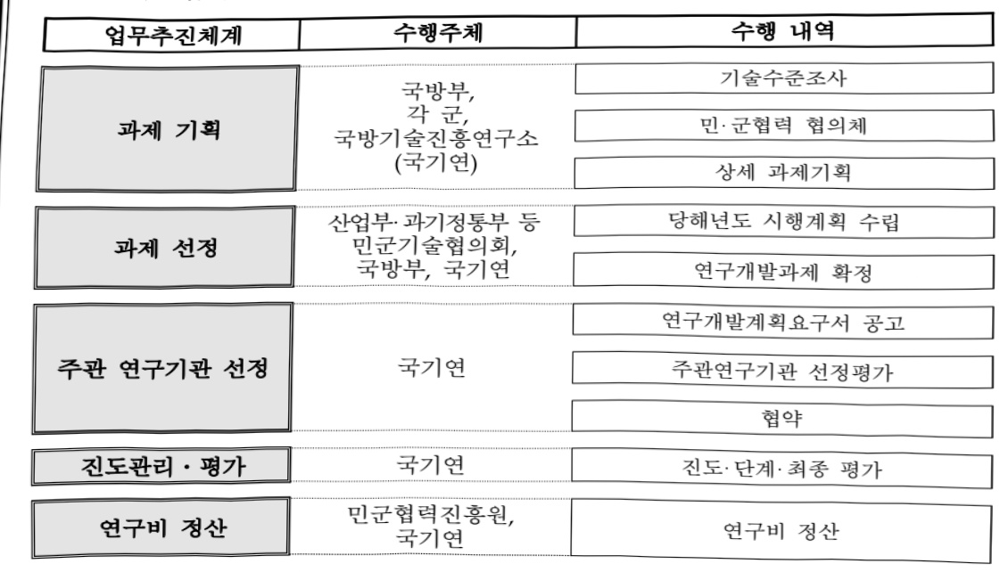
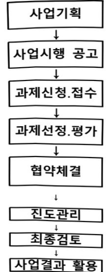

# 민군기술협력(R&D)(국방부)

**해당 페이지**: PDF 2012 ~ 2020 쪽 해당

**부처**: 국방부
**분야**: 국방
**회계유형**: 일반회계
**2026 확정예산**: 10776.0 백만원
**전년대비 증감률**: 82.8%
**AI 도메인**: 국방/안보

---

<table border=1 style='margin: auto; word-wrap: break-word;'><tr><td style='text-align: center; word-wrap: break-word;'>사 업 명</td></tr><tr><td style='text-align: center; word-wrap: break-word;'>(73) 민군기술협력R&amp;D (2341-400)</td></tr></table>

사업 코드 정보

<table border=1 style='margin: auto; word-wrap: break-word;'><tr><td style='text-align: center; word-wrap: break-word;'>구분</td><td style='text-align: center; word-wrap: break-word;'>회계</td><td style='text-align: center; word-wrap: break-word;'>소관</td><td style='text-align: center; word-wrap: break-word;'>실국(기관)</td><td style='text-align: center; word-wrap: break-word;'>계정</td><td style='text-align: center; word-wrap: break-word;'>분야</td><td style='text-align: center; word-wrap: break-word;'>부문</td></tr><tr><td style='text-align: center; word-wrap: break-word;'>코드</td><td rowspan="2">일반회계</td><td rowspan="2">국방부</td><td rowspan="2">첨단전력기획관실</td><td rowspan="2">-</td><td rowspan="2">040국방</td><td rowspan="2">042전력유지</td></tr><tr><td style='text-align: center; word-wrap: break-word;'>명칭</td></tr></table>

<table border=1 style='margin: auto; word-wrap: break-word;'><tr><td style='text-align: center; word-wrap: break-word;'>구분</td><td style='text-align: center; word-wrap: break-word;'>프로그램</td><td style='text-align: center; word-wrap: break-word;'>단위사업</td><td style='text-align: center; word-wrap: break-word;'>세부사업</td></tr><tr><td style='text-align: center; word-wrap: break-word;'>코드</td><td style='text-align: center; word-wrap: break-word;'>2300</td><td style='text-align: center; word-wrap: break-word;'>2341</td><td style='text-align: center; word-wrap: break-word;'>400</td></tr><tr><td style='text-align: center; word-wrap: break-word;'>명칭</td><td style='text-align: center; word-wrap: break-word;'>군수지원 및 협력</td><td style='text-align: center; word-wrap: break-word;'>군수정책지원</td><td style='text-align: center; word-wrap: break-word;'>민군기술협력 R&amp;D</td></tr></table>

사업 성격 (공통요구자료 1-1 작성유의사항 4. 참조, 해당하는 사항에 “0” 표시)

<table border=1 style='margin: auto; word-wrap: break-word;'><tr><td rowspan="2">신규</td><td rowspan="2">계속</td><td rowspan="2">완료</td><td rowspan="2">예비타당성 실시여부</td><td rowspan="2">총사업비 관리대상</td><td rowspan="2">총액계상 예산사업</td><td style='text-align: center; word-wrap: break-word;'>사업소관 변경정보</td></tr><tr><td style='text-align: center; word-wrap: break-word;'>2025예산 시 소관</td></tr><tr><td style='text-align: center; word-wrap: break-word;'></td><td style='text-align: center; word-wrap: break-word;'>○</td><td style='text-align: center; word-wrap: break-word;'></td><td style='text-align: center; word-wrap: break-word;'></td><td style='text-align: center; word-wrap: break-word;'></td><td style='text-align: center; word-wrap: break-word;'></td><td style='text-align: center; word-wrap: break-word;'></td></tr></table>

□ 사업 지원 형태 및 지원을 (최소한 한 개는 반드시 선택하시오. 해당사항에 0 표시)

<table border=1 style='margin: auto; word-wrap: break-word;'><tr><td style='text-align: center; word-wrap: break-word;'>직접</td><td style='text-align: center; word-wrap: break-word;'>출자</td><td style='text-align: center; word-wrap: break-word;'>출연</td><td style='text-align: center; word-wrap: break-word;'>보조</td><td style='text-align: center; word-wrap: break-word;'>융자</td><td style='text-align: center; word-wrap: break-word;'>국고보조율(%)</td><td style='text-align: center; word-wrap: break-word;'>융자율(%)</td></tr><tr><td style='text-align: center; word-wrap: break-word;'></td><td style='text-align: center; word-wrap: break-word;'></td><td style='text-align: center; word-wrap: break-word;'>○</td><td style='text-align: center; word-wrap: break-word;'></td><td style='text-align: center; word-wrap: break-word;'></td><td style='text-align: center; word-wrap: break-word;'></td><td style='text-align: center; word-wrap: break-word;'></td></tr></table>

## 사업 담당자

<table border=1 style='margin: auto; word-wrap: break-word;'><tr><td style='text-align: center; word-wrap: break-word;'>사업명</td><td colspan="5">구분</td></tr><tr><td rowspan="4">민군기술협력 R&amp;D</td><td rowspan="3">소관부처</td><td style='text-align: center; word-wrap: break-word;'>실·국·과(팀)</td><td style='text-align: center; word-wrap: break-word;'>과  장</td><td style='text-align: center; word-wrap: break-word;'>사무관</td><td style='text-align: center; word-wrap: break-word;'>주무관</td></tr><tr><td style='text-align: center; word-wrap: break-word;'>첨단전력기획관실</td><td style='text-align: center; word-wrap: break-word;'>엄은성</td><td style='text-align: center; word-wrap: break-word;'>김오연</td><td style='text-align: center; word-wrap: break-word;'></td></tr><tr><td style='text-align: center; word-wrap: break-word;'>국방연구개발총괄과</td><td style='text-align: center; word-wrap: break-word;'>02-748-5410</td><td style='text-align: center; word-wrap: break-word;'>02-748-5417</td><td style='text-align: center; word-wrap: break-word;'></td></tr><tr><td style='text-align: center; word-wrap: break-word;'>사업시행주체</td><td style='text-align: center; word-wrap: break-word;'>국방기술진흥 연구소</td><td style='text-align: center; word-wrap: break-word;'>전력지원체계 연구2팀</td><td style='text-align: center; word-wrap: break-word;'>김호중 책임연구원</td><td style='text-align: center; word-wrap: break-word;'>02-961-1581</td></tr><tr><td rowspan="4">부처연계협력 R&amp;D</td><td rowspan="3">소관부처</td><td style='text-align: center; word-wrap: break-word;'>실·국·과(팀)</td><td style='text-align: center; word-wrap: break-word;'>과  장</td><td style='text-align: center; word-wrap: break-word;'>사무관</td><td style='text-align: center; word-wrap: break-word;'>주무관</td></tr><tr><td style='text-align: center; word-wrap: break-word;'>전력자원관리실 군수관리관실</td><td style='text-align: center; word-wrap: break-word;'>노정관</td><td style='text-align: center; word-wrap: break-word;'>김진영</td><td style='text-align: center; word-wrap: break-word;'>-</td></tr><tr><td style='text-align: center; word-wrap: break-word;'>군수지능화팀</td><td style='text-align: center; word-wrap: break-word;'>02-748-5770</td><td style='text-align: center; word-wrap: break-word;'>02-748-5773</td><td style='text-align: center; word-wrap: break-word;'>-</td></tr><tr><td style='text-align: center; word-wrap: break-word;'>사업시행주체</td><td style='text-align: center; word-wrap: break-word;'>민군협력진흥원</td><td style='text-align: center; word-wrap: break-word;'>사업관리팀</td><td style='text-align: center; word-wrap: break-word;'>-</td><td style='text-align: center; word-wrap: break-word;'>-</td></tr></table>

---

### 가. 예산 총괄표

(단위: 백만원, %)

<table border=1 style='margin: auto; word-wrap: break-word;'><tr><td rowspan="2">사업명</td><td rowspan="2">2024년 결산</td><td colspan="2">2025년 예산</td><td colspan="2">2026년</td><td rowspan="2">증감(B-A)</td><td rowspan="2">(B-A)/A</td></tr><tr><td style='text-align: center; word-wrap: break-word;'>본예산(A)</td><td style='text-align: center; word-wrap: break-word;'>추경</td><td style='text-align: center; word-wrap: break-word;'>요구안</td><td style='text-align: center; word-wrap: break-word;'>조정안(B)</td></tr><tr><td style='text-align: center; word-wrap: break-word;'>민군기술협력 R&amp;D</td><td style='text-align: center; word-wrap: break-word;'>5,962</td><td style='text-align: center; word-wrap: break-word;'>5,896</td><td style='text-align: center; word-wrap: break-word;'>5,896</td><td style='text-align: center; word-wrap: break-word;'>11,973</td><td style='text-align: center; word-wrap: break-word;'>10,776</td><td style='text-align: center; word-wrap: break-word;'>4,880</td><td style='text-align: center; word-wrap: break-word;'>82.8</td></tr></table>

□ 기능별(내역사업별), 목별 예산 내역

(단위:백만원)

<table border=1 style='margin: auto; word-wrap: break-word;'><tr><td rowspan="3"></td><td colspan="5">2024</td><td colspan="7">2025(2025.7월말)</td><td rowspan="3">2026본예산</td></tr><tr><td rowspan="2">예산의(추경)</td><td rowspan="2">예산현액</td><td rowspan="2">집행액[실집행액]</td><td rowspan="2">아일액</td><td rowspan="2">불용액</td><td rowspan="2">본예산</td><td rowspan="2">예산현액</td><td rowspan="2">집행액[실집행액]</td><td colspan="2">전년도아일액제외</td><td rowspan="2">이월예상액</td><td rowspan="2">불용예상액</td></tr><tr><td style='text-align: center; word-wrap: break-word;'>예산현액</td><td style='text-align: center; word-wrap: break-word;'>집행액[실집행액]</td></tr><tr><td style='text-align: center; word-wrap: break-word;'>○ 기능별 분류(합계)</td><td style='text-align: center; word-wrap: break-word;'>5,962</td><td style='text-align: center; word-wrap: break-word;'>5,962</td><td style='text-align: center; word-wrap: break-word;'>5,962(5,962)</td><td style='text-align: center; word-wrap: break-word;'>0</td><td style='text-align: center; word-wrap: break-word;'>0</td><td style='text-align: center; word-wrap: break-word;'>5,896</td><td style='text-align: center; word-wrap: break-word;'>5,896(4,446)</td><td style='text-align: center; word-wrap: break-word;'>5,896</td><td style='text-align: center; word-wrap: break-word;'>5,896(4,446)</td><td style='text-align: center; word-wrap: break-word;'>5,896</td><td style='text-align: center; word-wrap: break-word;'>0</td><td style='text-align: center; word-wrap: break-word;'>0</td><td style='text-align: center; word-wrap: break-word;'>10,776</td></tr><tr><td style='text-align: center; word-wrap: break-word;'>· 민군기술협력(R&amp;D)</td><td style='text-align: center; word-wrap: break-word;'>3,204</td><td style='text-align: center; word-wrap: break-word;'>3,204</td><td style='text-align: center; word-wrap: break-word;'>3,204(3,204)</td><td style='text-align: center; word-wrap: break-word;'>0</td><td style='text-align: center; word-wrap: break-word;'>0</td><td style='text-align: center; word-wrap: break-word;'>3,504</td><td style='text-align: center; word-wrap: break-word;'>3,504(1,754)</td><td style='text-align: center; word-wrap: break-word;'>3,504</td><td style='text-align: center; word-wrap: break-word;'>3,504</td><td style='text-align: center; word-wrap: break-word;'>3,504(1,754)</td><td style='text-align: center; word-wrap: break-word;'>0</td><td style='text-align: center; word-wrap: break-word;'>0</td><td style='text-align: center; word-wrap: break-word;'>6,349</td></tr><tr><td style='text-align: center; word-wrap: break-word;'>· 부처연계협력(R&amp;D)</td><td style='text-align: center; word-wrap: break-word;'>2,758</td><td style='text-align: center; word-wrap: break-word;'>2,758</td><td style='text-align: center; word-wrap: break-word;'>2,758(2,758)</td><td style='text-align: center; word-wrap: break-word;'>0</td><td style='text-align: center; word-wrap: break-word;'>0</td><td style='text-align: center; word-wrap: break-word;'>2,392</td><td style='text-align: center; word-wrap: break-word;'>2,392(2,392)</td><td style='text-align: center; word-wrap: break-word;'>2,392</td><td style='text-align: center; word-wrap: break-word;'>2,392</td><td style='text-align: center; word-wrap: break-word;'>2,392(2,392)</td><td style='text-align: center; word-wrap: break-word;'>0</td><td style='text-align: center; word-wrap: break-word;'>0</td><td style='text-align: center; word-wrap: break-word;'>4,427</td></tr><tr><td style='text-align: center; word-wrap: break-word;'>○ 비목별 분류(합계)</td><td style='text-align: center; word-wrap: break-word;'>5,962</td><td style='text-align: center; word-wrap: break-word;'>5,962</td><td style='text-align: center; word-wrap: break-word;'>5,962(5,962)</td><td style='text-align: center; word-wrap: break-word;'>0</td><td style='text-align: center; word-wrap: break-word;'>0</td><td style='text-align: center; word-wrap: break-word;'>5,896</td><td style='text-align: center; word-wrap: break-word;'>5,896(4,446)</td><td style='text-align: center; word-wrap: break-word;'>5,896</td><td style='text-align: center; word-wrap: break-word;'>5,896(4,446)</td><td style='text-align: center; word-wrap: break-word;'>5,896</td><td style='text-align: center; word-wrap: break-word;'>0</td><td style='text-align: center; word-wrap: break-word;'>0</td><td style='text-align: center; word-wrap: break-word;'>10,776</td></tr><tr><td style='text-align: center; word-wrap: break-word;'>· 연구개발연구 활동비등(360-05)</td><td style='text-align: center; word-wrap: break-word;'>5,962</td><td style='text-align: center; word-wrap: break-word;'>5,962</td><td style='text-align: center; word-wrap: break-word;'>5,962(5,962)</td><td style='text-align: center; word-wrap: break-word;'>0</td><td style='text-align: center; word-wrap: break-word;'>0</td><td style='text-align: center; word-wrap: break-word;'>5,896</td><td style='text-align: center; word-wrap: break-word;'>5,896(4,446)</td><td style='text-align: center; word-wrap: break-word;'>5,896</td><td style='text-align: center; word-wrap: break-word;'>5,896(4,446)</td><td style='text-align: center; word-wrap: break-word;'>5,896</td><td style='text-align: center; word-wrap: break-word;'>0</td><td style='text-align: center; word-wrap: break-word;'>0</td><td style='text-align: center; word-wrap: break-word;'>10,776</td></tr><tr><td style='text-align: center; word-wrap: break-word;'>○ 기능비목별 분류(합계)</td><td style='text-align: center; word-wrap: break-word;'>5,962</td><td style='text-align: center; word-wrap: break-word;'>5,962</td><td style='text-align: center; word-wrap: break-word;'>5,962(5,962)</td><td style='text-align: center; word-wrap: break-word;'>0</td><td style='text-align: center; word-wrap: break-word;'>0</td><td style='text-align: center; word-wrap: break-word;'>5,896</td><td style='text-align: center; word-wrap: break-word;'>5,896(4,446)</td><td style='text-align: center; word-wrap: break-word;'>5,896</td><td style='text-align: center; word-wrap: break-word;'>5,896(4,446)</td><td style='text-align: center; word-wrap: break-word;'>5,896</td><td style='text-align: center; word-wrap: break-word;'>0</td><td style='text-align: center; word-wrap: break-word;'>0</td><td style='text-align: center; word-wrap: break-word;'>10,776</td></tr><tr><td style='text-align: center; word-wrap: break-word;'>· 민군기술협력(R&amp;D)</td><td style='text-align: center; word-wrap: break-word;'>3,204</td><td style='text-align: center; word-wrap: break-word;'>3,204</td><td style='text-align: center; word-wrap: break-word;'>3,204(3,204)</td><td style='text-align: center; word-wrap: break-word;'>0</td><td style='text-align: center; word-wrap: break-word;'>0</td><td style='text-align: center; word-wrap: break-word;'>3,504</td><td style='text-align: center; word-wrap: break-word;'>3,504(1,754)</td><td style='text-align: center; word-wrap: break-word;'>3,504</td><td style='text-align: center; word-wrap: break-word;'>3,504(1,754)</td><td style='text-align: center; word-wrap: break-word;'>3,504</td><td style='text-align: center; word-wrap: break-word;'>0</td><td style='text-align: center; word-wrap: break-word;'>0</td><td style='text-align: center; word-wrap: break-word;'>6,349</td></tr><tr><td style='text-align: center; word-wrap: break-word;'>· 연구개발연구 활동비등(360-05)</td><td style='text-align: center; word-wrap: break-word;'>3,204</td><td style='text-align: center; word-wrap: break-word;'>3,204</td><td style='text-align: center; word-wrap: break-word;'>3,204(3,204)</td><td style='text-align: center; word-wrap: break-word;'>0</td><td style='text-align: center; word-wrap: break-word;'>0</td><td style='text-align: center; word-wrap: break-word;'>3,504</td><td style='text-align: center; word-wrap: break-word;'>3,504(1,754)</td><td style='text-align: center; word-wrap: break-word;'>3,504</td><td style='text-align: center; word-wrap: break-word;'>3,504(1,754)</td><td style='text-align: center; word-wrap: break-word;'>3,504</td><td style='text-align: center; word-wrap: break-word;'>0</td><td style='text-align: center; word-wrap: break-word;'>0</td><td style='text-align: center; word-wrap: break-word;'>6,349</td></tr><tr><td style='text-align: center; word-wrap: break-word;'>· 부처연계협력(R&amp;D)</td><td style='text-align: center; word-wrap: break-word;'>2,758</td><td style='text-align: center; word-wrap: break-word;'>2,758</td><td style='text-align: center; word-wrap: break-word;'>2,758(2,758)</td><td style='text-align: center; word-wrap: break-word;'>0</td><td style='text-align: center; word-wrap: break-word;'>0</td><td style='text-align: center; word-wrap: break-word;'>2,392</td><td style='text-align: center; word-wrap: break-word;'>2,392(2,392)</td><td style='text-align: center; word-wrap: break-word;'>2,392</td><td style='text-align: center; word-wrap: break-word;'>2,392(2,392)</td><td style='text-align: center; word-wrap: break-word;'>2,392</td><td style='text-align: center; word-wrap: break-word;'>0</td><td style='text-align: center; word-wrap: break-word;'>0</td><td style='text-align: center; word-wrap: break-word;'>4,427</td></tr><tr><td style='text-align: center; word-wrap: break-word;'>· 연구개발연구 활동비등(360-05)</td><td style='text-align: center; word-wrap: break-word;'>2,758</td><td style='text-align: center; word-wrap: break-word;'>2,758</td><td style='text-align: center; word-wrap: break-word;'>2,758(2,758)</td><td style='text-align: center; word-wrap: break-word;'>0</td><td style='text-align: center; word-wrap: break-word;'>0</td><td style='text-align: center; word-wrap: break-word;'>2,392</td><td style='text-align: center; word-wrap: break-word;'>2,392(2,392)</td><td style='text-align: center; word-wrap: break-word;'>2,392</td><td style='text-align: center; word-wrap: break-word;'>2,392(2,392)</td><td style='text-align: center; word-wrap: break-word;'>2,392</td><td style='text-align: center; word-wrap: break-word;'>0</td><td style='text-align: center; word-wrap: break-word;'>0</td><td style='text-align: center; word-wrap: break-word;'>4,427</td></tr></table>

---

### 나. 사업설명자료

## 1 ) 사업목적·내용

- (민군기술협력(R&D)) 군(軍)과 민(民)이 공통으로 사용할 수 있는 제품을 개발하여 군수품의 질(質) 향상과 민간 산업 활성화를 통해 상생 도모

- (부처연계협력(R&D)) 군사 부문과 비군사 부문 간의 기술협력이 강화될 수 있도록 관련 기술에 대한 연구개발을 촉진하고 규격을 표준화하며, 상호간 기술이전을 확대함으로써 산업경쟁력과 국방력 강화

## 2 ) 사업개요

## □ 사업근거 및 추진경위

① 법령상 근거 : 민·군기술협력사업 촉진법

· 제3조(민·군기술협력사업)
①-나. 부처연계협력사업 : 관계중앙행정기관의 장이 추진하는 기술개발 사업 중 민과
군의 협력을 통하여 상호간 가장 우수한 기술능력을 활용하여 성과를 창출하는
방식으로 이루어지는 기술개발사업
①-라. 전력지원체계개발사업 : 민과 군에서 공통적으로 활용할 수 있는
「방위사업법」제3조 제4호에 따른 전력지원체계를 개발하는 사업
· 제17조(출연금의 지급)
①. 관계중앙행정기관의 장은 주관연구기관, 민군기술협력 전담기구,
업무를 위탁받은 자에게 민·군기술협력사업의 추진에 필요한
사업비를 충당하도록 하기 위하여 출연금을 지급할 수 있다.

## ② 추진경위

- '98년 4월 : 민·군겸용기술사업 촉진법 제정

* 과기부, 국방부, 산자부, 정통부 참여

- '12년 4월 :『국방전력지원체계 연구개발사업 추진전략』 보고(차관)

- '12년 11월 :『국방전력지원체계 연구개발 개선방안』 보고(장관)

- '12년 12월 :『국방전력지원체계 중장기 종합발전계획서』 발간

게정

- '14년 2월 : 민·군기술협력사업 촉진법 개정

* 참여부처 확대(4개 → 11개), 사업유형 확대(4개 → 8개) 등

- '14년 5월, 11월 :『국방전력발전업무훈령』 개정

---

- '15년 4월 : 민·군기술협력 전력지원체계개발 공동시행지침 제정

- '16년 9월 : 산업부와 공동으로 민·군기술협력사업 시행

- '17년 12월 : 민·군기술협력사업을 위한 국방부 예산 편성

- '18년 2월 : 제2차 민·군기술협력사업 기본계획 수립

- '18년 7월 : 민·군기술협력사업 촉진법 시행령 개정

* 참여부처 확대(11개 → 14개, 경찰청, 해경청, 농진청 신규 참여)

- '18년 8월 : 민·군기술협력사업 공동시행 규정 개정

- '21년 1월 : 민·군기술협력사업 촉진법 시행령 개정

- '25년 4월 : 민·군기술협력사업 2025년 시행계획(안) 확정

## □ 주요내용

① 사업규모

- 사업기간 : 계속사업

- 적근 5년 간 투입된 사업비(예산액기준, 추경편성한 연도에는 추경포함)

<table border=1 style='margin: auto; word-wrap: break-word;'><tr><td style='text-align: center; word-wrap: break-word;'>연도</td><td style='text-align: center; word-wrap: break-word;'>2022</td><td style='text-align: center; word-wrap: break-word;'>2023</td><td style='text-align: center; word-wrap: break-word;'>2024</td><td style='text-align: center; word-wrap: break-word;'>2025</td><td style='text-align: center; word-wrap: break-word;'>2026</td></tr><tr><td style='text-align: center; word-wrap: break-word;'>사업비</td><td style='text-align: center; word-wrap: break-word;'>7,223</td><td style='text-align: center; word-wrap: break-word;'>7,223</td><td style='text-align: center; word-wrap: break-word;'>5,962</td><td style='text-align: center; word-wrap: break-word;'>5,896</td><td style='text-align: center; word-wrap: break-word;'>10,776</td></tr></table>

- 기타 : 해당없음

② 사업추진체계

- 사업시행방법 : 출연

- 사업시행주체 : 국방기술진흥연구소, 민군협력진흥원

- 사업 수혜자 : 각 군, 민군기술협력 연구 관련 업체

- 보조, 융자, 출연, 출자 등의 경우 보조·융자 등 지원 비율 및 법적근거

<table border=1 style='margin: auto; word-wrap: break-word;'><tr><td style='text-align: center; word-wrap: break-word;'>내역사업명</td><td style='text-align: center; word-wrap: break-word;'>구분</td><td style='text-align: center; word-wrap: break-word;'>피보조·피출연 등 기관명</td><td style='text-align: center; word-wrap: break-word;'>지원 금액 (2026본예산)</td><td style='text-align: center; word-wrap: break-word;'>지원 비율(%)</td><td style='text-align: center; word-wrap: break-word;'>보조율 법적근거 (해당 조항)</td></tr><tr><td style='text-align: center; word-wrap: break-word;'>민군기술협력(R&amp;D)(국방부)</td><td style='text-align: center; word-wrap: break-word;'>출연</td><td style='text-align: center; word-wrap: break-word;'>국방기술품질원(국방기술진흥연구소)</td><td style='text-align: center; word-wrap: break-word;'>6,349</td><td style='text-align: center; word-wrap: break-word;'>100</td><td style='text-align: center; word-wrap: break-word;'>민·군기술협력사업 촉진법(제17조)</td></tr><tr><td style='text-align: center; word-wrap: break-word;'>부처연계협력(R&amp;D)(국방부)</td><td style='text-align: center; word-wrap: break-word;'>출연</td><td style='text-align: center; word-wrap: break-word;'>민군협력진흥원</td><td style='text-align: center; word-wrap: break-word;'>4,427</td><td style='text-align: center; word-wrap: break-word;'>100</td><td style='text-align: center; word-wrap: break-word;'>민·군기술협력사업 촉진법(제17조)</td></tr></table>

## 3 ) '26년도 예산 산출 근거

① 민군기술협력(R&D)

:(25)3,504백만원→(26요구)6,349백만원,2,845백만원증액

- (요구) 전력지원체계 연구개발 사업 과제에 대한 예산 요구

- (산출) "조종사 해상방수복" 등 5개 과제(계속), 2개 신규과제 및 연구조사분석비 : 6,219백만원 기획/평가/관리비 : 130백만원

② 부처연계협력(R&D)

---

:(25)2,392백만원→(26요구)4,427백만원,2,035백만원 증액

- (요구) 부처연계협력 기술개발사업 1개 신규과제에 대한 예산 요구

- (산출) "군수 빅데이터 기반 RAM-C AI 에이전트 개발" 1개 과제(신규) : 4,427백만원

°2025년도 예산 및 2026년도 예산안 산출 세부내역 비교

<table border=1 style='margin: auto; word-wrap: break-word;'><tr><td colspan="2">&#x27;25년 예산</td><td colspan="2">&#x27;26년 예산안</td></tr><tr><td style='text-align: center; word-wrap: break-word;'>예산</td><td style='text-align: center; word-wrap: break-word;'>산출내역</td><td style='text-align: center; word-wrap: break-word;'>예산</td><td style='text-align: center; word-wrap: break-word;'>산출내역</td></tr><tr><td rowspan="3">5,896</td><td style='text-align: center; word-wrap: break-word;'>○ 민군기술협력(R&amp;D) 3,504백만원가. &#x27;25년도 계속과제 : 3,304백만원• &quot;항공기구조 소방차&quot; 등 8개 과제 (계속) : 2934백만원• 전력지원체계 연구조사 분석 : 370백만원나. 기획/평가/관리비 : 200백만원</td><td rowspan="3">10,776</td><td rowspan="2">○ 민군기술협력(R&amp;D) 6,349백만원가. &#x27;26년도 계속과제 : 4,996백만원• &quot;조종사 해상방수복&quot; 등 5개 과제 (계속) : 4,676백만원• 전력지원체계 연구조사 분석 : 320백만원나. &#x27;26년도 신규과제 : 1,223백만원• &quot;유무인 지뢰제거 굴착기&quot; 등 2개 과제(신규) : 1,223백만원다. 기획/평가/관리비 : 130백만원</td></tr><tr><td style='text-align: center; word-wrap: break-word;'>○ 부처연계협력(R&amp;D) : 2,392백만원</td></tr><tr><td style='text-align: center; word-wrap: break-word;'>가. &#x27;25년도 계속과제 : 2,392백만원• &quot;IoT 기반 함정 정비 통합관제 플랫폼 개발&quot; 1개 과제(계속) : 2,392백만원</td><td style='text-align: center; word-wrap: break-word;'>○ 부처연계협력(R&amp;D) : 4,427백만원가. &#x27;26년도 신규과제 : 4,427백만원• &quot;군수 빅데이터 기반 RAM-C AI 에이전트 개발&quot; 1개 과제(신규) : 4,427백만원</td></tr></table>

---

## 4 ) 사업효과

## □ 사업영향, 산출물 성과지표 등

1 '21~25년도 성과계획서 상 성과지표 및 최근 5년간 성과 달성도 : 해당없음

② 성과지표 이외의 연도별 사업추진 경과 및 실적

-민군기술협력(R&D)

<table border=1 style='margin: auto; word-wrap: break-word;'><tr><td style='text-align: center; word-wrap: break-word;'>2022</td><td style='text-align: center; word-wrap: break-word;'>- 전력지원체계 7개 품목을 민군기술협력사업으로 연구개발함으로써 군수품성능 개선 및 관련 품목의 산업 활성화</td></tr><tr><td style='text-align: center; word-wrap: break-word;'>2023</td><td style='text-align: center; word-wrap: break-word;'>- 전력지원체계 10개 품목을 민군기술협력사업으로 연구개발함으로써 군수품성능 개선 및 관련 품목의 산업 활성화</td></tr><tr><td style='text-align: center; word-wrap: break-word;'>2024</td><td style='text-align: center; word-wrap: break-word;'>- 전력지원체계 8개 품목을 민군기술협력사업으로 연구개발함으로써 군수품성능 개선 및 관련 품목의 산업 활성화</td></tr><tr><td style='text-align: center; word-wrap: break-word;'>2025</td><td style='text-align: center; word-wrap: break-word;'>- 전력지원체계 7개 품목을 민군기술협력사업으로 연구개발함으로써 군수품성능 개선 및 관련 품목의 산업 활성화</td></tr></table>

## – 부처연계협력(R&D)

<table border=1 style='margin: auto; word-wrap: break-word;'><tr><td style='text-align: center; word-wrap: break-word;'>2022</td><td style='text-align: center; word-wrap: break-word;'>-「IoT 기반 함정 정비 통합관제 플랫폼 개발」사업 연구개발 (국방부, 산업부, 해양경찰청) 수행(~’25)</td></tr><tr><td style='text-align: center; word-wrap: break-word;'>2023</td><td style='text-align: center; word-wrap: break-word;'>-「IoT 기반 함정 정비 통합관제 플랫폼 개발」사업 연구개발 (국방부, 산업부, 해양경찰청) 수행(~’25)</td></tr><tr><td style='text-align: center; word-wrap: break-word;'>2024</td><td style='text-align: center; word-wrap: break-word;'>-「IoT 기반 함정 정비 통합관제 플랫폼 개발」사업 연구개발 (국방부, 산업부, 해양경찰청) 수행추진(~’25)</td></tr><tr><td style='text-align: center; word-wrap: break-word;'>2025</td><td style='text-align: center; word-wrap: break-word;'>-「IoT 기반 함정 정비 통합관제 플랫폼 개발」사업 연구개발 (국방부, 산업부, 해양경찰청) 수행추진(~’25)</td></tr></table>

## ③ 향후('26년도 이후) 기대효과

- 무기체계와 연계한 전력지원체계 발전으로 국방력 건설 완전성 확보

- 민간 우수기술 군 도입 활성화 및 군 특화분야 연구개발 역량 강화

- 민군기술협력을 통한 소재·제품 개발로 수입대체 효과 기대

- 민수부처와 군수부처의 협력을 통해 민·군 상호간 우수한 기술능력을 활용하여 성과를 창출(국가R&D 투자의 효율성 제고 및 민간 우수기술의 성과활용 확대)

- 부처연계협력개발사업을 통해 군수 빅데이터를 활용한 AI 분석기법 개발 및 표준형 데이터 구축으로 군수 데이터 신뢰성 향상 기대, 지능적 군수지원 실현

---

5) 타당성조사 및 예비타당성조사 시행여부 및 결과 요지 : 해당 없음

6) 총사업비 대상사업 여부 및 내역 : 해당 없음

7) 사업 집행절차

◇ 민군기술협력R&D

## ◇ 부처연계협력R&D

°군수부처(국방부 등) 및 민수부처(산업부, 과기정통부 등) 공동

민·군기술협력 전담기구

- 세부추진계획 확정·공고(사업안내서, 과제제안요구서(RFP) 포함)

연구기관 : 신규과제 연구개발계획서 작성신청

민·군기술협력 전담기구 : 접수

☐ 민·군기술협력 전담기구

- 사전검토 → 전문가 평가(발표심사) → 전문기관 조정 및 협의

민·군기술협력 전담기구 ↔ 주관연구기관

- 주관연구기관 ↔ 세부주관기관 및 참여기업

- 주관연구기관 ↔ 위탁기관

민·군기술협력 전담기구 : 진도관리

민·군기술협력 전담기구 : 연구결과 최종검토

민·군기술협력 전담기구/주관연구기관

---

## 8 ) 중기재정계획 상 연도별 투자계획 및 추진경과

(단위: 백만원)

<table border=1 style='margin: auto; word-wrap: break-word;'><tr><td style='text-align: center; word-wrap: break-word;'>$ \underset{\cdot}{今} $ $ \underset{\cdot}{刀} $ 2024</td><td style='text-align: center; word-wrap: break-word;'>2025</td><td style='text-align: center; word-wrap: break-word;'>2026</td><td style='text-align: center; word-wrap: break-word;'>2027</td><td style='text-align: center; word-wrap: break-word;'>2028</td><td style='text-align: center; word-wrap: break-word;'>2029</td></tr><tr><td style='text-align: center; word-wrap: break-word;'>2024~2028</td><td style='text-align: center; word-wrap: break-word;'>7,223</td><td style='text-align: center; word-wrap: break-word;'>13,433</td><td style='text-align: center; word-wrap: break-word;'>12,188</td><td style='text-align: center; word-wrap: break-word;'>8,656</td><td style='text-align: center; word-wrap: break-word;'>8,656</td></tr><tr><td style='text-align: center; word-wrap: break-word;'>2025~2029</td><td style='text-align: center; word-wrap: break-word;'>$ \underline{\text{5,896}} $</td><td style='text-align: center; word-wrap: break-word;'>10,776</td><td style='text-align: center; word-wrap: break-word;'>18,283</td><td style='text-align: center; word-wrap: break-word;'>18,508</td><td style='text-align: center; word-wrap: break-word;'>16,815</td></tr></table>

## 9 ) 최근 3년간 동 사업에 대한 주요 외부지적사항 및 평가, 문제점 및 대책

1) 국회(예결위, 상임위, 예정처, 국정감사 포함) 지적 : 해당 없음

2) 감사원 또는 국무총리실 지적 : 해당 없음

3) 자체평가 : 해당 없음

4) 기타 시민단체, 언론 및 민원 : 해당 없음

5) 문제점 지적에 대한 후속조치

## 10 ) 향후 추진방향 및 추진계획

- 전력지원체계 품목을 대상으로 민간 활용도를 높일 수 있는 여부에 중점을 두고 과제 발굴하고 적극적인 품목 선정을 통해 민군기술협력 R&D 규모 확대

- ICT와 연계하여, 민간의 첨단 기능 활용을 위해 상기 기능이 탑재될 수 있는 연구 개발 과제 유도

- 전력지원체계분야에 대한 민간기술 활용을 촉진할 수 있도록 국방기술진흥연구소 전력지원체계연구센터 지원 강화

## 11 ) 해당사업에 대한 각종 사업평가의 결과 : 해당 없음

12) 부처 건의사항 : 해당 없음

---

# 다. 최근 4년간 결산내역

## 1 ) 결산표

☐ 부처 결산내역

(단위: 백만원, %)

<table border=1 style='margin: auto; word-wrap: break-word;'><tr><td rowspan="2">연도</td><td colspan="3">예산액</td><td rowspan="2">전년도 이월액</td><td rowspan="2">이·전용 등</td><td rowspan="2">예비비</td><td rowspan="2">예산 현액(B)</td><td rowspan="2">집행액(C)</td><td rowspan="2">집행률(C/A)</td><td rowspan="2">집행률(C/B)</td><td rowspan="2">다음연도 이월액</td><td rowspan="2">불용액</td></tr><tr><td style='text-align: center; word-wrap: break-word;'>본예산</td><td style='text-align: center; word-wrap: break-word;'>추경 중감액</td><td style='text-align: center; word-wrap: break-word;'>추경(A)</td></tr><tr><td style='text-align: center; word-wrap: break-word;'>2022</td><td style='text-align: center; word-wrap: break-word;'>7,223</td><td style='text-align: center; word-wrap: break-word;'>0</td><td style='text-align: center; word-wrap: break-word;'>7,223</td><td style='text-align: center; word-wrap: break-word;'>0</td><td style='text-align: center; word-wrap: break-word;'>0</td><td style='text-align: center; word-wrap: break-word;'>0</td><td style='text-align: center; word-wrap: break-word;'>7,223</td><td style='text-align: center; word-wrap: break-word;'>7,223</td><td style='text-align: center; word-wrap: break-word;'>100.0</td><td style='text-align: center; word-wrap: break-word;'>100.0</td><td style='text-align: center; word-wrap: break-word;'>0</td><td style='text-align: center; word-wrap: break-word;'>0</td></tr><tr><td style='text-align: center; word-wrap: break-word;'>2023</td><td style='text-align: center; word-wrap: break-word;'>7,223</td><td style='text-align: center; word-wrap: break-word;'>0</td><td style='text-align: center; word-wrap: break-word;'>7,223</td><td style='text-align: center; word-wrap: break-word;'>0</td><td style='text-align: center; word-wrap: break-word;'>0</td><td style='text-align: center; word-wrap: break-word;'>0</td><td style='text-align: center; word-wrap: break-word;'>7,223</td><td style='text-align: center; word-wrap: break-word;'>7,223</td><td style='text-align: center; word-wrap: break-word;'>100.0</td><td style='text-align: center; word-wrap: break-word;'>100.0</td><td style='text-align: center; word-wrap: break-word;'>0</td><td style='text-align: center; word-wrap: break-word;'>0</td></tr><tr><td style='text-align: center; word-wrap: break-word;'>2024</td><td style='text-align: center; word-wrap: break-word;'>5,962</td><td style='text-align: center; word-wrap: break-word;'>0</td><td style='text-align: center; word-wrap: break-word;'>5,962</td><td style='text-align: center; word-wrap: break-word;'>0</td><td style='text-align: center; word-wrap: break-word;'>0</td><td style='text-align: center; word-wrap: break-word;'>0</td><td style='text-align: center; word-wrap: break-word;'>5,962</td><td style='text-align: center; word-wrap: break-word;'>5,962</td><td style='text-align: center; word-wrap: break-word;'>100.0</td><td style='text-align: center; word-wrap: break-word;'>100.0</td><td style='text-align: center; word-wrap: break-word;'>0</td><td style='text-align: center; word-wrap: break-word;'>0</td></tr><tr><td style='text-align: center; word-wrap: break-word;'>2025</td><td style='text-align: center; word-wrap: break-word;'>5,896</td><td style='text-align: center; word-wrap: break-word;'>0</td><td style='text-align: center; word-wrap: break-word;'>5,896</td><td style='text-align: center; word-wrap: break-word;'>0</td><td style='text-align: center; word-wrap: break-word;'>0</td><td style='text-align: center; word-wrap: break-word;'>0</td><td style='text-align: center; word-wrap: break-word;'>5,896</td><td style='text-align: center; word-wrap: break-word;'>5,896</td><td style='text-align: center; word-wrap: break-word;'>100.0</td><td style='text-align: center; word-wrap: break-word;'>100.0</td><td style='text-align: center; word-wrap: break-word;'>0</td><td style='text-align: center; word-wrap: break-word;'>0</td></tr></table>

□출연·보조사업 등 실집행내역

(단위: 백만원, %)

<table border=1 style='margin: auto; word-wrap: break-word;'><tr><td rowspan="3">구분</td><td colspan="3">부처</td><td colspan="7">사업시행주체(피출연·피보조 기관 등)</td></tr><tr><td colspan="2">예산액</td><td rowspan="2">집행액</td><td rowspan="2">교부액</td><td rowspan="2">전년도 이월액</td><td rowspan="2">교부 현액</td><td rowspan="2">집행액 (B)</td><td rowspan="2">이월액</td><td rowspan="2">불용액</td><td rowspan="2">실집행률 (B/A)</td></tr><tr><td style='text-align: center; word-wrap: break-word;'>본예산</td><td style='text-align: center; word-wrap: break-word;'>추경(A)</td></tr><tr><td style='text-align: center; word-wrap: break-word;'>2022</td><td style='text-align: center; word-wrap: break-word;'>7,223</td><td style='text-align: center; word-wrap: break-word;'>7,223</td><td style='text-align: center; word-wrap: break-word;'>7,223</td><td style='text-align: center; word-wrap: break-word;'>7,223</td><td style='text-align: center; word-wrap: break-word;'>0</td><td style='text-align: center; word-wrap: break-word;'>7,223</td><td style='text-align: center; word-wrap: break-word;'>7,223</td><td style='text-align: center; word-wrap: break-word;'>0</td><td style='text-align: center; word-wrap: break-word;'>0</td><td style='text-align: center; word-wrap: break-word;'>100.0</td></tr><tr><td style='text-align: center; word-wrap: break-word;'>2023</td><td style='text-align: center; word-wrap: break-word;'>7,223</td><td style='text-align: center; word-wrap: break-word;'>7,223</td><td style='text-align: center; word-wrap: break-word;'>7,223</td><td style='text-align: center; word-wrap: break-word;'>7,223</td><td style='text-align: center; word-wrap: break-word;'>0</td><td style='text-align: center; word-wrap: break-word;'>7,223</td><td style='text-align: center; word-wrap: break-word;'>7,223</td><td style='text-align: center; word-wrap: break-word;'>0</td><td style='text-align: center; word-wrap: break-word;'>0</td><td style='text-align: center; word-wrap: break-word;'>100.0</td></tr><tr><td style='text-align: center; word-wrap: break-word;'>2024</td><td style='text-align: center; word-wrap: break-word;'>5,962</td><td style='text-align: center; word-wrap: break-word;'>5,962</td><td style='text-align: center; word-wrap: break-word;'>5,962</td><td style='text-align: center; word-wrap: break-word;'>5,962</td><td style='text-align: center; word-wrap: break-word;'>0</td><td style='text-align: center; word-wrap: break-word;'>5,962</td><td style='text-align: center; word-wrap: break-word;'>5,962</td><td style='text-align: center; word-wrap: break-word;'>0</td><td style='text-align: center; word-wrap: break-word;'>0</td><td style='text-align: center; word-wrap: break-word;'>100.0</td></tr><tr><td style='text-align: center; word-wrap: break-word;'>2025.</td><td rowspan="2">5,896</td><td rowspan="2">5,896</td><td rowspan="2">5,896</td><td rowspan="2">5,896</td><td rowspan="2">0</td><td rowspan="2">5,896</td><td rowspan="2">4,846</td><td rowspan="2">0</td><td rowspan="2">0</td><td rowspan="2">82.2</td></tr><tr><td style='text-align: center; word-wrap: break-word;'>7월기준</td></tr></table>

## 2 ) 주요 결산사항

□ 2022년~2025년 결산사항 : 해당 없음

□ 2025년 이·전용 등 세부내역 : 해당 없음

2025년 예비비 배정 세부내역 : 해당 없음

라. 기타 추가자료 : 해당 없음

---

### 원본 PDF 크롭 이미지

