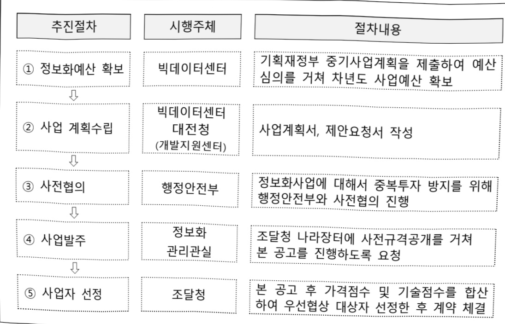

# 국세정보분석시스템 운영(정보화)

**해당 페이지**: PDF 2055 ~ 2060 쪽 해당

**부처**: 국세청
**분야**: 일반·지방행정
**회계유형**: 일반회계
**2026 확정예산**: 11610.0 백만원
**전년대비 증감률**: 19.0%
**AI 도메인**: 데이터, 디지털전환(AX)

---

<table border=1 style='margin: auto; word-wrap: break-word;'><tr><td style='text-align: center; word-wrap: break-word;'>사 업 명</td></tr><tr><td style='text-align: center; word-wrap: break-word;'>(66) 국세정보분석시스템 운영(정보화) (7133-502)</td></tr></table>

□ 사업 코드 정보

<table border=1 style='margin: auto; word-wrap: break-word;'><tr><td style='text-align: center; word-wrap: break-word;'>구분</td><td style='text-align: center; word-wrap: break-word;'>회계</td><td style='text-align: center; word-wrap: break-word;'>소관</td><td style='text-align: center; word-wrap: break-word;'>실국(기관)</td><td style='text-align: center; word-wrap: break-word;'>계정</td><td style='text-align: center; word-wrap: break-word;'>분야</td><td style='text-align: center; word-wrap: break-word;'>부문</td></tr><tr><td style='text-align: center; word-wrap: break-word;'>코드</td><td rowspan="2">일반회계</td><td rowspan="2">국세청</td><td rowspan="2">정보화관리관실</td><td rowspan="2"></td><td style='text-align: center; word-wrap: break-word;'>010</td><td style='text-align: center; word-wrap: break-word;'>014</td></tr><tr><td style='text-align: center; word-wrap: break-word;'>명칭</td><td style='text-align: center; word-wrap: break-word;'>일반,지방행정</td><td style='text-align: center; word-wrap: break-word;'>재정금융</td></tr></table>

<table border=1 style='margin: auto; word-wrap: break-word;'><tr><td style='text-align: center; word-wrap: break-word;'>구분</td><td style='text-align: center; word-wrap: break-word;'>프로그램</td><td style='text-align: center; word-wrap: break-word;'>단위사업</td><td style='text-align: center; word-wrap: break-word;'>세부사업</td></tr><tr><td style='text-align: center; word-wrap: break-word;'>코드</td><td style='text-align: center; word-wrap: break-word;'>7100</td><td style='text-align: center; word-wrap: break-word;'>7133</td><td style='text-align: center; word-wrap: break-word;'>502</td></tr><tr><td style='text-align: center; word-wrap: break-word;'>덩칭</td><td style='text-align: center; word-wrap: break-word;'>국세행정지원</td><td style='text-align: center; word-wrap: break-word;'>국세행정전산화(정보화)</td><td style='text-align: center; word-wrap: break-word;'>국세정보분석시스템 운영(정보화)</td></tr></table>

사업 성격 (공통요구자료 II-1 작성유의사항 4. 참조, 해당하는 사항에 “0” 표시)

<table border=1 style='margin: auto; word-wrap: break-word;'><tr><td rowspan="2">신규</td><td rowspan="2">계속</td><td rowspan="2">완료</td><td rowspan="2">예비타당성 실시여부</td><td rowspan="2">총사업비 관리대상</td><td rowspan="2">총액계상 예산사업</td><td style='text-align: center; word-wrap: break-word;'>사업소관 변경정보</td></tr><tr><td style='text-align: center; word-wrap: break-word;'>2025예산 시 소관</td></tr><tr><td style='text-align: center; word-wrap: break-word;'></td><td style='text-align: center; word-wrap: break-word;'>○</td><td style='text-align: center; word-wrap: break-word;'></td><td style='text-align: center; word-wrap: break-word;'></td><td style='text-align: center; word-wrap: break-word;'></td><td style='text-align: center; word-wrap: break-word;'></td><td style='text-align: center; word-wrap: break-word;'></td></tr></table>

사업 지원 형태 및 지원을 (최소한 한 개는 반드시 선택하시오. 해당사항에 O 표시)

<table border=1 style='margin: auto; word-wrap: break-word;'><tr><td style='text-align: center; word-wrap: break-word;'>직접</td><td style='text-align: center; word-wrap: break-word;'>출자</td><td style='text-align: center; word-wrap: break-word;'>출연</td><td style='text-align: center; word-wrap: break-word;'>보조</td><td style='text-align: center; word-wrap: break-word;'>융자</td><td style='text-align: center; word-wrap: break-word;'>국고보조율(%)</td><td style='text-align: center; word-wrap: break-word;'>융자율(%)</td></tr><tr><td style='text-align: center; word-wrap: break-word;'>○</td><td style='text-align: center; word-wrap: break-word;'></td><td style='text-align: center; word-wrap: break-word;'></td><td style='text-align: center; word-wrap: break-word;'></td><td style='text-align: center; word-wrap: break-word;'></td><td style='text-align: center; word-wrap: break-word;'></td><td style='text-align: center; word-wrap: break-word;'></td></tr></table>

□ 사업 소관부처 및 시행주체

<table border=1 style='margin: auto; word-wrap: break-word;'><tr><td style='text-align: center; word-wrap: break-word;'>사업명</td><td colspan="2">구분</td></tr><tr><td rowspan="2">국세정보분석시스템운영(정보화)</td><td style='text-align: center; word-wrap: break-word;'>소관부처</td><td style='text-align: center; word-wrap: break-word;'>실·국·과(팀)정보화관리관실빅데이터센터</td></tr><tr><td style='text-align: center; word-wrap: break-word;'>사업시행주체</td><td style='text-align: center; word-wrap: break-word;'>국세청</td></tr></table>

### 가. 예산 총괄표

(단위: 백만원, %)

<table border=1 style='margin: auto; word-wrap: break-word;'><tr><td rowspan="2">사업명</td><td rowspan="2">2024년 결산</td><td colspan="2">2025년 예산</td><td colspan="2">2026년</td><td rowspan="2">증감(B-A)</td><td rowspan="2">(B-A)/A</td></tr><tr><td style='text-align: center; word-wrap: break-word;'>본예산</td><td style='text-align: center; word-wrap: break-word;'>추경(A)</td><td style='text-align: center; word-wrap: break-word;'>요구안</td><td style='text-align: center; word-wrap: break-word;'>본예산(B)</td></tr><tr><td style='text-align: center; word-wrap: break-word;'>국세정보분석시스템 운영(정보화)</td><td style='text-align: center; word-wrap: break-word;'>11,162</td><td style='text-align: center; word-wrap: break-word;'>9,756</td><td style='text-align: center; word-wrap: break-word;'>9,756</td><td style='text-align: center; word-wrap: break-word;'>11,610</td><td style='text-align: center; word-wrap: break-word;'>11,610</td><td style='text-align: center; word-wrap: break-word;'>1,854</td><td style='text-align: center; word-wrap: break-word;'>19.0</td></tr></table>

---

□ 기능별(내역사업별) 예산 내역

(단위:백만원)

<table border=1 style='margin: auto; word-wrap: break-word;'><tr><td rowspan="2"></td><td colspan="5">2024</td><td colspan="5">2025</td><td rowspan="2">2026예산안</td></tr><tr><td style='text-align: center; word-wrap: break-word;'>예산액(추경)</td><td style='text-align: center; word-wrap: break-word;'>예산현액</td><td style='text-align: center; word-wrap: break-word;'>집행액</td><td style='text-align: center; word-wrap: break-word;'>이월액</td><td style='text-align: center; word-wrap: break-word;'>불용액</td><td style='text-align: center; word-wrap: break-word;'>예산액(추경)</td><td style='text-align: center; word-wrap: break-word;'>예산현액</td><td style='text-align: center; word-wrap: break-word;'>집행액</td><td style='text-align: center; word-wrap: break-word;'>이월액</td><td style='text-align: center; word-wrap: break-word;'>불용액</td></tr><tr><td style='text-align: center; word-wrap: break-word;'>○ 기능별 분류(합계)</td><td style='text-align: center; word-wrap: break-word;'>11,305</td><td style='text-align: center; word-wrap: break-word;'>11,305</td><td style='text-align: center; word-wrap: break-word;'>11,162</td><td style='text-align: center; word-wrap: break-word;'>-</td><td style='text-align: center; word-wrap: break-word;'>143</td><td style='text-align: center; word-wrap: break-word;'>9,756</td><td style='text-align: center; word-wrap: break-word;'>9,756</td><td style='text-align: center; word-wrap: break-word;'>9,690</td><td style='text-align: center; word-wrap: break-word;'>-</td><td style='text-align: center; word-wrap: break-word;'>-</td><td style='text-align: center; word-wrap: break-word;'>11,610</td></tr><tr><td rowspan="4">· 빅데이터시스템운영 및 유지관리· 빅데이터 활용연구과제 개발· 정보분석시스템운영 및 유지보수· 국세청 AI 시스템 구축</td><td style='text-align: center; word-wrap: break-word;'>5,769</td><td style='text-align: center; word-wrap: break-word;'>5,769</td><td style='text-align: center; word-wrap: break-word;'>5,711</td><td style='text-align: center; word-wrap: break-word;'>-</td><td style='text-align: center; word-wrap: break-word;'>58</td><td style='text-align: center; word-wrap: break-word;'>4,508</td><td style='text-align: center; word-wrap: break-word;'>4,508</td><td style='text-align: center; word-wrap: break-word;'>4,464</td><td style='text-align: center; word-wrap: break-word;'>-</td><td style='text-align: center; word-wrap: break-word;'>-</td><td style='text-align: center; word-wrap: break-word;'>4,417</td></tr><tr><td style='text-align: center; word-wrap: break-word;'>2,462</td><td style='text-align: center; word-wrap: break-word;'>2,462</td><td style='text-align: center; word-wrap: break-word;'>2,408</td><td style='text-align: center; word-wrap: break-word;'>-</td><td style='text-align: center; word-wrap: break-word;'>54</td><td style='text-align: center; word-wrap: break-word;'>2,211</td><td style='text-align: center; word-wrap: break-word;'>2,211</td><td style='text-align: center; word-wrap: break-word;'>2,165</td><td style='text-align: center; word-wrap: break-word;'>-</td><td style='text-align: center; word-wrap: break-word;'>-</td><td style='text-align: center; word-wrap: break-word;'>2,211</td></tr><tr><td style='text-align: center; word-wrap: break-word;'>3,074</td><td style='text-align: center; word-wrap: break-word;'>3,074</td><td style='text-align: center; word-wrap: break-word;'>3,043</td><td style='text-align: center; word-wrap: break-word;'>-</td><td style='text-align: center; word-wrap: break-word;'>31</td><td style='text-align: center; word-wrap: break-word;'>3,037</td><td style='text-align: center; word-wrap: break-word;'>3,037</td><td style='text-align: center; word-wrap: break-word;'>3,061</td><td style='text-align: center; word-wrap: break-word;'>-</td><td style='text-align: center; word-wrap: break-word;'>-</td><td style='text-align: center; word-wrap: break-word;'>3,156</td></tr><tr><td style='text-align: center; word-wrap: break-word;'></td><td style='text-align: center; word-wrap: break-word;'></td><td style='text-align: center; word-wrap: break-word;'></td><td style='text-align: center; word-wrap: break-word;'>-</td><td style='text-align: center; word-wrap: break-word;'></td><td style='text-align: center; word-wrap: break-word;'></td><td style='text-align: center; word-wrap: break-word;'></td><td style='text-align: center; word-wrap: break-word;'></td><td style='text-align: center; word-wrap: break-word;'>-</td><td style='text-align: center; word-wrap: break-word;'>-</td><td style='text-align: center; word-wrap: break-word;'>1,826</td></tr></table>

### 나. 사업설명자료

## 1 ) 사업목적·내용

- (빅데이터시스템 운영·유지보수) 과세형평성 제고 및 납세자 친화적 세무행정 구현을 위해 구축한 빅데이터 시스템 및 분석모델의 안정적 운영, 분석기법 고도화 등 추진

- (빅데이터 활용 연구과제 개발) 국세행정의 디지털 전환 가속화를 지원하기 위해 납세자

맞춤형 신고도움자료 확대, 업무량 감축 등 일선업무 효율화, 지능형 탈세 대응 과제 개발

- (정보분석시스템 운영·유지보수) 국세행정 업무를 차질없이 뒷받침 할 수 있도록 정보분석 시스템에 법령 및 제도개선 사항을 반영하고, 체계적으로 운영·관리하여 안정적 서비스 제공

- (국세청 AI 시스템 구축) AI대전환으로 국세행정의 모든 프로세스에 걸쳐 전면적 혁신을 구현하기 위한 국세청 AI 시스템을 구축하고 AI 혁신과제 추진하기 위한 ISMP* 수행

* Information Strategy Master Plan : 요구사항을 분석하여 목표시스템의 기능적 요구사항을 상세히 도출

## 2 ) 사업개요

## □ 사업근거 및 추진경위

① 법령상 근거

- 소득세법, 부가가치세법, 법인세법 등 개별 세법 및 데이터 기반행정 활성화법

---

## ② 추진경위

- 인공지능 기반의 빅데이터센터 구축을 위한 정보화전략계획(ISP) 수립 사업 추진

(18.2~12월)

- 「과세형평 제고 및 납세자 친화적 세무행정 구현」의 목표 실현을 위해 '19년부터 빅데이터 시스템 구축 · 분석모델 개발 사업 추진

- 빅데이터 시스템 구축 및 선도과제 개발 ('19.12월~)

## □ 주요내용

① 사업규모

- 총사업비(해당되는 경우에만 기재) :

- 사업기간 :

- 최근 5년 간 투입된 사업비(예산액기준, 추경편성한 연도에는 추경포함)

<table border=1 style='margin: auto; word-wrap: break-word;'><tr><td style='text-align: center; word-wrap: break-word;'>연도</td><td style='text-align: center; word-wrap: break-word;'>2022</td><td style='text-align: center; word-wrap: break-word;'>2023</td><td style='text-align: center; word-wrap: break-word;'>2024</td><td style='text-align: center; word-wrap: break-word;'>2025</td><td style='text-align: center; word-wrap: break-word;'>2026</td></tr><tr><td style='text-align: center; word-wrap: break-word;'>사업비</td><td style='text-align: center; word-wrap: break-word;'>11,248</td><td style='text-align: center; word-wrap: break-word;'>10,653</td><td style='text-align: center; word-wrap: break-word;'>11,305</td><td style='text-align: center; word-wrap: break-word;'>9,756</td><td style='text-align: center; word-wrap: break-word;'>11,610</td></tr></table>

② 사업추진체계

- 사업시행방법 : 직접수행

- 사업시행주체 : 국세청

- 사업 수혜자 : 대국민 납세자, 국세청 직원

- 보조, 융자, 출연, 출자 등의 경우 보조·융자 등 지원 비율 및 법적근거 : 해당없음

## 3 ) 2026년도 예산 산출 근거

1) 빅데이터시스템 운영 및 유지보수 : (2025) 4,508백만원 → (2026) 4,418백만원, 2% 감액

(임차료) '25년 빅데이터 증설로 도입한 상용SW 임차료 4회(2년차)로 산정하여 370백만원 증액

(관리용역비) '25년 빅데이터 증설 SW이관 인건비에 대한 관리용역비 460백만원 감액

(일반수용비) 조달수수료 30백만원 유지

2) 빅데이터 활용 연구과제 개발 : (2025) 2,211 백만원 → (2026) 2,211 백만원, 전년동일

(일반연구비) 신기술, 인공지능을 반영한 세무행정 지원 모델 개발비 2,071 백만원 유지

(감리사업비) 정보시스템 감리 수행 130백만원 유지

(일반수용비) 조달수수료 10백만원 유지

3) 정보분석시스템 운영 및 유지관리 : (2025) 3,037백만원 → (2026) 3,155백만원, 3.9% 증액

---

(임차료) '25년 정보분석 증설로 도입한 상용SW 임차료를 4회(2년차)로 산정하여 237백만원 증액

(관리용역비) '25년 빅데이터 증설 SW이관 인건비에 대한 관리용역비 118백만원 감액

(일반수용비) 조달수수료 17백만원 유지

4) 국세청 AI 시스템 구축 : (2025) 0원 → (2026) 1,826백만원 (신규)

(일반연구비) AI 시스템 구축 ISMP 수행을 위한 1,807 백만원 중액

(일반수용비)조달수수료19백만원중액

② 성과지표 이외의 연도별 사업추진 경과 및 실적

<table border=1 style='margin: auto; word-wrap: break-word;'><tr><td style='text-align: center; word-wrap: break-word;'>2021</td><td style='text-align: center; word-wrap: break-word;'>빅데이터 활용 분석모델 개발</td></tr><tr><td style='text-align: center; word-wrap: break-word;'>2022</td><td style='text-align: center; word-wrap: break-word;'>빅데이터 활용 분석모델 개발 및 유지관리 정보분석시스템 운영</td></tr><tr><td style='text-align: center; word-wrap: break-word;'>2023</td><td style='text-align: center; word-wrap: break-word;'>빅데이터시스템 운영·유지관리, 빅데이터 활용 연구과제 개발 정보분석시스템 운영</td></tr><tr><td style='text-align: center; word-wrap: break-word;'>2024</td><td style='text-align: center; word-wrap: break-word;'>빅데이터시스템 운영·유지관리, 빅데이터 활용 연구과제 개발 정보분석시스템 운영</td></tr><tr><td style='text-align: center; word-wrap: break-word;'>2025</td><td style='text-align: center; word-wrap: break-word;'>빅데이터시스템 운영·유지관리, 빅데이터 활용 연구과제 개발 정보분석시스템 운영</td></tr></table>

③ 향후('26년도 이후) 기대효과 : 개조식으로 작성, 건 별로 계량적 수치 제시

0 맞춤형 신고도움자료, 미리·모두채움 서비스, 챗봇 상담 제공 등 납세자의 자발적 성실신고를 적극 지원하고 납세협력 비용을 감축

0 일선 세무서에서 수동적·반복적으로 수행하는 비생산적인 업무를 획기적으로 축소하고 자동화하여 업무를 효율화

0 갈수록 지능화되는 변칙적 탈세행위와 고의·악의적 체납에 효과적으로 대응

○ 국세행정에 AI를 도입해 납세서비스·공정과세·업무생산성 등 세정업무 전반을 혁신하여 지능형·맞춤형 서비스를 제공하고 증세 없이 국정재원 마련

5) 타당성조사 및 예비타당성조사 시행여부 및 결과 요지

- 해당사항 없음

6) 총사업비 대상사업 여부 및 내역

- 해당사항 없음

---

## 7 ) 사업 집행절차

## 8 ) 각종 평가

1) 국회(예결위, 상임위, 예정처, 국정감사 포함) 지적

기재위 예산 부대의견(20년)

- (지적) 빅데이터 활용에 관한 성과지표를 만들어 지속적으로 성과를 관리할 필요 있음

기재위 예산 부대의견(21년)

- (지적) 빅데이터 민간경력채용을 확대하고 세무지식 습득을 지원하여 하이브리드형 전문

인력 양성 필요

ㅇ 기재위 결산 부대의견 (21년)

- (지적) 빅데이터 활용 분석모델 개발사업 추진시 분석모델 개발 사업과 운영 및 유지관리

사업을 분리하여 발주 필요

ㅇ 예정처 결산 분석보고서 (24년)

- (지적) 비데이터 활용 분석모델 개발사업 추진시 사전에 정보화전략계획(ISP) 수립 등을 통한 검토 필요

2) 감사원 감사 또는 국무총리실 지적 : 해당 없음

3) 자체평가·감사 : 해당 없음

---

### 다. 최근 4년간 결산내역

## 1 ) 결산표

☐ 부처 결산내역

(단위: 백만원, %)

<table border=1 style='margin: auto; word-wrap: break-word;'><tr><td rowspan="2">笹도</td><td colspan="3">예산액</td><td rowspan="2">전년도 이월액</td><td rowspan="2">이·전용 등</td><td rowspan="2">예비비</td><td rowspan="2">예산 현액(B)</td><td rowspan="2">집행액 (C)</td><td rowspan="2">집행률 (C/A)</td><td rowspan="2">집행률 (C/B)</td><td rowspan="2">다음엔도 이월액</td><td rowspan="2">불용액</td></tr><tr><td style='text-align: center; word-wrap: break-word;'>본예산 중감액</td><td style='text-align: center; word-wrap: break-word;'>추경</td><td style='text-align: center; word-wrap: break-word;'>추경(A)</td></tr><tr><td style='text-align: center; word-wrap: break-word;'>2022</td><td style='text-align: center; word-wrap: break-word;'>11,248</td><td style='text-align: center; word-wrap: break-word;'>-</td><td style='text-align: center; word-wrap: break-word;'>11,248</td><td style='text-align: center; word-wrap: break-word;'>-</td><td style='text-align: center; word-wrap: break-word;'>$ \pm37 $</td><td style='text-align: center; word-wrap: break-word;'>-</td><td style='text-align: center; word-wrap: break-word;'>11,248</td><td style='text-align: center; word-wrap: break-word;'>11,234</td><td style='text-align: center; word-wrap: break-word;'>99.9</td><td style='text-align: center; word-wrap: break-word;'>99.9</td><td style='text-align: center; word-wrap: break-word;'>-</td><td style='text-align: center; word-wrap: break-word;'>14</td></tr><tr><td style='text-align: center; word-wrap: break-word;'>2023</td><td style='text-align: center; word-wrap: break-word;'>10,653</td><td style='text-align: center; word-wrap: break-word;'>-</td><td style='text-align: center; word-wrap: break-word;'>10,653</td><td style='text-align: center; word-wrap: break-word;'>-</td><td style='text-align: center; word-wrap: break-word;'>-</td><td style='text-align: center; word-wrap: break-word;'>-</td><td style='text-align: center; word-wrap: break-word;'>10,653</td><td style='text-align: center; word-wrap: break-word;'>10,601</td><td style='text-align: center; word-wrap: break-word;'>99.5</td><td style='text-align: center; word-wrap: break-word;'>99.5</td><td style='text-align: center; word-wrap: break-word;'>-</td><td style='text-align: center; word-wrap: break-word;'>52</td></tr><tr><td style='text-align: center; word-wrap: break-word;'>2024</td><td style='text-align: center; word-wrap: break-word;'>11,305</td><td style='text-align: center; word-wrap: break-word;'>-</td><td style='text-align: center; word-wrap: break-word;'>11,305</td><td style='text-align: center; word-wrap: break-word;'>-</td><td style='text-align: center; word-wrap: break-word;'>-</td><td style='text-align: center; word-wrap: break-word;'>-</td><td style='text-align: center; word-wrap: break-word;'>11,305</td><td style='text-align: center; word-wrap: break-word;'>11,162</td><td style='text-align: center; word-wrap: break-word;'>98.7</td><td style='text-align: center; word-wrap: break-word;'>98.7</td><td style='text-align: center; word-wrap: break-word;'>-</td><td style='text-align: center; word-wrap: break-word;'>143</td></tr><tr><td style='text-align: center; word-wrap: break-word;'>2025</td><td style='text-align: center; word-wrap: break-word;'>9,756</td><td style='text-align: center; word-wrap: break-word;'>-</td><td style='text-align: center; word-wrap: break-word;'>9,756</td><td style='text-align: center; word-wrap: break-word;'>-</td><td style='text-align: center; word-wrap: break-word;'>-</td><td style='text-align: center; word-wrap: break-word;'>-</td><td style='text-align: center; word-wrap: break-word;'>9,756</td><td style='text-align: center; word-wrap: break-word;'>9,690</td><td style='text-align: center; word-wrap: break-word;'>99.3</td><td style='text-align: center; word-wrap: break-word;'>99.3</td><td style='text-align: center; word-wrap: break-word;'>-</td><td style='text-align: center; word-wrap: break-word;'>-</td></tr></table>

□출연·보조사업 등 실집행내역 : 해당사항 없음

## 2 ) 주요 결산사항

□ 2022~2025년 결산 주요사항

<table border=1 style='margin: auto; word-wrap: break-word;'><tr><td style='text-align: center; word-wrap: break-word;'>2022</td><td style='text-align: center; word-wrap: break-word;'>- 전용: 사업 입찰과정에서 발생한 낙찰차액 51백만원 중 37백만원을 당해 사업의 감리비로 전용 - 불용: 감리비로 전용한 금액을 제외한 나머지 14백만원 불용</td></tr><tr><td style='text-align: center; word-wrap: break-word;'>2023</td><td style='text-align: center; word-wrap: break-word;'>해당없음</td></tr><tr><td style='text-align: center; word-wrap: break-word;'>2024</td><td style='text-align: center; word-wrap: break-word;'>해당없음</td></tr><tr><td style='text-align: center; word-wrap: break-word;'>2025</td><td style='text-align: center; word-wrap: break-word;'>해당없음</td></tr></table>

□ 2025년 이·전용 등 세부내역 : 해당사항 없음

---

### 원본 PDF 크롭 이미지

