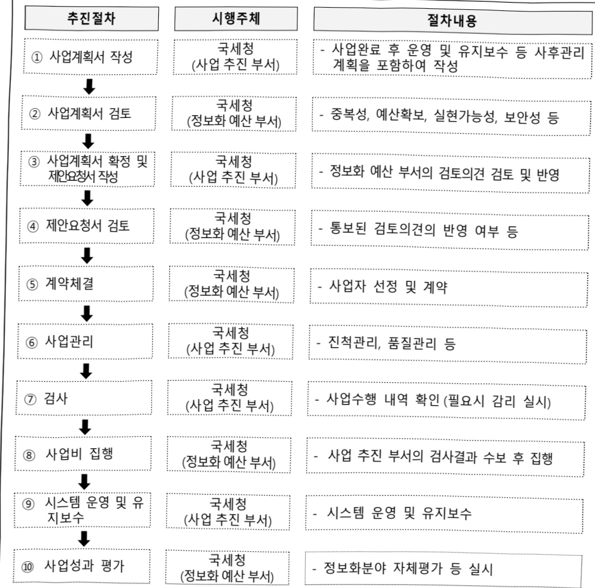

# 국세행정지원시스템 운영(정보화)

**해당 페이지**: PDF 2061 ~ 2075 쪽 해당

**부처**: 국세청
**분야**: 일반·지방행정
**회계유형**: 일반회계
**2026 확정예산**: 53930.0 백만원
**전년대비 증감률**: 9.0%
**AI 도메인**: 보안/사이버, 통신/네트워크

---

<table border=1 style='margin: auto; word-wrap: break-word;'><tr><td style='text-align: center; word-wrap: break-word;'>사 업 명</td></tr><tr><td style='text-align: center; word-wrap: break-word;'>(64) 국세행정지원시스템 운영(정보화) (7133-500)</td></tr></table>

□ 사업 코드 정보

<table border=1 style='margin: auto; word-wrap: break-word;'><tr><td style='text-align: center; word-wrap: break-word;'>구분</td><td style='text-align: center; word-wrap: break-word;'>회계</td><td style='text-align: center; word-wrap: break-word;'>소관</td><td style='text-align: center; word-wrap: break-word;'>실국(기관)</td><td style='text-align: center; word-wrap: break-word;'>계정</td><td style='text-align: center; word-wrap: break-word;'>분야</td><td style='text-align: center; word-wrap: break-word;'>부문</td></tr><tr><td style='text-align: center; word-wrap: break-word;'>코드</td><td rowspan="2">일반회계</td><td rowspan="2">국세청</td><td rowspan="2">정보화관리관실</td><td rowspan="2"></td><td style='text-align: center; word-wrap: break-word;'>010</td><td style='text-align: center; word-wrap: break-word;'>014</td></tr><tr><td style='text-align: center; word-wrap: break-word;'>명칭</td><td style='text-align: center; word-wrap: break-word;'>일반·지방행정</td><td style='text-align: center; word-wrap: break-word;'>재정·금융</td></tr></table>

<table border=1 style='margin: auto; word-wrap: break-word;'><tr><td style='text-align: center; word-wrap: break-word;'>구분</td><td style='text-align: center; word-wrap: break-word;'>프로그램</td><td style='text-align: center; word-wrap: break-word;'>단위사업</td><td style='text-align: center; word-wrap: break-word;'>세부사업</td></tr><tr><td style='text-align: center; word-wrap: break-word;'>코드</td><td style='text-align: center; word-wrap: break-word;'>7100</td><td style='text-align: center; word-wrap: break-word;'>7133</td><td style='text-align: center; word-wrap: break-word;'>500</td></tr><tr><td style='text-align: center; word-wrap: break-word;'>명칭</td><td style='text-align: center; word-wrap: break-word;'>국세행정지원</td><td style='text-align: center; word-wrap: break-word;'>국세행정 전산화(정보화)</td><td style='text-align: center; word-wrap: break-word;'>국세행정지원시스템 운영(정보화)</td></tr></table>

사업 성격 (공통요구자료 1-1 작성유의사항 4. 참조, 해당하는 사항에 “0” 표시)

<table border=1 style='margin: auto; word-wrap: break-word;'><tr><td style='text-align: center; word-wrap: break-word;'>신규</td><td style='text-align: center; word-wrap: break-word;'>계속</td><td style='text-align: center; word-wrap: break-word;'>완료</td><td style='text-align: center; word-wrap: break-word;'>예비타당성 실시여부</td><td style='text-align: center; word-wrap: break-word;'>총사업비 관리대상</td><td style='text-align: center; word-wrap: break-word;'>총액계상 예산사업</td><td style='text-align: center; word-wrap: break-word;'>사업소관 변경정보 2025예산 시 소관</td></tr><tr><td style='text-align: center; word-wrap: break-word;'></td><td style='text-align: center; word-wrap: break-word;'></td><td style='text-align: center; word-wrap: break-word;'></td><td style='text-align: center; word-wrap: break-word;'></td><td style='text-align: center; word-wrap: break-word;'></td><td style='text-align: center; word-wrap: break-word;'></td><td style='text-align: center; word-wrap: break-word;'></td></tr></table>

사업 지원 형태 및 지원을 (최소한 한 개는 반드시 선택하시오. 해당사항에 0 표시)

<table border=1 style='margin: auto; word-wrap: break-word;'><tr><td style='text-align: center; word-wrap: break-word;'>직접</td><td style='text-align: center; word-wrap: break-word;'>출자</td><td style='text-align: center; word-wrap: break-word;'>출연</td><td style='text-align: center; word-wrap: break-word;'>보조</td><td style='text-align: center; word-wrap: break-word;'>융자</td><td style='text-align: center; word-wrap: break-word;'>국고보조율(%)</td><td style='text-align: center; word-wrap: break-word;'>융자율(%)</td></tr><tr><td style='text-align: center; word-wrap: break-word;'>○</td><td style='text-align: center; word-wrap: break-word;'></td><td style='text-align: center; word-wrap: break-word;'></td><td style='text-align: center; word-wrap: break-word;'></td><td style='text-align: center; word-wrap: break-word;'></td><td style='text-align: center; word-wrap: break-word;'></td><td style='text-align: center; word-wrap: break-word;'></td></tr></table>

## □ 사업 소관부처 및 시행주체

<table border=1 style='margin: auto; word-wrap: break-word;'><tr><td style='text-align: center; word-wrap: break-word;'>사업명</td><td colspan="2">구분</td></tr><tr><td rowspan="4">국세행정지원 시스템운영 (정보화)</td><td rowspan="3">소관부처</td><td style='text-align: center; word-wrap: break-word;'>실·국·과(팀)</td></tr><tr><td style='text-align: center; word-wrap: break-word;'>정보화관리관실</td></tr><tr><td style='text-align: center; word-wrap: break-word;'>정보화기획담당관실</td></tr><tr><td style='text-align: center; word-wrap: break-word;'>사업시행주체</td><td style='text-align: center; word-wrap: break-word;'>국세청</td></tr><tr><td rowspan="4">국세상담 시스템 운영</td><td rowspan="3">소관부처</td><td style='text-align: center; word-wrap: break-word;'>실·국·과(팀)</td></tr><tr><td style='text-align: center; word-wrap: break-word;'>국세상담센터</td></tr><tr><td style='text-align: center; word-wrap: break-word;'>업무지원팀</td></tr><tr><td style='text-align: center; word-wrap: break-word;'>사업시행주체</td><td style='text-align: center; word-wrap: break-word;'>국세청</td></tr><tr><td rowspan="4">사이버교육 시스템 운영</td><td rowspan="3">소관부처</td><td style='text-align: center; word-wrap: break-word;'>실·국·과(팀)</td></tr><tr><td style='text-align: center; word-wrap: break-word;'>국세공무원교육원</td></tr><tr><td style='text-align: center; word-wrap: break-word;'>교육운영과</td></tr><tr><td style='text-align: center; word-wrap: break-word;'>사업시행주체</td><td style='text-align: center; word-wrap: break-word;'>국세청</td></tr></table>

---

<table border=1 style='margin: auto; word-wrap: break-word;'><tr><td rowspan="4">e-민원 시스템 운영</td><td rowspan="3">소관부처</td><td style='text-align: center; word-wrap: break-word;'>실·국·과(팀)</td></tr><tr><td style='text-align: center; word-wrap: break-word;'>서울청 성실납세</td></tr><tr><td style='text-align: center; word-wrap: break-word;'>정보화관리팀</td></tr><tr><td style='text-align: center; word-wrap: break-word;'>사업시행주체</td><td style='text-align: center; word-wrap: break-word;'>국세청</td></tr><tr><td rowspan="4">세무정보안내 공공요금</td><td rowspan="3">소관부처</td><td style='text-align: center; word-wrap: break-word;'>실·국·과(팀)</td></tr><tr><td style='text-align: center; word-wrap: break-word;'>정보화관리관실</td></tr><tr><td style='text-align: center; word-wrap: break-word;'>정보화운영담당관실</td></tr><tr><td style='text-align: center; word-wrap: break-word;'>사업시행주체</td><td style='text-align: center; word-wrap: break-word;'>국세청</td></tr><tr><td rowspan="4">해외금융정보교환분석 시스템 운영</td><td rowspan="3">소관부처</td><td style='text-align: center; word-wrap: break-word;'>실·국·과(팀)</td></tr><tr><td style='text-align: center; word-wrap: break-word;'>국제조세관리관실</td></tr><tr><td style='text-align: center; word-wrap: break-word;'>역외정보담당관실</td></tr><tr><td style='text-align: center; word-wrap: break-word;'>사업시행주체</td><td style='text-align: center; word-wrap: break-word;'>국세청</td></tr><tr><td rowspan="4">국제거래 통합분석 시스템 운영</td><td rowspan="3">소관부처</td><td style='text-align: center; word-wrap: break-word;'>실·국·과(팀)</td></tr><tr><td style='text-align: center; word-wrap: break-word;'>국제조세관리관실</td></tr><tr><td style='text-align: center; word-wrap: break-word;'>국제세원담당관실</td></tr><tr><td style='text-align: center; word-wrap: break-word;'>사업시행주체</td><td style='text-align: center; word-wrap: break-word;'>국세청</td></tr><tr><td rowspan="4">자료관리 시스템 운영</td><td rowspan="3">소관부처</td><td style='text-align: center; word-wrap: break-word;'>실·국·과(팀)</td></tr><tr><td style='text-align: center; word-wrap: break-word;'>조사국</td></tr><tr><td style='text-align: center; word-wrap: break-word;'>세원정보과</td></tr><tr><td style='text-align: center; word-wrap: break-word;'>사업시행주체</td><td style='text-align: center; word-wrap: break-word;'>국세청</td></tr><tr><td rowspan="4">주류유통정보 시스템 운영</td><td rowspan="3">소관부처</td><td style='text-align: center; word-wrap: break-word;'>실·국·과(팀)</td></tr><tr><td style='text-align: center; word-wrap: break-word;'>법인납세국</td></tr><tr><td style='text-align: center; word-wrap: break-word;'>소비세과</td></tr><tr><td style='text-align: center; word-wrap: break-word;'>사업시행주체</td><td style='text-align: center; word-wrap: break-word;'>국세청</td></tr><tr><td rowspan="4">포렌식 장비 운영</td><td rowspan="3">소관부처</td><td style='text-align: center; word-wrap: break-word;'>실·국·과(팀)</td></tr><tr><td style='text-align: center; word-wrap: break-word;'>조사국</td></tr><tr><td style='text-align: center; word-wrap: break-word;'>과학조사담당관실</td></tr><tr><td style='text-align: center; word-wrap: break-word;'>사업시행주체</td><td style='text-align: center; word-wrap: break-word;'>국세청</td></tr><tr><td rowspan="4">정보보안 시스템 운영</td><td rowspan="3">소관부처</td><td style='text-align: center; word-wrap: break-word;'>실·국·과(팀)</td></tr><tr><td style='text-align: center; word-wrap: break-word;'>정보화관리관실</td></tr><tr><td style='text-align: center; word-wrap: break-word;'>정보보호담당관실</td></tr><tr><td style='text-align: center; word-wrap: break-word;'>사업시행주체</td><td style='text-align: center; word-wrap: break-word;'>국세청</td></tr><tr><td rowspan="4">업무용 전산장비 도입</td><td rowspan="3">소관부처</td><td style='text-align: center; word-wrap: break-word;'>실·국·과(팀)</td></tr><tr><td style='text-align: center; word-wrap: break-word;'>서울청 성실납세</td></tr><tr><td style='text-align: center; word-wrap: break-word;'>정보화관리팀</td></tr><tr><td style='text-align: center; word-wrap: break-word;'>사업시행주체</td><td style='text-align: center; word-wrap: break-word;'>국세청</td></tr><tr><td rowspan="4">네트워크 통합 운영</td><td rowspan="3">소관부처</td><td style='text-align: center; word-wrap: break-word;'>실·국·과(팀)</td></tr><tr><td style='text-align: center; word-wrap: break-word;'>정보화관리관실</td></tr><tr><td style='text-align: center; word-wrap: break-word;'>정보보호담당관실</td></tr><tr><td style='text-align: center; word-wrap: break-word;'>사업시행주체</td><td style='text-align: center; word-wrap: break-word;'>국세청</td></tr></table>

---

<table border=1 style='margin: auto; word-wrap: break-word;'><tr><td rowspan="4">감사정보 시스템 운영</td><td rowspan="3">소관부처</td><td style='text-align: center; word-wrap: break-word;'>실·국·과(팀)</td></tr><tr><td style='text-align: center; word-wrap: break-word;'>감사관실</td></tr><tr><td style='text-align: center; word-wrap: break-word;'>감사담당관실</td></tr><tr><td style='text-align: center; word-wrap: break-word;'>사업시행주체</td><td style='text-align: center; word-wrap: break-word;'>국세청</td></tr><tr><td rowspan="4">국세청 홈페이지 운영</td><td rowspan="3">소관부처</td><td style='text-align: center; word-wrap: break-word;'>실·국·과(팀)</td></tr><tr><td style='text-align: center; word-wrap: break-word;'>대전청 성실납세지원국</td></tr><tr><td style='text-align: center; word-wrap: break-word;'>개발지원2팀</td></tr><tr><td style='text-align: center; word-wrap: break-word;'>사업시행주체</td><td style='text-align: center; word-wrap: break-word;'>국세청</td></tr><tr><td rowspan="4">국세법령정보 시스템 운영</td><td rowspan="3">소관부처</td><td style='text-align: center; word-wrap: break-word;'>실·국·과(팀)</td></tr><tr><td style='text-align: center; word-wrap: break-word;'>대전청 성실납세지원국</td></tr><tr><td style='text-align: center; word-wrap: break-word;'>개발지원2팀</td></tr><tr><td style='text-align: center; word-wrap: break-word;'>사업시행주체</td><td style='text-align: center; word-wrap: break-word;'>국세청</td></tr><tr><td rowspan="4">지식관리 시스템 운영</td><td rowspan="3">소관부처</td><td style='text-align: center; word-wrap: break-word;'>실·국·과(팀)</td></tr><tr><td style='text-align: center; word-wrap: break-word;'>대전청 성실납세</td></tr><tr><td style='text-align: center; word-wrap: break-word;'>개발지원2팀</td></tr><tr><td style='text-align: center; word-wrap: break-word;'>사업시행주체</td><td style='text-align: center; word-wrap: break-word;'>국세청</td></tr><tr><td rowspan="4">정보화센터 운영</td><td rowspan="3">소관부처</td><td style='text-align: center; word-wrap: break-word;'>실·국·과(팀)</td></tr><tr><td style='text-align: center; word-wrap: break-word;'>서울청 성실납세지원국</td></tr><tr><td style='text-align: center; word-wrap: break-word;'>정보화관리팀</td></tr><tr><td style='text-align: center; word-wrap: break-word;'>사업시행주체</td><td style='text-align: center; word-wrap: break-word;'>국세청</td></tr><tr><td rowspan="4">우편물 자동화 시스템 운영</td><td rowspan="3">소관부처</td><td style='text-align: center; word-wrap: break-word;'>실·국·과(팀)</td></tr><tr><td style='text-align: center; word-wrap: break-word;'>서울청 성실납세</td></tr><tr><td style='text-align: center; word-wrap: break-word;'>정보화관리팀</td></tr><tr><td style='text-align: center; word-wrap: break-word;'>사업시행주체</td><td style='text-align: center; word-wrap: break-word;'>국세청</td></tr><tr><td rowspan="4">정보화 업무 지원</td><td rowspan="3">소관부처</td><td style='text-align: center; word-wrap: break-word;'>실·국·과(팀)</td></tr><tr><td style='text-align: center; word-wrap: break-word;'>정보화관리관실</td></tr><tr><td style='text-align: center; word-wrap: break-word;'>정보화기획담당관실</td></tr><tr><td style='text-align: center; word-wrap: break-word;'>사업시행주체</td><td style='text-align: center; word-wrap: break-word;'>국세청</td></tr><tr><td rowspan="4">가상자산 통합 분석시스템</td><td rowspan="3">소관부처</td><td style='text-align: center; word-wrap: break-word;'>실·국·과(팀)</td></tr><tr><td style='text-align: center; word-wrap: break-word;'>조사국</td></tr><tr><td style='text-align: center; word-wrap: break-word;'>과학조사담당관실</td></tr><tr><td style='text-align: center; word-wrap: break-word;'>사업시행주체</td><td style='text-align: center; word-wrap: break-word;'>국세청</td></tr><tr><td rowspan="4">온나라 시스템 운영</td><td rowspan="3">소관부처</td><td style='text-align: center; word-wrap: break-word;'>실·국·과(팀)</td></tr><tr><td style='text-align: center; word-wrap: break-word;'>대전청 성실납세지원국</td></tr><tr><td style='text-align: center; word-wrap: break-word;'>개발지원2팀</td></tr><tr><td style='text-align: center; word-wrap: break-word;'>사업시행주체</td><td style='text-align: center; word-wrap: break-word;'>국세청</td></tr><tr><td rowspan="4">AI 전화상담 운영</td><td rowspan="3">소관부처</td><td style='text-align: center; word-wrap: break-word;'>실·국·과(팀)</td></tr><tr><td style='text-align: center; word-wrap: break-word;'>정보화관리관실</td></tr><tr><td style='text-align: center; word-wrap: break-word;'>인공지능세정혁신</td></tr><tr><td style='text-align: center; word-wrap: break-word;'>사업시행주체</td><td style='text-align: center; word-wrap: break-word;'>국세청</td></tr></table>

---

### 가. 예산 총괄표

(단위: 백만원, %)

<table border=1 style='margin: auto; word-wrap: break-word;'><tr><td rowspan="2">사업명</td><td rowspan="2">2024년 결산</td><td colspan="2">2025년 예산</td><td colspan="2">2026년</td><td rowspan="2">증감 (B-A)</td><td rowspan="2">(B-A)/A</td></tr><tr><td style='text-align: center; word-wrap: break-word;'>본예산</td><td style='text-align: center; word-wrap: break-word;'>추경(A)</td><td style='text-align: center; word-wrap: break-word;'>요구안</td><td style='text-align: center; word-wrap: break-word;'>본예산(B)</td></tr><tr><td style='text-align: center; word-wrap: break-word;'>국세행정지원 시스템운영(정보화)</td><td style='text-align: center; word-wrap: break-word;'>46,350</td><td style='text-align: center; word-wrap: break-word;'>49,461</td><td style='text-align: center; word-wrap: break-word;'>49,461</td><td style='text-align: center; word-wrap: break-word;'>53,930</td><td style='text-align: center; word-wrap: break-word;'>53,930</td><td style='text-align: center; word-wrap: break-word;'>4,469</td><td style='text-align: center; word-wrap: break-word;'>9.0</td></tr></table>

□ 기능별(내역사업별) 예산 내역

(단위:백만원)

<table border=1 style='margin: auto; word-wrap: break-word;'><tr><td rowspan="2"></td><td colspan="5">2024</td><td colspan="5">2025</td><td rowspan="2">2026예산</td></tr><tr><td style='text-align: center; word-wrap: break-word;'>예산액(추정)</td><td style='text-align: center; word-wrap: break-word;'>예산현액</td><td style='text-align: center; word-wrap: break-word;'>집행액</td><td style='text-align: center; word-wrap: break-word;'>이월액</td><td style='text-align: center; word-wrap: break-word;'>불용액</td><td style='text-align: center; word-wrap: break-word;'>예산액(추정)</td><td style='text-align: center; word-wrap: break-word;'>예산현액</td><td style='text-align: center; word-wrap: break-word;'>집행액</td><td style='text-align: center; word-wrap: break-word;'>이월액</td><td style='text-align: center; word-wrap: break-word;'>불용액</td></tr><tr><td style='text-align: center; word-wrap: break-word;'>○ 기능별 분류(함께)</td><td style='text-align: center; word-wrap: break-word;'>48,143</td><td style='text-align: center; word-wrap: break-word;'>48,143</td><td style='text-align: center; word-wrap: break-word;'>46,350</td><td style='text-align: center; word-wrap: break-word;'>-</td><td style='text-align: center; word-wrap: break-word;'>1,793</td><td style='text-align: center; word-wrap: break-word;'>49,461</td><td style='text-align: center; word-wrap: break-word;'>49,584</td><td style='text-align: center; word-wrap: break-word;'>48,768</td><td style='text-align: center; word-wrap: break-word;'>-</td><td style='text-align: center; word-wrap: break-word;'>816</td><td style='text-align: center; word-wrap: break-word;'>53,930</td></tr><tr><td style='text-align: center; word-wrap: break-word;'>· 국세상담시스템 운영</td><td style='text-align: center; word-wrap: break-word;'>2,054</td><td style='text-align: center; word-wrap: break-word;'>2,045</td><td style='text-align: center; word-wrap: break-word;'>2,045</td><td style='text-align: center; word-wrap: break-word;'>-</td><td style='text-align: center; word-wrap: break-word;'>-</td><td style='text-align: center; word-wrap: break-word;'>2,158</td><td style='text-align: center; word-wrap: break-word;'>2,158</td><td style='text-align: center; word-wrap: break-word;'>2,141</td><td style='text-align: center; word-wrap: break-word;'>-</td><td style='text-align: center; word-wrap: break-word;'>17</td><td style='text-align: center; word-wrap: break-word;'>1,999</td></tr><tr><td style='text-align: center; word-wrap: break-word;'>· 사이버교육시스템 운영</td><td style='text-align: center; word-wrap: break-word;'>378</td><td style='text-align: center; word-wrap: break-word;'>375</td><td style='text-align: center; word-wrap: break-word;'>329</td><td style='text-align: center; word-wrap: break-word;'>-</td><td style='text-align: center; word-wrap: break-word;'>46</td><td style='text-align: center; word-wrap: break-word;'>373</td><td style='text-align: center; word-wrap: break-word;'>373</td><td style='text-align: center; word-wrap: break-word;'>332</td><td style='text-align: center; word-wrap: break-word;'>-</td><td style='text-align: center; word-wrap: break-word;'>41</td><td style='text-align: center; word-wrap: break-word;'>373</td></tr><tr><td style='text-align: center; word-wrap: break-word;'>· e·민원시스템 운영</td><td style='text-align: center; word-wrap: break-word;'>2,373</td><td style='text-align: center; word-wrap: break-word;'>2,373</td><td style='text-align: center; word-wrap: break-word;'>2,313</td><td style='text-align: center; word-wrap: break-word;'>-</td><td style='text-align: center; word-wrap: break-word;'>60</td><td style='text-align: center; word-wrap: break-word;'>2,413</td><td style='text-align: center; word-wrap: break-word;'>2,413</td><td style='text-align: center; word-wrap: break-word;'>2,396</td><td style='text-align: center; word-wrap: break-word;'>-</td><td style='text-align: center; word-wrap: break-word;'>17</td><td style='text-align: center; word-wrap: break-word;'>2,484</td></tr><tr><td style='text-align: center; word-wrap: break-word;'>· 세무정보안내 공공요금</td><td style='text-align: center; word-wrap: break-word;'>1,353</td><td style='text-align: center; word-wrap: break-word;'>1,353</td><td style='text-align: center; word-wrap: break-word;'>1,353</td><td style='text-align: center; word-wrap: break-word;'>-</td><td style='text-align: center; word-wrap: break-word;'>-</td><td style='text-align: center; word-wrap: break-word;'>1,353</td><td style='text-align: center; word-wrap: break-word;'>1,353</td><td style='text-align: center; word-wrap: break-word;'>1,344</td><td style='text-align: center; word-wrap: break-word;'>-</td><td style='text-align: center; word-wrap: break-word;'>9</td><td style='text-align: center; word-wrap: break-word;'>1,353</td></tr><tr><td style='text-align: center; word-wrap: break-word;'>· 해외금융정보 교환분석시스템</td><td style='text-align: center; word-wrap: break-word;'>1,099</td><td style='text-align: center; word-wrap: break-word;'>1,099</td><td style='text-align: center; word-wrap: break-word;'>1,086</td><td style='text-align: center; word-wrap: break-word;'>-</td><td style='text-align: center; word-wrap: break-word;'>13</td><td style='text-align: center; word-wrap: break-word;'>704</td><td style='text-align: center; word-wrap: break-word;'>704</td><td style='text-align: center; word-wrap: break-word;'>691</td><td style='text-align: center; word-wrap: break-word;'>-</td><td style='text-align: center; word-wrap: break-word;'>13</td><td style='text-align: center; word-wrap: break-word;'>1,106</td></tr><tr><td style='text-align: center; word-wrap: break-word;'>· 국제거래통합분석시스템</td><td style='text-align: center; word-wrap: break-word;'>983</td><td style='text-align: center; word-wrap: break-word;'>979</td><td style='text-align: center; word-wrap: break-word;'>964</td><td style='text-align: center; word-wrap: break-word;'>-</td><td style='text-align: center; word-wrap: break-word;'>15</td><td style='text-align: center; word-wrap: break-word;'>933</td><td style='text-align: center; word-wrap: break-word;'>933</td><td style='text-align: center; word-wrap: break-word;'>923</td><td style='text-align: center; word-wrap: break-word;'>-</td><td style='text-align: center; word-wrap: break-word;'>10</td><td style='text-align: center; word-wrap: break-word;'>813</td></tr><tr><td style='text-align: center; word-wrap: break-word;'>· 자료관리시스템 운영</td><td style='text-align: center; word-wrap: break-word;'>304</td><td style='text-align: center; word-wrap: break-word;'>301</td><td style='text-align: center; word-wrap: break-word;'>286</td><td style='text-align: center; word-wrap: break-word;'>-</td><td style='text-align: center; word-wrap: break-word;'>15</td><td style='text-align: center; word-wrap: break-word;'>304</td><td style='text-align: center; word-wrap: break-word;'>304</td><td style='text-align: center; word-wrap: break-word;'>292</td><td style='text-align: center; word-wrap: break-word;'>-</td><td style='text-align: center; word-wrap: break-word;'>12</td><td style='text-align: center; word-wrap: break-word;'>304</td></tr><tr><td style='text-align: center; word-wrap: break-word;'>· 주류유통정보시스템 운영</td><td style='text-align: center; word-wrap: break-word;'>106</td><td style='text-align: center; word-wrap: break-word;'>105</td><td style='text-align: center; word-wrap: break-word;'>101</td><td style='text-align: center; word-wrap: break-word;'>-</td><td style='text-align: center; word-wrap: break-word;'>4</td><td style='text-align: center; word-wrap: break-word;'>107</td><td style='text-align: center; word-wrap: break-word;'>107</td><td style='text-align: center; word-wrap: break-word;'>103</td><td style='text-align: center; word-wrap: break-word;'>-</td><td style='text-align: center; word-wrap: break-word;'>4</td><td style='text-align: center; word-wrap: break-word;'>106</td></tr><tr><td style='text-align: center; word-wrap: break-word;'>· 포렌식 장비 운영</td><td style='text-align: center; word-wrap: break-word;'>3,373</td><td style='text-align: center; word-wrap: break-word;'>3,373</td><td style='text-align: center; word-wrap: break-word;'>3,353</td><td style='text-align: center; word-wrap: break-word;'>-</td><td style='text-align: center; word-wrap: break-word;'>20</td><td style='text-align: center; word-wrap: break-word;'>3,179</td><td style='text-align: center; word-wrap: break-word;'>3,179</td><td style='text-align: center; word-wrap: break-word;'>3,162</td><td style='text-align: center; word-wrap: break-word;'>-</td><td style='text-align: center; word-wrap: break-word;'>17</td><td style='text-align: center; word-wrap: break-word;'>3,168</td></tr><tr><td style='text-align: center; word-wrap: break-word;'>· 정보보안시스템 운영</td><td style='text-align: center; word-wrap: break-word;'>3,990</td><td style='text-align: center; word-wrap: break-word;'>3,990</td><td style='text-align: center; word-wrap: break-word;'>3,959</td><td style='text-align: center; word-wrap: break-word;'>-</td><td style='text-align: center; word-wrap: break-word;'>31</td><td style='text-align: center; word-wrap: break-word;'>4,162</td><td style='text-align: center; word-wrap: break-word;'>4,162</td><td style='text-align: center; word-wrap: break-word;'>4,083</td><td style='text-align: center; word-wrap: break-word;'>-</td><td style='text-align: center; word-wrap: break-word;'>78</td><td style='text-align: center; word-wrap: break-word;'>4,094</td></tr><tr><td style='text-align: center; word-wrap: break-word;'>· 업무용 전산정비 도입</td><td style='text-align: center; word-wrap: break-word;'>11,303</td><td style='text-align: center; word-wrap: break-word;'>11,303</td><td style='text-align: center; word-wrap: break-word;'>11,029</td><td style='text-align: center; word-wrap: break-word;'>-</td><td style='text-align: center; word-wrap: break-word;'>274</td><td style='text-align: center; word-wrap: break-word;'>13,552</td><td style='text-align: center; word-wrap: break-word;'>13,552</td><td style='text-align: center; word-wrap: break-word;'>13,232</td><td style='text-align: center; word-wrap: break-word;'>-</td><td style='text-align: center; word-wrap: break-word;'>320</td><td style='text-align: center; word-wrap: break-word;'>15,132</td></tr><tr><td style='text-align: center; word-wrap: break-word;'>· 네트워크 통합 운영</td><td style='text-align: center; word-wrap: break-word;'>12,770</td><td style='text-align: center; word-wrap: break-word;'>12,770</td><td style='text-align: center; word-wrap: break-word;'>12,123</td><td style='text-align: center; word-wrap: break-word;'>-</td><td style='text-align: center; word-wrap: break-word;'>647</td><td style='text-align: center; word-wrap: break-word;'>12,345</td><td style='text-align: center; word-wrap: break-word;'>12,067</td><td style='text-align: center; word-wrap: break-word;'>12,027</td><td style='text-align: center; word-wrap: break-word;'>-</td><td style='text-align: center; word-wrap: break-word;'>41</td><td style='text-align: center; word-wrap: break-word;'>12,188</td></tr><tr><td style='text-align: center; word-wrap: break-word;'>· 감사정보시스템 운영</td><td style='text-align: center; word-wrap: break-word;'>233</td><td style='text-align: center; word-wrap: break-word;'>231</td><td style='text-align: center; word-wrap: break-word;'>227</td><td style='text-align: center; word-wrap: break-word;'>-</td><td style='text-align: center; word-wrap: break-word;'>4</td><td style='text-align: center; word-wrap: break-word;'>211</td><td style='text-align: center; word-wrap: break-word;'>211</td><td style='text-align: center; word-wrap: break-word;'>194</td><td style='text-align: center; word-wrap: break-word;'>-</td><td style='text-align: center; word-wrap: break-word;'>17</td><td style='text-align: center; word-wrap: break-word;'>211</td></tr><tr><td style='text-align: center; word-wrap: break-word;'>· 국세청 홈페이지 운영</td><td style='text-align: center; word-wrap: break-word;'>570</td><td style='text-align: center; word-wrap: break-word;'>570</td><td style='text-align: center; word-wrap: break-word;'>561</td><td style='text-align: center; word-wrap: break-word;'>-</td><td style='text-align: center; word-wrap: break-word;'>9</td><td style='text-align: center; word-wrap: break-word;'>570</td><td style='text-align: center; word-wrap: break-word;'>570</td><td style='text-align: center; word-wrap: break-word;'>562</td><td style='text-align: center; word-wrap: break-word;'>-</td><td style='text-align: center; word-wrap: break-word;'>8</td><td style='text-align: center; word-wrap: break-word;'>480</td></tr><tr><td style='text-align: center; word-wrap: break-word;'>· 국세법령정보시스템 운영</td><td style='text-align: center; word-wrap: break-word;'>188</td><td style='text-align: center; word-wrap: break-word;'>188</td><td style='text-align: center; word-wrap: break-word;'>184</td><td style='text-align: center; word-wrap: break-word;'>-</td><td style='text-align: center; word-wrap: break-word;'>4</td><td style='text-align: center; word-wrap: break-word;'>573</td><td style='text-align: center; word-wrap: break-word;'>573</td><td style='text-align: center; word-wrap: break-word;'>568</td><td style='text-align: center; word-wrap: break-word;'>-</td><td style='text-align: center; word-wrap: break-word;'>5</td><td style='text-align: center; word-wrap: break-word;'>568</td></tr><tr><td style='text-align: center; word-wrap: break-word;'>· 지식관리시스템 운영</td><td style='text-align: center; word-wrap: break-word;'>158</td><td style='text-align: center; word-wrap: break-word;'>157</td><td style='text-align: center; word-wrap: break-word;'>138</td><td style='text-align: center; word-wrap: break-word;'>-</td><td style='text-align: center; word-wrap: break-word;'>19</td><td style='text-align: center; word-wrap: break-word;'>143</td><td style='text-align: center; word-wrap: break-word;'>143</td><td style='text-align: center; word-wrap: break-word;'>142</td><td style='text-align: center; word-wrap: break-word;'>-</td><td style='text-align: center; word-wrap: break-word;'>2</td><td style='text-align: center; word-wrap: break-word;'>143</td></tr><tr><td style='text-align: center; word-wrap: break-word;'>· 정보화센터 운영</td><td style='text-align: center; word-wrap: break-word;'>3,186</td><td style='text-align: center; word-wrap: break-word;'>3,186</td><td style='text-align: center; word-wrap: break-word;'>2,705</td><td style='text-align: center; word-wrap: break-word;'>-</td><td style='text-align: center; word-wrap: break-word;'>481</td><td style='text-align: center; word-wrap: break-word;'>2,478</td><td style='text-align: center; word-wrap: break-word;'>2,478</td><td style='text-align: center; word-wrap: break-word;'>2,453</td><td style='text-align: center; word-wrap: break-word;'>-</td><td style='text-align: center; word-wrap: break-word;'>26</td><td style='text-align: center; word-wrap: break-word;'>2,338</td></tr><tr><td style='text-align: center; word-wrap: break-word;'>· 우편물자동화시스템 운영</td><td style='text-align: center; word-wrap: break-word;'>2,144</td><td style='text-align: center; word-wrap: break-word;'>2,144</td><td style='text-align: center; word-wrap: break-word;'>2,106</td><td style='text-align: center; word-wrap: break-word;'>-</td><td style='text-align: center; word-wrap: break-word;'>38</td><td style='text-align: center; word-wrap: break-word;'>2,543</td><td style='text-align: center; word-wrap: break-word;'>2,543</td><td style='text-align: center; word-wrap: break-word;'>2,496</td><td style='text-align: center; word-wrap: break-word;'>-</td><td style='text-align: center; word-wrap: break-word;'>47</td><td style='text-align: center; word-wrap: break-word;'>2,242</td></tr><tr><td style='text-align: center; word-wrap: break-word;'>· 정보화 업무 지원</td><td style='text-align: center; word-wrap: break-word;'>1,030</td><td style='text-align: center; word-wrap: break-word;'>1,054</td><td style='text-align: center; word-wrap: break-word;'>958</td><td style='text-align: center; word-wrap: break-word;'>-</td><td style='text-align: center; word-wrap: break-word;'>95</td><td style='text-align: center; word-wrap: break-word;'>1,022</td><td style='text-align: center; word-wrap: break-word;'>1,022</td><td style='text-align: center; word-wrap: break-word;'>889</td><td style='text-align: center; word-wrap: break-word;'>-</td><td style='text-align: center; word-wrap: break-word;'>133</td><td style='text-align: center; word-wrap: break-word;'>1,022</td></tr><tr><td style='text-align: center; word-wrap: break-word;'>· 가상산 통합분석시스템</td><td style='text-align: center; word-wrap: break-word;'>347</td><td style='text-align: center; word-wrap: break-word;'>347</td><td style='text-align: center; word-wrap: break-word;'>331</td><td style='text-align: center; word-wrap: break-word;'>-</td><td style='text-align: center; word-wrap: break-word;'>15</td><td style='text-align: center; word-wrap: break-word;'>148</td><td style='text-align: center; word-wrap: break-word;'>148</td><td style='text-align: center; word-wrap: break-word;'>148</td><td style='text-align: center; word-wrap: break-word;'>-</td><td style='text-align: center; word-wrap: break-word;'>-</td><td style='text-align: center; word-wrap: break-word;'>2,600</td></tr><tr><td style='text-align: center; word-wrap: break-word;'>· 온나라 시스템 운영</td><td style='text-align: center; word-wrap: break-word;'>201</td><td style='text-align: center; word-wrap: break-word;'>201</td><td style='text-align: center; word-wrap: break-word;'>201</td><td style='text-align: center; word-wrap: break-word;'>-</td><td style='text-align: center; word-wrap: break-word;'>-</td><td style='text-align: center; word-wrap: break-word;'>191</td><td style='text-align: center; word-wrap: break-word;'>201</td><td style='text-align: center; word-wrap: break-word;'>201</td><td style='text-align: center; word-wrap: break-word;'>-</td><td style='text-align: center; word-wrap: break-word;'>-</td><td style='text-align: center; word-wrap: break-word;'>191</td></tr><tr><td style='text-align: center; word-wrap: break-word;'>· AI 전화상담 운영</td><td style='text-align: center; word-wrap: break-word;'>-</td><td style='text-align: center; word-wrap: break-word;'>-</td><td style='text-align: center; word-wrap: break-word;'>-</td><td style='text-align: center; word-wrap: break-word;'>-</td><td style='text-align: center; word-wrap: break-word;'>-</td><td style='text-align: center; word-wrap: break-word;'>-</td><td style='text-align: center; word-wrap: break-word;'>391</td><td style='text-align: center; word-wrap: break-word;'>91</td><td style='text-align: center; word-wrap: break-word;'>-</td><td style='text-align: center; word-wrap: break-word;'>-</td><td style='text-align: center; word-wrap: break-word;'>1,015</td></tr></table>

---

### 나. 사업설명자료

## 1 ) 사업목적·내용

○ (국세행정지원시스템 운영(정보화)) 국세상담, e-민원 등 대민서비스와 각종 세원관리 시스템을 안정적으로 운영·관리하고, 업무용 전산장비 도입, 우편물자동화센터, 정보화센터, 국세통신망 유지·관리 등 국세행정 정보화 지원

## ○ 내역사업별 설명

- (국세상담시스템 운영) 납세자에게 안정적인 상담서비스를 제공하기 위한 시스템 운영·관리

- (사이버교육시스템 운영) 내부직원의 직무능력 향상을 위한 온라인 교육시스템의

운영·유지보수 및 온라인 강의 콘텐츠의 제작 및 관리

- (e-민원시스템 운영) 민원인이 내방시간과 세무서를 선택할 수 있도록 전국 세무서의

민원실 대기인원과 예상대기시간을 실시간으로 조회할 수 있는 서비스를 홈택스와

모바일홈택스를 통해 제공하고, 민원인이 직원의 도움없이 전자적으로 민원신청서를

작성하여 대기시간과 처리시간을 단축할 수 있도록 지원하는 시스템

- (세무정보안내 공공요금) 영세 사업자와 근로자 등 납세자를 대상으로 각종 세무정보의 신속·정확한 전달과 다양한 근로장려금 신청 방법 제공, 소득세 및 부가세 ARS 신고 서비스를 제공하는데 소요되는 예산의 지원

- (해외금융정보교환분석시스템 운영) 국가간 금융정보 및 금융보고서의 자동교환

협정에 따른 금융정보 교환의 효율적·안정적 이행을 위한 시스템의 운영·유지보수

- (국제거래통합분석시스템 운영) 내부직원의 국제거래 분석역량 강화를 위해 개발된 시스템으로, 국제거래에 대한 세원관리·분석의 차질 없는 수행을 지원

- (자료관리시스템 운영) 밀알정보·탈세제보·차명계좌 등 세원정보 자료를 체계적으로 수집·관리하고, 이를 활용한 분석업무를 효율적으로 지원하기 위한 관련 시스템 운영

- (주류유통정보시스템 운영) RFID를 주류 유통관리에 접목하여 무자료 주류와 가짜

양주 등 주류불법거래 차단 및 숨은세원을 양성화하기 위한 전산시스템 운영

- (포렌식 장비 운영) 기업의 전산자료를 확보 및 분석하여 지능적 첨단 탈세행위에

대응하는 등 과학적 세무조사 및 세정업무 지원 시스템의 안정적 운영·유지

- (정보보안시스템 운영) 신종 보안위협으로부터 국가 재정수입의 기반인 국세행정

시스템과 납세자 개인정보를 보호하기 위한 각종 보안시스템의 운영 및 신규도입

---

- (업무용 전산장비 도입) 내용연수가 도래한 PC, 프린터 등 노후장비를 신규 장비로 교체하고 업무용 전산장비에 대한 일원화된 유지보수체계 구축

- (네트워크 통합 운영) 대한민국 전자세정의 기반인 국세통신망을 안정적으로 운영하고 국민과 직원이 만족할 수 있는 통신 서비스 제공 및 원거리회선 통신요금 확보

- (감사정보시스템 운영) 감사활동 및 의사결정에 필요한 자료 제공을 위한 시스템

- (국세청 홈페이지 운영) 국세청을 대표하는 온라인 매체로서 대국민 홍보역할을 강화하고 지속적인 이용률 향상을 위해 시스템의 안정적 운영 및 서비스 품질 개선

- (국세법령정보시스템 운영) 지속적인 법령DB의 구축·관리를 통해 납세자와 내부

직원에게 안정적인 서비스를 제공하고 개선의견을 신속하게 반영

- (지식관리시스템 운영) 직원간 실무지식을 공유하여 업무 역량강화와 세정의 효율성

제고를 위한 지식관리시스템의 안정적 운영 및 유지관리

- (정보화센터 운영) 직원들의 업무량 감축을 위해 신고서, 과세자료 등의 입력을 외주업체에 위탁하고 스캔 및 OCR 기술을 이용한 일부 신고서의 자동입력 기능 제공

- (우편물자동화시스템 운영) 국세수입의 원활한 조달에 필수적인 고지서, 각종 신고

안내문 등을 안정적으로 적기에 통합 발송하기 위한 우편물자동화시스템 운영

- (정보화 업무 지원) 전산실 소모품 구입, 조달청 평가위원 수당, 공공요금, 외주용역

업체 작업장 임차료, 외부위탁 교육비 등 전산업무 수행에 필요한 예산 지원

- (가상자산 통합분석시스템) 가상자산 거래정보 제출 의무화 됨에 따라 수집된 가상자산 거래정보 누적관리, 탈세협의 전산분석 등 세무조사 시 가상자산 거래정보를 활용하기 위한 전산시스템 구축

- (온나라 시스템 운영) 신규 구축된 온나라시스템의 안정적 운영 및 유지관리

- (AI 전화상담 운영) 매년 세법 개정사항을 반영하여 납세자가 상담시간에 구애받지 않고 궁금한 사항을 해소할 수 있는 AI 전화상담 서비스 제공

## 2 ) 사업개요

□ 사업근거 및 추진경위

① 법령상 근거 및 조항 적시

---

○ 국세기본법 제8조【서류의 송달】，국제조세조정에 관한 법률 제36조【조세정보 및 금융정보의 교환】，전자정부법 제14조【세금 등의 전자적 납부】，공공감사에 관한 법률 제36조【감사정보시스템】，전자정부법 제30조【행정지식의 전자적 관리】，공무원 인재개발법 시행령 제8조의2【자기개발계획의 지원 등】，전자정부법 제53조【정보화인력 개발계획의 수립 등】，행정기관 및 공공기관 정보시스템 구축·운영 지침 제41조【작업장소 등】등

## <주요근거법령>

°국세기본법 제8조【서류의 송달】제1항

이 법 또는 세법에서 규정하는 서류는 그 명의인(그 서류에 수신인으로 지정되어 있는 자를 말한다. 이하 같다)의 주소, 거소(居所), 영업소 또는 사무소[정보통신망을 이용한 송달(이하 "전자송달"이라 한다)인 경우에는 명의인의 전자우편주소(국세정보통신망에 저장하는 경우에는 명의인의 사용자확인기호를 이용하여 접근할 수 있는 곳을 말한다)를 말하며, 이하 "주소 또는 영업소"라 한다]에 송달한다.

○국제조세조정에 관한 법률 제36조【조세정보 및 금융정보의 교환】제1항

우리나라의 권한 있는 당국은 조세의 부과와 징수, 조세 불복에 대한 심리(졸패) 및 형사 소추 등을 위하여 필요한 조세정보[납세의무자를 최종적으로 지배하거나 통제하는 개인(이하 "실제 소유자"라 한다)에 대한 정보를 포함한다. 이하 같다]와 국제적 관행으로 일반화되어 있는 조세정보를 다른 법률에 어긋나지 아니하는 범위에서 획득하여 체약상대국과 교환할 수 있다.

☐ 전자정무법 제14조【세금 능의 전자적 납부】

행정기관등의 장은 다른 법령에서 세금, 수수료, 과태료, 과징금, 범칙금, 벌금, 과료 등을

현금, 수입인지, 수입증지, 그 밖의 형태로 납부하도록 규정하고 있는 경우에도 정보

통신망을 이용하여 전자화폐, 전자결제 등의 방법으로 납부하게 할 수 있다.

공공감사에 관한 법률 제36조【감사정보시스템】제2항

감사기구의 장은 감사계획, 감사결과, 이행결과 등 대통령령으로 정하는 감사활동정보를 감사정보시스템에 입력·관리하여야 하고, 감사원은 그 정보의 공동활용방안을 마련하여야 한다.

☐ 전자정부법 제30조【행정지식의 전자적 관리】

행정기관등의 장은 해당 기관의 업무와 관련된 행정정보, 개인의 경험, 해당 기관 안에서 생산·유통되는 업무지식 및 기술 중에서 정책결정 등의 주요 관련자료로서의 가치가 크다고 인정되는 사항은 정책결정에 활용될 수 있도록 전자적 시스템을 구축·운영할 수 있다.

공무원 인재개발법 시행령 제8조의 2【자기개발계획의 지원 등】제1항

행정기관의 장은 소속 공무원의 자기개발계획 수립 및 실천을 위한 정보를 제공하는 등

자기개발계획 지원체계 구축을 위하여 노력하여야 한다.

---

② 추진경위

○ 국세행정 정보화는 '70~'80년대 산업화 초기 근거과세를 강화하고 과세자료의 적기처리를 위해 추진된 이후 50여년간 시대변화에 따라 발전하고 있음

- '97년 국세행정 기간시스템인 국세통합시스템(TIS; Tax Integrated System) 개통을 시작으로 '02년 인터넷 대국민 납세서비스 제공을 위한 홈택스 시스템을 구축하였고

- 이후 국세상담시스템 구축, e-민원 도입 등 대민지원을 강화하고

- 해외 금융정보 교환, 국제거래 분석, 주류유통정보 시스템 등을 마련하여 내부

직원들의 세원관리 및 분석업무를 지원하고 있으며

- 국세통신망의 안정적 운영·유지, 사이버안전센터를 통한 정보보안 침해 대응 등

정보보호 체계 구축 및 관리

- PC·프린터 등 업무용 전산장비 보급, 정보화센터를 통한 신고서 등 과세자료 입력 및 불부합 처리, 각종 안내문 등 대량 우편발송을 우편물자동화센터에서 전담하는 등

- 남세자의 편의를 제고하고 직원들의 업무부담을 완화하는 방향으로 지속적으로

정보화를 추진하고 있음

## □ 주요내용

① 사업규모

- 총사업비 : 해당없음

-사업기간:계속사업

-최근 5년 간 투입된 사업비(예산액기준, 추경편성한 연도에는 추경포함)

<table border=1 style='margin: auto; word-wrap: break-word;'><tr><td style='text-align: center; word-wrap: break-word;'>연도</td><td style='text-align: center; word-wrap: break-word;'>2022</td><td style='text-align: center; word-wrap: break-word;'>2023</td><td style='text-align: center; word-wrap: break-word;'>2024</td><td style='text-align: center; word-wrap: break-word;'>2025</td><td style='text-align: center; word-wrap: break-word;'>2026</td></tr><tr><td style='text-align: center; word-wrap: break-word;'>사업비</td><td style='text-align: center; word-wrap: break-word;'>47,739</td><td style='text-align: center; word-wrap: break-word;'>55,126</td><td style='text-align: center; word-wrap: break-word;'>48,143</td><td style='text-align: center; word-wrap: break-word;'>49,461</td><td style='text-align: center; word-wrap: break-word;'>53,930</td></tr></table>

- 기타: 각종 정보시스템의 안정적 운영 및 유지에 필요한 예산과 각종 전산장비

도입 및 국세통신망 회선 사용료 등에 소요되는 예산을 지원

② 사업추진체계

- 사업시행방법 : 직접수행

- 사업시행주체 : 국세청

- 사업 수혜자 : 대국민 납세자, 국세청 공무원

- 보조, 융자, 출연, 출자 등의 경우 보조·융자 등 지원 비율 및 법적근거 : 해당 없음

---

## 3 ) 2026년도 예산 산출 근거

## □ 국세행정지원시스템 운영(정보화) : ('25) 49,461백만원 → ('26요구) 53,930백만원, 4,469백만원 증액

## ① 국세상담시스템 운영 : ('25) 2,158백만원 → ('26요구) 1,999백만원,

- (요구) 다년계약('25~'26년)에 따른 '26년 계약금액 확정으로 관리용역비 △14백만원 감액 '21년 도입장비 리스계약 종료('26.9.)로 임차료(리스료)는 △145백만원 감액

- (산출) 장비 등 유지관리비 724, 위탁운영비 440, '21년 교체장비 임차료 435백만원, '23년 임차료 400

## ② 사이버교육시스템 운영 : ('25) 373백만원 → ('26요구) 373백만원, 전년동

- (요구) 전년동

- (산출) 온라인 교육 컨텐츠 제작 280, 장비 등 유지관리비 53, 무선공유기 회선 사용료 40백만원

## ③ e-민원시스템 운영 : ('25) 2,413백만원 → ('26요구) 2,484백만원, 71백만원 중액

- (요구) '21년 교체 스캐너 임차료 상환 완료 △61백만원 감액, '26년 노후 스캐너 교체 임차료 +125백만원 증액, 조달수수료 7백만원 증액 요구

- (산출) 스캐너 도임 및 e민원실 장비교체 임차료 1,471백만원, 스캐너 및 e-민원시스템 유지관리비 784, e-민원시스템 위탁운영비 124백만원, 전자패스 회선료 91백만원, 조달수수료 14백만원

## ④ 세무정보안내 공공요금 : ('25) 1,353백만원 → ('26요구) 1,353백만원, 전년동

- (요구) 전년과 동일

- (산출) SMS 등 문자안내 720, 근로장려금 신청서비스 600, ARS신고 33백만원

## ⑤ 해외금융정보교환분석시스템 운영 : (25) 704백만원 → (26요구) 1,106백만원, 402백만원 증액

- (요구) 암호화자산 다자간 정보교환시스템 개발비 400백만원, 조달수수료 2백만원 증액 요구

- (산출) 시스템 유지관리비 696백만원, 암호화자산 다자간 정보교환시스템 개발비 400백만원, 조달 수수료 10백만원

## ⑥ 국제거래통합분석시스템 운영 : (25) 933백만원 → (26요구) 813백만원, 120백만원 감액

- (요구) 21년 도입장비 임차료 종료(△120백만원)

- (산출) 시스템 유지관리비 321, 위탁운영비 131, 장비 임차료 481백만원

## ⑦ 자료관리시스템 운영 : ('25) 304백만원 → ('26요구) 304백만원, 전년동

- (요구) 전년과 동일

- (산출) 유지관리비 개발SW 159, 상용SW 87, HW 58백만원

## ⑧ 주류유통정보시스템 운영 : ('25) 107백만원 → ('26요구) 106백만원, 1백만원 감액

- (요구) 서버 보안인증서를 매 2년마다 갱신('25년 갱신)함에 따라 1백만원 감액

- (산출) 시스템 유지관리비 104백만원, 전용회선 사용료 2백만원

## ⑨ 포렌식 장비 운영 : (25) 3,179백만원 → (26요구) 3,168백만원, 11백만원 감액

- (요구) '20년, '21년 리스계약 종료 및 '24년 리스계약 낙찰차액 반영으로 감액 (△418백만원), '25년, '26년 노후장비교체 임차료 증액(+407백만원), 유지관리비 및 조달수수료 감액(29백만원)

- (산출) 장비 임차료('21~'26년) 2,257, 유지관리비 799, 위탁운영비 82백만원, 소모품비 및 조달수수료 30백만원

---

## ⑩ 정보보안시스템 운영 : ('25) 4,162백만원 → ('26요구) 4,094백만원, 68백만원 감액

- (요구) '20년, '21년 리스계약 종료 및 '24년 리스계약 낙찰차액 반영으로 감액 (△270백만원), '25년, '26년 노후장비교체 임차료 증액(+303백만원), 통합인증 구매 완료(△142백만원), 행정전자서명 발급 SW 교체(+57백만원), 조달수수료 감액(△15백만원)

(산굴) 보안관세 선봉 회선료 2백만원, 보안관세 능 위낙운영비 1,200백만원, 보안시스템 유지관리비 947백만원, 보안장비 등 임차료 1,186, 백신라이선스 등 SW 취득비 727, 조달수수료 32백만원

## ⑪ 업무용 전산장비 도입 : (25) 13,552백만원 → (26요구) 15,132백만원 1,580백만원 증액

- (요구) '21년 리스계약 종료 및 '24년 리스계약 낙찰차액 반영으로 감액 (△1,114백만원), '25~'

'26년 도입 PC·프린터 리스료 증액(+2,694백만원)

- (산출) 임차료 '21년 2,347, '22년 3,412, '23년 2,254, '24년 2,137백만원, '25년 2,512백만원, '26년 810백만원, PC 등 유지관리비 1,600, 조달수수료 60백만원

## 12 네트워크 통합 운영 : ('25) 12,345백만원 → ('26요구) 12,188백만원 157백만원 감액

- (요구) '20년, '21년 리스계약 봉료 및 '24년 리스계약 낙잘차액 반영으로 감액 (△722백만원),

'25년 노후 NW장비 교체 임차료(+587백만원), 조달수수료 감액(△22백만원)

- (산출) NW장비 교체 임차료 '20년~'25년 2,879백만원, 네트워크 운영·유지관리 1,858백만원, 국세 통신망 회선 사용료 6,901백만원, 전국관서 랜공사비 500백만원, 조달수수료 50백만원

## 13 감사정보시스템 운영 : ('25) 211백만원 → ('26요구) 211백만원, 전년동

## - (요구) 전년과 동일

- (산출) 유지관리비 개발SW 190, 상용SW 12, HW 7백만원, 조달수수료 2백만원

## 14 국세청 홈페이지 운영 : (25) 570백만원 → (26요구) 480백만원, 90백만원 감액

- (요구) 유지관리비 개발SW 190백만원, 상용SW 12백만원, HW 7백만원, 조달수수료 2백만원

- (산출) 위탁운영비 344백만원, 상용SW 유지관리비 126백만원. 도메이 및 수수료 10백만원

## ⑤ 국세법령정보시스템 운영 : (25) 573백만원 → (26요구) 568백만원, 5백만원 감액

- (요구) 다년계약('25~'26년)에 따른 '26년 계약금액 확정으로 관리용역비 감액(△5백만원)

- (산출) SW유지관리비 377백만원, 시스템 위탁운영비 186백만원 조달수수료 5백만원

## 16 지식관리시스템 운영 :('25) 143백만원 →('26요구) 143백만원, 전년동

## - (요구) 전년과 동일

- (산출) SW유지관리비 377백만원, 시스템 위탁운영비 186백만원, 조달수수료 5백만원

## ⑰ 정보화센터 운영 : (25) 2,478백만원 → (26요구) 2,338백만원, 140백만원 감액

- (요구) 정보화센터 외주입력 사업 낙찰차액 반영하여 감액(△139백만원), 조달수수료(△1백만원)

- (산출) 외주입력비(위탁운영비) 2,242백만원, 외주입력 조달수수료 15백만원, OCR시스템 유지관리비 81백만원

## ⑱ 우편물자동화센터 운영 : (25) 2,543백만원 → (26요구) 2,242백만원, 301백만원 감액

- (요구) '20년, '21년 리스계약 응료 및 '24년 리스계약 낙잘자백 반명으로 감액 (△301백만원)

- (산출) 노후장비 교체 임차료 '21년 95백만원, '24년 925백만원, 우편물 자동화 상용SW 및 HW 유지관리비 483백만원, 위탁운영비 430백만원, 일용임금 110백만원, 소모품비·조달수수료 199

## 19 정보화 업무 지원 : (25) 1,022백만원 → (26요구) 1,022백만원, 전년동

---

- (요구) 전년과 동일

- (산출) 보안감사 등 출장여비 40백만원, 소모품비·인쇄비·조달청 기술평가위원 등 266백만원, IT 인력 외부위탁 전문교육비 200백만원, 전자세정 홍보비, 통·번영비 30백만원, 외주용역업체 통합 사무실 임차료 486백만원

② 가상자산 통합분석시스템 : (25) 148백만원 → (26요구) 2,600백만원, 2,452백만원 증액

- (요구) 가상자산 통합분석시스템 구축 개발비 2,111백만원, 감리비 284백만원, 가상자산 통합분석 시스템 SW 구입 임차료 57백만원 증액 요구

- (산출) 가상자산 탈세대응 거래추적 SW 라이선스 148백만원, 가상자산 통합분석시스템 구축 개발비 2,111백만원, 감리비 284백만원, 가상자산 통합분석시스템 SW 구입 임차료 57백만원

② 온나라 시스템 운영 : (25) 191백만원 → (26요구) 191백만원, 전년동

- (요구) 전년과 동일

- (산출) 온-나라 2.0 상용SW 임차료 191백만원

② AI 전화상담 운영 : (25) 해당없음 → (26요구) 1,015백만원, 1,015백만원 순증

- (요구) AI 전화상담 서비스 이용료 871백만원, AI 전화상담 간편인증 수수료 39백만원, 전화 자동 응답시스템(IVR) 채널 라이선스 임차료 47백만원, 통합인증(SSO) SW 라이선스 구입비 58백만원 증액 요구 - (산출) AI 전화상담 서비스 이용료 871백만원, AI 전화상담 간편인증 수수료 39백만원, 전화 자동 응답시스템(IVR) 채널 라이선스 임차료 47백만원, 통합인증(SSO) SW 라이선스 구입비 58백만원

## 4 ) 사업효과

☐ 사업영향, 산출물 성과지표 등

① 2022~2026년도 성과계획서 상 성과지표 및 최근 5년간 성과 달성도

<table border=1 style='margin: auto; word-wrap: break-word;'><tr><td style='text-align: center; word-wrap: break-word;'>성과지표</td><td style='text-align: center; word-wrap: break-word;'>구분</td><td style='text-align: center; word-wrap: break-word;'>2022</td><td style='text-align: center; word-wrap: break-word;'>2023</td><td style='text-align: center; word-wrap: break-word;'>2024</td><td style='text-align: center; word-wrap: break-word;'>2025</td><td style='text-align: center; word-wrap: break-word;'>2026</td><td style='text-align: center; word-wrap: break-word;'>2026 목표치산출근거</td><td style='text-align: center; word-wrap: break-word;'>측정산시(또는 측정방법)</td><td style='text-align: center; word-wrap: break-word;'>자료수집방법(또는 자료출처)</td></tr><tr><td rowspan="3">연간 통신장애평균 복구시간(단위:분)</td><td style='text-align: center; word-wrap: break-word;'>목표</td><td style='text-align: center; word-wrap: break-word;'>70.4</td><td style='text-align: center; word-wrap: break-word;'>66.1</td><td style='text-align: center; word-wrap: break-word;'>폐지</td><td style='text-align: center; word-wrap: break-word;'>-</td><td style='text-align: center; word-wrap: break-word;'>-</td><td rowspan="3"></td><td rowspan="3"></td><td rowspan="3"></td></tr><tr><td style='text-align: center; word-wrap: break-word;'>실적</td><td style='text-align: center; word-wrap: break-word;'>66.4</td><td style='text-align: center; word-wrap: break-word;'>-</td><td style='text-align: center; word-wrap: break-word;'>-</td><td style='text-align: center; word-wrap: break-word;'>-</td><td style='text-align: center; word-wrap: break-word;'>-</td></tr><tr><td style='text-align: center; word-wrap: break-word;'>달성도</td><td style='text-align: center; word-wrap: break-word;'>105.7</td><td style='text-align: center; word-wrap: break-word;'>-</td><td style='text-align: center; word-wrap: break-word;'>-</td><td style='text-align: center; word-wrap: break-word;'>-</td><td style='text-align: center; word-wrap: break-word;'>-</td></tr></table>

② 성과지표 이외의 연도별 사업추진 경과 및 실적

---

<table border=1 style='margin: auto; word-wrap: break-word;'><tr><td style='text-align: center; word-wrap: break-word;'>2022</td><td style='text-align: center; word-wrap: break-word;'>- 정보보안 강화(네트워크 이중화 구성 및 접근통제 체계 고도화 추진) - 우편물자동화시스템으로 고지서 등 대량우편 발송(&#x27;22년 45,932천건 발송) - 국세통신망 운영(업무망·인터넷망, 재해복구망, 대외연계 등 1,097회선) - e-민원시스템 노후장비 교체 추진(키오스크가 설치된 133개 관서)</td></tr><tr><td style='text-align: center; word-wrap: break-word;'>2023</td><td style='text-align: center; word-wrap: break-word;'>- 우편물자동화시스템으로 고지서 등 대량우편 발송(&#x27;23년 41,818천건 발송) - 국세통신망 운영(행안부 국가융합망으로 전환, 관서신설 등 125회선 증가) - 국세법령정보시스템 고도화 구축 사업 추진</td></tr><tr><td style='text-align: center; word-wrap: break-word;'>2024</td><td style='text-align: center; word-wrap: break-word;'>- 우편물자동화시스템으로 고지서 등 대량우편 발송(&#x27;24년 38,138천건) - 정보보안 강화(클라우드 오피스, 개인정보점검 시스템) - 국세통신망 운영(업무망·인터넷망, 재해복구망, 대외연계 등 1,325회선) - 가상자산 통합분석시스템 ISP 수립</td></tr><tr><td style='text-align: center; word-wrap: break-word;'>2025</td><td style='text-align: center; word-wrap: break-word;'>- 우편물자동화시스템으로 고지서 등 대량우편 발송(7월말 22,835천건) - 정보보안 강화(소스코드 보안취약점 진단도구 도입, 개인정보 접속기록 관리) - 국세통신망 운영(업무망·인터넷망, 재해복구망, 대외연계 등 1,326회선) - 언제든지 이용할 수 있는 AI 전화상담 확대 제공을 통한 납세서비스 혁신</td></tr></table>

## ③향후(2026년도 이후)기대효과

○ 납세자를 대상으로 안정적인 세법상담 서비스를 제공하고 e-민원시스템을 활용한 방문민원의 대기시간 최소화, 국세법령정보 이용편의 증진 등 대민 서비스 개선

사이버침해 대응체계 및 보안관제 고도화를 통해 과세자료 및 개인정보 유출을

사전에 방지하는 등 안정적인 국세행정 시스템 운영 지원

○ 포렌식 인프라 증설, 가상자산 통합분석시스템 구축, 암호화자산 다자간 정보교환체계 개발 등 각종 세원분석 시스템 고도화를 통한 세원관리 강화 및 조사업무 지원 확대

☐ 각종 수기신고서의 외주입력과 자동입력시스템(OCR) 운영을 병행하여 직원들의 업무량을 감축하고 세원분석 등 본연의 업무에 집중할 수 있는 여건 확대

PC·프린터 등 업무용 전산장비를 적시에 보급하고, 장비 및 OA 소프트웨어 장애 발생 시 즉시 대응 가능한 지원체계를 유지하여 업무능률을 향상

## 5 ) 타당성조사 및 예비타당성조사 시행여부 및 결과 요지 : 해당사항 없음

6) 총사업비 대상사업 여부 및 내역 : 해당사항 없음

---

## 7 ) 사업 집행절차

## 8 )각종 평가

1) 국회(예결위, 상임위, 예정처, 국정감사 포함) 지적

- 국세행정지원시스템 운영에 있어 불용액이 많음에도 불구하고 특정업체가 계속해

수주하며 과도하게 예산이 증액되었으므로 5억원 감액 필요(23.11일 예결위)

2) 감사원 또는 국무총리실 지적 : 해당 없음

3) 자체평가 : 해당 없음

---

### 다. 최근 4년간 결산내역

## 1 ) 결산표

☐ 부처 결산내역

(단위: 백만원, %)

<table border=1 style='margin: auto; word-wrap: break-word;'><tr><td rowspan="2">연도</td><td colspan="3">예산액</td><td rowspan="2">전년도 이월액</td><td rowspan="2">이·전용 등</td><td rowspan="2">예비비</td><td rowspan="2">예산 현액(B)</td><td rowspan="2">집행액(C)</td><td rowspan="2">집행률(C/A)</td><td rowspan="2">집행률(C/B)</td><td rowspan="2">다음연도 이월액</td><td rowspan="2">불용액</td></tr><tr><td style='text-align: center; word-wrap: break-word;'>본예산 중감액</td><td style='text-align: center; word-wrap: break-word;'>추경</td><td style='text-align: center; word-wrap: break-word;'>추경(A)</td></tr><tr><td style='text-align: center; word-wrap: break-word;'>2022</td><td style='text-align: center; word-wrap: break-word;'>47,739</td><td style='text-align: center; word-wrap: break-word;'>-</td><td style='text-align: center; word-wrap: break-word;'>47,739</td><td style='text-align: center; word-wrap: break-word;'>-</td><td style='text-align: center; word-wrap: break-word;'>$ \pm7 $</td><td style='text-align: center; word-wrap: break-word;'>-</td><td style='text-align: center; word-wrap: break-word;'>47,739</td><td style='text-align: center; word-wrap: break-word;'>43,877</td><td style='text-align: center; word-wrap: break-word;'>91.9</td><td style='text-align: center; word-wrap: break-word;'>91.9</td><td style='text-align: center; word-wrap: break-word;'>-</td><td style='text-align: center; word-wrap: break-word;'>3,862</td></tr><tr><td style='text-align: center; word-wrap: break-word;'>2023</td><td style='text-align: center; word-wrap: break-word;'>55,126</td><td style='text-align: center; word-wrap: break-word;'>-</td><td style='text-align: center; word-wrap: break-word;'>55,126</td><td style='text-align: center; word-wrap: break-word;'>-</td><td style='text-align: center; word-wrap: break-word;'>$ \Delta 311 $</td><td style='text-align: center; word-wrap: break-word;'>-</td><td style='text-align: center; word-wrap: break-word;'>54,815</td><td style='text-align: center; word-wrap: break-word;'>52,594</td><td style='text-align: center; word-wrap: break-word;'>95.4</td><td style='text-align: center; word-wrap: break-word;'>95.9</td><td style='text-align: center; word-wrap: break-word;'>-</td><td style='text-align: center; word-wrap: break-word;'>2,221</td></tr><tr><td style='text-align: center; word-wrap: break-word;'>2024</td><td style='text-align: center; word-wrap: break-word;'>48,143</td><td style='text-align: center; word-wrap: break-word;'>-</td><td style='text-align: center; word-wrap: break-word;'>48,143</td><td style='text-align: center; word-wrap: break-word;'>-</td><td style='text-align: center; word-wrap: break-word;'>$ \pm 23 $</td><td style='text-align: center; word-wrap: break-word;'>-</td><td style='text-align: center; word-wrap: break-word;'>48,143</td><td style='text-align: center; word-wrap: break-word;'>46,350</td><td style='text-align: center; word-wrap: break-word;'>96.3</td><td style='text-align: center; word-wrap: break-word;'>96.3</td><td style='text-align: center; word-wrap: break-word;'>-</td><td style='text-align: center; word-wrap: break-word;'>1,793</td></tr><tr><td style='text-align: center; word-wrap: break-word;'>2025</td><td style='text-align: center; word-wrap: break-word;'>49,461</td><td style='text-align: center; word-wrap: break-word;'></td><td style='text-align: center; word-wrap: break-word;'>49,461</td><td style='text-align: center; word-wrap: break-word;'></td><td style='text-align: center; word-wrap: break-word;'>123</td><td style='text-align: center; word-wrap: break-word;'></td><td style='text-align: center; word-wrap: break-word;'>49,584</td><td style='text-align: center; word-wrap: break-word;'>48,768</td><td style='text-align: center; word-wrap: break-word;'>98.6</td><td style='text-align: center; word-wrap: break-word;'>98.3</td><td style='text-align: center; word-wrap: break-word;'>-</td><td style='text-align: center; word-wrap: break-word;'>816</td></tr></table>

□출연·보조사업 등 실집행내역 : 해당사항 없음

## 2 ) 주요 결산사항

□ 2022~2025년 결산 주요사항

<table border=1 style='margin: auto; word-wrap: break-word;'><tr><td style='text-align: center; word-wrap: break-word;'>2022</td><td style='text-align: center; word-wrap: break-word;'>- 이월 : 해당사항 없음- 세목조정 : 7백만원 (일반수용비  $ \triangle 7 \rightarrow $ 관리용역비 +7)· 당해사업 일반수용비(210-01)에 편성되어 있던 우편물자동화센터 무인경비 용역비를 관리용역비(210-15)로 조정(&#x27;22.1.17.)- 불용 : 3,862백만원 (예산절감 및 낙찰차액 등)</td></tr><tr><td style='text-align: center; word-wrap: break-word;'>2023</td><td style='text-align: center; word-wrap: break-word;'>- 전용 :  $ \triangle 311 $백만원(관리용역비  $ \triangle 311 \rightarrow $「소득자료관리시스템 운영」일반연구비 +301, 일반수용비 +10)·「소득자료관리시스템」개정세법 반영을 위해「정보화센터」외주입력비 낙찰차액을 전용(&#x27;23.2.1. 기재부 승인) - 불용 : 3,862백만원 (예산절감 및 낙찰차액 등)</td></tr><tr><td style='text-align: center; word-wrap: break-word;'>2024</td><td style='text-align: center; word-wrap: break-word;'>- 이월 : 해당사항 없음- 세목조정 : 47백만원 (관리용역비  $ \triangle 43 \rightarrow $ 일반수용비 +43, 공공요금  $ \triangle 4 \rightarrow $ 입차료 +4)· 조달수수료 부족분 집행을 위해 관리용역비 낙찰차액 43백만원을 일반수용비로 세목 조정(&#x27;24.7.11.)· &#x27;22년 기준금리 상승에 따른 리스료 이자 중가로 공공요금 집행 잔액 4백만원을 입차료로 세목 조정(&#x27;24.7.11.)- 불용 : 1,793백만원 (예산절감 및 낙찰차액 등)</td></tr><tr><td style='text-align: center; word-wrap: break-word;'>2025</td><td style='text-align: center; word-wrap: break-word;'>- 전용 : +191백만원(AI 전화상담 이용료 +391백만원, 국세행정 AI 전환 ISP 수립비  $ \triangle 200 $백만원- 내역변경 :  $ \triangle 68 $백만원(정보분석시스템 GIS 3D 상용SW 임차료  $ \triangle 68 $백만원)- 세목조정 :  $ \pm 10 $백만원(온나라 상용SW 임차료 부족분  $ \pm 10 $백만원)</td></tr></table>

---

□ 2025년 이·전용 등 세부내역

(단위: 백만원)

<table border=1 style='margin: auto; word-wrap: break-word;'><tr><td rowspan="2">구분(날짜)</td><td colspan="2">~에서</td><td rowspan="2">금액</td><td colspan="2">~으로</td><td rowspan="2">이·전용 등 사유</td></tr><tr><td style='text-align: center; word-wrap: break-word;'>세부사업 명(사업코드)</td><td style='text-align: center; word-wrap: break-word;'>목-세목코드</td><td style='text-align: center; word-wrap: break-word;'>세부사업 명(사업코드)</td><td style='text-align: center; word-wrap: break-word;'>목-세목코드</td></tr><tr><td style='text-align: center; word-wrap: break-word;'>전용(25.1.17.)</td><td style='text-align: center; word-wrap: break-word;'>취업후학자금상환전산시스템 운영(7136-500)</td><td style='text-align: center; word-wrap: break-word;'>210-15</td><td style='text-align: center; word-wrap: break-word;'>201</td><td style='text-align: center; word-wrap: break-word;'>국세행정지원시스템 운영(7133-500)</td><td style='text-align: center; word-wrap: break-word;'>210-02</td><td style='text-align: center; word-wrap: break-word;'>AI 전화상담 이용료</td></tr><tr><td style='text-align: center; word-wrap: break-word;'>전용(25.5.21.)</td><td style='text-align: center; word-wrap: break-word;'>국세행정지원시스템 운영(7133-500)</td><td style='text-align: center; word-wrap: break-word;'>210-02</td><td style='text-align: center; word-wrap: break-word;'>200</td><td style='text-align: center; word-wrap: break-word;'>엔티스전산시스템 운영(7133-501)</td><td style='text-align: center; word-wrap: break-word;'>260-01</td><td style='text-align: center; word-wrap: break-word;'>국세행정 AI 전환 ISP 수립</td></tr><tr><td style='text-align: center; word-wrap: break-word;'>전용(25.11.16.)</td><td style='text-align: center; word-wrap: break-word;'>취업후학자금상환전산시스템 운영(7136-500)</td><td style='text-align: center; word-wrap: break-word;'>210-01</td><td style='text-align: center; word-wrap: break-word;'>6</td><td style='text-align: center; word-wrap: break-word;'>국세행정지원시스템 운영(7133-500)</td><td style='text-align: center; word-wrap: break-word;'>210-02</td><td style='text-align: center; word-wrap: break-word;'>AI 전화상담 이용료</td></tr><tr><td style='text-align: center; word-wrap: break-word;'>내역변경(25.12.04.)</td><td style='text-align: center; word-wrap: break-word;'>국세행정지원시스템 운영(7133-500)</td><td style='text-align: center; word-wrap: break-word;'>210-02</td><td style='text-align: center; word-wrap: break-word;'>51</td><td style='text-align: center; word-wrap: break-word;'>정보분석시스템 운영(7133-502)</td><td style='text-align: center; word-wrap: break-word;'>210-07</td><td style='text-align: center; word-wrap: break-word;'>GIS 3D 상용SW 입차료</td></tr><tr><td style='text-align: center; word-wrap: break-word;'>내역변경(25.12.19.)</td><td style='text-align: center; word-wrap: break-word;'>국세행정지원시스템 운영(7133-500)</td><td style='text-align: center; word-wrap: break-word;'>210-02</td><td style='text-align: center; word-wrap: break-word;'>17</td><td style='text-align: center; word-wrap: break-word;'>정보분석시스템 운영(7133-502)</td><td style='text-align: center; word-wrap: break-word;'>210-07</td><td style='text-align: center; word-wrap: break-word;'>GIS 3D 상용SW 입차료</td></tr><tr><td style='text-align: center; word-wrap: break-word;'>세목조정(25.12.16.)</td><td style='text-align: center; word-wrap: break-word;'>국세행정지원시스템 운영(7133-500)</td><td style='text-align: center; word-wrap: break-word;'>210-02</td><td style='text-align: center; word-wrap: break-word;'>10</td><td style='text-align: center; word-wrap: break-word;'>국세행정지원시스템 운영(7133-500)</td><td style='text-align: center; word-wrap: break-word;'>210-07</td><td style='text-align: center; word-wrap: break-word;'>온나라 상용SW 입차료</td></tr></table>

---

### 원본 PDF 크롭 이미지

