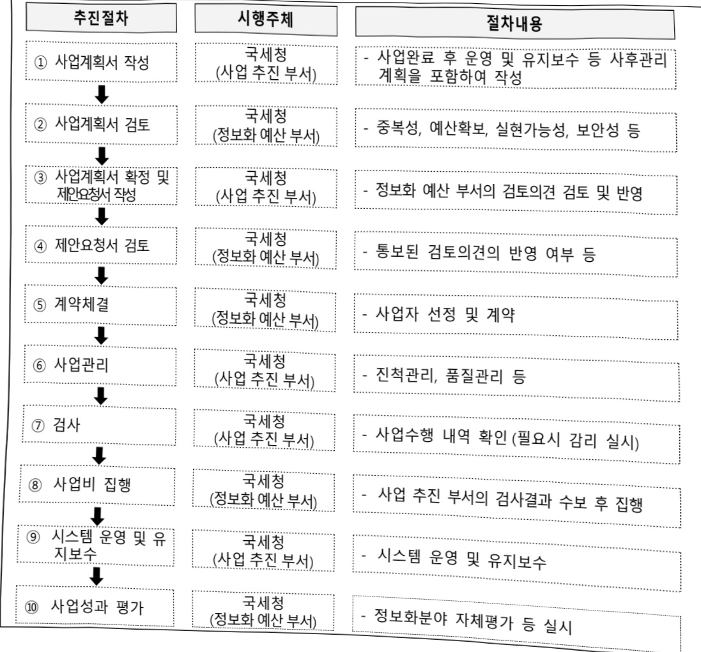

# 엔티스 전산시스템 운영(정보화)

**해당 페이지**: PDF 2076 ~ 2086 쪽 해당

**부처**: 국세청
**분야**: 일반·지방행정
**회계유형**: 일반회계
**2026 확정예산**: 37914.0 백만원
**전년대비 증감률**: -16.5%
**AI 도메인**: 행정/전자정부, 디지털전환(AX)

---

<table border=1 style='margin: auto; word-wrap: break-word;'><tr><td rowspan="4">근로장려금 확대개편 기능개발</td><td rowspan="3">소관부처</td><td style='text-align: center; word-wrap: break-word;'>실·국·과(팀)</td></tr><tr><td style='text-align: center; word-wrap: break-word;'>정보화관리관</td></tr><tr><td style='text-align: center; word-wrap: break-word;'>홈택스2담당관 (장려세제정보화팀)</td></tr><tr><td style='text-align: center; word-wrap: break-word;'>사업시행주체</td><td style='text-align: center; word-wrap: break-word;'>국세청</td></tr><tr><td rowspan="4">연말정산 원스톱서비스 개발</td><td rowspan="3">소관부처</td><td style='text-align: center; word-wrap: break-word;'>실·국·과(팀)</td></tr><tr><td style='text-align: center; word-wrap: break-word;'>법인납세국</td></tr><tr><td style='text-align: center; word-wrap: break-word;'>원천세과 (원천세1팀)</td></tr><tr><td style='text-align: center; word-wrap: break-word;'>사업시행주체</td><td style='text-align: center; word-wrap: break-word;'>국세청</td></tr><tr><td rowspan="4">개인 맞춤 지능형 전자세정 서비스운영</td><td rowspan="3">소관부처</td><td style='text-align: center; word-wrap: break-word;'>실·국·과(팀)</td></tr><tr><td style='text-align: center; word-wrap: break-word;'>정보화관리관</td></tr><tr><td style='text-align: center; word-wrap: break-word;'>홈택스1담당관 (홈택스총괄팀)</td></tr><tr><td style='text-align: center; word-wrap: break-word;'>사업시행주체</td><td style='text-align: center; word-wrap: break-word;'>국세청</td></tr><tr><td rowspan="4">홈택스 고도화 구축</td><td rowspan="3">소관부처</td><td style='text-align: center; word-wrap: break-word;'>실·국·과(팀)</td></tr><tr><td style='text-align: center; word-wrap: break-word;'>정보화관리관</td></tr><tr><td style='text-align: center; word-wrap: break-word;'>정보화기획담당관 (사업관리팀)</td></tr><tr><td style='text-align: center; word-wrap: break-word;'>사업시행주체</td><td style='text-align: center; word-wrap: break-word;'>국세청</td></tr><tr><td rowspan="4">홈택스 AI 검색시스템 구축</td><td rowspan="3">소관부처</td><td style='text-align: center; word-wrap: break-word;'>실·국·과(팀)</td></tr><tr><td style='text-align: center; word-wrap: break-word;'>정보화관리관</td></tr><tr><td style='text-align: center; word-wrap: break-word;'>정보화기획담당관 (사업관리팀)</td></tr><tr><td style='text-align: center; word-wrap: break-word;'>사업시행주체</td><td style='text-align: center; word-wrap: break-word;'>국세청</td></tr><tr><td rowspan="4">모바일 홈택스 고도화 구축</td><td rowspan="3">소관부처</td><td style='text-align: center; word-wrap: break-word;'>실·국·과(팀)</td></tr><tr><td style='text-align: center; word-wrap: break-word;'>정보화관리관</td></tr><tr><td style='text-align: center; word-wrap: break-word;'>정보화기획담당관 (사업관리팀)</td></tr><tr><td style='text-align: center; word-wrap: break-word;'>사업시행주체</td><td style='text-align: center; word-wrap: break-word;'>국세청</td></tr></table>

### 가. 예산 총괄표

(단위: 백만원, %)

<table border=1 style='margin: auto; word-wrap: break-word;'><tr><td rowspan="2">사업명</td><td rowspan="2">2024년 결산</td><td colspan="2">2025년 예산</td><td colspan="2">2026년</td><td rowspan="2">증감(B-A)</td><td rowspan="2">(B-A)/A</td></tr><tr><td style='text-align: center; word-wrap: break-word;'>본예산</td><td style='text-align: center; word-wrap: break-word;'>추경(A)</td><td style='text-align: center; word-wrap: break-word;'>요구안</td><td style='text-align: center; word-wrap: break-word;'>본예산(B)</td></tr><tr><td style='text-align: center; word-wrap: break-word;'>엔티스 전산시스템 운영(정보화)</td><td style='text-align: center; word-wrap: break-word;'>42,546</td><td style='text-align: center; word-wrap: break-word;'>45,412</td><td style='text-align: center; word-wrap: break-word;'>45,412</td><td style='text-align: center; word-wrap: break-word;'>37,914</td><td style='text-align: center; word-wrap: break-word;'>37,914</td><td style='text-align: center; word-wrap: break-word;'>△7,498</td><td style='text-align: center; word-wrap: break-word;'>△16.5</td></tr></table>

---

□ 기능별(내역사업별) 예산 내역

(단위:백만원)

<table border=1 style='margin: auto; word-wrap: break-word;'><tr><td rowspan="2"></td><td colspan="5">2024</td><td colspan="5">2025</td><td rowspan="2">2026예산</td></tr><tr><td style='text-align: center; word-wrap: break-word;'>예산액(추경)</td><td style='text-align: center; word-wrap: break-word;'>예산현액</td><td style='text-align: center; word-wrap: break-word;'>집행액</td><td style='text-align: center; word-wrap: break-word;'>이월액</td><td style='text-align: center; word-wrap: break-word;'>불용액</td><td style='text-align: center; word-wrap: break-word;'>예산액(추경)</td><td style='text-align: center; word-wrap: break-word;'>예산현액</td><td style='text-align: center; word-wrap: break-word;'>집행액</td><td style='text-align: center; word-wrap: break-word;'>이월액</td><td style='text-align: center; word-wrap: break-word;'>불용액</td></tr><tr><td style='text-align: center; word-wrap: break-word;'>○ 기능별 분류(함께)</td><td style='text-align: center; word-wrap: break-word;'>47,915</td><td style='text-align: center; word-wrap: break-word;'>47,915</td><td style='text-align: center; word-wrap: break-word;'>42,546</td><td style='text-align: center; word-wrap: break-word;'>-</td><td style='text-align: center; word-wrap: break-word;'>5,369</td><td style='text-align: center; word-wrap: break-word;'>45,412</td><td style='text-align: center; word-wrap: break-word;'>45,612</td><td style='text-align: center; word-wrap: break-word;'>45,317</td><td style='text-align: center; word-wrap: break-word;'>-</td><td style='text-align: center; word-wrap: break-word;'>295</td><td style='text-align: center; word-wrap: break-word;'>37,914</td></tr><tr><td style='text-align: center; word-wrap: break-word;'>· 엔티스 운영 및 유지관리</td><td style='text-align: center; word-wrap: break-word;'>31,667</td><td style='text-align: center; word-wrap: break-word;'>31,667</td><td style='text-align: center; word-wrap: break-word;'>28,929</td><td style='text-align: center; word-wrap: break-word;'>-</td><td style='text-align: center; word-wrap: break-word;'>2,738</td><td style='text-align: center; word-wrap: break-word;'>29,695</td><td style='text-align: center; word-wrap: break-word;'>29,375</td><td style='text-align: center; word-wrap: break-word;'>29,344</td><td style='text-align: center; word-wrap: break-word;'>-</td><td style='text-align: center; word-wrap: break-word;'>31</td><td style='text-align: center; word-wrap: break-word;'>29,880</td></tr><tr><td style='text-align: center; word-wrap: break-word;'>· 엔티스 증설 및 서비스 개선</td><td style='text-align: center; word-wrap: break-word;'>1,506</td><td style='text-align: center; word-wrap: break-word;'>1,506</td><td style='text-align: center; word-wrap: break-word;'>1,116</td><td style='text-align: center; word-wrap: break-word;'>-</td><td style='text-align: center; word-wrap: break-word;'>390</td><td style='text-align: center; word-wrap: break-word;'>1,297</td><td style='text-align: center; word-wrap: break-word;'>1,297</td><td style='text-align: center; word-wrap: break-word;'>1,249</td><td style='text-align: center; word-wrap: break-word;'>-</td><td style='text-align: center; word-wrap: break-word;'>48</td><td style='text-align: center; word-wrap: break-word;'>1,249</td></tr><tr><td style='text-align: center; word-wrap: break-word;'>· 근로장려금 확대 개편 기능개발</td><td style='text-align: center; word-wrap: break-word;'>3,551</td><td style='text-align: center; word-wrap: break-word;'>3,551</td><td style='text-align: center; word-wrap: break-word;'>3,551</td><td style='text-align: center; word-wrap: break-word;'>-</td><td style='text-align: center; word-wrap: break-word;'>-</td><td style='text-align: center; word-wrap: break-word;'>69</td><td style='text-align: center; word-wrap: break-word;'>69</td><td style='text-align: center; word-wrap: break-word;'>62</td><td style='text-align: center; word-wrap: break-word;'>-</td><td style='text-align: center; word-wrap: break-word;'>7</td><td style='text-align: center; word-wrap: break-word;'>238</td></tr><tr><td style='text-align: center; word-wrap: break-word;'>· 연말정산원스톱 서비스 개발</td><td style='text-align: center; word-wrap: break-word;'>1,592</td><td style='text-align: center; word-wrap: break-word;'>1,592</td><td style='text-align: center; word-wrap: break-word;'>1,592</td><td style='text-align: center; word-wrap: break-word;'>-</td><td style='text-align: center; word-wrap: break-word;'>-</td><td style='text-align: center; word-wrap: break-word;'>1,592</td><td style='text-align: center; word-wrap: break-word;'>1,592</td><td style='text-align: center; word-wrap: break-word;'>1,592</td><td style='text-align: center; word-wrap: break-word;'>-</td><td style='text-align: center; word-wrap: break-word;'>-</td><td style='text-align: center; word-wrap: break-word;'>1,194</td></tr><tr><td style='text-align: center; word-wrap: break-word;'>· 비표준기술 제거</td><td style='text-align: center; word-wrap: break-word;'>346</td><td style='text-align: center; word-wrap: break-word;'>346</td><td style='text-align: center; word-wrap: break-word;'>346</td><td style='text-align: center; word-wrap: break-word;'>-</td><td style='text-align: center; word-wrap: break-word;'>-</td><td style='text-align: center; word-wrap: break-word;'>260</td><td style='text-align: center; word-wrap: break-word;'>260</td><td style='text-align: center; word-wrap: break-word;'>260</td><td style='text-align: center; word-wrap: break-word;'>-</td><td style='text-align: center; word-wrap: break-word;'>-</td><td style='text-align: center; word-wrap: break-word;'>-</td></tr><tr><td style='text-align: center; word-wrap: break-word;'>· 개인맞춤지능형 전자제정서비스 운영</td><td style='text-align: center; word-wrap: break-word;'>111</td><td style='text-align: center; word-wrap: break-word;'>111</td><td style='text-align: center; word-wrap: break-word;'>92</td><td style='text-align: center; word-wrap: break-word;'>-</td><td style='text-align: center; word-wrap: break-word;'>19</td><td style='text-align: center; word-wrap: break-word;'>62</td><td style='text-align: center; word-wrap: break-word;'>62</td><td style='text-align: center; word-wrap: break-word;'>51</td><td style='text-align: center; word-wrap: break-word;'>-</td><td style='text-align: center; word-wrap: break-word;'>11</td><td style='text-align: center; word-wrap: break-word;'>30</td></tr><tr><td style='text-align: center; word-wrap: break-word;'>· 홈택스고도화 1·2 단계 구축</td><td style='text-align: center; word-wrap: break-word;'>6,991</td><td style='text-align: center; word-wrap: break-word;'>6,991</td><td style='text-align: center; word-wrap: break-word;'>6,920</td><td style='text-align: center; word-wrap: break-word;'>-</td><td style='text-align: center; word-wrap: break-word;'>71</td><td style='text-align: center; word-wrap: break-word;'>7,985</td><td style='text-align: center; word-wrap: break-word;'>7,985</td><td style='text-align: center; word-wrap: break-word;'>7,914</td><td style='text-align: center; word-wrap: break-word;'>-</td><td style='text-align: center; word-wrap: break-word;'>71</td><td style='text-align: center; word-wrap: break-word;'>1,576</td></tr><tr><td style='text-align: center; word-wrap: break-word;'>· 디지털세 전산시스템 구축</td><td style='text-align: center; word-wrap: break-word;'>-</td><td style='text-align: center; word-wrap: break-word;'>-</td><td style='text-align: center; word-wrap: break-word;'>-</td><td style='text-align: center; word-wrap: break-word;'>-</td><td style='text-align: center; word-wrap: break-word;'>-</td><td style='text-align: center; word-wrap: break-word;'>4,452</td><td style='text-align: center; word-wrap: break-word;'>4,452</td><td style='text-align: center; word-wrap: break-word;'>4,406</td><td style='text-align: center; word-wrap: break-word;'>-</td><td style='text-align: center; word-wrap: break-word;'>46</td><td style='text-align: center; word-wrap: break-word;'>-</td></tr><tr><td style='text-align: center; word-wrap: break-word;'>· 홈태스AI 검색시스템 구축</td><td style='text-align: center; word-wrap: break-word;'>-</td><td style='text-align: center; word-wrap: break-word;'>-</td><td style='text-align: center; word-wrap: break-word;'>-</td><td style='text-align: center; word-wrap: break-word;'>-</td><td style='text-align: center; word-wrap: break-word;'>-</td><td style='text-align: center; word-wrap: break-word;'>-</td><td style='text-align: center; word-wrap: break-word;'>-</td><td style='text-align: center; word-wrap: break-word;'>-</td><td style='text-align: center; word-wrap: break-word;'>-</td><td style='text-align: center; word-wrap: break-word;'>-</td><td style='text-align: center; word-wrap: break-word;'>1,920</td></tr><tr><td style='text-align: center; word-wrap: break-word;'>· 모바일 홈택스고도화 구축</td><td style='text-align: center; word-wrap: break-word;'>-</td><td style='text-align: center; word-wrap: break-word;'>-</td><td style='text-align: center; word-wrap: break-word;'>-</td><td style='text-align: center; word-wrap: break-word;'>-</td><td style='text-align: center; word-wrap: break-word;'>-</td><td style='text-align: center; word-wrap: break-word;'>-</td><td style='text-align: center; word-wrap: break-word;'>-</td><td style='text-align: center; word-wrap: break-word;'>-</td><td style='text-align: center; word-wrap: break-word;'>-</td><td style='text-align: center; word-wrap: break-word;'>-</td><td style='text-align: center; word-wrap: break-word;'>1,827</td></tr><tr><td style='text-align: center; word-wrap: break-word;'>· 국외전출세 과세 시스템 구축</td><td style='text-align: center; word-wrap: break-word;'>2,151</td><td style='text-align: center; word-wrap: break-word;'>2,151</td><td style='text-align: center; word-wrap: break-word;'>-</td><td style='text-align: center; word-wrap: break-word;'>-</td><td style='text-align: center; word-wrap: break-word;'>2,151</td><td style='text-align: center; word-wrap: break-word;'>-</td><td style='text-align: center; word-wrap: break-word;'>-</td><td style='text-align: center; word-wrap: break-word;'>-</td><td style='text-align: center; word-wrap: break-word;'>-</td><td style='text-align: center; word-wrap: break-word;'>-</td><td style='text-align: center; word-wrap: break-word;'>-</td></tr><tr><td style='text-align: center; word-wrap: break-word;'>· 엔티스 고도화</td><td style='text-align: center; word-wrap: break-word;'>-</td><td style='text-align: center; word-wrap: break-word;'>-</td><td style='text-align: center; word-wrap: break-word;'>-</td><td style='text-align: center; word-wrap: break-word;'>-</td><td style='text-align: center; word-wrap: break-word;'>-</td><td style='text-align: center; word-wrap: break-word;'>-</td><td style='text-align: center; word-wrap: break-word;'>520</td><td style='text-align: center; word-wrap: break-word;'>439</td><td style='text-align: center; word-wrap: break-word;'>-</td><td style='text-align: center; word-wrap: break-word;'>81</td><td style='text-align: center; word-wrap: break-word;'>-</td></tr></table>

### 나.사업설명자료

## 1 ) 사업목적·내용

- (엔티스 전산시스템 운영(정보화))

- (엔티스 운영 및 유지관리) 국세청 핵심 시스템인 엔티스 운영 · 유지관리와 법령개정, 제도개선 사항을 반영한 기능개선, 재난 · 재해 발생 대비 데이터 실시간 복제 기능 수행, 24시간 365일 상시 배치프로그램 관제 등

- (엔티스 증설 및 서비스 개선) 대국민 납세서비스 및 대내 국세행정업무를 안정적으로

운영하기 위한 엔티스(모바일 안내문 발송사업에서 도입한 HW·SW) 증설 임차료,

엔티스 시스템 개선사항 및 서비스에 대한 안내·홍보 등 제공

---

(근로장려금 확대개편 기능개발) 근로장려금 확대 및 연 2회 지급 등 확대 개편에 따른 근로장려금 신청, 심사, 지급(정산) 등 집행업무를 안정적으로 운영지원

- (연말정산 원스톱 서비스 개발) 근로자가 홈택스에서 클릭 한번으로 연말정산 전 과정이 완료될 수 있도록 「연말정산 원스톱 서비스」 추진

- (비표준기술 제거) 홈택스 비표준기술(Active-X) 교체를 위한 상용SW 도입 임차료

- (개인 맞춤 지능형 전자세정 서비스 운영) 모바일 서비스에 대해 법령 및 제도 개선사항 반영 등 체계적인 운영 · 유지관리를 통해 안정적인 서비스 제공

- (홈택스 고도화 구축) 사용자 중심의 지능형·맞춤형 홈택스로 고도화하기 위해 최신 ICT 기술을 접목한 획기적·전면적 개편 추진

- (디지털세 시스템 구축) '24년 글로벌최저한세 도입이 확정되고 '26~'27년 필라1 시행이 예정됨에 따라, 새롭게 도입되는 디지털세*의 세원관리를 총괄하는 전산시스템 구축

* 디지털세는 필라1(Amount A, Amount B)과 필라2(글로벌최저한세, STTR)으로 구성함

- (홈택스 AI검색시스템 구축) 정부 정책 방향에 부합하는 AI를 통한 납세편의 제공을 위해 지능형검색을 위한 GPU를 구매하고 의미기반(문장유사어) 검색 제공

- (모바일 홈택스 고도화 구축) 모바일에 최적화된 원클릭 신고, 음석인식 지능형 검색,

QR세금납부 등 모바일 특화 기능을 활용하여 모바일 홈택스 신고.납부 개편

- (엔티스 고도화) 국세행정 AI 전환 및 세무플랫폼 대응방안 마련을 위한 정보화전략 계획(ISP) 수립

## 2 ) 사업개요

## □ 사업근거 및 추진경위

① 법령상 근거 및 조항 적시

○ 국세기본법, 국세징수법, 소득세법, 부가가치세법, 법인세법 등 각종 세법 및 규정 등에 의한 세금 신고·납부, 민원 신청 및 과세자료 처리 등

② 추진경위 - 사업 시작년도, 추진배경, 부처별 중점과제, 대통령 공약사항 등

○ 70~80년대 산업화 초기 근거과세 강화와 과세자료의 적기처리를 위해 전산화 추진

○ 과세자료 수집체계를 고도화하여 업무량 축소, 행정비용 절감, 세원관리 과학화, 세무서

방문 최소화 등 초일류 전자세정 구현을 위해 지속적인 IT 인프라 개선을 추진

---

- 1997년 국세행정 기간시스템인 국세통합시스템(TIS; Tax Integrated System) 개통

- 2002년부터는 인터넷을 통한 대국민 납세서비스 제공을 위해 홈택스시스템 구축

- 2003년부터는 TIS 등에 축적된 과세정보를 각종 세원관리 및 조사분야에 활용하기 위해 국세정보관리시스템(TIMS; Tax Information Management System) 구축

- 2005년도에는 자영업자의 현금매출 양성화를 위한 현금영수증시스템 구축

- 2009년에는 부가가치세 수정신고 · 기한 후 전자신고 실시, 우편물 통합발송 및 정보화센터 확대 운영, Paperless e-민원실 시범실시 등 업무프로세스를 개선하여 납세편의 확대 및 직원의 업무효율성 제고

- 2010년 현금영수증 등 12개 시스템에 산재한 세금정보를 하나의 인터넷 화면에서

One-stop 처리될 수 있도록 서비스를 구축

- 사업자등록신청 등 민원처리시간 단축을 위해 e-민원실을 37개 세무서로 확대

- 국세정보자료 보안강화를 위해 내부정보유출방지시스템, 사이버안전센터 등을 구축

- 2011년 홈택스 노후서버를 전면교체(국가정보자원관리원)하여 안정적인 서비스 제공

- 2012년 민원증명 발급 신청, 종합소득세 간편신고, 환급금 조회 등 홈택스 일부

기능에 대하여 모바일 서비스 제공

2012년부터 차세대국세행정시스템(엔티스) 전면개편 사업에 착수하는 한편, 기존 시스템을 안정적으로 운영

2013년에는 국세행정전산화 사업을 취업후학자금 상환제도 운영지원, 국세통합시스템 운영관리, 홈택스 운영관리를 별도 사업으로 분리하여 각 사업별 예산집행 투명성 제고

2015년 7월, 그간의 세정 노하우와 발전된 정보통신기술을 접목하여 TIS, 홈택스, 현금영수증, 전자세금계산서 등 8개 시스템을 통합한 차세대국세행정시스템(엔티스) 개통 - 남세자들이 인터넷으로 접속하여 전자신고, 세무관련 정보조회 업무 등을 수행할 수 있는 차세대 ‘홈택스’와 내부직원의 업무처리 지원을 위한 ‘세정업무 포털’로 구성

2015년 엔티스 개통 이후 미리 알려주고 채워주는 편리한 연말정산 서비스,

간편사업자등록 및 신고·납부서비스 등을 개발

2016년 내부정보유출방지시스템 교체, 우편물자동화센터 노후장비(봉입봉함기) 교체, 국세민원증명 무인발급 서비스 개발 등

2017년 엔티스 용량 일부 증설, ISO 20000 국제표준 인증 획득, 엔티스 기능 추가 개발(기부장려금 제도, 일감폐어주기, 파생금융상품 신고관리 등)

---

2018년 엔티스 용량 일부 증설, 빅데이터 ISP 컨설팅, 엔티스 기능 추가개발(체납정리 고도화, 공공법인 통합관리, 종교인소득 과세, 부가가치세 대리납부 기능 추가 등)

2019년 빅데이터 플랫폼 구축, 홈택스 모바일 서비스 확대, 홈페이지 ISP, 엔티스 기능 추가개발(근로장려금 확대·개편, 가산금 통합, 부가세 보이는 ARS 기능 추가 등)

2020년 빅데이터 분석모델 개발, 홈택스 모바일 서비스 확대, 엔티스 기능추가 개발(금융조회 전산시스템, 상속세 전자신고, 전자기부금영수증시스템 등)

2021년 홈택스 모바일 서비스 확대, 가상자산 관리시스템 구축, 소득자료 관리시스템 개발, 엔티스 기능추가 개발(연말정산 고도화, 사업자등록 진위확인 서비스 등)

2022년 금융투자소득세 전산시스템 개발, 엔티스 기능추가 개발(고지서 배달 알림 서비스, QR코드 신고, 장려금 결정통지서 전자송달, 전자점자 공제신고서 제공 등)

2023년 공익법인통합관리 기능 개선, 종합부동산세 납부유예 관리시스템 구축, 엔티스 기능추가 개발(면세유자료관리, 공익법인통합관리기능, 국외간편사업자 자료제출 등)

2024년 홈택스 고도화 1단계 구축, 엔티스 기능 추가 개발, 비표준 기술 제거,

근로장려금 확대개편 기능 개발 등 추진

2025년 홈택스 고도화 2단계 구축, 디지털세 전산시스템 구축 추진

## □ 주요내용

① 사업규모

- 총사업비 : 해당없음

- 사업기간 : 계속사업

- 최근 5년 간 투입된 사업비(예산액기준, 추경편성한 연도에는 추경포함)

<table border=1 style='margin: auto; word-wrap: break-word;'><tr><td style='text-align: center; word-wrap: break-word;'>연도</td><td style='text-align: center; word-wrap: break-word;'>2022</td><td style='text-align: center; word-wrap: break-word;'>2023</td><td style='text-align: center; word-wrap: break-word;'>2024</td><td style='text-align: center; word-wrap: break-word;'>2025</td><td style='text-align: center; word-wrap: break-word;'>2026</td></tr><tr><td style='text-align: center; word-wrap: break-word;'>사업비</td><td style='text-align: center; word-wrap: break-word;'>62,899</td><td style='text-align: center; word-wrap: break-word;'>44,526</td><td style='text-align: center; word-wrap: break-word;'>47,915</td><td style='text-align: center; word-wrap: break-word;'>45,412</td><td style='text-align: center; word-wrap: break-word;'>37,914</td></tr></table>

② 사업추진체계

- 사업시행방법 : 직접수행

- 사업시행주체 : 국세청

- 사업 수혜자 : 대국민 납세자, 국세청 직원

- 보조, 융자, 출연, 출자 등의 경우 보조·융자 등 지원 비율 및 법적근거 : 해당없음

---

3) 2026년도 예산 산출 근거

<table border=1 style='margin: auto; word-wrap: break-word;'><tr><td colspan="2">① 엔티스 운영 및 유지관리: (2026요구) 29,880백만원</td></tr><tr><td colspan="2">② 사업개요: 국세청 핵심 시스템인 엔티스 운영·유지보수와 법령개정, 제도개선 사항을 반영한 기능개선, 재난·재해 발생 대비 데이터 실시간 복제 기능 수행, 24시간 365일 상시 배치프로그램 관제 등</td></tr><tr><td colspan="2">② 엔티스 증설: (2026요구) 1,249백만원</td></tr><tr><td colspan="2">③ 사업개요: 대국민 납세서비스 및 대내 국세행정업무를 안정적으로 운영하기 위한 엔티스 및 모바일 안내 문 발송시스템 증설 및 엔티스 시스템 개선사항 및 서비스에 대한 안내·홍보</td></tr><tr><td colspan="2">③ 근로장려금 확대개편 기능 개발: (2026요구) 238백만원</td></tr><tr><td colspan="2">④ 사업개요: 근로장려금 확대 및 연 2회 지급 등 확대 개편에 따른 근로장려금 신청, 심사, 지급(정산) 등 집행업무를 안정적으로 운영지원</td></tr><tr><td colspan="2">④ 연말정산 원스톱 서비스: (2026요구) 1,194백만원</td></tr><tr><td colspan="2">④ 사업개요: 근로자가 홈택스에서 클릭 한번으로 연말정산 전 과정이 완료될 수 있도록「연말정산 원스톱 서비스」추진</td></tr><tr><td colspan="2">⑤ 비표준기술 제거: (2026요구) 0원</td></tr><tr><td colspan="2">⑥ 사업개요: 홈택스 등 비표준기술(Active-X) 교체를 위한 상용SW 도입 임차료 및 엔티스 비표준 기술 제거하기 위한 시스템 환경 도입 임차료</td></tr><tr><td colspan="2">⑥ 개인 맞춤 지능형 전자세정: (2026요구) 30백만원</td></tr><tr><td colspan="2">⑥ 사업개요: 모바일 홈택스 서비스에 대해 법령 및 제도 개선사항 반영 등 체계적인 운영·유지관리를 통해 안정적인 서비스 제공</td></tr><tr><td colspan="2">⑦ 홈택스 고도화 구축: (2026요구) 1,576백만원</td></tr><tr><td colspan="2">⑦ 사업개요: 사용자 중심의 지능형 홈택스로 고도화하고 최신 ICT 기술을 접목한 획기적·전면적 개편 추진</td></tr><tr><td colspan="2">⑧ 디지털세 전산시스템 구축: (2026요구) 0원</td></tr><tr><td colspan="2">⑧ 사업개요: 디지털세 신고대상 기업의 세원관리를 위한 국세행정시스템(NTIS) 연계 및 국가 간 정보교환 전산시스템 구축</td></tr><tr><td colspan="2">⑨ 홈택스 AI검색시스템 구축: (2026요구) 1,920원</td></tr><tr><td colspan="2">⑩ 사업개요: 정부 정책 방향에 부합하는 AI를 통한 납세편의 제공을 위해 지능형검색을 위한 GPU를 구매하고 의미기반(문장유사어) 검색 제공</td></tr><tr><td colspan="2">⑩ 모바일 홈택스 고도화 구축: (2026요구) 1,827원</td></tr><tr><td colspan="2">⑩ 사업개요: 모바일에 최적화된 원클릭 신고, 음석인식 지능형 검색, QR세금납부 등 모바일 특화 기능을 활용하여 모바일 홈택스 신고낭부 개편</td></tr></table>

① 엔티스 운영 및 유지관리 : (2026요구) 29,880백만원

사업개요 : 국세청 핵심 시스템인 엔티스 운영 · 유지보수와 법령개정, 제도개선 사항을 반영한 기능개선,

재난·재해 발생 대비 데이터 실시간 복제 기능 수행, 24시간 365일 상시 배치프로그램 관제 등

② 엔티스 증설 : (2026요구) 1,249백만원

사업개요 : 대국민 납세서비스 및 대내 국세행정업무를 안정적으로 운영하기 위한 엔티스 및 모바일 안내

문 발송시스템 증설 및 엔티스 시스템 개선사항 및 서비스에 대한 안내·홍보

③ 근로장려금 확대개편 기능 개발 : (2026요구) 238백만원

사업개요 : 근로장려금 확대 및 연 2회 지급 등 확대 개편에 따른 근로장려금 신청, 심사, 지급(정산) 등

집행업무를 안정적으로 운영지원

④ 연말정산 원스톱 서비스 : (2026요구) 1,194백만원

사업개요 : 근로자가 홈택스에서 클릭 한번으로 연말정산 전 과정이 완료될 수 있도록 「연말정산 원스톱 서비스」 추진

⑤ 비표준기술 제거 : (2026요구) 0원

사업개요 : 홈택스 등 비표준기술(Active-X) 교체를 위한 상용SW 도입 임차료 및 엔티스 비표준 기술 제거

하기 위한 시스템 환경 도입 임차료

⑥ 개인 맞춤 지능형 전자세정 : (2026요구) 30백만원

사업개요: 모바일 홈택스 서비스에 대해 법령 및 제도 개선사항 반영 등 체계적인 운영·유지관리를 통해

안정적인 서비스 제공

⑦홈택스고도화구축:(2026요구)1,576백만원

사업개요:사용자중심의지능형홈택스로고도화하고최신ICT기술을접목한획기적·전면적개편추진

⑧ 디지털세 전산시스템 구축 : (2026요구) 0원

사업개요 : 디지털세 신고대상 기업의 세원관리를 위한 국세행정시스템(NTIS) 연계 및 국가 간 정보교환 전산시스템 구축

⑨ 홈택스 AI검색시스템 구축 : (2026요구) 1,920원

사업개요 : 정부 정책 방향에 부합하는 AI를 통한 납세편의 제공을 위해 지능형검색을 위한 GPU를 구매하고 의미기반(문장유사어) 검색 제공

⑩ 모바일 홈택스 고도화 구축 : (2026요구) 1,827원

사업개요 : 모바일에 최적화된 원클릭 신고, 음석인식 지능형 검색, QR세금납부 등 모바일 특화 기능을 활용하여 모바일 홈택스 신고납부 개편

---

## 4 ) 사업효과

☐ 사업영향, 산출물 성과지표 등

①2022~2026년도 성과계획서 상 성과지표 및 최근 5년간 성과 달성도

<table border=1 style='margin: auto; word-wrap: break-word;'><tr><td style='text-align: center; word-wrap: break-word;'>성과지표</td><td style='text-align: center; word-wrap: break-word;'>구분</td><td style='text-align: center; word-wrap: break-word;'>2022</td><td style='text-align: center; word-wrap: break-word;'>2023</td><td style='text-align: center; word-wrap: break-word;'>2024</td><td style='text-align: center; word-wrap: break-word;'>2025</td><td style='text-align: center; word-wrap: break-word;'>2026</td><td style='text-align: center; word-wrap: break-word;'>2026 목표치산출근거</td><td style='text-align: center; word-wrap: break-word;'>측정산식(또는 측정방법)</td><td style='text-align: center; word-wrap: break-word;'>자료수집방법(또는 자료출처)</td></tr><tr><td rowspan="3">엔티스 장애예방 노력도</td><td style='text-align: center; word-wrap: break-word;'>목표</td><td style='text-align: center; word-wrap: break-word;'>-</td><td style='text-align: center; word-wrap: break-word;'>-</td><td style='text-align: center; word-wrap: break-word;'>4시간 이내</td><td style='text-align: center; word-wrap: break-word;'>4시간 이내</td><td style='text-align: center; word-wrap: break-word;'></td><td rowspan="3">신규지표이며 장애발생 2시간 이내 도착, 2시간 이내복구 시간을 근거로 설정</td><td rowspan="3">재해복구 모의 훈련 복구시간</td><td rowspan="3">결과보고서</td></tr><tr><td style='text-align: center; word-wrap: break-word;'>실적</td><td style='text-align: center; word-wrap: break-word;'>-</td><td style='text-align: center; word-wrap: break-word;'>-</td><td style='text-align: center; word-wrap: break-word;'>4시간 이내</td><td style='text-align: center; word-wrap: break-word;'></td><td style='text-align: center; word-wrap: break-word;'>-</td></tr><tr><td style='text-align: center; word-wrap: break-word;'>달성도</td><td style='text-align: center; word-wrap: break-word;'>-</td><td style='text-align: center; word-wrap: break-word;'>-</td><td style='text-align: center; word-wrap: break-word;'>100%</td><td style='text-align: center; word-wrap: break-word;'></td><td style='text-align: center; word-wrap: break-word;'>-</td></tr><tr><td rowspan="3">대민포털 사용자 만족도(단위: 점)</td><td style='text-align: center; word-wrap: break-word;'>목표</td><td style='text-align: center; word-wrap: break-word;'>80.7</td><td style='text-align: center; word-wrap: break-word;'>80.8</td><td style='text-align: center; word-wrap: break-word;'>80.9</td><td style='text-align: center; word-wrap: break-word;'>81.2</td><td style='text-align: center; word-wrap: break-word;'></td><td rowspan="3">전년 동일 수준 목표치 설정</td><td rowspan="3">(민족도점수충합) ÷(설문참여자수) 리커트5점척도 방식으로 측정</td><td rowspan="3">설문조사 결과보고서</td></tr><tr><td style='text-align: center; word-wrap: break-word;'>실적</td><td style='text-align: center; word-wrap: break-word;'>80.8</td><td style='text-align: center; word-wrap: break-word;'>80.9</td><td style='text-align: center; word-wrap: break-word;'>81.1</td><td style='text-align: center; word-wrap: break-word;'></td><td style='text-align: center; word-wrap: break-word;'></td></tr><tr><td style='text-align: center; word-wrap: break-word;'>달성도</td><td style='text-align: center; word-wrap: break-word;'>100.1</td><td style='text-align: center; word-wrap: break-word;'>100.1</td><td style='text-align: center; word-wrap: break-word;'>100.2.</td><td style='text-align: center; word-wrap: break-word;'></td><td style='text-align: center; word-wrap: break-word;'>-</td></tr><tr><td rowspan="3">대내포털 사용자 만족도(단위: 점)</td><td style='text-align: center; word-wrap: break-word;'>목표</td><td style='text-align: center; word-wrap: break-word;'>폐지</td><td style='text-align: center; word-wrap: break-word;'></td><td style='text-align: center; word-wrap: break-word;'></td><td style='text-align: center; word-wrap: break-word;'></td><td style='text-align: center; word-wrap: break-word;'></td><td rowspan="3">폐지</td><td rowspan="3">최초 100점에서 연간 장애발생부터 복구까지 걸린 시간에 대해 차감</td><td rowspan="3">국가정보자원관리원에서 제공하는 국정 정보시스템 운영 현황 분석보고서 장애 사간 발휘</td></tr><tr><td style='text-align: center; word-wrap: break-word;'>실적</td><td style='text-align: center; word-wrap: break-word;'>-</td><td style='text-align: center; word-wrap: break-word;'></td><td style='text-align: center; word-wrap: break-word;'></td><td style='text-align: center; word-wrap: break-word;'></td><td style='text-align: center; word-wrap: break-word;'></td></tr><tr><td style='text-align: center; word-wrap: break-word;'>달성도</td><td style='text-align: center; word-wrap: break-word;'>-</td><td style='text-align: center; word-wrap: break-word;'></td><td style='text-align: center; word-wrap: break-word;'></td><td style='text-align: center; word-wrap: break-word;'></td><td style='text-align: center; word-wrap: break-word;'>-</td></tr><tr><td rowspan="3">근로(자녀)장려세제 종합만족도(단위: 점)</td><td style='text-align: center; word-wrap: break-word;'>목표</td><td style='text-align: center; word-wrap: break-word;'>88.7</td><td style='text-align: center; word-wrap: break-word;'>폐지</td><td style='text-align: center; word-wrap: break-word;'></td><td style='text-align: center; word-wrap: break-word;'></td><td style='text-align: center; word-wrap: break-word;'></td><td rowspan="3">폐지</td><td rowspan="3">종합만족도조사* 실시 * 리커트 5점 척도 방식으로 측정</td><td rowspan="3">설문조사 결과보고서</td></tr><tr><td style='text-align: center; word-wrap: break-word;'>실적</td><td style='text-align: center; word-wrap: break-word;'>89.2</td><td style='text-align: center; word-wrap: break-word;'>-</td><td style='text-align: center; word-wrap: break-word;'></td><td style='text-align: center; word-wrap: break-word;'></td><td style='text-align: center; word-wrap: break-word;'></td></tr><tr><td style='text-align: center; word-wrap: break-word;'>달성도</td><td style='text-align: center; word-wrap: break-word;'>100.6</td><td style='text-align: center; word-wrap: break-word;'>-</td><td style='text-align: center; word-wrap: break-word;'></td><td style='text-align: center; word-wrap: break-word;'></td><td style='text-align: center; word-wrap: break-word;'></td></tr></table>

② 성과지표 이외의 연도별 사업추진 경과 및 실적

<table border=1 style='margin: auto; word-wrap: break-word;'><tr><td style='text-align: center; word-wrap: break-word;'>2022</td><td style='text-align: center; word-wrap: break-word;'>- 금융투자소득세 전산시스템 구축- 연말정산간소화 일괄제공 서비스, 부가가치세 간이과세자 세금비서 도입, 소득세 모두채움 기한후 환급신고 제공 등이 행정안전부 주관 ‘22년 정부혁신 우수사례 경진대회’에서 대통령상 등을 수상- 엔티스 기능 추가개발(고지서 배달알림 서비스, QR코드 신고, 장려금 결정통지서 전자송달, 전자점자 공제신고서 제공 등)</td></tr><tr><td style='text-align: center; word-wrap: break-word;'>2023</td><td style='text-align: center; word-wrap: break-word;'>- 종합소득세 모두채움을 전체 안내 인원 절반까지 확대 제공* &#x27;21년 212만명 → &#x27;22년 497만명 → &#x27;23년 640만명- 질문에 답하면 신고서가 작성되는 대화형 전자신고 확대*(23.1월) 매출 세금계산서 발급하지 않는 간이 66만명 → (&#x27;23.7월) 부동산임대 일반 35만명- 홈택스 메뉴 개편, 맞춤형 메뉴 제공, 디자인 개편 등- 공익법인 통합관리 기능개선 사업 추진, 면세유 자료관리시스템 구축 사업 추진- 종합부동산세 납부이연 개정사항 반영 사업 추진</td></tr><tr><td style='text-align: center; word-wrap: break-word;'>2024</td><td style='text-align: center; word-wrap: break-word;'>- 홈택스 고도화 구축(최신 ICT 기술을 접목하여 지능형 홈택스로 고도화)- 엔티스 기능 개선 및 추가 개발(전자독촉장 발송, 모범납세자 편의 개선, 세금 포인트 사용처 확대, 실시간 등기우편 배송조회)</td></tr><tr><td style='text-align: center; word-wrap: break-word;'>2025</td><td style='text-align: center; word-wrap: break-word;'>- 홈택스 고도화(종합소득세 원클릭 간편신고 제공, 전자신고 셀프 오류정정, 신고 메뉴·화면 간소화, 증빙서류 간편제출 서비스 개통, 징수·민원분야 메뉴·화면 통합 및 납부지연가산세 자동 계산 등 편의 제공)</td></tr></table>

---

<table border=1 style='margin: auto; word-wrap: break-word;'><tr><td style='text-align: center; word-wrap: break-word;'></td><td style='text-align: center; word-wrap: break-word;'>- 엔티스 기능 개선 및 추가 개발(부가가치세 무신고자 결정 시스템, 카카오 알림톡 발송 서비스 개시. 등기우편 실시간 배종현황 조회 시스템 구축, 건출물 대장 등 행정정보 엔티스 열람, )</td></tr></table>

③향후(2026년도 이후)기대효과

○ 엔티스(홈택스 포함)의 안정적 운영 관리를 통해 국가 재정의 안정적 확보에 기여

☐ 납세자가 시간과 장소에 관계없이 모바일을 통해 국세업무를 처리할 수 있도록

홈택스 서비스를 확대하는 등 납세 서비스 지속 개선

○ 세법개정, 제도개선 등에 대한 프로그램을 적시에 반영하여 세정환경 변화에 신속하게 대응

5) 타당성조사 및 예비타당성조사 시행여부 및 결과 요지 : 해당사항 없음

6) 총사업비 대상사업 여부 및 내역 : 해당사항 없음

7) 사업 집행절차

---

## 8 ) 각종 평가

<table border=1 style='margin: auto; word-wrap: break-word;'><tr><td style='text-align: center; word-wrap: break-word;'>1) 국회(예결위, 상임위, 예정처, 국정감사 포함) 지적</td></tr><tr><td style='text-align: center; word-wrap: break-word;'>- 엔티스 운영을 특정업체가 지속 수주하여 과도하게 예산이 증액된 측면이 있고 이에 따라 불용예산이 지속 발생하고 있으므로 ‘23년 예산 관리용역비 772백만원 감액 필요’(22.11일 기재위)</td></tr><tr><td style='text-align: center; word-wrap: break-word;'>- 엔티스 유지보수 사업의 예산은 증가하나 투입인력 수는 감소하고 있고, 특히 특정업체가 계속 수주하며 예산이 과도하게 증가된 측면이 있으므로 ‘24년 예산 관리용역비 700백만원 감액 필요’(23.11일 기재위)</td></tr></table>

2) 감사원 또는 국무총리실 지적 : 해당 없음

3) 자체평가 : 해당 없음

### 다. 최근 4년간 결산내역

## 1 ) 결산표

☐ 부처 결산내역

(단위: 백만원, %)

<table border=1 style='margin: auto; word-wrap: break-word;'><tr><td rowspan="2">연도</td><td colspan="3">예산액</td><td rowspan="2">전년도 이월액</td><td rowspan="2">이·전용 등</td><td rowspan="2">예비비</td><td rowspan="2">예산 현액(B)</td><td rowspan="2">집행액(C)</td><td rowspan="2">집행률(C/A)</td><td rowspan="2">집행률(C/B)</td><td rowspan="2">다음연도 이월액</td><td rowspan="2">불용액</td></tr><tr><td style='text-align: center; word-wrap: break-word;'>본예산 중감액</td><td style='text-align: center; word-wrap: break-word;'>추경 중감액</td><td style='text-align: center; word-wrap: break-word;'>추경(A)</td></tr><tr><td style='text-align: center; word-wrap: break-word;'>2022</td><td style='text-align: center; word-wrap: break-word;'>62,899</td><td style='text-align: center; word-wrap: break-word;'>-</td><td style='text-align: center; word-wrap: break-word;'>62,899</td><td style='text-align: center; word-wrap: break-word;'>-</td><td style='text-align: center; word-wrap: break-word;'>-</td><td style='text-align: center; word-wrap: break-word;'>-</td><td style='text-align: center; word-wrap: break-word;'>62,899</td><td style='text-align: center; word-wrap: break-word;'>60,999</td><td style='text-align: center; word-wrap: break-word;'>97.0</td><td style='text-align: center; word-wrap: break-word;'>97.0</td><td style='text-align: center; word-wrap: break-word;'>-</td><td style='text-align: center; word-wrap: break-word;'>1,900</td></tr><tr><td style='text-align: center; word-wrap: break-word;'>2023</td><td style='text-align: center; word-wrap: break-word;'>44,526</td><td style='text-align: center; word-wrap: break-word;'>-</td><td style='text-align: center; word-wrap: break-word;'>44,526</td><td style='text-align: center; word-wrap: break-word;'>-</td><td style='text-align: center; word-wrap: break-word;'>△823</td><td style='text-align: center; word-wrap: break-word;'>-</td><td style='text-align: center; word-wrap: break-word;'>43,703</td><td style='text-align: center; word-wrap: break-word;'>41,665</td><td style='text-align: center; word-wrap: break-word;'>93.6</td><td style='text-align: center; word-wrap: break-word;'>95.3</td><td style='text-align: center; word-wrap: break-word;'>-</td><td style='text-align: center; word-wrap: break-word;'>2,038</td></tr><tr><td style='text-align: center; word-wrap: break-word;'>2024</td><td style='text-align: center; word-wrap: break-word;'>47,915</td><td style='text-align: center; word-wrap: break-word;'>-</td><td style='text-align: center; word-wrap: break-word;'>47,915</td><td style='text-align: center; word-wrap: break-word;'>-</td><td style='text-align: center; word-wrap: break-word;'>-</td><td style='text-align: center; word-wrap: break-word;'>-</td><td style='text-align: center; word-wrap: break-word;'>47,915</td><td style='text-align: center; word-wrap: break-word;'>42,546</td><td style='text-align: center; word-wrap: break-word;'>88.8</td><td style='text-align: center; word-wrap: break-word;'>88.8</td><td style='text-align: center; word-wrap: break-word;'>-</td><td style='text-align: center; word-wrap: break-word;'>5,369</td></tr><tr><td style='text-align: center; word-wrap: break-word;'>2025</td><td style='text-align: center; word-wrap: break-word;'>45,412</td><td style='text-align: center; word-wrap: break-word;'>-</td><td style='text-align: center; word-wrap: break-word;'>45,412</td><td style='text-align: center; word-wrap: break-word;'>-</td><td style='text-align: center; word-wrap: break-word;'>△200</td><td style='text-align: center; word-wrap: break-word;'>-</td><td style='text-align: center; word-wrap: break-word;'>45,612</td><td style='text-align: center; word-wrap: break-word;'>45,317</td><td style='text-align: center; word-wrap: break-word;'>99.8</td><td style='text-align: center; word-wrap: break-word;'>99.4</td><td style='text-align: center; word-wrap: break-word;'>-</td><td style='text-align: center; word-wrap: break-word;'>295</td></tr></table>

## 2 ) 주요 결산사항

□ 2022~2025년 결산 주요사항

<table border=1 style='margin: auto; word-wrap: break-word;'><tr><td style='text-align: center; word-wrap: break-word;'>2022</td><td style='text-align: center; word-wrap: break-word;'>- 이월 : 해당없음- 불용 : 1,900 (예산절감 및 낙찰차액 등)</td></tr><tr><td style='text-align: center; word-wrap: break-word;'>2023</td><td style='text-align: center; word-wrap: break-word;'>- 전용 : 823백만원(일반연구비 823 → 소득자료관리시스템 사업 823)· 금융투자소득세 과세 유예에 따른 국외전출세 과세시스템 구축이 ‘24년으로 연기됨에 따라 복지행정시스템 구축비로 전용)</td></tr><tr><td style='text-align: center; word-wrap: break-word;'>2024</td><td style='text-align: center; word-wrap: break-word;'>해당없음</td></tr><tr><td style='text-align: center; word-wrap: break-word;'>2025</td><td style='text-align: center; word-wrap: break-word;'>- 전용 : △320백만원(관리용역비 320 → 일반연구비 320 : 세무플랫폼 대응 ISP 사업)</td></tr></table>

---

(단위: 백만원)

<table border=1 style='margin: auto; word-wrap: break-word;'><tr><td rowspan="2">구분(날짜)</td><td colspan="2">~에서</td><td rowspan="2">금액</td><td colspan="2">~으로</td><td rowspan="2">이·전용 등 사유</td></tr><tr><td style='text-align: center; word-wrap: break-word;'>세부사업 명(사업코드)</td><td style='text-align: center; word-wrap: break-word;'>목-세목 코드</td><td style='text-align: center; word-wrap: break-word;'>세부사업 명(사업코드)</td><td style='text-align: center; word-wrap: break-word;'>목-세목 코드</td></tr><tr><td style='text-align: center; word-wrap: break-word;'>전용(2025.5.22)</td><td style='text-align: center; word-wrap: break-word;'>엔티스 전산시스템 운영(7133-501)</td><td style='text-align: center; word-wrap: break-word;'>관리용역비(210-15)</td><td style='text-align: center; word-wrap: break-word;'>△320</td><td rowspan="2">엔티스 전산시스템 운영(7133-501)</td><td rowspan="2">일반연구비(260-01)</td><td rowspan="2">세무플랫폼 대응 마련을 위한 ISP 사업 추진을 위해 전용</td></tr><tr><td style='text-align: center; word-wrap: break-word;'>전용(2025.5.22)</td><td style='text-align: center; word-wrap: break-word;'>국세행정지원 시스템 운영(7133-500)</td><td style='text-align: center; word-wrap: break-word;'>공공요금(210-02)</td><td style='text-align: center; word-wrap: break-word;'>△200</td></tr></table>

---

<table border=1 style='margin: auto; word-wrap: break-word;'><tr><td style='text-align: center; word-wrap: break-word;'>사 업 명</td></tr><tr><td style='text-align: center; word-wrap: break-word;'>(55) AI-XR기반 비행장원격관제 운용기술개발(R&amp;D) (4161-337)</td></tr></table>

□ 사업 코드 정보

<table border=1 style='margin: auto; word-wrap: break-word;'><tr><td style='text-align: center; word-wrap: break-word;'>구분</td><td style='text-align: center; word-wrap: break-word;'>회계</td><td style='text-align: center; word-wrap: break-word;'>소관</td><td style='text-align: center; word-wrap: break-word;'>실국(기관)</td><td style='text-align: center; word-wrap: break-word;'>계정</td><td style='text-align: center; word-wrap: break-word;'>분야</td><td style='text-align: center; word-wrap: break-word;'>부문</td></tr><tr><td style='text-align: center; word-wrap: break-word;'>코드</td><td style='text-align: center; word-wrap: break-word;'>교통시설</td><td rowspan="2">국토교통부</td><td rowspan="2">항공안전정책관</td><td style='text-align: center; word-wrap: break-word;'>항공공항</td><td style='text-align: center; word-wrap: break-word;'>120</td><td style='text-align: center; word-wrap: break-word;'>126</td></tr><tr><td style='text-align: center; word-wrap: break-word;'>명칭</td><td style='text-align: center; word-wrap: break-word;'>특별회계</td><td style='text-align: center; word-wrap: break-word;'>계정</td><td style='text-align: center; word-wrap: break-word;'>교통및물류</td><td style='text-align: center; word-wrap: break-word;'>물류등기타</td></tr></table>

<table border=1 style='margin: auto; word-wrap: break-word;'><tr><td style='text-align: center; word-wrap: break-word;'>구분</td><td style='text-align: center; word-wrap: break-word;'>프로그램</td><td style='text-align: center; word-wrap: break-word;'>단위사업</td><td style='text-align: center; word-wrap: break-word;'>세부사업</td></tr><tr><td style='text-align: center; word-wrap: break-word;'>코드</td><td style='text-align: center; word-wrap: break-word;'>4100</td><td style='text-align: center; word-wrap: break-word;'>4161</td><td style='text-align: center; word-wrap: break-word;'>337</td></tr><tr><td style='text-align: center; word-wrap: break-word;'>명칭</td><td style='text-align: center; word-wrap: break-word;'>국토교통연구개발</td><td style='text-align: center; word-wrap: break-word;'>항공기술연구</td><td style='text-align: center; word-wrap: break-word;'>AI-XR기반비행장원격관제 운용기술개발(R&amp;D)</td></tr></table>

□ 사업 성격

<table border=1 style='margin: auto; word-wrap: break-word;'><tr><td rowspan="2">신규</td><td rowspan="2">계속</td><td rowspan="2">완료</td><td style='text-align: center; word-wrap: break-word;'>예비타당성</td><td style='text-align: center; word-wrap: break-word;'>총사업비</td><td style='text-align: center; word-wrap: break-word;'>총액계상</td><td style='text-align: center; word-wrap: break-word;'>사업소관 변경정보</td></tr><tr><td style='text-align: center; word-wrap: break-word;'>실시여부</td><td style='text-align: center; word-wrap: break-word;'>관리대상</td><td style='text-align: center; word-wrap: break-word;'>예산사업</td><td style='text-align: center; word-wrap: break-word;'>2025예산 시 소관</td></tr><tr><td style='text-align: center; word-wrap: break-word;'></td><td style='text-align: center; word-wrap: break-word;'>○</td><td style='text-align: center; word-wrap: break-word;'></td><td style='text-align: center; word-wrap: break-word;'></td><td style='text-align: center; word-wrap: break-word;'></td><td style='text-align: center; word-wrap: break-word;'></td><td style='text-align: center; word-wrap: break-word;'>국토교통부</td></tr></table>

□ 사업 지원 형태 및 지원율

<table border=1 style='margin: auto; word-wrap: break-word;'><tr><td style='text-align: center; word-wrap: break-word;'>직접</td><td style='text-align: center; word-wrap: break-word;'>출자</td><td style='text-align: center; word-wrap: break-word;'>출연</td><td style='text-align: center; word-wrap: break-word;'>보조</td><td style='text-align: center; word-wrap: break-word;'>융자</td><td style='text-align: center; word-wrap: break-word;'>국고보조율(%)</td><td style='text-align: center; word-wrap: break-word;'>융자율(%)</td></tr><tr><td style='text-align: center; word-wrap: break-word;'></td><td style='text-align: center; word-wrap: break-word;'></td><td style='text-align: center; word-wrap: break-word;'>○</td><td style='text-align: center; word-wrap: break-word;'></td><td style='text-align: center; word-wrap: break-word;'></td><td style='text-align: center; word-wrap: break-word;'></td><td style='text-align: center; word-wrap: break-word;'></td></tr></table>

## □ 사업 담당자

<table border=1 style='margin: auto; word-wrap: break-word;'><tr><td style='text-align: center; word-wrap: break-word;'>사업명</td><td colspan="2">구분</td></tr><tr><td rowspan="2">AI-XR기반 비행장원격 관제운용기술 개발(R&amp;D)</td><td style='text-align: center; word-wrap: break-word;'>소관부처</td><td style='text-align: center; word-wrap: break-word;'>실·국·과(팀) 항공안전정책관 항행위성정책과</td></tr><tr><td style='text-align: center; word-wrap: break-word;'>사업시행주체</td><td style='text-align: center; word-wrap: break-word;'>국토교통과학기술진흥원 항공우주실</td></tr></table>

---

### 원본 PDF 크롭 이미지

