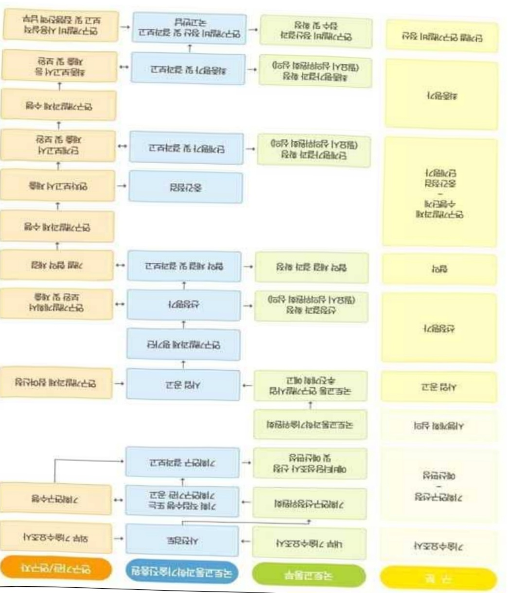
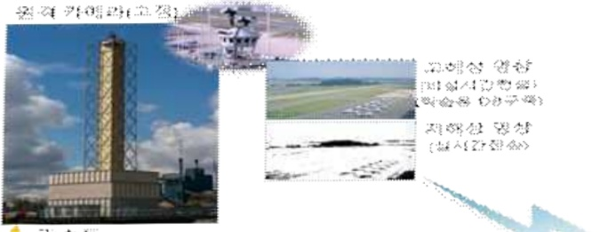
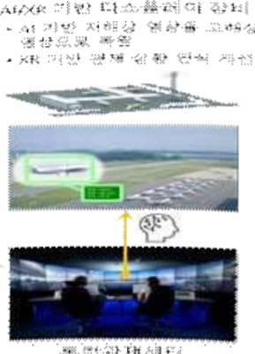
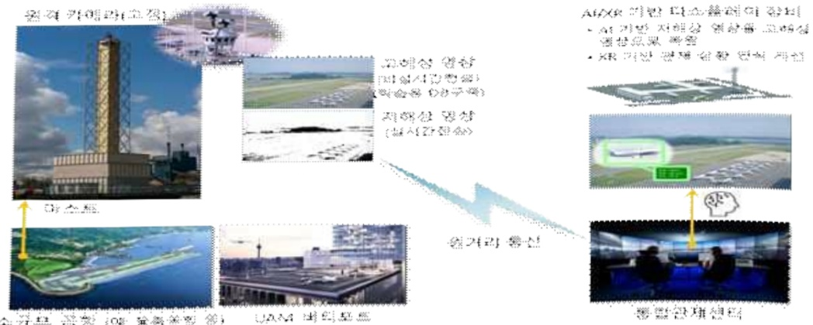
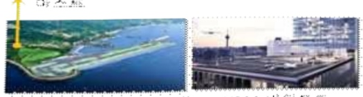

# AIXR기반비행장원격관제운용기술개발(R&D)

**해당 페이지**: PDF 2087 ~ 2094 쪽 해당

**부처**: 국토교통부
**분야**: 교통 및 물류
**회계유형**: 교통시설 특별회계
**2026 확정예산**: 3596.0 백만원
**전년대비 증감률**: 139.7%
**AI 도메인**: 교통/모빌리티, 문화/콘텐츠

---

<table border=1 style='margin: auto; word-wrap: break-word;'><tr><td style='text-align: center; word-wrap: break-word;'>사 업 명</td></tr><tr><td style='text-align: center; word-wrap: break-word;'>(55) AI-XR기반 비행장원격관제 운용기술개발(R&amp;D) (4161-337)</td></tr></table>

□ 사업 코드 정보

<table border=1 style='margin: auto; word-wrap: break-word;'><tr><td style='text-align: center; word-wrap: break-word;'>구분</td><td style='text-align: center; word-wrap: break-word;'>회계</td><td style='text-align: center; word-wrap: break-word;'>소관</td><td style='text-align: center; word-wrap: break-word;'>실국(기관)</td><td style='text-align: center; word-wrap: break-word;'>계정</td><td style='text-align: center; word-wrap: break-word;'>분야</td><td style='text-align: center; word-wrap: break-word;'>부문</td></tr><tr><td style='text-align: center; word-wrap: break-word;'>코드</td><td style='text-align: center; word-wrap: break-word;'>교통시설</td><td rowspan="2">국토교통부</td><td rowspan="2">항공안전정책관</td><td style='text-align: center; word-wrap: break-word;'>항공공항</td><td style='text-align: center; word-wrap: break-word;'>120</td><td style='text-align: center; word-wrap: break-word;'>126</td></tr><tr><td style='text-align: center; word-wrap: break-word;'>명칭</td><td style='text-align: center; word-wrap: break-word;'>특별회계</td><td style='text-align: center; word-wrap: break-word;'>계정</td><td style='text-align: center; word-wrap: break-word;'>교통및물류</td><td style='text-align: center; word-wrap: break-word;'>물류등기타</td></tr></table>

<table border=1 style='margin: auto; word-wrap: break-word;'><tr><td style='text-align: center; word-wrap: break-word;'>구분</td><td style='text-align: center; word-wrap: break-word;'>프로그램</td><td style='text-align: center; word-wrap: break-word;'>단위사업</td><td style='text-align: center; word-wrap: break-word;'>세부사업</td></tr><tr><td style='text-align: center; word-wrap: break-word;'>코드</td><td style='text-align: center; word-wrap: break-word;'>4100</td><td style='text-align: center; word-wrap: break-word;'>4161</td><td style='text-align: center; word-wrap: break-word;'>337</td></tr><tr><td style='text-align: center; word-wrap: break-word;'>명칭</td><td style='text-align: center; word-wrap: break-word;'>국토교통연구개발</td><td style='text-align: center; word-wrap: break-word;'>항공기술연구</td><td style='text-align: center; word-wrap: break-word;'>AI-XR기반비행장원격관제 운용기술개발(R&amp;D)</td></tr></table>

□ 사업 성격

<table border=1 style='margin: auto; word-wrap: break-word;'><tr><td rowspan="2">신규</td><td rowspan="2">계속</td><td rowspan="2">완료</td><td style='text-align: center; word-wrap: break-word;'>예비타당성</td><td style='text-align: center; word-wrap: break-word;'>총사업비</td><td style='text-align: center; word-wrap: break-word;'>총액계상</td><td style='text-align: center; word-wrap: break-word;'>사업소관 변경정보</td></tr><tr><td style='text-align: center; word-wrap: break-word;'>실시여부</td><td style='text-align: center; word-wrap: break-word;'>관리대상</td><td style='text-align: center; word-wrap: break-word;'>예산사업</td><td style='text-align: center; word-wrap: break-word;'>2025예산 시 소관</td></tr><tr><td style='text-align: center; word-wrap: break-word;'></td><td style='text-align: center; word-wrap: break-word;'>○</td><td style='text-align: center; word-wrap: break-word;'></td><td style='text-align: center; word-wrap: break-word;'></td><td style='text-align: center; word-wrap: break-word;'></td><td style='text-align: center; word-wrap: break-word;'></td><td style='text-align: center; word-wrap: break-word;'>국토교통부</td></tr></table>

□ 사업 지원 형태 및 지원율

<table border=1 style='margin: auto; word-wrap: break-word;'><tr><td style='text-align: center; word-wrap: break-word;'>직접</td><td style='text-align: center; word-wrap: break-word;'>출자</td><td style='text-align: center; word-wrap: break-word;'>출연</td><td style='text-align: center; word-wrap: break-word;'>보조</td><td style='text-align: center; word-wrap: break-word;'>융자</td><td style='text-align: center; word-wrap: break-word;'>국고보조율(%)</td><td style='text-align: center; word-wrap: break-word;'>융자율(%)</td></tr><tr><td style='text-align: center; word-wrap: break-word;'></td><td style='text-align: center; word-wrap: break-word;'></td><td style='text-align: center; word-wrap: break-word;'>○</td><td style='text-align: center; word-wrap: break-word;'></td><td style='text-align: center; word-wrap: break-word;'></td><td style='text-align: center; word-wrap: break-word;'></td><td style='text-align: center; word-wrap: break-word;'></td></tr></table>

## □ 사업 담당자

<table border=1 style='margin: auto; word-wrap: break-word;'><tr><td style='text-align: center; word-wrap: break-word;'>사업명</td><td colspan="2">구분</td></tr><tr><td rowspan="2">AI-XR기반 비행장원격 관제운용기술 개발(R&amp;D)</td><td style='text-align: center; word-wrap: break-word;'>소관부처</td><td style='text-align: center; word-wrap: break-word;'>실·국·과(팀) 항공안전정책관 항행위성정책과</td></tr><tr><td style='text-align: center; word-wrap: break-word;'>사업시행주체</td><td style='text-align: center; word-wrap: break-word;'>국토교통과학기술진흥원 항공우주실</td></tr></table>

---

### 가.예산 총괄표

(단위: 백만원, %)

<table border=1 style='margin: auto; word-wrap: break-word;'><tr><td rowspan="2">사업명</td><td rowspan="2">2024년 결산</td><td colspan="2">2025년 예산</td><td colspan="2">2026년</td><td rowspan="2">중감(B-A)</td><td rowspan="2">(B-A)/A</td></tr><tr><td style='text-align: center; word-wrap: break-word;'>본예산(A)</td><td style='text-align: center; word-wrap: break-word;'>추경</td><td style='text-align: center; word-wrap: break-word;'>정부안</td><td style='text-align: center; word-wrap: break-word;'>확정(B)</td></tr><tr><td style='text-align: center; word-wrap: break-word;'>AI-XR기반비행장 원격관제운용기술 개발(R&amp;D)</td><td style='text-align: center; word-wrap: break-word;'>-</td><td style='text-align: center; word-wrap: break-word;'>1,500</td><td style='text-align: center; word-wrap: break-word;'>1,500</td><td style='text-align: center; word-wrap: break-word;'>3,596</td><td style='text-align: center; word-wrap: break-word;'>3,596</td><td style='text-align: center; word-wrap: break-word;'>2,096</td><td style='text-align: center; word-wrap: break-word;'>139.7</td></tr></table>

## □ 기능별(내역사업별), 목별 예산 내역

(단위:백만원)

<table border=1 style='margin: auto; word-wrap: break-word;'><tr><td rowspan="3"></td><td colspan="5">2024</td><td colspan="7">2025(2025.12.11)</td><td rowspan="3">2026</td></tr><tr><td rowspan="2">예산액(추경)</td><td rowspan="2">예산현액</td><td rowspan="2">집행액[실집행액]</td><td rowspan="2">이월액</td><td rowspan="2">불용액</td><td rowspan="2">본예산</td><td rowspan="2">예산현액</td><td rowspan="2">집행액[실집행액]</td><td colspan="2">전년도아월액제외</td><td rowspan="2">이월예상액</td><td rowspan="2">불용예상액</td></tr><tr><td style='text-align: center; word-wrap: break-word;'>예산현액</td><td style='text-align: center; word-wrap: break-word;'>집행액[실집행액]</td></tr><tr><td style='text-align: center; word-wrap: break-word;'>○ 기능별 분류(합계)</td><td style='text-align: center; word-wrap: break-word;'>-</td><td style='text-align: center; word-wrap: break-word;'>-</td><td style='text-align: center; word-wrap: break-word;'>-</td><td style='text-align: center; word-wrap: break-word;'>-</td><td style='text-align: center; word-wrap: break-word;'>-</td><td style='text-align: center; word-wrap: break-word;'>1,500</td><td style='text-align: center; word-wrap: break-word;'>1,500</td><td style='text-align: center; word-wrap: break-word;'>1,500[1,500]</td><td style='text-align: center; word-wrap: break-word;'>1,500</td><td style='text-align: center; word-wrap: break-word;'>1,500[1,500]</td><td style='text-align: center; word-wrap: break-word;'>-</td><td style='text-align: center; word-wrap: break-word;'>-</td><td style='text-align: center; word-wrap: break-word;'>3,596</td></tr><tr><td style='text-align: center; word-wrap: break-word;'>· 다중비행장원격통합관제운용기술개발</td><td style='text-align: center; word-wrap: break-word;'>-</td><td style='text-align: center; word-wrap: break-word;'>-</td><td style='text-align: center; word-wrap: break-word;'>-</td><td style='text-align: center; word-wrap: break-word;'>-</td><td style='text-align: center; word-wrap: break-word;'>-</td><td style='text-align: center; word-wrap: break-word;'>1,500</td><td style='text-align: center; word-wrap: break-word;'>1,500</td><td style='text-align: center; word-wrap: break-word;'>1,500[1,500]</td><td style='text-align: center; word-wrap: break-word;'>1,500</td><td style='text-align: center; word-wrap: break-word;'>1,500[1,500]</td><td style='text-align: center; word-wrap: break-word;'>-</td><td style='text-align: center; word-wrap: break-word;'>-</td><td style='text-align: center; word-wrap: break-word;'>3,596</td></tr><tr><td style='text-align: center; word-wrap: break-word;'>○ 비목별 분류(합계)</td><td style='text-align: center; word-wrap: break-word;'>-</td><td style='text-align: center; word-wrap: break-word;'>-</td><td style='text-align: center; word-wrap: break-word;'>-</td><td style='text-align: center; word-wrap: break-word;'>-</td><td style='text-align: center; word-wrap: break-word;'>-</td><td style='text-align: center; word-wrap: break-word;'>1,500</td><td style='text-align: center; word-wrap: break-word;'>1,500</td><td style='text-align: center; word-wrap: break-word;'>1,500[1,500]</td><td style='text-align: center; word-wrap: break-word;'>1,500</td><td style='text-align: center; word-wrap: break-word;'>1,500[1,500]</td><td style='text-align: center; word-wrap: break-word;'>-</td><td style='text-align: center; word-wrap: break-word;'>-</td><td style='text-align: center; word-wrap: break-word;'>3,596</td></tr><tr><td style='text-align: center; word-wrap: break-word;'>· 연구활동비등(360-05)</td><td style='text-align: center; word-wrap: break-word;'>-</td><td style='text-align: center; word-wrap: break-word;'>-</td><td style='text-align: center; word-wrap: break-word;'>-</td><td style='text-align: center; word-wrap: break-word;'>-</td><td style='text-align: center; word-wrap: break-word;'>-</td><td style='text-align: center; word-wrap: break-word;'>1,500</td><td style='text-align: center; word-wrap: break-word;'>1,500</td><td style='text-align: center; word-wrap: break-word;'>1,500[1,500]</td><td style='text-align: center; word-wrap: break-word;'>1,500</td><td style='text-align: center; word-wrap: break-word;'>1,500[1,500]</td><td style='text-align: center; word-wrap: break-word;'>-</td><td style='text-align: center; word-wrap: break-word;'>-</td><td style='text-align: center; word-wrap: break-word;'>3,596</td></tr></table>

### 나.사업설명자료

## 1 ) 사업목적·내용

- (다중 비행장 원격통합관제 운용기술 개발) 인공지능(AI), 확장현실(XR) 등 첨단 기술을 활용하여 관제사 상황인식 능력을 향상시켜 육안관제 한계를 대응하고, 교통량이 적은 지방 및 도서지 소형공항, UAM 버티포트 등의 관제탑 구축/운용 비용절감 및 관제사 업무 효율화 실현을 위한 다중 비행장 원격통합관제 운용기술 개발

---

## 2 ) 사업개요

## □ 사업근거 및 추진경위

① 법령상 근거 조항 적시 :

- 항공사업법 제3조(항공정책기본계획의 수립) 및 제5조(항공기술개발계획의 수립)

- 국가통합교통체계효율화법 제98조(교통기술 연구 · 개발사업의 추진)

- 국토교통과학기술 육성법 제8조(연구개발사업의 추진)

② 추진경위 - 사업 시작년도, 추진배경, 부처별 중점과제, 대통령 공약사항 등

- '21.08~'22.09 : 기획연구 추진

- '23.02 : '23년 국토교통과학기술 연구개발사업 시행 공고

- '25.01. 국토교통과학기술 연구개발사업 시행계획 반영

- '25.04 : 연구수행기관 선정 및 연구개발 착수

## □ 주요내용

① 사업규모

- 총사업비 : 해당없음

- 사업기간 : '25 ~ '29

- 최근 5년 간 투입된 사업비(예산액기준, 추경편성한 연도에는 추경포함)

<table border=1 style='margin: auto; word-wrap: break-word;'><tr><td style='text-align: center; word-wrap: break-word;'>$ \underline{\text{焼成}} $</td><td style='text-align: center; word-wrap: break-word;'>2022</td><td style='text-align: center; word-wrap: break-word;'>2023</td><td style='text-align: center; word-wrap: break-word;'>2024</td><td style='text-align: center; word-wrap: break-word;'>2025</td><td style='text-align: center; word-wrap: break-word;'>2026</td></tr><tr><td style='text-align: center; word-wrap: break-word;'>$ \underline{\text{사업비}} $</td><td style='text-align: center; word-wrap: break-word;'>-</td><td style='text-align: center; word-wrap: break-word;'>-</td><td style='text-align: center; word-wrap: break-word;'>-</td><td style='text-align: center; word-wrap: break-word;'>1,500</td><td style='text-align: center; word-wrap: break-word;'>3,596</td></tr></table>

-기타: 해당없음

② 사업추진체계

- 사업시행방법 : 출연(참여기업이 있는 경우 Matching)

- 사업시행주체 : 국토교통부(전문기관 : 국토교통과학기술진흥원)

- 사업 수혜자 : 대학, 기업, 출연연 등

- 보조, 융자, 출연, 출자 등의 경우 보조·융자 등 지원 비율 및 법적근거

---

<table border=1 style='margin: auto; word-wrap: break-word;'><tr><td style='text-align: center; word-wrap: break-word;'>내역사업명</td><td style='text-align: center; word-wrap: break-word;'>구분</td><td style='text-align: center; word-wrap: break-word;'>피보조·피출연 등 기관명</td><td style='text-align: center; word-wrap: break-word;'>지원 금액 (2026예산)</td><td style='text-align: center; word-wrap: break-word;'>지원 비율(%)</td><td style='text-align: center; word-wrap: break-word;'>보조율 법적근거 (해당 조항)</td></tr><tr><td rowspan="3">다중 비행장 원격통합관제 운용기술 개발</td><td rowspan="3">출연</td><td style='text-align: center; word-wrap: break-word;'>「중소기업기본법」제2조에 따른 중소기업에 해당하는 연구개발기관</td><td rowspan="3">3,596 백만원</td><td style='text-align: center; word-wrap: break-word;'>연구개발 비의 100분의 75 이하</td><td rowspan="3">「국가연구개발 혁신법 시행령」제19조</td></tr><tr><td style='text-align: center; word-wrap: break-word;'>「중견기업 성장촉진 및 경쟁력 강화에 관한 특별법」제2조제1호에 따른 중견기업에 해당하는 연구개발기관</td><td style='text-align: center; word-wrap: break-word;'>연구개발 비의 100분의 70 이하</td></tr><tr><td style='text-align: center; word-wrap: break-word;'>「공공기관의 운영에 관한 법률」제5조제4항제1호에 따른 공기업에 해당하거나 ‘가’, ‘나’에 해당 해당하지 않는 연구개발기관</td><td style='text-align: center; word-wrap: break-word;'>연구개발 비의 100분의 50 이하</td></tr></table>

* 다만 중앙행정기관의 장이 필요하다고 인정하는 국가연구개발사업에 대하여 별도로 정할 수 있음

## 3 ) 2026년도 예산 산출 근거

① 다중 비행장 원격통합관제 운용기술 개발

:(25)1,500백만원→(26요구)3,596백만원,2,096백만원증액

- (요구) 비행장 통합관제 테스트베드 설계, 감시/처리/통신기술 기본설계, 인증기술 연구 등의 필요성

이 인정되어 소요예산 3,596백만원 요구

- (산출) ① 테스트베드 실시설계 및 시험계획 수립 등에 1,379백만원

② 비행장감시/자료융합처리/최적통신망 기본설계 등에 2,032백만원

③ 법제도 제개정, 인증기준 요구도 도출 등에 185백만원

·(계속/신규) 1개 × 3,596백만원 × 12/12 = 3,596백만원

ㅇ 2025년도 예산 및 2026년도 예산 산출 세부내역 비교

<table border=1 style='margin: auto; word-wrap: break-word;'><tr><td colspan="2">2025년 예산</td><td colspan="2">2026년 예산</td></tr><tr><td style='text-align: center; word-wrap: break-word;'>예산</td><td style='text-align: center; word-wrap: break-word;'>산출내역</td><td style='text-align: center; word-wrap: break-word;'>예산</td><td style='text-align: center; word-wrap: break-word;'>산출내역</td></tr><tr><td style='text-align: center; word-wrap: break-word;'>다중 비행장 원격통합 관제 운용기술 개발 1,500</td><td style='text-align: center; word-wrap: break-word;'>○ 연구활동비 등(360-05) : 1,500백만원 가. 원격통합관제서비스 운용기술개발 417백만원 · 원격통합관제 서비스 및 운용개념 설계 등에 417백만원 나. 원격통합관제시스템 설계/제작기술개발 933백만원 · 원격통합관제 시스템 요구도 수립 등에 933백만원 다. 원격통합관제시스템 시범인증 수행 150백만원 · 원격관제시스템 인증 요구도 수립 등에 150백만원</td><td style='text-align: center; word-wrap: break-word;'>다중 비행장 원격통합 관제 운용기술 개발 3,596</td><td style='text-align: center; word-wrap: break-word;'>○ 연구활동비 등(360-05) : 3,596만원 가. 원격통합관제서비스 운용기술개발 1,379백만원 · 테스트베드 실시설계 및 시험계획 수립 등에 1,379백만원 나. 원격통합관제시스템 설계/제작기술개발 2,032백만원 · 비행장 감시/자료융합처리/최적통신망 기본설계 등에 2,032백만원 다. 원격통합관제시스템 시범인증 수행 185백만원 · 법제도 제개정, 인증기준 요구도 도출 등에 185백만원</td></tr></table>

---

## 4 ) 사업효과

□ 사업영향, 산출물 성과지표 등

① 2022~2026년도 성과계획서 상 성과지표 및 최근 5년간 성과 달성도 : 전략계획서 작성 예정

② 성과지표 이외의 연도별 사업추진 경과 및 실적

<table border=1 style='margin: auto; word-wrap: break-word;'><tr><td style='text-align: center; word-wrap: break-word;'>2023</td><td style='text-align: center; word-wrap: break-word;'>-</td></tr><tr><td style='text-align: center; word-wrap: break-word;'>2024</td><td style='text-align: center; word-wrap: break-word;'>-</td></tr><tr><td style='text-align: center; word-wrap: break-word;'>2025</td><td style='text-align: center; word-wrap: break-word;'>- 국토교통연구개발사업 시행 공고(&#x27;25.2) - 연구개발기관 협약체결(&#x27;25.4)</td></tr></table>

③ 향후(2026년도 이후) 기대효과

- 첨단 항행안전시설 개발 구축 전략이행으로 미래형 통합관제시스템 개발 기반, 신기술·신비행체 적용 창공교통관리체계로 AI-XR 기반 통합관제서비스 제공 가능 인공지능(AI) 및 증강현실(AR) 등 첨단 ICT 기술을 활용한 통합관제시스템 구축을 통해 안전한 미래형 항공교통시스템 기반 마련

- 초연결 통신망 등 첨단 ICT 기술을 활용하여 UAM 등 신개념 항공기 이착륙을 위한 항공교통관제업무에 활용 가능

-공항건설 및 운용 비용 절감을 통해 신공항 활성화 및 노후 공항 현대화에 기여

* 1970년대 이전에 취향하여 50년 이상 된 9개 노후 공항에 대해서 단계적으로 현대화 추진 (김포('58), 김해('58), 제주('48), 광주('49), 대구('61), 울산('70), 포항('70), 사천('69), 여수('72))

*단계별로 2개 공항씩 통합관제시스템 적용 시 총 2,662.9억원의 비용 절감 효과가 있음

<table border=1 style='margin: auto; word-wrap: break-word;'><tr><td style='text-align: center; word-wrap: break-word;'>구분</td><td style='text-align: center; word-wrap: break-word;'>1단계(&#x27;31～)</td><td style='text-align: center; word-wrap: break-word;'>2단계(&#x27;33～)</td><td style='text-align: center; word-wrap: break-word;'>3단계(&#x27;35～)</td><td style='text-align: center; word-wrap: break-word;'>4단계(&#x27;37～)</td><td style='text-align: center; word-wrap: break-word;'>계</td></tr><tr><td style='text-align: center; word-wrap: break-word;'>구축 비용 절감</td><td style='text-align: center; word-wrap: break-word;'>335.9억원</td><td style='text-align: center; word-wrap: break-word;'>352.9억원</td><td style='text-align: center; word-wrap: break-word;'>370.8억원</td><td style='text-align: center; word-wrap: break-word;'>389.5억원</td><td style='text-align: center; word-wrap: break-word;'>1,449.1억원</td></tr><tr><td style='text-align: center; word-wrap: break-word;'>운용 비용 절감</td><td style='text-align: center; word-wrap: break-word;'>142.2억원</td><td style='text-align: center; word-wrap: break-word;'>149.4억원</td><td style='text-align: center; word-wrap: break-word;'>156.9억원</td><td style='text-align: center; word-wrap: break-word;'>164.9억원</td><td style='text-align: center; word-wrap: break-word;'>613.4억원</td></tr><tr><td style='text-align: center; word-wrap: break-word;'>인력 비용 절감</td><td style='text-align: center; word-wrap: break-word;'>138.3억원</td><td style='text-align: center; word-wrap: break-word;'>145.9억원</td><td style='text-align: center; word-wrap: break-word;'>153.9억원</td><td style='text-align: center; word-wrap: break-word;'>162.3억원</td><td style='text-align: center; word-wrap: break-word;'>600.4억원</td></tr></table>

<table border=1 style='margin: auto; word-wrap: break-word;'><tr><td style='text-align: center; word-wrap: break-word;'>구분</td><td style='text-align: center; word-wrap: break-word;'>구축 비용</td><td style='text-align: center; word-wrap: break-word;'>유지·보수 비용 $ ^{31} $</td></tr><tr><td style='text-align: center; word-wrap: break-word;'>기존 관제탑</td><td style='text-align: center; word-wrap: break-word;'>£12M (192억원) $ ^{32} $</td><td style='text-align: center; word-wrap: break-word;'>연간 £1.2M (연간 19.2억원)</td></tr><tr><td style='text-align: center; word-wrap: break-word;'>통합관제(단일공항)</td><td style='text-align: center; word-wrap: break-word;'>마스트 : £2M (32억원) 통합관제센터 : £2M (32억원)</td><td style='text-align: center; word-wrap: break-word;'>연간 £0.2M (연간 3.2억원)</td></tr></table>

주1. 운영(유지·보수) 비용은 구축 비용의 10%로 산정 / 주2. 적용 환율 : £1.00 = 1,600원

"Multiple remote tower for Single European Sky: The evolution from initial operational concept to regulatory approved implementation", Transportation Research Part A 116 (2018) pp.15 - 30)

5) 타당성조사 및 예비타당성조사 시행여부 및 결과 요지 : 해당없음

6) 총사업비 대상사업 여부 및 내역 : 해당없음

---

<table border=1 style='margin: auto; word-wrap: break-word;'><tr><td style='text-align: center; word-wrap: break-word;'>부처</td><td style='text-align: center; word-wrap: break-word;'></td><td style='text-align: center; word-wrap: break-word;'>피출연·피보조기관</td><td style='text-align: center; word-wrap: break-word;'></td><td style='text-align: center; word-wrap: break-word;'>간접보조사업자·사업수행자</td></tr><tr><td style='text-align: center; word-wrap: break-word;'>국토교통부(3,596백만원)</td><td style='text-align: center; word-wrap: break-word;'>=&gt;(3,596백만원)</td><td style='text-align: center; word-wrap: break-word;'>국토교통과학기술진흥원(3,596백만원)</td><td style='text-align: center; word-wrap: break-word;'>=&gt;(3,596백만원)</td><td style='text-align: center; word-wrap: break-word;'>항공우주산학융합원 외 11 기관</td></tr></table>

<AI-XR기반비행장원격관제운용기술개발>

---

## 8 ) 중기재정계획 상 연도별 투자계획 및 추진경과

(단위: 백만원)

<table border=1 style='margin: auto; word-wrap: break-word;'><tr><td style='text-align: center; word-wrap: break-word;'>2024~2028</td><td style='text-align: center; word-wrap: break-word;'>2024</td><td style='text-align: center; word-wrap: break-word;'>2025</td><td style='text-align: center; word-wrap: break-word;'>2026</td><td style='text-align: center; word-wrap: break-word;'>2027</td><td style='text-align: center; word-wrap: break-word;'>2028</td><td style='text-align: center; word-wrap: break-word;'>2029</td></tr><tr><td rowspan="2">2025~2029</td><td rowspan="2">-</td><td style='text-align: center; word-wrap: break-word;'>1,500</td><td style='text-align: center; word-wrap: break-word;'>7,500</td><td style='text-align: center; word-wrap: break-word;'>8,800</td><td style='text-align: center; word-wrap: break-word;'>7,500</td><td style='text-align: center; word-wrap: break-word;'>☑</td></tr><tr><td style='text-align: center; word-wrap: break-word;'>1,500</td><td style='text-align: center; word-wrap: break-word;'>3,596</td><td style='text-align: center; word-wrap: break-word;'>7,500</td><td style='text-align: center; word-wrap: break-word;'>7,500</td><td style='text-align: center; word-wrap: break-word;'>4,800</td></tr></table>

9) 최근 3년간 동 사업에 대한 주요 외부지적사항 및 평가, 문제점 및 대책 : 해당없음

## 10 ) 향후 추진방향 및 추진계획

o 공항 운영의 안전성 및 효율성 확보를 위하여 도서/내륙 비행장 및 UAM 버티포트에서 운용할 수 있는 원격통합관제시스템 개발 및 운용성 검증·확인

- (중점1) 저용량 통신망 환경(100Mbps급)에서 다수의 카메라 등을 이용하여 원격지실증 공항 2개소 이상을 동시에 관계하는 원격통합관제시스템 개발

* FAA Remote Tower Requirement(Draft)의 RTCA DO-278A 보증 수준에 준해 소프트웨어 기술기준 적합성 입증

- (중점2) 공항 원격통합관제서비스 운용기술 개발 및 테스트베드 운용·성능입증

* 운용성·안전성 평가연구, 교육프로그램 개발, 법제도 제개정, 테스트베드 구축 및 시범운용 등

- (중점3) 공항 원격통합관제시스템 인증기술 개발 및 관련 법제도 연구

* 기술기준 및 적합성 검사기술 개발(센서, 통신, 자료처리, 환경 등), 법/제도/정책(안) 도출

<원격통합관제시스템 개념도(안)>

A×× 叶

(1) 10

## 11 ) 해당사업에 대한 각종 사업평가의 결과

---

1) 「국가재정법」제85조의8제1항에 따른 재정사업자율평가 결과에 대한 기획재정부의 상위평가(심층평가) 결과 : 해당없음

2) R&D사업의 경우「국가연구개발사업 등의 성과평가 및 성과관리에 관한 법률」

제7조제3항에 따른 부처의 R&D사업 자체성과평가에 대한 과학기술정보통신부

상위평가 결과 : 해당없음

3) 그 외 보조사업 연장평가, 재정지원 일자리사업 평가 등 개별 법률에 규정된 평가 시행 결과 : 해당없음

12) 해당사업에 대한 부처 자체평가의 결과

<table border=1 style='margin: auto; word-wrap: break-word;'><tr><td style='text-align: center; word-wrap: break-word;'>1) 2023년도 부처 재정사업 자율평가 결과: 해당없음</td></tr><tr><td style='text-align: center; word-wrap: break-word;'>2) 2024년도 부처 재정사업 자율평가 결과: 해당없음</td></tr><tr><td style='text-align: center; word-wrap: break-word;'>3) 2025년도 부처 재정사업 자율평가 결과: 해당없음</td></tr></table>

2) 2024년도 부처 재정사업 자율평가 결과: 해당없음

3) 2025년도 부처 재정사업 자율평가 결과: 해당없음

## 13 ) 부처 건의사항 : 해당없음

---

### 원본 PDF 크롭 이미지

