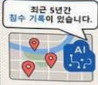
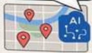
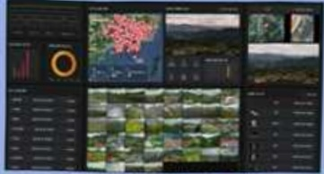
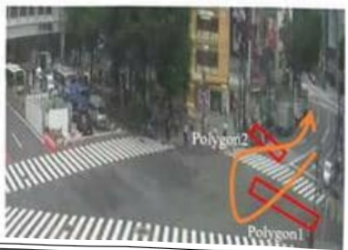
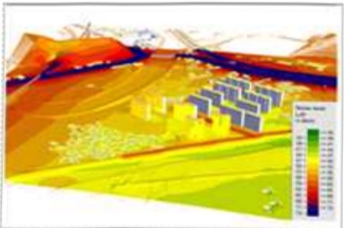
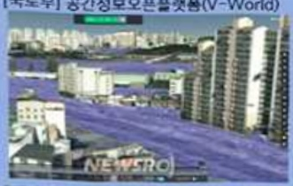
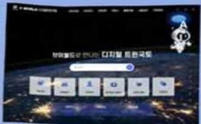

# 공간지식추론엔진기술개발(R&D)

**해당 페이지**: PDF 2194 ~ 2203 쪽 해당

**부처**: 국토교통부
**분야**: 교통 및 물류
**회계유형**: 일반회계
**2026 확정예산**: 3807.0 백만원
**전년대비 증감률**: None%
**AI 도메인**: LLM/언어모델, 데이터

---

<table border=1 style='margin: auto; word-wrap: break-word;'><tr><td style='text-align: center; word-wrap: break-word;'>사 업 명</td></tr><tr><td style='text-align: center; word-wrap: break-word;'>(62) 공간지식추론 엔진기술개발(R&amp;D) (4156-321)</td></tr></table>

□ 사업 코드 정보

<table border=1 style='margin: auto; word-wrap: break-word;'><tr><td style='text-align: center; word-wrap: break-word;'>구분</td><td style='text-align: center; word-wrap: break-word;'>회계</td><td style='text-align: center; word-wrap: break-word;'>소관</td><td style='text-align: center; word-wrap: break-word;'>실국(기관)</td><td style='text-align: center; word-wrap: break-word;'>계정</td><td style='text-align: center; word-wrap: break-word;'>분야</td><td style='text-align: center; word-wrap: break-word;'>부문</td></tr><tr><td style='text-align: center; word-wrap: break-word;'>코드</td><td rowspan="2">일반회계</td><td rowspan="2">국토교통부</td><td style='text-align: center; word-wrap: break-word;'>국토도시실</td><td rowspan="2">-</td><td style='text-align: center; word-wrap: break-word;'>120</td><td style='text-align: center; word-wrap: break-word;'>126</td></tr><tr><td style='text-align: center; word-wrap: break-word;'>명칭</td><td style='text-align: center; word-wrap: break-word;'>국토정보정책관</td><td style='text-align: center; word-wrap: break-word;'>교통및물류</td><td style='text-align: center; word-wrap: break-word;'>물류등기타</td></tr></table>

<table border=1 style='margin: auto; word-wrap: break-word;'><tr><td style='text-align: center; word-wrap: break-word;'>구분</td><td style='text-align: center; word-wrap: break-word;'>프로그램</td><td style='text-align: center; word-wrap: break-word;'>단위사업</td><td style='text-align: center; word-wrap: break-word;'>세부사업</td></tr><tr><td style='text-align: center; word-wrap: break-word;'>코드</td><td style='text-align: center; word-wrap: break-word;'>4100</td><td style='text-align: center; word-wrap: break-word;'>4156</td><td style='text-align: center; word-wrap: break-word;'>321</td></tr><tr><td style='text-align: center; word-wrap: break-word;'>명칭</td><td style='text-align: center; word-wrap: break-word;'>국토교통연구개발</td><td style='text-align: center; word-wrap: break-word;'>도시건축연구</td><td style='text-align: center; word-wrap: break-word;'>공간지식추론엔진 기술개발(R&amp;D)</td></tr></table>

☐ 사업 성격

<table border=1 style='margin: auto; word-wrap: break-word;'><tr><td style='text-align: center; word-wrap: break-word;'>신규 계속</td><td style='text-align: center; word-wrap: break-word;'>완료</td><td style='text-align: center; word-wrap: break-word;'>예비타당성 실시여부</td><td style='text-align: center; word-wrap: break-word;'>총사업비 관리대상</td><td style='text-align: center; word-wrap: break-word;'>총액계상 예산사업</td><td style='text-align: center; word-wrap: break-word;'>사업소관 변경정보 2025예산 시 소관</td></tr><tr><td style='text-align: center; word-wrap: break-word;'></td><td style='text-align: center; word-wrap: break-word;'>☐</td><td style='text-align: center; word-wrap: break-word;'></td><td style='text-align: center; word-wrap: break-word;'></td><td style='text-align: center; word-wrap: break-word;'></td><td style='text-align: center; word-wrap: break-word;'>국토교통부</td></tr></table>

□ 사업 지원 형태 및 지원율

<table border=1 style='margin: auto; word-wrap: break-word;'><tr><td style='text-align: center; word-wrap: break-word;'>직접</td><td style='text-align: center; word-wrap: break-word;'>출자</td><td style='text-align: center; word-wrap: break-word;'>출연</td><td style='text-align: center; word-wrap: break-word;'>보조</td><td style='text-align: center; word-wrap: break-word;'>융자</td><td style='text-align: center; word-wrap: break-word;'>국고보조율(%)</td><td style='text-align: center; word-wrap: break-word;'>융자율(%)</td></tr><tr><td style='text-align: center; word-wrap: break-word;'></td><td style='text-align: center; word-wrap: break-word;'></td><td style='text-align: center; word-wrap: break-word;'>○</td><td style='text-align: center; word-wrap: break-word;'></td><td style='text-align: center; word-wrap: break-word;'></td><td style='text-align: center; word-wrap: break-word;'></td><td style='text-align: center; word-wrap: break-word;'></td></tr></table>

## □ 사업 담당자

<table border=1 style='margin: auto; word-wrap: break-word;'><tr><td style='text-align: center; word-wrap: break-word;'>사업명</td><td colspan="2">구분</td></tr><tr><td rowspan="6">공간지식추론 엔진기술개발 (R&amp;D)</td><td rowspan="4">소관부처</td><td style='text-align: center; word-wrap: break-word;'>실·국·과(팀)</td></tr><tr><td style='text-align: center; word-wrap: break-word;'>국토도시실</td></tr><tr><td style='text-align: center; word-wrap: break-word;'>국토정보정책관</td></tr><tr><td style='text-align: center; word-wrap: break-word;'>국가공간정보센터</td></tr><tr><td rowspan="2">사업시행주체</td><td style='text-align: center; word-wrap: break-word;'>국토교통과학기술진흥원</td></tr><tr><td style='text-align: center; word-wrap: break-word;'>도시공간정보실</td></tr></table>

---

### 가.예산 총괄표

(단위: 백만원, %)

<table border=1 style='margin: auto; word-wrap: break-word;'><tr><td rowspan="2">사업명</td><td rowspan="2">2024년 결산</td><td colspan="2">2025년 예산</td><td colspan="2">2026년</td><td rowspan="2">증감(B-A)</td><td rowspan="2">(B-A)/A</td></tr><tr><td style='text-align: center; word-wrap: break-word;'>본예산(A)</td><td style='text-align: center; word-wrap: break-word;'>추경</td><td style='text-align: center; word-wrap: break-word;'>정부안</td><td style='text-align: center; word-wrap: break-word;'>확정(B)</td></tr><tr><td style='text-align: center; word-wrap: break-word;'>공간지식추론엔진 기술개발(R&amp;D)</td><td style='text-align: center; word-wrap: break-word;'>1,037</td><td style='text-align: center; word-wrap: break-word;'>2,128</td><td style='text-align: center; word-wrap: break-word;'>2,128</td><td style='text-align: center; word-wrap: break-word;'>3,807</td><td style='text-align: center; word-wrap: break-word;'>3,807</td><td style='text-align: center; word-wrap: break-word;'>1,679</td><td style='text-align: center; word-wrap: break-word;'>78.9%</td></tr></table>

## □ 기능별(내역사업별), 목별 예산 내역

(단위:백만원)

<table border=1 style='margin: auto; word-wrap: break-word;'><tr><td rowspan="3"></td><td colspan="5">2024</td><td colspan="7">2025(2025.12월말)</td><td rowspan="3">2026예산</td></tr><tr><td rowspan="2">예산액(추경)</td><td rowspan="2">예산현액</td><td rowspan="2">집행액[실집행액]</td><td rowspan="2">이월액</td><td rowspan="2">불용액</td><td rowspan="2">분예산</td><td rowspan="2">예산현액</td><td rowspan="2">집행액[실집행액]</td><td colspan="2">전년도이월액제외</td><td rowspan="2">이월예상액</td><td rowspan="2">불용예상액</td></tr><tr><td style='text-align: center; word-wrap: break-word;'>예산현액</td><td style='text-align: center; word-wrap: break-word;'>집행액[실집행액]</td></tr><tr><td style='text-align: center; word-wrap: break-word;'>○ 기능별 분류(합계)</td><td style='text-align: center; word-wrap: break-word;'>1,037</td><td style='text-align: center; word-wrap: break-word;'>1,037</td><td style='text-align: center; word-wrap: break-word;'>1,037</td><td style='text-align: center; word-wrap: break-word;'>-</td><td style='text-align: center; word-wrap: break-word;'>-</td><td style='text-align: center; word-wrap: break-word;'>2,128</td><td style='text-align: center; word-wrap: break-word;'>2,128</td><td style='text-align: center; word-wrap: break-word;'>2,128</td><td style='text-align: center; word-wrap: break-word;'>2,128</td><td style='text-align: center; word-wrap: break-word;'>2,128</td><td style='text-align: center; word-wrap: break-word;'>-</td><td style='text-align: center; word-wrap: break-word;'>-</td><td style='text-align: center; word-wrap: break-word;'>3,807</td></tr><tr><td style='text-align: center; word-wrap: break-word;'>· 공간지식추론엔진기술개발</td><td style='text-align: center; word-wrap: break-word;'>1,037</td><td style='text-align: center; word-wrap: break-word;'>1,037</td><td style='text-align: center; word-wrap: break-word;'>1,037</td><td style='text-align: center; word-wrap: break-word;'>-</td><td style='text-align: center; word-wrap: break-word;'>-</td><td style='text-align: center; word-wrap: break-word;'>2,128</td><td style='text-align: center; word-wrap: break-word;'>2,128</td><td style='text-align: center; word-wrap: break-word;'>2,128</td><td style='text-align: center; word-wrap: break-word;'>2,128</td><td style='text-align: center; word-wrap: break-word;'>2,128</td><td style='text-align: center; word-wrap: break-word;'>-</td><td style='text-align: center; word-wrap: break-word;'>-</td><td style='text-align: center; word-wrap: break-word;'>3,807</td></tr><tr><td style='text-align: center; word-wrap: break-word;'>○ 비목별 분류(합계)</td><td style='text-align: center; word-wrap: break-word;'>1,037</td><td style='text-align: center; word-wrap: break-word;'>1,037</td><td style='text-align: center; word-wrap: break-word;'>1,037</td><td style='text-align: center; word-wrap: break-word;'>-</td><td style='text-align: center; word-wrap: break-word;'>-</td><td style='text-align: center; word-wrap: break-word;'>2,128</td><td style='text-align: center; word-wrap: break-word;'>2,128</td><td style='text-align: center; word-wrap: break-word;'>2,128</td><td style='text-align: center; word-wrap: break-word;'>2,128</td><td style='text-align: center; word-wrap: break-word;'>2,128</td><td style='text-align: center; word-wrap: break-word;'>-</td><td style='text-align: center; word-wrap: break-word;'>-</td><td style='text-align: center; word-wrap: break-word;'>3,807</td></tr><tr><td style='text-align: center; word-wrap: break-word;'>· 연구활동비등(360-05)</td><td style='text-align: center; word-wrap: break-word;'>1,037</td><td style='text-align: center; word-wrap: break-word;'>1,037</td><td style='text-align: center; word-wrap: break-word;'>1,037</td><td style='text-align: center; word-wrap: break-word;'>-</td><td style='text-align: center; word-wrap: break-word;'>-</td><td style='text-align: center; word-wrap: break-word;'>2,128</td><td style='text-align: center; word-wrap: break-word;'>2,128</td><td style='text-align: center; word-wrap: break-word;'>2,128</td><td style='text-align: center; word-wrap: break-word;'>2,128</td><td style='text-align: center; word-wrap: break-word;'>2,128</td><td style='text-align: center; word-wrap: break-word;'>-</td><td style='text-align: center; word-wrap: break-word;'>-</td><td style='text-align: center; word-wrap: break-word;'>3,807</td></tr><tr><td style='text-align: center; word-wrap: break-word;'>○ 기능·비목별 분류(합계)</td><td style='text-align: center; word-wrap: break-word;'>1,037</td><td style='text-align: center; word-wrap: break-word;'>1,037</td><td style='text-align: center; word-wrap: break-word;'>1,037</td><td style='text-align: center; word-wrap: break-word;'>-</td><td style='text-align: center; word-wrap: break-word;'>-</td><td style='text-align: center; word-wrap: break-word;'>2,128</td><td style='text-align: center; word-wrap: break-word;'>2,128</td><td style='text-align: center; word-wrap: break-word;'>2,128</td><td style='text-align: center; word-wrap: break-word;'>2,128</td><td style='text-align: center; word-wrap: break-word;'>2,128</td><td style='text-align: center; word-wrap: break-word;'>-</td><td style='text-align: center; word-wrap: break-word;'>-</td><td style='text-align: center; word-wrap: break-word;'>3,807</td></tr><tr><td style='text-align: center; word-wrap: break-word;'>· 공간지식추론엔진기술개발</td><td style='text-align: center; word-wrap: break-word;'>1,037</td><td style='text-align: center; word-wrap: break-word;'>1,037</td><td style='text-align: center; word-wrap: break-word;'>1,037</td><td style='text-align: center; word-wrap: break-word;'>-</td><td style='text-align: center; word-wrap: break-word;'>-</td><td style='text-align: center; word-wrap: break-word;'>2,128</td><td style='text-align: center; word-wrap: break-word;'>2,128</td><td style='text-align: center; word-wrap: break-word;'>2,128</td><td style='text-align: center; word-wrap: break-word;'>2,128</td><td style='text-align: center; word-wrap: break-word;'>2,128</td><td style='text-align: center; word-wrap: break-word;'>-</td><td style='text-align: center; word-wrap: break-word;'>-</td><td style='text-align: center; word-wrap: break-word;'>3,807</td></tr><tr><td style='text-align: center; word-wrap: break-word;'>· 연구활동비등(360-05)</td><td style='text-align: center; word-wrap: break-word;'>1,037</td><td style='text-align: center; word-wrap: break-word;'>1,037</td><td style='text-align: center; word-wrap: break-word;'>1,037</td><td style='text-align: center; word-wrap: break-word;'>-</td><td style='text-align: center; word-wrap: break-word;'>-</td><td style='text-align: center; word-wrap: break-word;'>2,128</td><td style='text-align: center; word-wrap: break-word;'>2,128</td><td style='text-align: center; word-wrap: break-word;'>2,128</td><td style='text-align: center; word-wrap: break-word;'>2,128</td><td style='text-align: center; word-wrap: break-word;'>2,128</td><td style='text-align: center; word-wrap: break-word;'>-</td><td style='text-align: center; word-wrap: break-word;'>-</td><td style='text-align: center; word-wrap: break-word;'>3,807</td></tr></table>

### 나.사업설명자료

## 1 ) 사업목적·내용

- (공간 지식추론 엔진 기술개발) 공공 정보시스템 고도화, 민간의 혁신적인 스타트업 육성 기반을 마련하기 위해 공간정보에 특화된 공간 지식추론 엔진(공간정보AI) 기술개발을 지원하는 것임

* 공간검색, 공간분석, 공간 묻고·답하기 등에 특화된 인공지능 엔진으로 챗GPT가 대답하지 못하는 공간 영역의 전문 지식을 학습해 대화를 통한 질의·응답을 지원하는 기술

(공간정보 AI 프레임워크 구현) 공간토픽 모델링, 로직 프로세서, DB 시스템 구현 등 그래프 DB 시스템 기반 공간 인공지능 시스템의 기본 프레임워크 개발

(공간 빅데이터 융합 기술) 공간정보AI 연동형 대규모 공간속성 데이터 수집, 구축, 분석,

---

## DB에 연계 등 공간 빅데이터 처리 기술개발

(3차원 데이터 분석 및 표현기술) 공간정보AI 적용 다중데이어 중첩분석, 복합시뮬레이션 등

3차원 도시모델 환경에서 공간분석 및 결과 시각화

## 2 ) 사업개요

## □ 사업근거 및 추진경위

① 법령상 근거 및 조항 적시

- 국토교통과학기술육성법

제8조(연구개발사업의 추진) ① 국토교통부장관은 종합계획을 효율적으로 추진하기 위하여 국토교통과학기술 연구개발사업(이하 "연구개발사업" 이라 한다)을 할 수 있다.

## - 국가공간정보기본법

· 제9조(연구·개발 등) ① 관계 중앙행정기관의 장은 공간정보체계의 구축 및 활용에 필요한 기술의 연구와 개발사업을 효율적으로 추진하기 위하여 다음 각 호의 업무를 행할 수 있다.

1. 공간정보체계의 구축·관리·활용 및 공간정보의 유통 등에 관한 기술의 연구·개발,평가 및 이전과 보급

## - 제3차 공간정보산업진흥 기본계획('21-'25)

* AI·빅데이터·3D시뮬레이션 등의 ICT기술과 공간정보의 융복합 플랫폼 구축 및 서비스를 통한 부가가치 창출

## - 제2차 전자정보 기본계획('22-'25)

* 클라우드 기반 공간정보 분야의 데이터 통합 및 개발 플랫폼 연계를 통한 공공서비스 혁신

## - 제7차 국가공간정보정책 기본계획('23-'27)

* 누구나 쉽게 활용할 수 있는 공간정보자원 유통 및 활용 활성화를 위한 음성인식 및 3차원 시각화

기반 사용자 친화형 의사결정 지원 공간정보 플랫폼 개발

## - 제5차 과학기술기본계획('23-'27)

* 대체 불가능한 원천기술 확보를 위한 도전 연구 활성화 계획

* 디지털 전환의 확산을 위한 핵심기술 확보 계획

---

- '20.12~'21.11 : '공간 지식추론 엔진 기술개발' 기획

- '22.01 : '공간 지식추론 엔진 기술개발' 과제 공고

- '22.04 : '공간 지식추론 엔진 기술개발' 신규과제 협약

## □ 주요내용

① 사업규모

- 총사업비 : 해당없음

- 사업기간 : '22~'26

- 최근 5년 간 투입된 사업비(예산액기준, 추경편성한 연도에는 추경포함)

<table border=1 style='margin: auto; word-wrap: break-word;'><tr><td style='text-align: center; word-wrap: break-word;'>연도</td><td style='text-align: center; word-wrap: break-word;'>2022</td><td style='text-align: center; word-wrap: break-word;'>2023</td><td style='text-align: center; word-wrap: break-word;'>2024</td><td style='text-align: center; word-wrap: break-word;'>2025</td><td style='text-align: center; word-wrap: break-word;'>2026</td></tr><tr><td style='text-align: center; word-wrap: break-word;'>사업비</td><td style='text-align: center; word-wrap: break-word;'>1,920</td><td style='text-align: center; word-wrap: break-word;'>1,728</td><td style='text-align: center; word-wrap: break-word;'>1,037</td><td style='text-align: center; word-wrap: break-word;'>2,128</td><td style='text-align: center; word-wrap: break-word;'>3,807</td></tr></table>

- 기타: 해당없음

② 사업추진체계

- 사업시행방법 : 출연(참여기업이 있는 경우 Matching)

- 사업 수혜자 : 대학, 기업, 출연연 등

- 사업시행주체 : 국토교통부(전문기관 : 국토교통과학기술진흥원)

- 보조, 융자, 출연, 출자 등의 경우 보조·융자 등 지원 비율 및 법적근거

<table border=1 style='margin: auto; word-wrap: break-word;'><tr><td style='text-align: center; word-wrap: break-word;'>내역사업명</td><td style='text-align: center; word-wrap: break-word;'>구분</td><td style='text-align: center; word-wrap: break-word;'>피보조·피출연 등 기관명</td><td style='text-align: center; word-wrap: break-word;'>지원 금액 (2026예산)</td><td style='text-align: center; word-wrap: break-word;'>지원 비율(%)</td><td style='text-align: center; word-wrap: break-word;'>보조율 법적근거 (해당 조항)</td></tr><tr><td rowspan="3">공간 지식추론 엔진 기술개발</td><td rowspan="3">출연</td><td style='text-align: center; word-wrap: break-word;'>「중소기업기본법」제2조에 따른 중소기업에 해당하는 연구개발기관</td><td rowspan="3">3,807 백만원</td><td style='text-align: center; word-wrap: break-word;'>연구개발 비의 100분의 75 이하</td><td rowspan="3">「국가연구개발 혁신법 시행령」제19조</td></tr><tr><td style='text-align: center; word-wrap: break-word;'>「중견기업 성장촉진 및 경쟁력 강화에 관한 특별법」제2조제1호에 따른 중견기업에 해당하는 연구개발기관</td><td style='text-align: center; word-wrap: break-word;'>연구개발 비의 100분의 70 이하</td></tr><tr><td style='text-align: center; word-wrap: break-word;'>「공공기관의 운영에 관한 법률」제5조제4항제1호에 따른 공기업에 해당하거나 ‘가’, ‘나’에 해당 해당하지 않는 연구개발기관</td><td style='text-align: center; word-wrap: break-word;'>연구개발 비의 100분의 50 이하</td></tr></table>

* 다만, 중앙행정기관의 장이 필요하다고 인정하는 국가연구개발사업에 대하여 별도로 정할 수 있음

---

## 3 ) 2026년도 예산 산출 근거

① 공간 지식추론 엔진 기술개발

:(25)2,128백만원→(26요구)3,807백만원,1,679백만원증액

- (요구) 공간정보AI 프레임워크 고도화를 통해 추론기술·자동화 프로세스 강화, 공간 빅데이터 분석 확대를 통한 멀티소스 데이터 최적화 및 처리체계 개선, 3D/4D 도시 모델링 최적화를 통한 시뮬레이션, 시각화 등을 위해 소요예산 3,807백만원 요구

- (산출) ① 공간 추론 고도화, 기능 임베딩 최적화, 배치 프로세싱 자동화 : 607백만원

②멀티소스 빅데이터 최적화, 지식 모델링 기반 검색, 데이터 팩토리화 : 780백만원

③ 동적 시뮬레이션, 다중 주제도 복합 시각화, 3D 가시화 서비스 에이전트화 : 620백만원

④ 지능형 예측 및 추론 기반 처리기술 개발 : 600백만원

⑤데이터 수집 자동화 및 처리 체계 고도화 : 580백만원

6 서비스 모델링·사업화 및 3차원 시각화 기술개발 : 620백만원

·(계속/신규) 1개 × 3,807백만원 × 12/12 = 3,807백만원

## 2025 년도 예산 및 2026년도 예산안 산출 세부내역 비교

<table border=1 style='margin: auto; word-wrap: break-word;'><tr><td colspan="2">2025년 예산</td><td colspan="2">2026년 예산안</td></tr><tr><td style='text-align: center; word-wrap: break-word;'>예산</td><td style='text-align: center; word-wrap: break-word;'>산출내역</td><td style='text-align: center; word-wrap: break-word;'>예산</td><td style='text-align: center; word-wrap: break-word;'>산출내역</td></tr><tr><td style='text-align: center; word-wrap: break-word;'>공간지식 추론엔진 기술개발 2,128</td><td style='text-align: center; word-wrap: break-word;'>○ 연구활동비 등(360-05): 2,128백만원가. 공간 빅데이터 다채널 데이터 수집 및 팩토리 개발 등 1식 x 830백만원나. 공간정보AI 프레임워크 및 3차원 도시모델 시각화 기능 개발 등 1식 x 638백만원다. 다차원 공간 표현 AI 엔진 고도화 등 1식 x 660백만원</td><td style='text-align: center; word-wrap: break-word;'>공간지식 추론엔진 기술개발 3,807</td><td style='text-align: center; word-wrap: break-word;'>○ 연구활동비 등(360-05): 3,807백만원가. 공간 추론 고도화, 기능 임배딩 최적화, 배치 프로세상 자동화 등 1식 x 607백만원나. 멀티소스 빅데이터 최적화, 지식 모델링 기반 검색, 데이터 팩토리화 등 1식 x 780백만원다. 동적 시뮬레이션, 다중 주제도 복합 시각화, 3D 가시화 서비스 에이전트화 등 1식 x 620백만원라. 지능형 예측 및 추론 기반 처리기술 개발 등 1식 x 600백만원마. 데이터 수집 자동화 및 처리 체계 고도화 등 1식 x 580백만원바. 서비스 모델링·사업화 및 3차원 시각화 기술개발 등 1식 x 620백만원</td></tr></table>

---

## 4 ) 사업효과

☐ 사업영향, 산출물 성과지표 등

①2022~2026년도 성과계획서 상 성과지표 및 최근 5년간 성과 달성도

<table border=1 style='margin: auto; word-wrap: break-word;'><tr><td style='text-align: center; word-wrap: break-word;'>성과지표</td><td style='text-align: center; word-wrap: break-word;'>구분</td><td style='text-align: center; word-wrap: break-word;'>2022</td><td style='text-align: center; word-wrap: break-word;'>2023</td><td style='text-align: center; word-wrap: break-word;'>2024</td><td style='text-align: center; word-wrap: break-word;'>2025</td><td style='text-align: center; word-wrap: break-word;'>2026</td><td style='text-align: center; word-wrap: break-word;'>2026 목표치산출근거</td><td style='text-align: center; word-wrap: break-word;'>측정산식(또는 측정방법)</td><td style='text-align: center; word-wrap: break-word;'>자료수집방법(또는 자료출처)</td><td style='text-align: center; word-wrap: break-word;'></td><td style='text-align: center; word-wrap: break-word;'></td></tr><tr><td rowspan="3">공간정보AI데이터처리정확도(단위:%)</td><td style='text-align: center; word-wrap: break-word;'>목표</td><td style='text-align: center; word-wrap: break-word;'>50</td><td style='text-align: center; word-wrap: break-word;'>60</td><td style='text-align: center; word-wrap: break-word;'>70</td><td style='text-align: center; word-wrap: break-word;'>80</td><td style='text-align: center; word-wrap: break-word;'>85</td><td rowspan="3">자연어텍스트처리변환정확도와 AI 질문탄핵정확도의 비율감탑을 성과지표로 설정</td><td rowspan="3">A*0.6+ B*0.4A: (당해연도 정확히 처리되택스트처리 자연어 수) /당해연도 자연어 텍스트처리 변환수) × 100B: (당해연도 정확한 답변이 완료된 답변 수) /당해연도 DB 구축된 질의 수) × 100</td><td rowspan="3">보고서 구축DB 등</td><td style='text-align: center; word-wrap: break-word;'></td><td style='text-align: center; word-wrap: break-word;'></td></tr><tr><td style='text-align: center; word-wrap: break-word;'>실적</td><td style='text-align: center; word-wrap: break-word;'>50</td><td style='text-align: center; word-wrap: break-word;'>60</td><td style='text-align: center; word-wrap: break-word;'>70</td><td style='text-align: center; word-wrap: break-word;'>-</td><td style='text-align: center; word-wrap: break-word;'>-</td><td style='text-align: center; word-wrap: break-word;'></td><td style='text-align: center; word-wrap: break-word;'></td></tr><tr><td style='text-align: center; word-wrap: break-word;'>달성도</td><td style='text-align: center; word-wrap: break-word;'>100</td><td style='text-align: center; word-wrap: break-word;'>100</td><td style='text-align: center; word-wrap: break-word;'>100</td><td style='text-align: center; word-wrap: break-word;'>-</td><td style='text-align: center; word-wrap: break-word;'>-</td><td style='text-align: center; word-wrap: break-word;'></td><td style='text-align: center; word-wrap: break-word;'></td></tr><tr><td rowspan="3">공간정보AI메타·로직프로세서개발률(단위:%)</td><td style='text-align: center; word-wrap: break-word;'>목표</td><td style='text-align: center; word-wrap: break-word;'>20</td><td style='text-align: center; word-wrap: break-word;'>40</td><td style='text-align: center; word-wrap: break-word;'>60</td><td style='text-align: center; word-wrap: break-word;'>80</td><td style='text-align: center; word-wrap: break-word;'>90</td><td rowspan="3">사업종료 연도에 맞춰프로세스 개발 및 테스트베드 검증을 완료하고자 연차별로 개발 단계목표 설정</td><td rowspan="3">(단위: %)추진내용목표달성기워드 대 발생가능 문장형태 구조화 100% 달성문장형태 확장 및 주요 토픽과 키워드 매뮬륨 100% 달성구조회된 문장의 형태에 대한 재구성다양한 문장 구조에 대한 공간DB 쿼리방안 도출구조 문장의 자동 쿼리화폐 100% 달성정보의 육형프로세스 설계완료</td><td rowspan="3">2022</td><td style='text-align: center; word-wrap: break-word;'>10</td><td style='text-align: center; word-wrap: break-word;'>보고서 등</td></tr><tr><td style='text-align: center; word-wrap: break-word;'>실적</td><td style='text-align: center; word-wrap: break-word;'>20</td><td style='text-align: center; word-wrap: break-word;'>40</td><td style='text-align: center; word-wrap: break-word;'>60</td><td style='text-align: center; word-wrap: break-word;'>-</td><td style='text-align: center; word-wrap: break-word;'>-</td><td style='text-align: center; word-wrap: break-word;'></td><td style='text-align: center; word-wrap: break-word;'></td></tr><tr><td style='text-align: center; word-wrap: break-word;'>달성도</td><td style='text-align: center; word-wrap: break-word;'>100</td><td style='text-align: center; word-wrap: break-word;'>100</td><td style='text-align: center; word-wrap: break-word;'>100</td><td style='text-align: center; word-wrap: break-word;'>-</td><td style='text-align: center; word-wrap: break-word;'>-</td><td style='text-align: center; word-wrap: break-word;'></td><td style='text-align: center; word-wrap: break-word;'></td></tr><tr><td rowspan="3">학술지게재논문지수(단위:지수)</td><td style='text-align: center; word-wrap: break-word;'>목표</td><td style='text-align: center; word-wrap: break-word;'>54.06</td><td style='text-align: center; word-wrap: break-word;'>56.6</td><td style='text-align: center; word-wrap: break-word;'>59.3</td><td style='text-align: center; word-wrap: break-word;'>62.0</td><td style='text-align: center; word-wrap: break-word;'>65</td><td rowspan="2">본 사업의 유사사업인 도시건축연구사업의 3년간(18년~20년) SC 논문의 mmIF 실적의 평균값은 54.06이며, 연평균증가율은 4.7%임</td><td rowspan="3">∑(SCI)논문순위보정영향력 지수) /SCI(논문 건수)</td><td rowspan="3">NTIS 등</td><td style='text-align: center; word-wrap: break-word;'></td><td style='text-align: center; word-wrap: break-word;'></td></tr><tr><td style='text-align: center; word-wrap: break-word;'>실적</td><td style='text-align: center; word-wrap: break-word;'>54.06</td><td style='text-align: center; word-wrap: break-word;'>56.6</td><td style='text-align: center; word-wrap: break-word;'>59.3</td><td style='text-align: center; word-wrap: break-word;'>-</td><td style='text-align: center; word-wrap: break-word;'>-</td><td style='text-align: center; word-wrap: break-word;'></td><td style='text-align: center; word-wrap: break-word;'></td></tr><tr><td style='text-align: center; word-wrap: break-word;'>달성도</td><td style='text-align: center; word-wrap: break-word;'>100</td><td style='text-align: center; word-wrap: break-word;'>100</td><td style='text-align: center; word-wrap: break-word;'>100</td><td style='text-align: center; word-wrap: break-word;'>-</td><td style='text-align: center; word-wrap: break-word;'>-</td><td style='text-align: center; word-wrap: break-word;'>22년 54.06을 기준으로 매년 4.7% 상향하는 것을 목표로 설정</td><td style='text-align: center; word-wrap: break-word;'></td><td style='text-align: center; word-wrap: break-word;'></td></tr><tr><td rowspan="3">3차원 도시모델환경 시각화플랫폼 구축공정률(단위:%)</td><td style='text-align: center; word-wrap: break-word;'>목표</td><td style='text-align: center; word-wrap: break-word;'>60</td><td style='text-align: center; word-wrap: break-word;'>70</td><td style='text-align: center; word-wrap: break-word;'>80</td><td style='text-align: center; word-wrap: break-word;'>90</td><td style='text-align: center; word-wrap: break-word;'>95</td><td rowspan="3">사업종료 연도에 맞춰플랫폼 시범운영 및 고도화를 이루기 위해 연차별로 목표단계 설정</td><td rowspan="3"></td><td rowspan="3">보고서 등</td><td style='text-align: center; word-wrap: break-word;'></td><td style='text-align: center; word-wrap: break-word;'></td></tr><tr><td style='text-align: center; word-wrap: break-word;'>실적</td><td style='text-align: center; word-wrap: break-word;'>60</td><td style='text-align: center; word-wrap: break-word;'>70</td><td style='text-align: center; word-wrap: break-word;'>80</td><td style='text-align: center; word-wrap: break-word;'>-</td><td style='text-align: center; word-wrap: break-word;'>-</td><td style='text-align: center; word-wrap: break-word;'></td><td style='text-align: center; word-wrap: break-word;'></td></tr><tr><td style='text-align: center; word-wrap: break-word;'>달성도</td><td style='text-align: center; word-wrap: break-word;'>100</td><td style='text-align: center; word-wrap: break-word;'>100</td><td style='text-align: center; word-wrap: break-word;'>100</td><td style='text-align: center; word-wrap: break-word;'>-</td><td style='text-align: center; word-wrap: break-word;'>-</td><td style='text-align: center; word-wrap: break-word;'></td><td style='text-align: center; word-wrap: break-word;'></td></tr><tr><td rowspan="3">특허의 질적우수성(단위:SMART)</td><td style='text-align: center; word-wrap: break-word;'>목표</td><td style='text-align: center; word-wrap: break-word;'>-</td><td style='text-align: center; word-wrap: break-word;'>-</td><td style='text-align: center; word-wrap: break-word;'>3.94</td><td style='text-align: center; word-wrap: break-word;'>4.15</td><td style='text-align: center; word-wrap: break-word;'>4.25</td><td rowspan="3">유사사업인 ‘공간정보기반 실감형 콘텐츠육·복합 및 혼합현실제공기술개발사업의 평균 SMART 지수(4.15침)를 도대로 연평균 5%씩 상승하여 사업종료시까지 4.15침보다 5% 높은 4.36침 달성하는 것을 목표로 설정</td><td rowspan="3">SMART특허등급 값/등록특허 건수SMART 지수  등급을 C~AAA까지 구분하며 C는 1점으로 부여하고 AAA는 9점으로 부여하여 평균값 도출</td><td rowspan="3">IRIS 과제지원시스템 특허청 등</td><td style='text-align: center; word-wrap: break-word;'></td><td style='text-align: center; word-wrap: break-word;'></td></tr><tr><td style='text-align: center; word-wrap: break-word;'>실적</td><td style='text-align: center; word-wrap: break-word;'>-</td><td style='text-align: center; word-wrap: break-word;'>-</td><td style='text-align: center; word-wrap: break-word;'>3.94</td><td style='text-align: center; word-wrap: break-word;'>-</td><td style='text-align: center; word-wrap: break-word;'>-</td><td style='text-align: center; word-wrap: break-word;'></td><td style='text-align: center; word-wrap: break-word;'></td></tr><tr><td style='text-align: center; word-wrap: break-word;'>달성도</td><td style='text-align: center; word-wrap: break-word;'>-</td><td style='text-align: center; word-wrap: break-word;'>-</td><td style='text-align: center; word-wrap: break-word;'>100</td><td style='text-align: center; word-wrap: break-word;'>-</td><td style='text-align: center; word-wrap: break-word;'>-</td><td style='text-align: center; word-wrap: break-word;'></td><td style='text-align: center; word-wrap: break-word;'></td></tr></table>

---

② 성과지표 이외의 연도별 사업추진 경과 및 실적

<table border=1 style='margin: auto; word-wrap: break-word;'><tr><td style='text-align: center; word-wrap: break-word;'>2022</td><td style='text-align: center; word-wrap: break-word;'>- ‘공간 지식추론 엔진 기술개발’ 사업 착수(‘22.4) - 공간정보AI 구현 기반연구 및 설계(‘22.11)</td></tr><tr><td style='text-align: center; word-wrap: break-word;'>2023</td><td style='text-align: center; word-wrap: break-word;'>- 구성 기술별 기초 요소기술 개발(‘23.11)</td></tr><tr><td style='text-align: center; word-wrap: break-word;'>2024</td><td style='text-align: center; word-wrap: break-word;'>- 응용 서비스를 위한 핵심기술 개발(‘24.11)</td></tr><tr><td style='text-align: center; word-wrap: break-word;'>2025</td><td style='text-align: center; word-wrap: break-word;'>- 서비스 분야별 특화기능 설계 및 개발</td></tr></table>

③ 향후(2026년도 이후) 기대효과 : 개조식으로 작성, 건 별로 계량적 수치 제시

(기술적 효과) 공간 지식추론 엔진 Level6(Commercial Product) 달성으로 기술

선진국 대비 99% 수준의 공간AI 원천기술과 응용시스템 기술력 확보

- (공간정보 AI 프레임워크) 키워드 및 토픽 99% 추출, 프로세서 ≤1% 오류, DB 시스템 완성

- (공간 빅데이터 수집, 저장 및 지능형 다차원 분석) 공간빅데이터 수집 95% 자동화,

머신러닝과 데이터마이닝 풀구동

- (3차원 도시모델 환경의 공간분석과 표현) 동시 10개 주제도 중첩, 3차원 시각

화 만족도 95%, 순 디바이스 지원 달성

(경제·사회적 효과) 도시공간에 관한 다양한 빅데이터 구축과 정보 데이터베이스

마련으로 국가적 지식 인프라 확보 및 전국민 공간정보 활용성 제고

(산업적 효과) 상용화 프로세스 구축, 모듈단위 기술개발 등을 통해 응용분야

신산업 창출 및 공공시스템 고도화

5) 타당성조사 및 예비타당성조사 시행여부 및 결과 요지 : 해당없음

6) 총사업비 대상사업 여부 및 내역 : 해당없음

---

<table border=1 style='margin: auto; word-wrap: break-word;'><tr><td style='text-align: center; word-wrap: break-word;'>2024~2028</td><td style='text-align: center; word-wrap: break-word;'>2024</td><td style='text-align: center; word-wrap: break-word;'>2025</td><td style='text-align: center; word-wrap: break-word;'>2026</td><td style='text-align: center; word-wrap: break-word;'>2027</td><td style='text-align: center; word-wrap: break-word;'>2028</td><td style='text-align: center; word-wrap: break-word;'>2029</td></tr><tr><td style='text-align: center; word-wrap: break-word;'>2025~2029</td><td style='text-align: center; word-wrap: break-word;'></td><td style='text-align: center; word-wrap: break-word;'>2,128</td><td style='text-align: center; word-wrap: break-word;'>3,335</td><td style='text-align: center; word-wrap: break-word;'>-</td><td style='text-align: center; word-wrap: break-word;'>-</td><td style='text-align: center; word-wrap: break-word;'></td></tr><tr><td style='text-align: center; word-wrap: break-word;'></td><td style='text-align: center; word-wrap: break-word;'></td><td style='text-align: center; word-wrap: break-word;'>2,128</td><td style='text-align: center; word-wrap: break-word;'>2,007</td><td style='text-align: center; word-wrap: break-word;'>2,000</td><td style='text-align: center; word-wrap: break-word;'>-</td><td style='text-align: center; word-wrap: break-word;'>-</td></tr></table>

(단위: 백만원)

8)중기재정계획상연도별투자계획및추진경과

<table border=1 style='margin: auto; word-wrap: break-word;'><tr><td style='text-align: center; word-wrap: break-word;'>부처</td><td style='text-align: center; word-wrap: break-word;'></td><td style='text-align: center; word-wrap: break-word;'>피출연·피보조기관</td><td style='text-align: center; word-wrap: break-word;'></td><td style='text-align: center; word-wrap: break-word;'>간접보조사업자·사업수행자</td></tr><tr><td style='text-align: center; word-wrap: break-word;'>국토교통부(3,807백만원)</td><td style='text-align: center; word-wrap: break-word;'>=&gt;(3,807백만원)</td><td style='text-align: center; word-wrap: break-word;'>국토교통과학기술진흥원(3,807백만원)</td><td style='text-align: center; word-wrap: break-word;'>=&gt;(3,807백만원)</td><td style='text-align: center; word-wrap: break-word;'>서울대학교산학협력단외 6개 기관</td></tr></table>

<공간 지식추론 엔진 기술개발사업>

7)사업 집행절차

---

## 9 ) 최근 3년간 동 사업에 대한 주요 외부지적사항 및 평가, 문제점 및 대책 : 해당 없음

## 10 ) 향후 추진방향 및 추진계획

자연어 기반 공간 지식추론 엔진(Geo-AI)을 중앙부처, 지자체 등의 공공플랫폼에 탑재하여 공간정보를 누구나 쉽게 활용할 수 있도록 지원

[국토부] 공간정보오픈플랫폼(V-World)

공간정보 기반 분석. 응답

[산림칭]산사태 정보 시스템

[지자체]영광군 3D기반 재난·재해 플랫폼

[지자체]산불예방 ICT 플랫폼

자연어 질의

°(중점1)사용자의 질의에서 원하는 조건을 추출·판단하고 공공·민간데이터의 공간·

속성정보를 융합 및 분석하여 최적의 응답 제시

(중점2) 도시 문제(인구·상권 쇠퇴, 교통혼잡, 우범·침수지역 관리 등)에 대한 시계열 변화 예측 및 사전 시뮬레이션 등

° (중점3) 3차원 데이터, 영상(CCTV 등) 기반으로 이동체 추적, 시간정보 등(유동 인구수, 이동경로, 유동인구가 많은 시간, 체류시간 등) 연산을 통해 최적의 상가 입지 분석 등

지금 비가 많이 오는데…

내가 있는 곳.

주차하기 안전할까?

AI가

공간데이터를 분석

위치, 지형, 기후, 지도까지 실시간으로 분석!

최근 5년간

침수 기록이 있습니다.

AI가 교통·인프라를 고려해요!

이 지역, 과거 집수 3회, 비가 돌 탄 통행조심!

AI가 데이터 기반으로 분석합니다

---

## 11 ) 해당사업에 대한 각종 사업평가의 결과

1) 「국가재정법」제85조의8제1항에 따른 재정사업자율평가 결과에 대한 기획재정부의 상위평가(심충평가) 결과 : 해당없음

2) R&D사업의 경우 「국가연구개발사업 등의 성과평가 및 성과관리에 관한 법률」

제7조제3항에 따른 부처의 R&D사업 자체성과평가에 대한 과학기술정보통신부

상위평가 결과 : '보통', 87.2점(과기부, '24 상위평가)

3) 그 외 보조사업 연장평가, 재정지원 일자리사업 평가 등 개별 법률에 규정된 평가 시행 결과 : 해당없음

## 12 ) 해당사업에 대한 부처 자체평가의 결과

1) 2023년도 부처 재정사업 자율평가 결과: 해당없음

2) 2024년도 부처 재정사업 자율평가 결과: 해당없음

3) 2025년도 부처 재정사업 자율평가 결과: 해당없음

## 13 ) 부처 건의사항 : 해당없음

---

### 원본 PDF 크롭 이미지

