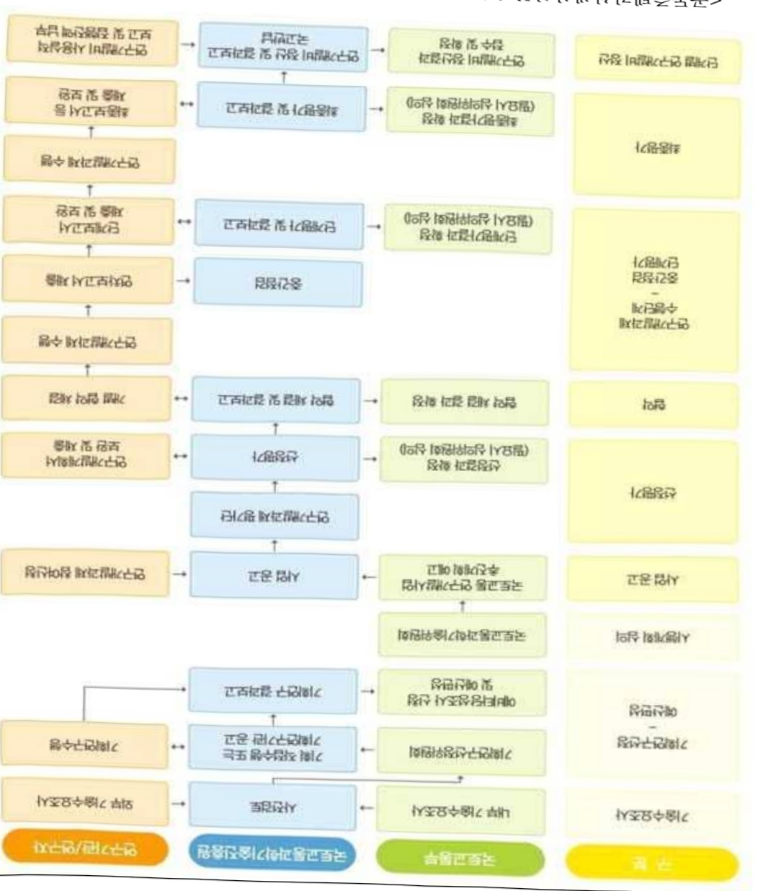
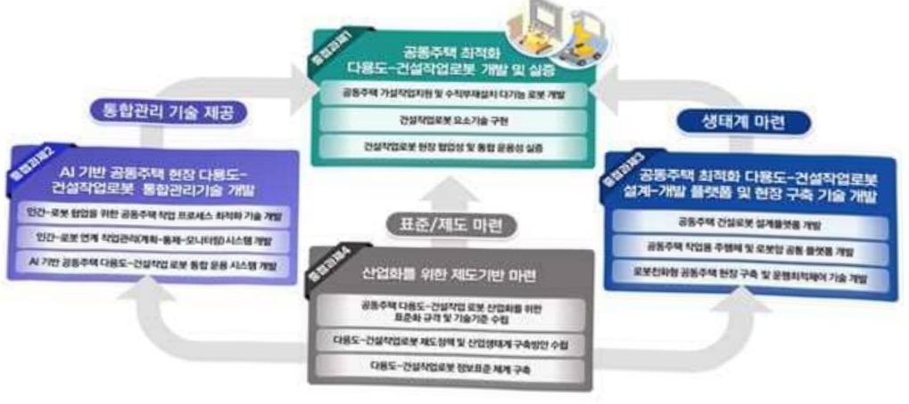

# 공동주택건설생산성혁신을위한다용도-건설작업로봇설계및통…

**해당 페이지**: PDF 2204 ~ 2211 쪽 해당

**부처**: 국토교통부
**분야**: 교통 및 물류
**회계유형**: 일반회계
**2026 확정예산**: 2009.0 백만원
**전년대비 증감률**: None%
**AI 도메인**: 로봇

---

### 가. 예산 총괄표

(단위:백만원,%)

<table border=1 style='margin: auto; word-wrap: break-word;'><tr><td rowspan="2">사업명</td><td rowspan="2">2024년 결산</td><td colspan="2">2025년 예산</td><td colspan="2">2026년</td><td rowspan="2">중감(B-A)</td><td rowspan="2">(B-A)/A</td></tr><tr><td style='text-align: center; word-wrap: break-word;'>본예산(A)</td><td style='text-align: center; word-wrap: break-word;'>추경</td><td style='text-align: center; word-wrap: break-word;'>정부안</td><td style='text-align: center; word-wrap: break-word;'>확정(B)</td></tr><tr><td style='text-align: center; word-wrap: break-word;'>공동주택건설생산성 혁신을위한다용도·건설 작업로봇설계및통합 관리기술개발(R&amp;D)</td><td style='text-align: center; word-wrap: break-word;'>-</td><td style='text-align: center; word-wrap: break-word;'>-</td><td style='text-align: center; word-wrap: break-word;'>-</td><td style='text-align: center; word-wrap: break-word;'>2,009</td><td style='text-align: center; word-wrap: break-word;'>2,009</td><td style='text-align: center; word-wrap: break-word;'>2,009</td><td style='text-align: center; word-wrap: break-word;'>순증</td></tr></table>

□ 기능별(내역사업별), 목별 예산 내역

(단위:백만원)

<table border=1 style='margin: auto; word-wrap: break-word;'><tr><td rowspan="3"></td><td colspan="5">2024</td><td colspan="7">2025(2025.12월말 기준)</td><td rowspan="3">2026예산</td></tr><tr><td rowspan="2">예산액(추정)</td><td rowspan="2">예산현액</td><td rowspan="2">집행액[실집행액]</td><td rowspan="2">이월액</td><td rowspan="2">불용액</td><td rowspan="2">분예산</td><td rowspan="2">예산현액</td><td rowspan="2">집행액[실집행액]</td><td colspan="2">전년도 이월액제외</td><td rowspan="2">이월예상액</td><td rowspan="2">불용예상액</td></tr><tr><td style='text-align: center; word-wrap: break-word;'>예산현액</td><td style='text-align: center; word-wrap: break-word;'>집행액[실집행액]</td></tr><tr><td style='text-align: center; word-wrap: break-word;'>○ 기능별 분류(합계)</td><td style='text-align: center; word-wrap: break-word;'>-</td><td style='text-align: center; word-wrap: break-word;'>-</td><td style='text-align: center; word-wrap: break-word;'>-</td><td style='text-align: center; word-wrap: break-word;'>-</td><td style='text-align: center; word-wrap: break-word;'>-</td><td style='text-align: center; word-wrap: break-word;'>-</td><td style='text-align: center; word-wrap: break-word;'>-</td><td style='text-align: center; word-wrap: break-word;'>-</td><td style='text-align: center; word-wrap: break-word;'>-</td><td style='text-align: center; word-wrap: break-word;'>-</td><td style='text-align: center; word-wrap: break-word;'>-</td><td style='text-align: center; word-wrap: break-word;'>-</td><td style='text-align: center; word-wrap: break-word;'>2,009</td></tr><tr><td style='text-align: center; word-wrap: break-word;'>· 공동주택 건설생산성 혁신을 위한 다용도 건설작업로봇 설계 및 통합된다 기술개발</td><td style='text-align: center; word-wrap: break-word;'>-</td><td style='text-align: center; word-wrap: break-word;'>-</td><td style='text-align: center; word-wrap: break-word;'>-</td><td style='text-align: center; word-wrap: break-word;'>-</td><td style='text-align: center; word-wrap: break-word;'>-</td><td style='text-align: center; word-wrap: break-word;'>-</td><td style='text-align: center; word-wrap: break-word;'>-</td><td style='text-align: center; word-wrap: break-word;'>-</td><td style='text-align: center; word-wrap: break-word;'>-</td><td style='text-align: center; word-wrap: break-word;'>-</td><td style='text-align: center; word-wrap: break-word;'>-</td><td style='text-align: center; word-wrap: break-word;'>-</td><td style='text-align: center; word-wrap: break-word;'>2,009</td></tr><tr><td style='text-align: center; word-wrap: break-word;'>○ 비목별 분류(합계)</td><td style='text-align: center; word-wrap: break-word;'>-</td><td style='text-align: center; word-wrap: break-word;'>-</td><td style='text-align: center; word-wrap: break-word;'>-</td><td style='text-align: center; word-wrap: break-word;'>-</td><td style='text-align: center; word-wrap: break-word;'>-</td><td style='text-align: center; word-wrap: break-word;'>-</td><td style='text-align: center; word-wrap: break-word;'>-</td><td style='text-align: center; word-wrap: break-word;'>-</td><td style='text-align: center; word-wrap: break-word;'>-</td><td style='text-align: center; word-wrap: break-word;'>-</td><td style='text-align: center; word-wrap: break-word;'>-</td><td style='text-align: center; word-wrap: break-word;'>-</td><td style='text-align: center; word-wrap: break-word;'>2,009</td></tr><tr><td style='text-align: center; word-wrap: break-word;'>· 연 구 활 동 비 등(360-05)</td><td style='text-align: center; word-wrap: break-word;'>-</td><td style='text-align: center; word-wrap: break-word;'>-</td><td style='text-align: center; word-wrap: break-word;'>-</td><td style='text-align: center; word-wrap: break-word;'>-</td><td style='text-align: center; word-wrap: break-word;'>-</td><td style='text-align: center; word-wrap: break-word;'>-</td><td style='text-align: center; word-wrap: break-word;'>-</td><td style='text-align: center; word-wrap: break-word;'>-</td><td style='text-align: center; word-wrap: break-word;'>-</td><td style='text-align: center; word-wrap: break-word;'>-</td><td style='text-align: center; word-wrap: break-word;'>-</td><td style='text-align: center; word-wrap: break-word;'>-</td><td style='text-align: center; word-wrap: break-word;'>2,009</td></tr><tr><td style='text-align: center; word-wrap: break-word;'>○ 기능·비목별 분류(합계)</td><td style='text-align: center; word-wrap: break-word;'>-</td><td style='text-align: center; word-wrap: break-word;'>-</td><td style='text-align: center; word-wrap: break-word;'>-</td><td style='text-align: center; word-wrap: break-word;'>-</td><td style='text-align: center; word-wrap: break-word;'>-</td><td style='text-align: center; word-wrap: break-word;'>-</td><td style='text-align: center; word-wrap: break-word;'>-</td><td style='text-align: center; word-wrap: break-word;'>-</td><td style='text-align: center; word-wrap: break-word;'>-</td><td style='text-align: center; word-wrap: break-word;'>-</td><td style='text-align: center; word-wrap: break-word;'>-</td><td style='text-align: center; word-wrap: break-word;'>-</td><td style='text-align: center; word-wrap: break-word;'>2,009</td></tr><tr><td style='text-align: center; word-wrap: break-word;'>· 공동주택 건설생산성 혁신을 위한 다용도 건설작업로봇 설계 및 통합된다 기술개발</td><td style='text-align: center; word-wrap: break-word;'>-</td><td style='text-align: center; word-wrap: break-word;'>-</td><td style='text-align: center; word-wrap: break-word;'>-</td><td style='text-align: center; word-wrap: break-word;'>-</td><td style='text-align: center; word-wrap: break-word;'>-</td><td style='text-align: center; word-wrap: break-word;'>-</td><td style='text-align: center; word-wrap: break-word;'>-</td><td style='text-align: center; word-wrap: break-word;'>-</td><td style='text-align: center; word-wrap: break-word;'>-</td><td style='text-align: center; word-wrap: break-word;'>-</td><td style='text-align: center; word-wrap: break-word;'>-</td><td style='text-align: center; word-wrap: break-word;'>-</td><td style='text-align: center; word-wrap: break-word;'>2,009</td></tr><tr><td style='text-align: center; word-wrap: break-word;'>- 연 구 활 동 비 등(360-05)</td><td style='text-align: center; word-wrap: break-word;'>-</td><td style='text-align: center; word-wrap: break-word;'>-</td><td style='text-align: center; word-wrap: break-word;'>-</td><td style='text-align: center; word-wrap: break-word;'>-</td><td style='text-align: center; word-wrap: break-word;'>-</td><td style='text-align: center; word-wrap: break-word;'>-</td><td style='text-align: center; word-wrap: break-word;'>-</td><td style='text-align: center; word-wrap: break-word;'>-</td><td style='text-align: center; word-wrap: break-word;'>-</td><td style='text-align: center; word-wrap: break-word;'>-</td><td style='text-align: center; word-wrap: break-word;'>-</td><td style='text-align: center; word-wrap: break-word;'>-</td><td style='text-align: center; word-wrap: break-word;'>2,009</td></tr></table>

---

### 나. 사업설명자료

## 1 ) 사업목적·내용

- (목적) 공동주택 건설에 최적화된 다용도-건설작업로봇 설계·운용 기술개발 및 실증을 통한 산업화 기반 마련

* (목표) 공동주택 공기단축 6%, 로봇-인력 대체율 10%, 현장 안전사고 감소율 15%

- (내용) 공동주택 건설생산성 혁신을 위한 다용도-건설작업로봇 설계 및 통합관리 기술 개발

· 공동주택 최적화 다용도-건설작업로봇 개발 및 실증

• AI 기반 공동주택 다용도-건설작업로봇 통합관리기술 개발

· 공동주택 최적화 다용도-건설작업로봇 설계-개발 플랫폼 및 현장 구축 기술 개발

·산업화를 위한 제도기반 마련

## 2 ) 사업개요

## □ 사업근거 및 추진경위

① 법령상 근거 및 조항 적시

° 국토교통과학기술육성법 제8조(연구개발사업의 추진)

0 정부 정책 및 법정계획

- 국토교통부, '스마트 건설기술 로드맵' (2018.10)

* 2030년까지 AI 기반 건설기계 자동화 및 로봇을 활용한 조립 시공 자동화를 목표로 설정

- 국토교통부, '스마트 건설 활성화 방안 S-Construction 2030' (2022.7)

* 건설 숲과정 디지털화·자동화 추진을 위해 건설산업 디지털화, 생산시스템 선진화(건설기계 자동화 및 로봇 도입), 스마트 건설산업 육성을 3대 중점과제로 설정

- 범부처, '제4차 재난 및 안전관리 기술개발 종합계획 (2023~2027)'

* 건설업 현장의 중대 재해 예방을 위한 고위험 작업 대체 로봇 개발 지원

- 국토교통부, '제7차 건설기술진흥기본계획', (2023.12)

* 건설산업 생산성과 안전성을 개선하기 위한 디지털 전환 및 자동화·모듈화 확대 추진

- 산업통상자원부, '첨단로봇 산업 비전과 전략', (2023.12)

* 2030년까지 민관 합동 3조 원 이상 투자, 전 산업에 100만 대 이상 로봇 보급, '지능형 로봇 개발 및 보급 촉진법' 개편 추진

- 관계부처합동, '신성장 4.0 15대 프로젝트 2025 추진계획', (2025.03)

* 'AI 전환 가속화 및 지능형 로봇'을 주요 과제로 선정하고, 전 산업 AX 전환 촉진 및 휴머노이드

이동형 로봇 HW/SW R&D 지원을 추진

---

② 추진경위

° '24.12~ : 기획연구 추진

0 국정과제 관련성

- (혁신경제 전략3-30) 주력산업 혁신으로 4대 제조강국 실현 : AI 등을 활용한

건설로봇 개발 및 실증을 통해 지역경제의 근간인 건설경기 회복 기술적 기반 마련

* 공동주택 건설현장에 적용 가능한 AI기반 다수 로봇 군집제어 및 모니터링기술 등 건설과정을 3D

데이터·AI기반으로 고도화하기 위한 제어 기술 및 정책 개발 등을 통해 목표달성에 기여

□ 주요내용

① 사업규모

- 총사업비 : 해당없음

- 사업기간 : '26 ~ '30

- 최근 5년 간 투입된 사업비(예산액기준, 추경편성한 연도에는 추경포함)

<table border=1 style='margin: auto; word-wrap: break-word;'><tr><td style='text-align: center; word-wrap: break-word;'>$ \underline{\text{盹}} $</td><td style='text-align: center; word-wrap: break-word;'>2022</td><td style='text-align: center; word-wrap: break-word;'>2023</td><td style='text-align: center; word-wrap: break-word;'>2024</td><td style='text-align: center; word-wrap: break-word;'>2025</td><td style='text-align: center; word-wrap: break-word;'>2026</td></tr><tr><td style='text-align: center; word-wrap: break-word;'>$ \underline{\text{사업비}} $</td><td style='text-align: center; word-wrap: break-word;'>-</td><td style='text-align: center; word-wrap: break-word;'>-</td><td style='text-align: center; word-wrap: break-word;'>-</td><td style='text-align: center; word-wrap: break-word;'>-</td><td style='text-align: center; word-wrap: break-word;'>2,009</td></tr></table>

- 기타: 해당없음

② 사업추진체계

- 사업시행방법 : 출연(참여기업이 있는 경우 Matching)

- 사업시행주체 : 국토교통부(전문기관 : 국토교통과학기술진흥원)

- 사업 수혜자 : 대학, 기업, 출연연 등

- 보조, 융자, 출연, 출자 등의 경우 보조·융자 등 지원 비율 및 법적근거

<table border=1 style='margin: auto; word-wrap: break-word;'><tr><td style='text-align: center; word-wrap: break-word;'>내역사업명</td><td style='text-align: center; word-wrap: break-word;'>구분</td><td style='text-align: center; word-wrap: break-word;'>피보조·피출연 등 기관명</td><td style='text-align: center; word-wrap: break-word;'>지원 금액 (2026예산)</td><td style='text-align: center; word-wrap: break-word;'>지원 비율(%)</td><td style='text-align: center; word-wrap: break-word;'>보조율 법적근거 (해당 조항)</td></tr><tr><td rowspan="3">공동주택 건설생산성 혁신을 위한 다용도-건설작업로봇 설계 및 통합관리 기술개발</td><td rowspan="3">출연</td><td style='text-align: center; word-wrap: break-word;'>「중소기업기본법」제2조에 따른 중소기업에 해당하는 연구개발기관</td><td rowspan="3">2,009 백만원</td><td style='text-align: center; word-wrap: break-word;'>연구개발 비의 100분의 75 이하</td><td rowspan="3">「국가연구개발 혁신법 시행령」 제19조</td></tr><tr><td style='text-align: center; word-wrap: break-word;'>「중건기업 성장촉진 및 경쟁력 강화에 관한 특별법」제2조제1호에 따른 중건기업에 해당하는 연구개발기관</td><td style='text-align: center; word-wrap: break-word;'>연구개발 비의 100분의 70 이하</td></tr><tr><td style='text-align: center; word-wrap: break-word;'>「공공기관의 운영에 관한 법률」제5조제4항제1호에 따른 공기업에 해당하거나 ‘가’, ‘나’에 해당 해당하지 않는 연구개발기관</td><td style='text-align: center; word-wrap: break-word;'>연구개발 비의 100분의 50 이하</td></tr></table>

* 다만, 중앙행정기관의 장이 필요하다고 인정하는 국가연구개발사업에 대하여 별도로 정할 수 있음

---

① 공동주택 건설생산성 혁신을 위한 다용도-건설작업로봇 설계 및 통합관리 기술개발 : ('26요구) 2,009백만원, 순증

- (요구) 공동주택 건설작업 로봇 설계·개발 플랫폼 구조 정립 및 로봇 주행체 초기설계, 로봇의 설계 및 제어기술 기반 구축, 관련 제도·정책 개선방향 정립 및 초기 표준정보 체계 구축 등의 필요성이 인정되어 소요예산 2,009백만원 요구

- (산출) ① 초기 로봇 액션 분류체계개발, 로봇 주행체 및 로봇암의 초기 설계 : 709백만원

② 건설현장 운행을 위한 로봇 제어 요소 및 공동주택 특화 요구사항 조사 : 800백만원

③ 가설작업/수직부재 설치 로봇 설계 및 구조 정립 등 : 500백만원

·(신규) 1개 × 2,679백만원 × 9/12 = 2,009백만원

2025년도 예산 및 2026년도 예산 산출 세부내역 비교

<table border=1 style='margin: auto; word-wrap: break-word;'><tr><td colspan="2">2025년 예산</td><td colspan="2">2026년 예산</td></tr><tr><td style='text-align: center; word-wrap: break-word;'>예산</td><td style='text-align: center; word-wrap: break-word;'>산출내역</td><td style='text-align: center; word-wrap: break-word;'>예산</td><td style='text-align: center; word-wrap: break-word;'>산출내역</td></tr><tr><td style='text-align: center; word-wrap: break-word;'>-</td><td style='text-align: center; word-wrap: break-word;'>-</td><td style='text-align: center; word-wrap: break-word;'>2,009 백만원</td><td style='text-align: center; word-wrap: break-word;'>☐ 연구활동비 등(360-05): 2,009백만원 가. 초기 로봇 액션 분류체계개발, 로봇 주행체 및 로봇암의 초기 설계 등 1식x709백만원 나. 건설현장 운행을 위한 로봇 제어 요소 및 공동주택 특화 요구사항 조사 등 1식x7800백만원 다. 가설작업/수직부재 설치 로봇 설계 및 구조 정립 등 1식x7500백만원</td></tr></table>

## 4 ) 사업효과

□ 사업영향, 산출물 성과지표 등

① 2022~2026년도 성과계획서 상 성과지표 및 최근 5년간 성과 달성도 : 해당없음(26년 신규)

② 성과지표 이외의 연도별 사업추진 경과 및 실적 : 해당없음(26년 신규)

③ 향후(2026년도 이후) 기대효과

- 현장 협업성과 통합운용성이 높은 실효성 있는 공동주택 최적화 작업로봇 개발 보급(가설작업 지원, 수직부재 설치)

- 로봇, 작업일정에 따른 로봇작업 계획 자동작성으로 실질적 로봇 적용

- 공동주택 건설작업 로봇 통합 플랫폼을 통해 편리한 현장 로봇 운용

- 로봇 친화형 공동주택 현장에서 다수 다종 로봇의 움직임 최적화

- 공동주택 작업용 로봇 설계 플랫폼 SW 제공으로 로봇 개발 및 공급 활성화

5) 타당성조사 및 예비타당성조사 시행여부 및 결과 요지 : 해당없음

6) 총사업비 대상사업 여부 및 내역 : 해당없음

---

<table border=1 style='margin: auto; word-wrap: break-word;'><tr><td style='text-align: center; word-wrap: break-word;'>부처</td><td style='text-align: center; word-wrap: break-word;'></td><td style='text-align: center; word-wrap: break-word;'>피출연·피보조기관</td><td style='text-align: center; word-wrap: break-word;'></td><td style='text-align: center; word-wrap: break-word;'>간접보조사업자·사업수행자</td></tr><tr><td style='text-align: center; word-wrap: break-word;'>국토교통부(2,009백만원)</td><td style='text-align: center; word-wrap: break-word;'>=&gt;(2,009백만원)</td><td style='text-align: center; word-wrap: break-word;'>국토교통과학기술진흥원(2,009백만원)</td><td style='text-align: center; word-wrap: break-word;'>=&gt;(2,009백만원)</td><td style='text-align: center; word-wrap: break-word;'>미정</td></tr></table>

<공동주택건설생산성혁신을위한다용도-건설작업로봇설계및통합관리기술개발>

---

8) 중기재정계획 상 연도별 투자계획 및 추진경과

(단위: 백만원)

<table border=1 style='margin: auto; word-wrap: break-word;'><tr><td colspan="6">$  \text{중기}  $ 2024 2025 2026 2027 2028 2029</td></tr><tr><td style='text-align: center; word-wrap: break-word;'>2024~2028</td><td style='text-align: center; word-wrap: break-word;'>-</td><td style='text-align: center; word-wrap: break-word;'>-</td><td style='text-align: center; word-wrap: break-word;'>-</td><td style='text-align: center; word-wrap: break-word;'>-</td><td style='text-align: center; word-wrap: break-word;'>-</td></tr><tr><td style='text-align: center; word-wrap: break-word;'>2025~2029</td><td style='text-align: center; word-wrap: break-word;'>-</td><td style='text-align: center; word-wrap: break-word;'>2,009</td><td style='text-align: center; word-wrap: break-word;'>6,000</td><td style='text-align: center; word-wrap: break-word;'>6,500</td><td style='text-align: center; word-wrap: break-word;'>7,000</td></tr></table>

## 9 ) 최근 3년간 동 사업에 대한 주요 외부지적사항 및 평가, 문제점 및 대책 : 해당없음

## 10 ) 향후 추진방향 및 추진계획

□ 공동주택 건설에 최적화된 다용도-건설작업로봇* 설계·운용 기술개발 및 실증을 통한 산업화 기반 마련

°(중점1) 공동주택 최적화 다용도-건설작업로봇 개발 및 실증

*가설작업지원로봇(1종2기능),수직부재설치로봇(1종2기능)

°(중점2) AI기반 공동주택 다용도-건설작업로봇 통합관리기술 개발

(중점3) 공동주택 최적화 다용도-건설작업로봇 설계-개발 플랫폼 및 현장 구축 기술 개발

<과제 개념도>

---

## 11 ) 해당사업에 대한 각종 사업평가의 결과

1) 「국가재정법」제85조의8제1항에 따른 재정사업자율평가 결과에 대한 기획재정부의 상위평가(심층평가) 결과 : 해당없음
2) R&D사업의 경우「국가연구개발사업 등의 성과평가 및 성과관리에 관한 법률」
제7조제3항에 따른 부처의 R&D사업 자체성과평가에 대한 과학기술정보통신부
상위평가 결과 : 해당없음
3) 그 외 보조사업 연장평가, 재정지원 일자리사업 평가 등 개별 법률에 규정된 평가 시행 결과 : 해당없음

12) 해당사업에 대한 부처 자체평가의 결과

<table border=1 style='margin: auto; word-wrap: break-word;'><tr><td style='text-align: center; word-wrap: break-word;'>1) 2023년도 부처 재정사업 자율평가 결과: 해당없음</td></tr><tr><td style='text-align: center; word-wrap: break-word;'>2) 2024년도 부처 재정사업 자율평가 결과: 해당없음</td></tr><tr><td style='text-align: center; word-wrap: break-word;'>3) 2025년도 부처 재정사업 자율평가 결과: 해당없음</td></tr></table>

## 13 ) 부처 건의사항 : 해당없음

---

<table border=1 style='margin: auto; word-wrap: break-word;'><tr><td style='text-align: center; word-wrap: break-word;'>사 업 명</td></tr><tr><td style='text-align: center; word-wrap: break-word;'>(21) 공항조류탐지 및 한국형 조류관리 핵심기술개발(R&amp;D) (4161-358)</td></tr></table>

□ 사업 코드 정보

<table border=1 style='margin: auto; word-wrap: break-word;'><tr><td style='text-align: center; word-wrap: break-word;'>구분</td><td rowspan="2">회계</td><td style='text-align: center; word-wrap: break-word;'>소관</td><td style='text-align: center; word-wrap: break-word;'>실국(기관)</td><td style='text-align: center; word-wrap: break-word;'>계정</td><td style='text-align: center; word-wrap: break-word;'>분야</td><td style='text-align: center; word-wrap: break-word;'>부문</td></tr><tr><td style='text-align: center; word-wrap: break-word;'>코드 명칭</td><td style='text-align: center; word-wrap: break-word;'>국토교통부</td><td style='text-align: center; word-wrap: break-word;'>공항정책관</td><td style='text-align: center; word-wrap: break-word;'>공항계정</td><td style='text-align: center; word-wrap: break-word;'>120 교통및물류</td><td style='text-align: center; word-wrap: break-word;'>126 물류등기타</td></tr></table>

<table border=1 style='margin: auto; word-wrap: break-word;'><tr><td style='text-align: center; word-wrap: break-word;'>구분</td><td style='text-align: center; word-wrap: break-word;'>프로그램</td><td style='text-align: center; word-wrap: break-word;'>단위사업</td><td style='text-align: center; word-wrap: break-word;'>세부사업</td></tr><tr><td style='text-align: center; word-wrap: break-word;'>코드</td><td style='text-align: center; word-wrap: break-word;'>4100</td><td style='text-align: center; word-wrap: break-word;'>4161</td><td style='text-align: center; word-wrap: break-word;'>358</td></tr><tr><td style='text-align: center; word-wrap: break-word;'>명칭</td><td style='text-align: center; word-wrap: break-word;'>국토교통연구개발</td><td style='text-align: center; word-wrap: break-word;'>항공기술연구</td><td style='text-align: center; word-wrap: break-word;'>공항조류탐지및한국형조류관리핵심기술개발(R&amp;D)</td></tr></table>

□ 사업 성격

<table border=1 style='margin: auto; word-wrap: break-word;'><tr><td style='text-align: center; word-wrap: break-word;'>신규</td><td style='text-align: center; word-wrap: break-word;'>계속</td><td style='text-align: center; word-wrap: break-word;'>완료</td><td style='text-align: center; word-wrap: break-word;'>예비타당성 실시여부</td><td style='text-align: center; word-wrap: break-word;'>총사업비 관리대상</td><td style='text-align: center; word-wrap: break-word;'>총액계상 예산사업</td><td style='text-align: center; word-wrap: break-word;'>사업소관 변경정보</td></tr><tr><td style='text-align: center; word-wrap: break-word;'>○</td><td style='text-align: center; word-wrap: break-word;'></td><td style='text-align: center; word-wrap: break-word;'></td><td style='text-align: center; word-wrap: break-word;'></td><td style='text-align: center; word-wrap: break-word;'></td><td style='text-align: center; word-wrap: break-word;'></td><td style='text-align: center; word-wrap: break-word;'>2025예산 시 소관</td></tr></table>

□ 사업 지원 형태 및 지원율

<table border=1 style='margin: auto; word-wrap: break-word;'><tr><td style='text-align: center; word-wrap: break-word;'>직접</td><td style='text-align: center; word-wrap: break-word;'>출자</td><td style='text-align: center; word-wrap: break-word;'>출연</td><td style='text-align: center; word-wrap: break-word;'>보조</td><td style='text-align: center; word-wrap: break-word;'>융자</td><td style='text-align: center; word-wrap: break-word;'>국고보조율(%)</td><td style='text-align: center; word-wrap: break-word;'>융자율(%)</td></tr><tr><td style='text-align: center; word-wrap: break-word;'></td><td style='text-align: center; word-wrap: break-word;'></td><td style='text-align: center; word-wrap: break-word;'>○</td><td style='text-align: center; word-wrap: break-word;'></td><td style='text-align: center; word-wrap: break-word;'></td><td style='text-align: center; word-wrap: break-word;'></td><td style='text-align: center; word-wrap: break-word;'></td></tr></table>

□ 사업 담당자

<table border=1 style='margin: auto; word-wrap: break-word;'><tr><td style='text-align: center; word-wrap: break-word;'>사업명</td><td colspan="2">구분</td></tr><tr><td rowspan="5">공항조류탐지 및한국형 조류관리핵심 기술개발 (R&amp;D)</td><td rowspan="3">소관부처</td><td style='text-align: center; word-wrap: break-word;'>실·국·과(팀)</td></tr><tr><td style='text-align: center; word-wrap: break-word;'>공항정책관</td></tr><tr><td style='text-align: center; word-wrap: break-word;'>공항운영과</td></tr><tr><td rowspan="2">사업시행주체</td><td style='text-align: center; word-wrap: break-word;'>국토교통과학기술진흥원</td></tr><tr><td style='text-align: center; word-wrap: break-word;'>항공우주실</td></tr></table>

---

### 원본 PDF 크롭 이미지

