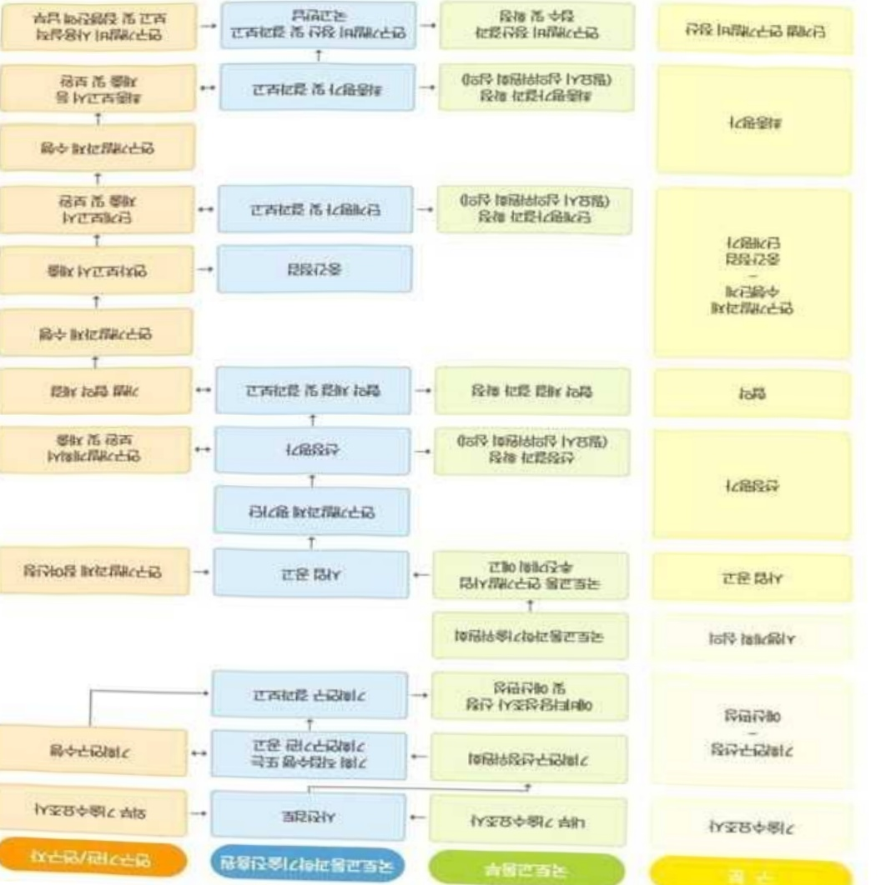
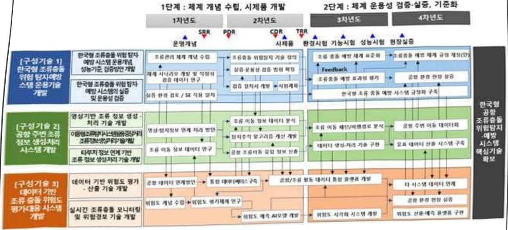

# 공항조류탐지및한국형조류관리핵심기술개발(R&D)

**해당 페이지**: PDF 2212 ~ 2219 쪽 해당

**부처**: 국토교통부
**분야**: 교통 및 물류
**회계유형**: 교통시설 특별회계
**2026 확정예산**: 1500.0 백만원
**전년대비 증감률**: None%
**AI 도메인**: 데이터

---

### 가.예산 총괄표

(단위:백만원,%)

<table border=1 style='margin: auto; word-wrap: break-word;'><tr><td rowspan="2">사업명</td><td rowspan="2">2024년 결산</td><td colspan="2">2025년 예산</td><td colspan="2">2026년</td><td rowspan="2">증감(B-A)</td><td rowspan="2">(B-A)/A</td></tr><tr><td style='text-align: center; word-wrap: break-word;'>본예산(A)</td><td style='text-align: center; word-wrap: break-word;'>추경</td><td style='text-align: center; word-wrap: break-word;'>정부안</td><td style='text-align: center; word-wrap: break-word;'>확정(B)</td></tr><tr><td style='text-align: center; word-wrap: break-word;'>공항조류탐지및한국형조류관리핵심기술개발(R&amp;D)</td><td style='text-align: center; word-wrap: break-word;'>-</td><td style='text-align: center; word-wrap: break-word;'>-</td><td style='text-align: center; word-wrap: break-word;'>-</td><td style='text-align: center; word-wrap: break-word;'>1,500</td><td style='text-align: center; word-wrap: break-word;'>1,500</td><td style='text-align: center; word-wrap: break-word;'>1,500</td><td style='text-align: center; word-wrap: break-word;'>순증</td></tr></table>

□ 기능별(내역사업별), 목별 예산 내역

(단위:백만원)

<table border=1 style='margin: auto; word-wrap: break-word;'><tr><td rowspan="3"></td><td colspan="5">2024</td><td colspan="7">2025(2025.12월말 기준)</td><td rowspan="3">2026예산</td></tr><tr><td rowspan="2">예산액(추정)</td><td rowspan="2">예산현액</td><td rowspan="2">집행액[실집행액]</td><td rowspan="2">이월액</td><td rowspan="2">불용액</td><td rowspan="2">본예산</td><td rowspan="2">예산현액</td><td rowspan="2">집행액[실집행액]</td><td colspan="2">전년도 이월액제외</td><td rowspan="2">이월예상액</td><td rowspan="2">불용예상액</td></tr><tr><td style='text-align: center; word-wrap: break-word;'>예산현액</td><td style='text-align: center; word-wrap: break-word;'>집행액[실집행액]</td></tr><tr><td style='text-align: center; word-wrap: break-word;'>○ 기능별 분류(합계)</td><td style='text-align: center; word-wrap: break-word;'>-</td><td style='text-align: center; word-wrap: break-word;'>-</td><td style='text-align: center; word-wrap: break-word;'>-</td><td style='text-align: center; word-wrap: break-word;'>-</td><td style='text-align: center; word-wrap: break-word;'>-</td><td style='text-align: center; word-wrap: break-word;'>-</td><td style='text-align: center; word-wrap: break-word;'>-</td><td style='text-align: center; word-wrap: break-word;'>-</td><td style='text-align: center; word-wrap: break-word;'>-</td><td style='text-align: center; word-wrap: break-word;'>-</td><td style='text-align: center; word-wrap: break-word;'>-</td><td style='text-align: center; word-wrap: break-word;'>-</td><td style='text-align: center; word-wrap: break-word;'>1,500</td></tr><tr><td style='text-align: center; word-wrap: break-word;'>·공항조류탑지및한국형조류관리핵심기술개발</td><td style='text-align: center; word-wrap: break-word;'>-</td><td style='text-align: center; word-wrap: break-word;'>-</td><td style='text-align: center; word-wrap: break-word;'>-</td><td style='text-align: center; word-wrap: break-word;'>-</td><td style='text-align: center; word-wrap: break-word;'>-</td><td style='text-align: center; word-wrap: break-word;'>-</td><td style='text-align: center; word-wrap: break-word;'>-</td><td style='text-align: center; word-wrap: break-word;'>-</td><td style='text-align: center; word-wrap: break-word;'>-</td><td style='text-align: center; word-wrap: break-word;'>-</td><td style='text-align: center; word-wrap: break-word;'>-</td><td style='text-align: center; word-wrap: break-word;'>-</td><td style='text-align: center; word-wrap: break-word;'>1,500</td></tr><tr><td style='text-align: center; word-wrap: break-word;'>○ 비목별 분류(합계)</td><td style='text-align: center; word-wrap: break-word;'>-</td><td style='text-align: center; word-wrap: break-word;'>-</td><td style='text-align: center; word-wrap: break-word;'>-</td><td style='text-align: center; word-wrap: break-word;'>-</td><td style='text-align: center; word-wrap: break-word;'>-</td><td style='text-align: center; word-wrap: break-word;'>-</td><td style='text-align: center; word-wrap: break-word;'>-</td><td style='text-align: center; word-wrap: break-word;'>-</td><td style='text-align: center; word-wrap: break-word;'>-</td><td style='text-align: center; word-wrap: break-word;'>-</td><td style='text-align: center; word-wrap: break-word;'>-</td><td style='text-align: center; word-wrap: break-word;'>-</td><td style='text-align: center; word-wrap: break-word;'>1,500</td></tr><tr><td style='text-align: center; word-wrap: break-word;'>·연구활동비등(360-05)</td><td style='text-align: center; word-wrap: break-word;'>-</td><td style='text-align: center; word-wrap: break-word;'>-</td><td style='text-align: center; word-wrap: break-word;'>-</td><td style='text-align: center; word-wrap: break-word;'>-</td><td style='text-align: center; word-wrap: break-word;'>-</td><td style='text-align: center; word-wrap: break-word;'>-</td><td style='text-align: center; word-wrap: break-word;'>-</td><td style='text-align: center; word-wrap: break-word;'>-</td><td style='text-align: center; word-wrap: break-word;'>-</td><td style='text-align: center; word-wrap: break-word;'>-</td><td style='text-align: center; word-wrap: break-word;'>-</td><td style='text-align: center; word-wrap: break-word;'>-</td><td style='text-align: center; word-wrap: break-word;'>1,500</td></tr><tr><td style='text-align: center; word-wrap: break-word;'>○ 가능비목별 분류(합계)</td><td style='text-align: center; word-wrap: break-word;'>-</td><td style='text-align: center; word-wrap: break-word;'>-</td><td style='text-align: center; word-wrap: break-word;'>-</td><td style='text-align: center; word-wrap: break-word;'>-</td><td style='text-align: center; word-wrap: break-word;'>-</td><td style='text-align: center; word-wrap: break-word;'>-</td><td style='text-align: center; word-wrap: break-word;'>-</td><td style='text-align: center; word-wrap: break-word;'>-</td><td style='text-align: center; word-wrap: break-word;'>-</td><td style='text-align: center; word-wrap: break-word;'>-</td><td style='text-align: center; word-wrap: break-word;'>-</td><td style='text-align: center; word-wrap: break-word;'>-</td><td style='text-align: center; word-wrap: break-word;'>1,500</td></tr><tr><td style='text-align: center; word-wrap: break-word;'>·공항조류탑지및한국형조류관리핵심기술개발·연구활동비등(360-05)</td><td style='text-align: center; word-wrap: break-word;'>-</td><td style='text-align: center; word-wrap: break-word;'>-</td><td style='text-align: center; word-wrap: break-word;'>-</td><td style='text-align: center; word-wrap: break-word;'>-</td><td style='text-align: center; word-wrap: break-word;'>-</td><td style='text-align: center; word-wrap: break-word;'>-</td><td style='text-align: center; word-wrap: break-word;'>-</td><td style='text-align: center; word-wrap: break-word;'>-</td><td style='text-align: center; word-wrap: break-word;'>-</td><td style='text-align: center; word-wrap: break-word;'>-</td><td style='text-align: center; word-wrap: break-word;'>-</td><td style='text-align: center; word-wrap: break-word;'>-</td><td style='text-align: center; word-wrap: break-word;'>1,500</td></tr></table>

---

### 나. 사업설명자료

## 1 ) 사업목적·내용

- (내역사업명) 공항 조류 탐지 및 한국형 조류관리 핵심기술 개발(R&D)

* (사업목적) 공항에 유입되는 조류를 실시간으로 탐지하고, 선제적 예측 및 분석기술을 확보하여 항공기의 안전한 운항을 구현할 수 있는 한국형 조류층돌 위험 탐지 · 예방 시스템 개발

* (기간/총사업비) '26~'29년(45개월), 총 283억(국비 283억, 민간 미정)

* (사업 세부내용) 한국형 공항 조류 탐지 및 충돌 위험 조기 경보 체계 구축을 통한 사전 예측 및 사후 분석 안전관리 기술 개발

o (중점기술 1) 한국형 조류충돌 위험 탐지·예방 시스템 운용기술 개발

o (중점기술 2) 공항 주변 조류 정보 생성·처리 시스템 개발

o (중점기술 3) 데이터 기반 조류 충돌 위험도 평가·대응 시스템 개발

## 2 ) 사업개요

## □ 사업근거 및 추진경위

① 법령상 근거 및 조항 적시

- 「과학기술기본법」 제11조 (국가연구개발사업의 추진)

-「국토교통과학기술 육성법」제8조(연구개발사업의 추진)

-「항공사업법」제3조(항공정책기본계획의 수립) 및 제5조(항공기술개발계획의 수립)

## ② 추진경위

- (23.12월) 조류충돌 이벤트 발생추세 현황 등을 누운 공항공사 공유

* 공항구역 내 조류충돌 관련 안전관리 방안 협의

- (24.11월) 항공안전 확보 디지털아카이브 기술 중 조류 충돌 방지를 위한 데이터 공유 및 지원 체계 필요성 논의

* '24년 9월~11월 항공안전 디지털아카이브 기술수요 조사 및 논의, 항공사, 공항공사, 연구기관, 대학 등 참여 기술적 당위성 검토 및 토론

- (24.12.29) 12·29 여객기 참사 발생

- (25.2.4) 민간 전문가 참여 ‘항공안전 혁신위원회’ 운영(~25.4월)

- (25.2.6) 12.29 국회 '여객기 참사 특위', 국토교통부 현안 보고

* 조류 충돌 예방 활동 강화, 조류탐지 레이더 손공항 도입 발표

---

- (25.3) 한국형 조류탐지 레이더 성능 관련 국토부 TF 운영

- (~25.3월) 한국형 조류관리 기술개발 기획연구 추진

* 기획위원회(국토부, 공항공사, 국립생물자원관리원, 출연연, 대학, 제작사 등) 운영

* 이해관계자 의견수렴(공항운영자, 장비/시스템 개발기관 등), 공항 조류관리 분야

각 기술별 특허·논문·경쟁력조사, 중점기술분야 도출

- (25.8) 국정기획위원회 123대 국정과제안 발표

* (국정과제 72) 국민안전 보장을 위한 재난안전관리체계 확립

* (국정과제 73) 재난 피해 최소화를 위한 예방·대응 강화

□ 주요내용

① 사업규모

- 총사업비 : 해당없음

- 사업기간 : '26 ~ '29

- 최근 5년 간 투입된 사업비(예산액기준, 추경편성한 연도에는 추경포함)

<table border=1 style='margin: auto; word-wrap: break-word;'><tr><td style='text-align: center; word-wrap: break-word;'>연도</td><td style='text-align: center; word-wrap: break-word;'>2022</td><td style='text-align: center; word-wrap: break-word;'>2023</td><td style='text-align: center; word-wrap: break-word;'>2024</td><td style='text-align: center; word-wrap: break-word;'>2025</td><td style='text-align: center; word-wrap: break-word;'>2026</td></tr><tr><td style='text-align: center; word-wrap: break-word;'>사업비(백만원)</td><td style='text-align: center; word-wrap: break-word;'>-</td><td style='text-align: center; word-wrap: break-word;'>-</td><td style='text-align: center; word-wrap: break-word;'>-</td><td style='text-align: center; word-wrap: break-word;'>-</td><td style='text-align: center; word-wrap: break-word;'>1,500</td></tr></table>

-기타: 해당없음

② 사업추진체계

- 사업시행방법 : 출연(참여기업이 있는 경우 Matching)

- 사업시행주체 : 국토교통부(전문기관 : 국토교통과학기술진흥원)

- 사업 수혜자 : 대학, 기업, 출연연 등

- 보조, 융자, 출연, 출자 등의 경우 보조·융자 등 지원 비율 및 법적근거

<table border=1 style='margin: auto; word-wrap: break-word;'><tr><td style='text-align: center; word-wrap: break-word;'>내역사업명</td><td style='text-align: center; word-wrap: break-word;'>구분</td><td style='text-align: center; word-wrap: break-word;'>피보조·피출연 등 기관명</td><td style='text-align: center; word-wrap: break-word;'>지원 금액 (2026예산)</td><td style='text-align: center; word-wrap: break-word;'>지원 비율(%)</td><td style='text-align: center; word-wrap: break-word;'>보조율 법적근거 (해당 조항)</td></tr><tr><td rowspan="3">공항 조류탐지 및 한국형조류 관리핵심 기술개발</td><td rowspan="3">출연</td><td style='text-align: center; word-wrap: break-word;'>「중소기업기본법」제2조에 따른 중소기업에 해당하는 연구개발기관</td><td rowspan="3">1,500 백만원</td><td style='text-align: center; word-wrap: break-word;'>연구개발비의 100분의 75 이하</td><td rowspan="3">「국가연구개발혁신법 시행령」제19조</td></tr><tr><td style='text-align: center; word-wrap: break-word;'>「중건기업 성장촉진 및 경쟁력 강화에 관한 특별법」제2조제1호에 따른 중건기업에 해당하는 연구개발기관</td><td style='text-align: center; word-wrap: break-word;'>연구개발비의 100분의 70 이하</td></tr><tr><td style='text-align: center; word-wrap: break-word;'>「공공기관의 운영에 관한 법률」제5조 제4항제1호에 따른 공기업에 해당하거나 가&#x27;, &#x27;나&#x27;에 해당 해당하지 않는 연구개발기관</td><td style='text-align: center; word-wrap: break-word;'>연구개발비의 100분의 50 이하</td></tr></table>

* 다만, 중앙행정기관의 장이 필요하다고 인정하는 국가연구개발사업에 대하여 별도로 정할 수 있음

---

## 3 ) 2026년도 예산 산출 근거

①공항 조류 탐지 및 한국형 조류관리 핵심기술 개발(R&D)

:(25) - 백만원 → (26확정) 1,500백만원(순증)

- (요구) 공항에 유입되는 조류 탐지 및 생태학적 데이터의 수집분석활용을 위한 기반 기술을 확보하여 조류

  충돌 위험 식별 및 평가를 통한 자체 기술력 확보의 필요성이 인정되어 소요예산 1,500백만원 요구

- (산출) ① 공항 조류 탐지 및 한국형 조류관리 핵심기술 개발 1,500백만원

  • (신규) 1개 × 2,000백만원 × 9/12 = 1,500백만원

°2025년도 예산 및 2026년도 예산안 산출 세부내역 비교

<table border=1 style='margin: auto; word-wrap: break-word;'><tr><td colspan="2">2025년 예산</td><td colspan="2">2026년 예산안</td></tr><tr><td style='text-align: center; word-wrap: break-word;'>예산</td><td style='text-align: center; word-wrap: break-word;'>산출내역</td><td style='text-align: center; word-wrap: break-word;'>예산</td><td style='text-align: center; word-wrap: break-word;'>산출내역</td></tr><tr><td style='text-align: center; word-wrap: break-word;'>-</td><td style='text-align: center; word-wrap: break-word;'>-</td><td style='text-align: center; word-wrap: break-word;'>공항조류팀지 및 한국형조류관리핵심기술개발기술개발1,500</td><td style='text-align: center; word-wrap: break-word;'>○ 연구활동비 등(360-05): 1,500백만원가. 공항 조류 탐지 및 한국형 조류관리 핵심기술 개발 1,500백만원</td></tr></table>

## 4 ) 사업효과

☐ 사업영향, 산출물 성과지표 등

① 2022~2026년도 성과계획서 상 성과지표 및 최근 5년간 성과 달성도

- '26년 신규사업으로 연구개발과제 수행기관 선정 후 성과(전략)계획서 수립 예정('26년중)

② 성과지표 이외의 연도별 사업추진 경과 및 실적

<table border=1 style='margin: auto; word-wrap: break-word;'><tr><td style='text-align: center; word-wrap: break-word;'>2024</td><td style='text-align: center; word-wrap: break-word;'>(해당없음)</td></tr><tr><td style='text-align: center; word-wrap: break-word;'>2025</td><td style='text-align: center; word-wrap: break-word;'>(해당없음)</td></tr><tr><td style='text-align: center; word-wrap: break-word;'>2026</td><td style='text-align: center; word-wrap: break-word;'>• 조류관리 체계 표준화 대응 계획 수립 • 공항 인근 조류 서식지 위험 예방 관리 개념 연구 • 항공기 운항 기반 실시간 위험도 산출 기술 개념 수립</td></tr></table>

③향후(2026년도 이후)기대효과

-조류관리 체계 표준화 대응 계획 수립을 통한 기반 마련

-공항인근조류서식지에대한위험예방관리기술개념연구를통한조류특성

현황수준파악가능

-항공기운항기반실시간위험도산출기술개념수립을통한항공기조류충돌위험도평가기반구축

5) 타당성조사 및 예비타당성조사 시행여부 및 결과 요지 : 해당없음

6) 총사업비 대상사업 여부 및 내역 : 해당없음

---

<table border=1 style='margin: auto; word-wrap: break-word;'><tr><td style='text-align: center; word-wrap: break-word;'>부처</td><td style='text-align: center; word-wrap: break-word;'></td><td style='text-align: center; word-wrap: break-word;'>피출연·피보조기관</td><td style='text-align: center; word-wrap: break-word;'>간접보조사업자·사업수행자</td></tr><tr><td style='text-align: center; word-wrap: break-word;'>국토교통부(1,500백만원)</td><td style='text-align: center; word-wrap: break-word;'>=&gt;(1,500백만원)</td><td style='text-align: center; word-wrap: break-word;'>국토교통과학기술진흥원(1,500백만원)</td><td style='text-align: center; word-wrap: break-word;'>=&gt;(1,500백만원)</td></tr></table>

<공항 조류 탐지 및 한국형 조류관리 핵심기술 개발(R&D)>

---

8) 중기재정계획 상 연도별 투자계획 및 추진경과 : 해당없음

(단위:백만원)

<table border=1 style='margin: auto; word-wrap: break-word;'><tr><td style='text-align: center; word-wrap: break-word;'>$ 중기 $ 재정계획</td><td style='text-align: center; word-wrap: break-word;'>2024</td><td style='text-align: center; word-wrap: break-word;'>2025</td><td style='text-align: center; word-wrap: break-word;'>2026</td><td style='text-align: center; word-wrap: break-word;'>2027</td><td style='text-align: center; word-wrap: break-word;'>2028</td><td style='text-align: center; word-wrap: break-word;'>2029</td></tr><tr><td style='text-align: center; word-wrap: break-word;'>2024~2028</td><td style='text-align: center; word-wrap: break-word;'>-</td><td style='text-align: center; word-wrap: break-word;'>-</td><td style='text-align: center; word-wrap: break-word;'>-</td><td style='text-align: center; word-wrap: break-word;'>-</td><td style='text-align: center; word-wrap: break-word;'>-</td><td style='text-align: center; word-wrap: break-word;'>-</td></tr><tr><td style='text-align: center; word-wrap: break-word;'>2025~2029</td><td style='text-align: center; word-wrap: break-word;'>-</td><td style='text-align: center; word-wrap: break-word;'>-</td><td style='text-align: center; word-wrap: break-word;'>-</td><td style='text-align: center; word-wrap: break-word;'>-</td><td style='text-align: center; word-wrap: break-word;'>-</td><td style='text-align: center; word-wrap: break-word;'>-</td></tr></table>

9) 최근 3년간 동 사업에 대한 주요 외부지적사항 및 평가, 문제점 및 대책 : 해당없음

## 10 ) 향후 추진방향 및 추진계획

□ 한국형 공항 조류 탐지 및 충돌 위험 조기 경보 체계 구축을 통한 사전 예측 및 사후 분석 안전관리 기술 개발

o (중점1) 한국형 조류층돌 위험 탐지·예방 시스템 운용기술 개발

o (중점2) 공항 주변 조류 정보 생성·처리 시스템 개발

o (중점3) 데이터 기반 조류 충돌 위험도 평가·대응 시스템 개발

---

## 11 ) 해당사업에 대한 각종 사업평가의 결과

1) 「국가재정법」제85조의8제1항에 따른 재정사업자율평가 결과에 대한 기획재정부의 상위평가(심층평가) 결과 : 해당없음

2) R&D사업의 경우 「국가연구개발사업 등의 성과평가 및 성과관리에 관한 법률」

제7조제3항에 따른 부처의 R&D사업 자체성과평가에 대한 과학기술정보통신부

상위평가 결과 : 해당없음

3) 그 외 보조사업 연장평가, 재정지원 일자리사업 평가 등 개별 법률에 규정된 평가 시행 결과 : 해당없음

## 12 ) 해당사업에 대한 부처 자체평가의 결과

1) 2023년도 부처 재정사업 자율평가 결과: 해당없음
2) 2024년도 부처 재정사업 자율평가 결과: 해당없음
3) 2025년도 부처 재정사업 자율평가 결과: 해당없음

## 13 ) 부처 건의사항 : 해당없음

---

<table border=1 style='margin: auto; word-wrap: break-word;'><tr><td style='text-align: center; word-wrap: break-word;'>사 업 명</td></tr><tr><td style='text-align: center; word-wrap: break-word;'>(22) 과적단속 효율화를 위한 화물차중량정보 플랫폼 구축 및 실증기술개발 사업(R&amp;D) (4162-316)</td></tr></table>

□ 사업 코드 정보

<table border=1 style='margin: auto; word-wrap: break-word;'><tr><td style='text-align: center; word-wrap: break-word;'>구분</td><td style='text-align: center; word-wrap: break-word;'>회계</td><td style='text-align: center; word-wrap: break-word;'>소관</td><td style='text-align: center; word-wrap: break-word;'>실국(기관)</td><td style='text-align: center; word-wrap: break-word;'>계정</td><td style='text-align: center; word-wrap: break-word;'>분야</td><td style='text-align: center; word-wrap: break-word;'>부문</td></tr><tr><td style='text-align: center; word-wrap: break-word;'>코드</td><td style='text-align: center; word-wrap: break-word;'>교통시설</td><td rowspan="2">국토교통부</td><td rowspan="2">도로국</td><td rowspan="2">도로계정</td><td style='text-align: center; word-wrap: break-word;'>120</td><td style='text-align: center; word-wrap: break-word;'>126</td></tr><tr><td style='text-align: center; word-wrap: break-word;'>명칭</td><td style='text-align: center; word-wrap: break-word;'>특별회계</td><td style='text-align: center; word-wrap: break-word;'>교통 및 물류</td><td style='text-align: center; word-wrap: break-word;'>물류 등 기타</td></tr></table>

<table border=1 style='margin: auto; word-wrap: break-word;'><tr><td style='text-align: center; word-wrap: break-word;'>구분</td><td style='text-align: center; word-wrap: break-word;'>프로그램</td><td style='text-align: center; word-wrap: break-word;'>단위사업</td><td style='text-align: center; word-wrap: break-word;'>세부사업</td></tr><tr><td style='text-align: center; word-wrap: break-word;'>코드</td><td style='text-align: center; word-wrap: break-word;'>4100</td><td style='text-align: center; word-wrap: break-word;'>4162</td><td style='text-align: center; word-wrap: break-word;'>316</td></tr><tr><td style='text-align: center; word-wrap: break-word;'>명칭</td><td style='text-align: center; word-wrap: break-word;'>국토교통연구개발</td><td style='text-align: center; word-wrap: break-word;'>도로기술연구</td><td style='text-align: center; word-wrap: break-word;'>과적단속효율화를위한화물차 중량정보플랫폼구축및실증 기술개발사업(R&amp;D)</td></tr></table>

☐ 사업 성격

<table border=1 style='margin: auto; word-wrap: break-word;'><tr><td rowspan="2">신규</td><td rowspan="2">계속</td><td rowspan="2">완료</td><td rowspan="2">예비타당성 실시여부</td><td rowspan="2">총사업비 관리대상</td><td rowspan="2">총액계상 예산사업</td><td style='text-align: center; word-wrap: break-word;'>사업소관 변경정보</td></tr><tr><td style='text-align: center; word-wrap: break-word;'>2025예산 시 소관</td></tr><tr><td style='text-align: center; word-wrap: break-word;'>○</td><td style='text-align: center; word-wrap: break-word;'></td><td style='text-align: center; word-wrap: break-word;'></td><td style='text-align: center; word-wrap: break-word;'></td><td style='text-align: center; word-wrap: break-word;'></td><td style='text-align: center; word-wrap: break-word;'></td><td style='text-align: center; word-wrap: break-word;'></td></tr></table>

□ 사업 지원 형태 및 지원율

<table border=1 style='margin: auto; word-wrap: break-word;'><tr><td style='text-align: center; word-wrap: break-word;'>직접</td><td style='text-align: center; word-wrap: break-word;'>출자</td><td style='text-align: center; word-wrap: break-word;'>출연</td><td style='text-align: center; word-wrap: break-word;'>보조</td><td style='text-align: center; word-wrap: break-word;'>융자</td><td style='text-align: center; word-wrap: break-word;'>국고보조율(%)</td><td style='text-align: center; word-wrap: break-word;'>융자율(%)</td></tr><tr><td style='text-align: center; word-wrap: break-word;'></td><td style='text-align: center; word-wrap: break-word;'></td><td style='text-align: center; word-wrap: break-word;'>○</td><td style='text-align: center; word-wrap: break-word;'></td><td style='text-align: center; word-wrap: break-word;'></td><td style='text-align: center; word-wrap: break-word;'></td><td style='text-align: center; word-wrap: break-word;'></td></tr></table>

## □ 사업 담당자

<table border=1 style='margin: auto; word-wrap: break-word;'><tr><td style='text-align: center; word-wrap: break-word;'>사업명</td><td colspan="2">구분</td></tr><tr><td rowspan="4">과적단속효율화를위한화물차중량정보플랫폼구축및실증기술개발사업(R&amp;D)</td><td rowspan="3">소관부처</td><td style='text-align: center; word-wrap: break-word;'>실·국·과(팀)</td></tr><tr><td style='text-align: center; word-wrap: break-word;'>도로국</td></tr><tr><td style='text-align: center; word-wrap: break-word;'>도로시설안전과</td></tr><tr><td style='text-align: center; word-wrap: break-word;'>사업시행주체</td><td style='text-align: center; word-wrap: break-word;'>국토교통과학기술진흥원교통실</td></tr></table>

---

### 원본 PDF 크롭 이미지

