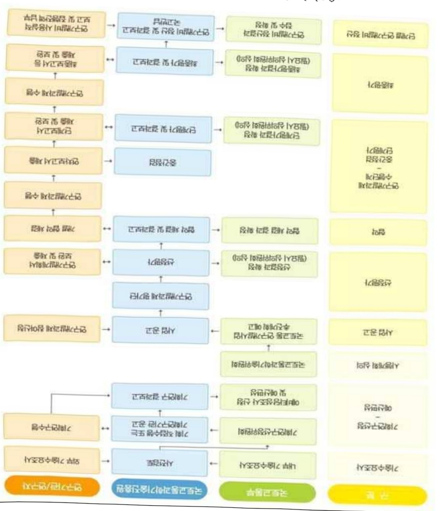

# 과적단속효율화를위한화물차중량정보플랫폼구축및실증기술…

**해당 페이지**: PDF 2220 ~ 2228 쪽 해당

**부처**: 국토교통부
**분야**: 교통 및 물류
**회계유형**: 교통시설 특별회계
**2026 확정예산**: 4000.0 백만원
**전년대비 증감률**: None%
**AI 도메인**: 교통/모빌리티

---

### 가.예산 총괄표

(단위: 백만원, %)

<table border=1 style='margin: auto; word-wrap: break-word;'><tr><td rowspan="2">사업명</td><td rowspan="2">2024년 결산</td><td colspan="2">2025년 예산</td><td colspan="2">2026년</td><td rowspan="2">중감(B-A)</td><td rowspan="2">(B-A)/A</td></tr><tr><td style='text-align: center; word-wrap: break-word;'>본예산(A)</td><td style='text-align: center; word-wrap: break-word;'>추경</td><td style='text-align: center; word-wrap: break-word;'>정부안</td><td style='text-align: center; word-wrap: break-word;'>확정(B)</td></tr><tr><td style='text-align: center; word-wrap: break-word;'>과적단속효율화를위한화물차중량정보를택폼구축및실증기술개발사업(R&amp;D)</td><td style='text-align: center; word-wrap: break-word;'>-</td><td style='text-align: center; word-wrap: break-word;'>-</td><td style='text-align: center; word-wrap: break-word;'>-</td><td style='text-align: center; word-wrap: break-word;'>4,000</td><td style='text-align: center; word-wrap: break-word;'>4,000</td><td style='text-align: center; word-wrap: break-word;'>4,000</td><td style='text-align: center; word-wrap: break-word;'>순증</td></tr></table>

□ 기능별(내역사업별), 목별 예산 내역

(단위:백만원)

<table border=1 style='margin: auto; word-wrap: break-word;'><tr><td rowspan="3"></td><td colspan="5">2024</td><td colspan="6">2025(2025.12월말 기준)</td><td style='text-align: center; word-wrap: break-word;'>2026예산</td></tr><tr><td rowspan="2">예산액(추정)</td><td rowspan="2">예산현액</td><td rowspan="2">집행액[실집행액]</td><td rowspan="2">이월액</td><td rowspan="2">불용액</td><td rowspan="2">본예산</td><td rowspan="2">예산현액</td><td rowspan="2">집행액[실집행액]</td><td colspan="2">전년도 이월액제외</td><td rowspan="2">이월예상액</td><td rowspan="2">불용예상액</td></tr><tr><td style='text-align: center; word-wrap: break-word;'>예산현액</td><td style='text-align: center; word-wrap: break-word;'>집행액[실집행액]</td></tr><tr><td style='text-align: center; word-wrap: break-word;'>○ 기능별 분류(합계)</td><td style='text-align: center; word-wrap: break-word;'>-</td><td style='text-align: center; word-wrap: break-word;'>-</td><td style='text-align: center; word-wrap: break-word;'>-</td><td style='text-align: center; word-wrap: break-word;'>-</td><td style='text-align: center; word-wrap: break-word;'>-</td><td style='text-align: center; word-wrap: break-word;'>-</td><td style='text-align: center; word-wrap: break-word;'>-</td><td style='text-align: center; word-wrap: break-word;'>-</td><td style='text-align: center; word-wrap: break-word;'>-</td><td style='text-align: center; word-wrap: break-word;'>-</td><td style='text-align: center; word-wrap: break-word;'>-</td><td style='text-align: center; word-wrap: break-word;'>4,000</td></tr><tr><td style='text-align: center; word-wrap: break-word;'>· 과적단속 효율화를 위한 화물차 중량정보 플랫폼 구축 및 실증 기술개발</td><td style='text-align: center; word-wrap: break-word;'>-</td><td style='text-align: center; word-wrap: break-word;'>-</td><td style='text-align: center; word-wrap: break-word;'>-</td><td style='text-align: center; word-wrap: break-word;'>-</td><td style='text-align: center; word-wrap: break-word;'>-</td><td style='text-align: center; word-wrap: break-word;'>-</td><td style='text-align: center; word-wrap: break-word;'>-</td><td style='text-align: center; word-wrap: break-word;'>-</td><td style='text-align: center; word-wrap: break-word;'>-</td><td style='text-align: center; word-wrap: break-word;'>-</td><td style='text-align: center; word-wrap: break-word;'>-</td><td style='text-align: center; word-wrap: break-word;'>4,000</td></tr><tr><td style='text-align: center; word-wrap: break-word;'>○ 비목별 분류(합계)</td><td style='text-align: center; word-wrap: break-word;'>-</td><td style='text-align: center; word-wrap: break-word;'>-</td><td style='text-align: center; word-wrap: break-word;'>-</td><td style='text-align: center; word-wrap: break-word;'>-</td><td style='text-align: center; word-wrap: break-word;'>-</td><td style='text-align: center; word-wrap: break-word;'>-</td><td style='text-align: center; word-wrap: break-word;'>-</td><td style='text-align: center; word-wrap: break-word;'>-</td><td style='text-align: center; word-wrap: break-word;'>-</td><td style='text-align: center; word-wrap: break-word;'>-</td><td style='text-align: center; word-wrap: break-word;'>-</td><td style='text-align: center; word-wrap: break-word;'>4,000</td></tr><tr><td style='text-align: center; word-wrap: break-word;'>· 연구 활동 비 등(360-05)</td><td style='text-align: center; word-wrap: break-word;'>-</td><td style='text-align: center; word-wrap: break-word;'>-</td><td style='text-align: center; word-wrap: break-word;'>-</td><td style='text-align: center; word-wrap: break-word;'>-</td><td style='text-align: center; word-wrap: break-word;'>-</td><td style='text-align: center; word-wrap: break-word;'>-</td><td style='text-align: center; word-wrap: break-word;'>-</td><td style='text-align: center; word-wrap: break-word;'>-</td><td style='text-align: center; word-wrap: break-word;'>-</td><td style='text-align: center; word-wrap: break-word;'>-</td><td style='text-align: center; word-wrap: break-word;'>-</td><td style='text-align: center; word-wrap: break-word;'>4,000</td></tr><tr><td style='text-align: center; word-wrap: break-word;'>○ 기능·비목별 분류(합계)</td><td style='text-align: center; word-wrap: break-word;'>-</td><td style='text-align: center; word-wrap: break-word;'>-</td><td style='text-align: center; word-wrap: break-word;'>-</td><td style='text-align: center; word-wrap: break-word;'>-</td><td style='text-align: center; word-wrap: break-word;'>-</td><td style='text-align: center; word-wrap: break-word;'>-</td><td style='text-align: center; word-wrap: break-word;'>-</td><td style='text-align: center; word-wrap: break-word;'>-</td><td style='text-align: center; word-wrap: break-word;'>-</td><td style='text-align: center; word-wrap: break-word;'>-</td><td style='text-align: center; word-wrap: break-word;'>-</td><td style='text-align: center; word-wrap: break-word;'>4,000</td></tr><tr><td style='text-align: center; word-wrap: break-word;'>· 과적단속 효율화를 위한 화물차 중량정보 플랫폼 구축 및 실증 기술개발</td><td style='text-align: center; word-wrap: break-word;'>-</td><td style='text-align: center; word-wrap: break-word;'>-</td><td style='text-align: center; word-wrap: break-word;'>-</td><td style='text-align: center; word-wrap: break-word;'>-</td><td style='text-align: center; word-wrap: break-word;'>-</td><td style='text-align: center; word-wrap: break-word;'>-</td><td style='text-align: center; word-wrap: break-word;'>-</td><td style='text-align: center; word-wrap: break-word;'>-</td><td style='text-align: center; word-wrap: break-word;'>-</td><td style='text-align: center; word-wrap: break-word;'>-</td><td style='text-align: center; word-wrap: break-word;'>-</td><td style='text-align: center; word-wrap: break-word;'>4,000</td></tr><tr><td style='text-align: center; word-wrap: break-word;'>- 연구 활동 비 등(360-05)</td><td style='text-align: center; word-wrap: break-word;'>-</td><td style='text-align: center; word-wrap: break-word;'>-</td><td style='text-align: center; word-wrap: break-word;'>-</td><td style='text-align: center; word-wrap: break-word;'>-</td><td style='text-align: center; word-wrap: break-word;'>-</td><td style='text-align: center; word-wrap: break-word;'>-</td><td style='text-align: center; word-wrap: break-word;'>-</td><td style='text-align: center; word-wrap: break-word;'>-</td><td style='text-align: center; word-wrap: break-word;'>-</td><td style='text-align: center; word-wrap: break-word;'>-</td><td style='text-align: center; word-wrap: break-word;'>-</td><td style='text-align: center; word-wrap: break-word;'>4,000</td></tr></table>

---

### 나. 사업설명자료

## 1 ) 사업목적·내용

- (과적단속 효율화를 위한 화물차 중량정보 플랫폼 구축 및 실증 기술개발) 도로 과적 검문소 계중시스템 신뢰성 저하와 단속지점 교통정체 해결을 위한 차세대 화물차 중량정보 계중 및 유통기술 개발을 통해 계중시스템 국산화 및 도로·교량 등 국가 주요 인프라 과손 예방

## 2 ) 사업개요

## □ 사업근거 및 추진경위

① 법령상 근거 및 조항 적시

- 국가통합교통체계효율화법 제98조(교통기술 연구·개발사업의 추진) ① 국토교통부장관은 교통기술의 연구·개발을 효율적으로 추진하기 위하여 연도별·분야별 교통기술 연구·개발과제를 선정하여 다음 각 호의 기관 또는 단체 등과 협약을 맺어 교통기술 연구·개발사업을 하게 할 수 있다.

- 도로법 제77조(차량의 운행 제한 및 운행 허가) ① 도로관리청은 도로 구조를 보전하고 도로에서의 차량 운행으로 인한 위험을 방지하기 위하여 필요하면 대통령령으로 정하는 바에 따라 도로에서의 차량 운행을 제한할 수 있다.

- 지속가능 교통물류 발전법 제20조(대형 중량화물의 운송대책) ① 국가 및 지방자치 단체는 대통령령으로 정하는 대형중량화물에 대하여 환경친화적이고 효율적인 운송대책을 마련하여야 한다.

- 도로교통법 제39조(승차 또는 적재의 방법과 제한) ① 모든 차의 운전자는 승차인원, 적재중량 및 적재용량에 관하여 대통령령으로 정하는 운행상의 안전기준을 넘어서 승차시키거나 적재한 상태로 운전하여서는 아니 된다. 다만, 출발지를 관할하는 경찰서장의 허가를 받은 경우에는 그러하지 아니하다.

- 자동차 및 자동차부품의 성능과 기준에 관한 규칙 제6조(차량 총중량 등) ①자동차의 차량총중량은 20톤(승합자동차의 경우에는 30톤, 화물자동차 및 특수자동차의 경우에는 40톤), 축하중은 10톤, 윤중은 5톤을 초과하여서는 아니 된다.

- 가축분뇨의 관리 및 이용에 관한 법률 제37조3(가축분뇨 등의 전자인계 관리 등)

① 대통령령으로 정하는 가축분뇨 또는 액비를 배출, 수집 · 운반, 처리 또는 살

---

포하는 자는 그 가축분뇨 또는 액비를 배출, 수집 · 운반, 처리 또는 살포하는 경우 환경부령으로 정하는 바에 따라 전자인계관리시스템의 운용 방법, 절차 등 운영 관리에 관한 사항을 준수하여야 한다([환경부령 별표 14] 3.가축분뇨 전자인계관리시스템의 사용자는 가축분뇨 또는 액비의 전자인계서 작성 및 입력정보 검증을 위하여 환경부에서 제공·설치한 중량계 및 위성항법장치(GPS) 등을 고의로 훼손·분실하거나 자료의 조작 등 부정당한 행위를 하여서는 아니 된다)

- 해양수산부고시 제2020-119호(컨테이너 화물의 총중량 검증 등에 관한 기준)

- 선박안전법 제36조(화물정보의 제공) ① 화주(貨主)는 화물을 안전하게 싣고 운송하기 위하여 화물을 싣기 전에 그 화물에 관한 정보를 선장에게 제공하여야 한다.

② 컨테이너에 실은 화물을 외국으로 운송하려는 화주는 제1항에 따라 화물에 관한 정보를 선장에게 제공하는 경우 해양수산부령으로 정하는 방법에 따라 화물의 총중량에 관한 검증된 정보도 함께 제공하여야 한다. 이 경우 선장이 화주에게 요청하는 경우에는 선장 외에 「항만법」 제41조제1항에 따른 항만시설운영자 또는 임대계약자에게도 화물의 총중량에 관한 검증된 정보를 제공하여야 한다.

- 선박안전법 제39조(화물의 적재·고박방법 등) ④선박소유자는 컨테이너에 화물을 수납·적재하는 경우에는 제1항의 규정에 따라 승인된 화물적재고박지침서에 따르되, 컨테이너안전승인관에 표시된 최대총중량을 초과하여 화물을 수납·적재하여서는 아니 된다.

- 물환경보전법 제66조2(수탁처리폐수의 전산 처리) ① 환경부장관은 폐수처리업자가 위탁을 받아 처리하는 폐수(이하 “수탁처리폐수”라 한다)의 인계 · 인수에 관한 내용 등을 전자적으로 관리하기 위한 시스템(이하 “전자인계 · 인수관리시스템”이라 한다)을 구축 · 운영하여야 한다. ② 수탁처리폐수를 위탁하는 사업자(이하 이 조에서 “폐수위탁사업자”라 한다)와 폐수처리업자는 해당 폐수의 인계 · 인수에 관한 내용 등 대통령령으로 정하는 사항을 환경부령으로 정하는 바에 따라 전자인계 · 인수관리시스템에 입력하여야 한다.

## ② 추진경위

- 2022년 사업용 차량 교통안전 강화 대책 발표

· 화물차 과적, 적재불량 근절을 위한 제도 개선과 화물차 및 위험물질 운송차량

운행 관리 강화

-2023년 화물운송산업 정상화 방안 발표

·실질적인 화물차 교통안전 및 과적에 대한 화주·운수사 책임 강화

---

- 2023년 스마트 화물차 중량관리 지원기술 개발 기획 추진('23.12.~'24.12., 도로공사)

- 2024년 교통사고 사망자 감소대책 발표

· 화물차 정비·점검 강화, 운송사업자 등 안전의무 및 안전의식 확산을 위반 단속 강화

- 2025년 제21대 대통령선거 정책공약 발표

(생활안정 22) 편리하고 안전한 교통·물류환경을 만들겠습니다

→ 화물자동차 안전운임제 재도입 등 화물운송업계 종사자 지원 확대

- 2025년 국정기획위원회 5대 국정목표와 123개 국정과제 발표

(국정과제 31) 미래 모빌리티와 K-AI 시티 실현

## □ 주요내용

① 사업규모

- 총사업비 : 해당없음

- 사업기간 : '26 ~ '30

- 최근 5년 간 투입된 사업비(예산액기준, 추경편성한 연도에는 추경포함)

<table border=1 style='margin: auto; word-wrap: break-word;'><tr><td style='text-align: center; word-wrap: break-word;'>연도</td><td style='text-align: center; word-wrap: break-word;'>2022</td><td style='text-align: center; word-wrap: break-word;'>2023</td><td style='text-align: center; word-wrap: break-word;'>2024</td><td style='text-align: center; word-wrap: break-word;'>2025</td><td style='text-align: center; word-wrap: break-word;'>2026</td></tr><tr><td style='text-align: center; word-wrap: break-word;'>사업비</td><td style='text-align: center; word-wrap: break-word;'>-</td><td style='text-align: center; word-wrap: break-word;'>-</td><td style='text-align: center; word-wrap: break-word;'>-</td><td style='text-align: center; word-wrap: break-word;'>-</td><td style='text-align: center; word-wrap: break-word;'>4,000</td></tr></table>

-기타: 해당없음

② 사업추진체계

- 사업시행방법 : 출연(참여기업이 있는 경우 Matching)

- 사업시행주체 : 국토교통부(전문기관 : 국토교통과학기술진흥원)

-사업 수혜자 : 대학, 기업, 출연연 등

- 보조, 융자, 출연, 출자 등의 경우 보조·융자 등 지원 비율 및 법적근거

<table border=1 style='margin: auto; word-wrap: break-word;'><tr><td style='text-align: center; word-wrap: break-word;'>내역사업명</td><td style='text-align: center; word-wrap: break-word;'>구분</td><td style='text-align: center; word-wrap: break-word;'>피보조·피출연 등 기관명</td><td style='text-align: center; word-wrap: break-word;'>지원 금액 (2026예산)</td><td style='text-align: center; word-wrap: break-word;'>지원 비율(%)</td><td style='text-align: center; word-wrap: break-word;'>보조율 법적근거 (해당 조항)</td></tr><tr><td rowspan="3">과적단속 효율화를 위한 화물차 중량정보 플랫폼 구축 및 실증 기술개발</td><td rowspan="3">출연</td><td style='text-align: center; word-wrap: break-word;'>「중소기업기본법」제2조에 따른 중소기업에 해당하는 연구개발기관</td><td rowspan="3">4,000 백만원</td><td style='text-align: center; word-wrap: break-word;'>연구개발 비의 100분의 75 이하</td><td rowspan="3">「국가연구개발 혁신법 시행령」 제19조</td></tr><tr><td style='text-align: center; word-wrap: break-word;'>「중견기업 성장촉진 및 경쟁력 강화에 관한 특별법」제2조제1호에 따른 중견기업에 해당하는 연구개발기관</td><td style='text-align: center; word-wrap: break-word;'>연구개발 비의 100분의 70 이하</td></tr><tr><td style='text-align: center; word-wrap: break-word;'>「공공기관의 운영에 관한 법률」제5조제4항제1호에 따른 공기업에 해당하거나 ‘가’, ‘나’에 해당 해당하지 않는 연구개발기관</td><td style='text-align: center; word-wrap: break-word;'>연구개발 비의 100분의 50 이하</td></tr></table>

* 다만, 중앙행정기관의 장이 필요하다고 인정하는 국가연구개발사업에 대하여 별도로 정할 수 있음

---

## 3 ) 2026년도 예산 산출 근거

①과적단속 효율화를 위한 화물차 중량정보 플랫폼 구축 및 실증 기술개발

:(25)0→(26)4,000백만원,4,000백만원 증액

- 육상·항만 화물정보를 결합·관리·공유하여 화물차량 교통·운송관리 등 통합 관리체계 마련을 위한 플랫폼 개발 및 화물차량 사전 계중 활성화를 통해 과적 관리·예방의 효율성을 극대화하기 위한 고정밀 계층시스템 시작품 개발 등 사업 착수를 위한 예산 4,000백만원 소요

- (산출) ① 동적 계중시스템 중량계측 센서 시작품 제작(7대) 등 1,020백만원

② 자중계 센서융합 최적화 연구/설계 및 시작품 제작(8대) 등 957백만원

③ 블록체인 기반 신원인증(DID)/암호화/증명서(VC) 알고리즘 설계 등 1,266백만원

④ 중량관리 지원기술 및 통합운영센터 플랫폼 표준안 설계 등 757백만원

·(신규) 1개 × 5,333백만원 × 9/12 = 4,000백만원

2025년도 예산 및 2026년도 예산 산출 세부내역 비교

<table border=1 style='margin: auto; word-wrap: break-word;'><tr><td colspan="2">&#x27;25년 예산</td><td colspan="2">&#x27;26년 예산</td></tr><tr><td style='text-align: center; word-wrap: break-word;'>예산</td><td style='text-align: center; word-wrap: break-word;'>산출내역</td><td style='text-align: center; word-wrap: break-word;'>예산</td><td style='text-align: center; word-wrap: break-word;'>산출내역</td></tr><tr><td style='text-align: center; word-wrap: break-word;'>-</td><td style='text-align: center; word-wrap: break-word;'>-</td><td style='text-align: center; word-wrap: break-word;'>4,000 백만원</td><td style='text-align: center; word-wrap: break-word;'>○ 연구활동비 등(360-05): 4,000백만원 가. 동적 계중시스템 중량계측 센서 시작품 제작(7대) 등 1,020백만원 나. 자중계 센서융합 최적화 연구/설계 및 시작품 제작(8대) 등 957백만원 다. 블록체인 기반 신원인증(DID)/암호화/증명서(VC) 알고리즘 설계 등 1,266백만원 라. 중량관리 지원기술 및 통합운영센터 플랫폼 표준안 설계 등 757백만원</td></tr></table>

## 4 ) 사업효과

☐ 사업영향, 산출물 성과지표 등

① 2022~2026년도 성과계획서 상 성과지표 및 최근 5년간 성과 달성도 : 해당없음 (26년 신규)

② 성과지표 이외의 연도별 사업추진 경과 및 실적: 해당없음('26년 신규)

③향후(2026년도 이후)기대효과

- 운전자가 과적여부 확인을 통해 연간 4만건에서 1.2만건으로 약 70% 감소 효과 및 화주의 과적 요구에 대한 방어권 확보

- 과적에 의한 도로, 구조물 보수 비용* 연간 약 2,400억원 절감 효과 및 과적으로 인한 교통사고 손실 비용** 연간 약 1,030억원 절감 효과

* (국도) 2,880억(총 9,600억 중 과적에 의한 보수비용은 약 30% 수준) + (고속도로) 609억 = 3,489억

** (인적피해 비용) 756억 + (물적피해 비용) 718억 = 1,474억원

---

- 사전 계중한 차량은 과적검사를 면제하여 화물 이동시간과 비용을 줄이고 도로 관리청 단속 업무의 효율성 및 운전자 편의성 제고

- 사전 계중 활성화를 통해 정확한 중량 기반 적정 운임보장 등 공정한 운송 지원을 통해 사회적 비용 절감 효과

- 화물 중량 계근시스템의 자동·무인화 등 국산기술 경쟁력 강화 및 확산

- 해외 기술에 의존했던 센싱기술을 국산화 및 AI+IT 융복합 방식의 미래형 K-계중 시스템의 표준 기술 모델을 제시

- 과적검사 차량 감소로 단속설비 투자 예산의 점진적인 감소

- 실시간 연계되는 중량정보 관리를 통해 데이터 기반의 단속설비간 편차(성능)확인 및 조정 등 능동형 유지관리·제어 및 예산 절감

- 도로구간별 중차량 군집도, 누적하중 분석 등 최적의 도로·교량 노후도 예측관리를 통해 구조물 안전 및 경제적인 효과 기대

- 육상·항만 화물정보의 결합으로 연계된 화물운송(중량) 관리의 효율화* 등 스마트화를 가속화

* (항만공사) ①수출입 컨테이너 차량 항만 도착시간 예측으로 부두 선적 스케쥴 관리, ②부두 컨테이너 중량별 적재 관리→컨테이너 차량 대기시간 감소

5) 타당성조사 및 예비타당성조사 시행여부 및 결과 요지 : 해당없음

6) 총사업비 대상사업 여부 및 내역 : 해당없음

---

<table border=1 style='margin: auto; word-wrap: break-word;'><tr><td style='text-align: center; word-wrap: break-word;'>부처</td><td style='text-align: center; word-wrap: break-word;'></td><td style='text-align: center; word-wrap: break-word;'>피출연·피보조기관</td><td style='text-align: center; word-wrap: break-word;'></td><td style='text-align: center; word-wrap: break-word;'>간접보조사업자·사업수행자</td></tr><tr><td style='text-align: center; word-wrap: break-word;'>국토교통부(4,000백만원)</td><td style='text-align: center; word-wrap: break-word;'>=&gt;(4,000백만원)</td><td style='text-align: center; word-wrap: break-word;'>국토교통과학기술진흥원(4,000백만원)</td><td style='text-align: center; word-wrap: break-word;'>=&gt;(4,000백만원)</td><td style='text-align: center; word-wrap: break-word;'>미정</td></tr></table>

<운전자 폐달 오조작 방지 및 평가 기술개발>

---

8) 중기재정계획 상 연도별 투자계획 및 추진경과

(단위: 백만원)

<table border=1 style='margin: auto; word-wrap: break-word;'><tr><td style='text-align: center; word-wrap: break-word;'>2024</td><td style='text-align: center; word-wrap: break-word;'>2025</td><td style='text-align: center; word-wrap: break-word;'>2026</td><td style='text-align: center; word-wrap: break-word;'>2027</td><td style='text-align: center; word-wrap: break-word;'>2028</td><td style='text-align: center; word-wrap: break-word;'>2029</td></tr><tr><td style='text-align: center; word-wrap: break-word;'>2024~2028</td><td style='text-align: center; word-wrap: break-word;'>-</td><td style='text-align: center; word-wrap: break-word;'>-</td><td style='text-align: center; word-wrap: break-word;'>-</td><td style='text-align: center; word-wrap: break-word;'>-</td><td style='text-align: center; word-wrap: break-word;'>-</td></tr><tr><td style='text-align: center; word-wrap: break-word;'>2025~2029</td><td style='text-align: center; word-wrap: break-word;'>-</td><td style='text-align: center; word-wrap: break-word;'>4,000</td><td style='text-align: center; word-wrap: break-word;'>6,800</td><td style='text-align: center; word-wrap: break-word;'>7,700</td><td style='text-align: center; word-wrap: break-word;'>4,600</td></tr></table>

9) 최근 3년간 동 사업에 대한 주요 외부지적사항 및 평가, 문제점 및 대책 : 해당없음

## 10 ) 향후 추진방향 및 추진계획

<table border=1 style='margin: auto; word-wrap: break-word;'><tr><td style='text-align: center; word-wrap: break-word;'>☐ 과적검문소 계중시스템 신뢰성 저하와 단속지점 교통정체 해결을 위한 차세대 화물차 중량정보 계중 및 유통기술 개발을 통해 계중시스템 국산화 및 도로·교량 등 국가 주요 인프라 과손 예방</td></tr><tr><td style='text-align: center; word-wrap: break-word;'>○ (중점1) 고정밀 자동·무인 화물차 계중시스템 개발</td></tr><tr><td style='text-align: center; word-wrap: break-word;'>○ (중점2) 화물차 탑재 하중 스마트 센싱 및 적재량 변화 모니터링 기술 개발</td></tr><tr><td style='text-align: center; word-wrap: break-word;'>○ (중점3) 블록체인 기반 화물차 중량관리 플랫폼 기술 개발</td></tr><tr><td style='text-align: center; word-wrap: break-word;'>○ (중점4) 테스트베드 기반 육상·항만 연계 실증</td></tr></table>

11) 해당사업에 대한 각종 사업평가의 결과 : 해당없음

12) 해당사업에 대한 부처 자체평가의 결과 : 해당없음

13) 부처 건의사항 : 해당없음

---

<table border=1 style='margin: auto; word-wrap: break-word;'><tr><td style='text-align: center; word-wrap: break-word;'>사 업 명</td></tr><tr><td style='text-align: center; word-wrap: break-word;'>(63) 광역단위 노후건축물 디지털 안전위치 기술개발(R&amp;D) (4156-324)</td></tr></table>

□ 사업 코드 정보

<table border=1 style='margin: auto; word-wrap: break-word;'><tr><td style='text-align: center; word-wrap: break-word;'>구분</td><td style='text-align: center; word-wrap: break-word;'>회계</td><td style='text-align: center; word-wrap: break-word;'>소관</td><td style='text-align: center; word-wrap: break-word;'>실국(기관)</td><td style='text-align: center; word-wrap: break-word;'>계정</td><td style='text-align: center; word-wrap: break-word;'>분야</td><td style='text-align: center; word-wrap: break-word;'>부문</td></tr><tr><td style='text-align: center; word-wrap: break-word;'>코드</td><td rowspan="2">일반회계</td><td rowspan="2">국토교통부</td><td rowspan="2">국토도시실</td><td rowspan="2">-</td><td style='text-align: center; word-wrap: break-word;'>120</td><td style='text-align: center; word-wrap: break-word;'>126</td></tr><tr><td style='text-align: center; word-wrap: break-word;'>명칭</td><td style='text-align: center; word-wrap: break-word;'>교통및물류</td><td style='text-align: center; word-wrap: break-word;'>물류등기타</td></tr></table>

<table border=1 style='margin: auto; word-wrap: break-word;'><tr><td style='text-align: center; word-wrap: break-word;'>구분</td><td style='text-align: center; word-wrap: break-word;'>프로그램</td><td style='text-align: center; word-wrap: break-word;'>단위사업</td><td style='text-align: center; word-wrap: break-word;'>세부사업</td></tr><tr><td style='text-align: center; word-wrap: break-word;'>코드</td><td style='text-align: center; word-wrap: break-word;'>4100</td><td style='text-align: center; word-wrap: break-word;'>4156</td><td style='text-align: center; word-wrap: break-word;'>324</td></tr><tr><td style='text-align: center; word-wrap: break-word;'>명칭</td><td style='text-align: center; word-wrap: break-word;'>국토교통연구개발</td><td style='text-align: center; word-wrap: break-word;'>도시건축연구(R&amp;D)</td><td style='text-align: center; word-wrap: break-word;'>광역단위노후건축물디지털안전위치기술개발(R&amp;D)</td></tr></table>

☐ 사업 성격

<table border=1 style='margin: auto; word-wrap: break-word;'><tr><td rowspan="2">신규</td><td rowspan="2">계속</td><td rowspan="2">완료</td><td rowspan="2">예비타당성실시여부</td><td rowspan="2">총사업비관리대상</td><td rowspan="2">총액계상예산사업</td><td style='text-align: center; word-wrap: break-word;'>사업소관 변경정보</td></tr><tr><td style='text-align: center; word-wrap: break-word;'>2025예산 시 소관</td></tr><tr><td style='text-align: center; word-wrap: break-word;'></td><td style='text-align: center; word-wrap: break-word;'></td><td style='text-align: center; word-wrap: break-word;'>○</td><td style='text-align: center; word-wrap: break-word;'></td><td style='text-align: center; word-wrap: break-word;'></td><td style='text-align: center; word-wrap: break-word;'></td><td style='text-align: center; word-wrap: break-word;'>국토교통부</td></tr></table>

□ 사업 지원 형태 및 지원율

<table border=1 style='margin: auto; word-wrap: break-word;'><tr><td style='text-align: center; word-wrap: break-word;'>직접</td><td style='text-align: center; word-wrap: break-word;'>출자</td><td style='text-align: center; word-wrap: break-word;'>출연</td><td style='text-align: center; word-wrap: break-word;'>보조</td><td style='text-align: center; word-wrap: break-word;'>융자</td><td style='text-align: center; word-wrap: break-word;'>국고보조율(%)</td><td style='text-align: center; word-wrap: break-word;'>융자율(%)</td></tr><tr><td style='text-align: center; word-wrap: break-word;'></td><td style='text-align: center; word-wrap: break-word;'></td><td style='text-align: center; word-wrap: break-word;'>○</td><td style='text-align: center; word-wrap: break-word;'></td><td style='text-align: center; word-wrap: break-word;'></td><td style='text-align: center; word-wrap: break-word;'></td><td style='text-align: center; word-wrap: break-word;'></td></tr></table>

□ 사업 담당자

<table border=1 style='margin: auto; word-wrap: break-word;'><tr><td style='text-align: center; word-wrap: break-word;'>사업명</td><td colspan="2">구분</td></tr><tr><td rowspan="4">광역단위노후건축물디지털안전위치기술개발(R&amp;D)</td><td rowspan="3">소관부처</td><td style='text-align: center; word-wrap: break-word;'>실·국·과(팀)</td></tr><tr><td style='text-align: center; word-wrap: break-word;'>국토도시실</td></tr><tr><td style='text-align: center; word-wrap: break-word;'>건축정책과</td></tr><tr><td style='text-align: center; word-wrap: break-word;'>사업시행주체</td><td style='text-align: center; word-wrap: break-word;'>국토교통과학기술진흥원건축주거실</td></tr></table>

---

### 원본 PDF 크롭 이미지

