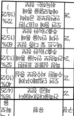
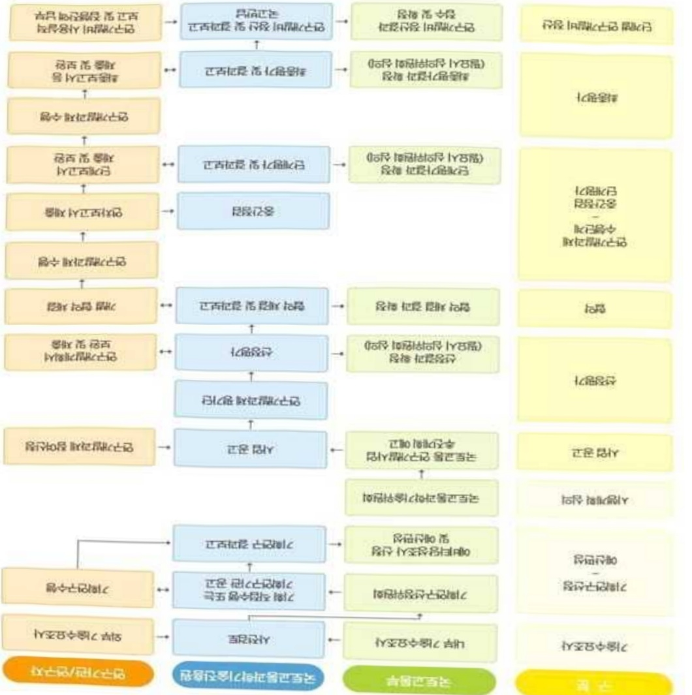

# 광역단위노후건축물디지털안전워치기술개발(R&D)

**해당 페이지**: PDF 2229 ~ 2237 쪽 해당

**부처**: 국토교통부
**분야**: 교통 및 물류
**회계유형**: 일반회계
**2026 확정예산**: 2611.0 백만원
**전년대비 증감률**: -22.1%
**AI 도메인**: 건설/스마트시티

---

<table border=1 style='margin: auto; word-wrap: break-word;'><tr><td style='text-align: center; word-wrap: break-word;'>사 업 명</td></tr><tr><td style='text-align: center; word-wrap: break-word;'>(63) 광역단위 노후건축물 디지털 안전위치 기술개발(R&amp;D) (4156-324)</td></tr></table>

□ 사업 코드 정보

<table border=1 style='margin: auto; word-wrap: break-word;'><tr><td style='text-align: center; word-wrap: break-word;'>구분</td><td style='text-align: center; word-wrap: break-word;'>회계</td><td style='text-align: center; word-wrap: break-word;'>소관</td><td style='text-align: center; word-wrap: break-word;'>실국(기관)</td><td style='text-align: center; word-wrap: break-word;'>계정</td><td style='text-align: center; word-wrap: break-word;'>분야</td><td style='text-align: center; word-wrap: break-word;'>부문</td></tr><tr><td style='text-align: center; word-wrap: break-word;'>코드</td><td rowspan="2">일반회계</td><td rowspan="2">국토교통부</td><td rowspan="2">국토도시실</td><td rowspan="2">-</td><td style='text-align: center; word-wrap: break-word;'>120</td><td style='text-align: center; word-wrap: break-word;'>126</td></tr><tr><td style='text-align: center; word-wrap: break-word;'>명칭</td><td style='text-align: center; word-wrap: break-word;'>교통및물류</td><td style='text-align: center; word-wrap: break-word;'>물류등기타</td></tr></table>

<table border=1 style='margin: auto; word-wrap: break-word;'><tr><td style='text-align: center; word-wrap: break-word;'>구분</td><td style='text-align: center; word-wrap: break-word;'>프로그램</td><td style='text-align: center; word-wrap: break-word;'>단위사업</td><td style='text-align: center; word-wrap: break-word;'>세부사업</td></tr><tr><td style='text-align: center; word-wrap: break-word;'>코드</td><td style='text-align: center; word-wrap: break-word;'>4100</td><td style='text-align: center; word-wrap: break-word;'>4156</td><td style='text-align: center; word-wrap: break-word;'>324</td></tr><tr><td style='text-align: center; word-wrap: break-word;'>명칭</td><td style='text-align: center; word-wrap: break-word;'>국토교통연구개발</td><td style='text-align: center; word-wrap: break-word;'>도시건축연구(R&amp;D)</td><td style='text-align: center; word-wrap: break-word;'>광역단위노후건축물디지털안전위치기술개발(R&amp;D)</td></tr></table>

☐ 사업 성격

<table border=1 style='margin: auto; word-wrap: break-word;'><tr><td rowspan="2">신규</td><td rowspan="2">계속</td><td rowspan="2">완료</td><td rowspan="2">예비타당성실시여부</td><td rowspan="2">총사업비관리대상</td><td rowspan="2">총액계상예산사업</td><td style='text-align: center; word-wrap: break-word;'>사업소관 변경정보</td></tr><tr><td style='text-align: center; word-wrap: break-word;'>2025예산 시 소관</td></tr><tr><td style='text-align: center; word-wrap: break-word;'></td><td style='text-align: center; word-wrap: break-word;'></td><td style='text-align: center; word-wrap: break-word;'>○</td><td style='text-align: center; word-wrap: break-word;'></td><td style='text-align: center; word-wrap: break-word;'></td><td style='text-align: center; word-wrap: break-word;'></td><td style='text-align: center; word-wrap: break-word;'>국토교통부</td></tr></table>

□ 사업 지원 형태 및 지원율

<table border=1 style='margin: auto; word-wrap: break-word;'><tr><td style='text-align: center; word-wrap: break-word;'>직접</td><td style='text-align: center; word-wrap: break-word;'>출자</td><td style='text-align: center; word-wrap: break-word;'>출연</td><td style='text-align: center; word-wrap: break-word;'>보조</td><td style='text-align: center; word-wrap: break-word;'>융자</td><td style='text-align: center; word-wrap: break-word;'>국고보조율(%)</td><td style='text-align: center; word-wrap: break-word;'>융자율(%)</td></tr><tr><td style='text-align: center; word-wrap: break-word;'></td><td style='text-align: center; word-wrap: break-word;'></td><td style='text-align: center; word-wrap: break-word;'>○</td><td style='text-align: center; word-wrap: break-word;'></td><td style='text-align: center; word-wrap: break-word;'></td><td style='text-align: center; word-wrap: break-word;'></td><td style='text-align: center; word-wrap: break-word;'></td></tr></table>

□ 사업 담당자

<table border=1 style='margin: auto; word-wrap: break-word;'><tr><td style='text-align: center; word-wrap: break-word;'>사업명</td><td colspan="2">구분</td></tr><tr><td rowspan="4">광역단위노후건축물디지털안전위치기술개발(R&amp;D)</td><td rowspan="3">소관부처</td><td style='text-align: center; word-wrap: break-word;'>실·국·과(팀)</td></tr><tr><td style='text-align: center; word-wrap: break-word;'>국토도시실</td></tr><tr><td style='text-align: center; word-wrap: break-word;'>건축정책과</td></tr><tr><td style='text-align: center; word-wrap: break-word;'>사업시행주체</td><td style='text-align: center; word-wrap: break-word;'>국토교통과학기술진흥원건축주거실</td></tr></table>

---

### 가.예산 총괄표

(단위: 백만원, %)

<table border=1 style='margin: auto; word-wrap: break-word;'><tr><td rowspan="2">사업명</td><td rowspan="2">2024년 결산</td><td colspan="2">2025년 예산</td><td colspan="2">2026년</td><td rowspan="2">중감(B-A)</td><td rowspan="2">(B-A)/A</td></tr><tr><td style='text-align: center; word-wrap: break-word;'>본예산(A)</td><td style='text-align: center; word-wrap: break-word;'>추경</td><td style='text-align: center; word-wrap: break-word;'>정부안</td><td style='text-align: center; word-wrap: break-word;'>확정(B)</td></tr><tr><td style='text-align: center; word-wrap: break-word;'>광역단위 노후건축물 디지털 안전위치 기술개발(R&amp;D)</td><td style='text-align: center; word-wrap: break-word;'>1,220</td><td style='text-align: center; word-wrap: break-word;'>3,353</td><td style='text-align: center; word-wrap: break-word;'>3,353</td><td style='text-align: center; word-wrap: break-word;'>2,611</td><td style='text-align: center; word-wrap: break-word;'>2,611</td><td style='text-align: center; word-wrap: break-word;'>△742</td><td style='text-align: center; word-wrap: break-word;'>△22.1</td></tr></table>

□ 기능별(내역사업별), 목별 예산 내역

(단위:백만원)

<table border=1 style='margin: auto; word-wrap: break-word;'><tr><td rowspan="3"></td><td colspan="5">2024</td><td colspan="7">2025(2025.12월 말 기준)</td><td rowspan="3">2026예산</td></tr><tr><td rowspan="2">예산액(추경)</td><td rowspan="2">예산현액</td><td rowspan="2">집행액[실집행액]</td><td rowspan="2">이월액</td><td rowspan="2">불용액</td><td rowspan="2">본예산</td><td rowspan="2">예산현액</td><td rowspan="2">집행액[실집행액]</td><td colspan="2">전년도 이월액제외</td><td rowspan="2">이월예상액</td><td rowspan="2">불용예상액</td></tr><tr><td style='text-align: center; word-wrap: break-word;'>예산현액</td><td style='text-align: center; word-wrap: break-word;'>집행액[실집행액]</td></tr><tr><td style='text-align: center; word-wrap: break-word;'>○ 기능별 분류(합계)</td><td style='text-align: center; word-wrap: break-word;'>1,220</td><td style='text-align: center; word-wrap: break-word;'>1,220</td><td style='text-align: center; word-wrap: break-word;'>1,220[1,220]</td><td style='text-align: center; word-wrap: break-word;'>-</td><td style='text-align: center; word-wrap: break-word;'>-</td><td style='text-align: center; word-wrap: break-word;'>3,353</td><td style='text-align: center; word-wrap: break-word;'>3,353</td><td style='text-align: center; word-wrap: break-word;'>3,353[3,353]</td><td style='text-align: center; word-wrap: break-word;'>3,353</td><td style='text-align: center; word-wrap: break-word;'>3,353[3,353]</td><td style='text-align: center; word-wrap: break-word;'>-</td><td style='text-align: center; word-wrap: break-word;'>-</td><td style='text-align: center; word-wrap: break-word;'>2,611</td></tr><tr><td style='text-align: center; word-wrap: break-word;'>· 광역단위노후건축물디지털 안전위치기술개발</td><td style='text-align: center; word-wrap: break-word;'>1,220</td><td style='text-align: center; word-wrap: break-word;'>1,220</td><td style='text-align: center; word-wrap: break-word;'>1,220[1,220]</td><td style='text-align: center; word-wrap: break-word;'>-</td><td style='text-align: center; word-wrap: break-word;'>-</td><td style='text-align: center; word-wrap: break-word;'>3,353</td><td style='text-align: center; word-wrap: break-word;'>3,353</td><td style='text-align: center; word-wrap: break-word;'>3,353[3,353]</td><td style='text-align: center; word-wrap: break-word;'>3,353</td><td style='text-align: center; word-wrap: break-word;'>3,353[3,353]</td><td style='text-align: center; word-wrap: break-word;'>-</td><td style='text-align: center; word-wrap: break-word;'>-</td><td style='text-align: center; word-wrap: break-word;'>2,611</td></tr><tr><td style='text-align: center; word-wrap: break-word;'>○ 비목별 분류(합계)</td><td style='text-align: center; word-wrap: break-word;'>1,220</td><td style='text-align: center; word-wrap: break-word;'>1,220</td><td style='text-align: center; word-wrap: break-word;'>1,220[1,220]</td><td style='text-align: center; word-wrap: break-word;'>-</td><td style='text-align: center; word-wrap: break-word;'>-</td><td style='text-align: center; word-wrap: break-word;'>3,353</td><td style='text-align: center; word-wrap: break-word;'>3,353</td><td style='text-align: center; word-wrap: break-word;'>3,353[3,353]</td><td style='text-align: center; word-wrap: break-word;'>3,353</td><td style='text-align: center; word-wrap: break-word;'>3,353[3,353]</td><td style='text-align: center; word-wrap: break-word;'>-</td><td style='text-align: center; word-wrap: break-word;'>-</td><td style='text-align: center; word-wrap: break-word;'>2,611</td></tr><tr><td style='text-align: center; word-wrap: break-word;'>· 연구 활동 비 등(360-05)</td><td style='text-align: center; word-wrap: break-word;'>1,220</td><td style='text-align: center; word-wrap: break-word;'>1,220</td><td style='text-align: center; word-wrap: break-word;'>1,220[1,220]</td><td style='text-align: center; word-wrap: break-word;'>-</td><td style='text-align: center; word-wrap: break-word;'>-</td><td style='text-align: center; word-wrap: break-word;'>3,353</td><td style='text-align: center; word-wrap: break-word;'>3,353</td><td style='text-align: center; word-wrap: break-word;'>3,353[3,353]</td><td style='text-align: center; word-wrap: break-word;'>3,353</td><td style='text-align: center; word-wrap: break-word;'>3,353[3,353]</td><td style='text-align: center; word-wrap: break-word;'>-</td><td style='text-align: center; word-wrap: break-word;'>-</td><td style='text-align: center; word-wrap: break-word;'>2,611</td></tr><tr><td style='text-align: center; word-wrap: break-word;'>○ 기능비목별 분류(합계)</td><td style='text-align: center; word-wrap: break-word;'>1,220</td><td style='text-align: center; word-wrap: break-word;'>1,220</td><td style='text-align: center; word-wrap: break-word;'>1,220[1,220]</td><td style='text-align: center; word-wrap: break-word;'>-</td><td style='text-align: center; word-wrap: break-word;'>-</td><td style='text-align: center; word-wrap: break-word;'>3,353</td><td style='text-align: center; word-wrap: break-word;'>3,353</td><td style='text-align: center; word-wrap: break-word;'>3,353[3,353]</td><td style='text-align: center; word-wrap: break-word;'>3,353</td><td style='text-align: center; word-wrap: break-word;'>3,353[3,353]</td><td style='text-align: center; word-wrap: break-word;'>-</td><td style='text-align: center; word-wrap: break-word;'>-</td><td style='text-align: center; word-wrap: break-word;'>2,611</td></tr><tr><td style='text-align: center; word-wrap: break-word;'>· 광역단위노후건축물디지털 안전위치기술개발</td><td style='text-align: center; word-wrap: break-word;'>1,220</td><td style='text-align: center; word-wrap: break-word;'>1,220</td><td style='text-align: center; word-wrap: break-word;'>1,220[1,220]</td><td style='text-align: center; word-wrap: break-word;'>-</td><td style='text-align: center; word-wrap: break-word;'>-</td><td style='text-align: center; word-wrap: break-word;'>3,353</td><td style='text-align: center; word-wrap: break-word;'>3,353</td><td style='text-align: center; word-wrap: break-word;'>3,353[3,353]</td><td style='text-align: center; word-wrap: break-word;'>3,353</td><td style='text-align: center; word-wrap: break-word;'>3,353[3,353]</td><td style='text-align: center; word-wrap: break-word;'>-</td><td style='text-align: center; word-wrap: break-word;'>-</td><td style='text-align: center; word-wrap: break-word;'>2,611</td></tr><tr><td style='text-align: center; word-wrap: break-word;'>· 연구 활동 비 등(360-05)</td><td style='text-align: center; word-wrap: break-word;'>1,220</td><td style='text-align: center; word-wrap: break-word;'>1,220</td><td style='text-align: center; word-wrap: break-word;'>1,220[1,220]</td><td style='text-align: center; word-wrap: break-word;'>-</td><td style='text-align: center; word-wrap: break-word;'>-</td><td style='text-align: center; word-wrap: break-word;'>3,353</td><td style='text-align: center; word-wrap: break-word;'>3,353</td><td style='text-align: center; word-wrap: break-word;'>3,353[3,353]</td><td style='text-align: center; word-wrap: break-word;'>3,353</td><td style='text-align: center; word-wrap: break-word;'>3,353[3,353]</td><td style='text-align: center; word-wrap: break-word;'>-</td><td style='text-align: center; word-wrap: break-word;'>-</td><td style='text-align: center; word-wrap: break-word;'>2,611</td></tr></table>

---

### 나. 사업설명자료

## 1 ) 사업목적·내용

- (광역단위 노후건축물 디지털 안전위치 기술개발) 중소규모 노후 건축물의 구조·화재 안전 관리를 강화하기 위해 디지털 기반의 안전현황 신속조사·원격점검 및 관리·서비스 기술개발

· 건축물 안전정보를 신속하게 선별 인식 · 추출 및 디지털 변환기술 개발

· 드론, 영상스캔, AI 등을 이용한 원격 · 자동화 정보조사 및 점검기술 개발

· 지자체 연계 광역단위 디지털 안전정보 구축, 통합관리 서비스기술 개발 및 실증

## 2 ) 사업개요

## □ 사업근거 및 추진경위

① 법령상 근거 및 조항 적시

- 「국토교통과학기술육성법」 제8조(연구개발사업의 추진) ① 국토교통부장관은 종합계획을 효율적으로 추진하기 위하여 국토교통과학기술 연구개발사업을 할 수 있다.

- '건축불관리법' 제35조(건축불관리 연구·개발) ① 정부는 건축불관리기술의 향상과 관련 산업의 진흥을 위한 시책을 추진하기 위하여 대통령령으로 정하는 기관 또는 단체와 협약을 체결하여 건축불관리기술의 연구·개발 사업을 실시할 수 있다.

② 제1항에 따른 건축불관리기술의 연구·개발 사업에 필요한 경비는 정부 또는 정부 외의 자의 출연금이나 그 밖의 기업의 기술개발비로 충당한다.

- 「시설물의 안전 및 유지관리에 관한 특별법」 제5조(시설물의 안전 및 유지관리 기본계획의 수립·시행) ① 국토교통부 장관은 시설물이 안전하게 유지관리될 수 있도록 하기 위하여 5년마다 시설물의 안전 및 유지관리에 관한 기본계획(이하 “기본계획”이라 한다)을 수립·시행하여야 한다.

② 기본계획에는 다음 각 호의 사항이 포함되어야 한다.

1. 시설물의 안전 및 유지관리에 관한 기본목표 및 추진방향에 관한 사항

2. 시설물의 안전 및 유지관리체계의 개발, 구축 및 운영에 관한 사항

3. 시설물의 안전 및 유지관리에 관한 정보체계의 구축·운영에 관한 사항

4. 시설물의 안전 및 유지관리에 필요한 기술의 연구 개발에 관한 사항

## ② 추진경위

- '21.04 : '광역단위 노후건축물 디지털 안전위치 기술개발' 기획

- '22.01 : '광역단위 노후건축물 디지털 안전위치 기술개발' 과제 공고

- '22.04 : '광역단위 노후건축물 디지털 안전위치 기술개발' 신규 과제 협약

- '24.03 : 국토교통R&D 중간평가 자체평가, 과기부점검 결과 우수(90.6점)

---

## □ 주요내용

① 사업규모

- 총사업비 : 해당없음

- 사업기간 : '22 ~ '26

- 최근 5년 간 투입된 사업비(예산액기준, 추경편성한 연도에는 추경포함)

<table border=1 style='margin: auto; word-wrap: break-word;'><tr><td style='text-align: center; word-wrap: break-word;'>$ \underline{\text{角}} $</td><td style='text-align: center; word-wrap: break-word;'>2022</td><td style='text-align: center; word-wrap: break-word;'>2023</td><td style='text-align: center; word-wrap: break-word;'>2024</td><td style='text-align: center; word-wrap: break-word;'>2025</td><td style='text-align: center; word-wrap: break-word;'>2026</td></tr><tr><td style='text-align: center; word-wrap: break-word;'>$ \underline{\text{사업비}} $</td><td style='text-align: center; word-wrap: break-word;'>3,842</td><td style='text-align: center; word-wrap: break-word;'>3,842</td><td style='text-align: center; word-wrap: break-word;'>1,220</td><td style='text-align: center; word-wrap: break-word;'>3,353</td><td style='text-align: center; word-wrap: break-word;'>2,611</td></tr></table>

- 기타: 해당없음

② 사업추진체계

- 사업시행방법 : 출연(참여기업이 있는 경우 Matching)

- 사업시행주체 : 국토교통부(전문기관 : 국토교통과학기술진흥원)

- 사업 수혜자 : 대학, 기업, 출연연 등

- 보조, 융자, 출연, 출자 등의 경우 보조·융자 등 지원 비율 및 법적근거

<table border=1 style='margin: auto; word-wrap: break-word;'><tr><td style='text-align: center; word-wrap: break-word;'>내역사업명</td><td style='text-align: center; word-wrap: break-word;'>구분</td><td style='text-align: center; word-wrap: break-word;'>피보조·피출연 등 기관명</td><td style='text-align: center; word-wrap: break-word;'>지원 금액 (2026예산)</td><td style='text-align: center; word-wrap: break-word;'>지원 비율(%)</td><td style='text-align: center; word-wrap: break-word;'>보조율 법적근거 (해당 조항)</td></tr><tr><td rowspan="3">광역단위 노후건축물 디지털 안전위치 기술개발</td><td rowspan="3">출연</td><td style='text-align: center; word-wrap: break-word;'>「중소기업기본법」제2조에 따른 중소기업에 해당하는 연구개발기관</td><td rowspan="3">2,611 백만원</td><td style='text-align: center; word-wrap: break-word;'>연구개발 비의 100분의 75 이하</td><td rowspan="3">「국가연구개발 혁신법 시행령」제19조</td></tr><tr><td style='text-align: center; word-wrap: break-word;'>「중견기업 성장촉진 및 경쟁력 강화에 관한 특별법」제2조제1호에 따른 중견기업에 해당하는 연구개발기관</td><td style='text-align: center; word-wrap: break-word;'>연구개발 비의 100분의 70 이하</td></tr><tr><td style='text-align: center; word-wrap: break-word;'>「공공기관의 운영에 관한 법률」제5조제4항제1호에 따른 공기업에 해당하거나 ‘가’, ‘나’에 해당 해당하지 않는 연구개발기관</td><td style='text-align: center; word-wrap: break-word;'>연구개발 비의 100분의 50 이하</td></tr></table>

* 다만, 중앙행정기관의 장이 필요하다고 인정하는 국가연구개발사업에 대하여 별도로 정할 수 있음

---

□ 광역단위 노후건축물 디지털 안전워치 기술개발 (R&D) : (2025 본예산) 3,353백만원 → (2026 확정) 2,611백만원

① 광역단위 노후건축물 디지털 안전워지 기술개발 : (2025 본예산) 3,353백만원 → (2026 확정) 2,611백만원, 742백만원 감액 - (편성) 지자체 단위 노후건축물 디지털 안전관리체계 전환을 위해 도시규모 3차원 건축물 형상정보 구축 자동화, 영상기반 실내외 안전정보 sBIM 통합모델 개발, 지자체(서울시, 고양시 250동) 대상 종합실증 등의 필요성이 인정되어 소요예산 2,611백만원 편성

- (산출) ① 2D 도면 안전정보 sBIM 모델링 자동화 모듈 개발 250백만원

② 도시규모 LOD1 3D 모델(형상정보) 구축 및 실내외 안전정보 sBIM 모델링 통합 모듈 개발 550백만원

③ 디지털 안전관리시스템 서비스 모듈 구현, 건축물 안전정보(18종) 디지털 변환 실증(250동) 1,811백만원

(종료) 1개 × 2,611백만원 × 12/12 = 2,611백만원

02025년도 예산 및 2026년도 예산 산출 세부내역 비교

<table border=1 style='margin: auto; word-wrap: break-word;'><tr><td colspan="2">2025년 예산</td><td colspan="2">2026년 예산</td></tr><tr><td style='text-align: center; word-wrap: break-word;'>예산</td><td style='text-align: center; word-wrap: break-word;'>산출내역</td><td style='text-align: center; word-wrap: break-word;'>예산</td><td style='text-align: center; word-wrap: break-word;'>산출내역</td></tr><tr><td style='text-align: center; word-wrap: break-word;'>광역단위</td><td colspan="2">○ 연구활동비 등(360-05) : 3,353백만원</td><td style='text-align: center; word-wrap: break-word;'>○ 연구활동비 등(360-05) : 2,611백만원</td></tr><tr><td style='text-align: center; word-wrap: break-word;'>노후건축물</td><td colspan="2">가. AI기반 2D 도면 안전정보 추출 및 3D 경량 BIM 자동생성 모듈 개발 674백만원</td><td style='text-align: center; word-wrap: break-word;'>가. 2D 도면 안전정보 sBIM 모델링 자동화 모듈 개발 250백만원</td></tr><tr><td style='text-align: center; word-wrap: break-word;'>안전위치</td><td colspan="2">나. AI, 무인이동체 기반 실내외 안전정보 자동생성 기술개발 625백만원</td><td style='text-align: center; word-wrap: break-word;'>2,611 나. 도시규모 LOD1 3D 모델(형상정보) 구축 및 실내외 안전정보 sBIM 모델링 통합 모듈 개발 550백만원</td></tr><tr><td style='text-align: center; word-wrap: break-word;'>기술개발</td><td colspan="2">3,353 다. 지자체 광역단위 안전관리시스템 Prototype 구축 백만원 1,228백만원</td><td style='text-align: center; word-wrap: break-word;'>다. 디지털 안전관리시스템 서비스 모듈 구현 및 건축물 안전정보 18종 디지털 변환 실증(250동) 1,811백만원</td></tr><tr><td colspan="3">라. 디지털 안전관리 지원 서비스 모델 개발 826백만원</td><td style='text-align: center; word-wrap: break-word;'></td></tr></table>

## 4 ) 사업효과

☐ 사업영향, 산출물 성과지표 등

① 2022~2026년도 성과계획서 상 성과지표 및 최근 5년간 성과 달성도

<table border=1 style='margin: auto; word-wrap: break-word;'><tr><td style='text-align: center; word-wrap: break-word;'>성과지표</td><td style='text-align: center; word-wrap: break-word;'>구분</td><td style='text-align: center; word-wrap: break-word;'>2022</td><td style='text-align: center; word-wrap: break-word;'>2023</td><td style='text-align: center; word-wrap: break-word;'>2024</td><td style='text-align: center; word-wrap: break-word;'>2025</td><td style='text-align: center; word-wrap: break-word;'>2026</td><td colspan="3">2026 목표치산출근거</td><td style='text-align: center; word-wrap: break-word;'>측정산식(또는 측정방법)</td><td style='text-align: center; word-wrap: break-word;'>자료수집방법(또는 자료출처)</td></tr><tr><td rowspan="5">도면 인공지능학습데이터 셋 구축 (건)</td><td style='text-align: center; word-wrap: break-word;'>목표</td><td style='text-align: center; word-wrap: break-word;'>500</td><td style='text-align: center; word-wrap: break-word;'>3,500</td><td style='text-align: center; word-wrap: break-word;'>5,500</td><td style='text-align: center; word-wrap: break-word;'></td><td style='text-align: center; word-wrap: break-word;'>-</td><td colspan="3">기존 도면 인공지능학습데이터 셋 구축의 연차별 누적 목표</td><td style='text-align: center; word-wrap: break-word;'>∑연도별 도면 학습데이터 셋 구축 건수</td><td rowspan="5">연차별 실적보고서, 범부처통합관리시스템(IRIS) 등</td></tr><tr><td style='text-align: center; word-wrap: break-word;'>실적</td><td style='text-align: center; word-wrap: break-word;'>716</td><td style='text-align: center; word-wrap: break-word;'>10,615</td><td style='text-align: center; word-wrap: break-word;'>11,715</td><td style='text-align: center; word-wrap: break-word;'></td><td style='text-align: center; word-wrap: break-word;'>-</td><td style='text-align: center; word-wrap: break-word;'>구분</td><td style='text-align: center; word-wrap: break-word;'>랜덤도</td><td style='text-align: center; word-wrap: break-word;'>기타 도면</td><td style='text-align: center; word-wrap: break-word;'>누적 건수</td></tr><tr><td rowspan="3">달성도</td><td rowspan="3">143%</td><td rowspan="3">303%</td><td rowspan="3">213%</td><td rowspan="3"></td><td rowspan="3">-</td><td style='text-align: center; word-wrap: break-word;'>22</td><td style='text-align: center; word-wrap: break-word;'>400</td><td style='text-align: center; word-wrap: break-word;'>100</td><td style='text-align: center; word-wrap: break-word;'>500</td></tr><tr><td style='text-align: center; word-wrap: break-word;'>23</td><td style='text-align: center; word-wrap: break-word;'>2,000</td><td style='text-align: center; word-wrap: break-word;'>1,000</td><td style='text-align: center; word-wrap: break-word;'>3,500</td></tr><tr><td style='text-align: center; word-wrap: break-word;'>24</td><td style='text-align: center; word-wrap: break-word;'>1,500</td><td style='text-align: center; word-wrap: break-word;'>500</td><td style='text-align: center; word-wrap: break-word;'>5,500</td></tr><tr><td rowspan="2">디지털 안전정보 확보 수준(%)</td><td style='text-align: center; word-wrap: break-word;'>목표</td><td style='text-align: center; word-wrap: break-word;'>16</td><td style='text-align: center; word-wrap: break-word;'>40</td><td style='text-align: center; word-wrap: break-word;'>52</td><td style='text-align: center; word-wrap: break-word;'>60</td><td style='text-align: center; word-wrap: break-word;'>72</td><td rowspan="2" colspan="3">안전정보 25종에 대한 디지털화 항목 비율의 연차별 누적 목표</td><td rowspan="2">[ (∑ 안전정보 디지털 변환 항목 수) ÷ 구축가능 총 디지털 안전정보 항목 수(25종) ] × 100(%)</td><td rowspan="2">연차별 실적보고서, 범부처통합관리시스템(IRIS) 등</td></tr><tr><td style='text-align: center; word-wrap: break-word;'>실적</td><td style='text-align: center; word-wrap: break-word;'>16</td><td style='text-align: center; word-wrap: break-word;'>68</td><td style='text-align: center; word-wrap: break-word;'>76</td><td style='text-align: center; word-wrap: break-word;'>-</td><td style='text-align: center; word-wrap: break-word;'>-</td></tr></table>

---

<table border=1 style='margin: auto; word-wrap: break-word;'><tr><td rowspan="2"></td><td style='text-align: center; word-wrap: break-word;'></td><td style='text-align: center; word-wrap: break-word;'></td><td style='text-align: center; word-wrap: break-word;'></td><td style='text-align: center; word-wrap: break-word;'></td><td style='text-align: center; word-wrap: break-word;'></td><td style='text-align: center; word-wrap: break-word;'></td><td style='text-align: center; word-wrap: break-word;'></td><td style='text-align: center; word-wrap: break-word;'></td><td style='text-align: center; word-wrap: break-word;'></td><td style='text-align: center; word-wrap: break-word;'></td><td style='text-align: center; word-wrap: break-word;'></td><td style='text-align: center; word-wrap: break-word;'></td></tr><tr><td style='text-align: center; word-wrap: break-word;'>달성도</td><td style='text-align: center; word-wrap: break-word;'>100%</td><td style='text-align: center; word-wrap: break-word;'>170%</td><td style='text-align: center; word-wrap: break-word;'>146%</td><td style='text-align: center; word-wrap: break-word;'>-</td><td style='text-align: center; word-wrap: break-word;'>-</td><td style='text-align: center; word-wrap: break-word;'></td><td style='text-align: center; word-wrap: break-word;'></td><td style='text-align: center; word-wrap: break-word;'></td><td style='text-align: center; word-wrap: break-word;'></td><td style='text-align: center; word-wrap: break-word;'></td><td style='text-align: center; word-wrap: break-word;'></td></tr><tr><td rowspan="2">실내 공간정보 안전점검 인공지능 학습 DB 구축률 (%)</td><td style='text-align: center; word-wrap: break-word;'>목표</td><td style='text-align: center; word-wrap: break-word;'>33</td><td style='text-align: center; word-wrap: break-word;'>67</td><td style='text-align: center; word-wrap: break-word;'></td><td style='text-align: center; word-wrap: break-word;'>100</td><td style='text-align: center; word-wrap: break-word;'>-</td><td colspan="4">건축물 실내외 결합정보 학습DB 30만건 구축의 연차별 누적 목표</td><td style='text-align: center; word-wrap: break-word;'>[ (∑ 학습DB 구축 건수 ) ÷ 총 목표 학습DB 수 (30만건) ] × 100(%)</td><td style='text-align: center; word-wrap: break-word;'>연차별 실적보고서, 법무처통합관리 시스템(IRIS) 등</td></tr><tr><td style='text-align: center; word-wrap: break-word;'>실적</td><td style='text-align: center; word-wrap: break-word;'>47</td><td style='text-align: center; word-wrap: break-word;'>67</td><td style='text-align: center; word-wrap: break-word;'></td><td style='text-align: center; word-wrap: break-word;'>-</td><td style='text-align: center; word-wrap: break-word;'>-</td><td style='text-align: center; word-wrap: break-word;'>구성 구조 최대 쇄비 쇄비 쇄비 쇄비 쇄비 쇄비 쇄비 쇄비 쇄비 쇄비 쇄비 쇄비 쇄비 쇄비 쇄비 쇄비 쇄비 쇄비 쇄비 쇄비 쇄비 쇄비 쇄비 쇄비 쇄비 쇄비 쇄비 쇄비 쇄비 쇄비 쇄비 쇄비 쇄비 쇄비 쇄비 쇄비 쇄비 쇄비 쇄비 쇄비 쇄비 쇄비 쇄비 쇄비 쇄비 쇄비 쇄비 쇄비 쇄비 쇄비 쇄비 쇄비 쇄비 쇄비 쇄비 쇄비 쇄비 쇄비 쇄비 쇄비 쇄비 쇄비 쇄비 쇄비 쇄비 쇄비 쇄비 쇄비 쇄비 쇄비 쇄비 쇄비 쇄비 쇄비 쇄비 쇄비 쇄비 쇄비 쇄비 쇄비 쇄비 쇄비 쇄비 쇄비 쇄비 쇄비 쇄비 쇄비 쇄비 쇄비 쇄비 쇄비 쇄비 쇄비 쇄비 쇄비 쇄비 쇄비 쇄비 쇄비 쇄비 쇄비 쇄비 쇄비 쇄비 쇄비 쇄비 쇄비 쇄비 쇄비 쇄비 쇄비 쇄비 쇄비 쇄비 쇄비 쇄비 쇄비 쇄비 쇄비 쇄비 쇄비 쇄비 쇄비 쇄비 쇄비 쇄비 쇄비 쇄비 쇄비 쇄비 쇄비 쇄비 쇄비 쇄비 쇄비 쇄비 쇄비 쇄비 쇄비 쇄비 쇄비 쇄비 쇄비 쇄비 쇄비 쇄비 쇄비 쇄비 쇄비 쇄비 쇄비 쇄비 쇄비 쇄비 쇄비 쇄비 쇄비 쇄비 쇄비 쇄비 쇄비 쇄비 쇄비 쇄비 쇄비 쇄비 쇄비 쇄비 쇄비 쇄비 쇄비 쇄비 쇄비 쇄비 쇄비 쇄비 쇄비 쇄비 쇄비 쇄비 쇄비 쇄비 쇄비 쇄비 쇄비 쇄비 쇄비 쇄비 쇄비 쇄비 쇄비 쇄비 쇄비 쇄비 쇄비 쇄비 쇄비 쇄비 쇄비 쇄비 쇄비 쇄비 쇄비 쇄비 쇄비 쇄비 쇄비 쇄비 쇄비 쇄비 쇄비 쇄비 쇄비 쇄비 쇄비 쇄비 쇄비 쇄비 쇄비 쇄비 쇄비 쇄비 쇄비 쇄비 쇄비 쇄비 쇄비 쇄비 쇄비 쇄비 쇄비 쇄비 쇄비 쇄비 쇄비 쇄비 쇄비 쇄비 쇄비 쇄비 쇄비 쇄비 쇄비 쇄비 쇄비 쇄비 쇄비 쇄비 쇄비 쇄비 쇄비 쇄비 쇄비 쇄비 쇄비 쇄비 쇄비 쇄비 쇄비 쇄비 쇄비 쇄비 쇄비 쇄비 쇄비 쇄비 쇄비 쇄비 쇄비 쇄비 쇄비 쇄비 쇄비 쇄비 쇄비 쇄비 쇄비 쇄비 쇄비 쇄비 쇄비 쇄비 쇄비 쇄비 쇄비 쇄비 쇄비 쇄비 쇄비 쇄비 쇄비 쇄비 쇄비 쇄비 쇄비 쇄비 쇄비 쇄비 쇄비 쇄비 쇄비 쇄비 쇄비 쇄비 쇄비 쇄비 쇄비 쇄비 쇄비 쇄비 쇄비 쇄비 쇄비 쇄비 쇄비 쇄비 쇄비 쇄비 쇄비 쇄비 쇄비 쇄비 쇄비 쇄비 쇄비 쇄비 쇄비 쇄비 쇄비 쇄비 쇄비 쇄비 쇄비 쇄비 쇄비 쇄비 쇄비 쇄비 쇄비 쇄비 쇄비 쇄비 쇄비 쇄비 쇄비 쇄비 쇄비 쇄비 쇄비 쇄비 쇄비 쇄비 쇄비 쇄비 쇄비 쇄비 쇄비 쇄비 쇄비 쇄비 쇄비 쇄비 쇄비 쇄비 쇄비 쇄비 쇄비 쇄비 쇄비 쇄비 쇄비 쇄비 쇄비 쇄비 쇄비 쇄비 쇄비 쇄비 쇄비 쇄비 쇄비 쇄비 쇄비 쇄비 쇄비 쇄비 쇄비 쇄비 쇄비 쇄비 쇄비 쇄비 쇄비 쇄비 쇄비 쇄비 쇄비 쇄비 쇄비 쇄비 쇄비 쇄비 쇄비 쇄비 쇄비 쇄비 쇄비 쇄비 쇄비 쇄비 쇄비 쇄비 쇄비 쇄비 쇄비 쇄비 쇄비 쇄비 쇄비 쇄비 쇄비 쇄비 쇄비 쇄비 쇄비 쇄비 쇄비 쇄비 쇄비 쇄비 쇄비 쇄비 쇄비 쇄비 쇄비 쇄비 쇄비 쇄비 쇄비 쇄비 쇄비 쇄비 쇄비 쇄비 쇄비 쇄비 쇄비 쇄비 쇄비 쇄비 쇄비 쇄비 쇄비 쇄비 쇄비 쇄비 쇄비 쇄비 쇄비 쇄비 쇄비 쇄비 쇄비 쇄비 쇄비 쇄비 쇄비 쇄비 쇄비 쇄비 쇄비 쇄비 쇄비 쇄비 쇄비 쇄비 쇄비 쇄비 쇄비 쇄비 쇄비 쇄비 쇄비 쇄비 쇄비 쇄비 쇄비 쇄비 쇄비 쇄비 쇄비 쇄비 쇄비 쇄비 쇄비 쇄비 쇄비 쇄비 쇄비 쇄비 쇄비 쇄비 쇄비 쇄비 쇄비 쇄비 쇄비 쇄비 쇄비 쇄비 쇄비 쇄비 쇄비 쇄비 쇄비 쇄비 쇄비 쇄비 쇄비 쇄비 쇄비 쇄비 쇄비 쇄비 쇄비 쇄비 쇄비 쇄비 쇄비 쇄비 쇄비 쇄비 쇄비 쇄비 쇄비 쇄비 쇄비 쇄비 쇄비 쇄비 쇄비 쇄비 쇄비 쇄비 쇄비 쇄비 쇄비 쇄비 쇄비 쇄비 쇄비 쇄비 쇄비 쇄비 쇄비 쇄비 쇄비 쇄비 쇄비 쇄비 쇄비 쇄비 쇄비 쇄비 쇄비 쇄비 쇄비 쇄비 쇄비 쇄비 쇄비 쇄비 쇄비 쇄비 쇄비 쇄비 쇄비 쇄비 쇄비 쇄비 쇄비 쇄비 쇄비 쇄비 쇄비 쇄비 쇄비 쇄비 쇄비 쇄비 쇄비 쇄비 쇄비 쇄비 쇄비 쇄비 쇄비 쇄비 쇄비 쇄비 쇄비 쇄비 쇄비 쇄비 쇄비 쇄비 쇄비 쇄비 쇄비 쇄비 쇄비 쇄비 쇄비 쇄비 쇄비 쇄비 쇄비 쇄비 쇄비 쇄비 쇄비 쇄비 쇄비 쇄비 쇄비 쇄비 쇄비 쇄비 쇄비 쇄비 쇄비 쇄비 쇄비 쇄비 쇄비 쇄비 쇄비 쇄비 쇄비 쇄비 쇄비 쇄비 쇄비 쇄비 쇄비 쇄비 쇄비 쇄비 쇄비 쇄비 쇄비 쇄비 쇄비 쇄비 쇄비 쇄비 쇄비 쇄비 쇄비 쇄비 쇄비 쇄비 쇄비 쇄비 쇄비 쇄비 쇄비 쇄비 쇄비 쇄비 쇄비 쇄비 쇄비 쇄비 쇄비 쇄비 쇄비 쇄비 쇄비 쇄비 쇄비 쇄비 쇄비 쇄비 쇄비 쇄비 쇄비 쇄비 쇄비 쇄비 쇄비 쇄비 쇄비 쇄비 쇄비 쇄비 쇄비 쇄비 쇄비 쇄비 쇄비 쇄비 쇄비 쇄비 쇄비 쇄비 쇄비 쇄비 쇄비 쇄비 쇄비 쇄비 쇄비 쇄비 쇄비 쇄비 쇄비 쇄비 쇄비 쇄비 쇄비 쇄비 쇄비 쇄비 쇄비 쇄비 쇄비 쇄비 쇄비 쇄비 쇄비 쇄비 쇄비 쇄비 쇄비 쇄비 쇄비 쇄비 쇄비 쇄비 쇄비 쇄비 쇄비 쇄비 쇄비 쇄비 쇄비 쇄비 쇄비 쇄비 쇄비 쇄비 쇄비 쇄비 쇄비 쇄비 쇄비 쇄비 쇄비 쇄비 쇄비 쇄비 쇄비 쇄비 쇄비 쇄비 쇄비 쇄비 쇄비 쇄비 쇄비 쇄</td><td style='text-align: center; word-wrap: break-word;'></td><td style='text-align: center; word-wrap: break-word;'></td><td style='text-align: center; word-wrap: break-word;'></td><td style='text-align: center; word-wrap: break-word;'></td><td style='text-align: center; word-wrap: break-word;'></td></tr></table>

---

② 성과지표 이외의 연도별 사업추진 경과 및 실적

<table border=1 style='margin: auto; word-wrap: break-word;'><tr><td style='text-align: center; word-wrap: break-word;'>2022</td><td style='text-align: center; word-wrap: break-word;'>- ‘광역단위 노후건축물 디지털 안전위치 기술개발’ 착수(&#x27;22.4) - 2D AI 학습데이터 구축을 위한 도면 전처리 모듈 및 라벨링 도구 개발(&#x27;22.11) - 건축물 원격조사 · 점검 무인이동체 운영매뉴얼 2종 및 건축물 실내외 공간정보 정합 및 좌표계 동기화 SW 개발(&#x27;22.11) - 결합정보 학습데이터 라벨링 도구 개발(&#x27;22.11) - 건축물 디지털 안전관리시스템 정보프레임워크 개발 및 실증 계획 수립(&#x27;22.11)</td></tr><tr><td style='text-align: center; word-wrap: break-word;'>2023</td><td style='text-align: center; word-wrap: break-word;'>- 실증 지자체(서울 성북구, 동대문구, 고양시) 협약체결(&#x27;23.6) - AI 기반 2D 도면의 공간 · 형상정보 10종)인식 · 추출 자동화 기술 개발(&#x27;23.12) - 무인기 기반 3D 외부 형상정보 구축 · 운영 S/W 및 다면 카메라 시작품(H/W), 실내외 안전정보 통합 생성 S/W 개발(&#x27;23.10) - 결함영상 AI 학습데이터 셋 301,574건 구축, 건축물 화재, 구조 결함탐지 딥러닝 모듈(S/W) 개발(&#x27;23.10) - 실증지자체(고양) 디지털 안전관리시스템 프로토타입 개발 및 서비스 모델 4종 구축·시연, 고양시 노후건축물 예비실증 10동 3D 안전정보 구축(&#x27;23.11)</td></tr><tr><td style='text-align: center; word-wrap: break-word;'>2024</td><td style='text-align: center; word-wrap: break-word;'>- 기존 2D 도면 인공지능 비전인식 객체정보 추출, 안전정보 벡터화 및 3D 경량 BIM (sBIM) 반자동 생성 기술개발(&#x27;24.12) - 영상기반 실내 안전정보 추출 인공지능 모델 고도화, 3D 경량 BIM(sBIM) 모델링 역설계 기술개발(&#x27;24.12) - 수요자별(거주자, 지자체 등) 건축물 디지털 안전관리 지원 서비스 모델 5종 설계 완료(&#x27;24.12)</td></tr><tr><td style='text-align: center; word-wrap: break-word;'>2025</td><td style='text-align: center; word-wrap: break-word;'>- 2D 도면 안전정보 디지털화 AI 정확도 향상*(80% 목표), sBIM 모델링 반자동화 모듈 개발(&#x27;25.12) - 고정의 무인기 기반 도시규모 형상정보 신속 구축 기술, 이동식 스캐너 및 AI 기반 실내 안전정보 추출 고도화(&#x27;25.12) - 실증 지자체(고양시, 서울 성북구, 동대문구) 대상으로 건축물 100동 안전정보 추출 및 3D 경량 BIM 구축(&#x27;25.12)</td></tr></table>

③향후(2026년도 이후)기대효과

- 기존 아날로그 방식의 단순 보유 안전정보의 디지털화 기술 확보를 통하여 광역단위

건축물 디지털 안전관리 기반 확보

-현행 전문인력의 육안점검에 의존하는 점검 체계를 드론, 영상스캔 등 원격·자동화

기술 개발을 통하여 신속 안전점검 및 비용 절감 유도

- 노후 건축물의 사고피해를 최소화할 수 있는 선진국 수준의 위험 평가·예측·관리 기술 구축

- 지자체의 임의관리대상 건축물 확대를 유도하고 관련 수요확대를 통해 신규일자리 창출

5) 타당성조사 및 예비타당성조사 시행여부 및 결과 요지 : 해당없음

6) 총사업비 대상사업 여부 및 내역 : 해당없음

---

<table border=1 style='margin: auto; word-wrap: break-word;'><tr><td style='text-align: center; word-wrap: break-word;'>부처</td><td style='text-align: center; word-wrap: break-word;'></td><td style='text-align: center; word-wrap: break-word;'>피출연·피보조기관</td><td style='text-align: center; word-wrap: break-word;'></td><td style='text-align: center; word-wrap: break-word;'>간접보조사업자·사업수행자</td></tr><tr><td style='text-align: center; word-wrap: break-word;'>국토교통부(2,611백만원)</td><td style='text-align: center; word-wrap: break-word;'>=&gt;(2,611백만원)</td><td style='text-align: center; word-wrap: break-word;'>국토교통과학기술진흥원(2,611백만원)</td><td style='text-align: center; word-wrap: break-word;'>=&gt;(2,611백만원)</td><td style='text-align: center; word-wrap: break-word;'>한국건설기술연구원 외 5개 기관</td></tr></table>

<광역단위노후건축물디지털안전위치기술개발>

---

8) 중기재정계획 상 연도별 투자계획 및 추진경과

(단위:백만원)

<table border=1 style='margin: auto; word-wrap: break-word;'><tr><td style='text-align: center; word-wrap: break-word;'>2024~2028</td><td style='text-align: center; word-wrap: break-word;'>2024</td><td style='text-align: center; word-wrap: break-word;'>2025</td><td style='text-align: center; word-wrap: break-word;'>2026</td><td style='text-align: center; word-wrap: break-word;'>2027</td><td style='text-align: center; word-wrap: break-word;'>2028</td><td style='text-align: center; word-wrap: break-word;'>2029</td></tr><tr><td style='text-align: center; word-wrap: break-word;'>2025~2029</td><td style='text-align: center; word-wrap: break-word;'></td><td style='text-align: center; word-wrap: break-word;'>3,353</td><td style='text-align: center; word-wrap: break-word;'>5,655</td><td style='text-align: center; word-wrap: break-word;'>-</td><td style='text-align: center; word-wrap: break-word;'>-</td><td style='text-align: center; word-wrap: break-word;'>-</td></tr></table>

9) 최근 3년간 동 사업에 대한 주요 외부지적사항 및 평가, 문제점 및 대책 : 해당없음

## 10 ) 향후 추진방향 및 추진계획

<table border=1 style='margin: auto; word-wrap: break-word;'><tr><td style='text-align: center; word-wrap: break-word;'>☐ 안전취약 중소규모 노후 건축물의 구조·화재 안전관리를 강화하기 위한 AI 기반 디지털 안전정보 구축 및 지자체활용 안전관리시스템 개발</td></tr><tr><td style='text-align: center; word-wrap: break-word;'>○ (중점1) [안전정보 디지털화] AI기반 기준 2D 도면으로부터 건축물 안전정보를 신속하게 선별 인식·추출 및 3D 디지털 변환 기술 개발</td></tr><tr><td style='text-align: center; word-wrap: break-word;'>* ①데이터모델 개발, ②AI기반 2D도면 안전정보 추출 및 3D 디지털화 기술</td></tr><tr><td style='text-align: center; word-wrap: break-word;'>○ (중점2) [원격 조사·점검] 드론, 영상스캔, AI를 활용한 신속조사·점검 및 결합탐지 자동화 기술 개발</td></tr><tr><td style='text-align: center; word-wrap: break-word;'>* ①외부 형상정보 조사·점검, ②실내 안전정보 조사·점검, ③구조결합탐지 AI 모델</td></tr><tr><td style='text-align: center; word-wrap: break-word;'>○ (중점3) [시스템 및 실증] 지자체 활용 디지털 정보 기반 광역단위 건축물 안전관리 시스템(Prototype), 서비스 모델 개발 및 종합실증</td></tr><tr><td style='text-align: center; word-wrap: break-word;'>* ①디지털 안전관리시스템 개발, ②광역단위 안전관리 기술 실증(250동)</td></tr></table>

## 11 ) 해당사업에 대한 각종 사업평가의 결과

<table border=1 style='margin: auto; word-wrap: break-word;'><tr><td style='text-align: center; word-wrap: break-word;'>2) R&amp;D사업의 경우 「국가연구개발사업 등의 성과평가 및 성과관리에 관한 법률」제7조제3항에 따른 부처의 R&amp;D사업 자체성과평가에 대한 과학기술정보통신부 상위평가 결과: &#x27;24년 우수(90.6점)</td></tr></table>

## 12 ) 해당사업에 대한 부처 자체평가의 결과

<table border=1 style='margin: auto; word-wrap: break-word;'><tr><td style='text-align: center; word-wrap: break-word;'>1) 2023년도 부처 재정사업 자율평가 결과: 해당없음</td></tr><tr><td style='text-align: center; word-wrap: break-word;'>2) 2024년도 부처 재정사업 자율평가 결과: 해당없음</td></tr><tr><td style='text-align: center; word-wrap: break-word;'>3) 2025년도 부처 재정사업 자율평가 결과: 해당없음</td></tr></table>

## 13 ) 부처 건의사항 : 해당없음

---

### 원본 PDF 크롭 이미지

