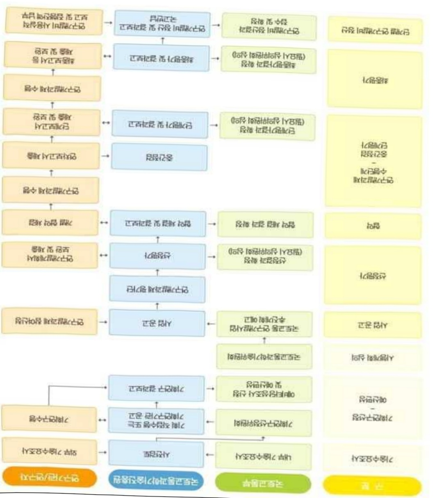
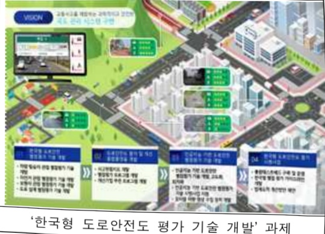
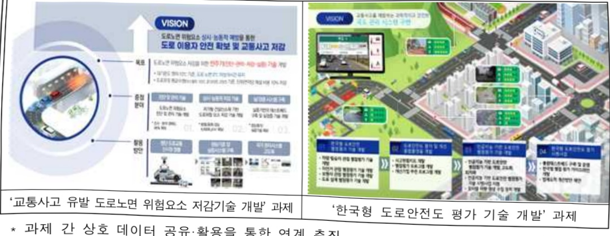
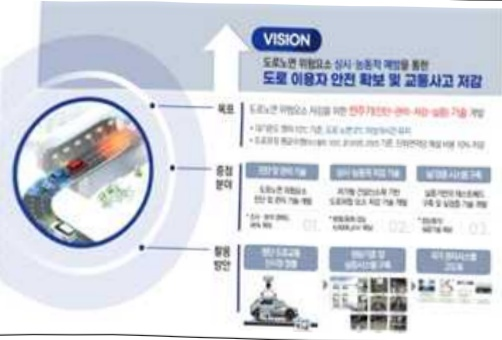

# 교통사고유발도로노면위험요소저감기술개발(R&D)

**해당 페이지**: PDF 2238 ~ 2248 쪽 해당

**부처**: 국토교통부
**분야**: 교통 및 물류
**회계유형**: 교통시설 특별회계
**2026 확정예산**: 5199.0 백만원
**전년대비 증감률**: 6.9%
**AI 도메인**: 교통/모빌리티

---

### 가. 예산 총괄표

(단위: 백만원, %)

<table border=1 style='margin: auto; word-wrap: break-word;'><tr><td rowspan="2">사업명</td><td rowspan="2">2024년 결산</td><td colspan="2">2025년 예산</td><td colspan="2">2026년</td><td rowspan="2">중감(B-A)</td><td rowspan="2">(B-A)/A</td></tr><tr><td style='text-align: center; word-wrap: break-word;'>본예산(A)</td><td style='text-align: center; word-wrap: break-word;'>추경</td><td style='text-align: center; word-wrap: break-word;'>정부안</td><td style='text-align: center; word-wrap: break-word;'>확정(B)</td></tr><tr><td style='text-align: center; word-wrap: break-word;'>교통사고유발도로 노면위험요소저감 기술개발(R&amp;D)</td><td style='text-align: center; word-wrap: break-word;'>2,952</td><td style='text-align: center; word-wrap: break-word;'>4,865</td><td style='text-align: center; word-wrap: break-word;'>4,865</td><td style='text-align: center; word-wrap: break-word;'>5,199</td><td style='text-align: center; word-wrap: break-word;'>5,199</td><td style='text-align: center; word-wrap: break-word;'>334</td><td style='text-align: center; word-wrap: break-word;'>6.9</td></tr></table>

□ 기능별(내역사업별), 목별 예산 내역

(단위:백만원)

<table border=1 style='margin: auto; word-wrap: break-word;'><tr><td rowspan="3"></td><td colspan="5">2024</td><td colspan="7">2025(2025년 7월 말)</td><td rowspan="3">2026예산</td></tr><tr><td rowspan="2">예산액(추정)</td><td rowspan="2">예산현액</td><td rowspan="2">집행액[실집행액]</td><td rowspan="2">이월액</td><td rowspan="2">불용액</td><td rowspan="2">본예산</td><td rowspan="2">예산현액</td><td rowspan="2">집행액[실집행액]</td><td colspan="2">전년도 이월액제외</td><td rowspan="2">이월예상액</td><td rowspan="2">불용예상액</td></tr><tr><td style='text-align: center; word-wrap: break-word;'>예산현액</td><td style='text-align: center; word-wrap: break-word;'>집행액[실집행액]</td></tr><tr><td style='text-align: center; word-wrap: break-word;'>○ 기능별 분류(합계)</td><td style='text-align: center; word-wrap: break-word;'>2,952</td><td style='text-align: center; word-wrap: break-word;'>2,952</td><td style='text-align: center; word-wrap: break-word;'>2,952</td><td style='text-align: center; word-wrap: break-word;'>-</td><td style='text-align: center; word-wrap: break-word;'>-</td><td style='text-align: center; word-wrap: break-word;'>4,865</td><td style='text-align: center; word-wrap: break-word;'>4,865</td><td style='text-align: center; word-wrap: break-word;'>4,865[4,865]</td><td style='text-align: center; word-wrap: break-word;'>4,865</td><td style='text-align: center; word-wrap: break-word;'>4,865[4,865]</td><td style='text-align: center; word-wrap: break-word;'>-</td><td style='text-align: center; word-wrap: break-word;'>-</td><td style='text-align: center; word-wrap: break-word;'>5,199</td></tr><tr><td style='text-align: center; word-wrap: break-word;'>· 교통사고유발도로 노면위험요소저감 기술개발</td><td style='text-align: center; word-wrap: break-word;'>2,952</td><td style='text-align: center; word-wrap: break-word;'>2,952</td><td style='text-align: center; word-wrap: break-word;'>2,952</td><td style='text-align: center; word-wrap: break-word;'>-</td><td style='text-align: center; word-wrap: break-word;'>-</td><td style='text-align: center; word-wrap: break-word;'>4,865</td><td style='text-align: center; word-wrap: break-word;'>4,865</td><td style='text-align: center; word-wrap: break-word;'>4,865[4,865]</td><td style='text-align: center; word-wrap: break-word;'>4,865</td><td style='text-align: center; word-wrap: break-word;'>4,865[4,865]</td><td style='text-align: center; word-wrap: break-word;'>-</td><td style='text-align: center; word-wrap: break-word;'>-</td><td style='text-align: center; word-wrap: break-word;'>5,199</td></tr><tr><td style='text-align: center; word-wrap: break-word;'>○ 비목별 분류(합계)</td><td style='text-align: center; word-wrap: break-word;'>2,952</td><td style='text-align: center; word-wrap: break-word;'>2,952</td><td style='text-align: center; word-wrap: break-word;'>2,952</td><td style='text-align: center; word-wrap: break-word;'>-</td><td style='text-align: center; word-wrap: break-word;'>-</td><td style='text-align: center; word-wrap: break-word;'>4,865</td><td style='text-align: center; word-wrap: break-word;'>4,865</td><td style='text-align: center; word-wrap: break-word;'>4,865[4,865]</td><td style='text-align: center; word-wrap: break-word;'>4,865</td><td style='text-align: center; word-wrap: break-word;'>4,865[4,865]</td><td style='text-align: center; word-wrap: break-word;'>-</td><td style='text-align: center; word-wrap: break-word;'>-</td><td style='text-align: center; word-wrap: break-word;'>5,199</td></tr><tr><td style='text-align: center; word-wrap: break-word;'>· 연구활동비등(360-05)</td><td style='text-align: center; word-wrap: break-word;'>2,952</td><td style='text-align: center; word-wrap: break-word;'>2,952</td><td style='text-align: center; word-wrap: break-word;'>2,952</td><td style='text-align: center; word-wrap: break-word;'>-</td><td style='text-align: center; word-wrap: break-word;'>-</td><td style='text-align: center; word-wrap: break-word;'>4,865</td><td style='text-align: center; word-wrap: break-word;'>4,865</td><td style='text-align: center; word-wrap: break-word;'>4,865[4,865]</td><td style='text-align: center; word-wrap: break-word;'>4,865</td><td style='text-align: center; word-wrap: break-word;'>4,865[4,865]</td><td style='text-align: center; word-wrap: break-word;'>-</td><td style='text-align: center; word-wrap: break-word;'>-</td><td style='text-align: center; word-wrap: break-word;'>5,199</td></tr><tr><td style='text-align: center; word-wrap: break-word;'>○ 기능비목별 분류(합계)</td><td style='text-align: center; word-wrap: break-word;'>2,952</td><td style='text-align: center; word-wrap: break-word;'>2,952</td><td style='text-align: center; word-wrap: break-word;'>2,952</td><td style='text-align: center; word-wrap: break-word;'>-</td><td style='text-align: center; word-wrap: break-word;'>-</td><td style='text-align: center; word-wrap: break-word;'>4,865</td><td style='text-align: center; word-wrap: break-word;'>4,865</td><td style='text-align: center; word-wrap: break-word;'>4,865[4,865]</td><td style='text-align: center; word-wrap: break-word;'>4,865</td><td style='text-align: center; word-wrap: break-word;'>4,865[4,865]</td><td style='text-align: center; word-wrap: break-word;'>-</td><td style='text-align: center; word-wrap: break-word;'>-</td><td style='text-align: center; word-wrap: break-word;'>5,199</td></tr><tr><td rowspan="2">· 교통사고유발도로 노면위험요소저감 기술개발-연구활동비등(360-05)</td><td style='text-align: center; word-wrap: break-word;'>2,952</td><td style='text-align: center; word-wrap: break-word;'>2,952</td><td style='text-align: center; word-wrap: break-word;'>2,952</td><td style='text-align: center; word-wrap: break-word;'>-</td><td style='text-align: center; word-wrap: break-word;'>-</td><td style='text-align: center; word-wrap: break-word;'>4,865</td><td style='text-align: center; word-wrap: break-word;'>4,865</td><td style='text-align: center; word-wrap: break-word;'>4,865[4,865]</td><td style='text-align: center; word-wrap: break-word;'>4,865</td><td style='text-align: center; word-wrap: break-word;'>4,865[4,865]</td><td style='text-align: center; word-wrap: break-word;'>-</td><td style='text-align: center; word-wrap: break-word;'>-</td><td style='text-align: center; word-wrap: break-word;'>5,199</td></tr><tr><td style='text-align: center; word-wrap: break-word;'>2,952</td><td style='text-align: center; word-wrap: break-word;'>2,952</td><td style='text-align: center; word-wrap: break-word;'>2,952</td><td style='text-align: center; word-wrap: break-word;'>-</td><td style='text-align: center; word-wrap: break-word;'>-</td><td style='text-align: center; word-wrap: break-word;'>4,865</td><td style='text-align: center; word-wrap: break-word;'>4,865</td><td style='text-align: center; word-wrap: break-word;'>4,865[4,865]</td><td style='text-align: center; word-wrap: break-word;'>4,865</td><td style='text-align: center; word-wrap: break-word;'>4,865[4,865]</td><td style='text-align: center; word-wrap: break-word;'>-</td><td style='text-align: center; word-wrap: break-word;'>-</td><td style='text-align: center; word-wrap: break-word;'>5,199</td></tr></table>

---

### 나. 사업설명자료

## 1 ) 사업목적·내용

- (교통사고 유발 도로노면 위험요소 저감기술 개발) 악천후 및 폭설 등 기상악화 시 도로 주행중 교통사고 유발 노면 위험요소 예방을 위한 탐지·저감 기술 확보 및 교통사고 예방을 위한 도로·환경, 인적요인, 차량요인 등을 평가하는 도로안전도 평가·등급화 기술 개발

## 2 ) 사업개요

## □ 사업근거 및 추진경위

① 법령상 근거 조항 적시

- 국토교통과학기술육성법

제8조(연구개발사업의 추진) ① 국토교통부장관은 종합계획을 효율적으로 추진하기 위하여 국토교통과학기술 연구개발사업을 할 수 있다.

## - 국가통합교통체계효율화법

· 제98조(교통기술 연구·개발사업의 추진) ① 국토교통부장관은 교통기술의 연구 · 개발을 효율적으로 추진하기 위하여 연도별 · 분야별 교통기술 연구 · 개발과제를 선정하여 다음 각 호의 기관 또는 단체 등과 협약을 맺어 교통기술 연구 · 개발사업을 하게 할 수 있다.

## - 도로법

제58조(도로와 관련한 연구·개발 사업 등) ① 국토교통부장관은 도로의 체계적인 계획, 건설, 보수, 유지·관리 등에 관한 연구·개발 사업을 추진할 수 있다.

## ② 추진경위

- '19.12 : '미래 환경변화 대응 도로인프라 혁신기술개발 기획' 연구 추진

- '21.10 : '한국형 도로안전등급평가 기반조성 사업 기획' 연구 추진

- '23.04.~ : 「교통사고 유발 도로노면 위험요소 저감기술 개발 사업」 주관연구개발

기관 선정 및 과제수행

* 교통사고유발 도로노면 위험요소 저감기술 개발: 한국건설기술연구원

* 한국형 도로안전도 등급 평가 기술개발 : 서울대학교

- (새정부 공약) [A-2-2] 재해·재난 예방과 대응 강화, [A-21-3] 사회재난 예방과 대응 위한 법·제도 체계화, [B-1-3-10] 대한민국을 교통안전 선진국으로 만들겠습니다.

---

- (새정부 국정과제) [72] 국민안전 보장을 위한 재난안전관리체계 확립, [73] 재난

피해 최소화를 위한 예방·대응 강화

→ 도로의 물리적 결합과 결정 등 잠재적 위험 구전 파악과 과학적 사고 원인 분석, 도로 등급에

따른 개선 조치 등을 통해 다양한 도로 이용자에 대한 선제적 사고·재난 예방 시스템 미련에 기여

□ 주요내용

① 사업규모

- 총사업비 : 해당없음

- 사업기간 : '23~'27

- 최근 5년 간 투입된 사업비(예산액기준, 추경편성한 연도에는 추경포함)

<table border=1 style='margin: auto; word-wrap: break-word;'><tr><td style='text-align: center; word-wrap: break-word;'>연도</td><td style='text-align: center; word-wrap: break-word;'>2022</td><td style='text-align: center; word-wrap: break-word;'>2023</td><td style='text-align: center; word-wrap: break-word;'>2024</td><td style='text-align: center; word-wrap: break-word;'>2025</td><td style='text-align: center; word-wrap: break-word;'>2026</td></tr><tr><td style='text-align: center; word-wrap: break-word;'>사업비</td><td style='text-align: center; word-wrap: break-word;'>-</td><td style='text-align: center; word-wrap: break-word;'>2,472</td><td style='text-align: center; word-wrap: break-word;'>2,952</td><td style='text-align: center; word-wrap: break-word;'>4,865</td><td style='text-align: center; word-wrap: break-word;'>5,199</td></tr></table>

-기타:해당없음

② 사업추진체계

- 사업시행방법: 출연(참여기업이 있는 경우 Matching)

- 사업시행주체 : 국토교통부(전문기관 : 국토교통과학기술진흥원)

- 사업 수혜자 : 대학, 기업, 출연연 등

- 보조, 융자, 출연, 출자 등의 경우 보조·융자 등 지원 비율 및 법적근거

<table border=1 style='margin: auto; word-wrap: break-word;'><tr><td style='text-align: center; word-wrap: break-word;'>내역사업명</td><td style='text-align: center; word-wrap: break-word;'>구분</td><td style='text-align: center; word-wrap: break-word;'>피보조·피출연 등 기관명</td><td style='text-align: center; word-wrap: break-word;'>지원 금액 (2026예산)</td><td style='text-align: center; word-wrap: break-word;'>지원 비율(%)</td><td style='text-align: center; word-wrap: break-word;'>보조율 법적근거 (해당 조항)</td></tr><tr><td rowspan="3">도로노면 위험요소 저감 및 도로안전도 등급 평가 기술 개발</td><td rowspan="3">출연</td><td style='text-align: center; word-wrap: break-word;'>「중소기업기본법」제2조에 따른 중소기업에 해당하는 연구개발기관</td><td rowspan="3">5,199 백만원</td><td style='text-align: center; word-wrap: break-word;'>연구개발 비의 100분의 75 이하</td><td rowspan="3">「국가연구개발 혁신법 시행령」 제19조</td></tr><tr><td style='text-align: center; word-wrap: break-word;'>「중견기업 성장촉진 및 경쟁력 강화에 관한 특별법」제2조제1호에 따른 중견기업에 해당하는 연구개발기관</td><td style='text-align: center; word-wrap: break-word;'>연구개발 비의 100분의 70 이하</td></tr><tr><td style='text-align: center; word-wrap: break-word;'>「공공기관의 운영에 관한 법률」제5조제4항제1호에 따른 공기업에 해당하거나 ‘가’, ‘나’에 해당 해당하지 않는 연구개발기관</td><td style='text-align: center; word-wrap: break-word;'>연구개발 비의 100분의 50 이하</td></tr></table>

* 다만, 중앙행정기관의 장이 필요하다고 인정하는 국가연구개발사업에 대하여 별도로 정할 수 있음

---

## 3 ) 2026년도 예산 산출 근거

① 도로노면 위험요소 저감 및 도로안전도 등급 평가 기술 개발

:(25)4,865백만원→(26)5,199백만원,334백만원 증액

- (요구) 개발기술의 실도로 시범사업('27) 추진 대비하여 조사장비 성능개선, 결빙 방지 포장 통합 테스트베드 구축 및 모니터링, 도로안전도 평가기술 일반국도 대상 시범실증 등 기술 실·검증 및 고도화를 위한 예산 5,199백만원 요구

- (산출) ① (과제1) 교통사고 유발 도로노면 위험요소 저감기술 개발 : 4,500백만원

· 첨단센서 기반 One-scan 조사장비 개선 등 : 1,290백만원

·중대형 도로결빙모사 검증시설 2차 구축 등 : 630백만원

·결빙 방지 포장 통합 T/B 구축 및 모니터링 등 : 2,580백만원

②(과제2)한국형 도로안전등급 평가기술 개발 : 699백만원

·도로안전도 평가 및 개선 플랫폼 구축 및 시범운영 등 : 699백만원

·(계속) 1개 × 5,199백만원 × 12/12 =5,199백만원

## 2025 년도 예산 및 2026년도 예산 산출 세부내역 비교

<table border=1 style='margin: auto; word-wrap: break-word;'><tr><td colspan="2">2025년 예산</td><td colspan="2">2026년 예산</td><td style='text-align: center; word-wrap: break-word;'></td></tr><tr><td style='text-align: center; word-wrap: break-word;'>예산</td><td style='text-align: center; word-wrap: break-word;'>산출내역</td><td style='text-align: center; word-wrap: break-word;'>예산</td><td style='text-align: center; word-wrap: break-word;'>산출내역</td><td style='text-align: center; word-wrap: break-word;'></td></tr><tr><td rowspan="2">4,865 백만원</td><td style='text-align: center; word-wrap: break-word;'>○ 연구활동비등(360-05): 4,865백만원</td><td colspan="2">○ 연구활동비등(360-05): 5,199백만원</td><td style='text-align: center; word-wrap: break-word;'></td></tr><tr><td style='text-align: center; word-wrap: break-word;'>가. 도로노면 위험요소 진단 및 관리기술 개발 (1,025백만원) • 첨단선사기반 조사처럼 시제품보완 및 분석기술 개발 1식: 725백만원 • AI 기반 도로 노면 상태 분석 SW1식: 300백만원</td><td style='text-align: center; word-wrap: break-word;'>가. 도로노면 위험요소 진단 및 관리기술 개발 (1,290백만원) • 첨단선사 기반 One-scan 조사장비 고도화 및 실감증: 710백만원 • AI 기반 도로노면 위험요소(재귀반사도, 물리적결합) 분석 SW 고도화: 430백만원 나. 도로노면 위험요소 저감결방지연(방지) 공법 개발 및 실증기반 현장모사 실험 시설 구축 (2,349백만원) • AI 결병 방지지연 도로포장 기술 시제품 개발 및 캡테스트 1식649백만원 • 결병 취약지점 등급화 및 SW 기발 1식300백만원 • 중대형 결병모사 실감증시설 구축 및 성능 시험 평가법 개발 1식700백만원 • 도로결방 방지지연 시제품 현장성능(TB 또는 지지채) 검증 1식700백만원 다. 한국형 도로안전등급 평가기술 기발 (1,491백만원 • 한국형 도로안전도 개선기법 추천 프로그램 설계 및 개발 등: 384.5백만원 • 인공지능기반 도로안전 발점평가 기술 최적화: 108백만원 • 처량 영상 수집정치 시제품 개발: 169.5백만원 • 한국형 도로안전도 평가 결과 감증 방법론 및 가이드라인 기발, 테스트패션 계획 수립 등: 228.8백만원</td><td style='text-align: center; word-wrap: break-word;'>5,199 백만원</td><td style='text-align: center; word-wrap: break-word;'>나. 도로노면 위험요소 저감결방지연(방지) 공법 개발 및 실증기반 현장모사 실험시설 구축 (3,210백만원) • 마이크로 캡슐 PCM 상용화 표준 확립: 230백만원 • 온도반응형 발열 아스팔트 포장 7/B 구축: 370백만원 • 표면처리 포장제료 포설정치 시제품 제작 7/B 적용 및 모니터링: 350백만원 • ePCM 적용 콘크리트 Pilot scale 성능평가 및 최적화: 370백만원 • 시멘트 콘크리트 포장 결병방지공법 7/B 구축: 100백만원 • 면상발열 결병방지 시스템 7/B 구축 및 모니터링: 280백만원 • 비(저)염화를 결병방지 공법 7/B 구축 및 모니터링: 280백만원 • 결병 취약구간 결병 방지 포장 형식 제시 및 최적 시스템 구축 (빅데이터 관리 시스템 통합 예장): 500백만원 • 중대형 도로결방모사 실감증시설 2차 구축: 630백만원 • 결병방지 도로포장 공법 시범사업 추진계획 수립: 100백만원 다. 한국형 도로안전등급 평가기술 개발 (699백만원) • 한국형 도로안전도 평가 시범사업 지원: 125백만원 • 탈부착형(포터블) 측정 기술 개발: 30백만원 • 한국형 발점평가 감증 기술 개발: 87백만원 • 처량 영상 기반의 발점평가 시행: 70백만원 • 통합 테스트베드 구축 및 실증: 30백만원 • 개선기법 추천에 따른 사고감소 효과 예측결과 및 인공지능 기반 평가결과 웹 매핑: 50백만원 • 테스트베드 평가감증과반영 사고함에도 최종 업데이트: 40백만원 • 도로안전도 평가 및 개선 플랫폼 구축 및 시범운영: 162백만원 • 인공지능 기반 도로안전 발점평가 기술 시범사업 지원 105백만원</td></tr></table>

---

## 4 ) 사업효과

☐ 사업영향, 산출물 성과지표 등

① 2022~2026년도 성과계획서 상 성과지표 및 최근 5년간 성과 달성도

<table border=1 style='margin: auto; word-wrap: break-word;'><tr><td style='text-align: center; word-wrap: break-word;'>성과지표</td><td style='text-align: center; word-wrap: break-word;'>구분</td><td style='text-align: center; word-wrap: break-word;'>2022</td><td style='text-align: center; word-wrap: break-word;'>2023</td><td style='text-align: center; word-wrap: break-word;'>2024</td><td style='text-align: center; word-wrap: break-word;'>2025</td><td style='text-align: center; word-wrap: break-word;'>2026</td><td style='text-align: center; word-wrap: break-word;'>2026 목표치산출근거</td><td style='text-align: center; word-wrap: break-word;'>측정산식(또는 측정방법)</td><td style='text-align: center; word-wrap: break-word;'>자료수집방법(또는 자료출처)</td></tr><tr><td rowspan="3">도로노면조사·측정차량성능목표달성도(단위:%)</td><td style='text-align: center; word-wrap: break-word;'>목표</td><td style='text-align: center; word-wrap: break-word;'>-</td><td style='text-align: center; word-wrap: break-word;'>신규</td><td style='text-align: center; word-wrap: break-word;'>61.7</td><td style='text-align: center; word-wrap: break-word;'>79.5</td><td style='text-align: center; word-wrap: break-word;'>86.7</td><td rowspan="3">조사운행속도, 동시조사가능 차선 수 및결합 재원성 등의 37지요소에 기증치를 부여하고 성능목표 달성을 위해 연맹균 증가율 17.7%를 반영하여 완성도를 측정</td><td rowspan="3">∑{(조사운행속도÷80(km/h)×0.4+(동시 조사 가능차선 수÷3(차선))×0.4+(재원성÷90(%)×0.2)}×100(%)</td><td rowspan="3">범부처통합연구지원시스템(IRIS), 연차·단계보고서</td></tr><tr><td style='text-align: center; word-wrap: break-word;'>실적</td><td style='text-align: center; word-wrap: break-word;'>-</td><td style='text-align: center; word-wrap: break-word;'>-</td><td style='text-align: center; word-wrap: break-word;'>82.1</td><td style='text-align: center; word-wrap: break-word;'>-</td><td style='text-align: center; word-wrap: break-word;'>-</td></tr><tr><td style='text-align: center; word-wrap: break-word;'>달성도</td><td style='text-align: center; word-wrap: break-word;'>-</td><td style='text-align: center; word-wrap: break-word;'>-</td><td style='text-align: center; word-wrap: break-word;'>133</td><td style='text-align: center; word-wrap: break-word;'>-</td><td style='text-align: center; word-wrap: break-word;'>-</td></tr><tr><td rowspan="3">도로 건전도자동분석기술 정확도(단위:%)</td><td style='text-align: center; word-wrap: break-word;'>목표</td><td style='text-align: center; word-wrap: break-word;'>-</td><td style='text-align: center; word-wrap: break-word;'>66.3</td><td style='text-align: center; word-wrap: break-word;'>75.8</td><td style='text-align: center; word-wrap: break-word;'>90.0</td><td style='text-align: center; word-wrap: break-word;'>100</td><td rowspan="3">AI 자동분석 프로그램의 완성도를 판단하고 기준기술의 한계를 극복할 수 있는 실시간 기반 재귀반사도 및 물리적 결합분석 정확도에 각각 가중치를 부여하여 측정하고 연맹균 증가율을 147% 반영하여 완성도를 측정</td><td rowspan="3">∑{(재귀반사도 분석 정확도÷95)}×0.45+(물리적 결합분석 정확도÷95)}×0.45+(실시간 분석 가능여부×0.1)}×100(%)</td><td rowspan="3">범부처통합연구지원시스템(IRIS), 연차·단계보고서</td></tr><tr><td style='text-align: center; word-wrap: break-word;'>실적</td><td style='text-align: center; word-wrap: break-word;'>-</td><td style='text-align: center; word-wrap: break-word;'>76.5</td><td style='text-align: center; word-wrap: break-word;'>83.8</td><td style='text-align: center; word-wrap: break-word;'>-</td><td style='text-align: center; word-wrap: break-word;'>-</td></tr><tr><td style='text-align: center; word-wrap: break-word;'>달성도</td><td style='text-align: center; word-wrap: break-word;'>-</td><td style='text-align: center; word-wrap: break-word;'>115</td><td style='text-align: center; word-wrap: break-word;'>111</td><td style='text-align: center; word-wrap: break-word;'>-</td><td style='text-align: center; word-wrap: break-word;'>-</td></tr><tr><td rowspan="3">온도반응형마이크로케슬PCM 신소재 및활용 기술복합성능 확보(단위:%)</td><td style='text-align: center; word-wrap: break-word;'>목표</td><td style='text-align: center; word-wrap: break-word;'>-</td><td style='text-align: center; word-wrap: break-word;'>78.0</td><td style='text-align: center; word-wrap: break-word;'>84.5</td><td style='text-align: center; word-wrap: break-word;'>92.3</td><td style='text-align: center; word-wrap: break-word;'>95.0</td><td rowspan="3">마이크로잡슬 PCM 신소재 열용량 PCM 합첨끝에 관한 열용량 및 합첨에 각각 가중을 부여하여 측정하고 연맹균 증가율을 8.6% 반영하여 완성도를 측정</td><td rowspan="3">∑{(PCM 신소재 열용량÷150)}/g×0.4+(PCM합첨끝에 열용량÷80)}/g×0.4+(PCM합첨끝에 합첨율÷75)}×0.2}×100(%)</td><td rowspan="3">범부처통합연구지원시스템(IRIS), 연차·단계보고서</td></tr><tr><td style='text-align: center; word-wrap: break-word;'>실적</td><td style='text-align: center; word-wrap: break-word;'>-</td><td style='text-align: center; word-wrap: break-word;'>103.02</td><td style='text-align: center; word-wrap: break-word;'>138.35</td><td style='text-align: center; word-wrap: break-word;'>-</td><td style='text-align: center; word-wrap: break-word;'>-</td></tr><tr><td style='text-align: center; word-wrap: break-word;'>달성도</td><td style='text-align: center; word-wrap: break-word;'>-</td><td style='text-align: center; word-wrap: break-word;'>132</td><td style='text-align: center; word-wrap: break-word;'>164</td><td style='text-align: center; word-wrap: break-word;'>-</td><td style='text-align: center; word-wrap: break-word;'>-</td></tr><tr><td rowspan="3">온도반응형아스팔트 혼합물목표성능달성도(단위:%)</td><td style='text-align: center; word-wrap: break-word;'>목표</td><td style='text-align: center; word-wrap: break-word;'>-</td><td style='text-align: center; word-wrap: break-word;'>-</td><td style='text-align: center; word-wrap: break-word;'>64.1</td><td style='text-align: center; word-wrap: break-word;'>75.0</td><td style='text-align: center; word-wrap: break-word;'>87.5</td><td rowspan="3">혼합물 발열 지속시간 및 발열량에 각각 가중치를 부여한 후 측정하고 연맹균 증가율 24.9% 반영하여 달성도를 측정</td><td rowspan="3">∑{(혼합물 발열 지속시간÷8(시간)×0.5+(혼합물 발열량÷460(KJ/m2)×0.5)}×100(%)</td><td rowspan="3">범부처통합연구지원시스템(IRIS), 연차·단계보고서</td></tr><tr><td style='text-align: center; word-wrap: break-word;'>실적</td><td style='text-align: center; word-wrap: break-word;'>-</td><td style='text-align: center; word-wrap: break-word;'>-</td><td style='text-align: center; word-wrap: break-word;'>65.9</td><td style='text-align: center; word-wrap: break-word;'>-</td><td style='text-align: center; word-wrap: break-word;'>-</td></tr><tr><td style='text-align: center; word-wrap: break-word;'>달성도</td><td style='text-align: center; word-wrap: break-word;'>-</td><td style='text-align: center; word-wrap: break-word;'>-</td><td style='text-align: center; word-wrap: break-word;'>103</td><td style='text-align: center; word-wrap: break-word;'>-</td><td style='text-align: center; word-wrap: break-word;'>-</td></tr><tr><td rowspan="3">도로안전도별점평가핵심기술 및플랫폼 확보(단위:%)</td><td style='text-align: center; word-wrap: break-word;'>목표</td><td style='text-align: center; word-wrap: break-word;'>-</td><td style='text-align: center; word-wrap: break-word;'>100</td><td style='text-align: center; word-wrap: break-word;'>100</td><td style='text-align: center; word-wrap: break-word;'>100</td><td style='text-align: center; word-wrap: break-word;'>100</td><td rowspan="3">연도별 예산 과제 수행진도를 고려하여 추진율을 산정</td><td rowspan="3">∑{도로안전도별점평가 기술 및플랫폼 개발 관련 연도별 실제추진율)}/목표추진율)}</td><td rowspan="3">범부처통합연구지원시스템(IRIS), 연차·단계보고서</td></tr><tr><td style='text-align: center; word-wrap: break-word;'>실적</td><td style='text-align: center; word-wrap: break-word;'>-</td><td style='text-align: center; word-wrap: break-word;'>100</td><td style='text-align: center; word-wrap: break-word;'>100</td><td style='text-align: center; word-wrap: break-word;'>-</td><td style='text-align: center; word-wrap: break-word;'>-</td></tr><tr><td style='text-align: center; word-wrap: break-word;'>달성도</td><td style='text-align: center; word-wrap: break-word;'>-</td><td style='text-align: center; word-wrap: break-word;'>100</td><td style='text-align: center; word-wrap: break-word;'>100</td><td style='text-align: center; word-wrap: break-word;'>-</td><td style='text-align: center; word-wrap: break-word;'>-</td></tr><tr><td rowspan="3">인공지능 기반도로안전별점평가 기술정확도(단위:%)</td><td style='text-align: center; word-wrap: break-word;'>목표</td><td style='text-align: center; word-wrap: break-word;'>-</td><td style='text-align: center; word-wrap: break-word;'>65.0</td><td style='text-align: center; word-wrap: break-word;'>70.0</td><td style='text-align: center; word-wrap: break-word;'>80.0</td><td style='text-align: center; word-wrap: break-word;'>-</td><td rowspan="3">단계 내 정보수집 정확도 70%를 목표치로 설정하고 연맹균 증가율을 10.9% 반영하여 2단계 1년차(25년)에 최종 목표성능을 달성하도록 선정</td><td rowspan="3">∑평가항목별 mAP(Mean Average Precision)/평가항목 수×100(%)</td><td rowspan="3">범부처통합연구지원시스템(IRIS), 연차·단계보고서</td></tr><tr><td style='text-align: center; word-wrap: break-word;'>실적</td><td style='text-align: center; word-wrap: break-word;'>-</td><td style='text-align: center; word-wrap: break-word;'>88.0</td><td style='text-align: center; word-wrap: break-word;'>95.0</td><td style='text-align: center; word-wrap: break-word;'>-</td><td style='text-align: center; word-wrap: break-word;'>-</td></tr><tr><td style='text-align: center; word-wrap: break-word;'>달성도</td><td style='text-align: center; word-wrap: break-word;'>-</td><td style='text-align: center; word-wrap: break-word;'>135</td><td style='text-align: center; word-wrap: break-word;'>136</td><td style='text-align: center; word-wrap: break-word;'>-</td><td style='text-align: center; word-wrap: break-word;'>-</td></tr></table>

---

<table border=1 style='margin: auto; word-wrap: break-word;'><tr><td style='text-align: center; word-wrap: break-word;'>성과지표</td><td style='text-align: center; word-wrap: break-word;'>구분</td><td style='text-align: center; word-wrap: break-word;'>2022</td><td style='text-align: center; word-wrap: break-word;'>2023</td><td style='text-align: center; word-wrap: break-word;'>2024</td><td style='text-align: center; word-wrap: break-word;'>2025</td><td style='text-align: center; word-wrap: break-word;'>2026</td><td style='text-align: center; word-wrap: break-word;'>2026 목표치산출근거</td><td style='text-align: center; word-wrap: break-word;'>측정산식(또는 측정방법)</td><td style='text-align: center; word-wrap: break-word;'>자료수집방법(또는 자료출처)</td></tr><tr><td rowspan="3">학술지 게재논문 영향력 수준(단위: 지수)</td><td style='text-align: center; word-wrap: break-word;'>목표</td><td style='text-align: center; word-wrap: break-word;'>-</td><td style='text-align: center; word-wrap: break-word;'>-</td><td style='text-align: center; word-wrap: break-word;'>50.0</td><td style='text-align: center; word-wrap: break-word;'>52.5</td><td style='text-align: center; word-wrap: break-word;'>55.1</td><td rowspan="3">유사시업(교통물류연구, 도로기술연구 등 4개 사업)의 최근 3년간 (19~21) 실적을 고려하였으며, 사업 성과 창출 시점 및 연도별 평균 자수를 참고하여 해당 사업의 목표치를 설정하고 연구 경쟁력 제고를 위해 연평균 증가율(5%)을 반영</td><td rowspan="3">∑(논문별 순위보정영향력 지수(mmIF)) / ∑(SCI(E)급 논문 건수)</td><td rowspan="3">범부처통합연구지원시스템(IRIS) 국가과학기술지식 정보서비스(NTIS) Journal Citation Reports(JCR)</td></tr><tr><td style='text-align: center; word-wrap: break-word;'>실적</td><td style='text-align: center; word-wrap: break-word;'>-</td><td style='text-align: center; word-wrap: break-word;'>-</td><td style='text-align: center; word-wrap: break-word;'>64.58</td><td style='text-align: center; word-wrap: break-word;'>-</td><td style='text-align: center; word-wrap: break-word;'>-</td></tr><tr><td style='text-align: center; word-wrap: break-word;'>달성도</td><td style='text-align: center; word-wrap: break-word;'>-</td><td style='text-align: center; word-wrap: break-word;'>-</td><td style='text-align: center; word-wrap: break-word;'>129</td><td style='text-align: center; word-wrap: break-word;'>-</td><td style='text-align: center; word-wrap: break-word;'>-</td></tr><tr><td rowspan="3">특허 등급지수(단위: 점)</td><td style='text-align: center; word-wrap: break-word;'>목표</td><td style='text-align: center; word-wrap: break-word;'>-</td><td style='text-align: center; word-wrap: break-word;'>-</td><td style='text-align: center; word-wrap: break-word;'>-</td><td style='text-align: center; word-wrap: break-word;'>4.27</td><td style='text-align: center; word-wrap: break-word;'>4.56</td><td rowspan="3">본 사업의 특허 등급 지수 기준은 국토교통 연구개발을 통한 등록 특허 전체 평균값(20 ~ 22년 기준 평균 427)을 기준으로 설정하였으며, ‘20년-22년 SMART 등급 질적수준 상승률(6.7%)’를 목표치 상향 기준으로 적용하여 연차별 목표치 설정</td><td rowspan="3">∑(A i × B i) / ∑A i * Ai: 등급별 국내외 특허등록 건수, Bi: 특허등급별 가중치</td><td rowspan="3">범부처통합연구지원시스템(IRIS) 국가과학기술지식 정보서비스(NTIS) SMART5(특허분석평가시스템)</td></tr><tr><td style='text-align: center; word-wrap: break-word;'>실적</td><td style='text-align: center; word-wrap: break-word;'>-</td><td style='text-align: center; word-wrap: break-word;'>-</td><td style='text-align: center; word-wrap: break-word;'>-</td><td style='text-align: center; word-wrap: break-word;'>-</td><td style='text-align: center; word-wrap: break-word;'>-</td></tr><tr><td style='text-align: center; word-wrap: break-word;'>달성도</td><td style='text-align: center; word-wrap: break-word;'>-</td><td style='text-align: center; word-wrap: break-word;'>-</td><td style='text-align: center; word-wrap: break-word;'>-</td><td style='text-align: center; word-wrap: break-word;'>-</td><td style='text-align: center; word-wrap: break-word;'>-</td></tr><tr><td rowspan="3">테스트베드 구축·운영 추진율(단위: %)</td><td style='text-align: center; word-wrap: break-word;'>목표</td><td style='text-align: center; word-wrap: break-word;'>-</td><td style='text-align: center; word-wrap: break-word;'>-</td><td style='text-align: center; word-wrap: break-word;'>-</td><td style='text-align: center; word-wrap: break-word;'>100</td><td style='text-align: center; word-wrap: break-word;'>100</td><td rowspan="3">도로노면 결방치 요소 기술 및 미끄럼 저항성 평가(과제)를 위한 현장 재현형 중대형 규모 성능평가 실험시설 3m×3m(3m 구축 지체 테스트베드 설계-구축, 성과 연계협과제, 과제) 시범사업 구간 선정 및 구축 등을 점검하기 위해 해당 지표를 선정</td><td rowspan="3">∑(연도별 테스트베드 구축·운영 관련 실제추진율(%)/ 목표추진율(%))</td><td rowspan="3">범부처통합연구지원시스템(IRIS), 연차·단계보고서</td></tr><tr><td style='text-align: center; word-wrap: break-word;'>실적</td><td style='text-align: center; word-wrap: break-word;'>-</td><td style='text-align: center; word-wrap: break-word;'>-</td><td style='text-align: center; word-wrap: break-word;'>-</td><td style='text-align: center; word-wrap: break-word;'>-</td><td style='text-align: center; word-wrap: break-word;'>-</td></tr><tr><td style='text-align: center; word-wrap: break-word;'>달성도</td><td style='text-align: center; word-wrap: break-word;'>-</td><td style='text-align: center; word-wrap: break-word;'>-</td><td style='text-align: center; word-wrap: break-word;'>-</td><td style='text-align: center; word-wrap: break-word;'>-</td><td style='text-align: center; word-wrap: break-word;'>-</td></tr><tr><td rowspan="3">시범사업 실·검증 이행률(단위: %)</td><td style='text-align: center; word-wrap: break-word;'>목표</td><td style='text-align: center; word-wrap: break-word;'>-</td><td style='text-align: center; word-wrap: break-word;'>-</td><td style='text-align: center; word-wrap: break-word;'>-</td><td style='text-align: center; word-wrap: break-word;'>-</td><td style='text-align: center; word-wrap: break-word;'>100</td><td rowspan="3">도로가 위치한 지역에 따른 분류(도시부/지방부) 및 차로수에 따른 분류(2차로/4차로/6차로) 등에 따라 시범사업 구간을 선정·추진하고 당해함에 선정한 살도로 구간을 대상으로 실증 및 성능 평가 예정</td><td rowspan="3">∑(추진실적) 대상구간(km) × 대상기간(개월) / ∑(실증예정) 대상구간(100km) × 대상기간(12개월) X 100(%)</td><td rowspan="3">범부처통합연구지원시스템(IRIS), 연차·단계보고서</td></tr><tr><td style='text-align: center; word-wrap: break-word;'>실적</td><td style='text-align: center; word-wrap: break-word;'>-</td><td style='text-align: center; word-wrap: break-word;'>-</td><td style='text-align: center; word-wrap: break-word;'>-</td><td style='text-align: center; word-wrap: break-word;'>-</td><td style='text-align: center; word-wrap: break-word;'>-</td></tr><tr><td style='text-align: center; word-wrap: break-word;'>달성도</td><td style='text-align: center; word-wrap: break-word;'>-</td><td style='text-align: center; word-wrap: break-word;'>-</td><td style='text-align: center; word-wrap: break-word;'>-</td><td style='text-align: center; word-wrap: break-word;'>-</td><td style='text-align: center; word-wrap: break-word;'>-</td></tr></table>

---

② 성과지표 이외의 연도별 사업추진 경과 및 실적

<table border=1 style='margin: auto; word-wrap: break-word;'><tr><td style='text-align: center; word-wrap: break-word;'>2023</td><td style='text-align: center; word-wrap: break-word;'>- ‘도로노면 위험요소 저감 및 도로안전도 등급 평가 기술 개발’ 과제 착수(&#x27;23.4.) - 도로노면 위험요소 진단 조사차량 설계 및 자동분석 프로그램 개발, 국제도로안전도 평가 (iRAP) 기반 우리나로 도로조건을 고려한 일반국도 대상 사고위험지도 개발(&#x27;23.11)</td></tr><tr><td style='text-align: center; word-wrap: break-word;'>2024</td><td style='text-align: center; word-wrap: break-word;'>- 도로노면 위험요소 첨단복합 조사/진단 차량 시제품 제작 완료(&#x27;24.9), 아스콘, 콘크리트 포장 적용 가능 면상발열모듈 시작품 성능 검증(&#x27;24.10), 소형 결빙 환경모사 실험시설 구축(&#x27;24.8) - 인공지능 기반의 도로안전도 별점평가 항목 선정 및 객체탑지 알고리즘 개발, 한국형 도로안전도 평가(KoRAP) 별점평가 실험기 플랫폼 내 시스템 구축(&#x27;24.11.)</td></tr><tr><td style='text-align: center; word-wrap: break-word;'>2025</td><td style='text-align: center; word-wrap: break-word;'>- 첨단복합 조사/진단 차량 보완, 중대형 결빙모사 실험증시설 구축 및 포장체 결빙 성능 평가법 개발, 결빙 방지·지연 도로포장 기술 시제품 개발 등 - 도로안전 별점평가·도로개선기법 알고리즘 개발, AI기반 평가기술 고도화, 차량영상 수집장치 시작품 개발 등</td></tr></table>

## ③향후(2026년도 이후)기대효과

- 노면 결빙 Zero화로 겨울철 도로안전성 및 신뢰성을 확보하여 향후 10년간 노면

결빙에 의한 도로 교통사고 처리비용이 1조 1,696억원 감소 기대

- 첨단센서 기반 및 조사장비 활용시 속도 및 조사비용 등 3배 이상 향상으로 국도

이상 도로 조사비용 약 32억 원, 총 전체 도로에 대한 조사비용 약 194억 원 절감 기대

- 도로 결빙방지 포장시스템 구축을 통한 공용수명 20% 이상 향상 및 제설제 사용량 10% 감소로 국가 예산 절감 및 국민 안전 실현

- 도로 구간 및 교차로 사고 위험성을 객관적 지표로 관리 가능

- AI 기술을 활용한 과학기반 도로안전등급 평가로 선제적 교통사고 예방 및 도로 개산사업 체계적 추진

## 5 ) 타당성조사 및 예비타당성조사 시행여부 및 결과 요지 : 해당없음

## 6 ) 총사업비 대상사업 여부 및 내역 : 해당없음

---

<table border=1 style='margin: auto; word-wrap: break-word;'><tr><td style='text-align: center; word-wrap: break-word;'>부처</td><td style='text-align: center; word-wrap: break-word;'></td><td style='text-align: center; word-wrap: break-word;'>피출연·피보조기관</td><td style='text-align: center; word-wrap: break-word;'></td><td style='text-align: center; word-wrap: break-word;'>간접보조사업자·사업수행자</td></tr><tr><td style='text-align: center; word-wrap: break-word;'>국토교통부(5,199백만원)</td><td style='text-align: center; word-wrap: break-word;'>=&gt;(5,199백만원)</td><td style='text-align: center; word-wrap: break-word;'>국토교통과학기술진흥원(5,199백만원)</td><td style='text-align: center; word-wrap: break-word;'>=&gt;(5,199백만원)</td><td style='text-align: center; word-wrap: break-word;'>한국건설기술연구원의 19개 기관</td></tr></table>

<교통사고 유발 도로노면 위험요소 저감기술 개발>

---

## 8 ) 중기재정계획 상 연도별 투자계획 및 추진경과

(단위: 백만원)

<table border=1 style='margin: auto; word-wrap: break-word;'><tr><td style='text-align: center; word-wrap: break-word;'>2024~2028</td><td style='text-align: center; word-wrap: break-word;'>2024</td><td style='text-align: center; word-wrap: break-word;'>2025</td><td style='text-align: center; word-wrap: break-word;'>2026</td><td style='text-align: center; word-wrap: break-word;'>2027</td><td style='text-align: center; word-wrap: break-word;'>2028</td><td style='text-align: center; word-wrap: break-word;'>2029</td></tr><tr><td style='text-align: center; word-wrap: break-word;'>2025~2029</td><td style='text-align: center; word-wrap: break-word;'></td><td style='text-align: center; word-wrap: break-word;'>4,865</td><td style='text-align: center; word-wrap: break-word;'>5,634</td><td style='text-align: center; word-wrap: break-word;'>2,500</td><td style='text-align: center; word-wrap: break-word;'></td><td style='text-align: center; word-wrap: break-word;'></td></tr></table>

9) 최근 3년간 동 사업에 대한 주요 외부지적사항 및 평가, 문제점 및 대책 : 해당없음

## 10 ) 향후 추진방향 및 추진계획

☐ 악천후 및 폭설 등 기상악화시 도로 주행중 교통사고 유발 노면 위험요소 예방을 위한 탐지·저감 기술 확보 및 교통사고 예방을 위한 도로·환경, 인적요인, 차량요인 등을 평가하는 도로안전도 평가·등급화 기술 개발

0 (과제1) 교통사고 유발 도로노면 위험요소 저감기술 개발

- AI 기반 도로노면 위험요소 진단·관리 기술 개발

- 저가형 건설신소재 기반 도로위험요소 저감 기술 개발

-도로노면 위험요소 저감 실증기반의 테스트베드 구축 및 실·검증

°(과제2)한국형 도로안전도 평가 기술 개발

- 한국형 도로안전도 별점평가 프로그램(KoRAP) 개발

- 도로안전도 평가 및 개선 통합플랫폼 개발

-인공지능 기반의 도로안전 별점평가 기술

* 과제 간 상호 데이터 공유·활용을 통한 연계 추진

---

## 11 ) 해당사업에 대한 각종 사업평가의 결과

1) 「국가재정법」제85조의8제1항에 따른 재정사업자율평가 결과에 대한 기획재정부의
상위평가(심층평가) 결과 : 해당없음
2) R&D사업의 경우「국가연구개발사업 등의 성과평가 및 성과관리에 관한 법률」
제7조제3항에 따른 부처의 R&D사업 자체성과평가에 대한 과학기술정보통신부
상위평가 결과 : '적절' (자체평가 결과 88.4점 '보통')
0 개발 기술의 제도반영, 사업화 등 실용화를 위해 관계자 협의체 구성 및 사업화
방안 도출 추진의 변경하여 추진 중
3) 그 의 보조사업 연장평가, 재정지원 일자리사업 평가 등 개별 법률에 규정된 평가
시행 결과 : 해당없음

12) 해당사업에 대한 부처 자체평가의 결과 : 해당없음

13) 부처 건의사항 : 해당없음

---

<table border=1 style='margin: auto; word-wrap: break-word;'><tr><td style='text-align: center; word-wrap: break-word;'>사 업 명</td></tr><tr><td style='text-align: center; word-wrap: break-word;'>(25) 국토교통 DNA플러스 융합기술대학원 육성사업(R&amp;D) (4141-306)</td></tr></table>

□ 사업 코드 정보

<table border=1 style='margin: auto; word-wrap: break-word;'><tr><td style='text-align: center; word-wrap: break-word;'>구분</td><td style='text-align: center; word-wrap: break-word;'>회계</td><td style='text-align: center; word-wrap: break-word;'>소관</td><td style='text-align: center; word-wrap: break-word;'>실국(기관)</td><td style='text-align: center; word-wrap: break-word;'>계정</td><td style='text-align: center; word-wrap: break-word;'>분야</td><td style='text-align: center; word-wrap: break-word;'>부문</td></tr><tr><td style='text-align: center; word-wrap: break-word;'>코드</td><td rowspan="2">일반회계</td><td rowspan="2">국토교통부</td><td rowspan="2">기획조정실</td><td rowspan="2">-</td><td style='text-align: center; word-wrap: break-word;'>120</td><td style='text-align: center; word-wrap: break-word;'>126</td></tr><tr><td style='text-align: center; word-wrap: break-word;'>명칭</td><td style='text-align: center; word-wrap: break-word;'>교통및물류</td><td style='text-align: center; word-wrap: break-word;'>물류등기타</td></tr></table>

<table border=1 style='margin: auto; word-wrap: break-word;'><tr><td style='text-align: center; word-wrap: break-word;'>구분</td><td style='text-align: center; word-wrap: break-word;'>프로그램</td><td style='text-align: center; word-wrap: break-word;'>단위사업</td><td style='text-align: center; word-wrap: break-word;'>세부사업</td></tr><tr><td style='text-align: center; word-wrap: break-word;'>코드</td><td style='text-align: center; word-wrap: break-word;'>4100</td><td style='text-align: center; word-wrap: break-word;'>4141</td><td style='text-align: center; word-wrap: break-word;'>306</td></tr><tr><td style='text-align: center; word-wrap: break-word;'>명칭</td><td style='text-align: center; word-wrap: break-word;'>국토교통연구개발</td><td style='text-align: center; word-wrap: break-word;'>국토교통기술역량강화(R&amp;D)</td><td style='text-align: center; word-wrap: break-word;'>국토교통DNA플러스융합기술대학원육성사업(R&amp;D)</td></tr></table>

☐ 사업 성격

<table border=1 style='margin: auto; word-wrap: break-word;'><tr><td style='text-align: center; word-wrap: break-word;'>신규</td><td style='text-align: center; word-wrap: break-word;'>계속</td><td style='text-align: center; word-wrap: break-word;'>완료</td><td style='text-align: center; word-wrap: break-word;'>예비타당성 실시여부</td><td style='text-align: center; word-wrap: break-word;'>총사업비 관리대상</td><td style='text-align: center; word-wrap: break-word;'>총액계상 예산사업</td><td style='text-align: center; word-wrap: break-word;'>사업소관 변경정보 2025예산 시 소관</td></tr><tr><td style='text-align: center; word-wrap: break-word;'></td><td style='text-align: center; word-wrap: break-word;'>○</td><td style='text-align: center; word-wrap: break-word;'></td><td style='text-align: center; word-wrap: break-word;'></td><td style='text-align: center; word-wrap: break-word;'></td><td style='text-align: center; word-wrap: break-word;'></td><td style='text-align: center; word-wrap: break-word;'>국토교통부</td></tr></table>

□ 사업 지원 형태 및 지원을

<table border=1 style='margin: auto; word-wrap: break-word;'><tr><td style='text-align: center; word-wrap: break-word;'>직접</td><td style='text-align: center; word-wrap: break-word;'>출자</td><td style='text-align: center; word-wrap: break-word;'>출연</td><td style='text-align: center; word-wrap: break-word;'>보조</td><td style='text-align: center; word-wrap: break-word;'>융자</td><td style='text-align: center; word-wrap: break-word;'>국고보조율(%)</td><td style='text-align: center; word-wrap: break-word;'>융자율(%)</td></tr><tr><td style='text-align: center; word-wrap: break-word;'></td><td style='text-align: center; word-wrap: break-word;'></td><td style='text-align: center; word-wrap: break-word;'>○</td><td style='text-align: center; word-wrap: break-word;'></td><td style='text-align: center; word-wrap: break-word;'></td><td style='text-align: center; word-wrap: break-word;'></td><td style='text-align: center; word-wrap: break-word;'></td></tr></table>

□ 사업 담당자

<table border=1 style='margin: auto; word-wrap: break-word;'><tr><td style='text-align: center; word-wrap: break-word;'>사업명</td><td colspan="2">구분</td></tr><tr><td rowspan="2">국토교통DNA플러스 융합기술대학원 육성사업(R&amp;D)</td><td style='text-align: center; word-wrap: break-word;'>소관부처</td><td style='text-align: center; word-wrap: break-word;'>실·국·과(팀)기획조정실미래전략담당관</td></tr><tr><td style='text-align: center; word-wrap: break-word;'>사업시행주체</td><td style='text-align: center; word-wrap: break-word;'>국토교통과학기술진흥원글로벌성장협력실</td></tr></table>

---

### 원본 PDF 크롭 이미지

