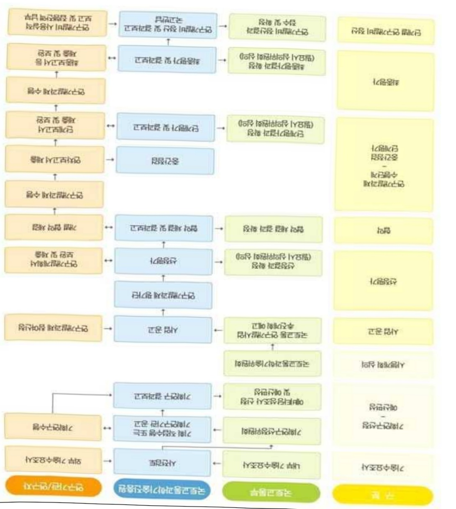

# 국토교통DNA플러스융합기술대학원육성사업(R&D)

**해당 페이지**: PDF 2249 ~ 2257 쪽 해당

**부처**: 국토교통부
**분야**: 교통 및 물류
**회계유형**: 일반회계
**2026 확정예산**: 6720.0 백만원
**전년대비 증감률**: 12.0%
**AI 도메인**: 교육/인재

---

### 가.예산 총괄표

(단위: 백만원, %)

<table border=1 style='margin: auto; word-wrap: break-word;'><tr><td rowspan="2">사업명</td><td rowspan="2">2024년 결산</td><td colspan="2">2025년 예산</td><td colspan="2">2026년</td><td rowspan="2">증감(B-A)</td><td rowspan="2">(B-A)/A</td></tr><tr><td style='text-align: center; word-wrap: break-word;'>본예산(A)</td><td style='text-align: center; word-wrap: break-word;'>추경</td><td style='text-align: center; word-wrap: break-word;'>정부안</td><td style='text-align: center; word-wrap: break-word;'>확정(B)</td></tr><tr><td style='text-align: center; word-wrap: break-word;'>국토교통 DNA플러스 융합기술대학원 육성사업(R&amp;D)</td><td style='text-align: center; word-wrap: break-word;'>5,950</td><td style='text-align: center; word-wrap: break-word;'>6,000</td><td style='text-align: center; word-wrap: break-word;'>6,000</td><td style='text-align: center; word-wrap: break-word;'>6,720</td><td style='text-align: center; word-wrap: break-word;'>6,720</td><td style='text-align: center; word-wrap: break-word;'>720</td><td style='text-align: center; word-wrap: break-word;'>12.0</td></tr></table>

## □ 기능별(내역사업별), 목별 예산 내역

(단위:백만원)

<table border=1 style='margin: auto; word-wrap: break-word;'><tr><td rowspan="3"></td><td colspan="5">2024</td><td colspan="7">2025(2025.12월 말 기준)</td><td rowspan="3">2026예산</td></tr><tr><td rowspan="2">예산액(추정)</td><td rowspan="2">예산현액</td><td rowspan="2">집행액[실집행액]</td><td rowspan="2">이월액</td><td rowspan="2">불용액</td><td rowspan="2">본예산</td><td rowspan="2">예산현액</td><td rowspan="2">집행액[실집행액]</td><td colspan="2">전년도 이월액제외</td><td rowspan="2">이월예상액</td><td rowspan="2">불용예상액</td></tr><tr><td style='text-align: center; word-wrap: break-word;'>예산현액</td><td style='text-align: center; word-wrap: break-word;'>집행액[실집행액]</td></tr><tr><td style='text-align: center; word-wrap: break-word;'>○ 기능별 분류(함께)</td><td style='text-align: center; word-wrap: break-word;'>5,950</td><td style='text-align: center; word-wrap: break-word;'>5,950</td><td style='text-align: center; word-wrap: break-word;'>5,950[5,950]</td><td style='text-align: center; word-wrap: break-word;'>-</td><td style='text-align: center; word-wrap: break-word;'>-</td><td style='text-align: center; word-wrap: break-word;'>6,000</td><td style='text-align: center; word-wrap: break-word;'>6,000</td><td style='text-align: center; word-wrap: break-word;'>6,000</td><td style='text-align: center; word-wrap: break-word;'>6,000</td><td style='text-align: center; word-wrap: break-word;'>6,000[6,000]</td><td style='text-align: center; word-wrap: break-word;'>-</td><td style='text-align: center; word-wrap: break-word;'>-</td><td style='text-align: center; word-wrap: break-word;'>6,720</td></tr><tr><td style='text-align: center; word-wrap: break-word;'>· 국토교통DNA플러스융합기술대학원육성</td><td style='text-align: center; word-wrap: break-word;'>5,950</td><td style='text-align: center; word-wrap: break-word;'>5,950</td><td style='text-align: center; word-wrap: break-word;'>5,950[5,950]</td><td style='text-align: center; word-wrap: break-word;'>-</td><td style='text-align: center; word-wrap: break-word;'>-</td><td style='text-align: center; word-wrap: break-word;'>6,000</td><td style='text-align: center; word-wrap: break-word;'>6,000</td><td style='text-align: center; word-wrap: break-word;'>6,000</td><td style='text-align: center; word-wrap: break-word;'>6,000</td><td style='text-align: center; word-wrap: break-word;'>6,000[6,000]</td><td style='text-align: center; word-wrap: break-word;'>-</td><td style='text-align: center; word-wrap: break-word;'>-</td><td style='text-align: center; word-wrap: break-word;'>6,720</td></tr><tr><td style='text-align: center; word-wrap: break-word;'>○ 비목별 분류(함께)</td><td style='text-align: center; word-wrap: break-word;'>5,950</td><td style='text-align: center; word-wrap: break-word;'>5,950</td><td style='text-align: center; word-wrap: break-word;'>5,950[5,950]</td><td style='text-align: center; word-wrap: break-word;'>-</td><td style='text-align: center; word-wrap: break-word;'>-</td><td style='text-align: center; word-wrap: break-word;'>6,000</td><td style='text-align: center; word-wrap: break-word;'>6,000</td><td style='text-align: center; word-wrap: break-word;'>6,000</td><td style='text-align: center; word-wrap: break-word;'>6,000</td><td style='text-align: center; word-wrap: break-word;'>6,000[6,000]</td><td style='text-align: center; word-wrap: break-word;'>-</td><td style='text-align: center; word-wrap: break-word;'>-</td><td style='text-align: center; word-wrap: break-word;'>6,720</td></tr><tr><td style='text-align: center; word-wrap: break-word;'>· 연구활동비등(360-05)</td><td style='text-align: center; word-wrap: break-word;'>5,950</td><td style='text-align: center; word-wrap: break-word;'>5,950</td><td style='text-align: center; word-wrap: break-word;'>5,950[5,950]</td><td style='text-align: center; word-wrap: break-word;'>-</td><td style='text-align: center; word-wrap: break-word;'>-</td><td style='text-align: center; word-wrap: break-word;'>6,000</td><td style='text-align: center; word-wrap: break-word;'>6,000</td><td style='text-align: center; word-wrap: break-word;'>6,000</td><td style='text-align: center; word-wrap: break-word;'>6,000</td><td style='text-align: center; word-wrap: break-word;'>6,000[6,000]</td><td style='text-align: center; word-wrap: break-word;'>-</td><td style='text-align: center; word-wrap: break-word;'>-</td><td style='text-align: center; word-wrap: break-word;'>6,720</td></tr><tr><td style='text-align: center; word-wrap: break-word;'>○ 기능·비목별 분류(함께)</td><td style='text-align: center; word-wrap: break-word;'>5,950</td><td style='text-align: center; word-wrap: break-word;'>5,950</td><td style='text-align: center; word-wrap: break-word;'>5,950[5,950]</td><td style='text-align: center; word-wrap: break-word;'>-</td><td style='text-align: center; word-wrap: break-word;'>-</td><td style='text-align: center; word-wrap: break-word;'>6,000</td><td style='text-align: center; word-wrap: break-word;'>6,000</td><td style='text-align: center; word-wrap: break-word;'>6,000</td><td style='text-align: center; word-wrap: break-word;'>6,000</td><td style='text-align: center; word-wrap: break-word;'>6,000[6,000]</td><td style='text-align: center; word-wrap: break-word;'>-</td><td style='text-align: center; word-wrap: break-word;'>-</td><td style='text-align: center; word-wrap: break-word;'>6,720</td></tr><tr><td style='text-align: center; word-wrap: break-word;'>· 국토교통DNA플러스융합기술대학원 육성</td><td style='text-align: center; word-wrap: break-word;'>5,950</td><td style='text-align: center; word-wrap: break-word;'>5,950</td><td style='text-align: center; word-wrap: break-word;'>5,950[5,950]</td><td style='text-align: center; word-wrap: break-word;'>-</td><td style='text-align: center; word-wrap: break-word;'>-</td><td style='text-align: center; word-wrap: break-word;'>6,000</td><td style='text-align: center; word-wrap: break-word;'>6,000</td><td style='text-align: center; word-wrap: break-word;'>6,000</td><td style='text-align: center; word-wrap: break-word;'>6,000</td><td style='text-align: center; word-wrap: break-word;'>6,000[6,000]</td><td style='text-align: center; word-wrap: break-word;'>-</td><td style='text-align: center; word-wrap: break-word;'>-</td><td style='text-align: center; word-wrap: break-word;'>6,720</td></tr><tr><td style='text-align: center; word-wrap: break-word;'>· 연구활동비등(360-05)</td><td style='text-align: center; word-wrap: break-word;'>5,950</td><td style='text-align: center; word-wrap: break-word;'>5,950</td><td style='text-align: center; word-wrap: break-word;'>5,950[5,950]</td><td style='text-align: center; word-wrap: break-word;'>-</td><td style='text-align: center; word-wrap: break-word;'>-</td><td style='text-align: center; word-wrap: break-word;'>6,000</td><td style='text-align: center; word-wrap: break-word;'>6,000</td><td style='text-align: center; word-wrap: break-word;'>6,000</td><td style='text-align: center; word-wrap: break-word;'>6,000</td><td style='text-align: center; word-wrap: break-word;'>6,000[6,000]</td><td style='text-align: center; word-wrap: break-word;'>-</td><td style='text-align: center; word-wrap: break-word;'>-</td><td style='text-align: center; word-wrap: break-word;'>6,720</td></tr></table>

### 나.사업설명자료

## 1 ) 사업목적·내용

- (국토교통 DNA플러스 융합기술대학원 육성) 미래산업 핵심기술인 DATA, NETWORK, AI를 국토교통 신산업과 연계한 기술개발 지원을 통한 대학의 혁신역량 향상 및 육·복합 전문인력 양성

---

## 2 ) 사업개요

## □ 사업근거 및 추진경위

## ① 법령상 근거 및 조항 적시

## - 국토교통과학기술육성법

제8조(연구개발사업의 추진) ① 국토교통부장관은 종합계획을 효율적으로 추진하기 위하여 국토교통과학기술 연구개발사업(이하 “연구개발사업” 이라 한다)을 할 수 있다.

· 제12조(전문 연구인력의 양성) ① 국토교통부장관은 국토교통과학기술분야 전문 연구인력의 양성을 위한 시책을 수립·시행할 수 있다.

## - 국가과학기술경쟁력강화를위한이공계지원특별법

· 제15조(연구개발사업을 통한 이공계인력의 활용 촉진) 국가 및 지방자치단체는 이공계 석사학위 또는 박사학위를 취득한 후 일정기간 미취업 상태에 있는 이공계인력의 취업을 촉진하기 위하여 대통령령으로 전하는 바에 따라 취업과 연계하는 연구개발사업을 추진하거나 출연연구기관에 일정 기간 연수하도록 지원할 수 있다.

## - 건설기술진흥법

· 제7조(건설기술연구개발사업) ① 국토교통부장관은 건설기술을 향상시키고 기본 계획을 효율적으로 추진하기 위하여 대통령령으로 정하는 기관 또는 단체와 협약을 체결하여 건설기술 발전에 필요한 건설기술 연구·개발 사업을 할 수 있다.

제9조(양동 연구·개발 등) 국토교통부장관은 건설기술의 연구·개발과 관련된 공공기관·법인·단체·대학(이들의 부설연구소 등을 포함한다. 이하 “건설기술연구기관”이라 한다)의 인력·자금·시험시설 및 기술정보의 효율적 활용과 선진 건설기술 획득을 위하여 관계 중앙행정기관의 장과 공동연구를 추진하거나 건설기술연구기관의 건설기술 연구·개발을 지원할 수 있다.

## -국가통합교통체계효율화법

· 제98조(교통기술 연구·개발사업의 추진) ① 국토교통부장관은 교통기술의 연구·개발을 효율적으로 추진하기 위하여 연도별·분야별 교통기술 연구·개발과제를 선정하여 다음 각 호의 기관 또는 단체 등과 협약을 맺어 교통기술 연구·개발사업을 하게 할 수 있다.

## ② 추진경위

- '20.07.~'21.07 : 국토교통분야 전문 연구인력 양성 중장기 전략 수립

- '20.07.~'20.11 : '국토교통 DNA플러스 융합기술 대학원 육성사업' 기획 완료

- '22.02.~'22.04 : 국토교통 DNA플러스 융합기술 대학원 육성사업 공고(국토부)

---

- '22.04.~'22.05 : 도로교통/물류/항공 분야 융합기술대학원 선정평가 및 협약 체결

- '23.01.~'23.03 : 자유공모 분야(2개) 국토교통 DNA플러스 융합기술대학원 공고

- '23.03.~'23.04 : 안전/스마트시티 분야 융합기술대학원 선정평가 및 협약 체결

- '23.04.~현재 : 국토교통 DNA플러스 융합기술대학원 교과과정 운영 및 취업지원 등

□ 주요내용

① 사업규모

- 총사업비 : 해당없음

- 사업기간 : '22 ~ '27

- 최근 5년 간 투입된 사업비(예산액기준, 추경편성한 연도에는 추경포함)

<table border=1 style='margin: auto; word-wrap: break-word;'><tr><td style='text-align: center; word-wrap: break-word;'>$ \underline{\text{角}} $</td><td style='text-align: center; word-wrap: break-word;'>2022</td><td style='text-align: center; word-wrap: break-word;'>2023</td><td style='text-align: center; word-wrap: break-word;'>2024</td><td style='text-align: center; word-wrap: break-word;'>2025</td><td style='text-align: center; word-wrap: break-word;'>2026</td></tr><tr><td style='text-align: center; word-wrap: break-word;'>$ \underline{\text{人}} $</td><td style='text-align: center; word-wrap: break-word;'>1,730</td><td style='text-align: center; word-wrap: break-word;'>4,610</td><td style='text-align: center; word-wrap: break-word;'>5,950</td><td style='text-align: center; word-wrap: break-word;'>6,000</td><td style='text-align: center; word-wrap: break-word;'>6,720</td></tr></table>

- 기타: 해당없음

② 사업추진체계

- 사업시행방법 : 출연(참여기업이 있는 경우 Matching)

- 사업시행주체 : 국토교통부(전문기관 : 국토교통과학기술진흥원)

- 사업 수혜자 : 대학, 기업, 출연연 등

- 보조, 융자, 출연, 출자 등의 경우 보조·융자 등 지원 비율 및 법적근거

<table border=1 style='margin: auto; word-wrap: break-word;'><tr><td style='text-align: center; word-wrap: break-word;'>내역사업명</td><td style='text-align: center; word-wrap: break-word;'>구분</td><td style='text-align: center; word-wrap: break-word;'>피보조·피출연 등 기관명</td><td style='text-align: center; word-wrap: break-word;'>지원 금액 (2026예산)</td><td style='text-align: center; word-wrap: break-word;'>지원 비율(%)</td><td style='text-align: center; word-wrap: break-word;'>보조율 법적근거 (해당 조항)</td></tr><tr><td rowspan="3">국토교통 DNA 플러스융합 기술대학원 육성</td><td rowspan="3">출연</td><td style='text-align: center; word-wrap: break-word;'>「중소기업기본법」제2조에 따른 중소기업에 해당하는 연구개발기관</td><td rowspan="3">6,720 백만원</td><td style='text-align: center; word-wrap: break-word;'>연구개발 비의 100분의 75 이하</td><td rowspan="3">「국가연구개발 혁신법 시행령」제19조</td></tr><tr><td style='text-align: center; word-wrap: break-word;'>「중견기업 성장촉진 및 경쟁력 강화에 관한 특별법」제2조제1호에 따른 중견기업에 해당하는 연구개발기관</td><td style='text-align: center; word-wrap: break-word;'>연구개발 비의 100분의 70 이하</td></tr><tr><td style='text-align: center; word-wrap: break-word;'>「공공기관의 운영에 관한 법률」제5조제4항제1호에 따른 공기업에 해당하거나 ‘가’, ‘나’에 해당 해당하지 않는 연구개발기관</td><td style='text-align: center; word-wrap: break-word;'>연구개발 비의 100분의 50 이하</td></tr></table>

* 다만, 중앙행정기관의 장이 필요하다고 인정하는 국가연구개발사업에 대하여 별도로 정할 수 있음

---

## 3 )2026년도 예산 산출 근거

① 내역사업명

:(25)6,000백만원→(26요구)6,720백만원,720백만원 증액

- (요구) 국토교통 분야 D.N.A. 기술 융합연구 및 전문인력 양성을 위한 5개 분야 융합기술 대학원 지원 등의 필요성이 인정되어 소요예산 6,720백만원 요구

- (산출) ① 국토교통 DNA 플러스 도로교통분야 융합기술대학원 육성 1,380백만원

②국토교통 DNA 플러스 물류분야 융합기술대학원 육성 1,335백만원

③국토교통 DNA 플러스 항공분야 융합기술대학원 육성 1,335백만원

④국토교통 DNA 플러스 스마트시티분야 융합기술대학원 육성 1,335백만원

⑤국토교통 DNA 플러스 안전분야 융합기술대학원 육성 1,335백만원

·(계속) 1개 × 6,720백만원 × 12/12 = 6,720백만원

2025년도 예산 및 2026년도 예산 산출 세부내역 비교

<table border=1 style='margin: auto; word-wrap: break-word;'><tr><td colspan="2">&#x27;25년 예산</td><td colspan="2">&#x27;26년 예산</td></tr><tr><td style='text-align: center; word-wrap: break-word;'>예산</td><td style='text-align: center; word-wrap: break-word;'>산출내역</td><td style='text-align: center; word-wrap: break-word;'>예산</td><td style='text-align: center; word-wrap: break-word;'>산출내역</td></tr><tr><td style='text-align: center; word-wrap: break-word;'>6,000 백만원</td><td style='text-align: center; word-wrap: break-word;'>○ 연구활동비 등(360-05): 6,000백만원 가. (계속) 국토교통 DNA 플러스 융합기술 대학원 육성사업 1식x6,000백만원</td><td style='text-align: center; word-wrap: break-word;'>6,720 백만원</td><td style='text-align: center; word-wrap: break-word;'>○ 연구활동비 등(360-05): 6,720백만원 가. (계속) 국토교통 DNA 플러스 융합기술 대학원 육성사업 1식x6,720백만원</td></tr></table>

---

<table border=1 style='margin: auto; word-wrap: break-word;'><tr><td style='text-align: center; word-wrap: break-word;'>성과지표</td><td style='text-align: center; word-wrap: break-word;'>구분</td><td style='text-align: center; word-wrap: break-word;'>2022</td><td style='text-align: center; word-wrap: break-word;'>2023</td><td style='text-align: center; word-wrap: break-word;'>2024</td><td style='text-align: center; word-wrap: break-word;'>2025</td><td style='text-align: center; word-wrap: break-word;'>2026</td><td style='text-align: center; word-wrap: break-word;'>2026 목표치산출근거</td><td style='text-align: center; word-wrap: break-word;'>측정산시(또는 측정방법)</td><td style='text-align: center; word-wrap: break-word;'>자료수집방법(또는 자료출처)</td></tr><tr><td rowspan="3">신입생 확충를 (단위: %)</td><td style='text-align: center; word-wrap: break-word;'>목표</td><td style='text-align: center; word-wrap: break-word;'>5</td><td style='text-align: center; word-wrap: break-word;'>21</td><td style='text-align: center; word-wrap: break-word;'>41</td><td style='text-align: center; word-wrap: break-word;'>63</td><td style='text-align: center; word-wrap: break-word;'>85</td><td rowspan="3">정부출연금1억원당 신입생2명이상 확보(총606명) 목표실정) *22년은 사업초기로 낮게 설정, 차년도 추가 확충</td><td rowspan="3">∑달성치(명)×100</td><td rowspan="3">국토교통R&amp;D사업관리시스템 또는 NTIS에서 검증완료된 실적보고서로 산출</td></tr><tr><td style='text-align: center; word-wrap: break-word;'>실적</td><td style='text-align: center; word-wrap: break-word;'>5</td><td style='text-align: center; word-wrap: break-word;'>21</td><td style='text-align: center; word-wrap: break-word;'>41</td><td style='text-align: center; word-wrap: break-word;'>-</td><td style='text-align: center; word-wrap: break-word;'>-</td></tr><tr><td style='text-align: center; word-wrap: break-word;'>달성도</td><td style='text-align: center; word-wrap: break-word;'>100.0</td><td style='text-align: center; word-wrap: break-word;'>100.0</td><td style='text-align: center; word-wrap: break-word;'>100.0</td><td style='text-align: center; word-wrap: break-word;'>-</td><td style='text-align: center; word-wrap: break-word;'>-</td></tr><tr><td rowspan="3">국토교통 DNA플러스 특화 프로그램 운영률 (단위: %)</td><td style='text-align: center; word-wrap: break-word;'>목표</td><td style='text-align: center; word-wrap: break-word;'>45</td><td style='text-align: center; word-wrap: break-word;'>46</td><td style='text-align: center; word-wrap: break-word;'>47</td><td style='text-align: center; word-wrap: break-word;'>48</td><td style='text-align: center; word-wrap: break-word;'>48</td><td rowspan="3">전체 커리큘럼 증 40%이상 과목은 DNA특화과목운영 *최초앤차부터 1단계 종료까지 1%수준 향상, 2단계(26년~)부터는 48% 수준 상시유지</td><td rowspan="3">∑(DNA특화과목수) / (전체 학과목수)×100</td><td rowspan="3">국토교통R&amp;D사업관리시스템 또는 NTIS에서 검증완료된 실적보고서로 산출</td></tr><tr><td style='text-align: center; word-wrap: break-word;'>실적</td><td style='text-align: center; word-wrap: break-word;'>45</td><td style='text-align: center; word-wrap: break-word;'>46</td><td style='text-align: center; word-wrap: break-word;'>47</td><td style='text-align: center; word-wrap: break-word;'>-</td><td style='text-align: center; word-wrap: break-word;'>-</td></tr><tr><td style='text-align: center; word-wrap: break-word;'>달성도</td><td style='text-align: center; word-wrap: break-word;'>100.0</td><td style='text-align: center; word-wrap: break-word;'>100.0</td><td style='text-align: center; word-wrap: break-word;'>100.0</td><td style='text-align: center; word-wrap: break-word;'>-</td><td style='text-align: center; word-wrap: break-word;'>-</td></tr><tr><td rowspan="3">협력 기관 연계프로그램 운영률 (단위: %)</td><td style='text-align: center; word-wrap: break-word;'>목표</td><td style='text-align: center; word-wrap: break-word;'>50</td><td style='text-align: center; word-wrap: break-word;'>62</td><td style='text-align: center; word-wrap: break-word;'>72</td><td style='text-align: center; word-wrap: break-word;'>86.4</td><td style='text-align: center; word-wrap: break-word;'>100</td><td rowspan="3">전년도 목표치보다 20% 증가한 값으로 목표치 증가 *26년이후 최종목표인 100%로 실정</td><td rowspan="3">∑(연계프로그램 수) / (연계프로그램 목표: 기업연계 또는 국토교통 사업단 공동 R&amp;D 프로그램 의무화)</td><td rowspan="3">국토교통R&amp;D사업관리시스템 또는 NTIS에서 검증완료된 실적보고서로 산출</td></tr><tr><td style='text-align: center; word-wrap: break-word;'>실적</td><td style='text-align: center; word-wrap: break-word;'>50</td><td style='text-align: center; word-wrap: break-word;'>62</td><td style='text-align: center; word-wrap: break-word;'>72</td><td style='text-align: center; word-wrap: break-word;'>-</td><td style='text-align: center; word-wrap: break-word;'>-</td></tr><tr><td style='text-align: center; word-wrap: break-word;'>달성도</td><td style='text-align: center; word-wrap: break-word;'>100.0</td><td style='text-align: center; word-wrap: break-word;'>100.0</td><td style='text-align: center; word-wrap: break-word;'>100.0</td><td style='text-align: center; word-wrap: break-word;'>-</td><td style='text-align: center; word-wrap: break-word;'>-</td></tr><tr><td rowspan="3">인력양성 프로그램에 대한 교원/학생의 만족도 (단위: %)</td><td style='text-align: center; word-wrap: break-word;'>목표</td><td style='text-align: center; word-wrap: break-word;'>-</td><td style='text-align: center; word-wrap: break-word;'>-</td><td style='text-align: center; word-wrap: break-word;'>-</td><td style='text-align: center; word-wrap: break-word;'>70</td><td style='text-align: center; word-wrap: break-word;'>80</td><td rowspan="3">의부기관 의뢰 커리큘럼 및 산학협력 프로그램 관련 만족도 조사 실시</td><td rowspan="3">∑(만족도)/용담 차수×100</td><td rowspan="3">설문조사 결과서</td></tr><tr><td style='text-align: center; word-wrap: break-word;'>실적</td><td style='text-align: center; word-wrap: break-word;'>-</td><td style='text-align: center; word-wrap: break-word;'>-</td><td style='text-align: center; word-wrap: break-word;'>-</td><td style='text-align: center; word-wrap: break-word;'>-</td><td style='text-align: center; word-wrap: break-word;'>-</td></tr><tr><td style='text-align: center; word-wrap: break-word;'>달성도</td><td style='text-align: center; word-wrap: break-word;'>-</td><td style='text-align: center; word-wrap: break-word;'>-</td><td style='text-align: center; word-wrap: break-word;'>-</td><td style='text-align: center; word-wrap: break-word;'>-</td><td style='text-align: center; word-wrap: break-word;'>-</td></tr><tr><td rowspan="3">관련분야 취업률 (단위: %)</td><td style='text-align: center; word-wrap: break-word;'>목표</td><td style='text-align: center; word-wrap: break-word;'>-</td><td style='text-align: center; word-wrap: break-word;'>-</td><td style='text-align: center; word-wrap: break-word;'>-</td><td style='text-align: center; word-wrap: break-word;'>78.2</td><td style='text-align: center; word-wrap: break-word;'>78.2</td><td rowspan="3">부처의 평균 취업률 대비 5% 높은 도전적인 목표치(78.2%)를 설정하고 해당 목표를 종료 시점까지 유지함</td><td rowspan="3">∑(관련분야 취업자 수) / ∑(졸업생 취업 대상자 수)×100</td><td rowspan="3">국토교통R&amp;D사업관리시스템 또는 NTIS에서 검증완료된 실적보고서, 졸업중명서로 산출</td></tr><tr><td style='text-align: center; word-wrap: break-word;'>실적</td><td style='text-align: center; word-wrap: break-word;'>-</td><td style='text-align: center; word-wrap: break-word;'>-</td><td style='text-align: center; word-wrap: break-word;'>-</td><td style='text-align: center; word-wrap: break-word;'>-</td><td style='text-align: center; word-wrap: break-word;'>-</td></tr><tr><td style='text-align: center; word-wrap: break-word;'>달성도</td><td style='text-align: center; word-wrap: break-word;'>-</td><td style='text-align: center; word-wrap: break-word;'>-</td><td style='text-align: center; word-wrap: break-word;'>-</td><td style='text-align: center; word-wrap: break-word;'>-</td><td style='text-align: center; word-wrap: break-word;'>-</td></tr><tr><td rowspan="3">창업·기술 사업화 성과 (단위: 건)</td><td style='text-align: center; word-wrap: break-word;'>목표</td><td style='text-align: center; word-wrap: break-word;'>-</td><td style='text-align: center; word-wrap: break-word;'>-</td><td style='text-align: center; word-wrap: break-word;'>-</td><td style='text-align: center; word-wrap: break-word;'>6.4</td><td style='text-align: center; word-wrap: break-word;'>9.8</td><td rowspan="3">&#x27;25년부터의 예산 증감률을 반영하면 전년도 목표치에 예산을 고려한 창업·기술 사업화 성과 목표를 수립</td><td rowspan="3">∑(교수·졸업·재학 생산 녹착장업기업수 + 기술사업화 녹착수)</td><td rowspan="3">국토교통R&amp;D사업관리시스템 또는 NTIS에서 검증완료된 실적보고서로 산출</td></tr><tr><td style='text-align: center; word-wrap: break-word;'>실적</td><td style='text-align: center; word-wrap: break-word;'>-</td><td style='text-align: center; word-wrap: break-word;'>-</td><td style='text-align: center; word-wrap: break-word;'>-</td><td style='text-align: center; word-wrap: break-word;'>-</td><td style='text-align: center; word-wrap: break-word;'>-</td></tr><tr><td style='text-align: center; word-wrap: break-word;'>달성도</td><td style='text-align: center; word-wrap: break-word;'>-</td><td style='text-align: center; word-wrap: break-word;'>-</td><td style='text-align: center; word-wrap: break-word;'>-</td><td style='text-align: center; word-wrap: break-word;'>-</td><td style='text-align: center; word-wrap: break-word;'>-</td></tr></table>

①2022~2026년도 성과계획서 상 성과지표 및 최근 5년간 성과 달성도

□사업영향,산출물성과지표등

---

② 성과지표 이외의 연도별 사업추진 경과 및 실적

<table border=1 style='margin: auto; word-wrap: break-word;'><tr><td style='text-align: center; word-wrap: break-word;'>2022</td><td style='text-align: center; word-wrap: break-word;'>- “국토교통 DNA플러스 융합기술대학원 육성” 3개분야(도로교통, 물류, 항공) 착수</td></tr><tr><td style='text-align: center; word-wrap: break-word;'>2023</td><td style='text-align: center; word-wrap: break-word;'>- “국토교통 DNA플러스 융합기술대학원 육성” 2개분야(안전, 스마트시티) 착수</td></tr><tr><td style='text-align: center; word-wrap: break-word;'>2024</td><td style='text-align: center; word-wrap: break-word;'>- “국토교통 DNA플러스 융합기술대학원” 통합 사업설명회, 창업경진대회 등 개최</td></tr><tr><td style='text-align: center; word-wrap: break-word;'>2025</td><td style='text-align: center; word-wrap: break-word;'>- “국토교통 DNA플러스 융합기술대학원” 학과운영, 산학협력연구개발 등</td></tr></table>

③ 향후(2026년도 이후) 기대효과

- (전문 인력 양성) 국토교통기술과 DATA, NETWORK, AI 융합기술 전문인력 최소 600명 배출 목표

- (취업률) 융합기술 인력 배출 및 취업 연계로 취업률 90% 이상 목표

- (기술사업화 성과) R&D 개발기술과 기업연계 등으로 창업·기술사업화 8% 이상 달성

* 창업, 기술사업화 성과 : (교수·졸업·재학생 창업기업수 + 기술사업화 수) / 졸업생 수

5) 타당성조사 및 예비타당성조사 시행여부 및 결과 요지 : 해당없음

6) 총사업비 대상사업 여부 및 내역 : 해당없음

---

<table border=1 style='margin: auto; word-wrap: break-word;'><tr><td style='text-align: center; word-wrap: break-word;'>부처</td><td style='text-align: center; word-wrap: break-word;'></td><td style='text-align: center; word-wrap: break-word;'>피출연·피보조기관</td><td style='text-align: center; word-wrap: break-word;'></td><td style='text-align: center; word-wrap: break-word;'>간접보조사업자·사업수행자</td></tr><tr><td style='text-align: center; word-wrap: break-word;'>국토교통부(6,720백만원)</td><td style='text-align: center; word-wrap: break-word;'>=&gt;(6,720백만원)</td><td style='text-align: center; word-wrap: break-word;'>국토교통과학기술진흥원(6,720백만원)</td><td style='text-align: center; word-wrap: break-word;'>=&gt;(6,720백만원)</td><td style='text-align: center; word-wrap: break-word;'>아주대학교의 5개 기관</td></tr></table>

<국토교통 DNA플러스 융합기술대학원 육성사업(R&D)>

---

## 8 ) 중기재정계획 상 연도별 투자계획 및 추진경과

(단위:백만원)

<table border=1 style='margin: auto; word-wrap: break-word;'><tr><td style='text-align: center; word-wrap: break-word;'>2024</td><td style='text-align: center; word-wrap: break-word;'>2025</td><td style='text-align: center; word-wrap: break-word;'>2026</td><td style='text-align: center; word-wrap: break-word;'>2027</td><td style='text-align: center; word-wrap: break-word;'>2028</td><td style='text-align: center; word-wrap: break-word;'>2029</td></tr><tr><td style='text-align: center; word-wrap: break-word;'>2024~2028</td><td style='text-align: center; word-wrap: break-word;'>5,950</td><td style='text-align: center; word-wrap: break-word;'>6,000</td><td style='text-align: center; word-wrap: break-word;'>6,720</td><td style='text-align: center; word-wrap: break-word;'>3,410</td><td style='text-align: center; word-wrap: break-word;'>-</td></tr><tr><td style='text-align: center; word-wrap: break-word;'>2025~2029</td><td style='text-align: center; word-wrap: break-word;'></td><td style='text-align: center; word-wrap: break-word;'>6,000</td><td style='text-align: center; word-wrap: break-word;'>6,720</td><td style='text-align: center; word-wrap: break-word;'>3,410</td><td style='text-align: center; word-wrap: break-word;'>-</td></tr></table>

9) 최근 3년간 동 사업에 대한 주요 외부지적사항 및 평가, 문제점 및 대책 : 해당없음

## 10 ) 향후 추진방향 및 추진계획

<table border=1 style='margin: auto; word-wrap: break-word;'><tr><td style='text-align: center; word-wrap: break-word;'>○ (학과운영)커리큘럼 개발, 융합과정 신설, 학사(학점, 과목 수강 등)공유 시스템 개발</td></tr><tr><td style='text-align: center; word-wrap: break-word;'>○ (인력양성)일반대학원 학과학생 전환 유치, 융합과정 신규 학생 유치</td></tr><tr><td style='text-align: center; word-wrap: break-word;'>○ (창업·기술사업화)산학연 및 대내외 우수기관과의 공동R&amp;D, 기술사업화 연계프로그램 개발 및 운영</td></tr></table>

## 11 ) 해당사업에 대한 각종 사업평가의 결과

<table border=1 style='margin: auto; word-wrap: break-word;'><tr><td style='text-align: center; word-wrap: break-word;'>1) 「국가재정법」제85조의8제1항에 따른 재정사업자율평가 결과에 대한 기획재정부의 상위평가(심충평가) 결과 : 해당없음</td></tr><tr><td style='text-align: center; word-wrap: break-word;'>2) R&amp;D사업의 경우「국가연구개발사업 등의 성과평가 및 성과관리에 관한 법률」제7조제3항에 따른 부처의 R&amp;D사업 자체성과평가에 대한 과학기술정보통신부 상위평가 결과 : ‘보통’, 89.0점(과기부, ’25 상위평가)</td></tr><tr><td style='text-align: center; word-wrap: break-word;'>3) 그 의 보조사업 연장평가, 재정지원 일자리사업 평가 등 개별 법률에 규정된 평가 시행 결과 : 해당없음</td></tr></table>

## 12 ) 해당사업에 대한 부처 자체평가의 결과

<table border=1 style='margin: auto; word-wrap: break-word;'><tr><td style='text-align: center; word-wrap: break-word;'>1) 2023년도 부처 재정사업 자율평가 결과: 해당없음</td></tr><tr><td style='text-align: center; word-wrap: break-word;'>2) 2024년도 부처 재정사업 자율평가 결과: 해당없음</td></tr><tr><td style='text-align: center; word-wrap: break-word;'>3) 2025년도 부처 재정사업 자율평가 결과: 해당없음</td></tr></table>

## 13 ) 부처 건의사항 : 해당없음

---

<table border=1 style='margin: auto; word-wrap: break-word;'><tr><td style='text-align: center; word-wrap: break-word;'>사 업 명</td></tr><tr><td style='text-align: center; word-wrap: break-word;'>(14) 국토이용정보체계 구축 및 운영(정보화) (4254-526)</td></tr></table>

□ 사업 코드 정보

<table border=1 style='margin: auto; word-wrap: break-word;'><tr><td style='text-align: center; word-wrap: break-word;'>구분</td><td style='text-align: center; word-wrap: break-word;'>회계</td><td style='text-align: center; word-wrap: break-word;'>소관</td><td style='text-align: center; word-wrap: break-word;'>실국(기관)</td><td style='text-align: center; word-wrap: break-word;'>계정</td><td style='text-align: center; word-wrap: break-word;'>분야</td><td style='text-align: center; word-wrap: break-word;'>부문</td></tr><tr><td style='text-align: center; word-wrap: break-word;'>코드</td><td rowspan="2">일반회계</td><td rowspan="2">국토교통부</td><td style='text-align: center; word-wrap: break-word;'>국토도시실</td><td rowspan="2">교통 및 물류</td><td rowspan="2">120</td><td style='text-align: center; word-wrap: break-word;'>126</td></tr><tr><td style='text-align: center; word-wrap: break-word;'>명칭</td><td style='text-align: center; word-wrap: break-word;'>도시정책관</td><td style='text-align: center; word-wrap: break-word;'>물류 등 기타</td></tr></table>

<table border=1 style='margin: auto; word-wrap: break-word;'><tr><td style='text-align: center; word-wrap: break-word;'>구분</td><td style='text-align: center; word-wrap: break-word;'>프로그램</td><td style='text-align: center; word-wrap: break-word;'>단위사업</td><td style='text-align: center; word-wrap: break-word;'>세부사업</td></tr><tr><td style='text-align: center; word-wrap: break-word;'>코드</td><td style='text-align: center; word-wrap: break-word;'>4200</td><td style='text-align: center; word-wrap: break-word;'>4254</td><td style='text-align: center; word-wrap: break-word;'>526</td></tr><tr><td style='text-align: center; word-wrap: break-word;'>명칭</td><td style='text-align: center; word-wrap: break-word;'>국토교통정보화</td><td style='text-align: center; word-wrap: break-word;'>국토이용정보화(정보화)</td><td style='text-align: center; word-wrap: break-word;'>국토이용정보체계 구축 및 운영(정보화)</td></tr></table>

□ 사업 성격 (공통요구자료 Ⅱ-1 작성유의사항 4. 참조, 해당하는 사항에 “○” 표시)

<table border=1 style='margin: auto; word-wrap: break-word;'><tr><td rowspan="2">신규</td><td rowspan="2">계속</td><td rowspan="2">완료</td><td style='text-align: center; word-wrap: break-word;'>예비타당성</td><td style='text-align: center; word-wrap: break-word;'>총사업비</td><td style='text-align: center; word-wrap: break-word;'>총액계상</td><td style='text-align: center; word-wrap: break-word;'>사업소관 변경정보</td></tr><tr><td style='text-align: center; word-wrap: break-word;'>실시여부</td><td style='text-align: center; word-wrap: break-word;'>관리대상</td><td style='text-align: center; word-wrap: break-word;'>예산사업</td><td style='text-align: center; word-wrap: break-word;'>2025예산 시 소관</td></tr><tr><td style='text-align: center; word-wrap: break-word;'></td><td style='text-align: center; word-wrap: break-word;'>○</td><td style='text-align: center; word-wrap: break-word;'></td><td style='text-align: center; word-wrap: break-word;'></td><td style='text-align: center; word-wrap: break-word;'></td><td style='text-align: center; word-wrap: break-word;'></td><td style='text-align: center; word-wrap: break-word;'>국토교통부</td></tr></table>

□ 사업 지원 형태 및 지원을 (최소한 한 개는 반드시 선택하시오. 해당사항에 0 표시)

<table border=1 style='margin: auto; word-wrap: break-word;'><tr><td style='text-align: center; word-wrap: break-word;'>직접</td><td style='text-align: center; word-wrap: break-word;'>출자</td><td style='text-align: center; word-wrap: break-word;'>출연</td><td style='text-align: center; word-wrap: break-word;'>보조</td><td style='text-align: center; word-wrap: break-word;'>융자</td><td style='text-align: center; word-wrap: break-word;'>국고보조율(%)</td><td style='text-align: center; word-wrap: break-word;'>융자율(%)</td></tr><tr><td style='text-align: center; word-wrap: break-word;'>○</td><td style='text-align: center; word-wrap: break-word;'></td><td style='text-align: center; word-wrap: break-word;'></td><td style='text-align: center; word-wrap: break-word;'></td><td style='text-align: center; word-wrap: break-word;'></td><td style='text-align: center; word-wrap: break-word;'></td><td style='text-align: center; word-wrap: break-word;'></td></tr></table>

## □ 사업 담당자

<table border=1 style='margin: auto; word-wrap: break-word;'><tr><td style='text-align: center; word-wrap: break-word;'>사업명</td><td colspan="2">구분</td></tr><tr><td rowspan="2">국토이용정보체계구축 및 운영</td><td style='text-align: center; word-wrap: break-word;'>소관부처</td><td style='text-align: center; word-wrap: break-word;'>실·국·과(팀)국토도시실도시정책관도시정책과</td></tr><tr><td style='text-align: center; word-wrap: break-word;'>사업시행주체</td><td style='text-align: center; word-wrap: break-word;'>한국국토정보공사</td></tr></table>

---

### 원본 PDF 크롭 이미지

