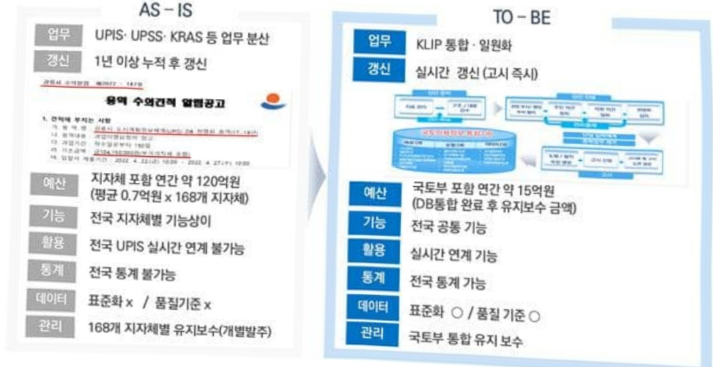
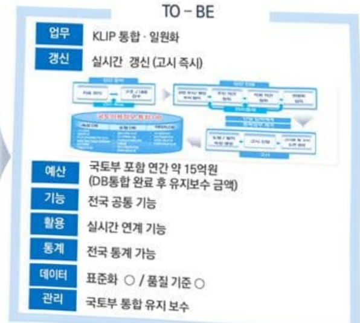
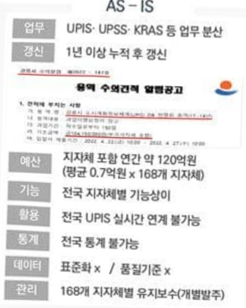
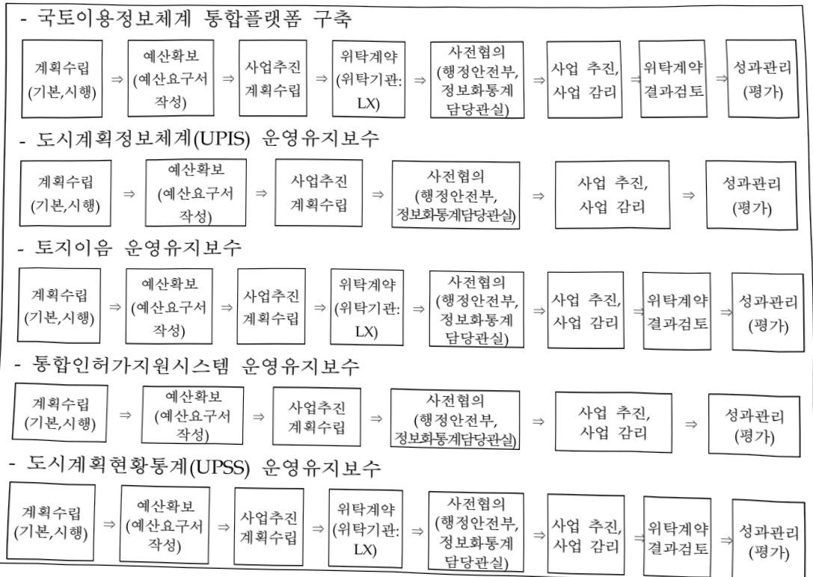
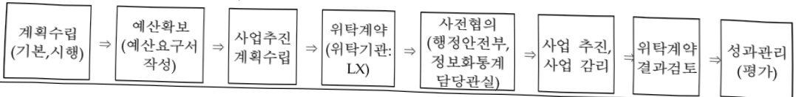
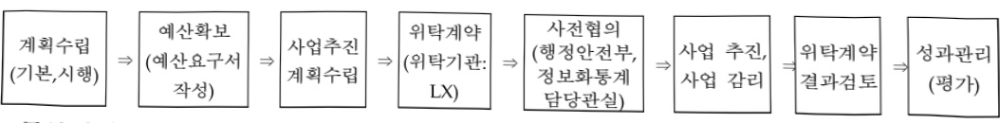
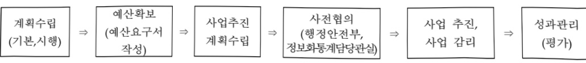

# 국토이용정보체계구축및운영(정보화)

**해당 페이지**: PDF 2258 ~ 2271 쪽 해당

**부처**: 국토교통부
**분야**: 교통 및 물류
**회계유형**: 일반회계
**2026 확정예산**: 4680.0 백만원
**전년대비 증감률**: -4.5%
**AI 도메인**: 건설/스마트시티

---

<table border=1 style='margin: auto; word-wrap: break-word;'><tr><td style='text-align: center; word-wrap: break-word;'>사 업 명</td></tr><tr><td style='text-align: center; word-wrap: break-word;'>(14) 국토이용정보체계 구축 및 운영(정보화) (4254-526)</td></tr></table>

□ 사업 코드 정보

<table border=1 style='margin: auto; word-wrap: break-word;'><tr><td style='text-align: center; word-wrap: break-word;'>구분</td><td style='text-align: center; word-wrap: break-word;'>회계</td><td style='text-align: center; word-wrap: break-word;'>소관</td><td style='text-align: center; word-wrap: break-word;'>실국(기관)</td><td style='text-align: center; word-wrap: break-word;'>계정</td><td style='text-align: center; word-wrap: break-word;'>분야</td><td style='text-align: center; word-wrap: break-word;'>부문</td></tr><tr><td style='text-align: center; word-wrap: break-word;'>코드</td><td rowspan="2">일반회계</td><td rowspan="2">국토교통부</td><td style='text-align: center; word-wrap: break-word;'>국토도시실</td><td rowspan="2">교통 및 물류</td><td rowspan="2">120</td><td style='text-align: center; word-wrap: break-word;'>126</td></tr><tr><td style='text-align: center; word-wrap: break-word;'>명칭</td><td style='text-align: center; word-wrap: break-word;'>도시정책관</td><td style='text-align: center; word-wrap: break-word;'>물류 등 기타</td></tr></table>

<table border=1 style='margin: auto; word-wrap: break-word;'><tr><td style='text-align: center; word-wrap: break-word;'>구분</td><td style='text-align: center; word-wrap: break-word;'>프로그램</td><td style='text-align: center; word-wrap: break-word;'>단위사업</td><td style='text-align: center; word-wrap: break-word;'>세부사업</td></tr><tr><td style='text-align: center; word-wrap: break-word;'>코드</td><td style='text-align: center; word-wrap: break-word;'>4200</td><td style='text-align: center; word-wrap: break-word;'>4254</td><td style='text-align: center; word-wrap: break-word;'>526</td></tr><tr><td style='text-align: center; word-wrap: break-word;'>명칭</td><td style='text-align: center; word-wrap: break-word;'>국토교통정보화</td><td style='text-align: center; word-wrap: break-word;'>국토이용정보화(정보화)</td><td style='text-align: center; word-wrap: break-word;'>국토이용정보체계 구축 및 운영(정보화)</td></tr></table>

□ 사업 성격 (공통요구자료 Ⅱ-1 작성유의사항 4. 참조, 해당하는 사항에 “○” 표시)

<table border=1 style='margin: auto; word-wrap: break-word;'><tr><td rowspan="2">신규</td><td rowspan="2">계속</td><td rowspan="2">완료</td><td style='text-align: center; word-wrap: break-word;'>예비타당성</td><td style='text-align: center; word-wrap: break-word;'>총사업비</td><td style='text-align: center; word-wrap: break-word;'>총액계상</td><td style='text-align: center; word-wrap: break-word;'>사업소관 변경정보</td></tr><tr><td style='text-align: center; word-wrap: break-word;'>실시여부</td><td style='text-align: center; word-wrap: break-word;'>관리대상</td><td style='text-align: center; word-wrap: break-word;'>예산사업</td><td style='text-align: center; word-wrap: break-word;'>2025예산 시 소관</td></tr><tr><td style='text-align: center; word-wrap: break-word;'></td><td style='text-align: center; word-wrap: break-word;'>○</td><td style='text-align: center; word-wrap: break-word;'></td><td style='text-align: center; word-wrap: break-word;'></td><td style='text-align: center; word-wrap: break-word;'></td><td style='text-align: center; word-wrap: break-word;'></td><td style='text-align: center; word-wrap: break-word;'>국토교통부</td></tr></table>

□ 사업 지원 형태 및 지원을 (최소한 한 개는 반드시 선택하시오. 해당사항에 0 표시)

<table border=1 style='margin: auto; word-wrap: break-word;'><tr><td style='text-align: center; word-wrap: break-word;'>직접</td><td style='text-align: center; word-wrap: break-word;'>출자</td><td style='text-align: center; word-wrap: break-word;'>출연</td><td style='text-align: center; word-wrap: break-word;'>보조</td><td style='text-align: center; word-wrap: break-word;'>융자</td><td style='text-align: center; word-wrap: break-word;'>국고보조율(%)</td><td style='text-align: center; word-wrap: break-word;'>융자율(%)</td></tr><tr><td style='text-align: center; word-wrap: break-word;'>○</td><td style='text-align: center; word-wrap: break-word;'></td><td style='text-align: center; word-wrap: break-word;'></td><td style='text-align: center; word-wrap: break-word;'></td><td style='text-align: center; word-wrap: break-word;'></td><td style='text-align: center; word-wrap: break-word;'></td><td style='text-align: center; word-wrap: break-word;'></td></tr></table>

## □ 사업 담당자

<table border=1 style='margin: auto; word-wrap: break-word;'><tr><td style='text-align: center; word-wrap: break-word;'>사업명</td><td colspan="2">구분</td></tr><tr><td rowspan="2">국토이용정보체계구축 및 운영</td><td style='text-align: center; word-wrap: break-word;'>소관부처</td><td style='text-align: center; word-wrap: break-word;'>실·국·과(팀)국토도시실도시정책관도시정책과</td></tr><tr><td style='text-align: center; word-wrap: break-word;'>사업시행주체</td><td style='text-align: center; word-wrap: break-word;'>한국국토정보공사</td></tr></table>

---

### 가.예산 총괄표

(단위: 백만원, %)

<table border=1 style='margin: auto; word-wrap: break-word;'><tr><td rowspan="2">사업명</td><td rowspan="2">2024년 결산</td><td colspan="2">2025년 예산</td><td colspan="2">2026년</td><td rowspan="2">증감(B-A)</td><td rowspan="2">(B-A)/A</td></tr><tr><td style='text-align: center; word-wrap: break-word;'>본예산(A)</td><td style='text-align: center; word-wrap: break-word;'>추경</td><td style='text-align: center; word-wrap: break-word;'>정부안</td><td style='text-align: center; word-wrap: break-word;'>확정(B)</td></tr><tr><td style='text-align: center; word-wrap: break-word;'>국토이용정보체계 구축 및 운영(정보화)</td><td style='text-align: center; word-wrap: break-word;'>5,402</td><td style='text-align: center; word-wrap: break-word;'>4,898</td><td style='text-align: center; word-wrap: break-word;'>4,898</td><td style='text-align: center; word-wrap: break-word;'>4,680</td><td style='text-align: center; word-wrap: break-word;'>4,680</td><td style='text-align: center; word-wrap: break-word;'>△218</td><td style='text-align: center; word-wrap: break-word;'>△4.5</td></tr></table>

□ 기능별(내역사업별), 목별 예산 내역

(단위:백만원)

<table border=1 style='margin: auto; word-wrap: break-word;'><tr><td rowspan="3"></td><td colspan="5">2024</td><td colspan="7">2025(2025.12월말 기준)</td><td rowspan="3">2026예산</td></tr><tr><td rowspan="2">예산액(추정)</td><td rowspan="2">예산현액</td><td rowspan="2">집행액[실집행액]</td><td rowspan="2">이월액</td><td rowspan="2">불용액</td><td rowspan="2">본예산</td><td rowspan="2">예산현액</td><td rowspan="2">집행액[실집행액]</td><td colspan="2">전년도이월액제외</td><td rowspan="2">이월예상액</td><td rowspan="2">불용예상액</td></tr><tr><td style='text-align: center; word-wrap: break-word;'>예산현액</td><td style='text-align: center; word-wrap: break-word;'>집행액[실집행액]</td></tr><tr><td style='text-align: center; word-wrap: break-word;'>○ 기능별 분류(합계)</td><td style='text-align: center; word-wrap: break-word;'>5,408</td><td style='text-align: center; word-wrap: break-word;'>5,425</td><td style='text-align: center; word-wrap: break-word;'>5,402[5,402]</td><td style='text-align: center; word-wrap: break-word;'>-</td><td style='text-align: center; word-wrap: break-word;'>23</td><td style='text-align: center; word-wrap: break-word;'>4,898</td><td style='text-align: center; word-wrap: break-word;'>4,898</td><td style='text-align: center; word-wrap: break-word;'>3,847[3,847]</td><td style='text-align: center; word-wrap: break-word;'>4,898</td><td style='text-align: center; word-wrap: break-word;'>4,884[4,884]</td><td style='text-align: center; word-wrap: break-word;'>-</td><td style='text-align: center; word-wrap: break-word;'>14</td><td style='text-align: center; word-wrap: break-word;'>4,680</td></tr><tr><td style='text-align: center; word-wrap: break-word;'>· 국토이용정보체계통합플랫폼 구축</td><td style='text-align: center; word-wrap: break-word;'>3,670</td><td style='text-align: center; word-wrap: break-word;'>3,670</td><td style='text-align: center; word-wrap: break-word;'>3,665[3,665]</td><td style='text-align: center; word-wrap: break-word;'>-</td><td style='text-align: center; word-wrap: break-word;'>5</td><td style='text-align: center; word-wrap: break-word;'>3,299</td><td style='text-align: center; word-wrap: break-word;'>3,299</td><td style='text-align: center; word-wrap: break-word;'>2,548[2,548]</td><td style='text-align: center; word-wrap: break-word;'>3,299</td><td style='text-align: center; word-wrap: break-word;'>3,296[3,296]</td><td style='text-align: center; word-wrap: break-word;'>-</td><td style='text-align: center; word-wrap: break-word;'>3</td><td style='text-align: center; word-wrap: break-word;'>3,135</td></tr><tr><td style='text-align: center; word-wrap: break-word;'>· 도시계획정보체계(UHS) 운영유지보수</td><td style='text-align: center; word-wrap: break-word;'>402</td><td style='text-align: center; word-wrap: break-word;'>402</td><td style='text-align: center; word-wrap: break-word;'>396[396]</td><td style='text-align: center; word-wrap: break-word;'>-</td><td style='text-align: center; word-wrap: break-word;'>6</td><td style='text-align: center; word-wrap: break-word;'>383</td><td style='text-align: center; word-wrap: break-word;'>383</td><td style='text-align: center; word-wrap: break-word;'>301[301]</td><td style='text-align: center; word-wrap: break-word;'>383</td><td style='text-align: center; word-wrap: break-word;'>378[378]</td><td style='text-align: center; word-wrap: break-word;'>-</td><td style='text-align: center; word-wrap: break-word;'>5</td><td style='text-align: center; word-wrap: break-word;'>360</td></tr><tr><td style='text-align: center; word-wrap: break-word;'>· 토지율운영유지보수</td><td style='text-align: center; word-wrap: break-word;'>930</td><td style='text-align: center; word-wrap: break-word;'>930</td><td style='text-align: center; word-wrap: break-word;'>919[919]</td><td style='text-align: center; word-wrap: break-word;'>-</td><td style='text-align: center; word-wrap: break-word;'>11</td><td style='text-align: center; word-wrap: break-word;'>883</td><td style='text-align: center; word-wrap: break-word;'>883</td><td style='text-align: center; word-wrap: break-word;'>726[726]</td><td style='text-align: center; word-wrap: break-word;'>883</td><td style='text-align: center; word-wrap: break-word;'>877[877]</td><td style='text-align: center; word-wrap: break-word;'>-</td><td style='text-align: center; word-wrap: break-word;'>6</td><td style='text-align: center; word-wrap: break-word;'>852</td></tr><tr><td style='text-align: center; word-wrap: break-word;'>· 통합인허가지원시스템 운영유지보수</td><td style='text-align: center; word-wrap: break-word;'>326</td><td style='text-align: center; word-wrap: break-word;'>326</td><td style='text-align: center; word-wrap: break-word;'>325[325]</td><td style='text-align: center; word-wrap: break-word;'>-</td><td style='text-align: center; word-wrap: break-word;'>1</td><td style='text-align: center; word-wrap: break-word;'>261</td><td style='text-align: center; word-wrap: break-word;'>261</td><td style='text-align: center; word-wrap: break-word;'>211[211]</td><td style='text-align: center; word-wrap: break-word;'>261</td><td style='text-align: center; word-wrap: break-word;'>261[261]</td><td style='text-align: center; word-wrap: break-word;'>-</td><td style='text-align: center; word-wrap: break-word;'>-</td><td style='text-align: center; word-wrap: break-word;'>261</td></tr><tr><td style='text-align: center; word-wrap: break-word;'>· 도시계획현황통계운영</td><td style='text-align: center; word-wrap: break-word;'>80</td><td style='text-align: center; word-wrap: break-word;'>80</td><td style='text-align: center; word-wrap: break-word;'>-</td><td style='text-align: center; word-wrap: break-word;'>-</td><td style='text-align: center; word-wrap: break-word;'>-</td><td style='text-align: center; word-wrap: break-word;'>72</td><td style='text-align: center; word-wrap: break-word;'>72</td><td style='text-align: center; word-wrap: break-word;'>61[61]</td><td style='text-align: center; word-wrap: break-word;'>72</td><td style='text-align: center; word-wrap: break-word;'>72[72]</td><td style='text-align: center; word-wrap: break-word;'>-</td><td style='text-align: center; word-wrap: break-word;'>-</td><td style='text-align: center; word-wrap: break-word;'>72</td></tr><tr><td style='text-align: center; word-wrap: break-word;'>· 국토이용정보체계구축 계획 수립</td><td style='text-align: center; word-wrap: break-word;'>-</td><td style='text-align: center; word-wrap: break-word;'>17</td><td style='text-align: center; word-wrap: break-word;'>17[17]</td><td style='text-align: center; word-wrap: break-word;'>-</td><td style='text-align: center; word-wrap: break-word;'>-</td><td style='text-align: center; word-wrap: break-word;'>-</td><td style='text-align: center; word-wrap: break-word;'>-</td><td style='text-align: center; word-wrap: break-word;'>-</td><td style='text-align: center; word-wrap: break-word;'>-</td><td style='text-align: center; word-wrap: break-word;'>-</td><td style='text-align: center; word-wrap: break-word;'>-</td><td style='text-align: center; word-wrap: break-word;'>-</td><td style='text-align: center; word-wrap: break-word;'>-</td></tr><tr><td style='text-align: center; word-wrap: break-word;'>○ 비목별 분류(합계)</td><td style='text-align: center; word-wrap: break-word;'>5,408</td><td style='text-align: center; word-wrap: break-word;'>5,425</td><td style='text-align: center; word-wrap: break-word;'>5,402[5,402]</td><td style='text-align: center; word-wrap: break-word;'>-</td><td style='text-align: center; word-wrap: break-word;'>23</td><td style='text-align: center; word-wrap: break-word;'>4,898</td><td style='text-align: center; word-wrap: break-word;'>4,898</td><td style='text-align: center; word-wrap: break-word;'>3,847[3,847]</td><td style='text-align: center; word-wrap: break-word;'>4,898</td><td style='text-align: center; word-wrap: break-word;'>4,884[4,884]</td><td style='text-align: center; word-wrap: break-word;'>-</td><td style='text-align: center; word-wrap: break-word;'>14</td><td style='text-align: center; word-wrap: break-word;'>4,680</td></tr><tr><td style='text-align: center; word-wrap: break-word;'>· 관리용역비(210-15)</td><td style='text-align: center; word-wrap: break-word;'>692</td><td style='text-align: center; word-wrap: break-word;'>692</td><td style='text-align: center; word-wrap: break-word;'>686[686]</td><td style='text-align: center; word-wrap: break-word;'>-</td><td style='text-align: center; word-wrap: break-word;'>6</td><td style='text-align: center; word-wrap: break-word;'>644</td><td style='text-align: center; word-wrap: break-word;'>644</td><td style='text-align: center; word-wrap: break-word;'>512[512]</td><td style='text-align: center; word-wrap: break-word;'>644</td><td style='text-align: center; word-wrap: break-word;'>639[639]</td><td style='text-align: center; word-wrap: break-word;'>-</td><td style='text-align: center; word-wrap: break-word;'>5</td><td style='text-align: center; word-wrap: break-word;'>621</td></tr><tr><td style='text-align: center; word-wrap: break-word;'>· 일반연구비(260-01)</td><td style='text-align: center; word-wrap: break-word;'>-</td><td style='text-align: center; word-wrap: break-word;'>17</td><td style='text-align: center; word-wrap: break-word;'>17[17]</td><td style='text-align: center; word-wrap: break-word;'>-</td><td style='text-align: center; word-wrap: break-word;'>-</td><td style='text-align: center; word-wrap: break-word;'>-</td><td style='text-align: center; word-wrap: break-word;'>-</td><td style='text-align: center; word-wrap: break-word;'>-</td><td style='text-align: center; word-wrap: break-word;'>-</td><td style='text-align: center; word-wrap: break-word;'>-</td><td style='text-align: center; word-wrap: break-word;'>-</td><td style='text-align: center; word-wrap: break-word;'>-</td><td style='text-align: center; word-wrap: break-word;'>-</td></tr><tr><td style='text-align: center; word-wrap: break-word;'>· 민간위탁사업비(320-02)</td><td style='text-align: center; word-wrap: break-word;'>4,155</td><td style='text-align: center; word-wrap: break-word;'>4,155</td><td style='text-align: center; word-wrap: break-word;'>4,143[4,143]</td><td style='text-align: center; word-wrap: break-word;'>-</td><td style='text-align: center; word-wrap: break-word;'>12</td><td style='text-align: center; word-wrap: break-word;'>4,009</td><td style='text-align: center; word-wrap: break-word;'>4,009</td><td style='text-align: center; word-wrap: break-word;'>3,335[3,335]</td><td style='text-align: center; word-wrap: break-word;'>4,009</td><td style='text-align: center; word-wrap: break-word;'>4,002[4,002]</td><td style='text-align: center; word-wrap: break-word;'>-</td><td style='text-align: center; word-wrap: break-word;'>7</td><td style='text-align: center; word-wrap: break-word;'>3,804</td></tr><tr><td style='text-align: center; word-wrap: break-word;'>· 자산취득비(430-01)</td><td style='text-align: center; word-wrap: break-word;'>561</td><td style='text-align: center; word-wrap: break-word;'>561</td><td style='text-align: center; word-wrap: break-word;'>556[556]</td><td style='text-align: center; word-wrap: break-word;'>-</td><td style='text-align: center; word-wrap: break-word;'>5</td><td style='text-align: center; word-wrap: break-word;'>245</td><td style='text-align: center; word-wrap: break-word;'>245</td><td style='text-align: center; word-wrap: break-word;'>-</td><td style='text-align: center; word-wrap: break-word;'>245</td><td style='text-align: center; word-wrap: break-word;'>243[243]</td><td style='text-align: center; word-wrap: break-word;'>-</td><td style='text-align: center; word-wrap: break-word;'>2</td><td style='text-align: center; word-wrap: break-word;'>255</td></tr></table>

---

<table border=1 style='margin: auto; word-wrap: break-word;'><tr><td rowspan="3"></td><td colspan="4">2024</td><td colspan="7">2025(2025.12월말 기준)</td><td style='text-align: center; word-wrap: break-word;'>2026예산</td><td style='text-align: center; word-wrap: break-word;'></td></tr><tr><td rowspan="2">예산액(추정)</td><td rowspan="2">예산현액</td><td rowspan="2">집행액[실집행액]</td><td rowspan="2">아일액</td><td rowspan="2">불용액</td><td rowspan="2">본예산</td><td rowspan="2">예산현액</td><td rowspan="2">집행액[실집행액]</td><td colspan="2">전년도 이월액제외</td><td rowspan="2">이월예상액</td><td rowspan="2">불용예상액</td><td style='text-align: center; word-wrap: break-word;'></td></tr><tr><td style='text-align: center; word-wrap: break-word;'>예산현액</td><td style='text-align: center; word-wrap: break-word;'>집행액[실집행액]</td><td style='text-align: center; word-wrap: break-word;'></td></tr><tr><td style='text-align: center; word-wrap: break-word;'>○ 기능비무렌 분류(합계)</td><td style='text-align: center; word-wrap: break-word;'>5,408</td><td style='text-align: center; word-wrap: break-word;'>5,425</td><td style='text-align: center; word-wrap: break-word;'>5,402</td><td style='text-align: center; word-wrap: break-word;'>-</td><td style='text-align: center; word-wrap: break-word;'>23</td><td style='text-align: center; word-wrap: break-word;'>4,898</td><td style='text-align: center; word-wrap: break-word;'>4,898</td><td style='text-align: center; word-wrap: break-word;'>3,847[3,847]</td><td style='text-align: center; word-wrap: break-word;'>4,898</td><td style='text-align: center; word-wrap: break-word;'>4,884[4,884]</td><td style='text-align: center; word-wrap: break-word;'>-</td><td style='text-align: center; word-wrap: break-word;'>14</td><td style='text-align: center; word-wrap: break-word;'>4,680</td></tr><tr><td style='text-align: center; word-wrap: break-word;'>· 국토이용정보체계통합 흠랫폼 구축</td><td style='text-align: center; word-wrap: break-word;'>3,670</td><td style='text-align: center; word-wrap: break-word;'>3,670</td><td style='text-align: center; word-wrap: break-word;'>3,665[3,665]</td><td style='text-align: center; word-wrap: break-word;'>-</td><td style='text-align: center; word-wrap: break-word;'>5</td><td style='text-align: center; word-wrap: break-word;'>3,299</td><td style='text-align: center; word-wrap: break-word;'>3,299</td><td style='text-align: center; word-wrap: break-word;'>2,548[2,548]</td><td style='text-align: center; word-wrap: break-word;'>3,299</td><td style='text-align: center; word-wrap: break-word;'>3,296[3,296]</td><td style='text-align: center; word-wrap: break-word;'>-</td><td style='text-align: center; word-wrap: break-word;'>3</td><td style='text-align: center; word-wrap: break-word;'>3,135</td></tr><tr><td style='text-align: center; word-wrap: break-word;'>- 만났부채사업비(3000)</td><td style='text-align: center; word-wrap: break-word;'>3,145</td><td style='text-align: center; word-wrap: break-word;'>3,145</td><td style='text-align: center; word-wrap: break-word;'>3,144[3,144]</td><td style='text-align: center; word-wrap: break-word;'>-</td><td style='text-align: center; word-wrap: break-word;'>1</td><td style='text-align: center; word-wrap: break-word;'>3,054</td><td style='text-align: center; word-wrap: break-word;'>3,054</td><td style='text-align: center; word-wrap: break-word;'>2,548[2,548]</td><td style='text-align: center; word-wrap: break-word;'>3,054</td><td style='text-align: center; word-wrap: break-word;'>3,053[3,053]</td><td style='text-align: center; word-wrap: break-word;'>-</td><td style='text-align: center; word-wrap: break-word;'>1</td><td style='text-align: center; word-wrap: break-word;'>2,880</td></tr><tr><td style='text-align: center; word-wrap: break-word;'>- 자산취득비(430-01)</td><td style='text-align: center; word-wrap: break-word;'>525</td><td style='text-align: center; word-wrap: break-word;'>525</td><td style='text-align: center; word-wrap: break-word;'>521[521]</td><td style='text-align: center; word-wrap: break-word;'>-</td><td style='text-align: center; word-wrap: break-word;'>4</td><td style='text-align: center; word-wrap: break-word;'>245</td><td style='text-align: center; word-wrap: break-word;'>245</td><td style='text-align: center; word-wrap: break-word;'>-[-]</td><td style='text-align: center; word-wrap: break-word;'>245</td><td style='text-align: center; word-wrap: break-word;'>243[243]</td><td style='text-align: center; word-wrap: break-word;'>-</td><td style='text-align: center; word-wrap: break-word;'>2</td><td style='text-align: center; word-wrap: break-word;'>255</td></tr><tr><td style='text-align: center; word-wrap: break-word;'>· 도시계획정보체계(UHS) 운영유지보수</td><td style='text-align: center; word-wrap: break-word;'>402</td><td style='text-align: center; word-wrap: break-word;'>402</td><td style='text-align: center; word-wrap: break-word;'>396[396]</td><td style='text-align: center; word-wrap: break-word;'>-</td><td style='text-align: center; word-wrap: break-word;'>6</td><td style='text-align: center; word-wrap: break-word;'>383</td><td style='text-align: center; word-wrap: break-word;'>383</td><td style='text-align: center; word-wrap: break-word;'>301[301]</td><td style='text-align: center; word-wrap: break-word;'>383</td><td style='text-align: center; word-wrap: break-word;'>378[378]</td><td style='text-align: center; word-wrap: break-word;'>-</td><td style='text-align: center; word-wrap: break-word;'>5</td><td style='text-align: center; word-wrap: break-word;'>360</td></tr><tr><td style='text-align: center; word-wrap: break-word;'>- 관리용액비(210-15)</td><td style='text-align: center; word-wrap: break-word;'>402</td><td style='text-align: center; word-wrap: break-word;'>402</td><td style='text-align: center; word-wrap: break-word;'>396[396]</td><td style='text-align: center; word-wrap: break-word;'>-</td><td style='text-align: center; word-wrap: break-word;'>6</td><td style='text-align: center; word-wrap: break-word;'>383</td><td style='text-align: center; word-wrap: break-word;'>383</td><td style='text-align: center; word-wrap: break-word;'>301[301]</td><td style='text-align: center; word-wrap: break-word;'>383</td><td style='text-align: center; word-wrap: break-word;'>378[378]</td><td style='text-align: center; word-wrap: break-word;'>-</td><td style='text-align: center; word-wrap: break-word;'>5</td><td style='text-align: center; word-wrap: break-word;'>360</td></tr><tr><td style='text-align: center; word-wrap: break-word;'>· 토자읍 운영유지보수</td><td style='text-align: center; word-wrap: break-word;'>930</td><td style='text-align: center; word-wrap: break-word;'>930</td><td style='text-align: center; word-wrap: break-word;'>919[919]</td><td style='text-align: center; word-wrap: break-word;'>-</td><td style='text-align: center; word-wrap: break-word;'>11</td><td style='text-align: center; word-wrap: break-word;'>883</td><td style='text-align: center; word-wrap: break-word;'>883</td><td style='text-align: center; word-wrap: break-word;'>726[726]</td><td style='text-align: center; word-wrap: break-word;'>883</td><td style='text-align: center; word-wrap: break-word;'>877[877]</td><td style='text-align: center; word-wrap: break-word;'>-</td><td style='text-align: center; word-wrap: break-word;'>6</td><td style='text-align: center; word-wrap: break-word;'>852</td></tr><tr><td style='text-align: center; word-wrap: break-word;'>- 만났부채사업비(3000)</td><td style='text-align: center; word-wrap: break-word;'>930</td><td style='text-align: center; word-wrap: break-word;'>930</td><td style='text-align: center; word-wrap: break-word;'>919[919]</td><td style='text-align: center; word-wrap: break-word;'>-</td><td style='text-align: center; word-wrap: break-word;'>11</td><td style='text-align: center; word-wrap: break-word;'>883</td><td style='text-align: center; word-wrap: break-word;'>883</td><td style='text-align: center; word-wrap: break-word;'>726[726]</td><td style='text-align: center; word-wrap: break-word;'>883</td><td style='text-align: center; word-wrap: break-word;'>877[877]</td><td style='text-align: center; word-wrap: break-word;'>-</td><td style='text-align: center; word-wrap: break-word;'>6</td><td style='text-align: center; word-wrap: break-word;'>852</td></tr><tr><td style='text-align: center; word-wrap: break-word;'>· 통합인허가지원시스템 운영유지보수</td><td style='text-align: center; word-wrap: break-word;'>326</td><td style='text-align: center; word-wrap: break-word;'>326</td><td style='text-align: center; word-wrap: break-word;'>325[325]</td><td style='text-align: center; word-wrap: break-word;'>-</td><td style='text-align: center; word-wrap: break-word;'>1</td><td style='text-align: center; word-wrap: break-word;'>261</td><td style='text-align: center; word-wrap: break-word;'>261</td><td style='text-align: center; word-wrap: break-word;'>211[211]</td><td style='text-align: center; word-wrap: break-word;'>261</td><td style='text-align: center; word-wrap: break-word;'>261[261]</td><td style='text-align: center; word-wrap: break-word;'>-</td><td style='text-align: center; word-wrap: break-word;'>-</td><td style='text-align: center; word-wrap: break-word;'>261</td></tr><tr><td style='text-align: center; word-wrap: break-word;'>- 관리용액비(210-15)</td><td style='text-align: center; word-wrap: break-word;'>290</td><td style='text-align: center; word-wrap: break-word;'>290</td><td style='text-align: center; word-wrap: break-word;'>290[290]</td><td style='text-align: center; word-wrap: break-word;'>-</td><td style='text-align: center; word-wrap: break-word;'>-</td><td style='text-align: center; word-wrap: break-word;'>261</td><td style='text-align: center; word-wrap: break-word;'>261</td><td style='text-align: center; word-wrap: break-word;'>211[211]</td><td style='text-align: center; word-wrap: break-word;'>261</td><td style='text-align: center; word-wrap: break-word;'>261[261]</td><td style='text-align: center; word-wrap: break-word;'>-</td><td style='text-align: center; word-wrap: break-word;'>-</td><td style='text-align: center; word-wrap: break-word;'>261</td></tr><tr><td style='text-align: center; word-wrap: break-word;'>- 자산취득비(430-01)</td><td style='text-align: center; word-wrap: break-word;'>36</td><td style='text-align: center; word-wrap: break-word;'>36</td><td style='text-align: center; word-wrap: break-word;'>35[35]</td><td style='text-align: center; word-wrap: break-word;'>-</td><td style='text-align: center; word-wrap: break-word;'>1</td><td style='text-align: center; word-wrap: break-word;'>-</td><td style='text-align: center; word-wrap: break-word;'>-[-]</td><td style='text-align: center; word-wrap: break-word;'>-[-]</td><td style='text-align: center; word-wrap: break-word;'>-[-]</td><td style='text-align: center; word-wrap: break-word;'>-</td><td style='text-align: center; word-wrap: break-word;'>-</td><td style='text-align: center; word-wrap: break-word;'>-</td><td style='text-align: center; word-wrap: break-word;'>-</td></tr><tr><td style='text-align: center; word-wrap: break-word;'>· 도시계획현황통계(UHS) 운영유지보수</td><td style='text-align: center; word-wrap: break-word;'>80</td><td style='text-align: center; word-wrap: break-word;'>80</td><td style='text-align: center; word-wrap: break-word;'>80[80]</td><td style='text-align: center; word-wrap: break-word;'>-</td><td style='text-align: center; word-wrap: break-word;'>-</td><td style='text-align: center; word-wrap: break-word;'>72</td><td style='text-align: center; word-wrap: break-word;'>72</td><td style='text-align: center; word-wrap: break-word;'>61[61]</td><td style='text-align: center; word-wrap: break-word;'>72</td><td style='text-align: center; word-wrap: break-word;'>72[72]</td><td style='text-align: center; word-wrap: break-word;'>-</td><td style='text-align: center; word-wrap: break-word;'>-</td><td style='text-align: center; word-wrap: break-word;'>72</td></tr><tr><td style='text-align: center; word-wrap: break-word;'>- 만났부채사업비(3000)</td><td style='text-align: center; word-wrap: break-word;'>80</td><td style='text-align: center; word-wrap: break-word;'>80</td><td style='text-align: center; word-wrap: break-word;'>80[80]</td><td style='text-align: center; word-wrap: break-word;'>-</td><td style='text-align: center; word-wrap: break-word;'>-</td><td style='text-align: center; word-wrap: break-word;'>72</td><td style='text-align: center; word-wrap: break-word;'>72</td><td style='text-align: center; word-wrap: break-word;'>61[61]</td><td style='text-align: center; word-wrap: break-word;'>72</td><td style='text-align: center; word-wrap: break-word;'>72[72]</td><td style='text-align: center; word-wrap: break-word;'>-</td><td style='text-align: center; word-wrap: break-word;'>-</td><td style='text-align: center; word-wrap: break-word;'>72</td></tr><tr><td style='text-align: center; word-wrap: break-word;'>· 국토이용정보체계구축 계획 수립</td><td style='text-align: center; word-wrap: break-word;'>-</td><td style='text-align: center; word-wrap: break-word;'>17</td><td style='text-align: center; word-wrap: break-word;'>17[17]</td><td style='text-align: center; word-wrap: break-word;'>-</td><td style='text-align: center; word-wrap: break-word;'>-</td><td style='text-align: center; word-wrap: break-word;'>-</td><td style='text-align: center; word-wrap: break-word;'>-[-]</td><td style='text-align: center; word-wrap: break-word;'>-[-]</td><td style='text-align: center; word-wrap: break-word;'>-[-]</td><td style='text-align: center; word-wrap: break-word;'>-</td><td style='text-align: center; word-wrap: break-word;'>-</td><td style='text-align: center; word-wrap: break-word;'>-</td><td style='text-align: center; word-wrap: break-word;'>-</td></tr><tr><td style='text-align: center; word-wrap: break-word;'>- 일반연구비(260-01)</td><td style='text-align: center; word-wrap: break-word;'>-</td><td style='text-align: center; word-wrap: break-word;'>17</td><td style='text-align: center; word-wrap: break-word;'>17[17]</td><td style='text-align: center; word-wrap: break-word;'>-</td><td style='text-align: center; word-wrap: break-word;'>-</td><td style='text-align: center; word-wrap: break-word;'>-</td><td style='text-align: center; word-wrap: break-word;'>-[-]</td><td style='text-align: center; word-wrap: break-word;'>-</td><td style='text-align: center; word-wrap: break-word;'>-</td><td style='text-align: center; word-wrap: break-word;'>-</td><td style='text-align: center; word-wrap: break-word;'>-</td><td style='text-align: center; word-wrap: break-word;'>-</td><td style='text-align: center; word-wrap: break-word;'>-</td></tr></table>

---

### 나.사업설명자료

## 1 ) 사업목적·내용

국토이용정보체계는 법령에 따른 지역·지구 등 토지이용규제, 행위제한 내용을

등재·관리하고, 민원서류 발급 및 대국민 정보제공을 위한 정보체계를 충칭

* (근거법령)「토지이용규제기본법」、「국토계획법」、「국토기본법」、「지역지구등의 작성 지침」 등

** (구성) KLIP(국토이용정보 통합플랫폼), UPIS(도시계획정보체계), 토지이음(토지이용규제정보시스템),

IPSS(통합인허가지원시스템), UPSS(도시계획현황통계) 등

*** 토지이용계획확인서 등 국민 재산권과 관련된 부동산 거래, 토지 감정평가, 인허가 등에 활용

- (국토이용정보 통합플랫폼 구축) 분산 운영·관리되는 국토이용정보 행정업무 프로세스·정보체계를 일원화하고, 최신기술(클라우드) 도입으로 예산절감, 유지보수 효율화

*「토지이용규제 기본법」제10조(토지이용계획확인서의 발급 등)에 따른 '토지이용계획확인서'를 플랫폼

內 데이터를 활용하여 정부24, 부동산종합공부시스템, 지자체 민원창구 등에서 국민에게 발급

## **지자체 도입 현황

(단위:지자체 수(개))

<table border=1 style='margin: auto; word-wrap: break-word;'><tr><td style='text-align: center; word-wrap: break-word;'>합계</td><td style='text-align: center; word-wrap: break-word;'>20년</td><td style='text-align: center; word-wrap: break-word;'>21년</td><td style='text-align: center; word-wrap: break-word;'>22년</td><td style='text-align: center; word-wrap: break-word;'>23년</td><td style='text-align: center; word-wrap: break-word;'>24년</td><td style='text-align: center; word-wrap: break-word;'>25년</td><td style='text-align: center; word-wrap: break-word;'>26년</td><td style='text-align: center; word-wrap: break-word;'>27년(예정)</td></tr><tr><td style='text-align: center; word-wrap: break-word;'>229</td><td style='text-align: center; word-wrap: break-word;'>4</td><td style='text-align: center; word-wrap: break-word;'>49</td><td style='text-align: center; word-wrap: break-word;'>40</td><td style='text-align: center; word-wrap: break-word;'>41</td><td style='text-align: center; word-wrap: break-word;'>35</td><td style='text-align: center; word-wrap: break-word;'>26</td><td style='text-align: center; word-wrap: break-word;'>26</td><td style='text-align: center; word-wrap: break-word;'>8</td></tr></table>

※토지이용계획확인서 민원발급을 위해 '26년 전국구축 필요

*** 탄소공간지도 운영·유지관리 및 국토모니터링체계 구축·운영 포함

- (도시계획정보체계 운영유지보수) 개별지자체의 도시계획 수립 시 발생하는 입안

고시 등 각종 자료를 전산화하여 등록·관리 하고, 도시계획 신규입안, 결정, 집

행을 위한 정보제공

- (토지이읍 운영유지보수) 건축, 공장설립 등 토지를 이용하기 위해 필요한 행위제한,

규제정보, 관련 법령, 기타 제한사항 등 각종 토지이용규제 정보를 국민들에게 제공

- (통합인허가지원시스템 운영유지보수) 토지이용에 관한 인허가를 통합 지원하고,

개발행위허가 민원업무 전반을 온라인으로 처리할 수 있도록 하나의 시스템에서 제공

- (도시계획현황통계시스템 운영유지관리) 「국토계획법」에 따른 국토의 용도지역·지구·구역, 도시·군 계획시설 등의 통계자료(국가승인통계)를 생산하기 위한 시스템 운영관리와 지자체별 통계작성 지원, 통계공표를 수행하기 위한 운영관리 추진

---

## 2 ) 사업개요

## □ 사업근거 및 추진경위

① 법령상 근거 및 조항 적시

- 토지이용규제 기본법 제12조(국토이용정보체계 구축·운영 및 활용)

① 국토교통부장관, 특별시장, 광역시장, 도지사, 시장, 군수 또는 구청장 (이하 "정보체계운영자"라 한다)은 국토의 이용 및 관리업무를 효율적으로 추진하기 위하여 국토이용정보체계를 구축하여 운영할 수 있다.

② 정보체계운영자는 국토이용정보체계를 통하여 다음 각 호의 사항을 일반 국민에게 제공할 수 있다.

1. 지역 · 지구등의 지정 내용(행정구역별 지역 · 지구등의 중첩 지정 현황을 포함한다)

2. 지역 · 지구등에서의 행위제한 내용

3.규제안내서

4. 그 밖에 대통령령으로 정하는 사항

③ 정보체계운영자는 국토이용정보체계를 효율적으로 만들어 운영하거나 활용하기 위하여 필요하면 전담부서를 설치할 수 있다.

④ 행정안전부장관 등 관계 행정기관의 장은 제3항에 따라 정보체계운영자가 전담부서를 설치하려는 경우에는 이에 협조하여야 한다.

⑤ 국토이용정보체계를 통하여 관리되는 정보의 내용과 국토이용정보체계의 구축·운영 또는 이를 활용한 정보의 제공 및 그 업무 처리에 필요한 사항은 대통령령으로 정한다.

## - 토지이용규제 기본법 시행령 제12조(국토이용정보체계에서의 정보 관리)

① 국토이용정보체계를 통하여 관리하는 정보의 내용은 다음 각 호와 같다.

1. 필지별 지역 · 지구등의 지정내용, 지역 · 지구등에서의 행위제한 내용 및 절차, 규제안내서 등 토지이용규제에 관한 정보

2. 「국토의 계획 및 이용에 관한 법률」 제2조제2호에 따른 도시·군계획에 관한 정보

3. 지적·지형 등 토지의 공간 및 속성정보

4. 그 밖에 국토의 이용·개발 및 보전과 관련된 정보

② 정보체계운영자는 국토이용정보체계를 통하여 관리하여야 할 정보의 내용 중 관계 행정기관의 장이 구축·관리하고 있는 정보가 있으면 그 정보를 연계 활용하여야 한다. 이 경우 관계 행정기관의 장은 특별한 사유가 없으면 정보의 연계 활용에 협조하여야 한다.

-토지이용규제 기본법 시행령 제14조(국토이용정보체계 구축·운영 및 활용기준 수립 등)

① 국토교통부장관은 국토이용정보체계에 의하여 구축되는 데이터베이스 등이 서로 호환성을 가지고 정확히 유지·관리될 수 있도록 국토이용정보체계의 구축, 자료의 입력·유지·관리 및 활용 등에 관한 기준(이하 “국토이용정보체계 구축·운영기준”이라 한다)을 수립할 수 있다.

② 국토교통부장관이 수립하는 국토이용정보체계 구축·운영기준의 내용 중 관계 행정기관의 장과 협의하여야 할 사항이 포함된 경우에는 미리 협의하여야 한다.

③ 정보체계운영자가 국토이용정보체계를 구축·운영 및 활용하는 경우에는 국토이용정보체계 구축·운영기준에 따라야 한다.

④ 국토교통부장관은 정보체계운영자에게 감독상 필요한 보고를 하게 하거나 자료를 제출하도록 명할 수 있으며, 소속 공무원으로 하여금 국토이용정보체계 운영상황을 검사하게 할 수 있다.

---

- 토지이용규제 기본법 시행규칙 제4조(기초조사의 방식 및 절차 등)

①「토지이용규제 기본법」(이하 “법”이라 한다) 제22조의2제1항에 따른 기초조사(이하 “기초조사”라 한다)는 현지답사, 문헌조사, 통계자료의 수집 및 분석 등의 방법으로 할 수 있다.

- 국토의 계획 및 이용에 관한 법률 제128조(국토이용정보체계 활용)

① 국토교통부장관, 시·도지사, 시장 또는 군수가 「토지이용규제 기본법」 제12조에 따라 국토이용정보체계를 구축하여 도시·군계획에 관한 정보를 관리하는 경우에는 해당 정보를 도시·군계획을 수립하는 데에 활용하여야 한다.

- 토지이용 인·허가 절차 간소화를 위한 특별법 제16조(통합인허가지원시스템)

① 토지이용 인·허가권자는 다음 각 호의 기능을 수행하기 위하여 통합인·허가지원시스템을 구축·운영하여야 한다.

- 기후위기 대응을 위한 탄소중립 · 녹색성장 기본법 제39조(온실가스종합정보관리

체계의 구축 및 관리 등)

⑬ 환경부장관과 국토교통부장관은 지역·공간 단위의 온실가스 배출량·흡수량 등의 정보를 반영한 공간정보 및 지도를 작성하여 관리할 수 있다.

-국토기본법 제25조의2(국토모니터링의 추진 등)

① 국토교통부장관은 국토의 변화상과 국토계획 및 국토정책에 대한 추진상황을 주기적 또는 수시로 점검(이하 “국토모니터링”이라 한다)할 수 있다.

② 중앙행정기관의 장 및 지방자치단체의 장은 국토계획 및 국토정책을 수립할 때, 국토모니터링 결과를 반영하도록 노력하여야 한다.

③ 국토교통부장관은 체계적이고 효율적인 국토계획의 수립과 국토정책의 추진을 위하여 국토모니터링 체계를 구축·운영할 수 있다.

④ 국토교통부장관은 국토모니터링체계를 구축·운영하기 위하여 필요한 경우 관계 기관에 자료제공을 요청할 수 있다. 이 경우 이를 요청받은 관계 기관은 정당한 사유가 없으면 이에 따라야 한다.

## -통계법 제18조(통계작성의 승인)

① 통계작성기관의 장은 새로운 통계를 작성하고자 하는 경우에는 그 명칭, 종류, 목적, 조사대상, 조사방법, 통계표 서식, 조사사항의 성별구분 등 대통령령으로 정하는 사항에 관하여 미리 통계청장의 승인을 받아야 한다. 승인을 받은 사항을 변경하거나 승인을 받은 통계의 작성을 중지하고자 하는 경우에도 또한 같다.

② 통계작성기관의 장은 제1항에 따른 승인을 받거나 제20조에 따른 협의를 거치기 전에 행정자료를 활용한 통계의 작성이 가능한 것인지 여부를 미리 판단하여야 한다. 이 경우 통계작성기관의 장은 이에 대한 판단을 통계청장에게 의뢰할 수 있다.

③ 통계청장은 다음 각 호의 어느 하나에 해당하는 경우에는 제1항에 따른 승인을 하지 아니할 수 있다.

1. 이미 승인을 받은 다른 통계와 조사 또는 보고의 대상·목적 및 방법 등 그 내용이 동일 또는 유사하다고 인정되는 경우

2. 표본규모가 지나치게 작거나 검증된 통계작성기법을 사용하지 아니하여 통계의 신뢰성을 확보할 수 없다고 인정되는 경우

3. 조사 또는 보고의 대상 또는 목적 등이 특정 이익집단 또는 특정부문에 편중되거나 영리적인 목적으로 작성되는 등 공공의 이익을 목적으로 작성된다고 보기 어려운 경우

④ 통계청장은 제1항에 따른 승인을 한 때에는 이를 고시하여야 한다. 이 경우 승인을 한 통계의 명칭, 통계작성기관의 명칭 등 고시에 포함되어야 할 사항은 대통령령으로 정한다.

---

## ② 추진경위

## ° 국토이용정보체계 통합플랫폼 구축

- '18.12. : 제3차 국토이용정보체계 구축 5개년 계획('19~'23) 수립

- '19.01. : 국토이용정보체계 구축·운영업무 위탁기관 지정(LX)

- '19.11. : 국토이용정보통합 플랫폼 구축 BPR/ISP

- '20.04.~'21.04. : 1단계 시범사업(4개 지자체) 추진

- '21.03.~'22.03. : 2단계 지자체 확산(49개 지자체) 추진

- '21.12. : 도시·군기본계획 수립 지침(국토교통부 훈령 제1470호) 개정

- '22.02.~'22.12. : 3단계 지자체 확산(40개 지자체) 추진

- '22.12. : 국토이용정보 통합플랫폼 운영규정(국토교통부훈령 제1581호) 제정

- '23.07. : 탄소공간지도 시스템 KLIP 클라우드 통합·오픈

- '23.01.~'23.12. : 4단계 지자체 확산(41개 지자체) 완료

- '24.08. : 제4차 국토이용정보체계 구축 5개년 계획('24~'28) 수립

- '24.01.~'24.12. : 5단계 지자체 확산(35개 지자체) 완료

- '25.01.~'25.12. : 6단계 지자체 확산(26개 지자체) 완료

- '25.08. : 국토모니터링 시스템 KLIP 클라우드 통합·오픈

## ○ 도시계획정보체계 운영유지보수

- '05. : 시 · 군 · 구 표준시스템 개발, 화성시 · 영주시 시범 운영

- '08. : 본격 확산

- '18. : 전국 확산 완료 및 운영(204개 지자체)

- '19.~'24. : 지자체 표준시스템 유지보수 및 운영 관리

## °토지이음 운영유지보수

- '07.01.~04. : 토지이용규제정보시스템 구축완료 및 시험운영

- '09.06. : 규제안내서 확대작성(303종) 및 관계부처 협의

- '11.08. : 모바일 서비스 개시(웹 및 2종의 앱)

- '09.~'20. : 토지이용규제정보시스템 운영 및 유지관리

- '21.02. : '토지이음'(LURIS, UPIS 대민 홈페이지 통합) 구축·운영

- '21.12. : '토지이음' 모바일앱 구축·운영

- '22.03. : 역사문화환경 보존지역 문화재 규제정보 연계 제공

- '23.12. : 국토이용정보 데이터 개방체계 구축 완료

- '24.12. : 토지이읍 연계 오류 차단기능(장애방지) 개발

---

## ㅇ 통합인허가지원시스템 운영유지보수

- '14. : ISP 수립

- '17.~'18. : 통합인허가지원시스템 구축 1차년도 사업 추진

- '19. : 통합인허가지원시스템 개발 완료 및 전국 확산

- '20.02.~ : 통합인허가지원시스템 운영 및 유지보수

- '21.12. : 공장설립 개발행위허가, 산지전용 의제 연계기능 개발 완료

- '23.12. : 세움터 준공검사 의제 연계기능 개발 완료

- '24.08. : 회원유형 간소화 및 자격검증, 전자서명 서비스 개선

- '24.12. : 지도서비스 확산보급(13개 맞서울시 추가 확산 완료(누적 229개 맞)

- '25.11. : 범정부서비스통합창구 통합인증체계(AnyID) 도입

## ○ 도시계획현황통계

- '04. : 국토부 통계시스템 구축

- '06. : 통계청 지정통계 승인(작성기관: 국토해양부, 승인번호 제11638호)

- '07. : 작성기관 국토부에서 LH로 변경

- '08. : 통계시스템 고도화 UPSS 개발

- '08.~'21. : 도시계획현황 통계시스템 운영 및 유지보수(LH)

- '22.~ : 도시계획현황 통계시스템 운영 및 유지보수(LX)

- '22.~'24. : 3년 연속 자체통계품질진단 우수통계 지정(통계청)

- '24.12. : 국토이용정보 통합플랫폼(KLIP)으로 통계입력 기능 통합

## □ 주요내용

① 사업규모

- 총사업비(해당되는 경우에만 기재) : 해당없음

- 사업기간 : '05 ~ 계속

-최근 5년 간 투입된 사업비(예산액기준, 추경편성한 연도에는 추경포함)

<table border=1 style='margin: auto; word-wrap: break-word;'><tr><td style='text-align: center; word-wrap: break-word;'>$ \underline{\text{所}} $</td><td style='text-align: center; word-wrap: break-word;'>2022</td><td style='text-align: center; word-wrap: break-word;'>2023</td><td style='text-align: center; word-wrap: break-word;'>2024</td><td style='text-align: center; word-wrap: break-word;'>2025</td><td style='text-align: center; word-wrap: break-word;'>2026</td></tr><tr><td style='text-align: center; word-wrap: break-word;'>$ \underline{\text{人}} $</td><td style='text-align: center; word-wrap: break-word;'>4,929</td><td style='text-align: center; word-wrap: break-word;'>5,763</td><td style='text-align: center; word-wrap: break-word;'>5,408</td><td style='text-align: center; word-wrap: break-word;'>4,898</td><td style='text-align: center; word-wrap: break-word;'>4,680</td></tr></table>

- 기타: 해당없음

② 사업추진체계

- 사업시행방법 : 직접수행, 위탁수행

- 사업시행주체 : 국토교통부, 한국국토정보공사(LX)

-사업 수혜자 : 일반국민, 공무원

- 보조, 융자, 출연, 출자 등의 경우 보조·융자 등 지원 비율 및 법적근거: 해당없음

---

3) 2026년도 예산 산출 근거

## ① 국토이용정보 통합플랫폼 구축

:(2025 예산) 3,299백만원 → (2026 확정) 3,135백만원, 164백만원 감액

- (편성) 국토이용정보 통합플랫폼(KLIP)을 지자체 26곳에 추가 확산하여 과학적 국토·도시·지역계획 수립을 지원하고, 정확한 토지이용계획을 국민에게 제공하는 등 전국 통합데이터의 개방·공유·활용 예산 편성

※ KRAS 민원발급(토지이용계획확인서, 정부24 등) 중단에 따라 국토이용정보 통합플랫폼(KLIP) 민원발급

기능, 민원서류 위변조 방지, 개인정보 보호·해킹 차단, 문서인증 등을 위한 솔루션 도입

- (산출) 플랫폼 개발비 400백만원, 통합DB 구축비 918백만원, 유지관리비 1,157백만원, 운영관리비 405백만원, 인프라 도입비 255백만원

2025년도 예산 및 2026년도 예산 산출 세부내역 비교

<table border=1 style='margin: auto; word-wrap: break-word;'><tr><td colspan="2">2025년 예산</td><td colspan="2">2026년 예산</td></tr><tr><td style='text-align: center; word-wrap: break-word;'>예산</td><td style='text-align: center; word-wrap: break-word;'>산출내역</td><td style='text-align: center; word-wrap: break-word;'>예산</td><td style='text-align: center; word-wrap: break-word;'>산출내역</td></tr><tr><td style='text-align: center; word-wrap: break-word;'>국토이용정보 통합 플랫폼 구축 3,299</td><td style='text-align: center; word-wrap: break-word;'>&lt;국토이용정보 통합플랫폼 구축 3,299백만원&gt;○민간위탁사업비(320-02): 3,054백만원가. 플랫폼 개발 (713백만원)• 행정체계 구축- 민원발급 도형 등재지원 및 도시계획현황통계 자동생산 기능 개발(705FP × 0.60백만원 × 1.1VAT) = 465백만원• 통합체계 구축- 국토모니터링 성과 시각화, 개방·공유체계 구축(393FP × 0.60백만원 × 1.1VAT) = 248백만원나. 통합 DB구축(918백만원)• 지자체 통합 DB구축 26개 × 32.1백만원 × 1.1VAT = 918백만원다. 유지보수(1,018백만원)• (하드웨어) 도입가 1,590백만원(서버 23식, 네트워크 22식, 스토리지 3식) × 6% × 1.1VAT = 104백만원• (상용 소프트웨어) 도입가 586백만원(가상화 관리포털 1식, GIS엔진 10식 등) × 12% × 1.1VAT = 77백만원, 연단위 라이센스 구매 376백만원(가상화 솔루션 22식, DBMS 솔루션 4식) × 1.1VAT = 413백만원• (AP 소프트웨어,KLIP) 3,064백만원 × 10%(요율) × 1.1(VAT) = 337백만원• (AP 소프트웨어,탄소공간지도) 180백만원 × 10%(요율) × 1.1(VAT) = 19백만원, 경신관리 62백만원 × 1.1(VAT) = 68백만원라. 운영관리(405백만원)• 헬프데스크 운영 인력(11.7MM × 13.1백만원 × 1.1VAT) = 169백만원• KLIP 클라우드 서비스 운영 인력 (15.5MM × 14.4백만원 × 1.1VAT) = 236백만원○자산취득비(430-01): 245백만원가. 인프라 도입(245백만원)• (하드웨어) 가상화 서버 등 인프라 2식 × 20백만원 × 1.1(VAT) = 44백만원• (소프트웨어) 가상화 솔루션 등 8식 × 22.84백만원 × 1.1(VAT) = 201백만원</td><td style='text-align: center; word-wrap: break-word;'>국토이용정보 통합플랫폼 구축 3,135백만원&gt;○민간위탁사업비(320-02): 2,880백만원가. 플랫폼 개발 (400백만원)• 행정체계 구축- 정부24 등 ‘토지이용계획확인서’ 민원발급 기능 개발(304FP × 0.99백만원 × 1.1VAT) = 331백만원• 통합체계 구축- 도시계획정보체계(UPIS) 연혁도 관리 기능 개발(64FP × 0.99백만원 × 1.1VAT) = 69백만원나. 통합 DB구축(918백만원)• 지자체 통합 DB구축 26개 × 32.1백만원 × 1.1VAT = 918백만원다. 유지보수(1,157백만원)• (하드웨어) 도입가 1,793백만원(서버 26식, 네트워크 22식, 스토리지 3식) × 6% × 1.1VAT = 118백만원• (상용 소프트웨어) 도입가 778백만원(가상화 관리포털 1식, GIS엔진 12식 등) × 10% × 1.1VAT = 86백만원, 연단위 라이센스 구매 492백만원(가상화 솔루션 25식, DBMS 솔루션 7식) × 1.1VAT = 541백만원• (AP 소프트웨어,KLIP) 3,100백만원 × 10%(요율) × 1.1(VAT) = 341백만원• (AP 소프트웨어,탄소공간지도) 180백만원 × 10%(요율) × 1.1(VAT) = 19백만원, 경신관리 47백만원 × 1.1(VAT) = 52백만원라. 운영관리(405백만원)• 헬프데스크 운영 인력(10.4MM × 14.8백만원 × 1.1VAT) = 169백만원• KLIP 클라우드 서비스 운영 인력 (9.73MM × 22.1백만원 × 1.1VAT) = 236백만원○자산취득비(430-01): 255백만원가. 인프라 도입(255백만원)• (하드웨어) 가상화 AP 서버 1식 × 35백만원 × 1.1(VAT) = 38백만원• (소프트웨어) 가상화, 위변조방지 솔루션 등 9식 × 21.92백만원 × 1.1(VAT) = 217백만원</td><td style='text-align: center; word-wrap: break-word;'></td></tr></table>

---

② 도시계획정보체계 운영유지보수

: (2025 예산) 383백만원 → (2026 확정) 360백만원, 23백만원 감액

- (편성) 도시계획정보체계 유지·운영관리비

- (산출) 유지보수비 138백만원, 운영관리비 222백만원

°2025년도 예산 및 2026년도 예산 산출 세부내역 비교

<table border=1 style='margin: auto; word-wrap: break-word;'><tr><td colspan="2">2025년 예산</td><td colspan="2">2026년 예산</td></tr><tr><td style='text-align: center; word-wrap: break-word;'>예산</td><td style='text-align: center; word-wrap: break-word;'>산출내역</td><td style='text-align: center; word-wrap: break-word;'>예산</td><td style='text-align: center; word-wrap: break-word;'>산출내역</td></tr><tr><td style='text-align: center; word-wrap: break-word;'>도시계획정보체계운영유지보수383</td><td style='text-align: center; word-wrap: break-word;'>&lt;도시계획정보체계 운영유지보수 383백만원&gt;○관리용역비(210-15): 383백만원가. 유지보수(138백만원)• 유상 유지보수 구축비(1,218백만원 × 요율 9.5%) = 127백만원• GIS엔진 유지보수비(도입비 108백만원 × 요율 9.3%) = 11백만원나. 운영관리(245백만원)• 도시계획DB 구축 및 관리(5.5MM × 18.7백만원 × 1.1VAT): 112백만원• 혈프데스크 운영(4.6MM × 22.7백만원 × 1.1VAT): 114백만원• 행당 회선 사용료(1식 × 17.3백만원 × 1.1VAT): 19백만원</td><td style='text-align: center; word-wrap: break-word;'>도시계획정보체계운영유지보수360</td><td style='text-align: center; word-wrap: break-word;'>&lt;도시계획정보체계 운영유지보수 360백만원&gt; - 감23백만원○관리용역비(210-15): 360백만원가. 유지보수(138백만원)• 유상 유지보수 구축비(1,218백만원 × 요율 9.4%) = 126백만원• GIS엔진 유지보수비(도입비 108백만원 × 요율 10%) = 12백만원나. 운영관리(222백만원)• 도시계획DB 구축 및 관리(3.45MM × 29.51백만원 × 1.1VAT): 112백만원• 혈프데스크 운영(5.55MM × 14.9백만원 × 1.1VAT): 91백만원• 행당 회선 사용료(1식 × 17.3백만원 × 1.1VAT): 19백만원</td></tr></table>

## ③ 토지이음 운영유지보수

: (2025 예산) 883백만원 → (2026 확정) 852백만원, 31백만원 감액

- (편성) 건축, 공장설립 등 토지이용 시 행위제한 사항, 규제정보, 관련법령 등을 국민에게 알기 쉽게 제공하고 토지이용규제의 투명성 확보, 행정효율화를 위한 운영·유지예산 편성

- (산출) 유지보수비 265백만원, 운영관리비 587백만원

0 2025년도 예산 및 2026년도 예산 산출 세부내역 비교

<table border=1 style='margin: auto; word-wrap: break-word;'><tr><td rowspan="2">예산</td><td colspan="2">2025년 예산</td><td colspan="2">2026년 예산</td></tr><tr><td style='text-align: center; word-wrap: break-word;'>산출내역</td><td style='text-align: center; word-wrap: break-word;'>예산</td><td colspan="2">산출내역</td></tr><tr><td style='text-align: center; word-wrap: break-word;'>토지이용 보수 883</td><td style='text-align: center; word-wrap: break-word;'>&lt;토지이용 운영유지보수 883백만원&gt; ○민간위탁사업비(320-02): 883백만원 가. 유지보수 (271백만원) •유상 유지보수 구축비 1,889백만원 × 요율9.5% × 1.1VAT = 197백만원 •기능개선 88FP × 0.77백만원 × 1.1VAT = 74백만원 나. 운영관리(612백만원) •토지이용DB 구축 및 관리인력(20.53MM × 15.5백만원 × 1.1VAT) = 350백만원 •시스템 기술지원(5.41MM × 21백만원 × 1.1VAT) = 125백만원 •콜센터 운영 인력(12MM × 10.4백만원 × 1.1VAT) = 137백만원</td><td style='text-align: center; word-wrap: break-word;'>토지이용 운영유지 보수 852</td><td style='text-align: center; word-wrap: break-word;'>&lt;토지이용 운영유지보수 852백만원&gt; - 감31백만원 ○민간위탁사업비(320-02): 852백만원 가. 유지보수 (265백만원) •유상 유지보수 구축비 1,737백만원 × 요율10% × 1.1VAT = 191백만원 •기능개선 102FP × 0.66백만원 × 1.1VAT = 74백만원 나. 운영관리(587백만원) •토지이용DB 구축 및 관리인력(17.68MM × 18백만원 × 1.1VAT) = 350백만원 •시스템 기술지원(5.6MM × 20.4백만원 × 1.1VAT) = 125백만원 •콜센터 운영 인력(4.9MM × 20.8백만원 × 1.1VAT) = 112백만원</td><td style='text-align: center; word-wrap: break-word;'></td></tr></table>

## ④ 통합인허가지원시스템 운영유지보수

:(2025 예산) 261백만원 → (2026 확정) 261백만원, 전년동

- (편성) 통합인허가지원시스템 유지보수 및 운영관리

- (산출) 유지보수비 179백만원, 운영관리비 82백만원

---

2025년도 예산 및 2026년도 예산 산출 세부내역 비교

<table border=1 style='margin: auto; word-wrap: break-word;'><tr><td colspan="2">2025년 예산</td><td colspan="2">2026년 예산</td></tr><tr><td style='text-align: center; word-wrap: break-word;'>예산</td><td style='text-align: center; word-wrap: break-word;'>산줄내역</td><td style='text-align: center; word-wrap: break-word;'>예산</td><td style='text-align: center; word-wrap: break-word;'>산줄내역</td></tr><tr><td rowspan="6">통합인허가지원시스템운영유지보수261</td><td style='text-align: center; word-wrap: break-word;'>&lt;통합인허가지원시스템 운영유지보수 261백만원&gt;</td><td colspan="2">통합인허가지원시스템 운영유지보수 261백만원&gt; - 전년동</td></tr><tr><td style='text-align: center; word-wrap: break-word;'>○관리용역비(210-15): 261백만원</td><td colspan="2">○관리용역비(210-15): 261백만원</td></tr><tr><td style='text-align: center; word-wrap: break-word;'>가. 유지보수 (179백만원)</td><td colspan="2">운영유지가. 유지보수 (179백만원)</td></tr><tr><td style='text-align: center; word-wrap: break-word;'>· 유상유지보수 구축비 2,136백만원 × 요율7.62% × 1.1VAT = 179백만원</td><td style='text-align: center; word-wrap: break-word;'>보수261</td><td style='text-align: center; word-wrap: break-word;'>· 유상유지보수 구축비 2,136백만원 × 요율7.62% × 1.1VAT = 179백만원</td></tr><tr><td style='text-align: center; word-wrap: break-word;'>나. 운영관리 (82백만원)</td><td colspan="2">나. 운영관리 (82백만원)</td></tr><tr><td style='text-align: center; word-wrap: break-word;'>· 콜센터 운영 인력(5.7MM × 13.1백만원 × 1.1VAT) = 82백만원</td><td colspan="2">· 콜센터 운영 인력(5MM × 14.91백만원 × 1.1VAT) = 82백만원</td></tr></table>

⑤ 도시계획현황통계 운영

:(2025 예산) 72백만원 → (2026 확정) 72백만원, 전년동

- (편성) 정확한 도시계획현황통계 생산에 필요한 지자체 교육·통계작성·검증·공표 및 안정적 운영을 위한 최소 운영·관리 예산 편성

- (산출) 운영관리비 72백만원

02025년도 예산 및 2026년도 예산 산출 세부내역 비교

<table border=1 style='margin: auto; word-wrap: break-word;'><tr><td colspan="2">2025년 예산</td><td colspan="2">2026년 예산</td></tr><tr><td style='text-align: center; word-wrap: break-word;'>예산</td><td style='text-align: center; word-wrap: break-word;'>산출내역</td><td style='text-align: center; word-wrap: break-word;'>예산</td><td style='text-align: center; word-wrap: break-word;'>산출내역</td></tr><tr><td rowspan="2">도시계획현황통계운영72</td><td style='text-align: center; word-wrap: break-word;'>&lt;도시계획현황통계 운영 72백만원&gt;○민간위탁사업비(320-02): 72백만원가. 운영관리(63백만원)· 국가통계 운영관리(작성·검증·공표 등) 인력(4.37MM × 13.1백만원 × 1.1VAT) = 63백만원</td><td rowspan="2">도시계획현황통계운영72</td><td rowspan="2">&lt;도시계획현황통계 운영 72백만원&gt; · 전년동○민간위탁사업비(320-02): 72백만원가. 운영관리(72백만원)· 국가통계 운영관리(작성·검증·공표 등) 인력(4.46MM × 14.69백만원 × 1.1VAT) = 72백만원</td></tr><tr><td style='text-align: center; word-wrap: break-word;'>나. 직접경비(9백만원)· 통계공표 책자 (550부×15천원×1.1VAT) = 9백만원</td></tr></table>

## 4 ) 사업효과

☐ 사업영향, 산출물 성과지표 등

① 2022~2026년도 성과계획서 상 성과지표 및 최근 5년간 성과 달성도

<table border=1 style='margin: auto; word-wrap: break-word;'><tr><td style='text-align: center; word-wrap: break-word;'>성과지표</td><td style='text-align: center; word-wrap: break-word;'>구분</td><td style='text-align: center; word-wrap: break-word;'>2022</td><td style='text-align: center; word-wrap: break-word;'>2023</td><td style='text-align: center; word-wrap: break-word;'>2024</td><td style='text-align: center; word-wrap: break-word;'>2025</td><td style='text-align: center; word-wrap: break-word;'>2026</td><td style='text-align: center; word-wrap: break-word;'>2026 목표치산출근거</td><td style='text-align: center; word-wrap: break-word;'>측정산식(또는 측정방법)</td><td style='text-align: center; word-wrap: break-word;'>자료수집방법(또는 자료출처)</td></tr><tr><td rowspan="3">공공데이터 활용 실적(단위: 건)</td><td style='text-align: center; word-wrap: break-word;'>목표</td><td style='text-align: center; word-wrap: break-word;'>22,497</td><td style='text-align: center; word-wrap: break-word;'>24,140</td><td style='text-align: center; word-wrap: break-word;'>29,423</td><td style='text-align: center; word-wrap: break-word;'>35,730</td><td style='text-align: center; word-wrap: break-word;'>40,707</td><td rowspan="3">최근 3년(‘23~’24년 실적, ‘25년 목표’)평균(32,566건) 대비 25% 상향하여 설정</td><td rowspan="3">공공데이터 포털에 등록된 국토교통 분야 공공데이터의 활용신청에 대한 승인건수</td><td rowspan="3">공공데이터 포털</td></tr><tr><td style='text-align: center; word-wrap: break-word;'>실적</td><td style='text-align: center; word-wrap: break-word;'>23,784</td><td style='text-align: center; word-wrap: break-word;'>27,840</td><td style='text-align: center; word-wrap: break-word;'>34,127</td><td style='text-align: center; word-wrap: break-word;'>-</td><td style='text-align: center; word-wrap: break-word;'>-</td></tr><tr><td style='text-align: center; word-wrap: break-word;'>달성도</td><td style='text-align: center; word-wrap: break-word;'>105</td><td style='text-align: center; word-wrap: break-word;'>115</td><td style='text-align: center; word-wrap: break-word;'>116</td><td style='text-align: center; word-wrap: break-word;'>-</td><td style='text-align: center; word-wrap: break-word;'>-</td></tr><tr><td rowspan="3">국토교통정보화 만족도(단위: 점)</td><td style='text-align: center; word-wrap: break-word;'>목표</td><td style='text-align: center; word-wrap: break-word;'>76.8</td><td style='text-align: center; word-wrap: break-word;'>77.2</td><td style='text-align: center; word-wrap: break-word;'></td><td style='text-align: center; word-wrap: break-word;'></td><td style='text-align: center; word-wrap: break-word;'></td><td style='text-align: center; word-wrap: break-word;'>기존 개별 단위사업</td><td rowspan="3">(자동차전산망, 건축행정정보, 국가공간정보, 건설산업정보망)의 평균 만족도</td><td rowspan="3">만족도 조사결과</td></tr><tr><td style='text-align: center; word-wrap: break-word;'>실적</td><td style='text-align: center; word-wrap: break-word;'>77.5</td><td style='text-align: center; word-wrap: break-word;'>77.9</td><td style='text-align: center; word-wrap: break-word;'></td><td style='text-align: center; word-wrap: break-word;'></td><td style='text-align: center; word-wrap: break-word;'></td><td rowspan="2">성과계획서상의 과거 실적치를 감안하여 도전적인 목표치 설정</td></tr><tr><td style='text-align: center; word-wrap: break-word;'>달성도</td><td style='text-align: center; word-wrap: break-word;'>101</td><td style='text-align: center; word-wrap: break-word;'>101</td><td style='text-align: center; word-wrap: break-word;'></td><td style='text-align: center; word-wrap: break-word;'></td><td style='text-align: center; word-wrap: break-word;'></td></tr></table>

---

② 성과지표 이외의 연도별 사업추진 경과 및 실적

<table border=1 style='margin: auto; word-wrap: break-word;'><tr><td style='text-align: center; word-wrap: break-word;'>2022</td><td style='text-align: center; word-wrap: break-word;'>- 국토이용정보 통합플랫폼 구축 3단계 사업(40개 지자체/누적 93) 추진 - &#x27;22. ~ &#x27;23. : 2년 연속 자체통계품질진단 우수통계 지정(통계청)</td></tr><tr><td style='text-align: center; word-wrap: break-word;'>2023</td><td style='text-align: center; word-wrap: break-word;'>- 국토이용정보 통합플랫폼 구축 4단계 사업(41개 지자체/누적 134) 추진 - 탄소중립형 도시계획 수립을 위한 탄소공간지도 서비스 개시(&#x27;23.6.) - 국토이용정보(국가중점데이터 9종) 공유·개방체계 운영 개시(12월, 토지이음)</td></tr><tr><td style='text-align: center; word-wrap: break-word;'>2024</td><td style='text-align: center; word-wrap: break-word;'>- 국토이용정보 통합플랫폼 구축 5단계 사업(35개 지자체/누적 169) 추진 - 제4차 국토이용정보체계 구축계획(&#x27;24~&#x27;28, 5개년) 수립</td></tr><tr><td style='text-align: center; word-wrap: break-word;'>2025</td><td style='text-align: center; word-wrap: break-word;'>- 국토이용정보 통합플랫폼 구축 6단계 사업(26개 지자체/누적 195) 추진 - 도시계획현황통계 통합시스템 국가승인통계 공표 개시(&#x27;25.7.) - 국토모니터링 서비스 오픈 및 활용 개시(&#x27;25.8.)</td></tr></table>

## ③향후(2026년도 이후)기대효과

° 전국 도시계획정보·지역지구 등 통합데이터를 관련 산업과 국민에게 신속·정확하게 제공·개방하고 행정업무 효율화로 디지털플랫폼 정부 실현

* 기존 도시계획 관련 행정에 4개 시스템 활용 → 플랫폼(KLIP)으로 일원화

- 도시계획, 토지이용규제 등 지자체 국토이용 관련 정보시스템을 통합하는 국토

이용정보 통합플랫폼 구축사업을 '27년까지 완료하고 전국 서비스 실시

-「토지이용규제 기본법」제10조(토지이용계획확인서의 발급 등)에 따른 ‘토지이용계획 확인서’의 확인도면 등의 정확도 향상으로 민원발생 최소화

- 전국 지자체에서 발생하는 UPIS유지보수 예산(연평균 70백만원×168개 지자체=연간 약 120억 원)을 절감하고, 분산된 정보체계를 클라우드 기반으로 통합

---

°국토·도시 관련 시스템을 통합플랫폼에서 구현하여 중복투자 방지, 일원화된 플랫폼에서 신속·정확한 서비스 제공(클라우드 인프라 공동 활용, 개별시스템 구축비 절감)

- 탄소 배출·흡수량 정보를 도시·지역의 공간단위 기반으로 시각화·지도화한 탄소 공간지도로 탄소중립형 도시계획 수립, 탄소중립도시 조성 등 지원

- 「국토기본법」에 따른 국토모니터링 결과(공간구조, 인구변화 등)를 도시계획, 지역계획 등에 활용하기 위한 공간정보 서비스 및 데이터 공유·개방

° 토지이름 대민서비스*를 통한 국민 편의성 및 접근성 향상, 서비스 품질 제고 등

* 필지별 지역·지구 지정현황, 행위제한·규제사항, 지형도면 고시 제공 등

0 시군구청 방문 없이 인터넷으로 개발행위허가 등 토지이용 인허가를 신청처리할 수 있도록 통합인허가지원시스템을 구축·운영하여 민원 편의성 및 서비스 향상

## 5 ) 타당성조사 및 예비타당성조사 시행여부 및 결과 요지 : 해당없음

## 6 ) 총사업비 대상사업 여부 및 내역 : 해당없음

## 7 ) 사업 집행절차

---

## 8 ) 중기재정계획 상 연도별 투자계획 및 추진경과

(단위: 백만원)

<table border=1 style='margin: auto; word-wrap: break-word;'><tr><td style='text-align: center; word-wrap: break-word;'>2024</td><td style='text-align: center; word-wrap: break-word;'>2025</td><td style='text-align: center; word-wrap: break-word;'>2026</td><td style='text-align: center; word-wrap: break-word;'>2027</td><td style='text-align: center; word-wrap: break-word;'>2028</td><td style='text-align: center; word-wrap: break-word;'>2029</td></tr><tr><td style='text-align: center; word-wrap: break-word;'>2024~2028</td><td style='text-align: center; word-wrap: break-word;'>5,408</td><td style='text-align: center; word-wrap: break-word;'>6,608</td><td style='text-align: center; word-wrap: break-word;'>3,938</td><td style='text-align: center; word-wrap: break-word;'>3,583</td><td style='text-align: center; word-wrap: break-word;'>3,181</td></tr><tr><td style='text-align: center; word-wrap: break-word;'>2025~2029</td><td style='text-align: center; word-wrap: break-word;'></td><td style='text-align: center; word-wrap: break-word;'>4,898</td><td style='text-align: center; word-wrap: break-word;'>8,069</td><td style='text-align: center; word-wrap: break-word;'>5,483</td><td style='text-align: center; word-wrap: break-word;'>3,381</td></tr></table>

## 9 ) 최근 3년간 동 사업에 대한 주요 외부지적사항 및 평가, 문제점 및 대책

<table border=1 style='margin: auto; word-wrap: break-word;'><tr><td style='text-align: center; word-wrap: break-word;'>1) 국회(예결위, 상임위, 예정처, 국정감사 포함) 지적 : 해당없음</td></tr><tr><td style='text-align: center; word-wrap: break-word;'>2) 감사원 감사 또는 국무총리실 지적 : 해당없음</td></tr><tr><td style='text-align: center; word-wrap: break-word;'>3) 자체평가·감사 : 해당없음</td></tr><tr><td style='text-align: center; word-wrap: break-word;'>4) 기타 시민단체, 언론 및 민원 : 해당없음</td></tr><tr><td style='text-align: center; word-wrap: break-word;'>5) 문제점 지적에 대한 후속조치 : 해당없음</td></tr></table>

## 10 ) 향후 추진방향 및 추진계획

<table border=1 style='margin: auto; word-wrap: break-word;'><tr><td style='text-align: center; word-wrap: break-word;'>○ &#x27;24년「제4차 국토이용정보체계 구축계획(&#x27;24-&#x27;28)」에 따라 국토이용정보 통합플랫폼의 확산 및 활용 제고를 위한 전략·중점추진과제 이행</td></tr><tr><td style='text-align: center; word-wrap: break-word;'>- ①디지털 융합형 통합플랫폼 구현, ②수요자 친화형 복합서비스 강화, ③지속 성장형 추진환경 조성 등</td></tr><tr><td style='text-align: center; word-wrap: break-word;'>○ 전국 지자체에 분산된 전산자원의 통합과 연관 정보시스템 간 정보의 효율적인 관리 및 제공을 위해 클라우드 환경의 국토이용정보 통합플랫폼 구축</td></tr><tr><td style='text-align: center; word-wrap: break-word;'>○ &#x27;토지이용계획확인서&#x27; 민원발급 정보의 정확도 향상 및 국민 재산권 보호</td></tr><tr><td style='text-align: center; word-wrap: break-word;'>○ 도시계획정보체계, 토지이용 및 통합인허가지원시스템 운영·활용 촉진</td></tr><tr><td style='text-align: center; word-wrap: break-word;'>○ 국토이용정보 관련 공공·민간의 새로운 융·복합 서비스 개방 및 활성화</td></tr></table>

11) 해당사업에 대한 각종 사업평가의 결과 : 해당없음

12) 해당사업에 대한 부처 자체평가의 결과

<table border=1 style='margin: auto; word-wrap: break-word;'><tr><td style='text-align: center; word-wrap: break-word;'>1) 2023년도 부처 재정사업 자율평가 결과: 우수(97.7점)</td></tr><tr><td style='text-align: center; word-wrap: break-word;'>2) 2024년도 부처 재정사업 자율평가 결과: 우수(94.7점)</td></tr><tr><td style='text-align: center; word-wrap: break-word;'>3) 2025년도 부처 재정사업 자율평가 결과: 보통(91.4점)</td></tr></table>

13) 부처 건의사항 : 해당없음

---

### 원본 PDF 크롭 이미지

