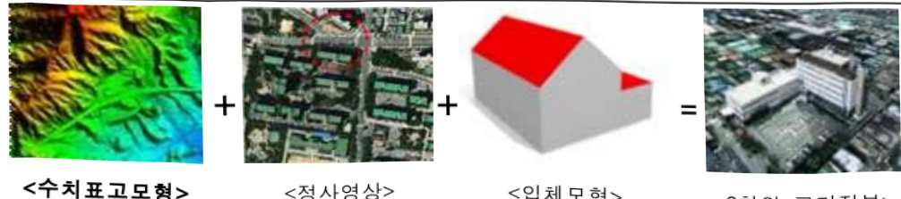
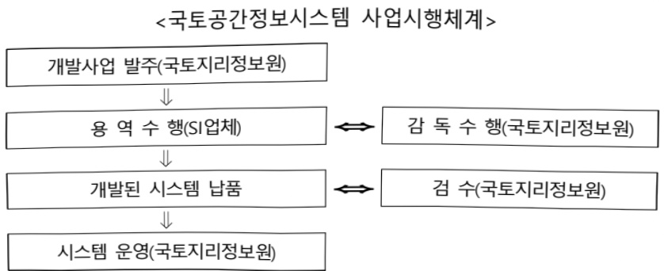
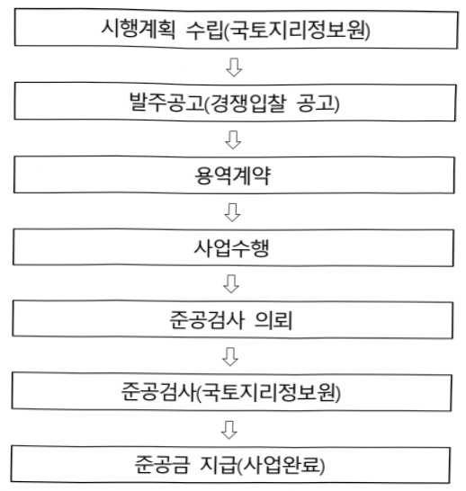
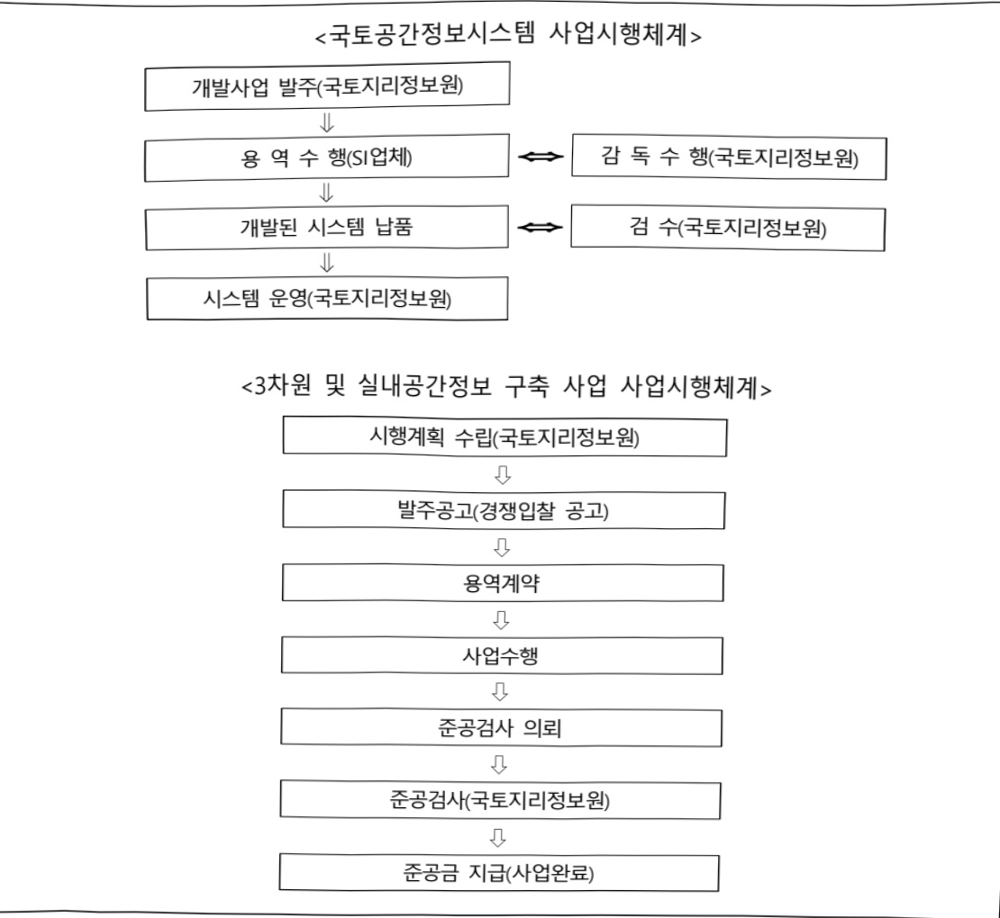

# 국토지형관리(정보화)

**해당 페이지**: PDF 2272 ~ 2284 쪽 해당

**부처**: 국토교통부
**분야**: 국토 및 지역개발
**회계유형**: 일반
**2026 확정예산**: 20037.0 백만원
**전년대비 증감률**: 86.4%
**AI 도메인**: 건설/스마트시티

---

### 가.예산 총괄표

(단위: 백만원, %)

<table border=1 style='margin: auto; word-wrap: break-word;'><tr><td rowspan="2">사업명</td><td rowspan="2">2024년 결산</td><td colspan="2">2025년 예산</td><td colspan="2">2026년</td><td rowspan="2">중감 (B-A)</td><td rowspan="2">(B-A)/A</td></tr><tr><td style='text-align: center; word-wrap: break-word;'>본예산(A)</td><td style='text-align: center; word-wrap: break-word;'>추경</td><td style='text-align: center; word-wrap: break-word;'>정부안</td><td style='text-align: center; word-wrap: break-word;'>확정(B)</td></tr><tr><td style='text-align: center; word-wrap: break-word;'>국토지형관리(정보화)</td><td style='text-align: center; word-wrap: break-word;'>9,533</td><td style='text-align: center; word-wrap: break-word;'>10,747</td><td style='text-align: center; word-wrap: break-word;'>10,747</td><td style='text-align: center; word-wrap: break-word;'>20,037</td><td style='text-align: center; word-wrap: break-word;'>20,037</td><td style='text-align: center; word-wrap: break-word;'>9,290</td><td style='text-align: center; word-wrap: break-word;'>86.4</td></tr></table>

□ 기능별(내역사업별), 목별 예산 내역

(단위:백만원)

<table border=1 style='margin: auto; word-wrap: break-word;'><tr><td rowspan="3"></td><td colspan="5">2024</td><td colspan="7">2025(2025.12일말기준)</td><td rowspan="3">2026예산</td></tr><tr><td rowspan="2">예산액(추정)</td><td rowspan="2">예산현액</td><td rowspan="2">집행액[실집행액]</td><td rowspan="2">이월액</td><td rowspan="2">불용액</td><td rowspan="2">분예산</td><td rowspan="2">예산현액</td><td rowspan="2">집행액[실집행액]</td><td colspan="2">전년도이월액제외</td><td rowspan="2">이월예산액</td><td rowspan="2">불용예산액</td></tr><tr><td style='text-align: center; word-wrap: break-word;'>예산현액</td><td style='text-align: center; word-wrap: break-word;'>집행액[실집행액]</td></tr><tr><td style='text-align: center; word-wrap: break-word;'>○ 기능별 분류(합계)</td><td style='text-align: center; word-wrap: break-word;'>10,492</td><td style='text-align: center; word-wrap: break-word;'>10,526</td><td style='text-align: center; word-wrap: break-word;'>9,533</td><td style='text-align: center; word-wrap: break-word;'>359</td><td style='text-align: center; word-wrap: break-word;'>634</td><td style='text-align: center; word-wrap: break-word;'>10,747</td><td style='text-align: center; word-wrap: break-word;'>11,238</td><td style='text-align: center; word-wrap: break-word;'>10,827</td><td style='text-align: center; word-wrap: break-word;'>10,879</td><td style='text-align: center; word-wrap: break-word;'>10,468</td><td style='text-align: center; word-wrap: break-word;'>153</td><td style='text-align: center; word-wrap: break-word;'>258</td><td style='text-align: center; word-wrap: break-word;'>20,037</td></tr><tr><td style='text-align: center; word-wrap: break-word;'>· 국토공간정보시스템</td><td style='text-align: center; word-wrap: break-word;'>2,204</td><td style='text-align: center; word-wrap: break-word;'>2,204</td><td style='text-align: center; word-wrap: break-word;'>2,112</td><td style='text-align: center; word-wrap: break-word;'>-</td><td style='text-align: center; word-wrap: break-word;'>92</td><td style='text-align: center; word-wrap: break-word;'>2,331</td><td style='text-align: center; word-wrap: break-word;'>2,353</td><td style='text-align: center; word-wrap: break-word;'>2,253</td><td style='text-align: center; word-wrap: break-word;'>2,353</td><td style='text-align: center; word-wrap: break-word;'>2,253</td><td style='text-align: center; word-wrap: break-word;'>-</td><td style='text-align: center; word-wrap: break-word;'>100</td><td style='text-align: center; word-wrap: break-word;'>4,721</td></tr><tr><td style='text-align: center; word-wrap: break-word;'>· 3차원 공간정보(수치표고보험) 구축</td><td style='text-align: center; word-wrap: break-word;'>7,748</td><td style='text-align: center; word-wrap: break-word;'>7,782</td><td style='text-align: center; word-wrap: break-word;'>6,906</td><td style='text-align: center; word-wrap: break-word;'>359</td><td style='text-align: center; word-wrap: break-word;'>517</td><td style='text-align: center; word-wrap: break-word;'>8,000</td><td style='text-align: center; word-wrap: break-word;'>8,469</td><td style='text-align: center; word-wrap: break-word;'>8,179</td><td style='text-align: center; word-wrap: break-word;'>8,110</td><td style='text-align: center; word-wrap: break-word;'>7,820</td><td style='text-align: center; word-wrap: break-word;'>153</td><td style='text-align: center; word-wrap: break-word;'>137</td><td style='text-align: center; word-wrap: break-word;'>14,900</td></tr><tr><td style='text-align: center; word-wrap: break-word;'>· 실내공간정보 구축</td><td style='text-align: center; word-wrap: break-word;'>540</td><td style='text-align: center; word-wrap: break-word;'>540</td><td style='text-align: center; word-wrap: break-word;'>515</td><td style='text-align: center; word-wrap: break-word;'>-</td><td style='text-align: center; word-wrap: break-word;'>25</td><td style='text-align: center; word-wrap: break-word;'>416</td><td style='text-align: center; word-wrap: break-word;'>416</td><td style='text-align: center; word-wrap: break-word;'>395</td><td style='text-align: center; word-wrap: break-word;'>416</td><td style='text-align: center; word-wrap: break-word;'>395</td><td style='text-align: center; word-wrap: break-word;'>-</td><td style='text-align: center; word-wrap: break-word;'>21</td><td style='text-align: center; word-wrap: break-word;'>416</td></tr><tr><td style='text-align: center; word-wrap: break-word;'>○ 비목별 분류(합계)</td><td style='text-align: center; word-wrap: break-word;'>10,492</td><td style='text-align: center; word-wrap: break-word;'>10,526</td><td style='text-align: center; word-wrap: break-word;'>9,533</td><td style='text-align: center; word-wrap: break-word;'>359</td><td style='text-align: center; word-wrap: break-word;'>634</td><td style='text-align: center; word-wrap: break-word;'>10,747</td><td style='text-align: center; word-wrap: break-word;'>11,238</td><td style='text-align: center; word-wrap: break-word;'>10,827</td><td style='text-align: center; word-wrap: break-word;'>10,879</td><td style='text-align: center; word-wrap: break-word;'>10,468</td><td style='text-align: center; word-wrap: break-word;'>153</td><td style='text-align: center; word-wrap: break-word;'>258</td><td style='text-align: center; word-wrap: break-word;'>20,037</td></tr><tr><td style='text-align: center; word-wrap: break-word;'>· 일반수용비(210-01)</td><td style='text-align: center; word-wrap: break-word;'>10</td><td style='text-align: center; word-wrap: break-word;'>10</td><td style='text-align: center; word-wrap: break-word;'>9</td><td style='text-align: center; word-wrap: break-word;'>-</td><td style='text-align: center; word-wrap: break-word;'>1</td><td style='text-align: center; word-wrap: break-word;'>12</td><td style='text-align: center; word-wrap: break-word;'>15</td><td style='text-align: center; word-wrap: break-word;'>14</td><td style='text-align: center; word-wrap: break-word;'>15</td><td style='text-align: center; word-wrap: break-word;'>14</td><td style='text-align: center; word-wrap: break-word;'>-</td><td style='text-align: center; word-wrap: break-word;'>1</td><td style='text-align: center; word-wrap: break-word;'>12</td></tr><tr><td style='text-align: center; word-wrap: break-word;'>· 공공요금및제세(210-02)</td><td style='text-align: center; word-wrap: break-word;'>220</td><td style='text-align: center; word-wrap: break-word;'>220</td><td style='text-align: center; word-wrap: break-word;'>204</td><td style='text-align: center; word-wrap: break-word;'>-</td><td style='text-align: center; word-wrap: break-word;'>16</td><td style='text-align: center; word-wrap: break-word;'>220</td><td style='text-align: center; word-wrap: break-word;'>217</td><td style='text-align: center; word-wrap: break-word;'>204</td><td style='text-align: center; word-wrap: break-word;'>217</td><td style='text-align: center; word-wrap: break-word;'>204</td><td style='text-align: center; word-wrap: break-word;'>-</td><td style='text-align: center; word-wrap: break-word;'>13</td><td style='text-align: center; word-wrap: break-word;'>170</td></tr><tr><td style='text-align: center; word-wrap: break-word;'>· 입차료(210-07)</td><td style='text-align: center; word-wrap: break-word;'>500</td><td style='text-align: center; word-wrap: break-word;'>500</td><td style='text-align: center; word-wrap: break-word;'>497</td><td style='text-align: center; word-wrap: break-word;'>-</td><td style='text-align: center; word-wrap: break-word;'>3</td><td style='text-align: center; word-wrap: break-word;'>500</td><td style='text-align: center; word-wrap: break-word;'>500</td><td style='text-align: center; word-wrap: break-word;'>498</td><td style='text-align: center; word-wrap: break-word;'>500</td><td style='text-align: center; word-wrap: break-word;'>498</td><td style='text-align: center; word-wrap: break-word;'>-</td><td style='text-align: center; word-wrap: break-word;'>2</td><td style='text-align: center; word-wrap: break-word;'>2,156</td></tr><tr><td style='text-align: center; word-wrap: break-word;'>· 시설장비유지비(210-09)</td><td style='text-align: center; word-wrap: break-word;'>45</td><td style='text-align: center; word-wrap: break-word;'>45</td><td style='text-align: center; word-wrap: break-word;'>41</td><td style='text-align: center; word-wrap: break-word;'>-</td><td style='text-align: center; word-wrap: break-word;'>4</td><td style='text-align: center; word-wrap: break-word;'>3</td><td style='text-align: center; word-wrap: break-word;'>25</td><td style='text-align: center; word-wrap: break-word;'>23</td><td style='text-align: center; word-wrap: break-word;'>25</td><td style='text-align: center; word-wrap: break-word;'>23</td><td style='text-align: center; word-wrap: break-word;'>-</td><td style='text-align: center; word-wrap: break-word;'>2</td><td style='text-align: center; word-wrap: break-word;'>3</td></tr><tr><td style='text-align: center; word-wrap: break-word;'>· 관리용역비(210-15)</td><td style='text-align: center; word-wrap: break-word;'>1,079</td><td style='text-align: center; word-wrap: break-word;'>1,079</td><td style='text-align: center; word-wrap: break-word;'>1,012</td><td style='text-align: center; word-wrap: break-word;'>-</td><td style='text-align: center; word-wrap: break-word;'>67</td><td style='text-align: center; word-wrap: break-word;'>1,144</td><td style='text-align: center; word-wrap: break-word;'>1,144</td><td style='text-align: center; word-wrap: break-word;'>1,073</td><td style='text-align: center; word-wrap: break-word;'>1,144</td><td style='text-align: center; word-wrap: break-word;'>1,073</td><td style='text-align: center; word-wrap: break-word;'>-</td><td style='text-align: center; word-wrap: break-word;'>71</td><td style='text-align: center; word-wrap: break-word;'>1,266</td></tr><tr><td style='text-align: center; word-wrap: break-word;'>· 일반연구비(260-01)</td><td style='text-align: center; word-wrap: break-word;'>8,348</td><td style='text-align: center; word-wrap: break-word;'>8,382</td><td style='text-align: center; word-wrap: break-word;'>7,479</td><td style='text-align: center; word-wrap: break-word;'>359</td><td style='text-align: center; word-wrap: break-word;'>544</td><td style='text-align: center; word-wrap: break-word;'>8,514</td><td style='text-align: center; word-wrap: break-word;'>8,983</td><td style='text-align: center; word-wrap: break-word;'>8,662</td><td style='text-align: center; word-wrap: break-word;'>8,624</td><td style='text-align: center; word-wrap: break-word;'>8,303</td><td style='text-align: center; word-wrap: break-word;'>153</td><td style='text-align: center; word-wrap: break-word;'>168</td><td style='text-align: center; word-wrap: break-word;'>16,314</td></tr><tr><td style='text-align: center; word-wrap: break-word;'>· 자산취득비(430-01)</td><td style='text-align: center; word-wrap: break-word;'>290</td><td style='text-align: center; word-wrap: break-word;'>290</td><td style='text-align: center; word-wrap: break-word;'>290</td><td style='text-align: center; word-wrap: break-word;'>-</td><td style='text-align: center; word-wrap: break-word;'>-</td><td style='text-align: center; word-wrap: break-word;'>354</td><td style='text-align: center; word-wrap: break-word;'>354</td><td style='text-align: center; word-wrap: break-word;'>353</td><td style='text-align: center; word-wrap: break-word;'>354</td><td style='text-align: center; word-wrap: break-word;'>353</td><td style='text-align: center; word-wrap: break-word;'>-</td><td style='text-align: center; word-wrap: break-word;'>1</td><td style='text-align: center; word-wrap: break-word;'>116</td></tr><tr><td style='text-align: center; word-wrap: break-word;'>○ 기능비목별 분류(합계)</td><td style='text-align: center; word-wrap: break-word;'>10,492</td><td style='text-align: center; word-wrap: break-word;'>10,526</td><td style='text-align: center; word-wrap: break-word;'>9,533</td><td style='text-align: center; word-wrap: break-word;'>359</td><td style='text-align: center; word-wrap: break-word;'>634</td><td style='text-align: center; word-wrap: break-word;'>10,747</td><td style='text-align: center; word-wrap: break-word;'>11,238</td><td style='text-align: center; word-wrap: break-word;'>10,827</td><td style='text-align: center; word-wrap: break-word;'>10,879</td><td style='text-align: center; word-wrap: break-word;'>10,468</td><td style='text-align: center; word-wrap: break-word;'>153</td><td style='text-align: center; word-wrap: break-word;'>258</td><td style='text-align: center; word-wrap: break-word;'>20,037</td></tr><tr><td style='text-align: center; word-wrap: break-word;'>· 국토공간정보시스템</td><td style='text-align: center; word-wrap: break-word;'>2,204</td><td style='text-align: center; word-wrap: break-word;'>2,204</td><td style='text-align: center; word-wrap: break-word;'>2,112</td><td style='text-align: center; word-wrap: break-word;'>-</td><td style='text-align: center; word-wrap: break-word;'>92</td><td style='text-align: center; word-wrap: break-word;'>2,331</td><td style='text-align: center; word-wrap: break-word;'>2,353</td><td style='text-align: center; word-wrap: break-word;'>2,253</td><td style='text-align: center; word-wrap: break-word;'>2,353</td><td style='text-align: center; word-wrap: break-word;'>2,253</td><td style='text-align: center; word-wrap: break-word;'>-</td><td style='text-align: center; word-wrap: break-word;'>100</td><td style='text-align: center; word-wrap: break-word;'>4,721</td></tr><tr><td style='text-align: center; word-wrap: break-word;'>· 일반수용비(210-01)</td><td style='text-align: center; word-wrap: break-word;'>10</td><td style='text-align: center; word-wrap: break-word;'>10</td><td style='text-align: center; word-wrap: break-word;'>9</td><td style='text-align: center; word-wrap: break-word;'>-</td><td style='text-align: center; word-wrap: break-word;'>1</td><td style='text-align: center; word-wrap: break-word;'>10</td><td style='text-align: center; word-wrap: break-word;'>13</td><td style='text-align: center; word-wrap: break-word;'>12</td><td style='text-align: center; word-wrap: break-word;'>13</td><td style='text-align: center; word-wrap: break-word;'>12</td><td style='text-align: center; word-wrap: break-word;'>-</td><td style='text-align: center; word-wrap: break-word;'>1</td><td style='text-align: center; word-wrap: break-word;'>12</td></tr><tr><td style='text-align: center; word-wrap: break-word;'>· 공공요금및제세(210-02)</td><td style='text-align: center; word-wrap: break-word;'>220</td><td style='text-align: center; word-wrap: break-word;'>220</td><td style='text-align: center; word-wrap: break-word;'>204</td><td style='text-align: center; word-wrap: break-word;'>-</td><td style='text-align: center; word-wrap: break-word;'>16</td><td style='text-align: center; word-wrap: break-word;'>220</td><td style='text-align: center; word-wrap: break-word;'>217</td><td style='text-align: center; word-wrap: break-word;'>204</td><td style='text-align: center; word-wrap: break-word;'>217</td><td style='text-align: center; word-wrap: break-word;'>204</td><td style='text-align: center; word-wrap: break-word;'>-</td><td style='text-align: center; word-wrap: break-word;'>13</td><td style='text-align: center; word-wrap: break-word;'>170</td></tr><tr><td style='text-align: center; word-wrap: break-word;'>· 입차료(210-07)</td><td style='text-align: center; word-wrap: break-word;'>500</td><td style='text-align: center; word-wrap: break-word;'>500</td><td style='text-align: center; word-wrap: break-word;'>497</td><td style='text-align: center; word-wrap: break-word;'>-</td><td style='text-align: center; word-wrap: break-word;'>3</td><td style='text-align: center; word-wrap: break-word;'>500</td><td style='text-align: center; word-wrap: break-word;'>500</td><td style='text-align: center; word-wrap: break-word;'>498</td><td style='text-align: center; word-wrap: break-word;'>500</td><td style='text-align: center; word-wrap: break-word;'>498</td><td style='text-align: center; word-wrap: break-word;'>-</td><td style='text-align: center; word-wrap: break-word;'>2</td><td style='text-align: center; word-wrap: break-word;'>2,156</td></tr><tr><td style='text-align: center; word-wrap: break-word;'>· 시설장비유지비(210-09)</td><td style='text-align: center; word-wrap: break-word;'>45</td><td style='text-align: center; word-wrap: break-word;'>45</td><td style='text-align: center; word-wrap: break-word;'>41</td><td style='text-align: center; word-wrap: break-word;'>-</td><td style='text-align: center; word-wrap: break-word;'>4</td><td style='text-align: center; word-wrap: break-word;'>3</td><td style='text-align: center; word-wrap: break-word;'>25</td><td style='text-align: center; word-wrap: break-word;'>23</td><td style='text-align: center; word-wrap: break-word;'>25</td><td style='text-align: center; word-wrap: break-word;'>23</td><td style='text-align: center; word-wrap: break-word;'>-</td><td style='text-align: center; word-wrap: break-word;'>2</td><td style='text-align: center; word-wrap: break-word;'>3</td></tr><tr><td style='text-align: center; word-wrap: break-word;'>· 관리용역비(210-15)</td><td style='text-align: center; word-wrap: break-word;'>1,079</td><td style='text-align: center; word-wrap: break-word;'>1,079</td><td style='text-align: center; word-wrap: break-word;'>1,012</td><td style='text-align: center; word-wrap: break-word;'>-</td><td style='text-align: center; word-wrap: break-word;'>67</td><td style='text-align: center; word-wrap: break-word;'>1,144</td><td style='text-align: center; word-wrap: break-word;'>1,144</td><td style='text-align: center; word-wrap: break-word;'>1,073</td><td style='text-align: center; word-wrap: break-word;'>1,144</td><td style='text-align: center; word-wrap: break-word;'>1,073</td><td style='text-align: center; word-wrap: break-word;'>-</td><td style='text-align: center; word-wrap: break-word;'>71</td><td style='text-align: center; word-wrap: break-word;'>1,266</td></tr><tr><td style='text-align: center; word-wrap: break-word;'>· 일반연구비(260-01)</td><td style='text-align: center; word-wrap: break-word;'>60</td><td style='text-align: center; word-wrap: break-word;'>60</td><td style='text-align: center; word-wrap: break-word;'>58</td><td style='text-align: center; word-wrap: break-word;'>-</td><td style='text-align: center; word-wrap: break-word;'>2</td><td style='text-align: center; word-wrap: break-word;'>100</td><td style='text-align: center; word-wrap: break-word;'>100</td><td style='text-align: center; word-wrap: break-word;'>90</td><td style='text-align: center; word-wrap: break-word;'>100</td><td style='text-align: center; word-wrap: break-word;'>90</td><td style='text-align: center; word-wrap: break-word;'>-</td><td style='text-align: center; word-wrap: break-word;'>10</td><td style='text-align: center; word-wrap: break-word;'>1,000</td></tr><tr><td style='text-align: center; word-wrap: break-word;'>· 자산취득비(430-01)</td><td style='text-align: center; word-wrap: break-word;'>290</td><td style='text-align: center; word-wrap: break-word;'>290</td><td style='text-align: center; word-wrap: break-word;'>290</td><td style='text-align: center; word-wrap: break-word;'>-</td><td style='text-align: center; word-wrap: break-word;'>-</td><td style='text-align: center; word-wrap: break-word;'>354</td><td style='text-align: center; word-wrap: break-word;'>354</td><td style='text-align: center; word-wrap: break-word;'>353</td><td style='text-align: center; word-wrap: break-word;'>354</td><td style='text-align: center; word-wrap: break-word;'>353</td><td style='text-align: center; word-wrap: break-word;'>-</td><td style='text-align: center; word-wrap: break-word;'>1</td><td style='text-align: center; word-wrap: break-word;'>116</td></tr><tr><td style='text-align: center; word-wrap: break-word;'>· 3차원 공간정보(수치표고보험) 구축</td><td style='text-align: center; word-wrap: break-word;'>7,748</td><td style='text-align: center; word-wrap: break-word;'>7,782</td><td style='text-align: center; word-wrap: break-word;'>6,906</td><td style='text-align: center; word-wrap: break-word;'>359</td><td style='text-align: center; word-wrap: break-word;'>517</td><td style='text-align: center; word-wrap: break-word;'>8,000</td><td style='text-align: center; word-wrap: break-word;'>8,469</td><td style='text-align: center; word-wrap: break-word;'>8,179</td><td style='text-align: center; word-wrap: break-word;'>8,110</td><td style='text-align: center; word-wrap: break-word;'>7,820</td><td style='text-align: center; word-wrap: break-word;'>153</td><td style='text-align: center; word-wrap: break-word;'>137</td><td style='text-align: center; word-wrap: break-word;'>14,900</td></tr><tr><td style='text-align: center; word-wrap: break-word;'>· 일반연구비(260-01)</td><td style='text-align: center; word-wrap: break-word;'>7,748</td><td style='text-align: center; word-wrap: break-word;'>7,782</td><td style='text-align: center; word-wrap: break-word;'>6,906</td><td style='text-align: center; word-wrap: break-word;'>359</td><td style='text-align: center; word-wrap: break-word;'>517</td><td style='text-align: center; word-wrap: break-word;'>8,000</td><td style='text-align: center; word-wrap: break-word;'>8,469</td><td style='text-align: center; word-wrap: break-word;'>8,179</td><td style='text-align: center; word-wrap: break-word;'>8,110</td><td style='text-align: center; word-wrap: break-word;'>7,820</td><td style='text-align: center; word-wrap: break-word;'>153</td><td style='text-align: center; word-wrap: break-word;'>137</td><td style='text-align: center; word-wrap: break-word;'>14,900</td></tr><tr><td style='text-align: center; word-wrap: break-word;'>· 실내공간정보 구축</td><td style='text-align: center; word-wrap: break-word;'>540</td><td style='text-align: center; word-wrap: break-word;'>540</td><td style='text-align: center; word-wrap: break-word;'>515</td><td style='text-align: center; word-wrap: break-word;'>-</td><td style='text-align: center; word-wrap: break-word;'>25</td><td style='text-align: center; word-wrap: break-word;'>416</td><td style='text-align: center; word-wrap: break-word;'>416</td><td style='text-align: center; word-wrap: break-word;'>395</td><td style='text-align: center; word-wrap: break-word;'>416</td><td style='text-align: center; word-wrap: break-word;'>395</td><td style='text-align: center; word-wrap: break-word;'>-</td><td style='text-align: center; word-wrap: break-word;'>21</td><td style='text-align: center; word-wrap: break-word;'>416</td></tr><tr><td style='text-align: center; word-wrap: break-word;'>· 일반수용비(210-01)</td><td style='text-align: center; word-wrap: break-word;'>-</td><td style='text-align: center; word-wrap: break-word;'>-</td><td style='text-align: center; word-wrap: break-word;'>-</td><td style='text-align: center; word-wrap: break-word;'>-</td><td style='text-align: center; word-wrap: break-word;'>-</td><td style='text-align: center; word-wrap: break-word;'>2</td><td style='text-align: center; word-wrap: break-word;'>2</td><td style='text-align: center; word-wrap: break-word;'>2</td><td style='text-align: center; word-wrap: break-word;'>2</td><td style='text-align: center; word-wrap: break-word;'>2</td><td style='text-align: center; word-wrap: break-word;'>-</td><td style='text-align: center; word-wrap: break-word;'>0</td><td style='text-align: center; word-wrap: break-word;'>2</td></tr><tr><td style='text-align: center; word-wrap: break-word;'>· 일반연구비(260-01)</td><td style='text-align: center; word-wrap: break-word;'>540</td><td style='text-align: center; word-wrap: break-word;'>540</td><td style='text-align: center; word-wrap: break-word;'>515</td><td style='text-align: center; word-wrap: break-word;'>-</td><td style='text-align: center; word-wrap: break-word;'>25</td><td style='text-align: center; word-wrap: break-word;'>414</td><td style='text-align: center; word-wrap: break-word;'>414</td><td style='text-align: center; word-wrap: break-word;'>393</td><td style='text-align: center; word-wrap: break-word;'>414</td><td style='text-align: center; word-wrap: break-word;'>393</td><td style='text-align: center; word-wrap: break-word;'>-</td><td style='text-align: center; word-wrap: break-word;'>21</td><td style='text-align: center; word-wrap: break-word;'>414</td></tr></table>

---

### 나. 사업설명자료

## 1 ) 사업목적·내용

- (국토지형관리(정보화)) 국토공간정보시스템 운영 및 디지털트런 핵심데이터인 공간

정보를 빠르고 정확하게 구축하여 국민이 활용할 수 있도록 전국 3차원 공간정보 제공

- (국토공간정보시스템) 국토지리정보원에서 생산되는 우리나라 지도 및 국가 기본

공간정보(기본측량성과 등)을 관리하는 국토공간정보시스템 구축, 운영 및 유지보수

- (3차원 공간정보(수치표고모형) 구축) 디지털 트윈국토의 필수 기초자료인 3차원

공간정보(수치표고모형)의 품질 및 최신성 확보를 위해 지속적으로 구축하고, AI

등 최신기술을 활용한 자동 구축기술 개발 등 관련 연구 추진

- (실내공간정보 구축) 도시의 집적화로 복잡화·대형화되는 실내 공간에서의 국민생활

안전, 복지 증진 및 재난·안전 관리 등을 위한 실내공간정보 구축

## 2 ) 사업개요

## □ 사업근거 및 추진경위

① 법령상 근거 및 조항 적시

<table border=1 style='margin: auto; word-wrap: break-word;'><tr><td style='text-align: center; word-wrap: break-word;'>「국가공간정보 기본법」</td></tr><tr><td style='text-align: center; word-wrap: break-word;'>제19조(기본공간정보의 취득 및 관리)</td></tr><tr><td style='text-align: center; word-wrap: break-word;'>① 국토교통부장관은 지형·해안선·행정경계·도로 또는 철도의 경계·하천경계·지적, 건물 등 인공구조물의 공간정보, 그 밖에 대통령령으로 정하는 주요 공간정보를 기본공간정보로 선정하여 관계 중앙행정기관의 장과 협의한 후 이를 관보에 고시하여야 한다.</td></tr><tr><td style='text-align: center; word-wrap: break-word;'>② 관계 중앙행정기관의 장은 제1항에 따라 선정·고시된 기본공간정보(이하 &quot;기본공간정보&quot;라 한다)를 대통령령으로 정하는 바에 따라 데이터베이스로 구축하여 관리하여야 한다.</td></tr><tr><td style='text-align: center; word-wrap: break-word;'>③ 국토교통부장관은 관리기관이 제2항에 따라 구축·관리하는 데이터베이스(이하 &quot;기본공간정보데이터베이스&quot;라 한다)를 통합하여 하나의 데이터베이스로 관리하여야 한다.</td></tr><tr><td style='text-align: center; word-wrap: break-word;'>④ 기본공간정보 선정의 기준 및 절차, 기본공간정보데이터베이스의 구축과 관리, 기본공간정보 데이터베이스의 통합 관리, 그 밖에 필요한 사항은 대통령령으로 정한다.</td></tr><tr><td style='text-align: center; word-wrap: break-word;'>제35조(보안관리)</td></tr><tr><td style='text-align: center; word-wrap: break-word;'>① 관리기관의 장은 공간정보 또는 공간정보데이터베이스의 구축·관리 및 활용에 있어서 공개가 제한되는 공간정보에 대한 부당한 접근과 이용 또는 공간정보의 유출을 방지하기 위하여 필요한 보안관리규정을 대통령령으로 정하는 바에 따라 제정하고 시행하여야 한다.</td></tr><tr><td style='text-align: center; word-wrap: break-word;'>② 관리기관의 장은 제1항에 따라 보안관리규정을 제정하는 경우에는 국가정보원장과 협의하여야 한다. 보안관리규정을 개정하고자 하는 경우에도 또한 같다.</td></tr><tr><td style='text-align: center; word-wrap: break-word;'>제36조(공간정보데이터베이스의 안전성 확보)</td></tr><tr><td style='text-align: center; word-wrap: break-word;'>관리기관의 장은 공간정보데이터베이스의 멸실 또는 훼손에 대비하여 대통령령으로 정하는 바에 따라 이를 별도로 복제하여 관리하여야 한다.</td></tr></table>

---

제37조(공간정보 등의 침해 또는 훼손 등의 금지)

① 누구든지 관리기관이 생산 또는 관리하는 공간정보 또는 공간정보데이터베이스를 침해 또는 훼손하거나 법령에 따라 공개가 제한되는 공간정보를 관리기관의 승인 없이 무단으로 열람·복제·유출하여서는 아니 된다.

② 누구든지 공간정보 또는 공간정보데이터베이스를 이용하여 다른 사람의 권리나 사생활을 침해하여서는 아니 된다.

## 「국가공간정보 기본법 시행령」

제15조(기본공간정보의 취득 및 관리)

① 법 제19조제1항에서"대통령령으로 정하는 주요 공간정보"란 다음 각 호의 공간정보를 말한다.

1. 기준점(「공간정보의 구축 및 관리 등에 관한 법률」제8조제1항에 따른 측량기준점표지를 말한다)

3. 정사영상[항공사진 또는 인공위성의 영상을 지도와 같은 정사투영법으로 제작한 영상을 말한다.

4. 수치표고 모형[지표면의 표고(콤흐)를 일정간격 격자마다 수치로 기록한 표고모형을 말한다]

5. 공간정보 입체 모형(지상에 존재하는 인공적인 객체의 외형에 관한 위치정보를 현실과 유사하게 입체적으로 표현한 정보를 말한다)

6. 실내공간정보(지상 또는 지하에 존재하는 건물 등 인공구조물의 내부에 관한 공간정보를 말한다)

7. 그 밖에 위원회의 심의를 거쳐 국토교통부장관이 정하는 공간정보

## 「공간정보의 구축 및 관리 등에 관한 법률」

## 제13조(기본측량성과의 고시)

① 국도교통부상판은 기존극당을 끝냈으면 대통령령으로 정하는 바에 따라 기본측량성과를 고시하여야 한다.

② 국토교통부장관은 대통령령으로 정하는 측량 관련 전문기관으로 하여금 기본측량성과의 정확도를 검증하도록 할 수 있다.

③ 국토교통부장관은 기본측량성과를 고시한 후 지형·지물의 변동 등이 발생한 경우에는 그 변동 내용에 따라 기본측량성과를 수정하여야 한다.

④ 제1항에 따라 고시된 측량성과에 어긋나는 측량성과를 사용하여서는 아니 된다.

제14조(기본측량성과의 보관 및 열람 등)

① 국토교통부장관은 기본측량성과 및 기본측량기록을 보관하고 일반인이 열람할 수 있도록 하여야 한다.

② 기본측량성과나 기본측량기록을 복제하거나 그 사본을 발급받으려는 자는 국토교통부령으로 정하는 바에 따라 국토교통부장관에게 그 복제 또는 발급을 신청하여야 한다.

③ 국토교통부장관은 제2항에 따른 신청 내용이 다음 각 호의 어느 하나에 해당하는 경우에는 기본측량성과나 기본측량기록을 복제하게 하거나 그 사본을 발급할 수 없다

1. 국가안보나 그 밖에 국가의 중대한 이익을 해칠 우려가 있다고 인정되는 경우

2. 다른 법령에 따라 비밀로 유지되거나 열람이 제한되는 등 비공개사항으로 규정된 경우

② 추진경위 - 사업 시작년도, 추진배경, 부처별 중점과제, 대통령 공약사항 등

<국토공간정보시스템 추진경위>

- '00.01 : 국가지리정보체계의구축및활용등에관한법률 제정

- '02 : 국토공간정보시스템 정보화 전략계획(ISP) 수립

- '03～'04 : 객체기반공간정보관리시스템 구축

---

- '05.12 : 제3차 국가지리정보체계(NGIS)구축 기본계획 확정

- '07 : 기관업무통합(EAI)구축 계획수립 및 기존 ISP 수정, 객체기반공간정보시스템 성능 개선

- '09 : 국가공간정보에 관한 법률 제정, 국토공간정보 데이터웨어하우스 구축 ISP 수립

- '11 : 국토지리정보원 웹사이트 통합구축

- '12 : 스마트 전자지도관리시스템 구축 1차

국토지리정보원 공간정보 보안전문인력 3인 순증

- '13 : 스마트 전자지도관리시스템 구축 2차

공간정보 보안 담당 영상관리팀 신설

공간정보 보안·관리체계 ISP 수립 연구

- '14 : 스마트 전자지도관리시스템 구축 3차

공간정보 보안처리시스템 구축

- '15 : 개방과 공유 환경으로 공간정보시스템 통합 구축

공간정보 보안처리시스템 구축 추진(계속)

- '16 : 요소 기반 공간정보 활용 체계 구축 추진

- '17 : 일하는 방식 지원을 위한 정보시스템 개선 및 고도화

- '18 : 신규 공간정보 활용 · 유통지원체계 구축 및 업무기능개선

- '19 : 공공측량 성과 및 영상정보 관리체계 등의 개선

- '20 : 영상정보 등 통합서비스 체계 구축

- '21 : 용역수행 지원 및 사업정보 통합운영을 위한 관리체계 구축

- '22 : 정밀도로지도 등 공간정보 통합관리 확대 및 모니터링 기능 구축

- '23 : 국토공간정보 행정망 서비스 확대 및 지오프라 기능개선

< 3차원 및 실내공간정보 추진경위 >

- '95. 5 : 제1차 국가GIS 구축 기본계획 수립·시행

- '00. 7 : 국가지리정보체계 구축 및 활용 등에 관한 법률 제정

- '01~'10 : 제2차 · 제3차 국가GIS 구축 기본계획 수립·시행

- '08. 2 : 국정과제 선정 · 관리 및 국가공간정보에 관한 법률 제정

- '10. 4 : 「3D산업 발전전략(관계부처 합동)」 VIP보고

- '10. 9 : [3차원 공간정보 구축] 을 위한 예비타당성 조사결과 인정

- '11. 4 : 「공간정보기반 신산업창출 전략」 경제정책조정회의 보고

- '13. 4 : VIP보고(3차원 공간정보 및 실내공간정보 추진 포함)

- '13. 7 : 경제정책 조정회의 보고

- '17. 1 : 국토교통부에서 국토지리정보원으로 업무이관

- '20. 5 : 과목구조 개편(국토부→국토지리정보원)을 통한 사업 추진

- '20. 7 : 한국판 뉴딜(디지털트런) 및 국정과제(34-8) 선정

- '22. 7 : 국정과제(38. 국토공간의 효율적 성장전략 지원) 선정(3차원 입체지도 구축)

---

## □ 주요내용

① 사업규모

- 총사업비(해당되는 경우에만 기재) : 해당없음

- 사업기간 : 계속

- 최근 5년 간 투입된 사업비(예산액기준, 추경편성한 연도에는 추경포함)

<table border=1 style='margin: auto; word-wrap: break-word;'><tr><td style='text-align: center; word-wrap: break-word;'>$ \underline{\text{笹}} $</td><td style='text-align: center; word-wrap: break-word;'>2022</td><td style='text-align: center; word-wrap: break-word;'>2023</td><td style='text-align: center; word-wrap: break-word;'>2024</td><td style='text-align: center; word-wrap: break-word;'>2025</td><td style='text-align: center; word-wrap: break-word;'>2026</td></tr><tr><td style='text-align: center; word-wrap: break-word;'>$ \underline{\text{人}} $</td><td style='text-align: center; word-wrap: break-word;'>11,691</td><td style='text-align: center; word-wrap: break-word;'>11,258</td><td style='text-align: center; word-wrap: break-word;'>10,492</td><td style='text-align: center; word-wrap: break-word;'>10,747</td><td style='text-align: center; word-wrap: break-word;'>20,037</td></tr></table>

-기타: 해당없음

② 사업추진체계

- 사업시행방법 : 직접수행

- 사업시행주체 : 국토교통부 국토지리정보원

- 사업 수혜자 : 공공 및 민간

- 보조, 융자, 출연, 출자 등의 경우 보조 · 융자 등 지원 비율 및 법적근거 : 해당없음

## 3 ) 2026년도 예산 산출 근거

① 국토공간정보시스템 구축 및 운영

: (2025 본예산) 2,331백만원 → (2026 확정) 4,721백만원, 2,390백만원 증액

①-(1) 시스템 개선 : (2025 본예산) 454백만원 → (2026 요구) 1,116백만원, 662백만원 증액

- (편성) EOS 만료 장비 교체 및 지자체에서 1974년부터 촬영한 개발제한구역 아날로그 항공사진을 DB구축하여 소실 방지 및 온라인 서비스 추진

*과거 아날로그 항공사진(74년~08년)은 필름, 종이 형태로 장기간 보관되고 있어 손상, 변질 우려가 있어 디지털화가 시급

* 구역관리, 행위허가, 불법행위 단속, 개발계획 수립 등 행정 필수자료이며 국민 재산권과도 관련이 높음

* 구축수량 6년간 20만매(60억) 예상, 연 10억씩 지자체 수요조사, 시급성, 노후도 고려하여 추진

- (산출) EOS 만료된 네트워크 스위치 및 방화벽 1식 = 116백만원

아날로그 항공사진 3.3만매 x 3만원/매(건설품셈 DB구축단가) = 1,000백만원

o 2025년도 예산 및 2026년도 예산 산출 세부내역 비교

<table border=1 style='margin: auto; word-wrap: break-word;'><tr><td colspan="2">2025년 예산</td><td colspan="4">2026년 예산</td></tr><tr><td style='text-align: center; word-wrap: break-word;'>예산</td><td style='text-align: center; word-wrap: break-word;'>산출내역</td><td style='text-align: center; word-wrap: break-word;'>예산</td><td colspan="3">산출내역</td></tr><tr><td rowspan="6">454</td><td rowspan="6">○ 자산취득비(430-01): 354백만원 가. 공간정보 저장관리용 전산자원 구매</td><td rowspan="6">1,116</td><td colspan="3">○ 자산취득비(430-01): 116백만원 가. EOS 만료 장비 교체</td></tr><tr><td style='text-align: center; word-wrap: break-word;'>품명</td><td style='text-align: center; word-wrap: break-word;'>규 격</td><td style='text-align: center; word-wrap: break-word;'>금액</td></tr><tr><td style='text-align: center; word-wrap: break-word;'>네트워크</td><td style='text-align: center; word-wrap: break-word;'>L2 스위치 SG2452GX 14대</td><td style='text-align: center; word-wrap: break-word;'>43백만원</td></tr><tr><td style='text-align: center; word-wrap: break-word;'>네트워크</td><td style='text-align: center; word-wrap: break-word;'>백본 스위치 SG9803 1대</td><td style='text-align: center; word-wrap: break-word;'>24백만원</td></tr><tr><td style='text-align: center; word-wrap: break-word;'>보안 장비</td><td style='text-align: center; word-wrap: break-word;'>BLUEMAX NGF 2100B</td><td style='text-align: center; word-wrap: break-word;'>49백만원</td></tr><tr><td colspan="3">나. 개발제한구역 항공사진 DB구축 - 아날로그 항공사진 3.3만매 × 3만원/매(건설품셈 DB구축단가) = 1,000백만원</td></tr></table>

---

<table border=1 style='margin: auto; word-wrap: break-word;'><tr><td rowspan="2">예산</td><td colspan="5">2025년 예산</td><td colspan="2">2026년 예산</td></tr><tr><td colspan="5">산출내역</td><td style='text-align: center; word-wrap: break-word;'>예산</td><td style='text-align: center; word-wrap: break-word;'>산출내역</td></tr><tr><td rowspan="15"></td><td style='text-align: center; word-wrap: break-word;'>품명</td><td colspan="3">규 격</td><td style='text-align: center; word-wrap: break-word;'>금액</td><td rowspan="7"></td><td rowspan="9"></td></tr><tr><td style='text-align: center; word-wrap: break-word;'>스토리지</td><td colspan="3">7.2krpm, Usable 1.2PB, RAID6</td><td style='text-align: center; word-wrap: break-word;'>230백만원</td></tr><tr><td style='text-align: center; word-wrap: break-word;'>서버용 백신</td><td colspan="3">AhnLab V3 Net for Win Svr 라이선스 (&#x27;23x2대, &#x27;24x5대) 1년 라이센스</td><td style='text-align: center; word-wrap: break-word;'>3백만원</td></tr><tr><td style='text-align: center; word-wrap: break-word;'>네 트 워 크 접근제어</td><td colspan="3">Genian NAC Suite V5.0 SP1</td><td style='text-align: center; word-wrap: break-word;'>63백만원</td></tr><tr><td style='text-align: center; word-wrap: break-word;'>위협 관리 시스템</td><td colspan="3">TMS. (국토교통부 사이버안전센터와 연동하여 실시간 유해트래픽 탐지, 네트워크 등 모니터링)</td><td style='text-align: center; word-wrap: break-word;'>55백만원</td></tr><tr><td style='text-align: center; word-wrap: break-word;'>설비감시</td><td colspan="3">온도/습도/정전 감시 및 문자 통보</td><td style='text-align: center; word-wrap: break-word;'>3백만원</td></tr><tr><td colspan="5">○ 일반연구비(260-01): 100백만원 가. 기관홈페이지 서비스 개선(단위; 원)</td></tr><tr><td rowspan="2">총기능 점수</td><td rowspan="2">기능 점수당 단가</td><td colspan="3">보정계수</td><td style='text-align: center; word-wrap: break-word;'>개발원가</td></tr><tr><td style='text-align: center; word-wrap: break-word;'>규모</td><td style='text-align: center; word-wrap: break-word;'>연계 복잡성</td><td style='text-align: center; word-wrap: break-word;'>성능 사이트</td><td style='text-align: center; word-wrap: break-word;'>보안성</td></tr><tr><td rowspan="6">114.1</td><td rowspan="6">553,114</td><td style='text-align: center; word-wrap: break-word;'>1.2800</td><td style='text-align: center; word-wrap: break-word;'>0.88</td><td style='text-align: center; word-wrap: break-word;'>1.05</td><td style='text-align: center; word-wrap: break-word;'>1.00</td><td style='text-align: center; word-wrap: break-word;'>1.06</td></tr><tr><td colspan="4">합계(보정 후 개발원가)</td><td style='text-align: center; word-wrap: break-word;'>79,120,332</td></tr><tr><td colspan="3">이윤</td><td style='text-align: center; word-wrap: break-word;'>15%</td><td style='text-align: center; word-wrap: break-word;'>11,868,050</td></tr><tr><td colspan="4">소프트웨어 개발비</td><td style='text-align: center; word-wrap: break-word;'>90,988,382</td></tr><tr><td colspan="4">소프트웨어 개발비 (부가세 포함) * 십만원 미만 절사</td><td style='text-align: center; word-wrap: break-word;'>100,000,000</td></tr><tr><td colspan="4"></td><td style='text-align: center; word-wrap: break-word;'></td></tr></table>

①-(2) 시스템 운영 유지 : (2025 본예산) 1,877백만원 → (2026 확정) 3,605백만원, 1,728백만원 증액

- (편성) '24년 행안부 공모사업(클라우드 네이티브 전환 사업) 선정 후 국토공간정보시스템(GEOFRA) 클라우드 전환에 따라 '26년부터 클라우드 이용료(CSP, MSP) 지급 필요 등

- (산출) 일반수용비 10백만원, 공공요금 및 제세 170백만원

임차료 2,156백만원, 시설장비유지비 3백만원

응용S/W 유지보수 734백만원, 상용S/W 유지보수 265백만원

H/W 유지보수 267백만원

o 2025년도 예산 및 2026년도 예산 산출 세부내역 비교

<table border=1 style='margin: auto; word-wrap: break-word;'><tr><td colspan="4">2025년 예산</td><td colspan="2">2026년 예산</td></tr><tr><td style='text-align: center; word-wrap: break-word;'>예산</td><td colspan="3">산출내역</td><td style='text-align: center; word-wrap: break-word;'>예산</td><td style='text-align: center; word-wrap: break-word;'>산출내역</td></tr><tr><td rowspan="8">1,877</td><td colspan="3">○ 일반수용비(210-01): 10백만원</td><td colspan="2">○ 일반수용비(210-01): 10백만원</td></tr><tr><td colspan="3">가. 백업테이프 등 소모품 구입: 10백만원 * 백업용 테이프(LTO8) 50개 x 20만원 = 10백만원</td><td colspan="2">가. 백업테이프 등 소모품 구입: 10백만원 * 백업용 테이프(LTO8) 50개 x 20만원 = 10백만원</td></tr><tr><td colspan="3">○ 공공요금및제세(210-02): 220백만원</td><td colspan="2">○ 공공요금및제세(210-02): 170백만원</td></tr><tr><td colspan="3">가. 공공요금 및 제세: 220백만원 * 주 업무 내용: 국토지리정보원 내 행정망 등 인터넷 사용료 등 * 산출내역: 16.66백만원(정보통신회선료, 월1회) * 12개월 + 20백만원(국가과학기술연구망 연회비)</td><td rowspan="2" colspan="2">가. 공공요금 및 제세: 170백만원 * 주 업무 내용: 국토지리정보원 내 행정망 등 인터넷 사용료 * 대용망 공간정보 대민서비스 등 클라우드 전환으로 해당 회선 비용은 클라우드 이용료에 추가 및 기존 이용 회선 대역폭 감소(10G-&gt;1G)에 따른 회선이용료 절감 * 산출내역: 12.91백만원(정보통신회선료, 월1회) * 12개월 + 15백만원(국가과학기술연구망 연회비)</td></tr><tr><td colspan="3">○ 임차료(210-07): 500백만원</td></tr><tr><td colspan="3">가. 임차료: 500백만원</td><td colspan="2">○ 임차료(210-07): 2,156백만원</td></tr><tr><td style='text-align: center; word-wrap: break-word;'>연도</td><td style='text-align: center; word-wrap: break-word;'>2023</td><td style='text-align: center; word-wrap: break-word;'>2024</td><td rowspan="2">2025</td><td rowspan="2">가. 임차료: 500백만원(1) 기준 국토공간정보 전산실 장비 리스료: 200백만원</td></tr><tr><td style='text-align: center; word-wrap: break-word;'>계약금액</td><td style='text-align: center; word-wrap: break-word;'>500백만원</td><td style='text-align: center; word-wrap: break-word;'>500백만원</td></tr></table>

---

<table border=1 style='margin: auto; word-wrap: break-word;'><tr><td rowspan="2">예산</td><td style='text-align: center; word-wrap: break-word;'>2025년 예산</td><td colspan="5">2026년 예산</td></tr><tr><td style='text-align: center; word-wrap: break-word;'>산출내역</td><td style='text-align: center; word-wrap: break-word;'>예산</td><td colspan="4">산출내역</td></tr><tr><td rowspan="6"></td><td style='text-align: center; word-wrap: break-word;'>○ 시설장비유지비(210-07): 3백만원</td><td colspan="5">(2) 클라우드 서비스 임차(CSP): 1,956백만원
- &#x27;24년 행안부 공모사업(클라우드 네이티브 전환 사업)&#x27; 선정 후 국토공간정보시스템(GEOFRA) 클라우드 전환에 따라 &#x27;26년부터 클라우드 이용료(CSP, MSP) 지급 필요
- 가상서버, 네트워크(전용선 등), 보안(방화벽, 접근제어 등) 인프라 자원 이용비
- 유지보수(MSP) 및 DevOps 기술지원 포함
- 5년 약정시 연간 CSP 임차 비용 (바우처 25% 적용시)</td></tr><tr><td style='text-align: center; word-wrap: break-word;'>가. CCTV 등 전산실 운영 유지를 위한 부품 교체 등: 3백만원
- 부품 교체 1식 x 3백만원 = 3백만원</td><td style='text-align: center; word-wrap: break-word;'>표준가격</td><td style='text-align: center; word-wrap: break-word;'>기관 할인
견적(△60%)</td><td style='text-align: center; word-wrap: break-word;'>5년 약정
할인(△25%)</td><td style='text-align: center; word-wrap: break-word;'>최종(△70%)</td><td style='text-align: center; word-wrap: break-word;'></td></tr><tr><td style='text-align: center; word-wrap: break-word;'>○ 관리용역비(210-15): 1,144백만원</td><td style='text-align: center; word-wrap: break-word;'>6,517
백만원</td><td style='text-align: center; word-wrap: break-word;'>2,607백만원</td><td style='text-align: center; word-wrap: break-word;'>△651백만원</td><td style='text-align: center; word-wrap: break-word;'>1,956백만원</td><td style='text-align: center; word-wrap: break-word;'></td></tr><tr><td style='text-align: center; word-wrap: break-word;'>가. 응용 S/W(개발S/W) 유지보수: 609백만원
- 6,090백만원 x 10%(유지관리요율) = 609백만원</td><td colspan="5">○ 시설장비유지비(210-07): 3백만원</td></tr><tr><td style='text-align: center; word-wrap: break-word;'>나. 상용S/W 유지보수(DBMS 등): 269백만원
- 2,251백만원 x 12%(유지보수요율) x 유지보수일수(153~365일) = 269백만원</td><td colspan="5">가. 항온항습기 등 전산실 운영 유지를 위한 부품 교체 등: 3백만원
- 부품 교체 1식 x 3백만원 = 3백만원
○ 관리용역비(210-15): 1,266백만원</td></tr><tr><td style='text-align: center; word-wrap: break-word;'>다. H/W 유지보수(서버, 스토리지 등): 266백만원
- 3,955백만원 x 7%(유지보수요율) x 유지보수일수(153~365일) = 266백만원</td><td colspan="5">가. 응용 S/W(개발S/W) 유지보수: 734백만원
- 7,343백만원 x 10%(유지관리요율) = 734백만원
나. 상용S/W 유지보수(DBMS 등): 265백만원
- 2,212백만원 x 12%(유지보수요율) x 유지보수일수(365일) = 265백만원
다. H/W 유지보수(서버, 스토리지 등): 267백만원
- 3,817백만원 x 7%(유지보수요율) x 유지보수일수(365일) = 266백만원</td></tr></table>

## ②3차원 공간정보(수치표고모형) 구축

:(2025 본예산) 8,000백만원 → (2026 확정) 14,900백만원, 6,900백만원 증액

- (편성) 모빌리티 등 신산업 지원, 기후재난안전 대응 분야 등에서 융복합 활용, 기후위기(RE100) 지원을 위한 기본Data로 전국 1m 수치표고모형 제작을 완료하기 위해서 미구축 잔여지역에 대하여 연차적 수치표고모형 구축 및 품질관리 실시, 데이터 구축·관리 방안 등 기술개발* 추진

* AI기반 3차원 공간정보 구축 자동화 기술 개발(비용절감, 시간단축 등), 학습데이터 구축, 데이터 경량화 기술 등('25년부터 추진)

- (산출) ① 3차원 공간정보(수치표고모형) 구축 11,400백만원

② AI 활용, 공간정보 구축 자동화 기술 등 개발 3,500백만원

※ [참고] 3차원 공간정보의 구성

o 3차원 공간정보 = 수치표고모형(DEM) + 정사영상 + 3D 입체모형 + 각종 속성정보 등

---

02025년도 예산 및 2026년도 예산 산출 세부내역 비교

<table border=1 style='margin: auto; word-wrap: break-word;'><tr><td colspan="2">2025년 예산</td><td colspan="2">2026년 예산</td></tr><tr><td style='text-align: center; word-wrap: break-word;'>예산</td><td style='text-align: center; word-wrap: break-word;'>산출내역</td><td style='text-align: center; word-wrap: break-word;'>예산</td><td style='text-align: center; word-wrap: break-word;'>산출내역</td></tr><tr><td style='text-align: center; word-wrap: break-word;'>8,000</td><td style='text-align: center; word-wrap: break-word;'>○ 일반연구비(260-01): 8,000백만원가. 3차원공간정보(수치표고모형) 구축 5,600백만원 - 0.61백만원/m² × 9,180m² ≈ 5,600백만원 나. 3차원공간정보(수치표고모형) 품질관리 400백만원 - 0.04백만원/m² × 9,180m² ≈ 400백만원 다. AI 활용, 공간정보 구축 자동화 기술 등 개발 2,000백만원 - AI기반 공간정보 구축 자동화 S/W 개발 1식 × 1,000백만원 - 학습데이터 등 기초데이터 구축 1식 × 1,000백만원</td><td style='text-align: center; word-wrap: break-word;'>14,900</td><td style='text-align: center; word-wrap: break-word;'>○ 일반연구비(260-01): 14,900백만원 가. 3차원공간정보(수치표고모형) 구축 11,400백만원 - 0.63백만원/m² × 18,000m² ≈ 11,400백만원 나. AI 활용, 공간정보 구축 자동화 기술 등 개발 3,500백만원 - AI기반 공간정보 구축 자동화 S/W 개발(2차년도) 1식 × 2,500백만원 - AI모델 성능 개선을 위한 학습데이터 구축 1식 × 1,000백만원</td></tr></table>

③ 실내공간정보 구축

:(2025 본예산) 416백만원 → (2026 확정) 416백만원, 전년동

- (편성) 실내 공간에서의 국민생활 안전, 편의증진 및 재난·안전 관리 등을 위해 공공시설에 대한 실내공간 정보 구축 및 기술개발·연구 추진

- (산출) 실내공간정보 구축 및 기술개발·연구 416백만원

02025년도 예산 및 2026년도 예산 산출 세부내역 비교

<table border=1 style='margin: auto; word-wrap: break-word;'><tr><td colspan="2">2025년 예산</td><td colspan="2">2026년 예산</td></tr><tr><td style='text-align: center; word-wrap: break-word;'>예산</td><td style='text-align: center; word-wrap: break-word;'>산출내역</td><td style='text-align: center; word-wrap: break-word;'>예산</td><td style='text-align: center; word-wrap: break-word;'>산출내역</td></tr><tr><td rowspan="6">416</td><td style='text-align: center; word-wrap: break-word;'>○ 일반연구비(260-01) : 414백만원</td><td colspan="2">○ 일반연구비(260-01) : 414백만원</td></tr><tr><td style='text-align: center; word-wrap: break-word;'>가. 실내공간정보 구축 및 기술개발·연구 414백만원</td><td colspan="2">가. 실내공간정보 구축 및 기술개발·연구 414백만원</td></tr><tr><td style='text-align: center; word-wrap: break-word;'>- 2,456원/m² × 168,566m² ≠ 414백만원</td><td colspan="2">- 2,559원/m² × 161,780m² ≠ 414백만원</td></tr><tr><td style='text-align: center; word-wrap: break-word;'>○ 일반수용비(210-01) : 2백만원</td><td colspan="2">○ 일반수용비(210-01) : 2백만원</td></tr><tr><td style='text-align: center; word-wrap: break-word;'>나. 자문료 2백만원</td><td colspan="2">나. 자문료 2백만원</td></tr><tr><td style='text-align: center; word-wrap: break-word;'>- 0.2백만원/1인 × 5인 × 2회 ≠ 2백만원</td><td colspan="2">- 0.2백만원/1인 × 5인 × 2회 ≠ 2백만원</td></tr></table>

## 4 ) 사업효과

□ 사업영향,산출물 성과지표 등

①2022~2026년도 성과계획서 상 성과지표 및 최근 5년간 성과 달성도

<table border=1 style='margin: auto; word-wrap: break-word;'><tr><td style='text-align: center; word-wrap: break-word;'>성과지표</td><td style='text-align: center; word-wrap: break-word;'>구분</td><td style='text-align: center; word-wrap: break-word;'>2022</td><td style='text-align: center; word-wrap: break-word;'>2023</td><td style='text-align: center; word-wrap: break-word;'>2024</td><td style='text-align: center; word-wrap: break-word;'>2025</td><td style='text-align: center; word-wrap: break-word;'>2026</td><td style='text-align: center; word-wrap: break-word;'>2026 목표치산출근거</td><td style='text-align: center; word-wrap: break-word;'>측정산시(또는 측정방법)</td><td style='text-align: center; word-wrap: break-word;'>자료수집방법(또는 자료출처)</td></tr><tr><td rowspan="3">국토지리정보원제공자료이용횟수(천건)</td><td style='text-align: center; word-wrap: break-word;'>목표</td><td style='text-align: center; word-wrap: break-word;'>4,355</td><td style='text-align: center; word-wrap: break-word;'>12,658</td><td style='text-align: center; word-wrap: break-word;'>14,323</td><td style='text-align: center; word-wrap: break-word;'>15,681</td><td style='text-align: center; word-wrap: break-word;'>15,838</td><td rowspan="3">과거 실적대비 1% 상향</td><td rowspan="3">국토정보플랫폼 등의 자료 다운로드로그기록(매수) + 공간정보제공신청서 등을 통한 제공기록(매수)</td><td rowspan="3">국토정보플랫폼, 공간정보 행정망서비스, 방문민원, 공문 등</td></tr><tr><td style='text-align: center; word-wrap: break-word;'>실적</td><td style='text-align: center; word-wrap: break-word;'>12,290</td><td style='text-align: center; word-wrap: break-word;'>14,182</td><td style='text-align: center; word-wrap: break-word;'>15,526</td><td style='text-align: center; word-wrap: break-word;'>-</td><td style='text-align: center; word-wrap: break-word;'>-</td></tr><tr><td style='text-align: center; word-wrap: break-word;'>달성도</td><td style='text-align: center; word-wrap: break-word;'>282.2</td><td style='text-align: center; word-wrap: break-word;'>112.0</td><td style='text-align: center; word-wrap: break-word;'>108.4</td><td style='text-align: center; word-wrap: break-word;'>-</td><td style='text-align: center; word-wrap: break-word;'>-</td></tr></table>

---

② 성과지표 이외의 연도별 사업추진 경과 및 실적

<table border=1 style='margin: auto; word-wrap: break-word;'><tr><td style='text-align: center; word-wrap: break-word;'>2022</td><td style='text-align: center; word-wrap: break-word;'>- 서울·경기, 충청, 강원 등 도시지역(18,987km²)에 대한 3차원 수치표고모형 갱신- 실내공간정보 신규 구축(포항역 등 17개 역사, 271,910m²)</td></tr><tr><td style='text-align: center; word-wrap: break-word;'>2023</td><td style='text-align: center; word-wrap: break-word;'>- 전라, 경상 등 도시지역(16,057km²)에 대한 3차원 수치표고모형 갱신- 실내공간정보 신규 구축(계룡역 등 22개소, 209,758m²)</td></tr><tr><td style='text-align: center; word-wrap: break-word;'>2024</td><td style='text-align: center; word-wrap: break-word;'>- 경기, 제주·전남 등 도시지역(14,880km²)에 대한 3차원 수치표고모형 구축- 실내공간정보 신규 구축(운천역 등 31개소, 118,389m²)</td></tr><tr><td style='text-align: center; word-wrap: break-word;'>2025</td><td style='text-align: center; word-wrap: break-word;'>- 전라남·북도 일원(9,202km²)에 대한 3차원 수치표고모형 구축- 실내공간정보 신규 구축(GTX 동탄역 등 19개소, 110,00m²)</td></tr></table>

## ③향후(2026년도 이후)기대효과

## °(국토공간정보시스템 구축 및 운영)

- 다양한 공간정보(수치지형도, 항공사진, 정밀도로지도 등)와 부서 간 연관성 있는 업무를 통합 구성하여 상호 협업 및 연속적이고 효율적인 공간정보 업무 지원

- 국토공간정보의 안정적 통합 운영·관리를 통하여 다양한 공간정보의 적시 활용 및 신속한 대민·행정망 서비스 지원

°(3차원 공간정보 구축) 디지털 트윈국토 기반 마련을 통해 공공, 민간 등 다양한 분야에 수요 충족 및 융·복합 활용 지원 가능

- (공공활용 지원) 디지털 트런 국토에서는 허정보와 연계하여 다양한 해석과 활용이 가능함에 따라 다양한 공공분야 수요 충족 가능

*①시설관리(건축물 이력 시스템, 국토부), ②재해·재난(신사태 정보시스템, 신림청), ③환경(보호지역 관리시스템, 환경부), ④안전(인명구조 수색 시스템, 소방청), ⑤재정(나라재산시스템, 재정원), ⑥보건(의료서비스맵, 중앙의료원)

- (민간산업 육성) 데이터경제, 4차 산업의 핵심 기반자료로서 적극적인 구축·제공을 통해 다양한 산업과의 융·복합 활용 지원 가능

- (민간활용 지원) 네이버, 다음 등 인터넷포털의 영상지도 최신화, 토지분쟁 등 각종 재산권 관련 법원·국민민원의 핵심자료로 활용

* ① 드론(관제 시스템, LG), ② 전기 차(충전 소, ebHub), ③ 태양광(설계, 에어빅), ④ 게임(VR 게임, REH)

°(실내공간정보 구축) 초고층 빌딩 급증 등 실내공간의 대형화·복잡화로 실내공간정보의 필요성이 확대되어 국민 생활의 안전 향상과 복지 증진을 기대

- (공공분야) 지하철, 공항 등 유동인구가 많은 공공·다중이용 시설을 대상으로 길안내, 시설물관리, 안전 및 소방 등에 활용

- (민간분야) 실내공간에서의 국민 편의 향상을 위해 실내 내비게이션, 메타버스 등 신산업 활성화 지원 가능

---

## 5 ) 타당성조사 및 예비타당성조사 시행여부 및 결과 요지

☐ 타당성조사 보고서가 있는 경우는 편익/비용을 중심으로 내용을 요약제시(보고서 제목, 작성자(기관), 작성일 명시)

< 3차원 공간정보 구축 예비타당성조사 >

° 제목 : 3차원 공간정보(정사영상, 수치표고모형) 구축사업

° 작성기관 : 한국개발연구원(공공투자관리센터)

° 작성일 : 2010. 9.

0 총사업비 : 1,479억원

° 사업기간 : 2011~2014년

° 타당성 결과 : B/C 0.85, AHP 0.546

0 편익추정 : 홍수조절, 환경, 치안, 산지전용, 건축인허가, 공시지가, 공항장애물, 도로설계 등 13개 분야

□ 총사업비 500억원 이상인 경우 예비타당성조사 시행유무 및 그 결과요지 기재 : 해당없음

□ 시행하지 않은 경우 그 이유를 적시 : 해당없음

6) 총사업비 대상사업 여부 및 내역 : 해당없음

---

## 7 ) 사업 집행절차

## 8 ) 중기재정계획 상 연도별 투자계획 및 추진경과

(단위: 백만원)

<table border=1 style='margin: auto; word-wrap: break-word;'><tr><td style='text-align: center; word-wrap: break-word;'>중기 재정계획</td><td style='text-align: center; word-wrap: break-word;'>2024</td><td style='text-align: center; word-wrap: break-word;'>2025</td><td style='text-align: center; word-wrap: break-word;'>2026</td><td style='text-align: center; word-wrap: break-word;'>2027</td><td style='text-align: center; word-wrap: break-word;'>2028</td><td style='text-align: center; word-wrap: break-word;'>2029</td></tr><tr><td style='text-align: center; word-wrap: break-word;'>2024~2028</td><td style='text-align: center; word-wrap: break-word;'>10,492</td><td style='text-align: center; word-wrap: break-word;'>10,747</td><td style='text-align: center; word-wrap: break-word;'>10,505</td><td style='text-align: center; word-wrap: break-word;'>10,505</td><td style='text-align: center; word-wrap: break-word;'>10,505</td><td style='text-align: center; word-wrap: break-word;'>☑</td></tr><tr><td style='text-align: center; word-wrap: break-word;'>2025~2029</td><td style='text-align: center; word-wrap: break-word;'>☑</td><td style='text-align: center; word-wrap: break-word;'>10,747</td><td style='text-align: center; word-wrap: break-word;'>19,200</td><td style='text-align: center; word-wrap: break-word;'>31,317</td><td style='text-align: center; word-wrap: break-word;'>31,055</td><td style='text-align: center; word-wrap: break-word;'>31,555</td></tr></table>

---

## 9 ) 최근 3년간 동 사업에 대한 주요 외부지적사항 및 평가, 문제점 및 대책

1) 국회(예결위, 상임위, 예정처, 국정감사 포함) 지적 : 해당없음

2) 감사원 또는 국무총리실 지적 : 해당없음

3) 자체평가 : 해당없음

4) 기타 시민단체, 언론 및 민원 : 해당없음

5) 문제점 지적에 대한 후속조치 : 해당없음

## 10 ) 향후 추진방향 및 추진계획

0 지속적으로 증가하는 관련 융·복합산업분야의 신기술 및 다양한 포멧의 정보제공

요구에 능동적으로 대응하여 글로벌 시장에서의 창의적인 서비스를 통한 국가위상 강화

o 국토공간정보의 최신성과 신뢰성을 확보하고 수요자 중심의 유통·활용 지원을 위한

Geo-Cloud기반 국토공간정보 통합 인프라 구축

o 국토공간정보시스템에 대한 해킹 등 사이버침해사고에 대비한 적극적인 대응방안

구축으로 안정적인 운영과 효율적인 시스템 관리 도모

0 디지털 트윈국토가 국정과제로 선정됨에 따라 디지털 트윈국토의 핵심 인프라인 3D 지도의 구축을 전국으로 확대하여 자율차, 스마트시티 등 신산업 분야 활성화 도모

## 11 ) 해당사업에 대한 각종 사업평가의 결과

° 국토지리정보원은 책임운영기관으로 재정사업 자율평가대상에서 제외

## 12 ) 해당사업에 대한 부처 자체평가의 결과

° 국토지리정보원은 책임운영기관으로 재정사업 자율평가대상에서 제외

## 13 ) 부처 건의사항

0 해당없음

---

<table border=1 style='margin: auto; word-wrap: break-word;'><tr><td style='text-align: center; word-wrap: break-word;'>사 업 명</td></tr><tr><td style='text-align: center; word-wrap: break-word;'>(46) 대심도장대터널(GTX등)의 재난대응복합 훈련장개발(R&amp;D) (4159-337)</td></tr></table>

□ 사업 코드 정보

<table border=1 style='margin: auto; word-wrap: break-word;'><tr><td style='text-align: center; word-wrap: break-word;'>구분</td><td style='text-align: center; word-wrap: break-word;'>회계</td><td style='text-align: center; word-wrap: break-word;'>소관</td><td style='text-align: center; word-wrap: break-word;'>실국(기관)</td><td style='text-align: center; word-wrap: break-word;'>계정</td><td style='text-align: center; word-wrap: break-word;'>분야</td><td style='text-align: center; word-wrap: break-word;'>부문</td></tr><tr><td style='text-align: center; word-wrap: break-word;'>코드</td><td style='text-align: center; word-wrap: break-word;'>교통시설</td><td rowspan="2">국토교통부</td><td rowspan="2">철도국</td><td rowspan="2">철도계정</td><td style='text-align: center; word-wrap: break-word;'>120</td><td style='text-align: center; word-wrap: break-word;'>126</td></tr><tr><td style='text-align: center; word-wrap: break-word;'>명칭</td><td style='text-align: center; word-wrap: break-word;'>특별회계</td><td style='text-align: center; word-wrap: break-word;'>교통및물류</td><td style='text-align: center; word-wrap: break-word;'>물류등기타</td></tr></table>

<table border=1 style='margin: auto; word-wrap: break-word;'><tr><td style='text-align: center; word-wrap: break-word;'>구분</td><td style='text-align: center; word-wrap: break-word;'>프로그램</td><td style='text-align: center; word-wrap: break-word;'>단위사업</td><td style='text-align: center; word-wrap: break-word;'>세부사업</td></tr><tr><td style='text-align: center; word-wrap: break-word;'>코드</td><td style='text-align: center; word-wrap: break-word;'>4100</td><td style='text-align: center; word-wrap: break-word;'>4159</td><td style='text-align: center; word-wrap: break-word;'>337</td></tr><tr><td style='text-align: center; word-wrap: break-word;'>명칭</td><td style='text-align: center; word-wrap: break-word;'>국토교통연구개발</td><td style='text-align: center; word-wrap: break-word;'>철도기술연구</td><td style='text-align: center; word-wrap: break-word;'>대심도장대터널(GTX등)의재난 대응복합훈련장개발(R&amp;D)</td></tr></table>

☐ 사업 성격

<table border=1 style='margin: auto; word-wrap: break-word;'><tr><td rowspan="2">신규</td><td rowspan="2">계속</td><td rowspan="2">완료</td><td rowspan="2">예비타당성 실시여부</td><td rowspan="2">총사업비 관리대상</td><td rowspan="2">총액계상 예산사업</td><td style='text-align: center; word-wrap: break-word;'>사업소관 변경정보</td></tr><tr><td style='text-align: center; word-wrap: break-word;'>2025예산 시 소관</td></tr><tr><td style='text-align: center; word-wrap: break-word;'></td><td style='text-align: center; word-wrap: break-word;'>○</td><td style='text-align: center; word-wrap: break-word;'></td><td style='text-align: center; word-wrap: break-word;'></td><td style='text-align: center; word-wrap: break-word;'></td><td style='text-align: center; word-wrap: break-word;'></td><td style='text-align: center; word-wrap: break-word;'>국토교통부</td></tr></table>

□ 사업 지원 형태 및 지원을

<table border=1 style='margin: auto; word-wrap: break-word;'><tr><td style='text-align: center; word-wrap: break-word;'>직접</td><td style='text-align: center; word-wrap: break-word;'>출자</td><td style='text-align: center; word-wrap: break-word;'>출연</td><td style='text-align: center; word-wrap: break-word;'>보조</td><td style='text-align: center; word-wrap: break-word;'>융자</td><td style='text-align: center; word-wrap: break-word;'>국고보조율(%)</td><td style='text-align: center; word-wrap: break-word;'>융자율(%)</td></tr><tr><td style='text-align: center; word-wrap: break-word;'></td><td style='text-align: center; word-wrap: break-word;'></td><td style='text-align: center; word-wrap: break-word;'>○</td><td style='text-align: center; word-wrap: break-word;'></td><td style='text-align: center; word-wrap: break-word;'></td><td style='text-align: center; word-wrap: break-word;'></td><td style='text-align: center; word-wrap: break-word;'></td></tr></table>

## □ 사업 담당자

<table border=1 style='margin: auto; word-wrap: break-word;'><tr><td style='text-align: center; word-wrap: break-word;'>사업명</td><td colspan="2">구분</td></tr><tr><td rowspan="4">대심도장대터널(GTX등) 의재난대응복합훈련장개발(R&amp;D)</td><td rowspan="3">소관부처</td><td style='text-align: center; word-wrap: break-word;'>실·국·과(팀)</td></tr><tr><td style='text-align: center; word-wrap: break-word;'>철도국</td></tr><tr><td style='text-align: center; word-wrap: break-word;'>철도안전정책과</td></tr><tr><td style='text-align: center; word-wrap: break-word;'>사업시행주체</td><td style='text-align: center; word-wrap: break-word;'>국토교통과학기술진흥원철도실</td></tr></table>

---

### 원본 PDF 크롭 이미지

