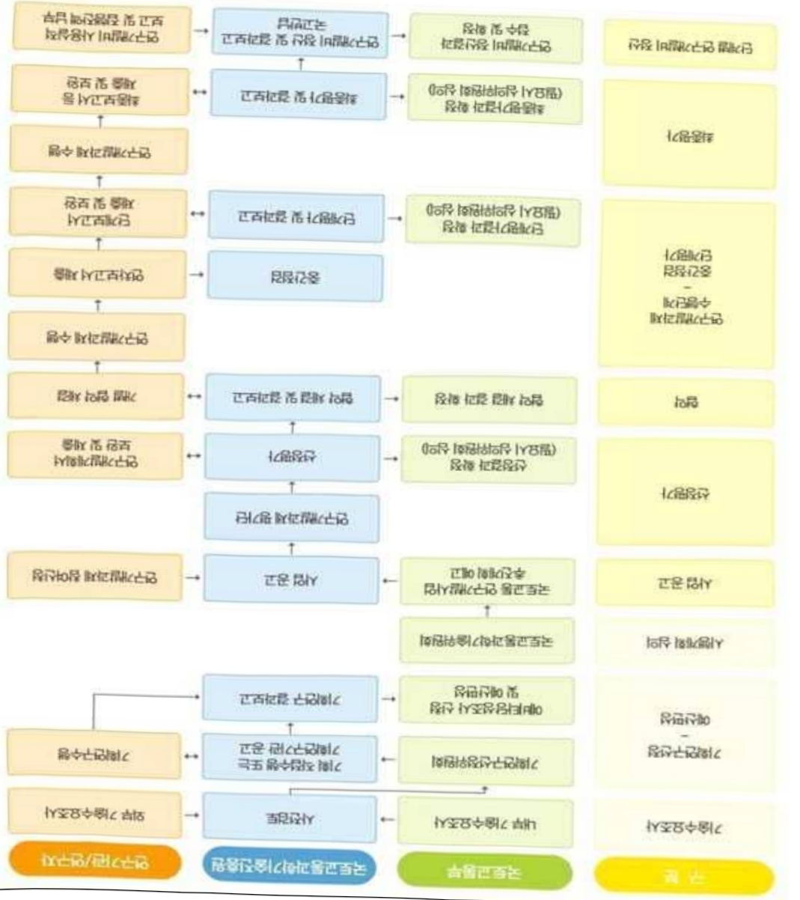
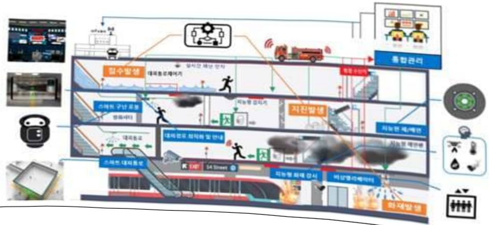

# 대심도장대터널(GTX등)의재난대응복합훈련장개발(R&D)

**해당 페이지**: PDF 2285 ~ 2295 쪽 해당

**부처**: 국토교통부
**분야**: 교통 및 물류
**회계유형**: 교통시설 특별회계
**2026 확정예산**: 8318.0 백만원
**전년대비 증감률**: 20.0%
**AI 도메인**: 건설/스마트시티, 재난/안전

---

### 가.예산 총괄표

(단위: 백만원, %)

<table border=1 style='margin: auto; word-wrap: break-word;'><tr><td rowspan="2">사업명</td><td rowspan="2">2024년 결산</td><td colspan="2">2025년 예산</td><td colspan="2">2026년</td><td rowspan="2">증감(B-A)</td><td rowspan="2">(B-A)/A</td></tr><tr><td style='text-align: center; word-wrap: break-word;'>본예산(A)</td><td style='text-align: center; word-wrap: break-word;'>추경</td><td style='text-align: center; word-wrap: break-word;'>정부안</td><td style='text-align: center; word-wrap: break-word;'>확정(B)</td></tr><tr><td style='text-align: center; word-wrap: break-word;'>대심도 장대터널(GTX 등)의 재난대응 복합훈련장개발(R&amp;D)</td><td style='text-align: center; word-wrap: break-word;'>2,776</td><td style='text-align: center; word-wrap: break-word;'>6,932</td><td style='text-align: center; word-wrap: break-word;'>6,932</td><td style='text-align: center; word-wrap: break-word;'>8,318</td><td style='text-align: center; word-wrap: break-word;'>8,318</td><td style='text-align: center; word-wrap: break-word;'>1,386</td><td style='text-align: center; word-wrap: break-word;'>20.0</td></tr></table>

□ 기능별(내역사업별), 목별 예산 내역

(단위:백만원)

<table border=1 style='margin: auto; word-wrap: break-word;'><tr><td rowspan="3"></td><td colspan="5">2024</td><td colspan="7">2025(2025.12월 말 기준)</td><td rowspan="3">2026예산</td></tr><tr><td rowspan="2">예산액(추정)</td><td rowspan="2">예산현액</td><td rowspan="2">집행액[실집행액]</td><td rowspan="2">이월액</td><td rowspan="2">불용액</td><td rowspan="2">본예산</td><td rowspan="2">예산현액</td><td rowspan="2">집행액[실집행액]</td><td colspan="2">전년도 이월액제외</td><td rowspan="2">이월예상액</td><td rowspan="2">불용예상액</td></tr><tr><td style='text-align: center; word-wrap: break-word;'>예산현액</td><td style='text-align: center; word-wrap: break-word;'>집행액[실집행액]</td></tr><tr><td style='text-align: center; word-wrap: break-word;'>○ 기능별 분류(합계)</td><td style='text-align: center; word-wrap: break-word;'>2,776</td><td style='text-align: center; word-wrap: break-word;'>2,776</td><td style='text-align: center; word-wrap: break-word;'>2,776[2776]</td><td style='text-align: center; word-wrap: break-word;'>-</td><td style='text-align: center; word-wrap: break-word;'>-</td><td style='text-align: center; word-wrap: break-word;'>6,932</td><td style='text-align: center; word-wrap: break-word;'>6,932</td><td style='text-align: center; word-wrap: break-word;'>6,932[6,932]</td><td style='text-align: center; word-wrap: break-word;'>6,932</td><td style='text-align: center; word-wrap: break-word;'>6,932[6,932]</td><td style='text-align: center; word-wrap: break-word;'>-</td><td style='text-align: center; word-wrap: break-word;'>-</td><td style='text-align: center; word-wrap: break-word;'>8,318</td></tr><tr><td style='text-align: center; word-wrap: break-word;'>· 대심도 장대터널(GTX 등)의 재난대응복합훈련장 개발</td><td style='text-align: center; word-wrap: break-word;'>2,776</td><td style='text-align: center; word-wrap: break-word;'>2,776</td><td style='text-align: center; word-wrap: break-word;'>2,776[2776]</td><td style='text-align: center; word-wrap: break-word;'>-</td><td style='text-align: center; word-wrap: break-word;'>-</td><td style='text-align: center; word-wrap: break-word;'>6,932</td><td style='text-align: center; word-wrap: break-word;'>6,932</td><td style='text-align: center; word-wrap: break-word;'>6,932[6,932]</td><td style='text-align: center; word-wrap: break-word;'>6,932</td><td style='text-align: center; word-wrap: break-word;'>6,932[6,932]</td><td style='text-align: center; word-wrap: break-word;'>-</td><td style='text-align: center; word-wrap: break-word;'>-</td><td style='text-align: center; word-wrap: break-word;'>8,318</td></tr><tr><td style='text-align: center; word-wrap: break-word;'>○ 비목별 분류(합계)</td><td style='text-align: center; word-wrap: break-word;'>2,776</td><td style='text-align: center; word-wrap: break-word;'>2,776</td><td style='text-align: center; word-wrap: break-word;'>2,776[2776]</td><td style='text-align: center; word-wrap: break-word;'>-</td><td style='text-align: center; word-wrap: break-word;'>-</td><td style='text-align: center; word-wrap: break-word;'>6,932</td><td style='text-align: center; word-wrap: break-word;'>6,932</td><td style='text-align: center; word-wrap: break-word;'>6,932[6,932]</td><td style='text-align: center; word-wrap: break-word;'>6,932</td><td style='text-align: center; word-wrap: break-word;'>6,932[6,932]</td><td style='text-align: center; word-wrap: break-word;'>-</td><td style='text-align: center; word-wrap: break-word;'>-</td><td style='text-align: center; word-wrap: break-word;'>8,318</td></tr><tr><td style='text-align: center; word-wrap: break-word;'>· 연 구 활 동 비 등(360-05)</td><td style='text-align: center; word-wrap: break-word;'>2,776</td><td style='text-align: center; word-wrap: break-word;'>2,776</td><td style='text-align: center; word-wrap: break-word;'>2,776[2776]</td><td style='text-align: center; word-wrap: break-word;'>-</td><td style='text-align: center; word-wrap: break-word;'>-</td><td style='text-align: center; word-wrap: break-word;'>6,932</td><td style='text-align: center; word-wrap: break-word;'>6,932</td><td style='text-align: center; word-wrap: break-word;'>6,932[6,932]</td><td style='text-align: center; word-wrap: break-word;'>6,932</td><td style='text-align: center; word-wrap: break-word;'>6,932[6,932]</td><td style='text-align: center; word-wrap: break-word;'>-</td><td style='text-align: center; word-wrap: break-word;'>-</td><td style='text-align: center; word-wrap: break-word;'>8,318</td></tr><tr><td style='text-align: center; word-wrap: break-word;'>○ 기능비목별 분류(합계)</td><td style='text-align: center; word-wrap: break-word;'>2,776</td><td style='text-align: center; word-wrap: break-word;'>2,776</td><td style='text-align: center; word-wrap: break-word;'>2,776[2776]</td><td style='text-align: center; word-wrap: break-word;'>-</td><td style='text-align: center; word-wrap: break-word;'>-</td><td style='text-align: center; word-wrap: break-word;'>6,932</td><td style='text-align: center; word-wrap: break-word;'>6,932</td><td style='text-align: center; word-wrap: break-word;'>6,932[6,932]</td><td style='text-align: center; word-wrap: break-word;'>6,932</td><td style='text-align: center; word-wrap: break-word;'>6,932[6,932]</td><td style='text-align: center; word-wrap: break-word;'>-</td><td style='text-align: center; word-wrap: break-word;'>-</td><td style='text-align: center; word-wrap: break-word;'>8,318</td></tr><tr><td rowspan="2">· 대심도 장대터널(GTX 등)의 재난대응복합훈련장 개발- 연 구 활 동 비 등(360-05)</td><td style='text-align: center; word-wrap: break-word;'>2,776</td><td style='text-align: center; word-wrap: break-word;'>2,776</td><td style='text-align: center; word-wrap: break-word;'>2,776[2776]</td><td style='text-align: center; word-wrap: break-word;'>-</td><td style='text-align: center; word-wrap: break-word;'>-</td><td style='text-align: center; word-wrap: break-word;'>6,932</td><td style='text-align: center; word-wrap: break-word;'>6,932</td><td style='text-align: center; word-wrap: break-word;'>6,932[6,932]</td><td style='text-align: center; word-wrap: break-word;'>6,932</td><td style='text-align: center; word-wrap: break-word;'>6,932[6,932]</td><td style='text-align: center; word-wrap: break-word;'>-</td><td style='text-align: center; word-wrap: break-word;'>-</td><td style='text-align: center; word-wrap: break-word;'>8,318</td></tr><tr><td style='text-align: center; word-wrap: break-word;'>2,776</td><td style='text-align: center; word-wrap: break-word;'>2,776</td><td style='text-align: center; word-wrap: break-word;'>2,776[2776]</td><td style='text-align: center; word-wrap: break-word;'>-</td><td style='text-align: center; word-wrap: break-word;'>-</td><td style='text-align: center; word-wrap: break-word;'>6,932</td><td style='text-align: center; word-wrap: break-word;'>6,932</td><td style='text-align: center; word-wrap: break-word;'>6,932[6,932]</td><td style='text-align: center; word-wrap: break-word;'>6,932</td><td style='text-align: center; word-wrap: break-word;'>6,932[6,932]</td><td style='text-align: center; word-wrap: break-word;'>-</td><td style='text-align: center; word-wrap: break-word;'>-</td><td style='text-align: center; word-wrap: break-word;'>8,318</td></tr></table>

---

### 나. 사업설명자료

## 1 ) 사업목적·내용

- (대심도 장대터널(GTX 등)의 재난대응 복합훈련장 개발) GTX 등 철도 대심도 지하시설에서 발생할 수 있는 고위험 재난에 대한 진단·대응 기술을 개발하여 철도 이용자의 안전 확보

- GTX 등 대심도 철도시설(복합역사 및 장대터널)에서 고위험 재난 발생시 이용자 대피 및 보호를 위한 재난 인지·예측·대응 기술 개발 및 실증

* 화재발생시 호흡이 가능한 안전지역 대피시간 3분 이내, 재난 인지·분석 정확도 90% 이상,

인명피해 저감율 30% 이상 달성 등

## 2 ) 사업개요

## □ 사업근거 및 추진경위

① 법령상 근거 및 조항 적시

° 국토교통과학기술육성법 제8조(연구개발사업의 추진)

· 제8조(연구개발사업의 추진) ① 국토교통부장관은 종합계획을 효율적으로 추진하기 위하여 국토교통과학기술 연구개발사업을 할 수 있다.

0 철도산업발전기본법

· 제11조(철도기술의 진흥 등) ① 국토교통부장관은 철도기술의 진흥 및 육성을 위하여 철도기술전반에 대한 연구 및 개발에 노력하여야 한다.

0 철도안전법

· 제68조(철도안전기술의 진흥) ① 국토교통부장관은 철도안전에 관한 기술의 진흥을 위하여 연구·개발의 촉진 및 그 성과의 보급 등 필요한 시책을 마련하여 추진하여야 한다.

o 국가통합교통체계효율화법

· 제98조(교통기술 연구·개발사업의 추진) ① 국토교통부장관은 교통기술의 연구 · 개발을 효율적으로 추진하기 위하여 연도별 · 분야별 교통기술 연구 · 개발과제를 선정하여 다음 각 호의 기관 또는 단체 등과 협약을 맺어 교통기술 연구 · 개발사업을 하게 할 수 있다.

② 추진경위 - 사업 시작년도, 추진배경, 부처별 중점과제, 대통령 공약사항 등

° '22.01 : '대심도 장대터널(GTX 등)의 재난대응 복합훈련장 개발' 과제 기획

---

° '23.01 : '대심도 장대터널(GTX 등)의 재난대응 복합훈련장 개발' 과제 공고

° '23.04 : '대심도 장대터널(GTX 등)의 재난대응 복합훈련장 개발' 과제 착수

° '24.12 : 선제적 예산 효율화 추진

* 실용화 가능성을 중심으로 연구내용 조정 및 총사업비 감액(350억→270억)

° '24.12 : '대심도 장대터널(GTX 등)의 재난대응 복합훈련장 개발' 과제 단계평가

주요내용

① 사업규모

- 총사업비(해당되는 경우에만 기재) : 해당없음

- 사업기간 : '23 ~ '27

- 최근 5년 간 투입된 사업비(예산액기준, 추경편성한 연도에는 추경포함)

<table border=1 style='margin: auto; word-wrap: break-word;'><tr><td style='text-align: center; word-wrap: break-word;'>연도</td><td style='text-align: center; word-wrap: break-word;'>2022</td><td style='text-align: center; word-wrap: break-word;'>2023</td><td style='text-align: center; word-wrap: break-word;'>2024</td><td style='text-align: center; word-wrap: break-word;'>2025</td><td style='text-align: center; word-wrap: break-word;'>2026</td></tr><tr><td style='text-align: center; word-wrap: break-word;'>사업비</td><td style='text-align: center; word-wrap: break-word;'>-</td><td style='text-align: center; word-wrap: break-word;'>1,617</td><td style='text-align: center; word-wrap: break-word;'>2,776</td><td style='text-align: center; word-wrap: break-word;'>6,932</td><td style='text-align: center; word-wrap: break-word;'>8,318</td></tr></table>

-기타: 해당없음

② 사업추진체계

- 사업시행방법 : 출연(참여기업이 있는 경우 Matching)

- 사업시행주체 : 국토교통부(전문기관 : 국토교통과학기술진흥원)

- 사업 수혜자 : 대학, 기업, 출연연 등

- 보조, 융자, 출연, 출자 등의 경우 보조·융자 등 지원 비율 및 법적근거

<table border=1 style='margin: auto; word-wrap: break-word;'><tr><td style='text-align: center; word-wrap: break-word;'>내역사업명</td><td style='text-align: center; word-wrap: break-word;'>구분</td><td style='text-align: center; word-wrap: break-word;'>피보조·피출연 등 기관명</td><td style='text-align: center; word-wrap: break-word;'>지원 금액 (2026예산)</td><td style='text-align: center; word-wrap: break-word;'>지원 비율(%)</td><td style='text-align: center; word-wrap: break-word;'>보조율 법적근거 (해당 조항)</td></tr><tr><td rowspan="3">대심도 장대터널 (GTX 등)의 재난대응 복합훈련장 개발(R&amp;D)</td><td rowspan="3">출연</td><td style='text-align: center; word-wrap: break-word;'>「중소기업기본법」제2조에 따른 중소기업에 해당하는 연구개발기관</td><td rowspan="3">8,318 백만원</td><td style='text-align: center; word-wrap: break-word;'>연구개발 비의 100분의 75 이하</td><td rowspan="3">「국가연구개발 혁신법 시행령」 제19조</td></tr><tr><td style='text-align: center; word-wrap: break-word;'>「중견기업 성장촉진 및 경쟁력 강화에 관한 특별법」제2조제1호에 따른 중견기업에 해당하는 연구개발기관</td><td style='text-align: center; word-wrap: break-word;'>연구개발 비의 100분의 70 이하</td></tr><tr><td style='text-align: center; word-wrap: break-word;'>「공공기관의 운영에 관한 법률」제5조제4항제1호에 따른 공기업에 해당하거나 ‘가’, ‘나’에 해당 해당하지 않는 연구개발기관</td><td style='text-align: center; word-wrap: break-word;'>연구개발 비의 100분의 50 이하</td></tr></table>

* 다만, 중앙행정기관의 장이 필요하다고 인정하는 국가연구개발사업에 대하여 별도로 정할 수 있음

---

## 3 ) 2026년도 예산 산출 근거

① 대심도 장대터널(GTX 등)의 재난대응 복합훈련장 개발

:(25)6,932백만원→(26 확정)8,318백만원,1,386백만원 증액

- (편성) 재난 인지·예측기법 최적화 기술 개발, 재난대응 시스템(6종) 시제품 제작 및 요소기술별 파일럿 테스트, 통합테스트베드 구축 및 통합안전관리시스템 설치 등의 필요성이 인정되어 소요예산 8,318백만원 예산 편성

- (산출) ① 재난상황 및 요구조자 위치 AI 인지·분석시스템(SW), 재난확산 예측 AI 시스템 개발, 지진 침수 위험도 평가 기법 개발 등 대심도 재난대응 인지예측 기술 개발 1,100백만원

② 내심노 새난내응시스템(6종) 시제품 제작, 통합안전관리시스템 개발 및 현장 실증용 테스트베드 구축 5,832백만원

③ 기존 역사방재시스템과 연계 및 기존 재난감시설비 센서망 추가 설치 등 통합안전관리 시스템 설치 및 성능 개선, 각 재난대응시스템 성능목표 검증을 위한 시험평가 등 1,386백만원

·(계속) 2개 ×4,159백만원 × 12/12 = 8,318백만원

2025년도 예산 및 2026년도 예산 산출 세부내역 비교

<table border=1 style='margin: auto; word-wrap: break-word;'><tr><td colspan="2">&#x27;25년 예산</td><td colspan="2">&#x27;26년 예산</td></tr><tr><td style='text-align: center; word-wrap: break-word;'>예산</td><td style='text-align: center; word-wrap: break-word;'>산출내역</td><td style='text-align: center; word-wrap: break-word;'>예산</td><td style='text-align: center; word-wrap: break-word;'>산출내역</td></tr><tr><td style='text-align: center; word-wrap: break-word;'>6,932 백만원</td><td style='text-align: center; word-wrap: break-word;'>○ 연구활동비 등(360-05): 6,932백만원가. 재난인지·예측·기술개발 (1,925백만원) • AI기반 재난상황 신속 인지 및 구조 대상자 위치/상황인지 인공지능 분석 모델 상세 설계 등 1식 x 1,925백만원나. 재난대응기술개발 (2,987백만원) • 재난대응 시스템 시작품 제작 등 1식 x 2,987백만원다. 통합안전관리시스템 개발 (2,020백만원) • 통합안전관리시스템 인터페이스 구조 상세 설계 등 1식 x 2,020백만원</td><td style='text-align: center; word-wrap: break-word;'>8,318 백만원</td><td style='text-align: center; word-wrap: break-word;'>○ 연구활동비 등(360-05): 8,318백만원가. 재난인지·예측·기술개발 (1,100백만원) • 재난상황 및 요구조자 위치 AI 인지·분석시스템(SW), 재난확산 예측 AI 시스템 개발, 지진침수 위험도 평가 기법 개발 등 1식 x 1,100백만원나. 재난대응기술개발 (5,832백만원) • 대심도 재난대응시스템(6종) 시제품 제작, 통합안전관리 시스템 개발 및 현장 실증용 테스트베드 구축 등 1식 x 5,832백만원다. 통합안전관리시스템 개발 (1,386백만원) • 기존 역사방재시스템과 연계 및 기존 재난감시설비 센서망 추가 설치 등 통합안전관리시스템 설치 및 성능 개선, 각 재난대응시스템 성능목표 검증을 위한 시험평가 등 1식 x 1,386백만원</td></tr></table>

---

## 4 ) 사업효과

☐ 사업영향, 산출물 성과지표 등

①2022~2026년도 성과계획서 상 성과지표 및 최근 5년간 성과 달성도

<table border=1 style='margin: auto; word-wrap: break-word;'><tr><td style='text-align: center; word-wrap: break-word;'>성과지표</td><td style='text-align: center; word-wrap: break-word;'>구분</td><td style='text-align: center; word-wrap: break-word;'>2023</td><td style='text-align: center; word-wrap: break-word;'>2024</td><td style='text-align: center; word-wrap: break-word;'>2025</td><td style='text-align: center; word-wrap: break-word;'>2026</td><td style='text-align: center; word-wrap: break-word;'>2027</td><td style='text-align: center; word-wrap: break-word;'>목표치</td><td colspan="4">산출근거</td><td style='text-align: center; word-wrap: break-word;'>측정산식(또는 측정방법)</td><td style='text-align: center; word-wrap: break-word;'>자료수집방법(또는 자료출처)</td></tr><tr><td rowspan="5">학술지개재</td><td style='text-align: center; word-wrap: break-word;'>목표</td><td style='text-align: center; word-wrap: break-word;'>-</td><td style='text-align: center; word-wrap: break-word;'>55.25</td><td style='text-align: center; word-wrap: break-word;'>55.80</td><td style='text-align: center; word-wrap: break-word;'>-</td><td style='text-align: center; word-wrap: break-word;'>-</td><td colspan="5">°(23년 목표) 23년도에는 기초연구 수행으로 학술지 관련 실적이 24년 도부터 발행해 머리 24년부터 목표지와 실적지 설정 0 (24-25년 목표 유사사업인 &#x27;철도기술연구사업의 최고 3년간(19-21년) 실적의 평균균으로 대비 1%의 상향하며 24년-25년 목표지 설정 *22년 논문실적은 23.9월 학생과기혁혁에 따라 최고 3년간(19-21년) 실적으로 상향[철도기술연구사업&amp;국가연구개발사업 학술지개재논문지수 실적]</td><td style='text-align: center; word-wrap: break-word;'>°학술지개재 논문지수 = 2(표준하면 순위보정명층에 지수)</td><td rowspan="5">범부처통합연구지원시스템(RIS), 국가과학기술지식정보서비스(NTIS)</td></tr><tr><td style='text-align: center; word-wrap: break-word;'>실적</td><td style='text-align: center; word-wrap: break-word;'>-</td><td style='text-align: center; word-wrap: break-word;'>68.36</td><td style='text-align: center; word-wrap: break-word;'>-</td><td style='text-align: center; word-wrap: break-word;'>-</td><td style='text-align: center; word-wrap: break-word;'>-</td><td style='text-align: center; word-wrap: break-word;'>구분</td><td style='text-align: center; word-wrap: break-word;'>19년</td><td style='text-align: center; word-wrap: break-word;'>20년</td><td style='text-align: center; word-wrap: break-word;'>21년</td><td style='text-align: center; word-wrap: break-word;'>평균</td><td style='text-align: center; word-wrap: break-word;'>연맹균증가율</td></tr><tr><td rowspan="3">달성도</td><td rowspan="3">-</td><td rowspan="3">123.7</td><td rowspan="3">-</td><td rowspan="3">-</td><td rowspan="3">-</td><td style='text-align: center; word-wrap: break-word;'>철도기술연구사업</td><td style='text-align: center; word-wrap: break-word;'>56.73</td><td style='text-align: center; word-wrap: break-word;'>58.32</td><td style='text-align: center; word-wrap: break-word;'>49.04</td><td style='text-align: center; word-wrap: break-word;'>54.7</td><td style='text-align: center; word-wrap: break-word;'>-7.02%</td></tr><tr><td style='text-align: center; word-wrap: break-word;'>국가연구개발사업</td><td style='text-align: center; word-wrap: break-word;'>65.25</td><td style='text-align: center; word-wrap: break-word;'>65.84</td><td style='text-align: center; word-wrap: break-word;'>65.25</td><td style='text-align: center; word-wrap: break-word;'>65.45</td><td style='text-align: center; word-wrap: break-word;'>0.00%</td></tr><tr><td colspan="6">* 자료: 2021년 국토교통 R&amp;D 사업 성과통계연보 KAIA, 2022.10</td></tr><tr><td rowspan="7">특허등급지수(1단계)</td><td style='text-align: center; word-wrap: break-word;'>목표</td><td style='text-align: center; word-wrap: break-word;'>-</td><td style='text-align: center; word-wrap: break-word;'>4.00</td><td style='text-align: center; word-wrap: break-word;'>4.09</td><td style='text-align: center; word-wrap: break-word;'>-</td><td style='text-align: center; word-wrap: break-word;'>-</td><td colspan="5">°(23년 목표) 23년도에는 기초연구 수행으로 특허 관련 실적이 24년도부터 발생해 머리 24년부터 목표지와 실적지 설정 °(24-25년 목표 유사사업인 &#x27;철도기술연구사업의 최고 3년간(19-21년) 실적의 평균균으로 대비 2.3%씩 상향하여 24년-25년 목표지 설정 *22년 특허실적은 23.9월 학생과기혁혁에 따라 최고 3년간(19-21년) 실적으로 상향[철도기술연구사업 특허등급지수 실적]</td><td style='text-align: center; word-wrap: break-word;'>°특허 등급 지수 =  $ \sum(A_i \times B_i) $</td><td rowspan="7">범부처통합연구지원시스템(RIS), 국가과학기술지식정보서비스(NTIS)</td></tr><tr><td rowspan="3">실적</td><td rowspan="3">-</td><td rowspan="3">5.6</td><td rowspan="3">-</td><td rowspan="3">-</td><td rowspan="3">-</td><td style='text-align: center; word-wrap: break-word;'>구분</td><td style='text-align: center; word-wrap: break-word;'>19년</td><td style='text-align: center; word-wrap: break-word;'>20년</td><td style='text-align: center; word-wrap: break-word;'>21년</td><td style='text-align: center; word-wrap: break-word;'>평균</td><td style='text-align: center; word-wrap: break-word;'>연맹균증가율</td></tr><tr><td style='text-align: center; word-wrap: break-word;'>철도기술연구사업</td><td style='text-align: center; word-wrap: break-word;'>3.78</td><td style='text-align: center; word-wrap: break-word;'>4.01</td><td style='text-align: center; word-wrap: break-word;'>3.95</td><td style='text-align: center; word-wrap: break-word;'>3.91</td><td style='text-align: center; word-wrap: break-word;'>2.3%</td></tr><tr><td colspan="6">* 자료: 2021년 국토교통 R&amp;D 사업 성과통계연보 KAIA, 2022.10</td></tr><tr><td rowspan="3">달성도</td><td rowspan="3">-</td><td rowspan="3">140</td><td rowspan="3">-</td><td rowspan="3">-</td><td rowspan="3">-</td><td colspan="6">유사사업인 &#x27;철도기술연구사업의 최고 3년간(19-21년)&#x27; 연맹균 증가율 (2.3%)를 반면 24년(4.00)을 기준으로 매년 2.3% 상향[철도기술연구사업 특허등급지수 목표]</td></tr><tr><td style='text-align: center; word-wrap: break-word;'>구분</td><td style='text-align: center; word-wrap: break-word;'>23년</td><td style='text-align: center; word-wrap: break-word;'>24년</td><td style='text-align: center; word-wrap: break-word;'>25년</td><td style='text-align: center; word-wrap: break-word;'>연맹균 증가율</td><td style='text-align: center; word-wrap: break-word;'></td></tr><tr><td style='text-align: center; word-wrap: break-word;'>목표</td><td style='text-align: center; word-wrap: break-word;'>-</td><td style='text-align: center; word-wrap: break-word;'>4.00</td><td style='text-align: center; word-wrap: break-word;'>4.09</td><td style='text-align: center; word-wrap: break-word;'>2.3%</td><td style='text-align: center; word-wrap: break-word;'></td></tr><tr><td rowspan="20">핵심기술화보</td><td rowspan="8">목표</td><td rowspan="8">9</td><td rowspan="8">10</td><td rowspan="8">11</td><td rowspan="8">-</td><td rowspan="8">-</td><td colspan="6">연구개발계획을 고려하여 3개단인지 ②재난예측, ③재난대응 등 핵심기술 확보를 위하여 아래와 같이 목표지를 설정</td><td rowspan="8">범부처통합연구지원시스템(RIS), 국가과학기술지식정보서비스(NTIS)</td></tr><tr><td style='text-align: center; word-wrap: break-word;'>구분</td><td style='text-align: center; word-wrap: break-word;'>23년</td><td style='text-align: center; word-wrap: break-word;'>24년</td><td style='text-align: center; word-wrap: break-word;'>25년</td><td rowspan="2">25년</td><td style='text-align: center; word-wrap: break-word;'></td></tr><tr><td style='text-align: center; word-wrap: break-word;'>성과를 적합성 평가서 및 성적서 (우적)</td><td style='text-align: center; word-wrap: break-word;'>9건 (9건)</td><td style='text-align: center; word-wrap: break-word;'>10건 (19건)</td><td style='text-align: center; word-wrap: break-word;'>11건 (30건)</td><td style='text-align: center; word-wrap: break-word;'></td></tr><tr><td colspan="6">※ &lt;참고&gt; 연차별 핵심기술 확보 달성 계획</td></tr><tr><td style='text-align: center; word-wrap: break-word;'>개발 목표</td><td style='text-align: center; word-wrap: break-word;'>23년</td><td style='text-align: center; word-wrap: break-word;'>24년</td><td style='text-align: center; word-wrap: break-word;'>25년</td><td rowspan="2">증빙자료</td><td style='text-align: center; word-wrap: break-word;'></td></tr><tr><td style='text-align: center; word-wrap: break-word;'>① 재난인지기술혁보</td><td style='text-align: center; word-wrap: break-word;'>2</td><td style='text-align: center; word-wrap: break-word;'>2</td><td style='text-align: center; word-wrap: break-word;'>2</td><td style='text-align: center; word-wrap: break-word;'></td></tr><tr><td style='text-align: center; word-wrap: break-word;'>- 재난인지 정확도 80%이상 확보</td><td style='text-align: center; word-wrap: break-word;'>기술조사 보고서</td><td style='text-align: center; word-wrap: break-word;'>시험 성적서 (70%)</td><td style='text-align: center; word-wrap: break-word;'>시험 성적서 (80%)</td><td style='text-align: center; word-wrap: break-word;'>기술조사 보고서 시험성적서 S/W등록증</td><td style='text-align: center; word-wrap: break-word;'></td></tr><tr><td style='text-align: center; word-wrap: break-word;'>- 요구조자 위치 분석 오차 10m 이내</td><td style='text-align: center; word-wrap: break-word;'>기술조사 보고서</td><td style='text-align: center; word-wrap: break-word;'>알고리즘 (SW)</td><td style='text-align: center; word-wrap: break-word;'>시험 성적서 (10m)</td><td style='text-align: center; word-wrap: break-word;'>시험 성적서 S/W등록</td><td style='text-align: center; word-wrap: break-word;'></td></tr><tr><td rowspan="12">실적</td><td rowspan="12">9</td><td rowspan="12">10</td><td rowspan="12">-</td><td rowspan="12">-</td><td rowspan="12">-</td><td style='text-align: center; word-wrap: break-word;'>② 재난이육기술혁보</td><td style='text-align: center; word-wrap: break-word;'>2</td><td style='text-align: center; word-wrap: break-word;'>2</td><td style='text-align: center; word-wrap: break-word;'>3</td><td style='text-align: center; word-wrap: break-word;'>기술분석 보고서 김사확인 (성적서 (500%쪽))</td><td rowspan="12">기술분석 보고서 김사확인 (성적서 (500%쪽))</td><td rowspan="12">범부처통합연구지원시스템(RIS), 국가과학기술지식정보서비스(NTIS) 시험성적서 등</td></tr><tr><td style='text-align: center; word-wrap: break-word;'>- 시뮬레이터 DB 500셋이상 확보</td><td style='text-align: center; word-wrap: break-word;'>기술조사 보고서</td><td style='text-align: center; word-wrap: break-word;'>김사확인 (성적서 (200쪽))</td><td style='text-align: center; word-wrap: break-word;'>김사확인 (성적서 (500%쪽))</td><td style='text-align: center; word-wrap: break-word;'>김사확인 (성적서 (500%쪽))</td></tr><tr><td style='text-align: center; word-wrap: break-word;'>- 확산예측 데이터 확장률 10에 이상</td><td style='text-align: center; word-wrap: break-word;'>기술분석 보고서</td><td style='text-align: center; word-wrap: break-word;'>알고리즘 (SW)</td><td style='text-align: center; word-wrap: break-word;'>시험 성적서(10배)</td><td style='text-align: center; word-wrap: break-word;'>시험성적서 S/W등록</td></tr><tr><td style='text-align: center; word-wrap: break-word;'>- 재난확산 예측 정확도 70% 확보</td><td style='text-align: center; word-wrap: break-word;'>-</td><td style='text-align: center; word-wrap: break-word;'>-</td><td style='text-align: center; word-wrap: break-word;'>확산예측 (SW)</td><td style='text-align: center; word-wrap: break-word;'>확산예측 (SW)</td></tr><tr><td style='text-align: center; word-wrap: break-word;'>③ 재난대응기술혁보</td><td style='text-align: center; word-wrap: break-word;'>5</td><td style='text-align: center; word-wrap: break-word;'>6</td><td style='text-align: center; word-wrap: break-word;'>6</td><td style='text-align: center; word-wrap: break-word;'>기술분석 보고서</td></tr><tr><td style='text-align: center; word-wrap: break-word;'>- 경로 최적화 대피시간 20% 단축</td><td style='text-align: center; word-wrap: break-word;'>기술조사 보고서</td><td style='text-align: center; word-wrap: break-word;'>알고리즘 (SW)</td><td style='text-align: center; word-wrap: break-word;'>시험 성적서 (20%</td><td style='text-align: center; word-wrap: break-word;'>시험 성적서 (20%</td></tr><tr><td style='text-align: center; word-wrap: break-word;'>- 스마트 대피통로 작동시간 40초 이내</td><td style='text-align: center; word-wrap: break-word;'>기술설계 보고서</td><td style='text-align: center; word-wrap: break-word;'>시작품 (60초)</td><td style='text-align: center; word-wrap: break-word;'>시작품 (40초)</td><td style='text-align: center; word-wrap: break-word;'>시작품 (40초)</td></tr><tr><td style='text-align: center; word-wrap: break-word;'>- 파빈EV 과제시스템 정확도 85% 이상 확보</td><td style='text-align: center; word-wrap: break-word;'>기술조사 보고서</td><td style='text-align: center; word-wrap: break-word;'>시작품</td><td style='text-align: center; word-wrap: break-word;'>시험 성적서 (85%</td><td style='text-align: center; word-wrap: break-word;'>시험 성적서 보고서</td></tr><tr><td style='text-align: center; word-wrap: break-word;'>- 요구조자 위치 탐색 정질도 4m 이내</td><td style='text-align: center; word-wrap: break-word;'>기술조사 보고서</td><td style='text-align: center; word-wrap: break-word;'>시작품</td><td style='text-align: center; word-wrap: break-word;'>시험 성적서 (4m)</td><td style='text-align: center; word-wrap: break-word;'>시험 성적서 S/W등록</td></tr><tr><td style='text-align: center; word-wrap: break-word;'>- 송용모를 가면제어 정질도 90% 확보</td><td style='text-align: center; word-wrap: break-word;'>기술조사 보고서</td><td style='text-align: center; word-wrap: break-word;'>시작품</td><td style='text-align: center; word-wrap: break-word;'>시험 성적서 (90%</td><td style='text-align: center; word-wrap: break-word;'>시험 성적서</td></tr><tr><td style='text-align: center; word-wrap: break-word;'>- 자진/참수 파녀응 VR 현실감 80% 확보</td><td style='text-align: center; word-wrap: break-word;'>-</td><td style='text-align: center; word-wrap: break-word;'>설계 보고서</td><td style='text-align: center; word-wrap: break-word;'>시작품 (80%</td><td style='text-align: center; word-wrap: break-word;'>시작품</td></tr><tr><td style='text-align: center; word-wrap: break-word;'>합격</td><td style='text-align: center; word-wrap: break-word;'>9</td><td style='text-align: center; word-wrap: break-word;'>10</td><td style='text-align: center; word-wrap: break-word;'>11</td><td style='text-align: center; word-wrap: break-word;'>-</td></tr></table>

---

<table border=1 style='margin: auto; word-wrap: break-word;'><tr><td style='text-align: center; word-wrap: break-word;'>성과지표</td><td style='text-align: center; word-wrap: break-word;'>구분</td><td style='text-align: center; word-wrap: break-word;'>2023</td><td style='text-align: center; word-wrap: break-word;'>2024</td><td style='text-align: center; word-wrap: break-word;'>2025</td><td style='text-align: center; word-wrap: break-word;'>2026</td><td style='text-align: center; word-wrap: break-word;'>2027</td><td style='text-align: center; word-wrap: break-word;'>목표치</td><td colspan="3">산출근거</td><td style='text-align: center; word-wrap: break-word;'>측정산식(또는 측정방법)</td><td style='text-align: center; word-wrap: break-word;'>자료수집방법(또는 자료출처)</td><td style='text-align: center; word-wrap: break-word;'></td><td style='text-align: center; word-wrap: break-word;'></td><td style='text-align: center; word-wrap: break-word;'></td><td style='text-align: center; word-wrap: break-word;'></td></tr><tr><td rowspan="14">통합관리시스템성능확보</td><td rowspan="14">목표</td><td rowspan="14">-</td><td rowspan="14">-</td><td rowspan="14">-</td><td rowspan="14">4</td><td rowspan="14">5</td><td colspan="3">연구개발계획을 고려하여 대상도 철도시설 재난 대응 통합관리시스템 구축을 위하여 이례와 같이 목표치 설정(농 사업 통합관리시스템 구축 및 현장 감축 목표)</td><td rowspan="4">이론</td><td rowspan="14">이론</td><td rowspan="14">이론</td><td style='text-align: center; word-wrap: break-word;'></td><td style='text-align: center; word-wrap: break-word;'></td><td style='text-align: center; word-wrap: break-word;'></td><td style='text-align: center; word-wrap: break-word;'></td></tr><tr><td style='text-align: center; word-wrap: break-word;'>구분</td><td style='text-align: center; word-wrap: break-word;'>&#x27;26년</td><td style='text-align: center; word-wrap: break-word;'>&#x27;27년</td><td style='text-align: center; word-wrap: break-word;'></td><td style='text-align: center; word-wrap: break-word;'></td><td style='text-align: center; word-wrap: break-word;'></td><td style='text-align: center; word-wrap: break-word;'></td></tr><tr><td style='text-align: center; word-wrap: break-word;'>성과를 시행성적시 목표건수(누적)</td><td style='text-align: center; word-wrap: break-word;'>4건(42건)</td><td style='text-align: center; word-wrap: break-word;'>5건(9건)</td><td style='text-align: center; word-wrap: break-word;'></td><td style='text-align: center; word-wrap: break-word;'></td><td style='text-align: center; word-wrap: break-word;'></td><td style='text-align: center; word-wrap: break-word;'></td></tr><tr><td colspan="3">※ &lt;참고&gt; 연차별 성능감증 계획</td><td style='text-align: center; word-wrap: break-word;'></td><td style='text-align: center; word-wrap: break-word;'></td><td style='text-align: center; word-wrap: break-word;'></td><td style='text-align: center; word-wrap: break-word;'></td></tr><tr><td style='text-align: center; word-wrap: break-word;'>개발 목표</td><td style='text-align: center; word-wrap: break-word;'>&#x27;26년</td><td style='text-align: center; word-wrap: break-word;'>&#x27;27년</td><td rowspan="2">증빙자료</td><td style='text-align: center; word-wrap: break-word;'></td><td style='text-align: center; word-wrap: break-word;'></td><td style='text-align: center; word-wrap: break-word;'></td><td style='text-align: center; word-wrap: break-word;'></td></tr><tr><td style='text-align: center; word-wrap: break-word;'>① 통합관리시스템 개발</td><td style='text-align: center; word-wrap: break-word;'>1</td><td style='text-align: center; word-wrap: break-word;'>2</td><td style='text-align: center; word-wrap: break-word;'></td><td style='text-align: center; word-wrap: break-word;'></td><td style='text-align: center; word-wrap: break-word;'></td><td style='text-align: center; word-wrap: break-word;'></td></tr><tr><td style='text-align: center; word-wrap: break-word;'>- 재산감지 분석데이터 가시화 처리 속도 5초 이내</td><td style='text-align: center; word-wrap: break-word;'>-</td><td style='text-align: center; word-wrap: break-word;'>시험 성적서(5초)</td><td rowspan="3">시험성적서, 감춤(성적) 확인서</td><td style='text-align: center; word-wrap: break-word;'></td><td style='text-align: center; word-wrap: break-word;'></td><td style='text-align: center; word-wrap: break-word;'></td><td style='text-align: center; word-wrap: break-word;'></td></tr><tr><td style='text-align: center; word-wrap: break-word;'>- 현장 상황정보 경신기 10초 이내</td><td style='text-align: center; word-wrap: break-word;'>감축확인(성적서(15초))</td><td style='text-align: center; word-wrap: break-word;'>시험 성적서(10초)</td><td style='text-align: center; word-wrap: break-word;'></td><td style='text-align: center; word-wrap: break-word;'></td><td style='text-align: center; word-wrap: break-word;'></td><td style='text-align: center; word-wrap: break-word;'></td></tr><tr><td style='text-align: center; word-wrap: break-word;'>② 통합관리시스템 테스트메드 설치</td><td style='text-align: center; word-wrap: break-word;'>2</td><td style='text-align: center; word-wrap: break-word;'>2</td><td style='text-align: center; word-wrap: break-word;'></td><td style='text-align: center; word-wrap: break-word;'></td><td style='text-align: center; word-wrap: break-word;'></td><td style='text-align: center; word-wrap: break-word;'></td></tr><tr><td style='text-align: center; word-wrap: break-word;'>- 통합관리시스템 테스트메드 연동</td><td style='text-align: center; word-wrap: break-word;'>현장감축 확인서(설치)</td><td style='text-align: center; word-wrap: break-word;'>시험 성적서(성능개선)</td><td rowspan="4">현장감축 확인서, 시험성적서</td><td style='text-align: center; word-wrap: break-word;'></td><td style='text-align: center; word-wrap: break-word;'></td><td style='text-align: center; word-wrap: break-word;'></td><td style='text-align: center; word-wrap: break-word;'></td></tr><tr><td style='text-align: center; word-wrap: break-word;'>- 통합관리시스템 운영관리기술개발</td><td style='text-align: center; word-wrap: break-word;'>현장 확인서(작동)</td><td style='text-align: center; word-wrap: break-word;'>시험 성적서(성능개선)</td><td style='text-align: center; word-wrap: break-word;'></td><td style='text-align: center; word-wrap: break-word;'></td><td style='text-align: center; word-wrap: break-word;'></td><td style='text-align: center; word-wrap: break-word;'></td></tr><tr><td style='text-align: center; word-wrap: break-word;'>③ 통합관리시스템 성능 감축</td><td style='text-align: center; word-wrap: break-word;'>1</td><td style='text-align: center; word-wrap: break-word;'>1</td><td style='text-align: center; word-wrap: break-word;'></td><td style='text-align: center; word-wrap: break-word;'></td><td style='text-align: center; word-wrap: break-word;'></td><td style='text-align: center; word-wrap: break-word;'></td></tr><tr><td style='text-align: center; word-wrap: break-word;'>- 통합관리시스템 현장 실증 성능 감축(대피시간 단축)</td><td style='text-align: center; word-wrap: break-word;'>시험 성적서(10%)</td><td style='text-align: center; word-wrap: break-word;'>시험 성적서(20%)</td><td style='text-align: center; word-wrap: break-word;'></td><td style='text-align: center; word-wrap: break-word;'></td><td style='text-align: center; word-wrap: break-word;'></td><td style='text-align: center; word-wrap: break-word;'></td></tr><tr><td style='text-align: center; word-wrap: break-word;'>함께</td><td style='text-align: center; word-wrap: break-word;'>4</td><td style='text-align: center; word-wrap: break-word;'>5</td><td style='text-align: center; word-wrap: break-word;'>-</td><td style='text-align: center; word-wrap: break-word;'></td><td style='text-align: center; word-wrap: break-word;'></td><td style='text-align: center; word-wrap: break-word;'></td><td style='text-align: center; word-wrap: break-word;'></td></tr><tr><td rowspan="8">특허등급지수(2단계)</td><td rowspan="8">목표</td><td rowspan="8">-</td><td rowspan="8">-</td><td rowspan="8">-</td><td rowspan="8">4.18</td><td rowspan="8">4.28</td><td colspan="3">○ (증가율) 유사사업인 &#x27;철도기술연구사업의 최근 3년간(19~21년)&#x27; 실적의 평균값으로 대비 2.3%씩 상향하여 26년~27년 목표지설정 * 22년 특허실적은 239를 확보하기(위험에 따라 최근 3년간(19~21년) 실적으로 상향(철도기술연구사업 특허등급지수 실적)</td><td style='text-align: center; word-wrap: break-word;'>이론</td><td style='text-align: center; word-wrap: break-word;'>이론</td><td style='text-align: center; word-wrap: break-word;'>이론</td><td style='text-align: center; word-wrap: break-word;'>이론</td><td style='text-align: center; word-wrap: break-word;'>이론</td><td style='text-align: center; word-wrap: break-word;'></td><td style='text-align: center; word-wrap: break-word;'></td></tr><tr><td style='text-align: center; word-wrap: break-word;'>구분</td><td style='text-align: center; word-wrap: break-word;'>&#x27;19년</td><td style='text-align: center; word-wrap: break-word;'>&#x27;20년</td><td style='text-align: center; word-wrap: break-word;'>&#x27;21년</td><td style='text-align: center; word-wrap: break-word;'>&#x27;22년</td><td style='text-align: center; word-wrap: break-word;'></td><td style='text-align: center; word-wrap: break-word;'></td><td style='text-align: center; word-wrap: break-word;'></td><td style='text-align: center; word-wrap: break-word;'></td><td style='text-align: center; word-wrap: break-word;'></td></tr><tr><td style='text-align: center; word-wrap: break-word;'>철도기술연구사업 3.78</td><td style='text-align: center; word-wrap: break-word;'>4.01</td><td style='text-align: center; word-wrap: break-word;'>3.95</td><td style='text-align: center; word-wrap: break-word;'>3.91</td><td style='text-align: center; word-wrap: break-word;'>3.93</td><td style='text-align: center; word-wrap: break-word;'></td><td style='text-align: center; word-wrap: break-word;'></td><td style='text-align: center; word-wrap: break-word;'></td><td style='text-align: center; word-wrap: break-word;'></td><td style='text-align: center; word-wrap: break-word;'></td></tr><tr><td colspan="3">* 자료: 2021년 국토교통 R&amp;D 사업 성과통계연보, KAIA, 2022.10 유사사업인 &#x27;철도기술연구사업의 최근 3년간(19~21년)&#x27; 연평균 증가율(2.3%율 반영, 24년(4.00)을 기준으로 매년 2.3% 상향(철도기술연구사업의 최근 3년간(19~21년) 실적)기준 등 재개정안이 성과물로 도출되고 이를 확인하기 위해 매년 정책 반영을 40% 이상 재개정되는 것으로 국토교통연구개발사업 정책 재택을 8%(21년 기준) 대비 매년 도전적인 목표 설정</td><td style='text-align: center; word-wrap: break-word;'>이론</td><td style='text-align: center; word-wrap: break-word;'>이론</td><td style='text-align: center; word-wrap: break-word;'>이론</td><td style='text-align: center; word-wrap: break-word;'>이론</td><td style='text-align: center; word-wrap: break-word;'>이론</td><td style='text-align: center; word-wrap: break-word;'>이론</td><td style='text-align: center; word-wrap: break-word;'>이론</td></tr><tr><td style='text-align: center; word-wrap: break-word;'>구분</td><td style='text-align: center; word-wrap: break-word;'>&#x27;26년</td><td style='text-align: center; word-wrap: break-word;'>&#x27;27년</td><td style='text-align: center; word-wrap: break-word;'>&#x27;28년</td><td style='text-align: center; word-wrap: break-word;'>&#x27;29년</td><td style='text-align: center; word-wrap: break-word;'></td><td style='text-align: center; word-wrap: break-word;'></td><td style='text-align: center; word-wrap: break-word;'></td><td style='text-align: center; word-wrap: break-word;'></td><td style='text-align: center; word-wrap: break-word;'></td></tr><tr><td style='text-align: center; word-wrap: break-word;'>목표</td><td style='text-align: center; word-wrap: break-word;'>4.18</td><td style='text-align: center; word-wrap: break-word;'>4.28</td><td style='text-align: center; word-wrap: break-word;'>4.28</td><td style='text-align: center; word-wrap: break-word;'>4.30</td><td style='text-align: center; word-wrap: break-word;'></td><td style='text-align: center; word-wrap: break-word;'></td><td style='text-align: center; word-wrap: break-word;'></td><td style='text-align: center; word-wrap: break-word;'></td><td style='text-align: center; word-wrap: break-word;'></td></tr><tr><td style='text-align: center; word-wrap: break-word;'>목표</td><td style='text-align: center; word-wrap: break-word;'>4.18</td><td style='text-align: center; word-wrap: break-word;'>4.28</td><td style='text-align: center; word-wrap: break-word;'>4.28</td><td style='text-align: center; word-wrap: break-word;'>4.30</td><td style='text-align: center; word-wrap: break-word;'></td><td style='text-align: center; word-wrap: break-word;'></td><td style='text-align: center; word-wrap: break-word;'></td><td style='text-align: center; word-wrap: break-word;'></td><td style='text-align: center; word-wrap: break-word;'></td></tr><tr><td style='text-align: center; word-wrap: break-word;'>목표</td><td style='text-align: center; word-wrap: break-word;'>4.18</td><td style='text-align: center; word-wrap: break-word;'>4.28</td><td style='text-align: center; word-wrap: break-word;'>4.28</td><td style='text-align: center; word-wrap: break-word;'>4.30</td><td style='text-align: center; word-wrap: break-word;'></td><td style='text-align: center; word-wrap: break-word;'></td><td style='text-align: center; word-wrap: break-word;'></td><td style='text-align: center; word-wrap: break-word;'></td><td style='text-align: center; word-wrap: break-word;'></td></tr><tr><td rowspan="5">정책활용도</td><td rowspan="5">목표</td><td rowspan="4">-</td><td rowspan="4">-</td><td rowspan="4">-</td><td rowspan="4">40.0</td><td rowspan="4">40.0</td><td colspan="3">연구목표 달성을 위해 철도 시설 재난 대응 관련 법제도, 매뉴얼 지침 설계기준 등 재개정안이 성과물로 도출되고 이를 확인하기 위해 매년 정책 반영을 40% 이상 재개정되는 것으로 국토교통연구개발사업 정책 재택을 8%(21년 기준) 대비 매년 도전적인 목표 설정</td><td style='text-align: center; word-wrap: break-word;'>이론</td><td style='text-align: center; word-wrap: break-word;'>이론</td><td style='text-align: center; word-wrap: break-word;'>이론</td><td style='text-align: center; word-wrap: break-word;'>이론</td><td style='text-align: center; word-wrap: break-word;'></td><td style='text-align: center; word-wrap: break-word;'></td><td style='text-align: center; word-wrap: break-word;'></td></tr><tr><td style='text-align: center; word-wrap: break-word;'>구분</td><td style='text-align: center; word-wrap: break-word;'>4.18</td><td style='text-align: center; word-wrap: break-word;'>4.28</td><td style='text-align: center; word-wrap: break-word;'>4.28</td><td style='text-align: center; word-wrap: break-word;'>4.30</td><td style='text-align: center; word-wrap: break-word;'></td><td style='text-align: center; word-wrap: break-word;'></td><td style='text-align: center; word-wrap: break-word;'></td><td style='text-align: center; word-wrap: break-word;'></td><td style='text-align: center; word-wrap: break-word;'></td></tr><tr><td colspan="3">국토교통연구개발사업 정책 재택율</td><td style='text-align: center; word-wrap: break-word;'>이론</td><td style='text-align: center; word-wrap: break-word;'>이론</td><td style='text-align: center; word-wrap: break-word;'></td><td style='text-align: center; word-wrap: break-word;'></td><td style='text-align: center; word-wrap: break-word;'></td><td style='text-align: center; word-wrap: break-word;'></td><td style='text-align: center; word-wrap: break-word;'></td></tr><tr><td style='text-align: center; word-wrap: break-word;'>구분</td><td style='text-align: center; word-wrap: break-word;'>4.18</td><td style='text-align: center; word-wrap: break-word;'>4.28</td><td style='text-align: center; word-wrap: break-word;'>4.28</td><td style='text-align: center; word-wrap: break-word;'>4.30</td><td style='text-align: center; word-wrap: break-word;'></td><td style='text-align: center; word-wrap: break-word;'></td><td style='text-align: center; word-wrap: break-word;'></td><td style='text-align: center; word-wrap: break-word;'></td><td style='text-align: center; word-wrap: break-word;'></td></tr><tr><td style='text-align: center; word-wrap: break-word;'></td><td style='text-align: center; word-wrap: break-word;'></td><td style='text-align: center; word-wrap: break-word;'></td><td style='text-align: center; word-wrap: break-word;'></td><td style='text-align: center; word-wrap: break-word;'></td><td style='text-align: center; word-wrap: break-word;'></td><td style='text-align: center; word-wrap: break-word;'></td><td style='text-align: center; word-wrap: break-word;'></td><td style='text-align: center; word-wrap: break-word;'></td><td style='text-align: center; word-wrap: break-word;'></td><td style='text-align: center; word-wrap: break-word;'></td><td style='text-align: center; word-wrap: break-word;'></td><td style='text-align: center; word-wrap: break-word;'></td><td style='text-align: center; word-wrap: break-word;'></td><td style='text-align: center; word-wrap: break-word;'></td></tr></table>

---

<table border=1 style='margin: auto; word-wrap: break-word;'><tr><td style='text-align: center; word-wrap: break-word;'>성과지표</td><td style='text-align: center; word-wrap: break-word;'>구분</td><td style='text-align: center; word-wrap: break-word;'>2023</td><td style='text-align: center; word-wrap: break-word;'>2024</td><td style='text-align: center; word-wrap: break-word;'>2025</td><td style='text-align: center; word-wrap: break-word;'>2026</td><td style='text-align: center; word-wrap: break-word;'>2027</td><td colspan="4">목표치 산출근거</td><td style='text-align: center; word-wrap: break-word;'>측정산식(또는 측정방법)</td><td style='text-align: center; word-wrap: break-word;'>자료수집방법(또는 자료출처)</td></tr><tr><td rowspan="10"></td><td rowspan="3"></td><td rowspan="3"></td><td rowspan="3"></td><td rowspan="3"></td><td rowspan="3"></td><td rowspan="3"></td><td colspan="4">[동 사업 기술실시계약건수 목표]</td><td rowspan="5"></td><td rowspan="10"></td></tr><tr><td style='text-align: center; word-wrap: break-word;'>구분</td><td style='text-align: center; word-wrap: break-word;'>&#x27;26년</td><td colspan="2">&#x27;27년</td></tr><tr><td style='text-align: center; word-wrap: break-word;'>예산(억원)</td><td style='text-align: center; word-wrap: break-word;'>75.00</td><td colspan="2">48.60</td></tr><tr><td rowspan="7">달성도</td><td rowspan="7"></td><td rowspan="7"></td><td rowspan="7"></td><td rowspan="7"></td><td rowspan="7"></td><td style='text-align: center; word-wrap: break-word;'>목표 건수(건)</td><td style='text-align: center; word-wrap: break-word;'>7</td><td colspan="2">4</td></tr><tr><td colspan="4">[철도기술연구사업 기술실시계약건수 실적]</td></tr><tr><td style='text-align: center; word-wrap: break-word;'>구분</td><td style='text-align: center; word-wrap: break-word;'>&#x27;19년</td><td style='text-align: center; word-wrap: break-word;'>&#x27;20년</td><td style='text-align: center; word-wrap: break-word;'>&#x27;21년</td><td style='text-align: center; word-wrap: break-word;'>평균</td></tr><tr><td style='text-align: center; word-wrap: break-word;'>사업 예산(억원)</td><td style='text-align: center; word-wrap: break-word;'>780.49</td><td style='text-align: center; word-wrap: break-word;'>500.53</td><td style='text-align: center; word-wrap: break-word;'>217.06</td><td style='text-align: center; word-wrap: break-word;'>499.36</td></tr><tr><td style='text-align: center; word-wrap: break-word;'>기술실시계약 건수(건)</td><td style='text-align: center; word-wrap: break-word;'>34</td><td style='text-align: center; word-wrap: break-word;'>43</td><td style='text-align: center; word-wrap: break-word;'>30</td><td style='text-align: center; word-wrap: break-word;'>35</td></tr><tr><td style='text-align: center; word-wrap: break-word;'>100억원 당 기술실시계약 건수(건)</td><td style='text-align: center; word-wrap: break-word;'>4</td><td style='text-align: center; word-wrap: break-word;'>9</td><td style='text-align: center; word-wrap: break-word;'>14</td><td style='text-align: center; word-wrap: break-word;'>9</td></tr><tr><td colspan="5">* 자료: 2021년 국토교통 R&amp;D 사업 성과통계연보, KAIA, 2022.10</td></tr></table>

## ② 성과지표 이외의 연도별 사업추진 경과 및 실적

<table border=1 style='margin: auto; word-wrap: break-word;'><tr><td style='text-align: center; word-wrap: break-word;'>2023</td><td style='text-align: center; word-wrap: break-word;'>고위험 재난 인지·예측·대응 시스템 개발을 위한 DB 구축·분석, 시나리오 설계, AI기반 재난대응 시스템 기본설계 등</td></tr><tr><td style='text-align: center; word-wrap: break-word;'>2024</td><td style='text-align: center; word-wrap: break-word;'>AI기반 재난상황 신속 인지 및 구조 대상자 상황인지 인공지능 분석 모델 기본 설계, 재난대응 시스템 상세설계 등</td></tr><tr><td style='text-align: center; word-wrap: break-word;'>2025</td><td style='text-align: center; word-wrap: break-word;'>AI기반 재난상황 신속 인지 및 구조 대상자 위치/상황인지 인공지능 분석 모델 상세 설계, 통합안전관리시스템 인터페이스 구조 상세 설계, 스마트 재난대응 시스템(6종) 시작품 제작 및 요소기술별 테스트베드 설치 등 * 스마트대피통로(GTX A 서울역 구간), 이동형영상감시시스템(인천시청역 승강장 구간) 설치 등</td></tr></table>

## ③향후(2026년도 이후)기대효과

철도 재난 발생에 따른 손실비용을 절감하고, 대심도 철도시설의 재난 위험도 관리역량 향상으로 철도교통에 대한 국민 신뢰도 증진 및 정부·지자체 지하공간 활용 정책 지원

- 지하공간 활용가치 제고에 기여하고, 고위험 재난(화재·지진·침수) 발생에 따른

막대한 경제적·산업적 손실 예방

* (참고) 대구 지하철 사고 : 150여명 사망, 약 7,053억원 재산피해 발생

0 인공지능, 디지털트런 등 첨단 기술 반영 지하공간 재난대응 신기술 개발로 방재 기술 국제선도 및 첨단 방재기술의 타산업분야 확대 적용

## 5 ) 타당성조사 및 예비타당성조사 시행여부 및 결과 요지 : 해당없음

## 6 ) 총사업비 대상사업 여부 및 내역 : 해당없음

---

<table border=1 style='margin: auto; word-wrap: break-word;'><tr><td style='text-align: center; word-wrap: break-word;'>부처</td><td style='text-align: center; word-wrap: break-word;'></td><td style='text-align: center; word-wrap: break-word;'>피출연·피보조기관</td><td style='text-align: center; word-wrap: break-word;'></td><td style='text-align: center; word-wrap: break-word;'>간접보조사업자·사업수행자</td></tr><tr><td style='text-align: center; word-wrap: break-word;'>국토교통부(8,318백만원)</td><td style='text-align: center; word-wrap: break-word;'>=&gt;(8,318백만원)</td><td style='text-align: center; word-wrap: break-word;'>국토교통과학기술진흥원(8,318백만원)</td><td style='text-align: center; word-wrap: break-word;'>=&gt;(8,318백만원)</td><td style='text-align: center; word-wrap: break-word;'>한국철도기술연구원의 19개기관</td></tr></table>

<대심도 장대터널(GTX 등)의 재난대응 복합훈련장 개발>

---

8) 중기재정계획 상 연도별 투자계획 및 추진경과

(단위: 백만원)

<table border=1 style='margin: auto; word-wrap: break-word;'><tr><td style='text-align: center; word-wrap: break-word;'>2024</td><td style='text-align: center; word-wrap: break-word;'>2025</td><td style='text-align: center; word-wrap: break-word;'>2026</td><td style='text-align: center; word-wrap: break-word;'>2027</td><td style='text-align: center; word-wrap: break-word;'>2028</td><td style='text-align: center; word-wrap: break-word;'>2029</td></tr><tr><td style='text-align: center; word-wrap: break-word;'>2024~2028</td><td style='text-align: center; word-wrap: break-word;'>2,776</td><td style='text-align: center; word-wrap: break-word;'>6,932</td><td style='text-align: center; word-wrap: break-word;'>11,124</td><td style='text-align: center; word-wrap: break-word;'>8,120</td><td style='text-align: center; word-wrap: break-word;'>-</td></tr><tr><td style='text-align: center; word-wrap: break-word;'>2025~2029</td><td style='text-align: center; word-wrap: break-word;'>6,932</td><td style='text-align: center; word-wrap: break-word;'>8,318</td><td style='text-align: center; word-wrap: break-word;'>7,357</td><td style='text-align: center; word-wrap: break-word;'>-</td><td style='text-align: center; word-wrap: break-word;'>-</td></tr></table>

9) 최근 3년간 동 사업에 대한 주요 외부지적사항 및 평가, 문제점 및 대책 : 해당없음

## 10 ) 향후 추진방향 및 추진계획

☐ 철도지하화 정책에 따른 GTX등 대심도 철도시설(복합역사 및 장대터널)에서 고위험 재난 발생 시 이용자 대피 및 보호를 위한 재난 인지·예측·대응 기술 개발 및 실증

(재난 인지·예측 기술개발) AI기반 다양한 재난 멀티모달 신호(열, 연기, 가스 등)를 응

합분석하여 재난 상황을 인지하고, 확산 정도를 진단·예측하는 기술 개발

※ (목표) 재난인지 및 예측 분석 속도 3초 이내, 정확도 90% 이상

(기대효과) 재난 상황시 신속정확한 재난정보제공 및 지능적 대응 지원

(재난대응 기술 지능화) 대심도 철도의 재난상황 대응을 위한 지능화·자동화된 예측

관제 및 스마트 재난 대응 시스템 개발

※(목표) 화재시 3분 이내 안전지역 제공, 최적경로 피난 안내

(기대효과) 대심도 철도 인적사고 피해 30% 저감 및 철도재난대응시스템 지능화

(재난대용 통합관리시스템 구축) 디지털트윈기술을 적용한 재난 감시·대응시스템의 실시간 제어가 가능한 통합관리시스템 개발 및 검증

※ (목표) 철도 고위험 재난 대응체계 개선을 통한 대피시간 20% 단축

(기대효과) 실시간 감시·예측 정보 활용 재난 대응 최적 대응 지원

---

## 11 ) 해당사업에 대한 각종 사업평가의 결과

1) 「국가재정법」제8조의8제1항에 따른 재정사업자율평가 결과에 대한 기획재정부의 상위평가(심충평가) 결과 : 해당없음

2) R&D사업의 경우「국가연구개발사업 등의 성과평가 및 성과관리에 관한 법률」

제7조제3항에 따른 부처의 R&D사업 자체성과평가에 대한 과학기술정보통신부

상위평가 결과 : 해당없음

3) 그 의 보조사업 연장평가, 재정지원 일자리사업 평가 등 개별 법률에 규정된 평가 시행 결과 : 해당없음

## 12 ) 해당사업에 대한 부처 자체평가의 결과

1) 2023년도 부처 재정사업 자율평가 결과: 해당없음

2) 2024년도 부처 재정사업 자율평가 결과: 해당없음

3) 2025년도 부처 재정사업 자율평가 결과: 해당없음

## 13 ) 부처 건의사항 : 해당없음

---

<table border=1 style='margin: auto; word-wrap: break-word;'><tr><td style='text-align: center; word-wrap: break-word;'>사 업 명</td></tr><tr><td style='text-align: center; word-wrap: break-word;'>(49) 데이터기반철도시스템 안전평가·예측기술개발(R&amp;D) (4159-349)</td></tr></table>

## □ 사업 코드 정보

<table border=1 style='margin: auto; word-wrap: break-word;'><tr><td style='text-align: center; word-wrap: break-word;'>구분</td><td style='text-align: center; word-wrap: break-word;'>회계</td><td style='text-align: center; word-wrap: break-word;'>소관</td><td style='text-align: center; word-wrap: break-word;'>실국(기관)</td><td style='text-align: center; word-wrap: break-word;'>계정</td><td style='text-align: center; word-wrap: break-word;'>분야</td><td style='text-align: center; word-wrap: break-word;'>부문</td></tr><tr><td style='text-align: center; word-wrap: break-word;'>코드</td><td style='text-align: center; word-wrap: break-word;'>교통시설</td><td rowspan="2">국토교통부</td><td rowspan="2">철도안전정책관</td><td rowspan="2">철도계정</td><td style='text-align: center; word-wrap: break-word;'>120</td><td style='text-align: center; word-wrap: break-word;'>126</td></tr><tr><td style='text-align: center; word-wrap: break-word;'>명칭</td><td style='text-align: center; word-wrap: break-word;'>특별회계</td><td style='text-align: center; word-wrap: break-word;'>교통및물류</td><td style='text-align: center; word-wrap: break-word;'>물류등기타</td></tr></table>

<table border=1 style='margin: auto; word-wrap: break-word;'><tr><td style='text-align: center; word-wrap: break-word;'>구분</td><td style='text-align: center; word-wrap: break-word;'>프로그램</td><td style='text-align: center; word-wrap: break-word;'>단위사업</td><td style='text-align: center; word-wrap: break-word;'>세부사업</td></tr><tr><td style='text-align: center; word-wrap: break-word;'>코드</td><td style='text-align: center; word-wrap: break-word;'>4100</td><td style='text-align: center; word-wrap: break-word;'>4159</td><td style='text-align: center; word-wrap: break-word;'>349</td></tr><tr><td style='text-align: center; word-wrap: break-word;'>명칭</td><td style='text-align: center; word-wrap: break-word;'>국토교통연구개발</td><td style='text-align: center; word-wrap: break-word;'>철도기술연구</td><td style='text-align: center; word-wrap: break-word;'>데이터기반철도시스템안전평가·예측기술개발(R&amp;D)</td></tr></table>

□ 사업 성격

<table border=1 style='margin: auto; word-wrap: break-word;'><tr><td rowspan="2">신규</td><td rowspan="2">계속</td><td rowspan="2">완료</td><td rowspan="2">예비타당성 실시여부</td><td rowspan="2">총사업비 관리대상</td><td rowspan="2">총액계상 예산사업</td><td style='text-align: center; word-wrap: break-word;'>사업소관 변경정보</td></tr><tr><td style='text-align: center; word-wrap: break-word;'>2025예산 시 소관</td></tr><tr><td style='text-align: center; word-wrap: break-word;'></td><td style='text-align: center; word-wrap: break-word;'>○</td><td style='text-align: center; word-wrap: break-word;'></td><td style='text-align: center; word-wrap: break-word;'></td><td style='text-align: center; word-wrap: break-word;'></td><td style='text-align: center; word-wrap: break-word;'></td><td style='text-align: center; word-wrap: break-word;'>국토교통부</td></tr></table>

□ 사업 지원 형태 및 지원을

<table border=1 style='margin: auto; word-wrap: break-word;'><tr><td style='text-align: center; word-wrap: break-word;'>직접</td><td style='text-align: center; word-wrap: break-word;'>출자</td><td style='text-align: center; word-wrap: break-word;'>출연</td><td style='text-align: center; word-wrap: break-word;'>보조</td><td style='text-align: center; word-wrap: break-word;'>융자</td><td style='text-align: center; word-wrap: break-word;'>국고보조율(%)</td><td style='text-align: center; word-wrap: break-word;'>융자율(%)</td></tr><tr><td style='text-align: center; word-wrap: break-word;'></td><td style='text-align: center; word-wrap: break-word;'></td><td style='text-align: center; word-wrap: break-word;'>○</td><td style='text-align: center; word-wrap: break-word;'></td><td style='text-align: center; word-wrap: break-word;'></td><td style='text-align: center; word-wrap: break-word;'></td><td style='text-align: center; word-wrap: break-word;'></td></tr></table>

## □ 사업 담당자

<table border=1 style='margin: auto; word-wrap: break-word;'><tr><td style='text-align: center; word-wrap: break-word;'>사업명</td><td colspan="2">구분</td></tr><tr><td rowspan="2">데이터기반 철도시스템 안전평가·예측 기술개발(R&amp;D)</td><td style='text-align: center; word-wrap: break-word;'>소관부처</td><td style='text-align: center; word-wrap: break-word;'>실·국·과(팀) 철도국 철도안전정책관 철도안전정책과</td></tr><tr><td style='text-align: center; word-wrap: break-word;'>사업시행주체</td><td style='text-align: center; word-wrap: break-word;'>국토교통과학기술진흥원 철도실</td></tr></table>

---

### 원본 PDF 크롭 이미지

