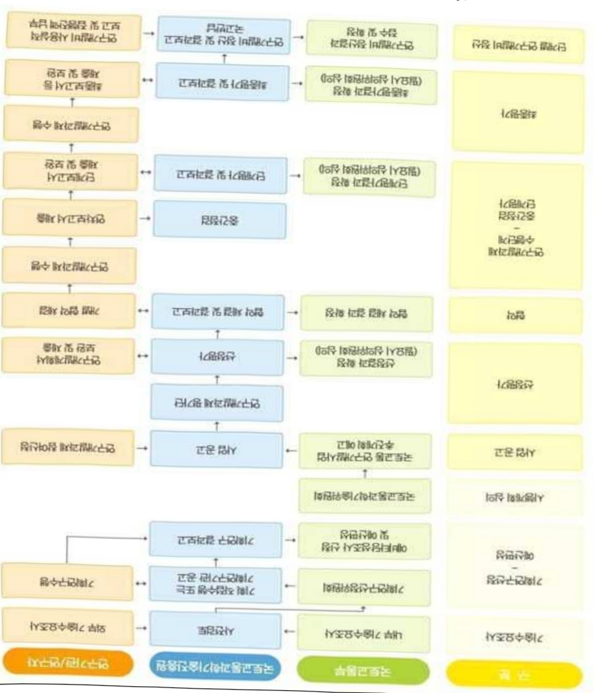
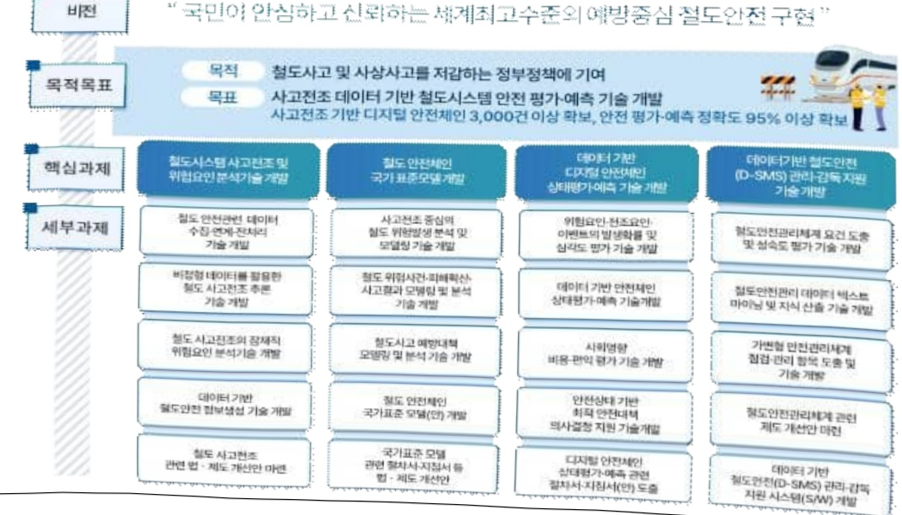

# 데이터기반철도시스템안전평가예측기술개발(R&D)

**해당 페이지**: PDF 2296 ~ 2304 쪽 해당

**부처**: 국토교통부
**분야**: 교통 및 물류
**회계유형**: 교통시설 특별회계
**2026 확정예산**: 5300.0 백만원
**전년대비 증감률**: 253.3%
**AI 도메인**: 데이터

---

### 가.예산 총괄표

(단위: 백만원, %)

<table border=1 style='margin: auto; word-wrap: break-word;'><tr><td rowspan="2">사업명</td><td rowspan="2">2024년 결산</td><td colspan="2">2025년 예산</td><td colspan="2">2026년</td><td rowspan="2">중감(B-A)</td><td rowspan="2">(B-A)/A</td></tr><tr><td style='text-align: center; word-wrap: break-word;'>본예산(A)</td><td style='text-align: center; word-wrap: break-word;'>추경</td><td style='text-align: center; word-wrap: break-word;'>정부안</td><td style='text-align: center; word-wrap: break-word;'>확정(B)</td></tr><tr><td style='text-align: center; word-wrap: break-word;'>데이터기반철도시스템안전평가예측기술개발(R&amp;D)</td><td style='text-align: center; word-wrap: break-word;'>-</td><td style='text-align: center; word-wrap: break-word;'>1,500</td><td style='text-align: center; word-wrap: break-word;'>1,500</td><td style='text-align: center; word-wrap: break-word;'>5,300</td><td style='text-align: center; word-wrap: break-word;'>5,300</td><td style='text-align: center; word-wrap: break-word;'>3,800</td><td style='text-align: center; word-wrap: break-word;'>253.3</td></tr></table>

□ 기능별(내역사업별), 목별 예산 내역

(단위:백만원)

<table border=1 style='margin: auto; word-wrap: break-word;'><tr><td rowspan="3"></td><td colspan="5">2024</td><td colspan="7">2025(2025.12월 말 기준)</td><td rowspan="3">2026예산</td></tr><tr><td rowspan="2">예산액(추정)</td><td rowspan="2">예산현액</td><td rowspan="2">집행액[실집행액]</td><td rowspan="2">이월액</td><td rowspan="2">불용액</td><td rowspan="2">분예산</td><td rowspan="2">예산현액</td><td rowspan="2">집행액[실집행액]</td><td colspan="2">전년도 이월액제외</td><td rowspan="2">이월예산액</td><td rowspan="2">불용예산액</td></tr><tr><td style='text-align: center; word-wrap: break-word;'>예산현액</td><td style='text-align: center; word-wrap: break-word;'>집행액[실집행액]</td></tr><tr><td style='text-align: center; word-wrap: break-word;'>○ 기능별 분류(함께)</td><td style='text-align: center; word-wrap: break-word;'>-</td><td style='text-align: center; word-wrap: break-word;'>-</td><td style='text-align: center; word-wrap: break-word;'>- [-]</td><td style='text-align: center; word-wrap: break-word;'>-</td><td style='text-align: center; word-wrap: break-word;'>-</td><td style='text-align: center; word-wrap: break-word;'>1,500</td><td style='text-align: center; word-wrap: break-word;'>1,500</td><td style='text-align: center; word-wrap: break-word;'>1,500 [1,500]</td><td style='text-align: center; word-wrap: break-word;'>1,500</td><td style='text-align: center; word-wrap: break-word;'>1,500 [1,500]</td><td style='text-align: center; word-wrap: break-word;'>-</td><td style='text-align: center; word-wrap: break-word;'>-</td><td style='text-align: center; word-wrap: break-word;'>5,300</td></tr><tr><td style='text-align: center; word-wrap: break-word;'>· 데이터기반철도시스템안전평가예측기술개발</td><td style='text-align: center; word-wrap: break-word;'>-</td><td style='text-align: center; word-wrap: break-word;'>-</td><td style='text-align: center; word-wrap: break-word;'>- [-]</td><td style='text-align: center; word-wrap: break-word;'>-</td><td style='text-align: center; word-wrap: break-word;'>-</td><td style='text-align: center; word-wrap: break-word;'>1,500</td><td style='text-align: center; word-wrap: break-word;'>1,500</td><td style='text-align: center; word-wrap: break-word;'>1,500 [1,500]</td><td style='text-align: center; word-wrap: break-word;'>1,500</td><td style='text-align: center; word-wrap: break-word;'>1,500 [1,500]</td><td style='text-align: center; word-wrap: break-word;'>-</td><td style='text-align: center; word-wrap: break-word;'>-</td><td style='text-align: center; word-wrap: break-word;'>5,300</td></tr><tr><td style='text-align: center; word-wrap: break-word;'>○ 비목별 분류(함께)</td><td style='text-align: center; word-wrap: break-word;'>-</td><td style='text-align: center; word-wrap: break-word;'>-</td><td style='text-align: center; word-wrap: break-word;'>- [-]</td><td style='text-align: center; word-wrap: break-word;'>-</td><td style='text-align: center; word-wrap: break-word;'>-</td><td style='text-align: center; word-wrap: break-word;'>1,500</td><td style='text-align: center; word-wrap: break-word;'>1,500</td><td style='text-align: center; word-wrap: break-word;'>1,500 [1,500]</td><td style='text-align: center; word-wrap: break-word;'>1,500</td><td style='text-align: center; word-wrap: break-word;'>1,500 [1,500]</td><td style='text-align: center; word-wrap: break-word;'>-</td><td style='text-align: center; word-wrap: break-word;'>-</td><td style='text-align: center; word-wrap: break-word;'>5,300</td></tr><tr><td style='text-align: center; word-wrap: break-word;'>· 연 구 활 동 비 등(360-05)</td><td style='text-align: center; word-wrap: break-word;'>-</td><td style='text-align: center; word-wrap: break-word;'>-</td><td style='text-align: center; word-wrap: break-word;'>- [-]</td><td style='text-align: center; word-wrap: break-word;'>-</td><td style='text-align: center; word-wrap: break-word;'>-</td><td style='text-align: center; word-wrap: break-word;'>1,500</td><td style='text-align: center; word-wrap: break-word;'>1,500</td><td style='text-align: center; word-wrap: break-word;'>1,500 [1,500]</td><td style='text-align: center; word-wrap: break-word;'>1,500</td><td style='text-align: center; word-wrap: break-word;'>1,500 [1,500]</td><td style='text-align: center; word-wrap: break-word;'>-</td><td style='text-align: center; word-wrap: break-word;'>-</td><td style='text-align: center; word-wrap: break-word;'>5,300</td></tr><tr><td style='text-align: center; word-wrap: break-word;'>○ 기능비목별 분류(함께)</td><td style='text-align: center; word-wrap: break-word;'>-</td><td style='text-align: center; word-wrap: break-word;'>-</td><td style='text-align: center; word-wrap: break-word;'>- [-]</td><td style='text-align: center; word-wrap: break-word;'>-</td><td style='text-align: center; word-wrap: break-word;'>-</td><td style='text-align: center; word-wrap: break-word;'>1,500</td><td style='text-align: center; word-wrap: break-word;'>1,500</td><td style='text-align: center; word-wrap: break-word;'>1,500 [1,500]</td><td style='text-align: center; word-wrap: break-word;'>1,500</td><td style='text-align: center; word-wrap: break-word;'>1,500 [1,500]</td><td style='text-align: center; word-wrap: break-word;'>-</td><td style='text-align: center; word-wrap: break-word;'>-</td><td style='text-align: center; word-wrap: break-word;'>5,300</td></tr><tr><td style='text-align: center; word-wrap: break-word;'>· 데이터기반철도시스템안전평가예측기술개발</td><td style='text-align: center; word-wrap: break-word;'>-</td><td style='text-align: center; word-wrap: break-word;'>-</td><td style='text-align: center; word-wrap: break-word;'>- [-]</td><td style='text-align: center; word-wrap: break-word;'>-</td><td style='text-align: center; word-wrap: break-word;'>-</td><td style='text-align: center; word-wrap: break-word;'>1,500</td><td style='text-align: center; word-wrap: break-word;'>1,500</td><td style='text-align: center; word-wrap: break-word;'>1,500 [1,500]</td><td style='text-align: center; word-wrap: break-word;'>1,500</td><td style='text-align: center; word-wrap: break-word;'>1,500 [1,500]</td><td style='text-align: center; word-wrap: break-word;'>-</td><td style='text-align: center; word-wrap: break-word;'>-</td><td style='text-align: center; word-wrap: break-word;'>5,300</td></tr><tr><td style='text-align: center; word-wrap: break-word;'>· 연 구 활 동 비 등(360-05)</td><td style='text-align: center; word-wrap: break-word;'>-</td><td style='text-align: center; word-wrap: break-word;'>-</td><td style='text-align: center; word-wrap: break-word;'>- [-]</td><td style='text-align: center; word-wrap: break-word;'>-</td><td style='text-align: center; word-wrap: break-word;'>-</td><td style='text-align: center; word-wrap: break-word;'>1,500</td><td style='text-align: center; word-wrap: break-word;'>1,500</td><td style='text-align: center; word-wrap: break-word;'>1,500 [1,500]</td><td style='text-align: center; word-wrap: break-word;'>1,500</td><td style='text-align: center; word-wrap: break-word;'>1,500 [1,500]</td><td style='text-align: center; word-wrap: break-word;'>-</td><td style='text-align: center; word-wrap: break-word;'>-</td><td style='text-align: center; word-wrap: break-word;'>5,300</td></tr></table>

### 나. 사업설명자료

## 1 ) 사업목적·내용

- (데이터 기반 철도시스템 안전 평가·예측 기술 개발) 사고전조 데이터 기반 철도

시스템 안전 평가·예측 기술 개발을 통해 예방형 철도안전관리 체계 구현

---

## 2 ) 사업개요

## □ 사업근거 및 추진경위

① 법령상 근거 및 조항 적시

- 「국토교통과학기술 육성법」

제8조(연구개발사업의 추진) ① 국토교통부장관은 종합계획을 효율적으로 추진하기 위하여 국토교통과학기술 연구개발사업을 할 수 있다.

- 「철도산업발전기본법」

· 제11조(철도기술의 진흥 등) ① 국토교통부장관은 철도기술의 진흥 및 육성을 위하여 철도기술전반에 대한 연구 및 개발에 노력하여야 한다.

- 「철도안전법」

제68조(철도안전기술의 진흥) 국토교통부장관은 철도안전에 관한 기술의 진흥을 위하여 연구·개발의 촉진 및 그 성과의 보급 등 필요한 시책을 마련하여 추진하여야 한다.

- 「국가통합교통체계효율화법」

· 제98조(교통기술 연구·개발사업의 추진) ① 국토교통부장관은 교통기술의 연구·개발을 효율적으로 추진하기 위하여 연도별·분야별 교통기술 연구·개발과제를 선정하여 다음 각 호의 기관 또는 단체 등과 협약을 맺어 교통기술 연구·개발사업을 하게 할 수 있다.

## ② 추진경위

- (‘17.07~’19.09) 「스마트 철도안전시스템 기술개발 사업 기획」 추진

- (19.11) '19년 4차 예타 신청 → 대상선정 '미선정' → 보완기획

- (20.11) '20년 4차 예타 신청 → 본예타 '미시행'(21.08) → 보완기획

- (23.06) '23년 2차 예타 신청 → 대상선정 '미선정'

-(23.09) 국가역할 중심으로 사업범위 및 운영 로드맵 조정하여 사업 추진 결정

- (25.04) 데이터 기반 철도시스템 안전 평가예측 기술개발 사업 착수

## □ 주요내용

① 사업규모

- 총사업비 : 해당없음

- 사업기간 : '25 ~ '29

- 최근 5년 간 투입된 사업비(예산액기준, 추경편성한 연도에는 추경포함)

<table border=1 style='margin: auto; word-wrap: break-word;'><tr><td style='text-align: center; word-wrap: break-word;'>$ \underline{\text{연도}} $</td><td style='text-align: center; word-wrap: break-word;'>2022</td><td style='text-align: center; word-wrap: break-word;'>2023</td><td style='text-align: center; word-wrap: break-word;'>2024</td><td style='text-align: center; word-wrap: break-word;'>2025</td><td style='text-align: center; word-wrap: break-word;'>2026</td></tr><tr><td style='text-align: center; word-wrap: break-word;'>$ \underline{\text{사업비}} $</td><td style='text-align: center; word-wrap: break-word;'>-</td><td style='text-align: center; word-wrap: break-word;'>-</td><td style='text-align: center; word-wrap: break-word;'>-</td><td style='text-align: center; word-wrap: break-word;'>1,500</td><td style='text-align: center; word-wrap: break-word;'>5,300</td></tr></table>

-기타: 해당없음

---

## ② 사업추진체계

- 사업시행방법 : 출연(참여기업이 있는 경우 Matching)

- 사업시행주체 : 국토교통부(전문기관 : 국토교통과학기술진흥원)

- 사업 수혜자 : 대학, 기업, 출연연 등

- 보조, 융자, 출연, 출자 등의 경우 보조·융자 등 지원 비율 및 법적근거

<table border=1 style='margin: auto; word-wrap: break-word;'><tr><td style='text-align: center; word-wrap: break-word;'>내역사업명</td><td style='text-align: center; word-wrap: break-word;'>구분</td><td style='text-align: center; word-wrap: break-word;'>피보조·피출연 등 기관명</td><td style='text-align: center; word-wrap: break-word;'>지원 금액 (2026예산)</td><td style='text-align: center; word-wrap: break-word;'>지원 비율(%)</td><td style='text-align: center; word-wrap: break-word;'>보조율 법적근거 (해당 조항)</td></tr><tr><td rowspan="3">데이터기반 철도시스템 안전평가·예측기술 개발</td><td rowspan="3">출연</td><td style='text-align: center; word-wrap: break-word;'>「중소기업기본법」제2조에 따른 중소기업에 해당하는 연구개발기관</td><td rowspan="3">5,300 백만원</td><td style='text-align: center; word-wrap: break-word;'>연구개발비의 100분의 75 이하</td><td rowspan="3">「국가연구개발혁신법 시행령」제19조</td></tr><tr><td style='text-align: center; word-wrap: break-word;'>「중견기업 성장촉진 및 경쟁력 강화에 관한 특별법」제2조제1호에 따른 중견기업에 해당하는 연구개발기관</td><td style='text-align: center; word-wrap: break-word;'>연구개발비의 100분의 70 이하</td></tr><tr><td style='text-align: center; word-wrap: break-word;'>「공공기관의 운영에 관한 법률」제5조제4항제1호에 따른 공기업에 해당하거나 ‘가’, ‘나’에 해당 해당하지 않는 연구개발기관</td><td style='text-align: center; word-wrap: break-word;'>연구개발비의 100분의 50 이하</td></tr></table>

*나반,숭양행정기관의 장이 필요하다고 인정하는 국가연구개발사업에 대하여 별도로 정할 수 있음

## 3 ) 2026년도 예산 산출 근거

①철도종사자의 인적오류 분석·평가·예방 기술개발

:(25)1,500백만원→(26 확정)5,300백만원,3,800백만원 증액

- (편성) 중대사고 발생을 미리 예측할 수 있는 사고전조 현상과 위험도 분석 등 AI 기술을 활용하는 사전 예방적 철도안전 정보관리 기술의 필요성이 인정되어 소요예산 5,300백만원 예산 편성

- (산출) ① 철도시스템 사고전조 및 위험효인 분석기술 상세설계 및 핵심기능 개발 : 1.700백만원

② 국가 철도 안전체인(사전·사후 연계 안전관리 프로세스) 핵심모델 개발(400건 이상) : 1,324백만원

③ 빅데이터 기반 위험도 평가 및 예측 시스템 상세설계 및 핵심기능 개발 : 1,484백만원

④ 위험도 평가 결과를 반영한 철도안전관리체계 관리감독 지원시스템 상세설계 및 핵심기술 개발 : 792백만원

·(계속) 1개 × 5,300백만원 × 12/12 = 5,300백만원

2025년도 예산 및 2026년도 예산 산출 세부내역 비교

<table border=1 style='margin: auto; word-wrap: break-word;'><tr><td rowspan="2">예산</td><td colspan="2">&#x27;25년 예산</td><td colspan="2">&#x27;26년 예산</td></tr><tr><td colspan="2">산출내역</td><td style='text-align: center; word-wrap: break-word;'>예산</td><td style='text-align: center; word-wrap: break-word;'>산출내역</td></tr><tr><td rowspan="5">1,500배만원</td><td colspan="2">○ 연구활동비 등(360-05): 1,500백만원</td><td colspan="2">○ 연구활동비 등(360-05): 5,300백만원</td></tr><tr><td colspan="2">가. 철도시스템 사고전조 및 위험효인 분석기술 개념설계 및 데이터 분석: 480백만원</td><td colspan="2">가. 철도시스템 사고전조 및 위험효인 분석기술 개념설계 및 핵심기능 개발: 1,700백만원</td></tr><tr><td colspan="2">나. 국가 철도 안전체인(사전·사후 연계 안전관리 프로세스) 국내외 기존모델 조사 분석 및 핵심 정의서 개발: 375백만원</td><td colspan="2">나. 국가 철도 안전체인(사전·사후 연계 안전관리 프로세스) 핵심모델 개발(400건 이상): 1,324백만원</td></tr><tr><td colspan="2">다. 빅데이터 기반 위험도 평가 및 예측 시스템 개념설계 및 기능정의: 421백만원</td><td colspan="2">다. 빅데이터 기반 위험도 평가 및 예측 시스템 개발: 1,484백만원</td></tr><tr><td colspan="2">라 위험도 평가 결과를 반영한 철도안전관리체계 관리감독 지원시스템 개념설계 및 기능정의: 224백만원</td><td colspan="2">라 위험도 평가 결과를 반영한 철도안전관리체계 관리감독 지원시스템 상세설계 및 핵심기술 개발: 792백만원</td></tr></table>

---

## 4 ) 사업효과

☐ 사업영향, 산출물 성과지표 등

① 2022~2026년도 성과계획서 상 성과지표 및 최근 5년간 성과 달성도

<table border=1 style='margin: auto; word-wrap: break-word;'><tr><td style='text-align: center; word-wrap: break-word;'>성과지표</td><td style='text-align: center; word-wrap: break-word;'>구분</td><td style='text-align: center; word-wrap: break-word;'>2022</td><td style='text-align: center; word-wrap: break-word;'>2023</td><td style='text-align: center; word-wrap: break-word;'>2024</td><td style='text-align: center; word-wrap: break-word;'>2025</td><td style='text-align: center; word-wrap: break-word;'>2026</td><td style='text-align: center; word-wrap: break-word;'>2026목표치산출근거</td><td style='text-align: center; word-wrap: break-word;'>측정산식(또는 측정방법)</td><td style='text-align: center; word-wrap: break-word;'>자료수집방법(또는 자료출처)</td></tr><tr><td rowspan="3">철도시스템사고전조 및위험요인분석기술개발달성도</td><td style='text-align: center; word-wrap: break-word;'>목표</td><td style='text-align: center; word-wrap: break-word;'>-</td><td style='text-align: center; word-wrap: break-word;'>-</td><td style='text-align: center; word-wrap: break-word;'>-</td><td style='text-align: center; word-wrap: break-word;'>33</td><td style='text-align: center; word-wrap: break-word;'>66</td><td rowspan="3">1단계연구개발계획을고려하여 사고전조추론 및 잠재적위험요인 분석시스템 개발달성도를 설정</td><td style='text-align: center; word-wrap: break-word;'>∑연도별 핵심산출물 달성 건수</td><td rowspan="3">전문가평가서</td></tr><tr><td style='text-align: center; word-wrap: break-word;'>실적</td><td style='text-align: center; word-wrap: break-word;'>-</td><td style='text-align: center; word-wrap: break-word;'>-</td><td style='text-align: center; word-wrap: break-word;'>-</td><td style='text-align: center; word-wrap: break-word;'></td><td style='text-align: center; word-wrap: break-word;'></td><td rowspan="2">∑연도별 핵심산출물 목표 건수</td></tr><tr><td style='text-align: center; word-wrap: break-word;'>달성도</td><td style='text-align: center; word-wrap: break-word;'>-</td><td style='text-align: center; word-wrap: break-word;'>-</td><td style='text-align: center; word-wrap: break-word;'>-</td><td style='text-align: center; word-wrap: break-word;'></td><td style='text-align: center; word-wrap: break-word;'></td></tr><tr><td rowspan="3">철도안전체인국가표준모델개발달성도</td><td style='text-align: center; word-wrap: break-word;'>목표</td><td style='text-align: center; word-wrap: break-word;'>-</td><td style='text-align: center; word-wrap: break-word;'>-</td><td style='text-align: center; word-wrap: break-word;'>-</td><td style='text-align: center; word-wrap: break-word;'>33</td><td style='text-align: center; word-wrap: break-word;'>66</td><td rowspan="3">1단계연구개발계획을고려하여 철도안전체인 국가표준모델 개발달성도를 설정</td><td style='text-align: center; word-wrap: break-word;'>∑연도별 핵심산출물 달성 건수</td><td rowspan="3">전문가평가서</td></tr><tr><td style='text-align: center; word-wrap: break-word;'>실적</td><td style='text-align: center; word-wrap: break-word;'>-</td><td style='text-align: center; word-wrap: break-word;'>-</td><td style='text-align: center; word-wrap: break-word;'>-</td><td style='text-align: center; word-wrap: break-word;'></td><td style='text-align: center; word-wrap: break-word;'></td><td rowspan="2">∑연도별 핵심산출물 목표 건수</td></tr><tr><td style='text-align: center; word-wrap: break-word;'>달성도</td><td style='text-align: center; word-wrap: break-word;'>-</td><td style='text-align: center; word-wrap: break-word;'>-</td><td style='text-align: center; word-wrap: break-word;'>-</td><td style='text-align: center; word-wrap: break-word;'></td><td style='text-align: center; word-wrap: break-word;'></td></tr><tr><td rowspan="3">데이터기반디지털안전체인상태평가·예측기술개발달성도</td><td style='text-align: center; word-wrap: break-word;'>목표</td><td style='text-align: center; word-wrap: break-word;'>-</td><td style='text-align: center; word-wrap: break-word;'>-</td><td style='text-align: center; word-wrap: break-word;'>-</td><td style='text-align: center; word-wrap: break-word;'>33</td><td style='text-align: center; word-wrap: break-word;'>66</td><td rowspan="3">1단계연구개발계획을고려하여 데이터기반디지털안전체인상태평가예측개발달성도를 설정</td><td style='text-align: center; word-wrap: break-word;'>∑연도별 핵심산출물 달성 건수</td><td rowspan="3">전문가평가서</td></tr><tr><td style='text-align: center; word-wrap: break-word;'>실적</td><td style='text-align: center; word-wrap: break-word;'>-</td><td style='text-align: center; word-wrap: break-word;'>-</td><td style='text-align: center; word-wrap: break-word;'>-</td><td style='text-align: center; word-wrap: break-word;'></td><td style='text-align: center; word-wrap: break-word;'></td><td rowspan="2">∑연도별 핵심산출물 목표 건수</td></tr><tr><td style='text-align: center; word-wrap: break-word;'>달성도</td><td style='text-align: center; word-wrap: break-word;'>-</td><td style='text-align: center; word-wrap: break-word;'>-</td><td style='text-align: center; word-wrap: break-word;'>-</td><td style='text-align: center; word-wrap: break-word;'></td><td style='text-align: center; word-wrap: break-word;'></td></tr><tr><td rowspan="3">데이터기반철도안전(D-SMS)관리·감독지원기술개발달성도</td><td style='text-align: center; word-wrap: break-word;'>목표</td><td style='text-align: center; word-wrap: break-word;'>-</td><td style='text-align: center; word-wrap: break-word;'>-</td><td style='text-align: center; word-wrap: break-word;'>-</td><td style='text-align: center; word-wrap: break-word;'>33</td><td style='text-align: center; word-wrap: break-word;'>66</td><td rowspan="3">1단계연구개발계획을고려하여 철도안전관리감독 지원시스템개발달성도를 설정</td><td style='text-align: center; word-wrap: break-word;'>∑연도별 핵심산출물 달성 건수</td><td rowspan="3">전문가평가서</td></tr><tr><td style='text-align: center; word-wrap: break-word;'>실적</td><td style='text-align: center; word-wrap: break-word;'>-</td><td style='text-align: center; word-wrap: break-word;'>-</td><td style='text-align: center; word-wrap: break-word;'>-</td><td style='text-align: center; word-wrap: break-word;'></td><td style='text-align: center; word-wrap: break-word;'></td><td rowspan="2">∑연도별 핵심산출물 목표 건수</td></tr><tr><td style='text-align: center; word-wrap: break-word;'>달성도</td><td style='text-align: center; word-wrap: break-word;'>-</td><td style='text-align: center; word-wrap: break-word;'>-</td><td style='text-align: center; word-wrap: break-word;'>-</td><td style='text-align: center; word-wrap: break-word;'></td><td style='text-align: center; word-wrap: break-word;'></td></tr></table>

---

② 성과지표 이외의 연도별 사업추진 경과 및 실적

<table border=1 style='margin: auto; word-wrap: break-word;'><tr><td style='text-align: center; word-wrap: break-word;'>2025</td><td style='text-align: center; word-wrap: break-word;'>° 철도시스템 사고전조 및 위험효인 분석기술 개념설계 및 데이터 분석 ° 국가 철도 안전체인(사전·사후 연계 안전관리 프로세스) 국내외 기존모델 조사 분석 및 핵심 정의서 개발 ° 빅데이터 기반 위험도 평가 및 예측 시스템 개념설계 및 기능정의 ° 위험도 평가 결과를 반영한 철도안전관리체계 관리감독 지원시스템 개념설계 및 기능정의</td></tr></table>

## ③ 향후(2026년도 이후) 기대효과

- 철도 사고전조의 예견적 평가 및 예방을 통한 철도 사고·장애 저감 및 철도 운영의 안전성 향상으로 철도시스템에 대한 사회적 신뢰도 및 수용성 향상

- 안전상태 예측·평가에 기반을 둔 객관적, 비용·효과적인 안전개선 대책 마련

- 반복되는 사고 또는 신규 위험원에 의한 사고를 예방함으로써 사고피해비용 절감 및 철도교통 통행시간 신뢰성 형상

5) 타당성조사 및 예비타당성조사 시행여부 및 결과 요지 : 해당없음

6) 총사업비 대상사업 여부 및 내역 : 해당없음

---

<table border=1 style='margin: auto; word-wrap: break-word;'><tr><td style='text-align: center; word-wrap: break-word;'>부처</td><td style='text-align: center; word-wrap: break-word;'></td><td style='text-align: center; word-wrap: break-word;'>피출연·피보조기관</td><td style='text-align: center; word-wrap: break-word;'></td><td style='text-align: center; word-wrap: break-word;'>간접보조사업자·사업수행자</td></tr><tr><td style='text-align: center; word-wrap: break-word;'>국토교통부(5,300백만원)</td><td style='text-align: center; word-wrap: break-word;'>=&gt;(5,300백만원)</td><td style='text-align: center; word-wrap: break-word;'>국토교통과학기술진흥원(5,300백만원)</td><td style='text-align: center; word-wrap: break-word;'>=&gt;(5,300백만원)</td><td style='text-align: center; word-wrap: break-word;'>한국철도기술연구원의 11개 기관</td></tr></table>

<철도종사자 인적오류 분석·평가·예방 기술개발>

---

8) 중기재정계획 상 연도별 투자계획 및 추진경과

(단위: 백만원)

<table border=1 style='margin: auto; word-wrap: break-word;'><tr><td style='text-align: center; word-wrap: break-word;'>$ \underset{\cdot}{客} $ $ \underset{\cdot}{机} $ 2024</td><td style='text-align: center; word-wrap: break-word;'>2025</td><td style='text-align: center; word-wrap: break-word;'>2026</td><td style='text-align: center; word-wrap: break-word;'>2027</td><td style='text-align: center; word-wrap: break-word;'>2028</td><td style='text-align: center; word-wrap: break-word;'>2029</td></tr><tr><td style='text-align: center; word-wrap: break-word;'>2024~2028</td><td style='text-align: center; word-wrap: break-word;'>1,500</td><td style='text-align: center; word-wrap: break-word;'>8,000</td><td style='text-align: center; word-wrap: break-word;'>9,000</td><td style='text-align: center; word-wrap: break-word;'>9,500</td><td style='text-align: center; word-wrap: break-word;'></td></tr><tr><td style='text-align: center; word-wrap: break-word;'>2025~2029</td><td style='text-align: center; word-wrap: break-word;'>1,500</td><td style='text-align: center; word-wrap: break-word;'>5,300</td><td style='text-align: center; word-wrap: break-word;'>6,900</td><td style='text-align: center; word-wrap: break-word;'>6,400</td><td style='text-align: center; word-wrap: break-word;'>3,900</td></tr></table>

9) 최근 3년간 동 사업에 대한 주요 외부지적사항 및 평가, 문제점 및 대책 : 해당없음

## 10 )향후 추진방향 및 추진계획

각 운영기관의 철도사고·장애/시설/차량/외부환경 등의 빅데이터를 활용하여 철도사고의 사고전조·위험요인을 추론·분석하고, AI 기반의 철도 위험도 평가 및 예측 기술 개발

o (중점분야)

① 철도시스템 사고전조 추론 및 잠재적 위험요인 분석 기술개발

② 철도 안전체인(위험발생, 피해확산, 예방대책 등) 국가 표준모델 개발

③ 사고전조 기반 디지털 안전체인 상태평가·예측 기술 기술개발

④데이터기반 철도안전관리체계(SMS) 관리 기술개발

---

## 11 ) 해당사업에 대한 각종 사업평가의 결과

1) 「국가재정법」제85조의8제1항에 따른 재정사업자율평가 결과에 대한 기획재정부의 상위평가(심층평가) 결과 : 해당없음

2) R&D사업의 경우「국가연구개발사업 등의 성과평가 및 성과관리에 관한 법률」

제7조제3항에 따른 부처의 R&D사업 자체성과평가에 대한 과학기술정보통신부

상위평가 결과 : 해당없음

3) 그 외 보조사업 연장평가, 재정지원 일자리사업 평가 등 개별 법률에 규정된 평가 시행 결과 : 해당없음

## 12 ) 해당사업에 대한 부처 자체평가의 결과

1) 2023년도 부처 재정사업 자율평가 결과: 해당없음

2) 2024년도 부처 재정사업 자율평가 결과: 해당없음

3) 2025년도 부처 재정사업 자율평가 결과: 해당없음

## 13 ) 부처 건의사항 : 해당없음

---

<table border=1 style='margin: auto; word-wrap: break-word;'><tr><td style='text-align: center; word-wrap: break-word;'>사 업 명</td></tr><tr><td style='text-align: center; word-wrap: break-word;'>(64) 디지털기반 건축시공 및 안전감리 기술개발(R&amp;D) (4156-326)</td></tr></table>

## □ 사업 코드 정보

<table border=1 style='margin: auto; word-wrap: break-word;'><tr><td style='text-align: center; word-wrap: break-word;'>구분</td><td style='text-align: center; word-wrap: break-word;'>회계</td><td style='text-align: center; word-wrap: break-word;'>소관</td><td style='text-align: center; word-wrap: break-word;'>실국(기관)</td><td style='text-align: center; word-wrap: break-word;'>계정</td><td style='text-align: center; word-wrap: break-word;'>분야</td><td style='text-align: center; word-wrap: break-word;'>부문</td></tr><tr><td style='text-align: center; word-wrap: break-word;'>코드</td><td rowspan="2">일반회계</td><td rowspan="2">국토교통부</td><td rowspan="2">국토도시실</td><td rowspan="2">-</td><td style='text-align: center; word-wrap: break-word;'>120</td><td style='text-align: center; word-wrap: break-word;'>126</td></tr><tr><td style='text-align: center; word-wrap: break-word;'>명칭</td><td style='text-align: center; word-wrap: break-word;'>교통및물류</td><td style='text-align: center; word-wrap: break-word;'>물류등기타</td></tr></table>

<table border=1 style='margin: auto; word-wrap: break-word;'><tr><td style='text-align: center; word-wrap: break-word;'>구분</td><td style='text-align: center; word-wrap: break-word;'>프로그램</td><td style='text-align: center; word-wrap: break-word;'>단위사업</td><td style='text-align: center; word-wrap: break-word;'>세부사업</td></tr><tr><td style='text-align: center; word-wrap: break-word;'>코드</td><td style='text-align: center; word-wrap: break-word;'>4100</td><td style='text-align: center; word-wrap: break-word;'>4156</td><td style='text-align: center; word-wrap: break-word;'>326</td></tr><tr><td style='text-align: center; word-wrap: break-word;'>명칭</td><td style='text-align: center; word-wrap: break-word;'>국토교통연구개발</td><td style='text-align: center; word-wrap: break-word;'>도시건축연구</td><td style='text-align: center; word-wrap: break-word;'>디지털기반건축시공및안전감리기술개발(R&amp;D)</td></tr></table>

☐ 사업 성격

<table border=1 style='margin: auto; word-wrap: break-word;'><tr><td rowspan="2">신규</td><td rowspan="2">계속</td><td rowspan="2">완료</td><td rowspan="2">예비타당성 실시여부</td><td rowspan="2">총사업비 관리대상</td><td rowspan="2">총액계상 예산사업</td><td style='text-align: center; word-wrap: break-word;'>사업소관 변경정보</td></tr><tr><td style='text-align: center; word-wrap: break-word;'>2025예산 시 소관</td></tr><tr><td style='text-align: center; word-wrap: break-word;'></td><td style='text-align: center; word-wrap: break-word;'></td><td style='text-align: center; word-wrap: break-word;'>○</td><td style='text-align: center; word-wrap: break-word;'></td><td style='text-align: center; word-wrap: break-word;'></td><td style='text-align: center; word-wrap: break-word;'></td><td style='text-align: center; word-wrap: break-word;'>국토교통부</td></tr></table>

## □ 사업 지원 형태 및 지원을

<table border=1 style='margin: auto; word-wrap: break-word;'><tr><td style='text-align: center; word-wrap: break-word;'>직접</td><td style='text-align: center; word-wrap: break-word;'>출자</td><td style='text-align: center; word-wrap: break-word;'>출연</td><td style='text-align: center; word-wrap: break-word;'>보조</td><td style='text-align: center; word-wrap: break-word;'>융자</td><td style='text-align: center; word-wrap: break-word;'>국고보조율(%)</td><td style='text-align: center; word-wrap: break-word;'>융자율(%)</td></tr><tr><td style='text-align: center; word-wrap: break-word;'></td><td style='text-align: center; word-wrap: break-word;'></td><td style='text-align: center; word-wrap: break-word;'>○</td><td style='text-align: center; word-wrap: break-word;'></td><td style='text-align: center; word-wrap: break-word;'></td><td style='text-align: center; word-wrap: break-word;'></td><td style='text-align: center; word-wrap: break-word;'></td></tr></table>

□ 사업 담당자

<table border=1 style='margin: auto; word-wrap: break-word;'><tr><td style='text-align: center; word-wrap: break-word;'>사업명</td><td colspan="2">구분</td></tr><tr><td rowspan="6">디지털기반 건축시공및 안전감리기술 개발(R&amp;D)</td><td rowspan="4">소관부처</td><td style='text-align: center; word-wrap: break-word;'>실·국·과(팀)</td></tr><tr><td style='text-align: center; word-wrap: break-word;'>국토도시실</td></tr><tr><td style='text-align: center; word-wrap: break-word;'>건축정책관</td></tr><tr><td style='text-align: center; word-wrap: break-word;'>건축정책과</td></tr><tr><td rowspan="2">사업시행주체</td><td style='text-align: center; word-wrap: break-word;'>국토교통과학기술진흥원</td></tr><tr><td style='text-align: center; word-wrap: break-word;'>건축주거실</td></tr></table>

---

### 원본 PDF 크롭 이미지

