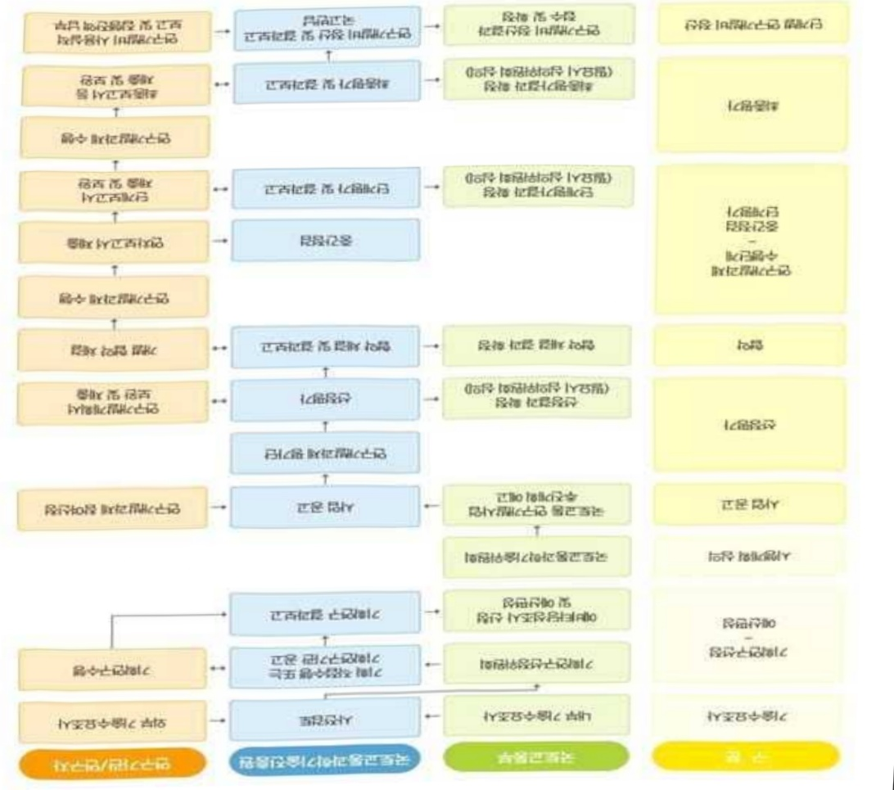

# 디지털기반건축시공및안전감리기술개발(R&D)

**해당 페이지**: PDF 2305 ~ 2315 쪽 해당

**부처**: 국토교통부
**분야**: 교통 및 물류
**회계유형**: 일반회계
**2026 확정예산**: 6794.0 백만원
**전년대비 증감률**: 26.4%
**AI 도메인**: 로봇

---

### 가.예산 총괄표

(단위: 백만원, %)

<table border=1 style='margin: auto; word-wrap: break-word;'><tr><td rowspan="2">사업명</td><td rowspan="2">2024년 결산</td><td colspan="2">2025년 예산</td><td colspan="2">2026년</td><td rowspan="2">중감(B-A)</td><td rowspan="2">(B-A)/A</td></tr><tr><td style='text-align: center; word-wrap: break-word;'>본예산(A)</td><td style='text-align: center; word-wrap: break-word;'>추경</td><td style='text-align: center; word-wrap: break-word;'>정부안</td><td style='text-align: center; word-wrap: break-word;'>확정(B)</td></tr><tr><td style='text-align: center; word-wrap: break-word;'>디지털기반건축 시공및안전감리 기술개발(R&amp;D)</td><td style='text-align: center; word-wrap: break-word;'>4,000</td><td style='text-align: center; word-wrap: break-word;'>5,374</td><td style='text-align: center; word-wrap: break-word;'>5,374</td><td style='text-align: center; word-wrap: break-word;'>6,794</td><td style='text-align: center; word-wrap: break-word;'>6,794</td><td style='text-align: center; word-wrap: break-word;'>1,420</td><td style='text-align: center; word-wrap: break-word;'>26.4</td></tr></table>

□ 기능별(내역사업별), 목별 예산 내역

(단위:백만원)

<table border=1 style='margin: auto; word-wrap: break-word;'><tr><td rowspan="3"></td><td colspan="5">2024</td><td colspan="7">2025(2025.12월말 기준)</td><td rowspan="3">2026예산</td></tr><tr><td rowspan="2">예산액(추경)</td><td rowspan="2">예산현액</td><td rowspan="2">집행액[실집행액]</td><td rowspan="2">이월액</td><td rowspan="2">불용액</td><td rowspan="2">분예산</td><td rowspan="2">예산현액</td><td rowspan="2">집행액[실집행액]</td><td colspan="2">전년도 이월액제의</td><td rowspan="2">이월예상액</td><td rowspan="2">불용예상액</td></tr><tr><td style='text-align: center; word-wrap: break-word;'>예산현액</td><td style='text-align: center; word-wrap: break-word;'>집행액[실집행액]</td></tr><tr><td style='text-align: center; word-wrap: break-word;'>○ 기능별 분류(합계)</td><td style='text-align: center; word-wrap: break-word;'>4,000</td><td style='text-align: center; word-wrap: break-word;'>4,000</td><td style='text-align: center; word-wrap: break-word;'>4,000[4,000]</td><td style='text-align: center; word-wrap: break-word;'>-</td><td style='text-align: center; word-wrap: break-word;'>-</td><td style='text-align: center; word-wrap: break-word;'>5,374</td><td style='text-align: center; word-wrap: break-word;'>5,374</td><td style='text-align: center; word-wrap: break-word;'>5,374[5,374]</td><td style='text-align: center; word-wrap: break-word;'>5,374</td><td style='text-align: center; word-wrap: break-word;'>5,374[5,374]</td><td style='text-align: center; word-wrap: break-word;'>-</td><td style='text-align: center; word-wrap: break-word;'>-</td><td style='text-align: center; word-wrap: break-word;'>6,794</td></tr><tr><td style='text-align: center; word-wrap: break-word;'>· 디지털 기반 건축감리 및 시공자동화 로봇 기술개발</td><td style='text-align: center; word-wrap: break-word;'>4,000</td><td style='text-align: center; word-wrap: break-word;'>4,000</td><td style='text-align: center; word-wrap: break-word;'>4,000[4,000]</td><td style='text-align: center; word-wrap: break-word;'>-</td><td style='text-align: center; word-wrap: break-word;'>-</td><td style='text-align: center; word-wrap: break-word;'>5,374</td><td style='text-align: center; word-wrap: break-word;'>5,374</td><td style='text-align: center; word-wrap: break-word;'>5,374[5,374]</td><td style='text-align: center; word-wrap: break-word;'>5,374</td><td style='text-align: center; word-wrap: break-word;'>5,374[5,374]</td><td style='text-align: center; word-wrap: break-word;'>-</td><td style='text-align: center; word-wrap: break-word;'>-</td><td style='text-align: center; word-wrap: break-word;'>6,794</td></tr><tr><td style='text-align: center; word-wrap: break-word;'>○ 비목별 분류(합계)</td><td style='text-align: center; word-wrap: break-word;'>4,000</td><td style='text-align: center; word-wrap: break-word;'>4,000</td><td style='text-align: center; word-wrap: break-word;'>4,000[4,000]</td><td style='text-align: center; word-wrap: break-word;'>-</td><td style='text-align: center; word-wrap: break-word;'>-</td><td style='text-align: center; word-wrap: break-word;'>5,374</td><td style='text-align: center; word-wrap: break-word;'>5,374</td><td style='text-align: center; word-wrap: break-word;'>5,374[5,374]</td><td style='text-align: center; word-wrap: break-word;'>5,374</td><td style='text-align: center; word-wrap: break-word;'>5,374[5,374]</td><td style='text-align: center; word-wrap: break-word;'>-</td><td style='text-align: center; word-wrap: break-word;'>-</td><td style='text-align: center; word-wrap: break-word;'>6,794</td></tr><tr><td style='text-align: center; word-wrap: break-word;'>· 연구 활동 비 등(360-05)</td><td style='text-align: center; word-wrap: break-word;'>4,000</td><td style='text-align: center; word-wrap: break-word;'>4,000</td><td style='text-align: center; word-wrap: break-word;'>4,000[4,000]</td><td style='text-align: center; word-wrap: break-word;'>-</td><td style='text-align: center; word-wrap: break-word;'>-</td><td style='text-align: center; word-wrap: break-word;'>5,374</td><td style='text-align: center; word-wrap: break-word;'>5,374</td><td style='text-align: center; word-wrap: break-word;'>5,374[5,374]</td><td style='text-align: center; word-wrap: break-word;'>5,374</td><td style='text-align: center; word-wrap: break-word;'>5,374[5,374]</td><td style='text-align: center; word-wrap: break-word;'>-</td><td style='text-align: center; word-wrap: break-word;'>-</td><td style='text-align: center; word-wrap: break-word;'>6,794</td></tr><tr><td style='text-align: center; word-wrap: break-word;'>○ 기능비목별 분류(합계)</td><td style='text-align: center; word-wrap: break-word;'>4,000</td><td style='text-align: center; word-wrap: break-word;'>4,000</td><td style='text-align: center; word-wrap: break-word;'>4,000[4,000]</td><td style='text-align: center; word-wrap: break-word;'>-</td><td style='text-align: center; word-wrap: break-word;'>-</td><td style='text-align: center; word-wrap: break-word;'>5,374</td><td style='text-align: center; word-wrap: break-word;'>5,374</td><td style='text-align: center; word-wrap: break-word;'>5,374[5,374]</td><td style='text-align: center; word-wrap: break-word;'>5,374</td><td style='text-align: center; word-wrap: break-word;'>5,374[5,374]</td><td style='text-align: center; word-wrap: break-word;'>-</td><td style='text-align: center; word-wrap: break-word;'>-</td><td style='text-align: center; word-wrap: break-word;'>6,794</td></tr><tr><td style='text-align: center; word-wrap: break-word;'>· 디지털 기반 건축감리 및 시공자동화 로봇 기술개발</td><td style='text-align: center; word-wrap: break-word;'>4,000</td><td style='text-align: center; word-wrap: break-word;'>4,000</td><td style='text-align: center; word-wrap: break-word;'>4,000[4,000]</td><td style='text-align: center; word-wrap: break-word;'>-</td><td style='text-align: center; word-wrap: break-word;'>-</td><td style='text-align: center; word-wrap: break-word;'>5,374</td><td style='text-align: center; word-wrap: break-word;'>5,374</td><td style='text-align: center; word-wrap: break-word;'>5,374[5,374]</td><td style='text-align: center; word-wrap: break-word;'>5,374</td><td style='text-align: center; word-wrap: break-word;'>5,374[5,374]</td><td style='text-align: center; word-wrap: break-word;'>-</td><td style='text-align: center; word-wrap: break-word;'>-</td><td style='text-align: center; word-wrap: break-word;'>6,794</td></tr><tr><td style='text-align: center; word-wrap: break-word;'>· 연구 활동 비 등(360-05)</td><td style='text-align: center; word-wrap: break-word;'>4,000</td><td style='text-align: center; word-wrap: break-word;'>4,000</td><td style='text-align: center; word-wrap: break-word;'>4,000[4,000]</td><td style='text-align: center; word-wrap: break-word;'>-</td><td style='text-align: center; word-wrap: break-word;'>-</td><td style='text-align: center; word-wrap: break-word;'>5,374</td><td style='text-align: center; word-wrap: break-word;'>5,374</td><td style='text-align: center; word-wrap: break-word;'>5,374[5,374]</td><td style='text-align: center; word-wrap: break-word;'>5,374</td><td style='text-align: center; word-wrap: break-word;'>5,374[5,374]</td><td style='text-align: center; word-wrap: break-word;'>-</td><td style='text-align: center; word-wrap: break-word;'>-</td><td style='text-align: center; word-wrap: break-word;'>6,794</td></tr></table>

---

### 나. 사업설명자료

## 1 ) 사업목적·내용

- (디지털 기반 건축감리 및 시공자동화 로봇 기술개발) 건축현장의 생산성과 안전성을

향상시키기 위한 원격/실시간 지향 디지털 시공·안전감리 기술혁신 및 자동화 기술 개발

· 건축현장 데이터 자동축적 및 AI를 활용한 감리 및 시공관리 기술 개발

· 기능 인력의 의존도를 낮추고 생산성을 제고할 수 있는 건축 시공자동화 로봇 개발

· 디지털 건축기술의 실용화 및 보급/확산을 촉진하기 위한 인프라 구축 방안 마련

## 2 ) 사업개요

## □ 사업근거 및 추진경위

① 법령상 근거 및 조항 적시

- 「국토교통과학기술육성법」 제8조(연구개발사업의 추진) ① 국토교통부장관은

종합계획을 효율적으로 추진하기 위하여 국토교통과학기술 연구개발사업을 할 수 있다.

- 「건설기술진흥법」 제7조(건설기술 연구·개발 사업) ① 국토교통부장관은 건설기술을 향상시키고 기본계획을 효율적으로 추진하기 위하여 대통령령으로 정하는 기관 또는 단체와 협약을 체결하여 건설기술 발전에 필요한 건설기술 연구·개발 사업을 할 수 있다.

「건설기술진흥법」 제9조(공동 연구·개발 등) ① 국토교통부장관은 건설기술의 연구·개발과 관련된 공공기관·법인·단체·대학(이들의 부설연구소 등을 포함한다.

이하 “건설기술연구기관”이라 한다)의 인력·자금·시험시설 및 기술정보의 효율적 활용과 선진 건설기술 획득을 위하여 관계 중앙행정기관의 장과 공동연구를 추진하거나 건설기술연구기관의 건설기술 연구·개발을 지원할 수 있다.

## ② 추진경위

- '21.09 : '디지털 기반 건축시공 및 안전감리 기술개발' 기획

- '22.01 : '디지털 기반 건축감리 및 시공자동화 로봇 기술개발' 과제 공고

- '22.04 : '디지털 기반 건축감리 및 시공자동화 로봇 기술개발' 신규 과제 협약

- '24.03 : 국토교통R&D 중간평가 자체평가, 과기부점검 결과 보통(86.6점)

- 국정과제 관련성 : [국정과제 72] 국민안전 보장을 위한 재난안전관리체계 확립 * (건설안전 대책강화) 지반탐사·노후 상하수도관 정비 확대 등 싱크홀 방지, 화재안전 성능기반 설계 등 건축물 화재 예방, 건설공사 숲과정 안전대책 마련 등

---

## □ 주요내용

① 사업규모

- 총사업비 : 해당없음

- 사업기간 : '22 ~ '26

- 최근 5년 간 투입된 사업비(예산액기준, 추경편성한 연도에는 추경포함)

<table border=1 style='margin: auto; word-wrap: break-word;'><tr><td style='text-align: center; word-wrap: break-word;'>$ \underline{\text{연도}} $</td><td style='text-align: center; word-wrap: break-word;'>2022</td><td style='text-align: center; word-wrap: break-word;'>2023</td><td style='text-align: center; word-wrap: break-word;'>2024</td><td style='text-align: center; word-wrap: break-word;'>2025</td><td style='text-align: center; word-wrap: break-word;'>2026</td></tr><tr><td style='text-align: center; word-wrap: break-word;'>$ \underline{\text{사업비}} $</td><td style='text-align: center; word-wrap: break-word;'>4,322</td><td style='text-align: center; word-wrap: break-word;'>4,000</td><td style='text-align: center; word-wrap: break-word;'>4,000</td><td style='text-align: center; word-wrap: break-word;'>5,374</td><td style='text-align: center; word-wrap: break-word;'>6,794</td></tr></table>

- 기타: 해당없음

② 사업추진체계

- 사업시행방법 : 출연(참여기업이 있는 경우 Matching)

- 사업시행주체 : 국토교통부(전문기관 : 국토교통과학기술진흥원)

- 사업 수혜자 : 대학, 기업, 출연연 등

- 보조, 융자, 출연, 출자 등의 경우 보조·융자 등 지원 비율 및 법적근거

<table border=1 style='margin: auto; word-wrap: break-word;'><tr><td style='text-align: center; word-wrap: break-word;'>내역사업명</td><td style='text-align: center; word-wrap: break-word;'>구분</td><td style='text-align: center; word-wrap: break-word;'>피보조·피출연 등 기관명</td><td style='text-align: center; word-wrap: break-word;'>지원 금액 (2026예산)</td><td style='text-align: center; word-wrap: break-word;'>지원 비율(%)</td><td style='text-align: center; word-wrap: break-word;'>보조율 법적근거 (해당 조항)</td></tr><tr><td rowspan="3">디지털기반 건축감리 및 시공자동화 로봇기술 개발</td><td rowspan="3">출연</td><td style='text-align: center; word-wrap: break-word;'>「중소기업기본법」제2조에 따른 중소기업에 해당하는 연구개발기관</td><td rowspan="3">6,794 백만원</td><td style='text-align: center; word-wrap: break-word;'>연구개발 비의 100분의 75 이하</td><td rowspan="3">「국가연구개발 혁신법 시행령」제19조</td></tr><tr><td style='text-align: center; word-wrap: break-word;'>「중견기업 성장촉진 및 경쟁력 강화에 관한 특별법」제2조제1호에 따른 중견기업에 해당하는 연구개발기관</td><td style='text-align: center; word-wrap: break-word;'>연구개발 비의 100분의 70 이하</td></tr><tr><td style='text-align: center; word-wrap: break-word;'>「공공기관의 운영에 관한 법률」제5조제4항제1호에 따른 공기업에 해당하거나 ‘가’, ‘낙’에 해당 해당하지 않는 연구개발기관</td><td style='text-align: center; word-wrap: break-word;'>연구개발 비의 100분의 50 이하</td></tr></table>

* 다만, 중앙행정기관의 장이 필요하다고 인정하는 국가연구개발사업에 대하여 별도로 정할 수 있음

---

## 3 ) 2026년도 예산 산출 근거

□ 디지털 기반 건축감리 및 시공자동화 로봇 기술개발(R&D): (2025 본예산) 5,374백만원 → (2026 확정) 6,794백만원

① 디지털 기반 건축감리 및 시공자동화 로봇 기술개발 : (2025 본예산) 5,374백만원 → (2026 확장) 6,794백만원, 1,420백만원 증액 - (편성) 건축현장 원격감리/자동화' 필수기능(감리보고서 생성 자동화, 주요부재 장기변형 예측 등) 고도화 및 현장 실·검증" 등 건설현장에 확산시키기 위한 필요성이 인정되어 소요예산 6,794백만원 편성

* (원격감리) 건축물의 구조물/시공상태 원격진단으로 건설현장 붕괴 등 사전예방

(자동화)PHC 파일 두부정리시 날베임, 실족, 감전, 깔림 등 사고예방

**롯데건설 공동주택 신축현장 등 8개소

- (산출) ① AI 주요부재 장기변형 예측 알고리즘 및 감리보고서 자동생기능 개발 1식 1,150백만원

② 구조/시공감리 솔루션/통합 플랫폼 현장 피드백 반영한 핵심기술 업데이트 600백만원

③ 시공자동화 로봇 현장 피드백 반영한 핵심기술 제품화 400백만원

④ 통합플랫폼 시제품 제작 (구조/시공감리 개별 솔루션 이식) 1식 및 현장 검증 1,200백만원

⑤ 구조/시공감리 솔루션 및 시공자동화 로봇(2종) 건설현장 실·검증, 피드백 2,100백만원

⑥ 사용 매뉴얼(5종) 제작, 경제성 분석, 디지털 건축감리 기준·지침·법(3종) 개선(안) 반영, 산학연/학협회 교육과정 연계운영 1,344백만원

·(종료) 1개 × 6,794백만원 × 12/12 = 6,794백만원

02025년도 예산 및 2026년도 예산 산출 세부내역 비교

<table border=1 style='margin: auto; word-wrap: break-word;'><tr><td colspan="2">2025년 예산</td><td colspan="2">2026년 예산</td><td style='text-align: center; word-wrap: break-word;'></td></tr><tr><td style='text-align: center; word-wrap: break-word;'>예산</td><td style='text-align: center; word-wrap: break-word;'>산출내역</td><td style='text-align: center; word-wrap: break-word;'>예산</td><td style='text-align: center; word-wrap: break-word;'>산출내역</td><td style='text-align: center; word-wrap: break-word;'></td></tr><tr><td style='text-align: center; word-wrap: break-word;'>디지털 기반 건축감리 및 시공자동화 로봇 기술개발 5,374 백만원</td><td style='text-align: center; word-wrap: break-word;'>○ 연구활동비 등(360-05): 5,374백만원</td><td style='text-align: center; word-wrap: break-word;'>○ 연구활동비 등(360-05): 6,794백만원 - 1,420백만원 증액 가. AI 주요부재 장기변형 예측 알고리즘 및 감리보고서 자동생성기능 개발 1식 : 1,150백만원 나. 구조/시공감리 솔루션 통합 플랫폼 현장 피드백 반영한 기반 가. 구조/시공감리 솔루션 제공서비스, 플랫폼 모듈, 로봇 운용기능 등 기술개발 1식 : 2,281백만원</td><td style='text-align: center; word-wrap: break-word;'>디지털 기반 건축감리 및 시공자동화 로봇 시제품 제작 4,489백만원</td><td style='text-align: center; word-wrap: break-word;'>나. 구조/시공감리 솔루션/통합 플랫폼 현장 피드백 반영한 핵심기술 업데이트 : 600백만원 다. 시공자동화 로봇 현장 피드백 반영한 핵심기술 제품화 : 400백만원 라. 통합플랫폼 시제품 제작 (구조/시공감리 개별 솔루션 이식) 1식 및 현장 검증 : 1,200백만원 마. 구조/시공감리 솔루션 및 시공자동화 로봇(2종) 건설현장 실·검증, 피드백 : 2,100백만원 바. 사용 매뉴얼(5종) 제작, 경제성 분석, 디지털 건축감리 기준·지침·법(3종) 개선(안) 반영, 산학연/학협회 교육과정 연계운영 : 1,344백만원</td></tr></table>

---

## 4 ) 사업효과

☐ 사업영향, 산출물 성과지표 등

①2022~2026년도 성과계획서 상 성과지표 및 최근 5년간 성과 달성도

<table border=1 style='margin: auto; word-wrap: break-word;'><tr><td style='text-align: center; word-wrap: break-word;'>성과지표</td><td style='text-align: center; word-wrap: break-word;'>구분</td><td style='text-align: center; word-wrap: break-word;'>2022</td><td style='text-align: center; word-wrap: break-word;'>2023</td><td style='text-align: center; word-wrap: break-word;'>2024</td><td style='text-align: center; word-wrap: break-word;'>2025</td><td style='text-align: center; word-wrap: break-word;'>2026</td><td style='text-align: center; word-wrap: break-word;'>2026 목표치산출근거</td><td style='text-align: center; word-wrap: break-word;'>측정산식(또는 측정방법)</td><td style='text-align: center; word-wrap: break-word;'>자료수집방법(또는 자료출처)</td></tr><tr><td rowspan="3">건축시공자동화통합 플랫폼 및 모니터링 시스템 개발률(단위:%)</td><td style='text-align: center; word-wrap: break-word;'>목표</td><td style='text-align: center; word-wrap: break-word;'>20</td><td style='text-align: center; word-wrap: break-word;'>43.5</td><td style='text-align: center; word-wrap: break-word;'>50</td><td style='text-align: center; word-wrap: break-word;'>70.5</td><td style='text-align: center; word-wrap: break-word;'>100</td><td rowspan="3">개발 중요도 및 사업 예산 투입을 고려하여 개발률 &#x27;25년 70.5%, &#x27;26년 100%로 도전적 목표치 설정</td><td rowspan="3">당해전도가지의 통합 플랫폼 및 모니터링 시스템 개발률 / 최종 플랫폼 및 모니터링 시스템 개발률 *100</td><td rowspan="3">연차별 실적보고서 범부처통합관리시스템(IRIS) 등</td></tr><tr><td style='text-align: center; word-wrap: break-word;'>실적</td><td style='text-align: center; word-wrap: break-word;'>20</td><td style='text-align: center; word-wrap: break-word;'>43.5</td><td style='text-align: center; word-wrap: break-word;'>50</td><td style='text-align: center; word-wrap: break-word;'>-</td><td style='text-align: center; word-wrap: break-word;'>-</td></tr><tr><td style='text-align: center; word-wrap: break-word;'>달성도</td><td style='text-align: center; word-wrap: break-word;'>100%</td><td style='text-align: center; word-wrap: break-word;'>100%</td><td style='text-align: center; word-wrap: break-word;'>100%</td><td style='text-align: center; word-wrap: break-word;'>-</td><td style='text-align: center; word-wrap: break-word;'>-</td></tr><tr><td rowspan="3">원격구조 감리 항목 비율(단위:%)</td><td style='text-align: center; word-wrap: break-word;'>목표</td><td style='text-align: center; word-wrap: break-word;'>30</td><td style='text-align: center; word-wrap: break-word;'>50</td><td style='text-align: center; word-wrap: break-word;'></td><td style='text-align: center; word-wrap: break-word;'></td><td style='text-align: center; word-wrap: break-word;'></td><td rowspan="3">총 구조감리 항목 대비 원격구조감리 항목 비율 &#x27;22년 30%, &#x27;23년 50%로 도전적 목표치 설정</td><td rowspan="3">원격구조감리 항목비율 = 원격구조감리항목 수 / 총 구조감리항목 수</td><td rowspan="3">연차별 실적보고서 범부처통합관리시스템(IRIS) 등</td></tr><tr><td style='text-align: center; word-wrap: break-word;'>실적</td><td style='text-align: center; word-wrap: break-word;'>33</td><td style='text-align: center; word-wrap: break-word;'>50</td><td style='text-align: center; word-wrap: break-word;'></td><td style='text-align: center; word-wrap: break-word;'></td><td style='text-align: center; word-wrap: break-word;'></td></tr><tr><td style='text-align: center; word-wrap: break-word;'>달성도</td><td style='text-align: center; word-wrap: break-word;'>100%</td><td style='text-align: center; word-wrap: break-word;'>100%</td><td style='text-align: center; word-wrap: break-word;'></td><td style='text-align: center; word-wrap: break-word;'></td><td style='text-align: center; word-wrap: break-word;'></td></tr><tr><td rowspan="3">원격구조 감리 자동화항목 비율(단위:%)</td><td style='text-align: center; word-wrap: break-word;'>목표</td><td style='text-align: center; word-wrap: break-word;'>-</td><td style='text-align: center; word-wrap: break-word;'>-</td><td style='text-align: center; word-wrap: break-word;'>10</td><td style='text-align: center; word-wrap: break-word;'>30</td><td style='text-align: center; word-wrap: break-word;'>50</td><td rowspan="3">총 구조감리 자동화 항목 대비 원격구조감리 자동화 항목 비율 &#x27;25년 30%, &#x27;26년 50%로 도전적 목표치 설정</td><td rowspan="3">원격구조감리 자동화항목비율 = 원격구조감리 자동화 항목 수 / 총 구조감리 자동화 항목 수</td><td rowspan="3">연차별 실적보고서 범부처통합관리시스템(IRIS) 등</td></tr><tr><td style='text-align: center; word-wrap: break-word;'>실적</td><td style='text-align: center; word-wrap: break-word;'>-</td><td style='text-align: center; word-wrap: break-word;'>-</td><td style='text-align: center; word-wrap: break-word;'>10.5</td><td style='text-align: center; word-wrap: break-word;'>-</td><td style='text-align: center; word-wrap: break-word;'></td></tr><tr><td style='text-align: center; word-wrap: break-word;'>달성도</td><td style='text-align: center; word-wrap: break-word;'>-</td><td style='text-align: center; word-wrap: break-word;'>-</td><td style='text-align: center; word-wrap: break-word;'>100%</td><td style='text-align: center; word-wrap: break-word;'>-</td><td style='text-align: center; word-wrap: break-word;'></td></tr><tr><td rowspan="3">시공감리 업무 디지털화 비율(단위:%)</td><td style='text-align: center; word-wrap: break-word;'>목표</td><td style='text-align: center; word-wrap: break-word;'>-</td><td style='text-align: center; word-wrap: break-word;'>-</td><td style='text-align: center; word-wrap: break-word;'>10</td><td style='text-align: center; word-wrap: break-word;'>30</td><td style='text-align: center; word-wrap: break-word;'>50</td><td rowspan="3">시공감리 업무 디지털화 50% 달성을 위해 &#x27;25년 30%, &#x27;26년 50%로 점진적 디지털화 목표치 설정</td><td rowspan="3">당해연도가지의 디지털 시공감리 달성 항목 / 680 * 100(%)</td><td rowspan="3">연차별 실적보고서 범부처통합관리시스템(IRIS) 등</td></tr><tr><td style='text-align: center; word-wrap: break-word;'>실적</td><td style='text-align: center; word-wrap: break-word;'>-</td><td style='text-align: center; word-wrap: break-word;'>-</td><td style='text-align: center; word-wrap: break-word;'>10</td><td style='text-align: center; word-wrap: break-word;'>-</td><td style='text-align: center; word-wrap: break-word;'>-</td></tr><tr><td style='text-align: center; word-wrap: break-word;'>달성도</td><td style='text-align: center; word-wrap: break-word;'>-</td><td style='text-align: center; word-wrap: break-word;'>-</td><td style='text-align: center; word-wrap: break-word;'>100%</td><td style='text-align: center; word-wrap: break-word;'>-</td><td style='text-align: center; word-wrap: break-word;'>-</td></tr><tr><td rowspan="3">미장작업 생산성 확보(단위:m²/min)</td><td style='text-align: center; word-wrap: break-word;'>목표</td><td style='text-align: center; word-wrap: break-word;'>0.2</td><td style='text-align: center; word-wrap: break-word;'>0.5</td><td style='text-align: center; word-wrap: break-word;'>0.7</td><td style='text-align: center; word-wrap: break-word;'>0.9</td><td style='text-align: center; word-wrap: break-word;'>1.0</td><td rowspan="3">최종 목표 생산성을 인력 생산성의 30% 향상된 생산성으로 하여 연차별로 점진적인 목표를 설정</td><td rowspan="3">미장 자동화 로봇의 작업생산성 측정 미장로봇의 완료 미장작업 단위시간 (m²/min)</td><td rowspan="3">건설공사 표준품섬(2022), 연차별 실적보고서 등</td></tr><tr><td style='text-align: center; word-wrap: break-word;'>실적</td><td style='text-align: center; word-wrap: break-word;'>0.2</td><td style='text-align: center; word-wrap: break-word;'>0.5</td><td style='text-align: center; word-wrap: break-word;'>0.7</td><td style='text-align: center; word-wrap: break-word;'>-</td><td style='text-align: center; word-wrap: break-word;'>-</td></tr><tr><td style='text-align: center; word-wrap: break-word;'>달성도</td><td style='text-align: center; word-wrap: break-word;'>100%</td><td style='text-align: center; word-wrap: break-word;'>100%</td><td style='text-align: center; word-wrap: break-word;'>100%</td><td style='text-align: center; word-wrap: break-word;'>-</td><td style='text-align: center; word-wrap: break-word;'>-</td></tr></table>

---

<table border=1 style='margin: auto; word-wrap: break-word;'><tr><td rowspan="3">디지털 건축기술 교육프로그램(안)에 대한 적정성(단위:점)</td><td style='text-align: center; word-wrap: break-word;'>목표</td><td style='text-align: center; word-wrap: break-word;'>60</td><td style='text-align: center; word-wrap: break-word;'>70</td><td style='text-align: center; word-wrap: break-word;'>70</td><td style='text-align: center; word-wrap: break-word;'>80</td><td style='text-align: center; word-wrap: break-word;'>90</td><td rowspan="3">교육프로그램(안)의 적정성 평가를 위해 &#x27;25년 80점, &#x27;26년 90점으로 도전적 목표치 설정&#x27;</td><td rowspan="3">디지털 건축 기술 교육프로그램(안)에 대한 적정성(점) = [ (∑ 모든 설문 참여자 설문 항목별 점수 합) / (∑ 설문 참여자) × 1(점)</td><td rowspan="3">연차별 실적보고서, 범부처통합관리시스템(IRIS) 등</td><td rowspan="3"></td></tr><tr><td style='text-align: center; word-wrap: break-word;'>실적</td><td style='text-align: center; word-wrap: break-word;'>63</td><td style='text-align: center; word-wrap: break-word;'>70</td><td style='text-align: center; word-wrap: break-word;'>76</td><td style='text-align: center; word-wrap: break-word;'>-</td><td style='text-align: center; word-wrap: break-word;'>-</td></tr><tr><td style='text-align: center; word-wrap: break-word;'>달성도</td><td style='text-align: center; word-wrap: break-word;'>100%</td><td style='text-align: center; word-wrap: break-word;'>100%</td><td style='text-align: center; word-wrap: break-word;'>100%</td><td style='text-align: center; word-wrap: break-word;'>-</td><td style='text-align: center; word-wrap: break-word;'>-</td></tr><tr><td rowspan="3">연구개발 성과물의 활성화를 위한 법/제도상 개선안 제안(단위:%)</td><td style='text-align: center; word-wrap: break-word;'>목표</td><td style='text-align: center; word-wrap: break-word;'>-</td><td style='text-align: center; word-wrap: break-word;'>60</td><td style='text-align: center; word-wrap: break-word;'>60</td><td style='text-align: center; word-wrap: break-word;'>70</td><td style='text-align: center; word-wrap: break-word;'>90</td><td rowspan="3">교육프로그램(안)의 적정성 평가를 위해 &#x27;24년 60%, &#x27;25년 70%, &#x27;26년 90%으로 도전적 목표치 설정&#x27;</td><td rowspan="3">건설기준 제개정안 제안에 필요한 건설코드 분석율(%) = [ (건설기준 제개정안 제안 코드 수) / (24개 건설기준 코드) × 100(%) * 24개 건설코드 : KCS 14 20 01 ~ KCS 14 20 70</td><td rowspan="3">연차별 실적보고서, 범부처통합관리시스템(IRIS) 등</td><td rowspan="3"></td></tr><tr><td style='text-align: center; word-wrap: break-word;'>실적</td><td style='text-align: center; word-wrap: break-word;'>-</td><td style='text-align: center; word-wrap: break-word;'>60</td><td style='text-align: center; word-wrap: break-word;'>60</td><td style='text-align: center; word-wrap: break-word;'>-</td><td style='text-align: center; word-wrap: break-word;'>-</td></tr><tr><td style='text-align: center; word-wrap: break-word;'>달성도</td><td style='text-align: center; word-wrap: break-word;'>-</td><td style='text-align: center; word-wrap: break-word;'>100%</td><td style='text-align: center; word-wrap: break-word;'>100%</td><td style='text-align: center; word-wrap: break-word;'>-</td><td style='text-align: center; word-wrap: break-word;'>-</td></tr><tr><td rowspan="3">디지털기반 건축감리 현장적용률(단위:%)</td><td style='text-align: center; word-wrap: break-word;'>목표</td><td style='text-align: center; word-wrap: break-word;'>5</td><td style='text-align: center; word-wrap: break-word;'>10</td><td style='text-align: center; word-wrap: break-word;'>20</td><td style='text-align: center; word-wrap: break-word;'>35</td><td style='text-align: center; word-wrap: break-word;'>50</td><td rowspan="3">시범사업 도입률은 종료연도까지 50% 달성을 목표로 하며 &#x27;24년 20%, 25년 35%, &#x27;26년 50%로 도전적 목표치 설정&#x27;</td><td rowspan="3">디지털 기반 건축 감리 현장 적용율(%) = [ (1군 건설사 중 시범 사업 적용 업체 건수) / (1군 건설사 수) × 100(%) * 1군 건설사 : 시공능력 평가액 기준 20위 아내</td><td rowspan="3">연차별 실적보고서, 범부처통합관리시스템(IRIS) 등</td><td rowspan="3"></td></tr><tr><td style='text-align: center; word-wrap: break-word;'>실적</td><td style='text-align: center; word-wrap: break-word;'>5</td><td style='text-align: center; word-wrap: break-word;'>10</td><td style='text-align: center; word-wrap: break-word;'>20</td><td style='text-align: center; word-wrap: break-word;'>-</td><td style='text-align: center; word-wrap: break-word;'>-</td></tr><tr><td style='text-align: center; word-wrap: break-word;'>달성도</td><td style='text-align: center; word-wrap: break-word;'>100%</td><td style='text-align: center; word-wrap: break-word;'>100%</td><td style='text-align: center; word-wrap: break-word;'>100%</td><td style='text-align: center; word-wrap: break-word;'>-</td><td style='text-align: center; word-wrap: break-word;'>-</td></tr></table>

## ② 성과지표 이외의 연도별 사업추진 경과 및 실적

<table border=1 style='margin: auto; word-wrap: break-word;'><tr><td style='text-align: center; word-wrap: break-word;'>2022</td><td style='text-align: center; word-wrap: break-word;'>- ‘디지털 기반 건축시공 및 안전감리 기술개발’ 착수(‘22.4) - 디지털 감리 기술 관련 액티비티 정의, 필요기능 요구를 통한 프로토타입 설계 및 시연(‘22.12) * 프로토타입 설계 및 웹 기반 골조모델 공유 프로세스 구축 - 2D 이미지를 통한 건설현장 Virtual tour 자동화 기술 알고리즘 개발(‘22.12) * 철근 간격 추출 알고리즘 정확도 83~97% 달성 - 실시간 원격 구조감리 모듈(S/W) 시제품 제작(‘22.12) * 자료 입력·확인 및 원격 커뮤니케이션 기능 탑재 - 건축 내부 바닥미장 자동화 로봇의 요구사항 정의 및 컨셉설계(‘22.12) * 미장공사를 위한 작업, 계획, 주행 요구사항 정의 및 자동화 로봇의 컨셉 설계</td></tr></table>

---

<table border=1 style='margin: auto; word-wrap: break-word;'><tr><td style='text-align: center; word-wrap: break-word;'>2023</td><td style='text-align: center; word-wrap: break-word;'>- 클라우드 기반 3D 플랫폼 시스템 프로토타입 개발 및 시연(2회)(23.8, 10) - Depth camera를 이용한 실시간 원격 철근 길이측정 기술 개발(23.12) * 측정거리 1~3m 에서 약 80~96% 이상의 정확도 검증 - 시공 중 또는 후 구조안전성 평가 프로그램 개발(23.12) * 실제 현장계측 데이터와 비교하여 정확도 검증 - 현장 시공 데이터 수집·전송 통합 프로토콜 관리 시스템 구축(23.12) * 시공감리 현장 DB 구축 방안, 시공감리 분석 지원 알고리즘 정확도 평가 - 건축 내부 바닥마감 작업을 위한 작업경로계획 모듈 및 작업부위 인식 모듈 파일덧 타입 개발(23.12) * 실험실 기반 테스트 10회, 현장시험 3회</td></tr><tr><td style='text-align: center; word-wrap: break-word;'>2024</td><td style='text-align: center; word-wrap: break-word;'>- 통합플랫폼 그리드 셀 내 부재정보 확인, 그리드 레이어에 타공사(전기·통신·소방·기계) 검측 및 확인(24.12) - 현장감 확보를 위한 360도 카메라 기반 Virtual tour 활용 실시간 원격 철근 간격 측정(24.12) * 철근 간격 측정 정확도 95% 이상, 현장 사용을 위한 2.5 kg 미만 하드웨어 구축 - PDF 기반 건축/상세 도면의 연결정보 탑재된 스마트 시공감리 솔루션 개발(24.12) - 로봇암 모듈, 작업부위인식 및 경로계획 모듈, 자율/반자율 주행장치 모듈 등 자동화 로봇 핵심 구성모듈 프로토타입 개발(24.12) - PHC 파일 두부정리 로봇 프로토타입 개발 및 현장 시범 적용(24.12)</td></tr><tr><td style='text-align: center; word-wrap: break-word;'>2025</td><td style='text-align: center; word-wrap: break-word;'>- 통합 플랫폼 시공관련 프로젝트 일정관리 기능 고도화 모듈 개발(25.6) - 구조안전성 평가 소프트웨어 장기처짐 예측, 현장 계측을 통한 정확도 검증(25.6) - 바닥 미장 자동화 로봇의 주행성능 개선을 위한 주행체 구조 개선(25.6) - OpenAI API활용 데이터셋 확장을 통한 시방서 자동 매칭 모델 정확도 향상(25.6) - PHC파일 두부정리 로봇, 2025년도 스마트건설 젤린지 단지·주택분야 혁신상(25.11) - 개발 요소기술의 현장테스트를 통한 실·검증(롯데건설(주) 공동주택 현장 등 4개소) * 그리드 셀기반 정보 입력 및 체크리스트 등에 대한 연동성, PDF기반 도면관리 및 음성인식 기반 체크리스트 작성, Virtual tour 및 원격철근검측, 시공하중을 활용한 구조안전성 평가 등</td></tr></table>

③향후(2026년도 이후)기대효과

-데이터기반원격안전감리 및 시공관리기술과 자동화/로봇 기술 개발 기반의

건축현장 디지털포메이션을 통한 기술 경쟁력 확보

- 디지털 플랫폼을 통해 선진국 수준의 빅데이터와 KPI 체계를 구축하고, 이를 공유하여 건축AI, 빅데이터 활용 등 디지털 건축 신기술 확보

- 건축시공 및 안전감리 분야 비대면/디지털화 관련 기술 개발/활용을 위한

시드과제로 민간의 적극적인 참여 촉진을 통한 신규 일자리 창출

- 취약한 건축현장 환경 개선으로 안전한 일자리 환경조성에 기여

- 디지털 데이터와 KPI 체계구축/공유를 통해 건축산업의 객관성 및 투명성 제고

---

<table border=1 style='margin: auto; word-wrap: break-word;'><tr><td style='text-align: center; word-wrap: break-word;'>부처</td><td style='text-align: center; word-wrap: break-word;'></td><td style='text-align: center; word-wrap: break-word;'>피출연·피보조기관</td><td style='text-align: center; word-wrap: break-word;'>간접보조사업자·사업수행자</td></tr><tr><td style='text-align: center; word-wrap: break-word;'>국토교통부(6,794백만원)</td><td style='text-align: center; word-wrap: break-word;'>=&gt;(6,794백만원)</td><td style='text-align: center; word-wrap: break-word;'>국토교통과학기술진흥원(6,794백만원)</td><td style='text-align: center; word-wrap: break-word;'>=&gt;(6,794백만원)</td></tr></table>

디지털기반건축감리및시공자동화로봇기술개발

7) 사업 집행절차

6) 총사업비 대상사업 여부 및 내역 : 해당없음

5) 타당성조사 및 예비타당성조사 시행여부 및 결과 요지 : 해당없음

---

8) 중기재정계획 상 연도별 투자계획 및 추진경과

(단위: 백만원)

<table border=1 style='margin: auto; word-wrap: break-word;'><tr><td style='text-align: center; word-wrap: break-word;'>2024</td><td style='text-align: center; word-wrap: break-word;'>2025</td><td style='text-align: center; word-wrap: break-word;'>2026</td><td style='text-align: center; word-wrap: break-word;'>2027</td><td style='text-align: center; word-wrap: break-word;'>2028</td><td style='text-align: center; word-wrap: break-word;'>2029</td></tr><tr><td style='text-align: center; word-wrap: break-word;'>2024~2028</td><td style='text-align: center; word-wrap: break-word;'>4,000</td><td style='text-align: center; word-wrap: break-word;'>5,374</td><td style='text-align: center; word-wrap: break-word;'>6,168</td><td style='text-align: center; word-wrap: break-word;'>-</td><td style='text-align: center; word-wrap: break-word;'>-</td></tr><tr><td style='text-align: center; word-wrap: break-word;'>2025~2029</td><td style='text-align: center; word-wrap: break-word;'>-</td><td style='text-align: center; word-wrap: break-word;'>5,374</td><td style='text-align: center; word-wrap: break-word;'>6,794</td><td style='text-align: center; word-wrap: break-word;'>-</td><td style='text-align: center; word-wrap: break-word;'>-</td></tr></table>

9) 최근 3년간 동 사업에 대한 주요 외부지적사항 및 평가, 문제점 및 대책

해당없음

## 10 ) 향후 추진방향 및 추진계획

<table border=1 style='margin: auto; word-wrap: break-word;'><tr><td style='text-align: center; word-wrap: break-word;'>ㅇ 데이터 기반 원격 안전감리 및 시공관리기술과 자동화/로봇 기술 개발 기반의 건축 현장 디지털포메이션을 통한 기술 경쟁력 확보</td></tr><tr><td style='text-align: center; word-wrap: break-word;'>- (지능형 건축감리 기술) 구조감리 및 시공관리를 비대면으로 수행. 단순 부재 치수 계측부터 도면 일치성 판단까지 전반적 감리업무를 자동화하는 ‘지능형’ 기술 개발 * ①클라우드 기반 실시간 건축감리 플랫폼 개발, ②현장 자동 검촉기술 및 구조 적합성 신속판정 기술 개발, ③원격 구조감리기술 및 구조안전성 평가 시스템 개발, ④모바일 디바이스를 활용한 건설현장 시공관리(품질,안전관리) 기술 개발, ⑤KPI 연계형 건축현장 성과평가 시스템 개발</td></tr><tr><td style='text-align: center; word-wrap: break-word;'>- (DNA기반 건축 시공 자동화 로봇 기술) 생산성, 안전성, 품질향상을 위한 건축내부바닥 미장공사 시공 자동화 로봇기술 및 BIM기반 자동화 장비/로봇 통합모니터링 시스템 개발</td></tr><tr><td style='text-align: center; word-wrap: break-word;'>* ①건축물 외부 형상정보 자동생성 및 안전점검 기술개발, ②건축물 실내 안전정보 자동생성 및 안전점검 기술개발, ③신속 원격·자동화 안전점검 기술개발</td></tr><tr><td style='text-align: center; word-wrap: break-word;'>- (디지털 건축감리 및 시공자동화 로봇 보급 확산) 디지털 건축기술 실증 및 인프라 구축을 위한 기반 마련</td></tr><tr><td style='text-align: center; word-wrap: break-word;'>* ①건축감리 통합 디지털 플랫폼 기획설계 및 활용기반 구축, ②클라우드 기반 건축감리 플랫폼 및 시공자동화 로봇 현장 적용</td></tr></table>

---

## 11 ) 해당사업에 대한 각종 사업평가의 결과

1) 「국가재정법」제85조의8제1항에 따른 재정사업자율평가 결과에 대한 기획재정부의 상위평가(심충평가) 결과 : 해당없음

2) R&D사업의 경우 「국가연구개발사업 등의 성과평가 및 성과관리에 관한 법률」 제7조제3항에 따른 부처의 R&D사업 자체성과평가에 대한 과학기술정보통신부 상위평가 결과 : '보통', 86.6점(과기부, '24 상위평가)

3) 그 외 보조사업 연장평가, 재정지원 일자리사업 평가 등 개별 법률에 규정된 평가 시행 결과 : 해당없음

## 12 ) 해당사업에 대한 부처 자체평가의 결과

1) 2023년도 부처 재정사업 자율평가 결과: 해당없음

2) 2024년도 부처 재정사업 자율평가 결과: 해당없음

3) 2025년도 부처 재정사업 자율평가 결과: 해당없음

## 13 ) 부처 건의사항 : 해당없음

---

<table border=1 style='margin: auto; word-wrap: break-word;'><tr><td style='text-align: center; word-wrap: break-word;'>사 업 명</td></tr><tr><td style='text-align: center; word-wrap: break-word;'>(23) 디지털도로기반 클라우드형 AI-ITS센터플랫폼 운영관리 기술개발사업(R&amp;D) (4162-317)</td></tr></table>

□ 사업 코드 정보

<table border=1 style='margin: auto; word-wrap: break-word;'><tr><td style='text-align: center; word-wrap: break-word;'>구분</td><td style='text-align: center; word-wrap: break-word;'>회계</td><td style='text-align: center; word-wrap: break-word;'>소관</td><td style='text-align: center; word-wrap: break-word;'>실국(기관)</td><td style='text-align: center; word-wrap: break-word;'>계정</td><td style='text-align: center; word-wrap: break-word;'>분야</td><td style='text-align: center; word-wrap: break-word;'>부문</td></tr><tr><td style='text-align: center; word-wrap: break-word;'>코드</td><td style='text-align: center; word-wrap: break-word;'>교통시설</td><td rowspan="2">국토교통부</td><td rowspan="2">도로국</td><td rowspan="2">도로계정</td><td style='text-align: center; word-wrap: break-word;'>120</td><td style='text-align: center; word-wrap: break-word;'>126</td></tr><tr><td style='text-align: center; word-wrap: break-word;'>명칭</td><td style='text-align: center; word-wrap: break-word;'>특별회계</td><td style='text-align: center; word-wrap: break-word;'>교통및물류</td><td style='text-align: center; word-wrap: break-word;'>물류등기타</td></tr></table>

<table border=1 style='margin: auto; word-wrap: break-word;'><tr><td style='text-align: center; word-wrap: break-word;'>구분</td><td style='text-align: center; word-wrap: break-word;'>프로그램</td><td style='text-align: center; word-wrap: break-word;'>단위사업</td><td style='text-align: center; word-wrap: break-word;'>세부사업</td></tr><tr><td style='text-align: center; word-wrap: break-word;'>코드</td><td style='text-align: center; word-wrap: break-word;'>4100</td><td style='text-align: center; word-wrap: break-word;'>4162</td><td style='text-align: center; word-wrap: break-word;'>317</td></tr><tr><td style='text-align: center; word-wrap: break-word;'>명칭</td><td style='text-align: center; word-wrap: break-word;'>국토교통연구개발</td><td style='text-align: center; word-wrap: break-word;'>도로기술연구</td><td style='text-align: center; word-wrap: break-word;'>디지털도로기반클라우드형AI-ITS센터플랫폼운영관리기술개발사업(R&amp;D)</td></tr></table>

## ☐ 사업 성격

<table border=1 style='margin: auto; word-wrap: break-word;'><tr><td rowspan="2">신규</td><td rowspan="2">계속</td><td rowspan="2">완료</td><td rowspan="2">예비타당성 실시여부</td><td rowspan="2">총사업비 관리대상</td><td rowspan="2">총액계상 예산사업</td><td style='text-align: center; word-wrap: break-word;'>사업소관 변경정보</td></tr><tr><td style='text-align: center; word-wrap: break-word;'>2025예산 시 소관</td></tr><tr><td style='text-align: center; word-wrap: break-word;'>○</td><td style='text-align: center; word-wrap: break-word;'></td><td style='text-align: center; word-wrap: break-word;'></td><td style='text-align: center; word-wrap: break-word;'></td><td style='text-align: center; word-wrap: break-word;'></td><td style='text-align: center; word-wrap: break-word;'></td><td style='text-align: center; word-wrap: break-word;'></td></tr></table>

□ 사업 지원 형태 및 지원을

<table border=1 style='margin: auto; word-wrap: break-word;'><tr><td style='text-align: center; word-wrap: break-word;'>직접</td><td style='text-align: center; word-wrap: break-word;'>출자</td><td style='text-align: center; word-wrap: break-word;'>출연</td><td style='text-align: center; word-wrap: break-word;'>보조</td><td style='text-align: center; word-wrap: break-word;'>융자</td><td style='text-align: center; word-wrap: break-word;'>국고보조율(%)</td><td style='text-align: center; word-wrap: break-word;'>융자율(%)</td></tr><tr><td style='text-align: center; word-wrap: break-word;'></td><td style='text-align: center; word-wrap: break-word;'></td><td style='text-align: center; word-wrap: break-word;'>○</td><td style='text-align: center; word-wrap: break-word;'></td><td style='text-align: center; word-wrap: break-word;'></td><td style='text-align: center; word-wrap: break-word;'></td><td style='text-align: center; word-wrap: break-word;'></td></tr></table>

□ 사업 담당자

<table border=1 style='margin: auto; word-wrap: break-word;'><tr><td style='text-align: center; word-wrap: break-word;'>사업명</td><td colspan="2">구분</td></tr><tr><td rowspan="4">디지털도로기반 클라우드형AI-ITS센터플랫폼 운영관리기술 개발(R&amp;D)</td><td rowspan="3">국토교통부</td><td style='text-align: center; word-wrap: break-word;'>실·국·과(팀)</td></tr><tr><td style='text-align: center; word-wrap: break-word;'>도로국</td></tr><tr><td style='text-align: center; word-wrap: break-word;'>디지털도로팀</td></tr><tr><td style='text-align: center; word-wrap: break-word;'>사업시행주체</td><td style='text-align: center; word-wrap: break-word;'>국토교통과학기술진흥원 교통실</td></tr></table>

---

### 원본 PDF 크롭 이미지

