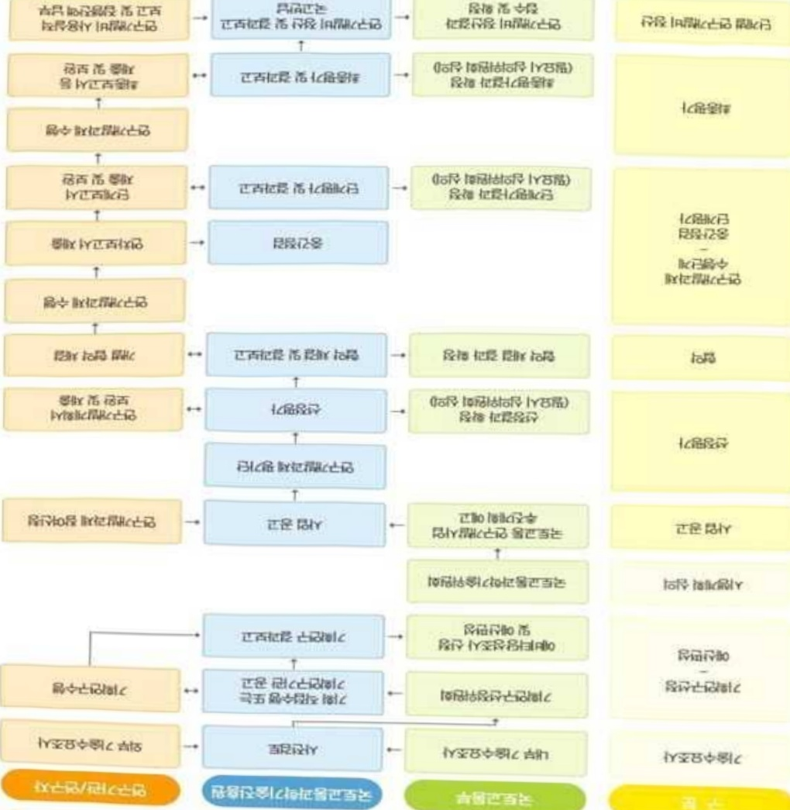

# 디지털도로기반클라우드형AI-ITS센터플랫폼운영관리기술개…

**해당 페이지**: PDF 2316 ~ 2323 쪽 해당

**부처**: 국토교통부
**분야**: 교통 및 물류
**회계유형**: 교통시설 특별회계
**2026 확정예산**: 1275.0 백만원
**전년대비 증감률**: None%
**AI 도메인**: 건설/스마트시티

---

### 가.예산 총괄표

(단위: 백만원, %)

<table border=1 style='margin: auto; word-wrap: break-word;'><tr><td rowspan="2">사업명</td><td rowspan="2">2024년 결산</td><td colspan="2">2025년 예산</td><td colspan="2">2026년</td><td rowspan="2">중감(B-A)</td><td rowspan="2">(B-A)/A</td></tr><tr><td style='text-align: center; word-wrap: break-word;'>본예산(A)</td><td style='text-align: center; word-wrap: break-word;'>추경</td><td style='text-align: center; word-wrap: break-word;'>정부안</td><td style='text-align: center; word-wrap: break-word;'>확정(B)</td></tr><tr><td style='text-align: center; word-wrap: break-word;'>디지털도로기반클라우드형AI-ITS센터플랫폼운영관리기술개발사업(R&amp;D)</td><td style='text-align: center; word-wrap: break-word;'>-</td><td style='text-align: center; word-wrap: break-word;'>-</td><td style='text-align: center; word-wrap: break-word;'>-</td><td style='text-align: center; word-wrap: break-word;'>1,275</td><td style='text-align: center; word-wrap: break-word;'>1,275</td><td style='text-align: center; word-wrap: break-word;'>1,275</td><td style='text-align: center; word-wrap: break-word;'>순증</td></tr></table>

□ 기능별(내역사업별), 목별 예산 내역

(단위:백만원)

<table border=1 style='margin: auto; word-wrap: break-word;'><tr><td rowspan="3"></td><td colspan="5">2024</td><td colspan="7">2025(2025.12월 말 기준)</td><td rowspan="3">2026예산</td></tr><tr><td rowspan="2">예산액(추정)</td><td rowspan="2">예산현액</td><td rowspan="2">집행액[실질행액]</td><td rowspan="2">이월액</td><td rowspan="2">불용액</td><td rowspan="2">본예산</td><td rowspan="2">예산현액</td><td rowspan="2">집행액[실질행액]</td><td colspan="2">전년도 이월액제외</td><td rowspan="2">이월예상액</td><td rowspan="2">불용예상액</td></tr><tr><td style='text-align: center; word-wrap: break-word;'>예산현액</td><td style='text-align: center; word-wrap: break-word;'>집행액[실질행액]</td></tr><tr><td style='text-align: center; word-wrap: break-word;'>○ 기능별 분류(합계)</td><td style='text-align: center; word-wrap: break-word;'>-</td><td style='text-align: center; word-wrap: break-word;'>-</td><td style='text-align: center; word-wrap: break-word;'>-</td><td style='text-align: center; word-wrap: break-word;'>-</td><td style='text-align: center; word-wrap: break-word;'>-</td><td style='text-align: center; word-wrap: break-word;'>-</td><td style='text-align: center; word-wrap: break-word;'>-</td><td style='text-align: center; word-wrap: break-word;'>-</td><td style='text-align: center; word-wrap: break-word;'>-</td><td style='text-align: center; word-wrap: break-word;'>-</td><td style='text-align: center; word-wrap: break-word;'>-</td><td style='text-align: center; word-wrap: break-word;'>-</td><td style='text-align: center; word-wrap: break-word;'>1,275</td></tr><tr><td style='text-align: center; word-wrap: break-word;'>· 디지털도로기반클라우드형AI-ITS센터플랫폼운영관리기술개발</td><td style='text-align: center; word-wrap: break-word;'>-</td><td style='text-align: center; word-wrap: break-word;'>-</td><td style='text-align: center; word-wrap: break-word;'>-</td><td style='text-align: center; word-wrap: break-word;'>-</td><td style='text-align: center; word-wrap: break-word;'>-</td><td style='text-align: center; word-wrap: break-word;'>-</td><td style='text-align: center; word-wrap: break-word;'>-</td><td style='text-align: center; word-wrap: break-word;'>-</td><td style='text-align: center; word-wrap: break-word;'>-</td><td style='text-align: center; word-wrap: break-word;'>-</td><td style='text-align: center; word-wrap: break-word;'>-</td><td style='text-align: center; word-wrap: break-word;'>-</td><td style='text-align: center; word-wrap: break-word;'>1,275</td></tr><tr><td style='text-align: center; word-wrap: break-word;'>○ 비목별 분류(합계)</td><td style='text-align: center; word-wrap: break-word;'>-</td><td style='text-align: center; word-wrap: break-word;'>-</td><td style='text-align: center; word-wrap: break-word;'>-</td><td style='text-align: center; word-wrap: break-word;'>-</td><td style='text-align: center; word-wrap: break-word;'>-</td><td style='text-align: center; word-wrap: break-word;'>-</td><td style='text-align: center; word-wrap: break-word;'>-</td><td style='text-align: center; word-wrap: break-word;'>-</td><td style='text-align: center; word-wrap: break-word;'>-</td><td style='text-align: center; word-wrap: break-word;'>-</td><td style='text-align: center; word-wrap: break-word;'>-</td><td style='text-align: center; word-wrap: break-word;'>-</td><td style='text-align: center; word-wrap: break-word;'>1,275</td></tr><tr><td style='text-align: center; word-wrap: break-word;'>· 연구개발활동비등(360-05)</td><td style='text-align: center; word-wrap: break-word;'>-</td><td style='text-align: center; word-wrap: break-word;'>-</td><td style='text-align: center; word-wrap: break-word;'>-</td><td style='text-align: center; word-wrap: break-word;'>-</td><td style='text-align: center; word-wrap: break-word;'>-</td><td style='text-align: center; word-wrap: break-word;'>-</td><td style='text-align: center; word-wrap: break-word;'>-</td><td style='text-align: center; word-wrap: break-word;'>-</td><td style='text-align: center; word-wrap: break-word;'>-</td><td style='text-align: center; word-wrap: break-word;'>-</td><td style='text-align: center; word-wrap: break-word;'>-</td><td style='text-align: center; word-wrap: break-word;'>-</td><td style='text-align: center; word-wrap: break-word;'>1,275</td></tr><tr><td style='text-align: center; word-wrap: break-word;'>○ 기능비목별 분류(합계)</td><td style='text-align: center; word-wrap: break-word;'>-</td><td style='text-align: center; word-wrap: break-word;'>-</td><td style='text-align: center; word-wrap: break-word;'>-</td><td style='text-align: center; word-wrap: break-word;'>-</td><td style='text-align: center; word-wrap: break-word;'>-</td><td style='text-align: center; word-wrap: break-word;'>-</td><td style='text-align: center; word-wrap: break-word;'>-</td><td style='text-align: center; word-wrap: break-word;'>-</td><td style='text-align: center; word-wrap: break-word;'>-</td><td style='text-align: center; word-wrap: break-word;'>-</td><td style='text-align: center; word-wrap: break-word;'>-</td><td style='text-align: center; word-wrap: break-word;'>-</td><td style='text-align: center; word-wrap: break-word;'>1,275</td></tr><tr><td style='text-align: center; word-wrap: break-word;'>· 디지털도로기반클라우드형AI-ITS센터플랫폼운영관리기술개발</td><td style='text-align: center; word-wrap: break-word;'>-</td><td style='text-align: center; word-wrap: break-word;'>-</td><td style='text-align: center; word-wrap: break-word;'>-</td><td style='text-align: center; word-wrap: break-word;'>-</td><td style='text-align: center; word-wrap: break-word;'>-</td><td style='text-align: center; word-wrap: break-word;'>-</td><td style='text-align: center; word-wrap: break-word;'>-</td><td style='text-align: center; word-wrap: break-word;'>-</td><td style='text-align: center; word-wrap: break-word;'>-</td><td style='text-align: center; word-wrap: break-word;'>-</td><td style='text-align: center; word-wrap: break-word;'>-</td><td style='text-align: center; word-wrap: break-word;'>-</td><td style='text-align: center; word-wrap: break-word;'>1,275</td></tr><tr><td style='text-align: center; word-wrap: break-word;'>· 연구개발활동비등(360-05)</td><td style='text-align: center; word-wrap: break-word;'>-</td><td style='text-align: center; word-wrap: break-word;'>-</td><td style='text-align: center; word-wrap: break-word;'>-</td><td style='text-align: center; word-wrap: break-word;'>-</td><td style='text-align: center; word-wrap: break-word;'>-</td><td style='text-align: center; word-wrap: break-word;'>-</td><td style='text-align: center; word-wrap: break-word;'>-</td><td style='text-align: center; word-wrap: break-word;'>-</td><td style='text-align: center; word-wrap: break-word;'>-</td><td style='text-align: center; word-wrap: break-word;'>-</td><td style='text-align: center; word-wrap: break-word;'>-</td><td style='text-align: center; word-wrap: break-word;'>-</td><td style='text-align: center; word-wrap: break-word;'>1,275</td></tr></table>

---

### 나. 사업설명자료

- (디지털도로기반클라우드형AI-ITS센터플랫폼운영관리기술개발) 공공-민간 간 교통정보 공동활용 촉진과 생성형·예측형 AI 기반 교통예측을 통해 고품질 교통정보 서비스 및 도로교통 운영관리 고도화

* 교통정보 제공단위 최소화(5분→1분, 위치정보→차로정보) 및 분석·가공 생성정보 정확도 95%

## 2 ) 사업개요

## □ 사업근거 및 추진경위

① 법령상 근거 및 조항 적시

○ 「국토교통과학기술육성법」 제8조(연구개발사업의 추진) ① 국토교통부장관은 종합계획을 효율적으로 추진하기 위하여 국토교통과학기술 연구개발사업(이하 “연구개발사업” 이라 한다)을 할 수 있다.

○ 「국가통합교통체계효율화법」제17조의2(교통빅데이터플랫폼의 구축·운영) ① 국토교통부장관은 중앙행정기관, 지방자치단체, 「공공기관의 운영에 관한 법률」 제4조에 따른 공공기관, 그 밖에 대통령령으로 정하는 기관의 장이 구축한 데이터베이스 및 시스템을 활용하여 교통빅데이터플랫폼(데이터의 연계 · 융합 분석을 위한 시스템을 말한다. 이하 같다)을 구축 · 운영할 수 있다.

제98조(교통기술 연구·개발사업의 추진) ① 국토교통부장관은 교통기술의 연구 · 개발을 효율적으로 추진하기 위하여 연도별 · 분야별 교통기술 연구 · 개발과제를 선정하여 다음 각 호의 기관 또는 단체 등과 협약을 맺어 교통기술 연구 · 개발사업을 하게 할 수 있다.

○「모빌리티 혁신 및 활성화 지원에 관한 법률」제21조(연구·개발 등) ① 국가는 첨단모빌리티 기술개발 및 관련 산업과의 연계를 촉진하기 위하여 필요한 연구 개발 사업을 할 수 있다.

○「인공지능 발전과 신뢰 기반 조성 등에 관한 기본법」※'26년 1월 시행 예정

제19조(인공지능 융합의 촉진) ① 정부는 인공지능산업과 그 밖의 산업 간 융

합을 촉진하고 전 분야에서 인공지능 활용을 활성화하기 위하여 필요한 시책을

수립하여 추진하여야 한다. ② 정부는 인공지능 융합 제품 및 서비스의 개발을

지원하기 위하여 필요한 경우에는「국가연구개발혁신법」에 따른 국가연구개

발사업에 인공지능 융합 제품 및 서비스에 관한 연구개발과제를 우선적으로 반

영하여 추진할 수 있다.

---

② 추진경위

- (21. 04.) 미래교통 통합운영관리 기술개발 기획 연구 추진

- (21. 10.) ITS 법정계획 「지능형교통체계 기본계획 2030」 수립

* 'AI기반 도로교통정보센터 고도화' 및 '디지털 트런 기반 교통관리체계 구현' 제시

- (22. 09.) 국토교통부「모빌리티 혁신 로드맵」 발표

* '미래 모빌리티를 위한 인프라 기반 마련', '이동시간의 획기적 단축과 서비스 다각화' 제시

-(23.12.) 교통재난 예방 및 대응을 위한 교통 안전관리 기술개발 기획 연구 추진

- (24. 11.) 국토교통과학기술진흥원 교통물류 자체 기획* 고도화

* 교통정보 서비스 혁신과 운영관리 업무 고도화, AI기반 미래교통 환경 대응 기술 개발 기획

□ 주요내용

① 사업규모

- 총사업비 : 해당없음

- 사업기간 : '26~'29

- 최근 5년 간 투입된 사업비(예산액기준, 추경편성한 연도에는 추경포함)

<table border=1 style='margin: auto; word-wrap: break-word;'><tr><td style='text-align: center; word-wrap: break-word;'>연도</td><td style='text-align: center; word-wrap: break-word;'>2022</td><td style='text-align: center; word-wrap: break-word;'>2023</td><td style='text-align: center; word-wrap: break-word;'>2024</td><td style='text-align: center; word-wrap: break-word;'>2025</td><td style='text-align: center; word-wrap: break-word;'>2026</td></tr><tr><td style='text-align: center; word-wrap: break-word;'>사업비</td><td style='text-align: center; word-wrap: break-word;'>-</td><td style='text-align: center; word-wrap: break-word;'>-</td><td style='text-align: center; word-wrap: break-word;'>-</td><td style='text-align: center; word-wrap: break-word;'>-</td><td style='text-align: center; word-wrap: break-word;'>1,275백만원</td></tr></table>

-기타: 해당없음

② 사업추진체계

- 사업시행방법 : 출연(참여기업이 있는 경우 Matching)

- 사업시행주체 : 국토교통부(전문기관 : 국토교통과학기술진흥원)

- 사업 수혜자 : 대학, 기업, 출연연 등

- 보조, 융자, 출연, 출자 등의 경우 보조·융자 등 지원 비율 및 법적근거

---

<table border=1 style='margin: auto; word-wrap: break-word;'><tr><td style='text-align: center; word-wrap: break-word;'>내역사업명</td><td style='text-align: center; word-wrap: break-word;'>구분</td><td style='text-align: center; word-wrap: break-word;'>피보조·피출연 등 기관명</td><td style='text-align: center; word-wrap: break-word;'>지원 금액 (2026예산)</td><td style='text-align: center; word-wrap: break-word;'>지원 비율(%)</td><td style='text-align: center; word-wrap: break-word;'>보조율 법적근거 (해당 조항)</td></tr><tr><td rowspan="3">디지털도로 기반클라우드형AI-ITS센터플랫폼 운영관리 기술개발</td><td rowspan="3">출연</td><td style='text-align: center; word-wrap: break-word;'>「중소기업기본법」제2조에 따른 중소기업에 해당하는 연구개발기관</td><td rowspan="3">1,275 백만원</td><td style='text-align: center; word-wrap: break-word;'>연구개발 비의 100분의 75 이하</td><td rowspan="3">「국가연구개발 혁신법 시행령」 제19조</td></tr><tr><td style='text-align: center; word-wrap: break-word;'>「중견기업 성장촉진 및 경쟁력 강화에 관한 특별법」제2조제1호에 따른 중견기업에 해당하는 연구개발기관</td><td style='text-align: center; word-wrap: break-word;'>연구개발 비의 100분의 70 이하</td></tr><tr><td style='text-align: center; word-wrap: break-word;'>「공공기관의 운영에 관한 법률」제5조제4항제1호에 따른 공기업에 해당하거나 ‘가’, ‘낙’에 해당 해당하지 않는 연구개발기관</td><td style='text-align: center; word-wrap: break-word;'>연구개발 비의 100분의 50 이하</td></tr></table>

*다만,중앙행정기관의 장이 필요하다고 인정하는 국가연구개발사업에 대하여 별도로 정할 수 있음

## 3 ) 2026년도 예산 산출 근거

□ 디지털도로 기반 클라우드형 AI-ITS 센터플랫폼 운영관리 기술개발 : (2025) - → (2026 확정) 1,275백만원

① 디지털도로 기반 클라우드형 AI-ITS 센터플랫폼 운영관리 기술개발 : (2025) - → (2026 확정) 1,275백만원, 1,275백만원 증액

- (편성) 공공-민간 공동활용이 가능한 데이터 연계 통합 수집·관리와 고품질 교통정보 생성을 위한 도로교통 데이터 분석·예측 등 AI-ITS 플랫폼 핵심 요소기술 설계 추진 등을 위한 예산반영

-(산출) ① 공공-민간 도로교통 데이터 공동활용 거버넌스 및 정보 유동·가공·활용 체계 마련 575백만원

② AI-ITS 플랫폼 소통상황, 사고위험, 재해재난 분석 알고리즘 및 운용기술 설계 500백만원

③ AI-ITS 플랫폼 논리·물리 아키텍쳐 개발 200백만원

·(신규) 1개 × 1,700백만원 × 9/12 = 1,275백만원

02025년도 예산 및 2026년도 예산 산출 세부내역 비교

<table border=1 style='margin: auto; word-wrap: break-word;'><tr><td colspan="2">2025년 예산</td><td colspan="2">2026년 예산</td></tr><tr><td style='text-align: center; word-wrap: break-word;'>예산</td><td style='text-align: center; word-wrap: break-word;'>산출내역</td><td style='text-align: center; word-wrap: break-word;'>예산</td><td style='text-align: center; word-wrap: break-word;'>산출내역</td></tr><tr><td rowspan="4">-</td><td rowspan="4">-</td><td rowspan="4">1,275</td><td style='text-align: center; word-wrap: break-word;'>☐ 연구활동비 등(360-05): 1,275백만원</td></tr><tr><td style='text-align: center; word-wrap: break-word;'>가. 공공·민간 도로교통 데이터 공동활용 거버넌스 및 정보 유동· 가공·활용 체계 마련 575백만원</td></tr><tr><td style='text-align: center; word-wrap: break-word;'>나. AI-ITS 플랫폼 소통상황, 사고위험, 재해재난 분석 알고리즘 및 운용기술 설계 500백만원</td></tr><tr><td style='text-align: center; word-wrap: break-word;'>다. AI-ITS 플랫폼 논리·물리 아키텍쳐 개발 200백만원</td></tr></table>

---

## 4 ) 사업효과

☐ 사업영향, 산출물 성과지표 등

① 2022~2026년도 성과계획서 상 성과지표 및 최근 5년간 성과 달성도: 해당없음

('26년 신규)

② 성과지표 이외의 연도별 사업추진 경과 및 실적 : 해당없음('26년 신규)

③ 향후(2026년도 이후) 기대효과

- 공공-민간 교통정보 공동활용 체계 마련 및 연계 환경 구축

* 공공/민간 데이터 5종 이상 통합 연계 · 분석, 민간 서비스 플랫폼 2곳 이상 정보 활용 연계

- AI-ITS 플랫폼 기술 도입 서비스(실시간성, 정확도, 만족도) 향상

* 정보해상도(링크/5분단위→차로/1분단위), 정확도(현실정합성 85→95%), 만족도(76→85점)

- 클라우드형 AI-ITS 플랫폼 기능/서비스 실증으로 목표성능 검증

* 도로관리주체 1곳 참여, 실도로 환경 1년 실증, 민간 플랫폼 1곳 참여. 신규 서비스 2종 도입

5) 타당성조사 및 예비타당성조사 시행여부 및 결과 요지 : 해당없음

6) 총사업비 대상사업 여부 및 내역 : 해당없음

---

<table border=1 style='margin: auto; word-wrap: break-word;'><tr><td style='text-align: center; word-wrap: break-word;'>부처</td><td style='text-align: center; word-wrap: break-word;'></td><td style='text-align: center; word-wrap: break-word;'>피출연·피보조기관</td><td style='text-align: center; word-wrap: break-word;'>간접보조사업자·사업수행자</td></tr><tr><td style='text-align: center; word-wrap: break-word;'>국토교통부(1,275백만원)</td><td style='text-align: center; word-wrap: break-word;'>=&gt;(1,275백만원)</td><td style='text-align: center; word-wrap: break-word;'>국토교통과학기술진흥원(1,275백만원)</td><td style='text-align: center; word-wrap: break-word;'>=&gt;(1,275백만원)</td></tr></table>

<디지털도로기반클라우드형AI-ITS센터플랫폼운영관리기술개발>

---

8) 중기재정계획 상 연도별 투자계획 및 추진경과

(단위: 백만원)

<table border=1 style='margin: auto; word-wrap: break-word;'><tr><td style='text-align: center; word-wrap: break-word;'>$ 중기 $ 재정계획</td><td style='text-align: center; word-wrap: break-word;'>2024</td><td style='text-align: center; word-wrap: break-word;'>2025</td><td style='text-align: center; word-wrap: break-word;'>2026</td><td style='text-align: center; word-wrap: break-word;'>2027</td><td style='text-align: center; word-wrap: break-word;'>2028</td><td style='text-align: center; word-wrap: break-word;'>2029</td></tr><tr><td style='text-align: center; word-wrap: break-word;'>2024~2028</td><td style='text-align: center; word-wrap: break-word;'>-</td><td style='text-align: center; word-wrap: break-word;'>-</td><td style='text-align: center; word-wrap: break-word;'>-</td><td style='text-align: center; word-wrap: break-word;'>-</td><td style='text-align: center; word-wrap: break-word;'>-</td><td style='text-align: center; word-wrap: break-word;'>☑</td></tr><tr><td style='text-align: center; word-wrap: break-word;'>2025~2029</td><td style='text-align: center; word-wrap: break-word;'>-</td><td style='text-align: center; word-wrap: break-word;'>-</td><td style='text-align: center; word-wrap: break-word;'>3,000</td><td style='text-align: center; word-wrap: break-word;'>6,900</td><td style='text-align: center; word-wrap: break-word;'>8,800</td><td style='text-align: center; word-wrap: break-word;'>2,300</td></tr></table>

9) 최근 3년간 동 사업에 대한 주요 외부지적사항 및 평가, 문제점 및 대책 : 해당없음('26년 신규')

10) 향후 추진방향 및 추진계획

<table border=1 style='margin: auto; word-wrap: break-word;'><tr><td style='text-align: center; word-wrap: break-word;'>○ AI-ITS 센터플랫폼 요소기술 개발 및 핵심기술 확보(‘26~’27)</td></tr><tr><td style='text-align: center; word-wrap: break-word;'>○ 실증대상 선정 및 계획 구체화, 실도로 실증 수행(효과검증 포함) (‘28~’29)</td></tr></table>

11) 해당사업에 대한 각종 사업평가의 결과 : 해당없음('26년 신규)

12) 해당사업에 대한 부처 자체평가의 결과 : 해당없음(26년 신규)

13) 부처 건의사항 : 해당없음('26년 신규)

---

<table border=1 style='margin: auto; word-wrap: break-word;'><tr><td style='text-align: center; word-wrap: break-word;'>사 업 명</td></tr><tr><td style='text-align: center; word-wrap: break-word;'>(6) 디지털트윈 국토정보보안 기술개발(R&amp;D) (4156-371)</td></tr></table>

□ 사업 코드 정보

<table border=1 style='margin: auto; word-wrap: break-word;'><tr><td style='text-align: center; word-wrap: break-word;'>구분</td><td style='text-align: center; word-wrap: break-word;'>회계</td><td style='text-align: center; word-wrap: break-word;'>소관</td><td style='text-align: center; word-wrap: break-word;'>실국(기관)</td><td style='text-align: center; word-wrap: break-word;'>계정</td><td style='text-align: center; word-wrap: break-word;'>분야</td><td style='text-align: center; word-wrap: break-word;'>부문</td></tr><tr><td style='text-align: center; word-wrap: break-word;'>코드</td><td rowspan="2">일반회계</td><td rowspan="2">국토교통부</td><td style='text-align: center; word-wrap: break-word;'>국토도시실</td><td rowspan="2">-</td><td style='text-align: center; word-wrap: break-word;'>120</td><td style='text-align: center; word-wrap: break-word;'>126</td></tr><tr><td style='text-align: center; word-wrap: break-word;'>명칭</td><td style='text-align: center; word-wrap: break-word;'>국토정보정책관</td><td style='text-align: center; word-wrap: break-word;'>교통및물류</td><td style='text-align: center; word-wrap: break-word;'>물류등기타</td></tr></table>

<table border=1 style='margin: auto; word-wrap: break-word;'><tr><td style='text-align: center; word-wrap: break-word;'>구분</td><td style='text-align: center; word-wrap: break-word;'>프로그램</td><td style='text-align: center; word-wrap: break-word;'>단위사업</td><td style='text-align: center; word-wrap: break-word;'>세부사업</td></tr><tr><td style='text-align: center; word-wrap: break-word;'>코드</td><td style='text-align: center; word-wrap: break-word;'>4100</td><td style='text-align: center; word-wrap: break-word;'>4156</td><td style='text-align: center; word-wrap: break-word;'>371</td></tr><tr><td style='text-align: center; word-wrap: break-word;'>명칭</td><td style='text-align: center; word-wrap: break-word;'>국토교통연구개발</td><td style='text-align: center; word-wrap: break-word;'>도시건축연구</td><td style='text-align: center; word-wrap: break-word;'>디지털트윈국토정보보안기술개발(R&amp;D)</td></tr></table>

□ 사업 성격

<table border=1 style='margin: auto; word-wrap: break-word;'><tr><td rowspan="2">신규</td><td rowspan="2">계속</td><td rowspan="2">완료</td><td style='text-align: center; word-wrap: break-word;'>예비타당성</td><td style='text-align: center; word-wrap: break-word;'>총사업비</td><td style='text-align: center; word-wrap: break-word;'>총액계상</td><td style='text-align: center; word-wrap: break-word;'>사업소관 변경정보</td></tr><tr><td style='text-align: center; word-wrap: break-word;'>실시여부</td><td style='text-align: center; word-wrap: break-word;'>관리대상</td><td style='text-align: center; word-wrap: break-word;'>예산사업</td><td style='text-align: center; word-wrap: break-word;'>2025예산 시 소관</td></tr><tr><td style='text-align: center; word-wrap: break-word;'>○</td><td style='text-align: center; word-wrap: break-word;'></td><td style='text-align: center; word-wrap: break-word;'></td><td style='text-align: center; word-wrap: break-word;'></td><td style='text-align: center; word-wrap: break-word;'></td><td style='text-align: center; word-wrap: break-word;'></td><td style='text-align: center; word-wrap: break-word;'></td></tr></table>

□ 사업 지원 형태 및 지원을 (최소한 한 개는 반드시 선택하시오. 해당사항에 O 표시)

<table border=1 style='margin: auto; word-wrap: break-word;'><tr><td style='text-align: center; word-wrap: break-word;'>직접</td><td style='text-align: center; word-wrap: break-word;'>출자</td><td style='text-align: center; word-wrap: break-word;'>출연</td><td style='text-align: center; word-wrap: break-word;'>보조</td><td style='text-align: center; word-wrap: break-word;'>융자</td><td style='text-align: center; word-wrap: break-word;'>국고보조율(%)</td><td style='text-align: center; word-wrap: break-word;'>융자율(%)</td></tr><tr><td style='text-align: center; word-wrap: break-word;'></td><td style='text-align: center; word-wrap: break-word;'></td><td style='text-align: center; word-wrap: break-word;'>○</td><td style='text-align: center; word-wrap: break-word;'></td><td style='text-align: center; word-wrap: break-word;'></td><td style='text-align: center; word-wrap: break-word;'></td><td style='text-align: center; word-wrap: break-word;'></td></tr></table>

## □ 사업 담당자

<table border=1 style='margin: auto; word-wrap: break-word;'><tr><td style='text-align: center; word-wrap: break-word;'>사업명</td><td colspan="2">구분</td></tr><tr><td rowspan="5">디지털 트윈국토정보 보안기술 개발(R&amp;D)</td><td rowspan="3">소관부처</td><td style='text-align: center; word-wrap: break-word;'>실·국·과(팀)</td></tr><tr><td style='text-align: center; word-wrap: break-word;'>국토정보정책관</td></tr><tr><td style='text-align: center; word-wrap: break-word;'>국가공간정보센터</td></tr><tr><td rowspan="2">사업시행주체</td><td style='text-align: center; word-wrap: break-word;'>국토교통과학기술진흥원</td></tr><tr><td style='text-align: center; word-wrap: break-word;'>도시공간정보실</td></tr></table>

---

### 원본 PDF 크롭 이미지

