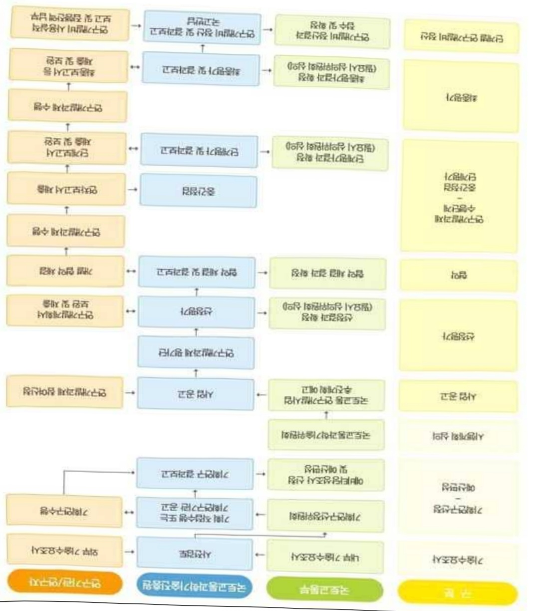

# 디지털트윈기반GTX환승안전및혁신기술개발사업(R&D)

**해당 페이지**: PDF 2333 ~ 2341 쪽 해당

**부처**: 국토교통부
**분야**: 교통 및 물류
**회계유형**: 일반회계
**2026 확정예산**: 4000.0 백만원
**전년대비 증감률**: None%
**AI 도메인**: 건설/스마트시티

---

### 가.예산 총괄표

(단위: 백만원, %)

<table border=1 style='margin: auto; word-wrap: break-word;'><tr><td rowspan="2">사업명</td><td rowspan="2">2024년 결산</td><td colspan="2">2025년 예산</td><td colspan="2">2026년</td><td rowspan="2">증감(B-A)</td><td rowspan="2">(B-A)/A</td></tr><tr><td style='text-align: center; word-wrap: break-word;'>본예산(A)</td><td style='text-align: center; word-wrap: break-word;'>추경</td><td style='text-align: center; word-wrap: break-word;'>정부안</td><td style='text-align: center; word-wrap: break-word;'>확정(B)</td></tr><tr><td style='text-align: center; word-wrap: break-word;'>디지털트윈기반GTX 환승안전및혁신기술 개발사업(R&amp;D)</td><td style='text-align: center; word-wrap: break-word;'>-</td><td style='text-align: center; word-wrap: break-word;'>-</td><td style='text-align: center; word-wrap: break-word;'>-</td><td style='text-align: center; word-wrap: break-word;'>4,000</td><td style='text-align: center; word-wrap: break-word;'>4,000</td><td style='text-align: center; word-wrap: break-word;'>4,000</td><td style='text-align: center; word-wrap: break-word;'>순증</td></tr></table>

□ 기능별(내역사업별), 목별 예산 내역

(단위:백만원)

<table border=1 style='margin: auto; word-wrap: break-word;'><tr><td rowspan="3"></td><td colspan="5">2024</td><td colspan="7">2025(2025.12월 말 기준)</td><td rowspan="3">2026예산</td></tr><tr><td rowspan="2">예산액(추경)</td><td rowspan="2">예산현액</td><td rowspan="2">집행액[실집행액]</td><td rowspan="2">이월액</td><td rowspan="2">불용액</td><td rowspan="2">본예산</td><td rowspan="2">예산현액</td><td rowspan="2">집행액[실집행액]</td><td colspan="2">전년도 이월액제외</td><td rowspan="2">이월예상액</td><td rowspan="2">불용예상액</td></tr><tr><td style='text-align: center; word-wrap: break-word;'>예산현액</td><td style='text-align: center; word-wrap: break-word;'>집행액[실집행액]</td></tr><tr><td style='text-align: center; word-wrap: break-word;'>○ 기능별 분류(합계)</td><td style='text-align: center; word-wrap: break-word;'>-</td><td style='text-align: center; word-wrap: break-word;'>-</td><td style='text-align: center; word-wrap: break-word;'>-</td><td style='text-align: center; word-wrap: break-word;'>-</td><td style='text-align: center; word-wrap: break-word;'>-</td><td style='text-align: center; word-wrap: break-word;'>-</td><td style='text-align: center; word-wrap: break-word;'>-</td><td style='text-align: center; word-wrap: break-word;'>-</td><td style='text-align: center; word-wrap: break-word;'>-</td><td style='text-align: center; word-wrap: break-word;'>-</td><td style='text-align: center; word-wrap: break-word;'>-</td><td style='text-align: center; word-wrap: break-word;'>-</td><td style='text-align: center; word-wrap: break-word;'>4,000</td></tr><tr><td style='text-align: center; word-wrap: break-word;'>· 디지털 트윈 기반 GTX 환승안전 및 혁신기술 개발</td><td style='text-align: center; word-wrap: break-word;'>-</td><td style='text-align: center; word-wrap: break-word;'>-</td><td style='text-align: center; word-wrap: break-word;'>-</td><td style='text-align: center; word-wrap: break-word;'>-</td><td style='text-align: center; word-wrap: break-word;'>-</td><td style='text-align: center; word-wrap: break-word;'>-</td><td style='text-align: center; word-wrap: break-word;'>-</td><td style='text-align: center; word-wrap: break-word;'>-</td><td style='text-align: center; word-wrap: break-word;'>-</td><td style='text-align: center; word-wrap: break-word;'>-</td><td style='text-align: center; word-wrap: break-word;'>-</td><td style='text-align: center; word-wrap: break-word;'>-</td><td style='text-align: center; word-wrap: break-word;'>4,000</td></tr><tr><td style='text-align: center; word-wrap: break-word;'>○ 비목별 분류(합계)</td><td style='text-align: center; word-wrap: break-word;'>-</td><td style='text-align: center; word-wrap: break-word;'>-</td><td style='text-align: center; word-wrap: break-word;'>-</td><td style='text-align: center; word-wrap: break-word;'>-</td><td style='text-align: center; word-wrap: break-word;'>-</td><td style='text-align: center; word-wrap: break-word;'>-</td><td style='text-align: center; word-wrap: break-word;'>-</td><td style='text-align: center; word-wrap: break-word;'>-</td><td style='text-align: center; word-wrap: break-word;'>-</td><td style='text-align: center; word-wrap: break-word;'>-</td><td style='text-align: center; word-wrap: break-word;'>-</td><td style='text-align: center; word-wrap: break-word;'>-</td><td style='text-align: center; word-wrap: break-word;'>4,000</td></tr><tr><td style='text-align: center; word-wrap: break-word;'>· 연 구 활 동 비 등 (360-05)</td><td style='text-align: center; word-wrap: break-word;'>-</td><td style='text-align: center; word-wrap: break-word;'>-</td><td style='text-align: center; word-wrap: break-word;'>-</td><td style='text-align: center; word-wrap: break-word;'>-</td><td style='text-align: center; word-wrap: break-word;'>-</td><td style='text-align: center; word-wrap: break-word;'>-</td><td style='text-align: center; word-wrap: break-word;'>-</td><td style='text-align: center; word-wrap: break-word;'>-</td><td style='text-align: center; word-wrap: break-word;'>-</td><td style='text-align: center; word-wrap: break-word;'>-</td><td style='text-align: center; word-wrap: break-word;'>-</td><td style='text-align: center; word-wrap: break-word;'>-</td><td style='text-align: center; word-wrap: break-word;'>4,000</td></tr><tr><td style='text-align: center; word-wrap: break-word;'>○ 기능·비목별 분류(합계)</td><td style='text-align: center; word-wrap: break-word;'>-</td><td style='text-align: center; word-wrap: break-word;'>-</td><td style='text-align: center; word-wrap: break-word;'>-</td><td style='text-align: center; word-wrap: break-word;'>-</td><td style='text-align: center; word-wrap: break-word;'>-</td><td style='text-align: center; word-wrap: break-word;'>-</td><td style='text-align: center; word-wrap: break-word;'>-</td><td style='text-align: center; word-wrap: break-word;'>-</td><td style='text-align: center; word-wrap: break-word;'>-</td><td style='text-align: center; word-wrap: break-word;'>-</td><td style='text-align: center; word-wrap: break-word;'>-</td><td style='text-align: center; word-wrap: break-word;'>-</td><td style='text-align: center; word-wrap: break-word;'>4,000</td></tr><tr><td style='text-align: center; word-wrap: break-word;'>· 디지털 트윈 기반 GTX 환승안전 및 혁신기술 개발</td><td style='text-align: center; word-wrap: break-word;'>-</td><td style='text-align: center; word-wrap: break-word;'>-</td><td style='text-align: center; word-wrap: break-word;'>-</td><td style='text-align: center; word-wrap: break-word;'>-</td><td style='text-align: center; word-wrap: break-word;'>-</td><td style='text-align: center; word-wrap: break-word;'>-</td><td style='text-align: center; word-wrap: break-word;'>-</td><td style='text-align: center; word-wrap: break-word;'>-</td><td style='text-align: center; word-wrap: break-word;'>-</td><td style='text-align: center; word-wrap: break-word;'>-</td><td style='text-align: center; word-wrap: break-word;'>-</td><td style='text-align: center; word-wrap: break-word;'>-</td><td style='text-align: center; word-wrap: break-word;'>4,000</td></tr><tr><td style='text-align: center; word-wrap: break-word;'>· 연 구 활 동 비 등 (360-05)</td><td style='text-align: center; word-wrap: break-word;'>-</td><td style='text-align: center; word-wrap: break-word;'>-</td><td style='text-align: center; word-wrap: break-word;'>-</td><td style='text-align: center; word-wrap: break-word;'>-</td><td style='text-align: center; word-wrap: break-word;'>-</td><td style='text-align: center; word-wrap: break-word;'>-</td><td style='text-align: center; word-wrap: break-word;'>-</td><td style='text-align: center; word-wrap: break-word;'>-</td><td style='text-align: center; word-wrap: break-word;'>-</td><td style='text-align: center; word-wrap: break-word;'>-</td><td style='text-align: center; word-wrap: break-word;'>-</td><td style='text-align: center; word-wrap: break-word;'>-</td><td style='text-align: center; word-wrap: break-word;'>4,000</td></tr></table>

---

### 나. 사업설명자료

## 1 ) 사업목적·내용

- (디지털 트윈 기반 GTX 환승안전 및 혁신기술 개발) 제한된 GTX 수혜지역을 확대하고 환승센터내 인과 밀집으로 인한 혼잡을 해소하기 위한 GTX 환승센터의 접근성과 안전 향상 기술 개발을 통해 국민의 안전과 편의 제고

## 2 ) 사업개요

## □ 사업근거 및 추진경위

① 법령상 근거 및 조항 적시

- 대도시권 광역교통 관리에 관한 특별법 제7조의11(환승편의성 검토) ① 국토교통부 장관 또는 시 · 도지사는 대도시권에 2개 이상의 노선이 교차하는 도시철도 또는 철도 역의 건설 또는 개량사업으로서 대통령령으로 정하는 사업을 시행하는 경우 다음 각 호의 계획의 수립 또는 공고 전에 이용자가 다른 노선이나 교통수단을 편리하게 이용할 수 있도록 환승거리, 환승시간 등의 편의성에 대한 검토(이하 “환승편의성 검토”라 한다)를 하여야 한다.

- 국가통합교통체계효율화법 제41조(연계교통체계지침) ① 국토교통부장관은 연계교통체계의 구축 및 교통시설 간 연계 · 환승 등에 관한 기준 및 방법 등에 관한 연계교통체계지침을 수립하여 관계 행정기관의 장에게 통보하여야 한다.

- 국가통합교통체계효율화법 제44조(환승센터 및 복합환승센터 구축 기본계획) ① 국토교통부장관은 환승센터 및 복합환승센터의 체계적인 구축을 위하여 5년 단위로 환승센터 및 복합환승센터 구축 기본계획을 국가교통위원회의 심의를 거쳐 수립하여야 한다. ② 제1항에 따른 환승센터 및 복합환승센터 구축 기본계획에는 다음 각 호의 사항이 포함되어야 한다.

1. 환승센터 및 복합환승센터 구축에 관한 중장기 정책방향, 2. 환승정책에 대한 분석 · 평가, 3. 주요 연계 · 환승시설 현황조사 분석, 4. 교통망 분석을 통한 효과 제시, 5. 환승센터 및 복합환승센터 서비스 제고 방안, 6. 환승센터 및 복합환승센터 시설 배치 방안, 7. 효율적인 복합환승센터 개발을 위한 추진 방향, 8. 복합환승센터의 기본 개발 방안, 9. 복합환승센터의 구축에 따른 개략적인 사업비 추정, 10. 그 밖에 환승센터 및 복합환승센터 구축, 복합환승센터 개발 등에 관하여 대통령령으로 정하는 사항

---

- 국가통합교통체계효율화법 제50조(복합환승센터개발실시계획의 승인) ① 사업시행자는 대통령령으로 정하는 바에 따라 복합환승센터 개발사업의 실시계획(이하 “복합환승센터개발실시계획”이라 한다)을 수립하여 지정권자의 승인을 받아야 한다. 승인을 받은 사항 중 대통령령으로 정하는 중요 사항을 변경하려는 경우에도 또한 같다. ② 사업시행자가 복합환승센터개발실시계획을 수립할 때에는 국토교통부장관이 정하여 고시하는 환승센터(정보안내시설을 포함한다)의 설계 및 배치 기준에 따라야 한다.

- 환승센터 및 복합환승센터 설계·배치 기준(제1장 총칙) 1.1. 목적 이 기준은 「국가통합교통체계효율화법」 제50조에 따라 환승센터 및 복합환승센터의 설계·배치에 관한 세부적인 사항을 정하는 것을 목적으로 한다.

- 환승센터 및 복합환승센터 설계·배치 기준(제3장 시설의 배치 기준) 3.1.1. 환승센터 및 복합환승센터의 연계환승기능을 촉진하기 위하여 환승센터 및 복합환승센터에는 철도역 등 연계환승거점시설들이 집단적으로 입지하거나 이를 중심으로 필요한 연계환승체계를 구축하여야 한다. 3.1.2. 환승센터 및 복합환승센터에 입지한 연계교통수단의 승하차 시설 등 환승시설은 이용자가 편리하게 교통수단을 이용할 수 있도록 짧은 동선 체계를 갖추고 주교통수단과의 환승거리를 최소화하여 서비스 수준을 높이며, 상호 연속성을 가질 수 있도록 효율적으로 배치해야 한다. 3.1.3. 복합환승센터의 환승지원시설은 대중교통 중심의 공간구조를 확보하기 위해 환승시설과 상호 연계성을 가지고 일단의 단지 내에 같이 입지하여야 하고, 도시개발 등 토지이용과 조화를 이루어야 하며, 주교통수단과 연계교통수단의 이용편의를 저해하지 않도록 배치하여야 한다.

## ② 추진경위

- 제2차 국토교통과학기술 연구개발 종합계획('22년)

· 기술과제 6번「포용적이고 안전한 모빌리티」와 연관된 과제

· 대표 브랜드과제 12대 STAR 프로그램 中「이용자 중심 모빌리티」에 해당

-다수단 모빌리티 이동편의 향상을 위한 첨단 모빌리티 연계환승 운영기술 기획('22년)

* 주관연구개발기관: (주)리디자인엑스, 연구기간: '22.8~'24.3

- GTX 환승 요구변화를 고려한 광역교통 정책지원 연구 기획('24년, 한국철도연구원 자체 사업)

* 주관연구개발기관: 한국철도기술연구원, 연구기간: '24.5~'24.12

- 대광위, 미래 광역교통확신 체계 고도화를 위한 환승 혁신 포럼 발족('23.6)

· 제1회 환승 혁신 포럼(모빌리티 혁신과 연계한 미래 환승 정책방향, '23.6)

---

· 제2회 환승 혁신 포럼(데이터 기반 환승체계 개선 '24.11)

- 대도시권 광역교통 R&D 로드맵 설명회('25.6)

· 전략 2. 미래형 광역교통 인프라 운영체계 구축 “지능형 확장 디지털 플랫폼을 활용한 환승센터 통합 관리 기술 개발” 등

- 제21대 대통령선거 정책공약 및 국정과제('25년)

(정책공약) (생활안정 22) 편리하고 안전한 교통·물류환경을 만들겠습니다

→ 국민이 자유롭게 이동하고 편리하게 교통을 이용할 수 있도록 교통기본법

제정 추진

(국정과제) 31. 미래 모빌리티와 K-AI 시티 실현

## □ 주요내용

① 사업규모

- 총사업비 : 해당없음

- 사업기간 : '26 ~ '29

- 최근 5년 간 투입된 사업비(예산액기준, 추경편성한 연도에는 추경포함)

<table border=1 style='margin: auto; word-wrap: break-word;'><tr><td style='text-align: center; word-wrap: break-word;'>연도</td><td style='text-align: center; word-wrap: break-word;'>2022</td><td style='text-align: center; word-wrap: break-word;'>2023</td><td style='text-align: center; word-wrap: break-word;'>2024</td><td style='text-align: center; word-wrap: break-word;'>2025</td><td style='text-align: center; word-wrap: break-word;'>2026</td></tr><tr><td style='text-align: center; word-wrap: break-word;'>사업비</td><td style='text-align: center; word-wrap: break-word;'>-</td><td style='text-align: center; word-wrap: break-word;'>-</td><td style='text-align: center; word-wrap: break-word;'>-</td><td style='text-align: center; word-wrap: break-word;'>-</td><td style='text-align: center; word-wrap: break-word;'>4,000</td></tr></table>

-기타: 해당없음

② 사업추진체계

- 사업시행방법 : 출연(참여기업이 있는 경우 Matching)

- 사업시행주체 : 국토교통부(전문기관 : 국토교통과학기술진흥원)

- 사업 수혜자 : 대학, 기업, 출연연 등

- 보조, 융자, 출연, 출자 등의 경우 보조·융자 등 지원 비율 및 법적근거

<table border=1 style='margin: auto; word-wrap: break-word;'><tr><td style='text-align: center; word-wrap: break-word;'>내역사업명</td><td style='text-align: center; word-wrap: break-word;'>구분</td><td style='text-align: center; word-wrap: break-word;'>피보조·피출연 등 기관명</td><td style='text-align: center; word-wrap: break-word;'>지원 금액 (2026예산)</td><td style='text-align: center; word-wrap: break-word;'>지원 비율(%)</td><td style='text-align: center; word-wrap: break-word;'>보조율 법적근거 (해당 조항)</td></tr><tr><td rowspan="3">디지털 트렌 기반 GTX 환승안전 및 혁신기술 개발</td><td rowspan="3">출연</td><td style='text-align: center; word-wrap: break-word;'>「중소기업기본법」제2조에 따른 중소기업에 해당하는 연구개발기관</td><td rowspan="3">4,000 백만원</td><td style='text-align: center; word-wrap: break-word;'>연구개발 비의 100분의 75 이하</td><td rowspan="3">「국가연구개발 혁신법 시행령」제19조</td></tr><tr><td style='text-align: center; word-wrap: break-word;'>「중견기업 성장촉진 및 경쟁력 강화에 관한 특별법」제2조제1호에 따른 중견기업에 해당하는 연구개발기관</td><td style='text-align: center; word-wrap: break-word;'>연구개발 비의 100분의 70 이하</td></tr><tr><td style='text-align: center; word-wrap: break-word;'>「공공기관의 운영에 관한 법률」제5조제4항제1호에 따른 공기업에 해당하거나 ‘가’, ‘나’에 해당 해당하지 않는 연구개발기관</td><td style='text-align: center; word-wrap: break-word;'>연구개발 비의 100분의 50 이하</td></tr></table>

* 다만, 중앙행정기관의 장이 필요하다고 인정하는 국가연구개발사업에 대하여 별도로 정할 수 있음

---

## 3 ) 2026년도 예산 산출 근거

① 디지털 트윈 기반 GTX 환승안전 및 혁신기술 개발

:(25)0→(26)4,000백만원,4,000백만원 증액

- GTX 환승센터의 접근성과 안전성 향상을 위해 이용자 중심 환승센터 접근편의성 향상 기술 개발, 디지털 트윈 및 생성형 AI 기반 환승센터 안전성 향상 기술 개발, 환승센터 편의·안전기술 실증 등 사업 착수를 위한 예산 4,000백만원 소요

- (산출) ① GTX 환승센터 이용자 편의 종합평가 지수 개발, GTX 환승센터 접근편의성 분석 시스템 설계 등 800백만원

② GTX 환승센터 디지털 트윈 주요기능 설계, 무선신호 및 비전 센서 융합 기반 비상상황 실시간 감지 기술 설계 등 1,700백만원

③ GTX 환승센터 편의·안전 기술 실증 대상지 선정 및 실증계획 수립, GTX 환승센터 실증을 위한 통합 운영 시스템 설계, 법제도 개선방안 도출 등 885백만원

④ 비상상황 대응 및 제어 자동화 기술에 활용할 생성형 AI 모델 파인튜닝 방안 도출 400백만원

⑤ GTX 환승센터 편의 서비스 USE CASE 발굴 및 시나리오 설계 등 215백만원

·(신규) 1개 × 5,333백만원 × 9/12 = 4,000백만원

2025년도 예산 및 2026년도 예산 산출 세부내역 비교

<table border=1 style='margin: auto; word-wrap: break-word;'><tr><td colspan="2">&#x27;25년 예산</td><td colspan="2">&#x27;26년 예산</td></tr><tr><td style='text-align: center; word-wrap: break-word;'>예산</td><td style='text-align: center; word-wrap: break-word;'>산출내역</td><td style='text-align: center; word-wrap: break-word;'>예산</td><td style='text-align: center; word-wrap: break-word;'>산출내역</td></tr><tr><td style='text-align: center; word-wrap: break-word;'>-</td><td style='text-align: center; word-wrap: break-word;'>-</td><td style='text-align: center; word-wrap: break-word;'>4,000 백만원</td><td style='text-align: center; word-wrap: break-word;'>○ 연구활동비 등(360-05): 4,000백만원 가. GTX 환승센터 이용자 편의 종합평가 지수 개발, GTX 환승센터 접근편의성 분석 시스템 설계 등 800백만원 나. GTX 환승센터 디지털 트윈 주요기능 설계, 무선신호 및 비전 센서 용합 기반 비상상황 실시간 감지 기술 설계, 비상상황 제어 AI 모델 개발 등 1,700백만원 다. GTX 환승센터 편의·안전 기술 실증 대상지 선정 및 실증계획 수립, GTX 환승센터 실증을 위한 통합 운영 시스템 설계, 법제도 개선방안 도출 등 885백만원 라. 비상상황 대응 및 제어 자동화 기술에 활용할 생성형 AI 모델 파인튜닝 방안 도출 400백만원 마. GTX 환승센터 편의 서비스 USE CASE 발굴 및 시나리오 설계 등 215백만원</td></tr></table>

---

□사업영향,산줄돌 성과계획서 상 성과지표 및 최근 5년간 성과 달성도 : 해당없음

② 성과지표 이외의 연도별 사업추진 경과 및 실적: 해당없음('26년 신규)

③ 향후(2026년도 이후) 기대효과

- (대중교통 수단분담 향상) GTX의 접근 및 환승 편의성 개선을 통해 대중교통

이용분담률 제고 기대

이용분담률 제고 기대

* GTX-A 파주-서울 구간은 개통 한달 만에 이용객 100만명 돌파, 수서-동탄 개통 이후 동기간 대비 4.25배 높은 수준

이용점자으로 약 47억원(*22년

대비 4.25배 높은 수준

- (환승·접근 편의성 개선) 환승시간 단축에 따라 비용절감으로 약 47억원*('22년 기준) 편의 발생과 수도권 출퇴근시간 30분 시대 실현 등 정책목표 달성 기여

* 환승시간 단축에 따른 비용절감편익 = 대중교통환승통행량 × 환승소요시간 × 접근시간 절감

- (혼잡 완화 등 안전성 향상) GTX환승센터 혼잡 분산 제어기술을 통해, 혼잡도 보통 수준(130%) 이하로 낮춰, 승객 간 안전거리를 확보하고 비상상황시 원활한

대피가 가능한 환경을 조성함으로 논한 것은 논의를 돌릴 수 있을 수 있을 수 있을 수 있을

5)타당성조사 및 예비타당성조사 시행여부 및 결과 요지:해당없음

6) 충사업비 대상사업 여부 및 내역 : 해당없음

---

<table border=1 style='margin: auto; word-wrap: break-word;'><tr><td style='text-align: center; word-wrap: break-word;'>부처</td><td style='text-align: center; word-wrap: break-word;'></td><td style='text-align: center; word-wrap: break-word;'>피출연·피보조기관</td><td style='text-align: center; word-wrap: break-word;'></td><td style='text-align: center; word-wrap: break-word;'>간접보조사업자·사업수행자</td></tr><tr><td style='text-align: center; word-wrap: break-word;'>국토교통부(4,000백만원)</td><td style='text-align: center; word-wrap: break-word;'>=&gt;(4,000백만원)</td><td style='text-align: center; word-wrap: break-word;'>국토교통과학기술진흥원(4,000백만원)</td><td style='text-align: center; word-wrap: break-word;'>=&gt;(4,000백만원)</td><td style='text-align: center; word-wrap: break-word;'>미정</td></tr></table>

<운전자 폐달 오조작 방지 및 평가 기술개발>

---

8) 중기재정계획 상 연도별 투자계획 및 추진경과

(단위: 백만원)

<table border=1 style='margin: auto; word-wrap: break-word;'><tr><td style='text-align: center; word-wrap: break-word;'>2024</td><td style='text-align: center; word-wrap: break-word;'>2025</td><td style='text-align: center; word-wrap: break-word;'>2026</td><td style='text-align: center; word-wrap: break-word;'>2027</td><td style='text-align: center; word-wrap: break-word;'>2028</td><td style='text-align: center; word-wrap: break-word;'>2029</td></tr><tr><td style='text-align: center; word-wrap: break-word;'>2024~2028</td><td style='text-align: center; word-wrap: break-word;'>-</td><td style='text-align: center; word-wrap: break-word;'>-</td><td style='text-align: center; word-wrap: break-word;'>-</td><td style='text-align: center; word-wrap: break-word;'>-</td><td style='text-align: center; word-wrap: break-word;'>-</td></tr><tr><td style='text-align: center; word-wrap: break-word;'>2025~2029</td><td style='text-align: center; word-wrap: break-word;'>-</td><td style='text-align: center; word-wrap: break-word;'>4,000</td><td style='text-align: center; word-wrap: break-word;'>4,500</td><td style='text-align: center; word-wrap: break-word;'>4,500</td><td style='text-align: center; word-wrap: break-word;'>3,000</td></tr></table>

9) 최근 3년간 동 사업에 대한 주요 외부지적사항 및 평가, 문제점 및 대책 : 해당없음

## 10 ) 향후 추진방향 및 추진계획

<table border=1 style='margin: auto; word-wrap: break-word;'><tr><td style='text-align: center; word-wrap: break-word;'>☐ 제한된 GTX 수혜지역을 확대하고 환승센터내 인과 밀집으로 인한 혼잡을 해소하기 위한 GTX 환승센터의 접근성과 안전 향상 기술 개발을 통해 국민의 안전과 편의 제고○ (중점1) 이용자 중심의 GTX 환승센터 접근편의성 향상 기술 개발○ (중점2) 디지털 트윈 및 생성형 AI 기반 GTX 환승센터 안전성 향상 기술 개발○ (중점3) GTX 환승센터 편의·안전 기술 실증 및 법제도 개선</td></tr></table>

11) 해당사업에 대한 각종 사업평가의 결과 : 해당없음

12) 해당사업에 대한 부처 자체평가의 결과 : 해당없음

13) 부처 건의사항 : 해당없음

---

<table border=1 style='margin: auto; word-wrap: break-word;'><tr><td style='text-align: center; word-wrap: break-word;'>사 업 명</td></tr><tr><td style='text-align: center; word-wrap: break-word;'>(2) 무안공항 차세대 전력망 구축 (3532-327)</td></tr></table>

□ 사업 코드 정보

<table border=1 style='margin: auto; word-wrap: break-word;'><tr><td style='text-align: center; word-wrap: break-word;'>구분</td><td style='text-align: center; word-wrap: break-word;'>회계</td><td style='text-align: center; word-wrap: break-word;'>소관</td><td style='text-align: center; word-wrap: break-word;'>실국(기관)</td><td style='text-align: center; word-wrap: break-word;'>계정</td><td style='text-align: center; word-wrap: break-word;'>분야</td><td style='text-align: center; word-wrap: break-word;'>부문</td></tr><tr><td style='text-align: center; word-wrap: break-word;'>코드</td><td style='text-align: center; word-wrap: break-word;'>교통시설</td><td rowspan="2">국토교통부</td><td rowspan="2">항공정책실</td><td rowspan="2">항공공항</td><td style='text-align: center; word-wrap: break-word;'>120</td><td style='text-align: center; word-wrap: break-word;'>125</td></tr><tr><td style='text-align: center; word-wrap: break-word;'>명칭</td><td style='text-align: center; word-wrap: break-word;'>특별회계</td><td style='text-align: center; word-wrap: break-word;'>교통 및 물류</td><td style='text-align: center; word-wrap: break-word;'>항공·공항</td></tr></table>

<table border=1 style='margin: auto; word-wrap: break-word;'><tr><td style='text-align: center; word-wrap: break-word;'>구분</td><td style='text-align: center; word-wrap: break-word;'>프로그램</td><td style='text-align: center; word-wrap: break-word;'>단위사업</td><td style='text-align: center; word-wrap: break-word;'>세부사업</td></tr><tr><td style='text-align: center; word-wrap: break-word;'>코드</td><td style='text-align: center; word-wrap: break-word;'>3500</td><td style='text-align: center; word-wrap: break-word;'>3532</td><td style='text-align: center; word-wrap: break-word;'>327</td></tr><tr><td style='text-align: center; word-wrap: break-word;'>명칭</td><td style='text-align: center; word-wrap: break-word;'>일반공항건설및관리</td><td style='text-align: center; word-wrap: break-word;'>일반공항관리</td><td style='text-align: center; word-wrap: break-word;'>무안공항 차세대 전력망 구축</td></tr></table>

□ 사업 성격 (공통요구자료 Ⅱ-1 작성유의사항 4. 참조, 해당하는 사항에 “○” 표시)

<table border=1 style='margin: auto; word-wrap: break-word;'><tr><td style='text-align: center; word-wrap: break-word;'>신규 계속</td><td style='text-align: center; word-wrap: break-word;'>완료</td><td style='text-align: center; word-wrap: break-word;'>예비타당성 실시여부</td><td style='text-align: center; word-wrap: break-word;'>총사업비 관리대상</td><td style='text-align: center; word-wrap: break-word;'>총액계상 예산사업</td><td style='text-align: center; word-wrap: break-word;'>사업소관 변경정보 2026예산 시 소관 국토교통부</td></tr><tr><td style='text-align: center; word-wrap: break-word;'>☐</td><td style='text-align: center; word-wrap: break-word;'></td><td style='text-align: center; word-wrap: break-word;'></td><td style='text-align: center; word-wrap: break-word;'></td><td style='text-align: center; word-wrap: break-word;'></td><td style='text-align: center; word-wrap: break-word;'></td></tr></table>

□ 사업 지원 형태 및 지원을 (최소한 한 개는 반드시 선택하시오. 해당사항에 O 표시)

<table border=1 style='margin: auto; word-wrap: break-word;'><tr><td style='text-align: center; word-wrap: break-word;'>직접</td><td style='text-align: center; word-wrap: break-word;'>출자</td><td style='text-align: center; word-wrap: break-word;'>출연</td><td style='text-align: center; word-wrap: break-word;'>보조</td><td style='text-align: center; word-wrap: break-word;'>융자</td><td style='text-align: center; word-wrap: break-word;'>국고보조율(%)</td><td style='text-align: center; word-wrap: break-word;'>융자율(%)</td></tr><tr><td style='text-align: center; word-wrap: break-word;'></td><td style='text-align: center; word-wrap: break-word;'></td><td style='text-align: center; word-wrap: break-word;'></td><td style='text-align: center; word-wrap: break-word;'>0</td><td style='text-align: center; word-wrap: break-word;'></td><td style='text-align: center; word-wrap: break-word;'>100</td><td style='text-align: center; word-wrap: break-word;'></td></tr></table>

## □ 사업 담당자

<table border=1 style='margin: auto; word-wrap: break-word;'><tr><td style='text-align: center; word-wrap: break-word;'>사업명</td><td colspan="2">구분</td></tr><tr><td rowspan="3">무안공항차세대전력망구축</td><td rowspan="2">국토교통부</td><td style='text-align: center; word-wrap: break-word;'>실·국·과(팀)</td></tr><tr><td style='text-align: center; word-wrap: break-word;'>항공정책실공항정책관공항운영과</td></tr><tr><td style='text-align: center; word-wrap: break-word;'>사업시행주체</td><td style='text-align: center; word-wrap: break-word;'>한국공항공사그린에너지부</td></tr></table>

---

### 원본 PDF 크롭 이미지

