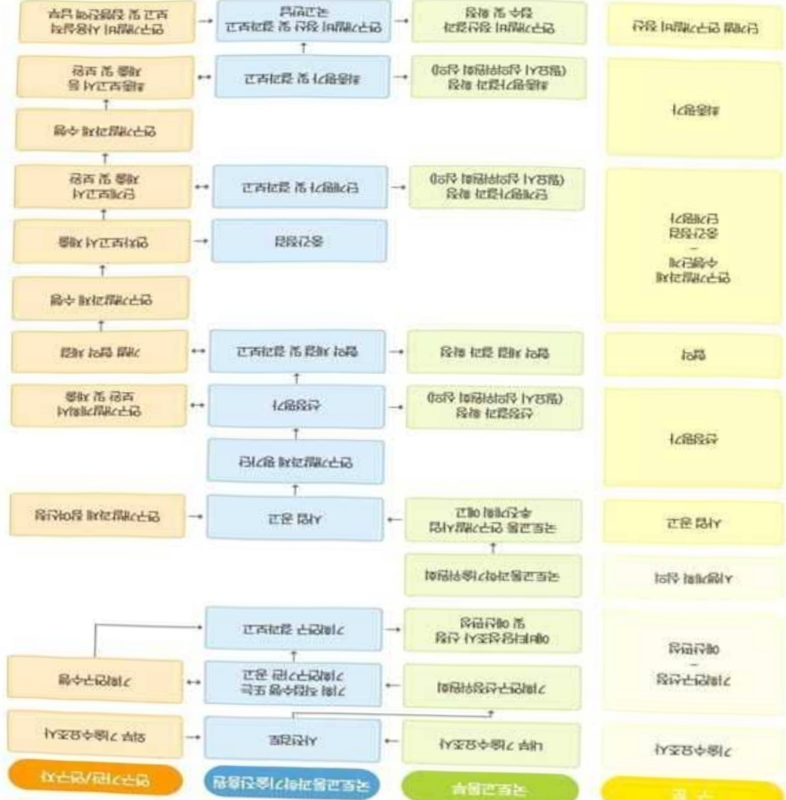

# 빅데이터기반인공지능도시계획기술개발(R&D)

**해당 페이지**: PDF 2348 ~ 2355 쪽 해당

**부처**: 국토교통부
**분야**: 교통 및 물류
**회계유형**: 일반회계
**2026 확정예산**: 6016.0 백만원
**전년대비 증감률**: 65.9%
**AI 도메인**: 데이터

---

### 가.예산 총괄표

(단위: 백만원, %)

<table border=1 style='margin: auto; word-wrap: break-word;'><tr><td rowspan="2">사업명</td><td rowspan="2">2024년 결산</td><td colspan="2">2025년 예산</td><td colspan="2">2026년</td><td rowspan="2">증감(B-A)</td><td rowspan="2">(B-A)/A</td></tr><tr><td style='text-align: center; word-wrap: break-word;'>본예산(A)</td><td style='text-align: center; word-wrap: break-word;'>추경</td><td style='text-align: center; word-wrap: break-word;'>정부안</td><td style='text-align: center; word-wrap: break-word;'>확정(B)</td></tr><tr><td style='text-align: center; word-wrap: break-word;'>빅데이터기반 인공지능도시계획 기술개발(R&amp;D)</td><td style='text-align: center; word-wrap: break-word;'>2,679</td><td style='text-align: center; word-wrap: break-word;'>3,626</td><td style='text-align: center; word-wrap: break-word;'>3,626</td><td style='text-align: center; word-wrap: break-word;'>6,016</td><td style='text-align: center; word-wrap: break-word;'>6,016</td><td style='text-align: center; word-wrap: break-word;'>2,390</td><td style='text-align: center; word-wrap: break-word;'>65.9</td></tr></table>

## □ 기능별(내역사업별), 목별 예산 내역

(단위:백만원)

<table border=1 style='margin: auto; word-wrap: break-word;'><tr><td rowspan="3"></td><td colspan="5">2024</td><td colspan="7">2025(2025.12월 말 기준)</td><td rowspan="3">2026예산</td></tr><tr><td rowspan="2">예산액(추정)</td><td rowspan="2">예산현액</td><td rowspan="2">집행액[실집행액]</td><td rowspan="2">이월액</td><td rowspan="2">불용액</td><td rowspan="2">본예산</td><td rowspan="2">예산현액</td><td rowspan="2">집행액[실집행액]</td><td colspan="2">전년도 이월액제외</td><td rowspan="2">이월예상액</td><td rowspan="2">불용예상액</td></tr><tr><td style='text-align: center; word-wrap: break-word;'>예산현액</td><td style='text-align: center; word-wrap: break-word;'>집행액[실집행액]</td></tr><tr><td style='text-align: center; word-wrap: break-word;'>○ 기능별 분류(합계)</td><td style='text-align: center; word-wrap: break-word;'>2,679</td><td style='text-align: center; word-wrap: break-word;'>2,679</td><td style='text-align: center; word-wrap: break-word;'>2,679[2,679]</td><td style='text-align: center; word-wrap: break-word;'>-</td><td style='text-align: center; word-wrap: break-word;'>-</td><td style='text-align: center; word-wrap: break-word;'>3,626</td><td style='text-align: center; word-wrap: break-word;'>3,626</td><td style='text-align: center; word-wrap: break-word;'>3,626[3,626]</td><td style='text-align: center; word-wrap: break-word;'>3,626</td><td style='text-align: center; word-wrap: break-word;'>3,626[3,626]</td><td style='text-align: center; word-wrap: break-word;'>-</td><td style='text-align: center; word-wrap: break-word;'>-</td><td style='text-align: center; word-wrap: break-word;'>6,016</td></tr><tr><td style='text-align: center; word-wrap: break-word;'>· 빅 데 이 터 기 반 인공지능도시 계획기술개발</td><td style='text-align: center; word-wrap: break-word;'>2,679</td><td style='text-align: center; word-wrap: break-word;'>2,679</td><td style='text-align: center; word-wrap: break-word;'>2,679[2,679]</td><td style='text-align: center; word-wrap: break-word;'>-</td><td style='text-align: center; word-wrap: break-word;'>-</td><td style='text-align: center; word-wrap: break-word;'>3,626</td><td style='text-align: center; word-wrap: break-word;'>3,626</td><td style='text-align: center; word-wrap: break-word;'>3,626[3,626]</td><td style='text-align: center; word-wrap: break-word;'>3,626</td><td style='text-align: center; word-wrap: break-word;'>3,626[3,626]</td><td style='text-align: center; word-wrap: break-word;'>-</td><td style='text-align: center; word-wrap: break-word;'>-</td><td style='text-align: center; word-wrap: break-word;'>6,016</td></tr><tr><td style='text-align: center; word-wrap: break-word;'>○ 비목별 분류(합계)</td><td style='text-align: center; word-wrap: break-word;'>2,679</td><td style='text-align: center; word-wrap: break-word;'>2,679</td><td style='text-align: center; word-wrap: break-word;'>2,679[2,679]</td><td style='text-align: center; word-wrap: break-word;'>-</td><td style='text-align: center; word-wrap: break-word;'>-</td><td style='text-align: center; word-wrap: break-word;'>3,626</td><td style='text-align: center; word-wrap: break-word;'>3,626</td><td style='text-align: center; word-wrap: break-word;'>3,626[3,626]</td><td style='text-align: center; word-wrap: break-word;'>3,626</td><td style='text-align: center; word-wrap: break-word;'>3,626[3,626]</td><td style='text-align: center; word-wrap: break-word;'>-</td><td style='text-align: center; word-wrap: break-word;'>-</td><td style='text-align: center; word-wrap: break-word;'>6,016</td></tr><tr><td style='text-align: center; word-wrap: break-word;'>· 연구활동비 등 (360-05)</td><td style='text-align: center; word-wrap: break-word;'>2,679</td><td style='text-align: center; word-wrap: break-word;'>2,679</td><td style='text-align: center; word-wrap: break-word;'>2,679[2,679]</td><td style='text-align: center; word-wrap: break-word;'>-</td><td style='text-align: center; word-wrap: break-word;'>-</td><td style='text-align: center; word-wrap: break-word;'>3,626</td><td style='text-align: center; word-wrap: break-word;'>3,626</td><td style='text-align: center; word-wrap: break-word;'>3,626[3,626]</td><td style='text-align: center; word-wrap: break-word;'>3,626</td><td style='text-align: center; word-wrap: break-word;'>3,626[3,626]</td><td style='text-align: center; word-wrap: break-word;'>-</td><td style='text-align: center; word-wrap: break-word;'>-</td><td style='text-align: center; word-wrap: break-word;'>6,016</td></tr><tr><td style='text-align: center; word-wrap: break-word;'>○ 기능비목별 분류(합계)</td><td style='text-align: center; word-wrap: break-word;'>2,679</td><td style='text-align: center; word-wrap: break-word;'>2,679</td><td style='text-align: center; word-wrap: break-word;'>2,679[2,679]</td><td style='text-align: center; word-wrap: break-word;'>-</td><td style='text-align: center; word-wrap: break-word;'>-</td><td style='text-align: center; word-wrap: break-word;'>3,626</td><td style='text-align: center; word-wrap: break-word;'>3,626</td><td style='text-align: center; word-wrap: break-word;'>3,626[3,626]</td><td style='text-align: center; word-wrap: break-word;'>3,626</td><td style='text-align: center; word-wrap: break-word;'>3,626[3,626]</td><td style='text-align: center; word-wrap: break-word;'>-</td><td style='text-align: center; word-wrap: break-word;'>-</td><td style='text-align: center; word-wrap: break-word;'>6,016</td></tr><tr><td style='text-align: center; word-wrap: break-word;'>· 빅 데 이 터 기 반 인공지능도시 계획기술개발 -연구활동비 등 (360-05)</td><td style='text-align: center; word-wrap: break-word;'>2,679</td><td style='text-align: center; word-wrap: break-word;'>2,679</td><td style='text-align: center; word-wrap: break-word;'>2,679[2,679]</td><td style='text-align: center; word-wrap: break-word;'>-</td><td style='text-align: center; word-wrap: break-word;'>-</td><td style='text-align: center; word-wrap: break-word;'>3,626</td><td style='text-align: center; word-wrap: break-word;'>3,626</td><td style='text-align: center; word-wrap: break-word;'>3,626[3,626]</td><td style='text-align: center; word-wrap: break-word;'>3,626</td><td style='text-align: center; word-wrap: break-word;'>3,626[3,626]</td><td style='text-align: center; word-wrap: break-word;'>-</td><td style='text-align: center; word-wrap: break-word;'>-</td><td style='text-align: center; word-wrap: break-word;'>6,016</td></tr></table>

### 나.사업설명자료

## 1 ) 사업목적·내용

- (빅데이터 기반 인공지능 도시계획 기술개발)미래 사회변화에 대응하기 위해 빅데이터 기반의 과학적이고 객관적인 인공지능 도시계획(기본 및 관리계획) 기술개발

· 인공지능 활용을 위한 빅데이터 기반의 도시 진단지표학대

· 도시계획 수립지원을 위한 빅데이터, AI알고리즘, 활용서비스 등이 탑재된 플랫폼 개발

· 도시계획 혁신 프레임워크 개발, 진단-계획 모니터링체계 및 실증

---

## 2 ) 사업개요

## □ 사업근거 및 추진경위

① 법령상 근거 및 조항 적시

-「국토교통과학기술 육성법」 제8조(연구개발사업의 추진)

제8조(연구개발사업의 추진) ① 국토교통부장관은 종합계획을 효율적으로 추진하기 위하여 국토교통과학기술 연구개발사업을 할 수 있다.

- 건설기술 진흥법 제7조(건설기술 연구 · 개발 사업)

· 제7조(건설기술 연구·개발 사업) ① 국토교통부장관은 건설기술을 향상시키고 기본계획을 효율적으로 추진하기 위하여 대통령령으로 정하는 기관 또는 단체와 협약을 체결하여 건설기술 발전에 필요한 건설기술 연구·개발 사업을 할 수 있다.

② 추진경위

- '19.12. 국토교통 분야 신규 R&D 사업기획* 추진

* 빅데이터 기반 토지이용 변화 예측 및 공간계획 기술개발 기획('20.12. - '21.12.)

- '22.04. 빅데이터 기반 인공지능 도시계획 기술개발 신규사업 공고 및 선정

## 주요내용

① 사업규모

- 총사업비 : 해당없음

- 사업기간 : '22 ~ '26

- 최근 5년 간 투입된 사업비(예산액기준, 추경편성한 연도에는 추경포함)

<table border=1 style='margin: auto; word-wrap: break-word;'><tr><td style='text-align: center; word-wrap: break-word;'>$ H_{2}O $</td><td style='text-align: center; word-wrap: break-word;'>2022</td><td style='text-align: center; word-wrap: break-word;'>2023</td><td style='text-align: center; word-wrap: break-word;'>2024</td><td style='text-align: center; word-wrap: break-word;'>2025</td><td style='text-align: center; word-wrap: break-word;'>2026</td></tr><tr><td style='text-align: center; word-wrap: break-word;'>사업비</td><td style='text-align: center; word-wrap: break-word;'>2,721</td><td style='text-align: center; word-wrap: break-word;'>3,721</td><td style='text-align: center; word-wrap: break-word;'>2,679</td><td style='text-align: center; word-wrap: break-word;'>3,626</td><td style='text-align: center; word-wrap: break-word;'>6,016</td></tr></table>

- 기타: 해당없음

② 사업추진체계

- 사업시행방법 : 출연(참여기업이 있는 경우 Matching)

- 사업시행주체 : 국토교통부(전문기관 : 국토교통과학기술진흥원)

- 사업 수혜자 : 대학, 기업, 출연연 등

- 보조, 융자, 출연, 출자 등의 경우 보조·융자 등 지원 비율 및 법적근거

---

<table border=1 style='margin: auto; word-wrap: break-word;'><tr><td style='text-align: center; word-wrap: break-word;'>내역사업명</td><td style='text-align: center; word-wrap: break-word;'>구분</td><td style='text-align: center; word-wrap: break-word;'>피보조·피출연 등 기관명</td><td style='text-align: center; word-wrap: break-word;'>지원 금액 (2026예산)</td><td style='text-align: center; word-wrap: break-word;'>지원 비율(%)</td><td style='text-align: center; word-wrap: break-word;'>보조율 법적근거 (해당 조항)</td></tr><tr><td rowspan="3">빅데이터 기반 인공지능 도시계획 기술개발</td><td rowspan="3">출연</td><td style='text-align: center; word-wrap: break-word;'>「중소기업기본법」제2조에 따른 중소기업에 해당하는 연구개발기관</td><td rowspan="3">6,016 백만원</td><td style='text-align: center; word-wrap: break-word;'>연구개발비의 100분의 75 이하</td><td rowspan="3">「국가연구개발 혁신법 시행령」제19조</td></tr><tr><td style='text-align: center; word-wrap: break-word;'>「중견기업 성장촉진 및 경쟁력 강화에 관한 특별법」제2조제1호에 따른 중견기업에 해당하는 연구개발기관</td><td style='text-align: center; word-wrap: break-word;'>연구개발비의 100분의 70 이하</td></tr><tr><td style='text-align: center; word-wrap: break-word;'>「공공기관의 운영에 관한 법률」제5조제4항 제1호에 따른 공기업에 해당하거나 ‘가’, ‘나’에 해당 해당하지 않는 연구개발기관</td><td style='text-align: center; word-wrap: break-word;'>연구개발비의 100분의 50 이하</td></tr></table>

## 3 ) 2026년도 예산 산출 근거

□ 빅데이터 기반 인공지능 도시계획 기술개발

:(25)3,626백만원→(26)6,016백만원,2,390백만원 증액

- (요구) 도시진단/전망 시스템 시범운영·개선, 인구모형·토지이용 모형 등을 활용한 도시계획 수립지원 시스템 시범운영 착수, 도시변화 모니터링 지표 개발 및 모니터링 시스템 시범운영 착수, 지자체 3곳(부산, 천안, 담양) 대상 도시계획 수립지원을 통한 연구성과 실증, 도시계획 법제도 개선 등을 위해 소요예산 6,016백만원 필요

- (산출) ① 빅데이터 기반 도시진단기술개발 2,060백만원

② AI 기반 도시계획 수립지원 기술개발 1,720백만원

③ 도시변화 모니터링 기술개발 및 통합 실증 2,236백만원

·(계속) 1개 × 6,016백만원 × 12/12 = 6,016백만원

## ㅇ 2025년도 예산 및 2026년도 예산안 산출 세부내역 비교

<table border=1 style='margin: auto; word-wrap: break-word;'><tr><td colspan="2">2025년 예산</td><td colspan="2">2026년 예산안</td></tr><tr><td style='text-align: center; word-wrap: break-word;'>예산</td><td style='text-align: center; word-wrap: break-word;'>산출내역</td><td style='text-align: center; word-wrap: break-word;'>예산</td><td style='text-align: center; word-wrap: break-word;'>산출내역</td></tr><tr><td style='text-align: center; word-wrap: break-word;'>빅데이터 기반 인공지능 도시계획 기술개발 3,626</td><td style='text-align: center; word-wrap: break-word;'>①(도시진단 기술): 17.4억원 - 공통 데이터 정의 및 수집/구축, 데이터 표준화 및 지침 마련 - 기 개발 지표(10개 부문 121개) 수정 보완, 신규지표 검토 및 개발, 지표 활용방안 마련 - 도시진단 시스템 구축 및 시험운영 개시 ②(도시계획 수립지원 기술): 10.56억원 - 도시계획 아카이빙 서비스 시스템 구축 - 인구모형, 공간변화 시뮬레이션 모형, 토지이용 모형, 기반시설 모형, 생활권 모형, 성장관리 모형 개발 - 도시계획 수립지원 서비스 시스템 모듈 개발 ③(통합실증): 8.3억원 - 모니터링 지표정립, 도시계획 모니터링 시스템 모듈개발 - 도시계획 및 정책참여 포털 구축 및 시험운영 - 도시개발성과 검증 프레임워크 개발 및 검증 착수, 도시계획 수립지원 및 컨설팅</td><td style='text-align: center; word-wrap: break-word;'>빅데이터 기반 인공지능 도시계획 기술개발 6,016</td><td style='text-align: center; word-wrap: break-word;'>①(도시진단 기술): 20.6억원 - 빅데이터 구축 및 갱신, 데이터 표준화 적용 및 검증 - 기 개발 지표(10개 부문 121개) 개선 및 추가 신규지표 개발 - 도시진단 시스템 운영 및 개선 - 공동 및 민간 빅데이터 통합 및 플랫폼 구축 - 도시진단 서비스 시스템 실검증 및 시스템 고도화 - 국가망 연계 및 이관 ②(도시계획 수립지원 기술): 17.2억원 - 도시계획 아카이빙 서비스 시스템 운영 - 인구모형, 공간변화 시뮬레이션 모형, 토지이용 모형, 기반시설 모형, 생활권 모형, 성장관리 모형 개발 - 도시계획 수립지원 서비스 시스템 구축 및 시험운영 개시 - 도시계획 아카이빙 서비스 시스템 실검증 및 시스템 고도화 - 도시계획 수립지원 서비스 시스템 실검증 및 시스템 고도화 - 국가망 연계 및 이관 ③(통합실증): 22.36억원 - 모니터링 지표 개발 - 도시계획 및 정책참여 포털 운영 및 개선 - 도시계획 수립지원 및 컨설팅, 도시계획 법제도 개선방안 마련 - 도시계획 모니터링 시스템 실검증, 시스템 고도화, 국가망 연계 및 이관</td></tr></table>

---

## 4 ) 사업효과

☐ 사업영향, 산출물 성과지표 등

① 2022~2026년도 성과계획서 상 성과지표 및 최근 5년간 성과 달성도

<table border=1 style='margin: auto; word-wrap: break-word;'><tr><td style='text-align: center; word-wrap: break-word;'>성과지표</td><td style='text-align: center; word-wrap: break-word;'>구분</td><td style='text-align: center; word-wrap: break-word;'>2022</td><td style='text-align: center; word-wrap: break-word;'>2023</td><td style='text-align: center; word-wrap: break-word;'>2024</td><td style='text-align: center; word-wrap: break-word;'>2025</td><td style='text-align: center; word-wrap: break-word;'>2026</td><td style='text-align: center; word-wrap: break-word;'>2026 목표치산출근거</td><td style='text-align: center; word-wrap: break-word;'>측정산식(또는 측정방법)</td><td style='text-align: center; word-wrap: break-word;'>자료수집방법(또는 자료출처)</td></tr><tr><td rowspan="3">빅데이터 기반 도시 진단·전망 지표개발 달성률 (단위: %)</td><td style='text-align: center; word-wrap: break-word;'>목표</td><td style='text-align: center; word-wrap: break-word;'>100</td><td style='text-align: center; word-wrap: break-word;'>100</td><td style='text-align: center; word-wrap: break-word;'>100</td><td style='text-align: center; word-wrap: break-word;'>-</td><td style='text-align: center; word-wrap: break-word;'>-</td><td rowspan="3">• 진단전망지표 개발방법론, 가중 치설정, 알고리 즙 개발</td><td rowspan="3">• (당해연도 목표 대비 달성 기술 개수 / 당해연도 개발필요기술개가) ×100</td><td rowspan="3">• 과제 연차실적 보고서, 전문가 평가서, 개발결과 보고서 등</td></tr><tr><td style='text-align: center; word-wrap: break-word;'>실적</td><td style='text-align: center; word-wrap: break-word;'>100</td><td style='text-align: center; word-wrap: break-word;'>100</td><td style='text-align: center; word-wrap: break-word;'>100</td><td style='text-align: center; word-wrap: break-word;'>-</td><td style='text-align: center; word-wrap: break-word;'>-</td></tr><tr><td style='text-align: center; word-wrap: break-word;'>달성도</td><td style='text-align: center; word-wrap: break-word;'>100</td><td style='text-align: center; word-wrap: break-word;'>100</td><td style='text-align: center; word-wrap: break-word;'>100</td><td style='text-align: center; word-wrap: break-word;'>-</td><td style='text-align: center; word-wrap: break-word;'>-</td></tr><tr><td rowspan="3">도시계획 수립지원 모델 개발률 (단위: %)</td><td style='text-align: center; word-wrap: break-word;'>목표</td><td style='text-align: center; word-wrap: break-word;'>28.6</td><td style='text-align: center; word-wrap: break-word;'>64.3</td><td style='text-align: center; word-wrap: break-word;'>80</td><td style='text-align: center; word-wrap: break-word;'>85</td><td style='text-align: center; word-wrap: break-word;'>-</td><td rowspan="3">• 토지이용계획, 공간구조설정, 도시계획시설, 생활권계획의 상세 설계</td><td rowspan="3">• ∑(당해년 도까지의 달성 추진 내용 개수)/시스템 구축을 위한 추진내용 총 개수) ×100</td><td rowspan="3">• 과제 연차실적 보고서, 개발 결과 보고서, SW 등록중 등</td></tr><tr><td style='text-align: center; word-wrap: break-word;'>실적</td><td style='text-align: center; word-wrap: break-word;'>28.6</td><td style='text-align: center; word-wrap: break-word;'>64.3</td><td style='text-align: center; word-wrap: break-word;'>80</td><td style='text-align: center; word-wrap: break-word;'>85</td><td style='text-align: center; word-wrap: break-word;'>-</td></tr><tr><td style='text-align: center; word-wrap: break-word;'>달성도</td><td style='text-align: center; word-wrap: break-word;'>100</td><td style='text-align: center; word-wrap: break-word;'>100</td><td style='text-align: center; word-wrap: break-word;'>100</td><td style='text-align: center; word-wrap: break-word;'>100</td><td style='text-align: center; word-wrap: break-word;'>-</td></tr><tr><td rowspan="3">도시변화 모니터링 시스템 개발률 (단위: %)</td><td style='text-align: center; word-wrap: break-word;'>목표</td><td style='text-align: center; word-wrap: break-word;'>33</td><td style='text-align: center; word-wrap: break-word;'>66</td><td style='text-align: center; word-wrap: break-word;'>76</td><td style='text-align: center; word-wrap: break-word;'>80</td><td style='text-align: center; word-wrap: break-word;'>-</td><td rowspan="3">• 모니터링 시스템 모듈 구현</td><td rowspan="3">• ∑(당해년도까지 목표 달성 프로세스 개수)/시스템 구축을 위한 프로세스 총 개수) ×100</td><td rowspan="3">• 과제 연차실적 보고서, 개발 결과 보고서, SW 등록중 등</td></tr><tr><td style='text-align: center; word-wrap: break-word;'>실적</td><td style='text-align: center; word-wrap: break-word;'>33</td><td style='text-align: center; word-wrap: break-word;'>66</td><td style='text-align: center; word-wrap: break-word;'>76</td><td style='text-align: center; word-wrap: break-word;'>80</td><td style='text-align: center; word-wrap: break-word;'>-</td></tr><tr><td style='text-align: center; word-wrap: break-word;'>달성도</td><td style='text-align: center; word-wrap: break-word;'>100</td><td style='text-align: center; word-wrap: break-word;'>100</td><td style='text-align: center; word-wrap: break-word;'>100</td><td style='text-align: center; word-wrap: break-word;'>100</td><td style='text-align: center; word-wrap: break-word;'>-</td></tr><tr><td rowspan="3">정책제안 건수 (단위: 건)</td><td style='text-align: center; word-wrap: break-word;'>목표</td><td style='text-align: center; word-wrap: break-word;'>-</td><td style='text-align: center; word-wrap: break-word;'>-</td><td style='text-align: center; word-wrap: break-word;'>-</td><td style='text-align: center; word-wrap: break-word;'>1</td><td style='text-align: center; word-wrap: break-word;'>-</td><td rowspan="3">• 도시계획 수립 시 박데이타 인공지능을 활용할 수 있도록 정부 자체 정책 지원 등에 적용하기 위한 개선)</td><td rowspan="3">• ∑(당해 연도 설계 기준·시 방서 · 지침제 안 건수)</td><td rowspan="3">• 법령/조례 개정, 관련 규정, 기준, 지침, 고시 등</td></tr><tr><td style='text-align: center; word-wrap: break-word;'>실적</td><td style='text-align: center; word-wrap: break-word;'>-</td><td style='text-align: center; word-wrap: break-word;'>-</td><td style='text-align: center; word-wrap: break-word;'>-</td><td style='text-align: center; word-wrap: break-word;'>1</td><td style='text-align: center; word-wrap: break-word;'>-</td></tr><tr><td style='text-align: center; word-wrap: break-word;'>달성도</td><td style='text-align: center; word-wrap: break-word;'>-</td><td style='text-align: center; word-wrap: break-word;'>-</td><td style='text-align: center; word-wrap: break-word;'>-</td><td style='text-align: center; word-wrap: break-word;'>100</td><td style='text-align: center; word-wrap: break-word;'>-</td></tr><tr><td rowspan="3">핵심기술 실무적용 달성률 (단위: %)</td><td style='text-align: center; word-wrap: break-word;'>목표</td><td style='text-align: center; word-wrap: break-word;'>-</td><td style='text-align: center; word-wrap: break-word;'>-</td><td style='text-align: center; word-wrap: break-word;'>-</td><td style='text-align: center; word-wrap: break-word;'>25</td><td style='text-align: center; word-wrap: break-word;'>-</td><td rowspan="3">• 개발된 기술을 자차체 적용을 위해 핵심기술에 대한 실무적용 달성률을 연계 발휘의 삶을 대상 건수 대비 실증 및 개선사항 반영 될 수</td><td rowspan="3">• ∑(당해연도 실증, 반영 완료 기술 건수)/ 전체 실증 대상기술 건수) ×100</td><td rowspan="3">• 실증결과 보고서 등</td></tr><tr><td style='text-align: center; word-wrap: break-word;'>실적</td><td style='text-align: center; word-wrap: break-word;'>-</td><td style='text-align: center; word-wrap: break-word;'>-</td><td style='text-align: center; word-wrap: break-word;'>-</td><td style='text-align: center; word-wrap: break-word;'>25</td><td style='text-align: center; word-wrap: break-word;'>-</td></tr><tr><td style='text-align: center; word-wrap: break-word;'>달성도</td><td style='text-align: center; word-wrap: break-word;'>-</td><td style='text-align: center; word-wrap: break-word;'>-</td><td style='text-align: center; word-wrap: break-word;'>-</td><td style='text-align: center; word-wrap: break-word;'>100</td><td style='text-align: center; word-wrap: break-word;'>-</td></tr><tr><td rowspan="3">실증 지자체 수 (단위: 개)</td><td style='text-align: center; word-wrap: break-word;'>목표</td><td style='text-align: center; word-wrap: break-word;'>-</td><td style='text-align: center; word-wrap: break-word;'>-</td><td style='text-align: center; word-wrap: break-word;'>-</td><td style='text-align: center; word-wrap: break-word;'>1</td><td style='text-align: center; word-wrap: break-word;'>-</td><td rowspan="3">• 실제 도시계획 업무에 활용한 지자체의 개수</td><td rowspan="3">• ∑(당해 연도 기술 적용 지자체 개수)</td><td rowspan="3">• 도시계획위원회 문건 공정회 및 보도자료 등</td></tr><tr><td style='text-align: center; word-wrap: break-word;'>실적</td><td style='text-align: center; word-wrap: break-word;'>-</td><td style='text-align: center; word-wrap: break-word;'>-</td><td style='text-align: center; word-wrap: break-word;'>-</td><td style='text-align: center; word-wrap: break-word;'>1</td><td style='text-align: center; word-wrap: break-word;'>-</td></tr><tr><td style='text-align: center; word-wrap: break-word;'>달성도</td><td style='text-align: center; word-wrap: break-word;'>-</td><td style='text-align: center; word-wrap: break-word;'>-</td><td style='text-align: center; word-wrap: break-word;'>-</td><td style='text-align: center; word-wrap: break-word;'>100</td><td style='text-align: center; word-wrap: break-word;'>-</td></tr></table>

---

② 성과지표 이외의 연도별 사업추진 경과 및 실적

<table border=1 style='margin: auto; word-wrap: break-word;'><tr><td style='text-align: center; word-wrap: break-word;'>2022</td><td style='text-align: center; word-wrap: break-word;'>- 도시 빅데이터 수집 및 공유체계 구축, AI 기반 도시계획 수립·지원 알고리즘 분석, 도시계획 혁신 프레임워크 설계 및 실종대상 지자체 선정 등</td></tr><tr><td style='text-align: center; word-wrap: break-word;'>2023</td><td style='text-align: center; word-wrap: break-word;'>- 공간자료 기반 도시 진단·전망지표 개발, AI 기반 도시계획 수립·지원체계 설계, 도시변화 모니터링기술 설계 및 개발 등</td></tr><tr><td style='text-align: center; word-wrap: break-word;'>2024</td><td style='text-align: center; word-wrap: break-word;'>- 도시진단·전망 지표 개발, 도시공간 및 도시계획 아카이빙 기술 개발 등</td></tr><tr><td style='text-align: center; word-wrap: break-word;'>2025</td><td style='text-align: center; word-wrap: break-word;'>- 도시진단 시스템 및 도시계획 아카이빙 시스템 개발 - 모니터링 지표정립, 도시계획 모니터링 시스템 모듈개발</td></tr></table>

## ③향후(2026년도 이후)기대효과

- (중앙정부) 도시진단-계획수립-운영-평가 전 단계에 걸쳐 지자체의 도시계획을

체계적·재관적으로 관리하는 역할 강화함으로서, 국토·도시진단 및 계획 수립 기간

50% 단축(24개월 → 12개월, 공청회 등 인허가 절차 이행기간 제외)

* 계획인구의 과다산정에 따른 과잉 개발 및 미분양 주택, 장기 미집행 시설 등 비효율적인 공간

활용을 억제

- (지자체) 계획수립의 편의성 제고 및 수요 대응형 도시계획 수립

* 실수요에 기반해 도시계획시설 이용현황을 파악하고 미래 수요를 예측하여 최적입지를 결정함으로써

수요 중심 도시계획·관리 가능

5) 타당성조사 및 예비타당성조사 시행여부 및 결과 요지 : 해당없음

6) 총사업비 대상사업 여부 및 내역 : 해당없음

---

<table border=1 style='margin: auto; word-wrap: break-word;'><tr><td style='text-align: center; word-wrap: break-word;'>부처</td><td style='text-align: center; word-wrap: break-word;'></td><td style='text-align: center; word-wrap: break-word;'>피출연·피보조기관</td><td style='text-align: center; word-wrap: break-word;'></td><td style='text-align: center; word-wrap: break-word;'>간접보조사업자·사업수행자</td></tr><tr><td style='text-align: center; word-wrap: break-word;'>국토교통부(6,016백만원)</td><td style='text-align: center; word-wrap: break-word;'>=&gt;(6,016백만원)</td><td style='text-align: center; word-wrap: break-word;'>국토교통과학기술진흥원(6,016백만원)</td><td style='text-align: center; word-wrap: break-word;'>=&gt;(6,016백만원)</td><td style='text-align: center; word-wrap: break-word;'>국토연구원의 14개 기관</td></tr></table>

<빅데이터 기반 인공지능 도시계획기술개발>

---

## 8 ) 중기재정계획 상 연도별 투자계획 및 추진경과

(단위: 백만원)

<table border=1 style='margin: auto; word-wrap: break-word;'><tr><td style='text-align: center; word-wrap: break-word;'>$  \frac{ 怒 刀 }{ 难 招 难 軋 } $</td><td style='text-align: center; word-wrap: break-word;'>2024</td><td style='text-align: center; word-wrap: break-word;'>2025</td><td style='text-align: center; word-wrap: break-word;'>2026</td><td style='text-align: center; word-wrap: break-word;'>2027</td><td style='text-align: center; word-wrap: break-word;'>2028</td><td style='text-align: center; word-wrap: break-word;'>2029</td></tr><tr><td style='text-align: center; word-wrap: break-word;'>2024~2028</td><td style='text-align: center; word-wrap: break-word;'>2,679</td><td style='text-align: center; word-wrap: break-word;'>3,626</td><td style='text-align: center; word-wrap: break-word;'>4,588</td><td style='text-align: center; word-wrap: break-word;'></td><td style='text-align: center; word-wrap: break-word;'></td><td style='text-align: center; word-wrap: break-word;'></td></tr><tr><td style='text-align: center; word-wrap: break-word;'>2025~2029</td><td style='text-align: center; word-wrap: break-word;'></td><td style='text-align: center; word-wrap: break-word;'>3,626</td><td style='text-align: center; word-wrap: break-word;'>3,630</td><td style='text-align: center; word-wrap: break-word;'>2,386</td><td style='text-align: center; word-wrap: break-word;'>-</td><td style='text-align: center; word-wrap: break-word;'></td></tr></table>

9) 최근 3년간 동 사업에 대한 주요 외부지적사항 및 평가, 문제점 및 대책 : 해당없음

## 10 ) 향후 추진방향 및 추진계획

<table border=1 style='margin: auto; word-wrap: break-word;'><tr><td style='text-align: center; word-wrap: break-word;'>○ (진단) 도시 빅데이터를 활용한 도시계획 지표 및 진단기술 개발</td></tr><tr><td style='text-align: center; word-wrap: break-word;'>* 기존 계획인구 이외 유동인구, 경제, 환경, 라이프스타일 등과 관련한 10개 이상의 도시계획 지표 발굴 및 인공지능 학습모델 개발을 통한 도시진단전망 기술 개발</td></tr><tr><td style='text-align: center; word-wrap: break-word;'>○ (계획) AI 기반 도시계획 수립 · 지원기술 개발</td></tr><tr><td style='text-align: center; word-wrap: break-word;'>* 공간구조 변화 시뮬레이션, 토지이용 최적화 모델 등을 탑재한 인공지능 도시계획 수립·지원 시스템 (S/W) 개발</td></tr><tr><td style='text-align: center; word-wrap: break-word;'>○ (평가) 도시변화 모니터링기술 개발 및 실증</td></tr><tr><td style='text-align: center; word-wrap: break-word;'>* 도시변화 모니터링시스템 구축 및 지자체 대상 운영·검증을 통한 법제도 개선(안) 도출</td></tr></table>

## 11 ) 해당사업에 대한 각종 사업평가의 결과

<table border=1 style='margin: auto; word-wrap: break-word;'><tr><td style='text-align: center; word-wrap: break-word;'>1) 「국가재정법」제85조의8제1항에 따른 재정사업자율평가 결과에 대한 기획재정부의 상위평가(심층평가) 결과: 해당없음</td></tr><tr><td style='text-align: center; word-wrap: break-word;'>2) R&amp;D사업의 경우「국가연구개발사업 등의 성과평가 및 성과관리에 관한 법률」제7조제3항에 따른 부처의 R&amp;D사업 자체성과평가에 대한 과학기술정보통신부 상위평가 결과: ‘보통’, 85.0점(과기부, ’25 상위평가)</td></tr><tr><td style='text-align: center; word-wrap: break-word;'>3) 그 외 보조사업 연장평가, 재정지원 일자리사업 평가 등 개별 법률에 규정된 평가 시행 결과 : 해당없음</td></tr></table>

## 12 ) 해당사업에 대한 부처 자체평가의 결과

<table border=1 style='margin: auto; word-wrap: break-word;'><tr><td style='text-align: center; word-wrap: break-word;'>1) 2023년도 부처 재정사업 자율평가 결과: 해당없음</td></tr><tr><td style='text-align: center; word-wrap: break-word;'>2) 2024년도 부처 재정사업 자율평가 결과: 해당없음</td></tr><tr><td style='text-align: center; word-wrap: break-word;'>3) 2025년도 부처 재정사업 자율평가 결과: 해당없음</td></tr></table>

## 13 ) 부처 건의사항 : 해당없음

---

<table border=1 style='margin: auto; word-wrap: break-word;'><tr><td style='text-align: center; word-wrap: break-word;'>사 업 명</td></tr><tr><td style='text-align: center; word-wrap: break-word;'>(19) 빅데이터기반 철도 네트워크 설계 및 운영기술개발(R&amp;D) (4159-368)</td></tr></table>

## □ 사업 코드 정보

<table border=1 style='margin: auto; word-wrap: break-word;'><tr><td style='text-align: center; word-wrap: break-word;'>구분</td><td style='text-align: center; word-wrap: break-word;'>회계</td><td style='text-align: center; word-wrap: break-word;'>소관</td><td style='text-align: center; word-wrap: break-word;'>실국(기관)</td><td style='text-align: center; word-wrap: break-word;'>계정</td><td style='text-align: center; word-wrap: break-word;'>분야</td><td style='text-align: center; word-wrap: break-word;'>부문</td></tr><tr><td style='text-align: center; word-wrap: break-word;'>코드</td><td style='text-align: center; word-wrap: break-word;'>교통시설</td><td rowspan="2">국토교통부</td><td rowspan="2">철도국</td><td rowspan="2">철도계정</td><td style='text-align: center; word-wrap: break-word;'>120</td><td style='text-align: center; word-wrap: break-word;'>126</td></tr><tr><td style='text-align: center; word-wrap: break-word;'>명칭</td><td style='text-align: center; word-wrap: break-word;'>특별회계</td><td style='text-align: center; word-wrap: break-word;'>교통및물류</td><td style='text-align: center; word-wrap: break-word;'>물류등기타</td></tr></table>

<table border=1 style='margin: auto; word-wrap: break-word;'><tr><td style='text-align: center; word-wrap: break-word;'>구분</td><td style='text-align: center; word-wrap: break-word;'>프로그램</td><td style='text-align: center; word-wrap: break-word;'>단위사업</td><td style='text-align: center; word-wrap: break-word;'>세부사업</td></tr><tr><td style='text-align: center; word-wrap: break-word;'>코드</td><td style='text-align: center; word-wrap: break-word;'>4100</td><td style='text-align: center; word-wrap: break-word;'>4159</td><td style='text-align: center; word-wrap: break-word;'>368</td></tr><tr><td style='text-align: center; word-wrap: break-word;'>명칭</td><td style='text-align: center; word-wrap: break-word;'>국토교통연구개발</td><td style='text-align: center; word-wrap: break-word;'>철도기술연구</td><td style='text-align: center; word-wrap: break-word;'>빅데이터기반철도네트워크설계및운영기술개발(R&amp;D)</td></tr></table>

□ 사업 성격

<table border=1 style='margin: auto; word-wrap: break-word;'><tr><td rowspan="2">신규</td><td rowspan="2">계속</td><td rowspan="2">완료</td><td style='text-align: center; word-wrap: break-word;'>예비타당성</td><td style='text-align: center; word-wrap: break-word;'>총사업비</td><td style='text-align: center; word-wrap: break-word;'>총액계상</td><td style='text-align: center; word-wrap: break-word;'>사업소관 변경정보</td></tr><tr><td style='text-align: center; word-wrap: break-word;'>실시여부</td><td style='text-align: center; word-wrap: break-word;'>관리대상</td><td style='text-align: center; word-wrap: break-word;'>예산사업</td><td style='text-align: center; word-wrap: break-word;'>2025예산 시 소관</td></tr><tr><td style='text-align: center; word-wrap: break-word;'>○</td><td style='text-align: center; word-wrap: break-word;'></td><td style='text-align: center; word-wrap: break-word;'></td><td style='text-align: center; word-wrap: break-word;'></td><td style='text-align: center; word-wrap: break-word;'></td><td style='text-align: center; word-wrap: break-word;'></td><td style='text-align: center; word-wrap: break-word;'></td></tr></table>

□ 사업 지원 형태 및 지원율

<table border=1 style='margin: auto; word-wrap: break-word;'><tr><td style='text-align: center; word-wrap: break-word;'>직접</td><td style='text-align: center; word-wrap: break-word;'>출자</td><td style='text-align: center; word-wrap: break-word;'>출연</td><td style='text-align: center; word-wrap: break-word;'>보조</td><td style='text-align: center; word-wrap: break-word;'>융자</td><td style='text-align: center; word-wrap: break-word;'>국고보조율(%)</td><td style='text-align: center; word-wrap: break-word;'>융자율(%)</td></tr><tr><td style='text-align: center; word-wrap: break-word;'></td><td style='text-align: center; word-wrap: break-word;'></td><td style='text-align: center; word-wrap: break-word;'>○</td><td style='text-align: center; word-wrap: break-word;'></td><td style='text-align: center; word-wrap: break-word;'></td><td style='text-align: center; word-wrap: break-word;'></td><td style='text-align: center; word-wrap: break-word;'></td></tr></table>

□ 사업 담당자

<table border=1 style='margin: auto; word-wrap: break-word;'><tr><td style='text-align: center; word-wrap: break-word;'>사업명</td><td colspan="2">구분</td></tr><tr><td rowspan="2">빅데이터기반철도네트워크설계및운영기술개발(R&amp;D)</td><td style='text-align: center; word-wrap: break-word;'>소관부처</td><td style='text-align: center; word-wrap: break-word;'>실·국·과(팀)철도국철도운영과</td></tr><tr><td style='text-align: center; word-wrap: break-word;'>사업시행주체</td><td style='text-align: center; word-wrap: break-word;'>국토교통과학기술진흥원철도실</td></tr></table>

---

### 원본 PDF 크롭 이미지

