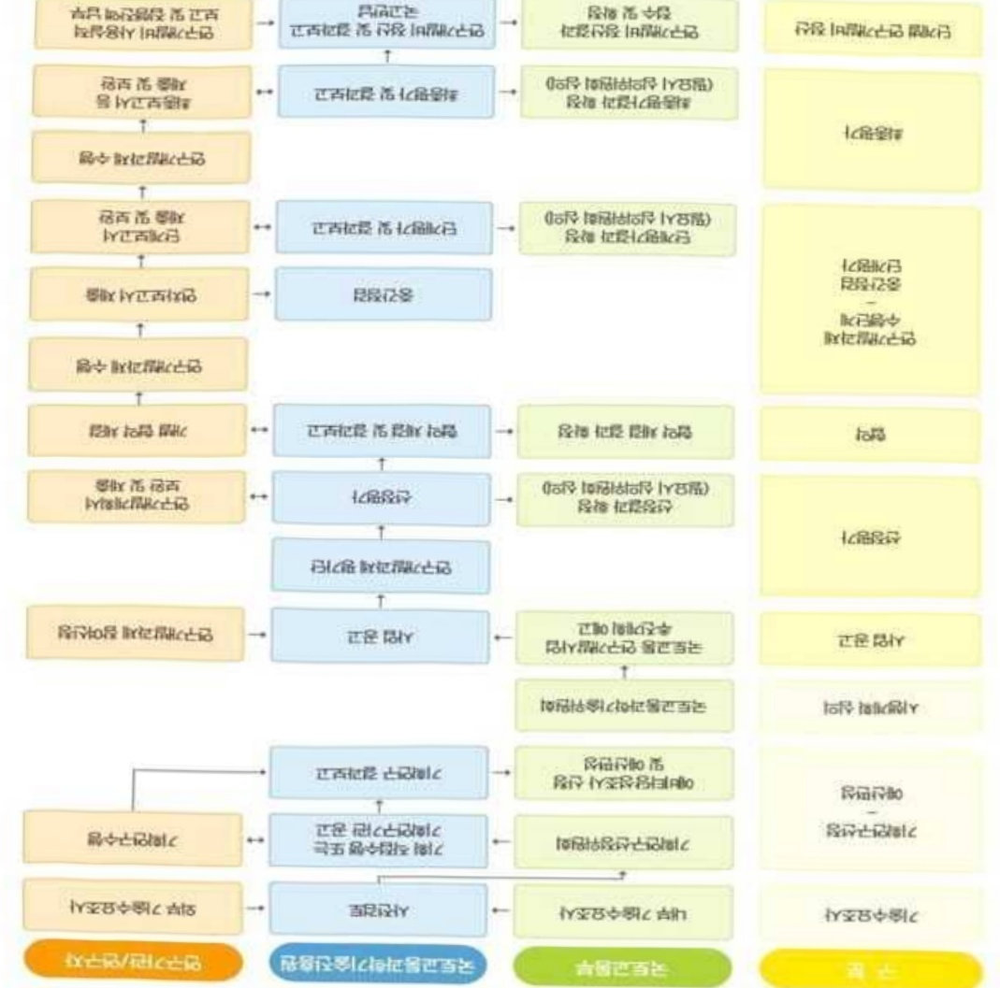

# 스마트 빌딩핵심기술개발(R&D)

**해당 페이지**: PDF 2363 ~ 2371 쪽 해당

**부처**: 국토교통부
**분야**: 교통 및 물류
**회계유형**: 일반회계
**2026 확정예산**: 5048.0 백만원
**전년대비 증감률**: 140.4%
**AI 도메인**: 로봇

---

<table border=1 style='margin: auto; word-wrap: break-word;'><tr><td style='text-align: center; word-wrap: break-word;'>사 업 명</td></tr><tr><td style='text-align: center; word-wrap: break-word;'>(32) 스마트+빌딩핵심기술개발(R&amp;D) (4154-333)</td></tr></table>

□ 사업 코드 정보

<table border=1 style='margin: auto; word-wrap: break-word;'><tr><td style='text-align: center; word-wrap: break-word;'>구분</td><td style='text-align: center; word-wrap: break-word;'>회계</td><td style='text-align: center; word-wrap: break-word;'>소관</td><td style='text-align: center; word-wrap: break-word;'>실국(기관)</td><td style='text-align: center; word-wrap: break-word;'>계정</td><td style='text-align: center; word-wrap: break-word;'>분야</td><td style='text-align: center; word-wrap: break-word;'>부문</td></tr><tr><td style='text-align: center; word-wrap: break-word;'>코드</td><td rowspan="2">일반회계</td><td rowspan="2">국토교통부</td><td rowspan="2">국토도시실</td><td rowspan="2">-</td><td style='text-align: center; word-wrap: break-word;'>120</td><td style='text-align: center; word-wrap: break-word;'>126</td></tr><tr><td style='text-align: center; word-wrap: break-word;'>명칭</td><td style='text-align: center; word-wrap: break-word;'>교통및물류</td><td style='text-align: center; word-wrap: break-word;'>물류등기타</td></tr></table>

<table border=1 style='margin: auto; word-wrap: break-word;'><tr><td style='text-align: center; word-wrap: break-word;'>구분</td><td style='text-align: center; word-wrap: break-word;'>프로그램</td><td style='text-align: center; word-wrap: break-word;'>단위사업</td><td style='text-align: center; word-wrap: break-word;'>세부사업</td></tr><tr><td style='text-align: center; word-wrap: break-word;'>코드</td><td style='text-align: center; word-wrap: break-word;'>4100</td><td style='text-align: center; word-wrap: break-word;'>4154</td><td style='text-align: center; word-wrap: break-word;'>333</td></tr><tr><td style='text-align: center; word-wrap: break-word;'>명칭</td><td style='text-align: center; word-wrap: break-word;'>국토교통연구개발</td><td style='text-align: center; word-wrap: break-word;'>건설기술혁신(R&amp;D)</td><td style='text-align: center; word-wrap: break-word;'>스마트+빌딩핵심기술개발(R&amp;D)</td></tr></table>

☐ 사업 성격

<table border=1 style='margin: auto; word-wrap: break-word;'><tr><td rowspan="2">신규</td><td rowspan="2">계속</td><td rowspan="2">완료</td><td rowspan="2">예비타당성 실시여부</td><td rowspan="2">총사업비 관리대상</td><td rowspan="2">총액계상 예산사업</td><td style='text-align: center; word-wrap: break-word;'>사업소관 변경정보</td></tr><tr><td style='text-align: center; word-wrap: break-word;'>2025예산 시 소관</td></tr><tr><td style='text-align: center; word-wrap: break-word;'></td><td style='text-align: center; word-wrap: break-word;'>○</td><td style='text-align: center; word-wrap: break-word;'></td><td style='text-align: center; word-wrap: break-word;'></td><td style='text-align: center; word-wrap: break-word;'></td><td style='text-align: center; word-wrap: break-word;'></td><td style='text-align: center; word-wrap: break-word;'>국토교통부</td></tr></table>

□ 사업 지원 형태 및 지원을

<table border=1 style='margin: auto; word-wrap: break-word;'><tr><td style='text-align: center; word-wrap: break-word;'>직접</td><td style='text-align: center; word-wrap: break-word;'>출자</td><td style='text-align: center; word-wrap: break-word;'>출연</td><td style='text-align: center; word-wrap: break-word;'>보조</td><td style='text-align: center; word-wrap: break-word;'>융자</td><td style='text-align: center; word-wrap: break-word;'>국고보조율(%)</td><td style='text-align: center; word-wrap: break-word;'>융자율(%)</td></tr><tr><td style='text-align: center; word-wrap: break-word;'></td><td style='text-align: center; word-wrap: break-word;'></td><td style='text-align: center; word-wrap: break-word;'>○</td><td style='text-align: center; word-wrap: break-word;'></td><td style='text-align: center; word-wrap: break-word;'></td><td style='text-align: center; word-wrap: break-word;'></td><td style='text-align: center; word-wrap: break-word;'></td></tr></table>

## □ 사업 담당자

<table border=1 style='margin: auto; word-wrap: break-word;'><tr><td style='text-align: center; word-wrap: break-word;'>사업명</td><td colspan="2">구분</td></tr><tr><td rowspan="6">스마트+빌딩 핵심기술 개발(R&amp;D)</td><td rowspan="4">소관부처</td><td style='text-align: center; word-wrap: break-word;'>실·국·과(팀)</td></tr><tr><td style='text-align: center; word-wrap: break-word;'>국토도시실</td></tr><tr><td style='text-align: center; word-wrap: break-word;'>건축정책관</td></tr><tr><td style='text-align: center; word-wrap: break-word;'>건축정책과</td></tr><tr><td rowspan="2">사업시행주체</td><td style='text-align: center; word-wrap: break-word;'>국토교통과학기술진흥원</td></tr><tr><td style='text-align: center; word-wrap: break-word;'>건축주거실</td></tr></table>

---

### 가.예산 총괄표

(단위: 백만원, %)

<table border=1 style='margin: auto; word-wrap: break-word;'><tr><td rowspan="2">사업명</td><td rowspan="2">2024년 결산</td><td colspan="2">2025년 예산</td><td colspan="2">2026년</td><td rowspan="2">중감(B-A)</td><td rowspan="2">(B-A)/A</td></tr><tr><td style='text-align: center; word-wrap: break-word;'>본예산(A)</td><td style='text-align: center; word-wrap: break-word;'>추경</td><td style='text-align: center; word-wrap: break-word;'>정부안</td><td style='text-align: center; word-wrap: break-word;'>확정(B)</td></tr><tr><td style='text-align: center; word-wrap: break-word;'>스마트+빌딩 핵심기술 개발(R&amp;D)</td><td style='text-align: center; word-wrap: break-word;'></td><td style='text-align: center; word-wrap: break-word;'>-</td><td style='text-align: center; word-wrap: break-word;'>2,100</td><td style='text-align: center; word-wrap: break-word;'>2,100</td><td style='text-align: center; word-wrap: break-word;'>5,048</td><td style='text-align: center; word-wrap: break-word;'>5,048</td><td style='text-align: center; word-wrap: break-word;'>2,948</td></tr></table>

□ 기능별(내역사업별), 목별 예산 내역

(단위:백만원)

<table border=1 style='margin: auto; word-wrap: break-word;'><tr><td rowspan="3"></td><td colspan="5">2024</td><td colspan="7">2025(2025.12월 말 기준)</td><td rowspan="3">2026예산</td></tr><tr><td rowspan="2">예산액(추경)</td><td rowspan="2">예산현액</td><td rowspan="2">집행액[실집행액]</td><td rowspan="2">이월액</td><td rowspan="2">불용액</td><td rowspan="2">본예산</td><td rowspan="2">예산현액</td><td rowspan="2">집행액[실집행액]</td><td colspan="2">전년도 이월액제외</td><td rowspan="2">이월예상액</td><td rowspan="2">불용예상액</td></tr><tr><td style='text-align: center; word-wrap: break-word;'>예산현액</td><td style='text-align: center; word-wrap: break-word;'>집행액[실집행액]</td></tr><tr><td style='text-align: center; word-wrap: break-word;'>○ 기능별 분류(합계)</td><td style='text-align: center; word-wrap: break-word;'>-</td><td style='text-align: center; word-wrap: break-word;'>-</td><td style='text-align: center; word-wrap: break-word;'>- [-]</td><td style='text-align: center; word-wrap: break-word;'>-</td><td style='text-align: center; word-wrap: break-word;'>-</td><td style='text-align: center; word-wrap: break-word;'>2,100</td><td style='text-align: center; word-wrap: break-word;'>2,100</td><td style='text-align: center; word-wrap: break-word;'>2,100 [2,100]</td><td style='text-align: center; word-wrap: break-word;'>2,100</td><td style='text-align: center; word-wrap: break-word;'>2,100 [2,100]</td><td style='text-align: center; word-wrap: break-word;'>-</td><td style='text-align: center; word-wrap: break-word;'>-</td><td style='text-align: center; word-wrap: break-word;'>5,048</td></tr><tr><td style='text-align: center; word-wrap: break-word;'>· 스마트+빌딩 핵심기술 개발</td><td style='text-align: center; word-wrap: break-word;'>-</td><td style='text-align: center; word-wrap: break-word;'>-</td><td style='text-align: center; word-wrap: break-word;'>- [-]</td><td style='text-align: center; word-wrap: break-word;'>-</td><td style='text-align: center; word-wrap: break-word;'>-</td><td style='text-align: center; word-wrap: break-word;'>2,100</td><td style='text-align: center; word-wrap: break-word;'>2,100</td><td style='text-align: center; word-wrap: break-word;'>2,100 [2,100]</td><td style='text-align: center; word-wrap: break-word;'>2,100</td><td style='text-align: center; word-wrap: break-word;'>2,100 [2,100]</td><td style='text-align: center; word-wrap: break-word;'>-</td><td style='text-align: center; word-wrap: break-word;'>-</td><td style='text-align: center; word-wrap: break-word;'>5,048</td></tr><tr><td style='text-align: center; word-wrap: break-word;'>○ 비목별 분류(합계)</td><td style='text-align: center; word-wrap: break-word;'>-</td><td style='text-align: center; word-wrap: break-word;'>-</td><td style='text-align: center; word-wrap: break-word;'>- [-]</td><td style='text-align: center; word-wrap: break-word;'>-</td><td style='text-align: center; word-wrap: break-word;'>-</td><td style='text-align: center; word-wrap: break-word;'>2,100</td><td style='text-align: center; word-wrap: break-word;'>2,100</td><td style='text-align: center; word-wrap: break-word;'>2,100 [2,100]</td><td style='text-align: center; word-wrap: break-word;'>2,100</td><td style='text-align: center; word-wrap: break-word;'>2,100 [2,100]</td><td style='text-align: center; word-wrap: break-word;'>-</td><td style='text-align: center; word-wrap: break-word;'>-</td><td style='text-align: center; word-wrap: break-word;'>5,048</td></tr><tr><td style='text-align: center; word-wrap: break-word;'>· 연 구 활 동 비 등(360-05)</td><td style='text-align: center; word-wrap: break-word;'>-</td><td style='text-align: center; word-wrap: break-word;'>-</td><td style='text-align: center; word-wrap: break-word;'>- [-]</td><td style='text-align: center; word-wrap: break-word;'>-</td><td style='text-align: center; word-wrap: break-word;'>-</td><td style='text-align: center; word-wrap: break-word;'>2,100</td><td style='text-align: center; word-wrap: break-word;'>2,100</td><td style='text-align: center; word-wrap: break-word;'>2,100 [2,100]</td><td style='text-align: center; word-wrap: break-word;'>2,100</td><td style='text-align: center; word-wrap: break-word;'>2,100 [2,100]</td><td style='text-align: center; word-wrap: break-word;'>-</td><td style='text-align: center; word-wrap: break-word;'>-</td><td style='text-align: center; word-wrap: break-word;'>5,048</td></tr><tr><td style='text-align: center; word-wrap: break-word;'>○ 기능·비목별 분류(합계)</td><td style='text-align: center; word-wrap: break-word;'>-</td><td style='text-align: center; word-wrap: break-word;'>-</td><td style='text-align: center; word-wrap: break-word;'>- [-]</td><td style='text-align: center; word-wrap: break-word;'>-</td><td style='text-align: center; word-wrap: break-word;'>-</td><td style='text-align: center; word-wrap: break-word;'>2,100</td><td style='text-align: center; word-wrap: break-word;'>2,100</td><td style='text-align: center; word-wrap: break-word;'>2,100 [2,100]</td><td style='text-align: center; word-wrap: break-word;'>2,100</td><td style='text-align: center; word-wrap: break-word;'>2,100 [2,100]</td><td style='text-align: center; word-wrap: break-word;'>-</td><td style='text-align: center; word-wrap: break-word;'>-</td><td style='text-align: center; word-wrap: break-word;'>5,048</td></tr><tr><td style='text-align: center; word-wrap: break-word;'>· 스마트+빌딩 핵심기술 개발- 연 구 활 동 비 등(360-05)</td><td style='text-align: center; word-wrap: break-word;'>-</td><td style='text-align: center; word-wrap: break-word;'>-</td><td style='text-align: center; word-wrap: break-word;'>- [-]</td><td style='text-align: center; word-wrap: break-word;'>-</td><td style='text-align: center; word-wrap: break-word;'>-</td><td style='text-align: center; word-wrap: break-word;'>2,100</td><td style='text-align: center; word-wrap: break-word;'>2,100</td><td style='text-align: center; word-wrap: break-word;'>2,100 [2,100]</td><td style='text-align: center; word-wrap: break-word;'>2,100</td><td style='text-align: center; word-wrap: break-word;'>2,100 [2,100]</td><td style='text-align: center; word-wrap: break-word;'>-</td><td style='text-align: center; word-wrap: break-word;'>-</td><td style='text-align: center; word-wrap: break-word;'>5,048</td></tr></table>

---

### 나. 사업설명자료

## 1 ) 사업목적·내용

(스마트+빌딩 핵심기술개발) 인간과 로봇이 공존하는 건축 공간 구현을 위해 인간 및 다수·다종 로봇의 최적 이동과 서비스를 지원하는 로봇 친화형 건축물 설계·시공기술 및 개방형 운영·관리 플랫폼 개발·실증

· 인간·로봇 친화형 건축물 공간과 시설에 대한 설계 및 시공 기술 개발

·다수·다종 로봇 지원 시스템 및 건축물 운영·관리 기술 개발

· 인간·로봇 친화형 건축물 설계·시공, 운영·관리 기술 적용 실증 및 제도 개발

## 2 ) 사업개요

## □ 사업근거 및 추진경위

① 법령상 근거 및 조항 적시

- 국토교통과학기술육성법 제8조(연구개발사업의 추진) ① 국토교통부장관은 종합계획을 효율적으로 추진하기 위하여 국토교통과학기술 연구개발사업(이하 “연구개발사업”이라 한다)을 할 수 있다.

② 추진경위 - 사업 시작년도, 추진배경, 부처별 중점과제, 대통령 공약사항 등

- '23.2 : 스마트+빌딩 얼라이언스* 출범

* 스마트+빌딩 활성화를 위한 장관이 위원장인 기업·정부·민간 협의체

- '23.5 : 스마트+빌딩 핵심기술 개발 기획 착수

* 스마트+빌딩 핵심기술 개발 기획(240백만원) : 건축공간연구원, 남성우 연구책임자

- '23.12 : 스마트+빌딩 정책 로드맵 발표(국토부 건축정책과)

## □ 주요내용

① 사업규모

- 총사업비 : 해당없음

- 사업기간 : '25 ~ '28

- 최근 5년 간 투입된 사업비(예산액기준, 추경편성한 연도에는 추경포함)

<table border=1 style='margin: auto; word-wrap: break-word;'><tr><td style='text-align: center; word-wrap: break-word;'>연도</td><td style='text-align: center; word-wrap: break-word;'>2022</td><td style='text-align: center; word-wrap: break-word;'>2023</td><td style='text-align: center; word-wrap: break-word;'>2024</td><td style='text-align: center; word-wrap: break-word;'>2025</td><td style='text-align: center; word-wrap: break-word;'>2026</td></tr><tr><td style='text-align: center; word-wrap: break-word;'>사업비</td><td style='text-align: center; word-wrap: break-word;'>-</td><td style='text-align: center; word-wrap: break-word;'>-</td><td style='text-align: center; word-wrap: break-word;'>-</td><td style='text-align: center; word-wrap: break-word;'>2,100</td><td style='text-align: center; word-wrap: break-word;'>5,048</td></tr></table>

- 기타: 해당없음

---

## ② 사업추진체계

- 사업시행방법 : 출연(참여기업이 있는 경우 Matching)

- 사업시행주체 : 국토교통부(전문기관 : 국토교통과학기술진흥원)

- 사업 수혜자 : 대학, 기업, 출연연 등

- 보조, 융자, 출연, 출자 등의 경우 보조·융자 등 지원 비율 및 법적근거

<table border=1 style='margin: auto; word-wrap: break-word;'><tr><td style='text-align: center; word-wrap: break-word;'>내역사업명</td><td style='text-align: center; word-wrap: break-word;'>구분</td><td style='text-align: center; word-wrap: break-word;'>피보조·피출연 등 기관명</td><td style='text-align: center; word-wrap: break-word;'>지원 금액 (2026예산)</td><td style='text-align: center; word-wrap: break-word;'>지원 비율(%)</td><td style='text-align: center; word-wrap: break-word;'>보조율 법적근거 (해당 조항)</td></tr><tr><td rowspan="3">스마트+빌딩 핵심기술 개발</td><td rowspan="3">출연</td><td style='text-align: center; word-wrap: break-word;'>「중소기업기본법」제2조에 따른 중소기업에 해당하는 연구개발기관</td><td rowspan="3">5,048 백만원</td><td style='text-align: center; word-wrap: break-word;'>연구개발 비의 100분의 75 이하</td><td rowspan="3">「국가연구개발 혁신법 시행령」제19조</td></tr><tr><td style='text-align: center; word-wrap: break-word;'>「중견기업 성장촉진 및 경쟁력 강화에 관한 특별법」제2조제1호에 따른 중견기업에 해당하는 연구개발기관</td><td style='text-align: center; word-wrap: break-word;'>연구개발 비의 100분의 70 이하</td></tr><tr><td style='text-align: center; word-wrap: break-word;'>「공공기관의 운영에 관한 법률」제5조제4항제1호에 따른 공기업에 해당하거나 ‘가’, ‘나’에 해당 해당하지 않는 연구개발기관</td><td style='text-align: center; word-wrap: break-word;'>연구개발 비의 100분의 50 이하</td></tr></table>

* 다만, 중앙행성기관의 장이 필요하다고 인정하는 국가연구개발사업에 대하여 별도로 정할 수 있음

---

## 3 )2026년도 예산 산출 근거

스마트+빌딩 핵심기술 개발(R&D):(2025 본예산) 2,100백만원 →(2026 확정) 5,048백만원

① 스마트+빌딩 핵심기술 개발 : (2025 본예산) 2,100백만원 → (2026 확정) 5,048백만원, 2,948백만원 증액

(편성) 로봇 디지털 에이전트 모듈, BIM 플러그인 라이브러리 및 시각화 모듈, 인간·로봇 통행 공간·시설 설계 및 설치 기준, 건축 마감재 요구 성능, BIM 활용 공간지도 생성 알고리즘, 위치 측정 정확성 향상 지원 기술, 다수·다종 로봇 통합 운영 개방형 시스템 데이터허브 코어 및 인터페이스, 로봇·건축 통합 운영관리 플랫폼 개발, 로봇 친화형 건축물 실증계획 수립 및 리모델링 설계, 관련 법제도 분석 및 개선(안) 마련 등 핵심기술 개발 필요성이 인정되어 소요예산 5,048백만원 편성

- (산출) ① 로봇 디지털 에이전트, BIM 플러그린 데이터 시각화 모듈 등 개발 610백만원

②로봇 통행·지원 공간과 시설에 대한 설치 및 시공 기준 개발 330백만원

③로봇 이동·인지 성능 향상을 위한 건축 재료 및 자재 성능기준 개발 260백만원

④ BIM 활용 로봇 공간지도 생성, 무선신호 융합 위치 추정 알고리즘 개발 520백만원

· 좌종 로봇 통합 운영 개방형 시스템 데이터허브 코어, 인터페이스 개발 740백만원

-건축 통합 운영·관리 플랫폼 통합,로봇 친화형 건축물 실증 계획 수립 1,765백만원

⑦로봇 친화형 건축 핵심기술 실증 건축물 리모델링 설계 565백만원

⑧로봇 친화형 건축물 확산을 위한 법제도 개선(안) 마련 258백만원

·(계속) 1개 × 5,048백만원 × 12/12 = 5,048백만원

ㅇ 2025년도 예산 및 2026년도 예산 산출 세부내역 비교

<table border=1 style='margin: auto; word-wrap: break-word;'><tr><td colspan="2">2025년 예산</td><td colspan="2">2026년 예산</td></tr><tr><td style='text-align: center; word-wrap: break-word;'>예산</td><td style='text-align: center; word-wrap: break-word;'>산출내역</td><td style='text-align: center; word-wrap: break-word;'>예산</td><td style='text-align: center; word-wrap: break-word;'>산출내역</td></tr><tr><td style='text-align: center; word-wrap: break-word;'>스마트+ 빌딩 핵심기술 개발 2,100 백만원</td><td style='text-align: center; word-wrap: break-word;'>○ 연구활동비 등(360-05): 2,100백만원가. 인간·로봇 진화형 건축물 공간과 시설에 대한 설계 및 시공 기술 개발 985백만원• 인간 디지털 에이전트, BIM 플러그인 UI 등 개발: 510백만원• 로봇 유형별 통행·지원 공간과 시설에 대한 설계 매뉴얼 개발: 285백만원• 로봇 요구성능 도출, 건축 마감재 로봇 이동·인지 성능 영향 인자 개발: 190백만원나. 다수·다종 로봇 지원 시스템 및 건축물 운영·관리 기술 개발 760백만원• 절대위치좌표 체계 및 공간지도 데이터 표준 모델 개발: 235백만원• 다수·다종 로봇 통합 운영 개방형 시스템 및 데이터허브 설계: 525백만원다. 인간·로봇 진화형 건축물 설계·시공, 운영·관리 기술 적용 실증 및 제도 개발 355백만원• 로봇·건축 통합 운영·관리 플랫폼 데이터 수집 및 검증 기준 개발: 220백만원• 로봇 진화형 건축물 설계 및 시공 기술 표준서 마련: 135백만원</td><td style='text-align: center; word-wrap: break-word;'>스마트+ 빌딩 핵심기술 개발 5,048 백만원</td><td style='text-align: center; word-wrap: break-word;'>○ 연구활동비 등(360-05): 5,048백만원가. 인간·로봇 진화형 건축물 공간과 시설에 대한 설계 및 시공 기술 개발 1,200백만원• 로봇 디지털 에이전트, BIM 플러그린 데이터 시각화 모듈 등 개발: 610백만원• 로봇 통행·지원 공간과 시설에 대한 설계 및 시공 가이드 개발: 330백만원• 로봇 이동·인지 성능 향상을 위한 건축 재료 및 자재 성능기준 개발: 260백만원나. 다수·다종 로봇 지원 시스템 및 건축물 운영·관리 기술 개발 1,260백만원• BIM 활용 로봇 공간지도 생성, 무선신호 융합 위치 추정 알고리즘 개발: 520백만원• 다수·다종 로봇 통합 운영 개방형 시스템 데이터허브 코어, 인터페이스 개발: 740백만원다. 인간·로봇 진화형 건축물 설계·시공, 운영·관리 기술 적용 실증 및 제도 개발 2,588백만원• 로봇·건축 통합 운영·관리 플랫폼 통합, 로봇 진화형 건축물 실증 계획 수립: 1,765백만원• 로봇 진화형 건축 핵심기술 실증 건축물 리모델링 설계: 565백만원• 로봇 진화형 건축물 확산을 위한 법제도 개선(안) 마련: 258백만원</td></tr></table>

---

## 4 ) 사업효과

## ☐ 사업영향, 산출물 성과지표 등

① 2022~2026년도 성과계획서 상 성과지표 및 최근 5년간 성과 달성도 : 해당없음

* '25년 신규사업으로 과학기술정통부에서 전략계획서(안) 점검 중, '25.12월 말 확정 예정

② 성과지표 이외의 연도별 사업추진 경과 및 실적

<table border=1 style='margin: auto; word-wrap: break-word;'><tr><td style='text-align: center; word-wrap: break-word;'>2025</td><td style='text-align: center; word-wrap: break-word;'>- 스마트+빌딩 핵심기술 개발 협약 및 착수- 인간 및 다수·다종 로봇의 최적 이동과 서비스를 지원하는 로봇 친화형 건축물 설계·시공 기술 및 개방형 운영·관리 플랫폼 요소 기술 개발·</td></tr></table>

## ③ 향후(2026년도 이후) 기대효과

- 인간·로봇 친화 건축물 조성에 따른 로봇 도입 비용 절감, 로봇 서비스 확산 및 관련

산업·시장 확대

- 인간·로봇 최적 이동·서비스 지원 건축물, 공간정보 등을 기반으로 다수·다종 로봇의 주행 안전성, 정확성 향상 및 서비스 품질 제고

- 인간·로봇 친화 건축물 보급으로 초고령, 인구감소 등에 따라 인력수급이 어려운 분야에 로봇 서비스 확대 및 국민 삶의 질 증대

5) 타당성조사 및 예비타당성조사 시행여부 및 결과 요지 : 해당없음

6) 총사업비 대상사업 여부 및 내역 : 해당없음

---

<table border=1 style='margin: auto; word-wrap: break-word;'><tr><td style='text-align: center; word-wrap: break-word;'>부처</td><td style='text-align: center; word-wrap: break-word;'></td><td style='text-align: center; word-wrap: break-word;'>피출연·피보조기관</td><td style='text-align: center; word-wrap: break-word;'></td><td style='text-align: center; word-wrap: break-word;'>간접보조사업자·사업수행자</td></tr><tr><td style='text-align: center; word-wrap: break-word;'>국토교통부(5,048백만원)</td><td style='text-align: center; word-wrap: break-word;'>=&gt;(5,048백만원)</td><td style='text-align: center; word-wrap: break-word;'>국토교통과학기술진흥원(5,048백만원)</td><td style='text-align: center; word-wrap: break-word;'>=&gt;(5,048백만원)</td><td style='text-align: center; word-wrap: break-word;'>경희대학교산학협력단 외16개 기관</td></tr></table>

<스마트+빌딩 핵심기술 개발>

---

## 8 ) 중기재정계획 상 연도별 투자계획 및 추진경과

(단위: 백만원)

<table border=1 style='margin: auto; word-wrap: break-word;'><tr><td style='text-align: center; word-wrap: break-word;'>$ 중기 $ 재정계획</td><td style='text-align: center; word-wrap: break-word;'>2024</td><td style='text-align: center; word-wrap: break-word;'>2025</td><td style='text-align: center; word-wrap: break-word;'>2026</td><td style='text-align: center; word-wrap: break-word;'>2027</td><td style='text-align: center; word-wrap: break-word;'>2028</td><td style='text-align: center; word-wrap: break-word;'>2029</td></tr><tr><td style='text-align: center; word-wrap: break-word;'>2024~2028</td><td style='text-align: center; word-wrap: break-word;'></td><td style='text-align: center; word-wrap: break-word;'>2,100</td><td style='text-align: center; word-wrap: break-word;'>6,500</td><td style='text-align: center; word-wrap: break-word;'>8,800</td><td style='text-align: center; word-wrap: break-word;'>8,500</td><td style='text-align: center; word-wrap: break-word;'></td></tr><tr><td style='text-align: center; word-wrap: break-word;'>2025~2029</td><td style='text-align: center; word-wrap: break-word;'></td><td style='text-align: center; word-wrap: break-word;'>2,100</td><td style='text-align: center; word-wrap: break-word;'>5,048</td><td style='text-align: center; word-wrap: break-word;'>6,000</td><td style='text-align: center; word-wrap: break-word;'>4,900</td><td style='text-align: center; word-wrap: break-word;'>-</td></tr></table>

9) 최근 3년간 동 사업에 대한 주요 외부지적사항 및 평가, 문제점 및 대책 : 해당없음

## 10 ) 향후 추진방향 및 추진계획

□ 인간과 로봇이 공존하는 건축 공간 구현을 위해 인간 및 다수·다종 로봇의 최적

이동과 서비스를 지원하는 로봇 친화형 건축물 설계·시공 기술 및 개방형 운영·

관리 플랫폼 개발·실증

°(중점1) 인간-로봇 친화형 건축물 공간과 시설에 대한 설계 및 시공 기술 개발

°(중점2) 다수·다종 로봇 지원 시스템 및 건축물 운영·관리 기술 개발

°(중점3) 인간·로봇 친화형 건축물 설계·시공, 운영·관리 기술 적용 실증 및 제도 개발

비전

인간과 로봇이 공존하는 첨단 기술 용합 스마트 건축 공간 구현

사업목적

로봇 친화형 건축물 설계·사공 및 문명·권리 핵심기술 개발

최종 목표

사림과 로봇이 조화롭게 공존하는 스마트 공간.

최적 이동과 맞춤형 서비스를 구현하는 차세대 로봇 전화형 건축

로봇 친화형 건축물의 설계·시공 기술 개발,개방형 운영·관리 플랫폼 구축 및 실증기반 제도 개선 추진

방향목표 1인간·로봇찬화청건축물공간과

시설에 대한 설계 및 시공 기술 개발

공간 서비스기준, 분석 및 설계 도구

LOS기준, AI 적용 시뮬레이션,

설계 자동화 도구

시설 설계·시공설치 기준 및 모델링 기술

건축, 설비(전력통신소방등) 설계 및 설치 기준

모델표준 및 AI적용 통질검증 도구

로봇, 재료자재 성능기준 및 지원도구 성능기준, DB 및 상관성 평가도구

## 방창목표 2 다수·대종로봇자원시스템 및 건축물운영관리기술개발

공간지도 및 위치특정 기술

POI체계, 측위, 주행경로 최적화 도구

로봇 건축물 통합운영 관리 플랫폼

AI적용 로봇관제 시스템

건축물 유지관리 시스템

AI적용 통합운영관리 개방형 플랫폼

통합서비스 사용자 친화형 UI/UX

방향목표 3 인간로봇 친화형 건축물 설계·시공

운영·관리기술 적용실증 및 제도개발

⑦실종관리체계

—중장기 모델 및 AI적용

실종관리시스템

건축물 리모델링 실증 (3개소)

전면리모델링(재건축) 터미널 1개소

리모델링 병원시설 2개소

제도정책

제도정책 및 인증기준

---

## 11 ) 해당사업에 대한 각종 사업평가의 결과 : 해당없음

1) 「국가재정법」제85조의8제1항에 따른 재정사업자율평가 결과에 대한 기획재정부의 상위평가(심층평가) 결과 : 해당없음

2) R&D사업의 경우「국가연구개발사업 등의 성과평가 및 성과관리에 관한 법률」

제7조제3항에 따른 부처의 R&D사업 자체성과평가에 대한 과학기술정보통신부

상위평가 결과 : 해당없음

3) 그 외 보조사업 연장평가, 재정지원 일자리사업 평가 등 개별 법률에 규정된 평

가 시행 결과 : 해당없음

## 12 ) 해당사업에 대한 부처 자체평가의 결과 : 해당없음

1) 2023년도 부처 재정사업 자율평가 결과: 해당없음

2) 2024년도 부처 재정사업 자율평가 결과: 해당없음

3) 2025년도 부처 재정사업 자율평가 결과: 해당없음

## 13 ) 부처 건의사항 : 해당없음

---

### 원본 PDF 크롭 이미지

