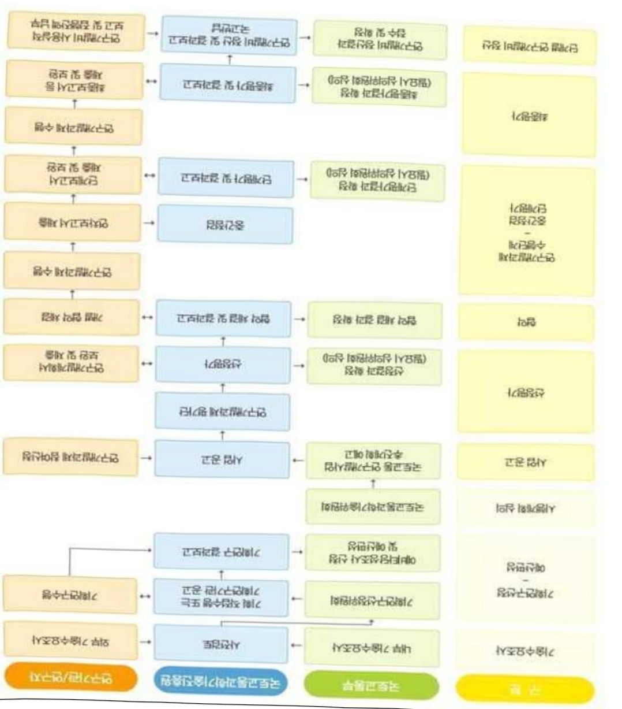

# 스마트시티인프라AIoT핵심기술개발(R&D)

**해당 페이지**: PDF 2372 ~ 2380 쪽 해당

**부처**: 국토교통부
**분야**: 교통 및 물류
**회계유형**: 일반회계
**2026 확정예산**: 6000.0 백만원
**전년대비 증감률**: -0.6%
**AI 도메인**: 건설/스마트시티, 피지컬AI/디바이스

---

### 가.예산 총괄표

(단위: 백만원, %)

<table border=1 style='margin: auto; word-wrap: break-word;'><tr><td rowspan="2">사업명</td><td rowspan="2">2024년 결산</td><td colspan="2">2025년 예산</td><td colspan="2">2026년</td><td rowspan="2">중감 (B-A)</td><td rowspan="2">(B-A)/A</td></tr><tr><td style='text-align: center; word-wrap: break-word;'>본예산(A)</td><td style='text-align: center; word-wrap: break-word;'>추경</td><td style='text-align: center; word-wrap: break-word;'>정부안</td><td style='text-align: center; word-wrap: break-word;'>확정(B)</td></tr><tr><td style='text-align: center; word-wrap: break-word;'>스마트시티 인프라AIoT 핵심기술개발 (R&amp;D)</td><td style='text-align: center; word-wrap: break-word;'>2,921</td><td style='text-align: center; word-wrap: break-word;'>6,038</td><td style='text-align: center; word-wrap: break-word;'>6,038</td><td style='text-align: center; word-wrap: break-word;'>6,000</td><td style='text-align: center; word-wrap: break-word;'>6,000</td><td style='text-align: center; word-wrap: break-word;'>△38</td><td style='text-align: center; word-wrap: break-word;'>△0.6</td></tr></table>

## □ 기능별(내역사업별), 목별 예산 내역

(단위:백만원)

<table border=1 style='margin: auto; word-wrap: break-word;'><tr><td rowspan="3"></td><td colspan="5">2024</td><td colspan="7">2025(2025.12월 말 기준)</td><td rowspan="3">2026예산</td></tr><tr><td rowspan="2">예산액(추정)</td><td rowspan="2">예산현액</td><td rowspan="2">집행액[실집행액]</td><td rowspan="2">이월액</td><td rowspan="2">불용액</td><td rowspan="2">본예산</td><td rowspan="2">예산현액</td><td rowspan="2">집행액[실집행액]</td><td colspan="2">전년도 이월액제외</td><td rowspan="2">이월예상액</td><td rowspan="2">불용예상액</td></tr><tr><td style='text-align: center; word-wrap: break-word;'>예산현액</td><td style='text-align: center; word-wrap: break-word;'>집행액[실집행액]</td></tr><tr><td style='text-align: center; word-wrap: break-word;'>○ 기능별 분류(합계)</td><td style='text-align: center; word-wrap: break-word;'>2,921</td><td style='text-align: center; word-wrap: break-word;'>2,921</td><td style='text-align: center; word-wrap: break-word;'>2,921</td><td style='text-align: center; word-wrap: break-word;'>-</td><td style='text-align: center; word-wrap: break-word;'>-</td><td style='text-align: center; word-wrap: break-word;'>6,038</td><td style='text-align: center; word-wrap: break-word;'>6,038</td><td style='text-align: center; word-wrap: break-word;'>6,038</td><td style='text-align: center; word-wrap: break-word;'>6,038</td><td style='text-align: center; word-wrap: break-word;'>6,038</td><td style='text-align: center; word-wrap: break-word;'>-</td><td style='text-align: center; word-wrap: break-word;'>-</td><td style='text-align: center; word-wrap: break-word;'>6,000</td></tr><tr><td style='text-align: center; word-wrap: break-word;'>· 스마트시티인프라AIoT핵심기술개발</td><td style='text-align: center; word-wrap: break-word;'>2,921</td><td style='text-align: center; word-wrap: break-word;'>2,921</td><td style='text-align: center; word-wrap: break-word;'>2,921</td><td style='text-align: center; word-wrap: break-word;'>-</td><td style='text-align: center; word-wrap: break-word;'>-</td><td style='text-align: center; word-wrap: break-word;'>6,038</td><td style='text-align: center; word-wrap: break-word;'>6,038</td><td style='text-align: center; word-wrap: break-word;'>6,038</td><td style='text-align: center; word-wrap: break-word;'>6,038</td><td style='text-align: center; word-wrap: break-word;'>6,038</td><td style='text-align: center; word-wrap: break-word;'>-</td><td style='text-align: center; word-wrap: break-word;'>-</td><td style='text-align: center; word-wrap: break-word;'>6,000</td></tr><tr><td style='text-align: center; word-wrap: break-word;'>○ 비목별 분류(합계)</td><td style='text-align: center; word-wrap: break-word;'>2,921</td><td style='text-align: center; word-wrap: break-word;'>2,921</td><td style='text-align: center; word-wrap: break-word;'>2,921</td><td style='text-align: center; word-wrap: break-word;'>-</td><td style='text-align: center; word-wrap: break-word;'>-</td><td style='text-align: center; word-wrap: break-word;'>6,038</td><td style='text-align: center; word-wrap: break-word;'>6,038</td><td style='text-align: center; word-wrap: break-word;'>6,038</td><td style='text-align: center; word-wrap: break-word;'>6,038</td><td style='text-align: center; word-wrap: break-word;'>6,038</td><td style='text-align: center; word-wrap: break-word;'>-</td><td style='text-align: center; word-wrap: break-word;'>-</td><td style='text-align: center; word-wrap: break-word;'>6,000</td></tr><tr><td style='text-align: center; word-wrap: break-word;'>· 연구활동비 등(360-05)</td><td style='text-align: center; word-wrap: break-word;'>2,921</td><td style='text-align: center; word-wrap: break-word;'>2,921</td><td style='text-align: center; word-wrap: break-word;'>2,921</td><td style='text-align: center; word-wrap: break-word;'>-</td><td style='text-align: center; word-wrap: break-word;'>-</td><td style='text-align: center; word-wrap: break-word;'>6,038</td><td style='text-align: center; word-wrap: break-word;'>6,038</td><td style='text-align: center; word-wrap: break-word;'>6,038</td><td style='text-align: center; word-wrap: break-word;'>6,038</td><td style='text-align: center; word-wrap: break-word;'>6,038</td><td style='text-align: center; word-wrap: break-word;'>-</td><td style='text-align: center; word-wrap: break-word;'>-</td><td style='text-align: center; word-wrap: break-word;'>6,000</td></tr><tr><td style='text-align: center; word-wrap: break-word;'>○ 기능·비목별 분류(합계)</td><td style='text-align: center; word-wrap: break-word;'>2,921</td><td style='text-align: center; word-wrap: break-word;'>2,921</td><td style='text-align: center; word-wrap: break-word;'>2,921</td><td style='text-align: center; word-wrap: break-word;'>-</td><td style='text-align: center; word-wrap: break-word;'>-</td><td style='text-align: center; word-wrap: break-word;'>6,038</td><td style='text-align: center; word-wrap: break-word;'>6,038</td><td style='text-align: center; word-wrap: break-word;'>6,038</td><td style='text-align: center; word-wrap: break-word;'>6,038</td><td style='text-align: center; word-wrap: break-word;'>6,038</td><td style='text-align: center; word-wrap: break-word;'>-</td><td style='text-align: center; word-wrap: break-word;'>-</td><td style='text-align: center; word-wrap: break-word;'>6,000</td></tr><tr><td style='text-align: center; word-wrap: break-word;'>· 스마트시티인프라AIoT핵심기술개발</td><td style='text-align: center; word-wrap: break-word;'>2,921</td><td style='text-align: center; word-wrap: break-word;'>2,921</td><td style='text-align: center; word-wrap: break-word;'>2,921</td><td style='text-align: center; word-wrap: break-word;'>-</td><td style='text-align: center; word-wrap: break-word;'>-</td><td style='text-align: center; word-wrap: break-word;'>6,038</td><td style='text-align: center; word-wrap: break-word;'>6,038</td><td style='text-align: center; word-wrap: break-word;'>6,038</td><td style='text-align: center; word-wrap: break-word;'>6,038</td><td style='text-align: center; word-wrap: break-word;'>6,038</td><td style='text-align: center; word-wrap: break-word;'>-</td><td style='text-align: center; word-wrap: break-word;'>-</td><td style='text-align: center; word-wrap: break-word;'>6,000</td></tr><tr><td style='text-align: center; word-wrap: break-word;'>· 연구활동비 등(360-05)</td><td style='text-align: center; word-wrap: break-word;'>2,921</td><td style='text-align: center; word-wrap: break-word;'>2,921</td><td style='text-align: center; word-wrap: break-word;'>2,921</td><td style='text-align: center; word-wrap: break-word;'>-</td><td style='text-align: center; word-wrap: break-word;'>-</td><td style='text-align: center; word-wrap: break-word;'>6,038</td><td style='text-align: center; word-wrap: break-word;'>6,038</td><td style='text-align: center; word-wrap: break-word;'>6,038</td><td style='text-align: center; word-wrap: break-word;'>6,038</td><td style='text-align: center; word-wrap: break-word;'>6,038</td><td style='text-align: center; word-wrap: break-word;'>-</td><td style='text-align: center; word-wrap: break-word;'>-</td><td style='text-align: center; word-wrap: break-word;'>6,000</td></tr></table>

### 나.사업설명자료

## 1 ) 사업목적·내용

- (스마트시티 인프라 AIoT 핵심 기술개발) 다양한 도시데이터의 실시간 분석·처리를 위한 인공지능 및 사물인터넷 기반의 스마트시티 AIoT(AI+IoT) 핵심기술 확보 및 지자체 실증

---

## 2 ) 사업개요

## □ 사업근거 및 추진경위

① 법령상 근거

## 「스마트도시 조성 및 산업진흥 등에 관한 법률」 제19조의5(스마트도시서비스 관련 정보시스템의 연계·통합 등)

① 스마트도시기반시설의 관리청은 스마트도시서비스를 제공하기 위하여 수집된 정보가 제2조제3호 다목에 따른 스마트도시 통합운영센터 등 스마트도시의 관리·운영에 관한 시설(이하 이 조에서 "스마트도시 관리·운영시설"이라 한다)과 연계될 수 있도록 관리하여야 한다.

② 스마트도시기반시설의 관리청은 스마트도시서비스를 통합적 · 효율적으로 제공하기 위하여 스마트도시 관리 · 운영시설 내 정보시스템이 연계 · 통합될 수 있도록 관리하여야 한다.

③ 국토교통부장관은 제1항 및 제2항에 따른 정보시스템 연계 · 통합 사업비용의 일부를 예산의 범위에서 지원할 수 있다.

## -「지능정보화 기본법」 제38조(초연결지능정보통신망의 상호연동 등)

① 정부는 국가기관과 지방자치단체가 구축한 초연결지능정보통신망의 효율적인 운영과 정보의 공동활용을 촉진하기 위하여 초연결지능정보통신망 간 상호연동에 필요한 시책을 마련하여야 한다.

② 국가기관과 지방자치단체가 초연결지능정보통신망을 구축·운영하려는 경우에는 다른 기관의 초연결지능정보통신망을 공동활용하는 방안을 우선적으로 마련하여야 한다.

## - 「국토교통과학기술육성법」 제8조(연구개발사업의 추진)

① 국토교통부장관은 종합계획을 효율적으로 추진하기 위하여 국토교통과학기술 연구개발 사업을 할 수 있다.

## ② 추진경위

- '19.7 : 「제3차 스마트시티 종합계획」 발표를 통해 혁신성장동력 R&D 성과를 바탕으로 데이터·AI 기반 스마트시티 구축을 위한 기술개발·실증 추진

- '20.12~ : 지능화 스마트시티 대응을 위한 선행사업 성과 분석, 신규 기술 수요 도출,

기술 체계 수립 등 후속사업 기획 추진

- '21.1 : 선행사업 "Massive 실시간 IoT 인프라 및 네트워크 기술"의 R&D 우수성과를 범부처 이어달리기 후보로 제출

- '22.4 : 총괄 연구기관 선정(주관연구기관 : 한국전자통신연구원)

- '22.11 : 실증 연구기관(주관연구기관 : (주소우웨이브) 및 실증지자체(성남시) 선정

---

## □ 주요내용

① 사업규모

- 총사업비 : 해당없음

- 사업기간 : '22 ~ '26

- 최근 5년 간 투입된 사업비(예산액기준, 추경편성한 연도에는 추경포함)

<table border=1 style='margin: auto; word-wrap: break-word;'><tr><td style='text-align: center; word-wrap: break-word;'>연도</td><td style='text-align: center; word-wrap: break-word;'>2022</td><td style='text-align: center; word-wrap: break-word;'>2023</td><td style='text-align: center; word-wrap: break-word;'>2024</td><td style='text-align: center; word-wrap: break-word;'>2025</td><td style='text-align: center; word-wrap: break-word;'>2026</td></tr><tr><td style='text-align: center; word-wrap: break-word;'>사업비</td><td style='text-align: center; word-wrap: break-word;'>1,000</td><td style='text-align: center; word-wrap: break-word;'>3,000</td><td style='text-align: center; word-wrap: break-word;'>2,921</td><td style='text-align: center; word-wrap: break-word;'>6,038</td><td style='text-align: center; word-wrap: break-word;'>6,000</td></tr></table>

-기타: 해당없음

② 사업추진체계

- 사업시행방법 : 출연(참여기업이 있는 경우 Matching)

- 사업시행주체 : 국토교통부(전문기관 : 국토교통과학기술진흥원)

- 사업 수혜자 : 대학, 기업, 출연연 등

- 보조, 융자, 출연, 출자 등의 경우 보조·융자 등 지원 비율 및 법적근거

<table border=1 style='margin: auto; word-wrap: break-word;'><tr><td style='text-align: center; word-wrap: break-word;'>내역사업명</td><td style='text-align: center; word-wrap: break-word;'>구분</td><td style='text-align: center; word-wrap: break-word;'>피보조·피출연 등 기관명</td><td style='text-align: center; word-wrap: break-word;'>지원 금액 (2026예산)</td><td style='text-align: center; word-wrap: break-word;'>지원 비율(%)</td><td style='text-align: center; word-wrap: break-word;'>보조율 법적근거 (해당 조항)</td></tr><tr><td rowspan="3">스마트시티 인프라AIoT 핵심기술개발</td><td rowspan="3">출연</td><td style='text-align: center; word-wrap: break-word;'>「중소기업기본법」제2조에 따른 중소기업에 해당하는 연구개발기관</td><td rowspan="3">6,000 백만원</td><td style='text-align: center; word-wrap: break-word;'>연구개발 비의 100분의 75 이하</td><td rowspan="3">「국가연구개발 혁신법 시행령」제19조</td></tr><tr><td style='text-align: center; word-wrap: break-word;'>「중견기업 성장촉진 및 경쟁력 강화에 관한 특별법」제2조제1호에 따른 중견기업에 해당하는 연구개발기관</td><td style='text-align: center; word-wrap: break-word;'>연구개발 비의 100분의 70 이하</td></tr><tr><td style='text-align: center; word-wrap: break-word;'>「공공기관의 운영에 관한 법률」제5조제4항제1호에 따른 공기업에 해당하거나 ‘가’, ‘나’에 해당 해당하지 않는 연구개발기관</td><td style='text-align: center; word-wrap: break-word;'>연구개발 비의 100분의 50 이하</td></tr></table>

* 다만, 중앙행정기관의 장이 필요하다고 인정하는 국가연구개발사업에 대하여 별도로 정할 수 있음

---

## 3 ) 2026년도 예산 산출 근거

① 스마트시티 인프라 AIoT 핵심기술개발(R&D)

:(25)6,038백만원→(26요구)6,000백만원,38백만원감액

- (편성) 세계 최고수준의 스마트시티 인프라 AloT 핵심기술 개발 및 실증, 핵심 기술 기반 스마트시티 서비스 실증 인프라 및 서비스의 지자체(성남시) 이관 등 비용을 반영하여 6,000백만원 편성

- (산출) 기술개발 1,500백만원, 실증 4,500백만원

·(종료) 1개 × 6,000백만원 × 12/12 = 6,000백만원

2025년도 예산 및 2026년도 예산 산출 세부내역 비교

<table border=1 style='margin: auto; word-wrap: break-word;'><tr><td colspan="2">2025년 예산</td><td colspan="2">2026년 예산</td></tr><tr><td style='text-align: center; word-wrap: break-word;'>예산</td><td style='text-align: center; word-wrap: break-word;'>산출내역</td><td style='text-align: center; word-wrap: break-word;'>예산</td><td style='text-align: center; word-wrap: break-word;'>산출내역</td></tr><tr><td style='text-align: center; word-wrap: break-word;'>스마트시티인프라AloT핵심기술개발6,038</td><td style='text-align: center; word-wrap: break-word;'>○ 연구활동비 등(360-05) : 6,038백만원가. AI기반 Edge AloT 플랫폼 기술 개발 (1,200백만원) • IoT 디바이스 지능화 공통기술, Edge AloT 플랫폼 단말 SW 및 민감정보 보호 지원 연합학습 알고리즘 개발 등 3건 × 400백만원 = 1,200백만원나. 스마트시티 AloT 네트워크 공통기술 개발 (1,200백만원) • 초고밀도 단말 접속 기술 보고서 및 시뮬레이터 개발 등 2건 × 600백만원 = 1,200백만원다. 스마트시티 인프라 AloT 기술 시험검증 및 평가체계 개발 (600백만원) • 실증지 현장 적용 네트워크 장비(단말 및 게이트웨이) 시험 2건 × 300 백만원 = 600 백만원라. Massive AloT 네트워크 시스템 구축 및 통합관리 SW 개발 (1,200백만원) • 도심홍수 및 배수시설 실증 AloT 네트워크 시스템 구축 및 실증 네트워크 성능 안정화, AloT 네트워크 특화 IoT 플랫폼 개발 등 3건 × 400백만원 = 1,200백만원마. AloT 기술 기반 스마트시티 3종 서비스 구현 및 운영 (1,838백만원) • 스마트안심공원 관제, 도시홍수 대응 시뮬레이터, 영상기반 Edge AI 기술 서비스 적용 및 서비스 관련 SW 개발 및 안정화 4건 × 613 백만원 = 1,838 백만원</td><td style='text-align: center; word-wrap: break-word;'>스마트시티인프라AloT핵심기술개발6,000</td><td style='text-align: center; word-wrap: break-word;'>○ 연구활동비 등(360-05) : 6,000백만원가. AI기반 Edge AloT 플랫폼 기술개발(200백만원) • 온디바이스 AI 학습 모델 경량화 기술 고도화 1건 × 200백만원 = 200백만원나. 스마트시티 AloT 네트워크 공통기술 개발(800백만원) • AloT 네트워크 인프라 공통기술 통합연동 및 성능 시험 1건 × 800만원 = 800백만원다. 스마트시티 인프라 AloT 기술 시험검증 체계 개발(200백만원) • 실증지 AloT 네트워크 인프라 상호운용성 시험 검증 1건 × 200만원 = 200백만원라. AI기반 Edge AloT 플랫폼 기술검증 및 최적화(300백만원) • 스마트시티 서비스 민감정보 보호 알고리즘 고도화 및 성능 검증 1건 × 300백만원 = 300백만원마. Massive AloT 네트워크 시스템 구축 및 안정화(400백만원) • AloT 네트워크 인프라 추가 구축 및 품질 안정화 1건 × 400백만원 = 400백만원바. 스마트시티 서비스 시스템 통합관리 SW 개발(1,400백만원) • 통합 IoT 플랫폼과 서비스 플랫폼 간 연계 및 실증도시 데이터허브 연계 도시 상황 모니터링 개발 등 2건 × 700백만원 = 1,400백만원사. 옛지 서버용 AI 분석 알고리즘 개발 및 검증(1,000백만원) • 영상 기반 옛지 서버용 AI 분석 알고리즘 구현 및 서비스 적용 등 2건 × 500백만원 = 1,000백만원아. AloT 기술기반 스마트시티 서비스 2종 고도화 및 지자체 이관(1,700백만원) • 스마트 안심공원 디지털 트윈 서비스 개발, 도시홍수 대응 재해 상황 시뮬레이터 고도화 등 2건 × 850백만원 = 1,700백만원</td></tr></table>

---

## 4 ) 사업효과

□ 사업영향, 산출물 성과지표 등

①2022~2026년도 성과계획서 상 성과지표 및 최근 5년간 성과 달성도

<table border=1 style='margin: auto; word-wrap: break-word;'><tr><td style='text-align: center; word-wrap: break-word;'>성과지표</td><td style='text-align: center; word-wrap: break-word;'>구분</td><td style='text-align: center; word-wrap: break-word;'>2022</td><td style='text-align: center; word-wrap: break-word;'>2023</td><td style='text-align: center; word-wrap: break-word;'>2024</td><td style='text-align: center; word-wrap: break-word;'>2025</td><td style='text-align: center; word-wrap: break-word;'>2026</td><td style='text-align: center; word-wrap: break-word;'>2026 목표치산출근거</td><td style='text-align: center; word-wrap: break-word;'>측정산식(또는 측정방법)</td><td style='text-align: center; word-wrap: break-word;'>자료수집방법(또는 자료출처)</td></tr><tr><td rowspan="3">핵심기술 성능목표달성도(%)</td><td style='text-align: center; word-wrap: break-word;'>목표</td><td style='text-align: center; word-wrap: break-word;'>-</td><td style='text-align: center; word-wrap: break-word;'>100</td><td style='text-align: center; word-wrap: break-word;'>100</td><td style='text-align: center; word-wrap: break-word;'>100</td><td style='text-align: center; word-wrap: break-word;'>100</td><td rowspan="3">엣지 AloT 플랫폼영상 처리속도:15fps 이상AI 학습 모델경량화율:50%이하멀티채널 데이터수집장치 데이터수신 성공률:98%이상</td><td rowspan="3">핵심기술 성능목표 달성도(%) = 각 핵심기술별달성도 평균※공인인증</td><td rowspan="3">R&amp;D사업관리시스템국가과학기술지식정보서비스(NTIS)</td></tr><tr><td style='text-align: center; word-wrap: break-word;'>실적</td><td style='text-align: center; word-wrap: break-word;'>-</td><td style='text-align: center; word-wrap: break-word;'>100</td><td style='text-align: center; word-wrap: break-word;'>100</td><td style='text-align: center; word-wrap: break-word;'></td><td style='text-align: center; word-wrap: break-word;'></td></tr><tr><td style='text-align: center; word-wrap: break-word;'>달성도</td><td style='text-align: center; word-wrap: break-word;'></td><td style='text-align: center; word-wrap: break-word;'>100</td><td style='text-align: center; word-wrap: break-word;'>100</td><td style='text-align: center; word-wrap: break-word;'></td><td style='text-align: center; word-wrap: break-word;'></td></tr><tr><td rowspan="3">실증지 네트워크인프라 성능목표달성도(%)</td><td style='text-align: center; word-wrap: break-word;'>목표</td><td style='text-align: center; word-wrap: break-word;'>-</td><td style='text-align: center; word-wrap: break-word;'>-</td><td style='text-align: center; word-wrap: break-word;'>100</td><td style='text-align: center; word-wrap: break-word;'>100</td><td style='text-align: center; word-wrap: break-word;'>100</td><td rowspan="3">네트워크 수용용량: 일 평균데이터 20만건/m²이상데이터 수신성공률:70% 이상</td><td rowspan="3">- 실증지 네트워크 인프라 성능목표 달성도(%) = 각 성능지표 별달성도 평균</td><td rowspan="3">R&amp;D사업관리시스템국가과학기술지식정보서비스(NTIS)</td></tr><tr><td style='text-align: center; word-wrap: break-word;'>실적</td><td style='text-align: center; word-wrap: break-word;'></td><td style='text-align: center; word-wrap: break-word;'></td><td style='text-align: center; word-wrap: break-word;'>100</td><td style='text-align: center; word-wrap: break-word;'></td><td style='text-align: center; word-wrap: break-word;'></td></tr><tr><td style='text-align: center; word-wrap: break-word;'>달성도</td><td style='text-align: center; word-wrap: break-word;'></td><td style='text-align: center; word-wrap: break-word;'></td><td style='text-align: center; word-wrap: break-word;'>100</td><td style='text-align: center; word-wrap: break-word;'></td><td style='text-align: center; word-wrap: break-word;'></td></tr><tr><td rowspan="3">실증서비스 만족도</td><td style='text-align: center; word-wrap: break-word;'>목표</td><td style='text-align: center; word-wrap: break-word;'>-</td><td style='text-align: center; word-wrap: break-word;'>-</td><td style='text-align: center; word-wrap: break-word;'>-</td><td style='text-align: center; word-wrap: break-word;'>-</td><td style='text-align: center; word-wrap: break-word;'>70</td><td rowspan="3">지자체 담당자 및 시민 등(200명 이상) 만족도 70% 이상</td><td rowspan="3">실증서비스 만족도 = 각 실증서비스별 만족도 합 / 실증서비스 수</td><td rowspan="3">만족도 설문조사</td></tr><tr><td style='text-align: center; word-wrap: break-word;'>실적</td><td style='text-align: center; word-wrap: break-word;'>-</td><td style='text-align: center; word-wrap: break-word;'>-</td><td style='text-align: center; word-wrap: break-word;'>-</td><td style='text-align: center; word-wrap: break-word;'>-</td><td style='text-align: center; word-wrap: break-word;'></td></tr><tr><td style='text-align: center; word-wrap: break-word;'>달성도</td><td style='text-align: center; word-wrap: break-word;'>-</td><td style='text-align: center; word-wrap: break-word;'>-</td><td style='text-align: center; word-wrap: break-word;'>-</td><td style='text-align: center; word-wrap: break-word;'>-</td><td style='text-align: center; word-wrap: break-word;'></td></tr><tr><td rowspan="3">스마트시티 인프라 AloT 기술 표준건수</td><td style='text-align: center; word-wrap: break-word;'>목표</td><td style='text-align: center; word-wrap: break-word;'>-</td><td style='text-align: center; word-wrap: break-word;'>-</td><td style='text-align: center; word-wrap: break-word;'>-</td><td style='text-align: center; word-wrap: break-word;'>2</td><td style='text-align: center; word-wrap: break-word;'>-</td><td rowspan="3">-</td><td rowspan="3">-</td><td rowspan="3">-</td></tr><tr><td style='text-align: center; word-wrap: break-word;'>실적</td><td style='text-align: center; word-wrap: break-word;'>-</td><td style='text-align: center; word-wrap: break-word;'>-</td><td style='text-align: center; word-wrap: break-word;'>-</td><td style='text-align: center; word-wrap: break-word;'></td><td style='text-align: center; word-wrap: break-word;'>-</td></tr><tr><td style='text-align: center; word-wrap: break-word;'>달성도</td><td style='text-align: center; word-wrap: break-word;'>-</td><td style='text-align: center; word-wrap: break-word;'>-</td><td style='text-align: center; word-wrap: break-word;'>-</td><td style='text-align: center; word-wrap: break-word;'></td><td style='text-align: center; word-wrap: break-word;'>-</td></tr><tr><td rowspan="3">시험검증 체계 수립(건수)</td><td style='text-align: center; word-wrap: break-word;'>목표</td><td style='text-align: center; word-wrap: break-word;'>-</td><td style='text-align: center; word-wrap: break-word;'>2</td><td style='text-align: center; word-wrap: break-word;'>3</td><td style='text-align: center; word-wrap: break-word;'>-</td><td style='text-align: center; word-wrap: break-word;'>-</td><td rowspan="3">-</td><td rowspan="3">-</td><td rowspan="3">-</td></tr><tr><td style='text-align: center; word-wrap: break-word;'>실적</td><td style='text-align: center; word-wrap: break-word;'></td><td style='text-align: center; word-wrap: break-word;'>2</td><td style='text-align: center; word-wrap: break-word;'>3</td><td style='text-align: center; word-wrap: break-word;'>-</td><td style='text-align: center; word-wrap: break-word;'>-</td></tr><tr><td style='text-align: center; word-wrap: break-word;'>달성도</td><td style='text-align: center; word-wrap: break-word;'></td><td style='text-align: center; word-wrap: break-word;'>100</td><td style='text-align: center; word-wrap: break-word;'>100</td><td style='text-align: center; word-wrap: break-word;'>-</td><td style='text-align: center; word-wrap: break-word;'>-</td></tr><tr><td rowspan="3">핵심기술 SW 공개(건)</td><td style='text-align: center; word-wrap: break-word;'>목표</td><td style='text-align: center; word-wrap: break-word;'>-</td><td style='text-align: center; word-wrap: break-word;'>1</td><td style='text-align: center; word-wrap: break-word;'>2</td><td style='text-align: center; word-wrap: break-word;'>2</td><td style='text-align: center; word-wrap: break-word;'>-</td><td rowspan="3">-</td><td rowspan="3">-</td><td rowspan="3">-</td></tr><tr><td style='text-align: center; word-wrap: break-word;'>실적</td><td style='text-align: center; word-wrap: break-word;'></td><td style='text-align: center; word-wrap: break-word;'>1</td><td style='text-align: center; word-wrap: break-word;'>2</td><td style='text-align: center; word-wrap: break-word;'></td><td style='text-align: center; word-wrap: break-word;'>-</td></tr><tr><td style='text-align: center; word-wrap: break-word;'>달성도</td><td style='text-align: center; word-wrap: break-word;'></td><td style='text-align: center; word-wrap: break-word;'>100</td><td style='text-align: center; word-wrap: break-word;'>100</td><td style='text-align: center; word-wrap: break-word;'></td><td style='text-align: center; word-wrap: break-word;'>-</td></tr></table>

---

② 성과지표 이외의 연도별 사업추진 경과 및 실적

<table border=1 style='margin: auto; word-wrap: break-word;'><tr><td style='text-align: center; word-wrap: break-word;'>2022</td><td style='text-align: center; word-wrap: break-word;'>“스마트시티 인프라 AIoT 핵심기술개발” 과제 착수 (&#x27;22.04) - 실증과제 수행을 위한 대표 서비스 7종 선정 및 실증과제 RFP 작성 - 실증과제 수행기관 및 지자체 선정(&#x27;22.11)</td></tr><tr><td style='text-align: center; word-wrap: break-word;'>2023</td><td style='text-align: center; word-wrap: break-word;'>“스마트시티 인프라 AIoT 핵심기술개발” 과제 1단계 2차년도 착수 (&#x27;23.01) - 실증지(성남시) 스마트 AI 폴 11대 설치 및 실증 네트워크 시스템 구축 - Edge AIoT 플랫폼 연구시제품 개발 “스마트시티 인프라 AIoT 핵심기술개발” 1단계 평가 실시(&#x27;23.11) - 평가결과 ‘우수’ 판정 및 계속지원 결정</td></tr><tr><td style='text-align: center; word-wrap: break-word;'>2024</td><td style='text-align: center; word-wrap: break-word;'>“스마트시티 인프라 AIoT 핵심기술개발” 과제 2단계 1차년도 착수 (&#x27;24.01) - Edge AIoT 소프트웨어 알고리즘 오픈소스 공개 1건 (&#x27;24.11) - 스마트시티 Edge AIoT 플랫폼 기술 개발 및 시제품 제작 (&#x27;24.7) - 스마트시티 AIoT 네트워크 핵심기술 상세 설계 (&#x27;24.12) - 스마트시티 인프라 AIoT 시험규격 표준 채택 (&#x27;24.12) - 실증지 AIoT 네트워크 시스템 성능 시험 (&#x27;24.10) - 실증지 서비스별 세부 기술 개발 (&#x27;24.12) - 데이터 허브 인프라 및 소프트웨어 구축 (&#x27;24.11)</td></tr><tr><td style='text-align: center; word-wrap: break-word;'>2025</td><td style='text-align: center; word-wrap: break-word;'>- 스마트시티 Edge AIoT 플랫폼 기술 고도화 및 성능 시험 - 스마트시티 AIoT 네트워크 기술 성능 시험 - 스마트시티 AIoT 네트워크 기술보고서 채택 - 시험·검증용 AIoT 네트워크 시스템 설치 및 성능시험 실시 - 실증도시 서비스별 세부 기술 통합 및 기능 시험 - 데이터 허브 연동 기술 개발 및 시스템 통합</td></tr></table>

## ③향후(2026년도 이후) 기대효과

- (국정과제 이행) 'AI 혁신기술 개발 및 서비스 발굴을 통해 새 정부 국정과제 'K-AI시티 실현'

- (네트워크 지연 감소 및 서비스 안정성 제고) 인공지능 기반 옛지 컴퓨팅 AI 알고리즘

처리를 통해 데이터 사용 폭증에 따른 데이터허브, 클라우드 과부하 및 시간

지연 문제 해소 등 스마트시티 서비스의 안정적 제공

- (다양한 도시 융합서비스 활성화) 데이터의 연계 및 공통 활용이 가능한 AIoT

무선 자가망 제공을 통해 다양한 부가 서비스 창출 및 망운영의 효율성 제고

- (스마트시티 산업 활성화 및 지자체 확산기반 마련) 핵심기술 오픈소스 공개로 기업의 진입장벽 완화, 기술표준화를 통한 기업의 기술 종속 문제 해소, 연구개발물 사업화 추진을 통한 스마트시티 산업생태계 및 기술확산 기반 조성

## 5 ) 타당성조사 및 예비타당성조사 시행여부 및 결과 요지 : 해당없음

6) 총사업비 대상사업 여부 및 내역 : 해당없음

---

<table border=1 style='margin: auto; word-wrap: break-word;'><tr><td style='text-align: center; word-wrap: break-word;'>부처</td><td style='text-align: center; word-wrap: break-word;'></td><td style='text-align: center; word-wrap: break-word;'>피출연·피보조기관</td><td style='text-align: center; word-wrap: break-word;'></td><td style='text-align: center; word-wrap: break-word;'>간접보조사업자·사업수행자</td></tr><tr><td style='text-align: center; word-wrap: break-word;'>국토교통부(6,000백만원)</td><td style='text-align: center; word-wrap: break-word;'>=&gt;(6,000백만원)</td><td style='text-align: center; word-wrap: break-word;'>국토교통과학기술진흥원(6,000백만원)</td><td style='text-align: center; word-wrap: break-word;'>=&gt;(6,000백만원)</td><td style='text-align: center; word-wrap: break-word;'>한국전자통신연구원의 13개 기관</td></tr></table>

<스마트시티 인프라 AIoT 핵심기술개발>

---

8) 중기재정계획 상 연도별 투자계획 및 추진경과

(단위: 백만원)

<table border=1 style='margin: auto; word-wrap: break-word;'><tr><td style='text-align: center; word-wrap: break-word;'>2024</td><td style='text-align: center; word-wrap: break-word;'>2025</td><td style='text-align: center; word-wrap: break-word;'>2026</td><td style='text-align: center; word-wrap: break-word;'>2027</td><td style='text-align: center; word-wrap: break-word;'>2028</td><td style='text-align: center; word-wrap: break-word;'>2029</td></tr><tr><td style='text-align: center; word-wrap: break-word;'>2024~2028</td><td style='text-align: center; word-wrap: break-word;'>2,921</td><td style='text-align: center; word-wrap: break-word;'>6,038</td><td style='text-align: center; word-wrap: break-word;'>-</td><td style='text-align: center; word-wrap: break-word;'>-</td><td style='text-align: center; word-wrap: break-word;'>-</td></tr><tr><td style='text-align: center; word-wrap: break-word;'>2025~2029</td><td style='text-align: center; word-wrap: break-word;'>6,038</td><td style='text-align: center; word-wrap: break-word;'>6,000</td><td style='text-align: center; word-wrap: break-word;'>-</td><td style='text-align: center; word-wrap: break-word;'>-</td><td style='text-align: center; word-wrap: break-word;'>-</td></tr></table>

9) 최근 3년간 동 사업에 대한 주요 외부지적사항 및 평가, 문제점 및 대책 : 해당없음

## 10 ) 향후 추진방향 및 추진계획

① Edge AIoT 플랫폼 및 네트워크 인프라 기술 개발
- AI기반 Edge AIoT 플랫폼 기술 개발 및 검증
- 스마트시티 AIoT 네트워크 공통기술 개발 및 성능 검증
- 스마트시티 인프라 AIoT 기술 시험 검증
② 핵심기술의 지자체 통합 실증 및 고도화
- Massive AIoT 네트워크 시스템 구축 및 안정화
- 스마트시티 서비스 시스템 통합관리 SW 개발
- 옛지 서버용 AI 분석 알고리즘 개발 및 검증
- AIoT 기술기반 스마트시티 서비스 구현·고도화 및 지자체 이관

## 11 ) 해당사업에 대한 각종 사업평가의 결과

1) 「국가재정법」제85조의8제1항에 따른 재정사업자율평가 결과에 대한 기획재정부의 상위평가(심층평가) 결과 : 해당없음

2) R&D사업의 경우 「국가연구개발사업 등의 성과평가 및 성과관리에 관한 법률」

제7조제3항에 따른 부처의 R&D사업 자체성과평가에 대한 과학기술정보통신부

상위평가 결과 : ‘보통, 90.0점(과기정통부, ‘25 상위평가)

3) 그 외 보조사업 연장평가, 재정지원 일자리사업 평가 등 개별 법률에 규정된 평가

시행 결과 : 해당없음

## 12 ) 해당사업에 대한 부처 자체평가의 결과

<table border=1 style='margin: auto; word-wrap: break-word;'><tr><td style='text-align: center; word-wrap: break-word;'>1) 2023년도 부처 재정사업 자율평가 결과: 해당없음</td></tr><tr><td style='text-align: center; word-wrap: break-word;'>2) 2024년도 부처 재정사업 자율평가 결과: 해당없음</td></tr><tr><td style='text-align: center; word-wrap: break-word;'>3) 2025년도 부처 재정사업 자율평가 결과: 해당없음</td></tr></table>

## 13 ) 부처 건의사항 : 해당없음

---

<table border=1 style='margin: auto; word-wrap: break-word;'><tr><td style='text-align: center; word-wrap: break-word;'>사 업 명</td></tr><tr><td style='text-align: center; word-wrap: break-word;'>(6) 스마트시티확산사업 (5637-308)</td></tr></table>

□ 사업 코드 정보

<table border=1 style='margin: auto; word-wrap: break-word;'><tr><td style='text-align: center; word-wrap: break-word;'>구분</td><td style='text-align: center; word-wrap: break-word;'>회계</td><td style='text-align: center; word-wrap: break-word;'>소관</td><td style='text-align: center; word-wrap: break-word;'>실국(기관)</td><td style='text-align: center; word-wrap: break-word;'>계정</td><td style='text-align: center; word-wrap: break-word;'>분야</td><td style='text-align: center; word-wrap: break-word;'>부문</td></tr><tr><td style='text-align: center; word-wrap: break-word;'>코드</td><td rowspan="2">일반회계</td><td rowspan="2">국토교통부</td><td rowspan="2">국토도시실</td><td rowspan="2">-</td><td style='text-align: center; word-wrap: break-word;'>140</td><td style='text-align: center; word-wrap: break-word;'>142</td></tr><tr><td style='text-align: center; word-wrap: break-word;'>명칭</td><td style='text-align: center; word-wrap: break-word;'>국토및지역개발</td><td style='text-align: center; word-wrap: break-word;'>지역및도시</td></tr></table>

<table border=1 style='margin: auto; word-wrap: break-word;'><tr><td style='text-align: center; word-wrap: break-word;'>구분</td><td style='text-align: center; word-wrap: break-word;'>프로그램</td><td style='text-align: center; word-wrap: break-word;'>단위사업</td><td style='text-align: center; word-wrap: break-word;'>세부사업</td></tr><tr><td style='text-align: center; word-wrap: break-word;'>코드</td><td style='text-align: center; word-wrap: break-word;'>5600</td><td style='text-align: center; word-wrap: break-word;'>5637</td><td style='text-align: center; word-wrap: break-word;'>308</td></tr><tr><td style='text-align: center; word-wrap: break-word;'>명칭</td><td style='text-align: center; word-wrap: break-word;'>도시정책</td><td style='text-align: center; word-wrap: break-word;'>스마트시티 지원</td><td style='text-align: center; word-wrap: break-word;'>스마트시티 확산사업</td></tr></table>

□ 사업 성격 (공통요구자료 Ⅱ-1 작성유의사항 4. 참조, 해당하는 사항에 “O” 표시

<table border=1 style='margin: auto; word-wrap: break-word;'><tr><td rowspan="2">신규</td><td rowspan="2">계속</td><td rowspan="2">완료</td><td rowspan="2">예비타당성 실시여부</td><td rowspan="2">총사업비 관리대상</td><td rowspan="2">총액계상 예산사업</td><td style='text-align: center; word-wrap: break-word;'>사업소관 변경정보</td></tr><tr><td style='text-align: center; word-wrap: break-word;'>2025예산 시 소관</td></tr><tr><td style='text-align: center; word-wrap: break-word;'></td><td style='text-align: center; word-wrap: break-word;'>○</td><td style='text-align: center; word-wrap: break-word;'></td><td style='text-align: center; word-wrap: break-word;'></td><td style='text-align: center; word-wrap: break-word;'></td><td style='text-align: center; word-wrap: break-word;'></td><td style='text-align: center; word-wrap: break-word;'>국토교통부</td></tr></table>

□ 사업 지원 형태 및 지원을 (최소한 한 개는 반드시 선택하시오. 해당사항에 0 표시)

<table border=1 style='margin: auto; word-wrap: break-word;'><tr><td style='text-align: center; word-wrap: break-word;'>직접</td><td style='text-align: center; word-wrap: break-word;'>출자</td><td style='text-align: center; word-wrap: break-word;'>출연</td><td style='text-align: center; word-wrap: break-word;'>보조</td><td style='text-align: center; word-wrap: break-word;'>융자</td><td style='text-align: center; word-wrap: break-word;'>국고보조율(%)</td><td style='text-align: center; word-wrap: break-word;'>융자율(%)</td></tr><tr><td style='text-align: center; word-wrap: break-word;'>○</td><td style='text-align: center; word-wrap: break-word;'></td><td style='text-align: center; word-wrap: break-word;'></td><td style='text-align: center; word-wrap: break-word;'>○</td><td style='text-align: center; word-wrap: break-word;'></td><td style='text-align: center; word-wrap: break-word;'>50</td><td style='text-align: center; word-wrap: break-word;'></td></tr></table>

## □ 사업 담당자

<table border=1 style='margin: auto; word-wrap: break-word;'><tr><td style='text-align: center; word-wrap: break-word;'>사업명</td><td colspan="2">구분</td></tr><tr><td rowspan="2">혁신기술 발굴 규제샌드박스</td><td style='text-align: center; word-wrap: break-word;'>소관부처</td><td style='text-align: center; word-wrap: break-word;'>실·국·과(팀) 도시정책관 도시경제과</td></tr><tr><td style='text-align: center; word-wrap: break-word;'>사업시행주체</td><td style='text-align: center; word-wrap: break-word;'>-</td></tr><tr><td rowspan="2">스마트 국내외확산</td><td style='text-align: center; word-wrap: break-word;'>소관부처</td><td style='text-align: center; word-wrap: break-word;'>실·국·과(팀) 도시정책관 도시경제과</td></tr><tr><td style='text-align: center; word-wrap: break-word;'>사업시행주체</td><td style='text-align: center; word-wrap: break-word;'>-</td></tr><tr><td rowspan="2">AI·데이터 허브구축지원</td><td style='text-align: center; word-wrap: break-word;'>소관부처</td><td style='text-align: center; word-wrap: break-word;'>실·국·과(팀) 도시정책관 도시경제과</td></tr><tr><td style='text-align: center; word-wrap: break-word;'>사업시행주체</td><td style='text-align: center; word-wrap: break-word;'>한국지능정보 사회진흥원 데이터활용기술팀</td></tr><tr><td rowspan="2">스마트IoT 구축지원</td><td style='text-align: center; word-wrap: break-word;'>소관부처</td><td style='text-align: center; word-wrap: break-word;'>실·국·과(팀) 도시정책관 도시경제과</td></tr><tr><td style='text-align: center; word-wrap: break-word;'>사업시행주체</td><td style='text-align: center; word-wrap: break-word;'>한국지능정보 사회진흥원 데이터활용기술팀</td></tr></table>

---

### 원본 PDF 크롭 이미지

