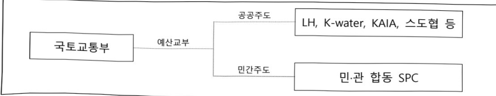
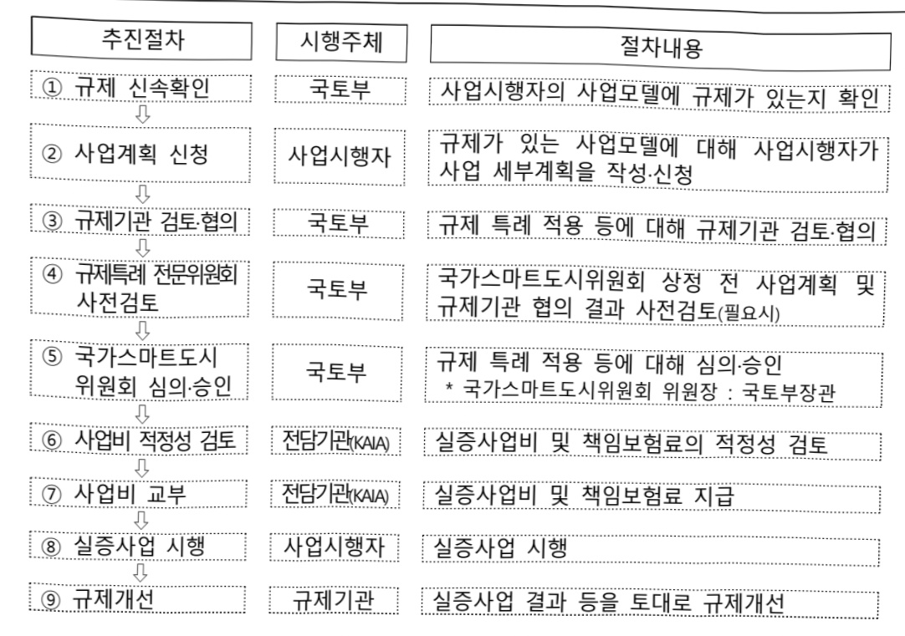

# 스마트시티확산사업

**해당 페이지**: PDF 2381 ~ 2404 쪽 해당

**부처**: 국토교통부
**분야**: 국토 및 지역개발
**회계유형**: 일반회계
**2026 확정예산**: 31615.0 백만원
**전년대비 증감률**: 82.6%
**AI 도메인**: 데이터, 보안/사이버, 의료/바이오, 교통/모빌리티, 로봇, 건설/스마트시티, 피지컬AI/디바이스

---

<table border=1 style='margin: auto; word-wrap: break-word;'><tr><td rowspan="4">디지털트런구축지원</td><td rowspan="3">소관부처</td><td style='text-align: center; word-wrap: break-word;'>실·국·과(팀)</td></tr><tr><td style='text-align: center; word-wrap: break-word;'>도시정책관</td></tr><tr><td style='text-align: center; word-wrap: break-word;'>도시경제과</td></tr><tr><td style='text-align: center; word-wrap: break-word;'>사업시행주체</td><td style='text-align: center; word-wrap: break-word;'>한국토지 주택공사 시범도시사업팀</td></tr><tr><td rowspan="4">시범도시사업관리지원</td><td rowspan="3">소관부처</td><td style='text-align: center; word-wrap: break-word;'>실·국·과(팀)</td></tr><tr><td style='text-align: center; word-wrap: break-word;'>도시정책관</td></tr><tr><td style='text-align: center; word-wrap: break-word;'>스마트도시팀</td></tr><tr><td style='text-align: center; word-wrap: break-word;'>사업시행주체</td><td style='text-align: center; word-wrap: break-word;'>-</td></tr><tr><td rowspan="4">혁신생태계조성 지원</td><td rowspan="3">소관부처</td><td style='text-align: center; word-wrap: break-word;'>실·국·과(팀)</td></tr><tr><td style='text-align: center; word-wrap: break-word;'>도시정책관</td></tr><tr><td style='text-align: center; word-wrap: break-word;'>스마트도시팀</td></tr><tr><td style='text-align: center; word-wrap: break-word;'>사업시행주체</td><td style='text-align: center; word-wrap: break-word;'>-</td></tr><tr><td rowspan="4">교통혁신기술도입지원</td><td rowspan="3">소관부처</td><td style='text-align: center; word-wrap: break-word;'>실·국·과(팀)</td></tr><tr><td style='text-align: center; word-wrap: break-word;'>도시정책관</td></tr><tr><td style='text-align: center; word-wrap: break-word;'>도시경제과</td></tr><tr><td style='text-align: center; word-wrap: break-word;'>사업시행주체</td><td style='text-align: center; word-wrap: break-word;'>한국교통연구원 모빌리티전환 연구본부</td></tr><tr><td rowspan="4">생활혁신기술구축지원</td><td rowspan="3">소관부처</td><td style='text-align: center; word-wrap: break-word;'>실·국·과(팀)</td></tr><tr><td style='text-align: center; word-wrap: break-word;'>도시정책관</td></tr><tr><td style='text-align: center; word-wrap: break-word;'>도시경제과</td></tr><tr><td style='text-align: center; word-wrap: break-word;'>사업시행주체</td><td style='text-align: center; word-wrap: break-word;'>한국토지주택공사 시범도시사업팀</td></tr><tr><td rowspan="4">안전혁신기술도입 지원</td><td rowspan="3">소관부처</td><td style='text-align: center; word-wrap: break-word;'>실·국·과(팀)</td></tr><tr><td style='text-align: center; word-wrap: break-word;'>도시정책관</td></tr><tr><td style='text-align: center; word-wrap: break-word;'>도시경제과</td></tr><tr><td style='text-align: center; word-wrap: break-word;'>사업시행주체</td><td style='text-align: center; word-wrap: break-word;'>-</td></tr><tr><td rowspan="4">사이버보안 구축지원</td><td rowspan="3">소관부처</td><td style='text-align: center; word-wrap: break-word;'>실·국·과(팀)</td></tr><tr><td style='text-align: center; word-wrap: break-word;'>도시정책관</td></tr><tr><td style='text-align: center; word-wrap: break-word;'>도시경제과</td></tr><tr><td style='text-align: center; word-wrap: break-word;'>사업시행주체</td><td style='text-align: center; word-wrap: break-word;'>한국인터넷진흥원 디지털제품보안팀</td></tr></table>

### 가. 예산 총괄표

(단위: 백만원, %)

<table border=1 style='margin: auto; word-wrap: break-word;'><tr><td rowspan="2">사업명</td><td rowspan="2">2024년 결산</td><td colspan="2">2025년 예산</td><td colspan="2">2026년</td><td rowspan="2">중감 (B-A)</td><td rowspan="2">(B-A)/A</td></tr><tr><td style='text-align: center; word-wrap: break-word;'>본예산(A)</td><td style='text-align: center; word-wrap: break-word;'>추경</td><td style='text-align: center; word-wrap: break-word;'>정부안</td><td style='text-align: center; word-wrap: break-word;'>확정(B)</td></tr><tr><td style='text-align: center; word-wrap: break-word;'>스마트시티 확산사업</td><td style='text-align: center; word-wrap: break-word;'>76,180</td><td style='text-align: center; word-wrap: break-word;'>17,312</td><td style='text-align: center; word-wrap: break-word;'>17,312</td><td style='text-align: center; word-wrap: break-word;'>28,115</td><td style='text-align: center; word-wrap: break-word;'>31,615</td><td style='text-align: center; word-wrap: break-word;'>10,803</td><td style='text-align: center; word-wrap: break-word;'>82.6</td></tr></table>

---

□ 기능별(내역사업별), 목별 예산 내역

(단위:백만원)

<table border=1 style='margin: auto; word-wrap: break-word;'><tr><td rowspan="2"></td><td colspan="5">2024</td><td colspan="7">2025(2025.12월말)</td><td rowspan="2">2026예산</td></tr><tr><td style='text-align: center; word-wrap: break-word;'>예산액(추경)</td><td style='text-align: center; word-wrap: break-word;'>예산현액</td><td style='text-align: center; word-wrap: break-word;'>집행액[잠정해]</td><td style='text-align: center; word-wrap: break-word;'>이월액</td><td style='text-align: center; word-wrap: break-word;'>불용액</td><td style='text-align: center; word-wrap: break-word;'>분예산</td><td style='text-align: center; word-wrap: break-word;'>예산현액</td><td style='text-align: center; word-wrap: break-word;'>집행액[잠정해]</td><td style='text-align: center; word-wrap: break-word;'>전년도이월액제외</td><td style='text-align: center; word-wrap: break-word;'>이월예상액</td><td style='text-align: center; word-wrap: break-word;'>불용예상액</td><td style='text-align: center; word-wrap: break-word;'></td></tr><tr><td style='text-align: center; word-wrap: break-word;'>○ 기능별 분류(합계)</td><td style='text-align: center; word-wrap: break-word;'>78,831</td><td style='text-align: center; word-wrap: break-word;'>80,210</td><td style='text-align: center; word-wrap: break-word;'>76,180[76,180]</td><td style='text-align: center; word-wrap: break-word;'>838</td><td style='text-align: center; word-wrap: break-word;'>3,192</td><td style='text-align: center; word-wrap: break-word;'>17,312</td><td style='text-align: center; word-wrap: break-word;'>17,827</td><td style='text-align: center; word-wrap: break-word;'>17,385</td><td style='text-align: center; word-wrap: break-word;'>17,312</td><td style='text-align: center; word-wrap: break-word;'>17,009</td><td style='text-align: center; word-wrap: break-word;'>257</td><td style='text-align: center; word-wrap: break-word;'>185</td><td style='text-align: center; word-wrap: break-word;'>31,615</td></tr><tr><td style='text-align: center; word-wrap: break-word;'>· 스마트시티 조성</td><td style='text-align: center; word-wrap: break-word;'>60,335</td><td style='text-align: center; word-wrap: break-word;'>60,599</td><td style='text-align: center; word-wrap: break-word;'>57,230[57,230]</td><td style='text-align: center; word-wrap: break-word;'>323</td><td style='text-align: center; word-wrap: break-word;'>3,046</td><td style='text-align: center; word-wrap: break-word;'>-</td><td style='text-align: center; word-wrap: break-word;'>-</td><td style='text-align: center; word-wrap: break-word;'>-</td><td style='text-align: center; word-wrap: break-word;'>-</td><td style='text-align: center; word-wrap: break-word;'>-</td><td style='text-align: center; word-wrap: break-word;'>-</td><td style='text-align: center; word-wrap: break-word;'>-</td><td style='text-align: center; word-wrap: break-word;'>-</td></tr><tr><td style='text-align: center; word-wrap: break-word;'>· 혁신기술발굴 규제센트빈스 (규칙)</td><td style='text-align: center; word-wrap: break-word;'>3,500</td><td style='text-align: center; word-wrap: break-word;'>4,321</td><td style='text-align: center; word-wrap: break-word;'>3,937</td><td style='text-align: center; word-wrap: break-word;'>320</td><td style='text-align: center; word-wrap: break-word;'>64</td><td style='text-align: center; word-wrap: break-word;'>3,450</td><td style='text-align: center; word-wrap: break-word;'>3,770</td><td style='text-align: center; word-wrap: break-word;'>3,377</td><td style='text-align: center; word-wrap: break-word;'>3,450</td><td style='text-align: center; word-wrap: break-word;'>3,179</td><td style='text-align: center; word-wrap: break-word;'>257</td><td style='text-align: center; word-wrap: break-word;'>136</td><td style='text-align: center; word-wrap: break-word;'>5,250</td></tr><tr><td style='text-align: center; word-wrap: break-word;'>· 스마트시티 국내외 확산 지원</td><td style='text-align: center; word-wrap: break-word;'>1,000</td><td style='text-align: center; word-wrap: break-word;'>1,294</td><td style='text-align: center; word-wrap: break-word;'>1,019</td><td style='text-align: center; word-wrap: break-word;'>195</td><td style='text-align: center; word-wrap: break-word;'>80</td><td style='text-align: center; word-wrap: break-word;'>1,000</td><td style='text-align: center; word-wrap: break-word;'>1,195</td><td style='text-align: center; word-wrap: break-word;'>1,146</td><td style='text-align: center; word-wrap: break-word;'>1,000</td><td style='text-align: center; word-wrap: break-word;'>968</td><td style='text-align: center; word-wrap: break-word;'>-</td><td style='text-align: center; word-wrap: break-word;'>49</td><td style='text-align: center; word-wrap: break-word;'>1,000</td></tr><tr><td style='text-align: center; word-wrap: break-word;'>· AI·데이터허브 구축 지원</td><td style='text-align: center; word-wrap: break-word;'>1,043</td><td style='text-align: center; word-wrap: break-word;'>1,043</td><td style='text-align: center; word-wrap: break-word;'>1,043</td><td style='text-align: center; word-wrap: break-word;'>-</td><td style='text-align: center; word-wrap: break-word;'>-</td><td style='text-align: center; word-wrap: break-word;'>1,739</td><td style='text-align: center; word-wrap: break-word;'>-</td><td style='text-align: center; word-wrap: break-word;'>-</td><td style='text-align: center; word-wrap: break-word;'>-</td><td style='text-align: center; word-wrap: break-word;'>-</td><td style='text-align: center; word-wrap: break-word;'>-</td><td style='text-align: center; word-wrap: break-word;'>-</td><td style='text-align: center; word-wrap: break-word;'>2,270</td></tr><tr><td style='text-align: center; word-wrap: break-word;'>· 스마트 IoT 구축 지원</td><td style='text-align: center; word-wrap: break-word;'>1,981</td><td style='text-align: center; word-wrap: break-word;'>1,981</td><td style='text-align: center; word-wrap: break-word;'>1,981</td><td style='text-align: center; word-wrap: break-word;'>-</td><td style='text-align: center; word-wrap: break-word;'>-</td><td style='text-align: center; word-wrap: break-word;'>3,755</td><td style='text-align: center; word-wrap: break-word;'>5,494</td><td style='text-align: center; word-wrap: break-word;'>5,494</td><td style='text-align: center; word-wrap: break-word;'>5,494</td><td style='text-align: center; word-wrap: break-word;'>5,494</td><td style='text-align: center; word-wrap: break-word;'>-</td><td style='text-align: center; word-wrap: break-word;'>-</td><td style='text-align: center; word-wrap: break-word;'>900</td></tr><tr><td style='text-align: center; word-wrap: break-word;'>· 사이버 보안 구축 지원</td><td style='text-align: center; word-wrap: break-word;'>1,776</td><td style='text-align: center; word-wrap: break-word;'>1,776</td><td style='text-align: center; word-wrap: break-word;'>1,776</td><td style='text-align: center; word-wrap: break-word;'>-</td><td style='text-align: center; word-wrap: break-word;'>-</td><td style='text-align: center; word-wrap: break-word;'>-</td><td style='text-align: center; word-wrap: break-word;'>-</td><td style='text-align: center; word-wrap: break-word;'>-</td><td style='text-align: center; word-wrap: break-word;'>-</td><td style='text-align: center; word-wrap: break-word;'>-</td><td style='text-align: center; word-wrap: break-word;'>-</td><td style='text-align: center; word-wrap: break-word;'>-</td><td style='text-align: center; word-wrap: break-word;'>3,650</td></tr><tr><td style='text-align: center; word-wrap: break-word;'>· 디지털트빈 구축 지원</td><td style='text-align: center; word-wrap: break-word;'>-</td><td style='text-align: center; word-wrap: break-word;'>-</td><td style='text-align: center; word-wrap: break-word;'>-</td><td style='text-align: center; word-wrap: break-word;'>-</td><td style='text-align: center; word-wrap: break-word;'>1,925</td><td style='text-align: center; word-wrap: break-word;'>1,925</td><td style='text-align: center; word-wrap: break-word;'>1,925</td><td style='text-align: center; word-wrap: break-word;'>1,925</td><td style='text-align: center; word-wrap: break-word;'>1,925</td><td style='text-align: center; word-wrap: break-word;'>-</td><td style='text-align: center; word-wrap: break-word;'>-</td><td style='text-align: center; word-wrap: break-word;'>6,315</td><td style='text-align: center; word-wrap: break-word;'></td></tr><tr><td style='text-align: center; word-wrap: break-word;'>· 시범도시 사업관리 지원</td><td style='text-align: center; word-wrap: break-word;'>800</td><td style='text-align: center; word-wrap: break-word;'>800</td><td style='text-align: center; word-wrap: break-word;'>800</td><td style='text-align: center; word-wrap: break-word;'>-</td><td style='text-align: center; word-wrap: break-word;'>-</td><td style='text-align: center; word-wrap: break-word;'>800</td><td style='text-align: center; word-wrap: break-word;'>800</td><td style='text-align: center; word-wrap: break-word;'>800</td><td style='text-align: center; word-wrap: break-word;'>800</td><td style='text-align: center; word-wrap: break-word;'>800</td><td style='text-align: center; word-wrap: break-word;'>-</td><td style='text-align: center; word-wrap: break-word;'>-</td><td style='text-align: center; word-wrap: break-word;'>800</td></tr><tr><td style='text-align: center; word-wrap: break-word;'>· 혁신생태계 조성 지원</td><td style='text-align: center; word-wrap: break-word;'>1,150</td><td style='text-align: center; word-wrap: break-word;'>1,150</td><td style='text-align: center; word-wrap: break-word;'>1,150</td><td style='text-align: center; word-wrap: break-word;'>-</td><td style='text-align: center; word-wrap: break-word;'>-</td><td style='text-align: center; word-wrap: break-word;'>1,150</td><td style='text-align: center; word-wrap: break-word;'>1,150</td><td style='text-align: center; word-wrap: break-word;'>1,150</td><td style='text-align: center; word-wrap: break-word;'>1,150</td><td style='text-align: center; word-wrap: break-word;'>1,150</td><td style='text-align: center; word-wrap: break-word;'>-</td><td style='text-align: center; word-wrap: break-word;'>-</td><td style='text-align: center; word-wrap: break-word;'>1,150</td></tr><tr><td style='text-align: center; word-wrap: break-word;'>· 교통 혁신기술 도입지원</td><td style='text-align: center; word-wrap: break-word;'>5,816</td><td style='text-align: center; word-wrap: break-word;'>5,816</td><td style='text-align: center; word-wrap: break-word;'>5,816</td><td style='text-align: center; word-wrap: break-word;'>-</td><td style='text-align: center; word-wrap: break-word;'>-</td><td style='text-align: center; word-wrap: break-word;'>2,193</td><td style='text-align: center; word-wrap: break-word;'>2,193</td><td style='text-align: center; word-wrap: break-word;'>2,193</td><td style='text-align: center; word-wrap: break-word;'>2,193</td><td style='text-align: center; word-wrap: break-word;'>2,193</td><td style='text-align: center; word-wrap: break-word;'>-</td><td style='text-align: center; word-wrap: break-word;'>-</td><td style='text-align: center; word-wrap: break-word;'>4,530</td></tr><tr><td style='text-align: center; word-wrap: break-word;'>· 에너지 혁신기술 도입지원</td><td style='text-align: center; word-wrap: break-word;'>1,430</td><td style='text-align: center; word-wrap: break-word;'>1,430</td><td style='text-align: center; word-wrap: break-word;'>1,430</td><td style='text-align: center; word-wrap: break-word;'>-</td><td style='text-align: center; word-wrap: break-word;'>-</td><td style='text-align: center; word-wrap: break-word;'>-</td><td style='text-align: center; word-wrap: break-word;'>-</td><td style='text-align: center; word-wrap: break-word;'>-</td><td style='text-align: center; word-wrap: break-word;'>-</td><td style='text-align: center; word-wrap: break-word;'>-</td><td style='text-align: center; word-wrap: break-word;'>-</td><td style='text-align: center; word-wrap: break-word;'>-</td><td style='text-align: center; word-wrap: break-word;'>-</td></tr><tr><td style='text-align: center; word-wrap: break-word;'>· 안전 혁신기술 도입지원</td><td style='text-align: center; word-wrap: break-word;'>-</td><td style='text-align: center; word-wrap: break-word;'>-</td><td style='text-align: center; word-wrap: break-word;'>-</td><td style='text-align: center; word-wrap: break-word;'>-</td><td style='text-align: center; word-wrap: break-word;'>-</td><td style='text-align: center; word-wrap: break-word;'>-</td><td style='text-align: center; word-wrap: break-word;'>-</td><td style='text-align: center; word-wrap: break-word;'>-</td><td style='text-align: center; word-wrap: break-word;'>-</td><td style='text-align: center; word-wrap: break-word;'>-</td><td style='text-align: center; word-wrap: break-word;'>-</td><td style='text-align: center; word-wrap: break-word;'>-</td><td style='text-align: center; word-wrap: break-word;'>-</td></tr><tr><td style='text-align: center; word-wrap: break-word;'>· 생활 혁신기술 도입지원</td><td style='text-align: center; word-wrap: break-word;'>-</td><td style='text-align: center; word-wrap: break-word;'>-</td><td style='text-align: center; word-wrap: break-word;'>-</td><td style='text-align: center; word-wrap: break-word;'>-</td><td style='text-align: center; word-wrap: break-word;'>-</td><td style='text-align: center; word-wrap: break-word;'>1,300</td><td style='text-align: center; word-wrap: break-word;'>1,300</td><td style='text-align: center; word-wrap: break-word;'>1,300</td><td style='text-align: center; word-wrap: break-word;'>1,300</td><td style='text-align: center; word-wrap: break-word;'>1,300</td><td style='text-align: center; word-wrap: break-word;'>-</td><td style='text-align: center; word-wrap: break-word;'>-</td><td style='text-align: center; word-wrap: break-word;'>2,270</td></tr><tr><td style='text-align: center; word-wrap: break-word;'>· 로봇 혁신기술 도입지원</td><td style='text-align: center; word-wrap: break-word;'>-</td><td style='text-align: center; word-wrap: break-word;'>-</td><td style='text-align: center; word-wrap: break-word;'>-</td><td style='text-align: center; word-wrap: break-word;'>-</td><td style='text-align: center; word-wrap: break-word;'>-</td><td style='text-align: center; word-wrap: break-word;'>-</td><td style='text-align: center; word-wrap: break-word;'>-</td><td style='text-align: center; word-wrap: break-word;'>-</td><td style='text-align: center; word-wrap: break-word;'>-</td><td style='text-align: center; word-wrap: break-word;'>-</td><td style='text-align: center; word-wrap: break-word;'>-</td><td style='text-align: center; word-wrap: break-word;'>-</td><td style='text-align: center; word-wrap: break-word;'>1,000</td></tr><tr><td style='text-align: center; word-wrap: break-word;'>· 헬스케어 혁신기술 도입지원</td><td style='text-align: center; word-wrap: break-word;'>-</td><td style='text-align: center; word-wrap: break-word;'>-</td><td style='text-align: center; word-wrap: break-word;'>-</td><td style='text-align: center; word-wrap: break-word;'>-</td><td style='text-align: center; word-wrap: break-word;'>-</td><td style='text-align: center; word-wrap: break-word;'>-</td><td style='text-align: center; word-wrap: break-word;'>-</td><td style='text-align: center; word-wrap: break-word;'>-</td><td style='text-align: center; word-wrap: break-word;'>-</td><td style='text-align: center; word-wrap: break-word;'>-</td><td style='text-align: center; word-wrap: break-word;'>-</td><td style='text-align: center; word-wrap: break-word;'>-</td><td style='text-align: center; word-wrap: break-word;'>2,480</td></tr><tr><td style='text-align: center; word-wrap: break-word;'>○ 비목별 분류(합계)</td><td style='text-align: center; word-wrap: break-word;'>78,831</td><td style='text-align: center; word-wrap: break-word;'>80,210</td><td style='text-align: center; word-wrap: break-word;'>76,180[76,180]</td><td style='text-align: center; word-wrap: break-word;'>838</td><td style='text-align: center; word-wrap: break-word;'>3,192</td><td style='text-align: center; word-wrap: break-word;'>17,312</td><td style='text-align: center; word-wrap: break-word;'>17,827</td><td style='text-align: center; word-wrap: break-word;'>17,385</td><td style='text-align: center; word-wrap: break-word;'>17,312</td><td style='text-align: center; word-wrap: break-word;'>17,009</td><td style='text-align: center; word-wrap: break-word;'>257</td><td style='text-align: center; word-wrap: break-word;'>185</td><td style='text-align: center; word-wrap: break-word;'>31,615</td></tr><tr><td style='text-align: center; word-wrap: break-word;'>· 일반수용비(210-01)</td><td style='text-align: center; word-wrap: break-word;'>71</td><td style='text-align: center; word-wrap: break-word;'>71</td><td style='text-align: center; word-wrap: break-word;'>71</td><td style='text-align: center; word-wrap: break-word;'>-</td><td style='text-align: center; word-wrap: break-word;'>-</td><td style='text-align: center; word-wrap: break-word;'>-</td><td style='text-align: center; word-wrap: break-word;'>-</td><td style='text-align: center; word-wrap: break-word;'>-</td><td style='text-align: center; word-wrap: break-word;'>-</td><td style='text-align: center; word-wrap: break-word;'>-</td><td style='text-align: center; word-wrap: break-word;'>-</td><td style='text-align: center; word-wrap: break-word;'>-</td><td style='text-align: center; word-wrap: break-word;'>-</td></tr><tr><td style='text-align: center; word-wrap: break-word;'>· 사업추진비(240-01)</td><td style='text-align: center; word-wrap: break-word;'>29</td><td style='text-align: center; word-wrap: break-word;'>29</td><td style='text-align: center; word-wrap: break-word;'>29</td><td style='text-align: center; word-wrap: break-word;'>-</td><td style='text-align: center; word-wrap: break-word;'>-</td><td style='text-align: center; word-wrap: break-word;'>-</td><td style='text-align: center; word-wrap: break-word;'>-</td><td style='text-align: center; word-wrap: break-word;'>-</td><td style='text-align: center; word-wrap: break-word;'>-</td><td style='text-align: center; word-wrap: break-word;'>-</td><td style='text-align: center; word-wrap: break-word;'>-</td><td style='text-align: center; word-wrap: break-word;'>-</td><td style='text-align: center; word-wrap: break-word;'>-</td></tr><tr><td style='text-align: center; word-wrap: break-word;'>· 민간위탁사업비(320-02)</td><td style='text-align: center; word-wrap: break-word;'>20,096</td><td style='text-align: center; word-wrap: break-word;'>21,475</td><td style='text-align: center; word-wrap: break-word;'>20,445</td><td style='text-align: center; word-wrap: break-word;'>838</td><td style='text-align: center; word-wrap: break-word;'>192</td><td style='text-align: center; word-wrap: break-word;'>17,312</td><td style='text-align: center; word-wrap: break-word;'>17,827</td><td style='text-align: center; word-wrap: break-word;'>17,385</td><td style='text-align: center; word-wrap: break-word;'>17,312</td><td style='text-align: center; word-wrap: break-word;'>17,009</td><td style='text-align: center; word-wrap: break-word;'>257</td><td style='text-align: center; word-wrap: break-word;'>185</td><td style='text-align: center; word-wrap: break-word;'>31,615</td></tr><tr><td style='text-align: center; word-wrap: break-word;'>· 지자체자본보조(330-03)</td><td style='text-align: center; word-wrap: break-word;'>58,635</td><td style='text-align: center; word-wrap: break-word;'>58,635</td><td style='text-align: center; word-wrap: break-word;'>55,635[55,635]</td><td style='text-align: center; word-wrap: break-word;'>-</td><td style='text-align: center; word-wrap: break-word;'>3,000</td><td style='text-align: center; word-wrap: break-word;'>-</td><td style='text-align: center; word-wrap: break-word;'>-</td><td style='text-align: center; word-wrap: break-word;'>-</td><td style='text-align: center; word-wrap: break-word;'>-</td><td style='text-align: center; word-wrap: break-word;'>-</td><td style='text-align: center; word-wrap: break-word;'>-</td><td style='text-align: center; word-wrap: break-word;'>-</td><td style='text-align: center; word-wrap: break-word;'>-</td></tr><tr><td style='text-align: center; word-wrap: break-word;'>○ 기능비목별 분류(합계)</td><td style='text-align: center; word-wrap: break-word;'>18,496</td><td style='text-align: center; word-wrap: break-word;'>19,611</td><td style='text-align: center; word-wrap: break-word;'>18,952</td><td style='text-align: center; word-wrap: break-word;'>838</td><td style='text-align: center; word-wrap: break-word;'>3,192</td><td style='text-align: center; word-wrap: break-word;'>17,312</td><td style='text-align: center; word-wrap: break-word;'>17,827</td><td style='text-align: center; word-wrap: break-word;'>17,385</td><td style='text-align: center; word-wrap: break-word;'>17,312</td><td style='text-align: center; word-wrap: break-word;'>17,009</td><td style='text-align: center; word-wrap: break-word;'>257</td><td style='text-align: center; word-wrap: break-word;'>185</td><td style='text-align: center; word-wrap: break-word;'>31,615</td></tr><tr><td style='text-align: center; word-wrap: break-word;'>· 스마트시티 조성</td><td style='text-align: center; word-wrap: break-word;'>60,335</td><td style='text-align: center; word-wrap: break-word;'>60,599</td><td style='text-align: center; word-wrap: break-word;'>57,230[57,230]</td><td style='text-align: center; word-wrap: break-word;'>323</td><td style='text-align: center; word-wrap: break-word;'>3,046</td><td style='text-align: center; word-wrap: break-word;'>-</td><td style='text-align: center; word-wrap: break-word;'>-</td><td style='text-align: center; word-wrap: break-word;'>-</td><td style='text-align: center; word-wrap: break-word;'>-</td><td style='text-align: center; word-wrap: break-word;'>-</td><td style='text-align: center; word-wrap: break-word;'>-</td><td style='text-align: center; word-wrap: break-word;'>-</td><td style='text-align: center; word-wrap: break-word;'>-</td></tr><tr><td style='text-align: center; word-wrap: break-word;'>· 일반수용비(210-01)</td><td style='text-align: center; word-wrap: break-word;'>71</td><td style='text-align: center; word-wrap: break-word;'>71</td><td style='text-align: center; word-wrap: break-word;'>71</td><td style='text-align: center; word-wrap: break-word;'>-</td><td style='text-align: center; word-wrap: break-word;'>-</td><td style='text-align: center; word-wrap: break-word;'>-</td><td style='text-align: center; word-wrap: break-word;'>-</td><td style='text-align: center; word-wrap: break-word;'>-</td><td style='text-align: center; word-wrap: break-word;'>-</td><td style='text-align: center; word-wrap: break-word;'>-</td><td style='text-align: center; word-wrap: break-word;'>-</td><td style='text-align: center; word-wrap: break-word;'>-</td><td style='text-align: center; word-wrap: break-word;'>-</td></tr><tr><td style='text-align: center; word-wrap: break-word;'>· 사업추진비(240-01)</td><td style='text-align: center; word-wrap: break-word;'>29</td><td style='text-align: center; word-wrap: break-word;'>29</td><td style='text-align: center; word-wrap: break-word;'>29</td><td style='text-align: center; word-wrap: break-word;'>-</td><td style='text-align: center; word-wrap: break-word;'>-</td><td style='text-align: center; word-wrap: break-word;'>-</td><td style='text-align: center; word-wrap: break-word;'>-</td><td style='text-align: center; word-wrap: break-word;'>-</td><td style='text-align: center; word-wrap: break-word;'>-</td><td style='text-align: center; word-wrap: break-word;'>-</td><td style='text-align: center; word-wrap: break-word;'>-</td><td style='text-align: center; word-wrap: break-word;'>-</td><td style='text-align: center; word-wrap: break-word;'>-</td></tr><tr><td style='text-align: center; word-wrap: break-word;'>· 민간위탁사업비(320-02)</td><td style='text-align: center; word-wrap: break-word;'>1,600</td><td style='text-align: center; word-wrap: break-word;'>1,864</td><td style='text-align: center; word-wrap: break-word;'>1,493</td><td style='text-align: center; word-wrap: break-word;'>323</td><td style='text-align: center; word-wrap: break-word;'>48</td><td style='text-align: center; word-wrap: break-word;'>-</td><td style='text-align: center; word-wrap: break-word;'>-</td><td style='text-align: center; word-wrap: break-word;'>-</td><td style='text-align: center; word-wrap: break-word;'>-</td><td style='text-align: center; word-wrap: break-word;'>-</td><td style='text-align: center; word-wrap: break-word;'>-</td><td style='text-align: center; word-wrap: break-word;'>-</td><td style='text-align: center; word-wrap: break-word;'>-</td></tr><tr><td style='text-align: center; word-wrap: break-word;'>· 지자체자본보조(330-03)</td><td style='text-align: center; word-wrap: break-word;'>58,635</td><td style='text-align: center; word-wrap: break-word;'>58,635</td><td style='text-align: center; word-wrap: break-word;'>55,635[55,635]</td><td style='text-align: center; word-wrap: break-word;'>-</td><td style='text-align: center; word-wrap: break-word;'>3,000</td><td style='text-align: center; word-wrap: break-word;'>-</td><td style='text-align: center; word-wrap: break-word;'>-</td><td style='text-align: center; word-wrap: break-word;'>-</td><td style='text-align: center; word-wrap: break-word;'>-</td><td style='text-align: center; word-wrap: break-word;'>-</td><td style='text-align: center; word-wrap: break-word;'>-</td><td style='text-align: center; word-wrap: break-word;'>-</td><td style='text-align: center; word-wrap: break-word;'>-</td></tr></table>

---

<table border=1 style='margin: auto; word-wrap: break-word;'><tr><td rowspan="2"></td><td colspan="4">2024</td><td colspan="7">2025(2025.12월말)</td><td rowspan="2">2026예산</td></tr><tr><td style='text-align: center; word-wrap: break-word;'>예산액(추경)</td><td style='text-align: center; word-wrap: break-word;'>예산현액</td><td style='text-align: center; word-wrap: break-word;'>집행액(삼절행액)</td><td style='text-align: center; word-wrap: break-word;'>이월액</td><td style='text-align: center; word-wrap: break-word;'>불용액</td><td style='text-align: center; word-wrap: break-word;'>본예산</td><td style='text-align: center; word-wrap: break-word;'>예산현액</td><td style='text-align: center; word-wrap: break-word;'>집행액[실절행액]</td><td style='text-align: center; word-wrap: break-word;'>전년도이월액제외예산현액</td><td style='text-align: center; word-wrap: break-word;'>집행액[삼절행액]</td><td style='text-align: center; word-wrap: break-word;'>불용예상액</td></tr><tr><td style='text-align: center; word-wrap: break-word;'>·혁신기술 발굴 규제센드박스</td><td style='text-align: center; word-wrap: break-word;'>3,500</td><td style='text-align: center; word-wrap: break-word;'>4,321</td><td style='text-align: center; word-wrap: break-word;'>3,937</td><td style='text-align: center; word-wrap: break-word;'>320</td><td style='text-align: center; word-wrap: break-word;'>64</td><td style='text-align: center; word-wrap: break-word;'>3,450</td><td style='text-align: center; word-wrap: break-word;'>3,770</td><td style='text-align: center; word-wrap: break-word;'>3,377</td><td style='text-align: center; word-wrap: break-word;'>3,450</td><td style='text-align: center; word-wrap: break-word;'>3,179</td><td style='text-align: center; word-wrap: break-word;'>257</td><td style='text-align: center; word-wrap: break-word;'>136</td></tr><tr><td style='text-align: center; word-wrap: break-word;'>·민간위탁사업비(320-02)</td><td style='text-align: center; word-wrap: break-word;'>3,500</td><td style='text-align: center; word-wrap: break-word;'>4,321</td><td style='text-align: center; word-wrap: break-word;'>3,937</td><td style='text-align: center; word-wrap: break-word;'>320</td><td style='text-align: center; word-wrap: break-word;'>64</td><td style='text-align: center; word-wrap: break-word;'>3,450</td><td style='text-align: center; word-wrap: break-word;'>3,770</td><td style='text-align: center; word-wrap: break-word;'>3,377</td><td style='text-align: center; word-wrap: break-word;'>3,450</td><td style='text-align: center; word-wrap: break-word;'>3,179</td><td style='text-align: center; word-wrap: break-word;'>257</td><td style='text-align: center; word-wrap: break-word;'>136</td></tr><tr><td style='text-align: center; word-wrap: break-word;'>·스마트시티 국내외 확산 지원</td><td style='text-align: center; word-wrap: break-word;'>1,000</td><td style='text-align: center; word-wrap: break-word;'>1,294</td><td style='text-align: center; word-wrap: break-word;'>1,019</td><td style='text-align: center; word-wrap: break-word;'>195</td><td style='text-align: center; word-wrap: break-word;'>80</td><td style='text-align: center; word-wrap: break-word;'>1,000</td><td style='text-align: center; word-wrap: break-word;'>1,195</td><td style='text-align: center; word-wrap: break-word;'>1,146</td><td style='text-align: center; word-wrap: break-word;'>1,000</td><td style='text-align: center; word-wrap: break-word;'>968</td><td style='text-align: center; word-wrap: break-word;'>-</td><td style='text-align: center; word-wrap: break-word;'>49</td></tr><tr><td style='text-align: center; word-wrap: break-word;'>·민간위탁사업비(320-02)</td><td style='text-align: center; word-wrap: break-word;'>1,000</td><td style='text-align: center; word-wrap: break-word;'>1,294</td><td style='text-align: center; word-wrap: break-word;'>1,019</td><td style='text-align: center; word-wrap: break-word;'>195</td><td style='text-align: center; word-wrap: break-word;'>80</td><td style='text-align: center; word-wrap: break-word;'>1,000</td><td style='text-align: center; word-wrap: break-word;'>1,195</td><td style='text-align: center; word-wrap: break-word;'>1,146</td><td style='text-align: center; word-wrap: break-word;'>1,000</td><td style='text-align: center; word-wrap: break-word;'>968</td><td style='text-align: center; word-wrap: break-word;'>-</td><td style='text-align: center; word-wrap: break-word;'>49</td></tr><tr><td style='text-align: center; word-wrap: break-word;'>·AI·테이터 허브 구축 지원</td><td style='text-align: center; word-wrap: break-word;'>1,043</td><td style='text-align: center; word-wrap: break-word;'>1,043</td><td style='text-align: center; word-wrap: break-word;'>-</td><td style='text-align: center; word-wrap: break-word;'>-</td><td style='text-align: center; word-wrap: break-word;'>-</td><td style='text-align: center; word-wrap: break-word;'>1,739</td><td style='text-align: center; word-wrap: break-word;'>-</td><td style='text-align: center; word-wrap: break-word;'>-</td><td style='text-align: center; word-wrap: break-word;'>-</td><td style='text-align: center; word-wrap: break-word;'>-</td><td style='text-align: center; word-wrap: break-word;'>-</td><td style='text-align: center; word-wrap: break-word;'>2,270</td></tr><tr><td style='text-align: center; word-wrap: break-word;'>·민간위탁사업비(320-02)</td><td style='text-align: center; word-wrap: break-word;'>1,043</td><td style='text-align: center; word-wrap: break-word;'>1,043</td><td style='text-align: center; word-wrap: break-word;'>-</td><td style='text-align: center; word-wrap: break-word;'>-</td><td style='text-align: center; word-wrap: break-word;'>-</td><td style='text-align: center; word-wrap: break-word;'>1,739</td><td style='text-align: center; word-wrap: break-word;'>-</td><td style='text-align: center; word-wrap: break-word;'>-</td><td style='text-align: center; word-wrap: break-word;'>-</td><td style='text-align: center; word-wrap: break-word;'>-</td><td style='text-align: center; word-wrap: break-word;'>-</td><td style='text-align: center; word-wrap: break-word;'>2,270</td></tr><tr><td style='text-align: center; word-wrap: break-word;'>·스마트 IoT 구축 지원</td><td style='text-align: center; word-wrap: break-word;'>1,981</td><td style='text-align: center; word-wrap: break-word;'>1,981</td><td style='text-align: center; word-wrap: break-word;'>-</td><td style='text-align: center; word-wrap: break-word;'>-</td><td style='text-align: center; word-wrap: break-word;'>-</td><td style='text-align: center; word-wrap: break-word;'>3,755</td><td style='text-align: center; word-wrap: break-word;'>5,494</td><td style='text-align: center; word-wrap: break-word;'>5,494</td><td style='text-align: center; word-wrap: break-word;'>5,494</td><td style='text-align: center; word-wrap: break-word;'>5,494</td><td style='text-align: center; word-wrap: break-word;'>-</td><td style='text-align: center; word-wrap: break-word;'>900</td></tr><tr><td style='text-align: center; word-wrap: break-word;'>·민간위탁사업비(320-02)</td><td style='text-align: center; word-wrap: break-word;'>1,981</td><td style='text-align: center; word-wrap: break-word;'>1,981</td><td style='text-align: center; word-wrap: break-word;'>-</td><td style='text-align: center; word-wrap: break-word;'>-</td><td style='text-align: center; word-wrap: break-word;'>-</td><td style='text-align: center; word-wrap: break-word;'>3,755</td><td style='text-align: center; word-wrap: break-word;'>5,494</td><td style='text-align: center; word-wrap: break-word;'>5,494</td><td style='text-align: center; word-wrap: break-word;'>5,494</td><td style='text-align: center; word-wrap: break-word;'>5,494</td><td style='text-align: center; word-wrap: break-word;'>-</td><td style='text-align: center; word-wrap: break-word;'>900</td></tr><tr><td style='text-align: center; word-wrap: break-word;'>·사이버 보안 구축 지원</td><td style='text-align: center; word-wrap: break-word;'>1,776</td><td style='text-align: center; word-wrap: break-word;'>1,776</td><td style='text-align: center; word-wrap: break-word;'>-</td><td style='text-align: center; word-wrap: break-word;'>-</td><td style='text-align: center; word-wrap: break-word;'>-</td><td style='text-align: center; word-wrap: break-word;'>-</td><td style='text-align: center; word-wrap: break-word;'>-</td><td style='text-align: center; word-wrap: break-word;'>-</td><td style='text-align: center; word-wrap: break-word;'>-</td><td style='text-align: center; word-wrap: break-word;'>-</td><td style='text-align: center; word-wrap: break-word;'>-</td><td style='text-align: center; word-wrap: break-word;'>3,650</td></tr><tr><td style='text-align: center; word-wrap: break-word;'>·민간위탁사업비(320-02)</td><td style='text-align: center; word-wrap: break-word;'>1,776</td><td style='text-align: center; word-wrap: break-word;'>1,776</td><td style='text-align: center; word-wrap: break-word;'>-</td><td style='text-align: center; word-wrap: break-word;'>-</td><td style='text-align: center; word-wrap: break-word;'>-</td><td style='text-align: center; word-wrap: break-word;'>-</td><td style='text-align: center; word-wrap: break-word;'>-</td><td style='text-align: center; word-wrap: break-word;'>-</td><td style='text-align: center; word-wrap: break-word;'>-</td><td style='text-align: center; word-wrap: break-word;'>-</td><td style='text-align: center; word-wrap: break-word;'>-</td><td style='text-align: center; word-wrap: break-word;'>3,650</td></tr><tr><td style='text-align: center; word-wrap: break-word;'>·디지털트런 구축 지원</td><td style='text-align: center; word-wrap: break-word;'>-</td><td style='text-align: center; word-wrap: break-word;'>-</td><td style='text-align: center; word-wrap: break-word;'>-</td><td style='text-align: center; word-wrap: break-word;'>-</td><td style='text-align: center; word-wrap: break-word;'>-</td><td style='text-align: center; word-wrap: break-word;'>1,925</td><td style='text-align: center; word-wrap: break-word;'>1,925</td><td style='text-align: center; word-wrap: break-word;'>1,925</td><td style='text-align: center; word-wrap: break-word;'>1,925</td><td style='text-align: center; word-wrap: break-word;'>1,925</td><td style='text-align: center; word-wrap: break-word;'>-</td><td style='text-align: center; word-wrap: break-word;'>6,315</td></tr><tr><td style='text-align: center; word-wrap: break-word;'>·민간위탁사업비(320-02)</td><td style='text-align: center; word-wrap: break-word;'>-</td><td style='text-align: center; word-wrap: break-word;'>-</td><td style='text-align: center; word-wrap: break-word;'>-</td><td style='text-align: center; word-wrap: break-word;'>-</td><td style='text-align: center; word-wrap: break-word;'>-</td><td style='text-align: center; word-wrap: break-word;'>1,925</td><td style='text-align: center; word-wrap: break-word;'>1,925</td><td style='text-align: center; word-wrap: break-word;'>1,925</td><td style='text-align: center; word-wrap: break-word;'>1,925</td><td style='text-align: center; word-wrap: break-word;'>1,925</td><td style='text-align: center; word-wrap: break-word;'>-</td><td style='text-align: center; word-wrap: break-word;'>6,315</td></tr><tr><td style='text-align: center; word-wrap: break-word;'>·사업도시 사업편리 지원</td><td style='text-align: center; word-wrap: break-word;'>800</td><td style='text-align: center; word-wrap: break-word;'>800</td><td style='text-align: center; word-wrap: break-word;'>-</td><td style='text-align: center; word-wrap: break-word;'>-</td><td style='text-align: center; word-wrap: break-word;'>-</td><td style='text-align: center; word-wrap: break-word;'>800</td><td style='text-align: center; word-wrap: break-word;'>800</td><td style='text-align: center; word-wrap: break-word;'>800</td><td style='text-align: center; word-wrap: break-word;'>800</td><td style='text-align: center; word-wrap: break-word;'>800</td><td style='text-align: center; word-wrap: break-word;'>-</td><td style='text-align: center; word-wrap: break-word;'>800</td></tr><tr><td style='text-align: center; word-wrap: break-word;'>·민간위탁사업비(320-02)</td><td style='text-align: center; word-wrap: break-word;'>800</td><td style='text-align: center; word-wrap: break-word;'>800</td><td style='text-align: center; word-wrap: break-word;'>-</td><td style='text-align: center; word-wrap: break-word;'>-</td><td style='text-align: center; word-wrap: break-word;'>-</td><td style='text-align: center; word-wrap: break-word;'>800</td><td style='text-align: center; word-wrap: break-word;'>800</td><td style='text-align: center; word-wrap: break-word;'>800</td><td style='text-align: center; word-wrap: break-word;'>800</td><td style='text-align: center; word-wrap: break-word;'>800</td><td style='text-align: center; word-wrap: break-word;'>-</td><td style='text-align: center; word-wrap: break-word;'>800</td></tr><tr><td style='text-align: center; word-wrap: break-word;'>·혁신생태계 조성 지원</td><td style='text-align: center; word-wrap: break-word;'>1,150</td><td style='text-align: center; word-wrap: break-word;'>1,150</td><td style='text-align: center; word-wrap: break-word;'>-</td><td style='text-align: center; word-wrap: break-word;'>-</td><td style='text-align: center; word-wrap: break-word;'>-</td><td style='text-align: center; word-wrap: break-word;'>1,150</td><td style='text-align: center; word-wrap: break-word;'>1,150</td><td style='text-align: center; word-wrap: break-word;'>1,150</td><td style='text-align: center; word-wrap: break-word;'>1,150</td><td style='text-align: center; word-wrap: break-word;'>1,150</td><td style='text-align: center; word-wrap: break-word;'>-</td><td style='text-align: center; word-wrap: break-word;'>1,150</td></tr><tr><td style='text-align: center; word-wrap: break-word;'>·민간위탁사업비(320-02)</td><td style='text-align: center; word-wrap: break-word;'>1,150</td><td style='text-align: center; word-wrap: break-word;'>1,150</td><td style='text-align: center; word-wrap: break-word;'>-</td><td style='text-align: center; word-wrap: break-word;'>-</td><td style='text-align: center; word-wrap: break-word;'>-</td><td style='text-align: center; word-wrap: break-word;'>1,150</td><td style='text-align: center; word-wrap: break-word;'>1,150</td><td style='text-align: center; word-wrap: break-word;'>1,150</td><td style='text-align: center; word-wrap: break-word;'>1,150</td><td style='text-align: center; word-wrap: break-word;'>1,150</td><td style='text-align: center; word-wrap: break-word;'>-</td><td style='text-align: center; word-wrap: break-word;'>1,150</td></tr><tr><td style='text-align: center; word-wrap: break-word;'>·교통 혁신기술 도입지원</td><td style='text-align: center; word-wrap: break-word;'>5,816</td><td style='text-align: center; word-wrap: break-word;'>5,816</td><td style='text-align: center; word-wrap: break-word;'>5,816</td><td style='text-align: center; word-wrap: break-word;'>-</td><td style='text-align: center; word-wrap: break-word;'>-</td><td style='text-align: center; word-wrap: break-word;'>2,193</td><td style='text-align: center; word-wrap: break-word;'>2,193</td><td style='text-align: center; word-wrap: break-word;'>2,193</td><td style='text-align: center; word-wrap: break-word;'>2,193</td><td style='text-align: center; word-wrap: break-word;'>2,193</td><td style='text-align: center; word-wrap: break-word;'>-</td><td style='text-align: center; word-wrap: break-word;'>4,530</td></tr><tr><td style='text-align: center; word-wrap: break-word;'>·민간위탁사업비(320-02)</td><td style='text-align: center; word-wrap: break-word;'>5,816</td><td style='text-align: center; word-wrap: break-word;'>5,816</td><td style='text-align: center; word-wrap: break-word;'>5,816</td><td style='text-align: center; word-wrap: break-word;'>-</td><td style='text-align: center; word-wrap: break-word;'>-</td><td style='text-align: center; word-wrap: break-word;'>2,193</td><td style='text-align: center; word-wrap: break-word;'>2,193</td><td style='text-align: center; word-wrap: break-word;'>2,193</td><td style='text-align: center; word-wrap: break-word;'>2,193</td><td style='text-align: center; word-wrap: break-word;'>2,193</td><td style='text-align: center; word-wrap: break-word;'>-</td><td style='text-align: center; word-wrap: break-word;'>4,530</td></tr><tr><td style='text-align: center; word-wrap: break-word;'>·에너지 혁신기술 도입지원</td><td style='text-align: center; word-wrap: break-word;'>1,430</td><td style='text-align: center; word-wrap: break-word;'>1,430</td><td style='text-align: center; word-wrap: break-word;'>-</td><td style='text-align: center; word-wrap: break-word;'>-</td><td style='text-align: center; word-wrap: break-word;'>-</td><td style='text-align: center; word-wrap: break-word;'>-</td><td style='text-align: center; word-wrap: break-word;'>-</td><td style='text-align: center; word-wrap: break-word;'>-</td><td style='text-align: center; word-wrap: break-word;'>-</td><td style='text-align: center; word-wrap: break-word;'>-</td><td style='text-align: center; word-wrap: break-word;'>-</td><td style='text-align: center; word-wrap: break-word;'>-</td></tr><tr><td style='text-align: center; word-wrap: break-word;'>·민간위탁사업비(320-02)</td><td style='text-align: center; word-wrap: break-word;'>1,430</td><td style='text-align: center; word-wrap: break-word;'>1,430</td><td style='text-align: center; word-wrap: break-word;'>-</td><td style='text-align: center; word-wrap: break-word;'>-</td><td style='text-align: center; word-wrap: break-word;'>-</td><td style='text-align: center; word-wrap: break-word;'>-</td><td style='text-align: center; word-wrap: break-word;'>-</td><td style='text-align: center; word-wrap: break-word;'>-</td><td style='text-align: center; word-wrap: break-word;'>-</td><td style='text-align: center; word-wrap: break-word;'>-</td><td style='text-align: center; word-wrap: break-word;'>-</td><td style='text-align: center; word-wrap: break-word;'>-</td></tr><tr><td style='text-align: center; word-wrap: break-word;'>·안전 혁신기술 도입지원</td><td style='text-align: center; word-wrap: break-word;'>-</td><td style='text-align: center; word-wrap: break-word;'>-</td><td style='text-align: center; word-wrap: break-word;'>-</td><td style='text-align: center; word-wrap: break-word;'>-</td><td style='text-align: center; word-wrap: break-word;'>-</td><td style='text-align: center; word-wrap: break-word;'>-</td><td style='text-align: center; word-wrap: break-word;'>-</td><td style='text-align: center; word-wrap: break-word;'>-</td><td style='text-align: center; word-wrap: break-word;'>-</td><td style='text-align: center; word-wrap: break-word;'>-</td><td style='text-align: center; word-wrap: break-word;'>-</td><td style='text-align: center; word-wrap: break-word;'>-</td></tr><tr><td style='text-align: center; word-wrap: break-word;'>·민간위탁사업비(320-02)</td><td style='text-align: center; word-wrap: break-word;'>-</td><td style='text-align: center; word-wrap: break-word;'>-</td><td style='text-align: center; word-wrap: break-word;'>-</td><td style='text-align: center; word-wrap: break-word;'>-</td><td style='text-align: center; word-wrap: break-word;'>-</td><td style='text-align: center; word-wrap: break-word;'>-</td><td style='text-align: center; word-wrap: break-word;'>-</td><td style='text-align: center; word-wrap: break-word;'>-</td><td style='text-align: center; word-wrap: break-word;'>-</td><td style='text-align: center; word-wrap: break-word;'>-</td><td style='text-align: center; word-wrap: break-word;'>-</td><td style='text-align: center; word-wrap: break-word;'>-</td></tr><tr><td style='text-align: center; word-wrap: break-word;'>·생활 혁신기술 도입지원</td><td style='text-align: center; word-wrap: break-word;'>-</td><td style='text-align: center; word-wrap: break-word;'>-</td><td style='text-align: center; word-wrap: break-word;'>-</td><td style='text-align: center; word-wrap: break-word;'>-</td><td style='text-align: center; word-wrap: break-word;'>-</td><td style='text-align: center; word-wrap: break-word;'>1,300</td><td style='text-align: center; word-wrap: break-word;'>1,300</td><td style='text-align: center; word-wrap: break-word;'>1,300</td><td style='text-align: center; word-wrap: break-word;'>1,300</td><td style='text-align: center; word-wrap: break-word;'>1,300</td><td style='text-align: center; word-wrap: break-word;'>-</td><td style='text-align: center; word-wrap: break-word;'>2,270</td></tr><tr><td style='text-align: center; word-wrap: break-word;'>·민간위탁사업비(320-02)</td><td style='text-align: center; word-wrap: break-word;'>-</td><td style='text-align: center; word-wrap: break-word;'>-</td><td style='text-align: center; word-wrap: break-word;'>-</td><td style='text-align: center; word-wrap: break-word;'>-</td><td style='text-align: center; word-wrap: break-word;'>-</td><td style='text-align: center; word-wrap: break-word;'>1,300</td><td style='text-align: center; word-wrap: break-word;'>1,300</td><td style='text-align: center; word-wrap: break-word;'>1,300</td><td style='text-align: center; word-wrap: break-word;'>1,300</td><td style='text-align: center; word-wrap: break-word;'>1,300</td><td style='text-align: center; word-wrap: break-word;'>-</td><td style='text-align: center; word-wrap: break-word;'>2,270</td></tr><tr><td style='text-align: center; word-wrap: break-word;'>·로봇 혁신기술 도입지원</td><td style='text-align: center; word-wrap: break-word;'>-</td><td style='text-align: center; word-wrap: break-word;'>-</td><td style='text-align: center; word-wrap: break-word;'>-</td><td style='text-align: center; word-wrap: break-word;'>-</td><td style='text-align: center; word-wrap: break-word;'>-</td><td style='text-align: center; word-wrap: break-word;'>-</td><td style='text-align: center; word-wrap: break-word;'>-</td><td style='text-align: center; word-wrap: break-word;'>-</td><td style='text-align: center; word-wrap: break-word;'>-</td><td style='text-align: center; word-wrap: break-word;'>-</td><td style='text-align: center; word-wrap: break-word;'>-</td><td style='text-align: center; word-wrap: break-word;'>1,000</td></tr><tr><td style='text-align: center; word-wrap: break-word;'>·민간위탁사업비(320-02)</td><td style='text-align: center; word-wrap: break-word;'>-</td><td style='text-align: center; word-wrap: break-word;'>-</td><td style='text-align: center; word-wrap: break-word;'>-</td><td style='text-align: center; word-wrap: break-word;'>-</td><td style='text-align: center; word-wrap: break-word;'>-</td><td style='text-align: center; word-wrap: break-word;'>-</td><td style='text-align: center; word-wrap: break-word;'>-</td><td style='text-align: center; word-wrap: break-word;'>-</td><td style='text-align: center; word-wrap: break-word;'>-</td><td style='text-align: center; word-wrap: break-word;'>-</td><td style='text-align: center; word-wrap: break-word;'>-</td><td style='text-align: center; word-wrap: break-word;'>1,000</td></tr></table>

---

### 나. 사업설명자료

## 1 ) 사업목적·내용

°(혁신기술발굴 규제센드박스) 각종 규제로 인하여 기술개발·실증이 곤란한 스마트 시티 관련 기술을 일정조건(기간,장소,규모) 하에서 현행 규제를 면제·유예하여 실증할 수 있도록 지원. 기업의 혁신기술에 대해 조기 상용화를 지원하고, 스마트 기반이 충분히 조성된 도시는 지역특화 규제특례 운영 지원 추진

°(스마트시티 국내외 확산지원) 스마트시티 사업을 통해 나타나는 우수성과를 발굴하고,

기업·지자체 등 공유 및 홍보를 통해 대국민 인지도 제고 및 미래 연계사업으로 확산

°(국가시범도시 관련 내역사업) 세종·부산에 세계적 수준의 스마트시티 국가시범도시를 조성해 4차 산업혁명 융복합 신기술 테스트베드, 도시 문제해결·삶의 질 제고, 혁신 산업생태계 조성을 균형있게 추진

- (AI·데이터허브 구축지원) 도심 핵심데이터(IoT 센서, 공공데이터 등)를 수집·저장하고, AI 기반으로 빅데이터 분석이 가능한 도시운영 플랫폼 구성

- (스마트 IoT 구축지원) 대량의 도시 데이터를 수집·저장하고, 이를 기반으로 다양한 연계 서비스를 제공할 수 있도록 IoT 네트워크 및 센서 구축

- (사이버 보안 구축지원) 개인정보 등 데이터, 네트워크 연계로 인해 취약점이 발생할 수 있음을 고려, 이에 대응하기 위한 사이버 보안 체계 구축

- (디지털 트런 구축지원) 가상도시모델 구현으로 데이터 중심의 정책 수립, 재난·

안전관리 등 도시운영 모니터링 및 의사결정을 위한 시뮬레이션 서비스 구축

- (교통 혁신기술 도입지원) MaaS 앱 중심으로 공유 교통수단(퍼스널 모빌리티, 차량 공유 등), 자율주행 등 다양한 모빌리티 서비스 연계 제공 추진

- (에너지 혁신기술 도입지원) 친환경 에너지 발전시설(부산), 교통수단의 융·복합

충전 인프라 등 구축 지원

- (생활 혁신기술 도입지원) 시범도시 내 모든 스마트서비스 효율적인 접근·이용 제공 및 공공·민간 데이터 융·복합 서비스 구현을 위한 One ID기반의 Citizen통합App 구축

- (로봇 혁신기술 도입지원) 로봇친화형 건축 및 도시공간 설계에 맞춰 로봇서비스 도입에 따른 플랫폼 구축, 도시 활용 App 개발 추진

- (헬스케어 도입지원) 질병 예방 및 건강증진을 위한 개인맞춤형 건강관리 서비스와 고위험군·만성질환 환자들을 대상으로 체계적인 관리 서비스를 제공 추진

---

## 2 ) 사업개요

## ① 혁신기술발굴 규제샌드박스

□ 사업근거 및 추진경위

① 법령상 근거 : 「스마트도시 조성 및 산업진흥 등에 관한 법률」 제49조, 제50조

제49조(스마트혁신사업 등) ① 스마트혁신사업을 시행하려는 사업자(지방자치단체 및 제9조의2에 따른 민간기업등을 포함한다. 이하 “스마트혁신사업자”라 한다)는 해당 사업이 다음 각 호의 어느 하나에 해당되는 경우 국토교통부장관에게 해당 사업의 시행을 위한 계획(이하 “스마트혁신사업계획”이라 한다)의 승인을 신청할 수 있다.

1. 스마트혁신기술·서비스에 대한 허가·승인·인증·검증·인가·등록 등(이하 “허가 등”이라 한다)의 근거가 되는 법령에 해당 스마트혁신사업의 추진에 필요한 기준·규격·요건 등이 없는 경우

2. 스마트혁신기술·서비스에 대한 허가등의 근거가 되는 법령에 따라 해당 스마트혁신사업의 추진에 필요한 기준·규격·요건 등을 적용하는 것이 적절하지 않은 경우

② 스마트혁신사업자는 제1항에 따른 승인신청 전에 스마트혁신사업을 시행하려는 지역(이하 “시행지역”이라 한다)을 관할하는 지방자치단체의 장에게 스마트혁신사업계획을 제출하여 검토를 받아야 한다. 이 경우 관할 지방자치단체의 장의 의견 및 조치요구사항과 스마트혁신사업자의 조치계획을 스마트혁신사업계획에 포함하여 제1항에 따른 승인신청을 하여야 한다.

③ 스마트혁신사업계획은 다음 각 호의 내용을 포함하여야 한다. 이 경우 시행지역을 관할하는 지방자치단체의 스마트도시계획을 고려하여 수립하여야 한다.

1. 스마트혁신사업의 주요 목적, 시행지역 및 내용

2. 스마트혁신사업의 시행을 위하여 필요한 다른 법령의 규제특례 및 규제개선에 관한 사항

3. 스마트혁신사업의 시행에 관한 안전성 관련 사항

4. 스마트혁신사업의 시행 중 발생가능한 사고의 예방 및 인적 · 물적 피해배상 방안

5. 제2항에 따른 검토 결과 지방자치단체의 장의 의견 및 조치요구사항, 스마트혁신사업

자의 조치계획

6. 그 밖에 스마트혁신사업의 시행과 관련하여 필요한 사항으로서 대통령령으로 정하는 사항

④ 국토교통부장관은 제1항에 따른 신청을 받은 경우 관계 중앙행정기관의 장에게 통보하여야 한다. 이 경우 관계 중앙행정기관의 장은 신청 내용을 검토하여 그 결과를 30일 이내에 국토교통부장관에게 문서로 회신하여야 한다.

⑤ 관계 중앙행정기관의 장이 규제특례의 필요성 등을 검토하기 위하여 스마트혁신사업자에게 자료 보완을 요구한 경우에는 관련 자료의 보완에 걸린 기간은 제4항에 따른 회신 기간에 산입하지 아니한다. 다만, 이 경우에도 90일 이내에는 검토결과를 회신하여야 하며, 회신이 불가능한 경우에는 30일 범위에서 한 차례만 연장을 요청할 수 있다.

---

⑥ 국토교통부장관은 제1항에 따라 신청된 스마트혁신사업계획에 대하여 관계 중앙행정 기관의 장 및 관할 지방자치단체의 장과 협의한 후 위원회의 심의를 거쳐 승인 여부를 결정한다.

⑦ 국토교통부장관은 제7항에 따라 스마트혁신사업계획을 승인할 때 해당 스마트혁신사업과 관련된 환경·안전·보건 등에 관한 조건을 붙이거나 스마트혁신사업계획의 수정 또는 보완을 요청할 수 있다. 이 경우 스마트혁신사업자는 조건 또는 요청에 따라야 한다.

⑨ 제7항에 따라 스마트혁신사업계획이 승인된 경우 국토교통부장관, 관계 중앙행정기관의 장 및 관할 지방자치단체의 장은 필요한 행정적·재정적 지원을 할 수 있다.

10 그 밖에 스마트혁신사업계획의 작성 및 승인 등에 필요한 사항은 대통령령으로 정한다.

제50조(스마트실증사업 등) ① 스마트규제혁신지구에서 스마트실증사업을 시행하려는 사업자(이하 “스마트실증사업자”라 한다)는 해당 사업이 다음 각 호의 어느 하나에 해당되는 경우 국토교통부장관에게 해당 사업의 시행을 위한 계획(이하 “스마트실증사업계획”이라 한다)의 승인을 신청할 수 있다.

1. 스마트혁신기술·서비스에 대한 허가등의 근거가 되는 법령에 해당 스마트실증사업의 추진에 필요한 기준·규격·요건 등이 없는 경우

2. 스마트혁신기술·서비스에 대한 허가등의 근거가 되는 법령에 따라 해당 스마트실증 사업의 추진에 필요한 기준·규격·요건 등을 적용하는 것이 적절하지 않은 경우

3. 스마트혁신기술·서비스에 대한 허가등의 근거가 되는 법령에 따라 해당 스마트실증 사업의 시행이 불가능한 경우

② 제1항에 따른 승인 및 변경 등에 관하여는 제49조, 제51조 및 제52조(제49조제1항 및 제51조제2항은 제외한다)를 준용한다. 이 경우 “스마트혁신사업”은 “스마트실증사업”으로, “스마트혁신사업계획”은 “스마트실증사업계획”으로, “스마트혁신사업자”는 “스마트실증사업자”로, “시행지역”은 “실증지역”으로, “스마트혁신기술·서비스의 제공 또는 이용”은 “스마트혁신기술·서비스의 시험 또는 검증”으로 본다.

---

## ② 추진경위

<table border=1 style='margin: auto; word-wrap: break-word;'><tr><td style='text-align: center; word-wrap: break-word;'>° &#x27;19. 4월 스마트시티 규제센드박스 도입 법안 발의</td></tr><tr><td style='text-align: center; word-wrap: break-word;'>° &#x27;20. 2월 스마트시티 규제센드박스 법령 시행</td></tr><tr><td style='text-align: center; word-wrap: break-word;'>° &#x27;20. 2월 스마트시티 규제센드박스 전담기관 지정(국토교통과학기술진흥원)</td></tr><tr><td style='text-align: center; word-wrap: break-word;'>° &#x27;21. 12월 실증사업 및 적극해석 등 총 34건 과제 승인</td></tr><tr><td style='text-align: center; word-wrap: break-word;'>- 141억원 투자 유치 및 208명의 일자리 창출</td></tr><tr><td style='text-align: center; word-wrap: break-word;'>° &#x27;23. 12월 실증사업 및 적극해석 등 총 51건 과제 승인</td></tr><tr><td style='text-align: center; word-wrap: break-word;'>- 202억원 투자 유치 및 475명의 일자리 창출</td></tr><tr><td style='text-align: center; word-wrap: break-word;'>° &#x27;24. 7월 스마트시티 혁신기술 발굴사업 선정(4개 사업)</td></tr><tr><td style='text-align: center; word-wrap: break-word;'>° &#x27;24. 12월 실증사업 및 적극해석 등 총 56건 과제 승인</td></tr><tr><td style='text-align: center; word-wrap: break-word;'>- 224억원 투자 유치 및 522명의 일자리 창출</td></tr><tr><td style='text-align: center; word-wrap: break-word;'>신기술 발굴사업 선정(5개 사업)</td></tr><tr><td style='text-align: center; word-wrap: break-word;'>° &#x27;25. 12월 실증사업 및 적극해석 등 총 60건 과제 승인</td></tr><tr><td style='text-align: center; word-wrap: break-word;'>- 226억원 투자 유치 및 531명의 일자리 창출</td></tr></table>

° '25. 5월 스마트시티 혁신기술 발굴사업 선정(5개 사업)

## □주요내용

① 사업규모

- 총사업비(해당되는 경우에만 기재) : 해당없음

- 사업기간 : '19년 ~

- 최근 5년 간 투입된 사업비(예산액기준, 추경편성한 연도에는 추경포함)

<table border=1 style='margin: auto; word-wrap: break-word;'><tr><td style='text-align: center; word-wrap: break-word;'>闰五</td><td style='text-align: center; word-wrap: break-word;'>2022</td><td style='text-align: center; word-wrap: break-word;'>2023</td><td style='text-align: center; word-wrap: break-word;'>2024</td><td style='text-align: center; word-wrap: break-word;'>2025</td><td style='text-align: center; word-wrap: break-word;'>2026</td></tr><tr><td style='text-align: center; word-wrap: break-word;'>사업비</td><td style='text-align: center; word-wrap: break-word;'>4,500</td><td style='text-align: center; word-wrap: break-word;'>7,000</td><td style='text-align: center; word-wrap: break-word;'>3,500</td><td style='text-align: center; word-wrap: break-word;'>3,450</td><td style='text-align: center; word-wrap: break-word;'>5,250</td></tr></table>

- 기타 : 해당없음

② 사업추진체계

- 사업시행방법 : 민간위탁

- 사업시행주체 : 스마트도시지원기관(민간위탁)

- 사업 수혜자 : 기업 등

- 보조, 융자, 출연, 출자 등의 경우 보조·융자 등 지원 비율 및 법적근거 : 해당없음

---

## ② 스마트시티 국내외 확산 지원

☐ 사업근거 및 추진경위

① 법령상 근거 : 「스마트시티 조성 및 산업진흥 등에 관한 법률」 제25조 및 27조

제25조(스마트도시산업 육성·지원 시책) 국토교통부장관은 제4조에 따른 스마트도시종합계획과 연계하여 다음 각 호의 사항을 포함하는 스마트도시산업의 육성·지원 시책을 마련할 수 있다.

1. 스마트도시산업 진흥을 위한 정책의 기본방향

2. 스마트도시산업의 부문별 진흥시책에 관한 사항

3. 스마트도시산업의 육성에 관한 사항

4. 스마트도시산업의 선진화 및 국제화에 관한 사항

5. 스마트도시산업과 관련한 중앙행정기관, 지방자치단체 및 민간 사업자 간의 역할 분담에 관한 사항

6. 그 밖에 스마트도시산업 진흥을 위하여 필요한 사항

제27조(연구·개발 등) 국가와 지방자치단체는 스마트도시기술의 개발과 기술수준의 향상 및 해외수출 촉진 등을 위하여 다음 각 호의 사업을 추진 · 지원할 수 있다.

1. 스마트도시기술의 연구·개발 및 이전·보급

2. 산업계·학계·연구기관 등과의 공동 연구·개발

3. 중소기업 등의 스마트도시기술 경쟁력 강화

② 추진경위

° '18. 1월 「스마트시티 추진전략」 발표(4차산업혁명위원회)

° '19. 7월 제3차 스마트도시 종합계획 수립

° '20. 1월 해외실증 사업 추진

- (20년) 23개국, 80건 공모 접수, (21년) 39개국, 111건 공모 접수

° '20.10월 스마트시티 뉴딜행사 추진

- 한국판 뉴딜 대표과제로 추진중인 스마트시티 사업성과 점검(VIP)

° '21.11월 넥스트 혁신기술 실증사업 사업자 선정 및 착수

°22.3월 스마트시티 성과 홍보 추진

- 유튜브, 전광판, 기획기사 등을 통해 스마트시티 성과 홍보

° '23.3' 월 스마트시티 국내외 확산지원

°24.7 월 스마트시티 국내외 확산지원

---

- 스마트시티 혁신 파트너십 구축(기술공유 세미나 등), 스마트도시 산업 생태계 기반조성 지원

(스마트도시계획 전설팅 등), 한국형 스마트도시 국내외 홍보(국제행사 참가 및 종합포털 운영 등)

°25.4 월 스마트시티 국내외 확산지원

- 스마트시티 혁신 과트너십 구축(혁신제품지정, 산업특수분류 개발), 스마트도시 산업 생태계 기반조성 지원(스마트도시계획 전설팅 등), 한국형 스마트도시 국내외 홍보(WSCE, SCEWC 등 국제행사 참가 및 종합포털 운영 등)

## □ 주요내용

① 사업규모

- 총사업비(해당되는 경우에만 기재) : 해당없음

- 사업기간 : '19년~

- 최근 5년 간 투입된 사업비(예산액기준, 추경편성한 연도에는 추경포함)

<table border=1 style='margin: auto; word-wrap: break-word;'><tr><td style='text-align: center; word-wrap: break-word;'>$ \underline{\text{笹}} $</td><td style='text-align: center; word-wrap: break-word;'>2022</td><td style='text-align: center; word-wrap: break-word;'>2023</td><td style='text-align: center; word-wrap: break-word;'>2024</td><td style='text-align: center; word-wrap: break-word;'>2025</td><td style='text-align: center; word-wrap: break-word;'>2026</td></tr><tr><td style='text-align: center; word-wrap: break-word;'>$ \underline{\text{사업비}} $</td><td style='text-align: center; word-wrap: break-word;'>3,000</td><td style='text-align: center; word-wrap: break-word;'>1,000</td><td style='text-align: center; word-wrap: break-word;'>1,000</td><td style='text-align: center; word-wrap: break-word;'>1,000</td><td style='text-align: center; word-wrap: break-word;'>1,000</td></tr></table>

-기타:해당없음

② 사업추진체계

- 사업시행방법 : 민간위탁

- 사업시행주체 : 스마트도시지원기관(민간위탁)

-사업 수혜자 : 기업 등

- 보조, 융자, 출연, 출자 등의 경우 보조·융자 등 지원 비율 및 법적근거 : 해당없음

## ③ 국가시범도시

## ☐ 사업근거 및 추진경위

① 법령상 근거 및 조항 적시 : 「스마트도시 조성 및 산업진흥 등에 관한 법률」 제35조, 제36조

도시혁신 및 미래성장동력 창출을 위한 스마트시티 추진전략('18.1, 4차산업혁명위원회·관계부처)

제35조(국가시범도시의 지정 등) ① 국토교통부장관은 스마트도시서비스 및 스마트도시기술의 개발과 육성을 지원하고, 선도적 스마트도시를 구현하기 위하여 직접 또는 관계 중앙행정기관의 장이나 관할 특별시장 · 광역시장 · 특별자치시장 · 특별자치도지사 · 시장 또는 군수(이하 "관할 지방자치단체의 장"이라 한다)의 요청에 따라 다음 각 호의 어느 하나에 해당하는 지역을 국가시범도시로 지정할 수 있다. 제36조(국가시범도시에 대한 지원) ① 국가 및 지방자치단체는 제35조제1항에 따라 지정된 국가시범도시에 대하여 예산 등 필요한 지원을 할 수 있다.

---

② 국가 및 지방자치단체는 국가시범도시 외의 지역에서 국가시범도시와 연계하여 스마트도시기술 개발 등 대통령령으로 정하는 사업의 실증·확산이 필요한 경우 해당 사업에 대하여 예산 등 필요한 지원을 할 수 있다.

③ 국토교통부장관은 제1항 및 제2항에 따른 지원을 위하여 필요한 경우 관할 지방자치단체의 장에게 자료의 제출을 요청할 수 있다.

④ 제1항 및 제2항에 따른 지원기준 및 지원내용 등에 관하여 필요한 시행은 대통령령으로 정한다.

② 추진경위 - 사업 시작년도, 추진배경, 부처별 중점과제, 대통령 공약사항 등

- '18.1.26 '국가스마트도시위원회' 국가 시범도시(세종·부산) 선정

- '18.7.16 시범도시 기본구상안 심의·의결 및 대외 발표(7.16)

- '18.12.26 '국가 스마트도시위원회' 스마트시티 국가 시범도시 시행계획(안) 의결

- '19.7.15 제3차 스마트도시 종합계획 수립

- '20.4. 세종·부산 스마트시티 국가시범도시 SPC 민간부문사업자 모집공모

- '20.8. 부산 스마트빌리지 착공

- '20.10. 세종 스마트시티 국가시범도시 우선협상대상자 선정(LG CNS 컨소)

- '20.12. 부산 스마트시티 국가시범도시 우선협상대상자 선정(더 그랜드 컨소)

- '21.5. 부산 스마트시티 국가시범도시 우선협상대상자 선정 취소(더 그랜드 컨소)

- '21.9. 세종 스마트시티 국가시범도시 조성(안) 차관·국무회의 상정

- '21.12. 부산 스마트빌리지 준공 및 입주

- '21.12. 부산 스마트시티 국가시범도시 SPC 민간부문사업자 제공모

- '22.4. 세종 스마트시티 국가시범도시 사업시행합의

- '22.5. 부산 스마트시티 국가시범도시 우선협상대상자 선정(더 인 컨소)

- '22.5. 세종 스마트시티 국가시범도시 민·관 SPC 설립

- '22.11. 부산 EDC 스마트시티 국가시범도시 조성(안) 차관·국무회의 상정

- '23.8. 세종 스마트시티 국가시범도시 선도지구 토지매매 계약 체결(LH-SPC)

- '24.3. 세종 스마트시티 국가시범도시 사업시행자 지정 승인(세종스마트시티(주))

- '24.12. 부산 스마트시티 국가시범도시 민·관 SPC 설립·지정

- '25.8. 세종 스마트시티 국가시범도시 선도지구(스마트리빙존) 실시계획 승인

- '25.12. 부산 스마트시티 국가시범도시 선도지구 토지매매 계약 체결(수공-SPC)

---

## □ 주요내용

① 사업규모

- 총사업비(해당되는 경우에만 기재) : 해당없음

- 사업기간 : '19년 ~

- 최근 5년 간 투입된 사업비(예산액기준, 추경편성한 연도에는 추경포함)

<table border=1 style='margin: auto; word-wrap: break-word;'><tr><td style='text-align: center; word-wrap: break-word;'>연도</td><td style='text-align: center; word-wrap: break-word;'>2022</td><td style='text-align: center; word-wrap: break-word;'>2023</td><td style='text-align: center; word-wrap: break-word;'>2024</td><td style='text-align: center; word-wrap: break-word;'>2025</td><td style='text-align: center; word-wrap: break-word;'>2026</td></tr><tr><td style='text-align: center; word-wrap: break-word;'>사업비</td><td style='text-align: center; word-wrap: break-word;'>29,090</td><td style='text-align: center; word-wrap: break-word;'>25,505</td><td style='text-align: center; word-wrap: break-word;'>13,996</td><td style='text-align: center; word-wrap: break-word;'>12,862</td><td style='text-align: center; word-wrap: break-word;'>25,365</td></tr></table>

- 기타: 해당없음

② 사업추진체계

- 사업시행방법 : 민간위탁

- 사업시행주체 : 사업수행기관

- 사업 수혜자 : 지방자치단체, 기업, 시민 등

- 보조, 융자, 출연, 출자 등의 경우 보조·융자 등 지원 비율 및 법적근거 : 해당없음

<table border=1 style='margin: auto; word-wrap: break-word;'><tr><td style='text-align: center; word-wrap: break-word;'>내역사업명</td><td style='text-align: center; word-wrap: break-word;'>구분</td><td style='text-align: center; word-wrap: break-word;'>피보조·피출연 등 기관명</td><td style='text-align: center; word-wrap: break-word;'>지원 금액 (2026예산)</td><td style='text-align: center; word-wrap: break-word;'>지원 비율(%)</td><td style='text-align: center; word-wrap: break-word;'>보조율 법적근거 (해당 조항)</td></tr><tr><td rowspan="2">AI·데이터 허브구축 지원</td><td rowspan="2">해당 없음</td><td style='text-align: center; word-wrap: break-word;'>한국지능 정보사회 진흥원</td><td rowspan="2">2,270 백만원</td><td rowspan="2">정액지원</td><td rowspan="2">「스마트시티 조성 및 산업 진흥 등에 관한 법률」 제36조</td></tr><tr><td style='text-align: center; word-wrap: break-word;'>부산 스마트 시티(주)</td></tr><tr><td rowspan="2">스마트 IoT 구축 지원</td><td rowspan="2">해당 없음</td><td style='text-align: center; word-wrap: break-word;'>한국지능 정보사회 진흥원</td><td rowspan="2">900 백만원</td><td rowspan="2">정액지원</td><td rowspan="2">「스마트시티 조성 및 산업 진흥 등에 관한 법률」 제36조</td></tr><tr><td style='text-align: center; word-wrap: break-word;'>세종 스마트 시티(주)</td></tr><tr><td rowspan="4">디지털 트런 구축 지원</td><td rowspan="4">해당 없음</td><td style='text-align: center; word-wrap: break-word;'>한국국토 정보공사</td><td rowspan="2">2,595 백만원</td><td rowspan="2">정액지원</td><td rowspan="2">「스마트시티 조성 및 산업 진흥 등에 관한 법률」 제36조</td></tr><tr><td style='text-align: center; word-wrap: break-word;'>부산 스마트 시티(주)</td></tr><tr><td style='text-align: center; word-wrap: break-word;'>한국토지 주택공사</td><td rowspan="2">3,720 백만원</td><td rowspan="2">정액지원</td><td rowspan="2">「스마트시티 조성 및 산업 진흥 등에 관한 법률」 제36조</td></tr><tr><td style='text-align: center; word-wrap: break-word;'>세종 스마트 시티(주)</td></tr></table>

---

<table border=1 style='margin: auto; word-wrap: break-word;'><tr><td style='text-align: center; word-wrap: break-word;'>내역사업명</td><td style='text-align: center; word-wrap: break-word;'>구분</td><td style='text-align: center; word-wrap: break-word;'>피보조·피출연 등 기관명</td><td style='text-align: center; word-wrap: break-word;'>지원 금액 (2026예산)</td><td style='text-align: center; word-wrap: break-word;'>지원 비율(%)</td><td style='text-align: center; word-wrap: break-word;'>보조율 법적근거 (해당 조항)</td></tr><tr><td rowspan="2">교통 혁신기술 도입 지원</td><td rowspan="2">해당 없음</td><td style='text-align: center; word-wrap: break-word;'>한국교통 연구원</td><td rowspan="2">4,530 백만원</td><td rowspan="2">정액지원</td><td rowspan="2">「스마트시티 조성 및 산업 진흥 등에 관한 법률」 제36조</td></tr><tr><td style='text-align: center; word-wrap: break-word;'>부산 스마트 시티(주)</td></tr><tr><td rowspan="2">헬스케어 도입 지원</td><td rowspan="2">해당 없음</td><td style='text-align: center; word-wrap: break-word;'>정보통신산업진흥원</td><td rowspan="2">2,480 백만원</td><td rowspan="2">정액지원</td><td rowspan="2">「스마트시티 조성 및 산업 진흥 등에 관한 법률」 제36조</td></tr><tr><td style='text-align: center; word-wrap: break-word;'>부산 스마트 시티(주)</td></tr><tr><td rowspan="2">로봇 혁신기술 도입 지원</td><td rowspan="2">해당 없음</td><td style='text-align: center; word-wrap: break-word;'>한국로봇 융합 연구원</td><td rowspan="2">1,000 백만원</td><td rowspan="2">정액지원</td><td rowspan="2">「스마트시티 조성 및 산업 진흥 등에 관한 법률」 제36조</td></tr><tr><td style='text-align: center; word-wrap: break-word;'>부산 스마트 시티(주)</td></tr><tr><td rowspan="2">사이버 보안 구축 지원</td><td rowspan="2">해당 없음</td><td style='text-align: center; word-wrap: break-word;'>한국 인터넷 진흥원</td><td rowspan="2">3,650 백만원</td><td rowspan="2">정액지원</td><td rowspan="2">「스마트시티 조성 및 산업 진흥 등에 관한 법률」 제36조</td></tr><tr><td style='text-align: center; word-wrap: break-word;'>부산 스마트 시티(주)</td></tr><tr><td rowspan="2">생활 혁신기술 도입 지원</td><td rowspan="2">해당 없음</td><td style='text-align: center; word-wrap: break-word;'>한국토지 주택공사</td><td rowspan="2">2,270 백만원</td><td rowspan="2">정액지원</td><td rowspan="2">「스마트시티 조성 및 산업 진흥 등에 관한 법률」 제36조</td></tr><tr><td style='text-align: center; word-wrap: break-word;'>세종 스마트 시티(주)</td></tr></table>

---

3) 2026년도 예산 산출 근거

① 혁신기술발굴 규제샌드박스

:(2025 본예산) 3,450백만원 → (2026 확정) 5,250백만원, 1,800백만원 증액

- (변성) 각종 규제로 인하여 기술개발·실증이 끈단안 스마트시티 관련 기술을 선정하여 일정조건(기간,장소,규모)

하에 실증할 수 있도록 실증사업비 등을 지원하기 위한 사업비 필요

- (산출) 규제샌드박스 실증 지원 : 5개 사업×330백만원 = 1,650백만원

혁신기술발굴 : 6개 사업×500백만원 = 3,000백만원

운영지원 및 사업관리 600백만원

*법률컨설팅, 운영관리시스템 유지관리 등 : 400백만원

* 사업관리비 : 200백만원

2025년도 예산 및 2026년도 예산 산출 세부내역 비교

<table border=1 style='margin: auto; word-wrap: break-word;'><tr><td colspan="2">2025년 예산</td><td colspan="2">2026년 예산</td><td style='text-align: center; word-wrap: break-word;'></td></tr><tr><td style='text-align: center; word-wrap: break-word;'>예산</td><td style='text-align: center; word-wrap: break-word;'>산출내역</td><td style='text-align: center; word-wrap: break-word;'>예산</td><td style='text-align: center; word-wrap: break-word;'>산출내역</td><td style='text-align: center; word-wrap: break-word;'></td></tr><tr><td style='text-align: center; word-wrap: break-word;'>3,450 백 만원</td><td style='text-align: center; word-wrap: break-word;'>○ 민간위탁사업비(320-02): 3,450백만원 가. 규제센드박스 실증지원(1,750백만원)  · 350백만원×5개=1,750백만원</td><td style='text-align: center; word-wrap: break-word;'>5,250 백만원</td><td style='text-align: center; word-wrap: break-word;'>○ 민간위탁사업비(320-02): 5,250백만원 가. 규제센드박스 실증지원(1,650백만원)  · 330백만원×5개=1,650백만원 나. 혁신기술발굴(1,000백만원)  · 250백만원×4개=1,000백만원 다. 사업관리 및 운영지원(700백만원)  · 규제검토 및 법률컨설팅: 200백만원  · 사업관리비 500백만원</td><td style='text-align: center; word-wrap: break-word;'>나. 혁신기술발굴(3,000백만원)  · 500백만원×6개=3,000백만원 다. 사업관리 및 운영지원(600백만원)  · 규제검토 및 법률컨설팅: 400백만원  · 사업관리비 200백만원</td></tr></table>

## ② 스마트시티 국내외 확산지원

:(2025 본예산) 1,000백만원 → (2026 확정) 1,000백만원, 변경없음

- (편성) 스마트시티 사업을 통해 나타는 우수성과를 발굴하고, 기업·지자체 등 공유 및 홍보를 통해 대국민 인지도 제고 및 미래 연계사업으로 확산하기 위한 사업비 필요

- (산출)

① 스마트시티 정책사업 성과분석 및 인지도 제고 등 900백만원

② 스마트도시 수준평가 및 우수서비스 발굴 100백만원

2025년도 예산 및 2026년도 예산 산출 세부내역 비교

<table border=1 style='margin: auto; word-wrap: break-word;'><tr><td colspan="2">2025년 예산</td><td colspan="2">2026년 예산</td></tr><tr><td style='text-align: center; word-wrap: break-word;'>예산</td><td style='text-align: center; word-wrap: break-word;'>산출내역</td><td style='text-align: center; word-wrap: break-word;'>예산</td><td style='text-align: center; word-wrap: break-word;'>산출내역</td></tr><tr><td style='text-align: center; word-wrap: break-word;'>1,000 백만원</td><td style='text-align: center; word-wrap: break-word;'>○ 민간위탁사업비(320-02): 1,000백만원 · 한국형 스마트시티 국내외 홍보·확산 및 성과공유: 700백만원 · 스마트시티 수준평가 및 우수서비스 발굴: 300백만원 * 사업관리비 포함: 전담인력(연구원) 인건비, 심사비 및 회의비 등 각종 제비용 등</td><td style='text-align: center; word-wrap: break-word;'>1,000 백만원</td><td style='text-align: center; word-wrap: break-word;'>○ 민간위탁사업비(320-02): 1,000백만원 · 스마트시티 정책사업 성과분석 및 인지도 제고 등: 900백만원 · 스마트도시 수준평가 및 우수서비스 발굴: 100백만원 * 사업관리비 포함: 전담인력(연구원) 인건비, 심사비 및 회의비 등 각종 제비용 등</td></tr></table>

---

<스마트시티 국가시범도시 내역>

③ AI·데이터허브 구축 지원

:(2025 본예산) 0백만원 → (2026 확정) 2,270백만원 (증 2,270백만원)

- (편성) 도시 핵심 데이터(IoT센서, 서비스 플랫폼, 공공데이터 등)의 수집·저장 및 AI·빅데이터 분석을 위한 도시 유형 플랫폼 구축 사업비 반영

- (산출) 2,270백만원 : 세종 - 백만원, 부산 2,270백만원

<부산 시범도시> : 900백만원

· 클라우드(HW/SW) 및 IT인프라 설계·구축 : 900백만원

2025년도 예산 및 2026년도 예산 산출 세부내역 비교

<table border=1 style='margin: auto; word-wrap: break-word;'><tr><td colspan="2">2025년 예산</td><td colspan="2">2026년 예산</td></tr><tr><td style='text-align: center; word-wrap: break-word;'>예산</td><td style='text-align: center; word-wrap: break-word;'>산출내역</td><td style='text-align: center; word-wrap: break-word;'>예산</td><td style='text-align: center; word-wrap: break-word;'>산출내역</td></tr><tr><td style='text-align: center; word-wrap: break-word;'>-</td><td style='text-align: center; word-wrap: break-word;'>○ 민간위탁사업비(320-02): 0백만원(내역조정) 당초 1,739백만원 → 변경 - &lt;세종 시범도시&gt; : 사업 내역 조정 - AI·데이터허브 △ 1,739백만원 → 스마트IoT 증 1,739백만원</td><td style='text-align: center; word-wrap: break-word;'>2,270 백만원</td><td style='text-align: center; word-wrap: break-word;'>○ 민간위탁사업비(320-02): 2,270백만원(산출) 2,270백만원 : 부산 2,270백만원 &lt;부산 시범도시&gt; : 2,270백만원 - 클라우드 (HW/SW) 및 IT인프라 설계·구축 : 2,270백만원</td></tr></table>

④ 스마트IoT 구축 지원

:(2025 본예산) 5,494백만원 → (2026 확정) 900백만원 (△ 4,594백만원)

- (편성) 대량의 도시 데이터 수집·저장을 위한 스마트 IoT 네트워크 및 센서 구축 관련 상세설계·구현 소요 사업비 반영

- (산출) 900백만원 : 세종 900백만원, 부산 - 백만원

<세종 시범도시> : 900백만원

·통신망 상세설계:900백만원

2025년도 예산 및 2026년도 예산 산출 세부내역 비교

<table border=1 style='margin: auto; word-wrap: break-word;'><tr><td colspan="2">2025년 예산</td><td colspan="2">2026년 예산</td></tr><tr><td style='text-align: center; word-wrap: break-word;'>예산</td><td style='text-align: center; word-wrap: break-word;'>산출내역</td><td style='text-align: center; word-wrap: break-word;'>예산</td><td style='text-align: center; word-wrap: break-word;'>산출내역</td></tr><tr><td style='text-align: center; word-wrap: break-word;'>5,494 백만원</td><td style='text-align: center; word-wrap: break-word;'>○ 민간위탁사업비(320-02): 5,494백만원 (산출) 5,494백만원: 세종 2,839백만원, 부산 2,655백만원 &lt;세종 시범도시&gt; : 2,839백만원 - 자가통신망 실시설계 및 통신망 자재비: 2,839백만원 &lt;부산 시범도시&gt; : 2,655백만원 - 스마트폴 구축: 372백만원 - 통신망 구축: 2,283백만원</td><td style='text-align: center; word-wrap: break-word;'>900 백만원</td><td style='text-align: center; word-wrap: break-word;'>○ 민간위탁사업비(320-02): 900백만원 (산출) 900백만원: 세종 900백만원 &lt;세종 시범도시&gt; : 900백만원 - 통신망 상세설계 용역: 900백만원</td></tr></table>

⑤디지털트윈 구축 지원

:(2025 본예산) 1,925백만원 → (2026 확정) 6,315백만원 (증 4,390백만원)

- (편성) 데이터를 중심으로 가상모델을 구현, 재난·안전관리 및 도시운영 모니터링 설계·구축을 위한 소요 사업비 반영

- (산출) 6,315백만원 : 세종 3,720백만원, 부산 2,595백만원

<세종 시범도시> : 3,720백만원

·디지털 트윈 플랫폼 설계·구축 : 2,900백만원

· 응용시스템 개발(시뮬레이션 등) 820백만원

---

<부산 시범도시> : 2,595백만원

·디지털 트윈 플랫폼 설계·구축 : 2,395백만원

· 응용시스템 개발(시물레이션 등) : 200백만원

02025년도 예산 및 2026년도 예산 산출 세부내역 비교

<table border=1 style='margin: auto; word-wrap: break-word;'><tr><td colspan="2">2025년 예산</td><td colspan="2">2026년 예산</td></tr><tr><td style='text-align: center; word-wrap: break-word;'>예산</td><td style='text-align: center; word-wrap: break-word;'>산출내역</td><td style='text-align: center; word-wrap: break-word;'>예산</td><td style='text-align: center; word-wrap: break-word;'>산출내역</td></tr><tr><td style='text-align: center; word-wrap: break-word;'>1,925 백만원</td><td style='text-align: center; word-wrap: break-word;'>○ 민간위탁사업비(320-02) : 1,925백만원(산출) 1,925백만원 : 세종 1,925백만원, 부산 -백만원&lt;세종 시범도시&gt; : 1,925백만원 - 디지털트런 플랫폼 응용 시스템 상세설계/구현 : 450백만원 - 스마트 아파트먼트 응용시스템 상세설계/구현 : 400백만원 - 건설공정관리 응용시스템 상세설계/구현 : 500백만원 - 디지털트런 플랫폼 S/W 도입 : 575백만원</td><td style='text-align: center; word-wrap: break-word;'>6,315 백만원</td><td style='text-align: center; word-wrap: break-word;'>○ 민간위탁사업비(320-02) : 6,315백만원(산출) 6,315백만원 : 세종 3,720백만원, 부산 2,595백만원&lt;세종 시범도시&gt; : 3,720백만원 - 디지털 트런 플랫폼 설계-구축 : 2,900백만원 - 응용시스템 개발(시뮬레이션 등) : 820백만원&lt;부산 시범도시&gt; : 2,595백만원 - 디지털 트런 플랫폼 설계-구축 : 2,395백만원 - 응용시스템 개발(시뮬레이션 등) : 200백만원</td></tr></table>

⑥교통 혁신기술 도입지원

:(2025 본예산) 2,193백만원 → (2026 확정) 4,530백만원 (증 2,337백만원)

- (편성) 국가시범도시 내 구축 중인 스마트교통 서비스 고도화(대중교통·민간 교통 연계, 자율주행차량 증차)에 필요한 사업비 반영

- (산출) 4,530백만원 : 세종 - 백만원, 부산 4,530백만원

<부산 시범도시> : 4,530백만원

·통합모빌리티 서비스 고도화 : 2,615백만원

·자율주행 모빌리티 서비스 고도화 : 1,915백만원

2025년도 예산 및 2026년도 예산 산출 세부내역 비교

<table border=1 style='margin: auto; word-wrap: break-word;'><tr><td rowspan="2">예산</td><td style='text-align: center; word-wrap: break-word;'>2025년 예산</td><td colspan="2">2026년 예산</td></tr><tr><td style='text-align: center; word-wrap: break-word;'>산출내역</td><td style='text-align: center; word-wrap: break-word;'>예산</td><td style='text-align: center; word-wrap: break-word;'>산출내역</td></tr><tr><td style='text-align: center; word-wrap: break-word;'>2,193 백만원</td><td style='text-align: center; word-wrap: break-word;'>○ 민간위탁사업비(320-02): 2,193백만원(산출) 부산: 2,193백만원&lt;부산 시범도시&gt;: 4,530백만원&lt;부산 시범도시&gt;: 2,193백만원- 통합모빌리티 서비스 구축: 2,193백만원. 통합모빌리티 서비스 기획(2차년도): 593백만원. 통합모빌리티 센티/App/어키텍처 구축(2차년도): 1,600백만원</td><td style='text-align: center; word-wrap: break-word;'>4,530 백만원</td><td style='text-align: center; word-wrap: break-word;'>○ 민간위탁사업비(320-02): 4,530백만원(산출) 부산: 4,530백만원&lt;부산 시범도시&gt;: 4,530백만원- 통합모빌리티 서비스 구축: 2,615백만원. 통합모빌리티 아키텍처/서비스 구축: 2,340백만원. 클라우드 및 보안SW 등: 60백만원. 스마트교통 서비스 기획: 215백만원- 자율주행 모빌리티 서비스 고도화: 1,915백만원. 자율주행 차량 제작 등: 1,915백만원</td></tr></table>

⑦ 생활 혁신기술 도입지원

:(2025 본예산) 1,300백만원 → (2026 확정) 2,270백만원 (증 970백만원)

- (편성) 스마트서비스 통합 이용 및 시민 의견수렴 활성화를 위한 통합앱 설계·구축 소요 사업비 반영

- (산출) 2,270백만원 : 세종 2,270백만원, 부산 - 백만원

<세종 시범도시> : 2,270백만원

·통합어플리케이션 개발·구축 : 1,550백만원

·UI/UX 및 시스템 연계 상세설계 : 720백만원

---

2025년도 예산 및 2026년도 예산 산출 세부내역 비교

<table border=1 style='margin: auto; word-wrap: break-word;'><tr><td colspan="2">2025년 예산</td><td colspan="2">2026년 예산</td></tr><tr><td style='text-align: center; word-wrap: break-word;'>예산</td><td style='text-align: center; word-wrap: break-word;'>산출내역</td><td style='text-align: center; word-wrap: break-word;'>예산</td><td style='text-align: center; word-wrap: break-word;'>산출내역</td></tr><tr><td style='text-align: center; word-wrap: break-word;'>1,300 백만원</td><td style='text-align: center; word-wrap: break-word;'>○ 민간위탁사업비(320-02) : 1,300백만원(산출) 세종 1,300백만원&lt;세종 시범도시&gt; : 1,300백만원- Citizen통합App 상세설계 및 주요 프로토타입 개발 : 825백만원- UIUX 상세설계 및 프로토타입 개발 : 475백만원</td><td style='text-align: center; word-wrap: break-word;'>2,270 백만원</td><td style='text-align: center; word-wrap: break-word;'>○ 민간위탁사업비(320-02) : 2,270백만원(산출) 세종 2,270백만원&lt;세종 시범도시&gt; : 2,270백만원- 통합어플리케이션 개발-구축 : 1,550백만원- UI/UX 및 시스템 연계 상세설계 : 720백만원</td></tr></table>

⑧ 시범도시 사업관리 지원

:(2025 본예산) 800백만원 → (2026 확정) 800백만원, 변경없음

°(편성) 국가시범도시 사업의 원활한 추진과 확산에 필요한 제반사항(성과확산, 대외협력, 발전방안 연구 용역 등) 수행을 위한 예산 요구

°(산출)800백만원:800백만원(세종,부산 통합관리)

·인건비 : (25) 258백만원 → (26요구) 258백만원

·운영비:(25)151백만원→(26요구)151백만원

※ 자문위원 수당 : 300,000원×8인×18회 = 43.2백만원

회의개최 : 30,000원×28인×40회 = 33.6백만원

봉보비 : 2,500,000×2회 = 5백만원

회계감사비 : 5,000,000×1회=5백만원

기타(임차료, 인쇄비 등) : 64.2백만원

여비 : (25) 67백만원→ (26요구) 67백만원

국내여비 : 30.3백만원 / 국외여비 : 36.6백만원

외주용역비 : (25) 300백만원 → (26요구) 300백만원

연구용역 150,000,000×2식 = 300백만원

·일반관리비 : (25) 24백만원 → (26요구) 24백만원

2025년도 예산 및 2026년도 예산 산출 세부내역 비교

<table border=1 style='margin: auto; word-wrap: break-word;'><tr><td rowspan="2">예산</td><td colspan="2">2025년 예산</td><td colspan="2">2026년 예산</td></tr><tr><td colspan="2">산출내역</td><td style='text-align: center; word-wrap: break-word;'>예산</td><td style='text-align: center; word-wrap: break-word;'>산출내역</td></tr><tr><td rowspan="14">800 백만원</td><td colspan="2">○ 민간위탁사업비(320-02): 800백만원</td><td colspan="2">○ 민간위탁사업비(320-02): 800백만원</td></tr><tr><td colspan="2">(산출) 800백만원: 800백만원(세종·부산포함 운영)</td><td colspan="2">(산출) 800백만원: 800백만원(세종·부산포함 운영)</td></tr><tr><td colspan="2">. 인건비: (&#x27;24) 275백만원 → (&#x27;25) 258백만원</td><td colspan="2">. 인건비: (&#x27;25) 258백만원 → (&#x27;26) 258백만원</td></tr><tr><td colspan="2">. 운영비: (&#x27;24) 110백만원 → (&#x27;25) 151백만원</td><td colspan="2">. 운영비: (&#x27;25) 151백만원 → (&#x27;26) 151백만원</td></tr><tr><td colspan="2">※ 자문위원 수당: 300,000원×8인×18회 = 43.2백만원</td><td colspan="2">※ 자문위원 수당: 300,000원×8인×18회 = 43.2백만원</td></tr><tr><td colspan="2">회의개최: 30,000원×28인×40회 = 33.6백만원</td><td colspan="2">회의개최: 30,000원×28인×40회 = 33.6백만원</td></tr><tr><td colspan="2">홍보비: 2,500,000×2회 = 5백만원</td><td colspan="2">홍보비: 2,500,000×2회 = 5백만원</td></tr><tr><td colspan="2">회계감사비: 5,000,000×1회=5백만원</td><td colspan="2">회계감사비: 5,000,000×1회=5백만원</td></tr><tr><td colspan="2">기타(임차료, 인쇄비 등): 64.2백만원</td><td colspan="2">기타(임차료, 인쇄비 등): 64.2백만원</td></tr><tr><td colspan="2">. 여비: (&#x27;24) 15백만원→ (&#x27;25) 67백만원</td><td colspan="2">. 여비: (&#x27;25) 67백만원→ (&#x27;26) 67백만원</td></tr><tr><td colspan="2">국내여비: 30.3백만원 / 국외여비: 36.6백만원</td><td colspan="2">국내여비: 30.3백만원 / 국외여비: 36.6백만원</td></tr><tr><td colspan="2">. 외주용역비: (&#x27;24) 400백만원 → (&#x27;25) 300백만원</td><td colspan="2">. 외주용역비: (&#x27;25) 300백만원 → (&#x27;26) 300백만원</td></tr><tr><td colspan="2">연구용역 150,000,000×2식 = 300백만원</td><td colspan="2">연구용역 150,000,000×2식 = 300백만원</td></tr><tr><td colspan="2">. 일반관리비: (&#x27;24) -백만원 → (&#x27;25) 24백만원</td><td colspan="2">. 일반관리비: (&#x27;25) 24백만원 → (&#x27;26) 24백만원</td></tr></table>

⑨혁신생태계 조성 지원

: (2025 본예산) 1,150백만원 → (2026 확정) 1,150백만원, 변경없음

o (편성) 기술력은 있으나, 마케팅, 실적 등이 부족한 스마트시티 관련 중소·벤처·스타트업 기업의 기술에 대한 공모 등을 통해 혁신서비스를 발굴·실증·도입함으로써 국내 스마트시티 서비스 및 관련 기업의 경쟁력을 제고하고 지속 가능한 스마트시티 생태계 조성

---

°(산출)1,150백만원

- 혁신서비스 모델 발굴 5건(지정, 자유공모) : 1,150백만원 * 과제당 200백만원 내외

2025년도 예산 및 2026년도 예산 산출 세부내역 비교

<table border=1 style='margin: auto; word-wrap: break-word;'><tr><td colspan="2">2025년 예산</td><td colspan="2">2026년 예산</td></tr><tr><td style='text-align: center; word-wrap: break-word;'>예산</td><td style='text-align: center; word-wrap: break-word;'>산출내역</td><td style='text-align: center; word-wrap: break-word;'>예산</td><td style='text-align: center; word-wrap: break-word;'>산출내역</td></tr><tr><td rowspan="4">1,150 백만원</td><td style='text-align: center; word-wrap: break-word;'>• 민간위탁사업비(320-02): 1,150백만원</td><td colspan="2">• 민간위탁사업비(320-02): 1,150백만원</td></tr><tr><td style='text-align: center; word-wrap: break-word;'>(산출) 1,150백만원</td><td style='text-align: center; word-wrap: break-word;'>1,150 백만원</td><td style='text-align: center; word-wrap: break-word;'>(산출) 1,150백만원</td></tr><tr><td style='text-align: center; word-wrap: break-word;'>- 혁신서비스 모델 발굴 5건(지정, 자유공모): 1,150백만원</td><td colspan="2">- 혁신서비스 모델 발굴 5건(지정, 자유공모): 1,150백만원</td></tr><tr><td style='text-align: center; word-wrap: break-word;'>* 과제당 200백만원 내외</td><td colspan="2">* 과제당 200백만원 내외</td></tr></table>

⑩ 헬스케어 도입 지원

:(2025 본예산) 0백만원 → (2026 확정) 2,480백만원 (증 2,480백만원)

- (편성) 질병 예방 및 건강증진을 위한 개인 맞춤형 건강관리 서비스와 고위험군·만성질환 환자들을 대상으로 체계적인 관리 서비스를 제공하는 스마트 커뮤니티 시스템 구축을 위한 사업비 반영

- (산출) 2,480백만원 : 세종 – 백만원, 부산 2,480백만원

<부산 시범도시> : 2,480백만원

·사용자 맞춤(의사·환자 등) 커뮤니티케어 시스템 구축 : 2,480백만원

2025년도 예산 및 2026년도 예산 산출 세부내역 비교

<table border=1 style='margin: auto; word-wrap: break-word;'><tr><td colspan="2">2025년 예산</td><td colspan="2">2026년 예산</td></tr><tr><td style='text-align: center; word-wrap: break-word;'>예산</td><td style='text-align: center; word-wrap: break-word;'>산출내역</td><td style='text-align: center; word-wrap: break-word;'>예산</td><td style='text-align: center; word-wrap: break-word;'>산출내역</td></tr><tr><td style='text-align: center; word-wrap: break-word;'>-</td><td style='text-align: center; word-wrap: break-word;'>-</td><td style='text-align: center; word-wrap: break-word;'>2,480 백만원</td><td style='text-align: center; word-wrap: break-word;'>○ 민간위탁사업비(320-02): 2,480백만원 (산출) 부산: 2,480백만원 &lt;부산 시범도시&gt;: 2,480백만원 - 사용자 맞춤(의사·환자 등) 커뮤니티케어 시스템 구축: 2,480백만원</td></tr></table>

11 로봇 혁신기술 도입 지원

:(2025 본예산) 0백만원 → (2026 확정) 1,000백만원 (증 1,000백만원)

- (편성) 로봇친화형 건축·도시공간 설계에 맞춰 로봇서비스 도입을 위한 플랫폼 구축, 도시 활용 App 개발 등을 위한 사업비 반영

- (산출) 1,000백만원 : 세종 - 백만원, 부산 1,000백만원

<부산 시범도시> : 1,000백만원

·통합관제솔루션 및 플랫폼 구축 : 600백만원

·로봇인프라 구축·설계 가이드라인 : 400백만원

2025년도 추가경정예산 및 2026년도 예산 산출 세부내역 비교

<table border=1 style='margin: auto; word-wrap: break-word;'><tr><td colspan="2">2025년 예산</td><td colspan="2">2026년 예산</td></tr><tr><td style='text-align: center; word-wrap: break-word;'>예산</td><td style='text-align: center; word-wrap: break-word;'>산출내역</td><td style='text-align: center; word-wrap: break-word;'>예산</td><td style='text-align: center; word-wrap: break-word;'>산출내역</td></tr><tr><td style='text-align: center; word-wrap: break-word;'>-</td><td style='text-align: center; word-wrap: break-word;'>-</td><td style='text-align: center; word-wrap: break-word;'>1,000백만원</td><td style='text-align: center; word-wrap: break-word;'>○ 민간위탁사업비(320-02): 1,000백만원(산출) 부산: 1,000백만원&lt;부산 시범도시&gt;: 1,000백만원- 통합관제술류선 및 플랫폼 구축: 600백만원- 로봇인프라 구축·설계 가이드라인: 400백만원</td></tr></table>

12 사이버 보안 구축 지원

:(2025 본예산) 0백만원 → (2026 확정) 3,650백만원 (증 3,650백만원)

- (편성) 안전한 스마트서비스 환경 제공에 필요한 사이버보안 서비스 기획을 위한 소요 사업비 반영

- (산출) 3,650백만원 : 세종 - 백만원, 부산 3,650백만원

---

<부산 시범도시> : 3,650백만원

· 사이버보안 서비스 기획 및 구축: 3,650백만원

2025년도 예산 및 2026년도 예산 산출 세부내역 비교

<table border=1 style='margin: auto; word-wrap: break-word;'><tr><td colspan="2">2025년 예산</td><td colspan="2">2026년 예산</td></tr><tr><td style='text-align: center; word-wrap: break-word;'>예산</td><td style='text-align: center; word-wrap: break-word;'>산출내역</td><td style='text-align: center; word-wrap: break-word;'>예산</td><td style='text-align: center; word-wrap: break-word;'>산출내역</td></tr><tr><td style='text-align: center; word-wrap: break-word;'>-</td><td style='text-align: center; word-wrap: break-word;'>-</td><td style='text-align: center; word-wrap: break-word;'>3,650 백만원</td><td style='text-align: center; word-wrap: break-word;'>○ 민간위탁사업비(320-02): 3,650백만원 (산출) 부산: 3,650백만원 &lt;부산 시범도시&gt;: 3,650백만원 - 사이버보안 서비스 기획 및 구축: 3,650백만원</td></tr></table>

4) 사업효과

① 혁신기술발굴 규제샌드박스

□ 사업영향, 산출물 성과지표 등

① 2022~2026년도 성과계획서 상 성과지표 및 최근 5년간 성과 달성도 : 해당없음

② 성과지표 이외의 연도별 사업추진 경과 및 실적

<table border=1 style='margin: auto; word-wrap: break-word;'><tr><td style='text-align: center; word-wrap: break-word;'>2022</td><td style='text-align: center; word-wrap: break-word;'>- ‘22. 6월 수요응답 모빌리티 사업 성과공유 워크숍 개최
* 규센으로 실증 중인 수요응답 모빌리티 사업의 운영경과를 점검하고 제도 개선방안 논의
- ‘22. 8월 교통안전시설 분야 규제센드박스 성과공유 워크숍 개최
* 규제특례사업 시행 중인 기업(5개사)의 안전성·실효성 등 실증사업의 추진 현황·성과를 공유하고 관련 규제개선 방안 등 발전방안 논의</td></tr><tr><td style='text-align: center; word-wrap: break-word;'>2023</td><td style='text-align: center; word-wrap: break-word;'>- ‘23. 2월 제19회 국가스마트도시위원회 심의개최(실증특례 4건)
- ‘23. 5월 제20회 국가스마트도시위원회 심의개최(실증특례 2건)
- ‘23. 7월 제21회 국가스마트도시위원회 심의개최(실증특례 5건)</td></tr><tr><td style='text-align: center; word-wrap: break-word;'>2024</td><td style='text-align: center; word-wrap: break-word;'>- ‘24. 4월 제24회 국가스마트도시위원회 심의개최(실증특례 4건)
- ‘24. 6월 제25회 국가스마트도시위원회 심의개최(실증특례 3건)
- ‘24. 7월 스마트시티 혁신기술 발굴사업 선정(4개 사업)
- ‘24. 12월 제26회 국가스마트도시위원회 심의개최(실증특례 3건)</td></tr><tr><td style='text-align: center; word-wrap: break-word;'>2025</td><td style='text-align: center; word-wrap: break-word;'>- ‘25. 2월 제27회 국가스마트도시위원회 심의개최(실증특례 1건)
- ‘25. 5월 제28회 국가스마트도시위원회 심의개최(실증특례 4건)
- ‘25. 5월 스마트시티 혁신기술 발굴사업 선정(5개 사업)
- ‘25. 8월 제29회 국가스마트도시위원회 심의개최(실증특례 5건)</td></tr></table>

---

③ 향후(2026년도 이후) 기대효과

<table border=1 style='margin: auto; word-wrap: break-word;'><tr><td style='text-align: center; word-wrap: break-word;'>○ 스마트혁신기술·신산업에 대해 규제 제약없이 서비스를 실증하여 스마트신기술의 실험 공간으로 조성하고 기술을 성장 시켜 신성장 동력 창출</td></tr><tr><td style='text-align: center; word-wrap: break-word;'>○ 규제샌드박스 활성화사업 추진을 통해 도시문제 해결 방안을 구현하여 국민이 체감하는 융복합 서비스 제공</td></tr><tr><td style='text-align: center; word-wrap: break-word;'>○ 수요 확대와 성과를 실질적인 사업화를 통해 네트워크 구축 및 수출지원을 하여 투자유치, 매출액 증가, 고용창출, 해외진출이 더욱 확대될 것으로 전망 * (투자유치) 22,600백만원, (매출액) 47,700백만원 (고용창출) 531명 (&#x27;25. 12월 기준)</td></tr></table>

## ② 스마트시티 국내외 확산지원

## □ 사업영향, 산출물 성과지표 등

① 2022~2026년도 성과계획서 상 성과지표 및 최근 5년간 성과 달성도 : 해당없음

② 성과지표 이외의 연도별 사업추진 경과 및 실적

<table border=1 style='margin: auto; word-wrap: break-word;'><tr><td style='text-align: center; word-wrap: break-word;'>2022</td><td style='text-align: center; word-wrap: break-word;'>○ 스마트시티 체험형 콘텐츠 기획·제작 및 홍보 운영○ 스마트시티 전용포털 운영 및 온라인 홍보채널, 뉴스메일링 서비스○ 스마트도시 국내외 성과공유 및 확산- 권역별 워크숍(3회), 대학생 기자단 팸투어, 기업 수출역량강화 교육(2회)</td></tr><tr><td style='text-align: center; word-wrap: break-word;'>2023</td><td style='text-align: center; word-wrap: break-word;'>○ 스마트시티 사업성과 아카이브 구축 및 우수사례 발굴 및 확산○ 지역 지자체 스마트도시계획 수립 헬프데스크 운영(18개 지자체)○ 바르셀로나 스마트시티엑스포(SCEWC) 한국관 운영(11.7~11.9)</td></tr><tr><td style='text-align: center; word-wrap: break-word;'>2024</td><td style='text-align: center; word-wrap: break-word;'>○ 스마트시티 혁신 파트너십 구축(기술공유 세미나 등)○ 스마트도시 산업 생태계 기반조성 지원(스마트도시계획 컨설팅 등)○ 한국형 스마트도시 국내외 홍보(국제행사 참가 및 종합포털 운영 등)</td></tr><tr><td style='text-align: center; word-wrap: break-word;'>2025</td><td style='text-align: center; word-wrap: break-word;'>○ 스마트시티 혁신 파트너십 구축(혁신제품 사전평가, 국제행사 참가 및 통계청 특수분류 개발 대상 선정)○ 한국형 스마트도시 국내외 홍보(홍보영상 3건 제작 및 확산, 종합포털 운영 등)</td></tr></table>

③ 향후(2026년도 이후) 기대효과

<table border=1 style='margin: auto; word-wrap: break-word;'><tr><td style='text-align: center; word-wrap: break-word;'>○ 스마트시티 우수 솔루션의 국내외 홍보 및 확산을 통해 지속 가능한 산업 생태계를 활성화하고 관련 서비스의 해외수출 기반 조성</td></tr><tr><td style='text-align: center; word-wrap: break-word;'>○ 한국형 스마트도시 국내외 홍보·확산을 통해 대국민 정책 인지도 향상</td></tr></table>

---

## ③ 국가시범도시

☐ 사업영향, 산출물 성과지표 등

①2022~2026년도 성과계획서 상 성과지표 및 최근 5년간 성과 달성도 : 해당없음

② 성과지표 이외의 연도별 사업추진 경과 및 실적

<table border=1 style='margin: auto; word-wrap: break-word;'><tr><td style='text-align: center; word-wrap: break-word;'>2022</td><td style='text-align: center; word-wrap: break-word;'>○ &#x27;22. 4월 세종 스마트시티 국가시범도시 사업시행합의○ &#x27;22. 5월 부산 스마트시티 국가시범도시 우선협상대상자 선정(더 인 컨소)○ &#x27;22. 5월 세종 국가시범도시 민·관 SPC 설립○ &#x27;22.11월 부산 EDC 스마트시티 국가시범도시 조성(안) 차관·국무회의 상정</td></tr><tr><td style='text-align: center; word-wrap: break-word;'>2023</td><td style='text-align: center; word-wrap: break-word;'>○ &#x27;23. 1월 세종 국가시범도시 공공서비스 구축·운영(교통)○ &#x27;23. 8월 세종 국가시범도시 선도지구 토지매매 계약 체결○ &#x27;23. 9월 세종 국가시범도시 공공서비스 구축·운영(생활·안전)○ &#x27;23.11월 스마트시티 혁신서비스 모델 검증·확산 사업 공모</td></tr><tr><td style='text-align: center; word-wrap: break-word;'>2024</td><td style='text-align: center; word-wrap: break-word;'>○ &#x27;24. 3월 세종 스마트시티 국가시범도시 사업시행자 지정○ &#x27;24.12월 부산 국가시범도시 민·관 SPC 설립·지정</td></tr><tr><td style='text-align: center; word-wrap: break-word;'>2025</td><td style='text-align: center; word-wrap: break-word;'>○ &#x27;25. 6월 세종 국가시범도시 공공서비스 구축·운영(안전)○ &#x27;25. 8월 세종 국가시범도시 선도지구(스마트리빙존) 실시계획○ &#x27;25. 9월 세종 국가시범도시 디지털트윈·생활혁신 기본설계○ &#x27;25.12월 세종·부산 시범도시 사업현황 국가스마트도시위원회 보고</td></tr></table>

③향후(2026년도 이후) 기대효과

<table border=1 style='margin: auto; word-wrap: break-word;'><tr><td style='text-align: center; word-wrap: break-word;'>ㅇ 미래 신기술 육성과 지속 성장 가능한 비즈니스 발굴 등 찬성장 동력 창출할 수 있는 세계적 수준의 스마트시트 국가시범도시 조성 추진</td></tr><tr><td style='text-align: center; word-wrap: break-word;'>- 미래 선도기술의 테스트베드로서 혁신·스타트업의 찬기술·서비스 실증기회 제공</td></tr><tr><td style='text-align: center; word-wrap: break-word;'>- 데이터기반 스마트 도시운영을 통한 도시문제 해결 및 신산업 창출</td></tr><tr><td style='text-align: center; word-wrap: break-word;'>- 민간기업 시민 주도를 통한 혁신생태계 조성</td></tr></table>

5) 타당성조사 및 예비타당성조사 시행여부 및 결과 요지 : 해당없음

6) 총사업비 대상사업 여부 및 내역 : 해당없음

---

## 7 ) 사업 집행절차

## < 혁신기술발굴 규제센드박스 >

## < 스마트시티 국내외 확산지원 >

## < 국가시범도시 >

---

## 8 ) 중기재정계획 상 연도별 투자계획 및 추진경과

(단위: 백만원)

<table border=1 style='margin: auto; word-wrap: break-word;'><tr><td style='text-align: center; word-wrap: break-word;'>$ \underset{\cdot}{客} $ $ \underset{\cdot}{机} $ 2024</td><td style='text-align: center; word-wrap: break-word;'>2025</td><td style='text-align: center; word-wrap: break-word;'>2026</td><td style='text-align: center; word-wrap: break-word;'>2027</td><td style='text-align: center; word-wrap: break-word;'>2028</td><td style='text-align: center; word-wrap: break-word;'>2029</td></tr><tr><td style='text-align: center; word-wrap: break-word;'>2024~2028</td><td style='text-align: center; word-wrap: break-word;'>78,831</td><td style='text-align: center; word-wrap: break-word;'>17,312</td><td style='text-align: center; word-wrap: break-word;'>61,581</td><td style='text-align: center; word-wrap: break-word;'>57,837</td><td style='text-align: center; word-wrap: break-word;'>49,582</td></tr><tr><td style='text-align: center; word-wrap: break-word;'>2025~2029</td><td style='text-align: center; word-wrap: break-word;'></td><td style='text-align: center; word-wrap: break-word;'>17,312</td><td style='text-align: center; word-wrap: break-word;'>47,079</td><td style='text-align: center; word-wrap: break-word;'>58,377</td><td style='text-align: center; word-wrap: break-word;'>33,771</td></tr></table>

## 9 ) 최근 3년간 동 사업에 대한 주요 외부지적사항 및 평가, 문제점 및 대책

<table border=1 style='margin: auto; word-wrap: break-word;'><tr><td style='text-align: center; word-wrap: break-word;'>ㅇ 스마트시티 국내외확산지원 : 집행률 제고 및 이월 최소화 필요(&#x27;23결산. 상임위)</td></tr><tr><td style='text-align: center; word-wrap: break-word;'>⇒ 향후 사업기간 단축 등을 통해 연내 사업이 완료될 수 있도록 개선 조치</td></tr><tr><td style='text-align: center; word-wrap: break-word;'>ㅇ 스마트시티 국가시범도시 : 집행가능성을 고려한 예산 편성 필요 및 예산의 비효율적 집행 문제 재발 방지 필요(&#x27;23결산. 상임위, 예결위)</td></tr><tr><td style='text-align: center; word-wrap: break-word;'>⇒ 예산 집행을 위한 사전 절차*를 연내 마무리하여 차질없이 예산 집행이 되도록 관리 철저 * 부산 국가시범도시 &#x27;24.12월 SPC 설립 및 사업시행자 지정</td></tr></table>

## 10 ) 향후 추진방향 및 추진계획

°(혁신기술발굴 규제센드박스) 민간·공공이 도시단위에서 일정기간 동안 신기술·서비스를

규제로부터 자유롭게 실증토록 ‘스마트시티형 규제센드박스’ 추진 중

- 스마트시티형 규제센드박스 제도의 성공적인 운영을 위해서는 규제로 막혀 시행하지 못했던 혁신기술·서비스 관련 사업의 발굴뿐만 아니라, 해당 사업이 실증까지 이어질 수 있도록 규제검토, 지자체 협의 지원, 기술 및 서비스에 대한 다양한 형태의 지원이 이루어 질 수 있는 체계 마련

- 규제샌드박스 제도의 활성화를 위해 매년 분야별 공모사업을 통하여 안정적·장기적인 지원을 확대시켜 체계적인 규제 발굴 체제로 전환하고 전략적 홍보 활동도 강화

- 규제샌드박스 활성화사업 추진을 통한 성과를 도출하고 실증형 R&D사업과도 연계하며, 나아가 규제 개혁을 통한 혁신 기술·서비스 상용화

- 실증사례 확보가 어려운 AI 등 혁신기술 보유 기업에게 실증기회를 제공하여, 조기 상용화 및 판로개척 지원

(스마트시티 국내외 확산지원) 스마트도시 조성사업 우수 성과와 혁신 기술을 지자체·기업이 공유하고, 이종기술 간 융·복합의 가속화를 지원하는 산업생태계 기반 강화

- 스마트도시 종합포털 운영, 정보 접근성 개선 등 온라인 홍보 채널 강화

- 스마트도시 산업 특수분류 개발·운영, 국가승인통계 작성, 산업실태조사 정례화

- 이종 기술간 융복합, 민관 협력의 장 운영 등 혁신생태계 기반 활동

- WSCE(국내), SCEWC(해외) 전시회에 참여하여 K-스마트도시와 K-기술 확산 지원

---

°(스마트시티 국가시범도시) 국가시범도시에 구현될 스마트서비스의 분석, 기본 및 상세설계 등을 추진하여 4차 산업혁명의 혁신 솔루션을 집약·구현하는 세계적 수준의 스마트시티 국가시범도시(세종·부산) 조성을 본격 추진

## 11 ) 해당사업에 대한 각종 사업평가의 결과 : 해당없음

## 12 ) 해당사업에 대한 부처 자체평가의 결과 : 해당없음

1) 2023년도 부처 재정사업 자율평가 결과: 보통

2) 2024년도 부처 재정사업 자율평가 결과: 보통

3) 2025년도 부처 재정사업 자율평가 결과: 보통

## 13 ) 부처 건의사항

## ㅁ 혁신기술발굴 규제센드박스

신규사업을 적극적으로 발굴·지원하고, 기존 승인사업에 대해서도 내실 있는 관리가 이루어질 수 있도록 DB 구축, 전담 조직·인력 확충, 홍보 등을 위한 예산 등 지원 확대 필요

ㅇ 규제샌드박스 제도 운영·개선, 성과공유 등에 있어 관계부처(국조실, 산업부·과기부 등 규제샌드박스 운용부처) 간 긴밀한 협력이 이루어질 수 있도록 지원 확대 필요

혁신적인 기술·서비스가 개발·도입되기 위해서는 민간의 혁신적인 아이디어가 사업화

될 수 있는 여건 조성이 필수적이므로, 규제샌드박스 제도 외에도 창업 초기부터

체계적인 지원이 이루어질 수 있는 제도적 기반과 정책적 지원 강화 필요

## 스마트시티 국내외 확산지원

0 한국형 스마트도시 우수사례를 효과적으로 확산할 수 있도록 온라인 홍보 채널 강화 필요

0 인공지능 첨단기술이 도시에 효과적으로 도입될 수 있도록 AI 도시 생태계 조성 필요

스마트도시는 건설·ICT 융복합 산업이므로 특수분류 기반 실태조사를 정례적으로 실시하여 산업진흥 정책 수립 근거 확보 필요

---

<table border=1 style='margin: auto; word-wrap: break-word;'><tr><td style='text-align: center; word-wrap: break-word;'>사 업 명</td></tr><tr><td style='text-align: center; word-wrap: break-word;'>(16) 스마트철도물류 혁신기술개발(R&amp;D) (4159-339)</td></tr></table>

□ 사업 코드 정보

<table border=1 style='margin: auto; word-wrap: break-word;'><tr><td style='text-align: center; word-wrap: break-word;'>구분</td><td style='text-align: center; word-wrap: break-word;'>회계</td><td style='text-align: center; word-wrap: break-word;'>소관</td><td style='text-align: center; word-wrap: break-word;'>실국(기관)</td><td style='text-align: center; word-wrap: break-word;'>계정</td><td style='text-align: center; word-wrap: break-word;'>분야</td><td style='text-align: center; word-wrap: break-word;'>부문</td></tr><tr><td style='text-align: center; word-wrap: break-word;'>코드</td><td style='text-align: center; word-wrap: break-word;'>교통시설</td><td rowspan="2">국토교통부</td><td rowspan="2">철도국</td><td rowspan="2">철도계정</td><td style='text-align: center; word-wrap: break-word;'>120</td><td style='text-align: center; word-wrap: break-word;'>126</td></tr><tr><td style='text-align: center; word-wrap: break-word;'>명칭</td><td style='text-align: center; word-wrap: break-word;'>특별회계</td><td style='text-align: center; word-wrap: break-word;'>교통및물류</td><td style='text-align: center; word-wrap: break-word;'>물류등기타</td></tr></table>

<table border=1 style='margin: auto; word-wrap: break-word;'><tr><td style='text-align: center; word-wrap: break-word;'>구분</td><td style='text-align: center; word-wrap: break-word;'>프로그램</td><td style='text-align: center; word-wrap: break-word;'>단위사업</td><td style='text-align: center; word-wrap: break-word;'>세부사업</td></tr><tr><td style='text-align: center; word-wrap: break-word;'>코드</td><td style='text-align: center; word-wrap: break-word;'>4100</td><td style='text-align: center; word-wrap: break-word;'>4159</td><td style='text-align: center; word-wrap: break-word;'>339</td></tr><tr><td style='text-align: center; word-wrap: break-word;'>명칭</td><td style='text-align: center; word-wrap: break-word;'>국토교통연구개발</td><td style='text-align: center; word-wrap: break-word;'>철도기술연구</td><td style='text-align: center; word-wrap: break-word;'>스마트철도물류혁신기술개발(R&amp;D)</td></tr></table>

☐ 사업 성격

<table border=1 style='margin: auto; word-wrap: break-word;'><tr><td rowspan="2">신규</td><td rowspan="2">계속</td><td rowspan="2">완료</td><td rowspan="2">예비타당성 실시여부</td><td rowspan="2">총사업비 관리대상</td><td rowspan="2">총액계상 예산사업</td><td style='text-align: center; word-wrap: break-word;'>사업소관 변경정보</td></tr><tr><td style='text-align: center; word-wrap: break-word;'>2025 예산 시 소관</td></tr><tr><td style='text-align: center; word-wrap: break-word;'>○</td><td style='text-align: center; word-wrap: break-word;'></td><td style='text-align: center; word-wrap: break-word;'></td><td style='text-align: center; word-wrap: break-word;'></td><td style='text-align: center; word-wrap: break-word;'></td><td style='text-align: center; word-wrap: break-word;'></td><td style='text-align: center; word-wrap: break-word;'></td></tr></table>

□ 사업 지원 형태 및 지원율

<table border=1 style='margin: auto; word-wrap: break-word;'><tr><td style='text-align: center; word-wrap: break-word;'>직접</td><td style='text-align: center; word-wrap: break-word;'>출자</td><td style='text-align: center; word-wrap: break-word;'>출연</td><td style='text-align: center; word-wrap: break-word;'>보조</td><td style='text-align: center; word-wrap: break-word;'>융자</td><td style='text-align: center; word-wrap: break-word;'>국고보조율(%)</td><td style='text-align: center; word-wrap: break-word;'>융자율(%)</td></tr><tr><td style='text-align: center; word-wrap: break-word;'></td><td style='text-align: center; word-wrap: break-word;'></td><td style='text-align: center; word-wrap: break-word;'>○</td><td style='text-align: center; word-wrap: break-word;'></td><td style='text-align: center; word-wrap: break-word;'></td><td style='text-align: center; word-wrap: break-word;'></td><td style='text-align: center; word-wrap: break-word;'></td></tr></table>

□ 사업 담당자

<table border=1 style='margin: auto; word-wrap: break-word;'><tr><td style='text-align: center; word-wrap: break-word;'>사업명</td><td colspan="2">구분</td></tr><tr><td rowspan="5">스마트철도 물류혁신기술 개발(R&amp;D)</td><td rowspan="3">소관부처</td><td style='text-align: center; word-wrap: break-word;'>실·국·과(팀)</td></tr><tr><td style='text-align: center; word-wrap: break-word;'>철도국</td></tr><tr><td style='text-align: center; word-wrap: break-word;'>철도운영과</td></tr><tr><td rowspan="2">사업시행주체</td><td style='text-align: center; word-wrap: break-word;'>국토교통과학기술진흥원</td></tr><tr><td style='text-align: center; word-wrap: break-word;'>철도실</td></tr></table>

---

### 원본 PDF 크롭 이미지

