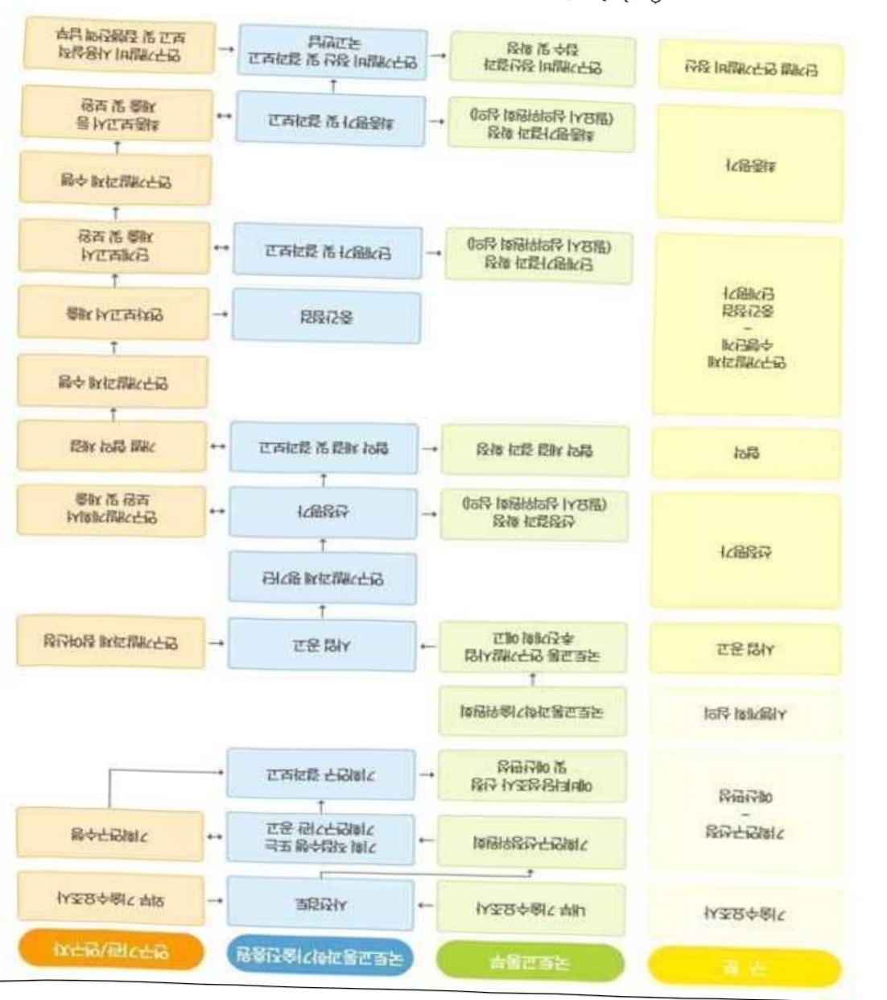

# 운전자페달오조작방지및평가기술개발(R&D)

**해당 페이지**: PDF 2413 ~ 2421 쪽 해당

**부처**: 국토교통부
**분야**: 교통 및 물류
**회계유형**: 일반회계
**2026 확정예산**: 2600.0 백만원
**전년대비 증감률**: None%
**AI 도메인**: 교통/모빌리티

---

<table border=1 style='margin: auto; word-wrap: break-word;'><tr><td style='text-align: center; word-wrap: break-word;'>사 업 명</td></tr><tr><td style='text-align: center; word-wrap: break-word;'>(10) 운전자 폐달 오조작방지 및 평가기술개발(R&amp;D) (4158-324)</td></tr></table>

## □ 사업 코드 정보

<table border=1 style='margin: auto; word-wrap: break-word;'><tr><td style='text-align: center; word-wrap: break-word;'>구분</td><td style='text-align: center; word-wrap: break-word;'>회계</td><td style='text-align: center; word-wrap: break-word;'>소관</td><td style='text-align: center; word-wrap: break-word;'>실국(기관)</td><td style='text-align: center; word-wrap: break-word;'>계정</td><td style='text-align: center; word-wrap: break-word;'>분야</td><td style='text-align: center; word-wrap: break-word;'>부문</td></tr><tr><td style='text-align: center; word-wrap: break-word;'>코드</td><td rowspan="2">일반회계</td><td rowspan="2">국토교통부</td><td style='text-align: center; word-wrap: break-word;'>모빌리티</td><td rowspan="2">-</td><td style='text-align: center; word-wrap: break-word;'>120</td><td style='text-align: center; word-wrap: break-word;'>126</td></tr><tr><td style='text-align: center; word-wrap: break-word;'>명칭</td><td style='text-align: center; word-wrap: break-word;'>자동차국</td><td style='text-align: center; word-wrap: break-word;'>교통및물류</td><td style='text-align: center; word-wrap: break-word;'>물류등기타</td></tr></table>

<table border=1 style='margin: auto; word-wrap: break-word;'><tr><td style='text-align: center; word-wrap: break-word;'>구분</td><td style='text-align: center; word-wrap: break-word;'>프로그램</td><td style='text-align: center; word-wrap: break-word;'>단위사업</td><td style='text-align: center; word-wrap: break-word;'>세부사업</td></tr><tr><td style='text-align: center; word-wrap: break-word;'>코드</td><td style='text-align: center; word-wrap: break-word;'>4100</td><td style='text-align: center; word-wrap: break-word;'>4158</td><td style='text-align: center; word-wrap: break-word;'>324</td></tr><tr><td style='text-align: center; word-wrap: break-word;'>명칭</td><td style='text-align: center; word-wrap: break-word;'>국토교통연구개발</td><td style='text-align: center; word-wrap: break-word;'>교통물류연구</td><td style='text-align: center; word-wrap: break-word;'>운전자폐달오조작방지및평가 기술개발(R&amp;D)</td></tr></table>

□ 사업 성격

<table border=1 style='margin: auto; word-wrap: break-word;'><tr><td rowspan="2">신규</td><td rowspan="2">계속</td><td rowspan="2">완료</td><td style='text-align: center; word-wrap: break-word;'>예비타당성</td><td style='text-align: center; word-wrap: break-word;'>총사업비</td><td style='text-align: center; word-wrap: break-word;'>총액계상</td><td style='text-align: center; word-wrap: break-word;'>사업소관 변경정보</td></tr><tr><td style='text-align: center; word-wrap: break-word;'>실시여부</td><td style='text-align: center; word-wrap: break-word;'>관리대상</td><td style='text-align: center; word-wrap: break-word;'>예산사업</td><td style='text-align: center; word-wrap: break-word;'>2025예산 시 소관</td></tr><tr><td style='text-align: center; word-wrap: break-word;'>○</td><td style='text-align: center; word-wrap: break-word;'></td><td style='text-align: center; word-wrap: break-word;'></td><td style='text-align: center; word-wrap: break-word;'></td><td style='text-align: center; word-wrap: break-word;'></td><td style='text-align: center; word-wrap: break-word;'></td><td style='text-align: center; word-wrap: break-word;'></td></tr></table>

□ 사업 지원 형태 및 지원율

<table border=1 style='margin: auto; word-wrap: break-word;'><tr><td style='text-align: center; word-wrap: break-word;'>직접</td><td style='text-align: center; word-wrap: break-word;'>출자</td><td style='text-align: center; word-wrap: break-word;'>출연</td><td style='text-align: center; word-wrap: break-word;'>보조</td><td style='text-align: center; word-wrap: break-word;'>융자</td><td style='text-align: center; word-wrap: break-word;'>국고보조율(%)</td><td style='text-align: center; word-wrap: break-word;'>융자율(%)</td></tr><tr><td style='text-align: center; word-wrap: break-word;'></td><td style='text-align: center; word-wrap: break-word;'></td><td style='text-align: center; word-wrap: break-word;'>○</td><td style='text-align: center; word-wrap: break-word;'></td><td style='text-align: center; word-wrap: break-word;'></td><td style='text-align: center; word-wrap: break-word;'></td><td style='text-align: center; word-wrap: break-word;'></td></tr></table>

□ 사업 담당자

<table border=1 style='margin: auto; word-wrap: break-word;'><tr><td style='text-align: center; word-wrap: break-word;'>사업명</td><td colspan="2">구분</td></tr><tr><td rowspan="2">운전자폐달 오조작방지및 평가기술개발 (R&amp;D)</td><td style='text-align: center; word-wrap: break-word;'>소관부처</td><td style='text-align: center; word-wrap: break-word;'>실·국·과(팀) 모빌리티자동차국 자동차정책과</td></tr><tr><td style='text-align: center; word-wrap: break-word;'>사업시행주체</td><td style='text-align: center; word-wrap: break-word;'>국토교통과학기술진흥원 교통실</td></tr></table>

---

### 가.예산 총괄표

(단위: 백만원, %)

<table border=1 style='margin: auto; word-wrap: break-word;'><tr><td rowspan="2">사업명</td><td rowspan="2">2024년 결산</td><td colspan="2">2025년 예산</td><td colspan="2">2026년</td><td rowspan="2">증감(B-A)</td><td rowspan="2">(B-A)/A</td></tr><tr><td style='text-align: center; word-wrap: break-word;'>본예산(A)</td><td style='text-align: center; word-wrap: break-word;'>추경</td><td style='text-align: center; word-wrap: break-word;'>정부안</td><td style='text-align: center; word-wrap: break-word;'>확정(B)</td></tr><tr><td style='text-align: center; word-wrap: break-word;'>운전자폐달 오조작방지및평가 기술개발(R&amp;D)</td><td style='text-align: center; word-wrap: break-word;'>-</td><td style='text-align: center; word-wrap: break-word;'>-</td><td style='text-align: center; word-wrap: break-word;'>-</td><td style='text-align: center; word-wrap: break-word;'>2,600</td><td style='text-align: center; word-wrap: break-word;'>2,600</td><td style='text-align: center; word-wrap: break-word;'>2,600</td><td style='text-align: center; word-wrap: break-word;'>순증</td></tr></table>

□ 기능별(내역사업별), 목별 예산 내역

(단위:백만원)

<table border=1 style='margin: auto; word-wrap: break-word;'><tr><td rowspan="3"></td><td colspan="5">2024</td><td colspan="7">2025(2025.12월말 기준)</td><td rowspan="3">2026예산</td></tr><tr><td rowspan="2">예산액(추경)</td><td rowspan="2">예산현액</td><td rowspan="2">집행액[실집행액]</td><td rowspan="2">이월액</td><td rowspan="2">불용액</td><td rowspan="2">본예산</td><td rowspan="2">예산현액</td><td rowspan="2">집행액[실집행액]</td><td colspan="2">전년도 이월액제외</td><td rowspan="2">이월예상액</td><td rowspan="2">불용예상액</td></tr><tr><td style='text-align: center; word-wrap: break-word;'>예산현액</td><td style='text-align: center; word-wrap: break-word;'>집행액[실집행액]</td></tr><tr><td style='text-align: center; word-wrap: break-word;'>○ 기능별 분류(합계)</td><td style='text-align: center; word-wrap: break-word;'>-</td><td style='text-align: center; word-wrap: break-word;'>-</td><td style='text-align: center; word-wrap: break-word;'>-</td><td style='text-align: center; word-wrap: break-word;'>-</td><td style='text-align: center; word-wrap: break-word;'>-</td><td style='text-align: center; word-wrap: break-word;'>-</td><td style='text-align: center; word-wrap: break-word;'>-</td><td style='text-align: center; word-wrap: break-word;'>-</td><td style='text-align: center; word-wrap: break-word;'>-</td><td style='text-align: center; word-wrap: break-word;'>-</td><td style='text-align: center; word-wrap: break-word;'>-</td><td style='text-align: center; word-wrap: break-word;'>-</td><td style='text-align: center; word-wrap: break-word;'>2,600</td></tr><tr><td style='text-align: center; word-wrap: break-word;'>· 운전자 폐달 오조작 방지 및 평가기술 개발</td><td style='text-align: center; word-wrap: break-word;'>-</td><td style='text-align: center; word-wrap: break-word;'>-</td><td style='text-align: center; word-wrap: break-word;'>-</td><td style='text-align: center; word-wrap: break-word;'>-</td><td style='text-align: center; word-wrap: break-word;'>-</td><td style='text-align: center; word-wrap: break-word;'>-</td><td style='text-align: center; word-wrap: break-word;'>-</td><td style='text-align: center; word-wrap: break-word;'>-</td><td style='text-align: center; word-wrap: break-word;'>-</td><td style='text-align: center; word-wrap: break-word;'>-</td><td style='text-align: center; word-wrap: break-word;'>-</td><td style='text-align: center; word-wrap: break-word;'>-</td><td style='text-align: center; word-wrap: break-word;'>2,600</td></tr><tr><td style='text-align: center; word-wrap: break-word;'>○ 비목별 분류(합계)</td><td style='text-align: center; word-wrap: break-word;'>-</td><td style='text-align: center; word-wrap: break-word;'>-</td><td style='text-align: center; word-wrap: break-word;'>-</td><td style='text-align: center; word-wrap: break-word;'>-</td><td style='text-align: center; word-wrap: break-word;'>-</td><td style='text-align: center; word-wrap: break-word;'>-</td><td style='text-align: center; word-wrap: break-word;'>-</td><td style='text-align: center; word-wrap: break-word;'>-</td><td style='text-align: center; word-wrap: break-word;'>-</td><td style='text-align: center; word-wrap: break-word;'>-</td><td style='text-align: center; word-wrap: break-word;'>-</td><td style='text-align: center; word-wrap: break-word;'>-</td><td style='text-align: center; word-wrap: break-word;'>2,600</td></tr><tr><td style='text-align: center; word-wrap: break-word;'>· 연 구 활 동 비 등 (360-05)</td><td style='text-align: center; word-wrap: break-word;'>-</td><td style='text-align: center; word-wrap: break-word;'>-</td><td style='text-align: center; word-wrap: break-word;'>-</td><td style='text-align: center; word-wrap: break-word;'>-</td><td style='text-align: center; word-wrap: break-word;'>-</td><td style='text-align: center; word-wrap: break-word;'>-</td><td style='text-align: center; word-wrap: break-word;'>-</td><td style='text-align: center; word-wrap: break-word;'>-</td><td style='text-align: center; word-wrap: break-word;'>-</td><td style='text-align: center; word-wrap: break-word;'>-</td><td style='text-align: center; word-wrap: break-word;'>-</td><td style='text-align: center; word-wrap: break-word;'>-</td><td style='text-align: center; word-wrap: break-word;'>2,600</td></tr><tr><td style='text-align: center; word-wrap: break-word;'>○ 기능·비목별 분류 (합계)</td><td style='text-align: center; word-wrap: break-word;'>-</td><td style='text-align: center; word-wrap: break-word;'>-</td><td style='text-align: center; word-wrap: break-word;'>-</td><td style='text-align: center; word-wrap: break-word;'>-</td><td style='text-align: center; word-wrap: break-word;'>-</td><td style='text-align: center; word-wrap: break-word;'>-</td><td style='text-align: center; word-wrap: break-word;'>-</td><td style='text-align: center; word-wrap: break-word;'>-</td><td style='text-align: center; word-wrap: break-word;'>-</td><td style='text-align: center; word-wrap: break-word;'>-</td><td style='text-align: center; word-wrap: break-word;'>-</td><td style='text-align: center; word-wrap: break-word;'>-</td><td style='text-align: center; word-wrap: break-word;'>2,600</td></tr><tr><td style='text-align: center; word-wrap: break-word;'>· 운전자 폐달 오조작 방지 및 평가기술 개발</td><td style='text-align: center; word-wrap: break-word;'>-</td><td style='text-align: center; word-wrap: break-word;'>-</td><td style='text-align: center; word-wrap: break-word;'>-</td><td style='text-align: center; word-wrap: break-word;'>-</td><td style='text-align: center; word-wrap: break-word;'>-</td><td style='text-align: center; word-wrap: break-word;'>-</td><td style='text-align: center; word-wrap: break-word;'>-</td><td style='text-align: center; word-wrap: break-word;'>-</td><td style='text-align: center; word-wrap: break-word;'>-</td><td style='text-align: center; word-wrap: break-word;'>-</td><td style='text-align: center; word-wrap: break-word;'>-</td><td style='text-align: center; word-wrap: break-word;'>-</td><td style='text-align: center; word-wrap: break-word;'>2,600</td></tr><tr><td style='text-align: center; word-wrap: break-word;'>· 연 구 활 동 비 등 (360-05)</td><td style='text-align: center; word-wrap: break-word;'>-</td><td style='text-align: center; word-wrap: break-word;'>-</td><td style='text-align: center; word-wrap: break-word;'>-</td><td style='text-align: center; word-wrap: break-word;'>-</td><td style='text-align: center; word-wrap: break-word;'>-</td><td style='text-align: center; word-wrap: break-word;'>-</td><td style='text-align: center; word-wrap: break-word;'>-</td><td style='text-align: center; word-wrap: break-word;'>-</td><td style='text-align: center; word-wrap: break-word;'>-</td><td style='text-align: center; word-wrap: break-word;'>-</td><td style='text-align: center; word-wrap: break-word;'>-</td><td style='text-align: center; word-wrap: break-word;'>-</td><td style='text-align: center; word-wrap: break-word;'>2,600</td></tr></table>

---

### 나. 사업설명자료

## 1 ) 사업목적·내용

- (운전자 폐달 오조작 방지 및 평가 기술개발) 운전자의 폐달 오조작으로 인한 교통사고 예방을 위해 폐달 오조작 판단·방지 평가 기술, 안전성 평가기술, 안전기준 제도화 방안을 개발하여 국민의 생명과 재산 보호

## 2 ) 사업개요

## □ 사업근거 및 추진경위

① 법령상 근거 및 조항 적시

- 국토교통과학기술육성법 제8조(연구개발사업의 추진) ① 국토교통부장관은 종합계획을 효율적으로 추진하기 위하여 국토교통과학기술 연구개발사업(이하 “연구개발사업” 이라 한다)을 할 수 있다.

- 국가통합교통체계효율화법 제98조(교통기술 연구·개발사업의 추진) ① 국토교통부 장관은 교통기술의 연구·개발을 효율적으로 추진하기 위하여 연도별·분야별 교통기술 연구·개발과제를 선정하여 다음 각 호의 기관 또는 단체 등과 협약을 맺어 교통기술 연구·개발사업을 하게 할 수 있다.

- 자동차관리법 제29조의2(안전기준 관련 연구·개발 등) ① 국토교통부장관은 제29조제1항 및 제2항에 따른 자동차안전기준, 부품안전기준, 제35조의5제1항에 따른 내압용기 안전기준 또는 안전 관련 기술의 연구·개발 및 데이터베이스 구축·운영이 필요한 경우에는 제32조제3항에 따라 성능시험을 대행하는 자로 지정된 자(이하 “성능시험 대행자”라 한다)에게 이를 수행하게 할 수 있다. 이 경우 국토교통부장관은 예산의 범위에서 연구·개발 및 데이터베이스 구축·운영에 드는 비용을 지원하여야 한다.

- 자동차관리법 제31조의3(자동차 사고조사) ① 성능시험대행자는 화재 등 국토교통부령으로 정하는 자동차사고가 제31조제1항에 따른 결함으로 인하여 발생한 것으로 의심되는 경우에는 사고의 원인을 규명하기 위한 조사(이하 “사고조사”라 한다)를 할 수 있다. 이 경우 국토교통부장관은 사고조사에 필요한 시설, 장비 및 조사에 드는 비용을 지원하여야 한다.

- 자동차관리법 제68조의5(국제조화 관련 연구·개발 등) ① 국토교통부장관은 자동차안전기준 등의 국제조화를 위하여 다음 각 호의 사업을 추진할 수 있다.

---

1. 자동차안전기준 등의 국제조화를 위한 기술의 연구·개발 및 이전·보급

2. 자동차안전기준 등의 국제조화와 관련된 국내 자동차안전기준의 제정 · 개정

3. 자동차안전기준 등의 국제조화를 위한 국제 협력 및 교류

4. 자동차안전기준 등의 국제조화를 위한 중소기업 등의 기술경쟁력 강화 지원

② 국토교통부장관은 다음 각 호의 자에게 제1항의 사업을 추진하게 할 수 있다. 이 경우 국토교통부장관은 예산의 범위에서 연구 · 개발에 드는 비용을 지원하여야 한다.

- 재난 및 안전관리 기본법 제4조(국가 등의 책무) ① 국가와 지방자치단체는 재난이나 그 밖의 각종 사고로부터 국민의 생명 · 신체 및 재산을 보호할 책무를 지고, 재난이나 그 밖의 각종 사고를 예방하고 피해를 줄이기 위하여 노력하여야 하며, 발생한 피해를 신속히 대응 · 복구하여 일상으로 회복할 수 있도록 지원하기 위한 계획을 수립 · 시행하여야 한다.

② 추진경위

- (23.10.~현재) 폐달 오조작 방지 관련 국제자동차 안전기준 논의 기술분과 10회 참여(UN ECE WP.29 GRVA Informal Working Group)

* 기준(안) 문제점 제시 및 주행 중 폐달 오조작 방지 기준 필요성 제안

- (23.10.) 일본 정부기관(국토교통성, NASVA, JARI) 및 제작사(토요타) 방문, 운전자 폐달 오조작 방지 평가제도 및 기술개발 현황 등 조사

-(23.12.) '운전자 폐달 오조작 방지 및 평가기술 개발' 기획 착수

* 주관연구개발기관 : 한국교통안전공단, 연구기간 : '23.12.~'24.08.(8개월)

- (신정부 공약) [B-1-3-10] 대한민국을 교통안전 선진국으로 만들겠습니다

→ 고령운전자 폐달 오조작 방지장치 구매 시 지원 확대 등 고령운전자 안전 대책 마련

□주요내용

① 사업규모

- 총사업비 : 해당없음

- 사업기간 : '26 ~ '29

-최근 5년 간 투입된 사업비(예산액기준, 추경편성한 연도에는 추경포함)

<table border=1 style='margin: auto; word-wrap: break-word;'><tr><td style='text-align: center; word-wrap: break-word;'>연도</td><td style='text-align: center; word-wrap: break-word;'>2022</td><td style='text-align: center; word-wrap: break-word;'>2023</td><td style='text-align: center; word-wrap: break-word;'>2024</td><td style='text-align: center; word-wrap: break-word;'>2025</td><td style='text-align: center; word-wrap: break-word;'>2026</td></tr><tr><td style='text-align: center; word-wrap: break-word;'>사업비</td><td style='text-align: center; word-wrap: break-word;'>-</td><td style='text-align: center; word-wrap: break-word;'>-</td><td style='text-align: center; word-wrap: break-word;'>-</td><td style='text-align: center; word-wrap: break-word;'>-</td><td style='text-align: center; word-wrap: break-word;'>2,600</td></tr></table>

-기타: 해당없음

---

## ② 사업추진체계

- 사업시행방법 : 출연(참여기업이 있는 경우 Matching)

- 사업시행주체 : 국토교통부(전문기관 : 국토교통과학기술진흥원)

- 사업 수혜자 : 대학, 기업, 출연연 등

- 보조, 융자, 출연, 출자 등의 경우 보조·융자 등 지원 비율 및 법적근거

<table border=1 style='margin: auto; word-wrap: break-word;'><tr><td style='text-align: center; word-wrap: break-word;'>내역사업명</td><td style='text-align: center; word-wrap: break-word;'>구분</td><td style='text-align: center; word-wrap: break-word;'>피보조·피출연 등 기관명</td><td style='text-align: center; word-wrap: break-word;'>지원 금액 (2026예산)</td><td style='text-align: center; word-wrap: break-word;'>지원 비율(%)</td><td style='text-align: center; word-wrap: break-word;'>보조율 법적근거 (해당 조항)</td></tr><tr><td rowspan="3">운전자 폐달 오조작 방지 및 평가 기술개발</td><td rowspan="3">출연</td><td style='text-align: center; word-wrap: break-word;'>「중소기업기본법」제2조에 따른 중소기업에 해당하는 연구개발기관</td><td rowspan="3">2,600 백만원</td><td style='text-align: center; word-wrap: break-word;'>연구개발 비의 100분의 75 이하</td><td rowspan="3">「국가연구개발 혁신법 시행령」 제19조</td></tr><tr><td style='text-align: center; word-wrap: break-word;'>「중견기업 성장촉진 및 경쟁력 강화에 관한 특별법」제2조제1호에 따른 중견기업에 해당하는 연구개발기관</td><td style='text-align: center; word-wrap: break-word;'>연구개발 비의 100분의 70 이하</td></tr><tr><td style='text-align: center; word-wrap: break-word;'>「공공기관의 운영에 관한 법률」제5조제4항제1호에 따른 공기업에 해당하거나 ‘가’, ‘나’에 해당 해당하지 않는 연구개발기관</td><td style='text-align: center; word-wrap: break-word;'>연구개발 비의 100분의 50 이하</td></tr></table>

* 다만, 중앙행정기관의 장이 필요하다고 인정하는 국가연구개발사업에 대하여 별도로 정할 수 있음

## 3 ) 2026년도 예산 산출 근거

① 운전자 폐달 오조작 방지 및 평가 기술개발

:(25)0→(26)2,600백만원,2,600백만원 증액

- 눈선사 페날 오소식 사고 빛 상황 분류세계 연구, 페날 오조작 사고 방지 평가 기술 개발, 페달 오조작 사고 방지 기술의 제도화 방안 연구 등 사업 착수를 위한 예산 2,600백만원 소요

- (산출) ① 폐달 오조작 사고 운전행동·차량반응 분석 및 가상환경 기반 운전자 행태 분석 시스템 구축 1,300백만원

② 사고 예방 인지 및 제어 기술 분석 및 실수요자 요구사항 평가기술 반영 연구 600백만원

③ 실자 기반 평가환경 설계 및 구축 기반, 평가로봇 설계·시작품 개발 및 기술 고도화 연구 700백만원

·(신규) 1개 × 3,467백만원 × 9/12 = 2,600백만원

ㅇ 2025년도 예산 및 2026년도 예산 산출 세부내역 비교

<table border=1 style='margin: auto; word-wrap: break-word;'><tr><td colspan="2">&#x27;25년 예산</td><td colspan="2">&#x27;26년 예산</td></tr><tr><td style='text-align: center; word-wrap: break-word;'>예산</td><td style='text-align: center; word-wrap: break-word;'>산출내역</td><td style='text-align: center; word-wrap: break-word;'>예산</td><td style='text-align: center; word-wrap: break-word;'>산출내역</td></tr><tr><td style='text-align: center; word-wrap: break-word;'>-</td><td style='text-align: center; word-wrap: break-word;'>-</td><td style='text-align: center; word-wrap: break-word;'>2,600 백만원</td><td style='text-align: center; word-wrap: break-word;'>○ 연구활동비 등(360-05): 2,600백만원 가. 폐달 오조작 사고 운전행동·차량반응 분석 및 가상환경 기반 운전자 행태 분석 시스템 구축 1,300백만원 나. 사고 예방 인지 및 제어 기술 분석 및 실수요자 요구사항 평가기술 반영 연구 600백만원 다. 실차 기반 평가환경 설계 및 구축 기반, 평가로봇 설계·시작품 개발 및 기술 고도화 연구 700백만원</td></tr></table>

---

## 4 ) 사업효과

☐ 사업영향, 산출물 성과지표 등

① 2022~2026년도 성과계획서 상 성과지표 및 최근 5년간 성과 달성도 : 해당없음 (26년 신규)

② 성과지표 이외의 연도별 사업추진 경과 및 실적: 해당없음('26년 신규)

③ 향후(2026년도 이후) 기대효과

- 폐달 오조작으로 인한 교통사고 50% 이상 저감

- 신규 제작차 폐달 오조작 방지장치 장착을 90% 이상

- 검증된 평가체계를 통해 시스템 신뢰도 98% 이상 확보

5) 타당성조사 및 예비타당성조사 시행여부 및 결과 요지 : 해당없음

6) 총사업비 대상사업 여부 및 내역 : 해당없음

---

<table border=1 style='margin: auto; word-wrap: break-word;'><tr><td style='text-align: center; word-wrap: break-word;'>부처</td><td style='text-align: center; word-wrap: break-word;'></td><td style='text-align: center; word-wrap: break-word;'>피출연·피보조기관</td><td style='text-align: center; word-wrap: break-word;'></td><td style='text-align: center; word-wrap: break-word;'>간접보조사업자·사업수행자</td></tr><tr><td style='text-align: center; word-wrap: break-word;'>국토교통부(2,600백만원)</td><td style='text-align: center; word-wrap: break-word;'>=&gt;(2,600백만원)</td><td style='text-align: center; word-wrap: break-word;'>국토교통과학기술진흥원(2,600백만원)</td><td style='text-align: center; word-wrap: break-word;'>=&gt;(2,600백만원)</td><td style='text-align: center; word-wrap: break-word;'>미정</td></tr></table>

<운전자 폐달 오조작 방지 및 평가 기술개발>

---

## 8 ) 중기재정계획 상 연도별 투자계획 및 추진경과

(단위: 백만원)

<table border=1 style='margin: auto; word-wrap: break-word;'><tr><td style='text-align: center; word-wrap: break-word;'>$ 중기 $ 재정계획</td><td style='text-align: center; word-wrap: break-word;'>2024</td><td style='text-align: center; word-wrap: break-word;'>2025</td><td style='text-align: center; word-wrap: break-word;'>2026</td><td style='text-align: center; word-wrap: break-word;'>2027</td><td style='text-align: center; word-wrap: break-word;'>2028</td><td style='text-align: center; word-wrap: break-word;'>2029</td></tr><tr><td style='text-align: center; word-wrap: break-word;'>2024~2028</td><td style='text-align: center; word-wrap: break-word;'>-</td><td style='text-align: center; word-wrap: break-word;'>-</td><td style='text-align: center; word-wrap: break-word;'>7,000</td><td style='text-align: center; word-wrap: break-word;'>6,000</td><td style='text-align: center; word-wrap: break-word;'>5,500</td><td style='text-align: center; word-wrap: break-word;'>☑</td></tr><tr><td style='text-align: center; word-wrap: break-word;'>2025~2029</td><td style='text-align: center; word-wrap: break-word;'>☑</td><td style='text-align: center; word-wrap: break-word;'>-</td><td style='text-align: center; word-wrap: break-word;'>2,600</td><td style='text-align: center; word-wrap: break-word;'>7,000</td><td style='text-align: center; word-wrap: break-word;'>6,000</td><td style='text-align: center; word-wrap: break-word;'>4,000</td></tr></table>

## 9 ) 최근 3년간 동 사업에 대한 주요 외부지적사항 및 평가, 문제점 및 대책

<table border=1 style='margin: auto; word-wrap: break-word;'><tr><td style='text-align: center; word-wrap: break-word;'>1) 국토위 부대의견 (‘24.10) - (지적) 자동차 가속폐달 오조작 방지기술 연구 적기에 시작하여, 국민 교통안전 보장해야? - (조치) 폐달오조작방지장치 국제기준 마련 시(‘25.6 예정) 국내 도입하고, 도입 이전에도 신차안전도평가(‘25년)를 통해 민간 기술 개발 유도 계획. 아울러, 폐달오조작방지장치 고도화가 필요하므로 ‘25년에 연구개발 예산 반영을 위해 노력하고, 민간의 기술 개발도 유도하겠음 4) 언론 (‘24.08) - (제기/연합뉴스) 검찰 ‘시청역 역주행 사고’ 운전자 구속기소...“가속폐달 오조작” - (검토결과 및 조치내용) 고령 운전자의 폐달 오조작으로 인한 인명피해 발생을 예방하기 위한 폐달 오조작 방지 기술 및 이에 대한 안전성 평가 기술 개발을 위한 연구개발 사업을 ‘25년 예산 반영 목표</td></tr></table>

## 10 ) 향후 추진방향 및 추진계획

<table border=1 style='margin: auto; word-wrap: break-word;'><tr><td style='text-align: center; word-wrap: break-word;'>☐ 폐달 오조작으로 인한 사고 예방을 위하여 폐달 오조작 판단·방지 기술, 안전성 평가기술 및 안전기준 제도 개발을 통한 폐달 오조작 관련 교통사고 사상자 감소</td></tr><tr><td style='text-align: center; word-wrap: break-word;'>○ (중점1) 폐달 오조작 정의 및 상황 분류체계 연구</td></tr><tr><td style='text-align: center; word-wrap: break-word;'>○ (중점2) 폐달 오조작 사고 방지 평가기술 실증</td></tr><tr><td style='text-align: center; word-wrap: break-word;'>○ (중점3) 폐달 오조작 사고 방지 기술 제도화 방안 연구</td></tr></table>

---

11) 해당사업에 대한 각종 사업평가의 결과 : 해당없음

12) 해당사업에 대한 부처 자체평가의 결과 : 해당없음

13) 부처 건의사항 : 해당없음

---

### 원본 PDF 크롭 이미지

